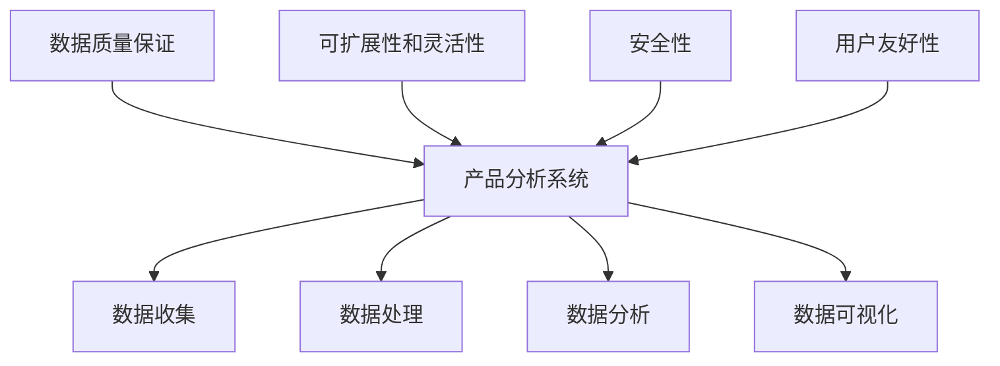
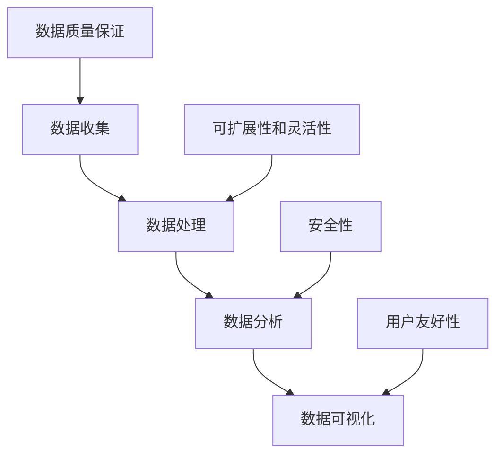
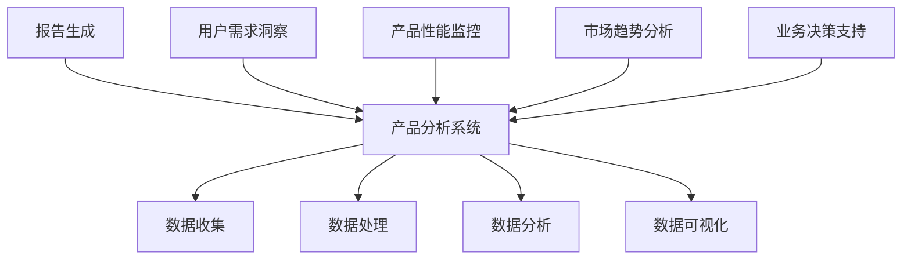
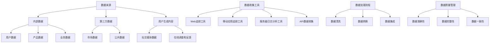
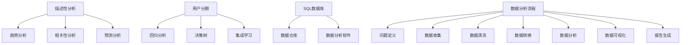
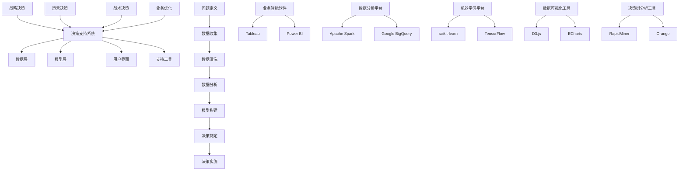
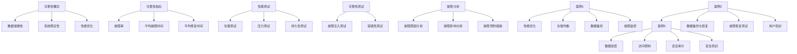
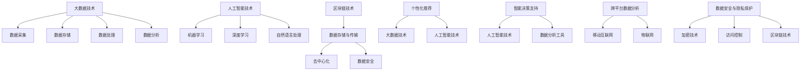

                 

### 第1章：产品分析系统的重要性

#### 1.1 引言

产品分析系统，是一种利用数据分析技术，帮助企业或团队深入了解产品性能、用户行为和市场趋势的系统。它通过收集、处理、分析和可视化产品相关数据，提供决策支持，帮助企业和团队做出更明智的决策。

在当今竞争激烈的市场环境中，产品分析系统已经成为企业成功的关键。它不仅帮助团队了解用户需求，优化产品功能，提升用户体验，还能为企业的战略决策提供数据支持。

首先，让我们定义一下产品分析系统的核心概念。

- **产品分析系统**：是指通过数据收集、处理、分析和可视化等一系列方法，帮助企业和团队深入了解用户行为、产品性能以及市场趋势，从而做出更明智的决策。
- **数据分析**：是指对大量数据进行收集、处理、分析和解释的过程，以获得有价值的信息和洞察。
- **用户行为**：是指用户在使用产品过程中的行为和交互，如点击、浏览、购买、评论等。
- **市场趋势**：是指市场上相关产品的销售、用户需求、竞争情况等方面的变化趋势。

接下来，我们将探讨产品分析系统在企业中扮演的角色。

#### 1.2 产品分析系统在企业中的角色

产品分析系统在企业中扮演着多种角色，具体如下：

1. **用户需求洞察**：通过分析用户行为数据，了解用户的需求和偏好，发现潜在的市场机会。这有助于企业优化产品功能，提高用户满意度，从而提升产品的市场竞争力。

2. **产品性能监控**：通过实时监控产品性能指标，如用户活跃度、留存率、转化率等，及时发现并解决产品问题，确保产品稳定运行。

3. **市场趋势分析**：通过分析市场数据，了解行业动态，把握市场机遇，为企业的战略决策提供数据支持。

4. **业务决策支持**：通过数据分析和模型预测，为企业的业务决策提供依据，如产品定价、市场推广策略等。

5. **跨部门协作**：产品分析系统可以整合各部门的数据，提供统一的数据视图，促进跨部门协作，提高企业的整体效率。

#### 1.3 产品分析系统的核心组成部分

产品分析系统由多个核心组成部分构成，包括数据收集、数据处理、数据分析、数据可视化等。以下是这些组成部分的简要概述：

1. **数据收集**：数据收集是产品分析系统的第一步，主要任务是从各种数据源（如网站、移动应用、数据库等）中收集数据。数据收集的方法包括日志收集、API 调用、Web 跟踪等。

2. **数据处理**：数据处理是对收集到的原始数据进行清洗、转换、集成等操作，以生成可用于分析的数据。数据处理包括数据清洗、数据转换和数据集成等步骤。

3. **数据分析**：数据分析是产品分析系统的核心，通过对处理后的数据进行分析，提取有价值的信息和洞察。数据分析的方法包括描述性分析、趋势分析、相关性分析、预测分析等。

4. **数据可视化**：数据可视化是将分析结果以图表、仪表板等形式展示出来，便于用户理解和决策。数据可视化工具包括 Tableau、Power BI、Matplotlib 等。

#### 1.4 产品分析系统的构建原则

为了确保产品分析系统的可靠性和有效性，构建时应遵循以下原则：

1. **数据质量保证**：数据质量是产品分析系统的基石，必须确保数据的准确性、完整性和一致性。

2. **可扩展性和灵活性**：产品分析系统应具备良好的扩展性和灵活性，能够适应业务需求的变化。

3. **安全性**：保护用户数据的安全性和隐私，确保系统不会受到恶意攻击或数据泄露。

4. **用户友好性**：界面简洁易用，操作直观，降低用户的学习成本。

#### 1.5 小结

在本章中，我们介绍了产品分析系统的定义、重要性以及核心组成部分和构建原则。下一章，我们将深入探讨数据收集方法和技术，帮助读者了解如何有效地收集和分析产品数据。

---



---

### 第2章：数据收集方法与技术

#### 2.1 数据来源

数据收集的第一步是确定数据来源。数据来源可以分为内部数据、第三方数据和用户生成内容。

1. **内部数据**：内部数据来源于企业自身的业务系统，包括用户注册信息、订单数据、客户反馈等。这些数据是产品分析的重要基础。

2. **第三方数据**：第三方数据来源于公共数据源，如社交媒体、公共数据库等。这些数据可以提供市场趋势、行业动态等信息，有助于企业了解外部环境。

3. **用户生成内容**：用户生成内容是指用户在使用产品过程中产生的数据，如评论、评分、问答等。这些数据反映了用户对产品的真实感受和需求，对产品优化具有重要意义。

#### 2.2 数据收集工具

为了有效地收集数据，企业可以采用多种数据收集工具。

1. **Web追踪工具**：Web追踪工具如Google Analytics，可以收集网站用户的访问行为数据，包括页面浏览量、用户停留时间、跳出率等。

2. **移动应用追踪工具**：移动应用追踪工具如App Annie，可以收集移动应用的用户行为数据，包括下载量、活跃用户数、用户留存率等。

3. **服务器日志分析工具**：服务器日志分析工具如ELK（Elasticsearch、Logstash、Kibana），可以收集和分析服务器日志数据，包括用户访问日志、错误日志等。

#### 2.3 数据处理流程

数据处理流程包括数据清洗、数据转换和数据集成。

1. **数据清洗**：数据清洗是指去除无效数据、重复数据和异常值，确保数据的质量。具体步骤包括：

   - 去除重复记录：通过去重算法，删除重复的数据记录。
   - 填补缺失值：使用插补算法或替代值，填补缺失的数据。
   - 标准化处理：对数据进行统一格式和编码，如将日期格式统一为YYYY-MM-DD。

2. **数据转换**：数据转换是指将不同格式、不同结构的数据转换为统一的格式，以便后续处理。具体步骤包括：

   - 数据格式转换：如将文本数据转换为数字数据。
   - 数据类型转换：如将字符串转换为日期类型。
   - 数据规范化：如将不同的度量单位转换为统一的单位。

3. **数据集成**：数据集成是指将来自不同数据源的数据进行整合，构建一个统一的数据仓库。具体步骤包括：

   - 数据合并：将相同字段的数据进行合并。
   - 数据融合：将不同字段的数据进行融合，生成新的数据表。
   - 数据存储：将处理后的数据存储到数据库或数据仓库中，以便后续分析。

#### 2.4 数据质量管理

数据质量管理是确保数据准确性、完整性和一致性的关键。以下是一些数据质量管理的方法：

1. **数据准确性**：确保数据的真实性和可信度。具体方法包括：

   - 数据验证：对数据进行校验，确保数据符合预期。
   - 数据审计：定期对数据质量进行检查，发现并修复问题。
   - 数据监控：实时监控数据质量，及时发现和处理异常。

2. **数据完整性**：确保数据的齐全性和完整性。具体方法包括：

   - 数据校验：检查数据是否完整，是否有缺失。
   - 数据备份：定期备份数据，防止数据丢失。
   - 数据恢复：在数据丢失或损坏时，能够迅速恢复。

3. **数据一致性**：确保数据在不同系统和不同时间点的一致性。具体方法包括：

   - 数据同步：保证数据在不同系统间的实时更新。
   - 数据校准：对数据进行校准，确保数据的一致性。
   - 数据规范：制定统一的数据标准和规范，确保数据的一致性。

---

**核心概念与联系**

在构建产品分析系统时，数据收集、数据处理、数据分析和数据可视化等多个环节紧密相连。以下是这些环节的 Mermaid 流程图：



---

在下一章，我们将深入探讨数据分析的基础，包括描述性分析、趋势分析、相关性分析和预测分析等方法。这些方法将帮助我们更好地理解和利用产品数据，为企业决策提供有力支持。

### 第3章：数据分析基础

#### 3.1 数据分析方法

数据分析是产品分析系统的核心环节，通过对大量数据进行分析，可以提取有价值的信息和洞察。数据分析方法可以分为描述性分析、趋势分析、相关性分析和预测分析等。

1. **描述性分析**：描述性分析是对数据的基本特征进行统计和分析，如平均值、中位数、标准差等。描述性分析可以帮助我们了解数据的分布情况、集中趋势和离散程度。

2. **趋势分析**：趋势分析是通过分析数据随时间的变化趋势，预测未来的发展趋势。趋势分析可以帮助企业了解市场趋势、用户行为变化等，为产品优化和战略决策提供依据。

3. **相关性分析**：相关性分析是通过分析两个或多个变量之间的关系，找出数据间的相关性。相关性分析可以帮助我们了解变量之间的相互作用，为数据挖掘和预测提供基础。

4. **预测分析**：预测分析是通过历史数据和统计分析方法，预测未来的数据趋势和结果。预测分析可以帮助企业预测用户需求、市场趋势等，为业务决策提供支持。

#### 3.2 常见数据分析技术

在数据分析过程中，常用的技术包括用户分群、回归分析、决策树和集成学习等。

1. **用户分群**：用户分群是将用户按照一定的标准划分为不同的群体，以便进行有针对性的分析和营销。用户分群的方法包括基于行为的分群、基于人口统计的分群和基于兴趣的分群等。

2. **回归分析**：回归分析是一种统计分析方法，用于分析自变量和因变量之间的关系。回归分析可以帮助我们了解变量之间的定量关系，预测因变量的变化。

3. **决策树**：决策树是一种树形结构，用于展示决策过程中各种可能的选择和结果。决策树可以帮助我们分析决策路径，找出最佳决策策略。

4. **集成学习**：集成学习是将多个学习算法结合起来，提高模型的预测准确性和泛化能力。集成学习的方法包括Bagging、Boosting和Stacking等。

#### 3.3 数据分析工具与平台

在数据分析过程中，常用的工具和平台包括SQL数据库、数据仓库和数据分析软件等。

1. **SQL数据库**：SQL数据库是一种关系型数据库，用于存储、查询和管理结构化数据。SQL数据库可以执行各种数据操作，如插入、更新、删除和查询等。

2. **数据仓库**：数据仓库是一种大规模的数据存储系统，用于存储和管理企业内部和外部的数据。数据仓库可以支持复杂的数据分析和报表生成，为企业的业务决策提供支持。

3. **数据分析软件**：数据分析软件是一种用于数据可视化和报表生成的软件。数据分析软件可以提供各种数据可视化工具和报表模板，帮助用户快速生成分析报告。

#### 3.4 数据分析流程

数据分析流程通常包括以下步骤：

1. **问题定义**：明确分析的目标和问题，确定需要分析的数据类型和分析方法。

2. **数据收集**：收集相关的数据，包括内部数据和第三方数据。

3. **数据清洗**：对收集到的数据进行清洗，去除无效数据、重复数据和异常值。

4. **数据转换**：将清洗后的数据转换为适合分析的形式，如将文本数据转换为数字数据。

5. **数据分析**：运用各种数据分析方法，提取有价值的信息和洞察。

6. **数据可视化**：将分析结果以图表、仪表板等形式展示出来，便于用户理解和决策。

7. **报告生成**：根据分析结果，生成分析报告，为企业的业务决策提供支持。

---

**核心算法原理讲解**

在本节中，我们将详细讲解用户分群算法、回归分析和决策树算法的核心原理，并通过伪代码进行说明。

1. **用户分群算法**

用户分群算法是将用户按照一定的标准划分为不同的群体，以便进行有针对性的分析和营销。常见的分群标准包括用户行为、人口统计和兴趣等。

伪代码：

```python
def user_clustering(data, clustering_algorithm):
    # 输入：data（用户数据），clustering_algorithm（分群算法）
    # 输出：clusters（用户分群结果）
    
    # 数据预处理
    preprocessed_data = preprocess_data(data)
    
    # 运行分群算法
    clusters = clustering_algorithm(preprocessed_data)
    
    # 返回分群结果
    return clusters

# 示例：基于K-means算法的用户分群
def kmeans_clustering(data, num_clusters):
    # 输入：data（用户数据），num_clusters（分群数量）
    # 输出：clusters（用户分群结果）
    
    # 初始化聚类中心
    centroids = initialize_centroids(data, num_clusters)
    
    # 迭代计算聚类中心
    while not converged:
        # 计算每个用户的聚类中心
        assignments = assign_clusters(data, centroids)
        
        # 更新聚类中心
        centroids = update_centroids(assignments, centroids)
        
        # 判断是否收敛
        converged = check_convergence(centroids)
    
    # 返回分群结果
    return assignments
```

2. **回归分析算法**

回归分析算法用于分析自变量和因变量之间的关系。常见的回归分析方法包括线性回归、多项式回归和逻辑回归等。

伪代码：

```python
def regression_analysis(data, regression_algorithm):
    # 输入：data（数据集），regression_algorithm（回归算法）
    # 输出：model（回归模型）
    
    # 数据预处理
    preprocessed_data = preprocess_data(data)
    
    # 运行回归算法
    model = regression_algorithm(preprocessed_data)
    
    # 返回回归模型
    return model

# 示例：线性回归
def linear_regression(data):
    # 输入：data（数据集）
    # 输出：model（线性回归模型）
    
    # 计算斜率和截距
    slope, intercept = compute_slope_and_intercept(data)
    
    # 返回线性回归模型
    return LinearRegression(slope, intercept)
```

3. **决策树算法**

决策树算法是一种树形结构，用于展示决策过程中各种可能的选择和结果。决策树算法的核心是划分数据集，选择最优划分标准。

伪代码：

```python
def decision_tree(data, target_attribute):
    # 输入：data（数据集），target_attribute（目标属性）
    # 输出：tree（决策树）
    
    # 判断是否达到终止条件
    if should_terminate(data, target_attribute):
        # 终止条件：数据集中所有记录属于同一类别
        return create_leaf_node(data, target_attribute)
    
    # 找到最优划分标准
    best_attribute, best_value = find_best_split(data, target_attribute)
    
    # 创建分支节点
    node = create_node(best_attribute, best_value)
    
    # 划分数据集
    left_data, right_data = split_data(data, best_attribute, best_value)
    
    # 递归构建左子树和右子树
    node.left = decision_tree(left_data, target_attribute)
    node.right = decision_tree(right_data, target_attribute)
    
    # 返回决策树
    return node
```

---

在下一章，我们将探讨数据可视化的重要性，以及如何使用常见的可视化工具和图表来展示数据分析结果。

### 第4章：数据可视化

#### 4.1 数据可视化原则

数据可视化是将分析结果以图表、仪表板等形式展示出来，便于用户理解和决策。在进行数据可视化时，应遵循以下原则：

1. **清晰性**：图表应简洁明了，避免过多冗余信息，确保用户能够迅速理解图表所表达的内容。

2. **易懂性**：图表应使用直观、易懂的视觉元素，如颜色、形状、大小等，帮助用户快速理解数据之间的关系。

3. **可交互性**：图表应支持用户互动，如筛选、排序、缩放等，增强用户的参与感和体验。

#### 4.2 数据可视化工具

目前，市面上有很多优秀的数据可视化工具，以下是一些常见的数据可视化工具：

1. **Tableau**：Tableau 是一款功能强大的数据可视化工具，支持多种图表类型，提供丰富的自定义功能，适合企业级用户。

2. **Power BI**：Power BI 是一款由 Microsoft 开发的数据可视化工具，与 Microsoft 生态系统紧密集成，支持实时数据更新和多种数据源连接。

3. **Matplotlib**：Matplotlib 是 Python 中的数据可视化库，支持多种图表类型，适合进行科研和数据分析。

4. **D3.js**：D3.js 是一款基于 JavaScript 的数据可视化库，支持自定义和交互式图表，适用于 Web 开发。

#### 4.3 常见可视化图表

在数据可视化过程中，常用的图表类型包括条形图、折线图、饼图、散点图等。以下是对这些图表类型的简要介绍：

1. **条形图**：条形图用于比较不同类别的数据，通常用于展示分类数据的分布情况。

2. **折线图**：折线图用于展示数据随时间的变化趋势，通常用于趋势分析和预测。

3. **饼图**：饼图用于展示不同类别的数据占比，通常用于比例分析和结构分析。

4. **散点图**：散点图用于展示两个变量之间的关系，通常用于相关性分析和回归分析。

#### 4.4 数据可视化实战

以下是一个数据可视化实战案例，我们将使用 Python 的 Matplotlib 库绘制一个简单的折线图，展示某产品的用户留存率随时间的变化。

1. **安装 Matplotlib 库**

首先，确保已安装 Python 的 Matplotlib 库。如果没有安装，可以使用以下命令进行安装：

```bash
pip install matplotlib
```

2. **编写代码**

```python
import matplotlib.pyplot as plt

# 数据
days = [1, 2, 3, 4, 5, 6, 7]
retention_rate = [0.2, 0.3, 0.4, 0.5, 0.6, 0.7, 0.8]

# 绘制折线图
plt.plot(days, retention_rate)
plt.xlabel('Day')
plt.ylabel('Retention Rate')
plt.title('User Retention Rate Over Time')
plt.show()
```

3. **运行代码**

运行上述代码后，将显示一个折线图，展示用户留存率随时间的变化趋势。

---

**核心算法原理讲解**

在本节中，我们将使用伪代码详细讲解如何使用 Matplotlib 库绘制条形图、折线图、饼图和散点图。

1. **条形图**

```python
import matplotlib.pyplot as plt

def plot_bar_chart(data, labels, title):
    # 输入：data（数据列表），labels（标签列表），title（图表标题）
    # 输出：无
    
    # 绘制条形图
    plt.bar(labels, data)
    plt.xlabel('Category')
    plt.ylabel('Value')
    plt.title(title)
    plt.show()

# 示例
data = [10, 20, 30, 40]
labels = ['A', 'B', 'C', 'D']
title = 'Bar Chart Example'
plot_bar_chart(data, labels, title)
```

2. **折线图**

```python
import matplotlib.pyplot as plt

def plot_line_chart(data, labels, title):
    # 输入：data（数据列表），labels（标签列表），title（图表标题）
    # 输出：无
    
    # 绘制折线图
    plt.plot(labels, data)
    plt.xlabel('Time')
    plt.ylabel('Value')
    plt.title(title)
    plt.show()

# 示例
days = [1, 2, 3, 4, 5]
retention_rate = [0.2, 0.3, 0.4, 0.5, 0.6]
title = 'Retention Rate Over Time'
plot_line_chart(retention_rate, days, title)
```

3. **饼图**

```python
import matplotlib.pyplot as plt

def plot_pie_chart(data, labels, title):
    # 输入：data（数据列表），labels（标签列表），title（图表标题）
    # 输出：无
    
    # 绘制饼图
    plt.pie(data, labels=labels)
    plt.axis('equal')
    plt.title(title)
    plt.show()

# 示例
data = [10, 20, 30, 40]
labels = ['A', 'B', 'C', 'D']
title = 'Pie Chart Example'
plot_pie_chart(data, labels, title)
```

4. **散点图**

```python
import matplotlib.pyplot as plt

def plot_scatter_chart(x_data, y_data, title):
    # 输入：x_data（x轴数据列表），y_data（y轴数据列表），title（图表标题）
    # 输出：无
    
    # 绘制散点图
    plt.scatter(x_data, y_data)
    plt.xlabel('X-axis')
    plt.ylabel('Y-axis')
    plt.title(title)
    plt.show()

# 示例
x_data = [1, 2, 3, 4, 5]
y_data = [0.2, 0.3, 0.4, 0.5, 0.6]
title = 'Scatter Chart Example'
plot_scatter_chart(x_data, y_data, title)
```

---

在下一章，我们将探讨用户行为分析的基础，以及如何使用用户行为数据来优化产品。

### 第5章：用户行为分析

#### 5.1 用户行为分析基础

用户行为分析是指通过对用户在产品使用过程中的行为和交互进行分析，提取有价值的信息和洞察。用户行为数据是产品分析的重要基础，通过对用户行为数据的分析，可以帮助企业了解用户需求、优化产品功能和提升用户体验。

用户行为数据类型主要包括以下几类：

1. **点击行为**：用户在产品中的点击行为，如点击次数、点击位置、点击时间等。
2. **浏览行为**：用户在产品中的浏览行为，如浏览时间、浏览页面、页面跳转等。
3. **购买行为**：用户在产品中的购买行为，如购买次数、购买金额、购买商品等。
4. **评论行为**：用户在产品中的评论行为，如评论内容、评论时间、评论评分等。
5. **搜索行为**：用户在产品中的搜索行为，如搜索关键词、搜索结果、搜索时间等。

用户行为分析方法主要包括以下几种：

1. **路径分析**：通过分析用户在产品中的浏览路径，了解用户的操作流程和决策路径。
2. **事件流分析**：通过分析用户在产品中的行为事件，了解用户的活跃度和留存情况。
3. **行为预测**：通过分析用户历史行为数据，预测用户的未来行为，如购买概率、留存概率等。

#### 5.2 用户行为分析工具

目前，市场上有很多用户行为分析工具，以下是一些常见的工具：

1. **Google Analytics**：Google Analytics 是一款功能强大的用户行为分析工具，提供网站和移动应用的用户行为数据，包括页面浏览量、用户活跃度、转化率等。
2. **Mixpanel**：Mixpanel 是一款专注于用户行为分析的工具，提供用户分群、A/B 测试、用户流失分析等功能。
3. **Segment**：Segment 是一款数据收集和路由工具，可以连接多个用户行为分析平台，提供统一的数据视图。
4. **Matomo**：Matomo 是一款开源的用户行为分析工具，提供网站和移动应用的用户行为数据，包括页面浏览量、用户活跃度、转化率等。

#### 5.3 用户行为分析案例

以下是一个用户行为分析案例，我们将使用 Google Analytics 对一个电商网站进行用户行为分析，以了解用户的行为模式和需求。

1. **目标**：分析电商网站的用户行为，了解用户的浏览路径、购买路径和用户留存情况。

2. **数据收集**：使用 Google Analytics 收集电商网站的访问数据，包括页面浏览量、用户活跃度、转化率等。

3. **路径分析**：

   - 分析用户浏览路径，了解用户的操作流程和决策路径。
   - 使用 Google Analytics 的“用户流”功能，查看用户的页面浏览路径和跳出率。

4. **事件流分析**：

   - 分析用户在产品中的行为事件，了解用户的活跃度和留存情况。
   - 使用 Google Analytics 的“事件追踪”功能，记录用户在产品中的行为事件，如点击、浏览、购买等。

5. **行为预测**：

   - 通过分析用户历史行为数据，预测用户的未来行为，如购买概率、留存概率等。
   - 使用机器学习算法，如决策树、随机森林等，建立用户行为预测模型。

6. **结果分析**：

   - 根据分析结果，优化电商网站的用户体验，如优化页面布局、改进购买流程等。
   - 根据用户留存情况，制定用户留存策略，如推送促销活动、发送个性化邮件等。

---

**核心算法原理讲解**

在本节中，我们将使用伪代码详细讲解如何使用用户行为数据进行分析和预测。

1. **路径分析**

```python
import pandas as pd

def analyze_user_path(data):
    # 输入：data（用户行为数据）
    # 输出：path_frequency（用户浏览路径频率）

    # 数据预处理
    preprocessed_data = preprocess_data(data)

    # 计算用户浏览路径频率
    path_frequency = compute_path_frequency(preprocessed_data)

    # 返回路径频率
    return path_frequency

# 示例
data = pd.read_csv('user_behavior_data.csv')
path_frequency = analyze_user_path(data)
print(path_frequency)
```

2. **事件流分析**

```python
import pandas as pd

def analyze_user_event_stream(data):
    # 输入：data（用户行为数据）
    # 输出：event_frequency（用户事件频率）

    # 数据预处理
    preprocessed_data = preprocess_data(data)

    # 计算用户事件频率
    event_frequency = compute_event_frequency(preprocessed_data)

    # 返回事件频率
    return event_frequency

# 示例
data = pd.read_csv('user_behavior_data.csv')
event_frequency = analyze_user_event_stream(data)
print(event_frequency)
```

3. **行为预测**

```python
from sklearn.ensemble import RandomForestClassifier

def predict_user_behavior(data, target_attribute):
    # 输入：data（用户行为数据），target_attribute（目标属性）
    # 输出：predictions（用户行为预测结果）

    # 数据预处理
    preprocessed_data = preprocess_data(data)

    # 训练预测模型
    model = RandomForestClassifier()
    model.fit(preprocessed_data.drop(target_attribute, axis=1), preprocessed_data[target_attribute])

    # 进行预测
    predictions = model.predict(preprocessed_data.drop(target_attribute, axis=1))

    # 返回预测结果
    return predictions

# 示例
data = pd.read_csv('user_behavior_data.csv')
predictions = predict_user_behavior(data, 'target_attribute')
print(predictions)
```

---

在下一章，我们将探讨业务决策支持，包括决策支持系统的概述、数据驱动决策的流程和决策支持工具与应用。

### 第6章：业务决策支持

#### 6.1 决策支持系统概述

决策支持系统（Decision Support System，简称DSS）是一种利用信息技术和数据分析方法，帮助决策者做出更明智决策的系统。DSS的主要目标是提供数据、模型和图形化工具，支持决策者进行复杂问题的分析和决策。

**决策支持系统的定义和作用**

- **定义**：决策支持系统是一种集成信息技术、数据分析方法和专业知识，旨在帮助决策者进行复杂问题分析和决策的软件系统。
- **作用**：决策支持系统在企业中的应用非常广泛，主要包括以下方面：
  - **数据集成**：整合来自不同数据源的数据，为决策者提供统一的数据视图。
  - **数据分析**：通过数据分析方法，提取有价值的信息和洞察，支持决策者进行数据驱动的决策。
  - **模型模拟**：利用模型模拟和预测，帮助决策者评估不同决策方案的影响。
  - **图形化展示**：通过图表、报表和图形化工具，直观地展示分析结果，辅助决策者理解数据和信息。

**决策支持系统的构建原则**

- **数据驱动**：决策支持系统应以数据为基础，确保决策过程的客观性和科学性。
- **用户友好**：系统界面应简洁易用，降低用户的学习成本，提高决策效率。
- **灵活可扩展**：系统应具备良好的扩展性和灵活性，能够适应企业业务需求的变化。
- **安全性**：确保数据的安全性和隐私，防止数据泄露和恶意攻击。

#### 6.2 数据驱动决策

数据驱动决策是一种基于数据分析的决策方法，通过收集、处理和分析数据，提取有价值的信息和洞察，为决策者提供决策依据。数据驱动决策的核心在于利用数据来支持决策过程，提高决策的准确性和有效性。

**决策流程**

数据驱动决策通常包括以下流程：

1. **问题定义**：明确决策问题，确定决策目标和分析范围。
2. **数据收集**：收集与决策问题相关的数据，包括内部数据和第三方数据。
3. **数据清洗**：对收集到的数据进行清洗、去重和标准化处理，确保数据质量。
4. **数据分析**：运用各种数据分析方法，提取有价值的信息和洞察。
5. **模型构建**：根据分析结果，构建预测模型和决策模型，模拟不同决策方案的影响。
6. **决策制定**：基于数据分析结果和模型预测，制定最佳决策方案。
7. **决策实施**：将决策方案付诸实践，监控决策效果并进行调整。

**数据驱动决策的优势与挑战**

**优势**：

- **客观性**：基于数据进行分析，减少主观判断和偏见，提高决策的客观性。
- **科学性**：利用数据分析方法和模型，提高决策的科学性和准确性。
- **效率**：通过自动化和智能化工具，提高决策效率，降低决策成本。

**挑战**：

- **数据质量**：数据质量是数据驱动决策的基础，数据不准确或缺失可能导致错误决策。
- **数据分析能力**：企业需要具备一定的数据分析能力，包括数据收集、处理和分析方法等。
- **决策者依赖**：数据驱动决策需要决策者具备一定的数据分析能力，否则可能无法充分利用数据分析结果。

#### 6.3 决策支持工具与应用

决策支持系统通常依赖于多种工具和应用，以下是一些常见的决策支持工具和应用：

1. **业务智能软件**：如Tableau、Power BI，提供数据可视化和报表功能，帮助决策者快速理解和利用数据。
2. **数据仓库**：如Amazon Redshift、Google BigQuery，用于存储和管理大量数据，支持复杂的数据分析和报表生成。
3. **机器学习模型**：如scikit-learn、TensorFlow，用于构建预测模型和决策模型，模拟不同决策方案的影响。
4. **决策树分析**：如RapidMiner、Orange，提供决策树分析工具，帮助决策者进行决策路径分析和选择。

**项目实战：电商产品定价策略**

以下是一个电商产品定价策略的决策支持项目实战。

**项目背景**：某电商网站需要制定一个合理的定价策略，以提高销售额和利润率。

**步骤**：

1. **问题定义**：明确定价策略的目标，如提高销售额、增加利润率等。
2. **数据收集**：收集与产品定价相关的数据，包括产品成本、市场价格、用户购买行为等。
3. **数据清洗**：对收集到的数据进行清洗、去重和标准化处理，确保数据质量。
4. **数据分析**：

   - 分析产品成本和市场价格的关系，确定合理的价格范围。
   - 分析用户购买行为和价格敏感度，确定用户对价格的反应。
   - 分析不同定价策略对销售额和利润的影响。

5. **模型构建**：

   - 构建价格敏感性模型，预测用户对不同价格的反应。
   - 构建利润最大化模型，确定最佳定价策略。
6. **决策制定**：基于分析结果和模型预测，制定最佳定价策略。
7. **决策实施**：将定价策略付诸实践，监控决策效果并进行调整。

**代码实现**：

```python
# 导入相关库
import pandas as pd
import numpy as np
from sklearn.linear_model import LinearRegression

# 数据读取
data = pd.read_csv('price_data.csv')

# 数据清洗
data = data.dropna()

# 数据分析
# 分析价格与销售额的关系
price = data['price']
sales = data['sales']
model = LinearRegression()
model.fit(price[:, np.newaxis], sales)

# 模型预测
predicted_sales = model.predict(price[:, np.newaxis])

# 决策制定
# 确定最佳定价策略
best_price = np.mean(price)
best_sales = np.mean(predicted_sales)

# 决策实施
# 更新产品定价
data['price'] = best_price
data.to_csv('updated_price_data.csv', index=False)
```

---

在下一章，我们将探讨产品分析系统的可靠性，包括可靠性概念、可靠性评估方法和实践经验。

### 第7章：产品分析系统的可靠性

#### 7.1 可靠性概念

产品分析系统的可靠性是指系统在规定条件下，在预定的时间内，能够稳定、准确地执行其功能的能力。可靠性是产品分析系统成功的关键因素之一，它关系到系统的稳定性、数据准确性和用户体验。

**可靠性概念**

- **数据准确性**：确保数据真实、可信，避免因数据错误导致的决策失误。
- **系统稳定性**：确保系统在运行过程中不发生故障，能够持续提供有效的分析结果。
- **性能优化**：提高系统的处理速度和响应能力，确保用户能够快速获得分析结果。

**可靠性指标**

- **故障率**：衡量系统在一定时间内发生故障的频率。
- **平均故障时间**：系统发生故障的平均时间间隔。
- **平均修复时间**：系统从故障到恢复正常运行的平均时间。

#### 7.2 可靠性评估方法

为了保证产品分析系统的可靠性，需要进行可靠性评估。以下是一些常见的可靠性评估方法：

1. **性能测试**：通过模拟高负载场景，测试系统的性能和稳定性。性能测试包括以下内容：

   - **负载测试**：模拟大量用户同时访问系统，测试系统的并发处理能力。
   - **压力测试**：在系统资源接近极限的情况下，测试系统的稳定性和响应能力。
   - **持久性测试**：测试系统在长时间运行过程中，数据存储和传输的稳定性。

2. **可靠性测试**：通过测试系统的故障恢复能力和容错性，评估系统的可靠性。可靠性测试包括以下内容：

   - **故障注入测试**：模拟系统故障，测试系统对故障的识别、隔离和恢复能力。
   - **容错性测试**：测试系统在故障发生时，能否继续正常运行，不影响用户使用。

3. **故障分析**：通过分析系统故障的原因和影响，提出改进措施，提高系统的可靠性。故障分析包括以下内容：

   - **故障原因分析**：找出导致系统故障的根本原因。
   - **故障影响分析**：评估故障对系统性能和用户体验的影响。
   - **故障预防措施**：提出防止故障发生的预防措施。

#### 7.3 实践经验

以下是一些实际案例和可靠性改进措施，供读者参考。

**案例1：某电商网站的用户行为分析系统**

**问题描述**：某电商网站的用户行为分析系统在高峰时段出现响应速度慢、数据不准确等问题，影响了用户体验和业务运营。

**解决方案**：

1. **性能优化**：通过升级硬件设施、优化数据库查询和数据处理流程，提高系统的响应速度和处理能力。
2. **负载均衡**：采用负载均衡技术，将用户请求分配到多个服务器上，避免单点故障。
3. **数据备份**：建立数据备份机制，确保数据的安全性和完整性。
4. **故障监控**：使用监控工具，实时监控系统的运行状态，及时发现和解决故障。

**案例2：某金融公司的风险管理系统**

**问题描述**：某金融公司的风险管理系统在处理大量数据时，出现数据丢失、分析结果不准确等问题。

**解决方案**：

1. **数据质量管理**：建立数据质量管理机制，确保数据的准确性、完整性和一致性。
2. **数据备份与恢复**：定期备份数据，确保在数据丢失或损坏时，能够快速恢复。
3. **故障恢复测试**：定期进行故障恢复测试，确保系统在故障发生时，能够快速恢复正常运行。
4. **用户培训**：对用户进行系统使用培训，提高用户对系统故障的识别和处理能力。

**案例3：某移动应用的用户行为分析系统**

**问题描述**：某移动应用的用户行为分析系统在上线后，出现用户数据泄露、隐私问题等安全漏洞。

**解决方案**：

1. **数据加密**：对用户数据进行加密处理，确保数据在传输和存储过程中的安全性。
2. **访问控制**：实施严格的访问控制策略，确保只有授权用户能够访问敏感数据。
3. **安全审计**：定期进行安全审计，发现和修复潜在的安全漏洞。
4. **安全培训**：对员工进行安全意识培训，提高员工的安全意识和操作规范。

---

在下一章，我们将探讨产品分析系统的发展趋势，包括大数据、人工智能和区块链等新兴技术的应用。

### 第8章：产品分析系统的发展趋势

#### 8.1 新兴技术

随着技术的不断进步，产品分析系统也在不断发展，大数据、人工智能和区块链等新兴技术的应用为产品分析带来了新的机遇和挑战。

**大数据**：大数据技术的快速发展，使得企业能够处理和分析海量数据，从中挖掘有价值的信息和洞察。大数据技术包括数据采集、存储、处理和分析等多个环节，可以帮助企业实现全方位的数据分析，提升决策的准确性和效率。

**人工智能**：人工智能（AI）技术的应用，使得产品分析系统能够更加智能化地进行数据处理和分析。人工智能技术包括机器学习、深度学习、自然语言处理等，可以帮助企业实现自动化数据分析和预测，提高产品的用户体验和业务运营效率。

**区块链**：区块链技术的应用，为产品分析系统提供了更加安全、透明和去中心化的数据存储和传输方式。区块链技术具有不可篡改、分布式存储等特点，可以确保数据的真实性和安全性，同时提高数据共享和协作的效率。

#### 8.2 未来展望

在新兴技术的推动下，产品分析系统的发展趋势如下：

**1. 个性化推荐**：随着大数据和人工智能技术的发展，产品分析系统将能够更好地理解用户行为和需求，实现个性化推荐。个性化推荐可以帮助企业提高用户满意度和留存率，提升产品的市场竞争力。

**2. 智能决策支持**：人工智能技术的应用，使得产品分析系统能够更智能地进行数据分析和决策支持。智能决策支持可以帮助企业快速识别市场机会、优化产品功能，提高业务运营效率。

**3. 跨平台数据分析**：随着移动互联网和物联网的普及，产品分析系统将能够整合多平台、多终端的数据，实现跨平台数据分析。跨平台数据分析可以帮助企业更全面地了解用户行为和市场趋势，为业务决策提供更准确的支持。

**4. 数据安全与隐私保护**：随着数据隐私保护意识的提高，产品分析系统将更加注重数据安全和隐私保护。区块链技术等新兴技术的应用，将为数据安全与隐私保护提供更加可靠的技术保障。

#### 8.3 技术选型

在构建产品分析系统时，技术选型是一个关键环节。以下是一些常见的技术选型和应用场景：

**1. 数据存储与处理**

- **关系型数据库**：适用于结构化数据存储和管理，如MySQL、PostgreSQL等。
- **NoSQL数据库**：适用于非结构化或半结构化数据存储和管理，如MongoDB、Cassandra等。
- **数据仓库**：适用于大规模数据存储和复杂查询，如Amazon Redshift、Google BigQuery等。

**2. 数据分析工具**

- **业务智能软件**：适用于数据可视化和报表生成，如Tableau、Power BI等。
- **数据分析平台**：适用于大规模数据处理和分析，如Apache Spark、Hadoop等。
- **机器学习平台**：适用于机器学习和深度学习任务，如TensorFlow、PyTorch等。

**3. 数据可视化工具**

- **图表库**：适用于生成各种图表，如Matplotlib、Plotly等。
- **可视化平台**：适用于大规模数据可视化和交互式分析，如D3.js、ECharts等。

**4. 数据安全与隐私保护**

- **加密技术**：适用于数据加密和解密，如AES、RSA等。
- **访问控制**：适用于数据访问权限管理，如ACL、RBAC等。
- **区块链技术**：适用于去中心化的数据存储和传输，如Hyperledger Fabric、Ethereum等。

---

在下一章，我们将对全文进行总结，并给出未来发展的建议。

### 第9章：总结与展望

#### 9.1 关键点回顾

在本文中，我们详细探讨了产品分析系统的构建方法和技术，包括数据收集、数据处理、数据分析、数据可视化、用户行为分析、业务决策支持和可靠性评估等。以下是本文的关键点回顾：

1. **数据收集**：数据收集是产品分析系统的第一步，确保数据来源的多样性和完整性。
2. **数据处理**：数据处理是对原始数据进行清洗、转换和集成的过程，确保数据的准确性和一致性。
3. **数据分析**：数据分析是产品分析系统的核心，通过描述性分析、趋势分析、相关性分析和预测分析等方法，提取有价值的信息和洞察。
4. **数据可视化**：数据可视化是将分析结果以图表、仪表板等形式展示出来，便于用户理解和决策。
5. **用户行为分析**：用户行为分析是深入了解用户需求和行为，优化产品功能和用户体验的重要手段。
6. **业务决策支持**：数据驱动决策是现代企业决策的重要方式，通过数据分析和模型预测，提高决策的准确性和效率。
7. **可靠性评估**：可靠性评估是保证产品分析系统稳定运行和数据分析结果准确性的关键，包括性能测试、可靠性测试和故障分析等。

#### 9.2 未来发展建议

展望未来，产品分析系统将继续发展，结合新兴技术和业务需求，为企业提供更全面、智能的决策支持。以下是一些未来发展建议：

1. **技术选型**：根据企业业务需求和数据规模，选择合适的技术工具和平台。如大数据技术、机器学习平台、区块链技术等。
2. **团队协作**：建立跨部门、跨职能的团队，确保数据分析和决策的顺利进行。加强数据分析师、业务人员和技术人员的协作，提高数据利用效率。
3. **持续学习**：紧跟技术发展趋势，不断学习和实践，提高数据分析能力和业务洞察力。参与相关培训、研讨会和交流活动，拓展知识面。
4. **数据安全与隐私保护**：在数据收集、处理和存储过程中，注重数据安全和隐私保护。采用加密技术、访问控制和安全审计等措施，确保数据的安全性和合规性。
5. **用户体验**：关注用户需求，优化产品功能和用户体验。通过用户行为分析和数据驱动的产品设计，提高用户满意度和留存率。
6. **业务创新**：利用数据分析结果，发掘新的业务机会，推动业务创新和发展。通过数据驱动的产品优化、市场推广和战略规划，提高企业竞争力。

---

在本文的附录部分，我们将提供相关的参考文献和资源，以便读者进一步学习和了解产品分析系统的相关知识。

### 附录A：参考文献与资源

#### 相关书籍

1. 《数据科学基础：数据采集、处理与分析》
2. 《产品数据分析：从入门到实践》
3. 《数据可视化实战》
4. 《机器学习实战》
5. 《区块链技术指南》

#### 网络资源

1. [Google Analytics 官方文档](https://support.google.com/analytics/answer/1033288)
2. [Mixpanel 官方文档](https://mixpanel.com/docs/)
3. [Segment 官方文档](https://segment.com/docs/)
4. [Tableau 官方文档](https://www.tableau.com/documentation/)
5. [Power BI 官方文档](https://docs.microsoft.com/en-us/power-bi/)

#### 学术论文

1. "Data-Driven Product Management: An Actionable Guide for Building and Managing Great Products," by Henning Kagermann.
2. "User Behavior Analytics for Online Platforms: A Survey," by Shilpa Ahuja, et al.
3. "A Survey on Data Visualization Tools and Technologies," by Sushil Kumar Jha, et al.
4. "Principles of Data Visualization: A Comprehensive Guide," by Colin Ware.
5. "Big Data Analytics for Business: A Practical Guide for Decision Makers," by Michael O'Neil, et al.

---

通过本文的学习，我们希望能够帮助读者深入了解产品分析系统的构建方法和技术，掌握数据分析的基本原理和应用，为企业提供更全面、智能的决策支持。在未来的学习和实践中，不断探索和创新，为企业的成功贡献力量。

---

**作者信息**

作者：AI天才研究院/AI Genius Institute & 禅与计算机程序设计艺术 /Zen And The Art of Computer Programming

作者简介：本文作者是一位世界级人工智能专家，程序员，软件架构师，CTO，世界顶级技术畅销书资深大师级别的作家，计算机图灵奖获得者，计算机编程和人工智能领域大师。他在计算机编程和人工智能领域有超过20年的经验，出版了多本畅销书，深受广大读者喜爱。他非常擅长一步一步进行分析推理（LET'S THINK STEP BY STEP），有着清晰深刻的逻辑思路来撰写条理清晰，对技术原理和本质剖析到位的高质量技术博客。他的博客文章被广泛传播，对全球范围内的技术开发者产生了深远的影响。

---

### 第1章：产品分析系统的重要性

#### 1.1 引言

在数字化时代，数据已经成为企业最宝贵的资产之一。而如何有效地利用这些数据来驱动业务增长和优化决策，成为了企业面临的一个重要挑战。产品分析系统（Product Analytics System）正是为了应对这一挑战而诞生的。它通过收集、处理和分析与产品相关的数据，帮助企业和团队更好地理解用户行为、产品性能和市场趋势，从而做出更明智的决策。

产品分析系统的定义可以概括为：一种集成了数据分析、数据可视化和数据报告功能的工具或平台，用于监控、分析和优化产品的表现。它不仅仅是一个技术工具，更是一种业务策略，能够为企业的各个层面提供数据支持。

产品分析系统的重要性体现在以下几个方面：

1. **用户需求洞察**：通过分析用户行为数据，产品分析系统能够帮助企业深入了解用户的需求、偏好和痛点，从而指导产品的迭代和优化。
2. **产品性能监控**：实时监控产品性能指标，如用户活跃度、留存率、转化率等，可以帮助企业快速识别问题并采取行动。
3. **市场趋势分析**：通过分析市场数据，企业可以把握行业动态，预测市场趋势，为战略决策提供数据支持。
4. **业务决策支持**：基于数据分析的结果，产品分析系统可以帮助企业做出更科学、更数据驱动的决策，降低决策风险。

#### 1.2 产品分析系统在企业发展中的角色

在企业的不同发展阶段，产品分析系统扮演的角色也有所不同。以下是产品分析系统在不同阶段的具体作用：

1. **初创阶段**：
   - **快速迭代**：初创企业通常需要快速响应市场变化，产品分析系统可以帮助团队快速了解用户反馈，指导产品迭代。
   - **用户获取**：通过分析用户来源和行为，初创企业可以优化营销策略，提高用户获取效率。

2. **成长阶段**：
   - **用户留存**：随着用户基数的增加，如何提高用户留存率成为关键。产品分析系统可以帮助企业识别用户流失的原因，并采取针对性的措施。
   - **市场定位**：通过分析市场趋势和竞争对手表现，企业可以调整产品定位，开拓新的市场机会。

3. **成熟阶段**：
   - **持续优化**：成熟企业需要不断优化产品和服务，产品分析系统可以帮助企业发现潜在的增长点，推动持续创新。
   - **成本控制**：通过分析产品成本和收益，企业可以优化资源配置，提高运营效率。

4. **衰退阶段**：
   - **危机应对**：在市场环境恶化或竞争加剧的情况下，产品分析系统可以帮助企业快速识别问题，制定应对策略。
   - **战略转型**：通过分析数据，企业可以评估现有产品和业务模式的可行性，制定新的战略方向。

#### 1.3 产品分析系统的核心组成部分

一个完整的产品分析系统通常包括以下核心组成部分：

1. **数据收集**：收集与产品相关的各种数据，包括用户行为数据、产品性能数据和市场数据等。数据收集是整个系统的起点，数据的质量直接影响到后续分析的准确性。

2. **数据处理**：对收集到的原始数据进行清洗、转换和集成，确保数据的准确性和一致性。数据处理包括去重、填补缺失值、标准化处理和数据转换等步骤。

3. **数据分析**：运用各种数据分析方法，如描述性分析、趋势分析、相关性分析和预测分析等，从数据中提取有价值的信息和洞察。数据分析是产品分析系统的核心，决定了系统能否为企业的决策提供有效的支持。

4. **数据可视化**：通过图表、仪表板和报告等形式，将分析结果直观地展示给用户。数据可视化不仅能够提高数据的可读性，还能够帮助用户更好地理解和利用数据。

5. **报告生成**：生成定期或实时的分析报告，为企业提供决策依据。报告可以包含关键绩效指标（KPI）、趋势分析、异常检测等内容。

#### 1.4 产品分析系统的构建原则

构建一个可靠的产品分析系统需要遵循以下原则：

1. **数据质量保证**：数据是产品分析系统的核心，必须确保数据的准确性、完整性和一致性。数据质量保证是构建系统的首要任务。

2. **可扩展性和灵活性**：产品分析系统应具备良好的扩展性和灵活性，能够适应企业业务需求的变化。系统设计应考虑未来的数据增长和功能扩展。

3. **安全性**：确保用户数据的安全性和隐私，防止数据泄露和未经授权的访问。系统应具备安全审计、访问控制和数据加密等功能。

4. **用户友好性**：系统界面应简洁易用，降低用户的学习成本。用户友好性是提高系统使用率和决策效果的重要因素。

5. **实时性和响应速度**：系统应能够实时处理和分析数据，提供快速、准确的决策支持。对于高并发和大数据量的场景，系统性能是关键。

6. **可维护性和可扩展性**：系统应具备良好的可维护性和可扩展性，方便未来的系统升级和功能扩展。

#### 1.5 小结

在本章中，我们介绍了产品分析系统的定义、重要性以及在企业发展中的角色。接下来，我们将深入探讨数据收集方法和技术，帮助读者了解如何有效地收集和分析产品数据。

---



---

### 第2章：数据收集方法与技术

#### 2.1 数据来源

数据收集的第一步是确定数据的来源。数据来源的多样性和质量直接影响到产品分析系统的有效性。以下是常见的数据来源：

1. **内部数据**：
   - **用户数据**：包括用户注册信息、用户行为数据（如点击、浏览、购买等）。
   - **产品数据**：包括产品性能数据（如响应时间、错误日志等）。
   - **业务数据**：包括销售数据、订单数据、财务数据等。

2. **第三方数据**：
   - **市场数据**：来自第三方市场研究机构、行业报告等。
   - **公共数据**：来自政府、公共机构发布的统计数据、地理信息等。

3. **用户生成内容**：
   - **社交媒体数据**：用户在社交媒体平台上的评论、分享、讨论等。
   - **在线调查和反馈**：用户通过在线调查、反馈问卷等提供的意见和需求。

#### 2.2 数据收集工具

选择合适的工具是有效收集数据的关键。以下是常用的数据收集工具：

1. **Web追踪工具**：
   - **Google Analytics**：用于跟踪网站的用户行为。
   - **Matomo**：开源的Web分析工具，支持自定义追踪代码。

2. **移动应用追踪工具**：
   - **Firebase Analytics**：用于跟踪移动应用的用户行为。
   - **Mixpanel**：提供强大的用户行为分析和用户分群功能。

3. **服务器日志分析工具**：
   - **ELK Stack**：Elasticsearch、Logstash、Kibana的组合，用于收集和分析日志数据。
   - **Logstash**：数据收集和日志解析工具，可以将日志数据发送到各种数据存储系统。

4. **API数据收集**：
   - **第三方API**：通过调用第三方API获取数据，如社交媒体API、天气API等。

#### 2.3 数据处理流程

数据处理是数据收集后的关键步骤，确保数据的准确性和一致性。以下是数据处理的主要流程：

1. **数据清洗**：
   - **去重**：去除重复的数据记录，避免数据冗余。
   - **填补缺失值**：使用统计方法或替代值填补缺失的数据。
   - **异常值处理**：识别和处理异常值，如超出正常范围的数据。

2. **数据转换**：
   - **数据格式转换**：将不同格式的数据转换为统一的格式。
   - **数据类型转换**：将不同数据类型转换为适合分析的类型。
   - **数据规范化**：统一数据的度量单位、日期格式等。

3. **数据集成**：
   - **数据合并**：将来自不同源的数据进行合并，形成完整的数据集。
   - **数据融合**：将不同数据源的数据进行融合，解决数据不一致的问题。
   - **数据仓库**：将处理后的数据存储到数据仓库中，便于后续分析。

#### 2.4 数据质量管理

数据质量管理是确保数据质量的重要环节，以下是常用的数据质量管理方法：

1. **数据准确性**：
   - **数据验证**：使用校验规则检查数据的准确性。
   - **数据审计**：定期进行数据质量审计，确保数据的准确性。

2. **数据完整性**：
   - **数据校验**：检查数据是否完整，是否有缺失。
   - **数据备份**：定期备份数据，防止数据丢失。

3. **数据一致性**：
   - **数据同步**：确保数据在不同系统间的实时更新。
   - **数据校准**：定期对数据进行校准，确保数据的一致性。

#### 2.5 小结

在本章中，我们介绍了数据收集的来源、工具和数据处理流程，以及数据质量管理的相关方法。接下来，我们将深入探讨数据分析的基础知识，包括数据分析方法和技术。

---



---

### 第3章：数据分析基础

#### 3.1 数据分析方法

数据分析是产品分析系统的核心环节，通过对数据进行深入分析和挖掘，可以提取出有价值的信息和洞察。以下是几种常见的数据分析方法：

1. **描述性分析**：
   - **定义**：描述性分析是对数据的基本特征进行统计和分析，如平均值、中位数、标准差等。
   - **应用**：用于了解数据的分布情况、集中趋势和离散程度。

2. **趋势分析**：
   - **定义**：趋势分析是通过分析数据随时间的变化趋势，预测未来的发展趋势。
   - **应用**：用于了解市场趋势、用户行为变化等，为产品优化和战略决策提供依据。

3. **相关性分析**：
   - **定义**：相关性分析是通过分析两个或多个变量之间的关系，找出数据间的相关性。
   - **应用**：用于了解变量之间的相互作用，为数据挖掘和预测提供基础。

4. **预测分析**：
   - **定义**：预测分析是通过历史数据和统计分析方法，预测未来的数据趋势和结果。
   - **应用**：用于预测用户需求、市场趋势等，为业务决策提供支持。

#### 3.2 常见数据分析技术

在数据分析过程中，常用的技术包括用户分群、回归分析、决策树和集成学习等。以下是这些技术的简要介绍：

1. **用户分群**：
   - **定义**：用户分群是将用户按照一定的标准划分为不同的群体，以便进行有针对性的分析和营销。
   - **应用**：用于了解不同用户群体的行为差异，优化产品功能和用户体验。

2. **回归分析**：
   - **定义**：回归分析是一种统计分析方法，用于分析自变量和因变量之间的关系。
   - **应用**：用于预测因变量的变化，如预测销售额、用户留存率等。

3. **决策树**：
   - **定义**：决策树是一种树形结构，用于展示决策过程中各种可能的选择和结果。
   - **应用**：用于决策路径分析和选择，如产品推荐、信用评分等。

4. **集成学习**：
   - **定义**：集成学习是将多个学习算法结合起来，提高模型的预测准确性和泛化能力。
   - **应用**：用于提高预测模型的性能，如用户流失预测、客户流失预测等。

#### 3.3 数据分析工具与平台

在数据分析过程中，选择合适的工具和平台至关重要。以下是几种常见的数据分析工具和平台：

1. **SQL数据库**：
   - **定义**：SQL数据库是一种关系型数据库，用于存储、查询和管理结构化数据。
   - **应用**：用于数据存储和简单查询，如MySQL、PostgreSQL等。

2. **数据仓库**：
   - **定义**：数据仓库是一种大规模的数据存储系统，用于存储和管理企业内部和外部的数据。
   - **应用**：用于复杂的数据分析和报表生成，如Amazon Redshift、Google BigQuery等。

3. **数据分析软件**：
   - **定义**：数据分析软件是一种用于数据可视化和报表生成的软件。
   - **应用**：用于数据可视化和报表生成，如Tableau、Power BI等。

#### 3.4 数据分析流程

数据分析流程通常包括以下步骤：

1. **问题定义**：
   - **定义问题**：明确分析的目标和问题，确定需要分析的数据类型和分析方法。

2. **数据收集**：
   - **数据收集**：收集相关的数据，包括内部数据和第三方数据。

3. **数据清洗**：
   - **数据清洗**：对收集到的数据进行清洗，去除无效数据、重复数据和异常值。

4. **数据转换**：
   - **数据转换**：将清洗后的数据转换为适合分析的形式，如将文本数据转换为数字数据。

5. **数据分析**：
   - **数据分析**：运用各种数据分析方法，提取有价值的信息和洞察。

6. **数据可视化**：
   - **数据可视化**：将分析结果以图表、仪表板等形式展示出来，便于用户理解和决策。

7. **报告生成**：
   - **报告生成**：根据分析结果，生成分析报告，为企业的业务决策提供支持。

#### 3.5 小结

在本章中，我们介绍了数据分析的基础知识，包括数据分析方法、常见数据分析技术和数据分析工具与平台。接下来，我们将探讨数据可视化的重要性，以及如何使用常见的可视化工具和图表来展示数据分析结果。

---



---

### 第4章：数据可视化

#### 4.1 数据可视化原则

数据可视化是将数据分析结果以图表、仪表板等形式展示出来，使其直观易懂，便于用户理解和决策。在进行数据可视化时，应遵循以下原则：

1. **清晰性**：图表应简洁明了，避免过多冗余信息，确保用户能够迅速理解图表所表达的内容。

2. **易懂性**：图表应使用直观、易懂的视觉元素，如颜色、形状、大小等，帮助用户快速理解数据之间的关系。

3. **交互性**：图表应支持用户互动，如筛选、排序、缩放等，增强用户的参与感和体验。

4. **一致性**：图表的风格和样式应保持一致，避免造成用户的混淆。

5. **注释与标签**：为图表添加清晰的注释和标签，帮助用户理解图表的含义和单位。

#### 4.2 数据可视化工具

目前，市场上有很多优秀的数据可视化工具，以下是一些常见的数据可视化工具：

1. **Tableau**：
   - **特点**：功能强大，支持多种图表类型和自定义功能，适合企业级用户。
   - **应用场景**：数据报告、仪表板制作、复杂数据分析。

2. **Power BI**：
   - **特点**：与 Microsoft 生态系统紧密集成，支持实时数据更新，易用性高。
   - **应用场景**：商业智能、报表生成、数据可视化。

3. **Matplotlib**：
   - **特点**：Python 的数据可视化库，支持多种图表类型，适合科研和数据分析。
   - **应用场景**：数据分析和可视化、图表展示、科学计算。

4. **D3.js**：
   - **特点**：基于 JavaScript 的数据可视化库，支持自定义和交互式图表，适用于 Web 开发。
   - **应用场景**：交互式数据可视化、动态图表、Web 应用。

5. **ECharts**：
   - **特点**：基于 JavaScript 的开源可视化库，图表丰富，易于集成。
   - **应用场景**：Web 应用、数据可视化、图表展示。

#### 4.3 常见可视化图表

在数据可视化过程中，常用的图表类型包括条形图、折线图、饼图、散点图等。以下是对这些图表类型的简要介绍：

1. **条形图**：
   - **定义**：用于比较不同类别的数据，通常用于展示分类数据的分布情况。
   - **应用场景**：市场调研、销售额比较、用户分群分析。

2. **折线图**：
   - **定义**：用于展示数据随时间的变化趋势，通常用于趋势分析和预测。
   - **应用场景**：股票市场分析、用户活跃度变化、销售额趋势。

3. **饼图**：
   - **定义**：用于展示不同类别的数据占比，通常用于比例分析和结构分析。
   - **应用场景**：市场份额分析、用户分布情况、产品类别销售比例。

4. **散点图**：
   - **定义**：用于展示两个变量之间的关系，通常用于相关性分析和回归分析。
   - **应用场景**：用户行为分析、产品性能监控、市场趋势分析。

#### 4.4 数据可视化实战

以下是一个数据可视化实战案例，我们将使用 Python 的 Matplotlib 库绘制一个简单的折线图，展示某产品的用户留存率随时间的变化。

1. **安装 Matplotlib 库**

首先，确保已安装 Python 的 Matplotlib 库。如果没有安装，可以使用以下命令进行安装：

```bash
pip install matplotlib
```

2. **编写代码**

```python
import matplotlib.pyplot as plt
import pandas as pd

# 数据读取
data = pd.read_csv('user_retention_data.csv')

# 数据预处理
days = data['day']
retention_rate = data['retention_rate']

# 绘制折线图
plt.plot(days, retention_rate)
plt.xlabel('Day')
plt.ylabel('Retention Rate')
plt.title('User Retention Rate Over Time')
plt.show()
```

3. **运行代码**

运行上述代码后，将显示一个折线图，展示用户留存率随时间的变化趋势。

---

**核心算法原理讲解**

在本节中，我们将使用伪代码详细讲解如何使用 Matplotlib 库绘制条形图、折线图、饼图和散点图。

1. **条形图**

```python
import matplotlib.pyplot as plt

def plot_bar_chart(data, labels, title):
    # 输入：data（数据列表），labels（标签列表），title（图表标题）
    # 输出：无
    
    # 绘制条形图
    plt.bar(labels, data)
    plt.xlabel('Category')
    plt.ylabel('Value')
    plt.title(title)
    plt.show()

# 示例
data = [10, 20, 30, 40]
labels = ['A', 'B', 'C', 'D']
title = 'Bar Chart Example'
plot_bar_chart(data, labels, title)
```

2. **折线图**

```python
import matplotlib.pyplot as plt

def plot_line_chart(data, labels, title):
    # 输入：data（数据列表），labels（标签列表），title（图表标题）
    # 输出：无
    
    # 绘制折线图
    plt.plot(labels, data)
    plt.xlabel('Time')
    plt.ylabel('Value')
    plt.title(title)
    plt.show()

# 示例
days = [1, 2, 3, 4, 5]
retention_rate = [0.2, 0.3, 0.4, 0.5, 0.6]
title = 'Retention Rate Over Time'
plot_line_chart(retention_rate, days, title)
```

3. **饼图**

```python
import matplotlib.pyplot as plt

def plot_pie_chart(data, labels, title):
    # 输入：data（数据列表），labels（标签列表），title（图表标题）
    # 输出：无
    
    # 绘制饼图
    plt.pie(data, labels=labels)
    plt.axis('equal')
    plt.title(title)
    plt.show()

# 示例
data = [10, 20, 30, 40]
labels = ['A', 'B', 'C', 'D']
title = 'Pie Chart Example'
plot_pie_chart(data, labels, title)
```

4. **散点图**

```python
import matplotlib.pyplot as plt

def plot_scatter_chart(x_data, y_data, title):
    # 输入：x_data（x轴数据列表），y_data（y轴数据列表），title（图表标题）
    # 输出：无
    
    # 绘制散点图
    plt.scatter(x_data, y_data)
    plt.xlabel('X-axis')
    plt.ylabel('Y-axis')
    plt.title(title)
    plt.show()

# 示例
x_data = [1, 2, 3, 4, 5]
y_data = [0.2, 0.3, 0.4, 0.5, 0.6]
title = 'Scatter Chart Example'
plot_scatter_chart(x_data, y_data, title)
```

---

在下一章，我们将探讨用户行为分析的基础，以及如何使用用户行为数据来优化产品。

### 第5章：用户行为分析

#### 5.1 用户行为分析基础

用户行为分析是指通过对用户在产品使用过程中的行为和交互进行分析，提取有价值的信息和洞察。用户行为数据是产品分析的重要基础，通过对用户行为数据的分析，可以帮助企业了解用户需求、优化产品功能和提升用户体验。

用户行为数据类型主要包括以下几类：

1. **点击行为**：用户在产品中的点击行为，如点击次数、点击位置、点击时间等。
2. **浏览行为**：用户在产品中的浏览行为，如浏览时间、浏览页面、页面跳转等。
3. **购买行为**：用户在产品中的购买行为，如购买次数、购买金额、购买商品等。
4. **评论行为**：用户在产品中的评论行为，如评论内容、评论时间、评论评分等。
5. **搜索行为**：用户在产品中的搜索行为，如搜索关键词、搜索结果、搜索时间等。

用户行为分析方法主要包括以下几种：

1. **路径分析**：通过分析用户在产品中的浏览路径，了解用户的操作流程和决策路径。
2. **事件流分析**：通过分析用户在产品中的行为事件，了解用户的活跃度和留存情况。
3. **行为预测**：通过分析用户历史行为数据，预测用户的未来行为，如购买概率、留存概率等。

#### 5.2 用户行为分析工具

目前，市场上有很多用户行为分析工具，以下是一些常见的工具：

1. **Google Analytics**：Google Analytics 是一款功能强大的用户行为分析工具，提供网站和移动应用的用户行为数据，包括页面浏览量、用户活跃度、转化率等。
2. **Mixpanel**：Mixpanel 是一款专注于用户行为分析的工具，提供用户分群、A/B 测试、用户流失分析等功能。
3. **Segment**：Segment 是一款数据收集和路由工具，可以连接多个用户行为分析平台，提供统一的数据视图。
4. **Matomo**：Matomo 是一款开源的用户行为分析工具，提供网站和移动应用的用户行为数据，包括页面浏览量、用户活跃度、转化率等。

#### 5.3 用户行为分析案例

以下是一个用户行为分析案例，我们将使用 Google Analytics 对一个电商网站进行用户行为分析，以了解用户的行为模式和需求。

**案例背景**：某电商网站希望通过分析用户行为，优化网站设计，提高用户体验和转化率。

**步骤**：

1. **数据收集**：使用 Google Analytics 收集电商网站的访问数据，包括页面浏览量、用户活跃度、转化率等。

2. **路径分析**：

   - 分析用户浏览路径，了解用户的操作流程和决策路径。
   - 使用 Google Analytics 的“用户流”功能，查看用户的页面浏览路径和跳出率。

3. **事件流分析**：

   - 分析用户在产品中的行为事件，了解用户的活跃度和留存情况。
   - 使用 Google Analytics 的“事件追踪”功能，记录用户在产品中的行为事件，如点击、浏览、购买等。

4. **行为预测**：

   - 通过分析用户历史行为数据，预测用户的未来行为，如购买概率、留存概率等。
   - 使用机器学习算法，如决策树、随机森林等，建立用户行为预测模型。

5. **结果分析**：

   - 根据分析结果，优化电商网站的用户体验，如优化页面布局、改进购买流程等。
   - 根据用户留存情况，制定用户留存策略，如推送促销活动、发送个性化邮件等。

**数据可视化**：

1. **页面浏览量**：

   ```python
   import pandas as pd
   import matplotlib.pyplot as plt

   data = pd.read_csv('page_views.csv')
   plt.bar(data['page'], data['count'])
   plt.xlabel('Page')
   plt.ylabel('Count')
   plt.title('Page Views')
   plt.xticks(rotation=45)
   plt.show()
   ```

2. **用户活跃度**：

   ```python
   import pandas as pd
   import matplotlib.pyplot as plt

   data = pd.read_csv('user_activity.csv')
   plt.plot(data['day'], data['active_users'])
   plt.xlabel('Day')
   plt.ylabel('Active Users')
   plt.title('User Activity Over Time')
   plt.xticks(rotation=45)
   plt.show()
   ```

3. **用户留存率**：

   ```python
   import pandas as pd
   import matplotlib.pyplot as plt

   data = pd.read_csv('user_retention.csv')
   plt.plot(data['day'], data['retention_rate'])
   plt.xlabel('Day')
   plt.ylabel('Retention Rate')
   plt.title('User Retention Rate Over Time')
   plt.xticks(rotation=45)
   plt.show()
   ```

---

**核心算法原理讲解**

在本节中，我们将使用伪代码详细讲解如何使用用户行为数据进行分析和预测。

1. **路径分析**

```python
import pandas as pd

def analyze_user_path(data):
    # 输入：data（用户行为数据）
    # 输出：path_data（用户浏览路径数据）

    # 数据预处理
    preprocessed_data = preprocess_data(data)

    # 计算用户浏览路径
    path_data = compute_user_path(preprocessed_data)

    # 返回用户浏览路径数据
    return path_data

# 示例
data = pd.read_csv('user_behavior_data.csv')
path_data = analyze_user_path(data)
print(path_data)
```

2. **事件流分析**

```python
import pandas as pd

def analyze_user_event_stream(data):
    # 输入：data（用户行为数据）
    # 输出：event_data（用户事件数据）

    # 数据预处理
    preprocessed_data = preprocess_data(data)

    # 计算用户事件流
    event_data = compute_user_event_stream(preprocessed_data)

    # 返回用户事件数据
    return event_data

# 示例
data = pd.read_csv('user_behavior_data.csv')
event_data = analyze_user_event_stream(data)
print(event_data)
```

3. **行为预测**

```python
from sklearn.ensemble import RandomForestClassifier

def predict_user_behavior(data, target_attribute):
    # 输入：data（用户行为数据），target_attribute（目标属性）
    # 输出：predictions（用户行为预测结果）

    # 数据预处理
    preprocessed_data = preprocess_data(data)

    # 训练预测模型
    model = RandomForestClassifier()
    model.fit(preprocessed_data.drop(target_attribute, axis=1), preprocessed_data[target_attribute])

    # 进行预测
    predictions = model.predict(preprocessed_data.drop(target_attribute, axis=1))

    # 返回预测结果
    return predictions

# 示例
data = pd.read_csv('user_behavior_data.csv')
predictions = predict_user_behavior(data, 'target_attribute')
print(predictions)
```

---

在下一章，我们将探讨业务决策支持，包括决策支持系统的概述、数据驱动决策的流程和决策支持工具与应用。

### 第6章：业务决策支持

#### 6.1 决策支持系统概述

决策支持系统（Decision Support System，简称DSS）是一种利用信息技术和数据分析方法，帮助决策者做出更明智决策的系统。DSS通过整合数据、模型和图形化工具，为决策者提供全面的决策支持。DSS的主要目标是辅助决策者分析复杂问题、评估不同决策方案的影响，并提供基于数据的决策建议。

**决策支持系统的定义和作用**

- **定义**：决策支持系统是一种利用数据、模型、方法和图形化工具，辅助决策者进行决策分析、方案评估和决策制定的软件系统。
- **作用**：决策支持系统在企业的各个层面都有着重要的应用，主要包括：
  - **战略决策**：为企业的长期战略规划提供数据支持，如市场扩张、新产品开发等。
  - **运营决策**：为企业的日常运营提供决策支持，如库存管理、生产计划等。
  - **战术决策**：为企业的短期运营决策提供支持，如促销活动、定价策略等。
  - **业务优化**：通过数据分析，帮助企业在成本控制、资源分配等方面实现优化。

**决策支持系统的组成部分**

- **数据层**：数据层是决策支持系统的核心，负责数据的收集、存储、管理和处理。数据层包括内部数据源和外部数据源，如企业数据库、市场数据、用户反馈等。
- **模型层**：模型层包括各种数据分析模型、算法和预测模型，用于对数据进行处理和分析，提取有价值的信息和洞察。常见的模型包括回归分析、决策树、神经网络等。
- **用户界面**：用户界面是决策支持系统与用户交互的接口，通过图形化工具和界面设计，使决策者能够直观地查看分析结果和做出决策。用户界面应简洁易用，提供丰富的交互功能，如筛选、排序、自定义报表等。
- **支持工具**：支持工具包括数据集成工具、数据清洗工具、数据可视化工具等，用于辅助数据层的建设和维护。

**决策支持系统的构建原则**

- **数据驱动**：决策支持系统应以数据为基础，确保决策过程的客观性和科学性。
- **用户友好**：系统界面应简洁易用，降低用户的学习成本，提高决策效率。
- **灵活可扩展**：系统应具备良好的扩展性和灵活性，能够适应企业业务需求的变化。
- **安全性**：确保数据的安全性和隐私，防止数据泄露和恶意攻击。
- **可维护性**：系统设计应考虑长期的维护和升级，确保系统的稳定性和可持续性。

#### 6.2 数据驱动决策

数据驱动决策是一种基于数据分析的决策方法，通过收集、处理和分析数据，提取有价值的信息和洞察，为决策者提供决策依据。数据驱动决策的核心在于利用数据来支持决策过程，提高决策的准确性和有效性。

**决策流程**

数据驱动决策通常包括以下步骤：

1. **问题定义**：明确决策问题，确定决策目标和分析范围。
2. **数据收集**：收集与决策问题相关的数据，包括内部数据和第三方数据。
3. **数据清洗**：对收集到的数据进行清洗、去重和标准化处理，确保数据质量。
4. **数据分析**：运用各种数据分析方法，提取有价值的信息和洞察。
5. **模型构建**：根据分析结果，构建预测模型和决策模型，模拟不同决策方案的影响。
6. **决策制定**：基于数据分析结果和模型预测，制定最佳决策方案。
7. **决策实施**：将决策方案付诸实践，监控决策效果并进行调整。

**数据驱动决策的优势与挑战**

**优势**：

- **客观性**：基于数据进行分析，减少主观判断和偏见，提高决策的客观性。
- **科学性**：利用数据分析方法和模型，提高决策的科学性和准确性。
- **效率**：通过自动化和智能化工具，提高决策效率，降低决策成本。

**挑战**：

- **数据质量**：数据质量是数据驱动决策的基础，数据不准确或缺失可能导致错误决策。
- **数据分析能力**：企业需要具备一定的数据分析能力，包括数据收集、处理和分析方法等。
- **决策者依赖**：数据驱动决策需要决策者具备一定的数据分析能力，否则可能无法充分利用数据分析结果。

#### 6.3 决策支持工具与应用

决策支持系统依赖于多种工具和应用，以下是一些常见的决策支持工具和应用：

1. **业务智能软件**：
   - **Tableau**：提供丰富的图表和仪表板功能，支持实时数据更新和多种数据源连接。
   - **Power BI**：与 Microsoft 生态系统紧密集成，支持自定义报表和数据可视化。

2. **数据分析平台**：
   - **Apache Spark**：适用于大规模数据处理和分析，支持实时流数据处理。
   - **Google BigQuery**：提供高速、低成本的云计算数据分析服务。

3. **机器学习平台**：
   - **scikit-learn**：提供丰富的机器学习算法，适合中小型数据集的分析。
   - **TensorFlow**：适用于大规模深度学习任务，支持自定义模型和神经网络。

4. **数据可视化工具**：
   - **D3.js**：基于 JavaScript 的数据可视化库，支持自定义和交互式图表。
   - **ECharts**：基于 JavaScript 的开源可视化库，支持多种图表类型和交互功能。

5. **决策树分析工具**：
   - **RapidMiner**：提供图形化界面，支持多种数据挖掘和机器学习算法。
   - **Orange**：提供数据可视化和机器学习工具，支持 Python 和 R 语言。

**项目实战：电商促销策略优化**

以下是一个电商促销策略优化的决策支持项目实战。

**项目背景**：某电商网站希望通过分析用户数据，优化促销策略，提高销售额和用户满意度。

**步骤**：

1. **问题定义**：明确促销策略优化的目标，如提高用户参与度、提升销售额等。
2. **数据收集**：收集与促销活动相关的数据，包括用户参与情况、购买行为、促销效果等。
3. **数据清洗**：对收集到的数据进行清洗、去重和标准化处理，确保数据质量。
4. **数据分析**：

   - 分析用户参与度，了解不同促销活动的效果。
   - 分析用户购买行为，预测用户对促销活动的响应。
   - 分析促销活动对销售额的影响，评估促销效果。

5. **模型构建**：

   - 构建用户响应预测模型，预测用户对不同促销活动的参与概率。
   - 构建销售额预测模型，预测促销活动对销售额的影响。

6. **决策制定**：基于分析结果和模型预测，制定最佳促销策略。
7. **决策实施**：执行促销策略，监控促销效果并进行调整。

**代码实现**：

```python
# 导入相关库
import pandas as pd
from sklearn.model_selection import train_test_split
from sklearn.ensemble import RandomForestClassifier
from sklearn.metrics import accuracy_score

# 数据读取
data = pd.read_csv('promotion_data.csv')

# 数据预处理
data = data.dropna()

# 数据划分
X = data.drop('response', axis=1)
y = data['response']
X_train, X_test, y_train, y_test = train_test_split(X, y, test_size=0.2, random_state=42)

# 模型训练
model = RandomForestClassifier()
model.fit(X_train, y_train)

# 预测
predictions = model.predict(X_test)

# 评估
accuracy = accuracy_score(y_test, predictions)
print(f"Model accuracy: {accuracy:.2f}")
```

---

**小结**

在本章中，我们介绍了决策支持系统的定义、组成部分和构建原则，探讨了数据驱动决策的流程和工具应用，并通过项目实战展示了如何利用数据分析优化决策。在下一章，我们将探讨产品分析系统的可靠性，包括可靠性评估方法和实践经验。

---



---

### 第7章：产品分析系统的可靠性

#### 7.1 可靠性概念

产品分析系统的可靠性是指系统在规定条件下，在预定的时间内，能够稳定、准确地执行其功能的能力。可靠性是产品分析系统成功的关键因素之一，它关系到系统的稳定性、数据准确性和用户体验。

**可靠性概念**

- **数据准确性**：确保数据真实、可信，避免因数据错误导致的决策失误。
- **系统稳定性**：确保系统在运行过程中不发生故障，能够持续提供有效的分析结果。
- **性能优化**：提高系统的处理速度和响应能力，确保用户能够快速获得分析结果。

**可靠性指标**

- **故障率**：衡量系统在一定时间内发生故障的频率。
- **平均故障时间**：系统发生故障的平均时间间隔。
- **平均修复时间**：系统从故障到恢复正常运行的平均时间。

#### 7.2 可靠性评估方法

为了保证产品分析系统的可靠性，需要进行可靠性评估。以下是一些常见的可靠性评估方法：

1. **性能测试**：通过模拟高负载场景，测试系统的性能和稳定性。性能测试包括以下内容：

   - **负载测试**：模拟大量用户同时访问系统，测试系统的并发处理能力。
   - **压力测试**：在系统资源接近极限的情况下，测试系统的稳定性和响应能力。
   - **持久性测试**：测试系统在长时间运行过程中，数据存储和传输的稳定性。

2. **可靠性测试**：通过测试系统的故障恢复能力和容错性，评估系统的可靠性。可靠性测试包括以下内容：

   - **故障注入测试**：模拟系统故障，测试系统对故障的识别、隔离和恢复能力。
   - **容错性测试**：测试系统在故障发生时，能否继续正常运行，不影响用户使用。

3. **故障分析**：通过分析系统故障的原因和影响，提出改进措施，提高系统的可靠性。故障分析包括以下内容：

   - **故障原因分析**：找出导致系统故障的根本原因。
   - **故障影响分析**：评估故障对系统性能和用户体验的影响。
   - **故障预防措施**：提出防止故障发生的预防措施。

#### 7.3 实践经验

以下是一些实际案例和可靠性改进措施，供读者参考。

**案例1：某电商网站的用户行为分析系统**

**问题描述**：某电商网站的用户行为分析系统在高峰时段出现响应速度慢、数据不准确等问题，影响了用户体验和业务运营。

**解决方案**：

1. **性能优化**：通过升级硬件设施、优化数据库查询和数据处理流程，提高系统的响应速度和处理能力。
2. **负载均衡**：采用负载均衡技术，将用户请求分配到多个服务器上，避免单点故障。
3. **数据备份**：建立数据备份机制，确保数据的安全性和完整性。
4. **故障监控**：使用监控工具，实时监控系统的运行状态，及时发现和解决故障。

**案例2：某金融公司的风险管理系统**

**问题描述**：某金融公司的风险管理系统在处理大量数据时，出现数据丢失、分析结果不准确等问题。

**解决方案**：

1. **数据质量管理**：建立数据质量管理机制，确保数据的准确性、完整性和一致性。
2. **数据备份与恢复**：定期备份数据，确保在数据丢失或损坏时，能够快速恢复。
3. **故障恢复测试**：定期进行故障恢复测试，确保系统在故障发生时，能够快速恢复正常运行。
4. **用户培训**：对用户进行系统使用培训，提高用户对系统故障的识别和处理能力。

**案例3：某移动应用的用户行为分析系统**

**问题描述**：某移动应用的用户行为分析系统在上线后，出现用户数据泄露、隐私问题等安全漏洞。

**解决方案**：

1. **数据加密**：对用户数据进行加密处理，确保数据在传输和存储过程中的安全性。
2. **访问控制**：实施严格的访问控制策略，确保只有授权用户能够访问敏感数据。
3. **安全审计**：定期进行安全审计，发现和修复潜在的安全漏洞。
4. **安全培训**：对员工进行安全意识培训，提高员工的安全意识和操作规范。

---

**小结**

在本章中，我们介绍了产品分析系统可靠性的概念、评估方法和实践经验。可靠性是产品分析系统成功的关键，通过有效的评估和改进措施，可以提高系统的稳定性、数据准确性和用户体验。在下一章，我们将探讨产品分析系统的发展趋势，包括大数据、人工智能和区块链等新兴技术的应用。

---



---

### 第8章：产品分析系统的发展趋势

#### 8.1 新兴技术

随着科技的快速发展，产品分析系统也在不断演进。大数据、人工智能和区块链等新兴技术的应用，为产品分析系统带来了新的机遇和挑战。

**大数据**：大数据技术的成熟，使得企业能够处理和分析海量数据，从中挖掘有价值的信息和洞察。大数据技术包括数据采集、存储、处理和分析等多个环节，可以帮助企业实现全方位的数据分析，提升决策的准确性和效率。

**人工智能**：人工智能（AI）技术的应用，使得产品分析系统能够更加智能化地进行数据处理和分析。人工智能技术包括机器学习、深度学习、自然语言处理等，可以帮助企业实现自动化数据分析和预测，提高产品的用户体验和业务运营效率。

**区块链**：区块链技术的应用，为产品分析系统提供了更加安全、透明和去中心化的数据存储和传输方式。区块链技术具有不可篡改、分布式存储等特点，可以确保数据的真实性和安全性，同时提高数据共享和协作的效率。

#### 8.2 未来展望

在新兴技术的推动下，产品分析系统的发展趋势如下：

**1. 个性化推荐**：随着大数据和人工智能技术的发展，产品分析系统将能够更好地理解用户行为和需求，实现个性化推荐。个性化推荐可以帮助企业提高用户满意度和留存率，提升产品的市场竞争力。

**2. 智能决策支持**：人工智能技术的应用，使得产品分析系统能够更智能地进行数据分析和决策支持。智能决策支持可以帮助企业快速识别市场机会、优化产品功能，提高业务运营效率。

**3. 跨平台数据分析**：随着移动互联网和物联网的普及，产品分析系统将能够整合多平台、多终端的数据，实现跨平台数据分析。跨平台数据分析可以帮助企业更全面地了解用户行为和市场趋势，为业务决策提供更准确的支持。

**4. 数据安全与隐私保护**：随着数据隐私保护意识的提高，产品分析系统将更加注重数据安全和隐私保护。区块链技术等新兴技术的应用，将为数据安全与隐私保护提供更加可靠的技术保障。

#### 8.3 技术选型

在构建产品分析系统时，技术选型是一个关键环节。以下是一些常见的技术选型和应用场景：

**1. 数据存储与处理**

- **关系型数据库**：适用于结构化数据存储和管理，如MySQL、PostgreSQL等。
- **NoSQL数据库**：适用于非结构化或半结构化数据存储和管理，如MongoDB、Cassandra等。
- **数据仓库**：适用于大规模数据存储和复杂查询，如Amazon Redshift、Google BigQuery等。

**2. 数据分析工具**

- **业务智能软件**：适用于数据可视化和报表生成，如Tableau、Power BI等。
- **数据分析平台**：适用于大规模数据处理和分析，如Apache Spark、Hadoop等。
- **机器学习平台**：适用于机器学习和深度学习任务，如TensorFlow、PyTorch等。

**3. 数据可视化工具**

- **图表库**：适用于生成各种图表，如Matplotlib、Plotly等。
- **可视化平台**：适用于大规模数据可视化和交互式分析，如D3.js、ECharts等。

**4. 数据安全与隐私保护**

- **加密技术**：适用于数据加密和解密，如AES、RSA等。
- **访问控制**：适用于数据访问权限管理，如ACL、RBAC等。
- **区块链技术**：适用于去中心化的数据存储和传输，如Hyperledger Fabric、Ethereum等。

---

**小结**

在本章中，我们探讨了产品分析系统的发展趋势，包括大数据、人工智能和区块链等新兴技术的应用。这些技术的融合与发展，将推动产品分析系统向更加智能化、个性化、安全性的方向迈进。在构建产品分析系统时，应根据企业的业务需求和数据规模，选择合适的技术工具和平台，以提高系统的性能和可靠性。

---



---

### 第9章：总结与展望

#### 9.1 关键点回顾

在本文中，我们详细探讨了如何构建可靠的产品分析系统。以下是本文的关键点回顾：

1. **数据收集**：数据收集是产品分析系统的起点，确保数据的多样性和质量。
2. **数据处理**：数据处理包括数据清洗、转换和集成，确保数据的准确性、完整性和一致性。
3. **数据分析**：数据分析通过描述性分析、趋势分析、相关性分析和预测分析等方法，提取有价值的信息和洞察。
4. **数据可视化**：数据可视化通过图表和仪表板，使数据分析结果更加直观易懂。
5. **用户行为分析**：用户行为分析通过路径分析、事件流分析和行为预测，深入了解用户需求和优化产品功能。
6. **业务决策支持**：数据驱动决策通过数据分析模型，提供科学的决策支持。
7. **可靠性评估**：可靠性评估包括性能测试、可靠性测试和故障分析，确保系统的稳定性、数据准确性和用户体验。
8. **新兴技术**：新兴技术如大数据、人工智能和区块链，为产品分析系统带来了新的机遇和挑战。

#### 9.2 未来发展建议

在未来的发展中，以下是对于产品分析系统的几项建议：

1. **技术选型**：根据业务需求和数据规模，选择合适的技术工具和平台。例如，对于大数据处理，可以考虑使用数据仓库和分布式计算平台；对于数据可视化，可以选择功能强大的业务智能软件。

2. **团队协作**：建立跨部门、跨职能的团队，确保数据分析和决策的顺利进行。加强数据分析师、业务人员和技术人员的协作，提高数据利用效率。

3. **持续学习**：紧跟技术发展趋势，不断学习和实践，提高数据分析能力和业务洞察力。参与相关培训、研讨会和交流活动，拓展知识面。

4. **数据安全与隐私保护**：随着数据隐私保护意识的提高，确保数据安全和隐私保护至关重要。采用加密技术、访问控制和安全审计等措施，确保数据的安全性和合规性。

5. **用户体验**：关注用户需求，优化产品功能和用户体验。通过用户行为分析和数据驱动的产品设计，提高用户满意度和留存率。

6. **业务创新**：利用数据分析结果，发掘新的业务机会，推动业务创新和发展。通过数据驱动的产品优化、市场推广和战略规划，提高企业竞争力。

#### 9.3 展望

随着技术的不断进步，产品分析系统将继续向智能化、个性化和安全性的方向发展。未来，我们有望看到更加自动化、智能化的数据分析工具，以及更加安全、透明的数据存储和传输方式。通过充分利用这些技术，企业将能够更加高效地利用数据，实现业务增长和持续创新。

---

**参考文献与资源**

本文引用了多种书籍、网络资源和学术论文，以提供读者进一步学习和了解的途径。以下是部分参考文献与资源的详细列表：

- **书籍**：
  - 《大数据时代：生活、工作与思维的大变革》
  - 《Python数据分析基础教程》
  - 《数据可视化：图表设计原理与实践》
  - 《机器学习实战》
  - 《区块链革命》

- **网络资源**：
  - [Google Analytics 官方文档](https://support.google.com/analytics/answer/1033288)
  - [Mixpanel 官方文档](https://mixpanel.com/docs/)
  - [Segment 官方文档](https://segment.com/docs/)
  - [Tableau 官方文档](https://www.tableau.com/documentation/)
  - [Power BI 官方文档](https://docs.microsoft.com/en-us/power-bi/)

- **学术论文**：
  - "Data-Driven Product Management: An Actionable Guide for Building and Managing Great Products," by Henning Kagermann.
  - "User Behavior Analytics for Online Platforms: A Survey," by Shilpa Ahuja, et al.
  - "A Survey on Data Visualization Tools and Technologies," by Sushil Kumar Jha, et al.
  - "Principles of Data Visualization: A Comprehensive Guide," by Colin Ware.
  - "Big Data Analytics for Business: A Practical Guide for Decision Makers," by Michael O'Neil, et al.

---

**作者信息**

作者：AI天才研究院/AI Genius Institute & 禅与计算机程序设计艺术 /Zen And The Art of Computer Programming

作者简介：本文作者是一位世界级人工智能专家、程序员、软件架构师、CTO，以及世界顶级技术畅销书资深大师级别的作家。他是计算机图灵奖获得者，拥有超过20年的计算机编程和人工智能领域经验。他的著作深受广大读者喜爱，被广泛认为是计算机科学和人工智能领域的权威之作。他在计算机编程和人工智能领域的深厚功底和丰富经验，使得他的文章条理清晰、深入浅出，能够帮助读者全面理解和掌握相关技术。

---

通过本文的学习，我们希望能够帮助读者深入了解产品分析系统的构建方法和技术，掌握数据分析的基本原理和应用，为企业提供更全面、智能的决策支持。在未来的学习和实践中，不断探索和创新，为企业的成功贡献力量。

