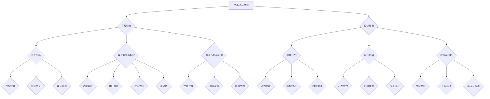

                 

# 如何设计有说服力的产品演示

> **关键词**：产品演示、说服力、设计原则、观众分析、互动设计

> **摘要**：本文旨在探讨如何设计出具有高说服力的产品演示，通过系统性的分析和逻辑推理，为您提供从基础到实战的全面指导。我们将深入了解产品演示的目标与重要性，分析观众特征与需求，阐述演示计划与内容设计的原则，并详细介绍演示准备与执行的关键步骤。最后，我们将评估演示效果并提出持续改进的策略。

## 第一部分：产品演示基础

### 第1章：产品演示的目标与重要性

#### 1.1 产品演示的目标

产品演示的目标是向观众清晰、有效地展示产品的功能、特性与优势，从而激发观众的兴趣，提升产品的市场竞争力。具体目标包括：

1. **建立信任**：通过展示产品实力，建立观众对公司的信任。
2. **传达价值**：明确传达产品能为观众带来的实际价值。
3. **激发兴趣**：通过引人入胜的演示，吸引观众的注意力。
4. **促进销售**：推动观众进行购买决策。

#### 1.2 产品演示的重要性

1. **市场推广**：有效的产品演示是市场推广的重要手段，有助于提升品牌知名度。
2. **销售转化**：演示能直接促进销售转化，提高销售额。
3. **竞争优势**：通过出色的演示，产品能在竞争激烈的市场中脱颖而出。
4. **客户沟通**：演示是客户与公司沟通的重要渠道，有助于建立长期合作关系。

#### 1.3 产品演示的常见挑战

1. **时间限制**：演示时间有限，需要高效地传达信息。
2. **技术难题**：产品功能复杂，需要确保演示的流畅性与准确性。
3. **观众多样性**：观众背景与需求各异，需要针对不同观众进行个性化演示。
4. **现场控制**：现场气氛难以控制，需要有效应对突发情况。

### 第2章：了解你的观众

#### 2.1 观众分析

1. **目标观众群体**：明确演示的主要目标观众，如潜在客户、合作伙伴或投资者。
2. **观众特征**：分析观众的教育背景、行业经验、技术水平和兴趣爱好。
3. **观众需求**：了解观众关注的产品特性、功能以及期望解决的问题。

#### 2.2 观众需求与偏好

1. **功能需求**：展示产品核心功能，满足观众的实际需求。
2. **用户体验**：注重用户体验，确保产品易于操作和掌握。
3. **视觉设计**：采用美观、简洁的视觉设计，提升演示吸引力。
4. **互动性**：增加互动环节，提高观众参与度和兴趣。

#### 2.3 观众行为与心理

1. **注意规律**：了解观众注意力的规律，合理安排演示内容。
2. **感知认知**：运用认知心理学原理，优化演示信息传递方式。
3. **情感共鸣**：通过情感共鸣，提高观众的接受度和认同感。

### Mermaid 流程图：

### 第一部分总结

本部分我们系统地阐述了产品演示的基础知识，从目标与重要性、观众分析、需求与偏好、行为与心理等方面进行了深入探讨。通过了解这些基本要素，我们为后续的演示设计奠定了坚实的基础。

## 第二部分：产品演示设计

### 第3章：制定演示计划

#### 3.1 演示计划的制定

演示计划的制定是演示设计的关键步骤，它决定了演示的顺利进行和目标达成。以下是制定演示计划的基本步骤：

1. **确定演示目标**：明确演示的核心目标，如建立信任、传达价值、激发兴趣等。
2. **确定演示内容**：梳理产品特性、功能与优势，确保内容逻辑清晰、重点突出。
3. **确定演示时长**：根据实际情况和观众需求，合理安排演示时长，通常控制在20-30分钟为宜。
4. **确定演示形式**：选择合适的演示形式，如线上演示、现场演示或混合演示。
5. **制定时间安排**：分配各环节的时间，如开场、主体、互动与答疑等。

#### 3.2 演示结构设计

演示结构设计决定了演示内容的呈现方式，合理的结构设计有助于提高演示的吸引力和说服力。以下是常见的演示结构设计：

1. **开场**：引起观众兴趣，明确演示主题。
2. **主体**：详细展示产品特性与优势，分为几个部分，每个部分均有明确的目标。
3. **互动**：增加观众参与度，通过问答、互动游戏等形式，增强观众对产品的理解。
4. **结尾**：总结演示内容，强调产品价值，激发观众购买或合作意愿。

#### 3.3 演示时间管理

时间管理是演示成功的关键，合理安排时间，确保演示内容在限定时间内完成。以下是时间管理的一些建议：

1. **提前演练**：进行多次演练，熟悉演示流程和时间控制。
2. **时间标记**：为每个环节设定时间标记，确保演示进度。
3. **灵活调整**：根据实际情况，灵活调整时间分配，确保关键内容充分展示。
4. **预留缓冲**：预留一定的缓冲时间，以应对突发情况。

### 第4章：演示内容设计

#### 4.1 产品特性与优势分析

演示内容设计的关键在于如何有效地传达产品的特性与优势。以下是分析产品特性与优势的基本步骤：

1. **明确产品定位**：确定产品在市场中的定位，如高端、中端或入门级。
2. **梳理产品特性**：梳理产品的功能、性能、稳定性等特性。
3. **分析优势**：分析产品的竞争优势，如创新性、性价比、用户体验等。
4. **构建故事线**：通过构建故事线，使观众更容易理解产品的特性与优势。

#### 4.2 演示内容组织

演示内容组织决定了演示的逻辑性和吸引力。以下是组织演示内容的一些建议：

1. **确定核心内容**：明确演示的核心内容，确保内容简洁、明了。
2. **逻辑结构**：按照逻辑顺序组织内容，如从产品概述到功能展示，再到优势分析。
3. **重点突出**：对关键内容进行强调，使用图表、动画等视觉元素辅助展示。
4. **连贯性**：保持演示内容的连贯性，避免内容跳跃和重复。

#### 4.3 交互与互动设计

交互与互动设计是提高演示吸引力和观众参与度的关键。以下是设计互动环节的一些建议：

1. **设置互动环节**：在演示中设置互动环节，如问答、投票、游戏等。
2. **引导观众参与**：通过提问、邀请观众参与演示等方式，引导观众积极参与。
3. **反馈与互动**：及时给予观众反馈，增加互动性和互动效果。
4. **个性化互动**：根据观众特征和需求，设计个性化的互动环节，提高观众的参与度。

### 第5章：视觉与演示技巧

#### 5.1 视觉设计原则

视觉设计在演示中起着至关重要的作用，良好的视觉设计能够提高演示的吸引力和专业性。以下是视觉设计的一些建议：

1. **简洁明了**：使用简洁的视觉元素，避免过多复杂的图形和文字。
2. **统一风格**：保持演示的视觉风格统一，如颜色、字体等。
3. **突出重点**：使用视觉元素突出演示的重点内容，如使用大号字体、鲜艳的颜色等。
4. **清晰可读**：确保演示内容清晰可读，避免文字过多和字体过小。

#### 5.2 演示工具选择

选择合适的演示工具能够提高演示的效率和效果。以下是选择演示工具的一些建议：

1. **兼容性**：选择兼容性好的演示工具，确保在不同设备和操作系统上都能正常运行。
2. **易用性**：选择操作简单的演示工具，降低演示难度。
3. **功能丰富**：选择功能丰富的演示工具，满足多样化的演示需求。
4. **支持互动**：选择支持互动功能的演示工具，提高观众的参与度。

#### 5.3 演示中的非语言沟通

非语言沟通在演示中同样重要，如肢体语言、表情、语调等。以下是运用非语言沟通的一些建议：

1. **肢体语言**：使用积极的肢体语言，如微笑、点头等，增强表达效果。
2. **表情管理**：保持自信、专业的表情，避免负面表情。
3. **语调变化**：通过语调的变化，如强调、停顿等，增强表达效果。
4. **环境调整**：根据现场情况，适当调整灯光、音响等环境因素，提高演示效果。

### 第二部分总结

本部分详细阐述了产品演示的设计原则，包括演示计划的制定、内容设计、视觉与技巧等方面。通过合理的计划与设计，我们能够提高演示的说服力，有效地传达产品价值，激发观众的兴趣和购买意愿。

## 第三部分：产品演示准备

### 第6章：准备演示材料

#### 6.1 幻灯片设计与制作

幻灯片是演示中的重要组成部分，良好的幻灯片设计能够提高演示的专业性和吸引力。以下是幻灯片设计与制作的一些建议：

1. **简洁明了**：避免过多文字和复杂的图形，确保幻灯片内容简洁明了。
2. **统一风格**：保持幻灯片风格的统一，如颜色、字体等，增强整体视觉效果。
3. **突出重点**：使用视觉元素突出幻灯片的重点内容，如使用大号字体、鲜艳的颜色等。
4. **合理布局**：合理安排幻灯片的布局，确保内容布局合理、清晰。
5. **交互设计**：在幻灯片中加入交互元素，如动画、链接等，提高观众的参与度。

#### 6.2 演示脚本编写

演示脚本是对演示过程进行文字描述的工具，它能够帮助演示者更好地掌握演示内容，确保演示的顺利进行。以下是编写演示脚本的一些建议：

1. **明确目标**：明确演示脚本的目标，确保内容围绕目标展开。
2. **逻辑清晰**：确保演示脚本逻辑清晰，内容有条理。
3. **简洁明了**：避免过多的文字描述，确保脚本简洁明了。
4. **重点突出**：对关键内容进行强调，确保观众能够抓住重点。
5. **语气自然**：使用自然的语气，避免生硬的书面语。

#### 6.3 演示材料的整理与校对

演示材料的整理与校对是确保演示顺利进行的重要环节。以下是整理与校对的一些建议：

1. **检查内容**：对演示材料的内容进行仔细检查，确保无误。
2. **调整格式**：根据演示需求，调整演示材料的格式，确保美观和可读性。
3. **校对文字**：对演示材料的文字进行校对，确保无错别字和语法错误。
4. **测试演示**：进行实际演示测试，确保演示过程顺畅，没有技术问题。
5. **备份材料**：对演示材料进行备份，确保在演示过程中不会丢失。

### 第7章：演练与反馈

#### 7.1 演练计划

演练是确保演示顺利进行的重要环节，通过演练，演示者能够熟悉演示流程，提高演示技能。以下是演练计划的一些建议：

1. **确定演练目标**：明确演练的目标，如熟悉演示内容、掌握演示技巧等。
2. **制定演练计划**：根据演示内容和目标，制定详细的演练计划，包括演练时间、地点、内容等。
3. **邀请观众参与**：邀请一些观众参与演练，收集反馈，提高演练效果。
4. **设置演练场景**：模拟真实的演示场景，如会议室、线上平台等，提高演练的真实性。

#### 7.2 反馈收集与改进

反馈是改进演示的重要依据，通过收集反馈，演示者能够了解自己的不足，不断优化演示。以下是收集反馈与改进的一些建议：

1. **及时收集反馈**：在演练后及时收集观众的反馈，确保反馈的真实性和准确性。
2. **分析反馈**：对收集到的反馈进行分析，找出存在的问题和改进的方向。
3. **制定改进计划**：根据反馈结果，制定具体的改进计划，包括内容调整、技巧提升等。
4. **持续改进**：持续收集反馈，不断优化演示，提高演示效果。

#### 7.3 最终准备

最终准备是确保演示顺利进行的关键环节，通过充分的准备，演示者能够确保演示的顺利进行。以下是最终准备的一些建议：

1. **确认演示环境**：提前确认演示的场地、设备等，确保演示环境的稳定性。
2. **检查演示材料**：再次检查演示材料，确保无误，并备份在多个设备上。
3. **熟悉演示流程**：确保演示者熟悉演示流程，确保演示内容准确无误。
4. **准备应急措施**：准备应急措施，如备用设备、演示材料等，确保在突发情况下能够及时应对。

### 第三部分总结

本部分详细阐述了产品演示的准备过程，包括演示材料的设计与制作、演示脚本的编写与校对、演练与反馈、最终准备等环节。通过充分的准备，演示者能够确保演示的顺利进行，提高演示效果。

## 第四部分：产品演示执行

### 第8章：演示执行策略

#### 8.1 演示开场技巧

演示开场是观众对演示的第一印象，良好的开场能够吸引观众的注意力，提高演示的效果。以下是演示开场的一些建议：

1. **引起兴趣**：通过引人入胜的话题或问题，引起观众的兴趣。
2. **明确主题**：在开场时明确演示的主题，让观众对演示内容有一个清晰的认识。
3. **建立信任**：通过展示公司的实力和产品优势，建立观众对公司的信任。
4. **激发期待**：通过预告演示内容，激发观众对演示的期待。

#### 8.2 控制现场氛围

控制现场氛围是确保演示顺利进行的重要环节，良好的氛围能够提高观众的参与度和兴趣。以下是控制现场氛围的一些建议：

1. **营造舒适环境**：确保演示环境舒适，如合适的温度、音响效果等。
2. **使用互动环节**：通过设置互动环节，增加观众的参与度，营造活跃的氛围。
3. **调整语调与表情**：通过语调的变化和表情的调整，营造积极、专业的氛围。
4. **及时反馈**：及时给予观众反馈，鼓励观众提问和参与，营造互动氛围。

#### 8.3 答疑环节应对

答疑环节是观众了解产品、提出疑问的重要环节，良好的应对策略能够提高观众的满意度，增强产品的说服力。以下是答疑环节应对的一些建议：

1. **准备常见问题**：提前准备观众可能提出的问题，确保能够及时回答。
2. **明确答案**：对问题的答案进行明确的阐述，确保观众能够理解。
3. **引导问题**：通过引导问题，将观众的注意力引向产品的优势和应用场景。
4. **避免争议**：对可能引发的争议性问题，提前做好预案，避免现场争论。

### 第9章：演示评估与改进

#### 9.1 演示效果评估

演示效果评估是确保演示目标达成的重要环节，通过评估演示效果，演示者能够了解演示的成功程度，发现存在的问题。以下是演示效果评估的一些建议：

1. **收集反馈**：在演示后及时收集观众的反馈，了解观众对演示的满意度和建议。
2. **分析数据**：分析演示过程中的数据，如观众参与度、提问情况等，评估演示的效果。
3. **总结经验**：根据评估结果，总结演示的成功经验和存在的问题，为后续演示提供参考。

#### 9.2 改进与优化

根据演示效果评估的结果，对演示进行改进和优化，提高演示的效果。以下是改进与优化的一些建议：

1. **内容优化**：对演示内容进行优化，确保内容更加准确、清晰、有吸引力。
2. **技巧提升**：通过培训和实践，提升演示技巧，提高演示的专业性和说服力。
3. **互动设计**：优化互动设计，增加观众的参与度，提高观众的满意度和认同感。
4. **技术支持**：提高技术支持，确保演示过程中设备和技术问题得到及时解决。

#### 9.3 演示反馈机制建立

建立有效的演示反馈机制，是确保演示持续改进的重要手段。以下是建立演示反馈机制的一些建议：

1. **定期反馈**：定期收集观众的反馈，了解观众的最新需求和意见。
2. **反馈渠道**：建立多种反馈渠道，如线上问卷、面对面交流等，方便观众提出意见和建议。
3. **反馈处理**：对收集到的反馈进行及时处理，对合理意见和建议进行采纳和改进。
4. **持续优化**：根据反馈结果，不断优化演示内容和流程，提高演示效果。

### 第四部分总结

本部分详细阐述了产品演示的执行策略，包括演示开场的技巧、现场氛围的控制、答疑环节的应对，以及演示效果评估与改进的方法。通过有效的执行策略，演示者能够确保演示的顺利进行，提高演示的说服力和效果。

## 附录

### 附录A：演示工具与资源

#### A.1 常用演示工具

以下是常用的演示工具及其特点：

1. **Microsoft PowerPoint**：功能强大，支持多种格式，易于使用。
2. **Google Slides**：在线协作，支持实时更新，便于分享。
3. **Keynote**：苹果系统专用，界面美观，动画效果丰富。
4. **Prezi**：动态演示，非线性结构，富有创意。

#### A.2 在线资源与参考资料

以下是有关产品演示的在线资源和参考资料：

1. **Product Demonstration Guide**：提供全面的产品演示指南。
2. **Presentation Skills Training**：提供专业的演示技巧培训资源。
3. **SlideHunter**：提供高质量的幻灯片模板和设计灵感。
4. **SlideShare**：丰富的演示资料库，可借鉴优秀的演示案例。

### 附录总结

附录部分汇总了演示工具与资源，旨在为读者提供实用的工具和丰富的参考资料，帮助读者在实际工作中更好地进行产品演示。

### 结语

通过本文的全面探讨，我们系统地了解了如何设计有说服力的产品演示。从基础到实战，我们详细阐述了产品演示的目标与重要性、观众分析、演示设计原则、演示准备与执行策略，以及评估与改进的方法。希望本文能为您的产品演示提供有益的启示和实践指导。

**作者：AI天才研究院/AI Genius Institute & 禅与计算机程序设计艺术 /Zen And The Art of Computer Programming**

