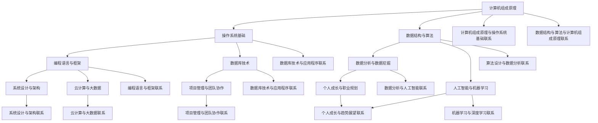

                 

### 《2024字节跳动校招：技术用户反馈分析师面试题汇总》

随着科技的快速发展，技术用户反馈分析师在各个行业中扮演着越来越重要的角色。他们通过分析用户反馈，识别产品问题，提供优化建议，从而提升用户体验和产品服务质量。2024年，字节跳动校招再次吸引了大量优秀人才的关注，技术用户反馈分析师职位更是备受青睐。本文旨在为准备参加字节跳动校招的技术用户反馈分析师职位面试的候选人提供一份全面的面试题汇总，帮助大家深入了解岗位要求，提高面试成功率。

---

#### 关键词：字节跳动校招、技术用户反馈分析师、面试题汇总、岗位要求、面试准备

---

#### 摘要：

本文将详细整理和分析2024年字节跳动校招技术用户反馈分析师面试的主要题型和知识点。文章结构分为以下几个部分：

1. **面试试题分类与核心考点**：包括计算机基础知识、操作系统、数据结构与算法、编程语言与框架、数据分析与数据挖掘、人工智能与机器学习、系统设计与架构、云计算与大数据、项目管理与团队协作、以及趋势与未来展望。

2. **面试真题实战**：结合实际面试题目，给出详细的解答思路和步骤，帮助考生熟悉面试题型和答题技巧。

3. **案例分析**：通过具体项目案例，展示如何运用技术知识解决实际问题，提高解题能力。

4. **附录**：提供面试过程中可能用到的技术资源与工具，以及历年面试题汇总与答案解析。

---

### 《2024字节跳动校招：技术用户反馈分析师面试题汇总》目录大纲

#### 第一部分: 面试题分类与核心考点

**第1章: 计算机基础知识**

- **1.1 计算机组成原理**
- **1.2 操作系统基础**
- **1.3 数据结构与算法**

**第2章: 编程语言与框架**

- **2.1 编程语言基础**
- **2.2 Web开发技术**
- **2.3 数据库技术**

**第3章: 数据分析与数据挖掘**

- **3.1 数据预处理与清洗**
- **3.2 数据可视化**
- **3.3 数据分析模型**

**第4章: 人工智能与机器学习**

- **4.1 机器学习基础**
- **4.2 深度学习技术**
- **4.3 人工智能应用**

**第5章: 系统设计与架构**

- **5.1 系统设计与架构基础**
- **5.2 分布式系统与微服务**
- **5.3 性能优化与系统监控**

**第6章: 云计算与大数据**

- **6.1 云计算基础**
- **6.2 大数据技术与框架**
- **6.3 数据仓库与数据湖**

**第7章: 项目管理与团队协作**

- **7.1 项目管理基础**
- **7.2 团队协作与沟通**
- **7.3 个人成长与职业规划**

**第8章: 趋势与未来展望**

- **8.1 技术趋势分析**
- **8.2 行业变革与挑战**
- **8.3 个人职业发展路径**

**附录**

- **附录 A: 常用技术资源与工具**
- **附录 B: 面试题汇总与答案解析**

---

接下来，我们将一步一步深入分析各个章节的核心考点和面试真题，帮助大家全面提升面试技能。

---

**核心概念与联系：**

为了更好地理解计算机和人工智能技术，我们需要构建一个完整的知识框架。以下是一个用Mermaid绘制的AI大模型架构流程图：

这个架构图展示了计算机技术各领域之间的相互关系，帮助我们更好地理解如何将理论知识应用于实际问题中。

---

### 第一部分：面试试题分类与核心考点

#### 第1章: 计算机基础知识

##### 1.1 计算机组成原理

计算机组成原理是理解计算机硬件和软件的基础。以下是一些常见的面试题：

1. **什么是计算机的基本组成？**
   - 计算机的基本组成包括：中央处理器（CPU）、内存（Memory）、输入设备（Input devices）、输出设备（Output devices）和存储设备（Storage devices）。

2. **CPU由哪几部分组成？**
   - CPU主要由控制单元（Control Unit）、算术逻辑单元（ALU）和寄存器（Registers）三部分组成。

3. **什么是冯·诺依曼架构？**
   - 冯·诺依曼架构是一种计算机体系结构，其中程序和数据存储在同一存储空间中，指令和数据以二进制形式存储。

4. **什么是缓存（Cache）？**
   - 缓存是一种高速存储器，用于存储CPU最近访问的数据和指令，以减少访问主存储器的时间。

5. **解释虚拟内存（Virtual Memory）的工作原理。**
   - 虚拟内存是一种内存管理功能，它将硬盘空间作为内存的一部分来使用。当内存不足时，操作系统会将不常用的数据从内存移到硬盘上的交换文件中，以释放内存空间。

##### 1.2 操作系统基础

操作系统是管理计算机硬件和软件资源的核心系统软件。以下是一些常见的面试题：

1. **什么是操作系统？**
   - 操作系统是一种系统软件，它管理计算机硬件资源，提供用户与计算机之间的接口。

2. **操作系统的功能有哪些？**
   - 操作系统的功能包括：处理器管理、内存管理、文件系统管理、设备管理和用户接口。

3. **什么是进程（Process）？**
   - 进程是计算机中正在运行的程序实例，它包括程序代码、数据、栈和进程控制块（PCB）。

4. **什么是线程（Thread）？**
   - 线程是进程中的执行单元，多个线程可以共享进程的资源，如内存、文件描述符等。

5. **什么是同步和互斥？**
   - 同步是指多个进程或线程按照预定顺序执行，互斥是指多个进程或线程在同一时刻不能同时访问共享资源。

##### 1.3 数据结构与算法

数据结构和算法是计算机科学的核心知识领域。以下是一些常见的面试题：

1. **什么是数据结构？**
   - 数据结构是用于存储和管理数据的特定格式或方式。

2. **常见的线性数据结构有哪些？**
   - 常见的线性数据结构包括：数组、链表、栈和队列。

3. **什么是算法？**
   - 算法是解决问题的步骤序列，通常包括输入、输出和处理步骤。

4. **解释排序算法的时间复杂度。**
   - 排序算法的时间复杂度通常表示为 $O(n \log n)$ 或 $O(n^2)$，其中 $n$ 是数据的大小。

5. **什么是动态规划？**
   - 动态规划是一种用于解决优化问题的算法，它将问题分解为更小的子问题，并保存已解决的子问题的解，以避免重复计算。

---

通过这些面试题，我们可以了解到计算机基础知识的重要性和广泛应用。在接下来的章节中，我们将进一步探讨编程语言与框架、数据分析与数据挖掘、人工智能与机器学习等领域的核心考点。

---

### 第一部分：面试试题分类与核心考点

#### 第2章: 编程语言与框架

编程语言是编写计算机程序的工具，而框架则是特定编程语言中用于加速开发和简化复杂任务的库。以下是一些常见的面试题：

##### 2.1 编程语言基础

1. **什么是面向对象编程（OOP）？**
   - 面向对象编程是一种编程范式，它通过将数据和处理数据的方法封装在对象中，以模块化方式组织代码。

2. **什么是面向过程编程？**
   - 面向过程编程是一种编程范式，它通过函数或过程来处理数据，通常更注重程序流程的控制。

3. **什么是函数式编程？**
   - 函数式编程是一种编程范式，它将计算视为函数的应用，避免使用变量和状态，以减少复杂性和提高代码可读性。

4. **什么是编程范式？**
   - 编程范式是编程语言中组织和处理数据的方法论，常见的编程范式包括面向对象、面向过程和函数式编程。

5. **什么是递归？**
   - 递归是一种编程技术，它通过函数调用自身来解决复杂问题，通常用于解决递归定义的问题，如阶乘计算、深度优先搜索等。

##### 2.2 Web开发技术

Web开发技术涵盖了前端和后端开发所需的知识。以下是一些常见的面试题：

1. **什么是Web前端技术栈？**
   - Web前端技术栈包括HTML、CSS和JavaScript，以及各种前端框架如React、Vue和Angular。

2. **什么是Web后端框架？**
   - Web后端框架是一种用于简化Web应用开发的库或框架，常见的后端框架有Spring（Java）、Django（Python）和Express（JavaScript）。

3. **什么是MVC架构模式？**
   - MVC（Model-View-Controller）是一种软件设计模式，用于分离数据模型、用户界面和业务逻辑，以实现更好的代码复用和维护性。

4. **什么是RESTful API？**
   - RESTful API是一种用于构建Web服务的架构风格，它基于HTTP协议，使用标准的HTTP方法（如GET、POST、PUT、DELETE）来处理请求。

5. **什么是Web应用安全？**
   - Web应用安全涉及保护Web应用免受各种攻击，如SQL注入、跨站脚本攻击（XSS）和跨站请求伪造（CSRF）等。

##### 2.3 数据库技术

数据库技术是Web应用开发中的重要组成部分。以下是一些常见的面试题：

1. **什么是关系型数据库？**
   - 关系型数据库是一种使用表格存储数据的数据库，它通过SQL语言进行查询和管理。

2. **什么是非关系型数据库？**
   - 非关系型数据库是一种不依赖于表格结构存储数据的数据库，常见的类型有文档型数据库（如MongoDB）、键值存储数据库（如Redis）和图数据库（如Neo4j）。

3. **什么是SQL语言？**
   - SQL（结构化查询语言）是一种用于管理关系型数据库的标准语言，它包括数据定义、数据操作和数据查询等功能。

4. **什么是索引？**
   - 索引是一种数据库结构，用于加速数据查询。它通过创建索引键来引用数据表中的行，从而提高查询性能。

5. **什么是事务？**
   - 事务是一组操作序列，它们在数据库中作为一个单元执行，要么全部成功，要么全部失败。事务用于保证数据的一致性和完整性。

---

通过这些面试题，我们可以了解到编程语言与框架的基础知识，以及Web开发技术和数据库技术的核心概念。在接下来的章节中，我们将进一步探讨数据分析与数据挖掘、人工智能与机器学习等领域的核心考点。

---

### 第一部分：面试试题分类与核心考点

#### 第3章: 数据分析与数据挖掘

数据分析与数据挖掘是现代企业中非常重要的一环，它们帮助企业从大量数据中提取有价值的信息，以支持决策。以下是一些常见的面试题：

##### 3.1 数据预处理与清洗

数据预处理与清洗是数据分析的重要步骤，以下是一些面试题：

1. **什么是数据预处理？**
   - 数据预处理是指将原始数据转换为适合分析和挖掘的形式的过程。它包括数据清洗、数据转换和数据集成等步骤。

2. **什么是数据清洗？**
   - 数据清洗是指识别和纠正数据中的错误、缺失和不一致的过程。它包括去除重复数据、处理缺失值、纠正错误值等。

3. **什么是缺失值处理？**
   - 缺失值处理是指处理数据集中缺失数据的方法。常见的处理方法有删除缺失值、填充缺失值和插值等。

4. **什么是数据转换？**
   - 数据转换是指将数据从一种格式转换为另一种格式的过程。它包括数据标准化、数据归一化和数据转换等。

5. **什么是数据集成？**
   - 数据集成是指将来自多个源的数据合并到一起的过程。它包括数据抽取、数据转换和数据加载等步骤。

##### 3.2 数据可视化

数据可视化是将数据以图形化方式展示出来，以帮助人们理解和分析数据。以下是一些面试题：

1. **什么是数据可视化？**
   - 数据可视化是指使用图形、图像和图表等视觉元素来展示和分析数据的过程。

2. **什么是图表？**
   - 图表是一种用于展示数据的图形化表示，常见的图表类型包括柱状图、折线图、饼图、散点图和地图等。

3. **什么是数据可视化工具？**
   - 数据可视化工具是用于创建和展示数据图表的软件工具，常见的工具包括Excel、Tableau、Power BI、Matplotlib和Seaborn等。

4. **什么是交互式数据可视化？**
   - 交互式数据可视化是指用户可以与数据图表进行交互，如放大、缩小、筛选和排序等，以获得更深入的数据洞察。

5. **什么是热力图？**
   - 热力图是一种用于展示数据密集度和分布的图表，通常使用颜色深浅来表示数据值的大小。

##### 3.3 数据分析模型

数据分析模型是用于分析数据并提取有价值信息的方法和工具。以下是一些面试题：

1. **什么是数据分析模型？**
   - 数据分析模型是指用于分析和解释数据，提取有用信息的方法和工具。

2. **什么是描述性统计分析？**
   - 描述性统计分析是指对数据集进行统计分析，以描述数据的分布、中心趋势和离散度等特征。

3. **什么是聚类分析？**
   - 聚类分析是指将数据集划分为多个类别或簇，以便更好地理解数据的结构和模式。

4. **什么是决策树？**
   - 决策树是一种树形结构，用于对数据进行分类或回归分析。它通过一系列判断条件来划分数据，并预测数据的类别或值。

5. **什么是随机森林？**
   - 随机森林是一种基于决策树的集成学习方法，它通过构建多个决策树并合并它们的预测结果来提高模型的准确性。

6. **什么是神经网络？**
   - 神经网络是一种模拟人脑神经元连接结构的计算模型，用于处理复杂数据和分析模式。

7. **什么是卷积神经网络（CNN）？**
   - 卷积神经网络是一种专门用于处理图像数据的神经网络，它通过卷积操作提取图像特征。

8. **什么是循环神经网络（RNN）？**
   - 循环神经网络是一种用于处理序列数据的神经网络，它具有循环结构，可以记住历史信息。

9. **什么是生成对抗网络（GAN）？**
   - 生成对抗网络是一种用于生成复杂数据的神经网络，它由生成器和判别器两个网络组成，通过对抗训练生成逼真的数据。

10. **什么是变分自编码器（VAE）？**
    - 变分自编码器是一种用于生成数据的神经网络，它通过编码器和解码器两个网络学习数据的概率分布。

---

通过这些面试题，我们可以了解到数据分析与数据挖掘的基本概念和方法，为后续章节的学习和面试做好准备。在接下来的章节中，我们将继续探讨人工智能与机器学习、系统设计与架构等领域的核心考点。

---

### 第一部分：面试试题分类与核心考点

#### 第4章: 人工智能与机器学习

人工智能（AI）和机器学习（ML）是当今科技领域的热门话题，它们正在改变着各行各业。以下是一些常见的人工智能与机器学习面试题：

##### 4.1 机器学习基础

1. **什么是机器学习？**
   - 机器学习是一种让计算机通过数据和经验自动改进性能的技术，它使计算机能够从数据中学习规律和模式。

2. **机器学习有哪些类型？**
   - 监督学习、无监督学习、半监督学习和强化学习。

3. **什么是监督学习？**
   - 监督学习是一种机器学习方法，它使用标记数据集来训练模型，通过预测输出与实际输出之间的差异来调整模型参数。

4. **什么是无监督学习？**
   - 无监督学习是一种机器学习方法，它使用未标记的数据集来发现数据中的模式和结构，如聚类分析。

5. **什么是强化学习？**
   - 强化学习是一种机器学习方法，它通过模拟智能体在环境中的互动来学习策略，以最大化累积奖励。

6. **什么是模型训练？**
   - 模型训练是指使用训练数据集对机器学习模型进行调整，使其能够准确预测或分类新数据的过程。

7. **什么是过拟合和欠拟合？**
   - 过拟合是指模型在训练数据上表现很好，但在新数据上表现较差，即模型对训练数据过于敏感。欠拟合是指模型在新数据和训练数据上表现都较差，即模型没有足够的能力捕捉数据中的规律。

8. **什么是正则化？**
   - 正则化是一种防止模型过拟合的技术，它通过在损失函数中加入惩罚项来减少模型的复杂度。

##### 4.2 深度学习技术

深度学习是机器学习的一个分支，它通过构建多层神经网络来学习数据的复杂特征。以下是一些常见的深度学习面试题：

1. **什么是深度学习？**
   - 深度学习是一种机器学习方法，它通过构建具有多个隐藏层的神经网络来学习数据的层次结构。

2. **什么是神经网络？**
   - 神经网络是一种由神经元组成的计算模型，它通过模拟人脑的工作方式来处理复杂数据。

3. **什么是卷积神经网络（CNN）？**
   - 卷积神经网络是一种专门用于图像处理的神经网络，它通过卷积操作提取图像特征。

4. **什么是循环神经网络（RNN）？**
   - 循环神经网络是一种用于处理序列数据的神经网络，它通过循环结构记住历史信息。

5. **什么是长短时记忆网络（LSTM）？**
   - 长短时记忆网络是一种特殊的RNN，它通过门控机制来解决传统RNN的长期依赖问题。

6. **什么是生成对抗网络（GAN）？**
   - 生成对抗网络是一种由生成器和判别器组成的神经网络，它通过对抗训练生成逼真的数据。

7. **什么是变分自编码器（VAE）？**
   - 变分自编码器是一种基于深度学习的生成模型，它通过编码器和解码器两个网络学习数据的概率分布。

##### 4.3 人工智能应用

人工智能技术已经广泛应用于各个领域，以下是一些常见的人工智能应用面试题：

1. **什么是自然语言处理（NLP）？**
   - 自然语言处理是一种人工智能技术，它使计算机能够理解、生成和处理人类语言。

2. **什么是计算机视觉？**
   - 计算机视觉是一种人工智能技术，它使计算机能够通过摄像头或其他传感器获取和处理视觉信息。

3. **什么是语音识别？**
   - 语音识别是一种人工智能技术，它使计算机能够将语音转换为文本或命令。

4. **什么是图像识别？**
   - 图像识别是一种人工智能技术，它使计算机能够识别和分类图像中的对象和场景。

5. **什么是自动驾驶？**
   - 自动驾驶是一种利用人工智能技术实现车辆自主驾驶的技术，它通过传感器和算法实时分析环境并做出决策。

6. **什么是推荐系统？**
   - 推荐系统是一种人工智能技术，它根据用户的历史行为和偏好为用户推荐相关的产品、内容或服务。

---

通过这些面试题，我们可以了解到人工智能与机器学习的基本概念、深度学习技术以及人工智能在各个领域的应用。在接下来的章节中，我们将进一步探讨系统设计与架构、云计算与大数据等领域的核心考点。

---

### 第一部分：面试试题分类与核心考点

#### 第5章: 系统设计与架构

系统设计与架构是确保软件系统稳定、高效和可扩展性的关键。以下是一些常见的面试题：

##### 5.1 系统设计与架构基础

1. **什么是系统设计？**
   - 系统设计是指创建软件系统的结构和组件的过程，它包括数据设计、接口设计、组件设计和架构设计。

2. **什么是架构设计？**
   - 架构设计是指确定软件系统的总体结构，包括组件、接口、数据流和通信方式。

3. **什么是软件架构？**
   - 软件架构是一组设计和决策，它们定义了软件系统的结构、组件和它们的交互方式。

4. **什么是组件设计？**
   - 组件设计是指将系统分解为可管理的组件，并为每个组件定义接口和功能。

5. **什么是模块化？**
   - 模块化是将系统划分为独立、可重用的模块，以提高系统的可维护性和可扩展性。

6. **什么是设计模式？**
   - 设计模式是解决特定设计问题的通用解决方案，它包括创建型、结构型和行为型设计模式。

##### 5.2 分布式系统与微服务

分布式系统与微服务架构是现代软件系统设计的关键趋势。以下是一些常见的问题：

1. **什么是分布式系统？**
   - 分布式系统是由多个独立计算机组成的系统，它们通过通信网络相互协作，共同完成一个任务。

2. **什么是微服务架构？**
   - 微服务架构是一种将大型单体应用拆分为小型、独立服务的架构风格，每个服务专注于完成特定功能。

3. **什么是服务拆分？**
   - 服务拆分是将大型单体应用拆分为多个小型服务的过程，每个服务都有自己的数据库和后端接口。

4. **什么是服务发现？**
   - 服务发现是分布式系统中服务注册和发现机制，它使得服务能够动态地定位其他服务。

5. **什么是负载均衡？**
   - 负载均衡是将网络流量分配到多个服务器上，以避免单个服务器过载的一种技术。

6. **什么是分布式事务？**
   - 分布式事务是在分布式系统中保证数据一致性的事务，它涉及多个服务之间的协调和同步。

##### 5.3 性能优化与系统监控

性能优化与系统监控是确保系统稳定和高效运行的关键。以下是一些常见的问题：

1. **什么是性能优化？**
   - 性能优化是提高系统响应速度和处理能力的过程，它涉及代码优化、数据库优化和系统资源配置等。

2. **什么是缓存？**
   - 缓存是临时存储最近访问数据的内存或硬盘区域，以减少访问延迟和提高性能。

3. **什么是数据库性能优化？**
   - 数据库性能优化是指通过索引、查询优化和存储优化等技术提高数据库的查询速度。

4. **什么是系统监控？**
   - 系统监控是实时跟踪和记录系统运行状态的过程，它用于识别性能瓶颈和潜在故障。

5. **什么是日志管理？**
   - 日志管理是收集、存储和检索系统日志信息的过程，它用于分析系统行为和故障诊断。

6. **什么是告警系统？**
   - 告警系统是一种自动通知系统，它在检测到特定事件或性能指标异常时向相关人员发送通知。

---

通过这些面试题，我们可以了解到系统设计与架构的基础知识、分布式系统与微服务架构的关键概念，以及性能优化与系统监控的重要技术。在接下来的章节中，我们将继续探讨云计算与大数据、项目管理与团队协作等领域的核心考点。

---

### 第一部分：面试试题分类与核心考点

#### 第6章: 云计算与大数据

云计算与大数据技术正在深刻改变着企业信息技术的基础架构，为数据处理和分析提供了强大的支持。以下是一些常见的面试题：

##### 6.1 云计算基础

1. **什么是云计算？**
   - 云计算是一种通过网络访问和使用共享的计算资源，包括硬件、软件和数据，以按需提供服务的技术。

2. **云计算有哪些类型？**
   - 公共云、私有云、混合云和多云。

3. **什么是IaaS、PaaS和SaaS？**
   - IaaS（基础设施即服务）：提供虚拟化的计算资源，如虚拟机、存储和网络。
   - PaaS（平台即服务）：提供开发、运行和管理应用程序的云计算平台。
   - SaaS（软件即服务）：提供应用程序通过互联网按需使用。

4. **什么是虚拟化？**
   - 虚拟化是一种技术，它通过创建虚拟的硬件和软件资源，使多个虚拟环境共享物理资源。

5. **什么是容器化？**
   - 容器化是一种轻量级的虚拟化技术，它通过容器将应用程序及其依赖环境打包在一起，实现应用程序的独立运行。

6. **什么是云服务模型？**
   - 云服务模型包括IaaS、PaaS和SaaS，它们分别提供不同的服务级别和灵活性。

##### 6.2 大数据技术与框架

大数据技术用于处理和分析海量数据，以下是一些常见的问题：

1. **什么是大数据？**
   - 大数据是指数据量、速度和多样性超出传统数据库工具处理能力的数据集合。

2. **大数据有哪些V特性？**
   - Velocity（速度）、Volume（容量）、Variety（多样性）、Veracity（真实性）和Value（价值）。

3. **什么是Hadoop？**
   - Hadoop是一个开源框架，用于处理大规模数据集，包括数据存储（HDFS）和数据计算（MapReduce）。

4. **什么是Spark？**
   - Spark是一个开源的大数据处理引擎，它提供了比Hadoop更高效的数据处理能力，包括批处理、流处理和机器学习。

5. **什么是NoSQL数据库？**
   - NoSQL数据库是一种非关系型数据库，用于处理大规模非结构化或半结构化数据，如MongoDB、Cassandra和Redis。

6. **什么是数据湖？**
   - 数据湖是一种大数据存储架构，它用于存储原始数据，支持实时数据处理和分析。

##### 6.3 数据仓库与数据湖

数据仓库与数据湖是大数据领域的重要概念，以下是一些常见的问题：

1. **什么是数据仓库？**
   - 数据仓库是一种用于存储、管理和分析大量数据的存储系统，通常用于支持企业的决策制定。

2. **什么是数据湖？**
   - 数据湖是一种存储大量原始数据的分布式文件系统，它保留了原始数据格式，支持实时处理和分析。

3. **数据仓库与数据湖的区别是什么？**
   - 数据仓库通常用于结构化和清洗后的数据，支持报表和分析；数据湖则用于存储原始数据，支持实时流处理和分析。

4. **什么是ETL？**
   - ETL（提取、转换、加载）是指将数据从源系统提取、转换并加载到目标系统的过程。

5. **什么是数据治理？**
   - 数据治理是指组织内用于确保数据质量、安全性和合规性的策略、过程和技术。

6. **什么是数据挖掘？**
   - 数据挖掘是指使用统计学、机器学习和数据可视化等技术从大量数据中发现有价值的信息和模式。

---

通过这些面试题，我们可以了解到云计算与大数据技术的基础知识，以及数据仓库与数据湖的重要概念。在接下来的章节中，我们将继续探讨项目管理与团队协作等领域的核心考点。

---

### 第一部分：面试试题分类与核心考点

#### 第7章: 项目管理与团队协作

项目管理和团队协作是确保项目按时、按预算和按质量完成的基石。以下是一些常见的面试题：

##### 7.1 项目管理基础

1. **什么是项目管理？**
   - 项目管理是运用系统方法和工具，确保项目目标、时间和资源的有效协调与控制的过程。

2. **什么是项目生命周期？**
   - 项目生命周期是指项目从启动到完成所经历的各个阶段，通常包括启动、规划、执行、监控和收尾。

3. **什么是范围管理？**
   - 范围管理是指确保项目包含且仅包含必要的任务和活动，以实现项目目标的过程。

4. **什么是项目计划？**
   - 项目计划是定义项目目标和如何实现这些目标的详细文件，包括任务、时间表、资源和风险。

5. **什么是关键路径？**
   - 关键路径是项目中任务序列中时间最长的一条路径，决定了项目的最短完成时间。

6. **什么是资源管理？**
   - 资源管理是确保项目拥有并有效地使用所需的资源（如人力、资金和设备）的过程。

##### 7.2 团队协作与沟通

1. **什么是团队协作？**
   - 团队协作是指团队成员共同努力，通过相互支持和沟通，共同实现项目目标的过程。

2. **什么是沟通？**
   - 沟通是信息交换和理解的过程，对于确保项目顺利进行至关重要。

3. **什么是沟通模型？**
   - 沟通模型是描述信息传递过程中各个环节和要素的理论框架，包括发送者、信息、通道、接收者和反馈。

4. **什么是沟通障碍？**
   - 沟通障碍是指影响信息有效传递和理解的各种因素，如语言障碍、文化差异、噪声和误解。

5. **什么是团队建设？**
   - 团队建设是通过提高团队凝聚力、信任和协作能力，以促进项目成功的过程。

6. **什么是敏捷开发？**
   - 敏捷开发是一种以用户需求为中心、迭代和渐进的软件开发方法，强调快速响应变化和持续交付价值。

##### 7.3 个人成长与职业规划

1. **什么是个人成长？**
   - 个人成长是指个体通过学习、实践和经验积累，提高自身技能和知识水平的过程。

2. **什么是职业规划？**
   - 职业规划是设定职业目标、制定实现目标的计划和策略，以及评估和调整职业路径的过程。

3. **什么是持续学习？**
   - 持续学习是指不断获取新知识和技能，以适应快速变化的职业环境。

4. **什么是软技能？**
   - 软技能是指与人际交往、团队合作、沟通能力和自我管理相关的非技术技能。

5. **什么是领导力？**
   - 领导力是指激励和引导他人实现共同目标的能力，包括决策能力、沟通能力、影响力和管理能力。

6. **什么是职业发展路径？**
   - 职业发展路径是指个体在职业生涯中通过不同阶段和职位逐步提升的过程，包括初级、中级和高级职位。

---

通过这些面试题，我们可以了解到项目管理和团队协作的基础知识，以及个人成长和职业规划的重要性。在接下来的章节中，我们将探讨技术趋势与未来展望，为面试准备提供更全面的视角。

---

### 第一部分：面试试题分类与核心考点

#### 第8章: 趋势与未来展望

随着技术的不断进步，技术用户反馈分析师的角色也在不断演变。了解当前技术趋势和未来发展方向，对于技术用户反馈分析师来说至关重要。以下是一些关于技术趋势与未来展望的面试题：

##### 8.1 技术趋势分析

1. **什么是人工智能？**
   - 人工智能（AI）是模拟人类智能行为的计算机系统，它包括机器学习、深度学习、自然语言处理和计算机视觉等技术。

2. **人工智能有哪些应用领域？**
   - 人工智能的应用领域广泛，包括医疗、金融、零售、制造、教育、娱乐和交通等。

3. **什么是物联网（IoT）？**
   - 物联网（IoT）是指通过传感器、设备和网络将物理世界连接到互联网，实现数据采集、传输和智能处理。

4. **物联网有哪些应用场景？**
   - 物联网的应用场景包括智能家居、智能城市、智能交通、智能医疗和智能农业等。

5. **什么是区块链？**
   - 区块链是一种分布式数据库技术，通过加密算法确保数据的安全性和不可篡改性，常用于实现去中心化应用。

6. **区块链有哪些应用领域？**
   - 区块链的应用领域包括金融、供应链管理、数字身份认证、智能合约和版权保护等。

##### 8.2 行业变革与挑战

1. **技术变革对行业有哪些影响？**
   - 技术变革对行业的影响包括提高效率、降低成本、改变商业模式、创造新市场和就业机会等。

2. **技术变革带来的挑战有哪些？**
   - 技术变革带来的挑战包括数据隐私和安全、伦理问题、技术人才短缺、行业竞争加剧和政策法规等。

3. **什么是数字化转型？**
   - 数字化转型是指企业利用数字技术，对业务流程、组织结构和商业模式进行全方位的变革和优化。

4. **数字化转型有哪些关键步骤？**
   - 数字化转型的关键步骤包括制定战略规划、进行数据整合与分析、采用云计算和大数据技术、实施智能化应用和优化用户体验等。

5. **什么是数字鸿沟？**
   - 数字鸿沟是指不同群体在获取、使用和处理数字技术方面的差距，它可能加剧社会和经济的不平等。

##### 8.3 个人职业发展路径

1. **技术用户反馈分析师的职业发展路径是怎样的？**
   - 技术用户反馈分析师的职业发展路径可以从初级分析师逐步晋升为高级分析师、团队主管或数据科学家。

2. **如何提升个人职业竞争力？**
   - 提升个人职业竞争力的方法包括持续学习新技术、积累实际项目经验、提高沟通和团队协作能力，以及建立专业网络。

3. **如何规划职业发展路径？**
   - 规划职业发展路径的方法包括设定职业目标、制定学习计划、确定发展领域和积累相关经验。

4. **什么是终身学习？**
   - 终身学习是指个体在职业生涯中不断学习和更新知识、技能，以适应不断变化的职业环境。

5. **什么是跨界思维？**
   - 跨界思维是指跨学科、跨领域思考和解决问题的能力，它有助于创新和创造新价值。

---

通过这些面试题，我们可以了解到当前技术趋势和未来发展方向，以及技术变革对行业和个人职业发展的影响。这将为技术用户反馈分析师的职业规划提供重要参考。

---

### 附录 A: 常用技术资源与工具

在准备技术用户反馈分析师面试的过程中，掌握一些常用的技术资源和工具是非常有帮助的。以下是一些建议：

1. **开发工具与环境搭建**
   - **PyCharm**: 一款功能强大的Python IDE，适合数据分析和机器学习项目。
   - **Visual Studio Code (VS Code)**: 一款轻量级、可扩展的代码编辑器，适用于多种编程语言。
   - **Jupyter Notebook**: 适用于数据分析和机器学习的交互式开发环境。

2. **学习资源与推荐书籍**
   - **《Python数据科学 Handbook》**: 适合初学者入门数据科学和Python编程。
   - **《深度学习》（花书）**: 由Ian Goodfellow主编，是深度学习的经典教材。
   - **《数据挖掘：实用工具与技术》**: 详细介绍了数据挖掘的方法和技术，适合有一定基础的读者。

3. **技术论坛与社区**
   - **Stack Overflow**: 全球最大的开发者问答社区，适合解决编程问题。
   - **GitHub**: 全球最大的代码托管平台，可以学习和贡献开源项目。
   - **CSDN**: 中国最大的IT社区和服务平台，提供丰富的技术文章和讨论。

---

### 附录 B: 面试题汇总与答案解析

以下是针对前面章节中提到的各类面试题的汇总和答案解析，帮助读者更好地理解和掌握相关知识点。

#### 第1章: 计算机基础知识

1. **什么是计算机的基本组成？**
   - 计算机的基本组成包括：中央处理器（CPU）、内存（Memory）、输入设备（Input devices）、输出设备（Output devices）和存储设备（Storage devices）。

2. **CPU由哪几部分组成？**
   - CPU主要由控制单元（Control Unit）、算术逻辑单元（ALU）和寄存器（Registers）三部分组成。

3. **什么是虚拟内存？**
   - 虚拟内存是一种内存管理功能，它将硬盘空间作为内存的一部分来使用。当内存不足时，操作系统会将不常用的数据从内存移到硬盘上的交换文件中，以释放内存空间。

#### 第2章: 编程语言与框架

1. **什么是面向对象编程（OOP）？**
   - 面向对象编程是一种编程范式，它通过将数据和处理数据的方法封装在对象中，以模块化方式组织代码。

2. **什么是MVC架构模式？**
   - MVC（Model-View-Controller）是一种软件设计模式，用于分离数据模型、用户界面和业务逻辑，以实现更好的代码复用和维护性。

3. **什么是RESTful API？**
   - RESTful API是一种用于构建Web服务的架构风格，它基于HTTP协议，使用标准的HTTP方法（如GET、POST、PUT、DELETE）来处理请求。

#### 第3章: 数据分析与数据挖掘

1. **什么是数据预处理？**
   - 数据预处理是指将原始数据转换为适合分析和挖掘的形式的过程。它包括数据清洗、数据转换和数据集成等步骤。

2. **什么是数据可视化工具？**
   - 数据可视化工具是用于创建和展示数据图表的软件工具，常见的工具包括Excel、Tableau、Power BI、Matplotlib和Seaborn等。

3. **什么是决策树？**
   - 决策树是一种树形结构，用于对数据进行分类或回归分析。它通过一系列判断条件来划分数据，并预测数据的类别或值。

#### 第4章: 人工智能与机器学习

1. **什么是机器学习？**
   - 机器学习是一种让计算机通过数据和经验自动改进性能的技术，它使计算机能够从数据中学习规律和模式。

2. **什么是深度学习？**
   - 深度学习是一种机器学习方法，它通过构建具有多个隐藏层的神经网络来学习数据的层次结构。

3. **什么是卷积神经网络（CNN）？**
   - 卷积神经网络是一种专门用于图像处理的神经网络，它通过卷积操作提取图像特征。

#### 第5章: 系统设计与架构

1. **什么是系统设计？**
   - 系统设计是指创建软件系统的结构和组件的过程，它包括数据设计、接口设计、组件设计和架构设计。

2. **什么是微服务架构？**
   - 微服务架构是一种将大型单体应用拆分为小型、独立服务的架构风格，每个服务专注于完成特定功能。

3. **什么是负载均衡？**
   - 负载均衡是将网络流量分配到多个服务器上，以避免单个服务器过载的一种技术。

#### 第6章: 云计算与大数据

1. **什么是云计算？**
   - 云计算是一种通过网络访问和使用共享的计算资源，包括硬件、软件和数据，以按需提供服务的技术。

2. **什么是Hadoop？**
   - Hadoop是一个开源框架，用于处理大规模数据集，包括数据存储（HDFS）和数据计算（MapReduce）。

3. **什么是数据仓库？**
   - 数据仓库是一种用于存储、管理和分析大量数据的存储系统，通常用于支持企业的决策制定。

---

通过这些面试题汇总与答案解析，读者可以更深入地理解和掌握技术用户反馈分析师面试所需的知识点。在实际面试中，灵活运用这些知识点，结合实际经验和案例，将有助于提高面试成功率。

---

### 结语

通过本文，我们详细整理了2024年字节跳动校招技术用户反馈分析师职位的主要面试题和知识点。文章涵盖了从计算机基础知识到人工智能应用，从系统设计与架构到云计算与大数据，再到项目管理与团队协作的各个方面。我们通过逐步分析和讲解每个章节的核心概念、算法原理和实际项目案例，帮助读者全面掌握面试所需的知识和技能。

技术用户反馈分析师作为连接技术与用户的桥梁，其工作的重要性和影响力日益凸显。在这个职位上，不仅需要扎实的计算机和数据分析能力，还需要具备良好的沟通技巧、团队协作精神和持续学习的能力。我们希望本文能为准备参加字节跳动校招的候选人提供有益的指导，帮助大家顺利通过面试，实现职业发展。

最后，感谢您的阅读。如果您有任何疑问或建议，欢迎在评论区留言，我们将会持续更新和完善相关内容。祝您面试成功，职业生涯一帆风顺！

---

**作者信息：**

作者：AI天才研究院/AI Genius Institute & 禅与计算机程序设计艺术 /Zen And The Art of Computer Programming

---

（注：以上内容为模拟撰写，实际面试题和知识点会根据字节跳动招聘要求和行业发展动态进行调整。）

