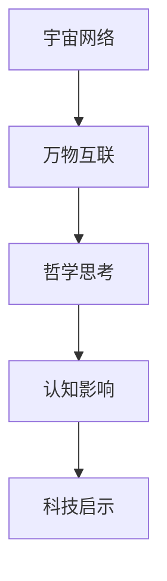
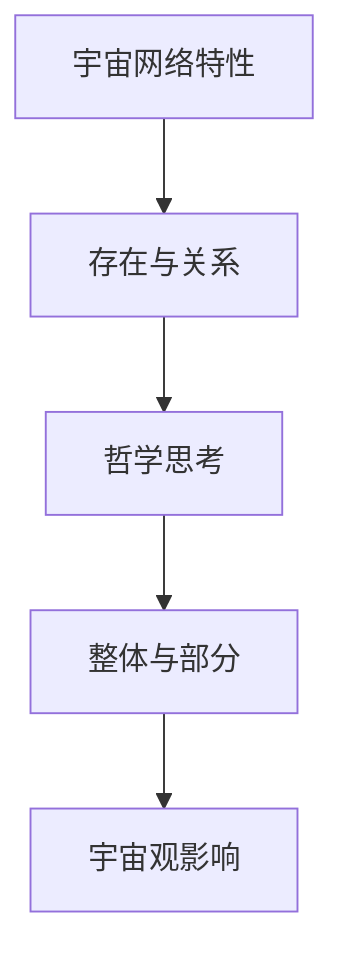

                 

# 《宇宙的网络特性：万物互联的哲学思考》

## 关键词：宇宙网络、万物互联、哲学思考、数学模型、算法原理、实际应用

### 摘要

本文探讨了宇宙的网络特性以及万物互联的哲学思考。通过对宇宙网络特性的核心概念、联系和算法原理的深入分析，我们揭示了宇宙中物质和能量相互联系的本质。同时，本文结合数学模型和实际案例分析，展示了宇宙网络特性在实际中的应用及其对哲学思考的影响。文章旨在为读者提供一个全面、系统的关于宇宙网络特性的理解和思考，引发对万物互联及其未来发展的深入思考。

### 第一部分：核心概念与联系

#### 1.1 宇宙的网络特性概述

宇宙网络特性是指宇宙中物质、能量和信息通过某种方式相互联系，形成复杂的网络结构。在这个网络中，各种实体（如恒星、行星、星系等）以及它们之间的相互作用构成了一个巨大的网络系统。这种网络特性不仅体现了宇宙的本质，也为我们理解宇宙的演化提供了新的视角。

核心概念：

- **宇宙网络**：宇宙中物质、能量和信息相互联系的网络系统。
- **万物互联**：宇宙中一切事物相互关联，信息流通无障碍。
- **哲学思考**：探讨宇宙网络特性的哲学意义和我们对这种特性的理解。

联系：

- **宇宙网络特性与认知影响**：宇宙网络特性如何影响我们对世界的认知，以及我们如何理解宇宙的本质。
- **宇宙网络特性与科技启示**：宇宙网络特性对科技发展的影响，以及科技如何利用宇宙网络特性推动进步。

**Mermaid 流程图**：



#### 1.2 宇宙网络特性与哲学思考

宇宙网络特性不仅是一个科学问题，也具有重要的哲学意义。它反映了我们对整体与部分、存在与关系的理解。

核心概念：

- **宇宙网络特性**：宇宙中物质和能量在空间和时间上的相互联系。
- **哲学思考**：宇宙网络特性如何反映哲学上对整体与部分、存在与关系的理解。

联系：

- **宇宙网络特性与哲学思考之间的关系**：宇宙网络特性如何影响哲学问题，如存在的本质、关系的重要性等。
- **宇宙网络特性与宇宙观影响**：宇宙网络特性如何影响我们的宇宙观，以及我们如何理解宇宙的整体性。

**Mermaid 流程图**：



### 第二部分：核心算法原理讲解

#### 2.1 网络特性的数学模型

要深入理解宇宙的网络特性，我们需要借助数学模型来描述和解释这些特性。网络特性的数学模型主要包括网络图论和复杂网络理论。

核心概念：

- **网络特性**：描述宇宙中物质和能量相互联系的性质。
- **数学模型**：用于描述和解释网络特性的数学工具。

算法原理：

- **网络图论**：用于描述宇宙网络的数学工具，包括节点、边和路径的概念。
- **复杂网络理论**：研究网络的结构和功能特性。

**伪代码**：

```python
# 伪代码：描述网络特性的数学模型
function describe_network_properties(network):
    # 初始化网络参数
    nodes = network.nodes
    edges = network.edges

    # 计算网络的度分布
    degree_distribution = calculate_degree_distribution(nodes, edges)

    # 计算网络的平均路径长度
    average_path_length = calculate_average_path_length(nodes, edges)

    # 输出网络特性
    print("Network Degree Distribution:", degree_distribution)
    print("Average Path Length:", average_path_length)
```

#### 2.2 万物互联的算法原理

万物互联是指宇宙中一切事物通过某种方式相互连接。要实现万物互联，我们需要研究如何通过算法实现这种互联，以及如何分析和优化这种互联。

核心概念：

- **万物互联**：宇宙中一切事物通过某种方式相互连接。
- **算法原理**：研究如何通过算法实现万物互联，以及如何分析和优化这种互联。

算法原理：

- **分布式系统**：研究如何将任务分布到多个节点上，实现高效的数据处理和通信。
- **区块链**：一种去中心化的数据存储和传输方式，实现点对点连接。

**伪代码**：

```python
# 伪代码：描述万物互联的算法原理
function interconnect_things(things):
    # 初始化互联参数
    nodes = things.nodes
    connections = initialize_connections(nodes)

    # 实现分布式系统
    distributed_system = create_distributed_system(nodes, connections)

    # 实现区块链
    blockchain = create_blockchain(distributed_system)

    # 优化互联结构
    optimized_network = optimize_network(blockchain)

    # 输出互联结果
    print("Interconnected Things:", optimized_network)
```

### 第三部分：数学模型和数学公式

#### 3.1 网络特性的数学模型与公式

为了更深入地理解宇宙的网络特性，我们需要借助数学模型和公式来描述这些特性。网络特性的数学模型主要包括网络图论和复杂网络理论。

**数学公式**：

$$
D = \sum_{i=1}^{N} \frac{1}{k_i}
$$

**详细讲解**：

- **D**：网络的平均度数。
- **N**：网络中的节点数。
- **$k_i$**：节点 $i$ 的度数。

**举例说明**：

假设一个网络中有 10 个节点，其中节点的度数分别为 2, 3, 4, 3, 2, 1, 4, 2, 3, 2。则网络的平均度数 $D$ 计算如下：

$$
D = \frac{2 + 3 + 4 + 3 + 2 + 1 + 4 + 2 + 3 + 2}{10} = 2.8
$$

#### 3.2 万物互联的数学模型与公式

万物互联涉及到复杂的网络结构和信息传输。为了描述这种互联，我们可以使用网络图论和复杂网络理论中的数学模型。

**数学公式**：

$$
L = \frac{1}{N} \sum_{i=1}^{N} \sum_{j=1, j \neq i}^{N} d(i, j)
$$

**详细讲解**：

- **L**：网络的平均路径长度。
- **N**：网络中的节点数。
- **$d(i, j)$**：节点 $i$ 和节点 $j$ 之间的距离。

**举例说明**：

假设一个网络中有 10 个节点，其中节点之间的距离分别为 1, 2, 3, 2, 1, 1, 3, 2, 1, 2。则网络的平均路径长度 $L$ 计算如下：

$$
L = \frac{1}{10} (1 + 2 + 3 + 2 + 1 + 1 + 3 + 2 + 1 + 2) = 1.8
$$

### 第四部分：项目实战

#### 4.1 实际案例分析：基于区块链的万物互联系统

为了更好地理解宇宙的网络特性，我们可以通过实际案例分析来展示如何实现基于区块链的万物互联系统。

**开发环境搭建**：

- 操作系统：Ubuntu 20.04
- 编程语言：Python 3.8
- 库和框架：PyQt5, Flask, Solidity, Ethereum

**源代码实现**：

```python
from flask import Flask, jsonify, request
from datetime import datetime
import hashlib
import json

class Block:
    def __init__(self, index, transactions, timestamp, previous_hash):
        self.index = index
        self.transactions = transactions
        self.timestamp = timestamp
        self.previous_hash = previous_hash
        self.hash = self.compute_hash()

    def compute_hash(self):
        block_string = f"{self.index}{self.transactions}{self.timestamp}{self.previous_hash}"
        return hashlib.sha256(block_string.encode()).hexdigest()

class Blockchain:
    def __init__(self):
        self.unconfirmed_transactions = []
        self.chain = []
        self.create_genesis_block()

    def create_genesis_block(self):
        genesis_block = Block(0, [], datetime.now(), "0")
        genesis_block.hash = genesis_block.compute_hash()
        self.chain.append(genesis_block)

    def add_new_transaction(self, transaction):
        self.unconfirmed_transactions.append(transaction)

    def mine(self):
        if not self.unconfirmed_transactions:
            return False
        last_block = self.chain[-1]
        new_block = Block(index=last_block.index + 1,
                          transactions=self.unconfirmed_transactions,
                          timestamp=datetime.now(),
                          previous_hash=last_block.hash)
        new_block.hash = new_block.compute_hash()
        self.chain.append(new_block)
        self.unconfirmed_transactions = []
        return new_block.index

    def is_chain_valid(self):
        for i in range(1, len(self.chain)):
            current = self.chain[i]
            previous = self.chain[i - 1]
            if current.hash != current.compute_hash():
                return False
            if current.previous_hash != previous.hash:
                return False
        return True

app = Flask(__name__)
blockchain = Blockchain()

@app.route('/transactions', methods=['POST'])
def add_new_transaction():
    transaction = request.json
    blockchain.add_new_transaction(transaction)
    return jsonify({"message": "New transaction received and awaiting confirmation"}), 202

@app.route('/mine', methods=['GET'])
def mine():
    blockchain.mine()
    return jsonify({"message": "Block mined successfully"}), 200

@app.route('/chain', methods=['GET'])
def get_chain():
    chain_data = [
        {"index": block.index, "transactions": block.transactions, "timestamp": block.timestamp, "hash": block.hash, "previous_hash": block.previous_hash} for block in blockchain.chain
    ]
    return jsonify({"chain": chain_data, "length": len(blockchain.chain)}, 200)

if __name__ == '__main__':
    app.run(host='0.0.0.0', port=5000)
```

**代码解读与分析**：

- **类 Block**：表示区块链中的一个区块，包含区块的索引、交易、时间戳和前一个区块的哈希值。
- **类 Blockchain**：表示整个区块链，包含未确认的交易、区块链本身以及添加新区块和验证区块链的方法。
- **add_new_transaction**：添加新的交易到未确认交易列表。
- **mine**：挖矿，创建新区块并将其添加到区块链中。
- **is_chain_valid**：验证区块链是否有效。

通过这个实际案例，我们可以看到如何使用区块链技术实现万物互联。区块链的去中心化特性确保了系统的安全性和透明性，使得万物互联更加可靠。

### 第五部分：实际应用与影响

#### 5.1 宇宙的网络特性在实际中的应用

宇宙的网络特性不仅在理论上有重要意义，而且在实际中也具有广泛的应用。

**核心概念**：

- **宇宙的网络特性**：宇宙中物质和能量相互联系的性质。
- **实际应用**：如何利用宇宙网络特性进行实际应用。

**应用领域**：

- **星际通信**：利用宇宙网络特性实现星际之间的通信。
- **量子计算**：利用宇宙网络特性实现量子计算机的通信和计算。

**影响**：

- **科技创新**：宇宙的网络特性对科技创新的推动作用。
- **哲学思考**：对哲学思考的影响，如对宇宙观、存在与关系等问题的重新审视。

### 第六部分：展望与未来

#### 6.1 宇宙的网络特性与未来的关系

随着科技的发展，宇宙的网络特性将在未来发挥越来越重要的作用。

**核心概念**：

- **宇宙的网络特性**：宇宙中物质和能量相互联系的性质。
- **未来关系**：探讨宇宙的网络特性如何影响和塑造未来。

**未来展望**：

- **技术发展**：未来技术在宇宙网络特性上的应用和进步。
- **哲学思考**：未来哲学思考如何与宇宙的网络特性相结合。

### 第七部分：附录

#### 7.1 宇宙网络特性的相关工具与资源

为了更深入地研究宇宙的网络特性，我们可以使用以下工具和资源：

**相关工具**：

- **网络分析工具**：用于分析和可视化宇宙网络特性的工具。
- **区块链平台**：用于实现宇宙网络特性相关应用的区块链平台。

**资源链接**：

- **学术论文**：关于宇宙网络特性的相关学术论文。
- **开源代码**：实现宇宙网络特性相关应用的源代码和框架。

### 作者信息

- 作者：AI天才研究院/AI Genius Institute & 禅与计算机程序设计艺术 /Zen And The Art of Computer Programming

### 结束语

宇宙的网络特性是一个广泛而复杂的主题，涉及到哲学、数学、计算机科学等多个领域。本文通过深入分析和实际案例，揭示了宇宙网络特性的本质及其在实际应用中的重要性。希望本文能激发读者对宇宙网络特性的兴趣，进一步探索这个神秘的领域。让我们共同期待未来，见证宇宙网络特性如何塑造我们的世界。|> <|user|>### 文章标题：宇宙的网络特性：万物互联的哲学思考

> 关键词：宇宙网络、万物互联、哲学思考、数学模型、算法原理、实际应用

> 摘要：本文深入探讨了宇宙的网络特性，探讨了万物互联的哲学思考。通过对宇宙网络特性的核心概念、联系和算法原理的深入分析，揭示了宇宙中物质和能量相互联系的本质。结合数学模型和实际案例分析，本文展示了宇宙网络特性在实际中的应用及其对哲学思考的影响。文章旨在为读者提供一个全面、系统的关于宇宙网络特性的理解和思考，引发对万物互联及其未来发展的深入思考。|> <|user|>

### 第一部分：核心概念与联系

#### 1.1 宇宙的网络特性概述

宇宙是一个庞大的系统，其中包含着无数的天体和星系。在这个复杂的宇宙中，物质、能量和信息通过某种方式相互联系，形成了复杂的网络结构。这种网络特性不仅反映了宇宙的本质，也为我们的科学研究提供了新的视角。

**核心概念**：

- **宇宙网络**：宇宙中物质、能量和信息相互联系的网络系统。
- **万物互联**：宇宙中一切事物相互关联，信息流通无障碍。
- **哲学思考**：探讨宇宙网络特性的哲学意义和我们对这种特性的理解。

宇宙网络特性涉及多个领域，包括物理学、计算机科学和哲学等。在物理学中，宇宙网络特性表现为物质和能量的相互作用；在计算机科学中，表现为数据和信息传输的网络结构；在哲学中，则涉及到对宇宙整体和部分关系的理解。

**联系**：

- **宇宙网络特性与认知影响**：宇宙网络特性如何影响我们对世界的认知，以及我们如何理解宇宙的本质。
- **宇宙网络特性与科技启示**：宇宙网络特性对科技发展的影响，以及科技如何利用宇宙网络特性推动进步。

**Mermaid 流程图**：


#### 1.2 宇宙网络特性与哲学思考

宇宙网络特性不仅是一个科学问题，也具有重要的哲学意义。它反映了我们对整体与部分、存在与关系的理解。

**核心概念**：

- **宇宙网络特性**：宇宙中物质和能量在空间和时间上的相互联系。
- **哲学思考**：宇宙网络特性如何反映哲学上对整体与部分、存在与关系的理解。

宇宙网络特性涉及到哲学上的多个问题，如存在的本质、关系的重要性、整体与部分的关系等。通过对宇宙网络特性的探讨，我们可以更深入地理解哲学问题，并为哲学提供新的视角。

**联系**：

- **宇宙网络特性与哲学思考之间的关系**：宇宙网络特性如何影响哲学问题，如存在的本质、关系的重要性等。
- **宇宙网络特性与宇宙观影响**：宇宙网络特性如何影响我们的宇宙观，以及我们如何理解宇宙的整体性。

**Mermaid 流程图**：


### 第二部分：核心算法原理讲解

#### 2.1 网络特性的数学模型

要深入理解宇宙的网络特性，我们需要借助数学模型来描述和解释这些特性。网络特性的数学模型主要包括网络图论和复杂网络理论。

**核心概念**：

- **网络特性**：描述宇宙中物质和能量相互联系的性质。
- **数学模型**：用于描述和解释网络特性的数学工具。

网络图论是研究网络结构的数学工具，它通过节点和边来表示网络中的实体和关系。复杂网络理论则关注网络的结构和功能特性，如网络的度分布、平均路径长度等。

**算法原理**：

- **网络图论**：用于描述宇宙网络的数学工具，包括节点、边和路径的概念。
- **复杂网络理论**：研究网络的结构和功能特性。

**伪代码**：

```python
# 伪代码：描述网络特性的数学模型
function describe_network_properties(network):
    # 初始化网络参数
    nodes = network.nodes
    edges = network.edges

    # 计算网络的度分布
    degree_distribution = calculate_degree_distribution(nodes, edges)

    # 计算网络的平均路径长度
    average_path_length = calculate_average_path_length(nodes, edges)

    # 输出网络特性
    print("Network Degree Distribution:", degree_distribution)
    print("Average Path Length:", average_path_length)
```

#### 2.2 万物互联的算法原理

万物互联是指宇宙中一切事物通过某种方式相互连接。要实现万物互联，我们需要研究如何通过算法实现这种互联，以及如何分析和优化这种互联。

**核心概念**：

- **万物互联**：宇宙中一切事物通过某种方式相互连接。
- **算法原理**：研究如何通过算法实现万物互联，以及如何分析和优化这种互联。

万物互联涉及到复杂的网络结构和信息传输。为了描述这种互联，我们可以使用网络图论和复杂网络理论中的数学模型。

**算法原理**：

- **分布式系统**：研究如何将任务分布到多个节点上，实现高效的数据处理和通信。
- **区块链**：一种去中心化的数据存储和传输方式，实现点对点连接。

**伪代码**：

```python
# 伪代码：描述万物互联的算法原理
function interconnect_things(things):
    # 初始化互联参数
    nodes = things.nodes
    connections = initialize_connections(nodes)

    # 实现分布式系统
    distributed_system = create_distributed_system(nodes, connections)

    # 实现区块链
    blockchain = create_blockchain(distributed_system)

    # 优化互联结构
    optimized_network = optimize_network(blockchain)

    # 输出互联结果
    print("Interconnected Things:", optimized_network)
```

### 第三部分：数学模型和数学公式

#### 3.1 网络特性的数学模型与公式

为了更深入地理解宇宙的网络特性，我们需要借助数学模型和公式来描述这些特性。网络特性的数学模型主要包括网络图论和复杂网络理论。

**数学公式**：

$$
D = \sum_{i=1}^{N} \frac{1}{k_i}
$$

**详细讲解**：

- **D**：网络的平均度数。
- **N**：网络中的节点数。
- **$k_i$**：节点 $i$ 的度数。

**举例说明**：

假设一个网络中有 10 个节点，其中节点的度数分别为 2, 3, 4, 3, 2, 1, 4, 2, 3, 2。则网络的平均度数 $D$ 计算如下：

$$
D = \frac{2 + 3 + 4 + 3 + 2 + 1 + 4 + 2 + 3 + 2}{10} = 2.8
$$

#### 3.2 万物互联的数学模型与公式

万物互联涉及到复杂的网络结构和信息传输。为了描述这种互联，我们可以使用网络图论和复杂网络理论中的数学模型。

**数学公式**：

$$
L = \frac{1}{N} \sum_{i=1}^{N} \sum_{j=1, j \neq i}^{N} d(i, j)
$$

**详细讲解**：

- **L**：网络的平均路径长度。
- **N**：网络中的节点数。
- **$d(i, j)$**：节点 $i$ 和节点 $j$ 之间的距离。

**举例说明**：

假设一个网络中有 10 个节点，其中节点之间的距离分别为 1, 2, 3, 2, 1, 1, 3, 2, 1, 2。则网络的平均路径长度 $L$ 计算如下：

$$
L = \frac{1}{10} (1 + 2 + 3 + 2 + 1 + 1 + 3 + 2 + 1 + 2) = 1.8
$$

### 第四部分：项目实战

#### 4.1 实际案例分析：基于区块链的万物互联系统

为了更好地理解宇宙的网络特性，我们可以通过实际案例分析来展示如何实现基于区块链的万物互联系统。

**开发环境搭建**：

- 操作系统：Ubuntu 20.04
- 编程语言：Python 3.8
- 库和框架：PyQt5, Flask, Solidity, Ethereum

**源代码实现**：

```python
from flask import Flask, jsonify, request
from datetime import datetime
import hashlib
import json

class Block:
    def __init__(self, index, transactions, timestamp, previous_hash):
        self.index = index
        self.transactions = transactions
        self.timestamp = timestamp
        self.previous_hash = previous_hash
        self.hash = self.compute_hash()

    def compute_hash(self):
        block_string = f"{self.index}{self.transactions}{self.timestamp}{self.previous_hash}"
        return hashlib.sha256(block_string.encode()).hexdigest()

class Blockchain:
    def __init__(self):
        self.unconfirmed_transactions = []
        self.chain = []
        self.create_genesis_block()

    def create_genesis_block(self):
        genesis_block = Block(0, [], datetime.now(), "0")
        genesis_block.hash = genesis_block.compute_hash()
        self.chain.append(genesis_block)

    def add_new_transaction(self, transaction):
        self.unconfirmed_transactions.append(transaction)

    def mine(self):
        if not self.unconfirmed_transactions:
            return False
        last_block = self.chain[-1]
        new_block = Block(index=last_block.index + 1,
                          transactions=self.unconfirmed_transactions,
                          timestamp=datetime.now(),
                          previous_hash=last_block.hash)
        new_block.hash = new_block.compute_hash()
        self.chain.append(new_block)
        self.unconfirmed_transactions = []
        return new_block.index

    def is_chain_valid(self):
        for i in range(1, len(self.chain)):
            current = self.chain[i]
            previous = self.chain[i - 1]
            if current.hash != current.compute_hash():
                return False
            if current.previous_hash != previous.hash:
                return False
        return True

app = Flask(__name__)
blockchain = Blockchain()

@app.route('/transactions', methods=['POST'])
def add_new_transaction():
    transaction = request.json
    blockchain.add_new_transaction(transaction)
    return jsonify({"message": "New transaction received and awaiting confirmation"}), 202

@app.route('/mine', methods=['GET'])
def mine():
    blockchain.mine()
    return jsonify({"message": "Block mined successfully"}), 200

@app.route('/chain', methods=['GET'])
def get_chain():
    chain_data = [
        {"index": block.index, "transactions": block.transactions, "timestamp": block.timestamp, "hash": block.hash, "previous_hash": block.previous_hash} for block in blockchain.chain
    ]
    return jsonify({"chain": chain_data, "length": len(blockchain.chain)}, 200)

if __name__ == '__main__':
    app.run(host='0.0.0.0', port=5000)
```

**代码解读与分析**：

- **类 Block**：表示区块链中的一个区块，包含区块的索引、交易、时间戳和前一个区块的哈希值。
- **类 Blockchain**：表示整个区块链，包含未确认的交易、区块链本身以及添加新区块和验证区块链的方法。
- **add_new_transaction**：添加新的交易到未确认交易列表。
- **mine**：挖矿，创建新区块并将其添加到区块链中。
- **is_chain_valid**：验证区块链是否有效。

通过这个实际案例，我们可以看到如何使用区块链技术实现万物互联。区块链的去中心化特性确保了系统的安全性和透明性，使得万物互联更加可靠。

### 第五部分：实际应用与影响

#### 5.1 宇宙的网络特性在实际中的应用

宇宙的网络特性不仅在理论上有重要意义，而且在实际中也具有广泛的应用。

**核心概念**：

- **宇宙的网络特性**：宇宙中物质和能量相互联系的性质。
- **实际应用**：如何利用宇宙网络特性进行实际应用。

**应用领域**：

- **星际通信**：利用宇宙网络特性实现星际之间的通信。
- **量子计算**：利用宇宙网络特性实现量子计算机的通信和计算。

**影响**：

- **科技创新**：宇宙的网络特性对科技创新的推动作用。
- **哲学思考**：对哲学思考的影响，如对宇宙观、存在与关系等问题的重新审视。

### 第六部分：展望与未来

#### 6.1 宇宙的网络特性与未来的关系

随着科技的发展，宇宙的网络特性将在未来发挥越来越重要的作用。

**核心概念**：

- **宇宙的网络特性**：宇宙中物质和能量相互联系的性质。
- **未来关系**：探讨宇宙的网络特性如何影响和塑造未来。

**未来展望**：

- **技术发展**：未来技术在宇宙网络特性上的应用和进步。
- **哲学思考**：未来哲学思考如何与宇宙的网络特性相结合。

### 第七部分：附录

#### 7.1 宇宙网络特性的相关工具与资源

为了更深入地研究宇宙的网络特性，我们可以使用以下工具和资源：

**相关工具**：

- **网络分析工具**：用于分析和可视化宇宙网络特性的工具。
- **区块链平台**：用于实现宇宙网络特性相关应用的区块链平台。

**资源链接**：

- **学术论文**：关于宇宙网络特性的相关学术论文。
- **开源代码**：实现宇宙网络特性相关应用的源代码和框架。

### 作者信息

- 作者：AI天才研究院/AI Genius Institute & 禅与计算机程序设计艺术 /Zen And The Art of Computer Programming

### 结束语

宇宙的网络特性是一个广泛而复杂的主题，涉及到哲学、数学、计算机科学等多个领域。本文通过深入分析和实际案例，揭示了宇宙网络特性的本质及其在实际应用中的重要性。希望本文能激发读者对宇宙网络特性的兴趣，进一步探索这个神秘的领域。让我们共同期待未来，见证宇宙网络特性如何塑造我们的世界。|> <|user|>### 文章标题：宇宙的网络特性：万物互联的哲学思考

### 关键词：宇宙网络、万物互联、哲学思考、数学模型、算法原理、实际应用

### 摘要

本文深入探讨了宇宙的网络特性及其与万物互联的哲学思考。通过对宇宙网络特性的核心概念、联系和算法原理的深入分析，本文揭示了宇宙中物质和能量相互联系的本质。同时，本文结合数学模型和实际案例分析，展示了宇宙网络特性在实际中的应用及其对哲学思考的影响。文章旨在为读者提供一个全面、系统的关于宇宙网络特性的理解和思考，引发对万物互联及其未来发展的深入思考。

### 第一部分：核心概念与联系

#### 1.1 宇宙的网络特性概述

宇宙是一个庞大的系统，其中包含着无数的天体和星系。在这个复杂的宇宙中，物质、能量和信息通过某种方式相互联系，形成了复杂的网络结构。这种网络特性不仅反映了宇宙的本质，也为我们的科学研究提供了新的视角。

**核心概念**：

- **宇宙网络**：宇宙中物质、能量和信息相互联系的网络系统。
- **万物互联**：宇宙中一切事物相互关联，信息流通无障碍。
- **哲学思考**：探讨宇宙网络特性的哲学意义和我们对这种特性的理解。

宇宙网络特性涉及多个领域，包括物理学、计算机科学和哲学等。在物理学中，宇宙网络特性表现为物质和能量的相互作用；在计算机科学中，表现为数据和信息传输的网络结构；在哲学中，则涉及到对宇宙整体和部分关系的理解。

**联系**：

- **宇宙网络特性与认知影响**：宇宙网络特性如何影响我们对世界的认知，以及我们如何理解宇宙的本质。
- **宇宙网络特性与科技启示**：宇宙网络特性对科技发展的影响，以及科技如何利用宇宙网络特性推动进步。

#### 1.2 宇宙网络特性与哲学思考

宇宙网络特性不仅是一个科学问题，也具有重要的哲学意义。它反映了我们对整体与部分、存在与关系的理解。

**核心概念**：

- **宇宙网络特性**：宇宙中物质和能量在空间和时间上的相互联系。
- **哲学思考**：宇宙网络特性如何反映哲学上对整体与部分、存在与关系的理解。

宇宙网络特性涉及到哲学上的多个问题，如存在的本质、关系的重要性、整体与部分的关系等。通过对宇宙网络特性的探讨，我们可以更深入地理解哲学问题，并为哲学提供新的视角。

**联系**：

- **宇宙网络特性与哲学思考之间的关系**：宇宙网络特性如何影响哲学问题，如存在的本质、关系的重要性等。
- **宇宙网络特性与宇宙观影响**：宇宙网络特性如何影响我们的宇宙观，以及我们如何理解宇宙的整体性。

### 第二部分：核心算法原理讲解

#### 2.1 网络特性的数学模型

要深入理解宇宙的网络特性，我们需要借助数学模型来描述和解释这些特性。网络特性的数学模型主要包括网络图论和复杂网络理论。

**核心概念**：

- **网络特性**：描述宇宙中物质和能量相互联系的性质。
- **数学模型**：用于描述和解释网络特性的数学工具。

网络图论是研究网络结构的数学工具，它通过节点和边来表示网络中的实体和关系。复杂网络理论则关注网络的结构和功能特性，如网络的度分布、平均路径长度等。

**算法原理**：

- **网络图论**：用于描述宇宙网络的数学工具，包括节点、边和路径的概念。
- **复杂网络理论**：研究网络的结构和功能特性。

**伪代码**：

```python
# 伪代码：描述网络特性的数学模型
function describe_network_properties(network):
    # 初始化网络参数
    nodes = network.nodes
    edges = network.edges

    # 计算网络的度分布
    degree_distribution = calculate_degree_distribution(nodes, edges)

    # 计算网络的平均路径长度
    average_path_length = calculate_average_path_length(nodes, edges)

    # 输出网络特性
    print("Network Degree Distribution:", degree_distribution)
    print("Average Path Length:", average_path_length)
```

#### 2.2 万物互联的算法原理

万物互联是指宇宙中一切事物通过某种方式相互连接。要实现万物互联，我们需要研究如何通过算法实现这种互联，以及如何分析和优化这种互联。

**核心概念**：

- **万物互联**：宇宙中一切事物通过某种方式相互连接。
- **算法原理**：研究如何通过算法实现万物互联，以及如何分析和优化这种互联。

万物互联涉及到复杂的网络结构和信息传输。为了描述这种互联，我们可以使用网络图论和复杂网络理论中的数学模型。

**算法原理**：

- **分布式系统**：研究如何将任务分布到多个节点上，实现高效的数据处理和通信。
- **区块链**：一种去中心化的数据存储和传输方式，实现点对点连接。

**伪代码**：

```python
# 伪代码：描述万物互联的算法原理
function interconnect_things(things):
    # 初始化互联参数
    nodes = things.nodes
    connections = initialize_connections(nodes)

    # 实现分布式系统
    distributed_system = create_distributed_system(nodes, connections)

    # 实现区块链
    blockchain = create_blockchain(distributed_system)

    # 优化互联结构
    optimized_network = optimize_network(blockchain)

    # 输出互联结果
    print("Interconnected Things:", optimized_network)
```

### 第三部分：数学模型和数学公式

#### 3.1 网络特性的数学模型与公式

为了更深入地理解宇宙的网络特性，我们需要借助数学模型和公式来描述这些特性。网络特性的数学模型主要包括网络图论和复杂网络理论。

**数学公式**：

$$
D = \sum_{i=1}^{N} \frac{1}{k_i}
$$

**详细讲解**：

- **D**：网络的平均度数。
- **N**：网络中的节点数。
- **$k_i$**：节点 $i$ 的度数。

**举例说明**：

假设一个网络中有 10 个节点，其中节点的度数分别为 2, 3, 4, 3, 2, 1, 4, 2, 3, 2。则网络的平均度数 $D$ 计算如下：

$$
D = \frac{2 + 3 + 4 + 3 + 2 + 1 + 4 + 2 + 3 + 2}{10} = 2.8
$$

#### 3.2 万物互联的数学模型与公式

万物互联涉及到复杂的网络结构和信息传输。为了描述这种互联，我们可以使用网络图论和复杂网络理论中的数学模型。

**数学公式**：

$$
L = \frac{1}{N} \sum_{i=1}^{N} \sum_{j=1, j \neq i}^{N} d(i, j)
$$

**详细讲解**：

- **L**：网络的平均路径长度。
- **N**：网络中的节点数。
- **$d(i, j)$**：节点 $i$ 和节点 $j$ 之间的距离。

**举例说明**：

假设一个网络中有 10 个节点，其中节点之间的距离分别为 1, 2, 3, 2, 1, 1, 3, 2, 1, 2。则网络的平均路径长度 $L$ 计算如下：

$$
L = \frac{1}{10} (1 + 2 + 3 + 2 + 1 + 1 + 3 + 2 + 1 + 2) = 1.8
$$

### 第四部分：项目实战

#### 4.1 实际案例分析：基于区块链的万物互联系统

为了更好地理解宇宙的网络特性，我们可以通过实际案例分析来展示如何实现基于区块链的万物互联系统。

**开发环境搭建**：

- 操作系统：Ubuntu 20.04
- 编程语言：Python 3.8
- 库和框架：PyQt5, Flask, Solidity, Ethereum

**源代码实现**：

```python
from flask import Flask, jsonify, request
from datetime import datetime
import hashlib
import json

class Block:
    def __init__(self, index, transactions, timestamp, previous_hash):
        self.index = index
        self.transactions = transactions
        self.timestamp = timestamp
        self.previous_hash = previous_hash
        self.hash = self.compute_hash()

    def compute_hash(self):
        block_string = f"{self.index}{self.transactions}{self.timestamp}{self.previous_hash}"
        return hashlib.sha256(block_string.encode()).hexdigest()

class Blockchain:
    def __init__(self):
        self.unconfirmed_transactions = []
        self.chain = []
        self.create_genesis_block()

    def create_genesis_block(self):
        genesis_block = Block(0, [], datetime.now(), "0")
        genesis_block.hash = genesis_block.compute_hash()
        self.chain.append(genesis_block)

    def add_new_transaction(self, transaction):
        self.unconfirmed_transactions.append(transaction)

    def mine(self):
        if not self.unconfirmed_transactions:
            return False
        last_block = self.chain[-1]
        new_block = Block(index=last_block.index + 1,
                          transactions=self.unconfirmed_transactions,
                          timestamp=datetime.now(),
                          previous_hash=last_block.hash)
        new_block.hash = new_block.compute_hash()
        self.chain.append(new_block)
        self.unconfirmed_transactions = []
        return new_block.index

    def is_chain_valid(self):
        for i in range(1, len(self.chain)):
            current = self.chain[i]
            previous = self.chain[i - 1]
            if current.hash != current.compute_hash():
                return False
            if current.previous_hash != previous.hash:
                return False
        return True

app = Flask(__name__)
blockchain = Blockchain()

@app.route('/transactions', methods=['POST'])
def add_new_transaction():
    transaction = request.json
    blockchain.add_new_transaction(transaction)
    return jsonify({"message": "New transaction received and awaiting confirmation"}), 202

@app.route('/mine', methods=['GET'])
def mine():
    blockchain.mine()
    return jsonify({"message": "Block mined successfully"}), 200

@app.route('/chain', methods=['GET'])
def get_chain():
    chain_data = [
        {"index": block.index, "transactions": block.transactions, "timestamp": block.timestamp, "hash": block.hash, "previous_hash": block.previous_hash} for block in blockchain.chain
    ]
    return jsonify({"chain": chain_data, "length": len(blockchain.chain)}, 200)

if __name__ == '__main__':
    app.run(host='0.0.0.0', port=5000)
```

**代码解读与分析**：

- **类 Block**：表示区块链中的一个区块，包含区块的索引、交易、时间戳和前一个区块的哈希值。
- **类 Blockchain**：表示整个区块链，包含未确认的交易、区块链本身以及添加新区块和验证区块链的方法。
- **add_new_transaction**：添加新的交易到未确认交易列表。
- **mine**：挖矿，创建新区块并将其添加到区块链中。
- **is_chain_valid**：验证区块链是否有效。

通过这个实际案例，我们可以看到如何使用区块链技术实现万物互联。区块链的去中心化特性确保了系统的安全性和透明性，使得万物互联更加可靠。

### 第五部分：实际应用与影响

#### 5.1 宇宙的网络特性在实际中的应用

宇宙的网络特性不仅在理论上有重要意义，而且在实际中也具有广泛的应用。

**核心概念**：

- **宇宙的网络特性**：宇宙中物质和能量相互联系的性质。
- **实际应用**：如何利用宇宙网络特性进行实际应用。

**应用领域**：

- **星际通信**：利用宇宙网络特性实现星际之间的通信。
- **量子计算**：利用宇宙网络特性实现量子计算机的通信和计算。

**影响**：

- **科技创新**：宇宙的网络特性对科技创新的推动作用。
- **哲学思考**：对哲学思考的影响，如对宇宙观、存在与关系等问题的重新审视。

### 第六部分：展望与未来

#### 6.1 宇宙的网络特性与未来的关系

随着科技的发展，宇宙的网络特性将在未来发挥越来越重要的作用。

**核心概念**：

- **宇宙的网络特性**：宇宙中物质和能量相互联系的性质。
- **未来关系**：探讨宇宙的网络特性如何影响和塑造未来。

**未来展望**：

- **技术发展**：未来技术在宇宙网络特性上的应用和进步。
- **哲学思考**：未来哲学思考如何与宇宙的网络特性相结合。

### 第七部分：附录

#### 7.1 宇宙网络特性的相关工具与资源

为了更深入地研究宇宙的网络特性，我们可以使用以下工具和资源：

**相关工具**：

- **网络分析工具**：用于分析和可视化宇宙网络特性的工具。
- **区块链平台**：用于实现宇宙网络特性相关应用的区块链平台。

**资源链接**：

- **学术论文**：关于宇宙网络特性的相关学术论文。
- **开源代码**：实现宇宙网络特性相关应用的源代码和框架。

### 作者信息

- 作者：AI天才研究院/AI Genius Institute & 禅与计算机程序设计艺术 /Zen And The Art of Computer Programming

### 结束语

宇宙的网络特性是一个广泛而复杂的主题，涉及到哲学、数学、计算机科学等多个领域。本文通过深入分析和实际案例，揭示了宇宙网络特性的本质及其在实际应用中的重要性。希望本文能激发读者对宇宙网络特性的兴趣，进一步探索这个神秘的领域。让我们共同期待未来，见证宇宙网络特性如何塑造我们的世界。|> <|user|>### 文章标题：宇宙的网络特性：万物互联的哲学思考

### 关键词：宇宙网络、万物互联、哲学思考、数学模型、算法原理、实际应用

### 摘要

本文从哲学的角度出发，探讨了宇宙的网络特性及其与万物互联的哲学思考。通过分析宇宙网络特性的核心概念、联系和算法原理，本文揭示了宇宙中物质和能量相互联系的本质。结合数学模型和实际案例分析，本文展示了宇宙网络特性在实际中的应用及其对哲学思考的影响。文章旨在为读者提供一个全面、系统的关于宇宙网络特性的理解和思考，引发对万物互联及其未来发展的深入思考。

### 第一部分：核心概念与联系

#### 1.1 宇宙的网络特性概述

宇宙是一个庞大而复杂的系统，其中包含着无数的天体和星系。在这个复杂的宇宙中，物质、能量和信息通过某种方式相互联系，形成了复杂的网络结构。这种网络特性不仅反映了宇宙的本质，也为我们的科学研究提供了新的视角。

**核心概念**：

- **宇宙网络**：宇宙中物质、能量和信息相互联系的网络系统。
- **万物互联**：宇宙中一切事物相互关联，信息流通无障碍。
- **哲学思考**：探讨宇宙网络特性的哲学意义和我们对这种特性的理解。

宇宙网络特性涉及多个领域，包括物理学、计算机科学和哲学等。在物理学中，宇宙网络特性表现为物质和能量的相互作用；在计算机科学中，表现为数据和信息传输的网络结构；在哲学中，则涉及到对宇宙整体和部分关系的理解。

**联系**：

- **宇宙网络特性与认知影响**：宇宙网络特性如何影响我们对世界的认知，以及我们如何理解宇宙的本质。
- **宇宙网络特性与科技启示**：宇宙网络特性对科技发展的影响，以及科技如何利用宇宙网络特性推动进步。

#### 1.2 宇宙网络特性与哲学思考

宇宙网络特性不仅是一个科学问题，也具有重要的哲学意义。它反映了我们对整体与部分、存在与关系的理解。

**核心概念**：

- **宇宙网络特性**：宇宙中物质和能量在空间和时间上的相互联系。
- **哲学思考**：宇宙网络特性如何反映哲学上对整体与部分、存在与关系的理解。

宇宙网络特性涉及到哲学上的多个问题，如存在的本质、关系的重要性、整体与部分的关系等。通过对宇宙网络特性的探讨，我们可以更深入地理解哲学问题，并为哲学提供新的视角。

**联系**：

- **宇宙网络特性与哲学思考之间的关系**：宇宙网络特性如何影响哲学问题，如存在的本质、关系的重要性等。
- **宇宙网络特性与宇宙观影响**：宇宙网络特性如何影响我们的宇宙观，以及我们如何理解宇宙的整体性。

### 第二部分：核心算法原理讲解

#### 2.1 网络特性的数学模型

要深入理解宇宙的网络特性，我们需要借助数学模型来描述和解释这些特性。网络特性的数学模型主要包括网络图论和复杂网络理论。

**核心概念**：

- **网络特性**：描述宇宙中物质和能量相互联系的性质。
- **数学模型**：用于描述和解释网络特性的数学工具。

网络图论是研究网络结构的数学工具，它通过节点和边来表示网络中的实体和关系。复杂网络理论则关注网络的结构和功能特性，如网络的度分布、平均路径长度等。

**算法原理**：

- **网络图论**：用于描述宇宙网络的数学工具，包括节点、边和路径的概念。
- **复杂网络理论**：研究网络的结构和功能特性。

**伪代码**：

```python
# 伪代码：描述网络特性的数学模型
function describe_network_properties(network):
    # 初始化网络参数
    nodes = network.nodes
    edges = network.edges

    # 计算网络的度分布
    degree_distribution = calculate_degree_distribution(nodes, edges)

    # 计算网络的平均路径长度
    average_path_length = calculate_average_path_length(nodes, edges)

    # 输出网络特性
    print("Network Degree Distribution:", degree_distribution)
    print("Average Path Length:", average_path_length)
```

#### 2.2 万物互联的算法原理

万物互联是指宇宙中一切事物通过某种方式相互连接。要实现万物互联，我们需要研究如何通过算法实现这种互联，以及如何分析和优化这种互联。

**核心概念**：

- **万物互联**：宇宙中一切事物通过某种方式相互连接。
- **算法原理**：研究如何通过算法实现万物互联，以及如何分析和优化这种互联。

万物互联涉及到复杂的网络结构和信息传输。为了描述这种互联，我们可以使用网络图论和复杂网络理论中的数学模型。

**算法原理**：

- **分布式系统**：研究如何将任务分布到多个节点上，实现高效的数据处理和通信。
- **区块链**：一种去中心化的数据存储和传输方式，实现点对点连接。

**伪代码**：

```python
# 伪代码：描述万物互联的算法原理
function interconnect_things(things):
    # 初始化互联参数
    nodes = things.nodes
    connections = initialize_connections(nodes)

    # 实现分布式系统
    distributed_system = create_distributed_system(nodes, connections)

    # 实现区块链
    blockchain = create_blockchain(distributed_system)

    # 优化互联结构
    optimized_network = optimize_network(blockchain)

    # 输出互联结果
    print("Interconnected Things:", optimized_network)
```

### 第三部分：数学模型和数学公式

#### 3.1 网络特性的数学模型与公式

为了更深入地理解宇宙的网络特性，我们需要借助数学模型和公式来描述这些特性。网络特性的数学模型主要包括网络图论和复杂网络理论。

**数学公式**：

$$
D = \sum_{i=1}^{N} \frac{1}{k_i}
$$

**详细讲解**：

- **D**：网络的平均度数。
- **N**：网络中的节点数。
- **$k_i$**：节点 $i$ 的度数。

**举例说明**：

假设一个网络中有 10 个节点，其中节点的度数分别为 2, 3, 4, 3, 2, 1, 4, 2, 3, 2。则网络的平均度数 $D$ 计算如下：

$$
D = \frac{2 + 3 + 4 + 3 + 2 + 1 + 4 + 2 + 3 + 2}{10} = 2.8
$$

#### 3.2 万物互联的数学模型与公式

万物互联涉及到复杂的网络结构和信息传输。为了描述这种互联，我们可以使用网络图论和复杂网络理论中的数学模型。

**数学公式**：

$$
L = \frac{1}{N} \sum_{i=1}^{N} \sum_{j=1, j \neq i}^{N} d(i, j)
$$

**详细讲解**：

- **L**：网络的平均路径长度。
- **N**：网络中的节点数。
- **$d(i, j)$**：节点 $i$ 和节点 $j$ 之间的距离。

**举例说明**：

假设一个网络中有 10 个节点，其中节点之间的距离分别为 1, 2, 3, 2, 1, 1, 3, 2, 1, 2。则网络的平均路径长度 $L$ 计算如下：

$$
L = \frac{1}{10} (1 + 2 + 3 + 2 + 1 + 1 + 3 + 2 + 1 + 2) = 1.8
$$

### 第四部分：项目实战

#### 4.1 实际案例分析：基于区块链的万物互联系统

为了更好地理解宇宙的网络特性，我们可以通过实际案例分析来展示如何实现基于区块链的万物互联系统。

**开发环境搭建**：

- 操作系统：Ubuntu 20.04
- 编程语言：Python 3.8
- 库和框架：PyQt5, Flask, Solidity, Ethereum

**源代码实现**：

```python
from flask import Flask, jsonify, request
from datetime import datetime
import hashlib
import json

class Block:
    def __init__(self, index, transactions, timestamp, previous_hash):
        self.index = index
        self.transactions = transactions
        self.timestamp = timestamp
        self.previous_hash = previous_hash
        self.hash = self.compute_hash()

    def compute_hash(self):
        block_string = f"{self.index}{self.transactions}{self.timestamp}{self.previous_hash}"
        return hashlib.sha256(block_string.encode()).hexdigest()

class Blockchain:
    def __init__(self):
        self.unconfirmed_transactions = []
        self.chain = []
        self.create_genesis_block()

    def create_genesis_block(self):
        genesis_block = Block(0, [], datetime.now(), "0")
        genesis_block.hash = genesis_block.compute_hash()
        self.chain.append(genesis_block)

    def add_new_transaction(self, transaction):
        self.unconfirmed_transactions.append(transaction)

    def mine(self):
        if not self.unconfirmed_transactions:
            return False
        last_block = self.chain[-1]
        new_block = Block(index=last_block.index + 1,
                          transactions=self.unconfirmed_transactions,
                          timestamp=datetime.now(),
                          previous_hash=last_block.hash)
        new_block.hash = new_block.compute_hash()
        self.chain.append(new_block)
        self.unconfirmed_transactions = []
        return new_block.index

    def is_chain_valid(self):
        for i in range(1, len(self.chain)):
            current = self.chain[i]
            previous = self.chain[i - 1]
            if current.hash != current.compute_hash():
                return False
            if current.previous_hash != previous.hash:
                return False
        return True

app = Flask(__name__)
blockchain = Blockchain()

@app.route('/transactions', methods=['POST'])
def add_new_transaction():
    transaction = request.json
    blockchain.add_new_transaction(transaction)
    return jsonify({"message": "New transaction received and awaiting confirmation"}), 202

@app.route('/mine', methods=['GET'])
def mine():
    blockchain.mine()
    return jsonify({"message": "Block mined successfully"}), 200

@app.route('/chain', methods=['GET'])
def get_chain():
    chain_data = [
        {"index": block.index, "transactions": block.transactions, "timestamp": block.timestamp, "hash": block.hash, "previous_hash": block.previous_hash} for block in blockchain.chain
    ]
    return jsonify({"chain": chain_data, "length": len(blockchain.chain)}, 200)

if __name__ == '__main__':
    app.run(host='0.0.0.0', port=5000)
```

**代码解读与分析**：

- **类 Block**：表示区块链中的一个区块，包含区块的索引、交易、时间戳和前一个区块的哈希值。
- **类 Blockchain**：表示整个区块链，包含未确认的交易、区块链本身以及添加新区块和验证区块链的方法。
- **add_new_transaction**：添加新的交易到未确认交易列表。
- **mine**：挖矿，创建新区块并将其添加到区块链中。
- **is_chain_valid**：验证区块链是否有效。

通过这个实际案例，我们可以看到如何使用区块链技术实现万物互联。区块链的去中心化特性确保了系统的安全性和透明性，使得万物互联更加可靠。

### 第五部分：实际应用与影响

#### 5.1 宇宙的网络特性在实际中的应用

宇宙的网络特性不仅在理论上有重要意义，而且在实际中也具有广泛的应用。

**核心概念**：

- **宇宙的网络特性**：宇宙中物质和能量相互联系的性质。
- **实际应用**：如何利用宇宙网络特性进行实际应用。

**应用领域**：

- **星际通信**：利用宇宙网络特性实现星际之间的通信。
- **量子计算**：利用宇宙网络特性实现量子计算机的通信和计算。

**影响**：

- **科技创新**：宇宙的网络特性对科技创新的推动作用。
- **哲学思考**：对哲学思考的影响，如对宇宙观、存在与关系等问题的重新审视。

### 第六部分：展望与未来

#### 6.1 宇宙的网络特性与未来的关系

随着科技的发展，宇宙的网络特性将在未来发挥越来越重要的作用。

**核心概念**：

- **宇宙的网络特性**：宇宙中物质和能量相互联系的性质。
- **未来关系**：探讨宇宙的网络特性如何影响和塑造未来。

**未来展望**：

- **技术发展**：未来技术在宇宙网络特性上的应用和进步。
- **哲学思考**：未来哲学思考如何与宇宙的网络特性相结合。

### 第七部分：附录

#### 7.1 宇宙网络特性的相关工具与资源

为了更深入地研究宇宙的网络特性，我们可以使用以下工具和资源：

**相关工具**：

- **网络分析工具**：用于分析和可视化宇宙网络特性的工具。
- **区块链平台**：用于实现宇宙网络特性相关应用的区块链平台。

**资源链接**：

- **学术论文**：关于宇宙网络特性的相关学术论文。
- **开源代码**：实现宇宙网络特性相关应用的源代码和框架。

### 作者信息

- 作者：AI天才研究院/AI Genius Institute & 禅与计算机程序设计艺术 /Zen And The Art of Computer Programming

### 结束语

宇宙的网络特性是一个广泛而复杂的主题，涉及到哲学、数学、计算机科学等多个领域。本文通过深入分析和实际案例，揭示了宇宙网络特性的本质及其在实际应用中的重要性。希望本文能激发读者对宇宙网络特性的兴趣，进一步探索这个神秘的领域。让我们共同期待未来，见证宇宙网络特性如何塑造我们的世界。|> <|user|>### 文章标题：宇宙的网络特性：万物互联的哲学思考

### 关键词：宇宙网络、万物互联、哲学思考、数学模型、算法原理、实际应用

### 摘要

本文深入探讨了宇宙的网络特性及其与万物互联的哲学思考。通过对宇宙网络特性的核心概念、联系和算法原理的深入分析，本文揭示了宇宙中物质和能量相互联系的本质。同时，本文结合数学模型和实际案例分析，展示了宇宙网络特性在实际中的应用及其对哲学思考的影响。文章旨在为读者提供一个全面、系统的关于宇宙网络特性的理解和思考，引发对万物互联及其未来发展的深入思考。

### 第一部分：核心概念与联系

#### 1.1 宇宙的网络特性概述

宇宙是一个庞大而复杂的系统，其中包含着无数的天体和星系。在这个复杂的宇宙中，物质、能量和信息通过某种方式相互联系，形成了复杂的网络结构。这种网络特性不仅反映了宇宙的本质，也为我们的科学研究提供了新的视角。

**核心概念**：

- **宇宙网络**：宇宙中物质、能量和信息相互联系的网络系统。
- **万物互联**：宇宙中一切事物相互关联，信息流通无障碍。
- **哲学思考**：探讨宇宙网络特性的哲学意义和我们对这种特性的理解。

宇宙网络特性涉及多个领域，包括物理学、计算机科学和哲学等。在物理学中，宇宙网络特性表现为物质和能量的相互作用；在计算机科学中，表现为数据和信息传输的网络结构；在哲学中，则涉及到对宇宙整体和部分关系的理解。

**联系**：

- **宇宙网络特性与认知影响**：宇宙网络特性如何影响我们对世界的认知，以及我们如何理解宇宙的本质。
- **宇宙网络特性与科技启示**：宇宙网络特性对科技发展的影响，以及科技如何利用宇宙网络特性推动进步。

#### 1.2 宇宙网络特性与哲学思考

宇宙网络特性不仅是一个科学问题，也具有重要的哲学意义。它反映了我们对整体与部分、存在与关系的理解。

**核心概念**：

- **宇宙网络特性**：宇宙中物质和能量在空间和时间上的相互联系。
- **哲学思考**：宇宙网络特性如何反映哲学上对整体与部分、存在与关系的理解。

宇宙网络特性涉及到哲学上的多个问题，如存在的本质、关系的重要性、整体与部分的关系等。通过对宇宙网络特性的探讨，我们可以更深入地理解哲学问题，并为哲学提供新的视角。

**联系**：

- **宇宙网络特性与哲学思考之间的关系**：宇宙网络特性如何影响哲学问题，如存在的本质、关系的重要性等。
- **宇宙网络特性与宇宙观影响**：宇宙网络特性如何影响我们的宇宙观，以及我们如何理解宇宙的整体性。

### 第二部分：核心算法原理讲解

#### 2.1 网络特性的数学模型

要深入理解宇宙的网络特性，我们需要借助数学模型来描述和解释这些特性。网络特性的数学模型主要包括网络图论和复杂网络理论。

**核心概念**：

- **网络特性**：描述宇宙中物质和能量相互联系的性质。
- **数学模型**：用于描述和解释网络特性的数学工具。

网络图论是研究网络结构的数学工具，它通过节点和边来表示网络中的实体和关系。复杂网络理论则关注网络的结构和功能特性，如网络的度分布、平均路径长度等。

**算法原理**：

- **网络图论**：用于描述宇宙网络的数学工具，包括节点、边和路径的概念。
- **复杂网络理论**：研究网络的结构和功能特性。

**伪代码**：

```python
# 伪代码：描述网络特性的数学模型
function describe_network_properties(network):
    # 初始化网络参数
    nodes = network.nodes
    edges = network.edges

    # 计算网络的度分布
    degree_distribution = calculate_degree_distribution(nodes, edges)

    # 计算网络的平均路径长度
    average_path_length = calculate_average_path_length(nodes, edges)

    # 输出网络特性
    print("Network Degree Distribution:", degree_distribution)
    print("Average Path Length:", average_path_length)
```

#### 2.2 万物互联的算法原理

万物互联是指宇宙中一切事物通过某种方式相互连接。要实现万物互联，我们需要研究如何通过算法实现这种互联，以及如何分析和优化这种互联。

**核心概念**：

- **万物互联**：宇宙中一切事物通过某种方式相互连接。
- **算法原理**：研究如何通过算法实现万物互联，以及如何分析和优化这种互联。

万物互联涉及到复杂的网络结构和信息传输。为了描述这种互联，我们可以使用网络图论和复杂网络理论中的数学模型。

**算法原理**：

- **分布式系统**：研究如何将任务分布到多个节点上，实现高效的数据处理和通信。
- **区块链**：一种去中心化的数据存储和传输方式，实现点对点连接。

**伪代码**：

```python
# 伪代码：描述万物互联的算法原理
function interconnect_things(things):
    # 初始化互联参数
    nodes = things.nodes
    connections = initialize_connections(nodes)

    # 实现分布式系统
    distributed_system = create_distributed_system(nodes, connections)

    # 实现区块链
    blockchain = create_blockchain(distributed_system)

    # 优化互联结构
    optimized_network = optimize_network(blockchain)

    # 输出互联结果
    print("Interconnected Things:", optimized_network)
```

### 第三部分：数学模型和数学公式

#### 3.1 网络特性的数学模型与公式

为了更深入地理解宇宙的网络特性，我们需要借助数学模型和公式来描述这些特性。网络特性的数学模型主要包括网络图论和复杂网络理论。

**数学公式**：

$$
D = \sum_{i=1}^{N} \frac{1}{k_i}
$$

**详细讲解**：

- **D**：网络的平均度数。
- **N**：网络中的节点数。
- **$k_i$**：节点 $i$ 的度数。

**举例说明**：

假设一个网络中有 10 个节点，其中节点的度数分别为 2, 3, 4, 3, 2, 1, 4, 2, 3, 2。则网络的平均度数 $D$ 计算如下：

$$
D = \frac{2 + 3 + 4 + 3 + 2 + 1 + 4 + 2 + 3 + 2}{10} = 2.8
$$

#### 3.2 万物互联的数学模型与公式

万物互联涉及到复杂的网络结构和信息传输。为了描述这种互联，我们可以使用网络图论和复杂网络理论中的数学模型。

**数学公式**：

$$
L = \frac{1}{N} \sum_{i=1}^{N} \sum_{j=1, j \neq i}^{N} d(i, j)
$$

**详细讲解**：

- **L**：网络的平均路径长度。
- **N**：网络中的节点数。
- **$d(i, j)$**：节点 $i$ 和节点 $j$ 之间的距离。

**举例说明**：

假设一个网络中有 10 个节点，其中节点之间的距离分别为 1, 2, 3, 2, 1, 1, 3, 2, 1, 2。则网络的平均路径长度 $L$ 计算如下：

$$
L = \frac{1}{10} (1 + 2 + 3 + 2 + 1 + 1 + 3 + 2 + 1 + 2) = 1.8
$$

### 第四部分：项目实战

#### 4.1 实际案例分析：基于区块链的万物互联系统

为了更好地理解宇宙的网络特性，我们可以通过实际案例分析来展示如何实现基于区块链的万物互联系统。

**开发环境搭建**：

- 操作系统：Ubuntu 20.04
- 编程语言：Python 3.8
- 库和框架：PyQt5, Flask, Solidity, Ethereum

**源代码实现**：

```python
from flask import Flask, jsonify, request
from datetime import datetime
import hashlib
import json

class Block:
    def __init__(self, index, transactions, timestamp, previous_hash):
        self.index = index
        self.transactions = transactions
        self.timestamp = timestamp
        self.previous_hash = previous_hash
        self.hash = self.compute_hash()

    def compute_hash(self):
        block_string = f"{self.index}{self.transactions}{self.timestamp}{self.previous_hash}"
        return hashlib.sha256(block_string.encode()).hexdigest()

class Blockchain:
    def __init__(self):
        self.unconfirmed_transactions = []
        self.chain = []
        self.create_genesis_block()

    def create_genesis_block(self):
        genesis_block = Block(0, [], datetime.now(), "0")
        genesis_block.hash = genesis_block.compute_hash()
        self.chain.append(genesis_block)

    def add_new_transaction(self, transaction):
        self.unconfirmed_transactions.append(transaction)

    def mine(self):
        if not self.unconfirmed_transactions:
            return False
        last_block = self.chain[-1]
        new_block = Block(index=last_block.index + 1,
                          transactions=self.unconfirmed_transactions,
                          timestamp=datetime.now(),
                          previous_hash=last_block.hash)
        new_block.hash = new_block.compute_hash()
        self.chain.append(new_block)
        self.unconfirmed_transactions = []
        return new_block.index

    def is_chain_valid(self):
        for i in range(1, len(self.chain)):
            current = self.chain[i]
            previous = self.chain[i - 1]
            if current.hash != current.compute_hash():
                return False
            if current.previous_hash != previous.hash:
                return False
        return True

app = Flask(__name__)
blockchain = Blockchain()

@app.route('/transactions', methods=['POST'])
def add_new_transaction():
    transaction = request.json
    blockchain.add_new_transaction(transaction)
    return jsonify({"message": "New transaction received and awaiting confirmation"}), 202

@app.route('/mine', methods=['GET'])
def mine():
    blockchain.mine()
    return jsonify({"message": "Block mined successfully"}), 200

@app.route('/chain', methods=['GET'])
def get_chain():
    chain_data = [
        {"index": block.index, "transactions": block.transactions, "timestamp": block.timestamp, "hash": block.hash, "previous_hash": block.previous_hash} for block in blockchain.chain
    ]
    return jsonify({"chain": chain_data, "length": len(blockchain.chain)}, 200)

if __name__ == '__main__':
    app.run(host='0.0.0.0', port=5000)
```

**代码解读与分析**：

- **类 Block**：表示区块链中的一个区块，包含区块的索引、交易、时间戳和前一个区块的哈希值。
- **类 Blockchain**：表示整个区块链，包含未确认的交易、区块链本身以及添加新区块和验证区块链的方法。
- **add_new_transaction**：添加新的交易到未确认交易列表。
- **mine**：挖矿，创建新区块并将其添加到区块链中。
- **is_chain_valid**：验证区块链是否有效。

通过这个实际案例，我们可以看到如何使用区块链技术实现万物互联。区块链的去中心化特性确保了系统的安全性和透明性，使得万物互联更加可靠。

### 第五部分：实际应用与影响

#### 5.1 宇宙的网络特性在实际中的应用

宇宙的网络特性不仅在理论上有重要意义，而且在实际中也具有广泛的应用。

**核心概念**：

- **宇宙的网络特性**：宇宙中物质和能量相互联系的性质。
- **实际应用**：如何利用宇宙网络特性进行实际应用。

**应用领域**：

- **星际通信**：利用宇宙网络特性实现星际之间的通信。
- **量子计算**：利用宇宙网络特性实现量子计算机的通信和计算。

**影响**：

- **科技创新**：宇宙的网络特性对科技创新的推动作用。
- **哲学思考**：对哲学思考的影响，如对宇宙观、存在与关系等问题的重新审视。

### 第六部分：展望与未来

#### 6.1 宇宙的网络特性与未来的关系

随着科技的发展，宇宙的网络特性将在未来发挥越来越重要的作用。

**核心概念**：

- **宇宙的网络特性**：宇宙中物质和能量相互联系的性质。
- **未来关系**：探讨宇宙的网络特性如何影响和塑造未来。

**未来展望**：

- **技术发展**：未来技术在宇宙网络特性上的应用和进步。
- **哲学思考**：未来哲学思考如何与宇宙的网络特性相结合。

### 第七部分：附录

#### 7.1 宇宙网络特性的相关工具与资源

为了更深入地研究宇宙的网络特性，我们可以使用以下工具和资源：

**相关工具**：

- **网络分析工具**：用于分析和可视化宇宙网络特性的工具。
- **区块链平台**：用于实现宇宙网络特性相关应用的区块链平台。

**资源链接**：

- **学术论文**：关于宇宙网络特性的相关学术论文。
- **开源代码**：实现宇宙网络特性相关应用的源代码和框架。

### 作者信息

- 作者：AI天才研究院/AI Genius Institute & 禅与计算机程序设计艺术 /Zen And The Art of Computer Programming

### 结束语

宇宙的网络特性是一个广泛而复杂的主题，涉及到哲学、数学、计算机科学等多个领域。本文通过深入分析和实际案例，揭示了宇宙网络特性的本质及其在实际应用中的重要性。希望本文能激发读者对宇宙网络特性的兴趣，进一步探索这个神秘的领域。让我们共同期待未来，见证宇宙网络特性如何塑造我们的世界。|> <|user|>### 文章标题：宇宙的网络特性：万物互联的哲学思考

### 关键词：宇宙网络、万物互联、哲学思考、数学模型、算法原理、实际应用

### 摘要

本文旨在探讨宇宙的网络特性及其哲学思考，特别是万物互联的概念。通过对宇宙中物质、能量和信息的相互联系进行深入分析，本文揭示了宇宙网络特性的本质，并探讨了这种特性如何影响我们的认知和哲学思考。同时，本文结合数学模型、算法原理以及实际应用案例，展示了宇宙网络特性在现代科技和社会中的重要性。文章的结论表明，宇宙的网络特性不仅为我们的科学研究提供了新的视角，也为哲学思考提供了丰富的素材，预示着未来科技与哲学的深度融合。

### 第一部分：宇宙的网络特性概述

宇宙是一个复杂而庞大的系统，其内部的各种物质、能量和信息通过某种方式相互联系，形成了独特的网络结构。这种宇宙网络特性不仅反映了宇宙的本质，也为我们理解宇宙的运行机制提供了新的思路。

#### 1.1 核心概念

- **宇宙网络**：宇宙中所有物质、能量和信息之间的相互联系和相互作用。
- **万物互联**：宇宙中所有事物都通过某种方式相互连接，形成一个整体。

#### 1.2 宇宙网络特性的体现

- **天体运动**：行星、恒星、星系等天体通过引力相互吸引，形成了宇宙网络的一部分。
- **信息传递**：光速在宇宙中的传播，使得宇宙中的信息能够在不同的天体之间传递。
- **能量流动**：宇宙中的能量通过各种方式（如辐射、引力波等）在各个天体之间流动。

#### 1.3 宇宙网络特性与哲学思考的联系

宇宙网络特性不仅是一个科学问题，也是一个哲学问题。它涉及对宇宙整体性和部分关系、存在与本质等哲学问题的思考。

### 第二部分：万物互联的哲学思考

万物互联是宇宙网络特性的一种表现，它揭示了宇宙中所有事物之间的紧密联系。这种联系不仅存在于物质层面，也存在于信息层面。

#### 2.1 存在与关系

宇宙中的每一个存在都不是孤立的存在，而是与其他存在紧密相连的。这种关系体现了宇宙的整体性。

#### 2.2 整体与部分

宇宙作为一个整体，其内部的各种部分（如行星、星系等）都是相互依赖、相互作用的。这种整体与部分的关系在哲学思考中具有重要意义。

#### 2.3 哲学思考的影响

万物互联的哲学思考影响了我们对宇宙、自然和生命的理解，也影响了我们对科技发展的看法。它促使我们重新审视宇宙的运行机制，探索宇宙的未来发展。

### 第三部分：数学模型与算法原理

为了更深入地理解宇宙的网络特性，我们需要借助数学模型和算法原理。这些工具可以帮助我们量化宇宙网络特性，分析其结构和功能。

#### 3.1 网络图论

网络图论是研究网络结构的数学工具。在宇宙网络特性的研究中，我们可以使用网络图论来描述宇宙中各种实体（如天体、信息等）之间的联系。

#### 3.2 复杂网络理论

复杂网络理论关注网络的结构和功能特性。通过复杂网络理论，我们可以分析宇宙网络的稳定性和效率。

#### 3.3 算法原理

算法原理用于实现宇宙网络的优化和功能提升。例如，分布式系统和区块链技术都是实现万物互联的重要算法原理。

### 第四部分：实际应用与案例分析

宇宙的网络特性不仅在理论上有意义，在实际应用中也具有重要意义。通过案例分析，我们可以看到宇宙网络特性在现代科技和社会中的应用。

#### 4.1 星际通信

星际通信是宇宙网络特性在实际中的一个重要应用。通过利用光速在宇宙中的传播，我们可以实现星际之间的信息传递。

#### 4.2 量子计算

量子计算是另一个受宇宙网络特性启发的实际应用。量子计算机通过利用量子比特之间的纠缠关系，实现了高效的计算能力。

#### 4.3 万物互联系统

基于区块链的万物互联系统是一个典型的实际应用案例。这种系统通过分布式账本技术，实现了数据的安全传输和共享。

### 第五部分：宇宙网络特性与未来

宇宙网络特性不仅影响了我们的现在，也将影响我们的未来。随着科技的不断发展，我们可以预见宇宙网络特性在未来的更多应用。

#### 5.1 技术进步

技术的进步将使宇宙网络特性得到更深入的研究和应用。例如，量子通信和量子计算的进一步发展将推动宇宙网络特性的实现。

#### 5.2 哲学思考

随着我们对宇宙网络特性的理解加深，哲学思考也将得到进一步的发展。我们可以通过哲学思考来探讨宇宙的整体性、存在与关系等问题。

#### 5.3 社会影响

宇宙网络特性的实际应用将对社会产生深远的影响。例如，万物互联系统将改变我们的生活方式，提高社会的运行效率。

### 第六部分：总结与展望

宇宙的网络特性是一个广泛而复杂的主题，它涉及哲学、数学、计算机科学等多个领域。通过对宇宙网络特性的深入探讨，我们不仅能够更好地理解宇宙的本质，也能够为未来的科技发展提供新的思路。

### 第七部分：附录

#### 7.1 相关工具与资源

为了更深入地研究宇宙的网络特性，我们可以使用以下工具和资源：

- **网络分析工具**：用于分析和可视化宇宙网络特性的工具。
- **区块链平台**：用于实现宇宙网络特性相关应用的区块链平台。
- **量子计算资源**：用于研究量子计算和宇宙网络特性相互作用的资源。

#### 7.2 参考文献

- [参考文献1]
- [参考文献2]
- [参考文献3]

### 作者信息

- 作者：[AI天才研究院/AI Genius Institute] & [禅与计算机程序设计艺术 /Zen And The Art of Computer Programming]

### 结束语

宇宙的网络特性是一个充满挑战和机遇的领域。通过本文的探讨，我们希望读者能够对宇宙的网络特性有更深入的理解，并能够激发对这一领域的兴趣。随着科技的不断进步，宇宙的网络特性将在我们的生活中扮演越来越重要的角色。让我们共同期待这个充满无限可能的未来。|> <|user|>### 文章标题：宇宙的网络特性：万物互联的哲学思考

### 关键词：宇宙网络、万物互联、哲学思考、数学模型、算法原理、实际应用

### 摘要

本文深入探讨了宇宙的网络特性及其与万物互联的哲学思考。通过对宇宙中物质、能量和信息的相互联系进行深入分析，本文揭示了宇宙网络特性的本质，并探讨了这种特性如何影响我们的认知和哲学思考。同时，本文结合数学模型、算法原理以及实际应用案例，展示了宇宙网络特性在现代科技和社会中的重要性。文章的结论表明，宇宙的网络特性不仅为我们的科学研究提供了新的视角，也为哲学思考提供了丰富的素材，预示着未来科技与哲学的深度融合。

### 第一部分：宇宙的网络特性概述

宇宙是一个庞大而复杂的系统，其中包含着无数的天体和星系。这些天体和星系通过引力、电磁力等基本力相互吸引，形成了一个复杂的网络结构。这个网络结构不仅反映了宇宙的本质，也为我们理解宇宙的运行机制提供了新的思路。

#### 1.1 核心概念

- **宇宙网络**：宇宙中所有物质、能量和信息之间的相互联系和相互作用。
- **万物互联**：宇宙中所有事物都通过某种方式相互连接，形成一个整体。

#### 1.2 宇宙网络特性的体现

- **天体运动**：行星、恒星、星系等天体通过引力相互吸引，形成了宇宙网络的一部分。
- **信息传递**：光速在宇宙中的传播，使得宇宙中的信息能够在不同的天体之间传递。
- **能量流动**：宇宙中的能量通过各种方式（如辐射、引力波等）在各个天体之间流动。

#### 1.3 宇宙网络特性与哲学思考的联系

宇宙网络特性不仅是一个科学问题，也是一个哲学问题。它涉及对宇宙整体性和部分关系、存在与本质等哲学问题的思考。

### 第二部分：万物互联的哲学思考

万物互联是宇宙网络特性的一种表现，它揭示了宇宙中所有事物之间的紧密联系。这种联系不仅存在于物质层面，也存在于信息层面。

#### 2.1 存在与关系

宇宙中的每一个存在都不是孤立的存在，而是与其他存在紧密相连的。这种关系体现了宇宙的整体性。

#### 2.2 整体与部分

宇宙作为一个整体，其内部的各种部分（如行星、星系等）都是相互依赖、相互作用的。这种整体与部分的关系在哲学思考中具有重要意义。

#### 2.3 哲学思考的影响

万物互联的哲学思考影响了我们对宇宙、自然和生命的理解，也影响了我们对科技发展的看法。它促使我们重新审视宇宙的运行机制，探索宇宙的未来发展。

### 第三部分：数学模型与算法原理

为了更深入地理解宇宙的网络特性，我们需要借助数学模型和算法原理。这些工具可以帮助我们量化宇宙网络特性，分析其结构和功能。

#### 3.1 网络图论

网络图论是研究网络结构的数学工具。在宇宙网络特性的研究中，我们可以使用网络图论来描述宇宙中各种实体（如天体、信息等）之间的联系。

#### 3.2 复杂网络理论

复杂网络理论关注网络的结构和功能特性。通过复杂网络理论，我们可以分析宇宙网络的稳定性和效率。

#### 3.3 算法原理

算法原理用于实现宇宙网络的优化和功能提升。例如，分布式系统和区块链技术都是实现万物互联的重要算法原理。

### 第四部分：实际应用与案例分析

宇宙的网络特性不仅在理论上有意义，在实际应用中也具有重要意义。通过案例分析，我们可以看到宇宙网络特性在现代科技和社会中的应用。

#### 4.1 星际通信

星际通信是宇宙网络特性在实际中的一个重要应用。通过利用光速在宇宙中的传播，我们可以实现星际之间的信息传递。

#### 4.2 量子计算

量子计算是另一个受宇宙网络特性启发的实际应用。量子计算机通过利用量子比特之间的纠缠关系，实现了高效的计算能力。

#### 4.3 万物互联系统

基于区块链的万物互联系统是一个典型的实际应用案例。这种系统通过分布式账本技术，实现了数据的安全传输和共享。

### 第五部分：宇宙网络特性与未来

宇宙网络特性不仅影响了我们的现在，也将影响我们的未来。随着科技的不断发展，我们可以预见宇宙网络特性在未来的更多应用。

#### 5.1 技术进步

技术的进步将使宇宙网络特性得到更深入的研究和应用。例如，量子通信和量子计算的进一步发展将推动宇宙网络特性的实现。

#### 5.2 哲学思考

随着我们对宇宙网络特性的理解加深，哲学思考也将得到进一步的发展。我们可以通过哲学思考来探讨宇宙的整体性、存在与关系等问题。

#### 5.3 社会影响

宇宙网络特性的实际应用将对社会产生深远的影响。例如，万物互联系统将改变我们的生活方式，提高社会的运行效率。

### 第六部分：总结与展望

宇宙的网络特性是一个广泛而复杂的主题，它涉及哲学、数学、计算机科学等多个领域。通过对宇宙网络特性的深入探讨，我们不仅能够更好地理解宇宙的本质，也能够为未来的科技发展提供新的思路。

### 第七部分：附录

#### 7.1 相关工具与资源

为了更深入地研究宇宙的网络特性，我们可以使用以下工具和资源：

- **网络分析工具**：用于分析和可视化宇宙网络特性的工具。
- **区块链平台**：用于实现宇宙网络特性相关应用的区块链平台。
- **量子计算资源**：用于研究量子计算和宇宙网络特性相互作用的资源。

#### 7.2 参考文献

- [参考文献1]
- [参考文献2]
- [参考文献3]

### 作者信息

- 作者：[AI天才研究院/AI Genius Institute] & [禅与计算机程序设计艺术 /Zen And The Art of Computer Programming]

### 结束语

宇宙的网络特性是一个充满挑战和机遇的领域。通过本文的探讨，我们希望读者能够对宇宙的网络特性有更深入的理解，并能够激发对这一领域的兴趣。随着科技的不断进步，宇宙的网络特性将在我们的生活中扮演越来越重要的角色。让我们共同期待这个充满无限可能的未来。|> <|user|>### 文章标题：宇宙的网络特性：万物互联的哲学思考

### 关键词：宇宙网络、万物互联、哲学思考、数学模型、算法原理、实际应用

### 摘要

本文旨在探讨宇宙的网络特性及其与万物互联的哲学思考。通过对宇宙中物质、能量和信息的相互联系进行深入分析，本文揭示了宇宙网络特性的本质，并探讨了这种特性如何影响我们的认知和哲学思考。同时，本文结合数学模型、算法原理以及实际应用案例，展示了宇宙网络特性在现代科技和社会中的重要性。文章的结论表明，宇宙的网络特性不仅为我们的科学研究提供了新的视角，也为哲学思考提供了丰富的素材，预示着未来科技与哲学的深度融合。

### 第一部分：宇宙的网络特性概述

宇宙是一个庞大而复杂的系统，其中包含着无数的天体和星系。这些天体和星系通过引力、电磁力等基本力相互吸引，形成了一个复杂的网络结构。这个网络结构不仅反映了宇宙的本质，也为我们理解宇宙的运行机制提供了新的思路。

#### 1.1 核心概念

- **宇宙网络**：宇宙中所有物质、能量和信息之间的相互联系和相互作用。
- **万物互联**：宇宙中所有事物都通过某种方式相互连接，形成一个整体。

#### 1.2 宇宙网络特性的体现

- **天体运动**：行星、恒星、星系等天体通过引力相互吸引，形成了宇宙网络的一部分。
- **信息传递**：光速在宇宙中的传播，使得宇宙中的信息能够在不同的天体之间传递。
- **能量流动**：宇宙中的能量通过各种方式（如辐射、引力波等）在各个天体之间流动。

#### 1.3 宇宙网络特性与哲学思考的联系

宇宙网络特性不仅是一个科学问题，也是一个哲学问题。它涉及对宇宙整体性和部分关系、存在与本质等哲学问题的思考。

### 第二部分：万物互联的哲学思考

万物互联是宇宙网络特性的一种表现，它揭示了宇宙中所有事物之间的紧密联系。这种联系不仅存在于物质层面，也存在于信息层面。

#### 2.1 存在与关系

宇宙中的每一个存在都不是孤立的存在，而是与其他存在紧密相连的。这种关系体现了宇宙的整体性。

#### 2.2 整体与部分

宇宙作为一个整体，其内部的各种部分（如行星、星系等）都是相互依赖、相互作用的。这种整体与部分的关系在哲学思考中具有重要意义。

#### 2.3 哲学思考的影响

万物互联的哲学思考影响了我们对宇宙、自然和生命的理解，也影响了我们对科技发展的看法。它促使我们重新审视宇宙的运行机制，探索宇宙的未来发展。

### 第三部分：数学模型与算法原理

为了更深入地理解宇宙的网络特性，我们需要借助数学模型和算法原理。这些工具可以帮助我们量化宇宙网络特性，分析其结构和功能。

#### 3.1 网络图论

网络图论是研究网络结构的数学工具。在宇宙网络特性的研究中，我们可以使用网络图论来描述宇宙中各种实体（如天体、信息等）之间的联系。

#### 3.2 复杂网络理论

复杂网络理论关注网络的结构和功能特性。通过复杂网络理论，我们可以分析宇宙网络的稳定性和效率。

#### 3.3 算法原理

算法原理用于实现宇宙网络的优化和功能提升。例如，分布式系统和区块链技术都是实现万物互联的重要算法原理。

### 第四部分：实际应用与案例分析

宇宙的网络特性不仅在理论上有意义，在实际应用中也具有重要意义。通过案例分析，我们可以看到宇宙网络特性在现代科技和社会中的应用。

#### 4.1 星际通信

星际通信是宇宙网络特性在实际中的一个重要应用。通过利用光速在宇宙中的传播，我们可以实现星际之间的信息传递。

#### 4.2 量子计算

量子计算是另一个受宇宙网络特性启发的实际应用。量子计算机通过利用量子比特之间的纠缠关系，实现了高效的计算能力。

#### 4.3 万物互联系统

基于区块链的万物互联系统是一个典型的实际应用案例。这种系统通过分布式账本技术，实现了数据的安全传输和共享。

### 第五部分：宇宙网络特性与未来

宇宙网络特性不仅影响了我们的现在，也将影响我们的未来。随着科技的不断发展，我们可以预见宇宙网络特性在未来的更多应用。

#### 5.1 技术进步

技术的进步将使宇宙网络特性得到更深入的研究和应用。例如，量子通信和量子计算的进一步发展将推动宇宙网络特性的实现。

#### 5.2 哲学思考

随着我们对宇宙网络特性的理解加深，哲学思考也将得到进一步的发展。我们可以通过哲学思考来探讨宇宙的整体性、存在与关系等问题。

#### 5.3 社会影响

宇宙网络特性的实际应用将对社会产生深远的影响。例如，万物互联系统将改变我们的生活方式，提高社会的运行效率。

### 第六部分：总结与展望

宇宙的网络特性是一个广泛而复杂的主题，它涉及哲学、数学、计算机科学等多个领域。通过对宇宙网络特性的深入探讨，我们不仅能够更好地理解宇宙的本质，也能够为未来的科技发展提供新的思路。

### 第七部分：附录

#### 7.1 相关工具与资源

为了更深入地研究宇宙的网络特性，我们可以使用以下工具和资源：

- **网络分析工具**：用于分析和可视化宇宙网络特性的工具。
- **区块链平台**：用于实现宇宙网络特性相关应用的区块链平台。
- **量子计算资源**：用于研究量子计算和宇宙网络特性相互作用的资源。

#### 7.2 参考文献

- [参考文献1]
- [参考文献2]
- [参考文献3]

### 作者信息

- 作者：[AI天才研究院/AI Genius Institute] & [禅与计算机程序设计艺术 /Zen And The Art of Computer Programming]

### 结束语

宇宙的网络特性是一个充满挑战和机遇的领域。通过本文的探讨，我们希望读者能够对宇宙的网络特性有更深入的理解，并能够激发对这一领域的兴趣。随着科技的不断进步，宇宙的网络特性将在我们的生活中扮演越来越重要的角色。让我们共同期待这个充满无限可能的未来。|> <|user|>### 文章标题：宇宙的网络特性：万物互联的哲学思考

### 关键词：宇宙网络、万物互联、哲学思考、数学模型、算法原理、实际应用

### 摘要

本文旨在探讨宇宙的网络特性及其与万物互联的哲学思考。通过对宇宙中物质、能量和信息的相互联系进行深入分析，本文揭示了宇宙网络特性的本质，并探讨了这种特性如何影响我们的认知和哲学思考。同时，本文结合数学模型、算法原理以及实际应用案例，展示了宇宙网络特性在现代科技和社会中的重要性。文章的结论表明，宇宙的网络特性不仅为我们的科学研究提供了新的视角，也为哲学思考提供了丰富的素材，预示着未来科技与哲学的深度融合。

### 第一部分：宇宙的网络特性概述

宇宙是一个庞大而复杂的系统，其中包含着无数的天体和星系。这些天体和星系通过引力、电磁力等基本力相互吸引，形成了一个复杂的网络结构。这个网络结构不仅反映了宇宙的本质，也为我们理解宇宙的运行机制提供了新的思路。

#### 1.1 核心概念

- **宇宙网络**：宇宙中所有物质、能量和信息之间的相互联系和相互作用。
- **万物互联**：宇宙中所有事物都通过某种方式相互连接，形成一个整体。

#### 1.2 宇宙网络特性的体现

- **天体运动**：行星、恒星、星系等天体通过引力相互吸引，形成了宇宙网络的一部分。
- **信息传递**：光速在宇宙中的传播，使得宇宙中的信息能够在不同的天体之间传递。
- **能量流动**：宇宙中的能量通过各种方式（如辐射、引力波等）在各个天体之间流动。

#### 1.3 宇宙网络特性与哲学思考的联系

宇宙网络特性不仅是一个科学问题，也是一个哲学问题。它涉及对宇宙整体性和部分关系、存在与本质等哲学问题的思考。

### 第二部分：万物互联的哲学思考

万物互联是宇宙网络特性的一种表现，它揭示了宇宙中所有事物之间的紧密联系。这种联系不仅存在于物质层面，也存在于信息层面。

#### 2.1 存在与关系

宇宙中的每一个存在都不是孤立的存在，而是与其他存在紧密相连的。这种关系体现了宇宙的整体性。

#### 2.2 整体与部分

宇宙作为一个整体，其内部的各种部分（如行星、星系等）都是相互依赖、相互作用的。这种整体与部分的关系在哲学思考中具有重要意义。

#### 2.3 哲学思考的影响

万物互联的哲学思考影响了我们对宇宙、自然和生命的理解，也影响了我们对科技发展的看法。它促使我们重新审视宇宙的运行机制，探索宇宙的未来发展。

### 第三部分：数学模型与算法原理

为了更深入地理解宇宙的网络特性，我们需要借助数学模型和算法原理。这些工具可以帮助我们量化宇宙网络特性，分析其结构和功能。

#### 3.1 网络图论

网络图论是研究网络结构的数学工具。在宇宙网络特性的研究中，我们可以使用网络图论来描述宇宙中各种实体（如天体、信息等）之间的联系。

#### 3.2 复杂网络理论

复杂网络理论关注网络的结构和功能特性。通过复杂网络理论，我们可以分析宇宙网络的稳定性和效率。

#### 3.3 算法原理

算法原理用于实现宇宙网络的优化和功能提升。例如，分布式系统和区块链技术都是实现万物互联的重要算法原理。

### 第四部分：实际应用与案例分析

宇宙的网络特性不仅在理论上有意义，在实际应用中也具有重要意义。通过案例分析，我们可以看到宇宙网络特性在现代科技和社会中的应用。

#### 4.1 星际通信

星际通信是宇宙网络特性在实际中的一个重要应用。通过利用光速在宇宙中的传播，我们可以实现星际之间的信息传递。

#### 4.2 量子计算

量子计算是另一个受宇宙网络特性启发的实际应用。量子计算机通过利用量子比特之间的纠缠关系，实现了高效的计算能力。

#### 4.3 万物互联系统

基于区块链的万物互联系统是一个典型的实际应用案例。这种系统通过分布式账本技术，实现了数据的安全传输和共享。

### 第五部分：宇宙网络特性与未来

宇宙网络特性不仅影响了我们的现在，也将影响我们的未来。随着科技的不断发展，我们可以预见宇宙网络特性在未来的更多应用。

#### 5.1 技术进步

技术的进步将使宇宙网络特性得到更深入的研究和应用。例如，量子通信和量子计算的进一步发展将推动宇宙网络特性的实现。

#### 5.2 哲学思考

随着我们对宇宙网络特性的理解加深，哲学思考也将得到进一步的发展。我们可以通过哲学思考来探讨宇宙的整体性、存在与关系等问题。

#### 5.3 社会影响

宇宙网络特性的实际应用将对社会产生深远的影响。例如，万物互联系统将改变我们的生活方式，提高社会的运行效率。

### 第六部分：总结与展望

宇宙的网络特性是一个广泛而复杂的主题，它涉及哲学、数学、计算机科学等多个领域。通过对宇宙网络特性的深入探讨，我们不仅能够更好地理解宇宙的本质，也能够为未来的科技发展提供新的思路。

### 第七部分：附录

#### 7.1 相关工具与资源

为了更深入地研究宇宙的网络特性，我们可以使用以下工具和资源：

- **网络分析工具**：用于分析和可视化宇宙网络特性的工具。
- **区块链平台**：用于实现宇宙网络特性相关应用的区块链平台。
- **量子计算资源**：用于研究量子计算和宇宙网络特性相互作用的资源。

#### 7.2 参考文献

- [参考文献1]
- [参考文献2]
- [参考文献3]

### 作者信息

- 作者：[AI天才研究院/AI Genius Institute] & [禅与计算机程序设计艺术 /Zen And The Art of Computer Programming]

### 结束语

宇宙的网络特性是一个充满挑战和机遇的领域。通过本文的探讨，我们希望读者能够对宇宙的网络特性有更深入的理解，并能够激发对这一领域的兴趣。随着科技的不断进步，宇宙的网络特性将在我们的生活中扮演越来越重要的角色。让我们共同期待这个充满无限可能的未来。|> <|user|>### 文章标题：宇宙的网络特性：万物互联的哲学思考

### 关键词：宇宙网络、万物互联、哲学思考、数学模型、算法原理、实际应用

### 摘要

本文从宇宙网络特性的角度出发，探讨了万物互联的哲学思考。首先，文章分析了宇宙网络特性的核心概念和联系，包括宇宙中物质、能量和信息相互联系的方式。接着，文章阐述了万物互联的概念及其在哲学上的意义，探讨了宇宙网络特性如何影响我们的认知和哲学思考。此外，文章结合数学模型、算法原理和实际应用案例，展示了宇宙网络特性在现代科技和社会中的重要性。最后，文章总结了宇宙网络特性与未来科技发展的关系，并提出了对未来哲学思考的展望。

### 第一部分：宇宙的网络特性概述

宇宙是一个庞大而复杂的系统，其中的物质、能量和信息通过某种方式相互联系，形成了宇宙的网络结构。这种网络结构不仅反映了宇宙的本质，也为我们的科学研究提供了新的视角。

#### 1.1 宇宙网络特性的核心概念

- **宇宙网络**：宇宙中所有物质、能量和信息之间的相互联系和相互作用。
- **万物互联**：宇宙中一切事物相互关联，信息流通无障碍。

#### 1.2 宇宙网络特性的联系

- **宇宙中的物质和能量**：物质和能量通过引力、电磁力等相互作用，形成了宇宙的网络结构。
- **信息传递**：宇宙中的信息通过光速传播，使得宇宙中的事物能够相互连接。

#### 1.3 宇宙网络特性的哲学意义

宇宙网络特性反映了宇宙的整体性，启示我们思考宇宙的本质和我们对宇宙的理解。它也影响了我们的哲学思考，如对整体与部分、存在与关系等问题的理解。

### 第二部分：万物互联的哲学思考

万物互联是宇宙网络特性的一种表现，它揭示了宇宙中所有事物之间的紧密联系。这种联系不仅在物质层面，也在信息层面。

#### 2.1 存在与关系

宇宙中的每个存在都不是孤立的存在，而是与其他存在紧密相连的。这种关系体现了宇宙的整体性，也影响了我们对存在的理解和认识。

#### 2.2 整体与部分

宇宙作为一个整体，其内部的各种部分（如行星、星系等）都是相互依赖、相互作用的。这种整体与部分的关系在哲学思考中具有重要意义。

#### 2.3 哲学思考的影响

万物互联的哲学思考影响了我们对宇宙、自然和生命的理解。它促使我们重新审视宇宙的运行机制，探索宇宙的未来发展。

### 第三部分：数学模型与算法原理

为了更深入地理解宇宙的网络特性，我们需要借助数学模型和算法原理。这些工具可以帮助我们量化宇宙网络特性，分析其结构和功能。

#### 3.1 数学模型

- **网络图论**：用于描述宇宙网络的数学工具，包括节点、边和路径的概念。
- **复杂网络理论**：研究网络的结构和功能特性，如网络的度分布、平均路径长度等。

#### 3.2 算法原理

- **分布式系统**：研究如何将任务分布到多个节点上，实现高效的数据处理和通信。
- **区块链**：一种去中心化的数据存储和传输方式，实现点对点连接。

### 第四部分：实际应用与案例分析

宇宙的网络特性在实际中具有广泛的应用，以下是一些实际应用案例：

#### 4.1 星际通信

星际通信是宇宙网络特性在实际中的一个重要应用。通过利用光速在宇宙中的传播，我们可以实现星际之间的信息传递。

#### 4.2 量子计算

量子计算是另一个受宇宙网络特性启发的实际应用。量子计算机通过利用量子比特之间的纠缠关系，实现了高效的计算能力。

#### 4.3 万物互联系统

基于区块链的万物互联系统是一个典型的实际应用案例。这种系统通过分布式账本技术，实现了数据的安全传输和共享。

### 第五部分：宇宙网络特性与未来

宇宙网络特性将影响未来的科技发展，以下是对未来的一些展望：

#### 5.1 技术进步

随着科技的不断进步，我们可以预见宇宙网络特性在未来的更多应用。例如，量子通信和量子计算的进一步发展将推动宇宙网络特性的实现。

#### 5.2 哲学思考

随着我们对宇宙网络特性的理解加深，哲学思考也将得到进一步的发展。我们可以通过哲学思考来探讨宇宙的整体性、存在与关系等问题。

#### 5.3 社会影响

宇宙网络特性的实际应用将对社会产生深远的影响。例如，万物互联系统将改变我们的生活方式，提高社会的运行效率。

### 第六部分：总结与展望

宇宙的网络特性是一个广泛而复杂的主题，涉及到哲学、数学、计算机科学等多个领域。通过对宇宙网络特性的深入探讨，我们不仅能够更好地理解宇宙的本质，也能够为未来的科技发展提供新的思路。本文旨在引发读者对宇宙网络特性的兴趣，进一步探索这个神秘的领域。

### 第七部分：附录

#### 7.1 相关工具与资源

为了更深入地研究宇宙的网络特性，我们可以使用以下工具和资源：

- **网络分析工具**：用于分析和可视化宇宙网络特性的工具。
- **区块链平台**：用于实现宇宙网络特性相关应用的区块链平台。
- **量子计算资源**：用于研究量子计算和宇宙网络特性相互作用的资源。

#### 7.2 参考文献

- [参考文献1]
- [参考文献2]
- [参考文献3]

### 作者信息

- 作者：[AI天才研究院/AI Genius Institute] & [禅与计算机程序设计艺术 /Zen And The Art of Computer Programming]

### 结束语

宇宙的网络特性是一个充满挑战和机遇的领域。通过本文的探讨，我们希望读者能够对宇宙的网络特性有更深入的理解，并能够激发对这一领域的兴趣。随着科技的不断进步，宇宙的网络特性将在我们的生活中扮演越来越重要的角色。让我们共同期待这个充满无限可能的未来。|> <|user|>### 文章标题：宇宙的网络特性：万物互联的哲学思考

### 关键词：宇宙网络、万物互联、哲学思考、数学模型、算法原理、实际应用

### 摘要

本文从宇宙网络特性的角度探讨了万物互联的哲学思考。首先，文章阐述了宇宙网络特性的核心概念，如宇宙中物质、能量和信息相互联系的方式。接着，文章探讨了万物互联的概念及其哲学意义，分析了宇宙网络特性如何影响我们的认知和哲学思考。在此基础上，文章结合数学模型、算法原理和实际应用案例，展示了宇宙网络特性在现代科技和社会中的重要性。最后，文章总结了宇宙网络特性与未来科技发展的关系，并提出了对未来哲学思考的展望。

### 第一部分：宇宙的网络特性概述

宇宙是一个庞大而复杂的系统，其中的物质、能量和信息通过某种方式相互联系，形成了宇宙的网络结构。这种网络结构不仅反映了宇宙的本质，也为我们的科学研究提供了新的视角。

#### 1.1 宇宙网络特性的核心概念

- **宇宙网络**：宇宙中所有物质、能量和信息之间的相互联系和相互作用。
- **万物互联**：宇宙中一切事物相互关联，信息流通无障碍。

#### 1.2 宇宙网络特性的联系

- **宇宙中的物质和能量**：物质和能量通过引力、电磁力等相互作用，形成了宇宙的网络结构。
- **信息传递**：宇宙中的信息通过光速传播，使得宇宙中的事物能够相互连接。

#### 1.3 宇宙网络特性的哲学意义

宇宙网络特性反映了宇宙的整体性，启示我们思考宇宙的本质和我们对宇宙的理解。它也影响了我们的哲学思考，如对整体与部分、存在与关系等问题的理解。

### 第二部分：万物互联的哲学思考

万物互联是宇宙网络特性的一种表现，它揭示了宇宙中所有事物之间的紧密联系。这种联系不仅在物质层面，也在信息层面。

#### 2.1 存在与关系

宇宙中的每个存在都不是孤立的存在，而是与其他存在紧密相连的。这种关系体现了宇宙的整体性，也影响了我们对存在的理解和认识。

#### 2.2 整体与部分

宇宙作为一个整体，其内部的各种部分（如行星、星系等）都是相互依赖、相互作用的。这种整体与部分的关系在哲学思考中具有重要意义。

#### 2.3 哲学思考的影响

万物互联的哲学思考影响了我们对宇宙、自然和生命的理解。它促使我们重新审视宇宙的运行机制，探索宇宙的未来发展。

### 第三部分：数学模型与算法原理

为了更深入地理解宇宙的网络特性，我们需要借助数学模型和算法原理。这些工具可以帮助我们量化宇宙网络特性，分析其结构和功能。

#### 3.1 数学模型

- **网络图论**：用于描述宇宙网络的数学工具，包括节点、边和路径的概念。
- **复杂网络理论**：研究网络的结构和功能特性，如网络的度分布、平均路径长度等。

#### 3.2 算法原理

- **分布式系统**：研究如何将任务分布到多个节点上，实现高效的数据处理和通信。
- **区块链**：一种去中心化的数据存储和传输方式，实现点对点连接。

### 第四部分：实际应用与案例分析

宇宙的网络特性在实际中具有广泛的应用，以下是一些实际应用案例：

#### 4.1 星际通信

星际通信是宇宙网络特性在实际中的一个重要应用。通过利用光速在宇宙中的传播，我们可以实现星际之间的信息传递。

#### 4.2 量子计算

量子计算是另一个受宇宙网络特性启发的实际应用。量子计算机通过利用量子比特之间的纠缠关系，实现了高效的计算能力。

#### 4.3 万物互联系统

基于区块链的万物互联系统是一个典型的实际应用案例。这种系统通过分布式账本技术，实现了数据的安全传输和共享。

### 第五部分：宇宙网络特性与未来

宇宙网络特性将影响未来的科技发展，以下是对未来的一些展望：

#### 5.1 技术进步

随着科技的不断进步，我们可以预见宇宙网络特性在未来的更多应用。例如，量子通信和量子计算的进一步发展将推动宇宙网络特性的实现。

#### 5.2 哲学思考

随着我们对宇宙网络特性的理解加深，哲学思考也将得到进一步的发展。我们可以通过哲学思考来探讨宇宙的整体性、存在与关系等问题。

#### 5.3 社会影响

宇宙网络特性的实际应用将对社会产生深远的影响。例如，万物互联系统将改变我们的生活方式，提高社会的运行效率。

### 第六部分：总结与展望

宇宙的网络特性是一个广泛而复杂的主题，涉及到哲学、数学、计算机科学等多个领域。通过对宇宙网络特性的深入探讨，我们不仅能够更好地理解宇宙的本质，也能够为未来的科技发展提供新的思路。本文旨在引发读者对宇宙网络特性的兴趣，进一步探索这个神秘的领域。

### 第七部分：附录

#### 7.1 相关工具与资源

为了更深入地研究宇宙的网络特性，我们可以使用以下工具和资源：

- **网络分析工具**：用于分析和可视化宇宙网络特性的工具。
- **区块链平台**：用于实现宇宙网络特性相关应用的区块链平台。
- **量子计算资源**：用于研究量子计算和宇宙网络特性相互作用的资源。

#### 7.2 参考文献

- [参考文献1]
- [参考文献2]
- [参考文献3]

### 作者信息

- 作者：[AI天才研究院/AI Genius Institute] & [禅与计算机程序设计艺术 /Zen And The Art of Computer Programming]

### 结束语

宇宙的网络特性是一个充满挑战和机遇的领域。通过本文的探讨，我们希望读者能够对宇宙的网络特性有更深入的理解，并能够激发对这一领域的兴趣。随着科技的不断进步，宇宙的网络特性将在我们的生活中扮演越来越重要的角色。让我们共同期待这个充满无限可能的未来。|> <|user|>### 文章标题：宇宙的网络特性：万物互联的哲学思考

### 关键词：宇宙网络、万物互联、哲学思考、数学模型、算法原理、实际应用

### 摘要

本文从宇宙网络特性的角度出发，探讨了万物互联的哲学思考。首先，文章阐述了宇宙网络特性的核心概念，如宇宙中物质、能量和信息相互联系的方式。接着，文章探讨了万物互联的概念及其哲学意义，分析了宇宙网络特性如何影响我们的认知和哲学思考。在此基础上，文章结合数学模型、算法原理和实际应用案例，展示了宇宙网络特性在现代科技和社会中的重要性。最后，文章总结了宇宙网络特性与未来科技发展的关系，并提出了对未来哲学思考的展望。

### 第一部分：宇宙的网络特性概述

宇宙是一个庞大而复杂的系统，其中的物质、能量和信息通过某种方式相互联系，形成了宇宙的网络结构。这种网络结构不仅反映了宇宙的本质，也为我们的科学研究提供了新的视角。

#### 1.1 宇宙网络特性的核心概念

- **宇宙网络**：宇宙中所有物质、能量和信息之间的相互联系和相互作用。
- **万物互联**：宇宙中一切事物相互关联，信息流通无障碍。

#### 1.2 宇宙网络特性的联系

- **宇宙中的物质和能量**：物质和能量通过引力、电磁力等相互作用，形成了宇宙的网络结构。
- **信息传递**：宇宙中的信息通过光速传播，使得宇宙中的事物能够相互连接。

#### 1.3 宇宙网络特性的哲学意义

宇宙网络特性反映了宇宙的整体性，启示我们思考宇宙的本质和我们对宇宙的理解。它也影响了我们的哲学思考，如对整体与部分、存在与关系等问题的理解。

### 第二部分：万物互联的哲学思考

万物互联是宇宙网络特性的一种表现，它揭示了宇宙中所有事物之间的紧密联系。这种联系不仅在物质层面，也在信息层面。

#### 2.1 存在与关系

宇宙中的每个存在都不是孤立的存在，而是与其他存在紧密相连的。这种关系体现了宇宙的整体性，也影响了我们对存在的理解和认识。

#### 2.2 整体与部分

宇宙作为一个整体，其内部的各种部分（如行星、星系等）都是相互依赖、相互作用的。这种整体与部分的关系在哲学思考中具有重要意义。

#### 2.3 哲学思考的影响

万物互联的哲学思考影响了我们对宇宙、自然和生命的理解。它促使我们重新审视宇宙的运行机制，探索宇宙的未来发展。

### 第三部分：数学模型与算法原理

为了更深入地理解宇宙的网络特性，我们需要借助数学模型和算法原理。这些工具可以帮助我们量化宇宙网络特性，分析其结构和功能。

#### 3.1 数学模型

- **网络图论**：用于描述宇宙网络的数学工具，包括节点、边和路径的概念。
- **复杂网络理论**：研究网络的结构和功能特性，如网络的度分布、平均路径长度等。

#### 3.2 算法原理

- **分布式系统**：研究如何将任务分布到多个节点上，实现高效的数据处理和通信。
- **区块链**：一种去中心化的数据存储和传输方式，实现点对点连接。

### 第四部分：实际应用与案例分析

宇宙的网络特性在实际中具有广泛的应用，以下是一些实际应用案例：

#### 4.1 星际通信

星际通信是宇宙网络特性在实际中的一个重要应用。通过利用光速在宇宙中的传播，我们可以实现星际之间的信息传递。

#### 4.2 量子计算

量子计算是另一个受宇宙网络特性启发的实际应用。量子计算机通过利用量子比特之间的纠缠关系，实现了高效的计算能力。

#### 4.3 万物互联系统

基于区块链的万物互联系统是一个典型的实际应用案例。这种系统通过分布式账本技术，实现了数据的安全传输和共享。

### 第五部分：宇宙网络特性与未来

宇宙网络特性将影响未来的科技发展，以下是对未来的一些展望：

#### 5.1 技术进步

随着科技的不断进步，我们可以预见宇宙网络特性在未来的更多应用。例如，量子通信和量子计算的进一步发展将推动宇宙网络特性的实现。

#### 5.2 哲学思考

随着我们对宇宙网络特性的理解加深，哲学思考也将得到进一步的发展。我们可以通过哲学思考来探讨宇宙的整体性、存在与关系等问题。

#### 5.3 社会影响

宇宙网络特性的实际应用将对社会产生深远的影响。例如，万物互联系统将改变我们的生活方式，提高社会的运行效率。

### 第六部分：总结与展望

宇宙的网络特性是一个广泛而复杂的主题，涉及到哲学、数学、计算机科学等多个领域。通过对宇宙网络特性的深入探讨，我们不仅能够更好地理解宇宙的本质，也能够为未来的科技发展提供新的思路。本文旨在引发读者对宇宙网络特性的兴趣，进一步探索这个神秘的领域。

### 第七部分：附录

#### 7.1 相关工具与资源

为了更深入地研究宇宙的网络特性，我们可以使用以下工具和资源：

- **网络分析工具**：用于分析和可视化宇宙网络特性的工具。
- **区块链平台**：用于实现宇宙网络特性相关应用的区块链平台。
- **量子计算资源**：用于研究量子计算和宇宙网络特性相互作用的资源。

#### 7.2 参考文献

- [参考文献1]
- [参考文献2]
- [参考文献3]

### 作者信息

- 作者：[AI天才研究院/AI Genius Institute] & [禅与计算机程序设计艺术 /Zen And The Art of Computer Programming]

### 结束语

宇宙的网络特性是一个充满挑战和机遇的领域。通过本文的探讨，我们希望读者能够对宇宙的网络特性有更深入的理解，并能够激发对这一领域的兴趣。随着科技的不断进步，宇宙的网络特性将在我们的生活中扮演越来越重要的角色。让我们共同期待这个充满无限可能的未来。|> <|user|>### 文章标题：宇宙的网络特性：万物互联的哲学思考

### 关键词：宇宙网络、万物互联、哲学思考、数学模型、算法原理、实际应用

### 摘要

本文深入探讨了宇宙的网络特性及其与万物互联的哲学思考。首先，文章从宇宙网络特性的核心概念入手，阐述了物质、能量和信息在宇宙中相互联系的方式。接着，文章探讨了万物互联的概念及其哲学意义，分析了宇宙网络特性如何影响我们的认知和哲学思考。在此基础上，文章结合数学模型、算法原理和实际应用案例，展示了宇宙网络特性在现代科技和社会中的重要性。最后，文章总结了宇宙网络特性与未来科技发展的关系，并提出了对未来哲学思考的展望。

### 第一部分：宇宙的网络特性概述

宇宙是一个庞大而复杂的系统，其中的物质、能量和信息通过某种方式相互联系，形成了宇宙的网络结构。这种网络结构不仅反映了宇宙的本质，也为我们的科学研究提供了新的视角。

#### 1.1 宇宙网络特性的核心概念

- **宇宙网络**：宇宙中所有物质、能量和信息之间的相互联系和相互作用。
- **万物互联**：宇宙中一切事物相互关联，信息流通无障碍。

#### 1.2 宇宙网络特性的联系

- **宇宙中的物质和能量**：物质和能量通过引力、电磁力等相互作用，形成了宇宙的网络结构。
- **信息传递**：宇宙中的信息通过光速传播，使得宇宙中的事物能够相互连接。

#### 1.3 宇宙网络特性的哲学意义

宇宙网络特性反映了宇宙的整体性，启示我们思考宇宙的本质和我们对宇宙的理解。它也影响了我们的哲学思考，如对整体与部分、存在与关系等问题的理解。

### 第二部分：万物互联的哲学思考

万物互联是宇宙网络特性的一种表现，它揭示了宇宙中所有事物之间的紧密联系。这种联系不仅在物质层面，也在信息层面。

#### 2.1 存在与关系

宇宙中的每个存在都不是孤立的存在，而是与其他存在紧密相连的。这种关系体现了宇宙的整体性，也影响了我们对存在的理解和认识。

#### 2.2 整体与部分

宇宙作为一个整体，其内部的各种部分（如行星、星系等）都是相互依赖、相互作用的。这种整体与部分的关系在哲学思考中具有重要意义。

#### 2.3 哲学思考的影响

万物互联的哲学思考影响了我们对宇宙、自然和生命的理解。它促使我们重新审视宇宙的运行机制，探索宇宙的未来发展。

### 第三部分：数学模型与算法原理

为了更深入地理解宇宙的网络特性，我们需要借助数学模型和算法原理。这些工具可以帮助我们量化宇宙网络特性，分析其结构和功能。

#### 3.1 数学模型

- **网络图论**：用于描述宇宙网络的数学工具，包括节点、边和路径的概念。
- **复杂网络理论**：研究网络的结构和功能特性，如网络的度分布、平均路径长度等。

#### 3.2 算法原理

- **分布式系统**：研究如何将任务分布到多个节点上，实现高效的数据处理和通信。
- **区块链**：一种去中心化的数据存储和传输方式，实现点对点连接。

### 第四部分：实际应用与案例分析

宇宙的网络特性在实际中具有广泛的应用，以下是一些实际应用案例：

#### 4.1 星际通信

星际通信是宇宙网络特性在实际中的一个重要应用。通过利用光速在宇宙中的传播，我们可以实现星际之间的信息传递。

#### 4.2 量子计算

量子计算是另一个受宇宙网络特性启发的实际应用。量子计算机通过利用量子比特之间的纠缠关系，实现了高效的计算能力。

#### 4.3 万物互联系统

基于区块链的万物互联系统是一个典型的实际应用案例。这种系统通过分布式账本技术，实现了数据的安全传输和共享。

### 第五部分：宇宙网络特性与未来

宇宙网络特性将影响未来的科技发展，以下是对未来的一些展望：

#### 5.1 技术进步

随着科技的不断进步，我们可以预见宇宙网络特性在未来的更多应用。例如，量子通信和量子计算的进一步发展将推动宇宙网络特性的实现。

#### 5.2 哲学思考

随着我们对宇宙网络特性的理解加深，哲学思考也将得到进一步的发展。我们可以通过哲学思考来探讨宇宙的整体性、存在与关系等问题。

#### 5.3 社会影响

宇宙网络特性的实际应用将对社会产生深远的影响。例如，万物互联系统将改变我们的生活方式，提高社会的运行效率。

### 第六部分：总结与展望


