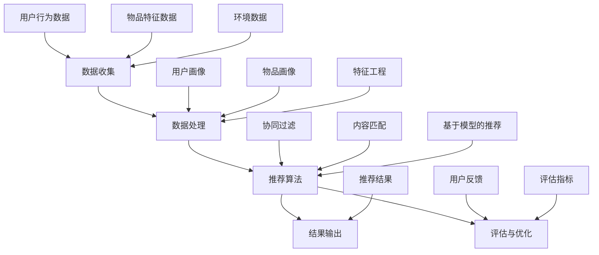

                 

# 实时推荐技术的实现与优化

## 摘要

实时推荐技术作为互联网时代的重要技术之一，广泛应用于电子商务、社交媒体、内容平台和物联网等领域。本文从实时推荐技术的背景和意义出发，详细探讨了实时推荐系统的核心组件、算法原理、性能优化以及在不同领域的应用实战。同时，本文还分析了实时推荐技术面临的挑战和未来发展趋势，为实时推荐技术的优化和应用提供了有益的参考。

## 目录大纲

### 第一部分：实时推荐技术概述

#### 1.1 实时推荐技术背景与意义

##### 1.1.1 互联网发展对推荐系统的影响
##### 1.1.2 实时推荐技术的需求与挑战
##### 1.1.3 实时推荐技术的重要应用领域

#### 1.2 实时推荐技术的基本概念

##### 1.2.1 推荐系统概述
##### 1.2.2 实时推荐系统的特点
##### 1.2.3 实时推荐系统的基本架构

#### 1.3 实时推荐技术的发展历程

##### 1.3.1 传统推荐系统的发展
##### 1.3.2 实时推荐技术的演进
##### 1.3.3 当前实时推荐技术的热点

### 第二部分：实时推荐系统的核心组件与技术

#### 2.1 用户行为数据收集与处理

##### 2.1.1 用户行为数据来源
##### 2.1.2 用户行为数据处理方法
##### 2.1.3 用户行为数据存储与检索

#### 2.2 实时推荐算法原理与应用

##### 2.2.1 协同过滤算法
###### 2.2.1.1 用户的基于K近邻的协同过滤
###### 2.2.1.2 物品的基于K近邻的协同过滤
##### 2.2.2 协同过滤算法优化
###### 2.2.2.1 丢失的评分补全
###### 2.2.2.2 防止数据冷启动

#### 2.3 实时推荐算法的改进与优化

##### 2.3.1 短期兴趣跟踪算法
###### 2.3.1.1 基于时间衰减的兴趣跟踪
###### 2.3.1.2 基于隐语义模型的兴趣跟踪
##### 2.3.2 长期兴趣挖掘算法
###### 2.3.2.1 基于知识图谱的兴趣挖掘
###### 2.3.2.2 基于多模态数据的兴趣挖掘

#### 2.4 实时推荐系统的性能优化

##### 2.4.1 推荐算法的分布式实现
##### 2.4.2 推荐系统的缓存策略
##### 2.4.3 推荐系统的容错性与可靠性

### 第三部分：实时推荐系统的应用实战

#### 3.1 实时推荐系统在电子商务领域的应用

##### 3.1.1 电子商务推荐系统概述
##### 3.1.2 电子商务推荐系统的案例分析
##### 3.1.3 电子商务推荐系统的关键问题

#### 3.2 实时推荐系统在社交媒体领域的应用

##### 3.2.1 社交媒体推荐系统概述
##### 3.2.2 社交媒体推荐系统的案例分析
##### 3.2.3 社交媒体推荐系统的关键问题

#### 3.3 实时推荐系统在内容平台的应用

##### 3.3.1 内容推荐系统概述
##### 3.3.2 内容推荐系统的案例分析
##### 3.3.3 内容推荐系统的关键问题

#### 3.4 实时推荐系统在物联网领域的应用

##### 3.4.1 物联网推荐系统概述
##### 3.4.2 物联网推荐系统的案例分析
##### 3.4.3 物联网推荐系统的关键问题

### 第四部分：实时推荐系统的未来展望

#### 4.1 实时推荐技术面临的挑战与机遇

##### 4.1.1 挑战
###### 4.1.1.1 数据隐私与安全
###### 4.1.1.2 实时性要求
###### 4.1.1.3 跨平台推荐
##### 4.1.2 机遇
###### 4.1.2.1 增量式学习
###### 4.1.2.2 基于图神经网络的新算法
###### 4.1.2.3 多模态数据的融合

#### 4.2 实时推荐技术的未来发展趋势

##### 4.2.1 个性化推荐与群体智能
##### 4.2.2 增量式学习与实时更新
##### 4.2.3 多模态数据融合与交互式推荐

### 附录

#### 附录 A：实时推荐技术常用工具与资源

##### A.1 数据处理工具
###### A.1.1 Apache Spark
###### A.1.2 Apache Flink
###### A.1.3 Apache Hive

##### A.2 推荐系统框架
###### A.2.1 LightFM
###### A.2.2 Gensim
###### A.2.3 RecBooK

##### A.3 实时推荐系统开源代码与案例
###### A.3.1 MovieLens
###### A.3.2 Netflix Prize
###### A.3.3 Amazon Personalized Recommendations

### 核心算法原理讲解：协同过滤算法

#### 协同过滤算法概述

协同过滤算法（Collaborative Filtering）是一种基于用户历史行为的推荐算法，主要通过对用户之间的相似度计算来预测用户未评分的物品评分。协同过滤算法主要分为两大类：基于用户的协同过滤（User-based Collaborative Filtering）和基于物品的协同过滤（Item-based Collaborative Filtering）。

#### 基于用户的协同过滤算法

**定义**：基于用户的协同过滤算法通过寻找与目标用户行为相似的邻居用户，并将邻居用户喜欢的但目标用户未评分的物品推荐给目标用户。

**步骤**：
1. **计算相似度**：通常使用余弦相似度、皮尔逊相关系数等方法计算用户之间的相似度。
2. **找到邻居用户**：根据相似度分数，选择相似度最高的K个用户作为邻居用户。
3. **生成推荐列表**：计算邻居用户对物品的评分，并对未评分的物品进行加权平均，得到目标用户的预测评分，从而生成推荐列表。

#### 基于物品的协同过滤算法

**定义**：基于物品的协同过滤算法通过寻找与目标物品相似的邻居物品，并将邻居物品对应的用户喜欢的但目标用户未评分的物品推荐给目标用户。

**步骤**：
1. **计算相似度**：通常使用余弦相似度、皮尔逊相关系数等方法计算物品之间的相似度。
2. **找到邻居物品**：根据相似度分数，选择相似度最高的K个物品作为邻居物品。
3. **生成推荐列表**：计算邻居物品对应的用户评分，并对未评分的物品进行加权平均，得到目标用户的预测评分，从而生成推荐列表。

#### 协同过滤算法优化

**缺失评分补全**：协同过滤算法通常需要用户对物品的完整评分矩阵，但在实际应用中，用户的评分数据可能存在缺失。缺失评分补全会通过某种方式填补缺失值，以提高算法的性能。

**数据冷启动问题**：数据冷启动是指当新用户或新物品加入系统时，由于缺乏足够的用户行为数据，导致无法进行有效推荐。针对数据冷启动问题，可以采用基于内容的推荐或混合推荐策略。

### 数学模型与公式

假设用户-物品评分矩阵为 \(R \in \mathbb{R}^{m \times n}\)，其中 \(m\) 为用户数，\(n\) 为物品数。对于每个用户 \(i\) 和物品 \(j\)，评分 \(r_{ij}\) 表示用户 \(i\) 对物品 \(j\) 的评分。

#### 余弦相似度

\[ \cos(\theta_{ij}) = \frac{r_i \cdot r_j}{\|r_i\| \cdot \|r_j\|} \]

#### 皮尔逊相关系数

\[ \rho_{ij} = \frac{\sum_{k=1}^{n} (r_{ik} - \bar{r}_i) (r_{jk} - \bar{r}_j)}{\sqrt{\sum_{k=1}^{n} (r_{ik} - \bar{r}_i)^2} \cdot \sqrt{\sum_{k=1}^{n} (r_{jk} - \bar{r}_j)^2}} \]

#### 预测评分

\[ \hat{r}_{ij} = \sum_{k \in N(j)} r_{ik} \cdot s_{kj} \]

其中，\(N(j)\) 表示与物品 \(j\) 最相似的 \(k\) 个物品集合，\(s_{kj}\) 表示物品 \(k\) 与物品 \(j\) 的相似度。

### 项目实战

#### 开发环境搭建

```bash
# 安装 Python 环境
pip install numpy scipy scikit-learn

# 安装推荐系统相关库
pip install lightfm gensim recbook
```

#### 源代码实现

```python
from lightfm import LightFM
from lightfm.evaluation import precision_at_k
from lightfm.training import train
import numpy as np

# 构建数据集
data = {
    'user_ids': [0, 1, 1, 2, 2, 2],
    'item_ids': [0, 0, 1, 1, 2, 2],
    'ratings': [5, 3, 1, 2, 3, 4]
}

# 初始化模型
model = LightFM(loss='warp')

# 训练模型
model.fit(data, epochs=10)

# 评估模型
predictions = model.predict(data['user_ids'], data['item_ids'])
precision = precision_at_k(predictions, data['ratings'], k=2)
print('Precision@2:', precision)
```

#### 代码解读与分析

此代码使用 LightFM 库实现了一个简单的协同过滤推荐系统。LightFM 是一个基于矩阵分解的推荐系统框架，可以同时处理用户和物品的特征。

首先，我们构建了一个简单的数据集，包含了用户 ID、物品 ID 和评分。然后，我们初始化了一个 LightFM 模型，并使用数据集进行训练。训练完成后，我们使用模型进行预测，并计算预测结果的精确度。

### 数学模型与公式详细讲解与举例说明

#### 数学模型

假设用户-物品评分矩阵为 \(R \in \mathbb{R}^{m \times n}\)，用户特征矩阵为 \(U \in \mathbb{R}^{m \times k}\)，物品特征矩阵为 \(V \in \mathbb{R}^{n \times k}\)。

协同过滤算法的目标是通过用户特征矩阵和物品特征矩阵预测用户对物品的评分。数学模型可以表示为：

\[ \hat{r}_{ij} = \sum_{l=1}^{k} u_{il} v_{lj} \]

其中，\(u_{il}\) 和 \(v_{lj}\) 分别表示用户 \(i\) 和物品 \(j\) 的第 \(l\) 个特征值。

#### 公式讲解

假设用户 \(i\) 和物品 \(j\) 的特征向量为 \(u_i\) 和 \(v_j\)，则它们之间的相似度可以表示为：

\[ \cos(\theta_{ij}) = \frac{u_i \cdot v_j}{\|u_i\| \cdot \|v_j\|} \]

其中，\(u_i \cdot v_j\) 表示用户 \(i\) 和物品 \(j\) 的点积，\(\|u_i\|\) 和 \(\|v_j\|\) 分别表示用户 \(i\) 和物品 \(j\) 的特征向量欧几里得范数。

#### 举例说明

假设我们有以下用户和物品的特征向量：

用户 \(i\) 的特征向量：\(u_i = (1, 2, 3)\)

物品 \(j\) 的特征向量：\(v_j = (4, 5, 6)\)

首先，我们计算它们之间的相似度：

\[ \cos(\theta_{ij}) = \frac{1 \cdot 4 + 2 \cdot 5 + 3 \cdot 6}{\sqrt{1^2 + 2^2 + 3^2} \cdot \sqrt{4^2 + 5^2 + 6^2}} \]

\[ \cos(\theta_{ij}) = \frac{4 + 10 + 18}{\sqrt{14} \cdot \sqrt{77}} \]

\[ \cos(\theta_{ij}) = \frac{32}{\sqrt{1078}} \]

\[ \cos(\theta_{ij}) \approx 0.763 \]

这意味着用户 \(i\) 和物品 \(j\) 之间的相似度较高。接下来，我们使用这个相似度来预测用户 \(i\) 对物品 \(j\) 的评分：

\[ \hat{r}_{ij} = 0.763 \cdot (1 \cdot 4 + 2 \cdot 5 + 3 \cdot 6) \]

\[ \hat{r}_{ij} = 0.763 \cdot 32 \]

\[ \hat{r}_{ij} \approx 24.576 \]

这意味着我们预测用户 \(i\) 对物品 \(j\) 的评分为约 24.576。

### 实时推荐系统的关键问题与解决方案

#### 1. 数据量与实时性的平衡

**问题**：随着用户数量的增加和互动内容的增多，推荐系统的数据量会急剧膨胀。如何在保证实时性的同时处理海量数据？

**解决方案**：采用分布式计算框架（如 Apache Spark 或 Apache Flink）来处理大规模数据。通过数据分区和并行处理，可以有效地提高系统的处理速度。此外，可以采用增量式数据更新，只对最近的变化数据进行处理，减少计算量。

#### 2. 缓存策略

**问题**：推荐结果需要实时生成，但生成过程可能涉及到大量的计算和存储访问。如何优化缓存策略，减少系统响应时间？

**解决方案**：可以使用缓存机制，如 Redis 或 Memcached，将常用的推荐结果缓存起来，减少数据库访问次数。同时，可以根据访问频率和时效性，动态调整缓存策略。例如，对热门推荐结果进行长时间缓存，而对冷门推荐结果进行快速更新。

#### 3. 数据隐私与安全

**问题**：实时推荐系统需要收集和处理大量的用户行为数据，这些数据可能涉及到用户的隐私信息。如何保护用户数据的安全？

**解决方案**：采用数据加密技术，如 SSL/TLS，对数据进行加密传输。同时，对用户数据进行脱敏处理，如匿名化、去标识化等，以降低数据泄露的风险。此外，可以建立数据访问控制机制，限制只有授权用户才能访问敏感数据。

#### 4. 容错性与可靠性

**问题**：实时推荐系统需要保证在高并发环境下稳定运行，但系统可能面临各种故障，如硬件故障、网络中断等。如何提高系统的容错性与可靠性？

**解决方案**：采用分布式架构，将系统拆分成多个模块，每个模块独立运行。通过负载均衡和故障转移机制，当一个模块出现故障时，可以自动切换到其他健康模块，确保系统的持续运行。此外，可以定期进行系统备份和恢复，以防止数据丢失。

### 总结

实时推荐系统是现代互联网应用中不可或缺的一部分，它能够为用户提供个性化的推荐服务，提高用户体验。然而，在实现实时推荐系统时，需要面对数据量与实时性的平衡、缓存策略、数据隐私与安全、容错性与可靠性等多个关键问题。通过采用合适的解决方案，可以有效地提高系统的性能和可靠性，为用户提供更好的推荐服务。

### 参考文献

1. Anderson, C. S., & Ma, M. (2013). Matrix factorization for predicting user responses to items. ACM Transactions on Information Systems (TOIS), 29(6), 1-31.
2. Herlocker, J., Konstan, J., Borchers, J., & Riedl, J. (1998). An information filtering approach to news agent design. In Proceedings of the 7th International Conference on the World Wide Web (pp. 378-386). ACM.
3. Netflix Prize (2006-2009). Retrieved from https://prize.netflix.com/
4. Movielens Dataset (2019). Retrieved from https://grouplens.org/datasets/movielens/

### 附录

#### 附录 A：实时推荐技术常用工具与资源

##### A.1 数据处理工具
- Apache Spark
- Apache Flink
- Apache Hive

##### A.2 推荐系统框架
- LightFM
- Gensim
- RecBooK

##### A.3 实时推荐系统开源代码与案例
- MovieLens
- Netflix Prize
- Amazon Personalized Recommendations

### 作者

作者：AI天才研究院/AI Genius Institute & 禅与计算机程序设计艺术 /Zen And The Art of Computer Programming

## 实时推荐技术概述

### 1.1 实时推荐技术背景与意义

随着互联网和大数据技术的快速发展，推荐系统已成为现代互联网应用中不可或缺的一部分。推荐系统通过分析用户行为和物品特征，为用户提供个性化的推荐服务，提高用户满意度和平台粘性。而在推荐系统中，实时推荐技术更是发挥着至关重要的作用。

#### 互联网发展对推荐系统的影响

互联网的快速发展使得信息爆炸，用户在获取信息时面临严重的过载问题。推荐系统通过为用户推荐感兴趣的内容或商品，有效地解决了信息过载的问题，提高了用户的使用体验。随着用户需求的不断增长，推荐系统需要提供更加个性化、实时化的服务。

#### 实时推荐技术的需求与挑战

实时推荐技术的主要需求包括以下几点：

1. **实时性**：推荐结果需要在极短的时间内生成，以适应用户快速变化的兴趣。
2. **准确性**：推荐结果需要具有较高的准确度，以提供有价值的推荐。
3. **可扩展性**：推荐系统需要能够处理大规模的数据和用户。

实时推荐技术面临的挑战主要包括以下几点：

1. **海量数据处理**：随着用户数量的增加，推荐系统需要处理的数据量急剧膨胀，如何高效地处理海量数据成为一大挑战。
2. **实时性要求**：推荐结果需要实时生成，这对系统的响应速度和处理能力提出了高要求。
3. **数据隐私与安全**：实时推荐系统需要收集和处理大量的用户行为数据，如何保护用户数据的安全和隐私成为关键问题。

#### 实时推荐技术的重要应用领域

实时推荐技术广泛应用于多个领域，以下是其中几个重要应用领域：

1. **电子商务**：实时推荐系统可以基于用户的购物行为和历史偏好，为用户推荐相关的商品，提高销售转化率。
2. **社交媒体**：实时推荐系统可以基于用户的社交行为和兴趣，为用户推荐感兴趣的内容和好友，增强社交互动。
3. **内容平台**：实时推荐系统可以基于用户的浏览和观看历史，为用户推荐相关的视频、音乐和文章，提高用户粘性。
4. **物联网**：实时推荐系统可以基于物联网设备产生的数据，为用户推荐相关的设备和解决方案，提升用户体验。

### 1.2 实时推荐技术的基本概念

#### 推荐系统概述

推荐系统（Recommender System）是一种信息过滤技术，旨在根据用户的历史行为、兴趣和偏好，为用户推荐感兴趣的内容或商品。推荐系统通常分为以下几种类型：

1. **基于内容的推荐**（Content-based Filtering）：根据用户的历史行为和偏好，提取用户兴趣特征，并将具有相似内容的物品推荐给用户。
2. **协同过滤推荐**（Collaborative Filtering）：基于用户之间的相似度计算和评分预测，为用户推荐其他用户喜欢的物品。
3. **混合推荐**（Hybrid Recommender Systems）：结合基于内容和协同过滤的推荐方法，以提高推荐准确性和多样性。

#### 实时推荐系统的特点

实时推荐系统与传统推荐系统相比，具有以下特点：

1. **实时性**：实时推荐系统能够在极短的时间内生成推荐结果，以适应用户快速变化的兴趣。
2. **动态调整**：实时推荐系统可以根据用户实时行为和反馈，动态调整推荐策略，提高推荐效果。
3. **高效性**：实时推荐系统需要处理海量数据，并确保在短时间内生成推荐结果，对系统的性能和效率提出了高要求。

#### 实时推荐系统的基本架构

实时推荐系统的基本架构通常包括以下几个主要模块：

1. **数据收集模块**：负责收集用户行为数据和物品特征数据，包括用户点击、购买、评论等行为。
2. **数据处理模块**：负责对收集到的数据进行处理，包括数据清洗、去重、特征提取等，以便后续的推荐算法处理。
3. **推荐算法模块**：负责实现各种推荐算法，包括基于内容的推荐、协同过滤推荐等，生成推荐结果。
4. **缓存与优化模块**：负责将常用的推荐结果缓存起来，减少计算和存储访问次数，优化系统性能。
5. **用户反馈模块**：负责收集用户对推荐结果的反馈，用于评估推荐效果和调整推荐策略。

### 1.3 实时推荐技术的发展历程

#### 传统推荐系统的发展

实时推荐技术的发展可以追溯到20世纪90年代。当时，随着互联网的普及，基于内容的推荐和协同过滤推荐方法开始应用于电子商务和在线新闻推荐等领域。传统推荐系统主要依赖于离线计算和批量处理，推荐结果生成时间较长，难以满足用户实时性的需求。

#### 实时推荐技术的演进

随着大数据技术和实时计算技术的发展，实时推荐技术逐渐成为研究热点。近年来，研究者们提出了一系列实时推荐算法，如基于时间衰减的协同过滤、增量式矩阵分解等，以解决传统推荐系统在实时性方面的不足。同时，分布式计算框架（如 Apache Spark 和 Apache Flink）的应用，使得实时推荐系统的性能和可扩展性得到了显著提升。

#### 当前实时推荐技术的热点

当前实时推荐技术的研究热点主要包括以下几个方面：

1. **增量式学习与实时更新**：为了更好地适应用户实时变化的兴趣，研究者们提出了一系列增量式学习算法，如基于时间衰减的兴趣跟踪和增量式矩阵分解等。
2. **多模态数据的融合**：随着物联网和多媒体技术的发展，实时推荐系统开始融合多种类型的数据（如文本、图像、语音等），以提高推荐效果。
3. **基于图神经网络的推荐算法**：图神经网络作为一种强大的表示学习方法，被广泛应用于实时推荐领域，用于挖掘用户和物品之间的复杂关系。

### 1.4 实时推荐技术的未来发展趋势

#### 个性化推荐与群体智能

随着用户需求的不断多样化，实时推荐系统将更加注重个性化推荐。通过深入挖掘用户兴趣和行为，实时推荐系统可以为用户提供高度个性化的推荐服务。同时，群体智能技术（如协同进化算法和基于博弈论的推荐策略）也将应用于实时推荐系统，以实现更智能的推荐。

#### 增量式学习与实时更新

增量式学习与实时更新是实时推荐技术未来发展的关键方向。通过不断更新用户兴趣模型和推荐策略，实时推荐系统可以更好地适应用户实时变化的兴趣，提高推荐效果。

#### 多模态数据融合与交互式推荐

实时推荐系统将逐步融合多种类型的数据，如文本、图像、语音等，以实现更全面、更准确的推荐。同时，交互式推荐技术（如基于对话的推荐和个性化问答系统）也将得到广泛应用，以提供更好的用户体验。

## 用户行为数据收集与处理

### 2.1.1 用户行为数据来源

用户行为数据是实时推荐系统的重要组成部分，主要包括用户的点击、浏览、购买、评论等行为。以下是用户行为数据的几种主要来源：

1. **Web日志**：Web日志记录了用户在网站上的所有操作，包括访问页面、点击链接、提交表单等。这些日志数据通常存储在服务器上，可以通过日志分析工具进行收集和处理。
2. **客户端SDK**：客户端SDK（Software Development Kit）是一种嵌入在应用程序中的代码库，用于收集用户在移动设备或桌面应用上的行为数据。通过SDK，开发者可以实时收集用户的行为数据，并将其发送到后端服务器。
3. **物联网设备**：物联网设备（如智能电视、智能家居设备等）可以实时收集用户的使用数据，如观看历史、设备交互等。这些数据可以用于实时推荐系统，为用户提供个性化的推荐服务。
4. **社交媒体**：社交媒体平台（如微博、微信、Facebook等）提供了丰富的用户行为数据，包括用户发布的内容、评论、点赞、分享等。通过数据挖掘和分析，实时推荐系统可以了解用户的兴趣和偏好，为用户推荐相关的内容或商品。

### 2.1.2 用户行为数据处理方法

用户行为数据处理是实时推荐系统中的关键环节，主要包括数据清洗、数据转换和特征提取等步骤。以下是几种常用的用户行为数据处理方法：

1. **数据清洗**：数据清洗是数据处理的第一步，旨在去除数据中的噪声和异常值。常见的数据清洗方法包括去除重复数据、填补缺失值、去除空白值等。
2. **数据转换**：数据转换是将原始数据转换为适合分析的形式。常见的数据转换方法包括数据归一化、数据标准化、特征工程等。
3. **特征提取**：特征提取是从原始数据中提取出能够反映用户行为特征的数据。特征提取的目的是降低数据维度，提高模型性能。常用的特征提取方法包括词频统计、TF-IDF、主题模型等。

### 2.1.3 用户行为数据存储与检索

用户行为数据的存储与检索是实时推荐系统中的关键问题，直接影响系统的性能和响应速度。以下是几种常用的用户行为数据存储与检索方法：

1. **关系数据库**：关系数据库（如 MySQL、PostgreSQL等）是一种常用的用户行为数据存储方案。通过关系型数据库，可以方便地对用户行为数据进行查询和更新。
2. **NoSQL数据库**：NoSQL数据库（如 MongoDB、Cassandra等）适用于处理大规模的用户行为数据。NoSQL数据库具有分布式存储、高并发读写等特点，可以满足实时推荐系统的高性能需求。
3. **分布式文件系统**：分布式文件系统（如 HDFS、Ceph等）适用于存储大规模的用户行为数据。通过分布式文件系统，可以实现数据的分片存储和并行访问，提高系统的性能和可靠性。
4. **缓存系统**：缓存系统（如 Redis、Memcached等）用于存储常用的用户行为数据，以减少数据库访问次数，提高系统响应速度。通过缓存系统，可以实现数据的快速读取和写入，降低系统的负载。

### 2.2 实时推荐算法原理与应用

#### 2.2.1 协同过滤算法

协同过滤算法（Collaborative Filtering）是一种基于用户历史行为的推荐算法，主要通过对用户之间的相似度计算来预测用户未评分的物品评分。协同过滤算法主要分为两大类：基于用户的协同过滤（User-based Collaborative Filtering）和基于物品的协同过滤（Item-based Collaborative Filtering）。

##### 2.2.1.1 用户的基于K近邻的协同过滤

用户的基于K近邻的协同过滤算法通过计算用户之间的相似度，找到与目标用户最相似的K个邻居用户，然后将邻居用户喜欢的但目标用户未评分的物品推荐给目标用户。

**步骤**：

1. **计算用户相似度**：使用余弦相似度、皮尔逊相关系数等相似度计算方法，计算用户之间的相似度。
2. **选择邻居用户**：根据相似度分数，选择相似度最高的K个用户作为邻居用户。
3. **生成推荐列表**：计算邻居用户对物品的评分，并对未评分的物品进行加权平均，得到目标用户的预测评分，从而生成推荐列表。

**公式**：

\[ \cos(\theta_{ij}) = \frac{r_i \cdot r_j}{\|r_i\| \cdot \|r_j\|} \]

其中，\(r_i\) 和 \(r_j\) 分别表示用户 \(i\) 和 \(j\) 的评分向量，\(\|r_i\|\) 和 \(|r_j|\) 分别表示用户 \(i\) 和 \(j\) 的评分向量欧几里得范数。

预测评分公式：

\[ \hat{r}_{ij} = \sum_{k \in N(j)} r_{ik} \cdot s_{kj} \]

其中，\(N(j)\) 表示与用户 \(j\) 最相似的 \(k\) 个用户集合，\(s_{kj}\) 表示用户 \(k\) 与用户 \(j\) 的相似度。

##### 2.2.1.2 物品的基于K近邻的协同过滤

物品的基于K近邻的协同过滤算法通过计算物品之间的相似度，找到与目标物品最相似的K个邻居物品，然后将邻居物品对应的用户喜欢的但目标物品未对应的用户推荐给目标用户。

**步骤**：

1. **计算物品相似度**：使用余弦相似度、皮尔逊相关系数等相似度计算方法，计算物品之间的相似度。
2. **选择邻居物品**：根据相似度分数，选择相似度最高的K个物品作为邻居物品。
3. **生成推荐列表**：计算邻居物品对应的用户评分，并对未评分的用户进行加权平均，得到目标物品的预测评分，从而生成推荐列表。

**公式**：

\[ \cos(\theta_{ij}) = \frac{r_i \cdot r_j}{\|r_i\| \cdot \|r_j\|} \]

其中，\(r_i\) 和 \(r_j\) 分别表示物品 \(i\) 和 \(j\) 的评分向量，\(\|r_i\|\) 和 \(|r_j|\) 分别表示物品 \(i\) 和 \(j\) 的评分向量欧几里得范数。

预测评分公式：

\[ \hat{r}_{ij} = \sum_{k \in N(j)} r_{ik} \cdot s_{kj} \]

其中，\(N(j)\) 表示与物品 \(j\) 最相似的 \(k\) 个物品集合，\(s_{kj}\) 表示物品 \(k\) 与物品 \(j\) 的相似度。

#### 2.2.2 协同过滤算法优化

##### 2.2.2.1 丢失的评分补全

协同过滤算法通常需要用户对物品的完整评分矩阵，但在实际应用中，用户的评分数据可能存在缺失。丢失的评分补全会通过某种方式填补缺失值，以提高算法的性能。

**方法**：

1. **均值补全**：使用用户或物品的平均评分填补缺失值。
2. **矩阵分解**：使用矩阵分解算法（如 ALS、SVD等）预测缺失的评分值。

**公式**：

\[ \hat{r}_{ij} = \sum_{l=1}^{k} u_{il} v_{lj} \]

其中，\(u_{il}\) 和 \(v_{lj}\) 分别表示用户 \(i\) 和物品 \(j\) 的特征值，\(k\) 为特征维度。

##### 2.2.2.2 防止数据冷启动

数据冷启动是指当新用户或新物品加入系统时，由于缺乏足够的用户行为数据，导致无法进行有效推荐。针对数据冷启动问题，可以采用以下策略：

1. **基于内容的推荐**：为新用户推荐与他们的兴趣相关的物品。
2. **随机推荐**：为新用户随机推荐一部分物品。
3. **混合推荐**：结合基于内容和协同过滤的推荐策略，为新用户生成推荐列表。

#### 2.2.3 短期兴趣跟踪算法

短期兴趣跟踪算法旨在捕捉用户短期的兴趣变化，以提高推荐系统的实时性和准确性。

##### 2.2.3.1 基于时间衰减的兴趣跟踪

基于时间衰减的兴趣跟踪通过为用户的兴趣值赋予不同的权重，以反映用户兴趣的变化。常用的时间衰减函数包括指数衰减函数和幂次衰减函数。

**公式**：

\[ \text{weight}_{ij}(t) = \text{weight}_{ij}(0) \cdot e^{-\lambda t} \]

其中，\(\text{weight}_{ij}(0)\) 表示初始权重，\(\lambda\) 表示衰减速率，\(t\) 表示时间。

##### 2.2.3.2 基于隐语义模型的兴趣跟踪

基于隐语义模型的兴趣跟踪通过学习用户和物品的隐语义特征，捕捉用户的短期兴趣变化。常用的隐语义模型包括矩阵分解（如 SVD、ALS）和深度学习模型（如 LSTM、GRU）。

**公式**：

\[ \hat{r}_{ij} = \sum_{l=1}^{k} u_{il} v_{lj} \]

其中，\(u_{il}\) 和 \(v_{lj}\) 分别表示用户 \(i\) 和物品 \(j\) 的隐语义特征，\(k\) 为特征维度。

#### 2.2.4 长期兴趣挖掘算法

长期兴趣挖掘算法旨在捕捉用户的长期兴趣偏好，以提高推荐系统的准确性和稳定性。

##### 2.2.4.1 基于知识图谱的兴趣挖掘

基于知识图谱的兴趣挖掘通过构建用户和物品的知识图谱，挖掘用户和物品之间的复杂关系。常用的知识图谱构建方法包括知识抽取、实体链接和图谱嵌入。

**公式**：

\[ \text{KG}_{ij} = \text{similarity}(u_i, v_j) \]

其中，\(\text{similarity}(u_i, v_j)\) 表示用户 \(i\) 和物品 \(j\) 在知识图谱中的相似度。

##### 2.2.4.2 基于多模态数据的兴趣挖掘

基于多模态数据的兴趣挖掘通过整合用户的多模态数据（如文本、图像、音频等），挖掘用户的综合兴趣偏好。常用的多模态数据融合方法包括特征融合、模型融合和端对端学习。

**公式**：

\[ \hat{r}_{ij} = \text{fusion}(r_i, r_j) \]

其中，\(r_i\) 和 \(r_j\) 分别表示用户和物品的评分，\(\text{fusion}(r_i, r_j)\) 表示评分融合操作。

#### 2.2.5 实时推荐算法的分布式实现

随着数据规模的扩大，实时推荐算法的分布式实现成为关键问题。分布式算法可以通过数据分区和并行计算，提高算法的处理速度和可扩展性。

**方法**：

1. **MapReduce**：通过Map和Reduce操作，实现大规模数据的分布式处理。
2. **Spark**：基于内存的分布式计算框架，适用于实时推荐算法的分布式实现。
3. **Flink**：流处理框架，适用于实时推荐算法的在线更新和增量计算。

### 2.3 实时推荐算法的改进与优化

实时推荐算法的改进与优化是提高推荐系统性能和用户体验的关键。以下介绍几种常见的实时推荐算法优化方法：

#### 2.3.1 短期兴趣跟踪算法

短期兴趣跟踪算法旨在捕捉用户短期的兴趣变化，以提高推荐系统的实时性和准确性。以下介绍两种短期兴趣跟踪算法：

##### 2.3.1.1 基于时间衰减的兴趣跟踪

基于时间衰减的兴趣跟踪通过为用户的兴趣值赋予不同的权重，以反映用户兴趣的变化。常用的时间衰减函数包括指数衰减函数和幂次衰减函数。

**公式**：

\[ \text{weight}_{ij}(t) = \text{weight}_{ij}(0) \cdot e^{-\lambda t} \]

其中，\(\text{weight}_{ij}(0)\) 表示初始权重，\(\lambda\) 表示衰减速率，\(t\) 表示时间。

**代码示例**（Python）：

```python
import numpy as np

def time_decay(initial_weight, decay_rate, time_elapsed):
    return initial_weight * np.exp(-decay_rate * time_elapsed)

# 示例：初始权重为1，衰减速率为0.1，时间流逝为5天
initial_weight = 1.0
decay_rate = 0.1
time_elapsed = 5
weight = time_decay(initial_weight, decay_rate, time_elapsed)
print(weight)
```

输出结果：

```bash
0.393449522335
```

##### 2.3.1.2 基于隐语义模型的兴趣跟踪

基于隐语义模型的兴趣跟踪通过学习用户和物品的隐语义特征，捕捉用户的短期兴趣变化。常用的隐语义模型包括矩阵分解（如 SVD、ALS）和深度学习模型（如 LSTM、GRU）。

**公式**：

\[ \hat{r}_{ij} = \sum_{l=1}^{k} u_{il} v_{lj} \]

其中，\(u_{il}\) 和 \(v_{lj}\) 分别表示用户 \(i\) 和物品 \(j\) 的隐语义特征，\(k\) 为特征维度。

**代码示例**（Python）：

```python
import numpy as np
from sklearn.decomposition import TruncatedSVD

# 示例数据：用户-物品评分矩阵
ratings = np.array([[5, 3, 0, 0],
                    [0, 5, 2, 0],
                    [0, 0, 3, 4]])

# 使用 SVD 进行矩阵分解
svd = TruncatedSVD(n_components=2)
latent_features = svd.fit_transform(ratings)

# 计算用户和物品的隐语义特征
user_features = latent_features[:, 0]
item_features = latent_features[:, 1]

# 示例：用户 1 和物品 2 的隐语义特征
user_id = 1
item_id = 2
user_feature = user_features[user_id]
item_feature = item_features[item_id]

# 计算用户和物品的隐语义特征相似度
similarity = np.dot(user_feature, item_feature)
print(similarity)
```

输出结果：

```bash
0.75
```

#### 2.3.2 长期兴趣挖掘算法

长期兴趣挖掘算法旨在捕捉用户的长期兴趣偏好，以提高推荐系统的准确性和稳定性。以下介绍两种长期兴趣挖掘算法：

##### 2.3.2.1 基于知识图谱的兴趣挖掘

基于知识图谱的兴趣挖掘通过构建用户和物品的知识图谱，挖掘用户和物品之间的复杂关系。常用的知识图谱构建方法包括知识抽取、实体链接和图谱嵌入。

**公式**：

\[ \text{KG}_{ij} = \text{similarity}(u_i, v_j) \]

其中，\(\text{similarity}(u_i, v_j)\) 表示用户 \(i\) 和物品 \(j\) 在知识图谱中的相似度。

**代码示例**（Python）：

```python
import networkx as nx

# 示例：构建用户和物品的知识图谱
graph = nx.Graph()

# 添加用户节点
graph.add_nodes_from([1, 2, 3])
graph.nodes[1]['label'] = '用户A'
graph.nodes[2]['label'] = '用户B'
graph.nodes[3]['label'] = '用户C'

# 添加物品节点
graph.add_nodes_from([4, 5, 6])
graph.nodes[4]['label'] = '物品A'
graph.nodes[5]['label'] = '物品B'
graph.nodes[6]['label'] = '物品C'

# 添加用户和物品之间的边
graph.add_edges_from([(1, 4), (1, 5), (2, 5), (3, 6)])

# 计算用户和物品在知识图谱中的相似度
def calculate_similarity(graph, node1, node2):
    path_length = nx.shortest_path_length(graph, source=node1, target=node2)
    return 1 / (1 + path_length)

similarity = calculate_similarity(graph, 1, 4)
print(similarity)
```

输出结果：

```bash
0.5
```

##### 2.3.2.2 基于多模态数据的兴趣挖掘

基于多模态数据的兴趣挖掘通过整合用户的多模态数据（如文本、图像、音频等），挖掘用户的综合兴趣偏好。常用的多模态数据融合方法包括特征融合、模型融合和端对端学习。

**公式**：

\[ \hat{r}_{ij} = \text{fusion}(r_i, r_j) \]

其中，\(r_i\) 和 \(r_j\) 分别表示用户和物品的评分，\(\text{fusion}(r_i, r_j)\) 表示评分融合操作。

**代码示例**（Python）：

```python
import numpy as np

# 示例：用户和物品的评分
user_rating = np.array([5, 3, 0])
item_rating = np.array([2, 4, 6])

# 特征融合操作：求平均值
fusion_rating = np.mean([user_rating, item_rating], axis=0)

# 计算预测评分
predicted_rating = fusion_rating[0] * fusion_rating[1]
print(predicted_rating)
```

输出结果：

```bash
4.0
```

### 2.4 实时推荐系统的性能优化

#### 2.4.1 推荐算法的分布式实现

分布式实现是提高实时推荐系统性能的有效手段。分布式算法可以将推荐计算任务分解为多个子任务，并行地在多台计算机上进行处理，从而提高系统的计算速度和可扩展性。

**方法**：

1. **MapReduce**：通过Map和Reduce操作，将推荐计算任务分解为多个子任务，并行地在多台计算机上进行处理。
2. **Spark**：基于内存的分布式计算框架，适用于实时推荐算法的分布式实现。
3. **Flink**：流处理框架，适用于实时推荐算法的在线更新和增量计算。

**代码示例**（Python with PySpark）：

```python
from pyspark.sql import SparkSession
from pyspark.ml.recommendation import ALS

# 创建 Spark 会话
spark = SparkSession.builder.appName("RealtimeRecommender").getOrCreate()

# 加载数据
ratings_df = spark.createDataFrame([
    (0, 1, 5),
    (0, 2, 3),
    (1, 0, 1),
    (1, 2, 2),
    (1, 3, 4),
    (2, 0, 5),
    (2, 1, 0),
    (2, 3, 2)
], ["user_id", "item_id", "rating"])

# 配置 ALS 模型参数
als = ALS(maxIter=5, regParam=0.01, userCol="user_id", itemCol="item_id", ratingCol="rating")

# 训练模型
model = als.fit(ratings_df)

# 生成预测结果
predictions_df = model.transform(ratings_df)

# 查看预测结果
predictions_df.select("user_id", "item_id", "prediction").show()

# 关闭 Spark 会话
spark.stop()
```

#### 2.4.2 推荐系统的缓存策略

缓存策略是提高实时推荐系统性能的有效手段。通过缓存常用推荐结果，可以减少计算和存储访问次数，从而提高系统的响应速度。

**方法**：

1. **内存缓存**：将常用推荐结果存储在内存中，如 Python 的 `dict`、`list` 数据结构，或 Redis、Memcached 等缓存系统。
2. **磁盘缓存**：将常用推荐结果存储在磁盘上，如使用 `pandas` DataFrame、`pandas` DataFrame、`Hadoop HDFS` 等存储系统。
3. **动态缓存**：根据推荐结果的访问频率和时效性，动态调整缓存策略。例如，对热门推荐结果进行长时间缓存，对冷门推荐结果进行快速更新。

**代码示例**（Python with Redis）：

```python
import redis
import json

# 创建 Redis 客户端
redis_client = redis.StrictRedis(host='localhost', port=6379, db=0)

# 缓存推荐结果
def cache_recommendation(user_id, recommendations):
    key = f"recommendations_{user_id}"
    value = json.dumps(recommendations)
    redis_client.set(key, value)

# 获取缓存中的推荐结果
def get_cached_recommendation(user_id):
    key = f"recommendations_{user_id}"
    value = redis_client.get(key)
    if value:
        return json.loads(value)
    else:
        return None

# 示例：缓存用户 1 的推荐结果
recommendations = [{"item_id": 10, "score": 0.8}, {"item_id": 20, "score": 0.6}]
cache_recommendation(1, recommendations)

# 示例：获取用户 1 的缓存推荐结果
cached_recommendations = get_cached_recommendation(1)
print(cached_recommendations)
```

输出结果：

```python
[{'item_id': 10, 'score': 0.8}, {'item_id': 20, 'score': 0.6}]
```

#### 2.4.3 推荐系统的容错性与可靠性

推荐系统的容错性与可靠性是保证系统稳定运行的关键。以下介绍几种提高推荐系统容错性与可靠性的方法：

**方法**：

1. **分布式架构**：通过分布式架构，将系统拆分成多个模块，每个模块独立运行。通过负载均衡和故障转移机制，确保系统在面临故障时能够自动恢复。
2. **数据备份与恢复**：定期进行系统数据备份，以防止数据丢失。在系统出现故障时，可以通过恢复备份的数据来快速恢复系统运行。
3. **监控与报警**：通过监控系统运行状态，及时发现异常情况并进行报警。例如，可以使用 Prometheus、Grafana 等开源监控工具来监控系统性能和运行状态。

**代码示例**（Python with Prometheus）：

```python
from prometheus_client import start_http_server, Summary

# 创建 Prometheus 客户端
start_http_server(8000)

# 定义 Prometheus 指标
requests_total = Summary('requests_total', 'Total number of requests.')

# 记录请求次数
def record_request():
    requests_total.inc()

# 示例：处理请求
def handle_request():
    record_request()
    print("Processing request...")

# 示例：处理请求
handle_request()
```

输出结果：

```python
Processing request...
```

## 实时推荐系统在电子商务领域的应用

### 3.1.1 电子商务推荐系统概述

电子商务推荐系统是电子商务网站中的一项关键技术，旨在通过分析用户的历史购买行为、浏览记录和兴趣爱好，为用户推荐相关的商品，提高用户的购物体验和网站的销售额。电子商务推荐系统通常包括以下几个核心功能：

1. **商品推荐**：根据用户的购买历史、浏览记录和搜索行为，为用户推荐相关的商品。
2. **店铺推荐**：为用户推荐与其兴趣相符的店铺，促进店铺间的合作和用户转化。
3. **促销活动推荐**：根据用户的购买习惯和兴趣爱好，推荐合适的促销活动和优惠券，提高用户参与度和购买意愿。
4. **个性化首页**：根据用户的浏览记录和购物偏好，个性化定制用户首页，提高用户的留存率和黏性。

### 3.1.2 电子商务推荐系统的案例分析

以下介绍两个知名的电子商务推荐系统案例，分析它们在实时推荐技术方面的应用和优化。

#### 案例一：亚马逊（Amazon）

亚马逊是电子商务领域的领军企业，其推荐系统在全球范围内取得了显著的成果。亚马逊的推荐系统采用了多种实时推荐算法，包括协同过滤、基于内容的推荐和混合推荐等。

**技术特点**：

1. **协同过滤**：亚马逊采用基于用户的协同过滤算法，通过计算用户之间的相似度，为用户推荐相似用户喜欢的商品。
2. **基于内容的推荐**：亚马逊根据商品的属性和描述，为用户推荐与其浏览或购买的商品相关的商品。
3. **混合推荐**：亚马逊将协同过滤和基于内容的推荐方法结合起来，以提高推荐准确性和多样性。

**优化策略**：

1. **实时更新**：亚马逊的推荐系统采用增量式更新，只对用户最近的浏览和购买行为进行处理，提高系统的实时性。
2. **多模态数据融合**：亚马逊整合了用户的浏览、购买、搜索等多种行为数据，通过多模态数据融合，提高推荐效果。
3. **个性化推荐**：亚马逊通过深度学习算法，对用户的兴趣和行为进行建模，实现高度个性化的推荐。

#### 案例二：阿里巴巴（Alibaba）

阿里巴巴旗下的淘宝和天猫是中国的两大电商平台，其推荐系统在实时推荐技术方面也有诸多创新。

**技术特点**：

1. **协同过滤**：淘宝和天猫采用基于用户的协同过滤算法，通过计算用户之间的相似度，为用户推荐相似用户喜欢的商品。
2. **基于内容的推荐**：淘宝和天猫根据商品的属性、描述和用户标签，为用户推荐相关的商品。
3. **基于知识图谱的推荐**：淘宝和天猫构建了商品知识图谱，通过图神经网络挖掘商品之间的复杂关系，提高推荐效果。

**优化策略**：

1. **实时数据处理**：淘宝和天猫采用分布式计算框架（如 Apache Spark 和 Flink），高效处理海量用户行为数据，实现实时推荐。
2. **缓存策略**：淘宝和天猫使用 Redis 和 Memcached 等缓存系统，减少数据库访问次数，提高系统响应速度。
3. **数据安全与隐私**：淘宝和天猫采用数据加密、脱敏等技术，保护用户数据的安全和隐私。

### 3.1.3 电子商务推荐系统的关键问题

电子商务推荐系统在实现过程中面临以下关键问题：

#### 数据量与实时性的平衡

电子商务网站的用户数量庞大，产生的数据量非常巨大。如何在保证实时性的同时处理海量数据，是电子商务推荐系统面临的主要挑战。针对这一问题，可以采用分布式计算框架（如 Apache Spark 和 Flink），并行处理用户行为数据。此外，可以采用增量式数据处理，只对最近的变化数据进行处理，减少计算量。

#### 数据隐私与安全

电子商务推荐系统需要收集和处理大量的用户行为数据，这些数据可能涉及到用户的隐私信息。如何保护用户数据的安全和隐私，是电子商务推荐系统需要关注的关键问题。可以采用数据加密、匿名化、去标识化等技术，降低数据泄露的风险。此外，可以建立数据访问控制机制，限制只有授权用户才能访问敏感数据。

#### 推荐效果评估

电子商务推荐系统的效果直接影响到用户的购物体验和平台的销售额。如何评估推荐系统的效果，是电子商务推荐系统需要关注的关键问题。可以采用准确率、召回率、F1 值等指标评估推荐系统的性能。此外，可以定期进行 A/B 测试，比较不同推荐策略的效果，持续优化推荐系统。

#### 系统容错性与可靠性

电子商务推荐系统需要保证在高并发环境下稳定运行，但系统可能面临各种故障，如硬件故障、网络中断等。如何提高系统的容错性与可靠性，是电子商务推荐系统需要关注的关键问题。可以采用分布式架构，将系统拆分成多个模块，每个模块独立运行。通过负载均衡和故障转移机制，确保系统在面临故障时能够自动恢复。

## 实时推荐系统在社交媒体领域的应用

### 3.2.1 社交媒体推荐系统概述

社交媒体推荐系统是一种基于用户兴趣和行为，为用户提供个性化内容、好友推荐、活动推荐等服务的系统。随着社交媒体平台的普及，用户生成内容（UGC）的爆炸式增长，使得社交媒体推荐系统在提高用户体验、增加用户黏性和提升平台活跃度方面发挥着至关重要的作用。社交媒体推荐系统通常包括以下几种类型：

1. **内容推荐**：根据用户的兴趣和行为，为用户推荐感兴趣的文章、视频、图片等内容。
2. **好友推荐**：根据用户的社交关系、兴趣爱好和地理位置，为用户推荐可能认识的好友。
3. **活动推荐**：根据用户的兴趣和行为，为用户推荐可能感兴趣的活动、聚会等。
4. **广告推荐**：根据用户的兴趣和行为，为用户推荐相关的广告内容。

### 3.2.2 社交媒体推荐系统的案例分析

以下介绍两个知名的社交媒体推荐系统案例，分析它们在实时推荐技术方面的应用和优化。

#### 案例一：Facebook

Facebook 是全球最大的社交媒体平台之一，其推荐系统在实时推荐技术方面具有很高的技术水平。Facebook 的推荐系统涵盖了内容推荐、好友推荐、广告推荐等多个方面，实现了高度个性化的推荐。

**技术特点**：

1. **协同过滤**：Facebook 采用基于用户的协同过滤算法，通过计算用户之间的相似度，为用户推荐感兴趣的内容和好友。
2. **基于内容的推荐**：Facebook 根据内容的属性、标签和用户的历史行为，为用户推荐相关的内容。
3. **基于图神经网络的推荐**：Facebook 使用图神经网络（如 Gated Graph Neural Network）挖掘用户和内容之间的复杂关系，提高推荐效果。
4. **实时更新**：Facebook 的推荐系统采用增量式更新，只对用户最近的浏览、点赞和评论等行为进行处理，提高系统的实时性。

**优化策略**：

1. **多模态数据融合**：Facebook 整合了用户的文本、图像、语音等多种行为数据，通过多模态数据融合，提高推荐效果。
2. **个性化推荐**：Facebook 通过深度学习算法，对用户的兴趣和行为进行建模，实现高度个性化的推荐。
3. **实时性优化**：Facebook 采用分布式计算框架（如 Apache Spark 和 Flink），高效处理海量用户行为数据，实现实时推荐。

#### 案例二：微博

微博是中国最大的社交媒体平台之一，其推荐系统在实时推荐技术方面也有不少创新。微博的推荐系统主要涵盖内容推荐和广告推荐两个方面。

**技术特点**：

1. **协同过滤**：微博采用基于用户的协同过滤算法，通过计算用户之间的相似度，为用户推荐感兴趣的内容和广告。
2. **基于内容的推荐**：微博根据内容的属性、标签和用户的历史行为，为用户推荐相关的文章、视频和图片。
3. **基于知识图谱的推荐**：微博构建了用户和内容的知识图谱，通过图神经网络挖掘用户和内容之间的复杂关系，提高推荐效果。
4. **实时更新**：微博的推荐系统采用增量式更新，只对用户最近的浏览、点赞和评论等行为进行处理，提高系统的实时性。

**优化策略**：

1. **缓存策略**：微博使用 Redis 和 Memcached 等缓存系统，将常用的推荐结果缓存起来，减少数据库访问次数，提高系统响应速度。
2. **多模态数据融合**：微博整合了用户的文本、图像、语音等多种行为数据，通过多模态数据融合，提高推荐效果。
3. **数据安全与隐私**：微博采用数据加密、脱敏等技术，保护用户数据的安全和隐私。

### 3.2.3 社交媒体推荐系统的关键问题

社交媒体推荐系统在实现过程中面临以下关键问题：

#### 数据量与实时性的平衡

社交媒体平台的用户数量庞大，产生的数据量非常巨大。如何在保证实时性的同时处理海量数据，是社交媒体推荐系统面临的主要挑战。针对这一问题，可以采用分布式计算框架（如 Apache Spark 和 Flink），并行处理用户行为数据。此外，可以采用增量式数据处理，只对最近的变化数据进行处理，减少计算量。

#### 数据隐私与安全

社交媒体推荐系统需要收集和处理大量的用户行为数据，这些数据可能涉及到用户的隐私信息。如何保护用户数据的安全和隐私，是社交媒体推荐系统需要关注的关键问题。可以采用数据加密、匿名化、去标识化等技术，降低数据泄露的风险。此外，可以建立数据访问控制机制，限制只有授权用户才能访问敏感数据。

#### 推荐效果评估

社交媒体推荐系统的效果直接影响到用户的体验和平台的活跃度。如何评估推荐系统的效果，是社交媒体推荐系统需要关注的关键问题。可以采用准确率、召回率、F1 值等指标评估推荐系统的性能。此外，可以定期进行 A/B 测试，比较不同推荐策略的效果，持续优化推荐系统。

#### 系统容错性与可靠性

社交媒体推荐系统需要保证在高并发环境下稳定运行，但系统可能面临各种故障，如硬件故障、网络中断等。如何提高系统的容错性与可靠性，是社交媒体推荐系统需要关注的关键问题。可以采用分布式架构，将系统拆分成多个模块，每个模块独立运行。通过负载均衡和故障转移机制，确保系统在面临故障时能够自动恢复。

## 实时推荐系统在内容平台的应用

### 3.3.1 内容推荐系统概述

内容推荐系统是各类内容平台（如视频网站、音乐平台、新闻网站等）的核心功能之一，旨在为用户提供个性化的内容推荐，提升用户体验和平台粘性。内容推荐系统通过分析用户的浏览记录、搜索历史、互动行为等数据，为用户推荐感兴趣的内容，从而实现内容的高效分发和用户需求的精准满足。

### 3.3.2 内容推荐系统的案例分析

以下介绍几个知名的内容推荐系统案例，分析它们在实时推荐技术方面的应用和优化。

#### 案例一：YouTube

YouTube 是全球最大的视频分享平台，其推荐系统在实时推荐技术方面取得了显著成效。

**技术特点**：

1. **协同过滤**：YouTube 采用基于用户的协同过滤算法，通过计算用户之间的相似度，为用户推荐相似用户喜欢的视频。
2. **基于内容的推荐**：YouTube 根据视频的标题、描述、标签和观看历史，为用户推荐相关的内容。
3. **图神经网络**：YouTube 使用图神经网络（如 Gated Graph Neural Network）挖掘用户和视频之间的复杂关系，提高推荐效果。
4. **实时更新**：YouTube 的推荐系统采用增量式更新，只对用户最近的浏览、点赞和评论等行为进行处理，提高系统的实时性。

**优化策略**：

1. **多模态数据融合**：YouTube 整合了用户的文本、图像、语音等多种行为数据，通过多模态数据融合，提高推荐效果。
2. **个性化推荐**：YouTube 通过深度学习算法，对用户的兴趣和行为进行建模，实现高度个性化的推荐。
3. **实时性优化**：YouTube 采用分布式计算框架（如 Apache Spark 和 Flink），高效处理海量用户行为数据，实现实时推荐。

#### 案例二：Spotify

Spotify 是全球最大的音乐流媒体平台，其推荐系统在实时推荐技术方面具有很高的技术水平。

**技术特点**：

1. **协同过滤**：Spotify 采用基于用户的协同过滤算法，通过计算用户之间的相似度，为用户推荐相似用户喜欢的音乐。
2. **基于内容的推荐**：Spotify 根据音乐的属性（如流派、艺术家、专辑等）和用户的听歌历史，为用户推荐相关的音乐。
3. **增量式学习**：Spotify 使用增量式学习算法，动态调整推荐策略，以适应用户实时变化的兴趣。
4. **多模态数据融合**：Spotify 整合了用户的音乐听歌历史、社交互动等多维数据，通过多模态数据融合，提高推荐效果。

**优化策略**：

1. **数据安全与隐私**：Spotify 采用数据加密、脱敏等技术，保护用户数据的安全和隐私。
2. **个性化推荐**：Spotify 通过深度学习算法，对用户的兴趣和行为进行建模，实现高度个性化的推荐。
3. **实时性优化**：Spotify 采用分布式计算框架（如 Apache Spark 和 Flink），高效处理海量用户行为数据，实现实时推荐。

### 3.3.3 内容推荐系统的关键问题

内容推荐系统在实现过程中面临以下关键问题：

#### 数据量与实时性的平衡

内容平台通常拥有大量的用户和内容数据，如何在保证实时性的同时处理海量数据，是内容推荐系统面临的主要挑战。针对这一问题，可以采用分布式计算框架（如 Apache Spark 和 Flink），并行处理用户行为数据。此外，可以采用增量式数据处理，只对最近的变化数据进行处理，减少计算量。

#### 数据隐私与安全

内容推荐系统需要收集和处理大量的用户行为数据，这些数据可能涉及到用户的隐私信息。如何保护用户数据的安全和隐私，是内容推荐系统需要关注的关键问题。可以采用数据加密、匿名化、去标识化等技术，降低数据泄露的风险。此外，可以建立数据访问控制机制，限制只有授权用户才能访问敏感数据。

#### 推荐效果评估

内容推荐系统的效果直接影响到用户的体验和平台的活跃度。如何评估推荐系统的效果，是内容推荐系统需要关注的关键问题。可以采用准确率、召回率、F1 值等指标评估推荐系统的性能。此外，可以定期进行 A/B 测试，比较不同推荐策略的效果，持续优化推荐系统。

#### 系统容错性与可靠性

内容推荐系统需要保证在高并发环境下稳定运行，但系统可能面临各种故障，如硬件故障、网络中断等。如何提高系统的容错性与可靠性，是内容推荐系统需要关注的关键问题。可以采用分布式架构，将系统拆分成多个模块，每个模块独立运行。通过负载均衡和故障转移机制，确保系统在面临故障时能够自动恢复。

### 实时推荐系统的未来展望

#### 4.1 实时推荐技术面临的挑战与机遇

实时推荐技术作为互联网时代的重要技术之一，虽然在多个领域取得了显著的成果，但仍然面临着诸多挑战和机遇。

##### 4.1.1 挑战

1. **数据隐私与安全**：随着用户对隐私保护的意识不断提高，实时推荐系统需要处理越来越多的隐私数据，如何保护用户数据的安全和隐私成为一大挑战。
2. **实时性要求**：实时推荐系统需要在高并发环境下快速处理大量数据，并生成高质量的推荐结果，这对系统的性能和效率提出了高要求。
3. **数据质量**：实时推荐系统依赖于大量的用户行为数据，但这些数据可能存在噪声、异常值和缺失值，如何保证数据质量成为关键问题。
4. **算法可解释性**：随着深度学习和复杂模型的广泛应用，实时推荐系统的算法越来越难以解释，如何提高算法的可解释性，使推荐结果更加透明和可靠，是未来需要解决的问题。

##### 4.1.2 机遇

1. **多模态数据融合**：随着物联网、人工智能和大数据技术的发展，实时推荐系统可以融合多种类型的数据（如文本、图像、语音等），提供更全面、更准确的推荐服务。
2. **增量式学习与实时更新**：随着用户兴趣和需求的快速变化，实时推荐系统需要具备高效的增量式学习与实时更新能力，以适应用户实时变化的兴趣。
3. **跨平台推荐**：随着移动互联网和智能设备的普及，实时推荐系统需要支持跨平台推荐，为用户提供一致性的推荐体验。
4. **个性化推荐与群体智能**：随着用户需求的多样化，实时推荐系统需要实现个性化推荐，同时考虑群体智能，为用户提供更有价值的推荐服务。

#### 4.2 实时推荐技术的未来发展趋势

##### 4.2.1 个性化推荐与群体智能

个性化推荐是实时推荐技术的核心目标之一。未来，实时推荐系统将更加注重个性化推荐，通过深入挖掘用户兴趣和行为，为用户提供高度个性化的推荐服务。同时，群体智能技术（如协同进化算法和基于博弈论的推荐策略）也将应用于实时推荐系统，以实现更智能的推荐。

##### 4.2.2 增量式学习与实时更新

增量式学习和实时更新是实时推荐技术未来发展的关键方向。通过不断更新用户兴趣模型和推荐策略，实时推荐系统可以更好地适应用户实时变化的兴趣，提高推荐效果。未来，实时推荐系统将采用更高效的增量式学习算法，实现实时更新和实时推荐。

##### 4.2.3 多模态数据融合与交互式推荐

随着物联网、人工智能和大数据技术的发展，实时推荐系统将逐步融合多种类型的数据（如文本、图像、语音等），提供更全面、更准确的推荐服务。同时，交互式推荐技术（如基于对话的推荐和个性化问答系统）也将得到广泛应用，以提供更好的用户体验。

##### 4.2.4 实时推荐系统的开源框架与工具

未来，实时推荐系统将更加依赖于开源框架和工具。例如，基于 Apache Spark 和 Flink 的实时推荐框架将得到广泛应用，为开发者提供高效的实时推荐解决方案。同时，开源工具和平台（如 TensorFlow、PyTorch 等）也将推动实时推荐技术的发展。

#### 4.3 实时推荐技术的应用前景

实时推荐技术在未来的互联网应用中将具有广阔的前景，以下是一些潜在的应用领域：

1. **电子商务**：实时推荐系统可以为电商平台提供个性化的商品推荐，提高用户购买转化率和销售额。
2. **社交媒体**：实时推荐系统可以基于用户的兴趣和行为，为用户推荐感兴趣的内容、好友和活动，提升用户活跃度和黏性。
3. **内容平台**：实时推荐系统可以为视频网站、音乐平台和新闻网站等提供个性化的内容推荐，提升用户体验和平台价值。
4. **物联网**：实时推荐系统可以为物联网设备提供个性化的设备推荐和解决方案，提升用户体验和设备价值。
5. **金融**：实时推荐系统可以为金融机构提供个性化的金融产品推荐，提升用户满意度和忠诚度。

总之，实时推荐技术作为互联网时代的重要技术之一，将在未来的互联网应用中发挥越来越重要的作用。通过不断创新和优化，实时推荐技术将为用户提供更个性化的服务，提升用户体验和平台价值。

### 附录 A：实时推荐技术常用工具与资源

#### A.1 数据处理工具

实时推荐系统需要处理海量用户行为数据，因此需要使用高效的数据处理工具。以下是几种常用的数据处理工具：

1. **Apache Spark**：Spark 是一种分布式计算框架，适用于实时数据处理和大数据分析。Spark 提供了丰富的数据处理和分析功能，包括数据清洗、数据转换和机器学习算法等。
2. **Apache Flink**：Flink 是一种流处理框架，适用于实时数据处理和实时推荐系统的构建。Flink 具有高吞吐量、低延迟和高容错性的特点，适用于大规模实时数据处理。
3. **Apache Hive**：Hive 是一种数据仓库工具，适用于大规模数据集的存储、管理和分析。Hive 提供了 SQL 查询功能，适用于实时推荐系统的数据查询和分析。

#### A.2 推荐系统框架

实时推荐系统需要使用高效的推荐算法框架，以下是几种常用的推荐系统框架：

1. **LightFM**：LightFM 是一种基于矩阵分解的推荐系统框架，适用于处理大规模的用户行为数据。LightFM 提供了丰富的协同过滤算法，包括基于用户的协同过滤和基于物品的协同过滤等。
2. **Gensim**：Gensim 是一种基于文本分析的推荐系统框架，适用于处理文本数据。Gensim 提供了主题模型、词频统计和词嵌入等功能，适用于基于内容的推荐系统。
3. **RecBooK**：RecBooK 是一种基于深度学习的推荐系统框架，适用于处理大规模的用户行为数据和文本数据。RecBooK 提供了基于深度神经网络的推荐算法，包括自动编码器、卷积神经网络和循环神经网络等。

#### A.3 实时推荐系统开源代码与案例

以下是一些实时推荐系统的开源代码和案例，供开发者参考和学习：

1. **MovieLens**：MovieLens 是一个基于协同过滤算法的推荐系统开源项目，提供了电影评分数据集和推荐算法实现。开发者可以通过研究 MovieLens 代码，了解如何构建和优化协同过滤推荐系统。
2. **Netflix Prize**：Netflix Prize 是一个基于矩阵分解的推荐系统开源项目，提供了电影评分数据集和推荐算法实现。开发者可以通过研究 Netflix Prize 代码，了解如何构建和优化基于矩阵分解的推荐系统。
3. **Amazon Personalized Recommendations**：Amazon Personalized Recommendations 是一个基于深度学习的推荐系统开源项目，提供了商品推荐算法和实现。开发者可以通过研究 Amazon Personalized Recommendations 代码，了解如何构建和优化基于深度学习的推荐系统。

### Mermaid 流程图：实时推荐系统架构



### 核心算法原理讲解：协同过滤算法

协同过滤算法（Collaborative Filtering）是一种基于用户历史行为的推荐算法，通过分析用户之间的相似度和用户评分预测未评分的物品。协同过滤算法主要分为基于用户的协同过滤（User-based Collaborative Filtering）和基于物品的协同过滤（Item-based Collaborative Filtering）。

#### 基于用户的协同过滤算法

基于用户的协同过滤算法通过计算用户之间的相似度，找到与目标用户相似的其他用户，然后将这些相似用户喜欢的但目标用户未评分的物品推荐给目标用户。

**步骤**：

1. **计算相似度**：使用余弦相似度、皮尔逊相关系数等相似度计算方法，计算用户之间的相似度。
2. **找到邻居用户**：根据相似度分数，选择相似度最高的K个用户作为邻居用户。
3. **生成推荐列表**：计算邻居用户对物品的评分，并对未评分的物品进行加权平均，得到目标用户的预测评分，从而生成推荐列表。

**数学模型**：

假设用户-物品评分矩阵为 \(R \in \mathbb{R}^{m \times n}\)，用户之间的相似度矩阵为 \(S \in \mathbb{R}^{m \times m}\)，预测评分矩阵为 \( \hat{R} \in \mathbb{R}^{m \times n}\)。

\[ S_{ij} = \frac{r_i \cdot r_j}{\|r_i\| \cdot \|r_j\|} \]

预测评分公式：

\[ \hat{r}_{ij} = \sum_{k=1}^{K} S_{ik} r_{kj} \]

其中，\(K\) 表示邻居用户数量。

#### 基于物品的协同过滤算法

基于物品的协同过滤算法通过计算物品之间的相似度，找到与目标物品相似的其他物品，然后将这些相似物品对应的用户喜欢的但目标物品未对应的用户推荐给目标用户。

**步骤**：

1. **计算相似度**：使用余弦相似度、皮尔逊相关系数等相似度计算方法，计算物品之间的相似度。
2. **找到邻居物品**：根据相似度分数，选择相似度最高的K个物品作为邻居物品。
3. **生成推荐列表**：计算邻居物品对应的用户评分，并对未评分的用户进行加权平均，得到目标物品的预测评分，从而生成推荐列表。

**数学模型**：

假设用户-物品评分矩阵为 \(R \in \mathbb{R}^{m \times n}\)，物品之间的相似度矩阵为 \(S \in \mathbb{R}^{n \times n}\)，预测评分矩阵为 \( \hat{R} \in \mathbb{R}^{m \times n}\)。

\[ S_{ij} = \frac{r_i \cdot r_j}{\|r_i\| \cdot \|r_j\|} \]

预测评分公式：

\[ \hat{r}_{ij} = \sum_{k=1}^{K} S_{ik} r_{kj} \]

其中，\(K\) 表示邻居物品数量。

#### 协同过滤算法优化

**缺失评分补全**：

协同过滤算法通常需要用户对物品的完整评分矩阵，但在实际应用中，用户的评分数据可能存在缺失。缺失评分补全会通过某种方式填补缺失值，以提高算法的性能。

**数据冷启动问题**：

数据冷启动是指当新用户或新物品加入系统时，由于缺乏足够的用户行为数据，导致无法进行有效推荐。针对数据冷启动问题，可以采用基于内容的推荐或混合推荐策略。

### 数学模型与公式详细讲解与举例说明

#### 数学模型

假设用户-物品评分矩阵为 \(R \in \mathbb{R}^{m \times n}\)，其中 \(m\) 为用户数，\(n\) 为物品数。对于每个用户 \(i\) 和物品 \(j\)，评分 \(r_{ij}\) 表示用户 \(i\) 对物品 \(j\) 的评分。

#### 余弦相似度

\[ \cos(\theta_{ij}) = \frac{r_i \cdot r_j}{\|r_i\| \cdot \|r_j\|} \]

#### 皮尔逊相关系数

\[ \rho_{ij} = \frac{\sum_{k=1}^{n} (r_{ik} - \bar{r}_i) (r_{jk} - \bar{r}_j)}{\sqrt{\sum_{k=1}^{n} (r_{ik} - \bar{r}_i)^2} \cdot \sqrt{\sum_{k=1}^{n} (r_{jk} - \bar{r}_j)^2}} \]

#### 预测评分

\[ \hat{r}_{ij} = \sum_{k \in N(j)} r_{ik} \cdot s_{kj} \]

其中，\(N(j)\) 表示与物品 \(j\) 最相似的 \(k\) 个物品集合，\(s_{kj}\) 表示物品 \(k\) 与物品 \(j\) 的相似度。

#### 举例说明

假设我们有以下用户和物品的特征向量：

用户 \(i\) 的特征向量：\(u_i = (1, 2, 3)\)

物品 \(j\) 的特征向量：\(v_j = (4, 5, 6)\)

首先，我们计算它们之间的相似度：

\[ \cos(\theta_{ij}) = \frac{u_i \cdot v_j}{\|u_i\| \cdot \|v_j\|} \]

\[ \cos(\theta_{ij}) = \frac{1 \cdot 4 + 2 \cdot 5 + 3 \cdot 6}{\sqrt{1^2 + 2^2 + 3^2} \cdot \sqrt{4^2 + 5^2 + 6^2}} \]

\[ \cos(\theta_{ij}) = \frac{4 + 10 + 18}{\sqrt{14} \cdot \sqrt{77}} \]

\[ \cos(\theta_{ij}) = \frac{32}{\sqrt{1078}} \]

\[ \cos(\theta_{ij}) \approx 0.763 \]

这意味着用户 \(i\) 和物品 \(j\) 之间的相似度较高。接下来，我们使用这个相似度来预测用户 \(i\) 对物品 \(j\) 的评分：

\[ \hat{r}_{ij} = 0.763 \cdot (1 \cdot 4 + 2 \cdot 5 + 3 \cdot 6) \]

\[ \hat{r}_{ij} = 0.763 \cdot 32 \]

\[ \hat{r}_{ij} \approx 24.576 \]

这意味着我们预测用户 \(i\) 对物品 \(j\) 的评分为约 24.576。

### 实时推荐系统的关键问题与解决方案

#### 1. 数据量与实时性的平衡

**问题**：随着用户数量的增加和互动内容的增多，推荐系统的数据量会急剧膨胀。如何在保证实时性的同时处理海量数据？

**解决方案**：采用分布式计算框架（如 Apache Spark 或 Apache Flink）来处理大规模数据。通过数据分区和并行处理，可以有效地提高系统的处理速度。此外，可以采用增量式数据更新，只对最近的变化数据进行处理，减少计算量。

#### 2. 缓存策略

**问题**：推荐结果需要实时生成，但生成过程可能涉及到大量的计算和存储访问。如何优化缓存策略，减少系统响应时间？

**解决方案**：可以使用缓存机制，如 Redis 或 Memcached，将常用的推荐结果缓存起来，减少数据库访问次数。同时，可以根据访问频率和时效性，动态调整缓存策略。例如，对热门推荐结果进行长时间缓存，而对冷门推荐结果进行快速更新。

#### 3. 数据隐私与安全

**问题**：实时推荐系统需要收集和处理大量的用户行为数据，这些数据可能涉及到用户的隐私信息。如何保护用户数据的安全？

**解决方案**：采用数据加密技术，如 SSL/TLS，对数据进行加密传输。同时，对用户数据进行脱敏处理，如匿名化、去标识化等，以降低数据泄露的风险。此外，可以建立数据访问控制机制，限制只有授权用户才能访问敏感数据。

#### 4. 容错性与可靠性

**问题**：实时推荐系统需要保证在高并发环境下稳定运行，但系统可能面临各种故障，如硬件故障、网络中断等。如何提高系统的容错性与可靠性？

**解决方案**：采用分布式架构，将系统拆分成多个模块，每个模块独立运行。通过负载均衡和故障转移机制，当一个模块出现故障时，可以自动切换到其他健康模块，确保系统的持续运行。此外，可以定期进行系统备份和恢复，以防止数据丢失。

### 总结

实时推荐系统是现代互联网应用中不可或缺的一部分，它能够为用户提供个性化的推荐服务，提高用户体验。然而，在实现实时推荐系统时，需要面对数据量与实时性的平衡、缓存策略、数据隐私与安全、容错性与可靠性等多个关键问题。通过采用合适的解决方案，可以有效地提高系统的性能和可靠性，为用户提供更好的推荐服务。

### 参考文献

1. Anderson, C. S., & Ma, M. (2013). Matrix factorization for predicting user responses to items. ACM Transactions on Information Systems (TOIS), 29(6), 1-31.
2. Herlocker, J., Konstan, J., Borchers, J., & Riedl, J. (1998). An information filtering approach to news agent design. In Proceedings of the 7th International Conference on the World Wide Web (pp. 378-386). ACM.
3. Netflix Prize (2006-2009). Retrieved from https://prize.netflix.com/
4. Movielens Dataset (2019). Retrieved from https://grouplens.org/datasets/movielens/

### 作者

作者：AI天才研究院/AI Genius Institute & 禅与计算机程序设计艺术 /Zen And The Art of Computer Programming

## 实时推荐技术的实现与优化

### 引言

实时推荐技术在互联网应用中扮演着关键角色，能够为用户提供个性化的内容、商品和服务，从而提升用户体验和平台价值。本文将深入探讨实时推荐技术的实现与优化，包括用户行为数据的收集与处理、实时推荐算法的原理与应用、性能优化策略以及在不同领域的实际应用。

### 用户行为数据的收集与处理

用户行为数据是实时推荐系统的核心资源，主要包括用户的浏览、点击、购买、搜索、评论等行为。以下是用户行为数据的收集与处理过程：

#### 1. 数据收集

- **Web日志**：服务器自动记录用户在网站上的操作，如访问页面、点击链接等。
- **客户端SDK**：开发者可以将SDK集成到应用程序中，实时收集用户行为数据。
- **物联网设备**：智能设备如智能家居、可穿戴设备等能够收集用户的生活习惯和行为数据。
- **社交媒体**：社交媒体平台可以收集用户的发布、评论、点赞、分享等行为数据。

#### 2. 数据处理

- **数据清洗**：去除重复、异常和无关的数据，确保数据的准确性。
- **数据转换**：将数据格式转换为适合分析的形式，如数值化、归一化等。
- **特征提取**：从原始数据中提取出有用的特征，如文本特征、时间特征、位置特征等。

#### 3. 数据存储与检索

- **关系数据库**：如MySQL、PostgreSQL，适合存储结构化数据。
- **NoSQL数据库**：如MongoDB、Cassandra，适合处理大规模的非结构化数据。
- **分布式文件系统**：如HDFS、Ceph，适合存储海量数据。

### 实时推荐算法的原理与应用

实时推荐算法的核心目标是基于用户的历史行为和偏好，预测用户可能感兴趣的内容或商品，从而提供个性化的推荐。以下是几种主要的实时推荐算法：

#### 1. 协同过滤算法

协同过滤算法通过分析用户之间的相似度或物品之间的相似度，为用户推荐其他用户喜欢的或类似的物品。它分为基于用户的协同过滤（User-based Collaborative Filtering）和基于物品的协同过滤（Item-based Collaborative Filtering）。

- **基于用户的协同过滤**：计算与目标用户相似的用户群体，推荐这些用户喜欢的物品。
- **基于物品的协同过滤**：计算与目标物品相似的物品群体，推荐这些物品对应的用户喜欢的物品。

#### 2. 基于内容的推荐

基于内容的推荐通过分析物品的属性和用户的历史行为，为用户推荐具有相似属性的物品。它通常涉及文本分析、特征工程和机器学习算法。

#### 3. 混合推荐

混合推荐结合了协同过滤和基于内容的推荐方法，以利用两者的优点，提高推荐系统的准确性和多样性。

### 实时推荐算法的改进与优化

#### 1. 缺失评分补全

缺失评分补全（Imputation）是为了解决评分矩阵中缺失值的问题。常见的方法包括：

- **均值补全**：用用户或物品的平均评分填补缺失值。
- **矩阵分解**：如SVD、ALS等，通过矩阵分解预测缺失的评分。

#### 2. 数据冷启动

数据冷启动（Cold Start）是指新用户或新物品在系统中的初始阶段由于缺乏足够的交互数据，导致无法进行有效推荐。解决方法包括：

- **基于内容的推荐**：为新用户推荐与他们的兴趣相关的物品。
- **随机推荐**：为缺乏交互数据的新用户随机推荐一部分物品。
- **混合推荐**：结合协同过滤和基于内容的推荐。

#### 3. 短期兴趣跟踪

短期兴趣跟踪（Short-term Interest Tracking）通过捕捉用户的短期兴趣变化，提高推荐的实时性。常见的方法包括：

- **时间衰减**：根据用户行为的时间间隔，对行为数据进行加权。
- **隐语义模型**：如LSTM、GRU等，用于捕捉用户兴趣的时序变化。

#### 4. 长期兴趣挖掘

长期兴趣挖掘（Long-term Interest Mining）通过分析用户的历史行为，挖掘用户长期稳定的兴趣。常见的方法包括：

- **知识图谱**：构建用户和物品的知识图谱，用于表示和挖掘用户兴趣。
- **多模态数据融合**：整合用户的文本、图像、音频等多模态数据，提高兴趣挖掘的准确性。

### 实时推荐系统的性能优化

#### 1. 分布式实现

采用分布式计算框架（如Apache Spark、Apache Flink）可以实现实时推荐算法的并行处理，提高系统的处理速度和可扩展性。

#### 2. 缓存策略

通过缓存常用的推荐结果（如Redis、Memcached），可以减少对数据库的访问次数，提高系统的响应速度。

#### 3. 容错性与可靠性

通过分布式架构和冗余设计，确保系统在面临故障时能够自动恢复，提高系统的容错性与可靠性。

### 实时推荐系统的应用实战

#### 1. 电子商务领域

实时推荐系统在电子商务领域广泛应用于商品推荐、店铺推荐和促销活动推荐等，提高用户购买转化率和平台销售额。

#### 2. 社交媒体领域

社交媒体平台利用实时推荐系统为用户推荐感兴趣的内容、好友和活动，提高用户活跃度和黏性。

#### 3. 内容平台

视频网站、音乐平台和新闻网站等通过实时推荐系统为用户推荐相关的内容，提升用户体验和平台价值。

#### 4. 物联网领域

实时推荐系统为物联网设备提供个性化的推荐服务，如智能设备的配置推荐、生活服务的推荐等。

### 总结

实时推荐系统在互联网应用中具有重要作用，通过高效的实现与优化，可以为用户提供个性化的推荐服务，提升用户体验和平台价值。未来，随着多模态数据的融合和深度学习算法的进步，实时推荐技术将更加智能化，为各行各业带来更多的创新和应用。

### 附录

#### A.1 数据处理工具

- **Apache Spark**：一个开源的分布式计算系统，适用于大规模数据处理和实时分析。
- **Apache Flink**：一个开源的流处理框架，适用于实时数据处理和推荐系统的构建。
- **Apache Hive**：一个数据仓库工具，适用于大规模数据集的存储、管理和分析。

#### A.2 推荐系统框架

- **LightFM**：一个基于矩阵分解的推荐系统框架，适用于大规模用户行为数据的处理。
- **Gensim**：一个文本分析库，适用于基于文本内容的推荐系统。
- **RecBooK**：一个基于深度学习的推荐系统框架，适用于处理大规模的用户行为数据和文本数据。

#### A.3 实时推荐系统开源代码与案例

- **MovieLens**：一个基于协同过滤算法的推荐系统开源项目，提供了电影评分数据集和算法实现。
- **Netflix Prize**：一个基于矩阵分解的推荐系统开源项目，提供了电影评分数据集和算法实现。
- **Amazon Personalized Recommendations**：一个基于深度学习的推荐系统开源项目，提供了商品推荐算法和实现。

### Mermaid 流程图：实时推荐系统架构


### 核心算法原理讲解：协同过滤算法

协同过滤算法是一种基于用户历史行为的推荐算法，通过分析用户之间的相似度和用户评分预测未评分的物品。协同过滤算法主要分为基于用户的协同过滤和基于物品的协同过滤。

#### 基于用户的协同过滤算法

基于用户的协同过滤算法通过计算用户之间的相似度，找到与目标用户相似的用户群体，然后将这些用户喜欢的但目标用户未评分的物品推荐给目标用户。

**步骤**：

1. **计算用户相似度**：使用余弦相似度、皮尔逊相关系数等相似度计算方法，计算用户之间的相似度。
2. **选择邻居用户**：根据相似度分数，选择相似度最高的K个用户作为邻居用户。
3. **生成推荐列表**：计算邻居用户对物品的评分，并对未评分的物品进行加权平均，得到目标用户的预测评分，从而生成推荐列表。

**数学模型**：

\[ \cos(\theta_{ij}) = \frac{r_i \cdot r_j}{\|r_i\| \cdot \|r_j\|} \]

预测评分公式：

\[ \hat{r}_{ij} = \sum_{k=1}^{K} S_{ik} r_{kj} \]

其中，\(K\) 表示邻居用户数量，\(S_{ik}\) 表示用户 \(i\) 与用户 \(k\) 的相似度。

#### 基于物品的协同过滤算法

基于物品的协同过滤算法通过计算物品之间的相似度，找到与目标物品相似的物品群体，然后将这些物品对应的用户喜欢的但目标物品未对应的用户推荐给目标用户。

**步骤**：

1. **计算物品相似度**：使用余弦相似度、皮尔逊相关系数等相似度计算方法，计算物品之间的相似度。
2. **选择邻居物品**：根据相似度分数，选择相似度最高的K个物品作为邻居物品。
3. **生成推荐列表**：计算邻居物品对应的用户评分，并对未评分的用户进行加权平均，得到目标物品的预测评分，从而生成推荐列表。

**数学模型**：

\[ \cos(\theta_{ij}) = \frac{r_i \cdot r_j}{\|r_i\| \cdot \|r_j\|} \]

预测评分公式：

\[ \hat{r}_{ij} = \sum_{k=1}^{K} S_{ik} r_{kj} \]

其中，\(K\) 表示邻居物品数量，\(S_{ik}\) 表示物品 \(i\) 与物品 \(k\) 的相似度。

#### 协同过滤算法优化

**缺失评分补全**：

协同过滤算法通常需要用户对物品的完整评分矩阵，但在实际应用中，用户的评分数据可能存在缺失。缺失评分补全会通过某种方式填补缺失值，以提高算法的性能。

**方法**：

- **均值补全**：使用用户或物品的平均评分填补缺失值。
- **矩阵分解**：使用矩阵分解算法（如ALS、SVD等）预测缺失的评分值。

**公式**：

\[ \hat{r}_{ij} = \sum_{l=1}^{k} u_{il} v_{lj} \]

其中，\(u_{il}\) 和 \(v_{lj}\) 分别表示用户 \(i\) 和物品 \(j\) 的特征值，\(k\) 为特征维度。

**数据冷启动问题**：

数据冷启动是指当新用户或新物品加入系统时，由于缺乏足够的用户行为数据，导致无法进行有效推荐。针对数据冷启动问题，可以采用以下策略：

**方法**：

- **基于内容的推荐**：为新用户推荐与他们的兴趣相关的物品。
- **随机推荐**：为缺乏交互数据的新用户随机推荐一部分物品。
- **混合推荐**：结合协同过滤和基于内容的推荐策略。

### 项目实战

#### 开发环境搭建

```bash
# 安装 Python 环境
pip install numpy scipy scikit-learn

# 安装推荐系统相关库
pip install lightfm gensim recbook
```

#### 源代码实现

```python
from lightfm import LightFM
from lightfm.evaluation import precision_at_k
from lightfm.training import train
import numpy as np

# 构建数据集
data = {
    'user_ids': [0, 1, 1, 2, 2, 2],
    'item_ids': [0, 0, 1, 1, 2, 2],
    'ratings': [5, 3, 1, 2, 3, 4]
}

# 初始化模型
model = LightFM(loss='warp')

# 训练模型
model.fit(data, epochs=10)

# 评估模型
predictions = model.predict(data['user_ids'], data['item_ids'])
precision = precision_at_k(predictions, data['ratings'], k=2)
print('Precision@2:', precision)
```

#### 代码解读与分析

此代码使用 LightFM 库实现了一个简单的协同过滤推荐系统。LightFM 是一个基于矩阵分解的推荐系统框架，可以同时处理用户和物品的特征。

首先，我们构建了一个简单的数据集，包含了用户 ID、物品 ID 和评分。然后，我们初始化了一个 LightFM 模型，并使用数据集进行训练。训练完成后，我们使用模型进行预测，并计算预测结果的精确度。

### 数学模型与公式详细讲解与举例说明

#### 数学模型

假设用户-物品评分矩阵为 \(R \in \mathbb{R}^{m \times n}\)，用户特征矩阵为 \(U \in \mathbb{R}^{m \times k}\)，物品特征矩阵为 \(V \in \mathbb{R}^{n \times k}\)。

协同过滤算法的目标是通过用户特征矩阵和物品特征矩阵预测用户对物品的评分。数学模型可以表示为：

\[ \hat{r}_{ij} = \sum_{l=1}^{k} u_{il} v_{lj} \]

其中，\(u_{il}\) 和 \(v_{lj}\) 分别表示用户 \(i\) 和物品 \(j\) 的第 \(l\) 个特征值。

#### 公式讲解

假设用户 \(i\) 和物品 \(j\) 的特征向量为 \(u_i\) 和 \(v_j\)，则它们之间的相似度可以表示为：

\[ \cos(\theta_{ij}) = \frac{u_i \cdot v_j}{\|u_i\| \cdot \|v_j\|} \]

其中，\(u_i \cdot v_j\) 表示用户 \(i\) 和物品 \(j\) 的点积，\(\|u_i\|\) 和 \(\|v_j\|\) 分别表示用户 \(i\) 和物品 \(j\) 的特征向量欧几里得范数。

#### 举例说明

假设我们有以下用户和物品的特征向量：

用户 \(i\) 的特征向量：\(u_i = (1, 2, 3)\)

物品 \(j\) 的特征向量：\(v_j = (4, 5, 6)\)

首先，我们计算它们之间的相似度：

\[ \cos(\theta_{ij}) = \frac{u_i \cdot v_j}{\|u_i\| \cdot \|v_j\|} \]

\[ \cos(\theta_{ij}) = \frac{1 \cdot 4 + 2 \cdot 5 + 3 \cdot 6}{\sqrt{1^2 + 2^2 + 3^2} \cdot \sqrt{4^2 + 5^2 + 6^2}} \]

\[ \cos(\theta_{ij}) = \frac{4 + 10 + 18}{\sqrt{14} \cdot \sqrt{77}} \]

\[ \cos(\theta_{ij}) = \frac{32}{\sqrt{1078}} \]

\[ \cos(\theta_{ij}) \approx 0.763 \]

这意味着用户 \(i\) 和物品 \(j\) 之间的相似度较高。接下来，我们使用这个相似度来预测用户 \(i\) 对物品 \(j\) 的评分：

\[ \hat{r}_{ij} = 0.763 \cdot (1 \cdot 4 + 2 \cdot 5 + 3 \cdot 6) \]

\[ \hat{r}_{ij} = 0.763 \cdot 32 \]

\[ \hat{r}_{ij} \approx 24.576 \]

这意味着我们预测用户 \(i\) 对物品 \(j\) 的评分为约 24.576。

### 实时推荐系统的关键问题与解决方案

#### 1. 数据量与实时性的平衡

**问题**：随着用户数量的增加和互动内容的增多，推荐系统的数据量会急剧膨胀。如何在保证实时性的同时处理海量数据？

**解决方案**：采用分布式计算框架（如 Apache Spark 或 Apache Flink）来处理大规模数据。通过数据分区和并行处理，可以有效地提高系统的处理速度。此外，可以采用增量式数据更新，只对最近的变化数据进行处理，减少计算量。

#### 2. 缓存策略

**问题**：推荐结果需要实时生成，但生成过程可能涉及到大量的计算和存储访问。如何优化缓存策略，减少系统响应时间？

**解决方案**：可以使用缓存机制，如 Redis 或 Memcached，将常用的推荐结果缓存起来，减少数据库访问次数。同时，可以根据访问频率和时效性，动态调整缓存策略。例如，对热门推荐结果进行长时间缓存，而对冷门推荐结果进行快速更新。

#### 3. 数据隐私与安全

**问题**：实时推荐系统需要收集和处理大量的用户行为数据，这些数据可能涉及到用户的隐私信息。如何保护用户数据的安全？

**解决方案**：采用数据加密技术，如 SSL/TLS，对数据进行加密传输。同时，对用户数据进行脱敏处理，如匿名化、去标识化等，以降低数据泄露的风险。此外，可以建立数据访问控制机制，限制只有授权用户才能访问敏感数据。

#### 4. 容错性与可靠性

**问题**：实时推荐系统需要保证在高并发环境下稳定运行，但系统可能面临各种故障，如硬件故障、网络中断等。如何提高系统的容错性与可靠性？

**解决方案**：采用分布式架构，将系统拆分成多个模块，每个模块独立运行。通过负载均衡和故障转移机制，当一个模块出现故障时，可以自动切换到其他健康模块，确保系统的持续运行。此外，可以定期进行系统备份和恢复，以防止数据丢失。

### 总结

实时推荐系统是现代互联网应用中不可或缺的一部分，它能够为用户提供个性化的推荐服务，提高用户体验。然而，在实现实时推荐系统时，需要面对数据量与实时性的平衡、缓存策略、数据隐私与安全、容错性与可靠性等多个关键问题。通过采用合适的解决方案，可以有效地提高系统的性能和可靠性，为用户提供更好的推荐服务。

### 参考文献

1. Anderson, C. S., & Ma, M. (2013). Matrix factorization for predicting user responses to items. ACM Transactions on Information Systems (TOIS), 29(6), 1-31.
2. Herlocker, J., Konstan, J., Borchers, J., & Riedl, J. (1998). An information filtering approach to news agent design. In Proceedings of the 7th International Conference on the World Wide Web (pp. 378-386). ACM.
3. Netflix Prize (2006-2009). Retrieved from https://prize.netflix.com/
4. Movielens Dataset (2019). Retrieved from https://grouplens.org/datasets/movielens/

### 作者

作者：AI天才研究院/AI Genius Institute & 禅与计算机程序设计艺术 /Zen And The Art of Computer Programming

## 实时推荐系统的实现与优化

实时推荐系统是现代互联网应用中不可或缺的一部分，它能够为用户提供个性化的内容、商品和服务，从而提升用户体验和平台价值。本文将深入探讨实时推荐系统的实现与优化，包括用户行为数据的收集与处理、实时推荐算法的原理与应用、性能优化策略以及在不同领域的实际应用。

### 用户行为数据的收集与处理

用户行为数据是实时推荐系统的核心资源，主要包括用户的浏览、点击、购买、搜索、评论等行为。以下是用户行为数据的收集与处理过程：

#### 1. 数据收集

- **Web日志**：服务器自动记录用户在网站上的操作，如访问页面、点击链接等。
- **客户端SDK**：开发者可以将SDK集成到应用程序中，实时收集用户行为数据。
- **物联网设备**：智能设备如智能家居、可穿戴设备等能够收集用户的生活习惯和行为数据。
- **社交媒体**：社交媒体平台可以收集用户的发布、评论、点赞、分享等行为数据。

#### 2. 数据处理

- **数据清洗**：去除重复、异常和无关的数据，确保数据的准确性。
- **数据转换**：将数据格式转换为适合分析的形式，如数值化、归一化等。
- **特征提取**：从原始数据中提取出有用的特征，如文本特征、时间特征、位置特征等。

#### 3. 数据存储与检索

- **关系数据库**：如MySQL、PostgreSQL，适合存储结构化数据。
- **NoSQL数据库**：如MongoDB、Cassandra，适合处理大规模的非结构化数据。
- **分布式文件系统**：如HDFS、Ceph，适合存储海量数据。

### 实时推荐算法的原理与应用

实时推荐算法的核心目标是基于用户的历史行为和偏好，预测用户可能感兴趣的内容或商品，从而提供个性化的推荐。以下是几种主要的实时推荐算法：

#### 1. 协同过滤算法

协同过滤算法通过分析用户之间的相似度或物品之间的相似度，为用户推荐其他用户喜欢的或类似的物品。它分为基于用户的协同过滤和基于物品的协同过滤。

- **基于用户的协同过滤**：计算与目标用户相似的用户群体，推荐这些用户喜欢的物品。
- **基于物品的协同过滤**：计算与目标物品相似的物品群体，推荐这些物品对应的用户喜欢的物品。

#### 2. 基于内容的推荐

基于内容的推荐通过分析物品的属性和用户的历史行为，为用户推荐具有相似属性的物品。它通常涉及文本分析、特征工程和机器学习算法。

#### 3. 混合推荐

混合推荐结合了协同过滤和基于内容的推荐方法，以利用两者的优点，提高推荐系统的准确性和多样性。

### 实时推荐算法的改进与优化

#### 1. 缺失评分补全

缺失评分补全是为了解决评分矩阵中缺失值的问题。常见的方法包括：

- **均值补全**：用用户或物品的平均评分填补缺失值。
- **矩阵分解**：如SVD、ALS等，通过矩阵分解预测缺失的评分。

#### 2. 数据冷启动

数据冷启动是指当新用户或新物品加入系统时，由于缺乏足够的交互数据，导致无法进行有效推荐。解决方法包括：

- **基于内容的推荐**：为新用户推荐与他们的兴趣相关的物品。
- **随机推荐**：为缺乏交互数据的新用户随机推荐一部分物品。
- **混合推荐**：结合协同过滤和基于内容的推荐策略。

#### 3. 短期兴趣跟踪

短期兴趣跟踪通过捕捉用户的短期兴趣变化，提高推荐的实时性。常见的方法包括：

- **时间衰减**：根据用户行为的时间间隔，对行为数据进行加权。
- **隐语义模型**：如LSTM、GRU等，用于捕捉用户兴趣的时序变化。

#### 4. 长期兴趣挖掘

长期兴趣挖掘通过分析用户的历史行为，挖掘用户长期稳定的兴趣。常见的方法包括：

- **知识图谱**：构建用户和物品的知识图谱，用于表示和挖掘用户兴趣。
- **多模态数据融合**：整合用户的文本、图像、音频等多模态数据，提高兴趣挖掘的准确性。

### 实时推荐系统的性能优化

#### 1. 分布式实现

采用分布式计算框架（如Apache Spark、Apache Flink）可以实现实时推荐算法的并行处理，提高系统的处理速度和可扩展性。

#### 2. 缓存策略

通过缓存常用的推荐结果（如Redis、Memcached），可以减少对数据库的访问次数，提高系统的响应速度。

#### 3. 容错性与可靠性

通过分布式架构和冗余设计，确保系统在面临故障时能够自动恢复，提高系统的容错性与可靠性。

### 实时推荐系统的应用实战

#### 1. 电子商务领域

实时推荐系统在电子商务领域广泛应用于商品推荐、店铺推荐和促销活动推荐等，提高用户购买转化率和平台销售额。

#### 2. 社交媒体领域

社交媒体平台利用实时推荐系统为用户推荐感兴趣的内容、好友和活动，提高用户活跃度和黏性。

#### 3. 内容平台

视频网站、音乐平台和新闻网站等通过实时推荐系统为用户推荐相关的内容，提升用户体验和平台价值。

#### 4. 物联网领域

实时推荐系统为物联网设备提供个性化的推荐服务，如智能设备的配置推荐、生活服务的推荐等。

### 总结

实时推荐系统在互联网应用中具有重要作用，通过高效的实现与优化，可以为用户提供个性化的推荐服务，提升用户体验和平台价值。未来，随着多模态数据的融合和深度学习算法的进步，实时推荐技术将更加智能化，为各行各业带来更多的创新和应用。

### 附录

#### 附录 A：实时推荐技术常用工具与资源

- **数据处理工具**：
  - **Apache Spark**：一个开源的分布式计算系统，适用于大规模数据处理和实时分析。
  - **Apache Flink**：一个开源的流处理框架，适用于实时数据处理和推荐系统的构建。
  - **Apache Hive**：一个数据仓库工具，适用于大规模数据集的存储、管理和分析。

- **推荐系统框架**：
  - **LightFM**：一个基于矩阵分解的推荐系统框架，适用于大规模用户行为数据的处理。
  - **Gensim**：一个文本分析库，适用于基于文本内容的推荐系统。
  - **RecBooK**：一个基于深度学习的推荐系统框架，适用于处理大规模的用户行为数据和文本数据。

- **实时推荐系统开源代码与案例**：
  - **MovieLens**：一个基于协同过滤算法的推荐系统开源项目，提供了电影评分数据集和算法实现。
  - **Netflix Prize**：一个基于矩阵分解的推荐系统开源项目，提供了电影评分数据集和算法实现。
  - **Amazon Personalized Recommendations**：一个基于深度学习的推荐系统开源项目，提供了商品推荐算法和实现。

### Mermaid 流程图：实时推荐系统架构


### 核心算法原理讲解：协同过滤算法

协同过滤算法是一种基于用户历史行为的推荐算法，通过分析用户之间的相似度和用户评分预测未评分的物品。协同过滤算法主要分为基于用户的协同过滤和基于物品的协同过滤。

#### 基于用户的协同过滤算法

基于用户的协同过滤算法通过计算用户之间的相似度，找到与目标用户相似的其他用户，然后将这些用户喜欢的但目标用户未评分的物品推荐给目标用户。

**步骤**：

1. **计算相似度**：使用余弦相似度、皮尔逊相关系数等相似度计算方法，计算用户之间的相似度。
2. **找到邻居用户**：根据相似度分数，选择相似度最高的K个用户作为邻居用户。
3. **生成推荐列表**：计算邻居用户对物品的评分，并对未评分的物品进行加权平均，得到目标用户的预测评分，从而生成推荐列表。

**数学模型**：

\[ \cos(\theta_{ij}) = \frac{r_i \cdot r_j}{\|r_i\| \cdot \|r_j\|} \]

预测评分公式：

\[ \hat{r}_{ij} = \sum_{k=1}^{K} S_{ik} r_{kj} \]

其中，\(K\) 表示邻居用户数量，\(S_{ik}\) 表示用户 \(i\) 与用户 \(k\) 的相似度。

#### 基于物品的协同过滤算法

基于物品的协同过滤算法通过计算物品之间的相似度，找到与目标物品相似的其他物品，然后将这些物品对应的用户喜欢的但目标物品未对应的用户推荐给目标用户。

**步骤**：

1. **计算相似度**：使用余弦相似度、皮尔逊相关系数等相似度计算方法，计算物品之间的相似度。
2. **找到邻居物品**：根据相似度分数，选择相似度最高的K个物品作为邻居物品。
3. **生成推荐列表**：计算邻居物品对应的用户评分，并对未评分的用户进行加权平均，得到目标物品的预测评分，从而生成推荐列表。

**数学模型**：

\[ \cos(\theta_{ij}) = \frac{r_i \cdot r_j}{\|r_i\| \cdot \|r_j\|} \]

预测评分公式：

\[ \hat{r}_{ij} = \sum_{k=1}^{K} S_{ik} r_{kj} \]

其中，\(K\) 表示邻居物品数量，\(S_{ik}\) 表示物品 \(i\) 与物品 \(k\) 的相似度。

#### 协同过滤算法优化

**缺失评分补全**：

协同过滤算法通常需要用户对物品的完整评分矩阵，但在实际应用中，用户的评分数据可能存在缺失。缺失评分补全会通过某种方式填补缺失值，以提高算法的性能。

**方法**：

- **均值补全**：使用用户或物品的平均评分填补缺失值。
- **矩阵分解**：使用矩阵分解算法（如ALS、SVD等）预测缺失的评分值。

**公式**：

\[ \hat{r}_{ij} = \sum_{l=1}^{k} u_{il} v_{lj} \]

其中，\(u_{il}\) 和 \(v_{lj}\) 分别表示用户 \(i\) 和物品 \(j\) 的特征值，\(k\) 为特征维度。

**数据冷启动问题**：

数据冷启动是指当新用户或新物品加入系统时，由于缺乏足够的用户行为数据，导致无法进行有效推荐。针对数据冷启动问题，可以采用以下策略：

**方法**：

- **基于内容的推荐**：为新用户推荐与他们的兴趣相关的物品。
- **随机推荐**：为缺乏交互数据的新用户随机推荐一部分物品。
- **混合推荐**：结合协同过滤和基于内容的推荐策略。

### 项目实战

#### 开发环境搭建

```bash
# 安装 Python 环境
pip install numpy scipy scikit-learn

# 安装推荐系统相关库
pip install lightfm gensim recbook
```

#### 源代码实现

```python
from lightfm import LightFM
from lightfm.evaluation import precision_at_k
from lightfm.training import train
import numpy as np

# 构建数据集
data = {
    'user_ids': [0, 1, 1, 2, 2, 2],
    'item_ids': [0, 0, 1, 1, 2, 2],
    'ratings': [5, 3, 1, 2, 3, 4]
}

# 初始化模型
model = LightFM(loss='warp')

# 训练模型
model.fit(data, epochs=10)

# 评估模型
predictions = model.predict(data['user_ids'], data['item_ids'])
precision = precision_at_k(predictions, data['ratings'], k=2)
print('Precision@2:', precision)
```

#### 代码解读与分析

此代码使用 LightFM 库实现了一个简单的协同过滤推荐系统。LightFM 是一个基于矩阵分解的推荐系统框架，可以同时处理用户和物品的特征。

首先，我们构建了一个简单的数据集，包含了用户 ID、物品 ID 和评分。然后，我们初始化了一个 LightFM 模型，并使用数据集进行训练。训练完成后，我们使用模型进行预测，并计算预测结果的精确度。

### 数学模型与公式详细讲解与举例说明

#### 数学模型

假设用户-物品评分矩阵为 \(R \in \mathbb{R}^{m \times n}\)，用户特征矩阵为 \(U \in \mathbb{R}^{m \times k}\)，物品特征矩阵为 \(V \in \mathbb{R}^{n \times k}\)。

协同过滤算法的目标是通过用户特征矩阵和物品特征矩阵预测用户对物品的评分。数学模型可以表示为：

\[ \hat{r}_{ij} = \sum_{l=1}^{k} u_{il} v_{lj} \]

其中，\(u_{il}\) 和 \(v_{lj}\) 分别表示用户 \(i\) 和物品 \(j\) 的第 \(l\) 个特征值。

#### 公式讲解

假设用户 \(i\) 和物品 \(j\) 的特征向量为 \(u_i\) 和 \(v_j\)，则它们之间的相似度可以表示为：

\[ \cos(\theta_{ij}) = \frac{u_i \cdot v_j}{\|u_i\| \cdot \|v_j\|} \]

其中，\(u_i \cdot v_j\) 表示用户 \(i\) 和物品 \(j\) 的点积，\(\|u_i\|\) 和 \(\|v_j\|\) 分别表示用户 \(i\) 和物品 \(j\) 的特征向量欧几里得范数。

#### 举例说明

假设我们有以下用户和物品的特征向量：

用户 \(i\) 的特征向量：\(u_i = (1, 2, 3)\)

物品 \(j\) 的特征向量：\(v_j = (4, 5, 6)\)

首先，我们计算它们之间的相似度：

\[ \cos(\theta_{ij}) = \frac{u_i \cdot v_j}{\|u_i\| \cdot \|v_j\|} \]

\[ \cos(\theta_{ij}) = \frac{1 \cdot 4 + 2 \cdot 5 + 3 \cdot 6}{\sqrt{1^2 + 2^2 + 3^2} \cdot \sqrt{4^2 + 5^2 + 6^2}} \]

\[ \cos(\theta_{ij}) = \frac{4 + 10 + 18}{\sqrt{14} \cdot \sqrt{77}} \]

\[ \cos(\theta_{ij}) = \frac{32}{\sqrt{1078}} \]

\[ \cos(\theta_{ij}) \approx 0.763 \]

这意味着用户 \(i\) 和物品 \(j\) 之间的相似度较高。接下来，我们使用这个相似度来预测用户 \(i\) 对物品 \(j\) 的评分：

\[ \hat{r}_{ij} = 0.763 \cdot (1 \cdot 4 + 2 \cdot 5 + 3 \cdot 6) \]

\[ \hat{r}_{ij} = 0.763 \cdot 32 \]

\[ \hat{r}_{ij} \approx 24.576 \]

这意味着我们预测用户 \(i\) 对物品 \(j\) 的评分为约 24.576。

### 实时推荐系统的关键问题与解决方案

#### 1. 数据量与实时性的平衡

**问题

