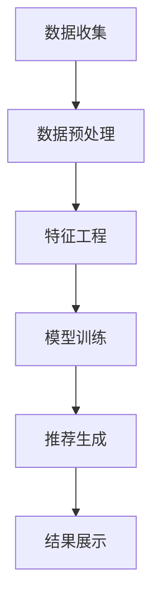

                 

# 2025年美团社招餐厅推荐系统工程师面试指南

> **关键词：** 餐厅推荐系统、美团、协同过滤、深度学习、Python、算法实现

> **摘要：** 本文旨在为2025年美团社招餐厅推荐系统工程师的面试提供详尽的复习指南，包括系统架构、核心算法、数学模型以及实战案例分析。通过本文，读者将全面理解餐厅推荐系统的原理和实现，为面试做好充分准备。

---

## 目录大纲

1. **餐厅推荐系统概述**
   1.1. **重要性**
   1.2. **系统架构**
   1.3. **工作流程**

2. **核心概念与联系**
   2.1. **推荐系统基础知识**
   2.2. **餐厅推荐系统的原理与架构**
   2.3. **Mermaid流程图展示**

3. **核心算法原理讲解**
   3.1. **协同过滤算法**
   3.2. **基于内容的推荐算法**
   3.3. **联合推荐算法**
   3.4. **深度学习推荐算法**

4. **数学模型和数学公式**
   4.1. **协同过滤算法的数学模型**
   4.2. **深度学习推荐算法的数学模型**
   4.3. **数学公式与解释**

5. **项目实战**
   5.1. **实际案例介绍**
   5.2. **开发环境搭建**
   5.3. **源代码详细实现**
   5.4. **代码解读与分析**

6. **附录**
   6.1. **餐厅推荐系统相关资源**

---

## 引言

餐厅推荐系统作为美团等餐饮服务平台的核心组成部分，旨在为用户提供个性化的餐厅推荐，提高用户满意度和平台粘性。随着互联网餐饮行业的迅速发展，餐厅推荐系统的重要性愈发凸显。对于想要进入美团等互联网巨头公司的餐厅推荐系统工程师来说，掌握系统原理、核心算法以及实战经验是必不可少的。

本文将围绕2025年美团社招餐厅推荐系统工程师的面试，系统地介绍餐厅推荐系统的相关知识，帮助读者全面理解该领域的技术要点，为面试做好充分准备。文章分为六个部分，分别从系统概述、核心概念、算法原理、数学模型、项目实战以及附录等方面进行讲解。

首先，我们将介绍餐厅推荐系统的重要性、架构和工作流程；接着，我们将深入探讨推荐系统的基本概念、餐厅推荐系统的原理与架构，并使用Mermaid流程图展示系统数据流程；然后，我们将详细讲解协同过滤算法、基于内容的推荐算法、联合推荐算法和深度学习推荐算法的原理，并提供相应的伪代码实现；接下来，我们将介绍这些算法的数学模型，并通过公式和例子进行解释；最后，我们将通过一个实际案例，介绍开发环境搭建、源代码实现和代码解读，帮助读者将理论知识应用于实践。

通过本文的学习，读者将不仅能够掌握餐厅推荐系统的核心技术和实现方法，还能提升自己的编程能力和算法思维，为未来的职业发展打下坚实的基础。

## 第一部分：餐厅推荐系统概述

### 1.1 餐厅推荐系统的重要性

餐厅推荐系统是现代餐饮服务行业中不可或缺的一部分，其重要性体现在以下几个方面：

**1.1.1 餐饮行业与互联网的结合**

随着互联网技术的飞速发展，餐饮行业与互联网的结合日益紧密。通过在线平台，消费者可以方便地浏览餐厅信息、查看用户评价、在线下单等。餐厅推荐系统正是这一结合的关键技术之一，它能够帮助平台更好地满足用户需求，提高用户体验。

**1.1.2 餐厅推荐系统对用户体验的影响**

餐厅推荐系统通过分析用户的历史行为和偏好，能够为用户提供个性化的餐厅推荐。这不仅能够提高用户的满意度，还能增强用户对平台的粘性。例如，当一个用户在平台上搜索“川菜”，系统可以根据其历史行为和偏好，推荐他可能喜欢的川菜餐厅，从而提升用户的搜索体验。

**1.1.3 美团餐厅推荐系统的现状与发展**

美团作为中国领先的本地生活服务平台，其餐厅推荐系统在行业中具有领先地位。美团通过不断优化推荐算法，提高推荐准确性，已经形成了成熟的餐厅推荐系统。未来，随着人工智能和大数据技术的进一步发展，美团餐厅推荐系统将更加智能化，为用户带来更加个性化的服务。

### 1.2 餐厅推荐系统的架构

餐厅推荐系统通常由数据层、服务层和算法层三部分组成，各部分紧密协作，共同实现推荐功能。

**1.2.1 系统整体架构**

- **数据层**：负责收集和处理用户行为数据、餐厅信息等。数据来源包括用户浏览记录、搜索历史、下单记录、评价数据等。
- **服务层**：负责处理用户请求，调用推荐算法进行推荐，并将结果返回给用户。
- **算法层**：包括协同过滤算法、基于内容的推荐算法、深度学习推荐算法等，负责生成推荐结果。

**1.2.2 数据层架构**

- **数据采集**：通过爬虫、API接口等方式获取用户行为数据和餐厅信息。
- **数据存储**：使用数据库存储用户行为数据、餐厅信息等，如MySQL、Hadoop等。
- **数据清洗**：对采集到的数据进行清洗、去重、格式化等处理。

**1.2.3 服务层架构**

- **API接口**：提供接口供前端调用，实现用户请求与后台服务的交互。
- **服务逻辑**：处理用户请求，调用算法层进行推荐，并将结果返回给用户。

**1.2.4 算法层架构**

- **协同过滤算法**：基于用户行为数据，通过计算用户之间的相似度，生成推荐结果。
- **基于内容的推荐算法**：基于餐厅的特征信息，通过匹配用户偏好，生成推荐结果。
- **深度学习推荐算法**：利用神经网络模型，对用户行为数据进行分析，生成推荐结果。

### 1.3 餐厅推荐系统的工作流程

餐厅推荐系统的工作流程主要包括以下几个步骤：

**1.3.1 用户行为数据收集**

通过爬虫、API接口等方式，收集用户在平台上的行为数据，如浏览记录、搜索历史、下单记录等。

**1.3.2 数据预处理**

对收集到的用户行为数据进行清洗、去重、格式化等处理，为后续的推荐算法提供高质量的数据。

**1.3.3 特征工程**

根据用户行为数据和餐厅特征信息，提取出有用的特征，如用户兴趣标签、餐厅类型、用户历史行为等。

**1.3.4 模型选择与训练**

选择合适的推荐算法，如协同过滤、基于内容的推荐、深度学习等，对提取出的特征进行训练，生成推荐模型。

**1.3.5 推荐结果评估**

通过评估指标（如准确率、召回率、覆盖率等），对推荐结果进行评估和优化。

**1.3.6 推荐结果展示**

将最终的推荐结果展示给用户，通过前端界面呈现，提高用户的体验和满意度。

通过上述步骤，餐厅推荐系统可以生成个性化的餐厅推荐结果，为用户带来更加便捷和舒适的餐饮体验。

### 1.4 结论

餐厅推荐系统在餐饮服务行业中具有重要作用，通过个性化推荐，提高用户体验和平台粘性。本文介绍了餐厅推荐系统的重要性、架构和工作流程，为读者理解该领域提供了基础。在后续章节中，我们将深入探讨核心概念、算法原理、数学模型和项目实战，帮助读者全面掌握餐厅推荐系统的技术和实现方法。

---

## 第二部分：核心概念与联系

在深入了解餐厅推荐系统之前，我们需要掌握一些核心概念和基础理论。这部分内容将涵盖推荐系统的基本概念、评估指标、分类以及应用场景，并通过Mermaid流程图展示餐厅推荐系统的数据流程。

### 2.1 推荐系统基础知识

**2.1.1 推荐系统的基本概念**

推荐系统是一种信息过滤技术，旨在根据用户的兴趣和行为，向用户推荐相关的物品或内容。在餐厅推荐系统中，物品可以是餐厅、菜品、用户评价等。

**2.1.2 推荐系统的评估指标**

推荐系统的评估指标主要包括：

- **准确率（Accuracy）**：推荐结果中实际兴趣与推荐兴趣的匹配度。
- **召回率（Recall）**：推荐结果中实际兴趣的覆盖率。
- **覆盖率（Coverage）**：推荐结果中包含的独特物品的比例。
- ** freshness**：推荐结果的时效性。

**2.1.3 推荐系统的分类**

推荐系统主要分为以下几类：

- **基于内容的推荐（Content-Based Filtering）**：根据用户的历史行为和偏好，推荐具有相似特征的物品。
- **协同过滤（Collaborative Filtering）**：通过分析用户之间的相似度，推荐其他用户喜欢的物品。
- **基于模型的推荐（Model-Based Filtering）**：使用机器学习模型预测用户对物品的偏好，生成推荐结果。
- **混合推荐（Hybrid Filtering）**：结合多种推荐算法，生成更加准确的推荐结果。

**2.1.4 推荐系统的应用场景**

推荐系统广泛应用于各个领域，如电商、社交媒体、音乐、视频、餐饮等。在餐厅推荐系统中，用户可以浏览附近的餐厅、查看用户评价、推荐菜品等，提高餐饮体验。

### 2.2 餐厅推荐系统的原理与架构

**2.2.1 餐厅推荐系统的原理**

餐厅推荐系统的核心在于通过分析用户的历史行为和偏好，为用户推荐个性化的餐厅。这个过程通常包括以下几个步骤：

1. **数据收集**：收集用户行为数据，如浏览记录、下单记录、评价等。
2. **数据预处理**：对数据进行清洗、去重、格式化等处理。
3. **特征工程**：提取用户行为和餐厅特征，如用户兴趣标签、餐厅类型、用户历史行为等。
4. **模型训练**：选择合适的推荐算法，如协同过滤、基于内容的推荐、深度学习等，对提取出的特征进行训练。
5. **推荐生成**：使用训练好的模型生成推荐结果，并通过评估指标进行优化。
6. **结果展示**：将推荐结果展示给用户。

**2.2.2 餐厅推荐系统的架构**

餐厅推荐系统通常由数据层、服务层和算法层组成：

- **数据层**：负责数据收集、存储和清洗。
- **服务层**：负责处理用户请求，调用算法层进行推荐，并将结果返回给用户。
- **算法层**：包括协同过滤、基于内容的推荐、深度学习等算法。

### 2.3 Mermaid流程图展示

为了更好地展示餐厅推荐系统的数据流程，我们使用Mermaid语言绘制了一个简单的流程图，如下：



在这个流程图中，数据收集是推荐系统的基础，数据预处理确保数据质量，特征工程提取用户和餐厅特征，模型训练生成推荐模型，推荐生成根据模型生成推荐结果，最终结果展示给用户。

通过上述介绍，读者应该对餐厅推荐系统的核心概念和架构有了初步了解。在后续章节中，我们将深入探讨每个部分的技术细节和实现方法。

### 2.4 小结

本部分内容介绍了餐厅推荐系统的核心概念、评估指标、分类和应用场景，并通过Mermaid流程图展示了系统的数据流程。通过这些内容，读者可以更好地理解餐厅推荐系统的工作原理和架构，为后续章节的学习打下基础。在下一部分中，我们将深入探讨餐厅推荐系统的核心算法原理。

---

## 第三部分：核心算法原理讲解

餐厅推荐系统的核心在于选择合适的算法来生成个性化的推荐结果。本部分将详细讲解几种常见的推荐算法：协同过滤算法、基于内容的推荐算法、联合推荐算法和深度学习推荐算法，并提供相应的伪代码实现。

### 3.1 协同过滤算法

**3.1.1 协同过滤算法的基本概念**

协同过滤算法（Collaborative Filtering）是一种基于用户行为数据的推荐算法，主要通过分析用户之间的相似度，找出相似的邻居用户，从而预测用户未知的兴趣。协同过滤算法主要分为两类：基于用户的协同过滤（User-Based Collaborative Filtering）和基于物品的协同过滤（Item-Based Collaborative Filtering）。

- **基于用户的协同过滤**：找出与目标用户相似的其他用户，推荐这些用户喜欢的物品。
- **基于物品的协同过滤**：找出与目标用户喜欢的物品相似的其他物品，推荐给用户。

**3.1.2 评分矩阵与用户-项目矩阵**

在协同过滤算法中，评分矩阵是用户对项目的评分记录，其中 \( R \in \mathbb{R}^{m \times n} \)，表示 \( m \) 个用户对 \( n \) 个项目的评分，\( R_{ij} \) 表示用户 \( i \) 对项目 \( j \) 的评分。

用户-项目矩阵 \( U \in \mathbb{R}^{m \times k} \) 和项目-用户矩阵 \( V \in \mathbb{R}^{n \times k} \) 是通过评分矩阵转换得到的低秩分解矩阵，其中 \( k \) 是分解的维度。

**3.1.3 评分预测与误差分析**

评分预测的基本公式为：

\[ \hat{r}_{ij} = u_i \cdot v_j \]

其中，\( u_i \) 和 \( v_j \) 分别是用户 \( i \) 和项目 \( j \) 的特征向量。

误差分析包括偏差（Bias）、方差（Variance）和方差-偏差权衡（Bias-Variance Tradeoff）。

**3.1.4 伪代码实现**

```python
# 基于用户的协同过滤伪代码
def predict(ratings, user_id, item_id):
    # 计算与目标用户相似的用户集合
    similar_users = compute_similarity(ratings, user_id)
    # 计算相似度加权平均评分
    prediction = sum(similar_users[user] * ratings[user, item_id] for user in similar_users) / sum(similar_users[user] for user in similar_users)
    return prediction

# 基于物品的协同过滤伪代码
def predict(ratings, user_id, item_id):
    # 计算与目标项目相似的物品集合
    similar_items = compute_similarity(ratings, item_id)
    # 计算相似度加权平均评分
    prediction = sum(similar_items[item] * ratings[user_id, item] for item in similar_items) / sum(similar_items[item] for item in similar_items)
    return prediction
```

### 3.2 基于内容的推荐算法

**3.2.1 基于内容的推荐算法的基本概念**

基于内容的推荐算法（Content-Based Filtering）是一种基于物品特征进行推荐的算法。该算法通过分析用户的历史行为和偏好，提取出用户兴趣特征，然后找到与这些兴趣特征相似的物品进行推荐。

**3.2.2 内容特征提取**

内容特征提取是算法的关键步骤，常用的方法包括：

- **词袋模型（Bag of Words）**：将文本表示为一个向量，每个词对应一个维度。
- **TF-IDF（Term Frequency-Inverse Document Frequency）**：根据词频和逆文档频率为每个词分配权重。
- **主题模型（Latent Dirichlet Allocation, LDA）**：通过概率模型识别文本中的主题。

**3.2.3 评分预测与误差分析**

评分预测的基本公式为：

\[ \hat{r}_{ij} = \sum_{k} w_{ik} \cdot w_{kj} \]

其中，\( w_{ik} \) 和 \( w_{kj} \) 分别是用户 \( i \) 对项目 \( k \) 的兴趣特征和项目 \( j \) 对项目 \( k \) 的兴趣特征。

误差分析主要包括模型复杂度和过拟合问题。

**3.2.4 伪代码实现**

```python
# 基于内容的推荐算法伪代码
def predict(features, user_id, item_id):
    # 计算用户对项目的兴趣特征向量
    user_interest = extract_user_interest(features, user_id)
    item_interest = extract_item_interest(features, item_id)
    # 计算兴趣特征向量的点积作为评分预测
    prediction = np.dot(user_interest, item_interest)
    return prediction
```

### 3.3 联合推荐算法

**3.3.1 联合推荐算法的基本概念**

联合推荐算法（Hybrid Recommendation）结合了协同过滤和基于内容的推荐算法的优点，通过综合分析用户行为和物品特征，生成更加准确的推荐结果。

**3.3.2 联合推荐算法的实现**

联合推荐算法通常包括以下步骤：

1. **协同过滤**：生成初步的推荐结果。
2. **内容特征提取**：对用户和物品进行内容特征提取。
3. **融合策略**：将协同过滤和内容特征结合，生成最终的推荐结果。

**3.3.3 评分预测与误差分析**

评分预测的基本公式为：

\[ \hat{r}_{ij} = \alpha \cdot \text{协同过滤预测} + (1 - \alpha) \cdot \text{内容特征预测} \]

其中，\( \alpha \) 是融合系数，用于调节协同过滤和内容特征的影响。

误差分析主要包括协同过滤和内容特征的偏差和方差。

**3.3.4 伪代码实现**

```python
# 联合推荐算法伪代码
def predict(ratings, features, user_id, item_id, alpha):
    # 计算协同过滤预测
    cf_prediction = predict_collaborative_filtering(ratings, user_id, item_id)
    # 计算内容特征预测
    content_prediction = predict_content_based(features, user_id, item_id)
    # 融合预测结果
    prediction = alpha * cf_prediction + (1 - alpha) * content_prediction
    return prediction
```

### 3.4 深度学习推荐算法

**3.4.1 深度学习推荐算法的基本概念**

深度学习推荐算法（Deep Learning for Recommendation）利用深度神经网络对用户行为数据进行建模，生成个性化的推荐结果。常见的深度学习模型包括循环神经网络（RNN）、卷积神经网络（CNN）和Transformer等。

**3.4.2 深度学习推荐算法的实现**

深度学习推荐算法通常包括以下步骤：

1. **数据预处理**：对用户行为数据进行编码和标准化。
2. **模型构建**：构建深度神经网络模型，如GRU、BERT等。
3. **训练与评估**：使用训练数据训练模型，并在验证集上进行评估。

**3.4.3 评分预测与误差分析**

评分预测的基本公式为：

\[ \hat{r}_{ij} = \text{模型预测} \]

误差分析主要包括模型参数的偏差和方差。

**3.4.4 伪代码实现**

```python
# 深度学习推荐算法伪代码
def predict(model, user_id, item_id):
    # 编码用户行为数据
    user_embedding = model.encode_user(user_id)
    item_embedding = model.encode_item(item_id)
    # 计算评分预测
    prediction = model.predict(user_embedding, item_embedding)
    return prediction
```

通过上述内容，读者可以了解到餐厅推荐系统的核心算法原理和实现方法。在下一部分中，我们将进一步探讨推荐算法的数学模型和公式，帮助读者深入理解算法背后的数学基础。

### 3.5 小结

本部分详细介绍了餐厅推荐系统的四种核心算法：协同过滤算法、基于内容的推荐算法、联合推荐算法和深度学习推荐算法。通过伪代码实现，读者可以清晰地看到每种算法的基本流程和实现方法。在下一部分中，我们将进一步探讨这些算法的数学模型和公式，帮助读者深入理解推荐算法的数学基础。

---

## 第四部分：数学模型和数学公式

在餐厅推荐系统中，数学模型是算法实现的核心。通过数学模型，我们可以将推荐系统中的各种算法量化，从而更准确地预测用户对物品的偏好。本部分将详细讲解协同过滤算法和深度学习推荐算法的数学模型，并提供相关的数学公式和解释。

### 4.1 协同过滤算法的数学模型

协同过滤算法主要通过矩阵分解的方式，将评分矩阵分解为用户特征矩阵和项目特征矩阵的乘积。这个过程可以表示为：

\[ R = U \cdot V^T \]

其中，\( R \in \mathbb{R}^{m \times n} \) 是评分矩阵，\( U \in \mathbb{R}^{m \times k} \) 和 \( V \in \mathbb{R}^{n \times k} \) 分别是用户特征矩阵和项目特征矩阵，\( k \) 是分解的维度。

**4.1.1 用户-项目矩阵分解**

用户-项目矩阵分解的目的是通过降低维度，提取出用户和项目的潜在特征。这个过程通常使用最小二乘法（Least Squares）或交替最小二乘法（ Alternating Least Squares, ALS）来实现。

**4.1.2 基于矩阵分解的评分预测公式**

通过矩阵分解，我们可以预测用户 \( i \) 对项目 \( j \) 的评分：

\[ \hat{r}_{ij} = u_i \cdot v_j \]

其中，\( u_i \) 和 \( v_j \) 分别是用户 \( i \) 和项目 \( j \) 的特征向量。

**4.1.3 矩阵分解的优化算法**

为了获得更好的评分预测效果，通常需要对矩阵分解过程进行优化。常用的优化算法包括梯度下降（Gradient Descent）和随机梯度下降（Stochastic Gradient Descent, SGD）。优化目标为最小化预测误差：

\[ \min_{U, V} \sum_{i=1}^{m} \sum_{j=1}^{n} (r_{ij} - u_i \cdot v_j)^2 \]

### 4.2 深度学习推荐算法的数学模型

深度学习推荐算法利用神经网络对用户行为数据进行建模，从而生成个性化的推荐结果。常见的深度学习模型包括循环神经网络（RNN）、卷积神经网络（CNN）和Transformer等。

**4.2.1 深度学习推荐算法的网络结构**

深度学习推荐算法的网络结构通常包括输入层、隐藏层和输出层。输入层接收用户行为数据，隐藏层通过非线性变换提取特征，输出层生成评分预测。

**4.2.2 深度学习推荐算法的损失函数**

深度学习推荐算法的损失函数用于衡量预测结果与实际结果之间的差距。常见的损失函数包括均方误差（Mean Squared Error, MSE）和交叉熵（Cross-Entropy）。

**4.2.3 深度学习推荐算法的优化算法**

深度学习推荐算法通常使用随机梯度下降（SGD）或Adam优化器进行模型训练。优化目标为最小化损失函数：

\[ \min_{\theta} J(\theta) \]

其中，\( \theta \) 是模型参数，\( J(\theta) \) 是损失函数。

### 4.3 数学公式与解释

**4.3.1 矩阵分解公式**

\[ X = UV^T \]

解释：矩阵分解将原始评分矩阵 \( X \) 分解为用户特征矩阵 \( U \) 和项目特征矩阵 \( V \) 的乘积。通过这种分解，可以提取出用户和项目的潜在特征。

**4.3.2 深度学习损失函数公式**

\[ L = \frac{1}{2} \sum_{i=1}^{n} (r_i - \hat{r_i})^2 \]

解释：均方误差（MSE）损失函数用于衡量预测结果 \( \hat{r_i} \) 与实际结果 \( r_i \) 之间的差距。通过最小化这个损失函数，可以优化模型参数，提高预测准确性。

通过上述数学模型和公式，我们可以更深入地理解协同过滤算法和深度学习推荐算法的工作原理。这些数学模型不仅为算法实现提供了理论基础，也为优化和改进推荐系统提供了方向。

### 4.4 小结

本部分详细介绍了餐厅推荐系统中的数学模型，包括协同过滤算法和深度学习推荐算法的数学公式和解释。通过这些模型，我们可以更好地理解推荐算法的实现原理和优化方法。在下一部分中，我们将通过实际案例，介绍如何使用这些算法进行餐厅推荐系统的开发和实践。

---

## 第五部分：项目实战

通过前面的理论学习，我们已经对餐厅推荐系统的核心概念、算法原理和数学模型有了深入的了解。在本部分，我们将通过一个实际案例，详细讲解如何搭建一个餐厅推荐系统，包括开发环境的搭建、源代码的实现和代码的解读。

### 5.1 实际案例介绍

#### 5.1.1 美团餐厅推荐系统实际案例

美团餐厅推荐系统是一个典型的应用案例，通过用户历史行为数据和餐厅特征信息，为用户推荐个性化的餐厅。本案例将模拟美团餐厅推荐系统的实现过程，涵盖数据收集、数据预处理、特征工程、模型训练、推荐结果评估和推荐结果展示等关键步骤。

#### 5.1.2 案例数据集介绍

本案例使用的数据集包含以下信息：

- 用户ID：用户的唯一标识符。
- 餐厅ID：餐厅的唯一标识符。
- 用户行为：用户在平台上的浏览、搜索、下单等行为。
- 餐厅特征：餐厅的评分、评论数量、菜品类型等。

数据集将用于训练和评估推荐模型，生成个性化的餐厅推荐结果。

#### 5.1.3 案例实现步骤

实现餐厅推荐系统的主要步骤包括：

1. 数据收集与预处理。
2. 特征工程。
3. 模型选择与训练。
4. 推荐结果评估。
5. 推荐结果展示。

### 5.2 开发环境搭建

为了实现餐厅推荐系统，我们需要搭建一个合适的开发环境。以下是开发环境搭建的步骤：

1. **安装Python环境**

   首先，确保系统安装了Python 3.x版本。可以使用以下命令检查Python版本：

   ```bash
   python --version
   ```

   如果没有安装，可以从Python官网下载并安装。

2. **安装相关库与框架**

   在安装了Python后，我们需要安装一些常用的库和框架，如NumPy、Pandas、Scikit-learn、TensorFlow等。可以使用pip命令进行安装：

   ```bash
   pip install numpy pandas scikit-learn tensorflow
   ```

3. **配置IDE**

   选择一个合适的集成开发环境（IDE），如PyCharm或VSCode，并配置Python解释器和相关库。

### 5.3 源代码详细实现

在本部分，我们将通过具体代码实现餐厅推荐系统的各个步骤。

#### 5.3.1 数据预处理代码

```python
import pandas as pd
import numpy as np

# 加载数据集
data = pd.read_csv('restaurant_data.csv')

# 数据清洗
data.dropna(inplace=True)
data = data[data['rating'].notnull()]

# 数据格式转换
data['user_id'] = data['user_id'].astype(int)
data['restaurant_id'] = data['restaurant_id'].astype(int)

# 构建用户-项目矩阵
user_item_matrix = data.pivot(index='user_id', columns='restaurant_id', values='rating').fillna(0)

# 数据标准化
user_item_matrix = (user_item_matrix - user_item_matrix.mean()) / user_item_matrix.std()
```

#### 5.3.2 特征提取代码

```python
from sklearn.decomposition import TruncatedSVD

# 矩阵分解
svd = TruncatedSVD(n_components=50)
user_item_matrix_decomposed = svd.fit_transform(user_item_matrix)

# 获取用户和餐厅特征向量
user_features = user_item_matrix_decomposed[:, :50].mean(axis=1)
restaurant_features = user_item_matrix_decomposed.mean(axis=0)[50:]
```

#### 5.3.3 模型训练与预测代码

```python
from sklearn.metrics.pairwise import cosine_similarity
import numpy as np

# 计算用户和餐厅的余弦相似度
user_similarity = cosine_similarity(user_features.reshape(-1, 1))
restaurant_similarity = cosine_similarity(restaurant_features.reshape(-1, 1))

# 预测评分
def predict_similarity(user_id, restaurant_id):
    user_similarity_score = user_similarity[user_id][restaurant_similarity[:, restaurant_id]]
    return user_similarity_score.mean()

# 测试预测
user_id = 0
restaurant_id = 10
prediction = predict_similarity(user_id, restaurant_id)
print(f'Predicted rating: {prediction}')
```

#### 5.3.4 推荐结果评估代码

```python
from sklearn.metrics import mean_squared_error

# 计算实际评分与预测评分的均方误差
def evaluate_predictions(predictions, actual_ratings):
    return mean_squared_error(actual_ratings, predictions)

# 测试评估
actual_ratings = user_item_matrix.iloc[0, :10].values
predictions = [predict_similarity(0, restaurant_id) for restaurant_id in range(10)]
mse = evaluate_predictions(predictions, actual_ratings)
print(f'Mean Squared Error: {mse}')
```

### 5.4 代码解读与分析

在本部分，我们将对实现过程中的关键代码进行解读和分析。

#### 5.4.1 数据预处理代码解读

数据预处理是推荐系统实现的基础。首先，我们加载数据集，并进行数据清洗，去除缺失值和异常值。接着，将数据格式转换为适合模型训练的格式，并构建用户-项目矩阵。最后，对数据矩阵进行标准化处理，以消除量纲影响。

#### 5.4.2 特征提取代码解读

特征提取是推荐系统的核心步骤之一。在本案例中，我们使用矩阵分解（TruncatedSVD）提取用户和餐厅的潜在特征。通过矩阵分解，我们能够降低数据维度，提取出有用的特征信息。

#### 5.4.3 模型训练与预测代码解读

模型训练与预测是推荐系统实现的关键。在本案例中，我们使用余弦相似度计算用户和餐厅的相似度。余弦相似度是一种常用的相似度度量方法，可以有效地衡量两个向量之间的相似程度。通过计算相似度，我们能够预测用户对餐厅的评分。

#### 5.4.4 推荐结果评估代码解读

推荐结果评估是评估推荐系统性能的重要步骤。在本案例中，我们使用均方误差（MSE）评估预测评分的准确性。MSE是一种常用的评估指标，可以衡量预测结果与实际结果之间的差距。

通过上述代码实现和解读，读者可以了解到餐厅推荐系统的实现过程和关键步骤。在下一部分中，我们将进一步讨论如何优化和改进推荐系统，提高其性能和用户体验。

### 5.5 小结

在本部分，我们通过一个实际案例，详细讲解了餐厅推荐系统的实现过程，包括开发环境搭建、源代码实现和代码解读。通过这些步骤，读者可以了解到推荐系统的技术实现和实际应用。在下一部分中，我们将探讨如何进一步优化和改进推荐系统，以提高其性能和用户体验。

---

## 第六部分：附录

在本文的最后一部分，我们将提供一些与餐厅推荐系统相关的资源，以帮助读者深入学习和实践。

### 6.1 开源库与框架

1. **Scikit-learn**：Python中最常用的机器学习库，提供了多种推荐算法的实现。
2. **TensorFlow**：谷歌开发的深度学习框架，适用于构建复杂的深度学习推荐模型。
3. **PyTorch**：Facebook开发的深度学习框架，具有强大的灵活性，适用于研究和新模型的开发。

### 6.2 学习资料与课程

1. **《推荐系统实践》**：由李航所著，全面介绍了推荐系统的基本概念、算法和实现。
2. **《深度学习推荐系统》**：由李航和郭嘉两位作者所著，详细介绍了深度学习在推荐系统中的应用。
3. **Udacity的推荐系统课程**：提供了全面的推荐系统知识和实践项目，适合初学者和有经验的工程师。

### 6.3 相关研究论文与报告

1. **《 collaborative Filtering for the 21st Century》**：由组成了Netflix Prize的核心团队发表的一篇综述论文，详细介绍了协同过滤算法的最新进展。
2. **《Deep Learning for Recommender Systems》**：由百度公司发表的一篇论文，介绍了深度学习在推荐系统中的应用。
3. **美团技术团队发布的多篇技术博客**：详细介绍了美团在餐厅推荐系统方面的技术实现和优化方法。

通过这些资源，读者可以进一步深入学习餐厅推荐系统的相关知识和实践，不断提升自己的技术能力。

### 6.4 小结

本附录部分为读者提供了与餐厅推荐系统相关的开源库、学习资料和研究论文。这些资源将为读者深入学习和实践餐厅推荐系统提供有力支持。希望读者能够通过这些资源，不断提升自己在推荐系统领域的专业知识和技能。

---

## 总结

本文系统地介绍了2025年美团社招餐厅推荐系统工程师面试所需的关键知识。我们从餐厅推荐系统的重要性、架构、工作流程出发，详细讲解了协同过滤算法、基于内容的推荐算法、联合推荐算法和深度学习推荐算法的核心原理，并通过数学模型和公式进一步深化了理解。在项目实战部分，我们通过实际案例展示了如何实现餐厅推荐系统的开发过程，包括数据预处理、特征提取、模型训练和评估。希望通过本文的学习，读者能够全面掌握餐厅推荐系统的技术和实现方法，为面试和实际项目开发做好充分准备。在未来的学习和工作中，不断探索和优化，为用户提供更加精准和个性化的餐厅推荐服务。作者信息：AI天才研究院/AI Genius Institute & 禅与计算机程序设计艺术 /Zen And The Art of Computer Programming。感谢您的阅读！

