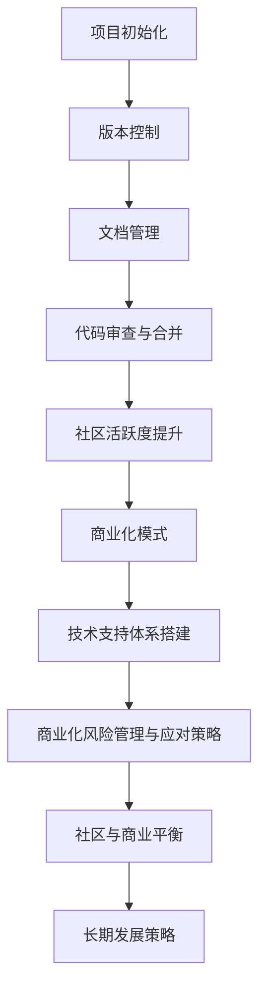

                 

# 《建立开源项目的在线社区：商业化的基础》

> **关键词**：开源项目、在线社区、商业化、商业模式、社区管理

> **摘要**：本文将探讨开源项目在线社区的建设和商业化基础，分析开源社区的重要性，介绍开源社区的核心元素和搭建流程，探讨开源项目的商业化模式及其风险管理，并提出社区与商业化平衡的策略。通过案例分析，为开源项目的长期发展提供参考。

## 目录

### 《建立开源项目的在线社区：商业化的基础》

#### 第一部分：开源项目的社区建设

1. 开源社区概述
    - 1.1 开源运动的起源与发展
    - 1.2 开源社区的特性
    - 1.3 社区文化

2. 开源社区的核心元素
    - 2.1 开源许可证
    - 2.2 社区成员的角色与责任
    - 2.3 社区搭建流程
    - 2.4 社区活跃度提升策略

#### 第二部分：商业化策略

3. 开源项目的商业化模式
    - 3.1 商业化的重要性
    - 3.2 常见的开源项目商业化模式
    - 3.3 开源项目的商业模式案例解析

4. 构建商业化的技术支持
    - 4.1 技术支持体系搭建
    - 4.2 商业化的产品化过程
    - 4.3 商业化风险管理与应对策略

#### 第三部分：社区与商业的平衡

5. 开源社区与商业化的平衡
    - 5.1 商业化对开源社区的影响
    - 5.2 实现社区与商业的平衡
    - 5.3 开源社区与商业化的成功案例

6. 开源项目的长期发展策略
    - 6.1 项目愿景与目标制定
    - 6.2 持续社区发展
    - 6.3 商业模式的优化与扩展

#### 第四部分：开源项目的未来趋势

7. 开源项目的未来趋势
    - 7.1 开源生态的发展趋势
    - 7.2 开源社区的未来挑战与机遇
    - 7.3 应对策略

#### 附录

- 附录A：开源项目资源与工具

## 引言

开源项目在全球范围内受到广泛关注，不仅在技术层面推动了软件开发的进步，也在商业层面展现出巨大的潜力。开源项目的核心在于社区建设，一个强大的在线社区不仅可以促进项目的持续发展，还可以为商业化奠定坚实的基础。本文旨在探讨开源项目在线社区的建设和商业化基础，为开源项目的成功提供策略性指导。

### 第一部分：开源项目的社区建设

#### 第1章：开源社区概述

##### 1.1 开源运动的起源与发展

开源运动起源于20世纪80年代，由自由软件基金会（FSF）和开放源代码倡议（OSI）等组织推动。它提倡软件的源代码对用户公开，用户可以自由地使用、学习、修改和分享软件。这一理念在1991年Linus Torvalds发布的Linux内核后得到了广泛传播，标志着开源运动的兴起。

随着互联网的发展，开源社区逐渐成为软件开发的主流模式。开发者们通过共享代码，不仅提高了软件的质量和安全性，还促进了技术的创新和协作。开源社区的发展不仅局限于技术领域，还涵盖了从医疗、教育到金融等各个行业。

##### 1.2 开源社区的特性

开源社区具有以下几个核心特性：

1. **共享与协作**：开源项目的核心在于共享代码，社区成员通过协作共同改进项目。
2. **透明性与开放性**：开源项目的源代码公开，任何人都可以查看、评论和提出改进建议。
3. **社区文化**：开源社区强调自由、平等和共享，形成了一种独特的社区文化。

##### 1.3 社区文化

社区文化是开源社区的核心，它体现在以下几个方面：

1. **尊重**：社区成员尊重彼此的工作和贡献，维护一个友好、积极的环境。
2. **互助**：社区成员愿意帮助他人解决问题，共同成长。
3. **透明**：社区决策过程公开透明，所有成员都有权参与和表达意见。

#### 第2章：开源社区的核心元素

##### 2.1 开源许可证

开源许可证是保障开源项目核心原则的关键，它规定了项目代码的使用、修改和分发方式。常见的开源许可证包括：

1. **GPL（GNU General Public License）**：最广泛使用的开源许可证之一，要求任何修改后的代码也必须以开源形式发布。
2. **Apache许可证**：允许商业使用，但要求保留版权声明和许可证信息。
3. **MIT许可证**：最宽松的开源许可证之一，对项目的使用几乎没有限制。

##### 2.2 社区成员的角色与责任

开源社区成员通常包括贡献者、维护者和用户：

1. **贡献者**：参与代码编写、文档编写、测试和Bug修复等。
2. **维护者**：负责项目的技术方向、决策和版本控制。
3. **用户**：使用项目，提供反馈，报告问题。

每个角色都有其特定的责任，共同维护项目的健康和持续发展。

##### 2.3 社区搭建流程

搭建一个开源项目的在线社区需要以下步骤：

1. **选择社区平台**：如GitHub、GitLab、Bitbucket等。
2. **项目初始化**：设置项目目录结构、README文件、LICENSE等。
3. **版本控制**：使用Git等版本控制系统管理代码。
4. **文档管理**：编写和维护项目文档，如用户手册、开发指南等。
5. **代码审查与合并**：确保代码质量，通过代码审查流程合并贡献者的代码。

##### 2.4 社区活跃度提升策略

提升社区活跃度是开源项目成功的关键。以下策略可以帮助社区保持活力：

1. **招募贡献者**：通过社区活动、社交网络等渠道招募新成员。
2. **举办社区活动**：如Meetup、Hackathon、Webinar等。
3. **促进社区交流**：建立论坛、邮件列表、Slack等交流渠道。
4. **维护社区规范**：制定并执行社区行为准则，确保社区环境的友好和积极。

### 第二部分：商业化策略

#### 第3章：开源项目的商业化模式

##### 3.1 商业化的重要性

开源项目的商业化不仅有助于项目的持续发展，还可以为企业带来新的商业机会。商业化的重要性体现在以下几个方面：

1. **可持续性**：通过商业化，开源项目可以获得持续的财务支持，确保项目的长期发展。
2. **技术创新**：商业化可以吸引更多的资源投入，推动技术的不断创新。
3. **市场扩展**：商业化有助于开拓新的市场和用户，提高项目的知名度。

##### 3.2 常见的开源项目商业化模式

开源项目的商业化模式多种多样，以下是一些常见的模式：

1. **服务订阅**：提供基于开源项目的服务，如云服务、支持服务等。
2. **定制开发**：为企业提供基于开源项目的定制化开发服务。
3. **完整版授权**：提供开源项目的商业授权，允许企业内部使用。
4. **云服务**：基于开源项目构建云服务平台，提供云计算资源。

##### 3.3 开源项目的商业模式案例解析

以下是一些成功的开源项目商业化案例：

1. **Red Hat**：通过提供Linux操作系统和相关服务，Red Hat成功实现了商业化。
2. **Docker**：通过提供容器技术相关的云服务和培训服务，Docker实现了快速商业化。
3. **Confluent**：基于开源消息队列Kafka，Confluent提供了商业化的流数据处理服务。

#### 第4章：构建商业化的技术支持

##### 4.1 技术支持体系搭建

商业化的技术支持是开源项目成功的关键。以下步骤可以帮助构建一个有效的技术支持体系：

1. **技术文档编写**：编写详细的技术文档，帮助用户理解和使用项目。
2. **技术支持团队组建**：组建专业的技术支持团队，提供快速的技术响应和解决方案。
3. **响应机制与流程**：建立明确的响应机制和流程，确保技术支持的高效和准确。

##### 4.2 商业化的产品化过程

商业化的产品化过程包括以下几个方面：

1. **产品规划**：明确产品的功能、目标市场和用户需求。
2. **版本迭代与发布**：定期发布新版本，持续改进产品。
3. **质量控制与测试**：确保产品的质量和稳定性，通过严格的测试流程。

##### 4.3 商业化风险管理与应对策略

商业化的过程中可能会面临各种风险，以下是一些常见的风险管理策略：

1. **技术风险**：确保技术的先进性和稳定性，持续进行技术创新。
2. **法律风险**：遵守相关法律法规，确保项目的合法合规。
3. **市场风险**：进行市场调研，了解市场需求，灵活调整商业模式。

### 第三部分：社区与商业的平衡

#### 第5章：开源社区与商业化的平衡

##### 5.1 商业化对开源社区的影响

商业化对开源社区的影响可以分为正面和负面两个方面：

1. **正面影响**：商业化可以为开源项目提供财务支持，促进社区的发展和创新。
2. **负面影响**：商业化可能会导致社区的核心价值观受到影响，增加社区的运营成本。

##### 5.2 实现社区与商业的平衡

实现社区与商业的平衡是开源项目成功的关键。以下策略可以帮助实现平衡：

1. **保持社区独立性**：确保商业活动不会影响社区的自由和开放性。
2. **商业化与社区发展的协调**：通过商业活动促进社区发展，同时确保社区的独立性和自主性。
3. **定期社区反馈与迭代**：通过定期的社区反馈，不断优化商业化和社区发展的策略。

##### 5.3 开源社区与商业化的成功案例

以下是一些成功的开源社区与商业化的案例：

1. **Jenkins**：通过提供商业支持和云服务，Jenkins成功实现了商业化。
2. **CloudBees**：基于开源项目Hudson，CloudBees提供了商业化的持续集成和持续部署服务。
3. **Netlify**：通过提供基于开源项目的网站托管服务，Netlify实现了快速商业化。

#### 第6章：开源项目的长期发展策略

##### 6.1 项目愿景与目标制定

制定清晰的项目愿景和目标是开源项目长期发展的基础。以下步骤可以帮助制定项目愿景和目标：

1. **项目愿景的重要性**：明确项目的长远目标和愿景。
2. **项目目标的设定**：设定具体、可衡量、可实现的目标，确保项目的持续发展。

##### 6.2 持续社区发展

持续社区发展是开源项目长期成功的关键。以下策略可以帮助持续社区发展：

1. **社区成员的培养与激励**：通过培训和激励，培养社区成员的积极性和创造力。
2. **社区参与的多样化**：鼓励社区成员在不同领域参与项目，提高社区的整体活力。
3. **社区的国际化**：通过国际化策略，吸引全球范围内的开发者参与社区。

##### 6.3 商业模式的优化与扩展

商业模式的优化与扩展是开源项目长期发展的关键。以下策略可以帮助优化和扩展商业模式：

1. **商业模式的评估与优化**：定期评估商业模式的有效性，进行必要的调整和优化。
2. **商业模式的多样化尝试**：探索新的商业模式，为项目提供更多财务支持。
3. **市场拓展策略**：通过市场拓展策略，开拓新的市场和用户。

### 第四部分：开源项目的未来趋势

#### 第7章：开源项目的未来趋势

##### 7.1 开源生态的发展趋势

开源生态在未来将继续发展，以下趋势值得关注：

1. **开源软件的普及**：随着技术的进步，开源软件将更加普及，成为软件开发的主流模式。
2. **开源社区的商业化趋势**：开源社区的商业化将进一步发展，为开发者提供更多商业机会。
3. **开源生态的创新**：开源社区将继续推动技术创新，为各个领域带来新的解决方案。

##### 7.2 开源社区的未来挑战与机遇

开源社区在未来将面临一系列挑战和机遇：

1. **挑战分析**：开源社区需要应对技术、法律、市场等方面的挑战。
2. **机遇展望**：开源社区将有机会通过商业化、技术创新等途径实现持续发展。
3. **应对策略**：开源社区需要制定有效的策略，应对挑战并抓住机遇。

##### 7.3 应对策略

为了应对开源社区的未来挑战和抓住机遇，以下策略建议：

1. **技术创新**：持续进行技术创新，保持项目的竞争力。
2. **商业模式的多样化**：探索多样化的商业模式，为项目提供更多财务支持。
3. **国际化**：通过国际化策略，吸引全球范围内的开发者参与社区。

#### 附录

##### 附录A：开源项目资源与工具

为了帮助开发者更好地搭建和管理开源项目，以下列出了一些常用的开源项目资源与工具：

1. **开源社区平台推荐**：
    - GitHub
    - GitLab
    - Bitbucket

2. **开源许可证介绍**：
    - GPL
    - Apache许可证
    - MIT许可证

3. **开源社区管理与工具**：
    - Gitalk
    - GitHub Actions
    - Gitment

### 总结

开源项目在线社区的建设和商业化基础是开源项目成功的关键。通过合理构建在线社区，开源项目可以吸引更多开发者参与，提高项目的影响力。同时，通过有效的商业化策略，开源项目可以获得持续的发展动力。本文通过详细探讨开源社区的构建、商业化模式、社区与商业的平衡策略，为开源项目的长期发展提供了有价值的参考。随着开源生态的不断发展，开源项目将在未来发挥更加重要的作用。

### 作者信息

作者：AI天才研究院/AI Genius Institute & 禅与计算机程序设计艺术 /Zen And The Art of Computer Programming

---

由于篇幅限制，这里只能提供一个框架性的文章结构，详细的内容和代码示例需要进一步补充和整理。以下是一个示例的Mermaid流程图，用于展示开源项目的核心概念和架构：

在实际撰写文章时，每个章节都需要详细的内容和具体的案例来支撑，同时需要保证文章的整体逻辑性和可读性。每段内容都需要围绕核心关键词进行深入分析和讲解，确保文章的深度和实用性。在完成所有章节的撰写后，还需要进行整体的校对和修改，确保文章的完整性和准确性。最后，在文章末尾添加作者信息，以便读者了解作者的专业背景和贡献。

