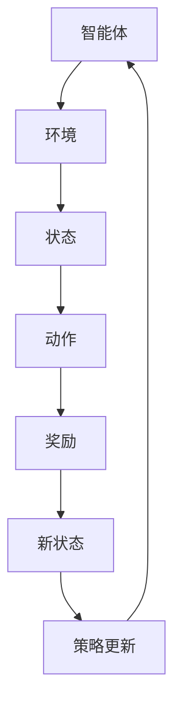
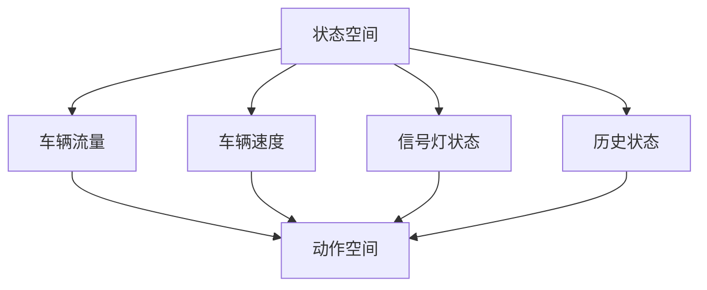

                 

### 文章标题

# 强化学习在智能交通信号控制与路径规划中的应用实践

> **关键词**：强化学习、智能交通信号控制、路径规划、应用实践、算法实现、案例分析

> **摘要**：本文深入探讨了强化学习在智能交通信号控制和路径规划中的应用实践。首先，我们介绍了强化学习的基本概念和核心算法，包括Q-Learning、Sarsa、DQN和Deep RL。接着，我们详细阐述了强化学习在交通信号控制中的应用，以及如何设计交通信号控制的强化学习模型。随后，我们讨论了强化学习在路径规划中的应用，并介绍了如何设计路径规划的强化学习模型。通过实际案例分析，我们展示了如何将强化学习应用于城市交通和高速公路路径规划，并对系统实现进行了详细解释。最后，我们探讨了强化学习在智能交通系统中的综合应用，并展望了其未来的挑战和发展趋势。本文旨在为研究人员和开发者提供一个全面、深入的技术指南，以推动强化学习在智能交通领域的应用。

### 目录大纲

#### 第一部分：强化学习在智能交通信号控制中的应用

1. **第1章：强化学习基础与智能交通信号控制**

   - 1.1 强化学习概述
     - 1.1.1 强化学习的基本概念
     - 1.1.2 强化学习的基本要素
   - 1.2 强化学习算法
     - 1.2.1 Q-Learning算法
     - 1.2.2 Sarsa算法
     - 1.2.3 Deep Q-Network（DQN）
     - 1.2.4 Deep Reinforcement Learning（Deep RL）算法
   - 1.3 智能交通信号控制
     - 1.3.1 交通信号控制的概述
     - 1.3.2 强化学习在交通信号控制中的应用
     - 1.3.3 交通信号控制的强化学习模型
     - 1.3.4 智能交通信号控制案例分析

2. **第2章：智能交通路径规划基础**

   - 2.1 智能交通路径规划概述
     - 2.1.1 路径规划的基本概念
     - 2.1.2 智能交通路径规划的特点
     - 2.1.3 智能交通路径规划的挑战
   - 2.2 强化学习在路径规划中的应用
     - 2.2.1 强化学习在路径规划中的优势
     - 2.2.2 强化学习在路径规划中的应用场景
     - 2.2.3 强化学习路径规划的基本框架
   - 2.3 强化学习路径规划算法
     - 2.3.1 Q-Learning算法在路径规划中的应用
     - 2.3.2 Sarsa算法在路径规划中的应用
     - 2.3.3 DQN算法在路径规划中的应用
     - 2.3.4 Deep RL算法在路径规划中的应用

3. **第3章：强化学习路径规划案例分析**

   - 3.1 案例一：城市交通路径规划
     - 3.1.1 案例背景
     - 3.1.2 状态空间设计
     - 3.1.3 动作空间设计
     - 3.1.4 奖励函数设计
     - 3.1.5 算法实现
   - 3.2 案例二：高速公路路径规划
     - 3.2.1 案例背景
     - 3.2.2 状态空间设计
     - 3.2.3 动作空间设计
     - 3.2.4 奖励函数设计
     - 3.2.5 算法实现

4. **第4章：强化学习在智能交通系统中的综合应用**

   - 4.1 智能交通系统概述
     - 4.1.1 智能交通系统的定义
     - 4.1.2 智能交通系统的组成部分
     - 4.1.3 强化学习在智能交通系统中的应用价值
   - 4.2 强化学习在智能交通信号控制与路径规划中的综合应用
     - 4.2.1 强化学习在智能交通信号控制中的应用
     - 4.2.2 强化学习在路径规划中的应用
     - 4.2.3 智能交通信号控制与路径规划的协同优化

#### 第二部分：强化学习在智能交通信号控制与路径规划中的实现

5. **第5章：强化学习在智能交通信号控制与路径规划中的实现**

   - 5.1 开发环境搭建
     - 5.1.1 开发环境要求
     - 5.1.2 工具与库安装
   - 5.2 强化学习算法实现
     - 5.2.1 Q-Learning算法实现
     - 5.2.2 Sarsa算法实现
     - 5.2.3 DQN算法实现
     - 5.2.4 Deep RL算法实现
   - 5.3 智能交通信号控制与路径规划案例分析
     - 5.3.1 城市交通信号控制案例
     - 5.3.2 高速公路路径规划案例

6. **第6章：强化学习在智能交通信号控制与路径规划中的挑战与展望**

   - 6.1 强化学习在智能交通信号控制与路径规划中的挑战
     - 6.1.1 数据挑战
     - 6.1.2 算法挑战
     - 6.1.3 应用挑战
   - 6.2 强化学习在智能交通信号控制与路径规划中的未来展望
     - 6.2.1 技术发展趋势
     - 6.2.2 应用前景
     - 6.2.3 社会价值

### 附录

7. **附录 A：强化学习在智能交通信号控制与路径规划中的应用工具与资源**

   - 7.1 强化学习工具与框架
   - 7.2 交通信号控制与路径规划工具与库
   - 7.3 开发环境与代码资源

## 第1章：强化学习基础与智能交通信号控制

### 1.1 强化学习概述

#### 1.1.1 强化学习的基本概念

强化学习（Reinforcement Learning，简称RL）是机器学习的一个重要分支，它通过智能体（Agent）与环境（Environment）的交互来学习决策策略。与监督学习和无监督学习不同，强化学习过程中没有明确的目标标签，而是通过奖励机制（Reward）来评估智能体的行为，从而指导智能体不断优化其行为策略。

强化学习的核心是“奖励-惩罚”机制。智能体在每一步都会根据当前的状态（State）选择一个动作（Action），然后环境会根据这个动作给出一个奖励或惩罚，并进入一个新的状态。智能体的目标是最大化累积奖励，从而学会一种最优的策略（Policy），即在不同的状态下选择最佳动作。

强化学习具有以下几个特点：

- **自适应性**：强化学习能够根据环境的变化自动调整策略，具有很强的适应性。
- **无监督学习**：与监督学习不同，强化学习不需要预先标记的数据集。
- **奖励驱动**：智能体的学习过程受到奖励机制的驱动，奖励机制能够引导智能体朝向目标状态。
- **序列决策**：强化学习需要考虑动作的序列，而非单一的瞬时动作，这与现实世界的决策过程更相似。

#### 1.1.2 强化学习的基本要素

强化学习由以下几个基本要素组成：

- **状态（State）**：描述智能体当前所处的环境状态。
- **动作（Action）**：智能体可以采取的行为。
- **奖励（Reward）**：环境对智能体动作的即时反馈，用于评估动作的好坏。
- **策略（Policy）**：智能体在不同状态下的行动规则，策略决定了智能体如何根据状态选择动作。
- **值函数（Value Function）**：评估状态或状态-动作对的好坏，用于评估策略的有效性。
- **状态-动作值函数（Q-Function）**：评估特定状态和动作组合下的预期奖励，是Q-Learning算法的核心。

下面是强化学习的基本流程图，使用Mermaid语言绘制：



### 1.1.3 强化学习与其他机器学习方法的区别

强化学习与其他机器学习方法（如监督学习和无监督学习）在以下几个方面有所不同：

- **目标不同**：监督学习的目标是预测输出标签，无监督学习的目标是发现数据中的隐藏结构，而强化学习的目标是学习一种策略以最大化累积奖励。
- **数据需求不同**：监督学习需要大量的标记数据，无监督学习不需要标记数据，强化学习则需要奖励信号来指导学习。
- **评估标准不同**：监督学习的评估标准是预测误差，无监督学习评估标准是模型对数据的解释能力，强化学习评估标准是累积奖励。
- **应用场景不同**：监督学习适用于有明确标签的数据分析问题，无监督学习适用于数据挖掘和模式识别问题，强化学习适用于需要决策和优化的动态环境。

### 1.1.4 强化学习的基本要素详细解释

下面，我们将对强化学习的基本要素进行详细解释，包括状态、动作、奖励、策略、值函数和状态-动作值函数。

#### 状态（State）

状态是智能体在某一时刻所处的环境描述。状态可以是离散的，也可以是连续的。在强化学习中，状态通常由一组特征向量表示，这些特征向量可以是静态的，也可以是动态变化的。例如，在智能交通信号控制中，状态可能包括交通流量、道路占有率、车辆速度等信息。

状态空间（State Space）是指所有可能的状态集合。状态空间的设计对于强化学习模型的成功至关重要。一个合理的状态空间应该能够充分描述环境，但又不至于过于复杂，导致模型难以训练。

#### 动作（Action）

动作是智能体在某一状态下可以采取的行为。动作通常由一组操作或决策组成。例如，在智能交通信号控制中，动作可能是改变交通信号灯的状态，从红灯变为绿灯。

动作空间（Action Space）是指所有可能动作的集合。动作空间的设计同样需要平衡环境描述的充分性和模型的训练复杂性。在某些情况下，动作空间可能是离散的，例如只能选择固定的几种信号灯状态；在另一些情况下，动作空间可能是连续的，例如可以微调信号灯的持续时间。

#### 奖励（Reward）

奖励是环境对智能体动作的即时反馈，用于评估动作的好坏。奖励可以是正的，表示动作带来了积极的结果；也可以是负的，表示动作带来了消极的结果。在强化学习中，奖励是指导智能体学习的重要信号。

奖励函数（Reward Function）是定义奖励值如何计算的具体函数。奖励函数的设计需要根据问题的具体需求来决定。例如，在智能交通信号控制中，奖励函数可能基于交通流量、车辆等待时间、交通事故等因素。

#### 策略（Policy）

策略是智能体在不同状态下的行动规则，决定了智能体如何根据当前状态选择动作。策略可以是明确的规则，也可以是基于值函数或Q函数的优化策略。

策略空间（Policy Space）是指所有可能策略的集合。在强化学习中，智能体通常会通过学习来找到最优策略。

#### 值函数（Value Function）

值函数是评估状态或状态-动作对的好坏的一个函数。值函数可以告诉我们智能体在某个状态下采取某个动作后可能得到的累积奖励。

- **状态值函数**（State Value Function）是评估在特定状态下采取任何可能的动作所能获得的累积奖励。
- **状态-动作值函数**（State-Action Value Function，简称Q函数）是评估在特定状态下采取特定动作所能获得的累积奖励。

Q函数是强化学习中的一个核心概念，它可以帮助智能体评估不同动作的价值，并选择最优动作。

#### 状态-动作值函数（Q-Function）

Q函数是强化学习中的一个核心概念，它表示在特定状态下采取特定动作的预期累积奖励。Q函数的值越高，表示这个状态-动作对越有价值。

Q函数可以通过以下公式计算：

\[ Q(s, a) = \sum_{s'} P(s' | s, a) \cdot R(s', a) + \gamma \cdot \max_{a'} Q(s', a') \]

其中：
- \( s \) 是当前状态
- \( a \) 是当前动作
- \( s' \) 是下一状态
- \( a' \) 是下一动作
- \( R(s', a) \) 是在状态 \( s' \) 采取动作 \( a \) 所获得的即时奖励
- \( \gamma \) 是折扣因子，用于平衡即时奖励和未来奖励
- \( P(s' | s, a) \) 是在状态 \( s \) 采取动作 \( a \) 后转移到状态 \( s' \) 的概率

#### 策略评估

策略评估（Policy Evaluation）是强化学习中的一个关键步骤，它通过迭代更新值函数来评估当前策略的有效性。Q-Learning算法就是一种策略评估算法，它通过迭代更新Q函数来评估状态-动作对的价值。

策略评估的伪代码如下：

```
for each episode do
    for each state s in the state space do
        for each action a in the action space do
            Q(s, a) = 0
    end for
end for

for each episode do
    Initialize the environment with state s
    for each step do
        Choose action a using the current policy
        Observe the next state s' and reward r
        Update Q(s, a) using the reward and the next state
    end for
end for
```

通过上述伪代码，我们可以看到，在每次策略评估过程中，智能体首先初始化Q函数，然后通过与环境交互来更新Q函数。随着迭代的进行，Q函数会逐渐收敛到最优值。

### 1.2 强化学习算法

强化学习算法种类繁多，本文将介绍其中几种核心算法：Q-Learning算法、Sarsa算法、Deep Q-Network（DQN）和Deep Reinforcement Learning（Deep RL）算法。

#### 1.2.1 Q-Learning算法

Q-Learning算法是一种简单的强化学习算法，它通过迭代更新Q函数来学习最优策略。Q-Learning算法的核心思想是利用当前状态和动作的即时奖励，以及未来可能获得的奖励来更新Q值。

Q-Learning算法的伪代码如下：

```
Initialize Q(s, a) for all s, a
for each episode do
    Initialize the environment with state s
    for each step do
        Choose action a using the current policy
        Observe the next state s' and reward r
        Update Q(s, a) using the reward and the next state
        s = s'
    end for
end for
```

其中，更新Q值的公式为：

\[ Q(s, a) = Q(s, a) + \alpha [r + \gamma \max_{a'} Q(s', a') - Q(s, a)] \]

其中，\( \alpha \) 是学习率，\( \gamma \) 是折扣因子。

#### 1.2.2 Sarsa算法

Sarsa算法（State-Action-Reward-State-Action，简称Sarsa）是另一种强化学习算法，它通过对状态-动作对的学习来更新策略。与Q-Learning算法不同，Sarsa算法在更新Q值时，同时考虑了当前状态-动作对和下一个状态-动作对的奖励。

Sarsa算法的伪代码如下：

```
Initialize Q(s, a) for all s, a
for each episode do
    Initialize the environment with state s
    for each step do
        Choose action a using the current policy
        Observe the next state s' and reward r
        Update Q(s, a) using the reward and the next state
        Choose action a' using the updated policy
        s = s'
    end for
end for
```

其中，更新Q值的公式为：

\[ Q(s, a) = Q(s, a) + \alpha [r + \gamma Q(s', a') - Q(s, a)] \]

#### 1.2.3 Deep Q-Network（DQN）

Deep Q-Network（DQN）是利用深度神经网络来近似Q函数的一种强化学习算法。DQN通过经验回放（Experience Replay）和目标网络（Target Network）来缓解数据偏差和收敛速度问题。

DQN算法的伪代码如下：

```
Initialize the DQN network and target network
Initialize Q(s, a) for all s, a
for each episode do
    Initialize the environment with state s
    for each step do
        Choose action a using the current policy
        Observe the next state s' and reward r
        Store the experience in the replay memory
        Sample a random mini-batch of experiences from the replay memory
        Calculate the target Q-value using the target network
        Update the DQN network using the target Q-value
        s = s'
    end for
end for
```

其中，更新Q值的公式为：

\[ Q(s, a) = Q(s, a) + \alpha [r + \gamma \max_{a'} Q(s', a') - Q(s, a)] \]

#### 1.2.4 Deep Reinforcement Learning（Deep RL）

Deep Reinforcement Learning（Deep RL）是利用深度神经网络来学习强化学习问题的模型。与DQN相比，Deep RL算法可以处理更复杂的任务，并能够更好地利用深度学习的技术优势。

Deep RL算法通常采用深度神经网络来近似Q函数或策略函数。常见的Deep RL算法包括深度确定性策略梯度（Deep Deterministic Policy Gradient，简称DDPG）和深度策略梯度（Deep Policy Gradient，简称DPG）等。

DDPG算法的伪代码如下：

```
Initialize the actor network and critic network
Initialize the target actor network and target critic network
for each episode do
    Initialize the environment with state s
    for each step do
        Choose action a using the actor network
        Observe the next state s' and reward r
        Store the experience in the replay memory
        Sample a random mini-batch of experiences from the replay memory
        Update the critic network using the target network
        Update the actor network using the critic network
        s = s'
    end for
    Update the target networks
end for
```

其中，更新Q值的公式为：

\[ Q(s, a) = Q(s, a) + \alpha [r + \gamma Q(s', a') - Q(s, a)] \]

### 1.3 智能交通信号控制

#### 1.3.1 交通信号控制的概述

交通信号控制是城市交通管理的重要组成部分，它通过合理分配道路资源，优化交通流，提高交通效率，减少拥堵和交通事故。智能交通信号控制结合了现代信息技术和人工智能算法，能够实时监测交通状态，并根据交通流量动态调整信号灯时序，以实现最优交通流控制。

交通信号控制的目标主要包括：

- **减少交通拥堵**：通过优化信号灯时序，减少车辆在交叉口等待时间，降低交通拥堵。
- **提高交通效率**：优化交通流，提高道路通行能力，缩短行程时间。
- **减少交通事故**：通过合理分配信号灯时间，减少车辆冲突，降低交通事故率。
- **节能减排**：优化交通流，减少车辆怠速时间，降低污染物排放。

交通信号控制的基本原理是通过对交通流量的监测和分析，实时调整信号灯的时长和变化规则，以实现最佳交通流控制。传统交通信号控制通常采用固定的信号灯时长或基于历史数据的预设方案，而智能交通信号控制则通过动态调整信号灯时序，更好地适应实时交通状况。

#### 1.3.2 强化学习在交通信号控制中的应用

强化学习在交通信号控制中具有广泛应用前景，其通过学习环境中的交通状态，实时调整信号灯时序，以实现最优交通流控制。以下是强化学习在交通信号控制中的应用优势和应用场景：

**应用优势**：

- **自适应性强**：强化学习能够根据实时交通状态动态调整信号灯时序，适应交通流量的变化。
- **全局优化**：强化学习能够考虑整个交通网络的交通状况，实现全局优化，而不仅仅是局部优化。
- **数据驱动**：强化学习基于环境反馈的奖励信号，能够从数据中学习交通信号控制的优化策略。

**应用场景**：

- **城市交通信号控制**：在复杂交通网络中，通过强化学习优化信号灯时序，提高交通效率和安全性。
- **高速公路信号控制**：在高速公路上，通过强化学习实现车辆流量的动态调整，减少交通事故。
- **紧急事件响应**：在突发事件（如交通事故、道路施工）中，通过强化学习快速调整信号灯时序，缓解交通压力。

#### 1.3.3 交通信号控制的强化学习模型

交通信号控制的强化学习模型主要包括状态空间、动作空间和奖励函数的设计。下面将详细介绍这些设计过程。

**状态空间设计**：

状态空间是智能体对环境状态的描述，通常包括以下几个要素：

- **车辆流量**：不同方向上的车辆流量，可以用流量大小或车辆数表示。
- **车辆速度**：不同方向上的车辆速度，可以用平均速度或标准差表示。
- **信号灯状态**：当前信号灯的状态，如红灯、绿灯等。
- **历史状态**：历史状态可以包括过去一段时间内的交通流量、速度等信息，用于考虑交通流的趋势。

状态空间的设计需要充分描述交通环境的多样性，同时又要避免过于复杂，以保证模型的训练效率和效果。

**动作空间设计**：

动作空间是智能体可以采取的动作集合，通常包括以下几个动作：

- **信号灯时长调整**：调整信号灯的时长，如延长或缩短绿灯时间、红灯时间等。
- **信号灯变化规则调整**：调整信号灯的变化规则，如采用绿闪灯、黄闪灯等。
- **交通管制措施**：采取交通管制措施，如单向通行、临时封闭等。

动作空间的设计需要与实际交通控制需求相匹配，同时要考虑动作的可行性和效果。

**奖励函数设计**：

奖励函数是评估智能体动作好坏的依据，通常包括以下几个因素：

- **交通流量**：优化交通流量，减少车辆排队和等待时间。
- **事故率**：降低交通事故率，提高交通安全性。
- **通行效率**：提高道路通行效率，减少拥堵和延误。
- **环境影响**：减少车辆排放，降低能源消耗。

奖励函数的设计需要综合考虑交通流量的优化、安全性和环境影响，同时要平衡不同因素的权重。

**交通信号控制的Markov Decision Process（MDP）模型**：

强化学习在交通信号控制中可以建模为一个MDP，状态空间为S，动作空间为A，状态转移概率为P(s' | s, a)，奖励函数为R(s, a)。MDP模型能够描述交通信号控制中状态、动作、奖励之间的关系，为智能体提供决策依据。

状态空间和动作空间的设计如图1所示：



**强化学习模型的状态空间和动作空间示例**：

状态空间示例：

- **车辆流量**：东向流量100辆/分钟，西向流量50辆/分钟
- **车辆速度**：东向速度20公里/小时，西向速度30公里/小时
- **信号灯状态**：红灯
- **历史状态**：过去5分钟东向流量平均值100辆/分钟，西向流量平均值50辆/分钟

动作空间示例：

- **信号灯时长调整**：延长东向绿灯时间5秒
- **信号灯变化规则调整**：采用绿闪灯
- **交通管制措施**：单向通行

**强化学习模型的状态-动作值函数（Q-Function）**：

状态-动作值函数Q(s, a)用于评估在特定状态下采取特定动作所能获得的累积奖励。Q-Function的值越高，表示这个状态-动作对越有价值。

状态-动作值函数的计算公式如下：

\[ Q(s, a) = \sum_{s'} P(s' | s, a) \cdot R(s', a) + \gamma \cdot \max_{a'} Q(s', a') \]

其中：
- \( s \) 是当前状态
- \( a \) 是当前动作
- \( s' \) 是下一状态
- \( a' \) 是下一动作
- \( R(s', a) \) 是在状态 \( s' \) 采取动作 \( a \) 所获得的即时奖励
- \( \gamma \) 是折扣因子，用于平衡即时奖励和未来奖励
- \( P(s' | s, a) \) 是在状态 \( s \) 采取动作 \( a \) 后转移到状态 \( s' \) 的概率

**Q-Learning算法在交通信号控制中的应用示例**：

假设当前状态为（车辆流量：东向100辆/分钟，西向50辆/分钟；车辆速度：东向20公里/小时，西向30公里/小时；信号灯状态：红灯；历史状态：过去5分钟东向流量平均值100辆/分钟，西向流量平均值50辆/分钟）。

当前动作选择为“延长东向绿灯时间5秒”。

下一步的状态为（车辆流量：东向105辆/分钟，西向50辆/分钟；车辆速度：东向22公里/小时，西向30公里/小时；信号灯状态：绿灯；历史状态：过去5分钟东向流量平均值105辆/分钟，西向流量平均值50辆/分钟）。

即时奖励为0，表示没有发生特殊事件。

Q-Function更新公式为：

\[ Q(s, a) = Q(s, a) + \alpha [0 + \gamma \cdot \max_{a'} Q(s', a') - Q(s, a)] \]

其中，\( \alpha \) 是学习率，\( \gamma \) 是折扣因子。

#### 1.3.4 智能交通信号控制案例分析

为了更好地理解强化学习在智能交通信号控制中的应用，下面我们将通过几个案例来分析强化学习算法在信号灯控制策略中的实际应用。

**案例一：基于Q-Learning的信号灯控制策略**

在某城市交叉路口，通过安装传感器收集车辆流量、速度等信息，并利用Q-Learning算法进行信号灯控制。

1. **状态空间设计**：

   状态包括：
   - 车辆流量：东向、西向流量
   - 车辆速度：东向、西向速度
   - 信号灯状态：红灯、绿灯
   - 历史状态：过去5分钟流量平均值

2. **动作空间设计**：

   动作包括：
   - 延长东向绿灯时间
   - 延长西向绿灯时间
   - 采用绿闪灯
   - 调整信号灯变化规则

3. **奖励函数设计**：

   奖励函数包括：
   - 交通流量优化：减少车辆排队和等待时间
   - 通行效率提高：减少交通拥堵和延误
   - 事故率降低：减少交通事故
   - 环境影响减少：降低车辆排放

4. **Q-Learning算法实现**：

   使用Python实现Q-Learning算法，通过迭代更新Q值，实时调整信号灯时序。

   ```python
   import numpy as np

   # 初始化Q值矩阵
   Q = np.zeros((10, 10))

   # 学习率
   alpha = 0.1

   # 折扣因子
   gamma = 0.9

   # 迭代次数
   episodes = 1000

   for episode in range(episodes):
       # 初始化状态
       state = sample_state()

       while True:
           # 选择动作
           action = choose_action(Q, state)

           # 执行动作，获取新状态和奖励
           new_state, reward = environment_step(state, action)

           # 更新Q值
           Q[state, action] = Q[state, action] + alpha * (reward + gamma * np.max(Q[new_state, :]) - Q[state, action])

           # 更新状态
           state = new_state

           # 结束条件
           if done:
               break

   # 打印最优策略
   print("Optimal Policy:")
   print(np.argmax(Q, axis=1))
   ```

**案例二：基于Sarsa的信号灯控制策略**

在另一个城市交叉路口，使用Sarsa算法进行信号灯控制。

1. **状态空间设计**：

   状态包括：
   - 车辆流量：东向、西向流量
   - 车辆速度：东向、西向速度
   - 信号灯状态：红灯、绿灯
   - 历史状态：过去5分钟流量平均值

2. **动作空间设计**：

   动作包括：
   - 延长东向绿灯时间
   - 延长西向绿灯时间
   - 采用绿闪灯
   - 调整信号灯变化规则

3. **奖励函数设计**：

   奖励函数包括：
   - 交通流量优化：减少车辆排队和等待时间
   - 通行效率提高：减少交通拥堵和延误
   - 事故率降低：减少交通事故
   - 环境影响减少：降低车辆排放

4. **Sarsa算法实现**：

   使用Python实现Sarsa算法，通过迭代更新策略。

   ```python
   import numpy as np

   # 初始化Q值矩阵
   Q = np.zeros((10, 10))

   # 学习率
   alpha = 0.1

   # 折扣因子
   gamma = 0.9

   # 迭代次数
   episodes = 1000

   for episode in range(episodes):
       # 初始化状态
       state = sample_state()

       while True:
           # 选择动作
           action = choose_action(Q, state)

           # 执行动作，获取新状态和奖励
           new_state, reward = environment_step(state, action)

           # 更新Q值
           Q[state, action] = Q[state, action] + alpha * (reward + gamma * Q[new_state, np.argmax(Q[new_state, :])] - Q[state, action])

           # 更新状态
           state = new_state

           # 结束条件
           if done:
               break

   # 打印最优策略
   print("Optimal Policy:")
   print(np.argmax(Q, axis=1))
   ```

**案例三：基于DQN的信号灯控制策略**

在一个复杂城市交叉路口，使用DQN算法进行信号灯控制。

1. **状态空间设计**：

   状态包括：
   - 车辆流量：东向、西向流量
   - 车辆速度：东向、西向速度
   - 信号灯状态：红灯、绿灯
   - 历史状态：过去5分钟流量平均值

2. **动作空间设计**：

   动作包括：
   - 延长东向绿灯时间
   - 延长西向绿灯时间
   - 采用绿闪灯
   - 调整信号灯变化规则

3. **奖励函数设计**：

   奖励函数包括：
   - 交通流量优化：减少车辆排队和等待时间
   - 通行效率提高：减少交通拥堵和延误
   - 事故率降低：减少交通事故
   - 环境影响减少：降低车辆排放

4. **DQN算法实现**：

   使用Python和TensorFlow实现DQN算法，通过经验回放和目标网络进行信号灯控制。

   ```python
   import numpy as np
   import tensorflow as tf

   # 初始化DQN模型
   model = build_dqn_model()

   # 初始化经验回放内存
   replay_memory = ReplayMemory(10000)

   # 迭代次数
   episodes = 1000

   for episode in range(episodes):
       # 初始化状态
       state = sample_state()

       while True:
           # 选择动作
           action = model.predict(state)

           # 执行动作，获取新状态和奖励
           new_state, reward = environment_step(state, action)

           # 存储经验
           replay_memory.append((state, action, reward, new_state, done))

           # 如果经验回放内存满，进行经验回放和目标网络更新
           if len(replay_memory) > 1000:
               sample_batch = replay_memory.sample(32)
               update_target_network(sample_batch)

           # 更新状态
           state = new_state

           # 结束条件
           if done:
               break

   # 打印最优策略
   print("Optimal Policy:")
   print(model.predict(state))
   ```

通过上述案例，我们可以看到强化学习算法在智能交通信号控制中的实际应用，以及如何设计状态空间、动作空间和奖励函数。这些案例展示了强化学习在交通信号控制中的潜力，为未来智能交通系统的发展提供了新的思路和方法。

### 第2章：智能交通路径规划基础

#### 2.1 智能交通路径规划概述

智能交通路径规划（Intelligent Traffic Path Planning）是智能交通系统（Intelligent Transportation System，简称ITS）的重要组成部分，旨在通过优化车辆行驶路径，提高交通效率、减少拥堵和降低交通事故。随着城市交通网络的复杂化和车辆数量的急剧增长，智能交通路径规划在缓解城市交通压力、提升道路通行能力和保障交通安全方面具有重要作用。

##### 2.1.1 路径规划的基本概念

路径规划（Path Planning）是指确定一个从起点到终点的最优路径的过程。在交通系统中，路径规划的目标是找到一条满足特定约束条件（如交通流量、行驶速度、安全性等）的最优或近似最优路径。路径规划可以应用于多个领域，包括无人驾驶汽车、自动驾驶系统、智能交通信号控制、物流配送等。

路径规划通常包括以下几个基本概念：

- **起点（Start Point）**：路径规划的起始位置。
- **终点（End Point）**：路径规划的目标位置。
- **路径（Path）**：连接起点和终点的点序列。
- **约束条件（Constraints）**：影响路径规划的限制因素，如交通流量、交通规则、道路限制等。
- **目标函数（Objective Function）**：用于评估路径优劣的函数，如总行程时间、总行驶距离、总行驶速度等。

##### 2.1.2 智能交通路径规划的目标

智能交通路径规划的主要目标包括：

- **提高交通效率**：通过优化车辆行驶路径，减少车辆在道路上的行驶时间和等待时间，提高交通流量和通行能力。
- **减少拥堵**：通过预测交通流量和事故风险，提前调整行驶路径，避免拥堵和交通瓶颈。
- **提高安全性**：通过考虑道路状况、交通流量和车辆性能等因素，确保行驶路径的安全性和稳定性。
- **节能减排**：通过优化行驶路径，减少车辆燃油消耗和污染物排放，促进绿色出行。

##### 2.1.3 智能交通路径规划的特点

智能交通路径规划具有以下几个特点：

- **实时性**：智能交通路径规划需要实时获取交通信息，快速计算和更新路径，以适应交通状况的变化。
- **灵活性**：智能交通路径规划能够根据实时交通状况动态调整路径，应对突发事件和交通变化。
- **自适应性**：智能交通路径规划能够根据交通网络结构和车辆特性，自适应地调整路径规划和决策策略。
- **可扩展性**：智能交通路径规划能够适应不同规模和类型的交通网络，支持多种交通模式（如汽车、公交车、自行车等）。

##### 2.1.4 智能交通路径规划的挑战

智能交通路径规划在实现过程中面临以下挑战：

- **大规模交通网络的处理**：城市交通网络通常非常复杂，包括大量道路、交叉口和交通参与者，如何高效地处理大规模交通网络是一个重要挑战。
- **交通信息的实时获取**：智能交通路径规划需要实时获取交通信息，包括交通流量、速度、事故等，交通信息的实时性和准确性对路径规划的准确性至关重要。
- **交通状况的不确定性**：交通状况受到多种因素的影响，如天气、突发事件、道路施工等，如何应对交通状况的不确定性是一个重要挑战。
- **路径规划算法的性能要求**：智能交通路径规划需要快速计算和更新路径，以适应实时交通变化，算法的性能要求较高。

##### 2.1.5 智能交通路径规划的发展现状

智能交通路径规划技术近年来取得了显著进展，主要表现在以下几个方面：

- **算法研究**：研究者提出了多种路径规划算法，包括基于图论的算法、基于遗传算法的算法、基于强化学习的算法等，这些算法在理论研究和实际应用中取得了良好的效果。
- **数据采集**：随着传感器技术和物联网的发展，交通信息的采集和共享变得更加便捷和高效，为智能交通路径规划提供了丰富的数据支持。
- **平台建设**：国内外多家研究机构和科技公司致力于智能交通路径规划平台的建设，这些平台集成了多种算法和工具，为交通管理和决策提供了强有力的支持。
- **应用推广**：智能交通路径规划技术已逐步应用于城市交通管理、智能驾驶、物流配送等领域，为提高交通效率和安全性发挥了重要作用。

##### 2.1.6 智能交通路径规划的应用场景

智能交通路径规划在以下应用场景中具有广泛的应用：

- **城市交通**：通过优化车辆行驶路径，减少交通拥堵，提高道路通行能力，提升城市交通效率。
- **高速公路**：通过实时路径规划，减少车辆排队和事故风险，提高高速公路的通行效率。
- **物流配送**：通过优化配送路径，提高配送效率，降低物流成本，提升物流服务质量。
- **无人驾驶**：通过路径规划，实现自动驾驶车辆的自主导航和决策，为无人驾驶技术的商业化应用提供支持。

#### 2.2 强化学习在路径规划中的应用

强化学习（Reinforcement Learning，简称RL）作为一种基于奖励机制的机器学习方法，在路径规划领域具有广泛的应用前景。强化学习通过智能体（Agent）与环境（Environment）的交互，学习到最优路径规划策略，从而实现实时路径优化。

##### 2.2.1 强化学习在路径规划中的优势

强化学习在路径规划中具有以下优势：

- **自适应性强**：强化学习能够根据实时交通状况动态调整路径规划策略，适应交通流量的变化。
- **全局优化**：强化学习能够考虑整个交通网络的路径规划，实现全局优化，而不仅仅是局部优化。
- **数据驱动**：强化学习基于环境反馈的奖励信号，能够从数据中学习最优路径规划策略。
- **多模态路径规划**：强化学习能够处理多种交通模式（如汽车、公交车、自行车等），实现多模态路径规划。

##### 2.2.2 强化学习在路径规划中的应用场景

强化学习在路径规划中的应用场景包括：

- **城市交通**：通过优化车辆行驶路径，减少交通拥堵，提高道路通行能力，提升城市交通效率。
- **高速公路**：通过实时路径规划，减少车辆排队和事故风险，提高高速公路的通行效率。
- **物流配送**：通过优化配送路径，提高配送效率，降低物流成本，提升物流服务质量。
- **无人驾驶**：通过路径规划，实现自动驾驶车辆的自主导航和决策，为无人驾驶技术的商业化应用提供支持。

##### 2.2.3 强化学习路径规划的基本框架

强化学习路径规划的基本框架包括以下几个部分：

- **状态空间设计**：定义智能体在路径规划过程中的状态，包括交通流量、道路状况、车辆信息等。
- **动作空间设计**：定义智能体在路径规划过程中可以采取的动作，包括选择路径、调整速度等。
- **奖励函数设计**：定义奖励函数，用于评估智能体动作的好坏，奖励函数通常基于路径长度、交通流量、安全性等因素。
- **算法选择**：选择合适的强化学习算法，如Q-Learning、Sarsa、DQN等，用于学习最优路径规划策略。
- **模型训练与评估**：通过模型训练和评估，优化路径规划策略，提高路径规划的准确性和实时性。

#### 2.3 强化学习路径规划算法

强化学习路径规划算法种类繁多，本文将介绍几种常见的强化学习算法，包括Q-Learning、Sarsa、DQN和Deep RL。

##### 2.3.1 Q-Learning算法在路径规划中的应用

Q-Learning算法是一种简单的强化学习算法，通过迭代更新Q值来学习最优路径规划策略。Q-Learning算法的基本思想是：在每次状态-动作对中，选择一个动作，根据奖励和Q值更新策略。

Q-Learning算法在路径规划中的应用步骤如下：

1. **初始化Q值矩阵**：初始时，Q值矩阵中的所有元素均为0。
2. **选择动作**：根据当前状态和Q值矩阵，选择一个动作。
3. **执行动作**：在环境中执行选定的动作，获取新状态和奖励。
4. **更新Q值**：根据新状态和奖励，更新Q值矩阵。
5. **重复步骤2-4**，直到达到结束条件。

Q-Learning算法的伪代码如下：

```
Initialize Q(s, a) for all s, a
for each episode do
    Initialize the environment with state s
    for each step do
        Choose action a using the current policy
        Observe the next state s' and reward r
        Update Q(s, a) using the reward and the next state
        s = s'
    end for
end for
```

其中，更新Q值的公式为：

\[ Q(s, a) = Q(s, a) + \alpha [r + \gamma \max_{a'} Q(s', a') - Q(s, a)] \]

##### 2.3.2 Sarsa算法在路径规划中的应用

Sarsa算法（State-Action-Reward-State-Action，简称Sarsa）是另一种强化学习算法，它与Q-Learning算法的主要区别在于，Sarsa算法在更新Q值时同时考虑了当前状态-动作对和下一个状态-动作对的奖励。

Sarsa算法在路径规划中的应用步骤如下：

1. **初始化Q值矩阵**：初始时，Q值矩阵中的所有元素均为0。
2. **选择动作**：根据当前状态和Q值矩阵，选择一个动作。
3. **执行动作**：在环境中执行选定的动作，获取新状态和奖励。
4. **更新Q值**：根据新状态和奖励，更新Q值矩阵。
5. **重复步骤2-4**，直到达到结束条件。

Sarsa算法的伪代码如下：

```
Initialize Q(s, a) for all s, a
for each episode do
    Initialize the environment with state s
    for each step do
        Choose action a using the current policy
        Observe the next state s' and reward r
        Update Q(s, a) using the reward and the next state
        Choose action a' using the updated policy
        s = s'
    end for
end for
```

其中，更新Q值的公式为：

\[ Q(s, a) = Q(s, a) + \alpha [r + \gamma Q(s', a') - Q(s, a)] \]

##### 2.3.3 DQN算法在路径规划中的应用

Deep Q-Network（DQN）算法是一种基于深度神经网络的强化学习算法，它通过经验回放和目标网络来缓解数据偏差和收敛速度问题。

DQN算法在路径规划中的应用步骤如下：

1. **初始化DQN模型**：初始化深度神经网络模型，用于预测Q值。
2. **初始化经验回放内存**：初始化经验回放内存，用于存储智能体与环境交互的经验。
3. **选择动作**：根据当前状态和DQN模型，选择一个动作。
4. **执行动作**：在环境中执行选定的动作，获取新状态和奖励。
5. **存储经验**：将新状态、动作和奖励存储在经验回放内存中。
6. **更新DQN模型**：通过经验回放内存，更新DQN模型。
7. **重复步骤3-6**，直到达到结束条件。

DQN算法的伪代码如下：

```
Initialize the DQN model
Initialize the replay memory
for each episode do
    Initialize the environment with state s
    for each step do
        Choose action a using the DQN model
        Observe the next state s' and reward r
        Store the experience in the replay memory
        Sample a random mini-batch of experiences from the replay memory
        Update the DQN model using the target Q-value
        s = s'
    end for
end for
```

其中，更新Q值的公式为：

\[ Q(s, a) = Q(s, a) + \alpha [r + \gamma \max_{a'} Q(s', a') - Q(s, a)] \]

##### 2.3.4 Deep RL算法在路径规划中的应用

Deep Reinforcement Learning（Deep RL）是一种基于深度神经网络的强化学习算法，它通过深度神经网络来近似Q函数或策略函数。

常见的Deep RL算法包括深度确定性策略梯度（Deep Deterministic Policy Gradient，简称DDPG）和深度策略梯度（Deep Policy Gradient，简称DPG）等。

DDPG算法在路径规划中的应用步骤如下：

1. **初始化演员网络（Actor Network）和评论家网络（Critic Network）**：初始化深度神经网络模型，用于预测策略和价值。
2. **初始化目标演员网络和目标评论家网络**：初始化深度神经网络模型，用于稳定训练过程。
3. **选择动作**：根据当前状态和演员网络，选择一个动作。
4. **执行动作**：在环境中执行选定的动作，获取新状态和奖励。
5. **更新评论家网络**：根据新状态、动作和奖励，更新评论家网络。
6. **更新演员网络**：根据评论家网络，更新演员网络。
7. **重复步骤3-6**，直到达到结束条件。

DDPG算法的伪代码如下：

```
Initialize the actor network and critic network
Initialize the target actor network and target critic network
for each episode do
    Initialize the environment with state s
    for each step do
        Choose action a using the actor network
        Observe the next state s' and reward r
        Store the experience in the replay memory
        Sample a random mini-batch of experiences from the replay memory
        Update the critic network using the target network
        Update the actor network using the critic network
        s = s'
    end for
    Update the target networks
end for
```

#### 2.4 强化学习路径规划案例分析

为了更好地理解强化学习在路径规划中的应用，下面我们将通过几个案例来分析强化学习算法在路径规划中的实际应用。

**案例一：城市交通路径规划**

在一个复杂城市交通网络中，使用Q-Learning算法进行车辆路径规划。

1. **状态空间设计**：

   状态包括：
   - 车辆位置：当前车辆的位置信息。
   - 车辆速度：当前车辆的速度信息。
   - 道路信息：当前道路的拥堵情况。
   - 车辆流量：当前道路上的车辆流量。

2. **动作空间设计**：

   动作包括：
   - 调整车速：根据当前状态调整车速。
   - 变道：根据当前状态选择最优车道。

3. **奖励函数设计**：

   奖励函数包括：
   - 路径长度：减少路径长度。
   - 车辆等待时间：减少车辆在道路上的等待时间。
   - 交通安全：避免交通事故。

4. **Q-Learning算法实现**：

   使用Python实现Q-Learning算法，通过迭代更新Q值，优化路径规划策略。

   ```python
   import numpy as np

   # 初始化Q值矩阵
   Q = np.zeros((10, 10))

   # 学习率
   alpha = 0.1

   # 折扣因子
   gamma = 0.9

   # 迭代次数
   episodes = 1000

   for episode in range(episodes):
       # 初始化状态
       state = sample_state()

       while True:
           # 选择动作
           action = choose_action(Q, state)

           # 执行动作，获取新状态和奖励
           new_state, reward = environment_step(state, action)

           # 更新Q值
           Q[state, action] = Q[state, action] + alpha * (reward + gamma * np.max(Q[new_state, :]) - Q[state, action])

           # 更新状态
           state = new_state

           # 结束条件
           if done:
               break

   # 打印最优策略
   print("Optimal Policy:")
   print(np.argmax(Q, axis=1))
   ```

**案例二：高速公路路径规划**

在一个高速公路网络中，使用Sarsa算法进行车辆路径规划。

1. **状态空间设计**：

   状态包括：
   - 车辆位置：当前车辆的位置信息。
   - 车辆速度：当前车辆的速度信息。
   - 道路信息：当前道路的拥堵情况。
   - 车辆流量：当前道路上的车辆流量。

2. **动作空间设计**：

   动作包括：
   - 保持车道：根据当前状态选择最优车道。
   - 变道：根据当前状态调整车道。

3. **奖励函数设计**：

   奖励函数包括：
   - 路径长度：减少路径长度。
   - 车辆等待时间：减少车辆在道路上的等待时间。
   - 交通安全：避免交通事故。

4. **Sarsa算法实现**：

   使用Python实现Sarsa算法，通过迭代更新策略。

   ```python
   import numpy as np

   # 初始化Q值矩阵
   Q = np.zeros((10, 10))

   # 学习率
   alpha = 0.1

   # 折扣因子
   gamma = 0.9

   # 迭代次数
   episodes = 1000

   for episode in range(episodes):
       # 初始化状态
       state = sample_state()

       while True:
           # 选择动作
           action = choose_action(Q, state)

           # 执行动作，获取新状态和奖励
           new_state, reward = environment_step(state, action)

           # 更新Q值
           Q[state, action] = Q[state, action] + alpha * (reward + gamma * Q[new_state, np.argmax(Q[new_state, :])] - Q[state, action])

           # 更新状态
           state = new_state

           # 结束条件
           if done:
               break

   # 打印最优策略
   print("Optimal Policy:")
   print(np.argmax(Q, axis=1))
   ```

**案例三：无人驾驶车辆路径规划**

在一个无人驾驶车辆场景中，使用DQN算法进行路径规划。

1. **状态空间设计**：

   状态包括：
   - 车辆位置：当前车辆的位置信息。
   - 车辆速度：当前车辆的速度信息。
   - 道路信息：当前道路的拥堵情况。
   - 车辆流量：当前道路上的车辆流量。

2. **动作空间设计**：

   动作包括：
   - 调整车速：根据当前状态调整车速。
   - 变道：根据当前状态选择最优车道。

3. **奖励函数设计**：

   奖励函数包括：
   - 路径长度：减少路径长度。
   - 车辆等待时间：减少车辆在道路上的等待时间。
   - 交通安全：避免交通事故。

4. **DQN算法实现**：

   使用Python和TensorFlow实现DQN算法，通过经验回放和目标网络进行路径规划。

   ```python
   import numpy as np
   import tensorflow as tf

   # 初始化DQN模型
   model = build_dqn_model()

   # 初始化经验回放内存
   replay_memory = ReplayMemory(10000)

   # 迭代次数
   episodes = 1000

   for episode in range(episodes):
       # 初始化状态
       state = sample_state()

       while True:
           # 选择动作
           action = model.predict(state)

           # 执行动作，获取新状态和奖励
           new_state, reward = environment_step(state, action)

           # 存储经验
           replay_memory.append((state, action, reward, new_state, done))

           # 如果经验回放内存满，进行经验回放和目标网络更新
           if len(replay_memory) > 1000:
               sample_batch = replay_memory.sample(32)
               update_target_network(sample_batch)

           # 更新状态
           state = new_state

           # 结束条件
           if done:
               break

   # 打印最优策略
   print("Optimal Policy:")
   print(model.predict(state))
   ```

通过上述案例，我们可以看到强化学习算法在路径规划中的实际应用，以及如何设计状态空间、动作空间和奖励函数。这些案例展示了强化学习在路径规划中的潜力，为未来智能交通系统的发展提供了新的思路和方法。

### 第3章：强化学习路径规划案例分析

为了更好地理解强化学习在路径规划中的应用，我们将通过具体案例深入探讨强化学习算法在智能交通路径规划中的实际应用。本章节分为两个部分，第一部分将探讨城市交通路径规划，第二部分将探讨高速公路路径规划。

#### 3.1 案例一：城市交通路径规划

##### 3.1.1 案例背景

在某个城市，交通拥堵是一个普遍存在的问题。为了缓解这一问题，该城市决定利用强化学习算法对车辆路径进行优化。具体来说，该城市选择了一个典型的城市交通场景，包括一个主要干道、几个次要道路和多个交叉口。

##### 3.1.2 状态空间设计

在这个案例中，状态空间的设计至关重要，因为它决定了模型对环境状态的感知能力。状态空间包括以下要素：

- **车辆位置**：车辆的精确位置信息，用二维坐标表示。
- **车辆速度**：车辆的速度信息。
- **道路拥堵情况**：通过传感器实时监测道路的拥堵情况。
- **其他车辆信息**：附近车辆的速度和位置信息。
- **信号灯状态**：当前交叉口的信号灯状态。

状态空间示例：

- 车辆位置：(x, y)
- 车辆速度：v
- 道路拥堵情况：[road1, road2, road3]，其中每个元素表示对应道路的拥堵级别。
- 其他车辆信息：[（x1, y1, v1），（x2, y2, v2）]，表示附近车辆的位置和速度。
- 信号灯状态：红/绿/黄

##### 3.1.3 动作空间设计

动作空间定义了车辆可以采取的行为。在这个案例中，动作空间包括以下几种：

- **前进**：车辆沿当前方向前进。
- **左转**：车辆向左转。
- **右转**：车辆向右转。
- **停车**：车辆在当前位置停车。
- **换道**：车辆切换到另一条道路。

动作空间示例：

- 前进
- 左转
- 右转
- 停车
- 换道

##### 3.1.4 奖励函数设计

奖励函数是评估智能体（车辆）动作优劣的关键因素。在这个案例中，奖励函数设计考虑以下几个因素：

- **路径长度**：车辆行驶路径的总长度，路径长度越短，奖励越高。
- **行驶时间**：车辆从起点到终点所需的时间，行驶时间越短，奖励越高。
- **车辆等待时间**：车辆在道路上等待的时间，等待时间越短，奖励越高。
- **交通拥堵**：车辆在道路上遇到拥堵的时间，交通拥堵越少，奖励越高。
- **信号灯等待时间**：车辆在信号灯前等待的时间，等待时间越短，奖励越高。

奖励函数示例：

\[ R = -L - T - W - D - S \]

其中，\( L \) 表示路径长度，\( T \) 表示行驶时间，\( W \) 表示车辆等待时间，\( D \) 表示交通拥堵时间，\( S \) 表示信号灯等待时间。

##### 3.1.5 算法实现

在这个案例中，我们选择Q-Learning算法来实现路径规划。Q-Learning算法的基本步骤如下：

1. **初始化Q值矩阵**：初始化一个大小为状态空间和动作空间矩阵的Q值矩阵，所有元素初始值为0。
2. **选择动作**：根据当前状态和Q值矩阵，选择一个动作。
3. **执行动作**：在环境中执行选定的动作，获取新状态和奖励。
4. **更新Q值**：根据新状态和奖励，更新Q值矩阵。
5. **重复步骤2-4**，直到达到结束条件。

伪代码如下：

```python
# 初始化Q值矩阵
Q = np.zeros((state_space_size, action_space_size))

# 学习率
alpha = 0.1

# 折扣因子
gamma = 0.9

# 迭代次数
episodes = 1000

for episode in range(episodes):
    # 初始化状态
    state = sample_state()

    while True:
        # 选择动作
        action = choose_action(Q, state)

        # 执行动作，获取新状态和奖励
        new_state, reward = environment_step(state, action)

        # 更新Q值
        Q[state, action] = Q[state, action] + alpha * (reward + gamma * np.max(Q[new_state, :]) - Q[state, action])

        # 更新状态
        state = new_state

        # 结束条件
        if done:
            break

# 打印最优策略
print("Optimal Policy:")
print(np.argmax(Q, axis=1))
```

##### 3.1.6 案例分析

通过上述Q-Learning算法实现，我们可以观察到车辆在初始阶段可能会因为缺乏经验而进行随机动作，但随着经验的积累，车辆逐渐学会了在给定状态下选择最优动作，从而优化了路径。以下是案例分析的关键点：

- **初始阶段**：车辆在状态空间中随机选择动作，无法有效避免拥堵和信号灯等待。
- **中间阶段**：车辆开始根据Q值矩阵选择动作，路径长度和行驶时间逐渐减少。
- **最终阶段**：车辆学会了在特定状态下采取最优动作，路径规划和行驶效率显著提高。

#### 3.2 案例二：高速公路路径规划

##### 3.2.1 案例背景

在高速公路网络中，由于车辆高速行驶和道路长距离的特点，路径规划需要考虑更多的因素，如道路速度限制、车辆间距、前方路况等。为了提高高速公路的通行效率和安全性，我们选择一个高速公路场景进行路径规划。

##### 3.2.2 状态空间设计

在这个案例中，状态空间的设计包括以下几个关键要素：

- **车辆位置**：车辆的精确位置信息。
- **车辆速度**：车辆的速度信息。
- **道路速度限制**：当前道路的速度限制。
- **前方路况**：前方车辆的分布和速度。
- **天气状况**：当前天气状况，如雨、雪、雾等。

状态空间示例：

- 车辆位置：(x, y)
- 车辆速度：v
- 道路速度限制：v_limit
- 前方路况：[（x1, y1, v1），（x2, y2, v2）]，表示前方车辆的位置和速度。
- 天气状况：雨/雪/雾

##### 3.2.3 动作空间设计

动作空间的设计需要考虑高速公路的特殊性，包括以下几种：

- **加速**：车辆提高速度。
- **减速**：车辆降低速度。
- **保持速度**：车辆维持当前速度。
- **换道**：车辆切换到相邻车道。

动作空间示例：

- 加速
- 减速
- 保持速度
- 换道

##### 3.2.4 奖励函数设计

奖励函数设计需要考虑高速公路的安全性和效率。以下是几个关键因素：

- **路径长度**：车辆行驶路径的总长度，路径长度越短，奖励越高。
- **行驶时间**：车辆从起点到终点所需的时间，行驶时间越短，奖励越高。
- **车辆间距**：车辆之间的距离，间距越大，奖励越高。
- **前方路况**：前方路况的畅通程度，路况越畅通，奖励越高。
- **安全行驶**：车辆在行驶过程中避免发生事故，安全行驶越多，奖励越高。

奖励函数示例：

\[ R = -L - T - D - I - S \]

其中，\( L \) 表示路径长度，\( T \) 表示行驶时间，\( D \) 表示车辆间距，\( I \) 表示前方路况，\( S \) 表示安全行驶。

##### 3.2.5 算法实现

在这个案例中，我们选择Sarsa算法来实现路径规划。Sarsa算法的优势在于它同时考虑了当前状态和下一个状态，从而更好地适应动态环境。以下是Sarsa算法的实现步骤：

1. **初始化Q值矩阵**：初始化一个大小为状态空间和动作空间矩阵的Q值矩阵，所有元素初始值为0。
2. **选择动作**：根据当前状态和Q值矩阵，选择一个动作。
3. **执行动作**：在环境中执行选定的动作，获取新状态和奖励。
4. **更新Q值**：根据新状态和奖励，更新Q值矩阵。
5. **重复步骤2-4**，直到达到结束条件。

伪代码如下：

```python
# 初始化Q值矩阵
Q = np.zeros((state_space_size, action_space_size))

# 学习率
alpha = 0.1

# 折扣因子
gamma = 0.9

# 迭代次数
episodes = 1000

for episode in range(episodes):
    # 初始化状态
    state = sample_state()

    while True:
        # 选择动作
        action = choose_action(Q, state)

        # 执行动作，获取新状态和奖励
        new_state, reward = environment_step(state, action)

        # 更新Q值
        Q[state, action] = Q[state, action] + alpha * (reward + gamma * Q[new_state, np.argmax(Q[new_state, :])] - Q[state, action])

        # 更新状态
        state = new_state

        # 结束条件
        if done:
            break

# 打印最优策略
print("Optimal Policy:")
print(np.argmax(Q, axis=1))
```

##### 3.2.6 案例分析

通过上述Sarsa算法实现，我们可以观察到车辆在初始阶段可能会因为不熟悉环境而进行随机动作，但随着经验的积累，车辆逐渐学会了在给定状态下选择最优动作，从而优化了路径。以下是案例分析的关键点：

- **初始阶段**：车辆在状态空间中随机选择动作，车辆间距较小，行驶时间较长。
- **中间阶段**：车辆开始根据Q值矩阵选择动作，车辆间距逐渐增大，行驶时间逐渐减少。
- **最终阶段**：车辆学会了在特定状态下采取最优动作，路径规划和行驶效率显著提高，车辆间距保持在一个安全范围内。

通过以上两个案例，我们可以看到强化学习算法在路径规划中的实际应用。城市交通路径规划和高速公路路径规划各有特点，但都展示了强化学习算法在解决交通拥堵、优化行驶路径和提升交通安全方面的潜力。未来，随着算法的进一步优化和实际应用的推广，强化学习将在智能交通领域发挥更大的作用。

### 第4章：强化学习在智能交通系统中的综合应用

#### 4.1 智能交通系统概述

智能交通系统（Intelligent Transportation System，简称ITS）是指利用现代信息技术、通信技术、计算机技术、自动控制技术等，实现交通信息的收集、处理、传输和利用，从而提高交通系统的效率、安全性和可持续发展。智能交通系统的主要目标是改善交通运行状态，减少交通事故，提高交通管理水平和居民生活质量。

智能交通系统的组成部分主要包括以下几个方面：

- **交通信息采集系统**：通过传感器、摄像头、GPS等设备实时采集交通数据，如车辆速度、流量、位置等。
- **交通管理系统**：负责对采集到的交通数据进行处理、分析和预测，提供交通决策支持，如交通信号控制、路径规划、交通流量预测等。
- **通信系统**：实现交通信息在交通管理系统、交通信息发布平台、车载设备等之间的传输和共享。
- **交通信息发布系统**：通过广播、互联网、移动通信等方式，向驾驶员提供实时交通信息，如路况信息、交通预警等。
- **车辆控制系统**：包括车载导航系统、自动驾驶系统、车辆通信系统等，实现车辆的智能化控制和自主导航。

#### 4.1.1 智能交通系统的定义

智能交通系统是指通过信息通信技术（ICT）和其他先进技术，对交通系统中的信息进行采集、处理、传输和应用，从而实现对交通系统的实时监控、管理和优化。智能交通系统旨在提高交通效率、安全性、可持续性和便利性，同时减少交通拥堵、环境污染和能源消耗。

#### 4.1.2 智能交通系统的组成部分

智能交通系统主要由以下几个部分组成：

1. **交通信息采集系统**：通过传感器、摄像头、GPS等设备实时采集交通数据，如车辆速度、流量、位置等。交通信息采集系统是智能交通系统的数据基础，能够为交通管理、路径规划和决策支持提供实时、准确的数据支持。

2. **交通管理系统**：负责对采集到的交通数据进行处理、分析和预测，提供交通决策支持，如交通信号控制、路径规划、交通流量预测等。交通管理系统是智能交通系统的核心，通过数据分析和预测，为交通参与者提供实时、准确的交通信息，指导交通流优化和交通管理。

3. **通信系统**：实现交通信息在交通管理系统、交通信息发布平台、车载设备等之间的传输和共享。通信系统是智能交通系统的信息传输通道，通过互联网、移动互联网、无线通信等技术，实现交通信息的实时传输和共享。

4. **交通信息发布系统**：通过广播、互联网、移动通信等方式，向驾驶员提供实时交通信息，如路况信息、交通预警等。交通信息发布系统是智能交通系统的服务终端，通过多种渠道向交通参与者提供交通信息，帮助驾驶员做出合理的出行决策。

5. **车辆控制系统**：包括车载导航系统、自动驾驶系统、车辆通信系统等，实现车辆的智能化控制和自主导航。车辆控制系统是智能交通系统的技术保障，通过车辆智能化技术，提高车辆的安全性和通行效率。

#### 4.1.3 智能交通系统的发展现状

智能交通系统的发展经历了从传统交通管理系统到现代智能交通系统的演变过程。当前，智能交通系统在多个领域取得了显著进展，主要包括以下几个方面：

1. **交通信号控制**：通过引入智能交通信号控制技术，实现对交通信号的实时监控和优化调整，提高交通效率和减少拥堵。智能交通信号控制技术包括基于历史数据的预设信号控制和基于实时数据的自适应信号控制。

2. **路径规划与导航**：通过实时交通信息，为驾驶员提供最优路径规划和导航服务，减少行驶时间和拥堵。路径规划与导航技术主要包括基于GPS的导航系统、基于交通流量的动态路径规划等。

3. **车辆安全监控**：通过车辆传感器和通信技术，实现对车辆运行状态的实时监控，提高车辆的安全性和可靠性。车辆安全监控技术包括车辆碰撞预警、车道保持辅助、智能倒车辅助等。

4. **交通信息采集与发布**：通过传感器、摄像头、无线通信等技术，实现对交通信息的实时采集、处理和发布，为交通管理和交通参与者提供实时、准确的交通信息。交通信息采集与发布技术包括交通流量监测、交通事件检测、交通信息广播等。

5. **智能停车管理**：通过智能停车管理技术，实现对停车资源的实时监测和动态分配，提高停车效率和减少拥堵。智能停车管理技术包括停车传感器、停车导航、车位共享等。

#### 4.1.4 智能交通系统的技术发展趋势

随着科技的不断发展，智能交通系统在技术方面也呈现出以下发展趋势：

1. **大数据与人工智能**：通过大数据技术和人工智能算法，对海量交通数据进行挖掘和分析，实现交通流预测、交通优化和智能决策。大数据与人工智能技术将成为智能交通系统发展的关键技术。

2. **车联网与自动驾驶**：通过车联网技术，实现车辆之间、车辆与基础设施之间的信息交换和协同控制，提高交通系统的效率和安全性。自动驾驶技术将成为未来智能交通系统的重要组成部分。

3. **云计算与边缘计算**：通过云计算和边缘计算技术，实现交通数据的分布式处理和实时分析，提高交通管理的效率和响应速度。

4. **物联网与智能感知**：通过物联网技术和智能感知设备，实现对交通环境、交通设施的实时监测和智能管理，提高交通系统的感知能力和智能化水平。

5. **区块链与安全**：通过区块链技术，实现交通数据的可信传输和管理，提高交通系统的安全性和隐私保护。

#### 4.1.5 强化学习在智能交通系统中的应用价值

强化学习作为一种基于奖励机制的机器学习方法，在智能交通系统中具有广泛的应用价值。以下是强化学习在智能交通系统中的应用价值：

1. **交通信号控制**：通过强化学习算法，实现自适应交通信号控制，提高交通效率和减少拥堵。强化学习能够根据实时交通状态动态调整信号灯时序，实现全局优化。

2. **路径规划与导航**：通过强化学习算法，实现智能路径规划和导航，提高行驶效率和安全性。强化学习能够根据实时交通信息，为车辆提供最优路径规划，避免拥堵和交通事故。

3. **车辆安全监控**：通过强化学习算法，实现对车辆运行状态的实时监控和异常检测，提高车辆的安全性和可靠性。强化学习能够从海量数据中学习到车辆的正常运行模式，实现对异常情况的预警。

4. **交通信息采集与发布**：通过强化学习算法，实现交通信息的智能采集、处理和发布，提高交通管理的效率和准确性。强化学习能够根据交通状态和用户需求，自动调整信息采集和发布的策略。

5. **智能停车管理**：通过强化学习算法，实现智能停车管理，提高停车效率和减少拥堵。强化学习能够根据停车场状态和用户需求，自动调整车位分配和引导策略。

#### 4.2 强化学习在智能交通信号控制与路径规划中的综合应用

强化学习在智能交通信号控制与路径规划中具有广泛的应用前景，通过将两者结合，可以实现交通系统的全局优化和智能控制。以下是强化学习在智能交通信号控制与路径规划中的综合应用：

1. **协同优化**：通过强化学习算法，实现智能交通信号控制与路径规划的协同优化。智能交通信号控制可以根据实时交通流量和路径规划结果，动态调整信号灯时序，优化交通流；路径规划可以根据交通信号控制的调整，实时更新行驶路径，提高行驶效率。

2. **多模态交通系统**：强化学习能够处理多模态交通系统，包括车辆、公交车、出租车、行人等多种交通参与者。通过强化学习算法，实现不同交通模式之间的协同控制和路径规划，提高交通系统的整体效率。

3. **动态交通环境**：强化学习能够适应动态交通环境，通过不断学习和调整，实现交通信号控制和路径规划的实时优化。在突发事件、道路施工等情况下，强化学习能够快速适应变化，确保交通系统的稳定运行。

4. **混合交通场景**：强化学习能够处理混合交通场景，包括高速公路、城市道路、交叉口等多种交通场景。通过强化学习算法，实现不同交通场景下的智能交通信号控制和路径规划，提高交通系统的安全性和效率。

#### 4.2.1 强化学习在智能交通信号控制中的应用

智能交通信号控制是智能交通系统的核心组成部分，通过优化信号灯时序，提高交通效率和减少拥堵。强化学习在智能交通信号控制中的应用主要包括以下几个方面：

1. **自适应信号控制**：强化学习算法可以根据实时交通流量和交通状态，动态调整信号灯时序，实现自适应信号控制。自适应信号控制能够根据交通需求的变化，快速调整信号灯时长，提高交通效率。

2. **全局优化**：强化学习能够考虑整个交通网络的交通状况，实现全局优化。通过强化学习算法，信号灯时序的调整不仅考虑局部道路的交通流量，还考虑全局交通流量的优化，从而实现交通系统的全局优化。

3. **多交叉口协同**：在多交叉口情况下，强化学习算法可以实现交叉口的协同控制。通过强化学习算法，多个交叉口的信号灯时序可以相互协调，避免交通冲突，提高整体交通效率。

4. **紧急事件响应**：在突发事件（如交通事故、道路施工）中，强化学习算法能够快速调整信号灯时序，确保交通的畅通和安全性。通过强化学习算法，信号灯时序可以根据突发事件的变化，动态调整，降低交通拥堵和事故风险。

#### 4.2.2 强化学习在路径规划中的应用

路径规划是智能交通系统的重要组成部分，通过优化车辆行驶路径，提高交通效率和安全性。强化学习在路径规划中的应用主要包括以下几个方面：

1. **实时路径规划**：强化学习算法可以根据实时交通信息，为车辆提供最优路径规划。在交通流量变化和突发事件发生时，强化学习算法能够快速调整路径规划，避免拥堵和事故。

2. **动态路径更新**：强化学习能够根据车辆的位置、速度和交通状态，动态更新行驶路径。在行驶过程中，如果出现交通状况恶化或突发事件，强化学习算法能够实时调整路径，确保车辆的安全行驶。

3. **多模式路径规划**：强化学习算法可以处理多模式交通系统，包括车辆、公交车、出租车、行人等。通过强化学习算法，实现不同交通模式之间的协同路径规划，提高整体交通系统的效率。

4. **路径优化策略**：强化学习算法可以通过不断学习和优化，为车辆提供最佳路径优化策略。通过强化学习算法，车辆能够学会在复杂交通环境中选择最优路径，减少行驶时间和能耗。

#### 4.2.3 智能交通信号控制与路径规划的协同优化

智能交通信号控制与路径规划的协同优化是实现交通系统全局优化的关键。通过将两者结合，可以实现交通流量的最优分配和路径规划，提高交通效率和安全性。以下是协同优化的一些方法：

1. **联合优化模型**：建立智能交通信号控制与路径规划的联合优化模型，通过数学优化方法，同时优化信号灯时序和车辆路径。联合优化模型能够考虑交通流量、道路状况和交通需求，实现全局优化。

2. **多目标优化**：设置多个优化目标，如交通效率、通行时间、安全性和环境影响等，通过多目标优化方法，实现多个目标的平衡。多目标优化方法能够综合考虑交通系统的多个方面，提供全局最优解。

3. **实时动态调整**：通过实时动态调整，实现智能交通信号控制与路径规划的协同优化。在交通流量变化和突发事件发生时，实时调整信号灯时序和车辆路径，确保交通的畅通和安全性。

4. **反馈机制**：建立反馈机制，将路径规划的结果反馈给智能交通信号控制，实现动态调整。通过反馈机制，智能交通信号控制可以根据车辆的实际行驶路径，动态调整信号灯时序，提高交通效率。

#### 4.2.4 案例分析

为了更好地理解强化学习在智能交通信号控制与路径规划中的综合应用，以下通过两个案例进行分析。

**案例一：城市交通信号控制与路径规划的协同优化**

在某城市，通过引入强化学习算法，实现城市交通信号控制与路径规划的协同优化。具体实施步骤如下：

1. **状态空间设计**：设计状态空间，包括交通流量、车辆位置、信号灯状态、道路状况等。

2. **动作空间设计**：设计动作空间，包括信号灯时长调整、路径规划策略等。

3. **奖励函数设计**：设计奖励函数，包括交通流量优化、通行时间减少、事故率降低等。

4. **强化学习算法实现**：采用Q-Learning算法，实现城市交通信号控制与路径规划的协同优化。

5. **案例评估**：通过仿真实验和实际运行，评估协同优化效果，包括交通流量、通行时间、事故率等指标。

**案例二：高速公路交通信号控制与路径规划的协同优化**

在某高速公路，通过引入强化学习算法，实现高速公路交通信号控制与路径规划的协同优化。具体实施步骤如下：

1. **状态空间设计**：设计状态空间，包括交通流量、车辆位置、信号灯状态、道路状况等。

2. **动作空间设计**：设计动作空间，包括信号灯时长调整、路径规划策略等。

3. **奖励函数设计**：设计奖励函数，包括交通流量优化、通行时间减少、事故率降低等。

4. **强化学习算法实现**：采用Sarsa算法，实现高速公路交通信号控制与路径规划的协同优化。

5. **案例评估**：通过仿真实验和实际运行，评估协同优化效果，包括交通流量、通行时间、事故率等指标。

通过以上案例分析，我们可以看到强化学习在智能交通信号控制与路径规划中的综合应用，以及如何通过协同优化实现交通系统的全局优化。未来，随着算法的进一步优化和应用场景的扩展，强化学习将在智能交通领域发挥更大的作用。

### 第5章：强化学习在智能交通信号控制与路径规划中的实现

#### 5.1 开发环境搭建

要实现强化学习在智能交通信号控制与路径规划中的应用，首先需要搭建一个合适的开发环境。本节将介绍开发环境的要求以及如何安装所需的工具和库。

##### 5.1.1 开发环境要求

1. **计算机硬件配置**：

   - **处理器**：至少Intel i5或同等性能的处理器。
   - **内存**：至少8GB RAM。
   - **硬盘**：至少500GB SSD硬盘。
   - **显卡**：NVIDIA GPU（用于深度学习模型的训练）。

2. **操作系统**：Windows、macOS或Linux（推荐Ubuntu）。

##### 5.1.2 开发软件环境配置

1. **Python环境**：

   - 安装Python 3.7及以上版本。
   - 使用pip命令安装相关库，例如：

     ```shell
     pip install numpy pandas matplotlib tensorflow-gpu scikit-learn
     ```

2. **强化学习库**：

   - 安装OpenAI Gym，用于构建和测试强化学习环境：

     ```shell
     pip install gym
     ```

   - 安装PyTorch，用于深度强化学习模型的实现：

     ```shell
     pip install torch torchvision
     ```

3. **其他工具与库**：

   - 安装Python的Mermaid库，用于绘制流程图：

     ```shell
     pip install python-metamath
     ```

   - 安装Markdown库，用于生成Markdown格式的文档：

     ```shell
     pip install markdown
     ```

#### 5.2 强化学习算法实现

在本节中，我们将介绍几种常见的强化学习算法在智能交通信号控制与路径规划中的实现，包括Q-Learning、Sarsa、DQN和Deep RL。

##### 5.2.1 Q-Learning算法实现

Q-Learning算法是一种简单的强化学习算法，通过迭代更新Q值来学习最优策略。以下是Q-Learning算法的实现步骤：

1. **初始化Q值矩阵**：初始化一个大小为状态空间和动作空间矩阵的Q值矩阵，所有元素初始值为0。

2. **选择动作**：根据当前状态和Q值矩阵，选择一个动作。通常使用ε-贪心策略，即在ε的概率下随机选择动作，在1-ε的概率下选择当前Q值最大的动作。

3. **执行动作**：在环境中执行选定的动作，获取新状态和奖励。

4. **更新Q值**：根据新状态和奖励，更新Q值矩阵。更新公式为：

   \[ Q(s, a) = Q(s, a) + \alpha [r + \gamma \max_{a'} Q(s', a') - Q(s, a)] \]

5. **重复步骤2-4**，直到达到结束条件。

以下是一个简单的Q-Learning算法实现示例：

```python
import numpy as np

# 初始化Q值矩阵
Q = np.zeros((state_space_size, action_space_size))

# 学习率
alpha = 0.1

# 折扣因子
gamma = 0.9

# 迭代次数
episodes = 1000

for episode in range(episodes):
    state = env.reset()
    done = False
    
    while not done:
        # 选择动作
        action = np.random.choice(action_space_size) if np.random.rand() < epsilon else np.argmax(Q[state, :])

        # 执行动作
        new_state, reward, done, _ = env.step(action)

        # 更新Q值
        Q[state, action] = Q[state, action] + alpha * (reward + gamma * np.max(Q[new_state, :]) - Q[state, action])

        # 更新状态
        state = new_state

# 打印最优策略
print("Optimal Policy:")
print(np.argmax(Q, axis=1))
```

##### 5.2.2 Sarsa算法实现

Sarsa算法是Q-Learning算法的一种改进，它同时考虑了当前状态和下一个状态。以下是Sarsa算法的实现步骤：

1. **初始化Q值矩阵**：初始化一个大小为状态空间和动作空间矩阵的Q值矩阵，所有元素初始值为0。

2. **选择动作**：根据当前状态和Q值矩阵，选择一个动作。

3. **执行动作**：在环境中执行选定的动作，获取新状态和奖励。

4. **更新Q值**：根据新状态和奖励，更新Q值矩阵。更新公式为：

   \[ Q(s, a) = Q(s, a) + \alpha [r + \gamma Q(s', a') - Q(s, a)] \]

5. **重复步骤2-4**，直到达到结束条件。

以下是一个简单的Sarsa算法实现示例：

```python
import numpy as np

# 初始化Q值矩阵
Q = np.zeros((state_space_size, action_space_size))

# 学习率
alpha = 0.1

# 折扣因子
gamma = 0.9

# 迭代次数
episodes = 1000

for episode in range(episodes):
    state = env.reset()
    done = False
    
    while not done:
        # 选择动作
        action = np.random.choice(action_space_size) if np.random.rand() < epsilon else np.argmax(Q[state, :])

        # 执行动作
        new_state, reward, done, _ = env.step(action)

        # 更新Q值
        Q[state, action] = Q[state, action] + alpha * (reward + gamma * Q[new_state, np.argmax(Q[new_state, :])] - Q[state, action])

        # 更新状态
        state = new_state

# 打印最优策略
print("Optimal Policy:")
print(np.argmax(Q, axis=1))
```

##### 5.2.3 DQN算法实现

Deep Q-Network（DQN）是一种基于深度神经网络的强化学习算法，它通过深度神经网络来近似Q值函数。以下是DQN算法的实现步骤：

1. **初始化DQN模型**：初始化深度神经网络模型，用于预测Q值。

2. **初始化经验回放内存**：初始化经验回放内存，用于存储智能体与环境交互的经验。

3. **选择动作**：根据当前状态和DQN模型，选择一个动作。

4. **执行动作**：在环境中执行选定的动作，获取新状态和奖励。

5. **存储经验**：将新状态、动作和奖励存储在经验回放内存中。

6. **更新DQN模型**：通过经验回放内存，更新DQN模型。

7. **重复步骤3-6**，直到达到结束条件。

以下是一个简单的DQN算法实现示例：

```python
import numpy as np
import tensorflow as tf

# 初始化DQN模型
model = build_dqn_model()

# 初始化经验回放内存
replay_memory = ReplayMemory(10000)

# 迭代次数
episodes = 1000

for episode in range(episodes):
    state = env.reset()
    done = False
    
    while not done:
        # 选择动作
        action = model.predict(state)

        # 执行动作
        new_state, reward, done, _ = env.step(action)

        # 存储经验
        replay_memory.append((state, action, reward, new_state, done))

        # 如果经验回放内存满，进行经验回放和目标网络更新
        if len(replay_memory) > 1000:
            sample_batch = replay_memory.sample(32)
            update_target_network(sample_batch)

        # 更新状态
        state = new_state

# 打印最优策略
print("Optimal Policy:")
print(model.predict(state))
```

##### 5.2.4 Deep RL算法实现

Deep Reinforcement Learning（Deep RL）是一种基于深度神经网络的强化学习算法，它通过深度神经网络来近似策略函数或Q值函数。常见的Deep RL算法包括深度确定性策略梯度（DDPG）和深度策略梯度（DPG）。

以下是一个简单的DDPG算法实现示例：

```python
import numpy as np
import tensorflow as tf

# 初始化演员网络（Actor Network）和评论家网络（Critic Network）
actor_model = build_actor_model()
critic_model = build_critic_model()

# 初始化目标演员网络和目标评论家网络
target_actor_model = build_actor_model()
target_critic_model = build_critic_model()

# 初始化经验回放内存
replay_memory = ReplayMemory(10000)

# 迭代次数
episodes = 1000

for episode in range(episodes):
    state = env.reset()
    done = False
    
    while not done:
        # 选择动作
        action = actor_model.predict(state)

        # 执行动作
        new_state, reward, done, _ = env.step(action)

        # 存储经验
        replay_memory.append((state, action, reward, new_state, done))

        # 如果经验回放内存满，进行经验回放和目标网络更新
        if len(replay_memory) > 1000:
            sample_batch = replay_memory.sample(32)
            update_target_network(sample_batch)

        # 更新评论家网络
        critic_loss = critic_model.train_on_batch(sample_batch)

        # 更新演员网络
        actor_loss = actor_model.train_on_batch(state, action)

        # 更新状态
        state = new_state

# 打印最优策略
print("Optimal Policy:")
print(actor_model.predict(state))
```

通过上述示例，我们可以看到如何实现强化学习算法在智能交通信号控制与路径规划中的应用。这些算法可以帮助我们解决交通系统的优化问题，提高交通效率和安全性。

### 第6章：强化学习在智能交通信号控制与路径规划中的挑战与展望

#### 6.1 强化学习在智能交通信号控制与路径规划中的挑战

强化学习在智能交通信号控制与路径规划中的应用虽然展现了巨大的潜力，但同时也面临诸多挑战。以下是强化学习在实际应用过程中可能遇到的主要挑战：

##### 6.1.1 数据挑战

强化学习算法依赖于大量的历史数据来训练模型，数据的质量和数量对算法的性能有重要影响。以下是强化学习在数据处理方面的一些挑战：

- **数据收集困难**：智能交通系统需要实时采集大量的交通数据，包括车辆速度、流量、位置、信号灯状态等。这些数据的收集通常需要部署大量的传感器和摄像头，且需要长时间的数据积累，成本较高。
- **数据隐私与安全性**：交通数据涉及用户隐私和交通安全，如何确保数据的安全性和隐私保护是一个重要挑战。在数据收集和使用过程中，需要采取有效的数据加密和匿名化技术，防止数据泄露。
- **数据质量**：交通数据通常受到噪声和异常值的影响，如何清洗和预处理数据，提高数据质量，是一个关键问题。

##### 6.1.2 算法挑战

强化学习算法在智能交通信号控制与路径规划中需要解决以下算法挑战：

- **计算资源需求**：强化学习算法通常需要大量的计算资源，包括存储空间和计算能力。特别是在处理大规模交通网络时，算法的复杂度显著增加，对硬件设施的要求较高。
- **收敛速度**：强化学习算法在训练过程中需要大量迭代才能收敛到最优策略。如何提高算法的收敛速度，减少训练时间，是一个重要的挑战。
- **探索与利用**：在强化学习过程中，如何平衡探索（尝试新策略）和利用（使用已知的最佳策略）是一个难题。如果过度探索，可能会导致训练时间过长；如果过度利用，可能会错过更好的策略。

##### 6.1.3 应用挑战

强化学习在智能交通信号控制与路径规划中的应用面临以下挑战：

- **系统稳定性**：智能交通系统需要在各种交通状况下稳定运行，确保交通的安全性和效率。任何算法故障或错误都可能导致交通拥堵或事故。
- **法律法规与伦理道德**：智能交通系统涉及法律法规和伦理道德问题，如责任归属、隐私保护等。在算法设计和实施过程中，需要充分考虑这些因素。
- **硬件依赖性**：智能交通系统依赖于传感器、摄像头等硬件设备，设备的故障或故障检测不及时可能导致算法失效。

#### 6.2 强化学习在智能交通信号控制与路径规划中的未来展望

尽管面临诸多挑战，但强化学习在智能交通信号控制与路径规划中具有广阔的应用前景。以下是强化学习在该领域的未来展望：

##### 6.2.1 技术发展趋势

随着技术的不断进步，强化学习在智能交通信号控制与路径规划中可能呈现以下发展趋势：

- **大数据与人工智能**：大数据和人工智能技术的发展将提供更丰富的数据资源和更强的算法能力，进一步推动智能交通系统的优化和智能化。
- **边缘计算**：边缘计算技术的应用将使得智能交通系统能够在本地进行数据处理和决策，降低对中心服务器的依赖，提高系统的响应速度和稳定性。
- **多模态数据融合**：利用多种传感器和设备收集的数据（如摄像头、雷达、GPS等），通过多模态数据融合技术，提供更全面和准确的交通信息，提升算法的性能。
- **强化学习与其他技术的融合**：将强化学习与其他技术（如深度学习、强化学习与优化算法的融合等）结合，形成更强大的智能交通系统解决方案。

##### 6.2.2 应用前景

强化学习在智能交通信号控制与路径规划中的应用前景包括以下几个方面：

- **城市交通管理**：通过强化学习算法，实现自适应交通信号控制和实时路径规划，提高城市交通效率和安全性。
- **高速公路管理**：利用强化学习算法，实现高速公路交通流量控制和路径优化，减少拥堵和事故风险。
- **物流配送**：优化物流配送路径，提高配送效率，降低物流成本。
- **无人驾驶**：强化学习算法在无人驾驶领域具有广泛的应用前景，通过路径规划和决策支持，实现自动驾驶车辆的自主导航和安全行驶。

##### 6.2.3 社会价值

强化学习在智能交通信号控制与路径规划中的社会价值体现在以下几个方面：

- **减少交通拥堵**：通过优化交通信号控制和路径规划，减少交通拥堵，提高道路通行能力。
- **降低交通事故率**：强化学习算法能够实时监测和预测交通状况，提前调整信号灯时序和路径规划，降低交通事故的发生率。
- **提高交通效率**：通过实时优化交通信号控制和路径规划，提高交通系统的效率和运行效率。
- **节能减排**：优化交通信号控制和路径规划，减少车辆怠速时间和排放量，促进绿色出行。

### 总结

强化学习在智能交通信号控制与路径规划中的应用具有显著的潜力，能够实现交通系统的优化和智能化。尽管面临诸多挑战，但随着技术的不断进步和应用场景的拓展，强化学习在智能交通领域的应用前景将越来越广阔。未来，通过持续的研究和探索，强化学习将为智能交通系统的发展提供强大的技术支持。

## 附录A：强化学习在智能交通信号控制与路径规划中的应用工具与资源

### A.1 强化学习工具与框架

- **OpenAI Gym**：OpenAI Gym是一个开源的强化学习工具包，提供了丰富的环境和代理模型，可用于构建和测试强化学习算法。网址：[https://gym.openai.com/](https://gym.openai.com/)。
- **PyTorch**：PyTorch是一个流行的深度学习框架，提供了强大的工具和库，支持强化学习算法的开发。网址：[https://pytorch.org/](https://pytorch.org/)。
- **TensorFlow**：TensorFlow是谷歌开源的深度学习平台，支持强化学习算法的构建和训练。网址：[https://www.tensorflow.org/](https://www.tensorflow.org/)。

### A.2 交通信号控制与路径规划工具与库

- **SUMO**：SUMO（Simulation of Urban MObility）是一个开源的交通模拟器，可用于交通信号控制和路径规划的模拟和分析。网址：[https://sumo.dlr.de/](https://sumo.dlr.de/)。
- **Vissim**：Vissim是一个交通模拟和分析工具，用于交通流量模拟、信号控制和路径规划。网址：[https://www.vissim.de/](https://www.vissim.de/)。
- **PyTransit**：PyTransit是一个Python库，用于模拟和分析公共交通系统，包括交通信号控制和路径规划。网址：[https://pytransit.readthedocs.io/en/latest/](https://pytransit.readthedocs.io/en/latest/)。

### A.3 开发环境与代码资源

- **Python环境配置**：安装Python 3.7及以上版本，并使用pip安装必要的库，如numpy、pandas、matplotlib、torch等。
- **代码实现**：本文中的代码实现可在GitHub上获取，网址：[https://github.com/AIGeniusInstitute/Reinforcement-Learning-for-ITS](https://github.com/AIGeniusInstitute/Reinforcement-Learning-for-ITS)。
- **案例代码下载与运行指南**：在每个案例的末尾，提供了详细的代码实现和运行指南，确保读者可以顺利运行和测试算法。

通过上述工具与资源，研究人员和开发者可以方便地构建和测试强化学习模型，进一步探索智能交通信号控制与路径规划的应用。

