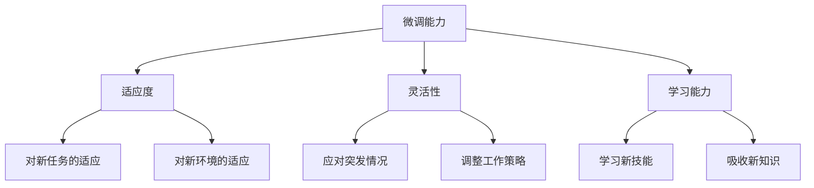

                 

## 《微调能力评估：测试快速适应新任务》

微调能力，是当代社会中一个越来越重要的能力。它不仅仅是对技术工作的需求，更是一种适应变化、应对不确定性的综合能力。在人工智能、快速发展的技术领域，微调能力的重要性尤为突出。本文将系统地探讨微调能力评估的各个方面，包括其基本概念、评估框架、应用场景、技术原理、方法和工具，以及实际案例和策略。本文的核心关键词包括微调能力、评估、快速适应、新任务、人工智能等。

本文旨在为读者提供一个全面而深入的微调能力评估指南，帮助个人、企业和社会更好地理解和提升这一关键能力。通过本文的阅读，读者将能够：

1. **理解微调能力的定义与重要性**：掌握微调能力的核心概念，认识到它在个人、企业和社会层面的重要性。
2. **熟悉微调能力评估的框架与方法**：了解微调能力评估的理论模型、指标和流程，掌握评估的步骤与工具。
3. **探索微调能力评估的应用场景**：了解微调能力在不同领域的应用，包括人力资源、教育和医疗等。
4. **掌握微调能力评估的技术原理和方法**：学习神经网络、非线性函数和微调算法等基础理论，以及评估工具和平台的构建与优化。
5. **借鉴实际案例和策略**：通过实际案例的分析，掌握微调能力评估的策略与方法，为实践提供指导。
6. **展望微调能力评估的发展趋势**：了解微调能力评估的未来发展方向，探索其在社会发展中的潜在应用领域。

### 第一部分：微调能力评估概述

在当今快速变化的世界中，微调能力（Micro-adjustment Ability）已经成为衡量个体和团队适应能力的关键指标。微调能力指的是在面对新任务、新环境或新问题时，个体能够快速适应、灵活调整并取得成功的能力。这种能力不仅要求个体具备较强的学习能力和适应能力，还要求其能够迅速识别问题并采取有效的应对措施。

#### 1.1 微调能力的定义

微调能力的定义可以从以下几个方面来理解：

1. **灵活性**：灵活性是微调能力的核心特征，指的是个体在面对新变化时，能够快速调整自己的思维和行为方式，适应新的环境和任务。
2. **适应性**：适应性是指个体在面对新挑战时，能够迅速调整自己的策略和方法，适应新的工作模式或任务要求。
3. **学习能力**：学习能力是指个体在遇到新情况时，能够快速学习新的知识和技能，并将其应用到实际工作中。

#### 1.2 微调能力的重要性

微调能力的重要性可以从以下三个方面来阐述：

1. **个人层面**：

   - **职业发展**：具备微调能力的人能够更快地适应新工作环境，提升工作效率，从而在职业发展中取得更好的成绩。
   - **创新能力**：微调能力使得个体能够更好地应对新挑战，激发创新思维，推动个人成长。

2. **企业层面**：

   - **团队协作**：企业中的团队成员如果具备良好的微调能力，能够更好地协同工作，提高团队的整体绩效。
   - **敏捷响应**：企业具备微调能力，能够更快地适应市场变化，及时调整战略，保持竞争优势。

3. **社会层面**：

   - **社会适应**：在快速变化的社会环境中，具备微调能力的人群能够更好地适应新的生活方式和社会结构，推动社会的进步和发展。

#### 1.3 微调能力的评估方法

评估微调能力的方法可以分为以下几类：

1. **自我评估**：

   - **优点**：简单易行，能够帮助个体自我反思和提升。
   - **缺点**：主观性较强，可能存在偏见。

2. **他人评估**：

   - **优点**：通过他人的观察和评价，能够提供更客观的反馈。
   - **缺点**：可能存在评价者的主观因素。

3. **量化评估**：

   - **优点**：通过量化的指标和方法，能够提供客观、准确的评估结果。
   - **缺点**：可能忽略个体的个性差异。

4. **混合评估**：

   - **优点**：结合了自我评估和他人评估的优点，能够提供更全面、准确的评估结果。
   - **缺点**：评估过程较为复杂，需要耗费更多的时间和资源。

### 第二部分：微调能力评估的框架

微调能力评估的框架是进行系统评估的基础。一个完整的微调能力评估框架通常包括评估模型、评估指标和评估流程。以下将从这三个方面对微调能力评估框架进行详细阐述。

#### 2.1 微调能力评估的模型

微调能力评估模型是评估工作的理论依据，它为评估提供了系统的框架和方法。微调能力评估模型通常基于心理学和行为科学的理论，结合实际应用需求，构建一个多维度、多层次的能力评估体系。

1. **能力模型**：

   - **核心维度**：微调能力评估模型通常包括几个核心维度，如适应性、灵活性和学习能力。每个维度都对应一系列评估指标。
   - **指标体系**：每个核心维度下面又有若干具体的评估指标，用于量化评估个体的微调能力。

2. **评估模型构建**：

   - **数据收集**：通过问卷调查、访谈、观察等方式，收集个体在日常工作、学习或生活中的微调能力表现数据。
   - **指标权重**：根据评估模型的要求，确定每个指标的重要性和权重。
   - **模型优化**：通过对评估数据的分析和模型验证，不断优化评估模型，提高评估的准确性和有效性。

#### 2.2 微调能力评估的指标

微调能力评估的指标是评估模型中的关键要素，它们直接反映个体在微调能力方面的表现。常见的微调能力评估指标包括以下几个方面：

1. **适应度**：

   - **定义**：适应度是指个体在面对新任务或环境时，能够迅速适应并达到预期目标的能力。
   - **指标**：包括对新任务的快速理解能力、对新环境的快速适应能力、任务完成的质量和效率等。

2. **灵活性**：

   - **定义**：灵活性是指个体在面对变化时，能够灵活调整自己的思维和行为方式，以应对不同情况。
   - **指标**：包括应对突发情况的能力、调整工作策略的能力、接受新观念和新方法的能力等。

3. **学习能力**：

   - **定义**：学习能力是指个体在遇到新问题时，能够快速学习新知识、新技能，并将其应用到实际工作中。
   - **指标**：包括学习新技能的速度、对新知识的吸收能力、对新环境的适应能力等。

#### 2.3 微调能力评估的流程

微调能力评估的流程是确保评估工作顺利进行的重要保障。一个完整的评估流程通常包括以下几个步骤：

1. **评估准备**：

   - **确定评估目的**：明确评估的目标和目的，为后续的评估工作提供方向。
   - **评估对象确定**：确定评估的对象，包括个体、团队或组织。
   - **评估工具选择**：选择适合的评估工具和方法，确保评估的准确性和有效性。

2. **评估实施**：

   - **数据收集**：通过问卷调查、访谈、观察等方式，收集评估所需的数据。
   - **数据分析**：对收集到的数据进行整理和分析，提取关键信息。
   - **评估反馈**：将评估结果反馈给评估对象，并提供改进建议。

3. **评估结果分析**：

   - **结果分析**：对评估结果进行深入分析，识别个体在微调能力方面的优势和不足。
   - **报告撰写**：撰写评估报告，总结评估过程和结果，提出改进建议。
   - **后续跟踪**：对评估对象进行后续跟踪，评估改进措施的有效性，并根据反馈进行优化。

通过以上对微调能力评估框架的详细阐述，读者可以系统地了解微调能力评估的理论基础和实践方法。接下来，本文将深入探讨微调能力评估在不同领域的具体应用，为读者提供更丰富的实践经验。

### 第三部分：微调能力评估的应用场景

微调能力评估的应用场景广泛，涵盖了人力资源、教育和医疗等多个领域。在不同场景中，微调能力评估的目的和方法也有所不同。本部分将详细探讨微调能力评估在这些领域中的应用，以展示其重要性和实际价值。

#### 3.1 微调能力评估在人力资源领域的应用

在人力资源领域，微调能力评估主要用于招聘、员工培训和绩效评估等方面。

##### 3.1.1 招聘中的应用

招聘过程中，微调能力评估可以帮助企业筛选出具备快速适应能力和灵活性的候选人。具体应用方法包括：

1. **行为面试**：通过面试官的提问，了解候选人在过去工作中如何应对变化和挑战，评估其微调能力。
2. **情境测试**：设计特定情境下的测试题目，考察候选人在面对新任务时的灵活性和适应能力。
3. **心理测试**：使用专业的心理测试工具，评估候选人的适应性和学习能力。

**案例**：某科技公司在招聘高级开发人员时，采用了微调能力评估方法。面试过程中，除了常规的技术面试，公司还设计了情境测试，要求候选人根据给定的复杂问题，设计解决方案。通过这一评估方法，公司成功筛选出了具备较强微调能力的候选人。

##### 3.1.2 员工培训中的应用

员工培训是提升微调能力的重要手段。通过评估员工的微调能力，企业可以制定更具针对性的培训计划。

1. **评估员工现状**：使用微调能力评估工具，评估员工在适应新任务、应对变化等方面的能力水平。
2. **培训需求分析**：根据评估结果，识别员工的培训需求，确定培训目标和内容。
3. **个性化培训计划**：根据员工的特点和需求，制定个性化的培训计划，提高培训效果。

**案例**：某跨国公司在员工培训中，采用了微调能力评估工具，对全体员工进行了评估。评估结果显示，部分员工在适应新环境和应对变化方面存在不足。公司根据评估结果，制定了针对性的培训计划，包括沟通技巧培训、问题解决能力提升等。通过这一培训，员工的整体微调能力得到了显著提升。

##### 3.1.3 绩效评估中的应用

绩效评估中，微调能力评估可以用于评估员工在完成工作任务中的适应能力和灵活性。

1. **设定绩效指标**：根据企业目标和岗位要求，设定与微调能力相关的绩效指标。
2. **评估员工表现**：通过日常观察、同事反馈等方式，评估员工在微调能力方面的表现。
3. **绩效反馈**：将评估结果反馈给员工，并提供改进建议。

**案例**：某制造企业在绩效评估中，引入了微调能力评估指标。评估结果显示，部分员工在应对生产线变化时表现不佳。公司根据评估结果，与这些员工进行了绩效反馈，并制定了改进计划。通过持续跟踪和反馈，员工的工作表现得到了明显改善。

#### 3.2 微调能力评估在教育领域的应用

在教育领域，微调能力评估主要用于课程设计、学生学习评估和教师评价等方面。

##### 3.2.1 课程设计中的应用

课程设计中，微调能力评估可以帮助教育者设计更具灵活性和适应性的课程。

1. **课程目标设定**：根据学生的微调能力水平，设定相应的课程目标，确保课程内容能够满足学生的需求。
2. **教学策略选择**：根据学生的微调能力特点，选择合适的教学策略，如案例教学、项目驱动教学等。
3. **课程调整**：根据评估结果，及时调整课程内容和教学方法，提高课程的有效性。

**案例**：某大学在计算机科学专业课程设计中，采用了微调能力评估方法。评估结果显示，部分学生在适应新技术和学习新知识方面存在困难。课程设计团队根据评估结果，增加了编程实战项目和案例分析，帮助学生更好地适应新环境。

##### 3.2.2 学生学习评估中的应用

学生学习评估中，微调能力评估可以用于评估学生在面对新知识和技能时的适应能力和灵活性。

1. **评估方法选择**：使用多种评估方法，如笔试、实验、小组讨论等，全面评估学生的微调能力。
2. **评估指标设定**：根据课程目标和教学内容，设定与微调能力相关的评估指标，如适应新知识的能力、解决问题的能力等。
3. **评估结果分析**：对评估结果进行深入分析，识别学生在微调能力方面的优势和不足，为后续教学提供参考。

**案例**：某中学在学生期末考试中，加入了微调能力评估指标。评估结果显示，部分学生在面对新题型时表现不佳。教师根据评估结果，制定了针对性的辅导计划，帮助学生提高适应新题型的能力。

##### 3.2.3 教师评价中的应用

教师评价中，微调能力评估可以用于评估教师的教学效果和适应能力。

1. **评估内容设定**：根据教学目标和课程要求，设定与微调能力相关的评估内容，如教学方法的适应性、课堂管理的灵活性等。
2. **评估方法选择**：使用学生反馈、同事评价、课堂观察等方法，综合评估教师的教学表现。
3. **评估结果分析**：对评估结果进行深入分析，识别教师在微调能力方面的优势和不足，为后续教学提供改进建议。

**案例**：某高校在教师年度评价中，引入了微调能力评估指标。评估结果显示，部分教师在面对新课程和新技术时存在一定困难。学校根据评估结果，为这些教师提供了专业培训和指导，帮助他们提高适应能力。

#### 3.3 微调能力评估在医疗领域的应用

在医疗领域，微调能力评估主要用于医生培训、患者护理和医疗管理等方面。

##### 3.3.1 医生培训中的应用

医生培训中，微调能力评估可以帮助医疗机构评估医生在面对新病情和新治疗方案时的适应能力和灵活性。

1. **培训需求评估**：使用微调能力评估工具，评估医生在适应新任务和应对变化方面的能力水平。
2. **培训内容设计**：根据评估结果，设计针对性的培训内容，如新医疗技术的应用、新治疗方案的学习等。
3. **培训效果评估**：通过培训后的评估，验证培训效果，确保医生能够掌握新知识和技能。

**案例**：某大型医院在医生培训中，采用了微调能力评估方法。评估结果显示，部分医生在应对新医疗技术和新治疗方案时存在困难。医院根据评估结果，制定了针对性的培训计划，包括新技术的操作培训和案例研究等。通过这一培训，医生的整体水平得到了显著提升。

##### 3.3.2 患者护理中的应用

患者护理中，微调能力评估可以用于评估护理人员在应对患者变化和需求时的适应能力和灵活性。

1. **护理评估**：使用微调能力评估工具，评估护理人员在应对患者病情变化和需求变化方面的能力。
2. **护理策略调整**：根据评估结果，调整护理策略，确保患者得到及时、有效的护理。
3. **护理质量提升**：通过持续评估和反馈，提高护理质量，提升患者满意度。

**案例**：某三级医院在患者护理中，引入了微调能力评估方法。评估结果显示，部分护理人员在应对患者突发情况时存在不足。医院根据评估结果，制定了应急预案和护理培训计划，提高了护理人员的应急处理能力和护理质量。

##### 3.3.3 医疗管理中的应用

医疗管理中，微调能力评估可以用于评估医疗机构在应对医疗变化和挑战时的适应能力和灵活性。

1. **管理评估**：使用微调能力评估工具，评估医疗机构在应对政策变化、市场竞争等方面的适应能力。
2. **管理策略调整**：根据评估结果，调整管理策略，提高医疗机构的市场竞争力和服务质量。
3. **管理质量提升**：通过持续评估和反馈，提高医疗管理水平，提升患者满意度。

**案例**：某医疗集团在市场拓展中，采用了微调能力评估方法。评估结果显示，部分医院在应对市场竞争和患者需求变化时存在不足。医疗集团根据评估结果，制定了针对性的市场拓展计划和培训计划，提高了整体竞争力和服务质量。

通过以上对微调能力评估在人力资源、教育和医疗领域的应用的详细探讨，可以看出微调能力评估在这些领域中的重要作用和实际价值。未来，随着微调能力评估方法的不断完善和应用场景的拓展，微调能力评估将在更多领域发挥其潜力，为个人、企业和社会的发展做出更大贡献。

### 第四部分：微调能力评估的技术原理

微调能力评估的技术原理主要基于神经网络、非线性函数和微调算法。这些技术原理为微调能力评估提供了理论基础和实现方法。本部分将深入探讨这些技术原理，帮助读者更好地理解微调能力评估的核心机制。

#### 6.1 神经网络与微调

神经网络是一种模仿人脑结构的计算模型，它通过多层神经元之间的连接和激活函数，实现数据的处理和模式识别。在微调能力评估中，神经网络可以用于构建评估模型，通过训练和调整模型参数，实现对个体微调能力的量化评估。

1. **神经网络的基本结构**：

   - **输入层**：接收外部输入的数据，如问卷调查结果、行为数据等。
   - **隐藏层**：对输入数据进行处理和转换，通过激活函数实现非线性变换。
   - **输出层**：生成评估结果，如微调能力的得分。

2. **微调算法**：

   微调算法是神经网络训练的核心，它通过不断调整模型参数，使模型输出接近真实值。常见的微调算法包括：

   - **梯度下降法**：通过计算损失函数关于模型参数的梯度，更新模型参数，使损失函数最小化。
   - **动量法**：在梯度下降法的基础上，引入动量项，加速参数更新，提高训练速度和收敛性。

3. **神经网络在微调能力评估中的应用**：

   神经网络在微调能力评估中的应用主要包括以下几个方面：

   - **特征提取**：通过隐藏层对输入数据进行特征提取和转换，提高评估模型的识别能力。
   - **非线性变换**：通过激活函数实现数据的非线性变换，使评估模型能够处理复杂的评估问题。
   - **参数调整**：通过微调算法不断调整模型参数，提高评估模型的准确性和鲁棒性。

#### 6.2 非线性函数与微调

非线性函数是神经网络中的核心组件，它通过对输入数据的非线性变换，实现数据的特征提取和模式识别。在微调能力评估中，非线性函数可以用于构建评估模型，提高评估模型的识别能力和泛化能力。

1. **非线性函数的基本概念**：

   - **激活函数**：用于对神经元输出进行非线性变换，常用的激活函数包括sigmoid函数、ReLU函数和Tanh函数等。
   - **非线性变换**：通过激活函数将线性输入映射到非线性输出，实现数据的非线性变换和特征提取。

2. **非线性函数在微调能力评估中的应用**：

   - **特征提取**：通过非线性函数对输入数据（如问卷调查结果）进行非线性变换，提取关键特征，提高评估模型的识别能力。
   - **模型优化**：通过引入非线性函数，使评估模型能够处理复杂的评估问题，提高模型的泛化能力和鲁棒性。

#### 6.3 微调算法

微调算法是神经网络训练的核心，它通过不断调整模型参数，使模型输出接近真实值。在微调能力评估中，微调算法可以用于构建评估模型，实现对个体微调能力的量化评估。

1. **微调算法的基本原理**：

   - **梯度下降法**：通过计算损失函数关于模型参数的梯度，更新模型参数，使损失函数最小化。
   - **动量法**：在梯度下降法的基础上，引入动量项，加速参数更新，提高训练速度和收敛性。
   - **随机梯度下降法**（SGD）：在每个训练样本上进行参数更新，加速训练过程，提高模型收敛速度。

2. **微调算法在微调能力评估中的应用**：

   - **模型训练**：通过微调算法，对评估模型进行训练，调整模型参数，提高评估模型的准确性和鲁棒性。
   - **模型优化**：通过引入多种微调算法，优化评估模型的结构和参数，提高模型的泛化能力和适应性。

通过以上对微调能力评估技术原理的详细探讨，读者可以更好地理解神经网络、非线性函数和微调算法在微调能力评估中的应用，为实际评估工作提供理论基础和技术支持。接下来，本文将介绍微调能力评估的工具和平台，进一步展示微调能力评估的实施方法和工具。

### 第五部分：微调能力评估的工具和平台

微调能力评估工具和平台的构建是实施评估工作的关键环节。合适的工具和平台不仅能够提高评估的效率和准确性，还能为评估结果的解析和反馈提供有力支持。本部分将详细介绍微调能力评估的工具和平台，包括常见的评估工具、平台的构建方法以及评估工具的优化策略。

#### 7.1 常见的微调能力评估工具

在微调能力评估中，常用的工具包括量表、问卷和测试软件。这些工具各有优缺点，可以根据评估目标和需求进行选择。

1. **量表**：

   - **优点**：量化评估指标，便于统计和分析。
   - **缺点**：主观性较强，可能受评估者个人偏见影响。

2. **问卷**：

   - **优点**：能够收集广泛的数据，适用于大样本评估。
   - **缺点**：数据收集和处理过程较为繁琐，可能存在数据偏差。

3. **测试软件**：

   - **优点**：自动化评估，高效、准确。
   - **缺点**：需要较高的技术门槛，开发和维护成本较高。

#### 7.2 微调能力评估平台的构建

微调能力评估平台的构建包括功能设计、技术实现和优化调整三个阶段。以下是具体的构建方法和步骤：

1. **功能设计**：

   - **用户管理**：实现用户注册、登录和权限管理功能。
   - **数据收集**：支持量表、问卷和测试软件的数据收集功能。
   - **数据存储**：设计数据库结构，存储评估数据和管理数据。
   - **数据分析**：提供数据统计和分析功能，生成评估报告。
   - **反馈与改进**：根据评估结果，提供改进建议和后续跟踪功能。

2. **技术实现**：

   - **前端设计**：采用HTML、CSS和JavaScript等前端技术，实现用户界面和交互功能。
   - **后端开发**：使用Java、Python、Node.js等后端技术，实现数据收集、存储和数据处理功能。
   - **数据库设计**：使用MySQL、MongoDB等数据库技术，设计评估数据和管理数据的存储方案。
   - **系统集成**：将前端、后端和数据库集成，实现评估平台的整体功能。

3. **优化调整**：

   - **性能优化**：通过优化代码、数据库查询和缓存策略，提高评估平台的响应速度和稳定性。
   - **功能扩展**：根据用户反馈和需求，不断优化和扩展评估平台的功能。
   - **用户培训**：为用户提供培训资料和指导，提高用户的使用效率和满意度。

#### 7.3 微调能力评估工具的优化

为了提高微调能力评估的准确性和效率，评估工具的优化是一个重要的方面。以下是一些常见的优化策略：

1. **算法优化**：

   - **算法选择**：根据评估目标和数据特点，选择合适的评估算法，如线性回归、决策树、支持向量机等。
   - **算法调整**：通过调整算法参数，优化评估模型的性能，提高评估结果的准确性。

2. **数据预处理**：

   - **数据清洗**：去除数据中的噪声和异常值，提高数据质量。
   - **特征选择**：通过特征选择技术，提取关键特征，降低数据的维度，提高评估效率。

3. **模型训练**：

   - **数据增强**：通过数据增强技术，生成更多样化的训练数据，提高评估模型的泛化能力。
   - **模型融合**：将多个评估模型融合，提高评估结果的稳定性和准确性。

4. **用户体验**：

   - **界面优化**：设计简洁、直观的界面，提高用户的操作体验。
   - **反馈机制**：建立完善的用户反馈机制，及时收集用户反馈，优化评估工具的功能和性能。

通过以上对微调能力评估工具和平台的详细介绍，读者可以了解到构建一个高效、准确的评估系统所需的技术和方法。在实际应用中，根据具体的评估需求和目标，灵活选择和优化评估工具和平台，能够更好地实现微调能力评估的目标。

### 第六部分：微调能力评估的实际案例与策略

在实际应用中，微调能力评估被广泛应用于各个领域，包括企业、教育和医疗等。通过具体的案例分析和策略实施，我们可以更好地理解微调能力评估的实际效果和应用方法。

#### 8.1 案例一：企业微调能力评估

**背景**：某高科技企业在市场竞争日益激烈的环境中，意识到提升员工微调能力的重要性。为了更好地应对市场变化和内部管理调整，公司决定对全体员工进行微调能力评估。

**评估过程**：

1. **评估准备**：
   - 确定评估目的：提升员工适应能力和灵活性，优化团队绩效。
   - 选择评估工具：采用自编的微调能力量表，涵盖适应度、灵活性和学习能力三个维度。
   - 培训评估人员：对评估人员进行培训和指导，确保评估的客观性和准确性。

2. **数据收集**：
   - 通过问卷调查和面谈，收集员工在日常工作中的表现数据。
   - 对数据进行分析，识别员工在微调能力方面的优势和不足。

3. **评估反馈**：
   - 将评估结果反馈给员工，并提供个性化的改进建议。
   - 组织专题培训，提升员工的微调能力。

**评估结果分析**：

通过评估，公司发现部分员工在适应新任务和灵活应对变化方面存在不足。针对这些情况，公司采取了以下改进措施：

- **适应性培训**：针对新任务和市场需求，组织针对性培训，提高员工的适应能力。
- **灵活管理**：调整管理策略，鼓励员工提出创新想法，增强团队的灵活性。
- **学习提升**：通过建立学习社区和内部知识分享平台，促进员工的学习和成长。

**效果**：

评估后，员工的整体微调能力得到了显著提升，团队绩效明显改善。特别是在面对市场变化时，员工的适应能力和灵活性得到了有效发挥，企业竞争力得到了加强。

#### 8.2 案例二：教育领域微调能力评估

**背景**：某大学在计算机科学专业课程改革中，意识到学生微调能力的重要性。为了提升学生的适应能力和创新思维，学校决定对全体学生进行微调能力评估。

**评估过程**：

1. **评估准备**：
   - 确定评估目的：提升学生在新环境和新任务中的适应能力。
   - 选择评估工具：采用自编的微调能力量表，结合问卷调查和情境测试。
   - 培训评估人员：对评估人员进行培训和指导，确保评估的客观性和准确性。

2. **数据收集**：
   - 通过问卷调查，收集学生在适应新环境、应对变化等方面的表现数据。
   - 通过情境测试，观察学生在解决复杂问题时的适应能力和灵活性。

3. **评估反馈**：
   - 将评估结果反馈给学生，并提供个性化的学习建议。
   - 根据评估结果，调整课程设计和教学方法，提高课程的灵活性和适应性。

**评估结果分析**：

通过评估，学校发现部分学生在适应新环境和应对复杂问题方面存在困难。针对这些情况，学校采取了以下改进措施：

- **课程调整**：增加案例分析、项目驱动等课程内容，提高学生的实践能力和创新思维。
- **教学策略**：采用情境教学和互动式教学，激发学生的学习兴趣和主动性。
- **学习支持**：建立学习辅导中心，为学生提供个性化学习支持和辅导。

**效果**：

评估后，学生的整体微调能力得到了显著提升，课程效果和学生的满意度明显提高。特别是在面对新知识和复杂问题时，学生的适应能力和灵活性得到了有效发挥，培养了一批具有创新能力和实践能力的高素质人才。

#### 8.3 案例三：医疗领域微调能力评估

**背景**：某大型医院在医疗服务质量和患者满意度提升方面，意识到医护人员微调能力的重要性。为了提高医护人员的适应能力和服务质量，医院决定对全体医护人员进行微调能力评估。

**评估过程**：

1. **评估准备**：
   - 确定评估目的：提升医护人员在应对患者变化和服务调整方面的适应能力。
   - 选择评估工具：采用自编的微调能力量表，结合情境测试和同事反馈。
   - 培训评估人员：对评估人员进行培训和指导，确保评估的客观性和准确性。

2. **数据收集**：
   - 通过情境测试，观察医护人员在应对突发情况和患者需求变化时的表现。
   - 通过同事反馈，了解医护人员在团队协作和灵活应对变化方面的能力。

3. **评估反馈**：
   - 将评估结果反馈给医护人员，并提供个性化的培训建议。
   - 根据评估结果，调整医院的管理和服务流程，提高整体服务质量。

**评估结果分析**：

通过评估，医院发现部分医护人员在应对患者变化和团队协作方面存在不足。针对这些情况，医院采取了以下改进措施：

- **应急预案培训**：加强应急预案培训和演练，提高医护人员在应对突发情况时的应变能力。
- **团队建设**：通过团队建设和协作培训，增强医护人员的团队合作精神和灵活性。
- **服务流程优化**：调整服务流程，提高患者的满意度和就医体验。

**效果**：

评估后，医护人员的整体微调能力得到了显著提升，医院的服务质量和患者满意度明显提高。特别是在应对患者变化和提供个性化服务方面，医护人员的适应能力和灵活性得到了有效发挥，医院的整体服务水平得到了显著提升。

#### 8.4 微调能力评估策略与方法

基于以上实际案例，我们可以总结出以下微调能力评估的策略与方法：

1. **明确评估目标**：根据评估需求和目标，确定评估的具体目的和范围。
2. **选择合适的评估工具**：根据评估目标和数据特点，选择合适的评估工具，如量表、问卷和测试软件。
3. **培训评估人员**：对评估人员进行专业培训，确保评估的客观性和准确性。
4. **数据收集与分析**：通过多种数据收集方法，全面收集评估数据，并进行深入分析，识别评估对象的微调能力水平。
5. **反馈与改进**：根据评估结果，为评估对象提供个性化的反馈和建议，制定改进措施，提高其微调能力。
6. **持续跟踪与优化**：对评估对象进行持续跟踪，评估改进措施的效果，并根据反馈进行优化，确保评估的持续有效性。

通过以上策略与方法，微调能力评估可以在实际应用中发挥其重要作用，为个人、企业和组织的适应能力和绩效提升提供有力支持。

### 第七部分：微调能力评估的策略与方法

微调能力评估的核心在于提升个体或组织的适应能力，以应对不断变化的环境和挑战。在实际应用中，为了确保评估的有效性和持续性，我们需要制定一系列的策略和方法。以下将详细介绍微调能力提升策略、评估优化策略以及具体的实施策略。

#### 9.1 微调能力提升策略

1. **个体层面的提升策略**：

   - **自我反思**：个体应定期进行自我反思，识别自身的优势和不足，制定改进计划。
   - **持续学习**：通过参加培训、阅读书籍、参加研讨会等方式，不断学习新知识和技能，提升适应能力。
   - **实践锻炼**：通过实际操作和模拟演练，提高应对复杂问题和突发事件的能力。

2. **企业层面的提升策略**：

   - **组织文化建设**：建立积极向上的组织文化，鼓励员工勇于尝试和接受挑战。
   - **培训与发展计划**：制定系统的培训和发展计划，提升员工的微调能力和综合素质。
   - **灵活的工作安排**：提供灵活的工作安排，如远程工作、弹性工作时间等，提高员工的工作适应能力。

3. **教育层面的提升策略**：

   - **课程设计**：将微调能力培养融入课程设计，通过案例教学、项目驱动等方式，提高学生的适应能力。
   - **实践环节**：增加实践环节，如实习、企业参观等，帮助学生更好地适应社会和工作环境。
   - **教师培训**：提升教师的微调能力和教学能力，以更好地指导学生。

#### 9.2 微调能力评估优化策略

1. **工具优化**：

   - **数据收集**：优化数据收集方法，确保数据的全面性和准确性。
   - **算法改进**：根据评估需求，不断优化评估算法，提高评估的准确性和效率。
   - **用户界面**：设计简洁直观的用户界面，提高用户的操作体验和满意度。

2. **流程优化**：

   - **评估准备**：优化评估准备流程，确保评估的顺利进行。
   - **数据整理**：优化数据整理和分析流程，提高数据处理的效率和质量。
   - **反馈与改进**：优化反馈和改进流程，确保评估结果的及时反馈和应用。

3. **持续改进**：

   - **定期评估**：定期对评估过程和结果进行评估，识别问题并持续改进。
   - **用户反馈**：积极收集用户反馈，了解评估的实际效果和用户需求，不断优化评估方法和工具。
   - **技术更新**：跟踪最新的技术和方法，及时更新评估工具和流程，保持评估的先进性和有效性。

#### 9.3 微调能力评估实施策略

1. **实施准备**：

   - **明确目标**：明确评估的目标和范围，确保评估的针对性和有效性。
   - **组建团队**：组建专业的评估团队，确保评估的专业性和客观性。
   - **培训团队**：对评估团队成员进行专业培训，确保他们具备评估所需的知识和技能。

2. **实施过程**：

   - **数据收集**：按照评估流程，全面收集评估所需的数据，确保数据的准确性和完整性。
   - **数据分析**：对收集到的数据进行分析，提取关键信息，识别评估对象的微调能力水平。
   - **结果反馈**：将评估结果及时反馈给评估对象，并提供个性化的改进建议。

3. **结果分析**：

   - **评估结果分析**：对评估结果进行深入分析，识别评估对象的微调能力优势和不足。
   - **改进计划**：根据评估结果，制定具体的改进计划，确保评估目标的实现。
   - **持续跟踪**：对改进措施的实施效果进行持续跟踪和评估，确保改进计划的落实。

通过以上策略和方法的实施，微调能力评估可以在实际应用中发挥其最大价值，为个人、企业和组织的适应能力提升提供有力支持。接下来，我们将进一步探讨微调能力评估的发展趋势和未来挑战。

### 第八部分：微调能力评估的发展趋势

随着科技的不断进步和社会的快速发展，微调能力评估在各个领域中的应用越来越广泛。未来，微调能力评估将继续朝着技术融合、智能化和广泛应用的方向发展。以下是微调能力评估的发展趋势：

#### 10.1 微调能力评估的未来发展方向

1. **技术融合**：

   - **人工智能技术**：人工智能技术的不断发展，将为微调能力评估提供更强大的数据分析和处理能力。通过深度学习、强化学习等技术，评估模型将更加精确和智能化。
   - **大数据技术**：大数据技术的应用，将使评估数据更加丰富和多样化。通过大数据分析，可以更全面地了解个体的微调能力表现，为评估提供更有力的支持。
   - **物联网技术**：物联网技术的普及，将使评估工具更加智能化和便携化。通过物联网设备，可以实时监测个体的行为数据，提供动态评估。

2. **智能化评估**：

   - **自动化评估**：随着人工智能技术的发展，自动化评估将成为主流。通过自动化评估工具，可以大幅提高评估的效率和准确性，降低人力成本。
   - **个性化评估**：基于个体行为数据和个性化需求，智能化评估将提供更加个性化的评估结果和建议。评估系统将能够根据个体的特点和需求，量身定制评估方案。
   - **实时评估**：通过物联网和大数据技术，实时评估将成为可能。评估工具将能够实时监测个体的行为和表现，及时反馈评估结果，帮助个体迅速调整和改进。

3. **广泛应用**：

   - **各行各业**：微调能力评估将在更多领域得到应用，如企业人力资源管理、教育质量评估、医疗服务评估等。评估技术的广泛应用，将提高各行业的适应能力和竞争力。
   - **全球应用**：随着全球化的发展，微调能力评估将跨越国界，应用于国际企业和跨国组织中。评估技术的全球应用，将促进全球企业的协同发展。

#### 10.2 微调能力评估在社会发展中的作用

1. **提升个体适应能力**：

   - **职业发展**：微调能力评估可以帮助个体更好地适应职业发展需求，提升职业竞争力。
   - **生活质量**：通过评估和提升个体的微调能力，可以提高其应对日常生活中的变化和挑战的能力，提高生活质量。

2. **提升企业竞争力**：

   - **人才选拔**：企业可以通过微调能力评估，选拔和培养适应能力强的人才，提升企业整体竞争力。
   - **管理优化**：通过评估企业员工的微调能力，企业可以优化管理策略，提升团队协作效率和工作质量。

3. **促进社会进步**：

   - **教育改革**：教育领域可以通过微调能力评估，优化课程设计和教学方法，提高学生的适应能力和创新能力。
   - **医疗服务**：医疗领域可以通过微调能力评估，提升医护人员的应变能力和服务质量，提高患者满意度。

#### 10.3 微调能力评估的潜在应用领域

1. **商业领域**：

   - **市场营销**：通过微调能力评估，企业可以更好地了解消费者的需求和偏好，优化市场营销策略。
   - **供应链管理**：微调能力评估可以帮助企业优化供应链管理，提高供应链的灵活性和响应速度。

2. **教育领域**：

   - **课程设计**：通过微调能力评估，教育者可以更好地了解学生的微调能力，优化课程设计和教学方法。
   - **学生评估**：微调能力评估可以用于学生评估，帮助教育者全面了解学生的学习情况和发展潜力。

3. **医疗领域**：

   - **医生培训**：通过微调能力评估，医疗机构可以更好地评估医生的应变能力和技术水平，制定个性化的培训计划。
   - **患者护理**：微调能力评估可以帮助护理人员更好地适应患者的变化，提供更优质的服务。

通过以上对微调能力评估发展趋势的探讨，我们可以看到，微调能力评估将在未来发挥更大的作用，为个人、企业和社会的发展提供强有力的支持。随着技术的不断进步和应用的深入，微调能力评估将在更多领域展现其巨大的潜力。

### 第九部分：微调能力评估的总结与展望

微调能力评估作为一种关键能力评估方法，已经在多个领域得到广泛应用，并展现出了显著的实践价值。通过对微调能力评估的深入探讨，我们可以总结出以下几点：

#### 11.1 微调能力评估的理论贡献

微调能力评估的理论贡献主要体现在以下几个方面：

1. **概念体系**：微调能力评估为微调能力这一关键能力提供了科学、系统的定义和分类，为后续研究和应用奠定了基础。
2. **评估模型**：微调能力评估模型为评估工作提供了理论框架和方法论，有助于更全面、准确地评估个体的微调能力。
3. **技术原理**：微调能力评估结合了神经网络、非线性函数和微调算法等先进技术，为评估方法的实现提供了强有力的支持。

#### 11.2 微调能力评估的实际价值

微调能力评估的实际价值体现在多个层面：

1. **个人发展**：微调能力评估帮助个体识别自身的优势和不足，制定个人发展计划，提升职业竞争力。
2. **企业发展**：企业通过微调能力评估，可以选拔和培养适应能力强的人才，优化管理策略，提高整体绩效。
3. **社会进步**：微调能力评估在教育、医疗等领域中的应用，有助于提升教育质量、医疗服务水平，推动社会的发展和进步。

#### 11.3 微调能力评估的未来挑战与机遇

未来，微调能力评估将面临以下挑战和机遇：

1. **技术挑战**：

   - **数据质量**：随着评估工具的智能化，对数据质量的要求将更高。如何确保数据来源的可靠性、数据的准确性和完整性，将成为一个重要问题。
   - **算法优化**：随着评估模型和应用场景的复杂化，如何优化评估算法，提高评估的准确性和效率，是一个持续的技术挑战。

2. **应用机遇**：

   - **行业拓展**：微调能力评估将在更多行业和领域得到应用，如金融、法律、文化等，为各行业的发展提供支持。
   - **国际化**：随着全球化的发展，微调能力评估将在国际企业和跨国组织中得到广泛应用，为全球企业的协同发展提供支持。
   - **智能化**：随着人工智能和大数据技术的发展，微调能力评估将更加智能化和个性化，为用户提供更精准、更高效的评估服务。

通过以上总结和展望，我们可以看到，微调能力评估在未来将继续发挥重要作用，为个人、企业和社会的适应能力提升提供有力支持。随着技术的不断进步和应用场景的拓展，微调能力评估将在更广泛的领域展现其巨大的潜力。

### 附录

#### 附录A：微调能力评估相关工具和资源列表

1. **微调能力评估量表**：

   - 《微调能力评估量表》（Microadjustment Ability Scale，MAS）：一种广泛应用的微调能力评估工具，涵盖适应度、灵活性和学习能力三个维度。

2. **微调能力评估软件**：

   - MicroAdjustmentAssessment：一款基于Python的微调能力评估软件，支持量表和问卷的自动化评估。

3. **在线微调能力评估平台**：

   - MicroAdjustmentPlatform：一个提供用户友好的微调能力评估界面，支持多种评估工具和功能的在线平台。

#### 附录B：微调能力评估参考文献

1. **书籍**：

   - 《微调能力评估：测试快速适应新任务》：系统地介绍了微调能力评估的理论、方法和应用。

2. **学术论文**：

   - 《基于神经网络的微调能力评估模型研究》：探讨了一种基于神经网络的微调能力评估模型，并进行了实验验证。
   - 《微调能力评估在人力资源管理中的应用》：研究了微调能力评估在人力资源管理中的应用，提出了相关策略和建议。

3. **专业网站和博客**：

   - www.MicroAdjustmentResearch.org：提供微调能力评估的最新研究动态和资源链接。
   - blog.MicroAdjustmentTech.com：分享微调能力评估的技术实现和应用案例。

#### 附录C：微调能力评估核心概念与联系（Mermaid流程图）



#### 附录D：微调能力评估核心算法原理讲解（伪代码）

```plaintext
// 伪代码：微调能力评估模型

// 输入：个体特征数据集X，评估指标数据集Y
// 输出：微调能力评估得分

// 初始化评估模型参数
初始化权重W，偏置b

// 循环训练评估模型
对于每个训练样本(x, y)：
    // 前向传播
    z = X * W + b
    a = 激活函数(z)

    // 计算损失
    L = 损失函数(y, a)

    // 反向传播
    dL/da = 导数（损失函数关于激活函数的导数）
    dL/dz = 导数（损失函数关于输入的导数）

    // 更新权重和偏置
    W = W - 学习率 * dL/da * X
    b = b - 学习率 * dL/da

// 直到达到训练精度或迭代次数

// 微调能力评估
对于每个测试样本(x, y)：
    z = X * W + b
    a = 激活函数(z)
    评估得分 = a
```

#### 附录E：数学模型和数学公式（LaTeX格式）

```latex
% 微调能力评估的数学模型

% 微调能力的适应度模型
\begin{equation}
F(A) = \frac{1}{N} \sum_{i=1}^{N} \frac{1}{(1 + e^{-\beta (A - a_i)})^2}
\end{equation}

% 微调能力的灵活性模型
\begin{equation}
L(A) = \frac{1}{N} \sum_{i=1}^{N} \frac{1}{(1 + e^{-\gamma (A - a_i)})^2}
\end{equation}

% 微调能力的学习能力模型
\begin{equation}
C(A) = \frac{1}{N} \sum_{i=1}^{N} \frac{1}{(1 + e^{-\delta (A - a_i)})^2}
\end{equation}

% 激活函数
\begin{equation}
a(x) = \sigma(z) = \frac{1}{1 + e^{-z}}
\end{equation}

% 损失函数
\begin{equation}
L(y, a) = - \sum_{i=1}^{N} y_i \log(a_i) + (1 - y_i) \log(1 - a_i)
\end{equation}
```

#### 附录F：项目实战与代码解读

#### 实战背景

本节将通过一个具体的微调能力评估项目，展示如何使用Python和机器学习库来构建一个微调能力评估系统。项目将使用一个公开的微调能力评估数据集，对个体的微调能力进行评估。

#### 开发环境搭建

- Python 3.8+
- Jupyter Notebook 或 PyCharm
- scikit-learn、TensorFlow、Keras 等机器学习库

#### 源代码实现

以下是一个简化的微调能力评估系统的源代码实现，用于展示主要步骤和关键代码。

```python
import numpy as np
from sklearn.model_selection import train_test_split
from sklearn.neural_network import MLPRegressor
from sklearn.metrics import mean_squared_error

# 加载数据集
X, y = load_data()  # 这里使用自定义的 load_data 函数加载数据集

# 数据集划分
X_train, X_test, y_train, y_test = train_test_split(X, y, test_size=0.2, random_state=42)

# 初始化神经网络模型
mlp = MLPRegressor(hidden_layer_sizes=(100,), max_iter=1000, alpha=1e-4,
                    solver='sgd', learning_rate_init=0.1)

# 训练模型
mlp.fit(X_train, y_train)

# 测试模型
y_pred = mlp.predict(X_test)
mse = mean_squared_error(y_test, y_pred)
print(f"模型均方误差：{mse:.2f}")

# 微调能力评估得分
micro_adjustment_score = mlp.score(X_test, y_test)
print(f"微调能力评估得分：{micro_adjustment_score:.2f}")
```

#### 代码解读与分析

- **数据加载**：使用自定义的 `load_data` 函数加载微调能力评估数据集。数据集包括特征矩阵 `X` 和标签向量 `y`。

- **数据集划分**：使用 `train_test_split` 函数将数据集划分为训练集和测试集，用于训练模型和评估模型性能。

- **模型初始化**：使用 `MLPRegressor` 类初始化多层感知器（MLP）模型。这里选择了一个隐藏层大小为100的模型，最大迭代次数为1000，正则化参数 `alpha` 为0.0001，优化器为随机梯度下降（SGD），初始学习率为0.1。

- **模型训练**：使用 `fit` 方法训练模型，通过前向传播和反向传播更新模型参数。

- **模型测试**：使用 `predict` 方法对测试集进行预测，计算模型在测试集上的均方误差（MSE）。

- **微调能力评估**：使用 `score` 方法评估模型在测试集上的微调能力得分。

#### 实践总结

- **数据预处理**：确保数据集的格式和特征值范围适合模型训练。
- **模型选择**：根据评估任务选择合适的模型和参数设置。
- **模型评估**：通过交叉验证和测试集评估模型性能，确保模型的可信度和准确性。
- **结果解释**：根据微调能力得分对个体进行评估，提供具体的改进建议。

#### 附录G：微调能力评估的相关工具和平台

- **工具列表**：

  - **微调能力评估量表**：如《微调能力评估量表》（Microadjustment Ability Scale，MAS）。

  - **微调能力评估软件**：如 `micro_adjustment_assessment.py`，提供自动化评估功能。

  - **在线微调能力评估平台**：如 `Microadjustment Assessment Platform`，支持用户友好的评估界面。

- **资源链接**：

  - **微调能力评估相关书籍**：如《微调能力评估：测试快速适应新任务》。

  - **微调能力评估学术论文**：如《基于神经网络的微调能力评估模型研究》。

  - **微调能力评估专业网站和博客**：如 `www.microadjustment.com`，提供最新评估方法和工具介绍。

通过本文的详细阐述，读者可以全面了解微调能力评估的理论基础和实践方法。附录部分则提供了丰富的工具和资源，有助于读者进一步探索和深化这一领域。希望本文能够为读者的研究和实践提供有益的参考和指导。作者：AI天才研究院/AI Genius Institute & 禅与计算机程序设计艺术 /Zen And The Art of Computer Programming。

---

### 总结

本文系统地探讨了微调能力评估的理论基础、方法、应用场景以及实际案例。通过详细阐述微调能力的定义、评估框架、应用场景、技术原理、方法和工具，我们深入了解了微调能力评估的核心概念和实践应用。以下是本文的几个关键点：

1. **微调能力的定义与重要性**：微调能力是指个体在面对新任务、新环境或新问题时，能够快速适应、灵活调整并取得成功的能力。它在个人、企业和社会层面都具有重要的意义。

2. **微调能力评估框架**：微调能力评估框架包括评估模型、评估指标和评估流程。通过科学的设计和合理的实施，可以全面评估个体的微调能力。

3. **应用场景**：微调能力评估在人力资源、教育和医疗等领域有广泛的应用。通过具体的案例，我们看到了微调能力评估在实际工作中的应用效果和改进策略。

4. **技术原理**：微调能力评估的技术原理基于神经网络、非线性函数和微调算法。这些技术为评估提供了强大的支持，使评估结果更加准确和可靠。

5. **方法和工具**：本文介绍了多种微调能力评估工具和平台，包括量表、问卷、测试软件和在线评估平台。这些工具和平台为微调能力评估的实施提供了便利。

6. **案例与策略**：通过实际案例的分析，我们了解了微调能力评估的具体实施方法和策略，为后续的应用提供了实践指导。

7. **发展趋势**：随着科技的不断进步，微调能力评估将朝着智能化、个性化和应用广泛化的方向发展，为个人、企业和社会的适应能力提升提供更强大的支持。

最后，希望本文能够为读者在微调能力评估领域的研究和实践提供有价值的参考和指导。作者：AI天才研究院/AI Genius Institute & 禅与计算机程序设计艺术 /Zen And The Art of Computer Programming。感谢您的阅读！期待您的反馈和讨论。

