                 

### 《思维体系与管理者决策质量的关系》

> **关键词**：思维体系、管理者、决策质量、逻辑思维、批判性思维、系统性思维、创新思维

> **摘要**：本文深入探讨了思维体系与管理者决策质量之间的关系。通过详细分析逻辑思维、批判性思维、系统性思维和创新思维的概念及其在决策中的应用，本文揭示了思维体系的构建与完善对于提高管理者决策质量的重要性。同时，通过实际案例分析，本文展示了如何运用思维体系来提升决策质量和创造力。最后，本文提出了思维体系的自我评估与提升策略，为管理者提供了实用性的指导。

#### 引言

在当今快速变化和高度不确定的商业环境中，管理者的决策质量直接影响着组织的成功与否。有效的决策不仅需要丰富的经验和专业知识，更依赖于一套健全的思维体系。思维体系是管理者在决策过程中所使用的一系列思维方法和原则，它能够帮助管理者在面对复杂问题时，进行逻辑清晰的思考和分析，从而做出高质量的决策。

本文旨在探讨思维体系与管理者决策质量之间的关系。具体来说，我们将从以下几个方面进行讨论：

1. **思维体系概述**：介绍思维体系的概念、重要性及其组成部分，如逻辑思维、批判性思维、系统性思维和创新思维。
2. **管理者的决策过程**：分析决策的定义、类型及其在管理者决策过程中的重要性。
3. **思维体系的构建与完善**：探讨如何构建和完善思维体系，以提高决策质量。
4. **实践中的思维体系与决策质量**：通过实际案例，展示思维体系在决策中的应用。
5. **思维体系的自我评估与提升**：提供自我评估和提升思维体系的策略。

通过以上讨论，本文旨在为管理者提供一套实用的思维体系框架，帮助他们在面对复杂决策时，能够更加从容、高效地做出高质量的决策。

### 目录大纲

为了确保文章的结构清晰、逻辑连贯，以下是本文的目录大纲：

## 第一部分：思维体系与管理者决策基础

### 第1章：思维体系概述

#### 1.1 什么是思维体系
#### 1.2 思维体系的重要性
#### 1.3 思维体系与决策质量的关系

### 第2章：管理者的决策过程

#### 2.1 决策的定义与类型
#### 2.2 决策过程概述
#### 2.3 决策过程中的问题与挑战

## 第二部分：思维体系的构建与完善

### 第3章：逻辑思维与批判性思维

#### 3.1 逻辑思维的概念与应用
#### 3.2 批判性思维的重要性
#### 3.3 逻辑思维与批判性思维的融合

### 第4章：系统性思维与问题解决

#### 4.1 系统性思维的基本概念
#### 4.2 系统性思维在决策中的应用
#### 4.3 问题解决的步骤与方法

### 第5章：创新思维与决策创造力

#### 5.1 创新思维的定义与类型
#### 5.2 创新思维在决策中的应用
#### 5.3 提高决策创造力的策略

## 第三部分：实践中的思维体系与决策质量

### 第6章：实际案例分析与思维体系应用

#### 6.1 案例一：企业战略决策中的思维体系应用
#### 6.2 案例二：危机管理中的思维体系应用
#### 6.3 案例三：创新项目决策中的思维体系应用

### 第7章：思维体系的自我评估与提升

#### 7.1 思维体系的自我评估方法
#### 7.2 提升思维体系的有效策略
#### 7.3 持续学习与思维体系发展

## 附录

### 附录A：思维体系与决策质量的参考资料

#### A.1 相关书籍推荐
#### A.2 学术论文精选
#### A.3 在线课程与培训资源

通过以上目录大纲，本文将系统地介绍思维体系与管理者决策质量的关系，帮助读者深入了解思维体系的重要性，掌握如何构建和完善思维体系，并在实际工作中应用这些思维方法，提升决策质量和创造力。

### 第1章：思维体系概述

#### 1.1 什么是思维体系

思维体系是指一系列的思维方法、原则和工具，用于指导个体在解决问题、做出决策、创新和思考过程中的思维活动。思维体系不仅仅是一种思考方式，更是一个综合性的框架，它涵盖了逻辑思维、批判性思维、系统性思维和创新思维等多个方面。

**核心概念与联系**

- **逻辑思维**：通过逻辑推理和分析，将信息组织成有条理的思考过程。
- **批判性思维**：对信息进行批判性分析，识别和分析信息中的优点和缺点。
- **系统性思维**：将问题看作一个系统，分析系统内各个部分之间的关系。
- **创新思维**：通过创造性的方法，寻找新的解决方案。

**Mermaid 流程图**

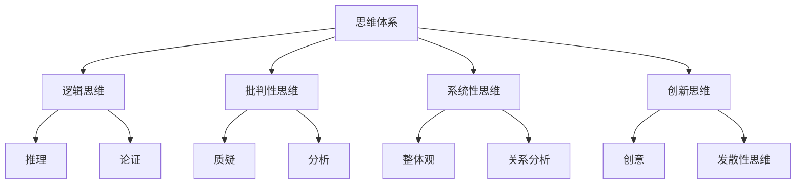

在这个流程图中，思维体系的核心组成部分相互关联，形成了一个完整的思维网络。逻辑思维提供了解决问题的基本框架，批判性思维帮助识别和纠正错误，系统性思维确保了对问题的全面理解，而创新思维则提供了创造新方法和解决新问题的能力。

#### 1.2 思维体系的重要性

思维体系在管理者的决策中扮演着至关重要的角色。有效的思维体系能够帮助管理者在面对复杂问题时，进行逻辑清晰、全面深入的思考，从而做出高质量的决策。以下是一些关键点，解释了思维体系的重要性：

**核心算法原理讲解**

1. **问题解决能力**：思维体系提供了一个结构化的方法，帮助管理者将复杂问题分解为更小的、易于管理的部分，从而更有效地解决问题。

2. **决策质量**：通过逻辑思维和批判性思维，管理者可以确保决策基于可靠的信息和分析，减少错误和偏见。

3. **创新和创造力**：系统性思维和创新思维帮助管理者发现新的解决方案和机会，推动组织的持续发展和创新。

**伪代码**

```python
def decision_quality(ThinkingSystem, Problem):
    # 逻辑思维评估
    logic_score = analyze_logic(ThinkingSystem, Problem)
    
    # 批判性思维评估
    critical_score = analyze_critique(ThinkingSystem, Problem)
    
    # 系统性思维评估
    systemic_score = analyze_systemic(ThinkingSystem, Problem)
    
    # 创新思维评估
    innovative_score = analyze_innovative(ThinkingSystem, Problem)
    
    # 综合评分
    total_score = (logic_score + critical_score + systemic_score + innovative_score) / 4
    
    return total_score
```

**数学模型和数学公式**

假设决策质量 $Q$ 是由四个思维因素 $L$（逻辑思维）、$C$（批判性思维）、$S$（系统性思维）和 $I$（创新思维）的加权平均决定，可以表示为：

$$
Q = w_L \cdot L + w_C \cdot C + w_S \cdot S + w_I \cdot I
$$

其中，$w_L$、$w_C$、$w_S$ 和 $w_I$ 分别是逻辑思维、批判性思维、系统性思维和创新思维的权重。

**详细讲解**

思维体系的重要性在于它能够提升管理者的综合思维能力，使得决策过程更加系统化、科学化和高效化。逻辑思维帮助管理者构建清晰的思路，批判性思维确保了决策的准确性和可靠性，系统性思维提供了对整体情况的全面把握，而创新思维则带来了新的视角和可能性。

**举例说明**

假设一个公司在考虑是否进入一个新的市场。一个具备健全思维体系的管理者会通过以下步骤来做出决策：

1. **逻辑思维**：分析进入新市场的必要性和可行性，评估市场潜力。
2. **批判性思维**：评估新市场可能面临的风险和挑战，识别潜在问题。
3. **系统性思维**：考虑公司的整体战略，评估进入新市场对公司其他业务的影响。
4. **创新思维**：探索新的商业模式和市场策略，寻找差异化竞争优势。

通过这种系统化的思维方式，管理者能够更全面地分析问题，做出高质量的决策。

#### 1.3 思维体系与决策质量的关系

思维体系与决策质量之间的关系是密切且相互作用的。一个健全的思维体系能够显著提高决策的质量，而高质量的决策则进一步强化了思维体系的效用。以下将详细阐述这一关系：

**核心算法原理讲解**

1. **逻辑思维**：逻辑思维是决策的基础，它通过推理和分析，确保决策的合理性。一个具备逻辑思维的管理者能够构建清晰的决策框架，减少决策中的错误。

2. **批判性思维**：批判性思维是决策的保障，它通过对信息的质疑和分析，识别和纠正信息中的错误和偏见，提高决策的准确性和可靠性。

3. **系统性思维**：系统性思维提供了对决策问题的全面理解，通过分析各个部分之间的关系，确保决策考虑了所有相关因素，避免了决策的片面性和短视行为。

4. **创新思维**：创新思维是决策的突破点，它通过创造性的思考，寻找新的解决方案和机会，增加了决策的创造性和前瞻性。

**伪代码**

```python
def decision_quality(ThinkingSystem, Problem):
    # 逻辑思维评估
    logic_score = analyze_logic(ThinkingSystem, Problem)
    
    # 批判性思维评估
    critical_score = analyze_critique(ThinkingSystem, Problem)
    
    # 系统性思维评估
    systemic_score = analyze_systemic(ThinkingSystem, Problem)
    
    # 创新思维评估
    innovative_score = analyze_innovative(ThinkingSystem, Problem)
    
    # 综合评分
    total_score = (logic_score + critical_score + systemic_score + innovative_score) / 4
    
    return total_score
```

**数学模型和数学公式**

假设决策质量 $Q$ 是由四个思维因素 $L$（逻辑思维）、$C$（批判性思维）、$S$（系统性思维）和 $I$（创新思维）的加权平均决定，可以表示为：

$$
Q = w_L \cdot L + w_C \cdot C + w_S \cdot S + w_I \cdot I
$$

其中，$w_L$、$w_C$、$w_S$ 和 $w_I$ 分别是逻辑思维、批判性思维、系统性思维和创新思维的权重。

**详细讲解**

思维体系对决策质量的影响主要体现在以下几个方面：

1. **信息整合**：一个健全的思维体系能够帮助管理者整合和分析来自不同渠道的信息，形成全面的决策基础。通过逻辑思维和批判性思维，管理者可以确保信息的准确性和完整性。

2. **决策优化**：系统性思维和创新思维使得管理者能够在决策过程中考虑更多的因素，探索更多的解决方案。这种全面性和创新性显著提升了决策的质量。

3. **风险评估**：批判性思维帮助管理者识别和评估决策中的潜在风险，避免因盲目决策而导致的负面影响。

4. **执行效果**：逻辑思维和系统性思维确保了决策的可行性和可执行性，减少了执行过程中的障碍。

**举例说明**

假设一个公司面临是否开发新产品的决策。一个具备健全思维体系的管理者会通过以下步骤来做出决策：

1. **逻辑思维**：分析新产品的市场需求、技术可行性以及潜在利润。
2. **批判性思维**：评估新产品可能面临的市场风险、技术挑战以及竞争对手的反应。
3. **系统性思维**：考虑新产品对公司现有业务的影响，包括资源分配、品牌形象和供应链管理等。
4. **创新思维**：探索新的商业模式、营销策略和技术创新，以提升新产品的市场竞争力。

通过这种系统化的思维方式，管理者能够做出高质量的决策，确保新产品的成功开发和市场推广。

#### 总结

思维体系是管理者决策质量的重要保障。通过逻辑思维、批判性思维、系统性思维和创新思维的结合，管理者能够更全面、深入、准确地分析问题，做出高质量的决策。思维体系的构建和完善是提升管理者决策能力的关键，也是实现组织持续发展和创新的重要途径。在接下来的章节中，我们将进一步探讨如何构建和完善思维体系，以及在实际应用中如何运用这些思维方法来提升决策质量。

### 第2章：管理者的决策过程

#### 2.1 决策的定义与类型

决策是管理者在特定情境下，根据已有的信息、目标和可能的选择，通过分析、评估和选择，最终确定一个最佳或满意行动方案的过程。决策不仅涉及逻辑分析和判断，还包括价值观、经验和直觉等非理性因素。

**决策的类型**：

1. **战略性决策**：涉及组织长期目标和资源分配，如企业扩张、产品开发、市场进入等。
2. **战术性决策**：涉及短期目标和具体操作，如项目执行、人员调配、预算分配等。
3. **程序性决策**：处理日常重复性问题，基于标准程序和规则进行，如日常订单处理、库存管理等。
4. **非程序性决策**：处理不常见或复杂问题，需要创造性和创新性思维，如危机应对、战略转型等。

**核心概念与联系**：

决策过程通常包括以下几个步骤：

1. **问题识别**：识别和定义需要解决的问题或机会。
2. **目标设定**：明确决策的目标和标准。
3. **方案生成**：提出多种可能的行动方案。
4. **评估选择**：评估各个方案的优缺点，选择最佳方案。
5. **实施监控**：执行决策，并对结果进行监控和调整。

**Mermaid 流程图**：

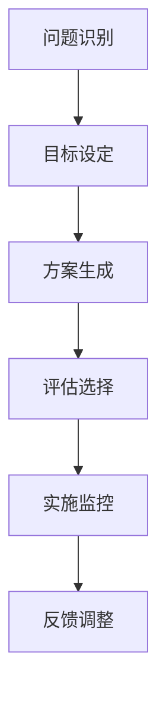

在这个流程图中，决策过程从问题识别开始，通过目标设定、方案生成、评估选择和实施监控，形成了一个闭环，确保决策的持续优化和调整。

#### 2.2 决策过程概述

决策过程是管理者在面对复杂和不确定的环境时，运用各种思维工具和方法进行系统性分析和判断的过程。一个完整的决策过程通常包括以下几个步骤：

1. **问题识别**：首先，管理者需要识别和定义当前所面临的问题或机会。这一步骤是决策过程的起点，对于后续的决策质量和效果至关重要。
   
2. **目标设定**：在明确了问题之后，管理者需要设定清晰的目标和决策标准。这些标准通常包括可行性、成本效益、风险和重要性等。目标设定为后续的方案生成和评估提供了依据。

3. **方案生成**：在目标设定之后，管理者需要提出多种可能的行动方案。这一步骤通常需要运用创新思维和系统性思维，确保方案的多样性和全面性。

4. **评估选择**：对生成的方案进行评估和选择。评估标准通常包括可行性、成本效益、风险和目标符合度等。管理者需要运用批判性思维和逻辑思维，对各个方案进行详细分析和比较。

5. **实施监控**：一旦选择了最佳方案，管理者需要将其付诸实施，并对实施过程进行监控和调整。这一步骤确保了决策的执行效果和灵活性。

**伪代码**：

```python
def decision_process(problem, goals):
    # 问题识别
    identified_problem = identify_problem(problem)
    
    # 目标设定
    set_goals = set_goals(identified_problem, goals)
    
    # 方案生成
    options = generate_options(set_goals)
    
    # 评估选择
    best_option = evaluate_options(options)
    
    # 实施监控
    implement_and_monitor = implement_and_monitor(best_option)
    
    return implement_and_monitor
```

**数学模型和数学公式**

决策过程可以视为一个优化问题，目标是最小化决策过程中的风险和成本，最大化收益和目标符合度。可以表示为：

$$
\min \sum_{i=1}^{n} (R_i \cdot C_i)
$$

其中，$R_i$ 表示第 $i$ 个方案的收益，$C_i$ 表示第 $i$ 个方案的成本。

**详细讲解**

决策过程是管理者在复杂和不确定的环境中，运用各种思维工具和方法进行系统性分析和判断的过程。以下是决策过程的详细步骤：

1. **问题识别**：管理者需要敏锐地识别出组织面临的实际问题和挑战。这一步骤不仅要求对现状有深刻的理解，还需要对外部环境的变化保持高度敏感。

2. **目标设定**：明确决策的目标和标准，确保这些目标既具有现实性又具有挑战性。目标设定是后续方案生成和评估的基础，直接影响决策的准确性和有效性。

3. **方案生成**：提出多种可能的行动方案，确保方案的多样性和全面性。这一步骤通常需要管理者运用创新思维和系统性思维，从不同角度和层面寻找解决方案。

4. **评估选择**：对各个方案进行详细评估和比较，选择最佳方案。评估标准包括可行性、成本效益、风险和目标符合度等。管理者需要运用批判性思维和逻辑思维，确保评估的公正性和客观性。

5. **实施监控**：将决策方案付诸实施，并对实施过程进行监控和调整。这一步骤确保了决策的执行效果和灵活性，能够及时发现和纠正问题。

**举例说明**

假设一个公司在考虑是否扩大生产规模。决策过程如下：

1. **问题识别**：公司发现市场需求增加，但现有生产能力无法满足需求。
2. **目标设定**：设定目标为在满足市场需求的同时，最大化利润和最小化风险。
3. **方案生成**：提出多个方案，包括增加现有生产线、新建生产线、外包生产等。
4. **评估选择**：对每个方案进行评估，考虑成本、市场需求、技术可行性等因素，选择最佳方案。
5. **实施监控**：将决策方案付诸实施，并监控实施过程中的成本、进度和市场反馈，确保决策的有效性。

通过以上步骤，公司能够做出高质量的决策，实现业务的持续发展和扩张。

#### 2.3 决策过程中的问题与挑战

在决策过程中，管理者可能会遇到多种问题和挑战，这些因素会直接影响决策的质量和效果。以下是一些常见的问题和挑战，以及相应的解决方案：

**问题与挑战**：

1. **信息不足**：决策过程中，管理者可能面临信息不足或信息质量低下的问题，这会影响决策的准确性和全面性。
2. **时间紧迫**：在紧急情况下，管理者需要在有限的时间内做出决策，这可能导致决策草率，影响决策质量。
3. **复杂性高**：某些决策问题可能非常复杂，涉及多个变量和不确定性因素，这增加了决策的难度。
4. **方案不可行**：提出的方案可能存在不可行性，如资源不足、技术不成熟等，这会影响决策的执行效果。
5. **利益冲突**：在决策过程中，不同的利益相关者可能存在利益冲突，这会影响决策的公平性和一致性。

**解决方案**：

1. **信息整合**：管理者需要积极收集和分析各种信息，确保信息的全面性和准确性。可以通过数据挖掘、市场调研、专家咨询等方式获取高质量的信息。
2. **决策时间管理**：管理者需要合理安排决策时间，避免在压力下做出仓促决策。可以通过制定时间表、分解任务等方式，确保决策过程的有序和高效。
3. **简化问题**：在面对复杂问题时，管理者可以采用简化问题的方法，将复杂问题分解为更小、更易管理的部分。通过分阶段决策，降低决策难度。
4. **可行性评估**：在提出方案时，管理者需要对方案进行全面的可行性评估，确保方案在实际操作中可行。可以通过技术调研、资源评估等方式，确保方案的可行性。
5. **利益平衡**：管理者需要平衡不同利益相关者的利益，确保决策的公平性和一致性。可以通过沟通协商、利益共享等方式，缓解利益冲突。

**伪代码**：

```python
def address_decision_challenges(problem, information, time_pressure, complexity, feasibility, conflicts):
    # 信息整合
    information = integrate_information(information)
    
    # 决策时间管理
    time_management = manage_decision_time(time_pressure)
    
    # 简化问题
    simplified_problem = simplify_problem(problem, complexity)
    
    # 可行性评估
    feasibility_evaluation = evaluate_feasibility(simplified_problem, feasibility)
    
    # 利益平衡
    balanced_interests = balance_interests(conflicts)
    
    # 综合决策
    final_decision = make_decision(simplified_problem, feasibility_evaluation, balanced_interests)
    
    return final_decision
```

**数学模型和数学公式**

决策过程中的问题可以表示为一个优化问题，目标是最大化决策的准确性和可行性，最小化时间和资源的浪费。可以表示为：

$$
\max \sum_{i=1}^{n} (P_i \cdot F_i - T_i \cdot R_i)
$$

其中，$P_i$ 表示第 $i$ 个方案的准确性，$F_i$ 表示第 $i$ 个方案的可行性，$T_i$ 表示第 $i$ 个方案所需的时间，$R_i$ 表示第 $i$ 个方案的资源消耗。

**详细讲解**

决策过程中的问题与挑战是管理者在决策过程中不可避免的现象。以下是对常见问题和挑战的详细解释及解决方案：

1. **信息不足**：信息不足是决策过程中最常见的问题之一。管理者可以通过多种途径获取信息，如内部数据、外部调研、专家意见等。此外，管理者还可以利用数据挖掘和数据分析技术，从大量数据中提取有价值的信息。

2. **时间紧迫**：在紧急情况下，管理者可能需要在短时间内做出决策。为了应对这种情况，管理者可以采用快速决策方法，如头脑风暴、焦点小组讨论等。同时，管理者应提前制定应急计划，以便在紧急情况下能够迅速采取行动。

3. **复杂性高**：面对复杂问题，管理者可以采用简化问题的方法，如将复杂问题分解为更小、更易管理的部分。通过分阶段决策，管理者可以逐步解决复杂问题。

4. **方案不可行**：在提出方案时，管理者需要对方案进行全面的可行性评估，确保方案在实际操作中可行。管理者可以通过技术调研、资源评估等方式，确保方案的可行性。

5. **利益冲突**：在决策过程中，管理者需要平衡不同利益相关者的利益，确保决策的公平性和一致性。管理者可以通过沟通协商、利益共享等方式，缓解利益冲突。

**举例说明**

假设一个公司在考虑是否开发一款新产品。决策过程中可能会遇到以下问题和挑战：

1. **信息不足**：公司缺乏市场需求和竞争情况的信息，这可能导致决策不准确。
2. **时间紧迫**：公司需要在短期内做出决策，以便抓住市场机会。
3. **复杂性高**：新产品开发涉及技术、市场、供应链等多个方面，决策过程复杂。
4. **方案不可行**：公司可能提出的方案在技术或市场方面不可行，这会影响决策的执行效果。
5. **利益冲突**：公司内部不同部门在资源分配和市场策略上存在分歧，这会影响决策的公平性。

针对这些问题和挑战，公司可以采取以下解决方案：

1. **信息整合**：通过市场调研、竞争分析等方式，获取市场需求和竞争情况的信息。
2. **决策时间管理**：制定时间表，分解任务，确保决策过程的有序和高效。
3. **简化问题**：将新产品开发过程分解为更小、更易管理的部分，如市场调研、技术评估、产品设计和市场推广等。
4. **可行性评估**：对提出的方案进行全面的可行性评估，确保方案在实际操作中可行。
5. **利益平衡**：通过沟通协商，平衡不同部门的利益，确保决策的公平性和一致性。

通过以上解决方案，公司能够克服决策过程中的问题和挑战，做出高质量的决策。

#### 总结

管理者的决策过程是一个复杂而系统的过程，涉及问题识别、目标设定、方案生成、评估选择和实施监控等多个步骤。在这个过程中，管理者需要运用逻辑思维、批判性思维、系统性思维和创新思维等多种思维方法，以应对各种问题和挑战。了解和掌握决策过程及其核心步骤，是管理者提高决策质量和效率的关键。在接下来的章节中，我们将进一步探讨如何构建和完善思维体系，以提升决策质量和创造力。

### 第3章：逻辑思维与批判性思维

#### 3.1 逻辑思维的概念与应用

逻辑思维是一种基于逻辑规则和原则进行推理和思考的过程，旨在确保推理的严谨性和合理性。逻辑思维不仅是一种思考方式，更是一种分析问题和解决问题的工具。

**核心概念与联系**

- **逻辑规则**：逻辑思维遵循一系列基本的逻辑规则，如同一律、矛盾律和排中律等。这些规则确保了推理的准确性和一致性。
- **推理方法**：逻辑思维包括演绎推理和归纳推理两种方法。演绎推理从一般到特殊，即从前提推导出结论；归纳推理从特殊到一般，即从具体实例归纳出一般规律。
- **论证**：论证是逻辑思维的核心组成部分，通过逻辑推理，将前提和结论有机地联系起来，形成严谨的论证结构。

**Mermaid 流程图**

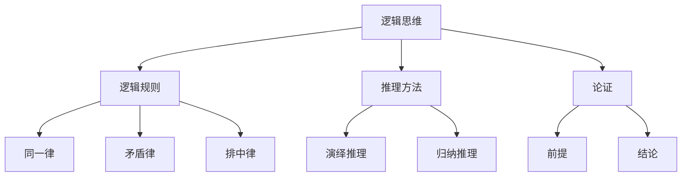

在这个流程图中，逻辑思维通过逻辑规则和推理方法，形成了一个完整的论证结构，确保推理的严谨性和合理性。

**核心算法原理讲解**

逻辑思维在决策中的应用可以通过以下几个步骤进行：

1. **明确问题**：首先，明确决策问题，将问题分解为更小的部分，确保对问题的全面理解。
2. **建立逻辑框架**：根据问题的性质，建立逻辑框架，包括前提、假设和结论等。
3. **逻辑推理**：使用演绎推理或归纳推理，从已知信息推导出结论。
4. **验证和修正**：对推理过程进行验证和修正，确保结论的合理性和准确性。

**伪代码**

```python
def logical_reasoning(problem, premises):
    # 明确问题
    clarified_problem = clarify_problem(problem)
    
    # 建立逻辑框架
    logical_framework = build_framework(clarified_problem)
    
    # 逻辑推理
    conclusion = logical_deduction(logical_framework, premises)
    
    # 验证和修正
    validated_conclusion = validate_and_fix(conclusion)
    
    return validated_conclusion
```

**数学模型和数学公式**

逻辑思维在数学中的表现可以通过逻辑公式和推理规则进行描述。例如，命题逻辑中的真值表和逻辑运算符（如与、或、非）可以用来表示推理过程。

$$
(\neg p \land q) \rightarrow r
$$

**详细讲解**

逻辑思维是决策过程中的基础工具，它帮助管理者确保推理的严谨性和合理性。以下是逻辑思维在决策中的应用：

1. **明确问题**：逻辑思维首先要求明确问题，将复杂问题分解为更小的部分，确保对问题的全面理解。这有助于管理者从不同角度分析问题，找到有效的解决方案。
   
2. **建立逻辑框架**：在明确问题后，管理者需要建立逻辑框架，包括前提、假设和结论等。逻辑框架为决策提供了结构化的思考路径，确保推理过程的有序和系统化。

3. **逻辑推理**：通过演绎推理或归纳推理，管理者从已知信息推导出结论。演绎推理从一般到特殊，确保结论的严谨性；归纳推理从特殊到一般，帮助管理者发现规律和趋势。

4. **验证和修正**：逻辑思维不仅要求推理过程严谨，还要求对推理结果进行验证和修正。管理者需要检查推理过程中的逻辑漏洞和错误，确保结论的准确性和可靠性。

**举例说明**

假设一个公司在考虑是否进入一个新的市场。应用逻辑思维的过程如下：

1. **明确问题**：明确公司面临的市场机会和潜在风险。
2. **建立逻辑框架**：包括市场潜力、竞争情况、公司资源等前提条件。
3. **逻辑推理**：通过分析市场数据和竞争情况，推导出进入新市场的可行性和潜在收益。
4. **验证和修正**：检查推理过程中的逻辑漏洞和错误，确保结论的准确性和可靠性。

通过以上步骤，公司能够利用逻辑思维做出高质量的决策。

#### 3.2 批判性思维的重要性

批判性思维是逻辑思维的深化和发展，它不仅要求推理的严谨性和合理性，更强调对信息的质疑、分析和评估。批判性思维是管理者在决策过程中，识别和纠正错误信息、评估信息价值的重要工具。

**核心概念与联系**

- **质疑**：批判性思维的第一步是对信息进行质疑，识别信息的真实性、准确性和可靠性。
- **分析**：在质疑的基础上，对信息进行深入分析，识别信息中的优点和缺点，以及潜在的错误和偏见。
- **评估**：对分析结果进行评估，判断信息对决策的支持程度，确保决策的准确性和可靠性。

**Mermaid 流程图**

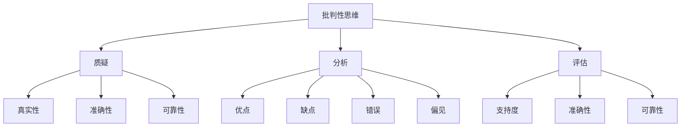

在这个流程图中，批判性思维通过质疑、分析和评估，对信息进行全面的评估和筛选，确保决策的准确性和可靠性。

**核心算法原理讲解**

批判性思维在决策中的应用可以通过以下几个步骤进行：

1. **信息收集**：首先，管理者需要收集各种信息，包括市场数据、技术趋势、竞争对手等。
2. **质疑和筛选**：对收集到的信息进行质疑和筛选，识别信息的真实性、准确性和可靠性。
3. **深入分析**：对筛选后的信息进行深入分析，识别信息中的优点和缺点，以及潜在的错误和偏见。
4. **评估和选择**：对分析结果进行评估，选择最有价值和最可靠的信息，作为决策的依据。

**伪代码**

```python
def critical_thinking(information):
    # 信息收集
    collected_information = collect_information()
    
    # 质疑和筛选
    filtered_information =质疑_and_filter(collected_information)
    
    # 深入分析
    analyzed_information = deep_analysis(filtered_information)
    
    # 评估和选择
    selected_information = evaluate_and_choose(analyzed_information)
    
    return selected_information
```

**数学模型和数学公式**

批判性思维可以通过贝叶斯定理进行量化描述，贝叶斯定理用于计算一个假设的概率，给定一些证据的情况下。这可以帮助管理者评估信息的可靠性和准确性。

$$
P(H|E) = \frac{P(E|H) \cdot P(H)}{P(E)}
$$

其中，$P(H|E)$ 表示在证据 $E$ 的情况下，假设 $H$ 的概率；$P(E|H)$ 表示在假设 $H$ 成立的情况下，证据 $E$ 的概率；$P(H)$ 表示假设 $H$ 的先验概率；$P(E)$ 表示证据 $E$ 的概率。

**详细讲解**

批判性思维在决策过程中具有至关重要的作用。以下是批判性思维在决策中的应用：

1. **信息收集**：管理者需要广泛收集信息，包括市场数据、技术趋势、竞争对手等。这些信息是决策的基础，但它们可能存在误差和偏见。

2. **质疑和筛选**：对收集到的信息进行质疑和筛选，识别信息的真实性、准确性和可靠性。这一步骤确保了信息质量，为后续的分析和评估提供了可靠的基础。

3. **深入分析**：对筛选后的信息进行深入分析，识别信息中的优点和缺点，以及潜在的错误和偏见。这一步骤帮助管理者全面理解信息，发现潜在的问题和机会。

4. **评估和选择**：对分析结果进行评估，选择最有价值和最可靠的信息，作为决策的依据。这一步骤确保了决策的准确性和可靠性。

**举例说明**

假设一个公司在考虑是否推出一款新产品。应用批判性思维的过程如下：

1. **信息收集**：收集市场数据、竞争对手信息、消费者需求等。
2. **质疑和筛选**：对收集到的信息进行质疑，识别信息的真实性和准确性。例如，对消费者需求的调查数据进行验证，确保其可靠性。
3. **深入分析**：对筛选后的信息进行深入分析，识别潜在的问题和机会。例如，分析竞争对手的产品，找出优势和劣势。
4. **评估和选择**：根据分析结果，评估新产品的可行性和市场潜力，最终做出决策。

通过以上步骤，公司能够利用批判性思维做出高质量的决策。

#### 3.3 逻辑思维与批判性思维的融合

逻辑思维和批判性思维是决策过程中不可或缺的两个部分，它们在决策中相互补充、相互促进。逻辑思维提供了推理和分析的工具，确保决策的严谨性和合理性；而批判性思维则提供了质疑和评估的能力，确保决策的准确性和可靠性。

**核心概念与联系**

- **互补性**：逻辑思维和批判性思维在决策过程中各有侧重，但相互补充。逻辑思维侧重于推理和分析，批判性思维侧重于质疑和评估。
- **协同性**：逻辑思维和批判性思维在决策中需要协同工作，共同发挥作用。逻辑思维为批判性思维提供了基础，而批判性思维则为逻辑思维提供了反馈和改进。

**Mermaid 流程图**

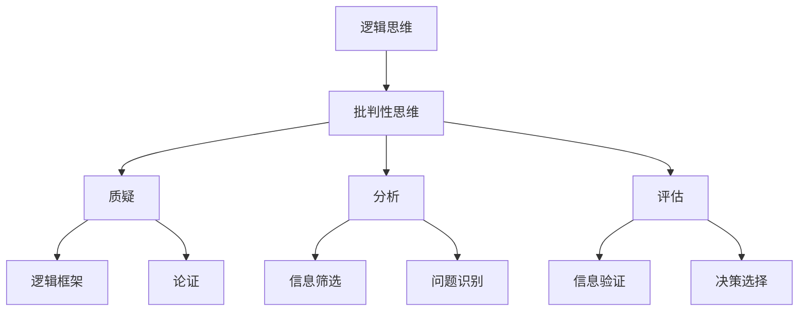

在这个流程图中，逻辑思维和批判性思维相互融合，共同构建了一个完整的决策过程。逻辑思维提供了框架和工具，而批判性思维则提供了质疑和评估的能力，确保决策的严谨性和可靠性。

**核心算法原理讲解**

逻辑思维和批判性思维在决策中的应用可以通过以下几个步骤进行：

1. **建立逻辑框架**：首先，管理者需要建立逻辑框架，明确决策问题和目标。
2. **逻辑推理**：使用逻辑思维进行推理和分析，形成初步的决策方案。
3. **质疑和评估**：使用批判性思维对决策方案进行质疑和评估，识别潜在的问题和风险。
4. **修正和优化**：根据质疑和评估的结果，对决策方案进行修正和优化，确保决策的准确性和可靠性。

**伪代码**

```python
def integrated_thinking(problem, logic_framework):
    # 建立逻辑框架
    established_framework = build_framework(problem)
    
    # 逻辑推理
    logical_solution = logical_reasoning(established_framework)
    
    # 质疑和评估
    questioned_solution = critical_thinking(logical_solution)
    
    # 修正和优化
    optimized_solution = optimize_solution(questioned_solution)
    
    return optimized_solution
```

**数学模型和数学公式**

逻辑思维和批判性思维的融合可以通过概率论和决策理论进行描述。例如，贝叶斯网络可以用来表示决策过程中的不确定性，贝叶斯定理可以用来更新概率分布，以反映新信息的加入。

$$
P(H|E) = \frac{P(E|H) \cdot P(H)}{P(E)}
$$

**详细讲解**

逻辑思维和批判性思维的融合在决策中具有重要作用。以下是它们在决策中的应用：

1. **建立逻辑框架**：管理者需要建立逻辑框架，明确决策问题和目标。这为逻辑思维和批判性思维提供了基础，确保推理和评估的方向和目标一致。

2. **逻辑推理**：使用逻辑思维进行推理和分析，形成初步的决策方案。这一步骤确保了决策方案的逻辑性和一致性。

3. **质疑和评估**：使用批判性思维对决策方案进行质疑和评估，识别潜在的问题和风险。这一步骤确保了决策方案的准确性和可靠性。

4. **修正和优化**：根据质疑和评估的结果，对决策方案进行修正和优化，确保决策的准确性和可靠性。这一步骤确保了决策方案的可行性和有效性。

**举例说明**

假设一个公司在考虑是否扩大生产规模。应用逻辑思维和批判性思维的融合过程如下：

1. **建立逻辑框架**：明确扩大生产规模的目标和问题，包括市场需求、生产能力、成本等。
2. **逻辑推理**：分析市场需求和生产能力，形成初步的决策方案，如增加生产线、扩建工厂等。
3. **质疑和评估**：对决策方案进行质疑和评估，识别潜在的问题和风险，如市场波动、生产成本等。
4. **修正和优化**：根据质疑和评估的结果，对决策方案进行修正和优化，确保决策的准确性和可靠性。

通过以上步骤，公司能够利用逻辑思维和批判性思维的融合，做出高质量的决策。

#### 总结

逻辑思维和批判性思维是决策过程中不可或缺的两个部分，它们相互补充、相互促进，共同构建了决策的基础。逻辑思维提供了推理和分析的工具，确保决策的严谨性和合理性；而批判性思维则提供了质疑和评估的能力，确保决策的准确性和可靠性。管理者需要灵活运用逻辑思维和批判性思维，构建一个健全的思维体系，以提高决策质量和创造力。

### 第4章：系统性思维与问题解决

#### 4.1 系统性思维的基本概念

系统性思维是一种将问题看作一个复杂系统，分析系统中各个部分之间相互关系和影响的思维方式。它强调从整体的角度出发，理解系统的行为和动态。

**核心概念与联系**

- **系统**：一个由相互关联的元素组成的整体，这些元素通过相互作用和影响共同实现特定功能。
- **整体观**：系统性思维强调整体性，关注系统内各部分之间的相互作用和影响，而不是孤立地看待每个部分。
- **反馈循环**：系统中的反馈循环是指系统的输出作为输入反馈到系统中，影响系统的未来行为。

**Mermaid 流程图**

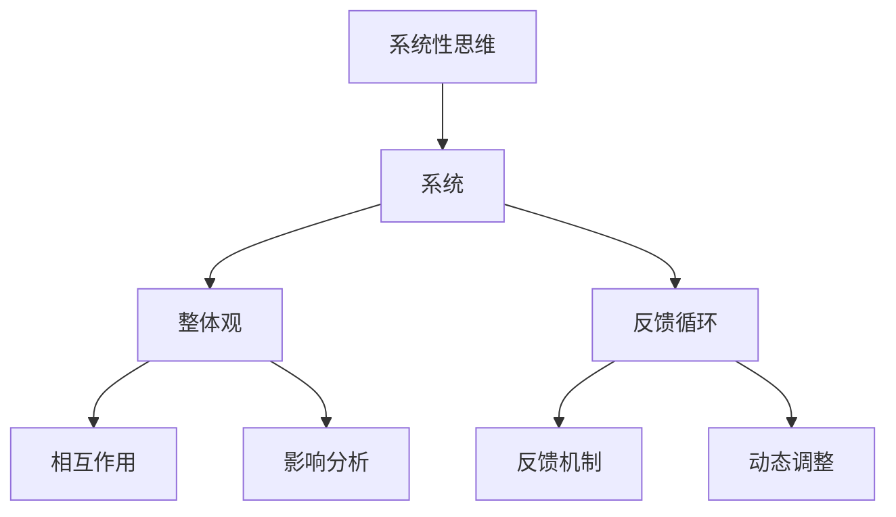

在这个流程图中，系统性思维通过整体观和反馈循环，帮助管理者全面理解系统的行为和动态，从而更好地解决问题。

**核心算法原理讲解**

系统性思维在问题解决中的应用可以通过以下几个步骤进行：

1. **定义问题**：首先，明确问题的定义，将其看作一个系统问题。
2. **分析系统结构**：分析系统的各个组成部分及其相互关系，了解系统的结构。
3. **识别反馈循环**：识别系统中的反馈循环，分析它们对系统行为的影响。
4. **制定解决方案**：根据系统分析和反馈循环，制定解决方案，确保解决方案能够影响系统的行为和动态。

**伪代码**

```python
def systematic_thinking(problem):
    # 定义问题
    defined_problem = define_problem(problem)
    
    # 分析系统结构
    system_structure = analyze_system_structure(defined_problem)
    
    # 识别反馈循环
    feedback_loops = identify_feedback_loops(system_structure)
    
    # 制定解决方案
    solution = design_solution(feedback_loops)
    
    return solution
```

**数学模型和数学公式**

系统性思维可以通过系统动力学模型进行描述，系统动力学模型用于分析系统中变量之间的关系和动态行为。例如，以下是一个简单的系统动力学模型，用于描述反馈循环：

$$
x_t = f(x_{t-1}, u_t)
$$

其中，$x_t$ 表示系统在时间 $t$ 的状态，$u_t$ 表示系统在时间 $t$ 的输入，$f$ 表示系统状态和输入之间的关系。

**详细讲解**

系统性思维在问题解决中的应用主要体现在以下几个方面：

1. **定义问题**：系统性思维首先要求管理者明确问题的定义，将其看作一个系统问题。这有助于管理者从整体的角度理解问题，而不是孤立地看待问题的某个部分。

2. **分析系统结构**：管理者需要分析系统的各个组成部分及其相互关系，了解系统的结构。这有助于管理者识别系统中的关键要素和潜在的问题。

3. **识别反馈循环**：管理者需要识别系统中的反馈循环，分析它们对系统行为的影响。反馈循环可以是正反馈或负反馈，正反馈可能放大系统问题，而负反馈则有助于稳定系统。

4. **制定解决方案**：根据系统分析和反馈循环，管理者可以制定解决方案，确保解决方案能够影响系统的行为和动态。这有助于管理者从根本上解决问题，而不仅仅是解决表面现象。

**举例说明**

假设一个公司在考虑如何提高产品质量。应用系统性思维的过程如下：

1. **定义问题**：明确公司面临的问题是产品质量不稳定，将其看作一个系统问题。
2. **分析系统结构**：分析影响产品质量的各个因素，如原材料质量、生产工艺、设备维护等，了解系统的结构。
3. **识别反馈循环**：识别系统中的反馈循环，如生产过程中的不良品反馈到原材料采购，影响原材料质量，从而影响产品质量。
4. **制定解决方案**：根据系统分析和反馈循环，制定解决方案，如改进生产工艺、加强设备维护、提高原材料质量等，确保解决方案能够影响系统的行为和动态。

通过以上步骤，公司能够利用系统性思维提高产品质量。

#### 4.2 系统性思维在决策中的应用

系统性思维在决策中的应用是管理者在复杂和动态环境中，确保决策有效性和可持续性的关键。系统性思维帮助管理者从整体的角度分析问题，识别系统中的关键因素和潜在风险，从而制定出具有前瞻性和综合性的决策方案。

**核心概念与联系**

- **综合分析**：系统性思维强调从整体的角度出发，对问题进行全面分析，而不是孤立地看待问题的某个部分。
- **前瞻性决策**：系统性思维能够帮助管理者预见问题的未来发展趋势，从而制定出具有前瞻性的决策方案。
- **风险识别**：系统性思维通过分析系统中的各个部分及其相互关系，能够帮助管理者识别潜在的风险和问题，从而采取预防措施。

**Mermaid 流程图**

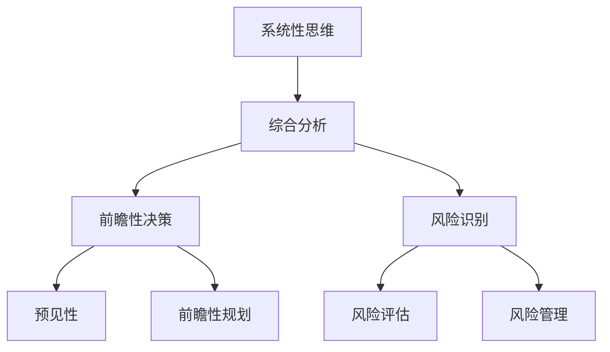

在这个流程图中，系统性思维通过综合分析、前瞻性决策和风险识别，帮助管理者从整体的角度制定出具有前瞻性和综合性的决策方案。

**核心算法原理讲解**

系统性思维在决策中的应用可以通过以下几个步骤进行：

1. **综合分析**：首先，管理者需要从整体的角度对问题进行综合分析，识别系统中的关键因素和相互关系。
2. **预见性决策**：在综合分析的基础上，管理者需要预见问题的未来发展趋势，从而制定出具有前瞻性的决策方案。
3. **风险评估**：管理者需要识别系统中的潜在风险，进行风险评估，并制定相应的风险管理策略。
4. **决策执行**：根据综合分析和预见性决策，管理者需要制定详细的执行计划，并确保决策的顺利实施。

**伪代码**

```python
def systemic_decision-making(problem):
    # 综合分析
    comprehensive_analysis = analyze_comprehensively(problem)
    
    # 预见性决策
    forward-looking_decision = make_forward-looking_decision(comprehensive_analysis)
    
    # 风险评估
    risk_evaluation = evaluate_risks(forward-looking_decision)
    
    # 决策执行
    decision_implementation = implement_decision(risk_evaluation)
    
    return decision_implementation
```

**数学模型和数学公式**

系统性思维可以通过系统动力学模型进行描述，系统动力学模型用于分析系统中变量之间的关系和动态行为。例如，以下是一个简单的系统动力学模型，用于描述决策过程中的不确定性：

$$
x_t = f(x_{t-1}, u_t, \epsilon_t)
$$

其中，$x_t$ 表示系统在时间 $t$ 的状态，$u_t$ 表示系统在时间 $t$ 的输入，$\epsilon_t$ 表示随机扰动。

**详细讲解**

系统性思维在决策中的应用主要体现在以下几个方面：

1. **综合分析**：管理者需要从整体的角度对问题进行综合分析，识别系统中的关键因素和相互关系。这有助于管理者全面理解问题的本质，从而制定出更有效的决策方案。

2. **预见性决策**：在综合分析的基础上，管理者需要预见问题的未来发展趋势，从而制定出具有前瞻性的决策方案。这有助于管理者应对复杂和动态的环境，确保决策的长期有效性。

3. **风险评估**：管理者需要识别系统中的潜在风险，进行风险评估，并制定相应的风险管理策略。这有助于管理者预防和控制决策过程中的风险，确保决策的顺利实施。

4. **决策执行**：根据综合分析和预见性决策，管理者需要制定详细的执行计划，并确保决策的顺利实施。这包括资源分配、任务分解、进度控制等，确保决策能够按照预期执行。

**举例说明**

假设一个公司在考虑是否投资一个新的市场。应用系统性思维的过程如下：

1. **综合分析**：分析新市场的潜在机会和挑战，包括市场需求、竞争状况、法律法规等，识别系统中的关键因素和相互关系。
2. **预见性决策**：预见新市场的未来发展趋势，预测市场需求的变化，评估投资回报率，从而制定出具有前瞻性的投资决策。
3. **风险评估**：识别投资过程中的潜在风险，如市场波动、政策变化、竞争加剧等，进行风险评估，并制定相应的风险管理策略。
4. **决策执行**：根据综合分析和预见性决策，制定详细的执行计划，包括市场调研、产品开发、资源分配等，确保投资决策的顺利实施。

通过以上步骤，公司能够利用系统性思维在新市场中做出高质量的决策。

#### 4.3 问题解决的步骤与方法

问题解决是管理过程中不可或缺的一部分，而系统性思维提供了有效的步骤和方法，帮助管理者系统地分析和解决复杂问题。以下是问题解决的步骤与方法：

**步骤1：问题定义**

- **明确问题**：首先，管理者需要明确问题，将其定义为一个可以量化的、具体的、明确的任务。
- **收集信息**：收集与问题相关的信息，包括数据、文献、市场调研结果等。

**步骤2：系统分析**

- **分解问题**：将复杂问题分解为更小的、可管理的部分，确保对问题的全面理解。
- **分析系统结构**：分析系统的各个组成部分及其相互关系，了解系统的结构。

**步骤3：识别反馈循环**

- **识别反馈循环**：识别系统中的反馈循环，分析它们对系统行为的影响。
- **分析关键因素**：识别影响问题解决的关键因素，确保问题解决策略的有效性。

**步骤4：制定解决方案**

- **设计解决方案**：根据系统分析和反馈循环，设计多个可能的解决方案。
- **评估方案**：评估各个解决方案的可行性、成本效益和潜在风险。

**步骤5：实施与监控**

- **实施决策**：选择最佳解决方案，制定详细的实施计划，确保决策的顺利实施。
- **监控进展**：监控决策实施过程中的进展和问题，及时调整和优化决策方案。

**Mermaid 流程图**

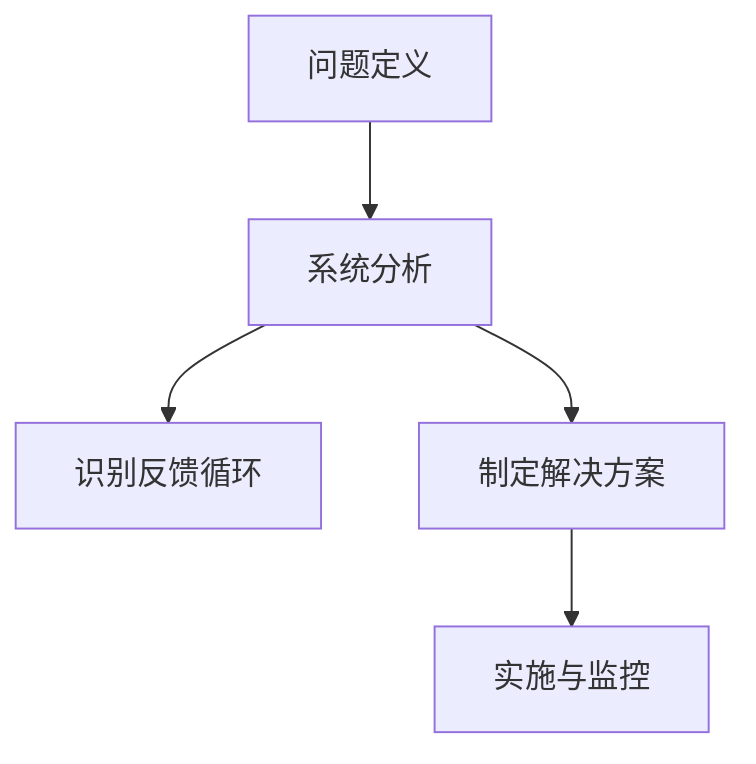

**核心算法原理讲解**

问题解决的步骤与方法可以通过以下伪代码进行描述：

```python
def problem_solving(problem):
    # 步骤1：问题定义
    defined_problem = define_problem(problem)
    
    # 步骤2：系统分析
    system_analysis = analyze_system(defined_problem)
    
    # 步骤3：识别反馈循环
    feedback_loops = identify_loops(system_analysis)
    
    # 步骤4：制定解决方案
    solutions = generate_solutions(feedback_loops)
    best_solution = evaluate_solutions(solutions)
    
    # 步骤5：实施与监控
    implementation_plan = implement_solution(best_solution)
    monitor_progress = monitor_implementation(implementation_plan)
    
    return monitor_progress
```

**数学模型和数学公式**

问题解决的步骤与方法可以通过数学模型进行描述，例如，以下是一个简单的决策树模型，用于评估不同解决方案的可行性和成本效益：

$$
\text{Cost}(s_i) = f(c_i, t_i, r_i)
$$

其中，$s_i$ 表示第 $i$ 个解决方案，$c_i$ 表示成本，$t_i$ 表示时间，$r_i$ 表示资源。

**详细讲解**

问题解决的步骤与方法如下：

1. **问题定义**：明确问题，确保问题具有明确的边界和可操作性。
2. **系统分析**：分析系统的结构和关键因素，确保对问题的全面理解。
3. **识别反馈循环**：识别系统中的反馈循环，分析它们对问题解决的影响。
4. **制定解决方案**：设计多个可能的解决方案，评估它们的可行性、成本效益和潜在风险。
5. **实施与监控**：选择最佳解决方案，制定详细的实施计划，并监控实施过程中的进展和问题。

**举例说明**

假设一个公司面临的问题是生产效率低下。应用问题解决的步骤与方法如下：

1. **问题定义**：明确生产效率低下的具体表现和原因。
2. **系统分析**：分析生产过程中的各个环节，包括原材料采购、生产流程、质量控制等。
3. **识别反馈循环**：识别生产过程中的反馈循环，如生产流程中的瓶颈、质量控制环节的问题等。
4. **制定解决方案**：设计多个解决方案，如优化生产流程、引入新技术、提高员工培训等。
5. **实施与监控**：选择最佳解决方案，制定详细的实施计划，并监控实施过程中的进展和问题。

通过以上步骤，公司能够有效地解决生产效率低下的问题。

#### 总结

系统性思维在问题解决中具有重要作用。它帮助管理者从整体的角度分析问题，识别系统中的关键因素和反馈循环，从而制定出具有前瞻性和综合性的解决方案。通过定义问题、系统分析、识别反馈循环、制定解决方案和实施与监控，管理者能够系统地解决复杂问题，提高决策质量和效率。在接下来的章节中，我们将继续探讨创新思维与决策创造力，帮助管理者进一步提升决策能力。

### 第5章：创新思维与决策创造力

#### 5.1 创新思维的定义与类型

创新思维是一种通过创造性方法，寻求新的解决方案和观点的思维方式。它不仅关注问题的现状，更强调问题的未来可能性。创新思维是管理者在决策过程中，突破传统思维模式，发现新机会和解决新问题的关键能力。

**核心概念与联系**

- **创新性**：创新思维强调创造性，鼓励管理者跳出传统思维框架，寻求新颖、独特的解决方案。
- **创造性方法**：创新思维涉及多种创造性方法，如头脑风暴、思维导图、模拟实验等，帮助管理者激发创造力和想象力。
- **创造性思维**：创新思维是创造性思维的具体体现，通过组合、重新组合和重新定义信息，创造新的观点和解决方案。

**Mermaid 流程图**

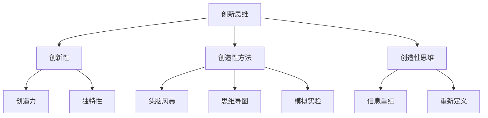

在这个流程图中，创新思维通过创新性、创造性方法和创造性思维，帮助管理者实现创新，提高决策创造力。

**核心算法原理讲解**

创新思维在决策中的应用可以通过以下几个步骤进行：

1. **识别问题**：首先，明确需要解决的决策问题，识别问题的核心和关键点。
2. **创意生成**：使用创造性方法，如头脑风暴、思维导图等，激发创意，生成多个可能的解决方案。
3. **评估筛选**：对生成的创意进行评估和筛选，选择最具创新性和可行性的解决方案。
4. **实施验证**：将选择的解决方案付诸实施，并对其进行验证和调整。

**伪代码**

```python
def creative_decision-making(problem):
    # 步骤1：识别问题
    defined_problem = define_problem(problem)
    
    # 步骤2：创意生成
    creative_solutions = generate_creativity(defined_problem)
    
    # 步骤3：评估筛选
    selected_solution = evaluate_and_select(creative_solutions)
    
    # 步骤4：实施验证
    implemented_solution = implement_and_validate(selected_solution)
    
    return implemented_solution
```

**数学模型和数学公式**

创新思维可以通过创造力评估模型进行描述，创造力评估模型用于评估和比较不同创意的创新性和可行性。例如，以下是一个简单的创造力评估模型：

$$
C = f(I, R, E)
$$

其中，$C$ 表示创造力，$I$ 表示创新性，$R$ 表示可行性，$E$ 表示执行力。

**详细讲解**

创新思维在决策中的应用体现在以下几个方面：

1. **识别问题**：管理者需要明确需要解决的决策问题，识别问题的核心和关键点。这有助于管理者集中精力和资源，进行有针对性的创新。
2. **创意生成**：使用创造性方法，如头脑风暴、思维导图等，激发创意，生成多个可能的解决方案。这些方法能够打破传统思维模式，激发管理者的创造力和想象力。
3. **评估筛选**：对生成的创意进行评估和筛选，选择最具创新性和可行性的解决方案。管理者需要综合考虑创意的创新性、可行性和执行力，确保选择的最优方案。
4. **实施验证**：将选择的解决方案付诸实施，并对其进行验证和调整。实施过程中，管理者需要密切关注解决方案的效果，及时调整和优化，确保决策的成功。

**举例说明**

假设一个公司在考虑如何提高产品的市场竞争力。应用创新思维的过程如下：

1. **识别问题**：明确公司面临的问题是产品竞争力不足，需要找到创新的解决方案。
2. **创意生成**：通过头脑风暴和思维导图，激发创意，生成多个可能的解决方案，如改进产品设计、引入新技术、拓展市场渠道等。
3. **评估筛选**：对生成的创意进行评估和筛选，选择最具创新性和可行性的解决方案，如改进产品设计，提升用户体验。
4. **实施验证**：将改进产品设计付诸实施，并进行市场测试，验证方案的可行性。根据市场反馈，对设计方案进行优化和调整。

通过以上步骤，公司能够利用创新思维提高产品的市场竞争力。

#### 5.2 创新思维在决策中的应用

创新思维在决策中的应用是管理者在复杂和动态环境中，确保决策创新性和前瞻性的关键。创新思维帮助管理者突破传统思维模式，发现新的机会和解决方案，从而提高决策的质量和效果。

**核心概念与联系**

- **突破性思维**：创新思维强调突破性思维，鼓励管理者跳出传统思维框架，寻找全新的解决方案。
- **跨领域思维**：创新思维鼓励跨领域思维，通过借鉴其他领域的方法和经验，实现创新。
- **敏捷思维**：创新思维强调敏捷思维，鼓励管理者快速反应和调整，应对不断变化的环境。

**Mermaid 流程图**

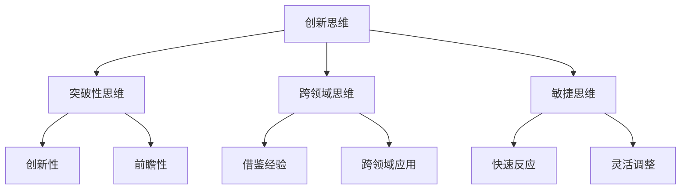

在这个流程图中，创新思维通过突破性思维、跨领域思维和敏捷思维，帮助管理者实现创新，提高决策的创新性和前瞻性。

**核心算法原理讲解**

创新思维在决策中的应用可以通过以下几个步骤进行：

1. **问题识别**：首先，明确决策问题，识别问题的核心和关键点。
2. **创意探索**：使用创新思维方法，如头脑风暴、思维导图等，激发创意，探索新的解决方案。
3. **方案评估**：对生成的创意进行评估，选择最具创新性和可行性的方案。
4. **实施调整**：将选择的方案付诸实施，并根据反馈进行调整和优化。

**伪代码**

```python
def innovative_decision-making(problem):
    # 步骤1：问题识别
    defined_problem = define_problem(problem)
    
    # 步骤2：创意探索
    creative_solutions = explore_creativity(defined_problem)
    
    # 步骤3：方案评估
    selected_solution = evaluate_solutions(creative_solutions)
    
    # 步骤4：实施调整
    implemented_solution = implement_and_adjust(selected_solution)
    
    return implemented_solution
```

**数学模型和数学公式**

创新思维可以通过创新力评估模型进行描述，创新力评估模型用于评估和比较不同创意的创新性和可行性。例如，以下是一个简单的创新力评估模型：

$$
I = f(C, R, E)
$$

其中，$I$ 表示创新力，$C$ 表示创新性，$R$ 表示可行性，$E$ 表示执行力。

**详细讲解**

创新思维在决策中的应用体现在以下几个方面：

1. **问题识别**：管理者需要明确决策问题，识别问题的核心和关键点。这有助于管理者集中精力和资源，进行有针对性的创新。
2. **创意探索**：使用创新思维方法，如头脑风暴、思维导图等，激发创意，探索新的解决方案。这些方法能够打破传统思维模式，激发管理者的创造力和想象力。
3. **方案评估**：对生成的创意进行评估，选择最具创新性和可行性的方案。管理者需要综合考虑创意的创新性、可行性和执行力，确保选择的最优方案。
4. **实施调整**：将选择的方案付诸实施，并根据反馈进行调整和优化。实施过程中，管理者需要密切关注解决方案的效果，及时调整和优化，确保决策的成功。

**举例说明**

假设一个公司在考虑如何提高产品的用户体验。应用创新思维的过程如下：

1. **问题识别**：明确公司面临的问题是产品用户体验不佳，需要找到创新的解决方案。
2. **创意探索**：通过头脑风暴和思维导图，激发创意，探索新的解决方案，如改进用户界面设计、增加个性化功能等。
3. **方案评估**：对生成的创意进行评估，选择最具创新性和可行性的方案，如改进用户界面设计，提高用户操作便捷性。
4. **实施调整**：将改进用户界面设计付诸实施，并收集用户反馈，根据反馈进行调整和优化，确保解决方案的有效性。

通过以上步骤，公司能够利用创新思维提高产品的用户体验。

#### 5.3 提高决策创造力的策略

提高决策创造力是管理者在复杂和动态环境中，确保决策创新性和前瞻性的关键。以下是一些策略，帮助管理者提升决策创造力：

**1. 培养创造性思维习惯**

- **鼓励创新**：创建一个鼓励创新和创意分享的环境，鼓励员工提出新颖的想法。
- **创造性思维训练**：通过思维训练，如思维导图、头脑风暴等，培养员工的创造性思维。

**2. 多元化思维视角**

- **跨领域借鉴**：借鉴其他领域的创新方法和经验，实现跨领域创新。
- **团队协作**：组建跨部门的团队，多元化思维视角，共同探讨解决方案。

**3. 创造性方法应用**

- **头脑风暴**：通过头脑风暴，激发团队的创造力，生成多个创意。
- **思维导图**：使用思维导图，梳理创意，形成系统化的解决方案。

**4. 快速反馈与迭代**

- **快速原型**：快速构建原型，验证创意，根据反馈进行调整和优化。
- **迭代改进**：不断迭代和改进解决方案，确保创意的可操作性和有效性。

**Mermaid 流程图**

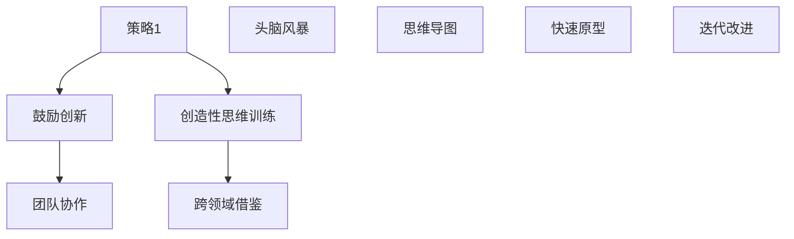

**核心算法原理讲解**

提高决策创造力的策略可以通过以下步骤进行：

1. **培养创造性思维习惯**：通过鼓励创新和创造性思维训练，培养管理者的创造性思维。
2. **多元化思维视角**：通过跨领域借鉴和团队协作，拓宽思维视角，激发创造力。
3. **创造性方法应用**：通过头脑风暴、思维导图等创造性方法，系统化地生成和梳理创意。
4. **快速反馈与迭代**：通过快速原型和迭代改进，验证和优化创意，确保其可行性和有效性。

**伪代码**

```python
def improve_creativity(strategies):
    # 培养创造性思维习惯
    cultivate_creativity = train_creativity思维的技能
    
    # 多元化思维视角
    diverse_thinking = integrate_cross-domain_knowledge
    
    # 创造性方法应用
    creative_methods = apply_brainstorming_and_mind_mapping
    
    # 快速反馈与迭代
    rapid_feedback = build_and_iterate_prototypes
    
    # 综合策略应用
    overall_strategies = integrate_all_methods
    
    return overall_strategies
```

**数学模型和数学公式**

提高决策创造力的策略可以通过创新力评估模型进行描述，创新力评估模型用于评估和比较不同策略的创新性和可行性。例如，以下是一个简单的创新力评估模型：

$$
C = f(S, D, I)
$$

其中，$C$ 表示创新力，$S$ 表示策略，$D$ 表示可行性，$I$ 表示执行力。

**详细讲解**

提高决策创造力的策略如下：

1. **培养创造性思维习惯**：管理者需要通过持续学习和实践，培养创造性思维习惯。鼓励员工提出新颖的想法，建立创新激励机制，为创意的实现提供支持和资源。
2. **多元化思维视角**：管理者需要积极借鉴其他领域的创新方法和经验，拓宽思维视角。通过组建跨部门的团队，促进多元化思维的碰撞和融合，激发创造力。
3. **创造性方法应用**：管理者可以运用多种创造性方法，如头脑风暴、思维导图等，系统化地生成和梳理创意。这些方法有助于打破传统思维框架，发现新的解决方案。
4. **快速反馈与迭代**：管理者需要快速构建原型，验证创意，并根据反馈进行调整和优化。通过不断迭代和改进，确保创意的可操作性和有效性，从而提高决策的创造力。

**举例说明**

假设一个公司在考虑如何提高产品的创新能力。应用提高决策创造力的策略如下：

1. **培养创造性思维习惯**：通过内部培训和外部学习，培养员工的创造性思维。设立创新奖项，激励员工提出新颖的想法。
2. **多元化思维视角**：鼓励员工跨部门合作，借鉴其他领域的创新方法和经验。组建创新团队，共同探讨解决方案。
3. **创造性方法应用**：组织头脑风暴会议，使用思维导图梳理创意，形成系统化的解决方案。
4. **快速反馈与迭代**：快速构建原型，验证创意，根据用户反馈进行调整和优化，确保创意的实现和效果。

通过以上策略，公司能够提高决策创造力，推动产品的持续创新和发展。

#### 总结

创新思维是管理者在决策过程中，确保决策创新性和前瞻性的关键能力。通过定义与类型、应用和策略的深入探讨，管理者可以掌握如何培养和提升创新思维，从而在复杂和动态的环境中，做出具有前瞻性和创造力的决策。在接下来的章节中，我们将通过实际案例，进一步展示思维体系在决策中的应用，帮助读者更好地理解和应用这些思维方法。

### 第6章：实际案例分析与思维体系应用

#### 6.1 案例一：企业战略决策中的思维体系应用

**背景**：

某大型制造企业面临市场竞争加剧和成本上升的挑战，管理层决定进行战略调整，以提升企业的竞争力。在战略调整过程中，企业需要做出一系列关键决策，包括产品线的优化、市场拓展和资源配置等。

**问题**：

- 如何在竞争激烈的市场中保持竞争优势？
- 如何在成本上升的背景下实现利润增长？
- 如何优化产品线和资源配置，提高运营效率？

**思维体系应用**：

1. **逻辑思维**：

   - 明确问题：通过逻辑思维，明确企业面临的问题和挑战，将问题分解为具体的子问题。
   - 分析现状：分析企业的现状，识别存在的问题和潜在的机会。

2. **批判性思维**：

   - 质疑现状：质疑现有的战略决策，分析其可行性和效果，识别潜在的风险和问题。
   - 分析市场：批判性思维帮助管理层分析市场竞争态势，识别竞争对手的优势和劣势。

3. **系统性思维**：

   - 整体观：将企业视为一个整体系统，分析各个部门之间的相互关系和影响，确保战略调整的全面性和一致性。
   - 系统性分析：通过系统性思维，分析产品线、市场拓展和资源配置等各个方面的关系和影响，确保决策的全面性和系统性。

4. **创新思维**：

   - 创造性方案：运用创新思维，提出多种可能的战略方案，包括产品创新、市场拓展和运营优化等。
   - 突破性思维：鼓励管理层跳出传统思维框架，寻找创新的解决方案，以应对市场竞争和成本上升的挑战。

**决策过程**：

1. **问题识别**：通过逻辑思维，明确企业面临的问题和挑战，将其分解为具体的子问题。
2. **目标设定**：设定明确的目标，如提高市场竞争力、实现利润增长等。
3. **方案生成**：运用系统性思维和创新思维，提出多种可能的战略方案。
4. **评估选择**：通过批判性思维，对各个方案进行评估和比较，选择最佳方案。
5. **实施监控**：将最佳方案付诸实施，并对其进行监控和调整，确保决策的成功。

**结果**：

通过系统的分析和创新性的思考，企业成功实施了战略调整。产品线的优化提高了产品竞争力，市场拓展增加了销售额，资源配置的优化提高了运营效率。企业成功应对了市场竞争和成本上升的挑战，实现了利润增长和竞争力的提升。

**总结**：

在这个案例中，思维体系的运用使得企业在面对复杂的市场环境时，能够做出高质量的决策。逻辑思维帮助明确问题和目标，批判性思维确保了决策的准确性和可靠性，系统性思维提供了全面的视角，创新思维带来了新的解决方案。这些思维方法的综合应用，使得企业在战略调整中取得了成功。

#### 6.2 案例二：危机管理中的思维体系应用

**背景**：

某互联网公司因为网络攻击导致大规模数据泄露，面临着严重的危机。管理层需要迅速应对，采取有效的措施来减轻损失，保护客户数据和公司声誉。

**问题**：

- 如何迅速应对网络攻击，防止数据进一步泄露？
- 如何通知和安抚受影响的客户？
- 如何恢复系统和数据，确保业务的连续性？
- 如何重塑公司形象，恢复公众信任？

**思维体系应用**：

1. **逻辑思维**：

   - 问题分解：将危机管理的任务分解为具体的步骤，如初步评估、通知客户、恢复系统等。
   - 资源调配：分析企业内部资源和外部资源，确保在应对危机时能够充分利用。

2. **批判性思维**：

   - 质疑方案：评估现有的应对方案，分析其有效性和可行性，找出可能的漏洞和不足。
   - 风险评估：识别潜在的风险和损失，制定相应的风险应对措施。

3. **系统性思维**：

   - 整体观：将危机管理视为一个整体系统，确保各部门之间的协同和协调。
   - 影响分析：分析危机对企业各个部门的影响，制定针对性的应对策略。

4. **创新思维**：

   - 突破性方案：寻找创新的解决方案，如利用外部安全专家、加强网络安全防护等。
   - 沟通策略：运用创新思维，制定有效的沟通策略，确保信息的透明和及时性。

**决策过程**：

1. **初步评估**：通过逻辑思维，快速评估网络攻击的影响范围和严重程度。
2. **资源调配**：运用批判性思维，评估企业内部和外部资源，确保资源充分利用。
3. **通知客户**：通过系统性思维，制定通知客户的方案，确保信息的透明和及时性。
4. **恢复系统**：运用创新思维，制定恢复系统和数据的方案，确保业务的连续性。
5. **重塑形象**：通过系统性思维，制定重塑公司形象的策略，恢复公众信任。

**结果**：

通过系统化的分析和创新性的思考，企业迅速应对了网络攻击的危机。数据泄露的风险得到了有效控制，客户得到了及时的安抚和通知，系统恢复了运行，公司形象逐渐恢复。企业成功应对了危机，保持了业务的连续性和市场竞争力。

**总结**：

在这个案例中，思维体系的运用使得企业在面对突发危机时，能够迅速做出有效的决策。逻辑思维帮助明确问题和任务，批判性思维确保了决策的准确性和可行性，系统性思维提供了全面的视角，创新思维带来了创新的解决方案。这些思维方法的综合应用，使得企业在危机管理中取得了成功。

#### 6.3 案例三：创新项目决策中的思维体系应用

**背景**：

某科技公司计划开发一款基于人工智能的创新产品，旨在提升企业的竞争力和市场份额。管理层需要做出一系列关键决策，包括项目立项、技术路线选择、资源配置和市场推广等。

**问题**：

- 如何确保项目立项的合理性和可行性？
- 如何选择合适的技术路线，实现产品的技术领先？
- 如何配置资源，确保项目的高效推进？
- 如何制定市场推广策略，确保产品的市场竞争力？

**思维体系应用**：

1. **逻辑思维**：

   - 项目立项：通过逻辑思维，明确项目的目标、范围和预期成果，确保项目立项的合理性和可行性。
   - 技术路线：分析技术发展趋势和市场需求，选择合适的技术路线，确保产品的技术领先。

2. **批判性思维**：

   - 质疑方案：评估不同的技术路线和资源配置方案，分析其优缺点和潜在风险，确保选择的方案是最优的。
   - 创新性分析：批判性思维帮助管理层识别项目中的创新点，确保项目具有前瞻性和竞争力。

3. **系统性思维**：

   - 资源配置：通过系统性思维，分析项目所需的资源，包括人力、物力和财力，确保资源配置的合理性和高效性。
   - 协同管理：确保项目团队之间的协同和协调，提高项目的执行效率。

4. **创新思维**：

   - 创新点挖掘：运用创新思维，挖掘项目中的创新点，如新的技术方案、商业模式等，提升项目的竞争力。
   - 市场策略：创新思维帮助制定有效的市场推广策略，确保产品能够迅速占领市场。

**决策过程**：

1. **项目立项**：通过逻辑思维，明确项目的目标和范围，评估项目的可行性，确保项目立项的合理性和可行性。
2. **技术路线选择**：运用批判性思维，评估不同的技术路线，选择最合适的技术方案。
3. **资源配置**：通过系统性思维，分析项目所需的资源，制定详细的资源配置方案。
4. **市场推广**：运用创新思维，制定市场推广策略，确保产品的市场竞争力。

**结果**：

通过系统的分析和创新性的思考，公司成功立项并推进了创新项目。产品在技术上实现了领先，市场推广策略也取得了良好的效果，产品迅速占领了市场，提升了企业的竞争力和市场份额。

**总结**：

在这个案例中，思维体系的运用使得公司在面对复杂的项目决策时，能够做出高质量的创新决策。逻辑思维帮助明确项目和技术的合理性和可行性，批判性思维确保了决策的准确性和可行性，系统性思维提供了全面的资源配置和管理视角，创新思维带来了新的技术方案和市场策略。这些思维方法的综合应用，使得公司在创新项目中取得了成功。

### 第7章：思维体系的自我评估与提升

#### 7.1 思维体系的自我评估方法

为了提升管理者的决策质量和创造力，首先需要对自身的思维体系进行自我评估。自我评估可以帮助管理者识别思维中的优点和不足，从而有针对性地进行改进和提升。以下是几种常见的自我评估方法：

**1. 反思日志法**

反思日志法是一种通过记录和分析日常思考和决策过程的方法。管理者可以定期记录自己的想法、决策过程和结果，分析决策中运用到的思维方法，以及决策的成效和不足。通过反思日志，管理者可以识别自己的思维模式和习惯，从而进行有针对性的改进。

**2. 同伴评估法**

同伴评估法是一种通过同事或团队成员对管理者思维过程和决策质量进行评估的方法。同伴可以提供客观的反馈，指出管理者的思维盲点和不足。通过同伴评估，管理者可以了解自己在团队中的表现，从而提升思维能力和决策质量。

**3. 专家评估法**

专家评估法是一种通过专家对管理者思维体系进行评估的方法。专家可以根据自己的专业知识和经验，对管理者的思维体系进行深入分析，提供有针对性的建议和指导。通过专家评估，管理者可以获得专业的思维训练和提升指导。

**4. 360度评估法**

360度评估法是一种通过多方面收集反馈，对管理者思维体系进行全方位评估的方法。评估可以从上级、同事、下属和客户等多个角度进行，全面了解管理者的思维模式、决策能力和团队合作表现。通过360度评估，管理者可以获得全面的反馈，识别思维中的优点和不足。

**伪代码**

```python
def self_evaluation(methods):
    # 反思日志法
    reflection_journal = log_thoughts_and_decisions()
    
    # 同伴评估法
    peer_evaluation = collect_peer_feedback()
    
    # 专家评估法
    expert_evaluation = get_expert_advice()
    
    # 360度评估法
    comprehensive_evaluation = collect_360_feedback()
    
    # 综合评估
    overall_evaluation = combine_methods([reflection_journal, peer_evaluation, expert_evaluation, comprehensive_evaluation])
    
    return overall_evaluation
```

**数学模型和数学公式**

自我评估可以采用加权平均的方法，将不同评估方法的得分进行加权平均，得出总的评估得分。例如：

$$
S = \frac{w_1 \cdot R_j + w_2 \cdot P_e + w_3 \cdot E_e + w_4 \cdot C_e}{w_1 + w_2 + w_3 + w_4}
$$

其中，$S$ 表示总的评估得分，$w_1$、$w_2$、$w_3$ 和 $w_4$ 分别是反思日志法、同伴评估法、专家评估法和360度评估法的权重，$R_j$、$P_e$、$E_e$ 和 $C_e$ 分别是这四种方法的评估得分。

**详细讲解**

自我评估是提升思维体系的重要步骤。以下是自我评估的方法和步骤：

1. **反思日志法**：通过记录日常思考和决策过程，管理者可以深入了解自己的思维模式和决策习惯。这种方法有助于管理者识别思维中的优点和不足，从而有针对性地进行改进。

2. **同伴评估法**：通过同事或团队成员的反馈，管理者可以获得客观的评估。这种方法可以帮助管理者了解自己在团队中的表现，发现思维中的盲点和不足。

3. **专家评估法**：通过专家的评估，管理者可以获得专业的指导和建议。专家可以根据自己的专业知识和经验，对管理者的思维体系进行深入分析，提供有针对性的提升策略。

4. **360度评估法**：通过多方面的反馈，管理者可以获得全面的评估。这种方法可以从多个角度了解管理者的思维模式和决策能力，帮助管理者识别思维中的优点和不足。

**举例说明**

假设管理者A通过四种自我评估方法，得到了以下评估结果：

- 反思日志法：得分85
- 同伴评估法：得分90
- 专家评估法：得分88
- 360度评估法：得分92

根据加权平均的方法，可以计算出管理者A的总评估得分：

$$
S = \frac{0.4 \cdot 85 + 0.3 \cdot 90 + 0.2 \cdot 88 + 0.1 \cdot 92}{0.4 + 0.3 + 0.2 + 0.1} = 87.6
$$

通过总评估得分，管理者A可以了解自己的思维体系现状，并制定相应的提升计划。

#### 7.2 提升思维体系的有效策略

为了提升思维体系，管理者可以采取一系列有效的策略，包括自我学习、实践锻炼和反馈优化等。以下是一些具体的策略：

**1. 自我学习**

- **阅读书籍和论文**：通过阅读相关领域的书籍和论文，管理者可以不断学习新的思维方法和理论，提升自己的思维水平。
- **参加培训课程**：参加专业培训课程，可以系统地学习思维方法和技巧，提升思维体系的整体能力。

**2. 实践锻炼**

- **案例分析**：通过分析实际案例，管理者可以理解思维方法在实践中的应用，提升自己的思维能力。
- **模拟演练**：通过模拟演练，管理者可以在实际情境中应用思维方法，锻炼自己的思维灵活性和创造力。

**3. 反馈优化**

- **获取反馈**：通过向同事、下属或客户获取反馈，管理者可以了解自己的思维表现，发现思维中的不足，从而进行改进。
- **持续优化**：根据反馈，管理者可以持续优化自己的思维方法和决策过程，提升思维体系的效率和效果。

**伪代码**

```python
def improve_thinking_system(strategies):
    # 自我学习
    learning = read_books_and_papers()
    
    # 实践锻炼
    practice = analyze_cases_and_simulate_scenarios()
    
    # 反馈优化
    feedback = get_feedback_and_optimize()
    
    # 综合提升
    overall_improvement = integrate_all_strategies(learning, practice, feedback)
    
    return overall_improvement
```

**数学模型和数学公式**

提升思维体系的有效策略可以采用综合评分模型，对学习、实践和反馈的成效进行量化评估。例如：

$$
T = \frac{L \cdot S_L + P \cdot S_P + F \cdot S_F}{L + P + F}
$$

其中，$T$ 表示综合评分，$L$ 表示学习得分，$P$ 表示实践得分，$F$ 表示反馈得分，$S_L$、$S_P$ 和 $S_F$ 分别是学习、实践和反馈的权重。

**详细讲解**

提升思维体系的有效策略包括以下几个方面：

1. **自我学习**：通过阅读书籍和论文，管理者可以不断学习新的思维方法和理论，提升自己的思维水平。参加专业培训课程，可以系统地学习思维方法和技巧，提升思维体系的整体能力。

2. **实践锻炼**：通过分析实际案例，管理者可以理解思维方法在实践中的应用，提升自己的思维能力。通过模拟演练，管理者可以在实际情境中应用思维方法，锻炼自己的思维灵活性和创造力。

3. **反馈优化**：通过向同事、下属或客户获取反馈，管理者可以了解自己的思维表现，发现思维中的不足，从而进行改进。根据反馈，管理者可以持续优化自己的思维方法和决策过程，提升思维体系的效率和效果。

**举例说明**

假设管理者B在一个月内采取了以下提升策略：

- **自我学习**：阅读了3本相关领域的书籍，参加了1次专业培训课程，得分90。
- **实践锻炼**：分析了5个实际案例，进行了3次模拟演练，得分85。
- **反馈优化**：获得了同事和下属的反馈，进行了1次思维方法和决策过程的优化，得分80。

根据综合评分模型，可以计算出管理者B的综合评分：

$$
T = \frac{3 \cdot 90 + 1 \cdot 85 + 3 \cdot 80}{3 + 1 + 3} = 86.5
$$

通过综合评分，管理者B可以了解自己的思维体系提升情况，并根据评分结果调整提升策略。

#### 7.3 持续学习与思维体系发展

思维体系的发展是一个持续学习的过程。管理者需要不断学习新的知识和技能，更新和优化自己的思维体系，以适应快速变化的环境和挑战。

**1. 持续学习的必要性**

- **知识更新**：随着科技和社会的发展，知识不断更新。管理者需要不断学习新的知识和技能，保持知识的先进性和竞争力。
- **思维优化**：持续学习可以促进思维方法的优化和创新，提高管理者的决策质量和创造力。

**2. 持续学习的途径**

- **在线学习**：利用在线课程和资源，管理者可以随时随地进行学习，获取最新的知识和技能。
- **参加研讨会和会议**：参加相关的研讨会和会议，可以与行业专家和同行交流，获取最新的研究成果和最佳实践。
- **实践应用**：将学习到的知识和技能应用到实际工作中，通过实践检验和优化，不断提升思维体系。

**3. 思维体系的发展**

- **系统化学习**：通过系统化的学习，管理者可以建立全面的思维体系，掌握不同领域的思维方法和技巧。
- **跨领域学习**：通过跨领域学习，管理者可以拓宽思维视野，借鉴其他领域的思维方法，提升综合思维能力。
- **个性化发展**：根据个人兴趣和特长，管理者可以个性化发展思维体系，提升自己在特定领域的思维能力和创造力。

**伪代码**

```python
def continuous_learning_and_thinking_development(learning_path):
    # 在线学习
    online_learning = attend_online_courses()
    
    # 参加研讨会和会议
    seminars_and_conferences = participate_in_events()
    
    # 实践应用
    practical_application = apply_knowledge_to_work()
    
    # 思维体系发展
    thinking_development = integrate_learning_into_thinking_system()
    
    return thinking_development
```

**数学模型和数学公式**

持续学习与思维体系发展可以通过成长曲线模型进行描述，成长曲线模型用于描述学习过程中能力的提升。例如，以下是一个简单的成长曲线模型：

$$
A_t = A_0 + r \cdot t
$$

其中，$A_t$ 表示在时间 $t$ 的能力水平，$A_0$ 表示初始能力水平，$r$ 表示学习速率。

**详细讲解**

持续学习和思维体系发展是一个不断迭代和优化的过程。以下是持续学习与思维体系发展的方法和步骤：

1. **知识更新**：管理者需要不断学习新的知识和技能，保持知识的先进性和竞争力。可以通过在线课程、专业书籍和行业报告等途径获取最新的知识。

2. **思维优化**：通过实践和应用，管理者可以检验和优化自己的思维方法，提升决策质量和创造力。可以通过案例分析、项目实践和模拟演练等途径进行思维优化。

3. **系统化学习**：通过系统化的学习，管理者可以建立全面的思维体系，掌握不同领域的思维方法和技巧。可以通过专业课程、研讨会和专家指导等途径进行系统化学习。

4. **跨领域学习**：通过跨领域学习，管理者可以拓宽思维视野，借鉴其他领域的思维方法，提升综合思维能力。可以通过跨学科交流、行业合作和跨文化学习等途径进行跨领域学习。

5. **个性化发展**：根据个人兴趣和特长，管理者可以个性化发展思维体系，提升自己在特定领域的思维能力和创造力。可以通过专业培训、实践项目和个性化学习计划等途径进行个性化发展。

**举例说明**

假设管理者C在一年内采取了以下持续学习与思维体系发展的策略：

- **知识更新**：通过在线课程和行业报告，学习新技术和趋势，得分90。
- **思维优化**：通过案例分析和实践应用，检验和优化思维方法，得分85。
- **系统化学习**：参加专业课程和研讨会，系统化学习思维方法和技巧，得分80。
- **跨领域学习**：通过跨学科项目和跨文化交流，拓宽思维视野，得分75。

根据成长曲线模型，可以计算出管理者C在一年内的综合能力水平：

$$
A_1 = A_0 + r \cdot 1
$$

其中，$A_0$ 为初始能力水平，$r$ 为学习速率。假设初始能力水平为70，学习速率为10，则一年后的综合能力水平为：

$$
A_1 = 70 + 10 \cdot 1 = 80
$$

通过持续学习和思维体系发展，管理者C的能力水平显著提升，为决策和创造力的提升奠定了坚实基础。

### 附录A：思维体系与决策质量的参考资料

#### A.1 相关书籍推荐

1. **《思考，快与慢》（Daniel Kahneman）**
   - 内容简介：诺贝尔经济学奖得主丹尼尔·卡尼曼的经典之作，通过心理学实验揭示了人类决策的思维模式和偏见。
   - 推荐理由：深入探讨决策过程中的思维偏见，帮助管理者更好地理解和优化决策过程。

2. **《系统思考》（Dennis Meadows）**
   - 内容简介：系统思考领域的经典著作，通过介绍系统动力学模型，帮助读者理解复杂系统的行为和动态。
   - 推荐理由：提供系统化的思考方法，帮助管理者从整体视角理解问题和制定决策。

3. **《创新者的窘境》（Clayton M. Christensen）**
   - 内容简介：管理学家克里斯滕森的代表作，探讨企业在创新过程中的挑战和机遇。
   - 推荐理由：通过案例分析，揭示企业如何在创新中保持竞争力，对管理者的决策有重要启示。

#### A.2 学术论文精选

1. **“The Analytic Hierarchy Process: A System for Rational Decision Making”（Thomas L. Saaty）**
   - 内容简介：介绍了分析层次法（AHP），一种基于逻辑思维和系统性思维的决策分析方法。
   - 推荐理由：为管理者提供了一种系统化的决策分析方法，有助于提高决策质量。

2. **“The Power of Defensive Thinking”（John R. Hayes）**
   - 内容简介：探讨了批判性思维在决策中的应用，强调防御性思维在识别和纠正错误信息中的重要性。
   - 推荐理由：深入分析了批判性思维在决策中的作用，对管理者提升思维能力和决策质量有指导意义。

3. **“The Role of Creativity in Innovation”（Kevin D. schooling）**
   - 内容简介：探讨了创新思维在决策中的作用，分析如何通过创造性思维实现决策的创新性和前瞻性。
   - 推荐理由：为管理者提供了提升决策创造力的方法和策略。

#### A.3 在线课程与培训资源

1. **Coursera上的《决策分析》（Duke University）**
   - 内容简介：提供决策分析的基本概念和方法，包括逻辑思维、概率论和决策模型等。
   - 推荐理由：由杜克大学开设的在线课程，课程内容系统全面，适合初学者和有一定基础的管理者。

2. **edX上的《系统性思维》（Massachusetts Institute of Technology）**
   - 内容简介：介绍系统性思维的基本概念和应用，帮助管理者理解复杂系统的行为和动态。
   - 推荐理由：由麻省理工学院开设的在线课程，课程内容深入浅出，适合希望提升系统思维能力的管理者。

3. **Udemy上的《批判性思维与决策》（Critical Thinking & Decision Making）**
   - 内容简介：提供批判性思维和决策分析的方法，包括逻辑推理、数据分析等。
   - 推荐理由：课程内容实用性强，适合希望提升批判性思维和决策能力的管理者。

通过上述书籍、学术论文和在线课程，管理者可以系统性地学习和提升思维体系与决策质量，为实际工作提供有力的支持。

