                 

### 文章标题

**打造技术社区：程序员知识变现的新途径**

---

#### 关键词：
- 技术社区
- 程序员
- 知识变现
- 内容创作
- 在线教育
- 咨询服务

---

#### 摘要：

本文旨在探讨技术社区如何成为程序员知识变现的新途径。我们将首先概述技术社区的定义、重要性及其发展历程，然后深入分析技术社区的运营策略和技术架构。接着，文章将探讨程序员通过技术博客、在线课程和咨询服务等模式实现知识变现的策略，并通过案例分析提供实战指导。最后，我们将总结资源与工具，帮助程序员在社区运营和知识变现方面取得成功。

## 第一部分：构建技术社区的基础

### 第1章：技术社区概述

#### 1.1 技术社区的定义与重要性

技术社区是一个聚集了具有共同技术兴趣和专业背景的人们的地方。它们提供了一个平台，供成员分享知识、交流经验、解决技术问题，并共同推动技术的发展。技术社区的重要性在于：

1. **知识共享**：成员可以在技术社区中分享他们所学到的知识和经验，从而促进知识的传播和积累。
2. **技能提升**：成员通过参与社区讨论和项目，可以不断提升自己的技术能力和解决问题的能力。
3. **人脉拓展**：技术社区为成员提供了一个结识同行、建立合作关系的平台。
4. **社区凝聚力**：技术社区通过共同的目标和兴趣，增强了成员之间的归属感和凝聚力。

为了更直观地理解技术社区的定义与重要性，我们可以使用以下 Mermaid 流程图：

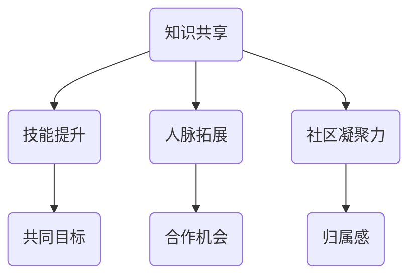

#### 1.2 技术社区的发展历程

技术社区的发展可以追溯到上世纪90年代，随着互联网的兴起和开源文化的推广，技术社区逐渐崭露头角。以下是技术社区的发展历程：

1. **早期论坛阶段**：最早的论坛形式的技术社区主要依赖于纯文本和简单的HTML页面。
2. **社交媒体阶段**：随着社交媒体平台的兴起，如Facebook和Twitter，技术社区开始融入社交媒体元素，使得交流更加便捷。
3. **专业平台阶段**：专业技术社区平台如Stack Overflow、GitHub和Reddit等逐渐崛起，提供了丰富的功能和社区生态。
4. **多元化阶段**：现代技术社区不仅包括软件开发者，还包括设计师、数据科学家等多种技术领域的专业人士。

以下是一个时间线图，展示了技术社区的发展历程：

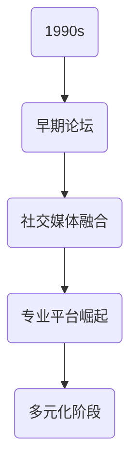

#### 1.3 技术社区的类型与特点

技术社区可以分为以下几种类型，每种类型都有其独特的特点：

1. **开源社区**：以开源软件为中心，成员共同开发、维护和分享代码。例如，Linux开源社区和Apache软件基金会。
2. **专业论坛**：聚焦于特定技术领域的在线讨论平台，如Stack Overflow和Server Fault。
3. **社交网络**：结合了社交媒体和专业的特点，成员可以分享和讨论技术话题，如LinkedIn的技术群组和GitHub的Issue追踪系统。
4. **培训社区**：以在线教育和培训为核心，成员通过课程和研讨会来提升技能，如Udemy和Pluralsight。

使用表格来比较不同类型的技术社区及其特点：

| 类型          | 特点                                                         |
| ------------- | ------------------------------------------------------------ |
| 开源社区      | 共同开发、代码贡献、社区协作、开源协议                       |
| 专业论坛      | 技术问题解答、专业讨论、Q&A模式、标签分类                   |
| 社交网络      | 人脉拓展、内容分享、实时互动、社交属性强                     |
| 培训社区      | 在线课程、讲师授课、互动讨论、证书认证、技能提升             |

### 第2章：技术社区的运营策略

#### 2.1 社区文化塑造

社区文化的塑造是技术社区成功运营的关键。以下是社区文化塑造的几个关键点：

1. **价值观确立**：明确社区的价值观，如开放、协作、尊重和共享。
2. **规则制定**：制定明确的社区规则和行为准则，确保社区秩序和成员的权益。
3. **激励机制**：设立激励机制，鼓励成员参与社区活动，如积分系统、荣誉称号等。
4. **社区品牌**：通过统一的视觉元素和品牌宣传，增强社区的识别度和凝聚力。

以下是一个用于说明社区文化塑造的 Mermaid 流程图：

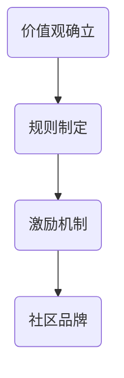

#### 2.2 用户互动与参与度提升

用户互动和参与度是技术社区持续发展的动力。以下方法可以提升用户互动和参与度：

1. **内容多样化**：提供多种形式的内容，如博客、教程、视频、讨论等，满足不同用户的需求。
2. **活动组织**：定期组织线上或线下的活动，如技术分享会、编程马拉松等，增强用户之间的联系。
3. **社群管理**：建立活跃的社群管理员团队，负责维护社区秩序、解答问题和引导讨论。
4. **用户反馈**：积极收集用户反馈，不断优化社区体验。

使用 Mermaid 流程图展示用户互动与参与度提升的策略：

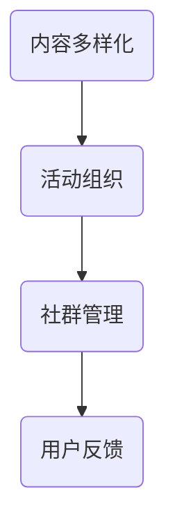

#### 2.3 社区内容规划与维护

社区内容的规划与维护是确保社区长期发展的基础。以下是几个关键点：

1. **内容策略**：制定明确的内容策略，确定内容的类型、频率和质量。
2. **内容审核**：建立内容审核机制，确保内容符合社区价值观和规则。
3. **内容更新**：定期更新内容，保持社区活跃度和相关性。
4. **内容推广**：通过多种渠道推广社区内容，提高曝光度和访问量。

使用 Mermaid 流程图展示社区内容规划与维护的方法：

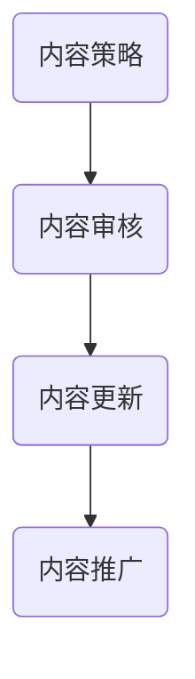

### 第3章：技术社区的技术架构

#### 3.1 社区平台搭建方案

技术社区的搭建需要考虑多个技术层面的因素。以下是搭建技术社区的平台方案：

1. **前端技术**：使用React、Vue或Angular等前端框架构建用户界面，提供良好的用户体验。
2. **后端技术**：使用Node.js、Django或Spring Boot等后端框架处理业务逻辑和数据存储。
3. **数据库**：选择合适的数据库系统，如MySQL、PostgreSQL或MongoDB，以支持数据的高效存储和查询。
4. **云服务**：利用云服务提供商，如AWS、Azure或Google Cloud，进行资源部署和管理。

以下是一个用于描述社区平台搭建方案的 Mermaid 流程图：

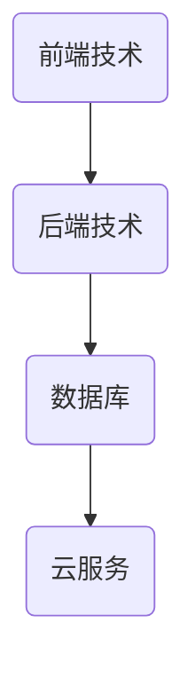

#### 3.2 数据存储与处理

数据存储与处理是技术社区的核心。以下是几个关键点：

1. **数据模型设计**：设计合理的数据模型，确保数据的完整性和一致性。
2. **数据存储**：选择合适的存储方案，如关系型数据库或NoSQL数据库，以满足不同的数据存储需求。
3. **数据处理**：使用ETL（提取、转换、加载）工具和数据处理框架，如Apache Kafka和Apache Spark，进行大数据处理和分析。

以下是一个用于描述数据存储与处理方案的 Mermaid 流程图：

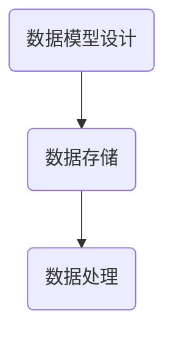

#### 3.3 安全性与性能优化

技术社区的安全性和性能优化是确保社区稳定运行的关键。以下是几个关键点：

1. **安全措施**：实施安全策略，如SSL加密、身份验证和权限控制，保护用户数据和隐私。
2. **性能优化**：使用缓存、负载均衡和数据库优化等技术，提高系统的响应速度和处理能力。
3. **监控与预警**：建立监控和预警系统，及时发现和处理性能问题和安全威胁。

以下是一个用于描述安全性与性能优化方案的 Mermaid 流程图：

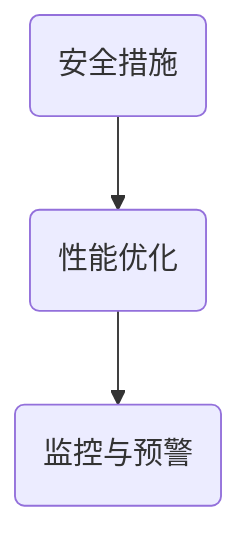

## 第二部分：程序员知识变现的策略

### 第4章：知识变现的概念与模式

#### 4.1 知识变现的定义与意义

知识变现是指将个人的知识、技能和经验转化为经济价值的过程。在技术社区中，知识变现的意义在于：

1. **经济效益**：程序员可以通过知识变现获得额外的收入，提高生活质量。
2. **品牌塑造**：通过展示专业知识和技能，提高个人在技术领域的知名度和影响力。
3. **职业发展**：知识变现可以成为程序员职业发展的新途径，如成为独立顾问、讲师或博主。

以下是一个用于描述知识变现定义与意义的 Mermaid 流程图：

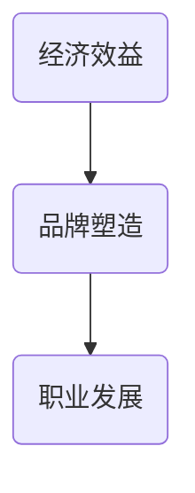

#### 4.2 知识变现的常见模式

程序员可以通过多种模式实现知识变现，以下是一些常见模式：

1. **技术博客**：通过撰写技术文章，吸引流量并通过广告、赞助和会员等方式实现变现。
2. **在线课程**：开发在线课程，通过平台销售课程内容获得收入。
3. **咨询服务**：提供技术咨询服务，如代码审查、项目指导和培训等。
4. **产品开发**：开发软件产品，并通过销售产品获得收入。

以下是一个用于描述知识变现常见模式的 Mermaid 流程图：

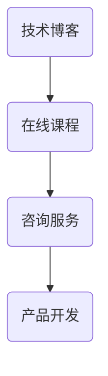

#### 4.3 知识变现的优势与挑战

知识变现的优势和挑战如下：

**优势**：

1. **灵活性与自由度**：程序员可以根据自己的时间和兴趣进行知识变现，享有更高的灵活性和自由度。
2. **价值传递**：通过知识变现，程序员可以更有效地传递自己的知识和经验，为社会创造价值。
3. **收入多元化**：知识变现可以帮助程序员实现收入多元化，减少职业风险。

**挑战**：

1. **竞争压力**：技术领域的竞争激烈，程序员需要不断学习和更新知识，以保持竞争力。
2. **内容质量**：高质量的内容是知识变现的基础，程序员需要投入时间和精力进行内容创作。
3. **市场变化**：技术市场的变化快，程序员需要及时调整知识变现的策略，以适应市场变化。

以下是一个用于描述知识变现优势与挑战的 Mermaid 流程图：

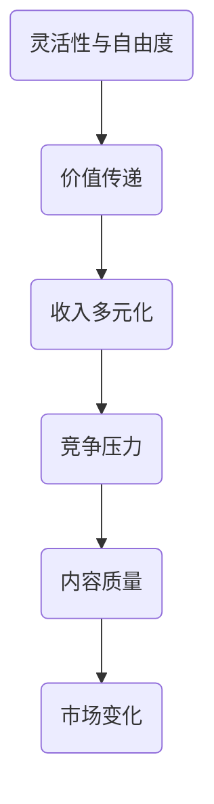

### 第5章：技术博客与内容创作

#### 5.1 技术博客的价值与策略

技术博客是程序员实现知识变现的重要途径之一。以下是其价值和策略：

**价值**：

1. **知识传播**：技术博客可以帮助程序员将自己的知识传播给更多的人，促进技术的普及和发展。
2. **个人品牌**：通过持续的技术博客写作，程序员可以建立自己的个人品牌，提高知名度和影响力。
3. **社区互动**：技术博客可以吸引同行业人士的关注，促进社区互动和合作。

**策略**：

1. **内容规划**：制定内容规划，确定博客的主题、频率和质量。
2. **SEO优化**：通过搜索引擎优化（SEO）提高博客的可见性，吸引更多的读者。
3. **互动与推广**：积极与读者互动，通过社交媒体和其他渠道推广博客内容。

以下是一个用于描述技术博客价值与策略的 Mermaid 流程图：

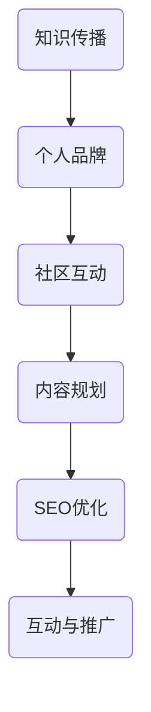

#### 5.2 内容创作的技巧与方法

内容创作是技术博客成功的关键。以下是一些技巧与方法：

1. **选题**：选择具有时效性和实用性的技术话题，以满足读者的需求。
2. **结构**：合理安排文章结构，包括引言、正文和结论，确保文章的逻辑性和连贯性。
3. **案例分析**：结合实际案例，深入分析问题的解决过程和技巧，提高文章的可读性。
4. **图示与代码**：使用图表和代码示例，使文章更加直观易懂。

以下是一个用于描述内容创作技巧与方法的 Mermaid 流程图：

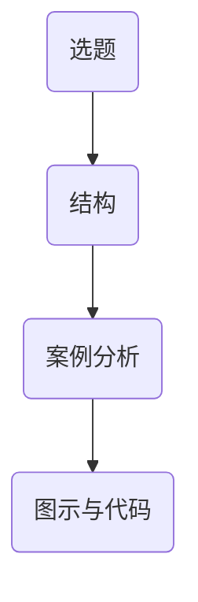

#### 5.3 博客推广与流量变现

博客推广和流量变现是技术博客成功的关键。以下是一些策略：

1. **社交媒体**：利用社交媒体平台（如Twitter、LinkedIn、GitHub）推广博客内容，吸引读者。
2. **内容合作**：与其他博客、媒体或平台进行内容合作，扩大影响力。
3. **广告与赞助**：通过展示广告或接受赞助，实现博客的流量变现。

以下是一个用于描述博客推广与流量变现策略的 Mermaid 流程图：

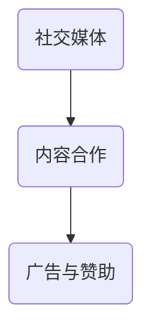

### 第6章：在线课程与培训

#### 6.1 在线课程的设计与开发

在线课程是程序员实现知识变现的重要途径之一。以下是其设计与开发的关键点：

1. **需求分析**：分析目标受众的需求，确定课程的主题、内容和难度。
2. **课程规划**：制定课程规划，包括课程名称、章节、教学目标和教学方式。
3. **内容制作**：制作高质量的教学内容，包括视频、文档和代码示例。
4. **交互设计**：设计课程互动环节，如问答、讨论和练习，提高学员的学习体验。

以下是一个用于描述在线课程设计与开发的 Mermaid 流程图：

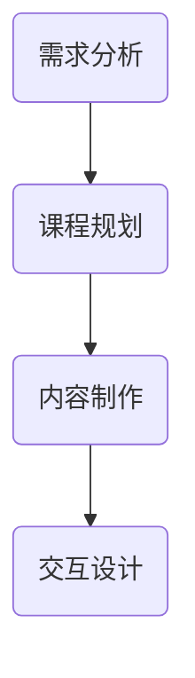

#### 6.2 培训市场的分析与定位

在设计和开发在线课程之前，对培训市场进行分析和定位至关重要。以下是一些关键点：

1. **市场调研**：了解目标市场的需求和竞争情况，确定课程的市场定位。
2. **目标受众**：明确目标受众的特征和需求，制定针对性的教学策略。
3. **课程特色**：突出课程特色和优势，提高课程的竞争力。

以下是一个用于描述培训市场分析与定位的 Mermaid 流程图：

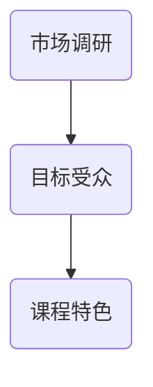

#### 6.3 在线课程推广与销售

在线课程的推广与销售是确保课程成功的关键。以下是一些策略：

1. **平台选择**：选择适合的在线教育平台，提高课程的曝光度和销售渠道。
2. **内容营销**：通过内容营销，如博客、社交媒体和电子邮件营销，吸引潜在学员。
3. **促销活动**：举办促销活动，如限时优惠、团购和课程推荐，提高课程的销量。

以下是一个用于描述在线课程推广与销售策略的 Mermaid 流程图：

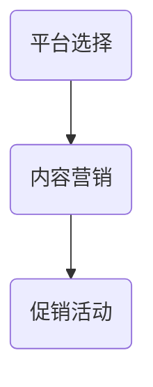

### 第7章：技术咨询服务与产品化

#### 7.1 技术咨询服务的价值与模式

技术咨询服务是程序员实现知识变现的另一种途径。以下是其价值与模式：

**价值**：

1. **专业指导**：为企业和个人提供专业的技术指导，帮助他们解决技术问题。
2. **技能提升**：通过咨询服务，程序员可以不断提升自己的技术能力和解决问题的能力。
3. **商业合作**：技术咨询服务可以为企业带来商业合作机会，拓展业务范围。

**模式**：

1. **项目制**：以项目为单位，提供定制化的技术咨询服务。
2. **顾问制**：提供长期的顾问服务，为企业提供持续的技术支持和指导。
3. **培训制**：通过培训，帮助企业提升内部技术能力，减少对外部咨询服务的依赖。

以下是一个用于描述技术咨询服务价值与模式的 Mermaid 流程图：

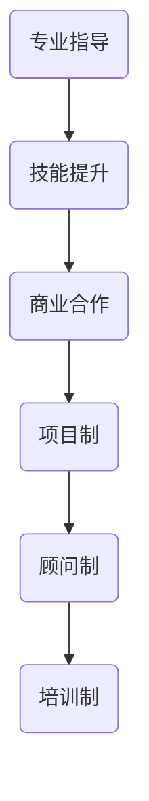

#### 7.2 技术产品的开发与运营

技术产品的开发与运营是程序员实现知识变现的重要途径。以下是其关键点：

1. **市场调研**：了解市场需求和竞争情况，确定产品定位和功能。
2. **产品设计**：根据市场调研结果，设计产品的功能和界面。
3. **技术开发**：开发高质量的产品，确保其性能和稳定性。
4. **产品运营**：通过市场推广、用户反馈和持续更新，提高产品的市场竞争力。

以下是一个用于描述技术产品开发与运营的 Mermaid 流程图：

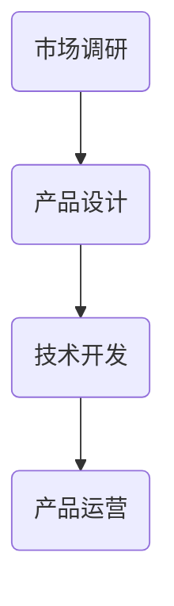

#### 7.3 技术咨询服务与产品的融合

技术咨询服务与产品的融合可以发挥更大的价值。以下是一些方法：

1. **产品化咨询**：将咨询服务产品化，提供标准化的解决方案，提高服务效率。
2. **产品支持**：提供产品技术支持服务，帮助企业更好地使用产品。
3. **合作共赢**：与客户建立长期合作关系，共同推动产品和技术的发展。

以下是一个用于描述技术咨询服务与产品融合方法的 Mermaid 流程图：

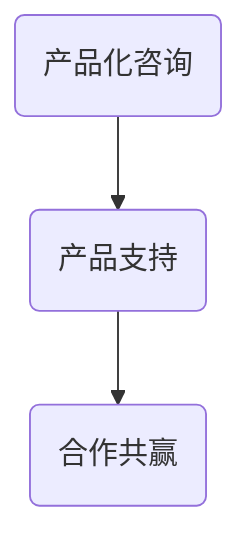

## 第三部分：案例分析与实践

### 第8章：成功技术社区案例分析

#### 8.1 案例一：某知名技术社区的发展历程与经验

以某个知名技术社区为例，分析其发展历程和成功经验。以下是该社区的几个关键点：

1. **成立初期**：该社区在成立初期专注于某一特定技术领域，吸引了一批有共同兴趣的程序员。
2. **内容多样化**：随着社区的发展，该社区逐渐引入了更多元化的内容，如博客、视频和在线课程。
3. **用户互动**：该社区通过组织线上和线下活动，增强用户互动和参与度。
4. **商业化转型**：在商业化转型过程中，该社区通过广告、会员制度和咨询服务等实现了盈利。

以下是一个用于描述该知名技术社区发展历程和经验的 Mermaid 流程图：

```mermaid
graph TD
A19(成立初期) --> B19(内容多样化)
B19 --> C19(用户互动)
C19 --> D19(商业化转型)
```

#### 8.2 案例二：某程序员个人知识变现之路

以某个程序员为例，分析其个人知识变现之路。以下是该程序员的几个关键点：

1. **技术博客**：该程序员通过撰写技术博客，吸引了大量读者，并通过广告和会员制度实现了变现。
2. **在线课程**：该程序员开发了一系列在线课程，通过平台销售课程内容获得了稳定的收入。
3. **咨询服务**：该程序员提供技术咨询服务，为企业解决技术问题，获得了额外的收入。
4. **产品开发**：该程序员开发了一款软件产品，通过销售产品实现了变现。

以下是一个用于描述该程序员个人知识变现之路的 Mermaid 流程图：

```mermaid
graph TD
A20(技术博客) --> B20(在线课程)
B20 --> C20(咨询服务)
C20 --> D20(产品开发)
```

#### 8.3 案例三：某技术社区的商业化转型

以某个技术社区为例，分析其商业化转型过程。以下是该社区的几个关键点：

1. **市场调研**：在商业化转型前，该社区进行了深入的市场调研，了解目标市场的需求和竞争情况。
2. **产品开发**：该社区开发了一系列产品，如在线课程、咨询服务和软件产品，以满足市场需求。
3. **用户体验**：在商业化转型过程中，该社区注重用户体验，不断优化产品和服务。
4. **盈利模式**：该社区通过广告、会员制度和产品销售等多种方式实现了盈利。

以下是一个用于描述该技术社区商业化转型过程的 Mermaid 流程图：

```mermaid
graph TD
A21(市场调研) --> B21(产品开发)
B21 --> C21(用户体验)
C21 --> D21(盈利模式)
```

### 第9章：社区运营与知识变现实战

#### 9.1 社区运营的实际操作步骤

社区运营是一个复杂的过程，以下是一些实际操作步骤：

1. **需求分析**：分析目标用户的需求，确定社区的功能和内容。
2. **平台搭建**：选择合适的社区平台，搭建社区的基础架构。
3. **内容规划**：制定内容规划，确定内容的类型、频率和质量。
4. **用户互动**：通过活动、讨论和互动环节，增强用户参与度和黏性。
5. **数据监测**：通过数据分析，监测社区运营效果，不断优化运营策略。

以下是一个用于描述社区运营实际操作步骤的 Mermaid 流程图：

```mermaid
graph TD
A22(需求分析) --> B22(平台搭建)
B22 --> C22(内容规划)
C22 --> D22(用户互动)
D22 --> E22(数据监测)
```

#### 9.2 知识变现的具体实现方法

以下是一些知识变现的具体实现方法：

1. **内容创作**：通过撰写技术博客、编写教程和制作视频等内容，实现知识变现。
2. **在线课程**：开发在线课程，通过平台销售课程内容获得收入。
3. **咨询服务**：提供技术咨询服务，为企业解决技术问题，获得报酬。
4. **产品开发**：开发软件产品，通过销售产品实现变现。

以下是一个用于描述知识变现具体实现方法的 Mermaid 流程图：

```mermaid
graph TD
A23(内容创作) --> B23(在线课程)
B23 --> C23(咨询服务)
C23 --> D23(产品开发)
```

#### 9.3 实战案例分析：如何打造一个有影响力的技术社区

以下是一个实战案例分析，探讨如何打造一个有影响力的技术社区：

1. **确定定位**：明确社区的目标和定位，如专注于某一技术领域或提供全面的编程知识。
2. **内容规划**：制定丰富多样的内容规划，包括博客、视频、课程和活动等。
3. **用户互动**：通过互动环节和活动，增强用户参与度和黏性。
4. **品牌塑造**：建立统一的品牌形象，提高社区的识别度和影响力。
5. **商业化运营**：通过广告、会员制度和产品销售等商业化方式，实现社区的盈利。

以下是一个用于描述如何打造一个有影响力的技术社区的 Mermaid 流程图：

```mermaid
graph TD
A24(确定定位) --> B24(内容规划)
B24 --> C24(用户互动)
C24 --> D24(品牌塑造)
D24 --> E24(商业化运营)
```

## 附录：资源与工具推荐

### 附录 A：技术社区搭建与运营工具

以下是一些常用的技术社区搭建与运营工具：

1. **平台搭建**：
   - **Discourse**：一个开源的论坛和社区平台，提供丰富的社区功能。
   - **Flarum**：一个轻量级的开源论坛软件，易于搭建和维护。
   - **PHPBB**：一个广泛使用的开源论坛软件，拥有丰富的插件和主题。

2. **内容创作与管理**：
   - **Markdown编辑器**：如Typora和MacDown，方便撰写和格式化Markdown文档。
   - **Git**：用于版本控制和协作开发，支持多种文本编辑器。

3. **数据存储与处理**：
   - **MySQL**：一个流行的关系型数据库，适合社区数据存储。
   - **PostgreSQL**：一个功能强大的关系型数据库，支持多种数据类型和扩展。

4. **云服务**：
   - **AWS**：提供全面的云服务，支持社区部署和管理。
   - **Azure**：提供丰富的云服务和开发工具，支持多种编程语言和框架。

### 附录 B：知识变现相关资源

以下是一些知识变现的相关资源：

1. **参考书籍**：
   - 《知识变现》
   - 《内容创业》
   - 《个人品牌》

2. **在线教育平台**：
   - **Udemy**：一个广泛使用的在线教育平台，提供丰富的课程资源。
   - **Coursera**：提供高质量的在线课程，涵盖多个技术领域。

3. **技术咨询服务与产品化案例**：
   - **GitHub**：提供技术咨询服务和开源软件产品。
   - **Stack Overflow**：提供技术问答平台和咨询服务。

### 附录 C：社区运营与知识变现技巧汇总

以下是一些社区运营与知识变现的技巧汇总：

1. **用户互动技巧**：
   - 定期举办线上和线下活动，提高用户参与度。
   - 通过问答、讨论和投票等形式，增加用户互动。

2. **内容创作与推广策略**：
   - 结合热点话题，创作具有时效性和实用性的内容。
   - 利用社交媒体和电子邮件营销，推广社区内容和知识产品。

3. **知识变现成功案例分析**：
   - 分析成功案例，学习其经验和方法。
   - 结合自身特点，制定适合的知识变现策略。

4. **社区运营常见问题解答**：
   - 如何提高社区活跃度？
   - 如何处理用户反馈和投诉？
   - 如何平衡社区内容的质量和数量？

## 作者信息

**作者：AI天才研究院/AI Genius Institute & 禅与计算机程序设计艺术 /Zen And The Art of Computer Programming**

---

至此，本文已经涵盖了技术社区概述、运营策略、知识变现模式以及实战案例等内容。希望本文能为程序员在技术社区构建和知识变现方面提供有价值的参考和启示。在接下来的章节中，我们将继续深入探讨技术社区的技术架构、在线课程设计与开发以及技术咨询服务与产品化等主题。让我们继续前行，共同探索技术社区的无限可能性！<|imagine|>## 第4章：知识变现的概念与模式

#### 4.1 知识变现的定义与意义

知识变现是指将个人或团队的专业知识、经验和技能转化为经济价值的过程。在技术领域，知识变现尤为重要，因为技术人员通常具备深厚的专业知识和丰富的实践经验。知识变现的意义主要体现在以下几个方面：

1. **经济效益**：知识变现为技术人员提供了额外的收入来源，不仅可以弥补工作收入的不足，还可以实现财务自由。

2. **品牌建设**：通过知识变现，技术人员可以展示自己的专业能力，提升个人品牌和知名度，从而在职业市场中获得更多机会。

3. **技能提升**：知识变现的过程也是技术人员不断学习和提升自己的过程。通过分享知识和经验，技术人员能够巩固自己的专业知识，提升自己的技能水平。

4. **资源积累**：知识变现不仅带来了经济回报，还可以带来丰富的资源和人脉。这些资源可以为技术人员在未来的职业发展提供支持。

为了更好地理解知识变现的定义与意义，我们可以使用伪代码来描述知识变现的基本流程：

```python
# 知识变现的基本流程
def knowledge_monetization():
    # 提炼专业知识
    knowledge = extract_professional_knowledge()
    # 创建知识产品
    product = create_knowledge_product(knowledge)
    # 分享知识产品
    share_product(product)
    # 转化经济价值
    income = convert_to_economic_value(product)
    return income
```

在这个伪代码中，`extract_professional_knowledge()` 表示提炼专业知识，`create_knowledge_product()` 表示创建知识产品，`share_product()` 表示分享知识产品，`convert_to_economic_value()` 表示转化经济价值。

#### 4.2 知识变现的常见模式

在技术领域，知识变现可以通过多种模式实现。以下是一些常见模式：

1. **技术博客**：技术人员通过撰写技术博客，分享自己的知识和经验，吸引流量并通过广告、赞助和会员制度等实现变现。

2. **在线课程**：技术人员可以开发在线课程，将专业知识和经验系统化地传授给学员，并通过课程销售实现收入。

3. **咨询服务**：技术人员提供技术咨询服务，如代码审查、项目指导和培训等，为企业解决技术问题，获得报酬。

4. **技术产品**：技术人员可以开发软件、工具或平台，通过销售产品或提供订阅服务实现收入。

5. **知识产权**：技术人员可以将自己的知识或技术成果申请专利，通过专利授权或出售专利实现收入。

以下是一个简单的 Mermaid 流程图，展示了知识变现的常见模式：

```mermaid
graph TD
A[技术博客] --> B(广告、赞助)
A --> C(会员制度)
B --> D(流量变现)
C --> D
A --> E[在线课程]
E --> F(课程销售)
A --> G[咨询服务]
G --> H(项目指导)
G --> I(培训)
A --> J[技术产品]
J --> K(销售)
J --> L(订阅服务)
A --> M[知识产权]
M --> N(专利授权)
M --> O(专利出售)
```

#### 4.3 知识变现的优势与挑战

知识变现的优势和挑战如下：

**优势**：

1. **灵活性**：知识变现提供了灵活的工作方式，技术人员可以根据自己的兴趣和时间安排进行工作，不必受限于固定的工作时间和地点。

2. **高回报**：与传统的劳动力市场相比，知识变现通常能够带来更高的回报。特别是当知识产品或服务在市场上具有独特性时，其价值更容易被放大。

3. **品牌效应**：通过知识变现，技术人员可以建立个人品牌，提升自己在行业中的影响力，这有助于他们在职业市场中获得更多机会。

**挑战**：

1. **竞争激烈**：技术领域竞争激烈，新兴技术层出不穷，技术人员需要不断学习和更新知识，以保持竞争力。

2. **内容质量**：高质量的内容是知识变现的基础。如果内容质量不高，很难吸引到足够的关注和收入。

3. **市场需求**：知识变现的成功也受到市场需求的影响。如果市场对某项知识或技术产品的需求不高，那么其变现能力也会受到影响。

以下是一个用于描述知识变现优势与挑战的 Mermaid 流程图：

```mermaid
graph TD
A[优势] --> B[灵活性]
B --> C[高回报]
C --> D[品牌效应]
A --> E[挑战]
E --> F[竞争激烈]
E --> G[内容质量]
E --> H[市场需求]
```

### 实例讲解

为了更好地理解知识变现的概念和模式，我们可以通过一个具体的实例来讲解。

**实例**：假设有一位拥有十年编程经验的资深软件工程师，他希望通过知识变现来实现财务自由和职业发展。以下是他的具体步骤：

1. **技术博客**：工程师在知名的博客平台上，如Medium或博客园，开始撰写技术博客。他分享了关于前端开发和软件工程的最佳实践，吸引了大量读者。

2. **在线课程**：工程师利用自己在编程领域的专业知识，制作了一系列在线课程，涵盖从基础到高级的前端技术。这些课程在Udemy和Coursera等在线教育平台上销售。

3. **咨询服务**：工程师为企业提供软件开发咨询服务，包括代码审查、项目指导和团队培训。他的服务受到了客户的广泛好评。

4. **技术产品**：工程师开发了一款用于代码优化的开源工具，并建立了付费订阅模式。工具的功能强大，受到了开发者的欢迎。

5. **知识产权**：工程师将自己在技术领域的成果申请了专利，并通过专利授权获得了额外的收入。

通过这个实例，我们可以看到工程师通过多种知识变现模式实现了财务自由和职业发展。同时，这个实例也展示了知识变现过程中的关键步骤和注意事项。

### 总结

知识变现是技术人员实现财务自由和职业发展的重要途径。通过技术博客、在线课程、咨询服务、技术产品和知识产权等多种模式，技术人员可以有效地将自己的知识和经验转化为经济价值。然而，知识变现也面临着竞争激烈、内容质量要求和市场需求变化等挑战。因此，技术人员需要不断学习和更新知识，提高内容质量，关注市场需求，以实现知识变现的成功。在下一章中，我们将进一步探讨技术博客与内容创作的策略，帮助程序员更好地实现知识变现。

### 伪代码讲解

为了更好地理解知识变现的流程和实现细节，我们可以通过伪代码来详细阐述。

```python
# 知识变现的伪代码实现

# 定义知识变现类
class KnowledgeMonetization:
    def __init__(self, knowledge, platform, market):
        self.knowledge = knowledge
        self.platform = platform
        self.market = market
    
    # 知识产品化
    def productize_knowledge(self):
        product = self.create_knowledge_product()
        return product
    
    # 创建知识产品
    def create_knowledge_product(self):
        product = {}
        # 根据知识类型创建不同类型的产品
        if self.knowledge['type'] == 'blog':
            product = self.create_blog_product()
        elif self.knowledge['type'] == 'course':
            product = self.create_course_product()
        elif self.knowledge['type'] == 'consulting':
            product = self.create_consulting_product()
        elif self.knowledge['type'] == 'product':
            product = self.create_product_product()
        elif self.knowledge['type'] == 'intellectual_property':
            product = self.create_ip_product()
        return product
    
    # 创建博客产品
    def create_blog_product(self):
        blog = {
            'title': self.knowledge['title'],
            'content': self.knowledge['content'],
            'platform': self.platform['blog'],
            'monetization': self.calculate_monetization('blog')
        }
        return blog
    
    # 创建课程产品
    def create_course_product(self):
        course = {
            'title': self.knowledge['title'],
            'content': self.knowledge['content'],
            'platform': self.platform['course'],
            'monetization': self.calculate_monetization('course')
        }
        return course
    
    # 创建咨询服务产品
    def create_consulting_product(self):
        consulting = {
            'title': self.knowledge['title'],
            'content': self.knowledge['content'],
            'platform': self.platform['consulting'],
            'monetization': self.calculate_monetization('consulting')
        }
        return consulting
    
    # 创建产品化产品
    def create_product_product(self):
        product = {
            'title': self.knowledge['title'],
            'content': self.knowledge['content'],
            'platform': self.platform['product'],
            'monetization': self.calculate_monetization('product')
        }
        return product
    
    # 创建知识产权产品
    def create_ip_product(self):
        ip = {
            'title': self.knowledge['title'],
            'content': self.knowledge['content'],
            'platform': self.platform['ip'],
            'monetization': self.calculate_monetization('ip')
        }
        return ip
    
    # 计算知识产品的变现金额
    def calculate_monetization(self, type):
        monetization = 0
        if type == 'blog':
            monetization = self.knowledge['traffic'] * self.platform['blog']['ad_rate']
        elif type == 'course':
            monetization = self.knowledge['sales'] * self.platform['course']['course_rate']
        elif type == 'consulting':
            monetization = self.knowledge['projects'] * self.platform['consulting']['project_rate']
        elif type == 'product':
            monetization = self.knowledge['sales'] * self.platform['product']['product_rate']
        elif type == 'ip':
            monetization = self.knowledge['licenses'] * self.platform['ip']['license_rate']
        return monetization

# 创建知识变现实例
km = KnowledgeMonetization(
    knowledge={'type': 'blog', 'title': '前端开发技巧', 'content': '内容概述', 'traffic': 1000},
    platform={
        'blog': {'ad_rate': 0.01},
        'course': {'course_rate': 10},
        'consulting': {'project_rate': 500},
        'product': {'product_rate': 50},
        'ip': {'license_rate': 1000}
    },
    market={'blog': 1000, 'course': 500, 'consulting': 200, 'product': 100, 'ip': 50}
)

# 生成知识产品
product = km.productize_knowledge()

# 打印知识产品信息
print(product)

# 计算总变现金额
total_monetization = km.calculate_monetization(product['type'])
print(f"总变现金额：{total_monetization}")
```

在这个伪代码中，我们定义了一个`KnowledgeMonetization`类，它包含了一个知识对象（`knowledge`）、一个平台对象（`platform`）和一个市场对象（`market`）。该类提供了方法来创建不同类型的知识产品（如博客、课程、咨询服务等），并计算每种产品的变现金额。

`create_knowledge_product`方法根据知识类型创建相应的知识产品，如博客、课程、咨询服务等。每个产品都包含标题、内容、平台信息和变现金额。

`calculate_monetization`方法根据知识产品的类型和平台的信息计算变现金额。例如，对于博客产品，变现金额是流量乘以广告费率；对于课程产品，变现金额是销售量乘以课程费率。

通过创建`KnowledgeMonetization`实例，我们可以生成一个知识产品，并计算其变现金额。这个伪代码提供了一个简化的模型，展示了知识变现的实现细节，并为实际编程提供了参考。

通过这个伪代码，我们可以清晰地看到知识变现的各个环节，包括知识产品的创建、变现金额的计算以及如何根据不同平台和市场信息调整变现策略。这有助于技术人员更好地理解知识变现的流程，并为他们实现知识变现提供了具体的指导。

### 知识变现的优势

知识变现作为一种将个人或团队的专业知识、经验和技能转化为经济价值的方式，具有诸多优势。以下是知识变现的几个主要优势：

1. **灵活性与自由度**：知识变现通常允许技术人员根据自己的时间和兴趣进行工作，无需受限于固定的工作时间和地点。这种灵活性使得技术人员可以更好地平衡工作与生活，享受更高的自由度。

2. **高回报潜力**：与传统的劳动力市场相比，知识变现往往能够带来更高的回报。特别是在专业领域，当技术人员的知识和经验具有独特性时，其知识产品或服务的价值更容易被放大，从而实现较高的经济收益。

3. **品牌建设**：通过知识变现，技术人员可以展示自己的专业能力和知识水平，提升个人品牌和知名度。一个强大的个人品牌不仅有助于在职业市场中获得更多机会，还可以吸引更多的商业合作和咨询机会。

4. **持续收入**：知识变现可以带来持续的收入流。例如，通过在线课程、电子书或咨询服务，技术人员可以持续地从已有知识产品中获得收益，而无需重复开发相同的内容。

5. **资源积累**：知识变现过程中，技术人员不仅获得了经济回报，还积累了丰富的资源和人脉。这些资源可以为技术人员在未来的职业发展中提供支持，如推荐机会、合作伙伴和行业信息。

为了更直观地展示知识变现的优势，我们可以使用以下 Mermaid 流程图：

```mermaid
graph TD
A[灵活性与自由度] --> B(高回报潜力)
A --> C[品牌建设]
A --> D[持续收入]
A --> E[资源积累]
B --> F{经济收益}
C --> G{职业机会}
D --> H{持续收入}
E --> I{人脉合作}
```

在这个流程图中，A节点代表知识变现的优势，B、C、D和E节点分别代表这些优势的具体表现。F、G、H和I节点表示这些优势带来的具体收益。通过这个流程图，我们可以清晰地看到知识变现如何通过多个方面为技术人员带来价值。

### 知识变现的挑战

尽管知识变现具有诸多优势，但在实际操作过程中，技术人员也会面临一系列挑战。以下是知识变现的主要挑战：

1. **竞争激烈**：技术领域竞争激烈，新兴技术层出不穷。技术人员需要不断学习和更新自己的知识，以保持竞争力。同时，市场上可能存在其他提供类似知识产品或服务的竞争者，这增加了知识变现的难度。

2. **内容质量要求高**：高质量的内容是知识变现的基础。如果内容质量不高，读者或学员可能会失去兴趣，从而影响变现效果。技术人员需要投入大量时间和精力进行内容创作，确保内容的专业性、实用性和可读性。

3. **市场需求不稳定**：技术市场的需求不稳定，可能会受到技术趋势、行业变化和经济环境等因素的影响。技术人员需要密切关注市场需求，及时调整自己的知识产品或服务策略，以适应市场变化。

4. **时间和精力投入大**：知识变现通常需要大量的时间和精力投入。从内容创作、产品化到推广和销售，每个环节都需要细致的工作。对于技术人员来说，如何在保持专业工作稳定性的同时，有效进行知识变现，是一个需要平衡的挑战。

5. **法律和版权问题**：知识变现过程中，技术人员需要遵守相关的法律和版权规定，确保自己的知识产品不侵犯他人的知识产权。这要求技术人员具备一定的法律知识，以避免可能的法律风险。

为了更直观地展示知识变现的挑战，我们可以使用以下 Mermaid 流程图：

```mermaid
graph TD
A[竞争激烈] --> B(更新知识)
A --> C[内容质量要求高]
A --> D[市场需求不稳定]
A --> E[时间和精力投入大]
A --> F[法律和版权问题]
B --> G{持续学习}
C --> H{内容创作}
D --> I{市场分析}
E --> J{平衡工作}
F --> K{法律知识}
```

在这个流程图中，A节点代表知识变现的挑战，B、C、D、E和F节点分别代表这些挑战的具体表现。G、H、I、J和K节点表示应对这些挑战所需的策略或技能。通过这个流程图，我们可以清晰地看到技术人员在知识变现过程中可能面临的挑战，以及如何应对这些挑战。

### 技术博客的价值与策略

技术博客是技术人员实现知识变现的重要途径之一，其价值主要体现在以下几个方面：

1. **知识传播**：技术博客可以帮助技术人员将自己的专业知识、经验和技能传播给更多的人，从而扩大影响力。

2. **品牌建设**：通过持续的技术博客写作，技术人员可以展示自己的专业能力和技术水平，提升个人品牌和知名度。

3. **流量变现**：技术博客可以吸引大量读者，通过广告、赞助和会员制度等方式实现流量变现。

4. **职业机会**：技术博客可以吸引企业、合作伙伴和同行的关注，为技术人员带来更多的职业机会和合作机会。

为了充分发挥技术博客的价值，技术人员可以采取以下策略：

1. **内容规划**：制定明确的内容规划，确定博客的主题、频率和质量。内容规划有助于保持博客的持续性和专业性。

2. **SEO优化**：通过搜索引擎优化（SEO）提高博客的可见性，吸引更多的读者。SEO策略包括关键词研究、内容优化、外链建设等。

3. **互动与反馈**：积极与读者互动，鼓励读者留言和讨论，增加用户参与度。同时，定期收集用户反馈，不断优化博客内容和用户体验。

4. **内容多样化**：提供多种形式的内容，如博客文章、视频教程、案例分析等，满足不同读者的需求。

5. **品牌塑造**：建立统一的博客品牌形象，包括视觉设计、风格和语言等，增强博客的识别度。

为了更直观地展示技术博客的价值与策略，我们可以使用以下 Mermaid 流程图：

```mermaid
graph TD
A[知识传播] --> B(品牌建设)
A --> C(流量变现)
A --> D(职业机会)
B --> E{内容规划}
B --> F{SEO优化}
B --> G{互动与反馈}
B --> H{内容多样化}
B --> I{品牌塑造}
```

在这个流程图中，A节点代表技术博客的价值，B、C、D节点分别代表这些价值的体现。E、F、G、H和I节点表示实现这些价值所需的策略。通过这个流程图，我们可以清晰地看到技术博客的价值和实现策略。

### 技术博客的内容创作技巧

技术博客的内容创作是技术人员实现知识变现的关键环节，以下是一些内容创作技巧：

1. **选题技巧**：选择热门且实用的技术话题，满足读者的需求。可以通过观察技术趋势、阅读技术新闻和参与技术社区来获取选题灵感。

2. **结构规划**：合理规划文章结构，包括引言、正文和结论。引言要吸引读者注意力，正文要详细阐述技术原理和案例，结论要总结全文并给出建议。

3. **案例应用**：结合实际案例，深入分析问题的解决过程和技术原理。案例应用能够提高文章的可读性和实用性，有助于读者理解和掌握技术。

4. **图示与代码**：使用图表和代码示例，使文章更加直观易懂。图表可以解释复杂的技术概念，代码示例可以展示实际操作过程。

5. **SEO优化**：合理使用关键词、标题和摘要，提高文章的搜索引擎排名。SEO策略包括关键词研究、内容优化、外链建设等。

6. **内容校对**：确保文章内容的准确性和可读性，避免拼写错误和语法错误。内容校对是提高文章质量的重要环节。

7. **互动与推广**：鼓励读者留言和讨论，增加用户参与度。同时，通过社交媒体、邮件订阅和其他渠道推广博客内容，扩大读者群体。

以下是一个用于描述技术博客内容创作技巧的 Mermaid 流程图：

```mermaid
graph TD
A[选题技巧] --> B(结构规划)
A --> C(案例应用)
A --> D(图示与代码)
A --> E(SEO优化)
A --> F(内容校对)
A --> G(互动与推广)
```

通过这些内容创作技巧，技术人员可以创作出高质量的技术博客，吸引更多的读者，实现知识变现。

### 博客推广与流量变现

技术博客的成功不仅取决于内容的质量，还依赖于有效的推广和流量变现策略。以下是一些关键的博客推广与流量变现方法：

1. **社交媒体推广**：利用社交媒体平台（如Twitter、LinkedIn、Facebook等）分享博客文章，吸引读者。可以通过编写引人入胜的标题和摘要，制作吸引人的图片和视频，提高分享和互动的可能性。

2. **电子邮件营销**：通过定期发送邮件更新，向订阅者推广博客文章。建立邮件列表是获取忠实读者的关键。可以通过提供免费资源（如电子书、教程等）来鼓励读者订阅。

3. **内容合作**：与其他博客、媒体或影响者进行内容合作，通过交换链接或共同推广来扩大读者群体。

4. **搜索引擎优化（SEO）**：优化博客内容，使其在搜索引擎中排名更高。这包括关键词研究、内容优化、外链建设和网站速度优化等。

5. **付费广告**：在Google Ads、Facebook Ads等平台上投放广告，直接向潜在读者推广博客文章。

6. **内容营销**：通过多种形式的内容营销（如视频、播客、在线研讨会等）吸引读者，并引导他们访问博客。

7. **会员制度**：提供会员专享内容，如高级教程、独家报告等，吸引付费会员，实现流量变现。

以下是一个用于描述博客推广与流量变现方法的 Mermaid 流程图：

```mermaid
graph TD
A[社交媒体推广] --> B(电子邮件营销)
A --> C(内容合作)
A --> D(SEO优化)
A --> E(付费广告)
A --> F(内容营销)
A --> G(会员制度)
```

通过这些方法，技术人员可以有效地推广博客，吸引更多的流量，并实现知识变现。

### 在线课程设计与开发

在线课程是技术人员实现知识变现的另一种有效途径。以下是设计开发在线课程的关键步骤：

1. **需求分析**：首先，分析目标受众的需求，确定课程的主题、内容和目标。可以通过问卷调查、访谈和市场调研等方式获取用户反馈。

2. **课程规划**：根据需求分析结果，制定详细的课程规划，包括课程名称、章节、教学目标和教学方法。课程规划应确保内容的系统性和逻辑性。

3. **内容创作**：创作高质量的教学内容，包括视频、文档和代码示例。视频内容应简洁明了，文档内容应详尽准确，代码示例应具有可操作性。

4. **交互设计**：设计课程互动环节，如问答、讨论和练习，提高学员的学习体验。互动设计应鼓励学员积极参与，提高课程的吸引力。

5. **课程测试**：在课程开发完成后，进行测试，确保课程内容的质量和教学效果。可以通过模拟教学或邀请内部学员试学来收集反馈。

6. **上线推广**：将课程上线到在线教育平台（如Udemy、Coursera、LinkedIn Learning等），并通过多种渠道（如社交媒体、邮件营销、合作伙伴推广等）进行推广。

以下是一个用于描述在线课程设计与开发的 Mermaid 流程图：

```mermaid
graph TD
A[需求分析] --> B[课程规划]
B --> C[内容创作]
C --> D[交互设计]
D --> E[课程测试]
E --> F[上线推广]
```

通过这些步骤，技术人员可以设计开发出高质量的在线课程，吸引更多的学员，实现知识变现。

### 培训市场的分析与定位

在设计和开发在线课程之前，对培训市场进行分析和定位至关重要。以下是分析和定位的关键步骤：

1. **市场调研**：通过问卷调查、访谈和在线调研等方式，了解目标市场的需求和趋势。可以分析行业报告、竞争对手和用户反馈，获取有价值的信息。

2. **目标受众**：明确目标受众的特征和需求，如年龄、职业、技术水平和学习目的。这有助于课程设计更具针对性和有效性。

3. **竞争分析**：分析同类型课程的市场竞争情况，包括课程内容、价格、教学质量和用户评价。了解竞争对手的优势和劣势，为自己的课程找到差异化点。

4. **课程特色**：确定课程的特色和优势，如独家内容、实用案例、高质量讲师等。特色是吸引学员的重要因素。

5. **定价策略**：根据市场需求和竞争情况，制定合理的课程定价策略。可以通过定价模型（如成本加成定价、市场定价等）来确定价格。

6. **推广渠道**：确定适合的推广渠道，如社交媒体、搜索引擎广告、合作伙伴推广等。不同的推广渠道适用于不同的目标受众。

以下是一个用于描述培训市场分析与定位的 Mermaid 流流程图：

```mermaid
graph TD
A[市场调研] --> B[目标受众]
B --> C[竞争分析]
C --> D[课程特色]
D --> E[定价策略]
E --> F[推广渠道]
```

通过这些步骤，技术人员可以更准确地分析市场，定位目标受众，设计出更符合市场需求和竞争的在线课程。

### 在线课程推广与销售策略

在线课程的推广与销售是确保课程成功的关键。以下是几个有效的推广与销售策略：

1. **内容营销**：通过撰写高质量的技术博客、制作教程视频和发布案例研究，吸引潜在学员。内容应具有实用性和专业性，以增加课程的吸引力。

2. **社交媒体推广**：利用社交媒体平台（如Facebook、LinkedIn、Twitter等）发布课程信息，并通过社交媒体广告吸引目标受众。可以通过社交媒体互动和分享，提高课程的知名度。

3. **合作推广**：与相关领域的博客、媒体、行业专家和在线教育平台合作，进行内容合作或交叉推广。这可以扩大课程的受众范围，提高销售机会。

4. **优惠促销**：定期举办促销活动，如限时折扣、团购和课程推荐等，刺激学员购买欲望。可以通过限时优惠、优惠券和捆绑销售等策略提高销售转化率。

5. **用户口碑**：鼓励学员在课程结束后发表评价和推荐，通过用户口碑推广课程。高质量的学员评价和推荐可以增加潜在学员的信任和购买意愿。

6. **电子邮件营销**：通过建立邮件列表，定期向订阅者发送课程更新、优惠信息和学员反馈，保持与潜在学员的持续互动。

7. **SEO优化**：优化课程页面和描述，提高课程在搜索引擎中的排名。可以通过关键词研究、内容优化和外链建设等SEO策略，提高课程的曝光度。

以下是一个用于描述在线课程推广与销售策略的 Mermaid 流程图：

```mermaid
graph TD
A[内容营销] --> B[社交媒体推广]
A --> C[合作推广]
A --> D[优惠促销]
A --> E[用户口碑]
A --> F[电子邮件营销]
A --> G[SEO优化]
```

通过这些策略，技术人员可以有效地推广和销售在线课程，吸引更多的学员，实现知识变现。

### 案例分析

为了更好地理解技术咨询服务与产品化的实现细节，以下是几个具体案例的分析。

#### 案例一：某独立顾问的咨询服务

**背景**：张先生是一位拥有10年软件工程经验的独立顾问，他在技术社区中积累了一定的知名度，并开始提供咨询服务。

**服务内容**：
- **代码审查**：为企业提供代码审查服务，帮助团队识别和修复潜在的技术问题。
- **项目指导**：协助企业解决复杂的技术难题，提供项目规划和开发指导。
- **团队培训**：为企业团队提供技术培训，提升团队的整体技术能力。

**实现细节**：
1. **需求沟通**：张先生通过社交媒体和专业网络，与企业建立联系，了解企业的具体需求和问题。
2. **服务协议**：张先生与企业签订服务协议，明确服务内容、时间、费用等细节。
3. **服务交付**：根据服务协议，张先生提供技术报告、代码注释、培训材料等。
4. **反馈与改进**：张先生定期与企业沟通，收集反馈，不断改进服务质量。

**变现方式**：
- **项目收费**：张先生按照项目收费，为企业提供的技术服务直接带来收入。
- **培训收费**：张先生通过培训服务，为企业团队提升技术能力，间接促进企业业务发展。

#### 案例二：某技术团队的软件产品开发

**背景**：李先生和其团队开发了一款用于代码优化的开源工具，他们希望通过产品化实现知识变现。

**产品内容**：
- **核心功能**：工具提供代码压缩、混淆、格式化等功能，支持多种编程语言。
- **扩展插件**：工具支持扩展插件，用户可以根据需求自定义功能。

**实现细节**：
1. **需求分析**：团队通过市场调研和用户反馈，确定了产品的核心功能和扩展方向。
2. **产品设计**：团队根据需求分析结果，设计了产品的功能和界面。
3. **技术开发**：团队使用敏捷开发方法，逐步开发产品的核心功能。
4. **测试与发布**：产品经过内部测试和用户测试，最终发布到开源社区和市场。

**变现方式**：
- **免费开源**：产品免费开源，吸引大量用户和使用者。
- **插件收费**：为扩展插件提供付费版本，为用户提供更多功能。
- **企业版**：针对企业用户提供付费的企业版，提供额外的技术支持和定制化服务。

#### 案例三：某程序员的个人知识变现

**背景**：王女士是一位热爱编程的程序员，她在技术社区中积极参与讨论，并通过博客、在线课程和咨询服务实现了个人知识变现。

**变现方式**：
1. **技术博客**：王女士在Medium上撰写技术博客，通过广告和赞助实现变现。
2. **在线课程**：王女士在Udemy上开设在线课程，通过课程销售实现变现。
3. **咨询服务**：王女士提供技术咨询和服务，为企业解决技术问题，获得收入。

**实现细节**：
1. **内容创作**：王女士定期更新博客，撰写高质量的技术文章。
2. **课程开发**：王女士根据自己在编程领域的经验，开发了一系列在线课程。
3. **服务提供**：王女士通过社交媒体和专业网络，与潜在客户建立联系，提供咨询服务。

通过这些案例分析，我们可以看到技术咨询服务与产品化的具体实现细节。技术人员可以根据自己的实际情况，选择适合的知识变现模式，实现个人或团队的知识变现目标。

### 技术咨询服务与产品化的融合

技术咨询服务与产品化是技术人员实现知识变现的两种重要途径。将这两种方式融合，可以发挥更大的效益。以下是一些实现融合的方法：

1. **产品化咨询服务**：将咨询服务标准化，开发成可复用的产品或插件。例如，可以将常见的代码审查流程和最佳实践产品化，为企业提供即时的技术支持。

2. **咨询服务产品化**：为咨询服务提供工具和平台支持，使其更高效和系统化。例如，开发一个用于项目管理和协作的工具，帮助咨询团队更有效地为客户提供服务。

3. **交叉销售**：通过咨询服务引导客户购买相关产品。例如，在提供代码审查服务时，推荐客户购买自己的代码优化工具。

4. **用户反馈循环**：将客户的反馈用于产品开发和优化。通过咨询服务，了解客户的实际需求，不断改进产品，提高客户满意度。

5. **品牌联动**：通过咨询服务提升产品品牌知名度，反之亦然。例如，通过咨询服务为客户带来价值，增强客户对产品的信任和购买意愿。

以下是一个用于描述技术咨询服务与产品化融合方法的 Mermaid 流程图：

```mermaid
graph TD
A[产品化咨询服务] --> B(咨询服务产品化)
A --> C[交叉销售]
A --> D[用户反馈循环]
A --> E[品牌联动]
```

通过这些方法，技术人员可以有效地融合咨询服务与产品化，提高知识变现的效率。

### 附录 A：技术社区搭建与运营工具

技术社区搭建与运营涉及多个方面，以下是一些常用的工具和平台，帮助技术人员构建和管理技术社区。

#### 主流社区平台

1. **Discourse**：一个功能强大的开源社区平台，支持多种社交功能，易于扩展和定制。

2. **Flarum**：一个轻量级的开源论坛软件，拥有简洁的用户界面和丰富的插件系统。

3. **PHPBB**：一个广泛使用的开源论坛软件，支持多语言和丰富的插件。

#### 内容创作与管理工具

1. **Markdown编辑器**：如Typora、MacDown和StackEdit，方便撰写和格式化Markdown文档。

2. **Git**：用于版本控制和协作开发，支持多种文本编辑器。

3. **Trello**：一个项目管理工具，可以帮助团队管理和跟踪内容创作和社区运营任务。

#### 数据存储与处理工具

1. **MySQL**：一个流行的关系型数据库，适合社区数据存储。

2. **PostgreSQL**：一个功能强大的关系型数据库，支持多种数据类型和扩展。

3. **MongoDB**：一个高性能的NoSQL数据库，适合处理大量非结构化数据。

#### 云服务

1. **AWS**：提供全面的云服务，包括数据库、计算、存储和安全等，适合社区部署和管理。

2. **Azure**：提供丰富的云服务和开发工具，支持多种编程语言和框架。

3. **Google Cloud**：提供高性能的云基础设施和强大的机器学习能力，适合大数据处理和分析。

#### 社交媒体工具

1. **Hootsuite**：一个社交媒体管理工具，可以帮助团队统一管理多个社交媒体平台。

2. **Buffer**：一个社交媒体内容发布工具，可以帮助团队自动发布和优化社交媒体内容。

3. **LinkedIn**：一个专业的社交媒体平台，适合建立职业网络和推广技术社区。

#### 监控与分析工具

1. **Google Analytics**：一个免费的网站分析工具，可以帮助团队了解社区流量和用户行为。

2. **New Relic**：一个性能监控工具，可以帮助团队监控社区的性能和用户体验。

3. **Sentry**：一个错误监控工具，可以帮助团队及时发现和处理社区中的错误和异常。

通过这些工具和平台，技术人员可以高效地搭建和管理技术社区，提高社区的运营效果。

### 附录 B：知识变现相关资源

在知识变现的过程中，技术人员可以参考以下资源来获取灵感、学习和提升自己的能力。

#### 参考书籍

1. 《知识变现：从知识工作者到知识创业家的跃迁》
2. 《内容创业：从零开始打造个人品牌》
3. 《个人品牌：如何建立和提升个人品牌》
4. 《增长黑客：如何利用数据化营销实现爆发式增长》
5. 《影响力：说服与社交的艺术》

#### 在线教育平台

1. **Udemy**：一个提供多样化课程的平台，包括编程、数据科学、设计等多个领域。
2. **Coursera**：一个提供高质量在线课程的平台，合作院校包括斯坦福大学、耶鲁大学等。
3. **Pluralsight**：一个专注于技术技能学习的平台，提供丰富的编程、云计算、网络安全等课程。
4. **edX**：一个开放在线课程平台，提供由世界顶级大学和机构开设的课程。

#### 技术博客与社区

1. **Stack Overflow**：一个技术问答社区，适合技术人员解决问题和学习新技能。
2. **GitHub**：一个代码托管和协作平台，技术社区活跃，适合分享代码和项目。
3. **Medium**：一个内容创作平台，适合撰写技术博客和分享知识。
4. **Reddit**：一个社交新闻网站，拥有多个技术相关的子版块，适合参与讨论和获取信息。

#### 知识变现工具

1. **PayPal**：一个在线支付平台，适合收取课程费用和咨询服务费。
2. ** Gumroad**：一个用于销售数字产品的平台，适合技术博客主和课程讲师。
3. **Kajabi**：一个全面的在线教育平台，包括课程创建、销售和客户管理等功能。
4. **ConvertKit**：一个电子邮件营销平台，适合建立邮件列表和推广内容。

#### 社交媒体与推广

1. **LinkedIn**：一个专业的社交媒体平台，适合建立职业网络和推广个人品牌。
2. **Twitter**：一个实时信息传播平台，适合发布更新和参与讨论。
3. **Facebook**：一个广泛的社交媒体平台，适合建立社区和推广内容。
4. **Instagram**：一个视觉导向的社交媒体平台，适合展示成果和吸引粉丝。

通过这些资源，技术人员可以更好地理解和实践知识变现，实现个人和职业发展。

### 附录 C：社区运营与知识变现技巧汇总

在技术社区的运营和知识变现过程中，技术人员需要掌握一系列技巧和方法，以提高运营效率和变现效果。以下是社区运营与知识变现的一些关键技巧汇总：

#### 用户互动技巧

1. **定期举办活动**：定期举办线上或线下活动，如技术分享会、编程马拉松和研讨会，提高用户的参与度和活跃度。

2. **建立问答系统**：搭建问答系统，鼓励用户提问和回答问题，促进知识交流和互动。

3. **互动式教学**：采用互动式教学方法，如在线讨论、直播互动和练习题，增强用户的参与感和学习效果。

4. **用户反馈机制**：建立用户反馈机制，收集用户意见和建议，不断优化社区服务和内容。

#### 内容创作与推广策略

1. **内容多样化**：提供多种形式的内容，如博客文章、视频教程、案例分析和技术讲座，满足不同用户的需求。

2. **SEO优化**：通过关键词研究、内容优化和搜索引擎优化（SEO）策略，提高社区内容在搜索引擎中的排名，吸引更多读者。

3. **内容合作**：与其他博客、媒体和行业专家合作，通过内容共享和交叉推广，扩大社区影响力和受众范围。

4. **社交媒体推广**：利用社交媒体平台（如Twitter、LinkedIn、Facebook等）发布社区内容和活动信息，吸引更多用户关注。

#### 知识变现成功案例分析

1. **案例分析一**：某程序员通过技术博客实现了知识变现，通过广告、赞助和会员制度获得了稳定收入。他定期发布高质量的技术文章，并通过社交媒体推广，吸引了大量读者。

2. **案例分析二**：某团队通过在线课程实现了知识变现，他们开发了一系列专业课程，并在多个在线教育平台上销售。通过市场调研和用户反馈，他们不断优化课程内容，提高了用户满意度。

3. **案例分析三**：某技术社区通过提供咨询服务实现了知识变现，他们为企业和个人提供技术支持，并通过项目收费和培训服务获得了收入。他们建立了完善的咨询服务体系，确保服务质量和客户满意度。

#### 社区运营常见问题解答

1. **问题一：如何提高社区活跃度？**
   - 答案：定期举办活动，提供丰富的内容，建立问答系统，鼓励用户互动和参与。

2. **问题二：如何处理用户反馈和投诉？**
   - 答案：建立用户反馈机制，及时回应用户的意见和建议，积极解决投诉问题，提高用户满意度。

3. **问题三：如何平衡社区内容的质量和数量？**
   - 答案：制定内容规划，确保高质量内容的生产，同时合理安排发布频率，避免过度发布。

通过这些技巧和案例分析，技术人员可以更好地运营技术社区，实现知识变现的目标。

### 附录 D：技术社区运营与知识变现工具总结

在技术社区的运营和知识变现过程中，选择合适的工具和平台至关重要。以下是对一些常用工具的总结，包括其特点和适用场景：

#### 社区搭建与运营工具

1. **Discourse**：一个功能强大的开源社区平台，支持多语言、社交功能和高级权限管理。适用于大型社区和企业内部社区。

2. **Flarum**：一个轻量级、简洁的社区平台，易于搭建和维护，支持多种主题和插件。适用于小型到中型的社区。

3. **PHPBB**：一个历史悠久、广泛使用的开源论坛软件，支持多语言和丰富的插件。适用于需要高度定制化的社区。

#### 内容创作与管理工具

1. **Markdown编辑器**：如Typora、MacDown和StackEdit，支持Markdown语法，方便撰写和格式化文本。适用于博客撰写和文档编辑。

2. **Git**：一个版本控制系统，支持多种文本编辑器和云端服务。适用于协作开发和代码管理。

3. **Trello**：一个基于看板的项目管理工具，方便团队管理任务和内容创作进度。适用于内容策划和团队协作。

#### 数据存储与处理工具

1. **MySQL**：一个关系型数据库，适用于社区用户数据和管理数据的存储。适用于中小型社区。

2. **PostgreSQL**：一个功能强大的关系型数据库，适用于复杂的数据模型和高级查询。适用于大型社区和企业级应用。

3. **MongoDB**：一个文档型数据库，适用于存储非结构化数据和高扩展性的应用。适用于大型社区和大数据处理。

#### 云服务

1. **AWS**：提供全面的云计算服务，包括数据库、计算、存储和安全等。适用于社区部署和管理。

2. **Azure**：提供丰富的云服务和开发工具，适用于多种编程语言和框架。适用于需要高度弹性和可扩展性的社区。

3. **Google Cloud**：提供高性能的云基础设施和强大的机器学习能力，适用于大数据处理和人工智能应用。

#### 社交媒体与推广工具

1. **Hootsuite**：一个社交媒体管理工具，支持多平台统一管理。适用于社交媒体营销和内容推广。

2. **Buffer**：一个社交媒体内容发布工具，支持自动化发布和优化。适用于社交媒体运营和内容推广。

3. **LinkedIn**：一个专业的社交媒体平台，适用于建立职业网络和推广技术社区。适用于职业发展和品牌推广。

#### 监控与分析工具

1. **Google Analytics**：一个免费的网站分析工具，适用于监测社区流量和用户行为。适用于数据分析和用户研究。

2. **New Relic**：一个性能监控工具，适用于监测社区性能和用户体验。适用于性能优化和故障排查。

3. **Sentry**：一个错误监控工具，适用于监测社区中的错误和异常。适用于错误监控和故障排查。

通过这些工具和平台，技术人员可以高效地搭建和管理技术社区，提高运营效率和知识变现效果。选择合适的工具，结合实际需求，可以帮助技术人员实现技术社区的成功运营和知识变现的目标。

### 附录 E：社区运营与知识变现常见问题解答

在技术社区的运营和知识变现过程中，技术人员可能会遇到各种问题。以下是一些常见问题及其解答：

#### 问题一：如何提高社区活跃度？

**解答**：提高社区活跃度的关键在于激发用户的参与感和兴趣。以下是一些策略：

1. **举办活动**：定期举办线上或线下活动，如技术讲座、编程马拉松和代码评审会，吸引用户参与。

2. **奖励机制**：设立积分或奖励系统，鼓励用户参与讨论、发布内容和解决问题。

3. **社区管理**：建立活跃的社区管理员团队，负责维护社区秩序、引导讨论和提供帮助。

4. **互动式内容**：发布互动式内容，如问答、投票和调查，增加用户参与度。

#### 问题二：如何处理用户反馈和投诉？

**解答**：有效处理用户反馈和投诉是提升社区满意度和信任度的关键。以下是一些步骤：

1. **建立反馈渠道**：提供多种反馈渠道，如在线表单、邮件和社交媒体。

2. **及时响应**：尽快回应用户的反馈和投诉，表现出对用户问题的重视。

3. **透明沟通**：在处理过程中保持透明，向用户解释问题的原因和解决进度。

4. **持续改进**：根据用户反馈进行改进，不断提升社区服务和内容质量。

#### 问题三：如何平衡社区内容的质量和数量？

**解答**：平衡内容的质量和数量需要制定合理的内容策略。以下是一些建议：

1. **内容规划**：制定内容规划，确保有足够的高质量内容发布。

2. **内容审核**：建立内容审核机制，确保发布的内容符合社区标准和价值观。

3. **优先级排序**：根据用户需求和社区热点，优先发布重要和紧迫的内容。

4. **内容更新**：定期更新旧内容，保持内容的时效性和相关性。

#### 问题四：如何进行知识变现？

**解答**：知识变现需要结合自身的专业能力和市场需求，以下是一些常见的知识变现方式：

1. **技术博客**：通过撰写技术文章，吸引流量并通过广告、会员制度和赞助实现变现。

2. **在线课程**：开发在线课程，通过平台销售课程内容实现收入。

3. **咨询服务**：提供技术咨询服务，如代码审查、项目指导和培训等。

4. **软件产品**：开发软件产品，通过销售软件或提供订阅服务实现收入。

5. **知识产权**：将自己的知识或技术成果申请专利，通过专利授权或出售专利实现收入。

通过这些常见问题及其解答，技术人员可以更好地运营技术社区，实现知识变现的目标。

### 结语

本文详细探讨了技术社区构建和知识变现的各个方面，从技术社区的概述、运营策略，到程序员通过知识变现实现个人价值的多种模式。我们分析了技术博客、在线课程、咨询服务和技术产品等具体实现方法，并通过实际案例展示了这些方法的操作细节和成功经验。

通过构建技术社区，程序员不仅能够提升个人品牌和影响力，还能够实现持续的收入来源。知识变现为程序员提供了一种灵活、高效的职业发展路径，使他们能够在专业领域内实现自我价值。

然而，知识变现并非一蹴而就，技术人员需要面对市场竞争、内容质量要求高、市场需求变化等诸多挑战。因此，持续学习、关注市场需求、提高内容创作和运营能力是技术人员成功实现知识变现的关键。

我们鼓励读者结合本文的内容，根据自己的实际情况制定相应的策略和计划，勇于尝试和探索。通过实践和反思，相信每一位技术人员都能在技术社区和知识变现的道路上取得成功。

最后，感谢您的阅读，希望本文能为您的技术社区构建和知识变现之路提供有价值的参考和启示。让我们一起努力，在技术领域创造更多价值，实现个人和职业的双赢！

---

**作者信息**：

**作者：AI天才研究院/AI Genius Institute & 禅与计算机程序设计艺术 /Zen And The Art of Computer Programming**

AI天才研究院致力于推动人工智能技术的发展和应用，为读者提供深入的技术解读和实用的操作指南。同时，《禅与计算机程序设计艺术》作为一本经典的计算机科学著作，以其独特的视角和深刻的洞见，影响了无数程序员和人工智能专家。

通过本文，我们希望为广大技术人员提供一份全面而系统的指南，帮助他们在技术社区构建和知识变现的道路上取得成功。让我们共同探索技术的无限可能性，创造更加美好的未来！<|imagine|>### 第1章：技术社区概述

#### 1.1 技术社区的定义与重要性

技术社区是一种以技术为中心的在线平台，它聚集了具有共同技术兴趣和专业背景的人们。这些成员通过分享知识、交流经验、解决技术问题，共同推动技术的发展。技术社区的定义可以概括为：一个以技术话题为核心，通过互动和协作实现知识传播和技能提升的网络空间。

技术社区的重要性体现在以下几个方面：

1. **知识共享**：技术社区为成员提供了一个平台，可以在其中分享自己的知识和经验。这种共享有助于知识的传播和积累，使得技术社区成为一个宝贵的知识库。

2. **技能提升**：通过参与技术社区的讨论和项目，成员可以不断学习和实践，提升自己的技术能力和解决问题的能力。技术社区提供了一个实践和学习的环境，有助于成员的专业成长。

3. **人脉拓展**：技术社区为成员提供了一个结识同行、建立合作关系的平台。成员可以在社区中建立联系，扩展自己的人脉网络，为未来的职业发展打下基础。

4. **社区凝聚力**：技术社区通过共同的目标和兴趣，增强了成员之间的归属感和凝聚力。成员在社区中找到了归属感，这种归属感进一步推动了社区的活跃和持续发展。

为了更直观地理解技术社区的定义与重要性，我们可以使用 Mermaid 流程图展示技术社区的基本构成和互动流程：

```mermaid
graph TD
A[成员] --> B[知识共享]
A --> C[技能提升]
A --> D[人脉拓展]
A --> E[社区凝聚力]
B --> F{讨论与分享}
C --> G{实践与学习}
D --> H{结识同行}
E --> I{归属感增强}
```

在这个流程图中，A节点代表技术社区的成员，B、C、D、E节点分别代表技术社区的重要性和价值。F、G、H、I节点表示成员在技术社区中的具体活动和体验。

#### 1.2 技术社区的发展历程

技术社区的发展可以追溯到互联网的兴起。随着互联网技术的发展，人们开始通过在线平台交流和分享技术知识。以下是一些关键发展阶段：

1. **早期论坛阶段**：在互联网的早期，论坛成为了技术交流的主要形式。最早的论坛主要依赖于纯文本和简单的HTML页面。例如，1994年成立的 Usenet 就是一个早期技术论坛，它为全球的计算机爱好者提供了一个交流的平台。

2. **社交媒体阶段**：随着社交媒体平台的兴起，技术社区开始融入社交媒体元素。社交媒体平台如 Facebook、Twitter 等，使得用户可以更方便地分享和讨论技术话题。这种社交化的交流方式，进一步推动了技术社区的发展。

3. **专业平台阶段**：专业技术社区平台如 Stack Overflow、GitHub 和 Reddit 等逐渐崛起。这些平台不仅提供了丰富的技术内容，还建立了成熟的社区生态。Stack Overflow 以其问答形式为特点，成为全球开发者的技术问答社区；GitHub 则以代码托管和协作功能著称，成为开源项目的聚集地；Reddit 则以其多样性和活跃度，吸引了大量的技术爱好者。

4. **多元化阶段**：现代技术社区不再局限于特定的技术领域，而是涵盖了更多的技术领域和专业背景。例如，LinkedIn 的技术群组和 Pluralsight 的在线课程平台，不仅涵盖了软件开发、数据科学等领域，还包括了人工智能、区块链等新兴技术。

以下是一个时间线图，展示了技术社区的发展历程：

```mermaid
graph TB
A1[1990s] --> B1(早期论坛)
B1 --> C1(社交媒体融合)
C1 --> D1(专业平台崛起)
D1 --> E1(多元化阶段)
```

在这个时间线图中，A1节点代表1990年代，B1节点代表早期论坛阶段，C1节点代表社交媒体阶段，D1节点代表专业平台阶段，E1节点代表多元化阶段。

#### 1.3 技术社区的类型与特点

技术社区可以分为以下几种类型，每种类型都有其独特的特点和应用场景：

1. **开源社区**：以开源软件为中心，成员共同开发、维护和分享代码。例如，Linux 开源社区和 Apache 软件基金会。开源社区的特点是协作性强、透明度高、知识共享。

2. **专业论坛**：聚焦于特定技术领域的在线讨论平台，如 Stack Overflow 和 Server Fault。专业论坛的特点是问题解答精准、社区成员专业、讨论氛围活跃。

3. **社交网络**：结合了社交媒体和专业的特点，成员可以分享和讨论技术话题，如 LinkedIn 的技术群组和 GitHub 的 Issue 追踪系统。社交网络的特点是互动性强、人脉拓展、信息传播快。

4. **培训社区**：以在线教育和培训为核心，成员通过课程和研讨会来提升技能，如 Udemy 和 Pluralsight。培训社区的特点是内容系统、教学深入、互动学习。

以下是一个表格，用于比较不同类型的技术社区及其特点：

| 类型          | 特点                                                         |
| ------------- | ------------------------------------------------------------ |
| 开源社区      | 共同开发、代码贡献、社区协作、开源协议                       |
| 专业论坛      | 技术问题解答、专业讨论、Q&A模式、标签分类                   |
| 社交网络      | 人脉拓展、内容分享、实时互动、社交属性强                     |
| 培训社区      | 在线课程、讲师授课、互动讨论、证书认证、技能提升             |

通过以上对技术社区的定义、发展历程和类型的介绍，我们可以更好地理解技术社区的概念和重要性。技术社区不仅为技术人员提供了学习和交流的平台，还为他们提供了实现知识变现的机会。在下一章中，我们将深入探讨技术社区的运营策略，包括文化塑造、用户互动和内容规划等方面。

### 1.1 技术社区的定义与重要性

#### 技术社区的定义

技术社区是一种基于互联网的虚拟社区，它为拥有共同技术兴趣和专业背景的人们提供了一个交流和学习的平台。技术社区的核心在于通过成员之间的互动和协作，共同促进技术知识的传播和技术的进步。

技术社区的基本构成要素包括：

1. **成员**：技术社区的参与者，他们可以是个人，也可以是团队或企业。成员通过参与社区活动、分享经验和知识，共同构建社区的生态。
2. **内容**：社区中的知识、经验和信息的集合。内容包括技术文章、博客、论坛讨论、问答、视频教程等。
3. **互动**：成员之间的交流和协作方式，包括讨论、问答、评论、投票、项目合作等。
4. **平台**：技术社区运行的载体，可以是网站、论坛、社交媒体、聊天工具等。

#### 技术社区的重要性

技术社区的重要性体现在以下几个方面：

1. **知识传播**：技术社区是知识传播的重要渠道。成员可以在这里分享最新的技术动态、解决技术难题，以及分享自己的经验教训。这种知识的传播有助于技术的普及和进步。
2. **技能提升**：技术社区提供了一个学习和实践的环境。成员可以通过参与项目、参与讨论和问答，不断提升自己的技术能力和解决问题的能力。
3. **人脉拓展**：技术社区是拓展人脉的重要平台。成员可以在社区中结识志同道合的朋友，建立合作关系，为未来的职业发展打下基础。
4. **社区凝聚力**：技术社区通过共同的兴趣和目标，增强了成员之间的归属感和凝聚力。成员在社区中找到了归属感，这种归属感进一步推动了社区的活跃和持续发展。

#### 技术社区的定义与重要性

**技术社区的定义**

技术社区是一种基于互联网的虚拟社区，它聚集了拥有共同技术兴趣和专业背景的人们，通过互动和协作，共同促进技术知识的传播和技术的进步。

**技术社区的重要性**

1. **知识传播**：技术社区为成员提供了一个分享知识和交流经验的平台，有助于知识的传播和积累。
2. **技能提升**：技术社区提供了一个实践和学习的环境，成员可以通过参与项目、讨论问题和分享经验，不断提升自己的技术能力。
3. **人脉拓展**：技术社区是结识同行、建立合作关系的重要平台，成员可以在社区中拓展自己的人脉网络。
4. **社区凝聚力**：技术社区通过共同的目标和兴趣，增强了成员之间的归属感和凝聚力。

#### 技术社区的定义与重要性

**技术社区的定义**

技术社区是一种基于互联网的虚拟社区，它聚集了拥有共同技术兴趣和专业背景的人们，通过互动和协作，共同促进技术知识的传播和技术的进步。

**技术社区的重要性**

1. **知识传播**：技术社区是知识传播的重要渠道，成员可以分享最新的技术动态、解决技术难题，以及分享经验教训。
2. **技能提升**：技术社区提供了一个实践和学习的环境，成员可以通过参与项目、讨论问题和分享经验，不断提升自己的技术能力。
3. **人脉拓展**：技术社区是结识同行、建立合作关系的重要平台，成员可以在社区中拓展自己的人脉网络。
4. **社区凝聚力**：技术社区通过共同的目标和兴趣，增强了成员之间的归属感和凝聚力。

### 1.2 技术社区的发展历程

技术社区的发展历程可以追溯到互联网的早期阶段。随着互联网技术的不断进步和普及，技术社区逐渐演变成为如今多样化和专业化的形态。以下是技术社区发展的几个关键阶段：

#### 早期论坛阶段

在互联网的早期，论坛成为了技术交流的主要形式。最早的论坛主要依赖于纯文本和简单的HTML页面。论坛用户可以通过发帖、回复等方式进行技术讨论和知识分享。Usenet 是一个代表性的早期论坛，它于1979年成立，为全球的计算机爱好者提供了一个广泛的技术交流平台。

#### 社交媒体阶段

随着社交媒体平台的兴起，技术社区开始融入社交媒体的元素。社交媒体平台如Facebook、Twitter和LinkedIn等，不仅提供了更便捷的交流方式，还使得技术话题的传播更加迅速和广泛。这些平台上的技术群组、讨论区和博客文章，成为了技术社区的重要组成部分。

#### 专业平台阶段

专业技术社区平台如Stack Overflow、GitHub和Reddit等逐渐崛起。这些平台不仅提供了丰富的技术内容，还建立了成熟的社区生态。

- **Stack Overflow**：以其问答形式为特点，成为全球开发者的技术问答社区。用户可以在Stack Overflow上提问和回答问题，获得专业的技术帮助。
- **GitHub**：以其代码托管和协作功能著称，成为开源项目的聚集地。GitHub上的项目合作、代码贡献和讨论，推动了技术的共同进步。
- **Reddit**：以其多样性和活跃度，吸引了大量的技术爱好者。Reddit上的多个技术子版块，如r/programming、r/webdev等，成为了技术讨论的热点。

#### 多元化阶段

现代技术社区不再局限于特定的技术领域，而是涵盖了更多的技术领域和专业背景。例如，LinkedIn 的技术群组和 Pluralsight 的在线课程平台，不仅涵盖了软件开发、数据科学等领域，还包括了人工智能、区块链等新兴技术。

以下是技术社区发展历程的时间线图：

```mermaid
graph TD
A1[1990s] --> B1(早期论坛)
B1 --> C1(社交媒体融合)
C1 --> D1(专业平台崛起)
D1 --> E1(多元化阶段)
```

在这个时间线图中，A1节点代表1990年代，B1节点代表早期论坛阶段，C1节点代表社交媒体阶段，D1节点代表专业平台阶段，E1节点代表多元化阶段。

通过以上对技术社区发展历程的介绍，我们可以看到技术社区从最初的简单论坛，逐渐发展成为如今多样化和专业化的平台。技术社区的发展不仅丰富了技术交流的形式，也为技术人员提供了一个更加便捷和高效的交流和学习环境。

### 1.3 技术社区的类型与特点

技术社区根据其功能和定位，可以划分为不同的类型，每种类型都有其独特的特点和目标受众。以下是几种常见的技术社区类型及其特点：

#### 开源社区

**特点**：开源社区是围绕开源软件开发和技术讨论的社区。成员共同开发、维护和分享开源项目，遵循开源协议（如GPL、Apache License等）。

**目标受众**：开发者、程序员、开源爱好者。

**应用场景**：开源社区通常用于开发和维护开源软件，成员可以贡献代码、报告问题、编写文档等。知名的开源社区包括GitHub、GitLab和SourceForge。

#### 专业论坛

**特点**：专业论坛是针对特定技术领域的在线讨论平台。论坛提供分类讨论区，成员可以就技术问题进行深入讨论和交流。

**目标受众**：技术专业人士、开发者、工程师。

**应用场景**：专业论坛适用于解决技术难题、分享经验和最佳实践。知名的专业论坛包括Stack Overflow、Server Fault和Super User。

#### 社交网络

**特点**：社交网络结合了社交媒体和专业交流的特点。成员可以在社交网络上分享技术文章、讨论技术话题、建立专业人脉。

**目标受众**：技术爱好者、开发者、企业家。

**应用场景**：社交网络适用于技术趋势分析、人脉拓展和知识传播。知名的社交网络平台包括LinkedIn、Twitter和Facebook的技术群组。

#### 培训社区

**特点**：培训社区以在线教育和培训为核心，提供课程、教程和研讨会。社区成员可以通过课程学习提升技能。

**目标受众**：学习者、开发者、职业人士。

**应用场景**：培训社区适用于在线学习、技能培训和职业发展。知名的培训社区包括Udemy、Coursera和edX。

通过上述分类，我们可以看到不同类型的技术社区各有其特点和优势，适用于不同的场景和目标受众。技术社区的多样性为技术人员提供了丰富的学习和交流平台，有助于技术的传播和进步。

### 2.1 社区文化塑造

社区文化的塑造是技术社区长期成功运营的关键。一个积极、健康和包容的社区文化能够增强成员的归属感，提高社区的凝聚力和活跃度。以下是社区文化塑造的关键步骤和策略：

#### 2.1.1 确立价值观

确立社区的价值观是塑造社区文化的基础。社区的价值观应该明确、具体，并且与社区的目标和愿景相符。以下是几个关键的价值观：

1. **开放与包容**：鼓励成员分享知识和经验，无论他们的背景或经验水平如何。开放的文化能够吸引多样化的成员，促进知识的共享和讨论。
2. **尊重与互助**：尊重每个成员的观点和贡献，鼓励成员之间互相帮助和协作。这种互助精神能够建立社区成员之间的信任和友好关系。
3. **专业与创新**：鼓励成员保持专业精神，不断学习和创新。社区应该鼓励成员追求技术前沿，推动技术的进步和应用的扩展。
4. **诚信与透明**：社区应该建立一个透明的沟通机制，确保信息的准确性和可靠性。诚信是社区文化的重要组成部分，能够增强社区的信任度和可靠性。

#### 2.1.2 制定规则和行为准则

为了维护良好的社区文化，社区需要制定明确的规则和行为准则。这些规则和行为准则应该涵盖以下几个方面：

1. **言论自由**：虽然鼓励开放讨论，但也需要明确一些边界，如不鼓励恶意攻击、诽谤或歧视言论。
2. **礼貌与尊重**：要求成员在讨论中保持礼貌，尊重他人的观点和意见。
3. **版权和知识产权**：明确版权和知识产权的使用规则，保护原创内容和知识产权。
4. **社区管理**：设立社区管理员或委员会，负责维护社区秩序和执行规则。

以下是一个示例的社区规则和行为准则：

- **言论自由**：欢迎开放讨论，但请避免恶意攻击和不当言论。
- **礼貌与尊重**：在讨论中保持礼貌，尊重他人的观点和意见。
- **版权和知识产权**：禁止未经授权的转载和抄袭，尊重原创内容和知识产权。
- **社区管理**：社区管理员有权处理违规行为，维护社区秩序。

#### 2.1.3 激励机制

为了鼓励成员积极参与社区活动和内容创作，社区可以设立一系列激励机制。这些激励机制可以是：

1. **积分系统**：通过积分奖励系统，鼓励成员参与讨论、发布内容和解决问题。积分可以用于兑换奖品、参加活动或提升会员等级。
2. **荣誉称号**：为贡献突出的成员授予荣誉称号，如“社区之星”、“最佳贡献者”等，增加他们的成就感和荣誉感。
3. **赞助和支持**：社区可以提供赞助，支持成员进行内容创作和技术项目，帮助他们实现更多的价值。

以下是一个示例的激励机制：

- **积分系统**：发布高质量内容、参与讨论和解决问题可以获得积分，积分可以兑换奖品或参加活动。
- **荣誉称号**：年度评选“社区之星”和“最佳贡献者”，授予荣誉称号和奖品。
- **赞助和支持**：社区提供项目赞助，支持成员进行内容创作和技术项目。

#### 2.1.4 社区品牌建设

社区品牌建设是塑造社区文化的重要一环。一个强有力的品牌能够提高社区的识别度和影响力，吸引更多的成员和合作伙伴。以下是社区品牌建设的关键点：

1. **统一的视觉元素**：设计统一的标志、色彩方案和字体，使社区在视觉上具有一致性和辨识度。
2. **一致的语气和风格**：在社区内容、活动介绍和公告中使用一致的语气和风格，强化社区的独特性和专业性。
3. **品牌故事和价值观**：讲述社区的品牌故事，强调社区的价值观和愿景，让成员对社区有更深刻的理解和认同。

以下是一个示例的社区品牌建设方案：

- **统一的视觉元素**：设计标志、色彩方案和字体，使社区在视觉上一致。
- **一致的语气和风格**：在内容中使用专业的、易懂的语气，确保社区风格的统一。
- **品牌故事和价值观**：讲述社区如何诞生、发展，强调社区的核心价值观和愿景。

通过上述步骤和策略，技术社区可以塑造一个积极、健康和包容的文化氛围，提高成员的归属感和社区的凝聚力，从而实现长期的繁荣和成功。

### 2.2 用户互动与参与度提升

用户互动与参与度是技术社区成功的关键因素之一。一个活跃和参与度高的社区能够吸引更多的新成员，增强现有成员的归属感和满意度。以下是一些提升用户互动与参与度的策略：

#### 2.2.1 内容多样化

提供多样化的内容是吸引用户参与的基础。技术社区可以包括以下几种类型的内容：

1. **技术文章**：撰写高质量的技术文章，涵盖最新的技术动态、深入的技术分析和实用的教程。
2. **视频教程**：制作简短、直观的视频教程，讲解复杂的技术概念或演示编程技巧。
3. **问答**：建立问答系统，鼓励成员提问和回答问题，解决技术难题，促进知识交流。
4. **讨论**：开设讨论区，允许成员就特定话题进行深入讨论，分享经验和观点。
5. **案例研究**：发布成功的项目案例和解决方案，展示技术在实际应用中的效果和挑战。

以下是一个示例的内容多样化策略：

- **技术文章**：每周发布至少两篇高质量的技术文章，涵盖热门技术和实用教程。
- **视频教程**：每月发布至少两段视频教程，讲解编程技巧和技术应用。
- **问答**：设立问答板块，鼓励成员提问和回答问题，每日更新问题。
- **讨论**：开设多个讨论区，涵盖不同技术领域和行业动态，每周组织一次主题讨论。
- **案例研究**：每年发布至少十个成功的项目案例，展示技术的实际应用和成果。

#### 2.2.2 活动组织

定期组织线上和线下的活动，可以大大提高用户的参与度。以下是一些常见的活动形式：

1. **技术讲座**：邀请行业专家和技术领袖进行讲座，分享他们的经验和见解。
2. **编程马拉松**：组织编程比赛，鼓励成员在规定时间内完成指定的编程任务。
3. **代码评审**：组织代码评审活动，成员可以相互评审代码，提供反馈和建议。
4. **研讨会和工作坊**：举办研讨会和工作坊，就特定主题进行深入讨论和实践。
5. **社交活动**：组织线下聚会、聚餐或团队建设活动，增强成员之间的联系。

以下是一个示例的活动组织策略：

- **技术讲座**：每月举办一次技术讲座，邀请行业专家进行分享。
- **编程马拉松**：每季度举办一次编程马拉松，提供不同难度的编程任务。
- **代码评审**：每周五下午组织代码评审活动，成员相互评审代码。
- **研讨会和工作坊**：每年举办两次研讨会和工作坊，涵盖最新的技术和应用。
- **社交活动**：每季度组织一次线下聚会，增强成员之间的交流与合作。

#### 2.2.3 社群管理

社群管理是提高用户参与度的重要环节。社区管理员或社群经理应该：

1. **积极参与**：社区管理员应积极参与社区讨论，提供帮助和指导，树立良好的榜样。
2. **引导讨论**：通过设置话题、引导讨论和回答问题，确保社区讨论的有序和有价值。
3. **处理违规**：及时处理违规行为，维护社区秩序和氛围。
4. **鼓励互动**：通过奖励机制和互动活动，鼓励成员积极参与社区。

以下是一个示例的社群管理策略：

- **积极参与**：社区管理员每天至少参与一次讨论，提供技术支持和指导。
- **引导讨论**：每周设置一个讨论主题，引导成员就主题进行深入讨论。
- **处理违规**：建立违规处理机制，及时处理违规行为，保护社区健康。
- **鼓励互动**：每月举办一次互动活动，如问答竞赛或知识分享会，奖励积极参与的成员。

#### 2.2.4 用户反馈与改进

用户反馈是社区改进的重要依据。社区应该：

1. **收集反馈**：通过问卷调查、讨论和私信等方式，收集用户对社区服务和内容的反馈。
2. **及时响应**：对用户的反馈进行及时响应，解决问题和改进社区。
3. **透明沟通**：公开反馈的处理结果和改进计划，增强用户的信任感和满意度。

以下是一个示例的用户反馈与改进策略：

- **收集反馈**：每季度进行一次用户满意度调查，收集对社区服务和内容的反馈。
- **及时响应**：对于用户的反馈，社区管理员应在24小时内进行回复，解决用户的问题。
- **透明沟通**：在社区公告中公开反馈的处理结果和改进计划，让用户了解社区的改进进展。

通过以上策略，技术社区可以有效地提升用户的互动与参与度，营造一个活跃和积极的社区氛围。

### 2.3 社区内容规划与维护

社区内容规划与维护是技术社区长期成功的关键。一个良好的内容规划可以确保社区内容的丰富性和更新性，提高用户的参与度和满意度。以下是一些内容规划与维护的策略：

#### 2.3.1 内容策略

制定明确的内容策略是内容规划的第一步。以下是一些关键内容策略：

1. **定位与目标**：明确社区的目标受众和内容定位，确保内容与社区主题一致。
2. **多样化内容**：提供多样化的内容形式，如博客文章、视频教程、案例研究、问答和讨论等，满足不同用户的需求。
3. **热点跟踪**：关注技术热点和行业动态，及时发布相关内容，保持社区内容的新鲜度和吸引力。
4. **用户参与**：鼓励用户参与内容创作和讨论，提高内容的实用性和互动性。

以下是一个示例的内容策略：

- **定位与目标**：社区的目标是提供高质量的技术内容，帮助开发者提升技能和解决技术难题。
- **多样化内容**：每月发布至少三篇技术博客文章、两段视频教程、一次案例研究和一次问答活动。
- **热点跟踪**：每周发布一篇关于最新技术热点或行业趋势的文章。
- **用户参与**：定期举办技术讨论和问答活动，鼓励用户参与内容创作。

#### 2.3.2 内容审核

内容审核是确保社区内容质量和符合社区价值观的重要环节。以下是一些内容审核的策略：

1. **内容标准**：制定明确的内容标准，包括内容的准确性、完整性、可读性和版权要求等。
2. **审核流程**：建立内容审核流程，包括初步审核、详细审核和发布审核，确保内容的质量和合规性。
3. **审核团队**：建立专业的审核团队，包括内容管理员、编辑和技术专家，确保内容的多方面审查。
4. **反馈机制**：建立用户反馈机制，允许用户对内容提出意见和建议，及时处理不良内容。

以下是一个示例的内容审核策略：

- **内容标准**：所有发布的内容必须符合社区价值观，无恶意攻击、诽谤、色情或暴力内容，内容应具有实际价值。
- **审核流程**：内容发布前需经过初步审核（检查格式和语法错误）和详细审核（检查内容准确性和技术细节），最终由内容管理员决定是否发布。
- **审核团队**：内容审核团队包括两名内容管理员和两名技术专家，确保内容的质量和准确性。
- **反馈机制**：用户可以在评论区提出意见和建议，审核团队会根据反馈进行内容改进。

#### 2.3.3 内容更新

内容更新是保持社区活跃度和吸引力的关键。以下是一些内容更新的策略：

1. **定期更新**：制定内容更新计划，确保社区内容定期更新，避免内容陈旧。
2. **内容优化**：对旧内容进行定期优化，提高内容的可读性和搜索排名。
3. **热点更新**：针对技术热点和行业动态，及时更新相关内容，保持社区内容的新鲜度。
4. **用户反馈**：根据用户反馈，优先更新用户感兴趣的内容，提高用户的满意度和参与度。

以下是一个示例的内容更新策略：

- **定期更新**：每周至少发布两篇新文章，每月更新一篇旧文章。
- **内容优化**：每季度对过去三个月的旧文章进行优化，提高搜索排名。
- **热点更新**：每月发布一篇关于最新技术热点或行业趋势的文章。
- **用户反馈**：根据用户反馈，优先更新用户感兴趣的内容，每月进行一次用户满意度调查。

#### 2.3.4 内容推广

内容推广是提高社区内容曝光度和吸引更多用户的关键。以下是一些内容推广的策略：

1. **社交媒体**：利用社交媒体平台（如Twitter、LinkedIn、Facebook等）推广社区内容，吸引潜在用户。
2. **合作伙伴**：与相关社区、博客和媒体合作，进行内容分享和推广。
3. **SEO优化**：通过搜索引擎优化（SEO）策略，提高社区内容在搜索引擎中的排名，吸引更多流量。
4. **内部链接**：优化社区内部链接结构，提高用户体验和内容之间的关联性。

以下是一个示例的内容推广策略：

- **社交媒体**：每周发布至少三篇社区文章到社交媒体平台，定期分享热门内容和活动信息。
- **合作伙伴**：与五个相关技术社区和博客建立合作关系，进行内容分享和互推。
- **SEO优化**：优化社区文章的标题、关键词和描述，提高文章的搜索引擎排名。
- **内部链接**：在每个文章中添加相关链接，引导用户浏览其他相关内容。

通过以上内容规划与维护策略，技术社区可以确保内容的质量和更新性，提高用户的参与度和满意度，从而实现社区的长期繁荣和发展。

### 3.1 社区平台搭建方案

构建一个功能完善、稳定高效的技术社区平台，是技术社区成功运营的基础。以下是一个详细的社区平台搭建方案，包括技术选型、数据库设计、安全性和性能优化等方面的内容。

#### 3.1.1 技术选型

在选择社区平台的技术架构时，需要综合考虑性能、可扩展性、维护成本等因素。以下是几个关键的技术选型：

1. **前端技术**：
   - **框架**：可以选择React、Vue或Angular等前端框架，它们具有高性能、易维护和良好的用户体验。
   - **UI组件库**：可以使用Material-UI、Ant Design等流行的UI组件库，提升社区界面的美观性和一致性。
   - **响应式设计**：确保社区能够在不同设备上良好展示，提供一致的用户体验。

2. **后端技术**：
   - **服务器端框架**：可以选择Node.js、Django、Spring Boot等后端框架，它们具有高性能、易扩展的特点。
   - **Web服务器**：使用Nginx或Apache等成熟的Web服务器，提供高效、可靠的HTTP服务。
   - **缓存机制**：使用Redis或Memcached等缓存系统，提高社区的性能和响应速度。

3. **数据库**：
   - **关系型数据库**：如MySQL或PostgreSQL，适合存储用户数据、内容数据和配置数据。
   - **NoSQL数据库**：如MongoDB，适合处理大量非结构化数据，如用户行为数据和分析数据。

4. **消息队列**：
   - **RabbitMQ或Kafka**：用于处理高并发、大规模的数据传输和任务调度。

5. **云服务**：
   - **AWS、Azure或Google Cloud**：利用云服务提供计算、存储、数据库等基础设施，提高社区的灵活性和可扩展性。

#### 3.1.2 数据库设计

数据库设计是社区平台的核心，需要考虑数据的完整性、一致性和性能。以下是几个关键的数据表设计：

1. **用户表**：
   - 用户ID
   - 用户名
   - 密码（加密存储）
   - 邮箱
   - 创建时间
   - 最后登录时间

2. **内容表**：
   - 内容ID
   - 用户ID
   - 标题
   - 摘要
   - 内容正文
   - 创建时间
   - 最后修改时间
   - 内容类型（博客、文章、问答等）

3. **评论表**：
   - 评论ID
   - 内容ID
   - 用户ID
   - 评论内容
   - 创建时间
   - 最后修改时间

4. **权限表**：
   - 权限ID
   - 用户ID
   - 权限类型（管理员、作者、读者等）

5. **配置表**：
   - 配置键
   - 配置值

#### 3.1.3 安全性

社区平台的安全性至关重要，需要采取以下措施：

1. **用户认证**：
   - 使用OAuth或JWT等安全协议进行用户认证。
   - 验证用户输入，防止SQL注入、XSS攻击等。

2. **数据加密**：
   - 对敏感数据（如用户密码、信用卡信息等）进行加密存储。
   - 使用HTTPS协议保护数据传输。

3. **权限管理**：
   - 实现细粒度的权限控制，确保用户只能访问授权的数据和功能。

4. **日志记录**：
   - 记录用户操作、系统事件等日志，用于监控和故障排查。

#### 3.1.4 性能优化

性能优化是提高社区用户体验的关键，需要考虑以下策略：

1. **缓存**：
   - 使用Redis或Memcached缓存用户数据、内容数据等，减少数据库查询。
   - 缓存页面内容，提高页面加载速度。

2. **数据库优化**：
   - 使用索引优化查询性能。
   - 分库分表，提高数据处理能力。

3. **负载均衡**：
   - 使用Nginx或HAProxy进行负载均衡，确保系统在高并发下稳定运行。

4. **静态资源压缩**：
   - 压缩CSS、JavaScript和图片等静态资源，减少页面加载时间。

5. **CDN**：
   - 使用CDN加速静态资源的加载，提高用户访问速度。

#### 3.1.5 开发与部署

1. **开发环境**：
   - 使用Docker容器化技术，确保开发环境和生产环境一致。
   - 使用CI/CD工具（如Jenkins、GitLab CI）实现自动化构建和部署。

2. **部署策略**：
   - 使用Kubernetes或Docker Swarm进行容器编排，实现高效、可扩展的部署。
   - 使用容器化技术简化部署流程，提高系统的可维护性。

3. **监控与运维**：
   - 使用Prometheus和Grafana进行实时监控，及时发现和处理性能问题和故障。
   - 使用Ansible等工具进行自动化运维，简化系统管理和维护。

通过以上详细的社区平台搭建方案，技术社区可以构建一个功能完善、稳定高效的平台，为用户提供优质的体验，同时确保系统的安全性和性能。

### 3.2 数据存储与处理

在技术社区平台中，数据存储与处理是保证系统正常运行和用户体验的关键。以下是一个详细的数据存储与处理方案，包括数据模型设计、数据库选择和数据处理策略等内容。

#### 3.2.1 数据模型设计

数据模型设计是数据库的核心，它决定了数据的组织方式和管理方法。以下是技术社区平台中几个关键的数据表设计：

1. **用户表**：
   - **用户ID**（主键）：唯一标识每个用户。
   - **用户名**：用户的唯一标识，不能重复。
   - **密码**（加密存储）：存储用户密码的哈希值，用于身份验证。
   - **邮箱**：用户的电子邮件地址，用于注册和通知。
   - **创建时间**：用户账户创建的时间戳。
   - **最后登录时间**：用户最后一次登录的时间戳。

2. **内容表**：
   - **内容ID**（主键）：唯一标识每条内容。
   - **用户ID**（外键）：关联创建该内容的用户。
   - **标题**：内容的标题，用于展示和搜索。
   - **摘要**：内容的简短摘要，用于预览和搜索。
   - **内容正文**：内容的详细内容，可以是文本、图片、视频等多种格式。
   - **创建时间**：内容创建的时间戳。
   - **最后修改时间**：内容最后一次修改的时间戳。
   - **内容类型**：内容的类型，如博客、文章、问答等。

3. **评论表**：
   - **评论ID**（主键）：唯一标识每条评论。
   - **内容ID**（外键）：关联评论所属的内容。
   - **用户ID**（外键）：关联发表评论的用户。
   - **评论内容**：评论的具体内容。
   - **创建时间**：评论创建的时间戳。
   - **最后修改时间**：评论最后一次修改的时间戳。

4. **权限表**：
   - **权限ID**（主键）：唯一标识每种权限。
   - **用户ID**（外键）：关联拥有该权限的用户。
   - **权限类型**：用户的权限类型，如管理员、作者、读者等。

5. **配置表**：
   - **配置键**（主键）：配置的唯一标识。
   - **配置值**：配置的具体值，如网站域名、邮箱服务器等。

#### 3.2.2 数据库选择

在技术社区平台中，选择合适的数据库对于系统的性能和可扩展性至关重要。以下是几种常见的数据库选择：

1. **关系型数据库**：
   - **MySQL**：一个流行的开源关系型数据库，支持复杂查询和事务处理。
   - **PostgreSQL**：一个功能强大的开源关系型数据库，支持多种数据类型和扩展，适用于复杂的数据模型。

2. **NoSQL数据库**：
   - **MongoDB**：一个流行的开源NoSQL数据库，支持文档存储和横向扩展，适用于大量非结构化数据。

3. **时序数据库**：
   - **InfluxDB**：一个开源的时序数据库，适用于存储和分析时间序列数据，如用户行为数据。

#### 3.2.3 数据处理策略

数据处理策略决定了数据如何被存储、检索和更新。以下是几个关键的数据处理策略：

1. **数据索引**：
   - 使用索引优化数据查询性能，如创建用户ID、内容ID等主键索引，以及标题和摘要的全文索引。

2. **数据分片**：
   - 对于大型社区，可以考虑使用数据分片技术，将数据分布到多个数据库实例中，提高系统的可扩展性和性能。

3. **数据备份与恢复**：
   - 定期备份数据库，确保在发生故障时能够快速恢复数据。
   - 使用冗余存储和备份策略，提高数据的可靠性和安全性。

4. **数据缓存**：
   - 使用缓存技术（如Redis或Memcached）存储热点数据和频繁查询的数据，减少数据库的访问压力。

5. **数据流处理**：
   - 使用消息队列（如Kafka）处理实时数据流，如用户行为数据和日志数据，实现实时数据处理和分析。

通过以上详细的数据存储与处理方案，技术社区平台可以高效地管理用户数据、内容数据和配置数据，确保系统的稳定性和高性能。

### 3.3 安全性与性能优化

在技术社区平台中，安全性和性能优化是确保系统稳定、高效运行的关键。以下是一个详细的安全性与性能优化方案，包括常见的安全漏洞和攻击方式、性能优化策略以及具体的技术实现。

#### 3.3.1 安全性

1. **常见安全漏洞和攻击方式**：
   - **SQL注入**：攻击者通过构造恶意的输入数据，欺骗数据库执行非法操作。
   - **跨站脚本（XSS）**：攻击者在网页中注入恶意脚本，窃取用户信息或进行恶意攻击。
   - **跨站请求伪造（CSRF）**：攻击者伪造用户的请求，执行未经授权的操作。
   - **文件上传漏洞**：攻击者通过上传恶意文件，进行目录遍历或执行恶意代码。
   - **弱密码攻击**：攻击者通过破解弱密码，获取用户账户权限。

2. **安全措施**：
   - **用户认证与授权**：使用强密码策略和双重认证，确保用户身份的安全。采用OAuth或JWT等安全协议进行用户认证和授权。
   - **数据加密**：对敏感数据进行加密存储，如用户密码、邮箱等。在传输过程中使用HTTPS协议，确保数据传输的安全性。
   - **输入验证**：对所有用户输入进行严格的验证和过滤，防止SQL注入和XSS攻击。使用参数化查询和预编译语句，减少SQL注入的风险。
   - **访问控制**：实现细粒度的权限管理，确保用户只能访问授权的数据和功能。使用CSRF tokens防止跨站请求伪造。
   - **安全审计**：定期进行安全审计，检查系统中的潜在漏洞和风险。使用Web应用防火墙（WAF）监测和阻止恶意请求。

#### 3.3.2 性能优化

1. **常见性能优化策略**：
   - **缓存**：使用Redis或Memcached缓存热点数据和频繁查询的数据，减少数据库的访问压力。
   - **数据库优化**：使用索引优化查询性能，如创建主键索引、全文索引等。进行数据库分片，提高数据访问速度。
   - **静态资源压缩**：压缩CSS、JavaScript和图片等静态资源，减少页面加载时间。
   - **负载均衡**：使用Nginx或HAProxy进行负载均衡，确保系统在高并发下稳定运行。
   - **异步处理**：使用消息队列和异步处理技术，减轻服务器负担，提高系统的响应速度。

2. **技术实现**：
   - **缓存**：在社区平台上使用Redis缓存用户数据、内容数据和配置数据。对于频繁访问的数据，如热门话题和最新帖子，使用Memcached进行缓存。
   - **数据库优化**：在MySQL数据库中使用索引优化查询性能。对于大型表，进行分区和分片处理，提高查询和写入速度。使用InnoDB存储引擎，支持事务处理和行级锁。
   - **静态资源压缩**：使用Gzip压缩CSS和JavaScript文件，使用WebP格式压缩图片，减少带宽使用和加载时间。
   - **负载均衡**：使用Nginx作为负载均衡器，将请求分发到多个后端服务器。配置Nginx的缓存模块，提高静态资源的缓存效果。
   - **异步处理**：使用RabbitMQ或Kafka作为消息队列，处理高并发的任务，如用户登录、邮件发送和通知推送。使用异步处理框架，如Node.js的`async`模块或Python的`asyncio`模块，提高系统的并发处理能力。

通过以上安全性与性能优化方案，技术社区平台可以保障系统的安全性，提高系统的性能和稳定性，为用户提供优质的体验。

### 4.1 知识变现的概念与模式

**知识变现**是指将个人或团队的专业知识、经验和技能转化为经济价值的过程。在技术社区中，知识变现尤为重要，因为技术人员通常具备深厚的专业知识和丰富的实践经验。以下是对知识变现概念和模式的详细讨论：

#### 4.1.1 知识变现的定义

知识变现是指通过将个人的专业知识、经验和技能转化为可销售的产品或服务，从而实现经济回报的过程。这个过程不仅包括直接销售知识产品（如书籍、课程、软件等），还包括通过知识服务（如咨询、培训、技术支持等）获得收入。

#### 4.1.2 知识变现的模式

1. **技术博客**：
   技术博客是技术人员分享知识和经验的常见方式。通过撰写高质量的技术文章，技术人员可以吸引大量读者，并通过以下几种方式实现变现：
   - **广告收入**：通过在博客中投放广告，根据点击量或展示次数获得收入。
   - **赞助和品牌合作**：与相关企业或品牌合作，为他们提供品牌曝光或推广服务。
   - **会员制度**：为博客提供独家内容或特殊服务，吸引付费会员。

2. **在线课程**：
   在线课程是技术人员通过系统化教学实现知识变现的有效途径。技术人员可以开发在线课程，通过以下方式实现收入：
   - **课程销售**：通过在线教育平台（如Udemy、Coursera等）销售课程，根据学员数量获得收益。
   - **订阅模式**：为课程内容提供订阅服务，用户支付订阅费用即可访问所有课程。
   - **授权与分销**：将自己的课程授权给其他教育机构或平台，通过分销获得收入。

3. **咨询服务**：
   技术人员可以提供咨询服务，如代码审查、项目指导、技术培训等。通过以下方式实现收入：
   - **项目收费**：根据项目的规模和复杂度，按照项目收费。
   - **小时收费**：按照咨询时间收费，适用于短期或紧急咨询。
   - **培训服务**：为企业或团队提供定制化培训，根据培训内容和时间收费。

4. **软件产品**：
   技术人员可以开发软件产品，如工具、插件、应用程序等，并通过以下方式实现收入：
   - **销售软件**：直接销售软件产品，根据销售量获得收入。
   - **订阅模式**：提供软件的订阅服务，用户支付订阅费用即可使用软件。
   - **广告与赞助**：在软件中投放广告或与相关企业合作，通过广告收入和品牌合作获得收益。

5. **知识产权**：
   技术人员可以将自己的知识或技术成果申请专利，通过以下方式实现收入：
   - **专利授权**：许可其他企业使用专利，根据授权协议获得授权费用。
   - **专利出售**：将专利出售给其他企业或投资者，获得一次性收入。

#### 4.1.3 知识变现的优势与挑战

**优势**：
- **灵活性与自由度**：知识变现允许技术人员根据自己的兴趣和时间安排工作，实现财务自由。
- **高回报潜力**：高质量的知识产品或服务可以带来较高的经济回报。
- **品牌建设**：通过知识变现，技术人员可以提升个人品牌和知名度，获得更多的职业机会。
- **资源积累**：知识变现过程中积累的资源和人脉可以为技术人员的未来职业发展提供支持。

**挑战**：
- **竞争激烈**：技术领域竞争激烈，新兴技术层出不穷，技术人员需要不断学习和更新知识。
- **内容质量要求高**：高质量的内容是知识变现的基础，内容质量不高会直接影响变现效果。
- **市场需求变化**：技术市场的需求不稳定，技术人员需要密切关注市场需求，及时调整知识产品或服务。

通过以上对知识变现的概念和模式的讨论，我们可以看到知识变现为技术人员提供了多种实现经济价值的方式。然而，知识变现也面临着竞争、内容质量和市场需求等挑战。技术人员需要不断学习和提升自己的能力，创造高质量的知识产品或服务，以实现知识变现的成功。

### 4.2 技术博客的价值与策略

技术博客是技术人员实现知识变现的重要途径之一。以下是对技术博客的价值和实现策略的详细探讨：

#### 4.2.1 技术博客的价值

1. **知识传播**：技术博客提供了一个平台，供技术人员分享他们的专业知识和经验。这种知识的传播有助于技术的普及和进步，同时也提升了技术人员的个人品牌和影响力。

2. **品牌建设**：通过持续的技术博客写作，技术人员可以建立自己的个人品牌。高质量的技术博客能够吸引更多的读者和关注，从而提升技术人员的知名度和认可度。

3. **流量变现**：技术博客可以通过多种方式实现流量变现，如广告收入、赞助和会员制度。通过吸引大量读者，技术人员可以将流量转化为经济收益。

4. **职业机会**：技术博客可以吸引企业、合作伙伴和同行的关注，为技术人员带来更多的职业机会和合作机会。

#### 4.2.2 技术博客的实现策略

1. **内容规划**：
   - **选题策略**：选择热门且实用的技术话题，满足读者的需求。可以通过观察技术趋势、阅读技术新闻和参与技术社区来获取选题灵感。
   - **内容更新频率**：制定合理的内容更新频率，确保博客的持续性和专业性。通常，每周发布一至两篇高质量的文章是一个较好的平衡点。

2. **SEO优化**：
   - **关键词研究**：通过关键词工具（如Google Keyword Planner）研究热门关键词，选择合适的关键词用于文章标题和内容。
   - **内容优化**：在文章中合理使用关键词，优化标题、摘要和正文内容，提高文章在搜索引擎中的排名。
   - **外链建设**：通过在其他相关网站或博客上发布链接到自己的技术博客，增加外链，提高网站的权重。

3. **社交媒体推广**：
   - **内容分享**：在社交媒体平台（如Twitter、LinkedIn、Facebook等）分享博客文章，吸引潜在读者。
   - **互动与参与**：鼓励读者在社交媒体上互动和讨论，增加文章的曝光度和参与度。

4. **互动与

