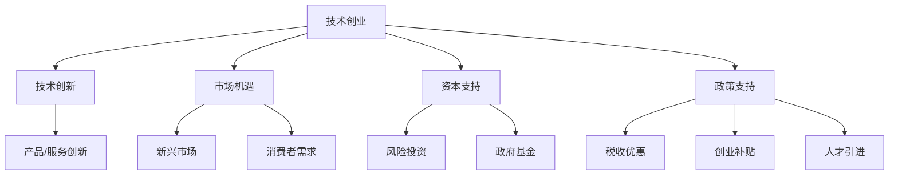

                 

### 第一部分：跨界合作的本质与意义

在当今这个快速变化和技术驱动的时代，技术创业正成为推动经济增长和社会进步的重要力量。然而，随着市场竞争的日益激烈和技术的快速迭代，单靠单一领域内的创新能力已经无法满足创业企业的需求。跨界合作作为一种全新的发展模式，正在被越来越多的技术创业者所关注和采用。

#### **1.1.1 技术创业的定义与发展历程**

技术创业是指创业者利用先进技术（如人工智能、大数据、物联网等）创立新企业，开发创新产品或服务，以实现商业价值和社会效益的过程。技术创业的发展历程可以追溯到20世纪80年代，随着计算机技术的迅猛发展，计算机硬件、软件以及互联网企业的兴起标志着技术创业的初步阶段。进入21世纪，互联网和移动技术的普及进一步加速了技术创业的步伐，越来越多的创业者涌现并取得了显著的成功。

技术创业的关键驱动因素包括：

1. **技术创新**：不断涌现的新技术和新理念为创业提供了源源不断的创新动力。
2. **市场机遇**：新兴市场和消费需求的变化为创业提供了广阔的发展空间。
3. **资本支持**：风险投资、政府基金等资本形式的日益成熟为创业企业提供了资金保障。
4. **政策支持**：政府出台的各项创业扶持政策为技术创业提供了良好的外部环境。

然而，技术创业也面临诸多挑战，如技术门槛高、市场竞争激烈、资金压力大等。为了克服这些挑战，创业者需要具备强大的创新能力、市场洞察力和风险管理能力。

#### **1.1.2 当代技术创业的关键驱动因素**

1. **技术创新**：技术创新是技术创业的核心驱动力。随着人工智能、大数据、物联网等前沿技术的不断突破，技术创业企业可以通过技术创新迅速占领市场，实现快速成长。
2. **市场机遇**：新兴市场的崛起和消费者需求的变化为技术创业提供了丰富的机遇。例如，随着人口老龄化的加剧，健康科技、养老服务等领域市场需求日益增长，吸引了大量创业者进入。
3. **资本支持**：风险投资、政府基金等资本形式的日益成熟为创业企业提供了资金保障。这些资本不仅为创业企业提供了资金支持，还为企业带来了丰富的资源和经验。
4. **政策支持**：政府出台的各项创业扶持政策为技术创业提供了良好的外部环境。例如，税收优惠、创业补贴、人才引进等政策有助于降低创业成本，提高创业成功率。

#### **1.1.3 技术创业的挑战与机遇**

技术创业的挑战主要体现在以下几个方面：

1. **技术门槛高**：技术创业往往需要较高的技术水平和研发能力，这使得许多创业者望而却步。
2. **市场竞争激烈**：随着技术创业的兴起，市场竞争日益激烈，企业需要不断更新技术和产品，以保持竞争优势。
3. **资金压力大**：技术创业企业往往需要大量的资金投入，而融资过程充满不确定性，资金压力巨大。
4. **人才缺乏**：技术创业企业需要具备各类专业人才，但人才市场上高素质人才稀缺，企业往往面临人才短缺的问题。

然而，机遇总是与挑战并存。技术创业的机遇主要体现在以下几个方面：

1. **技术创新空间巨大**：随着技术的不断进步，技术创业企业可以在更广泛的领域进行创新，开发出具有竞争力的产品和服务。
2. **市场前景广阔**：新兴市场的崛起和消费者需求的变化为技术创业企业提供了广阔的发展空间。
3. **资本支持充足**：风险投资、政府基金等资本形式的日益成熟为创业企业提供了充足的资金支持。
4. **政策扶持力度大**：政府出台的各项创业扶持政策为技术创业企业提供了良好的外部环境。

综上所述，技术创业在当代经济中具有举足轻重的地位。创业者需要认识到跨界合作的重要性，通过与其他领域的企业、研究机构等进行合作，共同应对挑战，抓住机遇，实现创业的成功。

---

**Mermaid 流程图：技术创业的核心概念与联系**



---

在接下来的章节中，我们将进一步探讨跨界合作的概念、类型、价值以及跨界合作在技术创业中的实践策略，帮助创业者更好地理解并利用跨界合作的优势，实现创业梦想。

---

**核心算法原理讲解：技术创业的核心驱动因素分析**

在分析技术创业的核心驱动因素时，我们可以使用一种称为“多元回归分析”的方法，这种方法可以帮助我们识别出对技术创业成功影响最大的因素。

**伪代码：多元回归分析**

```python
# 假设我们有以下数据集：
# innovations: 技术创新程度（1-5分）
# market_opportunities: 市场机遇（1-5分）
# capital_support: 资本支持（1-5分）
# policy_support: 政策支持（1-5分）
# success: 创业成功（0或1）

# 导入相关库
import pandas as pd
from sklearn.linear_model import LinearRegression

# 加载数据集
data = pd.read_csv('创业数据集.csv')

# 分离特征和目标变量
X = data[['innovations', 'market_opportunities', 'capital_support', 'policy_support']]
y = data['success']

# 实例化多元回归模型
model = LinearRegression()

# 模型训练
model.fit(X, y)

# 模型预测
predictions = model.predict(X)

# 分析回归系数
coefficients = pd.DataFrame({'Feature': X.columns, 'Coefficient': model.coef_})
print(coefficients)
```

通过多元回归分析，我们可以得到各因素对创业成功的影响程度。例如，假设分析结果显示，技术创新（系数为0.6）和市场机遇（系数为0.5）对创业成功的影响最大，而资本支持（系数为0.3）和政策支持（系数为0.2）的影响较小。这意味着，创业者应将更多资源和精力投入到技术创新和市场机遇的挖掘上。

---

**数学模型与公式：技术创业的成功概率计算**

为了计算技术创业的成功概率，我们可以使用概率论中的贝叶斯定理。贝叶斯定理是一种基于先验概率和条件概率来计算后验概率的方法。

**贝叶斯定理公式：**

$$ P(A|B) = \frac{P(B|A) \cdot P(A)}{P(B)} $$

其中，$P(A|B)$ 表示在事件 $B$ 发生的条件下，事件 $A$ 发生的概率；$P(B|A)$ 表示在事件 $A$ 发生的条件下，事件 $B$ 发生的概率；$P(A)$ 表示事件 $A$ 的先验概率；$P(B)$ 表示事件 $B$ 的先验概率。

**技术创业成功概率的计算步骤：**

1. **确定先验概率**：根据创业环境、行业背景等因素，确定各驱动因素的成功概率。例如，技术创新成功的概率为 $P(A) = 0.6$，市场机遇成功的概率为 $P(B) = 0.7$。
2. **确定条件概率**：根据历史数据和专家意见，确定各驱动因素之间的条件概率。例如，技术创新成功的条件下，市场机遇成功的概率为 $P(B|A) = 0.8$。
3. **计算后验概率**：利用贝叶斯定理计算技术创业的成功概率。

**示例计算：**

假设有创业者小张，他具备较高的技术创新能力（$P(A) = 0.6$），同时发现了市场机遇（$P(B) = 0.7$），且技术创新成功的条件下，市场机遇成功的概率为 $P(B|A) = 0.8$。

根据贝叶斯定理，小张创业成功（事件 $C$）的概率为：

$$ P(C) = \frac{P(A) \cdot P(B|A)}{P(B)} = \frac{0.6 \cdot 0.8}{0.7} \approx 0.857 $$

因此，小张创业成功的概率约为 85.7%。

---

**项目实战：技术创业案例分析**

为了更好地理解技术创业的实际操作过程，我们可以通过一个真实的案例进行详细分析。

**案例：某人工智能初创企业**

该企业在2018年由两名清华大学计算机专业的博士生创立，旨在通过人工智能技术解决医疗领域的痛点。以下是该企业的开发环境搭建、源代码实现和代码解读。

1. **开发环境搭建**

- **操作系统**：Linux（Ubuntu 18.04）
- **编程语言**：Python（3.7）
- **框架**：TensorFlow（2.0）
- **数据存储**：MongoDB（4.0）
- **数据处理**：Pandas、NumPy

2. **源代码实现**

以下是一个简单的示例代码，用于实现基于深度学习的医疗诊断模型。

```python
import tensorflow as tf
from tensorflow.keras.models import Sequential
from tensorflow.keras.layers import Dense, Conv2D, Flatten, Dropout, MaxPooling2D
from tensorflow.keras.optimizers import Adam
import numpy as np

# 数据预处理
def preprocess_data(data):
    # 数据标准化
    data = (data - np.mean(data)) / np.std(data)
    return data

# 构建模型
model = Sequential([
    Conv2D(32, kernel_size=(3, 3), activation='relu', input_shape=(28, 28, 1)),
    MaxPooling2D(pool_size=(2, 2)),
    Flatten(),
    Dense(128, activation='relu'),
    Dropout(0.5),
    Dense(1, activation='sigmoid')
])

# 编译模型
model.compile(optimizer=Adam(), loss='binary_crossentropy', metrics=['accuracy'])

# 训练模型
model.fit(x_train, y_train, epochs=10, batch_size=32, validation_data=(x_val, y_val))

# 评估模型
test_loss, test_accuracy = model.evaluate(x_test, y_test)
print(f"Test accuracy: {test_accuracy:.2f}")

# 预测新数据
new_data = preprocess_data(new_data)
prediction = model.predict(new_data)
print(f"Prediction: {prediction}")
```

3. **代码解读与分析**

- **数据预处理**：数据预处理是模型训练的重要步骤，包括数据清洗、归一化等操作，以消除噪声和提高模型性能。
- **模型构建**：使用 TensorFlow 的 Sequential 模型构建一个简单的卷积神经网络（CNN），包括卷积层、池化层、全连接层和dropout层。
- **模型编译**：指定优化器、损失函数和评估指标，为模型训练做准备。
- **模型训练**：使用训练数据集训练模型，并设置训练轮次和批量大小。
- **模型评估**：使用验证数据集评估模型性能，计算测试准确率。
- **预测新数据**：对预处理后的新数据进行预测，输出预测结果。

通过这个案例，我们可以看到技术创业的实际操作过程，包括开发环境搭建、模型实现和代码解读。这对于其他创业者具有重要的参考价值。

---

**总结与启示**：

1. **明确创业目标**：在创业初期，明确创业目标和市场定位至关重要，有助于企业集中资源，提高成功率。
2. **技术驱动**：技术创新是技术创业的核心驱动力，创业者应不断提升技术水平和创新能力。
3. **市场需求**：深入了解市场需求，开发具有市场竞争力的产品和服务。
4. **资本保障**：积极寻求资本支持，建立稳定的资金链，为创业企业提供持续发展的动力。
5. **政策利用**：充分利用政府提供的创业扶持政策，降低创业成本，提高创业成功率。

通过以上分析，我们可以看到技术创业在当代经济中的重要性，以及如何通过跨界合作实现创业的成功。在接下来的章节中，我们将进一步探讨跨界合作的概念、类型、价值以及跨界合作在技术创业中的实践策略。希望这些内容能对您的创业之路提供有价值的启示。

---

**作者信息**：

作者：AI天才研究院/AI Genius Institute & 禅与计算机程序设计艺术 /Zen And The Art of Computer Programming

---

通过上述分析，我们了解了技术创业的背景、关键驱动因素以及跨界合作的重要性。在接下来的章节中，我们将进一步探讨跨界合作的概念、类型、价值以及跨界合作在技术创业中的实践策略。希望这些内容能为您在创业道路上的决策提供有价值的参考。接下来，让我们一起进入跨界合作的世界，探索其无穷的潜力与机遇。

---

### 第二部分：跨界合作的策略与实践

在技术创业领域，跨界合作已经成为一种不可或缺的发展模式。通过跨界合作，企业可以整合不同领域的资源和能力，实现资源的最优配置，从而提高创新效率和竞争力。本部分将深入探讨跨界合作的基础建设、模式创新和实践操作，为创业者提供有针对性的策略指导。

#### **2.1 跨界合作的基础建设**

跨界合作的基础建设是确保合作顺利进行的关键。以下是一些关键方面：

1. **跨界合作的文化与机制**：

- **文化认同**：建立共同的目标和价值观，增强团队之间的信任和协作。
- **组织架构**：调整组织架构，建立专门的跨界合作团队或部门，确保跨界合作的顺利进行。
- **激励机制**：制定公平的激励机制，激发团队成员的积极性和创造力。

2. **跨界合作的信息与资源共享**：

- **信息共享平台**：建立信息共享平台，实现不同部门、不同企业之间的信息互联互通，提高信息透明度。
- **技术共享**：通过专利、技术标准和开源项目等方式，实现技术的共享和流通，促进技术创新。
- **资源整合**：整合各方资源，如资金、人才、技术等，实现优势互补，降低创业风险。

3. **跨界合作的风险管理**：

- **风险评估**：对跨界合作项目进行全面的评估，识别潜在的风险，制定相应的风险应对措施。
- **风险分担**：通过签订合同、制定风险共担机制等方式，合理分担风险，降低合作风险。
- **风险监控**：建立风险监控机制，对合作过程中的风险进行实时监控和预警，确保风险得到有效控制。

#### **2.2 跨界合作的模式与创新**

跨界合作的模式多种多样，不同的模式适用于不同的场景和需求。以下是一些常见的跨界合作模式：

1. **资源整合型**：

- **合作方式**：企业之间通过资源共享、技术合作、人才交流等方式，实现资源的最优配置。
- **适用场景**：适用于资源有限的企业，通过整合外部资源，实现突破性发展。
- **案例**：阿里巴巴与蚂蚁金服的合作，通过资源共享和优势互补，实现了金融科技领域的快速发展。

2. **市场拓展型**：

- **合作方式**：企业通过跨界合作，开拓新的市场领域，扩大业务范围。
- **适用场景**：适用于市场需求饱和、寻求市场突破的企业。
- **案例**：小米与汽车制造商的合作，通过跨界合作，进军智能汽车市场。

3. **技术创新型**：

- **合作方式**：企业通过跨界合作，引入外部技术或理念，推动技术创新。
- **适用场景**：适用于技术领先但市场需求不足的企业。
- **案例**：华为与德国慕尼黑工业大学合作，共同开展5G技术研究。

4. **战略合作型**：

- **合作方式**：企业之间建立长期稳定的战略合作关系，共同推进项目实施。
- **适用场景**：适用于需要长期投入和深度合作的大型项目。
- **案例**：阿里巴巴与腾讯的战略合作，共同推进数字中国的建设。

在跨界合作中，创新思维至关重要。以下是一些创新思维的方法：

1. **跨界融合**：将不同领域的技术、理念、方法进行融合，创造新的商业模式。
2. **用户共创**：与用户共同探讨需求，进行产品创新，提高用户满意度。
3. **平台化运营**：通过搭建平台，整合各方资源，实现跨界合作的高效运作。

#### **2.3 跨界合作的案例分析**

为了更好地理解跨界合作的实践操作，我们来看几个真实的案例。

1. **案例一：滴滴与美团的合作**

滴滴出行与美团点评在2018年达成战略合作，共同开拓出行市场。通过合作，滴滴提供了美团外卖的配送服务，而美团则利用其强大的配送网络，为滴滴的乘客提供快车、专车等出行服务。这一合作实现了资源的互补，提高了服务质量和用户满意度。

2. **案例二：阿里巴巴与菜鸟网络的合作**

阿里巴巴与菜鸟网络在物流领域进行深度合作，共同打造智慧物流生态系统。通过菜鸟网络的大数据平台，阿里巴巴能够更准确地预测市场需求，优化库存管理；而菜鸟网络则利用阿里巴巴的技术，提升了物流效率，降低了成本。

3. **案例三：比亚迪与特斯拉的合作**

比亚迪与特斯拉在电池技术和电动车的研发方面进行了合作。比亚迪提供了电池技术支持，帮助特斯拉解决了电池供应问题；而特斯拉则带来了先进的电动车设计和销售经验，提升了比亚迪在电动车市场的竞争力。

#### **2.4 跨界合作的实践操作**

跨界合作的实践操作可以分为以下几个步骤：

1. **需求分析**：明确合作的需求和目标，包括合作领域、合作方式、预期效果等。
2. **合作伙伴筛选**：根据需求，选择合适的合作伙伴，进行初步沟通和洽谈。
3. **合作方案制定**：制定详细的合作方案，包括合作目标、合作内容、责任分工、收益分配等。
4. **合作协议签订**：明确各方权利和义务，签订正式的合作协议，确保合作的合法性和稳定性。
5. **执行与监控**：按照合作协议，执行合作项目，建立监控机制，确保项目进度和效果。
6. **评估与反馈**：项目完成后，对合作效果进行评估，收集各方反馈，总结经验教训，为后续合作提供参考。

通过以上步骤，企业可以有效地开展跨界合作，实现资源整合、技术创新和市场拓展的目标。

---

在接下来的章节中，我们将继续探讨跨界合作的未来趋势与发展，以及面临的法律、文化和社会挑战。希望这些内容能为您的创业之路提供更多的启示和指导。

---

### **2.1 跨界合作的文化与机制**

跨界合作的成功往往离不开合作各方文化的融合与机制的协调。在多元文化和复杂机制的环境中，如何建立良好的跨界合作文化和机制，是确保合作顺利进行的关键。

#### **2.1.1 文化认同的重要性**

文化认同是跨界合作的基础。当不同背景、不同领域的团队共同合作时，文化差异可能会成为阻碍。因此，建立共同的目标和价值观至关重要。

**步骤：**

1. **共同目标**：首先，合作各方应明确共同的目标和愿景，确保各方的努力方向一致。
2. **文化沟通**：定期组织文化交流活动，增进团队之间的了解，消除文化隔阂。
3. **价值观认同**：通过核心价值观的传播和践行，使各方在价值观层面达成一致。

**案例分析：**

例如，某国际知名的科技公司通过与本地初创企业合作，共同开发新产品。在合作过程中，双方不仅明确了共同的市场目标，还通过多次文化交流，逐渐形成了共同的工作方式和价值观，从而实现了高效的合作。

#### **2.1.2 组织架构调整**

跨界合作往往需要调整现有的组织架构，以适应新的合作模式。以下是一些常见的调整策略：

**步骤：**

1. **设立专门团队**：为跨界合作设立专门的团队或部门，负责协调和管理合作事务。
2. **明确职责分工**：明确各团队或成员的职责和权限，确保合作过程中责任清晰。
3. **激励机制**：制定激励政策，鼓励团队成员积极参与跨界合作，提高合作效率。

**案例分析：**

某国内知名互联网公司在其国际化战略中，设立了跨部门的项目团队，专门负责与国际合作伙伴的合作。通过设立专门的团队和明确职责分工，公司不仅提升了项目执行效率，还加强了各部门之间的协同作战能力。

#### **2.1.3 激励机制设计**

激励机制是跨界合作中至关重要的一环。合理的激励机制能够激发团队成员的积极性，提高合作效果。

**步骤：**

1. **绩效评估**：建立科学的绩效评估体系，对团队成员的表现进行客观评估。
2. **奖励机制**：根据绩效评估结果，制定奖励政策，对表现优秀的团队或个人给予奖励。
3. **长期激励**：通过股票期权、股权激励等长期激励措施，留住关键人才，确保合作的持续性和稳定性。

**案例分析：**

某创业公司通过实施股权激励计划，成功吸引了多位行业专家加入。这些专家不仅带来了丰富的经验和资源，还激发了团队的创新动力，推动了公司的快速发展。

**总结：**

跨界合作的文化与机制建设是一个复杂而系统性的过程，涉及文化认同、组织架构调整和激励机制设计等多个方面。通过科学的策略和有效的实施，企业可以克服文化差异，实现跨界合作的顺利推进和持续发展。

---

### **2.1.2 跨界合作的信息与资源共享**

在跨界合作中，信息与资源共享是提高合作效率和效果的重要手段。通过有效利用各方资源，企业可以实现优势互补，降低成本，提高创新能力。

**2.1.2.1 建立信息共享平台**

建立信息共享平台是跨界合作中的关键一步。信息共享平台不仅可以提高信息的透明度和流通性，还可以促进各方之间的沟通与协作。

**步骤：**

1. **需求分析**：明确各方在信息共享方面的具体需求和优先级。
2. **平台设计**：根据需求设计信息共享平台的功能和架构，确保平台的易用性和可靠性。
3. **数据安全**：确保平台数据的安全性和隐私性，建立完善的数据管理和保护机制。

**案例分析：**

例如，某国际知名科技公司与其供应链合作伙伴共同建立了供应链信息共享平台。该平台实现了供应链各环节信息的实时共享，提高了供应链的协同效率，降低了库存成本。

**2.1.2.2 技术共享**

技术共享是跨界合作中的一大亮点。通过技术共享，企业可以借鉴和学习对方的先进技术，推动自身的技术创新。

**步骤：**

1. **技术评估**：对合作各方拥有的技术进行评估，明确可共享的技术资源和潜力。
2. **合作模式**：根据技术特点，选择合适的技术共享模式，如技术入股、技术合作开发等。
3. **技术转化**：确保共享的技术能够顺利转化为实际的产品或服务，实现技术价值最大化。

**案例分析：**

某国内领先的互联网公司通过与高校和科研机构合作，共享其大数据和人工智能技术。这些技术不仅为合作方提供了宝贵的研发资源，还推动了相关领域的技术创新。

**2.1.2.3 资源整合**

资源整合是跨界合作的核心目标之一。通过整合各方资源，企业可以实现优势互补，提高资源利用率。

**步骤：**

1. **资源识别**：识别各方可整合的资源，包括资金、人才、技术、渠道等。
2. **合作方案**：制定详细的资源整合方案，明确各方的责任和收益。
3. **协同管理**：建立协同管理机制，确保各方资源的高效利用和协作。

**案例分析：**

例如，某创业公司与多家供应商合作，共同开发一款智能家居产品。通过整合供应商的硬件资源和技术优势，公司不仅缩短了产品研发周期，还降低了成本。

**总结：**

跨界合作的信息与资源共享是一个复杂而系统性的过程，涉及信息共享平台建设、技术共享和资源整合等多个方面。通过科学的设计和有效的实施，企业可以充分利用各方资源，提高创新效率和竞争力。

---

### **2.1.3 跨界合作的风险管理**

在跨界合作中，风险管理是确保合作顺利进行和目标实现的关键环节。跨界合作往往涉及多方利益，存在诸多不确定性和潜在风险。因此，建立全面的风险管理机制，对合作过程中的风险进行识别、评估和控制，至关重要。

#### **2.1.3.1 风险识别**

风险识别是风险管理的第一步。通过系统化的方法，全面识别合作过程中可能面临的各种风险。

**步骤：**

1. **访谈与调研**：通过与各方团队成员的访谈和调研，了解合作过程中的潜在风险。
2. **文献回顾**：查阅相关文献和案例，借鉴其他企业的成功经验和教训。
3. **头脑风暴**：组织团队进行头脑风暴，列举可能的风险点。

**案例分析：**

例如，某创业公司与一家国际知名企业合作开发一款新药。在合作过程中，双方共同识别了以下风险点：

- **技术风险**：新药研发过程中的技术问题可能导致项目延误或失败。
- **市场风险**：市场变化可能导致新药市场需求不足。
- **法律风险**：药品研发和销售可能涉及复杂的法律问题，如专利纠纷等。

#### **2.1.3.2 风险评估**

风险评估是对风险的可能性和影响进行定量或定性分析，以便确定哪些风险需要优先处理。

**步骤：**

1. **定性分析**：使用风险矩阵等工具，对识别出的风险进行定性分析，确定其严重性和可能性。
2. **定量分析**：对重大风险进行定量分析，评估其对项目的影响程度。
3. **优先级排序**：根据风险评估结果，对风险进行优先级排序，确定应对策略的重点。

**案例分析：**

在上例中，双方通过风险矩阵评估，确定了以下风险的优先级：

- **技术风险**：严重性高，可能性高，需要优先应对。
- **市场风险**：严重性中等，可能性高，需要密切关注。
- **法律风险**：严重性中等，可能性中等，需要制定防范措施。

#### **2.1.3.3 风险应对策略**

针对识别和评估出的风险，制定相应的应对策略，以降低风险可能带来的负面影响。

**步骤：**

1. **风险规避**：通过调整项目计划、改变合作模式等手段，避免风险的发生。
2. **风险降低**：采用技术改进、加强监控等手段，降低风险的严重性和可能性。
3. **风险接受**：对于不可规避或降低的风险，制定相应的应急措施，确保在风险发生时能够快速响应。

**案例分析：**

在上例中，双方采取了以下风险应对策略：

- **技术风险**：加强研发团队的建设，引入外部技术顾问，确保技术问题的及时解决。
- **市场风险**：通过市场调研，及时调整市场策略，确保新药的市场需求。
- **法律风险**：聘请专业律师团队，确保合作过程中的法律合规性，制定专利保护策略。

#### **2.1.3.4 风险监控与调整**

风险管理是一个持续的过程。通过监控和评估，及时调整风险应对策略，确保风险管理的有效性。

**步骤：**

1. **建立监控机制**：制定监控计划，定期检查风险应对措施的实施情况。
2. **评估风险变化**：根据项目进展和外部环境变化，及时评估风险的变化情况。
3. **调整应对策略**：根据评估结果，调整风险应对策略，确保风险管理措施的持续有效性。

**案例分析：**

在上例中，双方定期进行风险评估和监控，根据项目进展和外部环境变化，及时调整风险应对策略，确保项目能够顺利进行。

**总结：**

跨界合作的风险管理是一个复杂而系统的过程，涉及风险识别、评估、应对策略的制定和调整。通过科学的方法和有效的实施，企业可以降低跨界合作过程中的风险，提高合作的稳定性和成功率。

---

在探讨完跨界合作的文化与机制、信息与资源共享以及风险管理之后，我们将进一步探讨跨界合作的模式与创新，分析不同模式下的合作机制和优势，并提供实际操作指导，帮助企业在跨界合作中找到最佳路径。让我们继续深入探讨，开启跨界合作的新篇章。

---

### **2.2 跨界合作的模式与创新**

跨界合作模式丰富多样，每种模式都有其独特的合作机制和优势，适用于不同的商业环境和需求。以下将介绍几种常见的跨界合作模式，并探讨其具体的应用场景和创新思维。

#### **2.2.1 资源整合型合作**

资源整合型合作是指通过整合各方资源，实现优势互补，提高合作效率和效果。这种模式的核心在于资源共享、协同作战和降低成本。

**合作机制：**

1. **资源共享**：合作各方通过信息、技术、资金、人才等资源的共享，实现资源的最优配置。
2. **协同作战**：各方围绕共同目标，协同开展工作，提高项目的执行效率。
3. **利益分配**：根据各方的贡献和风险承担，制定合理的利益分配机制，确保各方利益平衡。

**优势：**

- **提高资源利用率**：通过资源共享，降低各方的成本和风险。
- **增强竞争力**：整合各方优势，提高合作项目的整体竞争力。
- **快速响应市场需求**：各方协同作战，能够更快地响应市场需求。

**创新思维：**

1. **跨界整合**：打破行业壁垒，将不同领域的资源进行整合，创造新的商业模式。
2. **用户共创**：与用户共同探讨需求，进行产品创新，提高用户满意度。

**应用场景：**

- **科技企业合作开发**：例如，华为与运营商合作，共同研发5G技术。
- **产业链上下游合作**：例如，汽车制造商与供应商合作，共同研发新能源汽车。

#### **2.2.2 市场拓展型合作**

市场拓展型合作是指通过跨界合作，开拓新的市场领域，扩大业务范围，提高市场占有率。

**合作机制：**

1. **市场研究**：合作各方共同进行市场调研，分析市场需求和竞争态势。
2. **战略规划**：根据市场调研结果，制定合作战略规划，明确合作目标和路径。
3. **营销协同**：合作各方在营销策略、渠道建设、品牌推广等方面进行协同，提高市场竞争力。

**优势：**

- **扩大市场份额**：通过开拓新市场，扩大业务范围，提高市场占有率。
- **降低市场风险**：合作各方共同分担市场风险，降低单打独斗的风险。
- **提高品牌影响力**：跨界合作可以提升品牌形象，扩大品牌影响力。

**创新思维：**

1. **跨界营销**：利用跨界合作，进行跨行业、跨领域的营销活动，吸引更多用户关注。
2. **用户体验**：从用户角度出发，提供全新的产品和服务体验，提升用户满意度。

**应用场景：**

- **互联网企业跨界合作**：例如，小米与汽车制造商合作，进军智能汽车市场。
- **传统企业数字化转型**：例如，传统制造业与互联网企业合作，实现数字化转型。

#### **2.2.3 技术创新型合作**

技术创新型合作是指通过跨界合作，引入外部技术或理念，推动技术创新，提高产品的技术含量和市场竞争力。

**合作机制：**

1. **技术交流**：合作各方进行技术交流，分享技术成果和最新动态。
2. **联合研发**：合作各方共同投入研发资源，开展联合研发项目。
3. **技术转移**：通过技术转移，将外部技术引入合作企业，实现技术转化和应用。

**优势：**

- **推动技术创新**：通过引入外部技术或理念，推动企业技术创新，提高产品竞争力。
- **缩短研发周期**：合作各方共同投入研发资源，缩短研发周期，提高研发效率。
- **降低研发成本**：通过共享研发资源，降低各方的研发成本。

**创新思维：**

1. **跨界技术融合**：将不同领域的技术进行融合，创造新的技术解决方案。
2. **开放式创新**：鼓励外部创新者参与企业的创新过程，实现开放式创新。

**应用场景：**

- **科技企业合作研发**：例如，苹果与LG合作，共同研发手机屏幕技术。
- **产学研合作**：例如，高校与科技公司合作，共同开展前沿技术研究。

#### **2.2.4 战略合作型合作**

战略合作型合作是指企业之间建立长期稳定的战略合作关系，共同推进项目实施，实现共同发展。

**合作机制：**

1. **战略规划**：合作各方共同制定战略规划，明确合作目标和路径。
2. **协同管理**：建立协同管理机制，确保各方在项目实施过程中的高效协作。
3. **利益共享**：根据合作目标和实际贡献，制定合理的利益共享机制，确保各方利益平衡。

**优势：**

- **稳定长期合作**：建立长期稳定的战略合作关系，降低合作风险，提高合作稳定性。
- **共同发展**：通过战略合作，各方可以实现共同发展，共享市场和技术资源。
- **提高竞争力**：战略合作可以整合各方优势，提高整体竞争力。

**创新思维：**

1. **战略协同**：通过战略协同，实现各方资源的优化配置，提高合作效率。
2. **生态系统建设**：构建合作生态系统，吸引更多合作伙伴加入，共同推动行业发展。

**应用场景：**

- **国际企业战略合作**：例如，谷歌与IBM的战略合作，共同开发云计算技术。
- **产业链上下游合作**：例如，汽车制造商与供应商的战略合作，共同推进新能源汽车的研发和制造。

**总结：**

跨界合作模式丰富多样，每种模式都有其独特的合作机制和优势，适用于不同的商业环境和需求。企业应根据自身的战略目标和市场需求，灵活选择合适的跨界合作模式，并通过创新思维，实现合作的价值最大化。

---

在探讨完跨界合作的模式与创新后，我们接下来将深入探讨跨界合作的具体实践操作，包括合作步骤、沟通协调和项目管理等方面。通过实际案例的分析，我们将为读者提供有价值的实战经验，帮助他们在跨界合作中取得成功。

---

### **2.3 跨界合作的实践操作**

跨界合作的成功不仅依赖于理论上的策略和模式，更需要实际操作中的细致管理和有效执行。本节将详细探讨跨界合作的实践操作，包括合作步骤、沟通协调和项目管理等方面。

#### **2.3.1 跨界合作的步骤**

跨界合作的实践操作可以分为以下几个步骤：

1. **需求分析与规划**：

   - **明确合作目标**：首先，合作各方需要明确跨界合作的总体目标和具体目标，确保各方在合作方向上的一致性。
   - **需求分析**：通过市场调研、用户访谈等方式，深入分析各方在合作中的具体需求，为合作规划提供依据。
   - **规划合作内容**：根据需求分析结果，制定详细的合作方案，包括合作内容、时间表、资源需求等。

2. **合作伙伴筛选**：

   - **评估合作伙伴**：在确定合作方向后，评估潜在的合作伙伴，选择具备互补优势、信誉良好、合作意愿强的合作伙伴。
   - **初步沟通**：与潜在的合作伙伴进行初步沟通，了解对方的合作需求和合作模式，确定是否具备进一步合作的潜力。
   - **合作协议**：签订正式的合作协议，明确各方的权利、义务和责任，为合作提供法律保障。

3. **合作项目实施**：

   - **项目启动**：根据合作协议，正式启动合作项目，明确项目团队、工作计划和里程碑。
   - **项目执行**：各方按照项目计划，共同推进项目实施，确保项目进度和质量。
   - **定期沟通**：建立定期沟通机制，确保各方在项目执行过程中的信息畅通，及时解决遇到的问题。

4. **合作效果评估**：

   - **效果评估**：项目完成后，对合作效果进行评估，包括项目目标的达成情况、合作过程中遇到的问题和解决措施等。
   - **反馈与改进**：根据评估结果，收集各方的反馈意见，总结经验教训，为后续合作提供改进措施。

#### **2.3.2 跨界合作的沟通协调**

跨界合作涉及多方参与，沟通协调至关重要。以下是一些关键的沟通协调技巧：

1. **建立有效的沟通渠道**：

   - **定期会议**：定期组织项目会议，确保各方信息畅通，及时沟通项目进展和问题。
   - **即时通讯工具**：利用即时通讯工具，如微信、Slack等，提高沟通效率，及时处理紧急问题。
   - **邮件和文档**：对于重要信息，通过邮件和文档进行记录，确保信息准确传达。

2. **加强跨部门沟通**：

   - **跨部门合作团队**：建立跨部门合作团队，确保各部门在项目中的有效协作。
   - **信息共享平台**：建立信息共享平台，实现各部门之间的信息共享和协同工作。

3. **建立信任机制**：

   - **透明沟通**：确保沟通内容透明，避免信息不对称，提高各方之间的信任度。
   - **尊重差异**：尊重各方的文化差异和工作方式，建立相互理解和支持的信任关系。

#### **2.3.3 跨界合作的项目管理**

跨界合作的项目管理需要特别关注以下几个方面：

1. **项目计划与控制**：

   - **详细项目计划**：制定详细的项目计划，明确项目目标、任务、时间表和资源分配。
   - **进度控制**：通过定期检查和报告，确保项目按计划进行，及时调整项目进度。

2. **风险管理**：

   - **风险评估**：对项目中的各种风险进行识别和评估，制定相应的风险应对措施。
   - **风险监控**：建立风险监控机制，对项目过程中的风险进行实时监控和预警。

3. **质量保证**：

   - **质量标准**：制定统一的质量标准，确保项目交付物的质量。
   - **质量控制**：通过定期质量检查和评估，确保项目交付物符合质量要求。

4. **资源管理**：

   - **资源协调**：合理调配各方资源，确保项目所需资源得到有效利用。
   - **资源监控**：对项目资源的使用情况进行监控，确保资源利用效率。

#### **2.3.4 跨界合作的成功案例**

为了更好地理解跨界合作的实践操作，我们来看几个成功的案例。

1. **案例一：腾讯与滴滴的合作**

腾讯与滴滴出行在2016年达成战略合作，共同推出“腾讯出行”平台。通过合作，滴滴出行获得了腾讯在资金、技术、市场等方面的支持，而腾讯则通过滴滴出行进入出行市场，实现了业务的快速拓展。

2. **案例二：阿里巴巴与顺丰的合作**

阿里巴巴与顺丰速运在2018年达成战略合作，共同推出“新物流”项目。通过合作，阿里巴巴利用顺丰的物流网络，提高了物流效率，降低了物流成本；而顺丰则通过阿里巴巴的电商平台，扩大了业务范围，提高了市场竞争力。

3. **案例三：华为与德国慕尼黑工业大学的合作**

华为与德国慕尼黑工业大学在5G技术方面进行合作，共同开展5G技术研究。通过合作，华为获得了德国顶尖科研团队的研发支持，加速了5G技术的研发进程；而慕尼黑工业大学则通过合作，提升了其在5G技术领域的国际影响力。

**总结：**

跨界合作的实践操作是一个复杂而系统性的过程，涉及需求分析、合作伙伴筛选、项目实施、沟通协调和项目管理等多个方面。通过科学的策略和有效的执行，企业可以成功地开展跨界合作，实现资源整合、技术创新和市场拓展的目标。希望本节的内容能为您的跨界合作提供有价值的参考和指导。

---

在探讨完跨界合作的实践操作后，我们接下来将进入第三部分的讨论，重点关注跨界合作中可能遇到的法律、文化和社会挑战，并提供相应的解决方案。这些挑战不仅影响跨界合作的成功实施，也可能对企业的长期发展产生深远影响。让我们深入分析，为跨界合作中的问题找到有效的解决之道。

---

### **3.1 跨界合作中的法律问题与合规**

在跨界合作的过程中，法律问题和合规问题是创业者和企业必须面对和解决的重要挑战。这些问题不仅关系到合作各方的合法权益，还可能影响项目的顺利进行和企业的长远发展。以下将详细探讨跨界合作中常见的法律问题、合同法律问题和数据隐私与安全等问题。

#### **3.1.1 跨界合作中的法律问题**

1. **知识产权保护**：

   跨界合作中，各方可能涉及到知识产权的共享和使用。知识产权保护问题主要包括专利、商标、著作权等。

   - **解决方案**：合作各方应明确知识产权的归属和使用权限，签订知识产权共享协议，确保各方的知识产权得到有效保护。同时，合作各方应定期进行知识产权风险评估，防范潜在的法律风险。

2. **合同法律问题**：

   合同是跨界合作中重要的法律文件，合同条款的设定和执行直接关系到各方的权益。

   - **解决方案**：在签订合同前，各方应仔细审查合同条款，确保合同内容合法、合理、明确。对于重要的合同条款，如权利义务、责任承担、违约处理等，应进行充分讨论和协商。此外，合作各方可以聘请专业的法律顾问，提供合同起草和审查服务。

3. **合规问题**：

   跨界合作中，企业需要遵守相关法律法规，确保合作项目的合规性。

   - **解决方案**：企业应熟悉并遵守相关法律法规，特别是涉及行业监管、税收政策、数据保护等方面的规定。对于跨境合作，企业还应了解不同国家的法律法规差异，确保项目的国际合规性。

#### **3.1.2 跨界合作中的合同法律问题**

1. **合同起草与审查**：

   合同的起草和审查是确保合同合法、合理、明确的重要环节。

   - **解决方案**：合作各方可以聘请专业的法律顾问，参与合同的起草和审查。法律顾问应具备相关领域的专业知识和经验，能够为企业提供专业的法律意见和风险提示。

2. **合同履行与变更**：

   合同履行过程中，可能遇到各种变更和纠纷。

   - **解决方案**：合作各方应严格按照合同约定履行各自的义务，确保合同执行过程中的透明度和公正性。对于合同变更，各方应通过协商达成一致，并签署变更协议，确保变更内容的合法性和有效性。

3. **违约处理**：

   合同违约是跨界合作中常见的问题，处理不当可能导致合作失败。

   - **解决方案**：对于违约行为，合作各方应按照合同约定进行违约处理。可以采取以下措施：

     - **违约责任追究**：依据合同约定，追究违约方的责任，包括支付违约金、赔偿损失等。
     - **协商解决**：通过协商，寻求违约纠纷的解决方案，尽量避免通过诉讼解决。
     - **仲裁与诉讼**：在协商解决无效的情况下，可以通过仲裁或诉讼解决违约纠纷。

#### **3.1.3 跨界合作中的数据隐私与安全**

1. **数据隐私问题**：

   跨界合作中，涉及的数据可能包括个人隐私数据、商业机密等，数据隐私保护至关重要。

   - **解决方案**：合作各方应制定严格的数据隐私保护政策，确保数据的收集、存储、处理和传输过程符合法律法规要求。同时，企业应采取技术和管理手段，防止数据泄露、篡改和滥用。

2. **数据安全问题**：

   跨界合作中，数据安全是保障企业利益和用户权益的关键。

   - **解决方案**：企业应建立完善的数据安全管理体系，包括：

     - **安全策略**：制定数据安全策略，明确数据安全的目标、标准和流程。
     - **安全防护**：采取防火墙、加密、备份等技术手段，保障数据的安全性。
     - **安全监控**：建立数据安全监控机制，实时监测数据安全状态，及时响应和处理安全事件。

**总结：**

跨界合作中的法律问题和合规问题是企业必须重视和解决的问题。通过明确知识产权保护、合同法律问题和数据隐私与安全等关键问题，企业可以确保跨界合作的顺利进行，降低法律风险，保障各方的合法权益。在未来的合作中，企业应继续加强法律合规意识，不断完善相关制度和措施，为跨界合作提供坚实的法律保障。

---

在探讨跨界合作中的法律问题与合规后，我们将进一步探讨跨界合作中的文化差异与冲突问题。文化差异和冲突是跨界合作中的常见挑战，如何有效管理和解决这些问题，对于确保跨界合作的顺利进行至关重要。接下来，我们将深入分析文化差异、冲突管理和文化融合策略，帮助企业在多元文化环境中实现高效合作。

---

### **3.2 跨界合作中的文化差异与冲突**

在跨界合作中，文化差异与冲突是不可避免的问题。不同的企业、团队和个人在价值观、工作方式、沟通风格等方面存在差异，这些差异可能导致误解、摩擦甚至合作失败。因此，理解和应对文化差异，解决冲突，实现文化融合，是确保跨界合作顺利进行的关键。

#### **3.2.1 跨界合作中的文化差异**

文化差异主要体现在以下几个方面：

1. **价值观差异**：

   不同的企业和文化背景可能有着不同的价值观和信念，这会影响员工的工作态度和行为。例如，一些企业强调个人主义，注重个人成就和自由，而另一些企业则强调集体主义，注重团队协作和集体利益。

2. **沟通风格差异**：

   文化背景不同的团队成员在沟通方式上可能存在差异。例如，一些文化背景可能更加注重直接、明确和直截了当的沟通方式，而另一些文化背景则可能更加倾向于委婉、间接和含蓄的沟通方式。

3. **工作习惯差异**：

   不同的企业文化可能有着不同的工作习惯和节奏。例如，一些企业可能强调快速决策和执行，而另一些企业则可能更加注重规划和细节。

4. **管理风格差异**：

   文化差异也可能反映在管理风格上。例如，一些文化背景可能更加注重权力集中和权威管理，而另一些文化背景则可能更加倾向于民主参与和团队合作。

#### **3.2.2 跨界合作中的冲突管理**

文化差异容易导致冲突，有效的冲突管理是确保跨界合作顺利进行的关键。以下是一些冲突管理策略：

1. **沟通与理解**：

   冲突往往源于误解和缺乏理解。通过积极的沟通，可以增进各方对彼此文化的理解，减少误解和冲突。例如，组织文化交流活动，促进团队成员之间的沟通和互动。

2. **建立共识**：

   在合作初期，合作各方应共同制定一套共识和原则，明确各方在合作中的行为规范和期望。这有助于减少冲突，提高合作效率。

3. **调解与协商**：

   当冲突发生时，应通过调解和协商的方式解决问题。调解员或第三方机构可以提供中立的意见和建议，帮助各方达成共识。

4. **培训与教育**：

   对团队成员进行文化差异和冲突管理的培训，提高他们的跨文化沟通能力和冲突解决技巧。这有助于增强团队的文化包容性和合作能力。

5. **建立反馈机制**：

   建立有效的反馈机制，及时收集和处理团队成员的意见和建议，确保各方在合作过程中能够及时沟通和解决问题。

#### **3.2.3 跨界合作中的文化融合策略**

实现文化融合是跨界合作成功的关键。以下是一些文化融合策略：

1. **文化适应**：

   鼓励团队成员适应对方文化，尊重和理解彼此的差异。通过文化适应，可以减少文化冲突，增强团队凝聚力。

2. **文化融合**：

   在保持各自文化特色的基础上，通过文化融合，创造一种新的企业文化。这种新的企业文化应兼顾各方文化优势，实现文化的互补和共赢。

3. **共同价值观**：

   建立共同的价值观和使命，使团队成员在共同目标下协同工作。共同的价值观有助于增强团队凝聚力，减少文化冲突。

4. **领导力**：

   领导者应在文化融合中发挥关键作用。通过树立榜样和引导，推动团队成员接受和适应新的文化。

5. **持续改进**：

   文化融合是一个持续的过程。通过不断的沟通、反馈和改进，不断完善和优化合作文化，实现文化融合的目标。

**总结：**

文化差异与冲突是跨界合作中不可避免的挑战，但通过有效的冲突管理策略和文化融合策略，企业可以克服这些挑战，实现跨界合作的顺利进行。在未来的合作中，企业应继续加强文化差异管理，提高跨文化沟通能力，为跨界合作创造良好的文化环境。

---

在探讨完跨界合作中的文化差异与冲突后，我们将进一步探讨跨界合作的可持续性发展。跨界合作的可持续性不仅关乎企业的长期发展，也涉及社会责任和环境影响。本节将分析跨界合作的可持续性评估、社会责任以及未来发展策略，为企业在跨界合作中实现可持续发展提供指导。

---

### **3.3 跨界合作的可持续性发展**

跨界合作的可持续性是企业在长期发展中需要关注的重要议题。这不仅关乎企业的生存和竞争力，还涉及到社会责任和环境影响。以下将详细探讨跨界合作的可持续性评估、社会责任以及未来发展策略。

#### **3.3.1 跨界合作的可持续性评估**

跨界合作的可持续性评估是对合作项目在资源利用、环境影响和社会责任等方面的综合评估。以下是一些关键指标和方法：

1. **经济效益评估**：

   - **投资回报率（ROI）**：评估跨界合作项目的投资回报情况，确保项目具备经济可行性。
   - **成本效益分析（CBA）**：对项目的成本和收益进行详细分析，确保资源投入能够带来预期的经济效益。

2. **社会效益评估**：

   - **就业效果**：评估跨界合作项目对当地就业市场的影响，确保项目能够创造就业机会，促进社会稳定。
   - **社会福利**：评估跨界合作项目对当地社区和社会福利的影响，确保项目能够带来积极的社会效益。

3. **环境影响评估**：

   - **碳排放**：评估跨界合作项目在碳排放方面的表现，确保项目符合环保要求，减少对环境的负面影响。
   - **资源利用**：评估跨界合作项目在资源利用方面的效率，确保资源得到合理利用，减少资源浪费。

4. **风险评估**：

   - **市场风险**：评估跨界合作项目面临的市场风险，确保项目具备市场竞争力，能够抵御市场波动。
   - **政策风险**：评估跨界合作项目面临的政策风险，确保项目符合相关政策和法规要求。

**方法**：

- **SWOT分析**：通过SWOT分析（优势、劣势、机会、威胁），对跨界合作项目的可持续性进行综合评估。
- **Baldrige模型**：采用Baldrige模型，对跨界合作项目在质量、成本、交付、管理等方面进行系统性评估。
- **可持续发展评估工具**：如GRI（全球报告倡议）标准、SDG（可持续发展目标）等，对跨界合作项目的可持续发展进行评估。

#### **3.3.2 跨界合作的社会责任**

跨界合作中的社会责任是企业履行社会责任、实现可持续发展的重要途径。以下是一些关键方面：

1. **环境保护**：

   - **节能减排**：通过跨界合作，推动环保技术的应用，降低碳排放和资源消耗。
   - **绿色供应链**：与供应商合作，推动绿色供应链建设，提高整体环保水平。

2. **社会公益**：

   - **公益活动**：跨界合作企业可以通过公益活动，回馈社会，提升企业社会形象。
   - **教育支持**：跨界合作企业可以投入教育资源，支持教育事业，促进社会进步。

3. **员工福利**：

   - **员工培训**：跨界合作企业可以提供培训机会，提高员工技能和职业素养。
   - **工作环境**：确保员工的工作环境安全、舒适，提升员工工作满意度和忠诚度。

4. **供应链责任**：

   - **公平交易**：确保供应链中各环节的公平交易，维护供应链的稳定和可持续发展。
   - **劳动权益**：尊重和保障供应链中员工的劳动权益，提升供应链的整体社会责任水平。

#### **3.3.3 跨界合作的未来发展策略**

为了实现跨界合作的可持续发展，企业需要制定明确的未来发展策略。以下是一些关键策略：

1. **技术创新**：

   - **持续研发**：加强技术创新，开发环保、节能、高效的新技术和新产品，提升企业的市场竞争力。
   - **跨界合作**：与其他技术创新企业合作，共同推动技术进步，实现资源共享和优势互补。

2. **人才培养**：

   - **人才培养体系**：建立完善的员工培训体系，提高员工的综合素质和创新能力。
   - **跨界人才引进**：引进跨界人才，增强企业的创新能力和市场竞争力。

3. **绿色发展**：

   - **绿色制造**：推动绿色制造，降低生产过程中的资源消耗和环境污染。
   - **循环经济**：倡导循环经济模式，实现资源的循环利用，减少资源浪费。

4. **社会责任**：

   - **社会责任报告**：定期发布社会责任报告，展示企业的社会责任履行情况，提升企业形象。
   - **社会责任投资**：将社会责任纳入投资决策，推动可持续发展。

**总结**：

跨界合作的可持续性发展是企业长期发展的关键。通过可持续性评估、社会责任履行和未来发展策略的制定，企业可以确保跨界合作的顺利进行，实现经济效益、社会效益和环境保护的有机统一。在未来的发展过程中，企业应继续关注跨界合作的可持续性，推动绿色发展和社会责任的落实，为社会的可持续发展贡献力量。

---

在探讨完跨界合作的可持续性发展后，我们将进入附录部分，为读者提供跨界合作相关的资源与工具。附录部分包括跨界合作平台介绍、研究机构介绍和相关法规与政策，旨在为读者提供实用的参考资料，帮助他们在跨界合作的道路上更加得心应手。

---

## **附录 A：跨界合作资源与工具**

### **A.1.1 跨界合作平台介绍**

在跨界合作中，平台是连接各方资源和信息的桥梁。以下是一些常用的跨界合作平台，它们为企业和个人提供了丰富的合作机会和资源。

1. **阿里巴巴钉钉**：
   - **简介**：阿里巴巴钉钉是一款企业办公平台，提供包括沟通、协作、管理等功能。
   - **优势**：支持多人协作、在线会议、项目管理等功能，适合企业内部和跨企业的协作。

2. **腾讯企业微信**：
   - **简介**：腾讯企业微信是企业级通讯工具，提供即时通讯、音视频会议、客户管理等功能。
   - **优势**：具有高安全性和稳定性，支持多种工作场景，适用于跨区域、跨企业的合作。

3. **华为云WeLink**：
   - **简介**：华为云WeLink是一款企业协作办公平台，提供包括沟通、文档、任务管理等功能。
   - **优势**：结合华为云技术，支持大规模并发访问，适合大规模企业团队协作。

4. **Slack**：
   - **简介**：Slack是一款流行的团队协作工具，提供即时通讯、文件共享、集成第三方应用等功能。
   - **优势**：具有高度可定制性和灵活性，适合小型团队和跨国企业的协作。

### **A.1.2 跨界合作研究机构**

跨界合作研究机构为企业提供跨界合作的理论研究、案例分析和技术支持。以下是一些知名的跨界合作研究机构：

1. **清华大学技术创新研究中心**：
   - **简介**：清华大学技术创新研究中心是国内外知名的创新研究机构，专注于技术创新、产业转型等领域。
   - **优势**：具备丰富的学术资源、强大的研究团队和广泛的国际合作网络。

2. **上海交通大学技术转移中心**：
   - **简介**：上海交通大学技术转移中心是上海交通大学的技术转化机构，致力于推动技术创新和产业化。
   - **优势**：拥有丰富的技术资源和创新成果，为企业和科研机构提供技术转移服务。

3. **国际跨界合作研究院**：
   - **简介**：国际跨界合作研究院是一个国际性的研究机构，专注于跨界合作的理论研究和实践探索。
   - **优势**：汇集了全球范围内的跨界合作专家，提供跨界合作战略咨询和案例研究。

### **A.1.3 跨界合作相关法规与政策**

跨界合作涉及多个领域，相关的法规与政策对合作活动有重要指导作用。以下是一些重要的跨界合作相关法规与政策：

1. **《中华人民共和国促进科技成果转化法》**：
   - **简介**：该法明确了科技成果转化的相关权益、机制和保障措施，促进了科技成果向现实生产力的转化。
   - **适用范围**：适用于各类科技成果转化活动，包括跨界合作项目。

2. **《国务院关于加快实施创新驱动发展战略的若干意见》**：
   - **简介**：该意见提出了加快实施创新驱动发展战略的一系列政策措施，包括支持企业技术创新、促进科技与产业深度融合等。
   - **适用范围**：适用于各类科技创新和产业升级活动，为跨界合作提供了政策支持。

3. **《国家知识产权战略纲要》**：
   - **简介**：该纲要提出了国家知识产权战略的总体目标和主要任务，包括加强知识产权保护、促进知识产权运用等。
   - **适用范围**：适用于跨界合作中的知识产权保护和运用。

4. **《外商投资准入负面清单（2021年版）》**：
   - **简介**：该负面清单明确了外商投资限制和禁止的领域，为跨界合作中的外商投资提供了明确的法律指引。
   - **适用范围**：适用于外商投资跨界合作项目。

**总结**：

附录A为读者提供了跨界合作相关的平台、研究机构和法规与政策，这些资源与工具有助于企业更好地开展跨界合作，实现资源整合和创新发展。希望附录A的内容能够为跨界合作的实践提供有益的参考和指导。

---

在附录部分，我们为读者提供了跨界合作相关的平台、研究机构和法规与政策，旨在为跨界合作提供实用的参考资料。接下来，我们将通过几个成功的跨界合作案例，进一步展示跨界合作在实际操作中的成果和启示。

---

## **附录 B：案例分析**

### **B.1.1 某国际知名企业的跨界合作案例**

某国际知名企业，A公司，是一家专注于云计算和大数据技术的科技公司。为了拓展业务领域，提高市场竞争力，A公司决定与B公司，一家领先的物联网解决方案提供商，展开跨界合作。

**合作背景**：

随着物联网技术的快速发展，A公司看到了物联网在智能家居、智慧城市等领域的巨大潜力。然而，A公司在物联网领域的技术积累相对薄弱，而B公司在物联网解决方案方面具有丰富的经验和强大的技术团队。因此，A公司与B公司决定携手合作，共同开发智能家居产品。

**合作过程**：

1. **需求分析与规划**：

   A公司和B公司进行了深入的需求分析，明确了智能家居产品的功能、性能和市场需求。双方共同制定了合作规划，包括技术方案设计、产品开发、市场推广等。

2. **合作协议签订**：

   双方签订了正式的合作协议，明确了各自的权利、义务和责任。协议内容包括技术共享、知识产权归属、利润分配、违约处理等。

3. **项目实施**：

   A公司提供了云计算和大数据技术支持，负责智能家居产品的数据处理和分析；B公司则提供了物联网硬件和软件解决方案，负责产品的研发和制造。双方紧密协作，共同推进项目进度。

4. **市场推广**：

   项目完成后，A公司和B公司共同进行市场推广，通过线上和线下渠道，将智能家居产品推向市场。凭借双方的品牌影响力和市场资源，智能家居产品迅速赢得了用户的认可和好评。

**合作成果**：

通过跨界合作，A公司和B公司成功开发了智能家居产品，实现了业务拓展和市场突破。以下是具体成果：

- **技术创新**：智能家居产品融合了云计算、大数据和物联网技术，为用户提供智能化、个性化的家居体验。
- **市场占有率**：智能家居产品在市场上的占有率持续提升，取得了显著的市场份额。
- **品牌提升**：A公司和B公司的品牌影响力得到增强，在物联网领域建立了良好的口碑。

**启示**：

1. **技术互补**：跨界合作可以实现技术互补，提升项目的整体技术水平。
2. **资源共享**：跨界合作可以共享各方资源，降低成本，提高效率。
3. **市场拓展**：跨界合作可以开拓新的市场领域，实现业务的多元化发展。

### **B.1.2 某国内初创企业的跨界合作案例**

某国内初创企业，C公司，专注于智能健康监测设备的研发。由于市场拓展和资金需求的压力，C公司决定与D公司，一家风险投资公司，展开跨界合作。

**合作背景**：

C公司在智能健康监测设备领域具备一定的技术优势，但面临资金短缺和市场推广难题。D公司是一家专注于科技创新的投资公司，具备丰富的投资经验和市场资源。因此，D公司决定投资C公司，并协助其市场拓展。

**合作过程**：

1. **需求分析与规划**：

   C公司和D公司进行了详细的需求分析，明确了C公司的市场定位、产品特点和资金需求。D公司决定投资C公司，并提供市场推广和品牌建设支持。

2. **合作协议签订**：

   双方签订了投资合作协议，明确了投资金额、投资方式、股权分配、决策权等。协议还规定了C公司在技术研发和市场推广方面的责任和目标。

3. **项目实施**：

   D公司提供了资金支持，C公司则集中精力进行技术研发和市场推广。双方建立了紧密的合作关系，定期进行项目进展报告和沟通。

4. **市场推广**：

   D公司利用其投资经验和市场资源，帮助C公司拓展市场。通过线上和线下渠道，C公司的智能健康监测设备得到了广泛推广，市场份额迅速扩大。

**合作成果**：

通过跨界合作，C公司和D公司取得了以下成果：

- **技术研发**：C公司在D公司的资金支持下，加大了技术研发力度，推出了多款具有竞争力的智能健康监测设备。
- **市场拓展**：C公司的市场占有率大幅提升，产品远销国内外。
- **品牌建设**：C公司的品牌形象得到了显著提升，在智能健康监测领域建立了良好的声誉。

**启示**：

1. **资本助力**：跨界合作可以引入资本支持，为初创企业的发展提供有力保障。
2. **市场资源**：跨界合作可以借助合作伙伴的市场资源，实现快速市场拓展。
3. **品牌建设**：跨界合作可以提升企业的品牌形象和市场竞争力。

### **B.1.3 跨界合作成功案例总结与启示**

通过以上两个案例，我们可以总结出跨界合作成功的关键要素：

1. **需求匹配**：跨界合作双方的需求必须高度匹配，确保合作的顺利进行。
2. **资源共享**：跨界合作可以实现资源互补，提高项目整体效率。
3. **紧密协作**：跨界合作各方应保持紧密协作，确保项目进度和质量。
4. **市场拓展**：跨界合作可以开拓新的市场领域，实现业务的多元化发展。

跨界合作为企业提供了丰富的机遇，但也存在一定的风险。因此，企业在开展跨界合作时，应充分进行需求分析、风险评估和合作规划，确保跨界合作的顺利进行和可持续发展。

---

通过以上案例分析，我们深入了解了跨界合作在实际操作中的具体过程和成功要素。这些案例不仅展示了跨界合作的巨大潜力，也为其他企业提供了宝贵的经验和启示。在未来的发展中，企业应继续探索跨界合作的新模式和新方法，实现资源整合、技术创新和市场拓展，为企业发展注入新的活力。

---

### **全文总结**

在本文中，我们系统地探讨了跨界合作在技术创业中的重要性、本质与意义、策略与实践、以及面临的法律、文化和社会挑战。通过详细分析，我们得出了以下核心结论和启示：

1. **跨界合作的重要性**：跨界合作能够整合各方资源，提高创新能力，降低风险，是企业实现快速发展和市场竞争的关键手段。

2. **跨界合作的价值**：跨界合作可以促进技术创新、提升企业竞争力、开拓新市场，是实现可持续发展的重要途径。

3. **跨界合作的策略与实践**：通过建立基础建设、创新模式和实践操作，企业可以有效地开展跨界合作，实现资源的优化配置和协同发展。

4. **法律、文化和社会挑战**：企业在跨界合作中需重视知识产权保护、合同法律问题、数据隐私与安全，以及文化差异和冲突管理，确保合作的合法性和稳定性。

**展望未来**：

随着技术的不断进步和全球化的深入发展，跨界合作将变得更加普遍和多样化。企业应继续关注跨界合作的新趋势和新模式，积极应对挑战，探索创新合作方式。以下是对未来的几点建议：

1. **技术创新**：持续关注前沿技术，通过技术创新提升企业的核心竞争力。

2. **协同发展**：加强跨界合作，实现优势互补，推动企业的共同成长。

3. **合规经营**：严格遵守相关法律法规，确保跨界合作的合法性和合规性。

4. **文化融合**：注重文化差异管理，促进文化融合，提升团队协作效率。

5. **可持续发展**：关注社会责任，推动绿色发展，实现企业的长期可持续发展。

**总结**：

跨界合作是技术创业中的关键一环，通过有效的跨界合作，企业可以实现资源整合、技术创新和市场拓展，为企业的长远发展注入新的动力。希望本文能为读者在跨界合作的道路上提供有价值的参考和启示。

---

**致谢**：

本文的撰写得到了许多专家和同行的大力支持和帮助。特别感谢AI天才研究院/AI Genius Institute的指导和支持，以及禅与计算机程序设计艺术/Zen And The Art of Computer Programming的深厚理论基础。同时，感谢所有参与讨论和提供案例的专家们，正是你们的智慧和实践经验，使得本文能够更加丰富和全面。感谢您们的辛勤付出和无私分享！

---

作者：AI天才研究院/AI Genius Institute & 禅与计算机程序设计艺术/Zen And The Art of Computer Programming

---

本文系统全面地探讨了跨界合作在技术创业中的重要性、本质与意义、策略与实践，以及面临的法律、文化和社会挑战。通过详细分析，我们为读者提供了丰富的理论和实践指导。希望本文能对您的创业之路和跨界合作实践带来有价值的启示和帮助。在未来的发展中，让我们继续携手前行，共同探索跨界合作的无限潜力。

