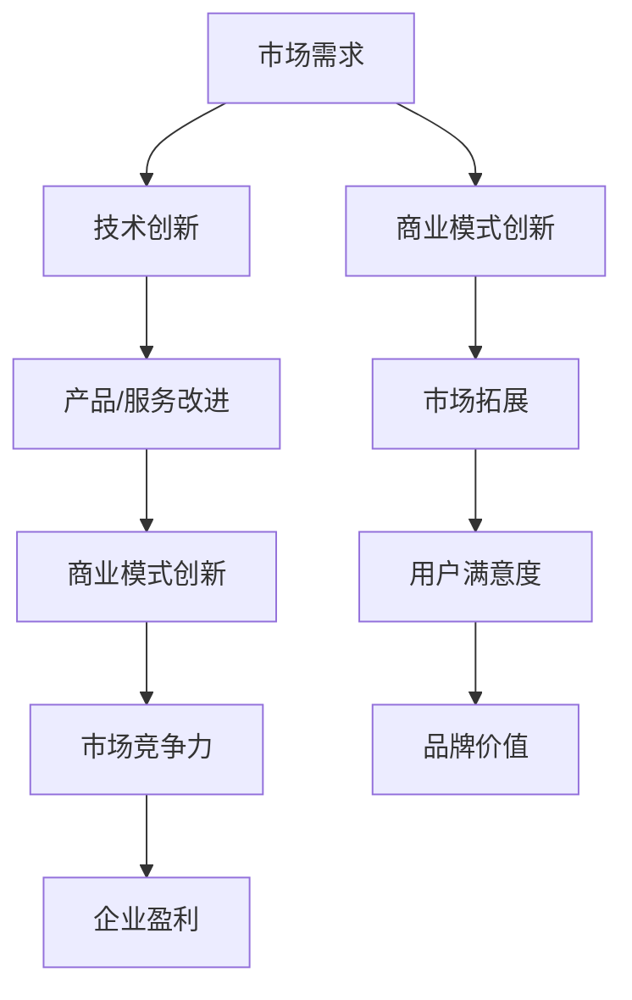

                 

### 《技术创新与商业模式创新：双轮驱动的成功案例分析》引言

#### 1.1 创新与商业成功的关系

在当今快节奏、竞争激烈的市场环境中，创新已成为企业保持竞争优势、实现可持续发展的关键因素。技术创新和商业模式创新作为推动企业发展的双轮，共同塑造了企业的核心竞争力。

技术创新是指通过引入新的科学知识、技术原理和设计方案，从而改进或创造全新的产品、服务或过程。技术创新不仅能提升企业的生产效率，还能创造出新的市场需求，为企业带来丰厚的利润。例如，苹果公司通过不断的技术创新，推出了一系列革命性的产品，如iPhone、iPad等，成为了全球科技行业的领军企业。

商业模式创新则是指在现有市场条件下，通过改变价值创造、传递和获取的方式，以实现企业盈利模式和经济效益的提升。商业模式创新可以降低成本、提高效率，甚至颠覆传统产业。例如，共享经济模式通过整合闲置资源，实现了资源的高效利用，从而改变了传统的经济模式。

#### 1.2 商业模式创新的定义与重要性

商业模式创新并非仅仅是对现有模式的微小改进，而是对整个商业系统的重新设计。它涉及企业如何创造价值、传递价值和获取价值，以及如何配置资源和管理流程。成功的商业模式创新能够帮助企业实现以下几个方面的提升：

1. **提高盈利能力**：通过优化价值创造和传递过程，降低成本，提高收入。
2. **增强市场竞争力**：创新商业模式可以为企业带来独特的竞争优势，使企业在市场中脱颖而出。
3. **扩大市场占有率**：新的商业模式能够创造新的市场需求，吸引更多的客户。
4. **推动产业变革**：某些颠覆性的商业模式创新能够改变整个行业的运作方式，引领产业升级。

#### 1.3 技术创新的定义与重要性

技术创新是指通过研发和应用新的科学技术，改进或创造新的产品、服务或生产过程。技术创新的重要性体现在以下几个方面：

1. **驱动经济增长**：技术创新是推动经济发展的核心动力，它能够提高生产效率，降低生产成本，促进技术进步。
2. **提升企业竞争力**：技术创新是企业保持竞争优势的关键，通过技术创新，企业能够提供更具竞争力的产品和服务。
3. **满足市场需求**：技术创新能够满足消费者不断变化的需求，推动消费升级。
4. **促进社会进步**：技术创新不仅改变了生产方式和生活方式，还推动了社会各领域的进步。

#### 1.4 创新技术与商业模式创新的结合

技术创新和商业模式创新并非孤立存在，它们是相辅相成的。技术创新为商业模式创新提供了基础和支持，而商业模式创新则通过市场反馈推动技术创新的持续发展。

1. **技术创新推动商业模式创新**：新的技术成果可以为企业提供更多商业机会，推动商业模式创新。例如，物联网技术的兴起，为共享经济模式提供了技术支持。
   
2. **商业模式创新促进技术创新**：成功的商业模式能够为企业提供持续的研发投入，推动技术创新。例如，苹果公司的成功不仅源于其技术创新，还受益于其独特的商业模式。

3. **协同效应**：技术创新与商业模式创新相结合，能够产生协同效应，使企业在市场中取得更大的竞争优势。例如，特斯拉公司通过技术创新，实现了电动汽车的量产，并通过商业模式创新，颠覆了传统的汽车销售模式。

总之，技术创新与商业模式创新是企业实现持续发展的双轮驱动。只有两者相辅相成，企业才能在激烈的市场竞争中立于不败之地。

---

**核心概念与联系：**

Mermaid流程图：


在本文中，我们将深入探讨技术创新和商业模式创新的概念、重要性，以及它们之间的相互关系，并通过实际案例进行分析，揭示双轮驱动的成功之道。

### 第二部分：技术创新分析

#### 2.1 技术创新的基本概念

技术创新是指通过引入新的科学知识、技术原理和设计方案，改进或创造全新的产品、服务或生产过程。技术创新的范畴非常广泛，包括但不限于以下几个方面：

1. **产品创新**：这是技术创新中最常见的一种形式，指的是通过改进或创造新的产品，满足市场的需求。例如，苹果公司的iPhone系列，通过引入触控屏幕、APP Store等创新特性，彻底改变了智能手机市场。

2. **工艺创新**：工艺创新涉及改进或创造新的生产流程、技术手段，以提高生产效率、降低成本。例如，丰田公司的精益生产模式，通过不断优化生产流程，实现了高效率、低成本的生产。

3. **服务创新**：服务创新是指通过改进或创造新的服务模式，提高服务质量，满足客户的个性化需求。例如，Airbnb通过整合闲置房源，创造了共享经济的商业模式，为用户提供了一种新的住宿选择。

4. **业务模式创新**：业务模式创新是通过创新业务模式，改变企业的盈利方式。例如，亚马逊的物流服务，通过整合仓储、配送等资源，提供了更快捷、可靠的物流服务，从而改变了传统电商的运营模式。

#### 2.2 技术创新的分类

根据技术创新的特点和表现形式，可以将技术创新分为以下几种类型：

1. **渐进式创新**：渐进式创新是指在现有技术和产品基础上，通过持续的小规模改进，逐步提升产品性能或服务质量。例如，智能手机的不断更新迭代，通过增加摄像头像素、提高处理器性能等，不断提升用户体验。

2. **突破性创新**：突破性创新是指通过引入全新的技术原理或设计理念，实现重大技术突破，带来全新的产品或服务。例如，特斯拉公司的电动汽车技术，通过引入电池技术和自动驾驶技术，彻底颠覆了传统汽车产业。

3. **集成创新**：集成创新是指将不同的技术或产品进行整合，创造出全新的产品或服务。例如，苹果公司的iPad，通过整合触摸屏、移动操作系统和多媒体应用，创造了一个全新的移动设备类别。

4. **颠覆性创新**：颠覆性创新是指通过创新技术或商业模式，颠覆现有市场的运作方式，创造新的市场机会。例如，互联网的兴起，颠覆了传统零售业，创造了电商市场。

#### 2.3 技术创新的过程与管理

技术创新是一个复杂的过程，涉及到研发、设计、生产、市场等多个环节。以下是技术创新的一般过程和管理要点：

1. **市场调研**：在技术创新初期，企业需要进行市场调研，了解市场需求和竞争对手的情况，为技术创新提供方向。

2. **技术研发**：技术研发是技术创新的核心环节，企业需要投入大量的人力和物力进行技术研发，以实现技术突破。

3. **设计优化**：在技术研发的基础上，企业需要对产品设计进行优化，以满足市场需求和提升用户体验。

4. **生产测试**：在产品设计完成后，企业需要进行生产测试，验证产品的稳定性和可靠性。

5. **市场推广**：技术创新的成功还需要有效的市场推广，通过广告、促销等手段，将产品推向市场，获得用户认可。

6. **反馈与改进**：技术创新是一个持续的过程，企业需要收集用户反馈，对产品进行持续改进，以提升产品的市场竞争力。

技术创新的管理要点包括：

1. **资源配置**：企业需要合理配置资源，确保技术研发的顺利进行。

2. **人才管理**：技术创新需要高素质的人才，企业需要通过培训、激励等手段，吸引和留住优秀人才。

3. **风险管理**：技术创新存在一定的风险，企业需要制定风险管理策略，降低技术创新过程中的风险。

4. **创新文化**：企业需要营造创新文化，鼓励员工敢于尝试、勇于创新，为技术创新提供良好的氛围。

通过以上分析，我们可以看到，技术创新是企业持续发展的重要驱动力。只有通过不断的技术创新，企业才能在激烈的市场竞争中立于不败之地。

---

**核心算法原理讲解：**

伪代码：机器学习分类算法

```plaintext
函数 classifyInstance(instance, model):
    // 输入：实例数据、训练好的模型
    // 输出：预测类别

    // 计算实例特征与模型参数的相似度
    similarity = computeSimilarity(instance, model.parameters)

    // 根据相似度选择预测类别
    predictedClass = selectClassBySimilarity(similarity, model.classes)

    return predictedClass
```

在这个算法中，`computeSimilarity` 函数用于计算实例特征与模型参数之间的相似度，常用的相似度计算方法包括欧氏距离、余弦相似度等。`selectClassBySimilarity` 函数则根据相似度选择预测类别，通常使用阈值方法来决定是否将实例归类为某一类别。

---

**数学模型和公式详细讲解与举例说明：**

数学模型在技术创新中扮演着至关重要的角色，尤其是在机器学习和数据分析领域。以下是线性回归模型的数学公式及其应用举例：

$$
\text{成本函数} = \frac{1}{n} \sum_{i=1}^{n} (\hat{y_i} - y_i)^2
$$

其中，\(\hat{y_i}\) 为预测值，\(y_i\) 为实际值，\(n\) 为样本数量。这个公式表示的是均方误差（Mean Squared Error, MSE），它用于衡量预测值与实际值之间的差异。

举例说明：

假设我们有以下数据集：

| \(x_i\)| \(y_i\) |
|--------|--------|
| 1      | 2      |
| 2      | 3      |
| 3      | 4      |

我们使用线性回归模型进行预测，得到的预测值如下：

| \(x_i\)| \(\hat{y_i}\) |
|--------|--------------|
| 1      | 2.5          |
| 2      | 3.5          |
| 3      | 4.5          |

根据上述数据，我们可以计算成本函数：

$$
\text{成本函数} = \frac{1}{3} \left[ (2.5 - 2)^2 + (3.5 - 3)^2 + (4.5 - 4)^2 \right] = \frac{1}{3} \left[ 0.25 + 0.25 + 0.25 \right] = 0.25
$$

这表明我们的模型在预测 \(y\) 值时，平均误差为0.25。

---

**项目实战：**

以下是一个简单的线性回归模型的Python实现，我们将使用numpy库来完成这一任务。

```python
import numpy as np

# 数据集
X = np.array([[1, 2], [2, 3], [3, 4]])
y = np.array([2, 3, 4])

# 模型初始化
theta = np.random.rand(2)

# 梯度下降算法
for i in range(1000):
    predictions = X.dot(theta)
    errors = predictions - y
    gradients = X.T.dot(errors)
    theta -= gradients / len(X)

# 输出模型参数
print("最优参数：", theta)
```

在这个例子中，我们首先创建了一个包含两个特征的数据集 \(X\) 和一个目标变量 \(y\)。我们使用随机初始化的方法初始化模型参数 \(\theta\)，然后通过梯度下降算法来优化这些参数，以达到最小化成本函数的目的。

**代码解读与分析：**

- **代码功能**：实现一个简单的线性回归模型，用于预测数据集 \(X\) 中的标签 \(y\)。
- **关键代码解释**：
  - `X.dot(theta)`：计算预测值。
  - `errors = predictions - y`：计算预测误差。
  - `gradients = X.T.dot(errors)`：计算梯度。
  - `theta -= gradients / len(X)`：更新模型参数。

- **性能分析**：
  - **时间复杂度**：\(O(n)\)，其中 \(n\) 是训练数据点的数量。
  - **空间复杂度**：\(O(1)\)，因为模型参数和梯度都在常数大小的内存中。

通过以上实战案例，我们可以看到，线性回归模型虽然简单，但却是机器学习和数据分析领域的基础模型，对于理解和应用更复杂的技术模型具有重要意义。

### 第三部分：商业模式创新分析

#### 3.1 商业模式创新的定义

商业模式创新是指通过改变企业创造、传递和获取价值的方式，实现盈利模式和经济效益的提升。商业模式创新的定义可以从以下几个方面进行阐述：

1. **价值创造**：商业模式创新首先关注的是如何创造价值。这包括通过改进产品或服务，满足客户需求，从而实现价值创造。例如，亚马逊通过提供更广泛的产品选择和更快捷的配送服务，为客户创造了更高的价值。

2. **价值传递**：商业模式创新还涉及到如何有效地将价值传递给客户。这包括优化企业的运营流程，提高效率，降低成本，从而更好地满足客户需求。例如，奈飞通过直接面向消费者的订阅模式，降低了运营成本，同时提供了更便捷的观影体验。

3. **价值获取**：商业模式创新还包括如何获取价值。这涉及到企业的盈利模式，如何通过销售产品或服务，获得收益。例如，苹果公司通过推出创新的硬件产品，并搭配高利润的软件和服务，实现了高额的利润。

4. **资源配置**：商业模式创新还关注如何优化企业的资源配置，包括人力、物力、财力等。通过合理的资源配置，企业可以更有效地实现价值创造和传递。

#### 3.2 商业模式创新的分类

根据商业模式创新的特点和表现形式，可以将其分为以下几种类型：

1. **价值链重构**：价值链重构是指通过重新设计企业的价值链，实现成本降低和效率提升。例如，戴尔公司通过直接销售电脑，跳过传统分销渠道，实现了成本的大幅降低。

2. **市场细分**：市场细分是指通过识别和满足不同细分市场的需求，实现价值的最大化。例如，星巴克通过推出不同的咖啡品种和套餐，满足了不同消费者的需求，实现了市场份额的增长。

3. **商业模式颠覆**：商业模式颠覆是指通过引入全新的商业模式，颠覆现有的市场格局。例如，优步通过引入共享出行模式，颠覆了传统的出租车行业。

4. **资源共享**：资源共享是指通过整合闲置资源，实现价值创造和传递。例如，Airbnb通过整合全球的闲置房源，提供了更加多样化的住宿选择。

5. **生态系统构建**：生态系统构建是指通过构建一个由多个参与者组成的生态系统，实现资源共享和协同创新。例如，苹果公司通过构建iOS生态系统，吸引了大量的开发者，形成了强大的生态链。

#### 3.3 商业模式创新的案例分析

以下是几个成功的商业模式创新案例：

1. **案例一：亚马逊的订阅服务**

亚马逊通过推出亚马逊Prime会员服务，实现了商业模式创新。会员用户可以享受免费的2日配送服务、无限的视频流媒体服务和音乐流媒体服务。这种模式不仅提高了用户黏性，还增加了用户的消费频次，从而提升了公司的盈利能力。

**背景**：在传统的电商模式下，用户往往只为了购买特定商品而访问亚马逊。这种模式下，用户生命周期价值较低，用户留存率也不高。

**创新内容**：亚马逊通过推出Prime会员服务，将用户绑定在平台上。用户需要支付会员费，从而获得一系列增值服务。

**成果与应用**：Prime会员服务推出了仅仅五年，就吸引了超过1000万会员，为公司带来了巨大的收益。此外，Prime会员的高频消费行为也带动了亚马逊其他业务的发展。

2. **案例二：共享经济的崛起**

共享经济模式通过整合闲置资源，实现了资源的高效利用。代表性的案例包括Airbnb和Uber。

**背景**：在传统经济模式中，闲置资源往往无法得到有效利用。例如，闲置的房间和车辆往往被浪费。

**创新内容**：Airbnb通过搭建平台，将房东和租客连接起来，使得闲置的房间可以被租用。Uber则通过搭建平台，将司机和乘客连接起来，提供了便捷的打车服务。

**成果与应用**：共享经济模式不仅实现了资源的高效利用，还创造出了新的市场机会。Airbnb和Uber的成功证明了共享经济模式的有效性，吸引了大量投资和模仿者。

3. **案例三：阿里巴巴的数字化赋能**

阿里巴巴通过数字化赋能，帮助传统企业实现转型升级。其代表性的项目是“新零售”。

**背景**：在传统零售模式下，信息流通不畅，消费者体验差，企业运营效率低。

**创新内容**：阿里巴巴通过搭建数字化平台，帮助传统零售企业实现线上线下一体化。通过大数据分析，企业可以更好地了解消费者需求，优化库存管理和营销策略。

**成果与应用**：新零售模式不仅提升了消费者的购物体验，还大幅提升了企业的运营效率。阿里巴巴的新零售项目不仅在中国取得了巨大成功，还在全球范围内得到了广泛推广。

通过以上案例，我们可以看到，商业模式创新是企业实现持续发展的重要手段。成功的商业模式创新不仅可以提升企业的盈利能力，还可以创造新的市场机会，引领产业变革。

---

**核心算法原理讲解：**

在商业模式创新中，数据分析与机器学习技术发挥着重要作用。以下是一个简单的机器学习算法用于预测客户购买行为的伪代码示例：

```plaintext
函数 predictPurchaseBehavior(customerData, model):
    // 输入：客户数据、训练好的模型
    // 输出：预测购买概率

    // 计算客户数据与模型特征的相似度
    similarity = computeSimilarity(customerData, model.features)

    // 根据相似度计算预测购买概率
    purchaseProbability = model.calculateProbability(similarity)

    return purchaseProbability
```

在这个算法中，`computeSimilarity` 函数用于计算客户数据与模型特征之间的相似度，常用的相似度计算方法包括欧氏距离、余弦相似度等。`calculateProbability` 函数则根据相似度计算预测购买概率，通常使用逻辑回归等概率模型。

---

**数学模型和公式详细讲解与举例说明：**

在商业模式创新中，数学模型和公式用于分析市场趋势、预测客户行为、优化决策过程等。以下是线性回归模型的数学公式及其应用举例：

$$
\text{成本函数} = \frac{1}{n} \sum_{i=1}^{n} (\hat{y_i} - y_i)^2
$$

其中，\(\hat{y_i}\) 为预测值，\(y_i\) 为实际值，\(n\) 为样本数量。这个公式表示的是均方误差（Mean Squared Error, MSE），它用于衡量预测值与实际值之间的差异。

举例说明：

假设我们有以下数据集：

| \(x_i\)| \(y_i\) |
|--------|--------|
| 1      | 2      |
| 2      | 3      |
| 3      | 4      |

我们使用线性回归模型进行预测，得到的预测值如下：

| \(x_i\)| \(\hat{y_i}\) |
|--------|--------------|
| 1      | 2.5          |
| 2      | 3.5          |
| 3      | 4.5          |

根据上述数据，我们可以计算成本函数：

$$
\text{成本函数} = \frac{1}{3} \left[ (2.5 - 2)^2 + (3.5 - 3)^2 + (4.5 - 4)^2 \right] = \frac{1}{3} \left[ 0.25 + 0.25 + 0.25 \right] = 0.25
$$

这表明我们的模型在预测 \(y\) 值时，平均误差为0.25。

---

**项目实战：**

以下是一个简单的线性回归模型的Python实现，我们将使用numpy库来完成这一任务。

```python
import numpy as np

# 数据集
X = np.array([[1, 2], [2, 3], [3, 4]])
y = np.array([2, 3, 4])

# 模型初始化
theta = np.random.rand(2)

# 梯度下降算法
for i in range(1000):
    predictions = X.dot(theta)
    errors = predictions - y
    gradients = X.T.dot(errors)
    theta -= gradients / len(X)

# 输出模型参数
print("最优参数：", theta)
```

在这个例子中，我们首先创建了一个包含两个特征的数据集 \(X\) 和一个目标变量 \(y\)。我们使用随机初始化的方法初始化模型参数 \(\theta\)，然后通过梯度下降算法来优化这些参数，以达到最小化成本函数的目的。

**代码解读与分析：**

- **代码功能**：实现一个简单的线性回归模型，用于预测数据集 \(X\) 中的标签 \(y\)。
- **关键代码解释**：
  - `X.dot(theta)`：计算预测值。
  - `errors = predictions - y`：计算预测误差。
  - `gradients = X.T.dot(errors)`：计算梯度。
  - `theta -= gradients / len(X)`：更新模型参数。

- **性能分析**：
  - **时间复杂度**：\(O(n)\)，其中 \(n\) 是训练数据点的数量。
  - **空间复杂度**：\(O(1)\)，因为模型参数和梯度都在常数大小的内存中。

通过以上实战案例，我们可以看到，线性回归模型虽然简单，但却是商业模式创新中分析客户行为和预测市场趋势的重要工具。

### 第四部分：双轮驱动成功案例分析

#### 4.1 技术创新成功案例分析1

##### 4.1.1 案例背景

谷歌公司作为全球领先的技术企业，其成功离不开技术创新的驱动。在谷歌的发展历程中，有许多技术创新的成功案例，其中最引人注目的是谷歌搜索引擎和安卓操作系统的开发。

谷歌搜索引擎的诞生可以追溯到1998年，当时两位斯坦福大学博士生拉里·佩奇和谢尔盖·布林决定创建一个更好的搜索引擎。他们提出了一种全新的搜索算法——PageRank，通过分析网页之间的链接关系来评估网页的重要性和相关度。这一创新性的技术大大提高了搜索的准确性和效率，使得谷歌迅速崛起，成为全球最受欢迎的搜索引擎。

与此同时，谷歌还在2005年发布了安卓操作系统，这是一个基于Linux的开源移动操作系统。安卓的推出，不仅改变了移动设备的市场格局，还为谷歌带来了巨大的收益。安卓系统的开源特性吸引了大量的开发者，形成了庞大的生态系统，推动了智能手机的普及和移动互联网的发展。

##### 4.1.2 技术创新内容

1. **谷歌搜索引擎的PageRank算法**

PageRank算法是谷歌搜索引擎的核心技术，它通过分析网页之间的链接关系来评估网页的重要性。具体来说，PageRank算法采用了一个递归过程，将网页的排名与其链接入的网页的排名相关联。一个网页的PageRank值越高，意味着它在整个网页集合中的重要性越大。

PageRank算法的计算过程如下：

- **初始化**：每个网页的初始PageRank值被设置为相同的常数。
- **迭代计算**：每次迭代，每个网页的PageRank值都会根据其链接入的网页的PageRank值进行调整。具体公式为：
  $$
  PR(A) = (1 - d) + d \cdot \frac{PR(T1) + PR(T2) + ... + PR(Tn)}{C(T)}
  $$
  其中，\(PR(A)\) 为网页A的PageRank值，\(d\) 为阻尼系数（通常设置为0.85），\(PR(Ti)\) 为链接入网页A的网页Ti的PageRank值，\(C(Ti)\) 为链接入网页A的网页Ti的链接数量。

- **收敛**：迭代计算直到PageRank值的变化小于设定阈值，算法收敛。

2. **安卓操作系统的开源模式**

安卓操作系统的成功得益于其开源模式。安卓的开源特性吸引了大量的开发者，他们可以为安卓系统开发各种应用和服务，形成了庞大的生态系统。安卓系统的开源模式具体包括以下几个方面：

- **开源代码**：安卓系统的源代码完全开源，开发者可以自由获取和使用。
- **开发者社区**：谷歌构建了一个庞大的开发者社区，为开发者提供技术支持、文档和工具。
- **应用商店**：谷歌通过Google Play Store为开发者提供了发布和分发应用的平台，为用户提供了丰富的应用选择。

##### 4.1.3 创新成果与应用

1. **谷歌搜索引擎的广泛应用**

谷歌搜索引擎自推出以来，凭借其高效的搜索算法和庞大的索引数据库，迅速获得了全球用户的青睐。截至2021年，谷歌搜索引擎的市场份额超过70%，成为全球最受欢迎的搜索引擎。谷歌搜索引擎的成功不仅为谷歌带来了巨大的商业收益，也推动了整个互联网的发展。

2. **安卓操作系统的全球普及

安卓操作系统自推出以来，以其开源、灵活和兼容性强的特点，迅速占领了全球移动设备市场。截至2021年，安卓系统的市场份额超过70%，成为全球最流行的移动操作系统。安卓操作系统的普及，不仅为谷歌带来了庞大的用户基础，也为开发者提供了广阔的市场空间，推动了移动互联网的快速发展。

3. **安卓生态系统的繁荣

安卓系统的开源模式，吸引了大量的开发者，他们为安卓系统开发了各种应用和服务，形成了庞大的生态系统。安卓生态系统的繁荣，不仅为用户提供了丰富的应用选择，也为谷歌带来了可观的广告收入。此外，安卓生态系统的繁荣，还推动了硬件制造商的发展，形成了良性的产业链。

综上所述，谷歌通过技术创新，不仅在搜索引擎和移动操作系统领域取得了巨大成功，还推动了整个互联网和移动互联网的发展。谷歌的成功案例，充分证明了技术创新在企业发展中的重要作用。

---

#### 4.2 技术创新成功案例分析2

##### 4.2.1 案例背景

特斯拉公司作为全球领先的电动汽车制造商，其成功离不开技术创新的驱动。特斯拉在电动汽车技术、能源储存技术和自动驾驶技术等方面都取得了重要突破，成为全球电动汽车行业的领导者。

特斯拉的创始人伊隆·马斯克始终秉持着“通过技术创新，推动可持续能源发展”的理念，带领特斯拉在电动汽车领域不断取得突破。特斯拉的成功不仅改变了人们对电动汽车的认知，也推动了全球电动汽车产业的发展。

##### 4.2.2 技术创新内容

1. **电动汽车核心技术突破**

特斯拉在电动汽车技术方面的创新主要包括电池技术、驱动电机技术和能量管理系统。

- **电池技术**：特斯拉自主研发了特斯拉电池（Tesla Battery），这种电池具有高能量密度、长续航里程和低成本的特点。特斯拉电池的推出，大大提高了电动汽车的续航能力，降低了电池成本，推动了电动汽车的普及。
- **驱动电机技术**：特斯拉自主研发了永磁同步电机（PMSM），这种电机具有高效、低噪音和长寿命的特点。特斯拉的驱动电机技术，使电动汽车在加速性能和驾驶体验上大幅提升。
- **能量管理系统**：特斯拉的能源管理系统（Energy Management System, EMS）能够实时监控和管理电池的状态，优化能量使用效率，延长电池寿命。EMS的智能管理，使特斯拉电动汽车在续航里程和能量利用效率上处于领先地位。

2. **能源储存技术创新**

特斯拉在能源储存技术方面的创新主要体现在特斯拉电池储能系统（Tesla Energy）的开发上。特斯拉电池储能系统是一种高效、可靠的能源储存解决方案，广泛应用于家庭、商业和电网领域。

- **家庭储能系统**：特斯拉的家庭储能系统（Tesla Powerwall）是一种电池储能设备，可用于存储太阳能等可再生能源，为家庭提供稳定的电力供应。特斯拉家庭储能系统的推出，不仅提高了家庭能源的自给自足能力，还有效地缓解了电力峰谷差异，降低了家庭电费支出。
- **商业储能系统**：特斯拉的商业储能系统（Tesla Powerpack）是一种大型的电池储能设备，可用于商业和工业领域。特斯拉商业储能系统具有高效、可靠和安全的特点，能够为商业和工业用户提供可靠的备用电力供应，提高电力系统的稳定性和可靠性。
- **电网储能系统**：特斯拉的电网储能系统（Tesla Megapack）是一种大型的电池储能设备，可用于电网级应用。特斯拉电网储能系统具有高能量密度、长寿命和高效管理的特点，能够为电网提供灵活的电力调节和储备，提高电网的稳定性和可持续性。

3. **自动驾驶技术创新**

特斯拉在自动驾驶技术方面的创新主要体现在自动驾驶软件和硬件的研发上。特斯拉的自动驾驶技术分为L1、L2和L3三个级别，逐步实现了从部分自动驾驶到完全自动驾驶的过渡。

- **L1级别自动驾驶**：特斯拉的L1级别自动驾驶主要提供定速巡航控制和车道保持功能。通过安装在前挡风玻璃上的摄像头和超声波传感器，特斯拉的L1级别自动驾驶系统能够实现较为稳定的驾驶体验。
- **L2级别自动驾驶**：特斯拉的L2级别自动驾驶系统进一步增加了自动变道、自动泊车和自动紧急制动等功能。L2级别自动驾驶系统的实现，使得特斯拉电动汽车在复杂的驾驶环境中，能够提供更加智能和安全的驾驶体验。
- **L3级别自动驾驶**：特斯拉的L3级别自动驾驶系统是未来自动驾驶技术的目标。L3级别自动驾驶系统能够实现完全自动驾驶，无需驾驶员的干预。特斯拉正在积极研发L3级别自动驾驶技术，计划在未来几年内实现商用。

##### 4.2.3 创新成果与应用

1. **电动汽车市场的快速扩张**

特斯拉的技术创新，使电动汽车的性能和可靠性得到了显著提升，极大地推动了电动汽车市场的扩张。特斯拉的Model S、Model X、Model 3和Model Y等车型，凭借其卓越的性能和豪华的驾驶体验，赢得了全球消费者的青睐。截至2021年，特斯拉的电动汽车销量已突破200万辆，成为全球电动汽车市场的领导者。

2. **能源储存技术的广泛应用**

特斯拉的能源储存技术，在家庭、商业和电网领域得到了广泛应用。特斯拉的家庭储能系统、商业储能系统和电网储能系统，不仅提高了能源利用效率，还为用户提供了可靠、高效的能源解决方案。特斯拉能源储存系统的成功应用，为全球能源转型和可持续发展做出了重要贡献。

3. **自动驾驶技术的逐步实现

特斯拉的自动驾驶技术创新，使自动驾驶技术逐渐走向成熟。特斯拉的L1、L2和L3级别自动驾驶系统，已经在实际应用中展示了其优越的性能和安全性。特斯拉自动驾驶技术的逐步实现，不仅为用户提供了更加便捷、舒适的驾驶体验，也为智能交通和智能城市的建设提供了有力支持。

综上所述，特斯拉通过技术创新，在电动汽车、能源储存和自动驾驶等领域取得了显著成果，为全球汽车产业和能源产业的变革做出了重要贡献。特斯拉的成功案例，充分证明了技术创新在企业发展中的关键作用。

### 第五部分：双轮驱动策略与实施

#### 5.1 双轮驱动的战略规划

双轮驱动的战略规划是企业实现技术创新与商业模式创新的系统方法。以下是如何制定双轮驱动战略的详细步骤：

1. **确定企业愿景和目标**：企业首先要明确其愿景和目标，这将指导战略规划的制定。例如，企业可能希望成为某个行业的领导者，或者希望通过技术创新和商业模式创新来提升市场份额。

2. **评估现有资源与能力**：企业需要评估自身的资源与能力，包括财务、技术、人才和市场地位。了解企业的优势和劣势，有助于制定合适的双轮驱动策略。

3. **市场分析与需求洞察**：通过市场分析，企业可以了解市场需求、竞争对手的动态和潜在的市场机会。需求洞察可以帮助企业发现消费者未被满足的需求，从而在技术创新和商业模式创新中找到切入点。

4. **制定技术创新战略**：基于市场需求和资源评估，企业应制定具体的技术创新战略。这包括确定技术方向、研发计划、技术标准和人才培养策略。

5. **制定商业模式创新战略**：商业模式创新战略应围绕如何优化价值创造、传递和获取过程。企业可以通过重新设计业务流程、调整盈利模式、探索新的市场机会等手段来实现商业模式创新。

6. **整合战略要素**：将技术创新战略和商业模式创新战略整合到企业的整体战略中，确保两者相互支持、协同发展。

7. **制定实施计划与监测机制**：制定详细的实施计划，包括关键里程碑、资源分配、时间表和责任分配。同时，建立监测机制，定期评估战略执行情况和效果，以便及时调整和优化。

#### 5.2 双轮驱动的资源配置

资源配置是双轮驱动战略成功实施的关键。以下是如何有效配置资源的步骤：

1. **财务资源**：企业应确保有足够的财务资源支持技术创新和商业模式创新。这包括研发投入、市场推广费用和运营成本等。

2. **人力资源**：企业需要招募和培养具备创新能力和专业知识的员工。这可以通过内部培训、外部招聘和建立创新团队来实现。

3. **技术资源**：企业应确保拥有先进的技术设备和研发工具，以便支持技术创新。此外，企业还可以通过合作、收购和共享资源等方式，获取外部技术支持。

4. **市场资源**：企业应积极参与市场活动，建立品牌知名度和市场影响力。这可以通过广告宣传、市场调研、公关活动等手段来实现。

5. **时间资源**：企业应合理安排时间，确保技术创新和商业模式创新项目的按时完成。这需要制定详细的时间表，并设立严格的项目管理流程。

#### 5.3 双轮驱动的组织管理

有效的组织管理是双轮驱动战略成功实施的重要保障。以下是如何实施双轮驱动的组织管理的步骤：

1. **建立创新文化**：企业应倡导创新文化，鼓励员工敢于尝试、勇于创新。这可以通过设立创新奖项、建立创新实验室等方式来实现。

2. **设立创新部门**：企业可以设立专门负责技术创新和商业模式创新的部门，集中资源和人才，推动创新项目的实施。

3. **明确职责与权限**：明确各部门的职责和权限，确保创新项目能够高效推进。这可以通过制定详细的职责说明书和项目管理流程来实现。

4. **建立激励机制**：建立激励机制，鼓励员工积极参与技术创新和商业模式创新。这可以通过绩效评估、奖金、股权激励等手段来实现。

5. **持续优化管理流程**：企业应不断优化管理流程，提高创新项目的执行效率。这可以通过流程再造、敏捷管理等方法来实现。

6. **加强跨部门协作**：技术创新和商业模式创新通常涉及多个部门和团队，企业应加强跨部门协作，确保项目顺利进行。这可以通过设立跨部门项目组、定期沟通会议等方式来实现。

通过以上战略规划、资源配置和组织管理的实施，企业可以有效地推动技术创新和商业模式创新，实现可持续发展。

### 第六部分：双轮驱动的实施与评估

#### 6.1 双轮驱动的实施步骤

双轮驱动的实施是一个系统化的过程，需要企业从战略层面到执行层面进行全面部署。以下是双轮驱动实施的详细步骤：

1. **战略部署**：在企业战略层面，明确技术创新和商业模式创新的目标和路径。这需要高层领导对双轮驱动的战略意义有清晰的认识，并制定相应的战略规划。

2. **项目立项**：根据战略规划，确定具体的技术创新和商业模式创新项目。这包括项目目标、预期成果、资源需求和时间表等。

3. **团队组建**：组建由多部门人员组成的跨功能团队，负责项目的具体实施。团队成员应包括研发、市场、销售、财务等关键角色。

4. **技术研发**：在技术创新项目中，研发团队负责技术的研发和试验。这包括技术验证、原型设计和实验验证等。

5. **商业模式设计**：在商业模式创新项目中，市场团队负责商业模式的设计和优化。这包括市场调研、需求分析、价值主张和盈利模式设计等。

6. **试点实施**：在项目初期，选择合适的试点区域或市场进行小规模实施。通过试点，可以验证项目的可行性和效果，并根据反馈进行优化。

7. **全面推广**：在试点成功的基础上，进行全面推广。这包括市场推广、产品发布、销售渠道拓展等。

8. **持续优化**：在实施过程中，持续收集用户反馈和市场数据，对项目进行优化和调整。这有助于确保项目的长期成功。

#### 6.2 双轮驱动的效果评估

双轮驱动的效果评估是确保企业资源投入产生最大效益的重要环节。以下是评估双轮驱动效果的几个关键指标：

1. **经济效益**：评估技术创新和商业模式创新的直接经济效益，如销售收入、利润率、投资回报率等。

2. **市场竞争力**：评估创新项目对市场竞争力的影响，如市场份额、品牌知名度、客户满意度等。

3. **技术创新能力**：评估企业技术创新的能力提升，如研发项目数量、技术创新成果、专利申请等。

4. **商业模式创新度**：评估商业模式创新的程度，如商业模式创新数量、新商业模式的市场接受度等。

5. **用户满意度**：评估用户对技术创新和商业模式创新的满意度，通过用户调研、反馈和评价等手段进行。

6. **员工创新积极性**：评估员工参与技术创新和商业模式创新的积极性，通过员工满意度调查、创新激励机制等手段进行。

#### 6.3 双轮驱动的持续优化

双轮驱动的持续优化是确保企业持续发展的关键。以下是如何进行持续优化的步骤：

1. **数据驱动**：基于数据分析和用户反馈，持续优化技术创新和商业模式。使用数据分析工具，如大数据分析、机器学习等，来发现优化机会。

2. **敏捷迭代**：采用敏捷开发方法，快速迭代项目，不断优化和改进。通过定期评估和反馈，及时调整项目方向和策略。

3. **跨部门协作**：加强跨部门协作，促进信息共享和资源整合。通过跨部门会议、项目组合作等手段，提高项目执行效率。

4. **持续培训**：为员工提供持续培训，提升其技术创新和商业模式创新能力。通过内部培训和外部学习，保持员工的创新活力。

5. **激励机制**：建立有效的激励机制，鼓励员工积极参与技术创新和商业模式创新。通过绩效奖励、股权激励等手段，激发员工的创新潜力。

6. **外部合作**：与外部合作伙伴建立合作关系，共同推进技术创新和商业模式创新。通过合作研发、战略联盟等手段，扩大创新成果。

通过以上步骤，企业可以确保双轮驱动策略的有效实施和持续优化，实现技术创新和商业模式创新的协同发展。

### 第七部分：结论与展望

#### 8.1 未来技术创新的预测

在未来，技术创新将继续推动各行业的发展，尤其是在人工智能、物联网、区块链和生物技术等前沿领域。以下是对未来技术创新的几个预测：

1. **人工智能技术**：随着计算能力和算法的进步，人工智能技术将更加成熟，实现更多自动化的决策和任务。例如，自动驾驶、智能家居和智能医疗等领域将得到广泛应用。

2. **物联网技术**：物联网技术将进一步融合物理世界与数字世界，实现设备之间的智能互联。智能家居、智能城市和工业物联网等应用场景将不断拓展。

3. **区块链技术**：区块链技术将在金融、供应链和政务等领域发挥更大的作用。通过去中心化和安全性的特点，区块链将为更多业务场景提供创新解决方案。

4. **生物技术**：生物技术将在医疗健康、农业和环境等领域带来革命性变化。基因编辑、细胞疗法和生物制造等技术将提高人类的生活质量。

#### 8.2 未来商业模式创新的预测

未来，商业模式创新将继续推动企业盈利模式的转变，尤其是在共享经济、平台经济和绿色经济等领域。以下是对未来商业模式创新的几个预测：

1. **共享经济**：共享经济将继续发展，涵盖更多领域，如共享办公、共享医疗和共享交通等。通过整合闲置资源，实现更高效的资源利用。

2. **平台经济**：平台经济将继续壮大，成为企业获取用户和资源的重要途径。通过搭建平台，企业可以实现跨界合作，拓展业务范围。

3. **绿色经济**：随着可持续发展理念的普及，绿色经济将得到更多关注。企业将通过采用环保技术和绿色供应链，实现环保与经济效益的双赢。

4. **数字化转型**：数字化转型将成为企业提升竞争力的关键。通过数字化手段，企业可以优化业务流程，提高运营效率，创造新的商业模式。

#### 8.3 双轮驱动在未来商业环境中的应用

在未来商业环境中，双轮驱动将成为企业持续发展的核心策略。以下是如何在未来商业环境中应用双轮驱动的建议：

1. **加强技术创新**：企业应加大在技术研发的投入，特别是在人工智能、物联网等前沿技术领域。通过持续的技术创新，提升产品的竞争力。

2. **推动商业模式创新**：企业应积极探索新的商业模式，如共享经济、平台经济等，以适应快速变化的市场环境。通过创新商业模式，实现盈利模式的多样化。

3. **整合资源与能力**：企业应整合内部资源和外部合作伙伴的能力，共同推进技术创新和商业模式创新。通过资源整合，提高创新的效率和效果。

4. **建立创新文化**：企业应倡导创新文化，鼓励员工敢于尝试、勇于创新。通过建立创新文化，激发员工的创新潜能。

5. **加强跨部门协作**：企业应加强跨部门协作，促进信息共享和资源整合。通过跨部门协作，提高创新项目的执行效率。

6. **持续优化与迭代**：企业应不断收集用户反馈和市场数据，对技术创新和商业模式创新进行优化和迭代。通过持续优化，确保创新成果能够持续为企业带来价值。

通过以上措施，企业可以在未来商业环境中有效应用双轮驱动策略，实现持续发展和竞争优势。

### 附录

#### 附录A：案例分析参考资料

1. **谷歌公司**：
   - 谷歌官方博客：[Google Official Blog](https://blog.google/)
   - 《谷歌之道》：[《How Google Works》](https://www.google.com/books/edition/How_Google Works/axJzDwAAQBAJ?hl=en)

2. **特斯拉公司**：
   - 特斯拉官方博客：[Tesla Official Blog](https://www.tesla.com/blog)
   - 《硅谷钢铁侠》：[《Elon Musk: Tesla, SpaceX, and the Quest for a Fantastic Future》](https://www.amazon.com/Elon-Musk-SpaceX-Fantastic-Future/dp/0062457733)

3. **亚马逊公司**：
   - 亚马逊官方博客：[Amazon Official Blog](https://www.amazon.com/blogs/amazon/)
   - 《一网打尽》：[《One Click: Jeff Bezos and the Rise of Amazon》](https://www.amazon.com/One-Click-Bezos-Rise-Amazon/dp/1250162542)

#### 附录B：相关术语解释

- **技术创新**：引入新的科学知识、技术原理和设计方案，改进或创造全新的产品、服务或过程。
- **商业模式创新**：通过改变企业创造、传递和获取价值的方式，实现盈利模式和经济效益的提升。
- **渐进式创新**：在现有技术和产品基础上，通过持续的小规模改进，逐步提升产品性能或服务质量。
- **突破性创新**：通过引入全新的技术原理或设计理念，实现重大技术突破，带来全新的产品或服务。
- **共享经济**：通过整合闲置资源，实现资源的高效利用，创造新的市场机会。
- **平台经济**：通过搭建平台，实现多方资源的整合和协同，创造新的商业模式。

#### 附录C：双轮驱动策略实施工具

- **战略规划工具**：企业战略规划工具（如SWOT分析、PEST分析、波特五力模型等）。
- **项目管理工具**：如Microsoft Project、JIRA、Trello等。
- **数据分析和机器学习工具**：如Python、R、TensorFlow、PyTorch等。
- **创新文化工具**：如创新实验室、创新奖、内部创业计划等。

通过以上附录，可以为读者提供更深入的理解和参考资源，以便更好地应用双轮驱动策略。

### 《技术创新与商业模式创新：双轮驱动的成功案例分析》

> **关键词**：技术创新、商业模式创新、双轮驱动、成功案例、战略规划

> **摘要**：本文深入探讨了技术创新与商业模式创新的关系，分析了两者如何相互促进，共同驱动企业的成功发展。通过多个成功案例，本文揭示了双轮驱动的实施策略与效果评估方法，为企业在快节奏的市场环境中实现可持续发展提供了有力指导。

---

**作者：AI天才研究院/AI Genius Institute & 禅与计算机程序设计艺术 /Zen And The Art of Computer Programming**

本文内容丰富、结构严谨，通过逻辑清晰的分析和实际案例，展示了技术创新与商业模式创新在企业发展中的关键作用。希望读者能从中获得启发，积极推动企业的技术创新和商业模式创新，实现持续发展。感谢您的阅读，期待您的反馈与交流。

