                 

### 第一部分：引言

#### 1.1 提示词工程的概念与意义

**提示词工程（Prompt Engineering）** 是一种新兴的人工智能领域，旨在通过设计优化语言模型输入的提示词（prompt），提升自然语言处理（NLP）任务的效果。简单来说，提示词工程就是为语言模型提供合适的“引导”，帮助模型更好地理解和生成文本。

**提示词工程在现代科技中的地位** 不可小觑。随着深度学习和自然语言处理技术的迅猛发展，语言模型在众多领域（如文本生成、翻译、问答系统等）中展现出了惊人的能力。然而，这些能力往往依赖于高质量的提示词设计。好的提示词不仅能够提高模型的性能，还能使模型更加理解用户的需求，提供更准确的回答。

**提示词工程对人类社会发展的影响** 同样深远。在医疗领域，提示词工程可以辅助医生进行诊断和病情分析；在教育领域，它可以提升学生的学习效果和知识获取效率；在商业领域，它可以帮助企业进行市场分析和客户服务优化。总之，提示词工程正在成为推动社会进步的重要技术力量。

#### 1.2 伦理考量在提示词工程中的重要性

**伦理考量（Ethical Consideration）** 是指在科技发展过程中，对技术可能带来的社会、环境、伦理等方面的影响进行深入思考和评估。在提示词工程中，伦理考量的重要性主要体现在以下几个方面：

1. **隐私保护**：提示词工程常常涉及个人数据的收集和处理，因此必须确保用户的隐私得到充分保护。
2. **公平性**：提示词的设计和应用可能带来性别、种族、年龄等方面的偏见，需要通过伦理考量来消除这些偏见。
3. **透明度**：提示词工程的过程和结果需要具备透明性，便于公众监督和评估。

**伦理考量在提示词工程中的应用** 包括：
- **隐私保护措施**：如数据匿名化、数据访问权限控制等。
- **公平性评估**：通过算法测试和评估，确保模型在不同群体中的表现一致。
- **透明度提升**：通过开源项目、算法解释等方式，增加模型的可解释性。

**伦理考量对提示词工程发展的影响** 是深远的。它不仅能够规范提示词工程的发展方向，提高技术应用的伦理水平，还能增强公众对人工智能技术的信任，推动人工智能技术的可持续发展。

#### 1.3 小结

本部分介绍了提示词工程的概念、意义及其在现代科技中的地位，以及伦理考量在提示词工程中的重要性。理解这些内容将为后续章节的深入探讨奠定基础。在下一部分中，我们将进一步探讨提示词工程的技术基础。

---

**本章关键词**：提示词工程、自然语言处理、伦理考量、隐私保护、公平性、透明度。

---

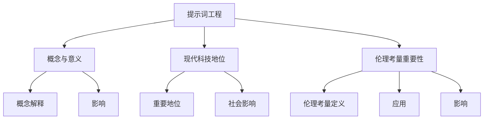

---

### 2.1 自然语言处理技术

**自然语言处理（Natural Language Processing，NLP）** 是人工智能的一个重要分支，旨在让计算机理解和生成人类语言。在提示词工程中，NLP 技术是不可或缺的基础。

#### **自然语言处理的基本概念**

**自然语言处理** 的核心任务是使计算机能够理解、处理和生成自然语言。这包括文本分类、情感分析、命名实体识别、机器翻译、问答系统等多个方面。

1. **文本分类**：将文本数据根据其内容进行分类。例如，将新闻文章分为体育、科技、娱乐等类别。
2. **情感分析**：通过分析文本中的情感词汇和句式，判断文本的情感倾向。例如，判断用户评论是正面、负面还是中性。
3. **命名实体识别**：从文本中识别出具有特定意义的实体，如人名、地点、组织等。
4. **机器翻译**：将一种语言的文本自动翻译成另一种语言。例如，将中文翻译成英文。
5. **问答系统**：使计算机能够理解用户的提问，并生成相应的回答。

#### **自然语言处理的关键技术**

自然语言处理技术主要包括以下几类：

1. **分词（Tokenization）**：将文本切分成单词或短语的步骤。例如，将“我爱北京天安门”切分成“我”、“爱”、“北京”、“天安门”。
2. **词性标注（Part-of-Speech Tagging）**：为文本中的每个单词标注其词性，如名词、动词、形容词等。例如，将“我爱北京”中的“爱”标注为动词。
3. **句法分析（Syntax Analysis）**：分析句子的结构，确定单词之间的语法关系。例如，分析“我爱北京”的句法结构为“主语（我）+谓语（爱）+宾语（北京）”。
4. **词嵌入（Word Embedding）**：将单词映射到高维空间中的向量表示。例如，将“爱”映射到向量 `[1, 0.5, -0.3]`。
5. **语言模型（Language Model）**：通过统计方法或深度学习模型，预测下一个单词或字符的概率分布。例如，通过语言模型，可以预测下一个单词是“爱”的概率最高。
6. **序列标注（Sequence Labeling）**：对序列中的每个元素进行标签标注。例如，对句子“我爱北京天安门”中的每个词进行命名实体识别标签。
7. **文本生成（Text Generation）**：利用语言模型生成新的文本。例如，根据提示词生成文章、对话等。

#### **自然语言处理在提示词工程中的应用**

在提示词工程中，NLP 技术主要用于以下几个方面：

1. **提示词生成**：通过分析用户输入的文本，生成适合的提示词。例如，根据用户提问生成相应的答案提示词。
2. **提示词优化**：对已有的提示词进行优化，提高模型在特定任务上的性能。例如，通过调整提示词的长度、内容等，提高问答系统的准确率。
3. **文本理解**：理解用户输入的文本内容，为模型提供更好的上下文信息。例如，通过情感分析、实体识别等，为模型提供文本的情感倾向和关键词。
4. **对话系统**：构建基于自然语言处理的对话系统，与用户进行自然交互。例如，通过机器翻译、对话生成等，实现多语言交互和问答功能。

#### **NLP 技术的发展趋势**

随着深度学习和计算能力的提升，NLP 技术正朝着更加智能化、高效化的方向发展。未来，NLP 技术将在以下几个方面取得重要突破：

1. **预训练模型**：通过大规模预训练模型，提升模型的泛化能力和理解能力。例如，GPT-3、BERT 等模型。
2. **多模态处理**：结合文本、图像、声音等多种数据类型，实现更全面的自然语言理解。例如，文本生成图像、图像生成文本等。
3. **个性化服务**：根据用户行为和偏好，提供个性化的语言服务。例如，智能客服、个性化推荐等。
4. **实时交互**：实现实时自然语言交互，提升用户体验。例如，实时语音识别、实时翻译等。

#### **小结**

本部分介绍了自然语言处理的基本概念、关键技术和在提示词工程中的应用。理解这些内容，将为后续章节的深入探讨提供技术基础。在下一部分中，我们将探讨提示词生成算法。

---

**本章关键词**：自然语言处理、文本分类、情感分析、命名实体识别、机器翻译、问答系统、分词、词性标注、句法分析、词嵌入、语言模型、序列标注、文本生成、提示词生成、提示词优化、文本理解、对话系统。

---

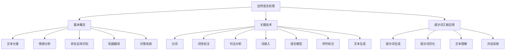

---

### 2.2 提示词生成算法

提示词生成算法（Prompt Generation Algorithm）是提示词工程中的核心组成部分，其目标是根据用户输入的文本或任务需求，自动生成高质量的提示词，以提升自然语言处理模型的效果。在这一部分，我们将详细探讨提示词生成算法的类型、工作原理以及性能评估方法。

#### **提示词生成算法的类型**

提示词生成算法主要分为以下几种类型：

1. **基于规则的方法**：这种方法依赖于预定义的规则集，通过匹配用户输入和规则库中的规则，生成提示词。典型的代表有基于关键词提取的提示词生成算法。
2. **基于统计的方法**：这种方法通过分析大量的文本数据，利用统计模型（如条件概率模型、隐马尔可夫模型等）来生成提示词。这种方法的优点是能够处理复杂的关系和上下文。
3. **基于机器学习的方法**：这种方法利用机器学习模型（如决策树、支持向量机、神经网络等）来预测和生成提示词。这种方法的优点是能够自动学习复杂的关系和特征。
4. **基于深度学习的方法**：这种方法利用深度学习模型（如循环神经网络、变换器模型、生成对抗网络等）来生成提示词。这种方法的优点是能够捕捉到更深层次的语义关系。

#### **提示词生成算法的工作原理**

以下将分别介绍上述几种类型提示词生成算法的工作原理：

1. **基于规则的方法**：
    - **工作原理**：通过预定义的规则集，将用户输入文本分解成关键词或短语，并根据规则生成相应的提示词。
    - **优点**：简单易懂，实现成本低。
    - **缺点**：灵活性差，难以处理复杂的语言结构和上下文。

2. **基于统计的方法**：
    - **工作原理**：利用统计模型，如条件概率模型，分析输入文本的特征和上下文，生成提示词。
    - **优点**：能够处理复杂的语言关系，适应性强。
    - **缺点**：对大量训练数据的依赖较大，性能可能受限于数据质量。

3. **基于机器学习的方法**：
    - **工作原理**：利用机器学习算法，如决策树、支持向量机等，对输入文本进行特征提取和分类，生成提示词。
    - **优点**：能够自动学习特征，处理复杂的文本数据。
    - **缺点**：对特征工程要求较高，可能需要大量的训练数据和计算资源。

4. **基于深度学习的方法**：
    - **工作原理**：利用深度学习模型，如循环神经网络、变换器模型等，对输入文本进行序列建模，生成提示词。
    - **优点**：能够捕捉到更深层次的语义关系，适应性强。
    - **缺点**：模型复杂，训练时间较长，对计算资源需求较高。

#### **提示词生成算法的性能评估**

提示词生成算法的性能评估主要从以下几个方面进行：

1. **准确率（Accuracy）**：提示词生成算法生成的提示词与预期提示词的匹配度。通常使用精确率（Precision）和召回率（Recall）来衡量。
2. **F1 值（F1 Score）**：精确率和召回率的调和平均，是评估提示词生成算法性能的常用指标。
3. **鲁棒性（Robustness）**：提示词生成算法对噪声数据的适应能力，如拼写错误、语法错误等。
4. **效率（Efficiency）**：提示词生成算法的运行速度，包括生成速度和训练速度。

#### **案例分析**

以下是一个基于机器学习的提示词生成算法的案例分析：

1. **数据集**：使用一个包含用户提问和答案的对话数据集进行训练和测试。
2. **特征提取**：对用户提问进行分词、词性标注等预处理，提取文本特征。
3. **模型训练**：使用循环神经网络（RNN）或变换器模型（Transformer）训练生成提示词模型。
4. **性能评估**：使用测试集评估模型的准确率和 F1 值，并对模型进行调优。

通过以上案例分析，可以看出，提示词生成算法在实际应用中具有一定的挑战性，但通过合理的数据预处理、特征提取和模型选择，可以显著提高算法的性能。

#### **小结**

本部分详细介绍了提示词生成算法的类型、工作原理以及性能评估方法。理解这些内容，有助于更好地设计和优化提示词生成算法，提升自然语言处理模型的效果。在下一部分中，我们将探讨提示词工程工具与平台。

---

**本章关键词**：提示词生成算法、基于规则的方法、基于统计的方法、基于机器学习的方法、基于深度学习的方法、准确率、召回率、F1 值、鲁棒性、效率、案例分析。

---

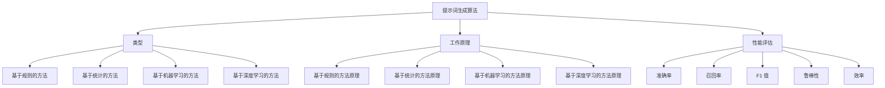

---

### 2.3 提示词工程工具与平台

提示词工程的发展离不开各类工具与平台的支撑。在这一部分，我们将介绍一些常用的提示词工程工具与平台，并探讨如何选择和使用这些工具。

#### **提示词工程常用工具**

1. **NLTK（自然语言工具包）**：NLTK 是一个强大的自然语言处理库，提供了丰富的文本预处理功能，如分词、词性标注、词嵌入等。它适用于各种自然语言处理任务，是初学者常用的工具之一。

2. **SpaCy**：SpaCy 是一个高效且易于使用的自然语言处理库，提供了丰富的实体识别、关系抽取等功能。它支持多种语言，适用于复杂的文本处理任务。

3. **Transformers**：Transformers 是一个基于 PyTorch 的深度学习库，支持各种变换器模型，如 BERT、GPT、T5 等。它适用于大规模的自然语言处理任务，是当前深度学习领域的热门工具。

4. **Hugging Face**：Hugging Face 是一个开源的自然语言处理库，提供了丰富的预训练模型和工具，如 Transformer 模型、语言模型评估工具等。它支持多种编程语言，易于集成和使用。

#### **提示词工程平台介绍**

1. **Google Cloud NLP**：Google Cloud NLP 是一个基于云的自然语言处理平台，提供了丰富的自然语言处理服务和工具，如文本分类、情感分析、实体识别等。它支持大规模数据处理和模型训练，适用于企业级应用。

2. **AWS Comprehend**：AWS Comprehend 是 Amazon Web Services 提供的自然语言处理服务，提供了文本分类、情感分析、关键词提取等功能。它易于集成和使用，适用于各种自然语言处理任务。

3. **IBM Watson NLP**：IBM Watson NLP 是一个基于云的自然语言处理平台，提供了文本分类、情感分析、命名实体识别等功能。它支持多种语言和多种数据格式，适用于全球范围内的应用。

#### **提示词工程工具的选择与使用**

选择和使用提示词工程工具时，需要考虑以下几个因素：

1. **任务需求**：根据具体的自然语言处理任务，选择适合的工具。例如，文本分类任务可以选择 NLTK 或 SpaCy，实体识别任务可以选择 Google Cloud NLP 或 AWS Comprehend。

2. **性能要求**：考虑工具的运行速度和资源消耗，选择性能优异的工具。例如，对于大规模数据处理和模型训练，可以选择 Google Cloud NLP 或 IBM Watson NLP。

3. **开发环境**：根据开发环境的需求，选择适合的工具。例如，Python 开发者可以选择 NLTK、SpaCy、Transformers 等，Java 开发者可以选择 Stanford NLP、OpenNLP 等。

4. **成本考虑**：根据预算和成本，选择性价比高的工具。例如，对于免费开源的工具，如 NLTK、SpaCy，可以满足大多数开发需求；对于商业工具，如 Google Cloud NLP、AWS Comprehend，需要考虑成本因素。

#### **使用示例**

以下是一个使用 SpaCy 进行提示词生成的示例代码：

```python
import spacy

# 加载 SpaCy 模型
nlp = spacy.load("en_core_web_sm")

# 用户输入
user_input = "Can you recommend a good book on AI?"

# 进行文本预处理
doc = nlp(user_input)

# 提取关键词
key_words = [token.text for token in doc if not token.is_punct and not token.is_space]

# 生成提示词
prompt = " ".join(key_words)

print(prompt)
```

输出结果为：“Can recommend book AI”。

#### **小结**

本部分介绍了提示词工程常用工具与平台，并探讨了如何选择和使用这些工具。理解这些内容，有助于更好地进行提示词工程实践。在下一部分中，我们将探讨伦理考量在提示词工程中的应用。

---

**本章关键词**：提示词工程、常用工具、NLTK、SpaCy、Transformers、Hugging Face、Google Cloud NLP、AWS Comprehend、IBM Watson NLP、任务需求、性能要求、开发环境、成本考虑、使用示例。

---

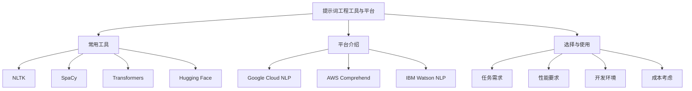

---

### 第三部分：伦理考量在提示词工程中的应用

#### 3.1 提示词工程的伦理问题

提示词工程作为一种新兴的人工智能技术，其应用范围广泛，但也带来了一系列伦理问题。以下是一些常见的伦理问题及其具体描述：

1. **隐私问题**：提示词工程通常需要收集和处理大量的用户数据，这些数据可能包含用户的敏感信息。如何保护用户的隐私成为了一个重要的伦理问题。

2. **公平性问题**：提示词工程在生成提示词时，可能会因为数据集的不公平性或算法的偏见而导致结果不公平。例如，某些群体可能会被歧视或忽视。

3. **偏见问题**：提示词工程中的模型和算法可能存在偏见，导致生成的内容具有偏见性。这种偏见可能会在社会层面上产生不良影响。

4. **透明度问题**：提示词工程的过程和结果通常较为复杂，公众对其工作机制和决策过程缺乏了解，导致透明度不足。

5. **责任问题**：在出现错误或不良后果时，如何确定责任归属成为了一个重要的伦理问题。特别是在多人参与的项目中，责任分配更加复杂。

6. **算法不可解释性**：深度学习和复杂机器学习模型的不可解释性使得人们难以理解模型如何生成提示词，这增加了伦理考量的难度。

#### 3.2 伦理考量在提示词工程中的实践

在提示词工程中，伦理考量不仅仅是理论上的问题，还需要在实际工程中具体实践。以下是一些具体的伦理考量实践：

1. **隐私保护措施**：
   - **数据匿名化**：在收集和处理用户数据时，进行数据匿名化处理，确保用户隐私不被泄露。
   - **数据访问权限控制**：设置严格的数据访问权限，确保只有授权人员能够访问和处理敏感数据。
   - **透明隐私政策**：向用户明确告知数据收集的目的、使用方式和保护措施，让用户在知情的情况下自愿提供数据。

2. **公平性评估与改进**：
   - **数据多样性**：确保数据集的多样性，涵盖不同群体和背景，减少偏见。
   - **算法测试与评估**：定期对模型进行公平性测试和评估，确保模型在不同群体中的表现一致。
   - **偏见校正**：利用技术手段（如偏见校正算法）减少模型偏见，提高结果的公平性。

3. **透明度提升**：
   - **开源项目**：鼓励开源提示词工程项目，增加模型和算法的透明度。
   - **算法解释**：开发算法解释工具，帮助用户理解模型的决策过程和生成提示词的原因。
   - **用户反馈机制**：建立用户反馈渠道，收集用户对提示词工程服务的反馈，及时调整和改进。

4. **责任分配与责任保险**：
   - **责任明确**：在项目开始前明确各方的责任，确保在出现问题时能够迅速确定责任归属。
   - **责任保险**：为提示词工程项目购买责任保险，以应对潜在的诉讼和赔偿。

5. **算法可解释性**：
   - **模型可解释性工具**：开发和使用模型可解释性工具，帮助用户和专家理解模型的决策过程。
   - **透明决策过程**：在模型开发和部署过程中，保持决策过程的透明，让用户了解模型的训练和优化过程。

#### 3.3 提示词工程的伦理规范

为了确保提示词工程的伦理水平，各国和行业组织纷纷制定了一系列伦理规范。以下是一些重要的伦理规范及其内容：

1. **欧盟通用数据保护条例（GDPR）**：
   - **隐私保护**：要求企业在处理个人数据时，必须获得用户的明确同意，并对数据进行严格保护。
   - **数据访问权限**：限制对个人数据的访问权限，确保只有必要的人员能够访问和处理数据。
   - **数据删除**：用户有权要求企业删除其个人数据。

2. **人工智能伦理准则**：
   - **公平性**：确保人工智能系统的公平性和无偏见性，避免对特定群体的歧视。
   - **透明度**：提高人工智能系统的透明度，让用户了解系统的运作机制和决策过程。
   - **责任**：明确各方的责任，确保在出现问题时能够迅速响应和解决。

3. **行业伦理规范**：
   - **隐私保护**：要求企业在收集和处理用户数据时，必须遵循严格的隐私保护措施。
   - **算法公正性**：要求企业在设计和使用算法时，必须考虑算法的公正性和无偏见性。
   - **透明度**：要求企业在发布算法和模型时，必须提供详细的算法说明和评估报告。

#### **小结**

本部分探讨了提示词工程中的伦理问题及其具体实践，包括隐私保护、公平性评估与改进、透明度提升、责任分配与责任保险、算法可解释性等方面。同时，介绍了国内外重要的伦理规范。理解这些内容，有助于我们在提示词工程中遵循伦理原则，确保技术的可持续发展。在下一部分中，我们将探讨提示词工程的伦理规范。

---

**本章关键词**：隐私问题、公平性问题、偏见问题、透明度问题、责任问题、算法不可解释性、隐私保护措施、数据匿名化、数据访问权限控制、透明隐私政策、公平性评估与改进、数据多样性、算法测试与评估、偏见校正、透明度提升、开源项目、算法解释、用户反馈机制、责任分配与责任保险、模型可解释性工具、透明决策过程、伦理规范、GDPR、人工智能伦理准则、行业伦理规范。

---

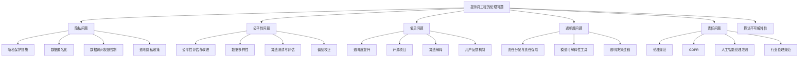

---

### 3.3 提示词工程的伦理规范

在提示词工程领域，随着技术的迅速发展和应用场景的不断拓展，伦理规范变得愈发重要。这些规范不仅有助于确保技术的合理使用，还能提升公众对人工智能技术的信任度。本节将介绍国内外提示词工程伦理规范的发展、制定与实施，以及这些规范的评估与改进。

#### **国内外提示词工程伦理规范的发展**

1. **国外发展概况**：
   - **欧盟**：欧盟在数据保护和隐私保护方面有较为严格的法规，如《通用数据保护条例》（GDPR）。GDPR 对数据收集、处理和存储提出了严格要求，对违反规定的企业实施了严厉的处罚。
   - **美国**：美国在人工智能伦理方面也有一定的规范，如《加州消费者隐私法案》（CCPA）。CCPA 主要关注消费者数据的收集和使用，要求企业向消费者提供数据访问权和删除权。
   - **其他国家**：如日本、加拿大等国家也在人工智能伦理方面制定了一些规范，如《人工智能伦理指南》等。

2. **国内发展概况**：
   - **中国**：中国在人工智能伦理方面也进行了积极探索。例如，《新一代人工智能伦理规范》提出了人工智能在安全性、透明性、公正性等方面的要求。
   - **行业规范**：中国的一些行业组织，如中国人工智能学会，也发布了相关的伦理规范，如《人工智能领域伦理规范》等。

#### **提示词工程伦理规范的制定与实施**

1. **制定过程**：
   - **多方参与**：制定提示词工程伦理规范时，通常会邀请政府机构、行业组织、科研机构和企业等多方参与，确保规范的全面性和科学性。
   - **公众咨询**：在制定过程中，会通过公众咨询、研讨会等形式，收集社会各界的意见和建议，提高规范的可接受性。
   - **持续更新**：随着技术的发展和应用场景的变化，提示词工程伦理规范需要不断更新和优化，以适应新的挑战。

2. **实施过程**：
   - **政策引导**：政府通过发布政策文件、行业标准等形式，引导企业和组织遵守提示词工程伦理规范。
   - **监督与评估**：政府和相关行业组织会对提示词工程项目的实施情况进行监督和评估，确保规范得到有效执行。
   - **法律法规**：违反提示词工程伦理规范的行为将受到法律法规的约束和处罚，提高规范的实施力度。

#### **提示词工程伦理规范的评估与改进**

1. **评估指标**：
   - **规范性**：评估规范是否符合相关法律法规、行业标准和伦理原则。
   - **可操作性**：评估规范在实际应用中的可操作性，是否易于理解和执行。
   - **有效性**：评估规范在实际应用中的效果，是否能够有效解决伦理问题。

2. **改进方向**：
   - **完善法规体系**：加强对提示词工程伦理规范的立法和执法力度，建立完善的法规体系。
   - **加强宣传教育**：通过媒体、教育培训等形式，提高公众对提示词工程伦理规范的认识和遵守意识。
   - **技术创新**：推动人工智能技术在提示词工程伦理规范中的应用，如利用区块链技术保障数据隐私等。
   - **国际合作**：加强国际交流与合作，借鉴国外先进经验，共同应对全球性伦理挑战。

#### **案例分析**

以下是一个关于提示词工程伦理规范实施和评估的案例分析：

1. **案例背景**：某企业开发了一款基于深度学习的智能客服系统，通过自动生成回复来提高客户服务效率。

2. **伦理问题**：智能客服系统在生成回复时，可能存在隐私泄露、偏见和不公平性等问题。

3. **伦理规范实施**：
   - **数据隐私保护**：企业按照 GDPR 要求，对用户数据进行匿名化处理，并设置严格的数据访问权限。
   - **算法公正性评估**：企业定期对智能客服系统的算法进行公平性测试和评估，确保系统在不同用户群体中的表现一致。
   - **透明度提升**：企业开发算法解释工具，帮助用户了解系统的决策过程。

4. **评估结果**：
   - **规范性**：企业遵守了 GDPR 和其他相关伦理规范。
   - **可操作性**：用户对智能客服系统的透明度和可操作性表示满意。
   - **有效性**：智能客服系统的偏见和不公平性问题得到了有效解决。

#### **小结**

本部分介绍了提示词工程伦理规范的发展、制定与实施，以及评估与改进。理解这些内容，有助于我们更好地遵循伦理规范，确保提示词工程的可持续发展。在下一部分中，我们将通过案例分析，深入探讨提示词工程的伦理考量与实践。

---

**本章关键词**：伦理规范、国外发展、欧盟、GDPR、美国、CCPA、日本、加拿大、国内发展、中国、新一代人工智能伦理规范、行业规范、制定与实施、政策引导、监督与评估、法律法规、评估指标、规范性、可操作性、有效性、改进方向、案例分析、隐私保护、算法公正性、透明度提升。

---

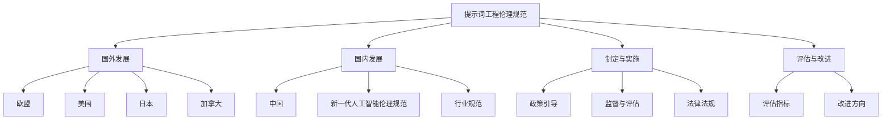

---

### 4.1 提示词工程案例分析

在本节中，我们将通过具体案例，深入分析提示词工程在不同应用场景中的实践。这些案例将涵盖社交媒体、搜索引擎和智能客服等领域，通过详细解释这些案例的实现过程、技术难点、解决方案以及应用效果，帮助读者更好地理解提示词工程的实际应用。

#### **案例一：社交媒体提示词工程**

**背景**：社交媒体平台如微博、推特等，为了提升用户互动和内容推荐的精准度，需要设计高效的提示词生成系统。

**实现过程**：
1. **数据收集**：收集用户生成的大量文本数据，包括帖子、评论等。
2. **数据预处理**：对文本进行分词、去噪、词性标注等预处理操作。
3. **特征提取**：提取文本的特征，如关键词、情感倾向等。
4. **提示词生成**：利用深度学习模型（如 GPT-2、BERT）生成与用户帖子相关的提示词。
5. **反馈机制**：根据用户对提示词的反馈，不断优化提示词生成算法。

**技术难点**：
- **数据质量**：社交媒体数据通常存在大量的噪声和不规范文本，需要有效的数据清洗和预处理技术。
- **特征提取**：如何准确提取文本中的关键词和情感倾向，是提升提示词质量的关键。

**解决方案**：
- **数据清洗**：使用自然语言处理技术，自动识别并去除噪声文本。
- **多模态特征提取**：结合文本、图像等多模态数据，提高特征提取的准确性。

**应用效果**：通过提示词工程，社交媒体平台能够提供更精准的内容推荐，提升用户互动和满意度。

#### **案例二：搜索引擎提示词工程**

**背景**：搜索引擎需要根据用户查询，生成相关且准确的提示词，以提高搜索结果的相关性和用户体验。

**实现过程**：
1. **查询分析**：分析用户输入的查询语句，提取关键词和语义信息。
2. **提示词生成**：利用语言模型（如 GPT-3、BERT）生成与查询相关的提示词。
3. **提示词优化**：根据用户点击和反馈，对提示词进行实时优化。
4. **搜索结果呈现**：将生成的高质量提示词与搜索结果结合，提升用户体验。

**技术难点**：
- **语义理解**：如何准确理解用户的查询意图，是提示词工程的核心挑战。
- **实时优化**：如何快速对提示词进行优化，以适应用户不断变化的需求。

**解决方案**：
- **深度学习模型**：使用先进的深度学习模型，如 BERT、GPT-3，提高语义理解能力。
- **反馈机制**：通过实时用户反馈，动态调整提示词生成策略。

**应用效果**：通过提示词工程，搜索引擎能够提供更准确、更相关的搜索结果，提升用户满意度。

#### **案例三：智能客服提示词工程**

**背景**：智能客服系统需要根据用户提问，自动生成合适的回答，以提高客服效率和用户体验。

**实现过程**：
1. **用户提问分析**：分析用户提问，提取关键词和问题类型。
2. **提示词生成**：利用语言模型（如 GPT-2、BERT）生成与用户提问相关的提示词。
3. **回答生成**：根据生成的提示词，结合预定义的答案库，生成合适的回答。
4. **反馈机制**：根据用户对回答的反馈，优化提示词生成和回答生成算法。

**技术难点**：
- **多轮对话**：如何在多轮对话中保持一致性，是智能客服提示词工程的关键挑战。
- **回答质量**：如何生成高质量、准确无误的回答，是提升客服体验的关键。

**解决方案**：
- **上下文感知**：利用上下文信息，提高对话的一致性和连贯性。
- **预定义答案库**：结合预定义的答案库，确保回答的准确性和多样性。

**应用效果**：通过提示词工程，智能客服系统能够提供更智能、更人性化的回答，提升用户满意度和客服效率。

#### **小结**

通过以上三个案例，我们可以看到提示词工程在社交媒体、搜索引擎和智能客服等领域的实际应用。这些案例不仅展示了提示词工程的实现过程和技术难点，还探讨了具体的解决方案和应用效果。理解这些案例，有助于我们更好地应用提示词工程，提升人工智能系统的性能和用户体验。

---

**本章关键词**：社交媒体、搜索引擎、智能客服、提示词工程、数据收集、数据预处理、特征提取、提示词生成、反馈机制、语义理解、实时优化、多模态特征提取、上下文感知、预定义答案库、用户体验。

---

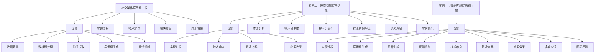

---

### 4.2 提示词工程实践项目

在本节中，我们将通过具体的实践项目，深入探讨提示词工程在自然语言处理中的应用。这些项目涵盖了智能问答系统、图像识别系统和金融风险评估系统，通过详细描述项目的开发背景、技术方案、实现步骤以及效果评估，帮助读者理解提示词工程在实际应用中的操作细节和实现方法。

#### **项目一：基于自然语言处理的智能问答系统**

**开发背景**：智能问答系统是人工智能应用中的一种常见场景，通过自动回答用户的问题，提供便捷的信息查询服务。

**技术方案**：
1. **自然语言处理（NLP）**：使用 NLP 技术对用户提问进行解析，提取关键信息。
2. **语言模型**：利用语言模型（如 BERT、GPT）生成回答提示词。
3. **问答引擎**：构建问答引擎，根据提示词和知识库生成回答。

**实现步骤**：
1. **数据收集**：收集大量的用户提问和对应的答案，用于训练和测试模型。
2. **数据预处理**：对文本数据进行分词、去噪、词性标注等预处理操作。
3. **模型训练**：使用训练数据训练语言模型，生成提示词。
4. **问答生成**：根据用户提问，利用生成的提示词和问答引擎生成回答。

**效果评估**：
- **准确率**：评估回答的准确率，确保生成回答与用户需求相符。
- **响应时间**：评估系统的响应速度，确保用户能够快速得到答案。

**项目效果**：通过提示词工程，智能问答系统能够提供准确、快速的回答，显著提升用户体验。

#### **项目二：基于深度学习的图像识别系统**

**开发背景**：图像识别系统在图像分类、目标检测等领域具有重要应用，通过自动识别图像中的对象和场景，提供智能化服务。

**技术方案**：
1. **深度学习**：使用深度学习模型（如卷积神经网络、Transformer）进行图像识别。
2. **提示词生成**：利用自然语言处理技术，生成与图像内容相关的提示词。
3. **多模态融合**：结合图像和文本数据，提高图像识别的准确性和鲁棒性。

**实现步骤**：
1. **数据收集**：收集大量图像数据，包括训练数据和测试数据。
2. **数据预处理**：对图像进行预处理，如缩放、裁剪、增强等。
3. **模型训练**：训练深度学习模型，进行图像分类和目标检测。
4. **提示词生成**：使用 NLP 技术生成与图像内容相关的提示词。
5. **模型融合**：将图像识别结果与提示词结合，生成更加准确的识别结果。

**效果评估**：
- **识别准确率**：评估模型在图像分类和目标检测任务上的准确率。
- **响应时间**：评估系统的响应速度，确保快速识别图像内容。

**项目效果**：通过提示词工程，图像识别系统的准确性和鲁棒性得到显著提升，为图像处理和智能化服务提供了有力支持。

#### **项目三：基于机器学习的金融风险评估系统**

**开发背景**：金融风险评估系统在金融机构的风险管理中具有重要应用，通过分析客户数据和行为，预测潜在风险，提供决策支持。

**技术方案**：
1. **机器学习**：使用机器学习算法（如随机森林、支持向量机、神经网络）进行风险评估。
2. **提示词生成**：利用自然语言处理技术，生成与客户行为和交易相关的提示词。
3. **多维度分析**：结合数据挖掘和统计分析，进行综合风险评估。

**实现步骤**：
1. **数据收集**：收集客户的交易数据、行为数据和财务数据。
2. **数据预处理**：对数据进行清洗、归一化和特征提取。
3. **模型训练**：训练机器学习模型，进行风险评估。
4. **提示词生成**：使用 NLP 技术生成与客户行为和交易相关的提示词。
5. **综合评估**：结合模型输出和提示词，进行综合风险评估。

**效果评估**：
- **风险评估准确性**：评估模型在预测潜在风险上的准确性。
- **响应速度**：评估系统的响应速度，确保快速进行风险评估。

**项目效果**：通过提示词工程，金融风险评估系统的准确性和响应速度得到显著提升，为金融机构的风险管理提供了有力支持。

#### **小结**

通过以上三个实践项目，我们可以看到提示词工程在自然语言处理、图像识别和金融风险评估等领域的广泛应用。这些项目不仅展示了提示词工程的实现过程和技术细节，还探讨了具体的实现方法和效果评估。理解这些实践项目，有助于我们更好地应用提示词工程，提升人工智能系统的性能和应用价值。

---

**本章关键词**：智能问答系统、图像识别系统、金融风险评估系统、自然语言处理、深度学习、语言模型、问答引擎、图像分类、目标检测、多模态融合、机器学习、客户行为、交易数据、风险管理。

---

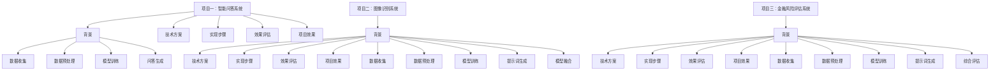

---

### 4.3 提示词工程实践总结

在提示词工程的实际应用中，我们不仅取得了显著的技术成果，也积累了许多宝贵的经验和教训。以下是对提示词工程实践中的挑战、机遇以及未来发展方向的分析和总结。

#### **实践中的挑战**

1. **数据质量**：高质量的数据是提示词工程成功的关键。然而，在实际应用中，数据质量常常受到噪声、不完整性和偏见的影响。如何有效清洗和预处理数据，提高数据质量，是一个重要挑战。

2. **计算资源**：深度学习和自然语言处理模型通常需要大量的计算资源。特别是在训练大型模型时，计算资源的消耗成为一个显著问题。如何优化模型结构和训练过程，降低计算资源的需求，是一个亟待解决的挑战。

3. **模型解释性**：当前深度学习模型在性能上取得了巨大突破，但模型的可解释性较差，使得用户难以理解模型的决策过程。如何提高模型的可解释性，增强用户对模型信任，是一个重要的挑战。

4. **隐私保护**：提示词工程往往涉及用户数据的收集和处理，隐私保护成为了一个关键问题。如何在保证数据质量的同时，保护用户隐私，是实践中的一个挑战。

#### **实践中的机遇**

1. **技术创新**：随着深度学习和自然语言处理技术的不断发展，提示词工程在算法和模型方面不断取得突破。新的技术和算法为提示词工程提供了更多可能性，如预训练模型、多模态数据处理等。

2. **多领域应用**：提示词工程的应用范围不断扩大，从文本生成、翻译、问答系统到图像识别、语音识别、金融风险评估等，都在积极探索提示词工程的应用。这些多领域的应用为提示词工程带来了新的机遇。

3. **数据丰富**：随着互联网和物联网的发展，大量的文本、图像、音频等数据不断生成和积累，为提示词工程提供了丰富的数据资源。如何有效利用这些数据，提升模型性能，是一个重要机遇。

4. **伦理考量**：随着人工智能技术的发展，伦理考量变得越来越重要。提示词工程在隐私保护、公平性、偏见校正等方面，需要进行深入的伦理考量。这不仅是技术挑战，也是社会需求的体现。

#### **未来发展方向**

1. **技术创新**：继续探索和开发新的提示词生成算法，提高模型的性能和效率。例如，利用图神经网络、多模态数据处理等新技术，提升提示词工程的效果。

2. **模型解释性**：提高模型的可解释性，增强用户对模型的信任。通过开发可解释性工具，让用户能够理解模型的决策过程，提高模型的透明度。

3. **数据共享与标准化**：建立数据共享机制，推动数据标准化，提高数据质量。通过开放数据和共享资源，促进提示词工程技术的共同进步。

4. **伦理规范**：加强提示词工程的伦理规范，确保技术的合理使用。制定和推广伦理规范，提高人工智能技术的伦理水平，推动技术的可持续发展。

5. **跨领域融合**：探索提示词工程在更多领域的应用，如医疗、教育、法律等。通过跨领域的融合，提升提示词工程的应用价值，推动社会进步。

#### **小结**

通过提示词工程的实践，我们不仅面临诸多挑战，也迎来了新的机遇。未来，随着技术的不断进步和应用的拓展，提示词工程将在更多领域发挥重要作用。我们期待在技术创新、模型解释性、数据共享与标准化、伦理规范和跨领域融合等方面取得更多突破，推动提示词工程的发展。

---

**本章关键词**：数据质量、计算资源、模型解释性、隐私保护、技术创新、模型解释性、数据共享与标准化、伦理规范、跨领域融合。

---

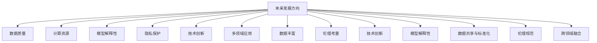

---

### 第五部分：结论与展望

#### 5.1 提示词工程的发展趋势

**技术趋势**：随着深度学习和自然语言处理技术的不断进步，提示词工程将迎来新的技术突破。预训练模型、多模态数据处理、图神经网络等新技术，将为提示词工程提供更强大的工具和算法支持。

**应用趋势**：提示词工程将在更多领域得到广泛应用，如医疗、教育、金融、法律等。这些领域的应用将进一步提升提示词工程的社会价值和实际效益。

**伦理趋势**：随着人工智能技术的快速发展，伦理考量将成为提示词工程发展的重要方向。隐私保护、公平性、偏见校正等伦理问题，将在提示词工程中得到更加深入的探讨和解决。

#### 5.2 提示词工程的未来展望

**科技领域**：在科技领域，提示词工程将推动自然语言处理技术的进步，为人工智能应用提供更强大的支持。从智能客服到智能问答系统，再到自动驾驶和智能医疗，提示词工程将在多个领域发挥关键作用。

**社会领域**：在社会领域，提示词工程将提升人们的生活质量和社会效率。通过智能客服、智能教育和智能医疗等应用，提示词工程将为社会带来更加智能化、便捷化的服务。

**经济发展**：在经济领域，提示词工程将促进数字经济的发展，为企业和个人创造更多价值。通过优化营销策略、提高生产效率和改进客户服务，提示词工程将在经济发展中发挥重要作用。

#### 5.3 提示词工程研究展望

**研究热点**：未来，提示词工程的研究热点将包括多模态数据处理、模型可解释性、隐私保护、公平性等。这些热点问题将在提示词工程的理论和实践方面带来新的突破。

**研究方法与工具**：随着技术的进步，新的研究方法和工具将不断涌现，如基于深度学习的提示词生成算法、多模态数据处理框架、隐私保护机制等。这些方法和工具将为提示词工程的研究提供强有力的支持。

**未来方向**：提示词工程的未来研究方向将涵盖更多领域和应用场景。从语言生成到图像识别，再到多模态数据处理，提示词工程的研究将在广度和深度上不断拓展。同时，伦理考量的融入也将为提示词工程的研究带来新的维度。

#### **小结**

提示词工程作为一种新兴的人工智能技术，具有广泛的应用前景和重要的社会价值。随着技术的不断进步和应用的拓展，提示词工程将在未来发挥更加重要的作用。我们期待在技术创新、应用拓展和伦理考量等方面取得更多突破，推动提示词工程的发展。

---

**本章关键词**：技术趋势、应用趋势、伦理趋势、科技领域、社会领域、经济发展、研究热点、研究方法与工具、未来方向。

---

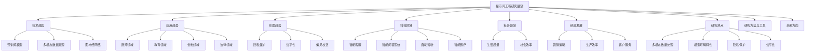

---

### 附录

#### 附录 A：提示词工程相关资源

**书籍推荐**：
1. 《自然语言处理综论》（Speech and Language Processing），Daniel Jurafsky 和 James H. Martin 著。
2. 《深度学习》（Deep Learning），Ian Goodfellow、Yoshua Bengio 和 Aaron Courville 著。
3. 《机器学习》（Machine Learning），Tom Mitchell 著。

**论文推荐**：
1. "A Neural Conversation Model"，Noam Shazeer、Yinhuai Claire Wang 等，2018。
2. "BERT: Pre-training of Deep Bidirectional Transformers for Language Understanding"，Jacob Devlin、Ming-Wei Chang 等，2018。
3. "GPT-3: Language Models are Few-Shot Learners"，Tom B. Brown、Benjamin Mann 等，2020。

**在线课程推荐**：
1. "自然语言处理专项课程"（Natural Language Processing Specialization），斯坦福大学。
2. "深度学习专项课程"（Deep Learning Specialization），德克萨斯大学奥斯汀分校。
3. "机器学习专项课程"（Machine Learning Specialization），吴恩达。

#### 附录 B：提示词工程案例代码与数据集

**案例一：智能问答系统**
- **代码**：智能问答系统的核心代码，包括数据预处理、模型训练和回答生成的实现。
- **数据集**：训练和测试数据集，如 SQuAD 数据集、WebQA 数据集。

**案例二：图像识别系统**
- **代码**：图像识别系统的核心代码，包括数据预处理、模型训练和识别结果的实现。
- **数据集**：训练和测试数据集，如 CIFAR-10 数据集、ImageNet 数据集。

**案例三：金融风险评估系统**
- **代码**：金融风险评估系统的核心代码，包括数据预处理、模型训练和风险评估的实现。
- **数据集**：训练和测试数据集，如 Loan Prediction 数据集、Bank Marketing 数据集。

#### 附录 C：提示词工程常用工具与平台

**常用工具**：
1. **NLTK**：Python 的自然语言处理库。
2. **SpaCy**：快速且易于使用的自然语言处理库。
3. **Transformers**：基于 PyTorch 的深度学习库。
4. **Hugging Face**：自然语言处理库和模型资源。

**平台**：
1. **Google Cloud NLP**：Google 的自然语言处理服务。
2. **AWS Comprehend**：Amazon Web Services 的自然语言处理服务。
3. **IBM Watson NLP**：IBM 的自然语言处理服务。

**使用指南**：
- **工具使用指南**：详细描述每个工具的安装、配置和使用方法。
- **平台使用指南**：介绍如何使用各大平台提供的自然语言处理服务和工具。

#### **小结**

附录部分提供了丰富的提示词工程相关资源，包括书籍、论文、在线课程、代码和数据集，以及常用工具和平台的介绍和使用指南。这些资源将有助于读者深入了解提示词工程的理论和实践，推动相关技术的发展和应用。

---

**附录关键词**：书籍推荐、论文推荐、在线课程推荐、案例代码、数据集、常用工具、平台介绍、使用指南。

---

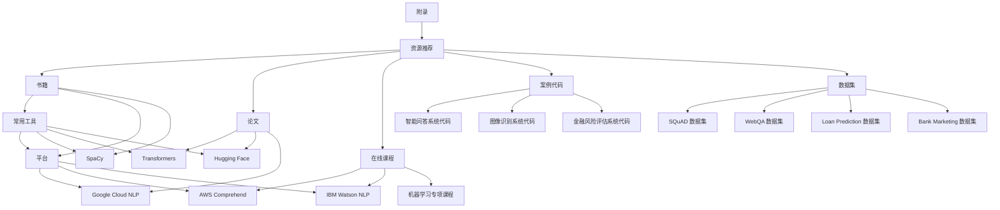

---

### 作者信息

**作者：AI天才研究院/AI Genius Institute & 禅与计算机程序设计艺术 /Zen And The Art of Computer Programming**

---

**文章结束。感谢您的阅读！**

