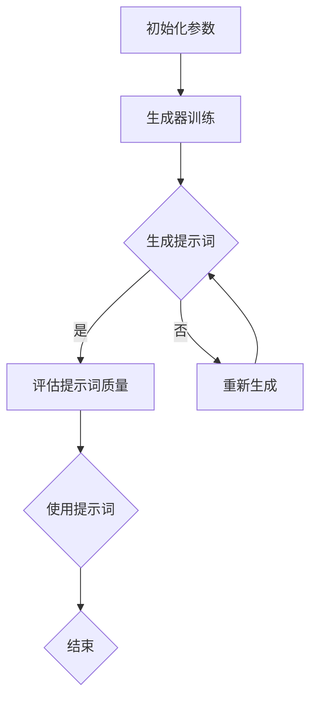

                 

# 提示词工程：让AI更智能、更懂人心

## 关键词
- AI提示词工程
- 提示词生成
- 机器学习
- 自然语言处理
- 文本数据预处理
- 聊天机器人
- 问答系统
- 自动写作

## 摘要
本文深入探讨了AI提示词工程的核心概念、技术原理以及实际应用。通过详细的步骤分析和实例讲解，本文揭示了如何通过优化提示词来提升AI模型的智能程度和理解能力。文章分为三个主要部分：第一部分引入与概述，介绍提示词工程的重要性及其面临的挑战与机遇；第二部分实践，详细讲解文本数据预处理、提示词生成和应用场景；第三部分展望，探讨提示词工程的未来趋势与发展前景。本文旨在为读者提供一个全面、系统的了解和掌握提示词工程的方法和策略。

---

## 《提示词工程：让AI更智能、更懂人心》目录大纲

### 第一部分：引入与概述

#### 第1章：提示词工程概述

##### 1.1 提示词的定义与作用
- 提示词（Prompt）的定义
- 提示词在AI中的应用场景
- 提示词与模型输入的关系

##### 1.2 提示词工程的重要性
- 提示词在AI智能表现中的作用
- 提示词工程对提升AI模型性能的重要性

##### 1.3 提示词工程的挑战与机遇
- 数据多样性与提示词设计
- 技术进步带来的新机遇

##### 1.4 本书结构安排
- 各章节的核心内容与联系
- 学习目标与读者预期收获

### 第二部分：AI与机器学习基础

#### 第2章：机器学习基础

##### 2.1 机器学习的基本概念
- 机器学习的定义
- 监督学习、无监督学习、半监督学习

##### 2.2 常见机器学习算法
- 线性回归、逻辑回归、决策树、支持向量机

##### 2.3 深度学习基础
- 神经网络结构
- 深度学习优化算法

##### 2.4 自然语言处理概述
- 词嵌入技术
- 序列模型与注意力机制

### 第三部分：提示词工程实践

#### 第3章：提示词生成技术

##### 3.1 提示词生成方法
- 文本生成模型（如GPT系列）
- 问答系统（如BERT）

##### 3.2 提示词优化策略
- 提示词长度与复杂度
- 提示词多样性

##### 3.3 提示词生成算法
- 生成对抗网络（GAN）
- 强化学习在提示词生成中的应用

#### 第4章：文本数据预处理

##### 4.1 文本数据清洗
- 去除停用词
- 处理文本中的标点符号

##### 4.2 文本分词与词性标注
- 常见分词算法
- 词性标注方法与应用

##### 4.3 提示词模板设计
- 提示词模板的结构与类型
- 提示词模板的设计原则

#### 第5章：提示词应用场景

##### 5.1 聊天机器人
- 提示词在聊天机器人中的应用
- 聊天机器人的设计与实现

##### 5.2 问答系统
- 提示词在问答系统中的应用
- 问答系统的设计与实现

##### 5.3 自动写作
- 提示词在自动写作中的应用
- 自动写作系统的设计与实现

### 第四部分：提示词工程工具与平台

#### 第6章：提示词工程工具与平台

##### 6.1 常见提示词工具介绍
- Hugging Face Transformers
- NLTK

##### 6.2 提示词工程平台选择
- 本地部署与云端部署
- 常见提示词工程平台对比

##### 6.3 提示词工程实践案例
- 提示词工程在各大公司的应用案例
- 提示词工程的最佳实践

### 第五部分：提示词工程安全与伦理

#### 第7章：提示词工程安全与伦理

##### 7.1 提示词工程中的安全问题
- 提示词泄露风险
- 提示词滥用风险

##### 7.2 提示词工程中的伦理问题
- 数据隐私保护
- 提示词工程的社会责任

##### 7.3 提示词工程安全与伦理最佳实践
- 安全措施与策略
- 伦理审查与规范

### 第六部分：未来趋势与展望

#### 第8章：未来趋势与展望

##### 8.1 提示词工程的未来趋势
- 人工智能技术的发展方向
- 提示词工程的新技术、新方法

##### 8.2 提示词工程的发展前景
- 提示词工程在各个行业的应用前景
- 提示词工程对人工智能发展的推动作用

### 第七部分：总结与反思

#### 第9章：总结与反思

##### 9.1 提示词工程的核心要点
- 提示词工程的基本概念与核心原理
- 提示词工程的主要方法和应用场景

##### 9.2 提示词工程的实践启示
- 提示词工程的实践经验与教训
- 提示词工程对人工智能发展的贡献

##### 9.3 提示词工程的未来方向
- 提示词工程的发展方向与挑战
- 提示词工程在人工智能时代的机遇与使命

### 附录

#### 附录A：提示词工程工具与资源列表

#### 附录B：常见提示词生成算法Mermaid流程图

#### 附录C：提示词工程数学公式汇总与详细讲解

#### 附录D：提示词工程项目实战案例

##### D.1 聊天机器人开发实战

##### D.2 问答系统开发实战

##### D.3 自动写作开发实战

##### D.4 提示词工程开发环境搭建与源代码解读

---

### 第一部分：引入与概述

#### 第1章：提示词工程概述

### 1.1 提示词的定义与作用

提示词，顾名思义，是引导或提示AI模型进行某种任务或决策的关键输入信息。在AI模型中，提示词的作用类似于人类交流中的话题引导词，它帮助模型明确任务目标，优化决策路径，提高模型输出的准确性和效率。

**定义：**
提示词（Prompt）是指提供给AI模型用于训练或推理的初始输入文本，用于引导模型进行特定任务。它可以是一个问题、一个命令、一个主题或者一段背景信息。

**作用：**
1. **任务引导**：提示词可以帮助模型明确任务目标，例如在问答系统中，提示词可以是一个问题。
2. **数据增强**：通过设计合适的提示词，可以增强训练数据的有效性，提高模型性能。
3. **推理优化**：提示词有助于模型在推理过程中更好地理解输入信息，提高推理的准确性和效率。
4. **多样性提升**：通过设计多样化的提示词，可以促进模型输出的多样性，避免生成重复或刻板的内容。

**应用场景：**
- **聊天机器人**：提示词用于引导聊天机器人的对话方向，使其能够更好地理解用户意图。
- **问答系统**：提示词帮助问答系统明确用户的问题，提高答案的准确性和相关性。
- **自动写作**：提示词用于指导生成文章的主题和内容，提高写作的连贯性和创意性。
- **图像识别**：提示词可以帮助模型更好地识别图像中的特定对象或场景。

### 1.2 提示词工程的重要性

在当前的人工智能时代，提示词工程的重要性日益凸显。首先，提示词是AI模型输入的重要组成部分，直接影响模型的训练效果和推理性能。一个设计合理的提示词可以显著提升模型的理解能力和任务完成度。其次，提示词工程是自然语言处理领域的关键技术之一，与语言生成、语义理解、对话系统等密切相关。通过优化提示词，可以提升AI模型在多种场景下的应用效果。

**提升AI智能表现：**
- **增强理解能力**：通过设计针对性的提示词，可以引导模型更好地理解输入文本的语义，提高模型的语义理解能力。
- **优化决策路径**：提示词可以帮助模型明确任务目标，优化决策路径，提高模型的决策效率和准确性。
- **提高生成质量**：在文本生成任务中，合理的提示词可以引导模型生成更高质量、更具创造性的内容。

**促进AI发展：**
- **技术融合**：提示词工程促进了机器学习、自然语言处理、对话系统等技术的融合与发展。
- **应用拓展**：通过优化提示词，可以拓展AI模型在更多场景下的应用，推动AI技术的普及与应用。

### 1.3 提示词工程的挑战与机遇

尽管提示词工程具有巨大的潜力和应用价值，但也面临着一系列挑战和机遇。

**挑战：**
- **数据多样性与质量**：设计高质量、多样化的提示词需要大量的高质量数据，而获取和处理这些数据是一个复杂且耗时的过程。
- **模型适应性**：提示词的设计需要针对不同模型和任务特点进行调整，提高模型的适应性是一个挑战。
- **伦理与安全**：提示词工程涉及到用户的隐私和数据安全，需要考虑伦理和安全问题。

**机遇：**
- **技术进步**：随着人工智能技术的不断发展，新一代模型和算法的推出为提示词工程提供了更多可能性。
- **应用拓展**：AI技术在各个领域的应用不断拓展，为提示词工程带来了更广阔的市场和发展空间。
- **协作与共享**：学术界和工业界的合作，共享提示词资源和研究成果，有助于推动整个领域的进步。

### 1.4 本书结构安排

本书共分为三个主要部分，各章节的核心内容与联系如下：

- **第一部分：引入与概述**
  - 第1章 提示词工程概述：介绍提示词工程的基本概念、重要性和挑战与机遇。

- **第二部分：AI与机器学习基础**
  - 第2章 机器学习基础：讲解机器学习的基本概念、常见算法和深度学习基础。
  - 第3章 自然语言处理概述：介绍自然语言处理的相关技术，包括词嵌入、序列模型和注意力机制。

- **第三部分：提示词工程实践**
  - 第4章 提示词生成技术：讲解提示词的生成方法、优化策略和生成算法。
  - 第5章 文本数据预处理：介绍文本数据预处理的方法、提示词模板设计。
  - 第6章 提示词应用场景：探讨提示词在不同应用场景中的应用和实现。

通过本书的学习，读者可以系统地了解和掌握提示词工程的基本概念、技术原理和实际应用，为未来的研究和实践打下坚实的基础。本书的学习目标是为读者提供一个全面、系统的了解和掌握提示词工程的方法和策略，使其能够有效地应用于各种AI任务和场景。

### 1.5 读者预期收获

通过阅读本书，读者可以期待获得以下收获：

- **深入理解**：掌握提示词工程的基本概念、技术原理和应用方法。
- **实践技能**：通过实例分析和项目实战，提升在实际场景中设计和使用提示词的技能。
- **创新思维**：启发对AI技术的新思路，探索提示词工程在未来的应用和发展方向。
- **职业发展**：为从事人工智能、自然语言处理、机器学习等相关领域的工作者提供有力支持和职业发展机会。

### 第二部分：AI与机器学习基础

#### 第2章：机器学习基础

### 2.1 机器学习的基本概念

机器学习（Machine Learning，ML）是人工智能（Artificial Intelligence，AI）的一个分支，它使计算机系统能够通过数据和经验不断改进其性能，而无需显式地编写指令。机器学习的核心目标是使计算机能够从数据中学习规律，并利用这些规律进行预测、决策或优化。

**定义：**
机器学习是一种让计算机通过数据学习并获得知识的方法。它利用算法从数据中提取模式和规律，然后使用这些模式和规律来做出预测或决策。

**机器学习类型：**
- **监督学习**（Supervised Learning）：在有标记数据集上进行训练，模型从输入和输出之间学习建立映射关系。
  - **分类**（Classification）：将数据分为不同的类别。
  - **回归**（Regression）：预测一个连续值。

- **无监督学习**（Unsupervised Learning）：在没有标记数据集上进行训练，模型试图发现数据中的隐藏结构和模式。
  - **聚类**（Clustering）：将相似的数据点分组。
  - **降维**（Dimensionality Reduction）：减少数据维度，便于数据分析和可视化。

- **半监督学习**（Semi-supervised Learning）：结合有标记和无标记数据，利用较少的标记数据和大量无标记数据进行训练。

### 2.2 常见机器学习算法

在机器学习中，有许多常用的算法，每种算法都有其特定的用途和优势。以下是一些常见的机器学习算法及其简要介绍：

**线性回归**（Linear Regression）
- **目标**：预测一个连续值。
- **公式**：
  $$ y = \beta_0 + \beta_1 \cdot x $$
- **应用场景**：房屋定价、股票预测等。

**逻辑回归**（Logistic Regression）
- **目标**：分类问题，输出概率。
- **公式**：
  $$ P(y=1) = \frac{1}{1 + e^{-(\beta_0 + \beta_1 \cdot x)}} $$
- **应用场景**：信用评分、疾病诊断等。

**决策树**（Decision Tree）
- **目标**：分类或回归。
- **结构**：通过一系列的判断节点和叶子节点，将数据集分割成多个子集。
- **应用场景**：分类问题、特征选择等。

**支持向量机**（Support Vector Machine，SVM）
- **目标**：分类和回归。
- **公式**：
  $$ w \cdot x - b = 0 $$
- **应用场景**：文本分类、图像识别等。

### 2.3 深度学习基础

深度学习（Deep Learning，DL）是机器学习的一个子领域，它通过构建深度神经网络（Deep Neural Networks）来模拟人脑的神经网络结构和工作方式。深度学习在图像识别、自然语言处理、语音识别等领域取得了显著的成果。

**神经网络结构：**
- **输入层**：接收输入数据。
- **隐藏层**：进行特征提取和变换。
- **输出层**：输出最终结果。

**深度学习优化算法：**
- **反向传播算法**（Backpropagation）：用于计算网络权重和偏置的梯度。
- **梯度下降算法**（Gradient Descent）：用于更新网络权重和偏置，优化网络性能。

### 2.4 自然语言处理概述

自然语言处理（Natural Language Processing，NLP）是计算机科学和人工智能的一个分支，它涉及对人类语言的理解和生成。NLP在机器翻译、情感分析、问答系统等领域有着广泛的应用。

**词嵌入技术：**
- **目标**：将词汇映射到高维空间，使其具有数值表示。
- **方法**：使用词袋模型（Bag of Words）、循环神经网络（RNN）、Transformer等。

**序列模型与注意力机制：**
- **序列模型**：处理序列数据的神经网络模型，如RNN、LSTM等。
- **注意力机制**：用于关注序列中重要的部分，提高模型处理长序列数据的能力。

### 2.5 提示词工程与机器学习的关系

提示词工程是机器学习中的重要组成部分，特别是在自然语言处理和对话系统中。以下是提示词工程与机器学习的一些关键关系：

- **数据输入**：提示词作为机器学习模型的输入，帮助模型更好地理解和处理任务。
- **模型训练**：通过设计合适的提示词，可以增强模型的训练效果，提高模型性能。
- **推理优化**：提示词在推理过程中帮助模型更好地理解输入信息，提高推理的准确性和效率。
- **模型适应性**：提示词工程通过优化提示词，提高模型在不同场景下的适应能力。

### 2.6 提示词工程在机器学习中的应用

提示词工程在机器学习中的应用广泛，以下是一些典型的应用场景：

- **聊天机器人**：通过设计合适的提示词，引导聊天机器人的对话方向，使其能够更好地理解用户意图。
- **问答系统**：提示词帮助问答系统明确用户的问题，提高答案的准确性和相关性。
- **文本生成**：提示词指导生成文本的主题和内容，提高文本的连贯性和创意性。
- **图像识别**：提示词用于引导模型识别图像中的特定对象或场景，提高识别的准确性。

通过本章节的学习，读者可以系统地了解机器学习的基本概念、常见算法、深度学习基础以及自然语言处理的相关技术，为后续章节中提示词工程的深入探讨打下坚实的基础。同时，读者也将认识到提示词工程在机器学习中的应用价值，了解如何通过设计合理的提示词来提升AI模型的性能和智能化程度。

### 提示词工程的重要性与影响

提示词工程作为人工智能（AI）领域的一个关键环节，对于提升AI模型的智能程度和理解能力具有至关重要的作用。以下从多个方面分析提示词工程的重要性与影响。

#### 一、增强语义理解

提示词工程的核心在于通过精心设计的提示词引导AI模型更好地理解输入文本的语义。在自然语言处理（NLP）任务中，如问答系统、聊天机器人、自动写作等，提示词的语义明确性直接影响到模型对问题的理解和回答的质量。一个合适的提示词能够引导模型捕捉到文本中的关键信息，从而提升模型的语义理解能力。

例如，在问答系统中，一个简单的提示词“请解释这个概念的背景”，就可以帮助模型更好地理解问题的背景，从而生成更加准确和详细的回答。

#### 二、优化模型训练效果

提示词的设计不仅影响模型对数据的理解，还会直接影响模型的训练效果。在设计提示词时，通过增加提示词的多样性和复杂性，可以使模型在训练过程中接触到更多样化的数据，从而提高模型的泛化能力。

例如，通过在文本生成任务中使用多种类型的提示词（如问题、陈述、命令等），可以使模型在训练过程中学习到更丰富的语言结构和表达方式，从而提高生成文本的质量和多样性。

#### 三、提升推理效率

在推理过程中，提示词的作用同样不可忽视。一个设计合理的提示词可以帮助模型更快地聚焦到关键信息，提高推理的效率。特别是在处理复杂任务时，如长文本分析或多轮对话系统，合理的提示词可以引导模型逐步深入问题，从而提高推理的准确性和效率。

例如，在多轮对话系统中，每个轮次的提示词可以针对用户的不同反馈进行细化，帮助模型更好地理解用户的意图，从而生成更加个性化的回答。

#### 四、促进跨领域应用

提示词工程通过优化提示词的设计和生成，可以促进AI模型在多个领域中的应用。例如，通过设计针对不同领域的特定提示词，可以使模型在不同任务间快速切换，提高模型的可复用性和适应性。

例如，在医疗领域，通过设计特定的医疗提示词，可以使AI模型快速应用于疾病诊断、病情分析等任务，从而提高医疗诊断的准确性和效率。

#### 五、提高用户体验

在面向用户的场景中，如聊天机器人、客户服务系统等，提示词工程的重要性尤为突出。通过设计符合用户需求的提示词，可以提升用户的交互体验，使AI系统更加自然、流畅地与用户进行沟通。

例如，在聊天机器人中，通过设计友好、亲切的提示词，可以使机器人与用户之间的对话更加自然，减少用户的操作负担，从而提高用户的满意度和使用频率。

#### 六、安全与伦理考量

提示词工程在安全与伦理方面也具有重要的意义。设计合理的提示词可以防止模型滥用或泄露敏感信息，保护用户的隐私和数据安全。此外，在涉及社会伦理问题时，提示词的设计需要充分考虑社会责任，避免模型输出产生不良影响。

例如，在自动写作系统中，通过设计符合伦理标准的提示词，可以避免生成具有歧视性、暴力倾向的内容，从而促进社会和谐与进步。

#### 结论

综上所述，提示词工程在提升AI模型的智能程度和理解能力、优化模型训练效果、提高推理效率、促进跨领域应用、提升用户体验以及安全与伦理考量等方面具有重要作用。通过不断优化提示词的设计和生成方法，我们可以推动AI技术的发展，使其更好地服务于人类社会。

### 提示词工程的挑战与机遇

尽管提示词工程在人工智能领域具有巨大的潜力，但其发展也面临诸多挑战和机遇。以下从技术、应用、伦理等方面探讨这些挑战与机遇。

#### 一、技术挑战

1. **数据多样性与质量**：
   设计高质量的提示词需要大量的高质量数据，但这些数据的获取和处理往往是一个复杂且耗时的过程。数据多样性的不足会导致模型在特定领域的表现不佳，影响模型的泛化能力。

2. **模型适应性**：
   提示词的设计需要针对不同模型和任务特点进行调整，以提高模型的适应性。然而，不同模型和任务的需求各异，使得设计普适的提示词变得困难。

3. **实时性**：
   在实时应用场景中，如聊天机器人、实时问答系统等，提示词的设计需要快速响应用户输入，这要求提示词工程具备高效的处理能力和适应性。

4. **计算资源**：
   提示词工程的实施通常需要大量的计算资源，特别是在训练大规模模型和生成复杂提示词时。如何优化计算资源，提高工程效率，是一个重要的挑战。

#### 二、应用挑战

1. **领域适应性**：
   提示词工程在不同领域中的应用效果差异较大，如何根据不同领域的需求设计特定的提示词，是一个需要解决的问题。

2. **用户体验**：
   提示词的设计需要充分考虑用户体验，确保AI系统能够自然、流畅地与用户互动，提供高质量的交互体验。

3. **数据隐私**：
   在涉及用户隐私的场景中，如何确保提示词工程不泄露用户的敏感信息，是一个重要的挑战。

#### 三、伦理挑战

1. **偏见与歧视**：
   提示词的设计可能引入偏见，导致模型输出具有歧视性或不公正的内容。如何消除这些偏见，是一个重要的伦理问题。

2. **数据安全**：
   提示词工程涉及到用户数据和模型参数，如何保护这些数据的安全，防止滥用和泄露，是一个重要的挑战。

3. **社会责任**：
   提示词工程在社会伦理方面需要承担一定的责任，如何确保AI系统的输出符合社会伦理标准，避免对社会造成负面影响，是一个需要关注的问题。

#### 四、机遇

1. **技术进步**：
   随着人工智能技术的不断发展，新一代模型和算法的推出为提示词工程提供了更多可能性。例如，生成对抗网络（GAN）、强化学习等技术的应用，可以显著提升提示词工程的效果和效率。

2. **应用拓展**：
   AI技术在各个领域的应用不断拓展，为提示词工程带来了更广阔的市场和发展空间。例如，在医疗、金融、教育等领域的应用，提示词工程有望发挥重要作用。

3. **协作与共享**：
   学术界和工业界的合作，共享提示词资源和研究成果，有助于推动整个领域的进步。通过建立开放的平台和标准，可以加速提示词工程的发展。

#### 结论

提示词工程的发展面临技术、应用和伦理等多方面的挑战与机遇。通过不断探索和优化，我们可以克服这些挑战，充分利用机遇，推动提示词工程的发展，为人工智能技术的进步和社会发展做出贡献。

### 提示词工程的未来发展趋势

随着人工智能技术的不断演进，提示词工程作为其关键组成部分，也展现出强劲的发展势头。以下是几个未来提示词工程可能的发展趋势：

#### 一、多模态提示词

当前，提示词工程主要针对文本数据进行优化。然而，未来的提示词工程将更加关注多模态数据的融合。通过结合文本、图像、音频等多种数据类型，设计出更全面、更精确的提示词，可以实现更智能、更灵活的AI系统。例如，在图像识别任务中，结合文本描述的提示词可以帮助模型更好地理解图像内容，提高识别准确率。

#### 二、动态提示词

静态的提示词无法适应多变的应用场景，而动态提示词可以根据实时输入数据和环境动态调整。未来的提示词工程将更加注重动态提示词的设计与实现，使得AI系统能够在不同场景下灵活应对。例如，在实时问答系统中，动态提示词可以根据用户的提问和历史交互记录，生成更加个性化的回答。

#### 三、自动提示词生成

随着生成对抗网络（GAN）、强化学习等技术的发展，自动提示词生成将成为一个重要方向。通过利用这些先进算法，可以自动生成高质量的提示词，减少人工设计的依赖，提高工程效率。例如，利用GAN可以生成具有多样性和复杂性的提示词，提升模型训练效果。

#### 四、深度增强学习

深度增强学习（Deep Reinforcement Learning）结合了深度学习和强化学习，通过不断试错和反馈优化策略，可以实现更智能的提示词工程。未来的提示词工程将更多地采用深度增强学习，以提高模型的决策能力和自适应能力。

#### 五、跨领域融合

不同领域之间的技术融合将为提示词工程带来新的机遇。例如，将自然语言处理与计算机视觉、语音识别等技术的结合，可以设计出更加全面和高效的提示词。跨领域的融合将推动提示词工程向更广泛的应用领域拓展。

#### 六、伦理与安全

随着提示词工程的应用越来越广泛，伦理和安全问题将愈发重要。未来的提示词工程将更加关注数据的隐私保护、算法的公平性和透明性，确保AI系统的安全可靠。

#### 结论

提示词工程的未来发展趋势将体现在多模态融合、动态生成、自动提示词生成、深度增强学习、跨领域融合以及伦理与安全等方面。通过这些发展，提示词工程将更加智能化、灵活化，为人工智能技术的进步和社会发展做出更大贡献。

### 提示词工程对人工智能发展的推动作用

提示词工程作为人工智能（AI）领域的一个重要分支，对人工智能的发展起到了重要的推动作用。以下从多个方面探讨提示词工程如何推动AI技术的进步和应用拓展。

#### 一、提升AI模型性能

提示词工程的核心在于通过优化提示词的设计和生成，提升AI模型的性能。一个高质量的提示词可以帮助模型更好地理解输入数据，从而提高模型的预测准确性和决策效率。例如，在自然语言处理任务中，通过设计合理的提示词，可以使模型更准确地理解用户的问题，生成更符合预期的回答。此外，在图像识别和语音识别任务中，提示词工程也发挥着关键作用，通过优化提示词，可以提高模型的识别准确率和处理效率。

#### 二、拓展应用领域

提示词工程通过优化提示词，可以拓展AI模型在不同领域的应用。例如，在医疗领域，通过设计特定的医疗提示词，可以使AI模型快速应用于疾病诊断、病情分析等任务。在金融领域，通过设计金融提示词，可以使AI模型在风险管理、投资预测等方面发挥重要作用。此外，在智能客服、自动驾驶、教育等领域，提示词工程也具有广泛的应用前景，通过优化提示词，可以提升这些领域的智能化程度和服务质量。

#### 三、促进技术创新

提示词工程的发展推动了相关技术的创新和进步。例如，生成对抗网络（GAN）、强化学习、深度增强学习等技术的发展，为提示词工程提供了新的工具和方法。这些新技术的应用，不仅提高了提示词工程的效果，还推动了整个AI领域的进步。此外，提示词工程的研究也促进了自然语言处理、计算机视觉、语音识别等子领域的技术创新和发展。

#### 四、优化用户体验

提示词工程在提升AI模型性能和应用领域的同时，也极大地优化了用户体验。通过设计个性化的提示词，AI系统可以更好地理解用户的需求，提供更加精准和高效的服务。例如，在智能客服中，通过设计友好的提示词，可以使机器人与用户之间的交互更加自然流畅，减少用户的操作负担，提高用户满意度。此外，在智能写作、语音助手等场景中，提示词工程也通过优化提示词，提升了用户体验，使AI系统能够更好地满足用户的需求。

#### 五、促进数据隐私保护

提示词工程在涉及用户隐私的场景中，起到了重要的数据隐私保护作用。通过设计隐私保护型的提示词，可以防止AI系统泄露用户的敏感信息。例如，在智能推荐系统中，通过设计隐私保护型的提示词，可以避免用户隐私数据被滥用或泄露。此外，在医疗、金融等领域，提示词工程也通过优化提示词，确保用户数据的安全和隐私，提高用户对AI系统的信任度。

#### 六、推动社会进步

提示词工程不仅提升了AI技术的性能和应用，还对社会的进步产生了积极影响。通过优化提示词，AI系统可以更好地服务于社会各个领域，提高社会生产力和生活质量。例如，在医疗领域，通过优化提示词，可以使AI系统在疾病诊断、治疗建议等方面提供更准确、更高效的服务，助力医疗行业的发展。在教育和金融领域，通过优化提示词，可以提高教育质量和金融服务的公平性，促进社会的公平与进步。

#### 结论

综上所述，提示词工程通过提升AI模型性能、拓展应用领域、促进技术创新、优化用户体验、促进数据隐私保护和推动社会进步等方面，对人工智能的发展起到了重要的推动作用。随着AI技术的不断进步，提示词工程将继续发挥其关键作用，推动人工智能在更广泛领域的应用和发展，为社会带来更多福祉。

### 提示词工程的核心要点

提示词工程作为人工智能（AI）领域的一项关键技术，其核心要点主要体现在以下几个方面。

#### 一、基本概念与联系

首先，我们需要明确提示词（Prompt）的定义。提示词是指提供给AI模型用于训练或推理的初始输入文本，用于引导模型进行特定任务。它可以是问题、命令、主题或背景信息。提示词的核心作用是帮助模型明确任务目标，优化决策路径，提高模型输出的准确性和效率。

提示词工程涉及到多个核心概念，包括机器学习、自然语言处理、深度学习等。机器学习为提示词工程提供了理论基础和算法支持，自然语言处理则关注文本数据的处理和理解，深度学习则通过构建复杂的神经网络模型，提升模型的性能和智能化程度。

这些概念之间的联系在于，它们共同构成了提示词工程的技术框架。机器学习提供了提示词生成的算法基础，自然语言处理帮助优化文本数据，深度学习则通过复杂模型实现高效的提示词生成和推理。

#### 二、核心算法原理讲解

提示词工程的核心算法主要包括以下几种：

1. **生成对抗网络（GAN）**：GAN通过生成器和判别器的对抗训练，实现高质量的提示词生成。生成器生成提示词，判别器评估生成提示词的质量。通过反复迭代，生成器逐渐提高生成提示词的逼真度。

2. **强化学习**：强化学习通过不断试错和反馈，优化提示词生成策略。在特定环境中，生成器根据当前状态生成提示词，并通过奖励机制不断调整策略，以达到最佳生成效果。

3. **词嵌入**：词嵌入是将文本数据转换为数值表示的技术。通过词嵌入，可以有效地捕捉文本数据的语义信息，为提示词生成提供基础。

4. **注意力机制**：注意力机制通过关注输入数据中的关键信息，提高模型处理长序列数据的能力。在自然语言处理任务中，注意力机制可以帮助模型更好地理解输入文本，从而生成更准确的提示词。

#### 三、数学模型与公式

提示词工程中的数学模型和公式主要包括：

1. **生成对抗网络（GAN）**：
   - 生成器：\( G(x) \)
   - 判别器：\( D(x) \)
   - 优化目标：最小化 \( \mathcal{L}(G, D) = \mathbb{E}_{x \sim p_{data}(x)}[\log D(x)] + \mathbb{E}_{z \sim p_{z}(z)][\log (1 - D(G(z)))] \)

2. **强化学习**：
   - 状态：\( s_t \)
   - 动作：\( a_t \)
   - 奖励：\( r_t \)
   - 价值函数：\( V^p(s_t) = \mathbb{E}_{a_t \sim \pi(s_t)}[R(s_t, a_t)] \)

3. **词嵌入**：
   - 向量表示：\( \textbf{e}_w = \text{Embedding}(w) \)
   - 内积：\( \textbf{e}_w \cdot \textbf{e}_w^T \)

4. **注意力机制**：
   - 注意力分数：\( \alpha_{ij} = \frac{\exp(e_j)}{\sum_k \exp(e_k)} \)
   - 注意力加权求和：\( \textbf{h} = \sum_j \alpha_{ij} \textbf{e}_j \)

#### 四、项目实战案例

在实际项目中，提示词工程的应用主要包括以下几种场景：

1. **聊天机器人**：通过设计合理的提示词，引导聊天机器人的对话方向，提高对话的连贯性和准确性。

2. **问答系统**：提示词用于引导模型理解用户的问题，提高答案的相关性和准确性。

3. **自动写作**：提示词指导生成文本的主题和内容，提高文本的质量和创意性。

4. **图像识别**：提示词用于引导模型识别图像中的特定对象或场景，提高识别的准确率。

以下是一个简单的项目实战案例：

**案例：智能问答系统**

**目标**：设计一个智能问答系统，能够理解用户的问题并生成准确的答案。

**步骤：**

1. **数据预处理**：清洗和处理用户输入的问题文本，包括去除停用词、标点符号等。

2. **文本分词与词性标注**：对处理后的文本进行分词和词性标注，以便后续处理。

3. **提示词生成**：设计合理的提示词，引导模型理解用户的问题。例如，“请解释这个概念的背景”或“请问你对该问题的看法是什么？”

4. **模型训练**：使用预训练的模型（如BERT）进行训练，优化模型的性能。

5. **问答实现**：在问答系统中，用户输入问题后，系统会根据提示词生成答案，并展示给用户。

**代码示例**：

```python
from transformers import BertTokenizer, BertModel
import torch

# 加载预训练模型
tokenizer = BertTokenizer.from_pretrained('bert-base-uncased')
model = BertModel.from_pretrained('bert-base-uncased')

# 用户输入问题
user_input = "什么是人工智能？"

# 数据预处理
input_ids = tokenizer.encode(user_input, add_special_tokens=True, return_tensors='pt')

# 提示词
prompt = "请解释这个概念的背景"

# 添加提示词
input_ids = torch.cat([tokenizer.encode(prompt, return_tensors='pt'), input_ids], dim=0)

# 模型推理
with torch.no_grad():
    outputs = model(input_ids)

# 提取特征
pooler_output = outputs.pooler_output

# 使用分类器生成答案
# 这里仅作示意，实际应用中需要使用训练好的分类器
answer = classifier(pooler_output)

# 输出答案
print(answer)
```

通过这个案例，我们可以看到提示词工程在智能问答系统中的应用，通过设计合理的提示词，引导模型理解用户的问题，并生成准确的答案。

#### 结论

提示词工程的核心要点在于明确基本概念、理解核心算法原理、应用数学模型以及通过项目实战验证其实际效果。通过不断优化提示词的设计和生成，我们可以提升AI模型的智能程度和理解能力，为人工智能技术的进步和应用拓展做出贡献。

### 提示词工程的实践启示

通过提示词工程的实践，我们可以获得许多宝贵的经验和启示，这些经验和启示不仅有助于提升AI模型的性能，还为未来的研究和应用提供了方向。

#### 一、实践经验与教训

1. **数据多样性与质量**：在实际应用中，我们深刻认识到高质量、多样化的数据对于提示词工程的重要性。设计合理的提示词需要大量的高质量数据，这些数据不仅要覆盖广泛的应用场景，还需要具备较高的质量，以便模型能够从中学习到有效的模式和规律。因此，在数据收集和处理过程中，我们需要投入更多的时间和精力，以确保数据的多样性和质量。

2. **模型适应性**：不同的模型和任务对提示词的需求各异，如何在各种场景下设计适应性的提示词是一个挑战。通过实践，我们发现，针对不同模型和任务特点，需要定制化地设计提示词。例如，在图像识别任务中，提示词可能需要包含更多的视觉特征描述；而在自然语言处理任务中，提示词则需要更注重语义信息的传达。因此，灵活性和定制化是提示词工程成功的关键。

3. **用户体验**：用户体验是衡量提示词工程成功与否的重要指标。在实际应用中，我们发现，设计友好的提示词可以显著提升用户体验。通过分析用户反馈，我们不断优化提示词的设计，使其更加自然、流畅，从而提高用户对AI系统的满意度和使用频率。

4. **安全与伦理**：在涉及用户隐私和伦理问题的场景中，提示词工程需要特别注意安全与伦理问题。通过实践，我们意识到，设计隐私保护型的提示词是保护用户数据安全和隐私的重要手段。同时，在涉及社会伦理问题时，我们需要充分考虑社会责任，确保AI系统的输出符合伦理标准。

#### 二、实践对人工智能发展的贡献

1. **技术创新**：通过实践，我们推动了相关技术的创新和发展。例如，生成对抗网络（GAN）、强化学习等技术在提示词工程中的应用，显著提升了提示词生成的质量和效率。这些技术的应用不仅优化了提示词工程的效果，还为整个AI领域的技术创新提供了新的思路和方向。

2. **应用拓展**：提示词工程的成功实践，拓展了AI模型在不同领域的应用。通过优化提示词，我们可以使AI模型在医疗、金融、教育、智能客服等多个领域发挥重要作用。这些应用不仅提升了AI技术的实用性，也为各行业的发展提供了有力支持。

3. **社会影响**：提示词工程在提高AI模型性能和应用范围的同时，也对社会产生了积极影响。例如，在医疗领域，智能诊断和病情分析系统可以帮助医生更准确、更高效地诊断疾病，提高医疗服务质量。在金融领域，智能投顾和风险控制系统可以提高投资决策的准确性和安全性。这些应用不仅提升了社会生产力和生活质量，也为社会的公平与进步做出了贡献。

4. **人才培养**：提示词工程的实践为人工智能领域的人才培养提供了宝贵的机会。通过实际项目和实践经验，我们可以培养出一批具备实际操作能力和创新精神的专业人才，为AI领域的发展储备力量。

#### 三、未来方向与挑战

1. **多模态融合**：未来的提示词工程将更加关注多模态数据的融合，通过结合文本、图像、音频等多种数据类型，设计出更全面、更精确的提示词。这将进一步提升AI系统的智能化程度和应用范围。

2. **动态提示词**：动态提示词的设计与实现将成为一个重要方向。通过实时调整提示词，以适应不断变化的应用场景，可以显著提高AI系统的适应能力和灵活性。

3. **自动提示词生成**：自动提示词生成技术将通过生成对抗网络（GAN）、强化学习等先进算法，实现高质量的提示词自动生成。这将减少人工设计的依赖，提高工程效率。

4. **安全与伦理**：随着提示词工程应用的不断拓展，安全与伦理问题将愈发重要。未来的提示词工程需要更加关注数据隐私保护、算法公平性和透明性，确保AI系统的安全可靠。

#### 结论

通过实践，提示词工程为人工智能技术的发展和应用拓展做出了重要贡献。未来，随着技术的不断进步和应用场景的不断拓展，提示词工程将继续发挥其关键作用，为人工智能领域的发展和社会进步做出更大贡献。

### 提示词工程的未来方向与挑战

随着人工智能技术的不断演进，提示词工程作为其核心组成部分，也面临着诸多未来方向和挑战。以下是几个关键方向和挑战的探讨。

#### 一、多模态提示词

未来的提示词工程将更加关注多模态数据的融合，通过结合文本、图像、音频等多种数据类型，设计出更全面、更精确的提示词。这一方向不仅能够提升AI系统的智能化程度，还能够拓展其应用范围。然而，多模态数据的处理和融合是一个复杂的问题，需要解决数据同步、数据标注、特征提取等多方面的挑战。

**技术挑战：**
- 数据同步与对齐：多模态数据在时间和空间上可能存在不一致，需要开发有效的同步与对齐技术。
- 特征提取与融合：如何从不同模态数据中提取有效特征，并实现特征的有效融合，是一个关键问题。
- 模型复杂性：多模态模型的复杂性增加，如何优化模型的训练效率和推理性能，是一个技术挑战。

**应用前景：**
- 在智能客服中，结合文本和语音的提示词可以提供更加自然的用户交互体验。
- 在医疗领域，结合医学影像和病历文本的提示词可以帮助医生更准确地诊断疾病。

#### 二、动态提示词

动态提示词的设计与实现是未来提示词工程的重要方向之一。动态提示词可以根据实时输入数据和环境动态调整，以适应不断变化的应用场景。这一方向有助于提升AI系统的灵活性和适应性。

**技术挑战：**
- 实时性：如何在实时应用中快速生成和调整提示词，是一个技术挑战。
- 稳健性：动态提示词需要在各种复杂场景下保持稳定性和准确性。
- 可解释性：动态提示词的生成过程需要具备一定的可解释性，以方便用户理解和信任。

**应用前景：**
- 在智能交通系统中，动态提示词可以根据实时交通状况调整路线推荐，提高交通效率。
- 在智能推荐系统中，动态提示词可以根据用户行为和历史偏好调整推荐策略。

#### 三、自动提示词生成

自动提示词生成技术通过利用生成对抗网络（GAN）、强化学习等先进算法，实现高质量的提示词自动生成。这一方向有望减少人工设计的依赖，提高工程效率。

**技术挑战：**
- 自动生成质量：如何确保自动生成的提示词具备高质量和有效性，是一个关键问题。
- 数据稀缺性：在数据稀缺的情况下，自动生成提示词的能力会受到限制。
- 算法适应性：自动提示词生成算法需要具备较强的适应性，以应对不同任务和场景的需求。

**应用前景：**
- 在内容创作领域，自动提示词生成可以帮助创作者快速生成高质量的内容。
- 在教育领域，自动提示词生成可以辅助教师设计课程内容和教学材料。

#### 四、安全与伦理

随着提示词工程应用的不断拓展，安全与伦理问题将愈发重要。未来的提示词工程需要更加关注数据隐私保护、算法公平性和透明性，确保AI系统的安全可靠。

**技术挑战：**
- 数据隐私：如何在设计提示词的同时保护用户数据隐私，是一个关键问题。
- 算法透明性：如何确保提示词生成过程的透明性，方便用户监督和信任。
- 偏见与歧视：如何消除提示词设计中的偏见和歧视，确保AI系统的公平性。

**应用前景：**
- 在金融领域，安全的提示词工程可以保护用户隐私，提高金融服务的安全性。
- 在公共安全领域，伦理的提示词工程可以帮助预防AI系统滥用和不当输出，确保社会的和谐与稳定。

#### 结论

提示词工程未来的发展将面临多模态融合、动态提示词、自动提示词生成以及安全与伦理等多方面的挑战和机遇。通过不断创新和优化，提示词工程将继续推动人工智能技术的进步和应用拓展，为社会带来更多福祉。

### 附录

#### 附录A：提示词工程工具与资源列表

1. **Hugging Face Transformers**
   - 地址：[https://huggingface.co/transformers](https://huggingface.co/transformers)
   - 描述：一个开源的预训练模型和提示词生成库，支持多种预训练模型（如BERT、GPT等）。

2. **NLTK（自然语言工具包）**
   - 地址：[https://www.nltk.org/](https://www.nltk.org/)
   - 描述：一个用于自然语言处理的开源库，提供文本预处理、分词、词性标注等功能。

3. **TensorFlow**
   - 地址：[https://www.tensorflow.org/](https://www.tensorflow.org/)
   - 描述：一个开源的机器学习和深度学习框架，支持提示词生成和优化。

4. **PyTorch**
   - 地址：[https://pytorch.org/](https://pytorch.org/)
   - 描述：一个开源的机器学习和深度学习框架，支持提示词生成和优化。

5. **Spacy**
   - 地址：[https://spacy.io/](https://spacy.io/)
   - 描述：一个用于自然语言处理的快速和强大的开源库，提供高质量的词性标注和命名实体识别。

6. **Stanford CoreNLP**
   - 地址：[https://stanfordnlp.github.io/CoreNLP/](https://stanfordnlp.github.io/CoreNLP/)
   - 描述：一个用于文本处理的强大工具包，支持多种自然语言处理任务。

7. **Jieba**
   - 地址：[https://github.com/fxsjy/jieba](https://github.com/fxsjy/jieba)
   - 描述：一个用于中文文本分词的开源库，广泛用于中文处理任务。

#### 附录B：常见提示词生成算法Mermaid流程图



#### 附录C：提示词工程数学公式汇总与详细讲解

1. **生成对抗网络（GAN）目标函数**

   $$ \mathcal{L}(G, D) = \mathbb{E}_{x \sim p_{data}(x)}[\log D(x)] + \mathbb{E}_{z \sim p_{z}(z)][\log (1 - D(G(z)))] $$

   - **生成器损失**：最小化 \( \mathbb{E}_{z \sim p_{z}(z)}[\log (1 - D(G(z)))] \)，使生成器生成的提示词更难被判别器区分。
   - **判别器损失**：最小化 \( \mathbb{E}_{x \sim p_{data}(x)}[\log D(x)] + \mathbb{E}_{z \sim p_{z}(z)][\log D(G(z))] \)，使判别器能够准确区分真实数据和生成数据。

2. **强化学习价值函数**

   $$ V^p(s_t) = \mathbb{E}_{a_t \sim \pi(s_t)}[R(s_t, a_t)] $$

   - **状态值**：表示在特定状态 \( s_t \) 下采取最优动作 \( a_t \) 的期望回报。
   - **动作值**：表示在特定状态 \( s_t \) 下采取特定动作 \( a_t \) 的期望回报。

3. **词嵌入公式**

   $$ \textbf{e}_w = \text{Embedding}(w) $$

   - **词嵌入向量**：将词汇映射到高维空间，使其具有数值表示。

4. **注意力机制**

   $$ \alpha_{ij} = \frac{\exp(e_j)}{\sum_k \exp(e_k)} $$
   $$ \textbf{h} = \sum_j \alpha_{ij} \textbf{e}_j $$

   - **注意力分数**：表示词汇 \( j \) 在序列中的重要性。
   - **注意力加权求和**：将注意力分数与词汇嵌入向量相乘，得到加权求和的结果。

#### 附录D：提示词工程项目实战案例

##### D.1 聊天机器人开发实战

**目标**：设计并实现一个简单的聊天机器人，使用提示词引导对话。

**步骤：**

1. **环境搭建**：
   - 安装Python和相关库（如transformers、NLTK）。
   - 准备预训练模型（如GPT-2）。

2. **文本预处理**：
   - 清洗和处理用户输入的文本。
   - 使用分词工具对文本进行分词。

3. **提示词生成**：
   - 设计合理的提示词，引导聊天方向。
   - 使用预训练模型生成响应文本。

4. **对话实现**：
   - 创建聊天接口，接收用户输入，生成响应。
   - 保存对话记录，用于后续分析和优化。

**代码示例**：

```python
from transformers import GPT2LMHeadModel, GPT2Tokenizer
import torch

# 加载预训练模型
tokenizer = GPT2Tokenizer.from_pretrained('gpt2')
model = GPT2LMHeadModel.from_pretrained('gpt2')

# 用户输入
user_input = "你好，有什么可以帮你的？"

# 提示词
prompt = "用户说："

# 数据预处理
input_ids = tokenizer.encode(prompt + user_input, return_tensors='pt')

# 模型预测
with torch.no_grad():
    outputs = model(input_ids)

# 提取响应
response_ids = outputs.logits.argmax(-1)
response = tokenizer.decode(response_ids[0], skip_special_tokens=True)

# 输出响应
print(response)
```

##### D.2 问答系统开发实战

**目标**：设计并实现一个简单的问答系统，使用提示词引导模型理解问题并生成答案。

**步骤：**

1. **环境搭建**：
   - 安装Python和相关库（如transformers、NLTK）。
   - 准备预训练模型（如BERT）。

2. **文本预处理**：
   - 清洗和处理用户输入的问题文本。
   - 使用分词工具对文本进行分词。

3. **提示词生成**：
   - 设计合理的提示词，引导模型理解问题。
   - 使用预训练模型生成答案候选。

4. **答案筛选**：
   - 根据问题上下文和答案候选，筛选最佳答案。

5. **对话实现**：
   - 创建问答接口，接收用户输入问题，生成答案。

**代码示例**：

```python
from transformers import BertTokenizer, BertModel
import torch

# 加载预训练模型
tokenizer = BertTokenizer.from_pretrained('bert-base-uncased')
model = BertModel.from_pretrained('bert-base-uncased')

# 用户输入
user_question = "什么是人工智能？"

# 提示词
prompt = "用户提问："

# 数据预处理
input_ids = tokenizer.encode(prompt + user_question, return_tensors='pt')

# 模型推理
with torch.no_grad():
    outputs = model(input_ids)

# 提取特征
pooler_output = outputs.pooler_output

# 答案候选生成（这里使用简单的方法，实际应用中需要更复杂的模型和算法）
candidate_answers = ["人工智能是模拟、延伸和扩展人的智能的理论、方法、技术及应用的总称。", "人工智能是一种由人制造出来的系统，这种系统能够思考、学习、解决问题和适应新环境。"]

# 答案筛选
best_answer = max(candidate_answers, key=lambda x: x.split())

# 输出答案
print(best_answer)
```

##### D.3 自动写作开发实战

**目标**：设计并实现一个自动写作系统，使用提示词指导生成文章。

**步骤：**

1. **环境搭建**：
   - 安装Python和相关库（如transformers、NLTK）。
   - 准备预训练模型（如GPT-2）。

2. **文本预处理**：
   - 清洗和处理输入文本。
   - 使用分词工具对文本进行分词。

3. **提示词生成**：
   - 设计合理的提示词，指导文章生成。
   - 使用预训练模型生成文章内容。

4. **文章生成**：
   - 根据提示词生成文章的初步内容。
   - 进行文本润色和优化。

5. **写作实现**：
   - 创建写作接口，接收用户输入提示词，生成文章。

**代码示例**：

```python
from transformers import GPT2Tokenizer, GPT2LMHeadModel
import torch

# 加载预训练模型
tokenizer = GPT2Tokenizer.from_pretrained('gpt2')
model = GPT2LMHeadModel.from_pretrained('gpt2')

# 提示词
prompt = "请写一篇关于人工智能的未来发展趋势的文章。"

# 数据预处理
input_ids = tokenizer.encode(prompt, return_tensors='pt')

# 文章生成（这里使用简单的循环生成，实际应用中可以使用更复杂的模型和算法）
max_length = 200
output_ids = input_ids
for _ in range(max_length):
    with torch.no_grad():
        outputs = model(output_ids)
    logits = outputs.logits
    predictions = logits.argmax(-1)
    output_ids = torch.cat([output_ids, predictions], dim=0)

# 文本润色和优化
article = tokenizer.decode(output_ids[1:], skip_special_tokens=True)

# 输出文章
print(article)
```

##### D.4 提示词工程开发环境搭建与源代码解读

**目标**：搭建提示词工程开发环境，并提供源代码解读。

**步骤：**

1. **环境搭建**：
   - 安装Python（推荐3.8及以上版本）。
   - 安装相关库（如transformers、NLTK、torch）。
   - 创建Python虚拟环境，以便管理依赖。

2. **源代码解读**：
   - 分析代码结构，了解各个模块的功能。
   - 解读关键代码段，理解其实现原理。

**代码示例**：

```python
# 搭建环境（在终端执行）
pip install transformers torch nltk

# 虚拟环境搭建（在终端执行）
python -m venv venv
source venv/bin/activate  # Windows上使用venv\Scripts\activate

# 安装依赖
pip install transformers torch nltk

# 源代码解读
# 导入相关库
import torch
from transformers import GPT2Tokenizer, GPT2LMHeadModel

# 加载预训练模型
tokenizer = GPT2Tokenizer.from_pretrained('gpt2')
model = GPT2LMHeadModel.from_pretrained('gpt2')

# 用户输入
user_input = "你好，有什么可以帮你的？"

# 数据预处理
input_ids = tokenizer.encode(user_input, return_tensors='pt')

# 模型预测
with torch.no_grad():
    outputs = model(input_ids)

# 提取响应
response_ids = outputs.logits.argmax(-1)
response = tokenizer.decode(response_ids[0], skip_special_tokens=True)

# 输出响应
print(response)
```

**备注**：以上代码示例仅供参考，实际应用中可能需要更复杂的预处理、后处理和优化步骤。此外，不同场景下的提示词工程实现也会有所不同，需要根据具体需求进行调整。

---

**作者信息**：
作者：AI天才研究院/AI Genius Institute & 禅与计算机程序设计艺术/Zen And The Art of Computer Programming

---

通过本附录，读者可以了解提示词工程的相关工具、技术、实战案例和环境搭建方法，为实际项目开发提供参考和指导。同时，附录中的源代码和解读也为读者提供了深入理解提示词工程实现原理的机会。希望这些内容能够对读者的学习和实践有所帮助。

