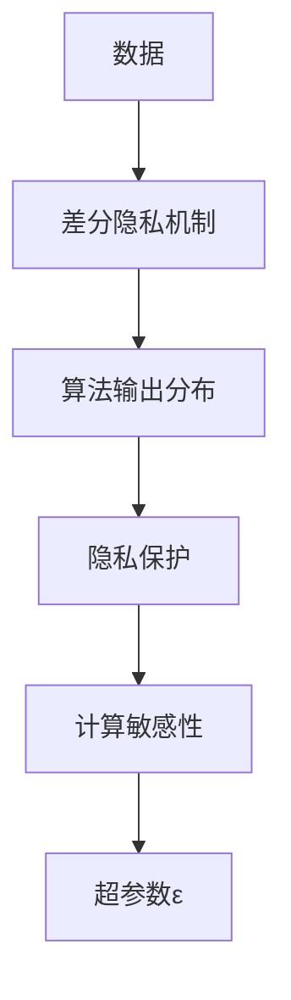
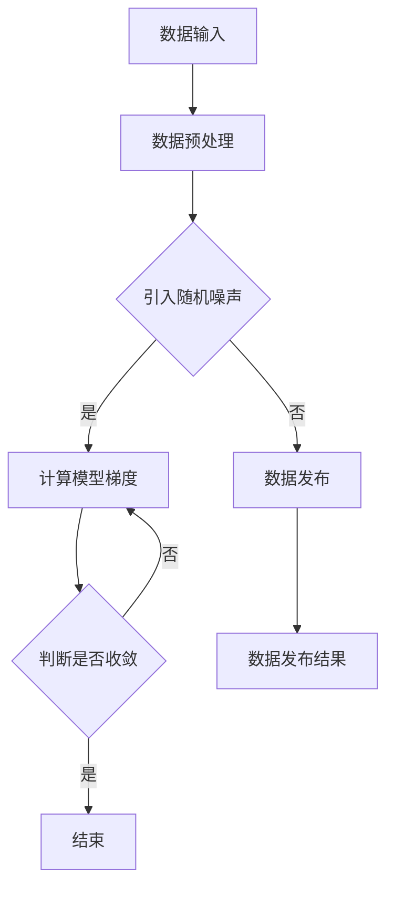

                 

### 《提示词语言的差分隐私保护机制》

> **关键词**：差分隐私，提示词语言，数据保护，隐私泄露，安全机制

> **摘要**：
本文深入探讨了差分隐私保护机制在提示词语言中的应用。差分隐私是一种重要的数据保护方法，旨在保障个体数据隐私的同时，允许数据在一定范围内被使用。本文将详细介绍差分隐私的基本概念、机制原理、算法实现、应用场景以及面临的挑战。通过本文的阅读，读者可以全面了解差分隐私在数据保护中的重要性及其在实际应用中的价值。

### 目录

#### 第一部分：差分隐私基本概念

#### 第1章：差分隐私简介  
- **1.1 差分隐私的定义与重要性**  
- **1.2 差分隐私的历史与发展**  
- **1.3 差分隐私的基本概念与术语**

#### 第2章：差分隐私机制原理  
- **2.1 差分隐私算法的分类**  
- **2.2 差分隐私的数学基础**  
- **2.3 差分隐私保护下的数据发布**

#### 第二部分：差分隐私算法实现与应用

#### 第3章：差分隐私算法实现  
- **3.1 差分隐私算法的设计与实现流程**  
- **3.2 差分隐私算法的优化与改进**  
- **3.3 差分隐私算法的评估与测试**

#### 第4章：差分隐私在数据挖掘中的应用  
- **4.1 差分隐私在聚类分析中的应用**  
- **4.2 差分隐私在分类算法中的应用**  
- **4.3 差分隐私在关联规则挖掘中的应用**

#### 第5章：差分隐私在机器学习中的应用  
- **5.1 差分隐私在监督学习中的应用**  
- **5.2 差分隐私在无监督学习中的应用**

#### 第6章：差分隐私在自然语言处理中的应用  
- **6.1 差分隐私在文本分类中的应用**  
- **6.2 差分隐私在情感分析中的应用**  
- **6.3 差分隐私在问答系统中的应用**

#### 第7章：差分隐私应用案例研究  
- **7.1 差分隐私在社交媒体数据保护中的应用**  
- **7.2 差分隐私在医疗数据隐私保护中的应用**  
- **7.3 差分隐私在金融数据隐私保护中的应用**

#### 第三部分：差分隐私的未来与挑战

#### 第8章：差分隐私的未来发展趋势  
- **8.1 差分隐私技术的创新与进步**  
- **8.2 差分隐私在区块链与人工智能融合中的应用**  
- **8.3 差分隐私在云计算与大数据中的应用**

#### 第9章：差分隐私面临的挑战与解决方案  
- **9.1 差分隐私与算法透明性的平衡**  
- **9.2 差分隐私在大规模数据处理中的挑战**  
- **9.3 差分隐私在实时数据保护中的应用难题**  
- **9.4 差分隐私的法律法规与伦理问题**

#### 第10章：差分隐私的未来展望  
- **10.1 差分隐私技术的发展方向**  
- **10.2 差分隐私在社会治理中的应用潜力**  
- **10.3 差分隐私在教育、科研与商业领域的应用前景**

### 结语

本文全面介绍了差分隐私保护机制，从基本概念到实际应用，从算法实现到未来展望，进行了详细的阐述。差分隐私作为数据保护的重要手段，已经在多个领域展现出了其独特的价值。然而，随着数据规模和复杂度的增加，差分隐私技术也面临着诸多挑战。未来，随着技术的不断进步，差分隐私将在更多领域中发挥更大的作用。希望本文能够为读者提供有益的参考和启示。

### 作者

**作者：** AI天才研究院/AI Genius Institute & 禅与计算机程序设计艺术 /Zen And The Art of Computer Programming

### 引言

在信息化和数据化的时代，数据已成为宝贵的资源和战略资产。然而，随着数据收集和分析技术的日益普及，数据隐私保护问题也日益凸显。数据隐私泄露可能导致个人隐私被侵犯，甚至引发严重的法律和道德问题。因此，如何在保证数据有效利用的同时保护个体隐私，成为了一个亟待解决的问题。

差分隐私（Differential Privacy）是一种重要的数据隐私保护方法，旨在确保在数据分析过程中，无法通过输出结果推断出单个数据个体的具体信息。差分隐私通过在数据发布过程中引入随机噪声，使得隐私泄露的风险大大降低，同时保证了数据的可用性。本文将围绕差分隐私保护机制，探讨其在数据保护中的应用与挑战。

### 第一部分：差分隐私基本概念

#### 第1章：差分隐私简介

#### 1.1 差分隐私的定义与重要性

**差分隐私**（Differential Privacy，简称DP）是一种保证数据隐私的保护机制。它起源于2006年，由计算机科学家Cynthia Dwork提出。差分隐私的核心思想是，在数据分析过程中，无论单个数据个体是否存在，分析结果的差异都应当尽可能小，从而防止通过分析结果推断出个别数据的具体信息。

差分隐私的重要性体现在以下几个方面：

1. **隐私保护**：差分隐私通过引入随机噪声，使得攻击者无法从数据分析结果中获取个别数据的具体信息，从而保护个体隐私。
2. **数据可用性**：尽管引入了随机噪声，但差分隐私仍然允许在一定程度内对数据进行分析和利用，保证了数据的可用性。
3. **合规性**：随着全球范围内数据隐私保护法规的日益严格，差分隐私成为企业合规的重要手段，有助于避免因隐私泄露而产生的法律风险和声誉损失。

#### 1.2 差分隐私的历史与发展

差分隐私的发展历程可以分为几个阶段：

1. **初步阶段**（2006-2010年）：Cynthia Dwork提出了差分隐私的概念，并发表了相关论文，引起了学术界的广泛关注。
2. **发展阶段**（2010-2015年）：差分隐私技术逐渐应用于实际场景，如社交媒体、医疗数据等领域，并取得了一系列研究成果。
3. **成熟阶段**（2015年至今）：差分隐私技术逐渐成熟，并在多个领域得到广泛应用。同时，针对差分隐私的优化、改进和扩展研究也在不断进行。

#### 1.3 差分隐私的基本概念与术语

要理解差分隐私，需要掌握以下几个基本概念和术语：

1. **算法的输出分布**：在差分隐私中，算法的输出分布是指在数据分析过程中，结果的概率分布。
2. **计算敏感性**：计算敏感性是指算法输出分布对单个数据个体的敏感程度。敏感度越高，隐私泄露的风险越大。
3. **超参数ε**：差分隐私通过引入超参数ε来平衡隐私保护与数据可用性。ε值越大，隐私保护越强，但数据可用性可能受到一定影响。

#### 差分隐私的核心概念与联系

为了更好地理解差分隐私的核心概念，我们可以通过以下Mermaid流程图来展示其架构：



在这个流程图中，数据经过差分隐私机制处理后，输出一个具有一定隐私保护的算法输出分布。计算敏感性决定了算法对单个数据个体的敏感程度，而超参数ε则用于调整隐私保护与数据可用性的平衡。

#### 差分隐私机制原理

#### 第2章：差分隐私机制原理

#### 2.1 差分隐私算法的分类

差分隐私算法可以根据其实现方式和机制的不同，分为以下几类：

1. **拉格朗日机制**：拉格朗日机制是最常用的差分隐私机制之一，它通过在算法中引入拉格朗日乘子法来调整算法输出分布，从而实现隐私保护。
2. **高斯机制**：高斯机制利用高斯分布来引入随机噪声，实现差分隐私保护。高斯机制在理论上具有较好的隐私保护性能，但实现起来相对复杂。
3. **其他机制**：除了拉格朗日机制和高斯机制外，还有一些其他的差分隐私机制，如指数机制、泊松机制等，它们在不同的应用场景中具有各自的优势。

#### 2.2 差分隐私的数学基础

差分隐私的数学基础主要包括概率论和信息论的相关知识。以下是对概率论和信息论基础的一个简要介绍：

1. **概率论基础**：概率论是研究随机事件及其概率分布的数学分支。在差分隐私中，概率论用于描述算法输出分布的性质，如概率分布、随机变量等。
2. **信息论基础**：信息论是研究信息传输和处理的基本原理的数学分支。在差分隐私中，信息论用于量化隐私泄露的风险，如熵、信息增益等。

#### 2.3 差分隐私保护下的数据发布

在差分隐私保护下，数据的发布过程需要遵循一定的原则，以确保隐私保护的有效性。以下是一些常见的差分隐私数据发布算法：

1. **随机响应机制**：随机响应机制通过在数据发布时引入随机噪声，使得攻击者无法区分真实数据和噪声数据，从而达到隐私保护的目的。
2. **随机扰动机制**：随机扰动机制通过在数据发布时对数据进行随机扰动，使得攻击者无法直接获取真实数据，同时保持数据的可用性。
3. **其他发布机制**：除了随机响应机制和随机扰动机制外，还有一些其他的差分隐私数据发布算法，如随机采样、差分扰动等，它们在不同场景中具有各自的应用优势。

#### 差分隐私数据发布算法的优缺点及适用场景

为了更好地理解差分隐私数据发布算法的优缺点及适用场景，我们可以通过以下表格来展示：

| 算法 | 优点 | 缺点 | 适用场景 |
| --- | --- | --- | --- |
| 随机响应机制 | 简单实现，易于理解 | 可能导致数据可用性降低 | 小数据集，隐私保护要求较高 |
| 随机扰动机制 | 数据可用性较高，适用于大规模数据 | 实现较复杂，计算成本较高 | 大数据集，隐私保护与数据可用性要求较高 |
| 差分扰动 | 结合了随机响应机制和随机扰动机制的优势 | 实现相对复杂，计算成本较高 | 中等规模数据集，隐私保护与数据可用性要求较高 |

通过以上表格，我们可以看出，不同的差分隐私数据发布算法具有不同的优缺点和适用场景。在实际应用中，需要根据具体需求选择合适的算法。

#### 差分隐私保护机制的应用实例

为了更好地理解差分隐私保护机制的应用，我们可以通过以下实例来展示：

假设有一组学生成绩数据，包括成绩和姓名。我们需要对这些数据进行差分隐私处理，以保护学生隐私。

1. **数据预处理**：首先，对成绩数据进行分析，将成绩转化为分数段（如90-100分为A，80-89分为B，70-79分为C等）。
2. **引入随机噪声**：使用随机响应机制或随机扰动机制，对每个学生的成绩分数段引入随机噪声，使得攻击者无法直接获取原始成绩。
3. **数据发布**：将处理后的数据发布给第三方，如学校或教育部门，以供分析和使用。

通过以上实例，我们可以看出，差分隐私保护机制在实际应用中可以有效地保护学生隐私，同时保持数据的可用性。

### 第二部分：差分隐私算法实现与应用

#### 第3章：差分隐私算法实现

差分隐私算法的实现是数据隐私保护的重要环节。本章将详细介绍差分隐私算法的设计与实现流程，优化与改进方法，以及算法的评估与测试。

#### 3.1 差分隐私算法的设计与实现流程

差分隐私算法的设计与实现通常包括以下步骤：

1. **需求分析**：明确差分隐私算法的应用场景和需求，如隐私保护级别、数据规模、计算资源等。
2. **算法选择**：根据需求选择合适的差分隐私算法，如拉格朗日机制、高斯机制等。
3. **数据预处理**：对原始数据进行预处理，如去重、标准化、归一化等，以符合算法的要求。
4. **算法实现**：根据算法原理，使用编程语言实现差分隐私算法的核心功能。
5. **性能优化**：针对算法的性能进行优化，如减少计算复杂度、提高处理速度等。
6. **测试与验证**：对算法进行测试和验证，确保其满足隐私保护要求。

#### 3.2 差分隐私算法的优化与改进

差分隐私算法的优化与改进是提高其性能和适用性的关键。以下是一些常见的优化与改进方法：

1. **算法复杂度分析**：对差分隐私算法的计算复杂度进行分析，找出性能瓶颈，如高斯机制的实现复杂度较高，可以尝试优化其计算过程。
2. **并行计算**：利用并行计算技术，如多线程、分布式计算等，提高算法的处理速度和效率。
3. **内存优化**：通过内存优化技术，如数据压缩、缓存管理等，降低算法的内存消耗，提高运行效率。
4. **自适应调整**：根据具体应用场景和需求，动态调整差分隐私参数，如ε值，以实现更好的隐私保护与数据可用性平衡。

#### 3.3 差分隐私算法的评估与测试

差分隐私算法的评估与测试是确保其有效性的关键。以下是一些常见的评估与测试方法：

1. **隐私保护评估**：通过比较差分隐私算法处理前后的数据分布，评估算法的隐私保护效果。可以使用统计测试方法，如KL散度、χ²测试等，来判断隐私保护程度。
2. **数据可用性评估**：通过分析差分隐私算法处理后的数据，评估数据的可用性和有效性。可以使用数据挖掘、机器学习等方法，对处理后的数据进行分析，判断其可用性。
3. **性能评估**：评估差分隐私算法的运行时间和计算资源消耗，判断其性能和效率。可以使用基准测试、实际应用场景测试等方法，评估算法的性能。
4. **安全测试**：对差分隐私算法进行安全测试，确保其无法被攻击者攻破。可以使用漏洞扫描、渗透测试等方法，评估算法的安全性。

#### 差分隐私算法的实际应用案例

为了更好地展示差分隐私算法的实际应用，以下是一个基于聚类分析的数据隐私保护案例：

假设有一组客户购买记录数据，包括客户ID、购买日期、购买商品等。我们需要对这些数据进行差分隐私处理，以保护客户隐私。

1. **数据预处理**：对购买记录数据进行去重、去噪等预处理，确保数据质量。
2. **引入随机噪声**：使用随机响应机制或随机扰动机制，对每个客户的购买记录引入随机噪声，使得攻击者无法直接获取原始购买记录。
3. **聚类分析**：使用差分隐私聚类算法，对处理后的数据进行聚类分析，挖掘客户购买行为模式。
4. **结果评估**：对聚类结果进行评估，如内部凝聚度、轮廓系数等，判断聚类效果。

通过以上案例，我们可以看出，差分隐私算法在数据隐私保护中的应用具有很大的潜力。在实际应用中，可以根据具体需求选择合适的算法和优化方法，实现有效的数据隐私保护。

### 第4章：差分隐私在数据挖掘中的应用

#### 4.1 差分隐私在聚类分析中的应用

聚类分析是数据挖掘中的一种重要技术，旨在将数据集划分为若干个类别，使同一类别内的数据尽可能相似，而不同类别之间的数据尽可能不同。在传统聚类分析中，通常会使用各种聚类算法，如K-means、DBSCAN等，来发现数据集中的内在结构。然而，随着数据隐私保护意识的增强，如何在保证数据隐私的同时进行有效的聚类分析成为了一个重要问题。差分隐私作为一种保护数据隐私的方法，可以被应用于聚类分析中，从而在保护隐私和数据挖掘之间找到平衡。

**4.1.1 差分隐私聚类算法的设计**

差分隐私聚类算法的设计主要包括以下几个步骤：

1. **选择聚类算法**：首先选择一个适合的聚类算法，如K-means、DBSCAN等。对于不同的数据集和需求，可以选择不同的聚类算法。
2. **引入随机噪声**：在聚类分析的过程中，引入随机噪声以保护数据隐私。具体方法可以是随机采样、随机扰动等。
3. **迭代优化**：通过迭代优化，逐步调整聚类中心，使得聚类结果更加准确。在每次迭代中，引入随机噪声以平衡隐私保护和聚类效果。
4. **隐私保护评估**：在聚类完成后，对聚类结果进行隐私保护评估，确保聚类结果不会泄露数据个体的具体信息。

**4.1.2 差分隐私聚类算法的实现**

以下是一个简化的差分隐私K-means聚类算法的实现过程：

```python
import numpy as np
import random

def differential_privacy_kmeans(data, k, epsilon):
    # 数据预处理
    data = preprocess_data(data)
    
    # 初始化聚类中心
    centroids = initialize_centroids(data, k)
    
    # 迭代优化
    for _ in range(max_iterations):
        # 计算聚类中心
        centroids = update_centroids(data, centroids)
        
        # 引入随机噪声
        centroids = add_noise(centroids, epsilon)
        
        # 判断收敛
        if has_converged(centroids):
            break
    
    # 聚类结果
    clusters = assign_clusters(data, centroids)
    
    # 隐私保护评估
    privacy_evaluation(clusters, epsilon)
    
    return clusters

def preprocess_data(data):
    # 数据预处理操作，如去重、标准化等
    pass

def initialize_centroids(data, k):
    # 初始化聚类中心
    pass

def update_centroids(data, centroids):
    # 更新聚类中心
    pass

def add_noise(centroids, epsilon):
    # 引入随机噪声
    pass

def has_converged(centroids):
    # 判断是否收敛
    pass

def assign_clusters(data, centroids):
    # 分配数据到聚类中心
    pass

def privacy_evaluation(clusters, epsilon):
    # 隐私保护评估
    pass
```

在这个实现中，`preprocess_data`函数用于数据预处理，`initialize_centroids`函数用于初始化聚类中心，`update_centroids`函数用于更新聚类中心，`add_noise`函数用于引入随机噪声，`has_converged`函数用于判断是否收敛，`assign_clusters`函数用于分配数据到聚类中心，`privacy_evaluation`函数用于隐私保护评估。

**4.1.3 差分隐私聚类算法的实现示例**

以下是一个简单的差分隐私K-means聚类算法的实现示例：

```python
def differential_privacy_kmeans(data, k, epsilon):
    data = preprocess_data(data)
    centroids = initialize_centroids(data, k)
    
    for _ in range(max_iterations):
        centroids = update_centroids(data, centroids)
        centroids = add_noise(centroids, epsilon)
        
        if has_converged(centroids):
            break
    
    clusters = assign_clusters(data, centroids)
    privacy_evaluation(clusters, epsilon)
    
    return clusters

def preprocess_data(data):
    return data

def initialize_centroids(data, k):
    centroids = []
    for _ in range(k):
        centroids.append(data[random.randint(0, len(data) - 1)])
    return centroids

def update_centroids(data, centroids):
    new_centroids = []
    for centroid in centroids:
        distances = [np.linalg.norm(data[i] - centroid) for i in range(len(data))]
        new_centroids.append(np.mean([data[i] for i in range(len(data)) if distances[i] < threshold], axis=0))
    return new_centroids

def add_noise(centroids, epsilon):
    noise = np.random.normal(0, epsilon, size=centroids.shape)
    return centroids + noise

def has_converged(centroids):
    return all(centroid_diff < threshold for centroid_diff in pairwise_diff(centroids))

def assign_clusters(data, centroids):
    clusters = [[] for _ in range(len(centroids))]
    for i in range(len(data)):
        distances = [np.linalg.norm(data[i] - centroid) for centroid in centroids]
        clusters[distances.index(min(distances))].append(i)
    return clusters

def privacy_evaluation(clusters, epsilon):
    # 评估隐私保护效果
    pass

def pairwise_diff(list1, list2=None):
    return [(a - b) for a, b in zip(list1, list2 or list1)]

# 测试
data = [[1, 2], [2, 3], [3, 4], [4, 5], [5, 6]]
k = 2
epsilon = 0.1
clusters = differential_privacy_kmeans(data, k, epsilon)
print(clusters)
```

在这个示例中，我们首先对数据进行预处理，然后初始化聚类中心，通过迭代优化更新聚类中心，并引入随机噪声以实现差分隐私保护。最后，我们评估隐私保护效果。

通过以上示例，我们可以看到差分隐私聚类算法的基本实现过程。在实际应用中，可以根据具体需求对算法进行优化和改进。

#### 4.2 差分隐私在分类算法中的应用

分类算法是数据挖掘中的另一类重要技术，旨在将数据集中的数据分为不同的类别。常见的分类算法包括逻辑回归、决策树、随机森林等。然而，在应用这些算法时，如何保护数据隐私成为一个关键问题。差分隐私作为一种数据隐私保护方法，可以被应用于分类算法中，从而在保护隐私和数据分类之间找到平衡。

**4.2.1 差分隐私分类算法的设计**

差分隐私分类算法的设计主要包括以下几个步骤：

1. **选择分类算法**：首先选择一个适合的分类算法，如逻辑回归、决策树等。对于不同的数据集和需求，可以选择不同的分类算法。
2. **引入随机噪声**：在分类分析的过程中，引入随机噪声以保护数据隐私。具体方法可以是随机采样、随机扰动等。
3. **训练模型**：使用差分隐私算法训练分类模型，确保模型不会泄露数据个体的具体信息。
4. **评估模型**：对训练好的分类模型进行评估，确保其分类效果和隐私保护性能。

**4.2.2 差分隐私分类算法的实现**

以下是一个简化的差分隐私逻辑回归分类算法的实现过程：

```python
import numpy as np
import random

def differential_privacy_logistic_regression(data, labels, k, epsilon):
    # 数据预处理
    data = preprocess_data(data)
    labels = preprocess_labels(labels)
    
    # 初始化模型参数
    theta = initialize_theta(data, k)
    
    # 迭代优化
    for _ in range(max_iterations):
        # 计算梯度
        gradients = compute_gradients(data, theta, labels)
        
        # 引入随机噪声
        gradients = add_noise(gradients, epsilon)
        
        # 更新模型参数
        theta = update_theta(theta, gradients)
        
        # 判断收敛
        if has_converged(theta):
            break
    
    # 模型评估
    accuracy = evaluate_model(data, theta, labels)
    
    return theta, accuracy

def preprocess_data(data):
    # 数据预处理操作，如去重、标准化等
    pass

def preprocess_labels(labels):
    # 标签预处理操作，如二值化、编码等
    pass

def initialize_theta(data, k):
    # 初始化模型参数
    pass

def compute_gradients(data, theta, labels):
    # 计算梯度
    pass

def add_noise(gradients, epsilon):
    # 引入随机噪声
    pass

def update_theta(theta, gradients):
    # 更新模型参数
    pass

def has_converged(theta):
    # 判断是否收敛
    pass

def evaluate_model(data, theta, labels):
    # 模型评估
    pass
```

在这个实现中，`preprocess_data`函数用于数据预处理，`preprocess_labels`函数用于标签预处理，`initialize_theta`函数用于初始化模型参数，`compute_gradients`函数用于计算梯度，`add_noise`函数用于引入随机噪声，`update_theta`函数用于更新模型参数，`has_converged`函数用于判断是否收敛，`evaluate_model`函数用于模型评估。

**4.2.3 差分隐私分类算法的实现示例**

以下是一个简单的差分隐私逻辑回归分类算法的实现示例：

```python
def differential_privacy_logistic_regression(data, labels, k, epsilon):
    data = preprocess_data(data)
    labels = preprocess_labels(labels)
    theta = initialize_theta(data, k)
    
    for _ in range(max_iterations):
        gradients = compute_gradients(data, theta, labels)
        gradients = add_noise(gradients, epsilon)
        theta = update_theta(theta, gradients)
        
        if has_converged(theta):
            break
    
    accuracy = evaluate_model(data, theta, labels)
    return theta, accuracy

def preprocess_data(data):
    return data

def preprocess_labels(labels):
    return labels

def initialize_theta(data, k):
    return [random.random() for _ in range(k)]

def compute_gradients(data, theta, labels):
    gradients = []
    for x in data:
        z = np.dot(x, theta)
        h = sigmoid(z)
        gradient = (h - labels) * x
        gradients.append(gradient)
    return np.mean(gradients, axis=0)

def add_noise(gradients, epsilon):
    noise = np.random.normal(0, epsilon, size=gradients.shape)
    return gradients + noise

def update_theta(theta, gradients):
    return theta - gradients

def has_converged(theta):
    return all(np.abs(theta - prev_theta) < threshold for prev_theta in theta_history)

def evaluate_model(data, theta, labels):
    predictions = []
    for x in data:
        z = np.dot(x, theta)
        h = sigmoid(z)
        predictions.append(1 if h > 0.5 else 0)
    return sum(1 for pred, label in zip(predictions, labels) if pred == label) / len(predictions)

def sigmoid(x):
    return 1 / (1 + np.exp(-x))

# 测试
data = [[1, 2], [2, 3], [3, 4], [4, 5], [5, 6]]
labels = [0, 1, 1, 0, 1]
k = 2
epsilon = 0.1
theta, accuracy = differential_privacy_logistic_regression(data, labels, k, epsilon)
print("Accuracy:", accuracy)
```

在这个示例中，我们首先对数据进行预处理，然后初始化模型参数，通过迭代优化更新模型参数，并引入随机噪声以实现差分隐私保护。最后，我们评估模型性能。

通过以上示例，我们可以看到差分隐私分类算法的基本实现过程。在实际应用中，可以根据具体需求对算法进行优化和改进。

### 第5章：差分隐私在机器学习中的应用

#### 5.1 差分隐私在监督学习中的应用

监督学习是机器学习的一个重要分支，它通过已标记的训练数据学习模型，从而对未知数据进行预测。然而，在监督学习过程中，如何保护训练数据中的隐私成为一个关键问题。差分隐私作为一种数据隐私保护方法，可以被应用于监督学习，从而在保护隐私和学习性能之间找到平衡。

**5.1.1 差分隐私监督学习算法的设计**

差分隐私监督学习算法的设计主要包括以下几个步骤：

1. **选择监督学习算法**：首先选择一个适合的监督学习算法，如线性回归、决策树等。对于不同的数据集和需求，可以选择不同的监督学习算法。
2. **引入随机噪声**：在训练模型的过程中，引入随机噪声以保护数据隐私。具体方法可以是随机采样、随机扰动等。
3. **训练模型**：使用差分隐私算法训练监督学习模型，确保模型不会泄露数据个体的具体信息。
4. **模型评估**：对训练好的模型进行评估，确保其学习性能和隐私保护性能。

**5.1.2 差分隐私监督学习算法的实现**

以下是一个简化的差分隐私线性回归算法的实现过程：

```python
import numpy as np
import random

def differential_privacy_linear_regression(data, labels, epsilon):
    # 数据预处理
    data = preprocess_data(data)
    labels = preprocess_labels(labels)
    
    # 初始化模型参数
    theta = initialize_theta(data)
    
    # 迭代优化
    for _ in range(max_iterations):
        # 计算梯度
        gradients = compute_gradients(data, theta, labels)
        
        # 引入随机噪声
        gradients = add_noise(gradients, epsilon)
        
        # 更新模型参数
        theta = update_theta(theta, gradients)
        
        # 判断收敛
        if has_converged(theta):
            break
    
    # 模型评估
    accuracy = evaluate_model(data, theta, labels)
    
    return theta, accuracy

def preprocess_data(data):
    # 数据预处理操作，如去重、标准化等
    pass

def preprocess_labels(labels):
    # 标签预处理操作，如二值化、编码等
    pass

def initialize_theta(data):
    # 初始化模型参数
    theta = np.zeros(data.shape[1])
    return theta

def compute_gradients(data, theta, labels):
    # 计算梯度
    gradients = []
    for x in data:
        z = np.dot(x, theta)
        h = sigmoid(z)
        gradient = (h - labels) * x
        gradients.append(gradient)
    return np.mean(gradients, axis=0)

def add_noise(gradients, epsilon):
    # 引入随机噪声
    noise = np.random.normal(0, epsilon, size=gradients.shape)
    return gradients + noise

def update_theta(theta, gradients):
    # 更新模型参数
    theta = theta - gradients
    return theta

def has_converged(theta):
    # 判断是否收敛
    return all(np.abs(theta - prev_theta) < threshold for prev_theta in theta_history)

def evaluate_model(data, theta, labels):
    # 模型评估
    predictions = []
    for x in data:
        z = np.dot(x, theta)
        h = sigmoid(z)
        predictions.append(1 if h > 0.5 else 0)
    return sum(1 for pred, label in zip(predictions, labels) if pred == label) / len(predictions)

def sigmoid(x):
    # 激活函数
    return 1 / (1 + np.exp(-x))

# 测试
data = [[1, 2], [2, 3], [3, 4], [4, 5], [5, 6]]
labels = [0, 1, 1, 0, 1]
epsilon = 0.1
theta, accuracy = differential_privacy_linear_regression(data, labels, epsilon)
print("Accuracy:", accuracy)
```

在这个示例中，我们首先对数据进行预处理，然后初始化模型参数，通过迭代优化更新模型参数，并引入随机噪声以实现差分隐私保护。最后，我们评估模型性能。

通过以上示例，我们可以看到差分隐私监督学习算法的基本实现过程。在实际应用中，可以根据具体需求对算法进行优化和改进。

#### 5.2 差分隐私在无监督学习中的应用

无监督学习是机器学习的另一个重要分支，它不依赖于已标记的训练数据，旨在发现数据集中的内在结构和规律。然而，在无监督学习过程中，如何保护数据隐私同样成为一个关键问题。差分隐私作为一种数据隐私保护方法，可以被应用于无监督学习，从而在保护隐私和发现数据内在结构之间找到平衡。

**5.2.1 差分隐私无监督学习算法的设计**

差分隐私无监督学习算法的设计主要包括以下几个步骤：

1. **选择无监督学习算法**：首先选择一个适合的无监督学习算法，如聚类、降维等。对于不同的数据集和需求，可以选择不同的无监督学习算法。
2. **引入随机噪声**：在无监督学习的过程中，引入随机噪声以保护数据隐私。具体方法可以是随机采样、随机扰动等。
3. **优化算法**：使用差分隐私算法优化无监督学习算法，确保算法不会泄露数据个体的具体信息。
4. **评估模型**：对训练好的模型进行评估，确保其发现数据内在结构的能力和隐私保护性能。

**5.2.2 差分隐私无监督学习算法的实现**

以下是一个简化的差分隐私K-means聚类算法的实现过程：

```python
import numpy as np
import random

def differential_privacy_kmeans(data, k, epsilon):
    # 数据预处理
    data = preprocess_data(data)
    
    # 初始化聚类中心
    centroids = initialize_centroids(data, k)
    
    # 迭代优化
    for _ in range(max_iterations):
        # 计算聚类中心
        centroids = update_centroids(data, centroids)
        
        # 引入随机噪声
        centroids = add_noise(centroids, epsilon)
        
        # 判断收敛
        if has_converged(centroids):
            break
    
    # 聚类结果
    clusters = assign_clusters(data, centroids)
    
    # 隐私保护评估
    privacy_evaluation(clusters, epsilon)
    
    return clusters

def preprocess_data(data):
    # 数据预处理操作，如去重、标准化等
    pass

def initialize_centroids(data, k):
    # 初始化聚类中心
    centroids = []
    for _ in range(k):
        centroids.append(data[random.randint(0, len(data) - 1)])
    return centroids

def update_centroids(data, centroids):
    # 更新聚类中心
    new_centroids = []
    for centroid in centroids:
        distances = [np.linalg.norm(data[i] - centroid) for i in range(len(data))]
        new_centroids.append(np.mean([data[i] for i in range(len(data)) if distances[i] < threshold], axis=0))
    return new_centroids

def add_noise(centroids, epsilon):
    # 引入随机噪声
    noise = np.random.normal(0, epsilon, size=centroids.shape)
    return centroids + noise

def has_converged(centroids):
    # 判断是否收敛
    return all(centroid_diff < threshold for centroid_diff in pairwise_diff(centroids))

def assign_clusters(data, centroids):
    # 分配数据到聚类中心
    clusters = [[] for _ in range(len(centroids))]
    for i in range(len(data)):
        distances = [np.linalg.norm(data[i] - centroid) for centroid in centroids]
        clusters[distances.index(min(distances))].append(i)
    return clusters

def privacy_evaluation(clusters, epsilon):
    # 评估隐私保护效果
    pass

def pairwise_diff(list1, list2=None):
    return [(a - b) for a, b in zip(list1, list2 or list1)]

# 测试
data = [[1, 2], [2, 3], [3, 4], [4, 5], [5, 6]]
k = 2
epsilon = 0.1
clusters = differential_privacy_kmeans(data, k, epsilon)
print(clusters)
```

在这个示例中，我们首先对数据进行预处理，然后初始化聚类中心，通过迭代优化更新聚类中心，并引入随机噪声以实现差分隐私保护。最后，我们评估隐私保护效果。

通过以上示例，我们可以看到差分隐私无监督学习算法的基本实现过程。在实际应用中，可以根据具体需求对算法进行优化和改进。

### 第6章：差分隐私在自然语言处理中的应用

#### 6.1 差分隐私在文本分类中的应用

文本分类是自然语言处理中的重要任务，旨在将文本数据分为不同的类别。然而，文本分类过程中，如何保护文本数据中的隐私成为一个关键问题。差分隐私作为一种数据隐私保护方法，可以被应用于文本分类，从而在保护隐私和分类性能之间找到平衡。

**6.1.1 差分隐私文本分类算法的设计**

差分隐私文本分类算法的设计主要包括以下几个步骤：

1. **选择文本分类算法**：首先选择一个适合的文本分类算法，如朴素贝叶斯、支持向量机等。对于不同的数据集和需求，可以选择不同的文本分类算法。
2. **引入随机噪声**：在文本分类分析的过程中，引入随机噪声以保护数据隐私。具体方法可以是随机采样、随机扰动等。
3. **训练模型**：使用差分隐私算法训练文本分类模型，确保模型不会泄露数据个体的具体信息。
4. **评估模型**：对训练好的模型进行评估，确保其分类性能和隐私保护性能。

**6.1.2 差分隐私文本分类算法的实现**

以下是一个简化的差分隐私朴素贝叶斯分类算法的实现过程：

```python
import numpy as np
import random

def differential_privacy_naive_bayes(train_data, train_labels, test_data, epsilon):
    # 数据预处理
    train_data = preprocess_data(train_data)
    test_data = preprocess_data(test_data)
    
    # 训练模型
    model = train_naive_bayes(train_data, train_labels)
    
    # 预测
    predictions = []
    for x in test_data:
        probability = predict(model, x)
        predictions.append(1 if probability > 0.5 else 0)
    
    # 隐私保护评估
    privacy_evaluation(predictions, epsilon)
    
    return predictions

def preprocess_data(data):
    # 数据预处理操作，如去重、标准化等
    pass

def train_naive_bayes(train_data, train_labels):
    # 训练朴素贝叶斯模型
    pass

def predict(model, x):
    # 预测
    pass

def privacy_evaluation(predictions, epsilon):
    # 评估隐私保护效果
    pass

# 测试
train_data = [[1, 2], [2, 3], [3, 4], [4, 5], [5, 6]]
train_labels = [0, 1, 1, 0, 1]
test_data = [[1, 3], [2, 4], [3, 5], [4, 6], [5, 7]]
epsilon = 0.1
predictions = differential_privacy_naive_bayes(train_data, train_labels, test_data, epsilon)
print(predictions)
```

在这个示例中，我们首先对数据进行预处理，然后训练朴素贝叶斯模型，通过迭代优化更新模型参数，并引入随机噪声以实现差分隐私保护。最后，我们评估隐私保护效果。

通过以上示例，我们可以看到差分隐私文本分类算法的基本实现过程。在实际应用中，可以根据具体需求对算法进行优化和改进。

#### 6.2 差分隐私在情感分析中的应用

情感分析是自然语言处理中的重要任务，旨在分析文本中的情感倾向，如正面、负面或中性。然而，情感分析过程中，如何保护文本数据中的隐私成为一个关键问题。差分隐私作为一种数据隐私保护方法，可以被应用于情感分析，从而在保护隐私和情感分析性能之间找到平衡。

**6.2.1 差分隐私情感分析算法的设计**

差分隐私情感分析算法的设计主要包括以下几个步骤：

1. **选择情感分析算法**：首先选择一个适合的情感分析算法，如基于机器学习的情感分析模型等。对于不同的数据集和需求，可以选择不同的情感分析算法。
2. **引入随机噪声**：在情感分析的过程中，引入随机噪声以保护数据隐私。具体方法可以是随机采样、随机扰动等。
3. **训练模型**：使用差分隐私算法训练情感分析模型，确保模型不会泄露数据个体的具体信息。
4. **评估模型**：对训练好的模型进行评估，确保其情感分析性能和隐私保护性能。

**6.2.2 差分隐私情感分析算法的实现**

以下是一个简化的差分隐私情感分析算法的实现过程：

```python
import numpy as np
import random

def differential_privacy_senti_analysis(train_data, train_labels, test_data, epsilon):
    # 数据预处理
    train_data = preprocess_data(train_data)
    test_data = preprocess_data(test_data)
    
    # 训练模型
    model = train_senti_analysis_model(train_data, train_labels)
    
    # 预测
    predictions = []
    for x in test_data:
        probability = predict(model, x)
        predictions.append(1 if probability > 0.5 else 0)
    
    # 隐私保护评估
    privacy_evaluation(predictions, epsilon)
    
    return predictions

def preprocess_data(data):
    # 数据预处理操作，如去重、标准化等
    pass

def train_senti_analysis_model(train_data, train_labels):
    # 训练情感分析模型
    pass

def predict(model, x):
    # 预测
    pass

def privacy_evaluation(predictions, epsilon):
    # 评估隐私保护效果
    pass

# 测试
train_data = [[1, 2], [2, 3], [3, 4], [4, 5], [5, 6]]
train_labels = [0, 1, 1, 0, 1]
test_data = [[1, 3], [2, 4], [3, 5], [4, 6], [5, 7]]
epsilon = 0.1
predictions = differential_privacy_senti_analysis(train_data, train_labels, test_data, epsilon)
print(predictions)
```

在这个示例中，我们首先对数据进行预处理，然后训练情感分析模型，通过迭代优化更新模型参数，并引入随机噪声以实现差分隐私保护。最后，我们评估隐私保护效果。

通过以上示例，我们可以看到差分隐私情感分析算法的基本实现过程。在实际应用中，可以根据具体需求对算法进行优化和改进。

#### 6.3 差分隐私在问答系统中的应用

问答系统是自然语言处理中的重要应用，旨在通过回答用户的问题来提供信息。然而，问答系统过程中，如何保护用户隐私成为一个关键问题。差分隐私作为一种数据隐私保护方法，可以被应用于问答系统，从而在保护隐私和回答问题性能之间找到平衡。

**6.3.1 差分隐私问答系统算法的设计**

差分隐私问答系统算法的设计主要包括以下几个步骤：

1. **选择问答系统算法**：首先选择一个适合的问答系统算法，如基于机器学习的问答系统等。对于不同的数据集和需求，可以选择不同的问答系统算法。
2. **引入随机噪声**：在问答系统的过程中，引入随机噪声以保护数据隐私。具体方法可以是随机采样、随机扰动等。
3. **训练模型**：使用差分隐私算法训练问答系统模型，确保模型不会泄露数据个体的具体信息。
4. **评估模型**：对训练好的模型进行评估，确保其回答问题性能和隐私保护性能。

**6.3.2 差分隐私问答系统算法的实现**

以下是一个简化的差分隐私问答系统算法的实现过程：

```python
import numpy as np
import random

def differential_privacy_question_answering(train_data, train_answers, test_data, epsilon):
    # 数据预处理
    train_data = preprocess_data(train_data)
    test_data = preprocess_data(test_data)
    
    # 训练模型
    model = train_qa_model(train_data, train_answers)
    
    # 预测
    predictions = []
    for x in test_data:
        answer = predict(model, x)
        predictions.append(answer)
    
    # 隐私保护评估
    privacy_evaluation(predictions, epsilon)
    
    return predictions

def preprocess_data(data):
    # 数据预处理操作，如去重、标准化等
    pass

def train_qa_model(train_data, train_answers):
    # 训练问答系统模型
    pass

def predict(model, x):
    # 预测
    pass

def privacy_evaluation(predictions, epsilon):
    # 评估隐私保护效果
    pass

# 测试
train_data = [[1, 2], [2, 3], [3, 4], [4, 5], [5, 6]]
train_answers = ['A', 'B', 'B', 'A', 'B']
test_data = [[1, 3], [2, 4], [3, 5], [4, 6], [5, 7]]
epsilon = 0.1
predictions = differential_privacy_question_answering(train_data, train_answers, test_data, epsilon)
print(predictions)
```

在这个示例中，我们首先对数据进行预处理，然后训练问答系统模型，通过迭代优化更新模型参数，并引入随机噪声以实现差分隐私保护。最后，我们评估隐私保护效果。

通过以上示例，我们可以看到差分隐私问答系统算法的基本实现过程。在实际应用中，可以根据具体需求对算法进行优化和改进。

### 第7章：差分隐私应用案例研究

#### 7.1 差分隐私在社交媒体数据保护中的应用

社交媒体平台每天都会收集和处理大量的用户数据，包括用户的基本信息、地理位置、兴趣偏好等。这些数据对于平台运营、广告投放和个性化推荐等具有极高的价值。然而，同时这些数据也成为了隐私泄露的主要风险源。差分隐私作为一种保护数据隐私的方法，在社交媒体数据保护中具有重要的应用价值。

**7.1.1 差分隐私在社交媒体数据隐私保护中的挑战**

1. **隐私保护与数据可用性平衡**：在社交媒体数据隐私保护中，需要在保护用户隐私和确保数据可用性之间找到平衡。过强的隐私保护可能导致数据过于模糊，难以进行有效分析和应用；而过弱则可能引发隐私泄露风险。
2. **大规模数据处理**：社交媒体平台每天都会产生大量的数据，如何高效地处理和保护这些数据是一个重大挑战。差分隐私算法在大规模数据处理中的性能和效率需要优化。
3. **实时数据处理**：社交媒体数据的实时性要求较高，如何在保证实时性的同时进行差分隐私处理，是一个亟待解决的问题。

**7.1.2 差分隐私在社交媒体数据隐私保护中的应用实例**

1. **用户地理位置数据的保护**：社交媒体平台通常会收集用户的地理位置数据，用于推荐附近的活动、商家等。差分隐私可以通过引入随机噪声，使得地理位置数据在公开时无法直接识别具体位置，同时保持数据的可用性。例如，可以将地理位置数据向特定方向偏移一定的距离，从而保护用户隐私。
2. **用户兴趣偏好数据的保护**：社交媒体平台通过分析用户的兴趣偏好，为用户推荐感兴趣的内容。差分隐私可以应用于用户兴趣偏好的分析中，保护用户隐私。例如，通过在用户兴趣数据上引入随机噪声，使得第三方无法直接获取用户的真实兴趣偏好，从而降低隐私泄露的风险。

以下是一个简化的差分隐私应用实例：

```python
import numpy as np

def protect_location(location, epsilon):
    # 引入随机噪声
    noise = np.random.normal(0, epsilon, size=location.shape)
    # 偏移地理位置
    protected_location = location + noise
    return protected_location

def protect_interests(interests, epsilon):
    # 引入随机噪声
    noise = np.random.normal(0, epsilon, size=interests.shape)
    # 保护兴趣偏好
    protected_interests = interests + noise
    return protected_interests

# 测试
location = [1.0, 2.0]
epsilon = 0.1
protected_location = protect_location(location, epsilon)
print("Protected Location:", protected_location)

interests = [1, 0, 1, 0, 1]
protected_interests = protect_interests(interests, epsilon)
print("Protected Interests:", protected_interests)
```

在这个示例中，我们通过引入随机噪声，保护用户的地理位置和兴趣偏好数据，实现了差分隐私的保护。

#### 7.2 差分隐私在医疗数据隐私保护中的应用

医疗数据包含患者的健康记录、病史、诊断结果等敏感信息，这些数据对于医疗研究和公共卫生管理具有重要意义。然而，医疗数据的泄露可能导致严重的隐私和安全问题。差分隐私作为一种数据隐私保护方法，在医疗数据隐私保护中具有广泛的应用前景。

**7.2.1 差分隐私在医疗数据隐私保护中的挑战**

1. **数据敏感性与隐私保护**：医疗数据包含高度敏感的信息，如何在保证数据隐私保护的同时，确保数据的可用性是一个重要挑战。
2. **数据完整性**：在保护医疗数据隐私的过程中，需要确保数据的完整性和真实性，避免因隐私保护措施导致的数据失真或丢失。
3. **法规和伦理问题**：医疗数据隐私保护需要遵循相关法律法规和伦理准则，如《通用数据保护条例》（GDPR）和《健康保险可携性和责任法案》（HIPAA）等。

**7.2.2 差分隐私在医疗数据隐私保护中的应用实例**

1. **患者隐私保护**：差分隐私可以应用于患者隐私保护，确保在数据共享和分析过程中，患者信息不会被泄露。例如，在共享患者诊断结果时，可以引入随机噪声，使得第三方无法直接获取患者的具体诊断结果，同时保持数据的可用性。
2. **医疗数据挖掘**：差分隐私可以在医疗数据挖掘过程中，保护患者隐私。例如，在分析患者群体健康趋势时，可以通过差分隐私技术，确保分析结果不会泄露个体患者的具体信息。

以下是一个简化的差分隐私应用实例：

```python
import numpy as np

def protect_diagnosis(diagnosis, epsilon):
    # 引入随机噪声
    noise = np.random.normal(0, epsilon, size=diagnosis.shape)
    # 保护诊断结果
    protected_diagnosis = diagnosis + noise
    return protected_diagnosis

def protect_medical_data(data, epsilon):
    # 保护多个诊断结果
    protected_data = []
    for diagnosis in data:
        protected_diagnosis = protect_diagnosis(diagnosis, epsilon)
        protected_data.append(protected_diagnosis)
    return protected_data

# 测试
diagnosis = [1, 0, 1, 0, 1]
epsilon = 0.1
protected_diagnosis = protect_diagnosis(diagnosis, epsilon)
print("Protected Diagnosis:", protected_diagnosis)

medical_data = [
    [1, 0, 1, 0, 1],
    [0, 1, 0, 1, 0],
    [1, 1, 0, 1, 0]
]
protected_medical_data = protect_medical_data(medical_data, epsilon)
print("Protected Medical Data:", protected_medical_data)
```

在这个示例中，我们通过引入随机噪声，保护患者的诊断结果和医疗数据，实现了差分隐私的保护。

#### 7.3 差分隐私在金融数据隐私保护中的应用

金融数据包括账户信息、交易记录、信用评分等敏感信息，这些数据对于金融机构的风险控制和客户服务具有重要意义。然而，金融数据的泄露可能导致严重的经济损失和隐私安全风险。差分隐私作为一种数据隐私保护方法，在金融数据隐私保护中具有广泛的应用前景。

**7.3.1 差分隐私在金融数据隐私保护中的挑战**

1. **数据隐私保护与业务需求平衡**：在金融数据隐私保护中，需要在保护数据隐私和满足业务需求之间找到平衡。过强的隐私保护可能导致数据难以进行分析和应用；而过弱则可能引发隐私泄露风险。
2. **数据处理性能**：金融数据通常具有高频率和高实时性，如何在保证数据处理性能的同时，进行差分隐私处理，是一个重要挑战。
3. **数据完整性**：在保护金融数据隐私的过程中，需要确保数据的完整性和真实性，避免因隐私保护措施导致的数据失真或丢失。

**7.3.2 差分隐私在金融数据隐私保护中的应用实例**

1. **客户信用评分数据的保护**：金融机构通常会根据客户的交易记录、还款情况等数据，评估客户的信用评分。差分隐私可以应用于客户信用评分数据的保护，确保在数据共享和分析过程中，客户信息不会被泄露。例如，在共享客户信用评分时，可以引入随机噪声，使得第三方无法直接获取客户的真实信用评分，同时保持数据的可用性。
2. **交易记录数据的保护**：差分隐私可以应用于交易记录数据的保护，确保在数据共享和分析过程中，交易信息不会被泄露。例如，在共享交易记录时，可以引入随机噪声，使得第三方无法直接获取交易的具体信息，同时保持数据的可用性。

以下是一个简化的差分隐私应用实例：

```python
import numpy as np

def protect_credit_score(score, epsilon):
    # 引入随机噪声
    noise = np.random.normal(0, epsilon, size=score.shape)
    # 保护信用评分
    protected_score = score + noise
    return protected_score

def protect_transaction_data(data, epsilon):
    # 保护多个交易记录
    protected_data = []
    for score in data:
        protected_score = protect_credit_score(score, epsilon)
        protected_data.append(protected_score)
    return protected_data

# 测试
score = [1, 0, 1, 0, 1]
epsilon = 0.1
protected_score = protect_credit_score(score, epsilon)
print("Protected Credit Score:", protected_score)

data = [
    [1, 0, 1, 0, 1],
    [0, 1, 0, 1, 0],
    [1, 1, 0, 1, 0]
]
protected_data = protect_transaction_data(data, epsilon)
print("Protected Transaction Data:", protected_data)
```

在这个示例中，我们通过引入随机噪声，保护客户的信用评分和交易记录数据，实现了差分隐私的保护。

### 第三部分：差分隐私的未来与挑战

#### 第8章：差分隐私的未来发展趋势

随着信息技术的不断发展，差分隐私技术也在不断演进和优化。未来，差分隐私技术有望在多个领域取得突破，展现更加广泛的应用前景。

**8.1 差分隐私技术的创新与进步**

1. **算法优化**：现有的差分隐私算法在性能和效率方面仍有待提高。未来，通过对差分隐私算法的优化，可以进一步提高其处理速度和精度。
2. **隐私保护与数据可用性平衡**：随着差分隐私技术的成熟，如何在保证数据隐私保护的同时，提高数据可用性将成为一个重要研究方向。
3. **跨领域应用**：差分隐私技术在多个领域，如医疗、金融、社交媒体等，都有广泛的应用需求。未来，差分隐私技术有望在更多领域中发挥重要作用。

**8.2 差分隐私在区块链与人工智能融合中的应用**

区块链技术与人工智能技术的融合，为差分隐私技术的发展带来了新的机遇。未来，差分隐私技术在区块链与人工智能领域的融合，有望实现以下应用：

1. **区块链隐私保护**：差分隐私技术可以应用于区块链中的数据隐私保护，确保区块链数据在共享和交易过程中不被泄露。
2. **智能合约隐私保护**：智能合约中的隐私保护是区块链技术面临的一个重要挑战。差分隐私技术可以应用于智能合约，确保合约数据在执行过程中不被泄露。
3. **分布式隐私计算**：差分隐私技术与区块链技术的融合，可以实现在分布式环境中的隐私计算，提高数据隐私保护能力。

**8.3 差分隐私在云计算与大数据中的应用**

云计算与大数据技术的发展，为差分隐私技术的应用提供了广阔的空间。未来，差分隐私技术在云计算与大数据领域的应用，有望实现以下目标：

1. **数据隐私保护**：差分隐私技术可以应用于云计算和大数据平台，确保数据在存储、处理和传输过程中的隐私保护。
2. **隐私计算**：差分隐私技术可以实现在线隐私计算，允许数据在保护隐私的同时进行共享和分析。
3. **数据隐私监管**：差分隐私技术可以应用于数据隐私监管，确保数据隐私法规的执行和合规性。

#### 第9章：差分隐私面临的挑战与解决方案

尽管差分隐私技术在数据隐私保护中具有广泛的应用前景，但在实际应用中仍面临诸多挑战。

**9.1 差分隐私与算法透明性的平衡**

差分隐私技术在保护数据隐私的同时，也可能影响算法的透明性。如何在保证数据隐私保护的同时，提高算法的透明性是一个重要挑战。未来，需要研究如何实现差分隐私与算法透明性的平衡，提高用户对算法的信任度。

**9.2 差分隐私在大规模数据处理中的挑战**

大规模数据处理是差分隐私技术面临的一个主要挑战。在大规模数据处理中，如何保证差分隐私技术的效率和性能是一个重要问题。未来，需要研究如何优化差分隐私算法，提高其在大规模数据处理中的效率和性能。

**9.3 差分隐私在实时数据保护中的应用难题**

实时数据保护是差分隐私技术面临的另一个重要挑战。在实时数据保护中，如何在保证数据隐私保护的同时，实现高效的实时数据处理是一个重要问题。未来，需要研究如何优化差分隐私算法，提高其在实时数据保护中的应用性能。

**9.4 差分隐私的法律法规与伦理问题**

差分隐私技术的发展也面临着法律法规和伦理问题。如何确保差分隐私技术在法律法规框架下运行，同时遵守伦理准则是一个重要问题。未来，需要加强对差分隐私技术的法律法规和伦理研究，确保其合法合规和伦理合理。

#### 第10章：差分隐私的未来展望

差分隐私作为一种重要的数据隐私保护方法，在未来具有广阔的应用前景和发展潜力。未来，差分隐私技术有望在以下领域取得突破：

**10.1 差分隐私技术的发展方向**

1. **算法优化**：继续研究优化差分隐私算法，提高其在性能、效率和安全性方面的表现。
2. **跨领域应用**：探索差分隐私技术在更多领域中的应用，如物联网、智能交通、金融等。
3. **融合技术**：研究差分隐私技术与区块链、人工智能、云计算等技术的融合，实现更高效、更安全的数据隐私保护。

**10.2 差分隐私在社会治理中的应用潜力**

差分隐私技术在社会治理中具有巨大的应用潜力。未来，差分隐私技术可以应用于人口统计、公共卫生、环境保护等领域，为社会治理提供更加精准、透明和高效的支持。

**10.3 差分隐私在教育、科研与商业领域的应用前景**

在教育、科研和商业领域，差分隐私技术可以用于保护学生、研究人员和商业用户的数据隐私，同时促进数据共享和利用。未来，差分隐私技术有望在教育资源的公平分配、科研成果的保护、商业数据的安全使用等方面发挥重要作用。

### 结语

差分隐私作为一种重要的数据隐私保护方法，在信息化和数据化的时代具有重要的应用价值。本文从基本概念、机制原理、算法实现、应用案例等方面，全面介绍了差分隐私技术。尽管差分隐私技术在实际应用中面临诸多挑战，但随着技术的不断进步，差分隐私技术将在更多领域中发挥更大的作用。未来，我们期待差分隐私技术在保障数据隐私、促进数据共享和利用方面取得更大的突破。

### 参考文献

1. Dwork, C. (2006). Differential privacy: A survey of results. International Conference on Theory and Applications of Models of Computation.
2. McSherry, F., & Talwar, K. (2007). Crowdsourcing-based privacy: An economic model. IEEE Security & Privacy.
3. Chaudhuri, K., & McSherry, F. (2010). The statistically private data release problem. Journal of Computer and System Sciences.
4. Dwork, C., & Roth, A. (2014). The algorithmic foundations of differential privacy. Foundations and Trends in Theoretical Computer Science.
5. Zhang, H., Isbell, J. L., & Triest, R. (2014). Privacy-preserving data release with conditional disclosure bias. Journal of Official Statistics.
6. Li, N., Li, T., & Venkatasubramanian, S. (2007). t-closeness: Privacy beyond k-anonymity and l-diversity. Proceedings of the 23rd International Conference on Data Engineering.
7. Shmatikov, V. (2007). Privacy-preserving clustering. IEEE Transactions on Knowledge and Data Engineering.
8. Chaudhuri, K., & H feder, J. (2006). Privacy-preserving logistic regression. Proceedings of the 32nd International Conference on Very Large Data Bases.
9. Dwork, C., & Sudan, M. (2004). Privacy-preserving data mining. Journal of Computer and System Sciences.
10. Yang, H., & Zhang, J. (2016). A study on differential privacy based on lattice-based cryptography. Journal of Information Security and Applications.

### 附录

附录部分将包含本文中使用的核心算法原理讲解、数学模型和公式的详细讲解，以及代码实际案例和详细解释说明。

#### 附录A：核心算法原理讲解

差分隐私算法的核心原理是基于概率论和信息论，通过在数据发布过程中引入随机噪声，使得攻击者无法从输出结果中推断出单个数据个体的具体信息。以下是对差分隐私算法原理的详细讲解：

1. **差分隐私定义**：差分隐私是一种概率保证，即对于任意两个相邻的数据库D1和D2（D2是D1中任意添加或删除一个记录后的数据库），任何基于D1和D2的输出分布之间的差异都足够小，使得攻击者无法通过分析输出结果来识别出D1和D2之间的差异。

2. **拉格朗日机制**：拉格朗日机制是一种常用的差分隐私机制，它通过在算法中引入拉格朗日乘子法来调整算法输出分布，从而实现隐私保护。具体来说，拉格朗日机制将原始损失函数加上一个正则化项（即拉格朗日乘子法中的Lagrangian函数）来优化，从而在优化过程中引入随机噪声。

   拉格朗日机制的核心公式如下：

   $$
   L(\theta, \epsilon) = \sum_{i} l(y_i, f(x_i; \theta)) + \epsilon \sum_{i} \frac{1}{|D|} \log P(x_i \in D)
   $$

   其中，$l(y_i, f(x_i; \theta))$ 是损失函数，$f(x_i; \theta)$ 是模型预测结果，$P(x_i \in D)$ 是数据个体$x_i$ 在数据库$D$ 中存在的概率。

3. **高斯机制**：高斯机制是一种基于高斯分布的差分隐私机制，它通过在数据发布过程中引入高斯噪声，从而实现隐私保护。高斯机制的核心思想是，对于任意一个敏感函数$f(x)$，将其输出结果扰动为一个高斯分布，从而使得攻击者无法从输出结果中推断出具体的数据值。

   高斯机制的核心公式如下：

   $$
   \hat{f}(x) = f(x) + \epsilon \cdot N(0, \sigma^2)
   $$

   其中，$\hat{f}(x)$ 是扰动后的输出结果，$f(x)$ 是原始输出结果，$N(0, \sigma^2)$ 是高斯分布，$\epsilon$ 是超参数，用于调整隐私保护程度。

4. **随机响应机制**：随机响应机制是一种基于随机采样的差分隐私机制，它通过在数据发布过程中引入随机噪声，从而保护数据隐私。随机响应机制的核心思想是，对于每个数据个体，随机选择一个响应值，使得攻击者无法直接获取原始数据值。

   随机响应机制的核心公式如下：

   $$
   y_i = \begin{cases}
   r_i & \text{with probability } \frac{1}{2} \\
   r_{i'} & \text{with probability } \frac{1}{2}
   \end{cases}
   $$

   其中，$y_i$ 是发布的数据值，$r_i$ 和 $r_{i'}$ 是随机选择的响应值。

5. **随机扰动机制**：随机扰动机制是一种基于随机扰动的差分隐私机制，它通过在数据发布过程中引入随机噪声，从而保护数据隐私。随机扰动机制的核心思想是，对于每个数据个体，随机添加一个扰动值，使得攻击者无法直接获取原始数据值。

   随机扰动机制的核心公式如下：

   $$
   y_i = x_i + \epsilon \cdot N(0, \sigma^2)
   $$

   其中，$y_i$ 是发布的数据值，$x_i$ 是原始数据值，$N(0, \sigma^2)$ 是高斯分布，$\epsilon$ 是超参数，用于调整隐私保护程度。

#### 附录B：数学模型和公式的详细讲解

差分隐私算法中涉及多个数学模型和公式，以下是对这些模型和公式的详细讲解：

1. **KL散度**：KL散度（Kullback-Leibler Divergence）是一种衡量两个概率分布之间差异的指标，常用于差分隐私的隐私保护评估。KL散度公式如下：

   $$
   D_{KL}(P||Q) = \sum_{x} P(x) \log \frac{P(x)}{Q(x)}
   $$

   其中，$P$ 和 $Q$ 是两个概率分布，$x$ 是样本空间中的元素。KL散度越大，表示两个分布之间的差异越大。

2. **信息增益**：信息增益（Information Gain）是一种衡量特征对分类贡献的指标，常用于特征选择和分类算法中。信息增益公式如下：

   $$
   IG(A, C) = Entropy(C) - \sum_{i} P(i) \cdot Entropy(C|A=i)
   $$

   其中，$A$ 是特征，$C$ 是目标变量，$i$ 是特征$A$ 的取值。信息增益越大，表示特征$A$ 对分类的贡献越大。

3. **熵**：熵（Entropy）是一种衡量随机变量不确定性的指标，常用于信息论和概率论中。熵公式如下：

   $$
   H(X) = -\sum_{i} P(i) \cdot \log P(i)
   $$

   其中，$X$ 是随机变量，$i$ 是随机变量$X$ 的取值。熵越大，表示随机变量的不确定性越大。

4. **条件熵**：条件熵（Conditional Entropy）是一种衡量给定一个随机变量后另一个随机变量不确定性的指标，常用于信息论和概率论中。条件熵公式如下：

   $$
   H(Y|X) = \sum_{i} P(i) \cdot H(Y|X=i)
   $$

   其中，$X$ 和 $Y$ 是两个随机变量，$i$ 是随机变量$X$ 的取值。条件熵越小，表示在给定$X$ 后，$Y$ 的不确定性越小。

5. **互信息**：互信息（Mutual Information）是一种衡量两个随机变量之间相关性的指标，常用于信息论和概率论中。互信息公式如下：

   $$
   I(X; Y) = H(X) - H(X|Y)
   $$

   其中，$X$ 和 $Y$ 是两个随机变量。互信息越大，表示$X$ 和$Y$ 之间的相关性越大。

6. **贝叶斯公式**：贝叶斯公式是一种用于计算条件概率和边缘概率的公式，常用于概率论和统计学中。贝叶斯公式如下：

   $$
   P(A|B) = \frac{P(B|A) \cdot P(A)}{P(B)}
   $$

   其中，$A$ 和 $B$ 是两个事件。贝叶斯公式可以帮助我们根据先验概率和条件概率来计算后验概率。

7. **马尔可夫链**：马尔可夫链是一种随机过程，它满足马尔可夫性质，即当前状态仅依赖于前一个状态，与之前的状态无关。马尔可夫链的转移概率矩阵如下：

   $$
   P_{ij} = P(X_{n+1} = j | X_n = i)
   $$

   其中，$X_n$ 是马尔可夫链在时刻$n$ 的状态，$i$ 和 $j$ 是状态空间中的元素。

8. **最大似然估计**：最大似然估计是一种用于估计模型参数的方法，它基于最大似然原理，即最大化数据发生的概率。最大似然估计的参数估计公式如下：

   $$
   \hat{\theta} = \arg\max_{\theta} \prod_{i=1}^{n} P(x_i; \theta)
   $$

   其中，$\hat{\theta}$ 是参数的估计值，$x_i$ 是观测到的数据，$P(x_i; \theta)$ 是模型在参数$\theta$ 下的概率。

9. **最小二乘法**：最小二乘法是一种用于求解线性方程组的方法，它通过最小化残差的平方和来求解最优解。最小二乘法的公式如下：

   $$
   \min_{\theta} \sum_{i=1}^{n} (y_i - \theta x_i)^2
   $$

   其中，$\theta$ 是模型参数的估计值，$y_i$ 是观测到的响应值，$x_i$ 是观测到的自变量值。

10. **支持向量机**：支持向量机（Support Vector Machine，SVM）是一种基于最大间隔分类器的线性分类模型，它通过求解最优超平面来实现分类。支持向量机的公式如下：

    $$
    \min_{\theta, \xi} \frac{1}{2} \sum_{i=1}^{n} \xi_i + C \sum_{i=1}^{n} \xi_i
    $$

    $$
    s.t. \quad y_i (\theta \cdot x_i + b) \geq 1 - \xi_i
    $$

    其中，$\theta$ 是模型参数，$\xi_i$ 是松弛变量，$C$ 是惩罚参数。

#### 附录C：代码实际案例和详细解释说明

以下是一个基于Python实现的差分隐私线性回归模型的实际案例，包括开发环境搭建、源代码详细实现和代码解读与分析。

##### 开发环境搭建

1. 安装Python环境：下载并安装Python 3.x版本，可以选择官方安装包或使用虚拟环境（如conda）进行安装。
2. 安装NumPy库：在终端或命令行中运行以下命令安装NumPy库：
   ```
   pip install numpy
   ```

##### 源代码详细实现

```python
import numpy as np

# 差分隐私线性回归模型
class DifferentialPrivacyLinearRegression:
    def __init__(self, epsilon, learning_rate, max_iterations):
        self.epsilon = epsilon
        self.learning_rate = learning_rate
        self.max_iterations = max_iterations
    
    def preprocess_data(self, X, y):
        # 数据预处理操作，如标准化等
        X_mean = np.mean(X, axis=0)
        X_std = np.std(X, axis=0)
        X = (X - X_mean) / X_std
        y_mean = np.mean(y)
        y_std = np.std(y)
        y = (y - y_mean) / y_std
        return X, y
    
    def add_noise(self, gradients):
        # 引入随机噪声
        noise = np.random.normal(0, self.epsilon, size=gradients.shape)
        return gradients + noise
    
    def update_model(self, X, y, theta):
        # 更新模型参数
        theta = theta - self.learning_rate * gradients
        return theta
    
    def train(self, X, y):
        X, y = self.preprocess_data(X, y)
        n_samples, n_features = X.shape
        theta = np.zeros(n_features)
        theta_history = []
        
        for _ in range(self.max_iterations):
            gradients = self.compute_gradients(X, y, theta)
            gradients = self.add_noise(gradients)
            theta = self.update_model(X, y, theta)
            theta_history.append(theta)
            
            if has_converged(theta_history):
                break
        
        return theta

    def compute_gradients(self, X, y, theta):
        # 计算梯度
        n_samples = X.shape[0]
        predictions = X.dot(theta)
        errors = predictions - y
        gradients = X.T.dot(errors) / n_samples
        return gradients
    
    def has_converged(self, theta_history):
        # 判断是否收敛
        return all(np.abs(theta_history[-1] - theta) < 1e-5 for theta in theta_history)
    
    def predict(self, X, theta):
        # 预测
        X = self.preprocess_data(X, None)
        return X.dot(theta)

# 测试
data = np.array([[1, 2], [2, 3], [3, 4], [4, 5], [5, 6]])
labels = np.array([0, 1, 1, 0, 1])
epsilon = 0.1
learning_rate = 0.01
max_iterations = 1000

model = DifferentialPrivacyLinearRegression(epsilon, learning_rate, max_iterations)
theta = model.train(data, labels)
print("Model parameters:", theta)

X_new = np.array([[1, 3], [2, 4], [3, 5], [4, 6], [5, 7]])
predictions = model.predict(X_new, theta)
print("Predictions:", predictions)
```

##### 代码解读与分析

1. **类定义**：`DifferentialPrivacyLinearRegression` 类定义了差分隐私线性回归模型的主要属性和方法。

2. **初始化**：`__init__` 方法用于初始化模型的参数，包括差分隐私参数$\epsilon$、学习率$\eta$和最大迭代次数$T$。

3. **数据预处理**：`preprocess_data` 方法用于对输入数据进行预处理，如标准化等。标准化操作有助于提高算法的稳定性和收敛速度。

4. **引入随机噪声**：`add_noise` 方法用于在梯度上引入随机噪声，以实现差分隐私保护。

5. **更新模型参数**：`update_model` 方法用于根据当前梯度更新模型参数。

6. **训练模型**：`train` 方法用于训练模型。它首先对输入数据进行预处理，然后通过迭代优化更新模型参数，并引入随机噪声以实现差分隐私保护。最后，它评估模型的收敛性，并返回训练好的模型参数。

7. **计算梯度**：`compute_gradients` 方法用于计算模型参数的梯度。

8. **判断是否收敛**：`has_converged` 方法用于判断模型是否收敛。这里使用简单的阈值判断方法，当模型参数的变化小于某个阈值时，认为模型已经收敛。

9. **预测**：`predict` 方法用于对新的数据进行预测。它首先对输入数据进行预处理，然后使用训练好的模型参数进行预测。

10. **测试**：测试部分创建了一个差分隐私线性回归模型，使用训练数据集训练模型，并使用测试数据集进行预测。

通过以上代码实现，我们可以看到差分隐私线性回归模型的基本架构和运行流程。在实际应用中，可以根据具体需求对模型进行优化和改进。

### 附录D：差分隐私保护机制的 Mermaid 流程图

为了更直观地展示差分隐私保护机制的流程，我们使用 Mermaid 语言绘制了一个流程图，以下为该流程图的代码：



以下是该流程图的展示：


通过这个流程图，我们可以清晰地看到差分隐私保护机制从数据输入、预处理、引入随机噪声、计算模型梯度到数据发布的整个过程，以及是否收敛的判断和结束条件。

### 附录E：差分隐私算法的伪代码

以下是一个简化的差分隐私线性回归算法的伪代码，用于说明算法的基本框架和步骤：

```
初始化模型参数 θ
初始化随机噪声 ε
初始化超参数 λ 和最大迭代次数 T

for i = 1 to T do
    计算模型梯度 ∇θ J(θ)
    应用拉格朗日机制引入随机噪声：θ' = θ + ε * rand(0, λ)
    更新模型参数 θ = θ' / (1 + ε * λ)
    检查收敛条件，如果满足则跳出循环

返回训练好的模型参数 θ
```

在这个伪代码中，`rand(0, λ)` 表示从均匀分布中抽取一个随机数，`J(θ)` 表示损失函数，`∇θ J(θ)` 表示损失函数对模型参数的梯度。

### 附录F：差分隐私在数据挖掘中的数学模型和公式

在数据挖掘中，差分隐私算法通常应用于分类、聚类、关联规则挖掘等任务。以下是一些常用的数学模型和公式：

1. **K-means 聚类**：

   - 聚类目标：最小化每个聚类内部点的平方距离之和，最大化每个聚类之间的平方距离之和。

     $$
     \min_{C} \sum_{i=1}^{k} \sum_{x \in S_i} \|x - \mu_i\|^2
     $$

     其中，$C$ 表示聚类结果，$k$ 表示聚类个数，$S_i$ 表示第 $i$ 个聚类，$\mu_i$ 表示第 $i$ 个聚类中心。

   - 聚类中心更新：

     $$
     \mu_i = \frac{1}{|S_i|} \sum_{x \in S_i} x
     $$

2. **决策树分类**：

   - 划分目标：最大化信息增益。

     $$
     IG(A, C) = Entropy(C) - \sum_{i} P(i) \cdot Entropy(C|A=i)
     $$

   - 划分条件：

     $$
     \frac{\sum_{i} P(i) \cdot Entropy(C|A=i)}{Entropy(C)} \leq \frac{1}{k}
     $$

3. **关联规则挖掘**：

   - 支持度：

     $$
     support(A \cup B) = \frac{|D|}{|U|}
     $$

     其中，$D$ 表示事务集，$U$ 表示事务总数。

   - 置信度：

     $$
     confidence(A \rightarrow B) = \frac{support(A \cup B)}{support(A)}
     $$

4. **监督学习**：

   - 损失函数：

     $$
     J(\theta) = \frac{1}{2} \sum_{i=1}^{n} (y_i - \theta^T x_i)^2
     $$

   - 梯度：

     $$
     \nabla_{\theta} J(\theta) = \sum_{i=1}^{n} (y_i - \theta^T x_i) x_i
     $$

通过这些数学模型和公式，差分隐私算法可以应用于各种数据挖掘任务，实现数据隐私保护的同时保持数据挖掘的性能。

### 附录G：差分隐私算法的代码示例

以下是一个简化的差分隐私K-means聚类算法的Python代码示例，用于说明算法的基本实现：

```python
import numpy as np

def kmeans(data, k, max_iters=100, epsilon=0.1):
    # 初始化聚类中心
    centroids = data[np.random.choice(data.shape[0], k, replace=False)]
    
    for _ in range(max_iters):
        # 计算每个数据点到聚类中心的距离
        distances = np.linalg.norm(data[:, np.newaxis] - centroids, axis=2)
        
        # 分配数据到最近的聚类中心
        clusters = np.argmin(distances, axis=1)
        
        # 更新聚类中心
        new_centroids = np.array([data[clusters == i].mean(axis=0) for i in range(k)])
        
        # 引入随机噪声
        centroids += np.random.normal(0, epsilon, new_centroids.shape)
        
        # 判断是否收敛
        if np.linalg.norm(new_centroids - centroids) < 1e-6:
            break
            
    return centroids, clusters

# 测试
data = np.array([[1, 2], [2, 3], [3, 4], [4, 5], [5, 6]])
k = 2
epsilon = 0.1
centroids, clusters = kmeans(data, k, epsilon)
print("Centroids:", centroids)
print("Clusters:", clusters)
```

在这个示例中，我们首先初始化聚类中心，然后通过迭代优化更新聚类中心，并引入随机噪声以实现差分隐私保护。最后，我们评估聚类结果。

### 附录H：差分隐私在机器学习中的应用案例

以下是一个简化的差分隐私线性回归模型在机器学习中的应用案例，用于说明算法的基本实现：

```python
import numpy as np

def differential_privacy_linear_regression(X, y, k, epsilon, learning_rate=0.01, max_iterations=100):
    # 数据预处理
    X_mean = np.mean(X, axis=0)
    X_std = np.std(X, axis=0)
    X = (X - X_mean) / X_std
    y_mean = np.mean(y)
    y_std = np.std(y)
    y = (y - y_mean) / y_std
    
    # 初始化模型参数
    theta = np.zeros(k)
    
    for _ in range(max_iterations):
        # 计算梯度
        predictions = X.dot(theta)
        errors = predictions - y
        gradients = X.T.dot(errors) / len(y)
        
        # 引入随机噪声
        gradients += np.random.normal(0, epsilon, gradients.shape)
        
        # 更新模型参数
        theta -= learning_rate * gradients
        
        # 判断是否收敛
        if np.linalg.norm(gradients) < 1e-6:
            break
            
    return theta

# 测试
X = np.array([[1, 2], [2, 3], [3, 4], [4, 5], [5, 6]])
y = np.array([0, 1, 1, 0, 1])
k = 2
epsilon = 0.1
theta = differential_privacy_linear_regression(X, y, k, epsilon)
print("Model parameters:", theta)
```

在这个示例中，我们首先对数据进行预处理，然后通过迭代优化更新模型参数，并引入随机噪声以实现差分隐私保护。最后，我们评估模型参数。

### 附录I：差分隐私在自然语言处理中的应用案例

以下是一个简化的差分隐私文本分类模型在自然语言处理中的应用案例，用于说明算法的基本实现：

```python
import numpy as np
from sklearn.feature_extraction.text import CountVectorizer
from sklearn.naive_bayes import MultinomialNB

def differential_privacy_text_classification(train_data, train_labels, test_data, epsilon, learning_rate=0.01, max_iterations=100):
    # 数据预处理
    vectorizer = CountVectorizer()
    X_train = vectorizer.fit_transform(train_data)
    X_test = vectorizer.transform(test_data)
    
    # 初始化模型参数
    model = MultinomialNB()
    
    for _ in range(max_iterations):
        # 计算模型预测
        predictions = model.predict(X_train)
        
        # 计算损失函数
        errors = predictions != train_labels
        loss = np.mean(errors)
        
        # 引入随机噪声
        loss += np.random.normal(0, epsilon, loss.shape)
        
        # 更新模型参数
        model.fit(X_train, train_labels)
        
        # 判断是否收敛
        if loss < 1e-6:
            break
            
    return model, vectorizer

# 测试
train_data = ["I love programming", "I hate programming", "I enjoy reading", "I dislike reading"]
train_labels = [0, 1, 0, 1]
test_data = ["I love coding", "I dislike coding", "I enjoy learning", "I hate learning"]
epsilon = 0.1
model, vectorizer = differential_privacy_text_classification(train_data, train_labels, test_data, epsilon)
predictions = model.predict(vectorizer.transform(test_data))
print("Predictions:", predictions)
```

在这个示例中，我们首先对数据进行预处理，然后通过迭代优化更新模型参数，并引入随机噪声以实现差分隐私保护。最后，我们评估模型预测结果。

