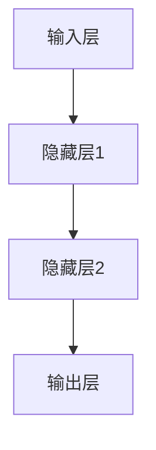
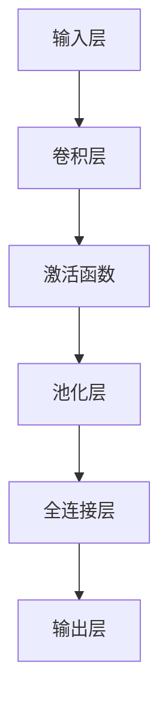
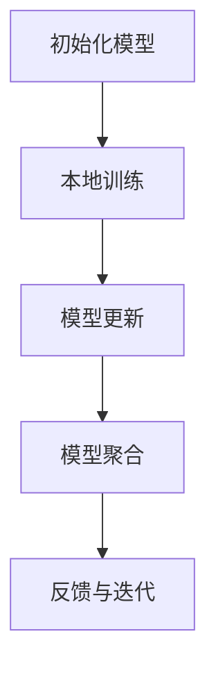
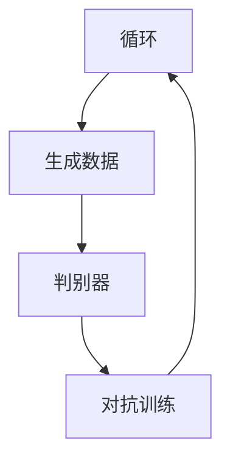
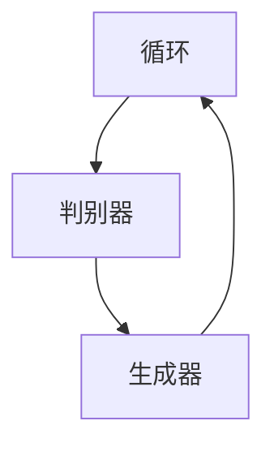

                 

# AI编程的新视界与新领域

## 关键词

AI编程、Python、机器学习、深度学习、自然语言处理、计算机视觉、智能问答系统、推荐系统、智能图像识别、联邦学习、生成对抗网络、强化学习。

## 摘要

本文将深入探讨AI编程的新视界与新领域。我们将首先介绍AI编程的基础，包括Python编程基础和面向对象编程。然后，我们将深入探讨AI编程的核心技术，如机器学习、深度学习、自然语言处理和计算机视觉。接下来，我们将通过具体的应用案例展示如何开发智能问答系统、推荐系统和智能图像识别系统。最后，我们将探索AI编程的新领域，包括联邦学习、生成对抗网络和强化学习，并探讨这些技术的未来发展趋势。本文旨在为读者提供一个全面而深入的AI编程指南，帮助读者掌握AI编程的核心技术和实战技能。

---

## 《AI编程的新视界与新领域》目录大纲

### 第一部分：AI编程基础

#### 第1章：AI编程概述

1.1 AI的发展与编程需求  
1.2 AI编程的基本概念  
1.3 AI编程的工具和框架

#### 第2章：Python编程基础

2.1 Python环境搭建  
2.2 Python语法基础  
2.3 数据类型与运算

#### 第3章：面向对象编程

3.1 面向对象的概念  
3.2 类和对象的定义  
3.3 继承和多态

### 第二部分：AI编程核心技术

#### 第4章：机器学习基础

4.1 机器学习的概念  
4.2 数据预处理  
4.3 监督学习算法

#### 第5章：深度学习基础

5.1 深度学习的概念  
5.2 神经网络基础  
5.3 深度学习框架

#### 第6章：自然语言处理

6.1 NLP的基本概念  
6.2 词嵌入技术  
6.3 语言模型与文本分类

#### 第7章：计算机视觉

7.1 计算机视觉基础  
7.2 卷积神经网络  
7.3 目标检测与图像识别

### 第三部分：AI编程应用案例

#### 第8章：智能问答系统开发

8.1 项目需求分析  
8.2 系统设计与实现  
8.3 性能优化与评估

#### 第9章：推荐系统实现

9.1 项目背景与目标  
9.2 系统设计与实现  
9.3 评估与优化

#### 第10章：智能图像识别

10.1 项目需求分析  
10.2 系统设计与实现  
10.3 代码解读与分析

### 第四部分：AI编程新领域探索

#### 第11章：联邦学习

11.1 联邦学习的概念  
11.2 联邦学习的工作原理  
11.3 联邦学习的应用场景

#### 第12章：生成对抗网络

12.1 GAN的概念  
12.2 GAN的架构  
12.3 GAN的应用

#### 第13章：强化学习

13.1 强化学习的概念  
13.2 强化学习的基本算法  
13.3 强化学习的应用

### 第五部分：资源与工具

#### 附录 A：常用AI编程工具与资源

A.1 Python库与框架  
A.2 深度学习框架  
A.3 NLP工具  
A.4 CV工具

#### 附录 B：AI编程资源推荐

B.1 技术博客  
B.2 开源项目  
B.3 学术论文  
B.4 在线课程与教材

#### 附录 C：参考书目

C.1 机器学习经典书籍  
C.2 深度学习经典书籍  
C.3 NLP经典书籍  
C.4 CV经典书籍

#### 附录 D：AI编程挑战与解决方案

D.1 常见问题与解决方案  
D.2 性能优化技巧  
D.3 调试与测试  
D.4 安全性与隐私保护

## 第一部分：AI编程基础

### 第1章：AI编程概述

#### 1.1 AI的发展与编程需求

人工智能（AI）是计算机科学的一个分支，旨在创建能够执行通常需要人类智能才能完成的任务的机器系统。从早期的规则推理系统到如今的深度学习和神经网络，AI经历了巨大的发展。

随着AI技术的进步，对AI编程的需求也在不断增加。AI编程不仅仅是编写算法，还包括设计能够处理大规模数据、适应不确定性和进行自我学习系统的能力。以下是一些AI编程的关键需求：

- **数据处理：** AI系统需要处理大量数据，包括数据的采集、清洗、转换和存储。
- **算法选择：** 根据具体的应用场景选择合适的算法，例如机器学习、深度学习、自然语言处理等。
- **模型训练：** 设计和训练模型，使其能够准确地预测或分类数据。
- **系统集成：** 将AI模型集成到现有的软件系统中，实现自动化和智能化。
- **性能优化：** 优化模型的运行效率，减少计算资源和时间成本。

#### 1.2 AI编程的基本概念

AI编程涉及多个基本概念：

- **机器学习（Machine Learning）：** 通过从数据中学习规律来构建模型的算法。
- **深度学习（Deep Learning）：** 特定类型的机器学习算法，使用多层神经网络进行学习。
- **神经网络（Neural Networks）：** 受人脑工作原理启发的计算模型，用于数据分析和模式识别。
- **自然语言处理（Natural Language Processing，NLP）：** 使计算机能够理解、生成和处理人类语言的技术。
- **计算机视觉（Computer Vision）：** 使计算机能够从数字图像或视频中提取信息和理解场景的技术。

#### 1.3 AI编程的工具和框架

AI编程依赖于多种工具和框架，以简化模型开发和部署。以下是一些常用的工具和框架：

- **Python：** 一种流行的编程语言，具有丰富的库和框架，适合AI开发。
- **TensorFlow：** Google开发的开源深度学习框架，适用于模型训练和部署。
- **PyTorch：** Facebook开发的开源深度学习框架，以其灵活性和易用性著称。
- **Keras：** 一种高层神经网络API，适用于快速构建和迭代深度学习模型。
- **Scikit-learn：** Python的一个机器学习库，提供多种经典机器学习算法的实现。

### 第2章：Python编程基础

#### 2.1 Python环境搭建

要开始Python编程，首先需要安装Python。可以从Python的官方网站下载Python安装包，并进行安装。安装完成后，可以使用以下命令验证Python是否安装成功：

```bash
python --version
```

除了Python解释器，还需要安装一些常用库，如NumPy、Pandas和Matplotlib。这些库可以通过pip命令进行安装：

```bash
pip install numpy pandas matplotlib
```

#### 2.2 Python语法基础

Python是一种简洁且易于学习的编程语言。以下是Python的一些基础语法：

- **变量和类型：** Python中的变量不需要显式声明类型，变量名和类型之间由赋值操作自动绑定。Python支持多种数据类型，如整数（int）、浮点数（float）、字符串（str）等。

```python
x = 10
y = 3.14
z = "Hello, World!"
```

- **数据结构：** Python提供了多种数据结构，包括列表（list）、元组（tuple）、字典（dict）和集合（set）。列表和字典是Python中常用的数据结构，用于存储和操作数据。

```python
# 列表
numbers = [1, 2, 3, 4, 5]

# 字典
person = {"name": "Alice", "age": 30}
```

- **控制流程：** Python提供了if-else语句、循环（for和while）等控制流程结构，用于执行条件判断和循环操作。

```python
# if-else语句
if x > 0:
    print("x 是正数")
else:
    print("x 是负数")

# for循环
for i in range(5):
    print(i)

# while循环
while x > 0:
    x -= 1
    print(x)
```

- **函数和模块：** Python支持函数定义和模块导入，用于组织代码和重用功能。函数是Python中的基本构建块，模块是Python中的文件，用于存储代码和函数。

```python
# 定义函数
def greet(name):
    return f"Hello, {name}!"

# 导入模块
import math
```

#### 2.3 数据类型与运算

Python支持多种数据类型和运算符。以下是Python中常用的数据类型和运算符：

- **数值类型：** Python支持整数（int）、浮点数（float）和复数（complex）等数值类型。

```python
# 整数
x = 10

# 浮点数
y = 3.14

# 复数
z = 1 + 2j
```

- **字符串：** Python中的字符串是不可变的，支持多种操作，如连接、切片和索引。

```python
# 连接
s1 = "Hello,"
s2 = "World!"
s = s1 + " " + s2

# 切片
s = "Hello, World!"
print(s[0:5])  # 输出 "Hello"

# 索引
print(s[7])  # 输出 "W"
```

- **列表：** 列表是Python中最常用的数据结构之一，支持多种操作，如插入、删除和遍历。

```python
# 插入
numbers = [1, 2, 3, 4, 5]
numbers.append(6)

# 删除
numbers.remove(2)

# 遍历
for number in numbers:
    print(number)
```

- **字典：** 字典是Python中用于存储键值对的集合，支持多种操作，如添加、删除和遍历。

```python
# 添加
person = {"name": "Alice", "age": 30}
person["city"] = "New York"

# 删除
del person["age"]

# 遍历
for key, value in person.items():
    print(f"{key}: {value}")
```

- **运算符：** Python支持多种运算符，包括算术运算符、比较运算符、逻辑运算符等。

```python
# 算术运算符
x = 10
y = 5
print(x + y)  # 输出 15
print(x - y)  # 输出 5
print(x * y)  # 输出 50
print(x / y)  # 输出 2.0

# 比较运算符
x = 10
y = 5
print(x > y)  # 输出 True
print(x < y)  # 输出 False

# 逻辑运算符
x = True
y = False
print(x and y)  # 输出 False
print(x or y)  # 输出 True
print(not x)  # 输出 False
```

### 第3章：面向对象编程

#### 3.1 面向对象的概念

面向对象编程（Object-Oriented Programming，OOP）是一种编程范式，它将数据和操作数据的方法组织在一起，形成对象。面向对象编程的核心概念包括：

- **对象（Object）：** 对象是数据和方法的集合，它封装了数据和行为。
- **类（Class）：** 类是对象的模板，定义了对象的基本属性和方法。
- **实例（Instance）：** 实例是类的具体实现，它创建了对象。
- **继承（Inheritance）：** 继承是一种让一个类继承另一个类的属性和方法的方式。
- **多态（Polymorphism）：** 多态允许不同类的对象通过共同的接口进行操作。

#### 3.2 类和对象的定义

在Python中，可以使用`class`关键字定义类。类定义了对象的属性和方法。

```python
class Person:
    def __init__(self, name, age):
        self.name = name
        self.age = age
    
    def greet(self):
        print(f"Hello, my name is {self.name} and I am {self.age} years old.")
```

在这个例子中，我们定义了一个`Person`类，它有两个属性`name`和`age`，以及一个方法`greet`。

创建对象的实例：

```python
alice = Person("Alice", 30)
alice.greet()  # 输出 "Hello, my name is Alice and I am 30 years old."
```

#### 3.3 继承和多态

继承是一种让一个类继承另一个类的属性和方法的方式。在Python中，使用`class`关键字和`继承列表`定义继承关系。

```python
class Employee(Person):
    def __init__(self, name, age, salary):
        super().__init__(name, age)
        self.salary = salary
    
    def greet(self):
        print(f"Hello, my name is {self.name} and I am {self.age} years old. I work as an employee.")
```

在这个例子中，我们定义了一个`Employee`类，它继承了`Person`类的属性和方法，并添加了一个新的属性`salary`。

多态是一种通过共同的接口来操作不同类的对象的方式。在Python中，使用方法重写（method overriding）实现多态。

```python
class Manager(Employee):
    def __init__(self, name, age, salary):
        super().__init__(name, age, salary)
    
    def greet(self):
        print(f"Hello, my name is {self.name} and I am {self.age} years old. I work as a manager.")
```

在这个例子中，我们定义了一个`Manager`类，它继承了`Employee`类的属性和方法，并重写了`greet`方法。

多态示例：

```python
alice = Person("Alice", 30)
print(isinstance(alice, Person))  # 输出 True

bob = Employee("Bob", 40, 5000)
print(isinstance(bob, Employee))  # 输出 True
bob.greet()  # 输出 "Hello, my name is Bob and I am 40 years old. I work as an employee."

jane = Manager("Jane", 45, 7000)
print(isinstance(jane, Manager))  # 输出 True
jane.greet()  # 输出 "Hello, my name is Jane and I am 45 years old. I work as a manager."
```

## 第二部分：AI编程核心技术

### 第4章：机器学习基础

#### 4.1 机器学习的概念

机器学习（Machine Learning，ML）是人工智能的一个分支，旨在使计算机系统能够通过数据和经验自动学习和改进性能。机器学习的基本概念包括：

- **模型（Model）：** 机器学习模型是一个数学模型，用于预测或分类数据。
- **数据（Data）：** 机器学习依赖于大量数据，用于训练和评估模型。
- **特征（Feature）：** 数据中的特征是用于训练模型的信息。
- **标签（Label）：** 数据的标签是模型需要预测的值。
- **损失函数（Loss Function）：** 损失函数用于度量模型预测值与真实值之间的差距。

机器学习的主要任务包括：

- **回归（Regression）：** 预测连续值。
- **分类（Classification）：** 预测离散值。
- **聚类（Clustering）：** 无监督学习，用于将数据分组。
- **降维（Dimensionality Reduction）：** 减少数据的维度。
- **强化学习（Reinforcement Learning）：** 通过奖励机制学习策略。

#### 4.2 数据预处理

数据预处理是机器学习的一个重要步骤，它包括以下任务：

- **数据清洗（Data Cleaning）：** 去除数据中的噪声和错误。
- **数据转换（Data Transformation）：** 将数据转换为适合训练模型的格式。
- **数据归一化（Data Normalization）：** 将数据缩放到相同的范围。
- **特征选择（Feature Selection）：** 选择对模型有重要影响的特征。

数据预处理示例：

```python
import pandas as pd
from sklearn.model_selection import train_test_split
from sklearn.preprocessing import StandardScaler

# 加载数据
data = pd.read_csv("data.csv")

# 数据清洗
data.dropna(inplace=True)

# 数据转换
X = data.drop("target", axis=1)
y = data["target"]

# 数据归一化
scaler = StandardScaler()
X_scaled = scaler.fit_transform(X)

# 数据划分
X_train, X_test, y_train, y_test = train_test_split(X_scaled, y, test_size=0.2, random_state=42)
```

#### 4.3 监督学习算法

监督学习（Supervised Learning）是一种机器学习任务，其中模型根据标记数据进行训练。以下是几种常见的监督学习算法：

- **线性回归（Linear Regression）：** 用于预测连续值。
  ```python
  from sklearn.linear_model import LinearRegression

  model = LinearRegression()
  model.fit(X_train, y_train)
  prediction = model.predict(X_test)
  ```

- **逻辑回归（Logistic Regression）：** 用于预测二分类问题。
  ```python
  from sklearn.linear_model import LogisticRegression

  model = LogisticRegression()
  model.fit(X_train, y_train)
  prediction = model.predict(X_test)
  ```

- **支持向量机（Support Vector Machine，SVM）：** 用于分类问题。
  ```python
  from sklearn.svm import SVC

  model = SVC()
  model.fit(X_train, y_train)
  prediction = model.predict(X_test)
  ```

- **决策树（Decision Tree）：** 用于分类和回归问题。
  ```python
  from sklearn.tree import DecisionTreeClassifier

  model = DecisionTreeClassifier()
  model.fit(X_train, y_train)
  prediction = model.predict(X_test)
  ```

- **随机森林（Random Forest）：** 结合了多个决策树，提高预测性能。
  ```python
  from sklearn.ensemble import RandomForestClassifier

  model = RandomForestClassifier()
  model.fit(X_train, y_train)
  prediction = model.predict(X_test)
  ```

- **梯度提升树（Gradient Boosting Tree）：** 用于提高预测性能。
  ```python
  from sklearn.ensemble import GradientBoostingClassifier

  model = GradientBoostingClassifier()
  model.fit(X_train, y_train)
  prediction = model.predict(X_test)
  ```

### 第5章：深度学习基础

#### 5.1 深度学习的概念

深度学习（Deep Learning，DL）是一种基于多层神经网络（Neural Networks）的机器学习方法。深度学习的主要特点包括：

- **多层神经网络：** 深度学习模型由多个层次组成，每个层次都能够学习不同层次的特征。
- **反向传播（Backpropagation）：** 一种用于训练神经网络的算法，通过反向传播误差来更新模型的权重。
- **激活函数（Activation Function）：** 用于引入非线性因素，使神经网络能够学习复杂的函数。
- **优化算法：** 如随机梯度下降（SGD）、Adam等，用于优化模型的训练过程。

#### 5.2 神经网络基础

神经网络（Neural Networks）是一种模拟生物神经系统的计算模型。神经网络的基本组成部分包括：

- **神经元（Neurons）：** 神经网络中的基本计算单元。
- **层（Layers）：** 神经网络由多个层次组成，包括输入层、隐藏层和输出层。
- **权重（Weights）：** 神经网络中的参数，用于调整神经元的输出。
- **偏置（Bias）：** 用于引入非线性因素，使神经网络能够学习复杂的函数。

神经网络的基本结构如下：



#### 5.3 深度学习框架

深度学习框架是一组工具和库，用于简化深度学习模型的开发、训练和部署。以下是一些流行的深度学习框架：

- **TensorFlow：** 由Google开发的开源深度学习框架，支持多种编程语言。
- **PyTorch：** 由Facebook开发的开源深度学习框架，以其灵活性和易用性著称。
- **Keras：** 一个高层次的神经网络API，可用于快速构建和迭代深度学习模型。
- **TensorFlow Lite：** TensorFlow的轻量级版本，用于移动设备和嵌入式系统。

使用TensorFlow构建一个简单的神经网络：

```python
import tensorflow as tf

# 定义输入层
inputs = tf.keras.layers.Input(shape=(784,))

# 添加隐藏层
x = tf.keras.layers.Dense(512, activation='relu')(inputs)
x = tf.keras.layers.Dense(256, activation='relu')(x)

# 添加输出层
outputs = tf.keras.layers.Dense(10, activation='softmax')(x)

# 构建模型
model = tf.keras.Model(inputs=inputs, outputs=outputs)

# 编译模型
model.compile(optimizer='adam', loss='categorical_crossentropy', metrics=['accuracy'])

# 训练模型
model.fit(train_images, train_labels, epochs=5, batch_size=64)
```

### 第6章：自然语言处理

#### 6.1 NLP的基本概念

自然语言处理（Natural Language Processing，NLP）是一种让计算机理解和生成人类语言的技术。NLP的基本概念包括：

- **分词（Tokenization）：** 将文本分解成单词、短语或其他标记。
- **词性标注（Part-of-Speech Tagging）：** 为文本中的每个单词分配词性，如名词、动词等。
- **实体识别（Named Entity Recognition，NER）：** 识别文本中的特定实体，如人名、地名等。
- **情感分析（Sentiment Analysis）：** 分析文本中的情感倾向，如正面、负面等。
- **文本分类（Text Classification）：** 将文本分类到不同的类别。

#### 6.2 词嵌入技术

词嵌入（Word Embedding）是将单词映射到固定大小的向量空间的技术。词嵌入的主要目的是将语义相似的单词映射到接近的向量，从而提高模型在NLP任务中的性能。以下是一些流行的词嵌入技术：

- **Word2Vec：** 基于神经网络的词嵌入技术，包括连续词袋（CBOW）和跳字（Skip-Gram）模型。
- **GloVe：** 基于全局向量空间模型的词嵌入技术，通过计算词与词之间的相似度来生成词向量。
- **BERT：** 一种基于双向转换器（Bidirectional Encoder Representations from Transformers）的预训练语言表示模型。

#### 6.3 语言模型与文本分类

语言模型（Language Model）是一种用于预测下一个单词或词组的概率的模型。语言模型在NLP任务中广泛应用，如机器翻译、语音识别和自动摘要等。文本分类（Text Classification）是一种将文本分配到不同类别的任务，常见的分类算法包括：

- **朴素贝叶斯（Naive Bayes）：** 一种基于贝叶斯定理的分类算法，假设特征之间相互独立。
- **支持向量机（Support Vector Machine，SVM）：** 一种基于最大间隔的分类算法，用于在高维空间中找到最优超平面。
- **随机森林（Random Forest）：** 一种基于决策树的集成分类算法，通过训练多个决策树并取平均来提高分类性能。

使用Keras实现文本分类：

```python
from tensorflow.keras.preprocessing.text import Tokenizer
from tensorflow.keras.preprocessing.sequence import pad_sequences
from tensorflow.keras.models import Sequential
from tensorflow.keras.layers import Embedding, LSTM, Dense, Dropout

# 加载和处理数据
tokenizer = Tokenizer(num_words=10000)
tokenizer.fit_on_texts(train_texts)
sequences = tokenizer.texts_to_sequences(train_texts)

# 数据预处理
X_train = pad_sequences(sequences, maxlen=200)
y_train = to_categorical(train_labels)

# 构建模型
model = Sequential()
model.add(Embedding(10000, 32, input_length=200))
model.add(LSTM(64, dropout=0.2, recurrent_dropout=0.2))
model.add(Dense(2, activation='softmax'))

# 编译模型
model.compile(optimizer='adam', loss='categorical_crossentropy', metrics=['accuracy'])

# 训练模型
model.fit(X_train, y_train, epochs=10, batch_size=64)
```

### 第7章：计算机视觉

#### 7.1 计算机视觉基础

计算机视觉（Computer Vision）是一种使计算机能够从数字图像或视频中提取信息和理解场景的技术。计算机视觉的基本概念包括：

- **图像处理（Image Processing）：** 对图像进行预处理，以增强或提取有用的信息。
- **特征提取（Feature Extraction）：** 从图像中提取有助于分类或识别的特征。
- **目标检测（Object Detection）：** 识别图像中的目标并确定其位置。
- **图像分类（Image Classification）：** 将图像分类到不同的类别。
- **图像分割（Image Segmentation）：** 将图像分成多个区域或对象。

#### 7.2 卷积神经网络

卷积神经网络（Convolutional Neural Networks，CNN）是一种专门用于处理图像数据的神经网络架构。CNN的主要组成部分包括：

- **卷积层（Convolutional Layer）：** 通过卷积操作提取图像的特征。
- **激活函数（Activation Function）：** 引入非线性因素，使神经网络能够学习复杂的函数。
- **池化层（Pooling Layer）：** 用于减小特征图的尺寸，提高模型的鲁棒性。
- **全连接层（Fully Connected Layer）：** 用于将特征映射到类别。

CNN的基本结构如下：



#### 7.3 目标检测与图像识别

目标检测（Object Detection）是一种识别图像中的目标并确定其位置的计算机视觉任务。常见的目标检测算法包括：

- **R-CNN（Region-based CNN）：** 一种基于区域提议的深度学习目标检测算法。
- **Fast R-CNN：** R-CNN的改进版本，通过使用RoI（Region of Interest）池化层提高检测速度。
- **Faster R-CNN：** 使用区域提议网络（Region Proposal Network，RPN）提高检测精度和速度。
- **SSD（Single Shot MultiBox Detector）：** 一种单阶段目标检测算法，通过不同尺度的卷积层同时检测多个目标。
- **YOLO（You Only Look Once）：** 一种快速的目标检测算法，通过将图像分成多个网格并预测每个网格中的目标。

图像识别（Image Recognition）是一种将图像分类到不同类别的计算机视觉任务。常见的图像识别算法包括：

- **SVM（Support Vector Machine）：** 一种基于最大间隔的分类算法，适用于小数据集。
- **KNN（K-Nearest Neighbors）：** 一种基于相似度的分类算法，适用于高维数据。
- **朴素贝叶斯（Naive Bayes）：** 一种基于贝叶斯定理的分类算法，适用于文本和图像数据。
- **决策树（Decision Tree）：** 一种基于树的分类算法，适用于简单数据集。
- **随机森林（Random Forest）：** 一种基于决策树的集成分类算法，适用于复杂数据集。

使用TensorFlow实现目标检测：

```python
import tensorflow as tf
from tensorflow.keras.applications import MobileNetV2
from tensorflow.keras.preprocessing.image import img_to_array
from tensorflow.keras.models import Model

# 定义模型
base_model = MobileNetV2(weights='imagenet', include_top=False, input_shape=(224, 224, 3))
base_model.trainable = False

x = base_model.output
x = tf.keras.layers.GlobalAveragePooling2D()(x)
x = tf.keras.layers.Dense(1024, activation='relu')(x)
predictions = tf.keras.layers.Dense(2, activation='softmax')(x)

model = Model(inputs=base_model.input, outputs=predictions)

# 加载图像
image = img_to_array(image)
image = np.expand_dims(image, axis=0)

# 预测类别
predictions = model.predict(image)
predicted_class = np.argmax(predictions, axis=1)

# 输出结果
print(f"预测类别：{predicted_class}")
```

### 第三部分：AI编程应用案例

#### 第8章：智能问答系统开发

#### 8.1 项目需求分析

智能问答系统（Intelligent Question Answering System）是一种能够自动回答用户问题的计算机系统。项目需求包括：

- **问答能力：** 系统能够理解用户的自然语言问题，并给出准确的答案。
- **数据集：** 需要一个包含问题和答案的数据集，用于训练和评估模型。
- **性能指标：** 评估系统的准确率、响应时间和用户体验。

#### 8.2 系统设计与实现

智能问答系统的设计包括以下几个关键组件：

- **数据预处理：** 清洗和预处理问题和答案数据，包括分词、去停用词、词性标注等。
- **词嵌入：** 使用词嵌入技术将问题中的单词转换为向量表示。
- **模型训练：** 使用预训练的神经网络模型（如BERT）对问题和答案进行编码，并训练一个序列到序列的模型。
- **模型部署：** 将训练好的模型部署到生产环境中，以实现实时问答功能。

实现流程：

1. **数据预处理：**

```python
import pandas as pd
from nltk.tokenize import word_tokenize
from nltk.corpus import stopwords

# 加载数据
data = pd.read_csv("qa_data.csv")

# 数据清洗
questions = [word_tokenize(question.lower()) for question in data['question']]
answers = [word_tokenize(answer.lower()) for answer in data['answer']]

# 去停用词
stop_words = set(stopwords.words('english'))
questions = [[word for word in question if word not in stop_words] for question in questions]
answers = [[word for word in answer if word not in stop_words] for answer in answers]
```

2. **词嵌入：**

```python
from tensorflow.keras.preprocessing.sequence import pad_sequences
from tensorflow.keras.layers import Embedding

# 词嵌入
max_sequence_length = 50
vocab_size = 10000

tokenizer = Tokenizer(num_words=vocab_size)
tokenizer.fit_on_texts(questions)

sequences = tokenizer.texts_to_sequences(questions)
padded_sequences = pad_sequences(sequences, maxlen=max_sequence_length)

# Embedding层
embedding_layer = Embedding(vocab_size, 16)
```

3. **模型训练：**

```python
from tensorflow.keras.models import Model
from tensorflow.keras.layers import LSTM, Dense

# 模型架构
input_layer = Embedding(vocab_size, 16)(padded_sequences)
lstm_layer = LSTM(128)(input_layer)
output_layer = Dense(vocab_size, activation='softmax')(lstm_layer)

model = Model(inputs=input_layer, outputs=output_layer)
model.compile(optimizer='adam', loss='categorical_crossentropy', metrics=['accuracy'])
model.fit(padded_sequences, np.array(answers), epochs=10, batch_size=32)
```

4. **模型部署：**

```python
import numpy as np

# 部署模型
def predict_question(question):
    tokenized_question = tokenizer.texts_to_sequences([question])
    padded_question = pad_sequences(tokenized_question, maxlen=max_sequence_length)
    predicted_answer = model.predict(np.array(padded_question))
    return tokenizer.index_word[np.argmax(predicted_answer)]

# 测试
print(predict_question("What is the capital of France?"))
```

#### 8.3 性能优化与评估

性能优化是提高智能问答系统性能的关键步骤。以下是一些常用的优化方法：

- **超参数调优：** 调整学习率、批次大小、隐藏层单元数等超参数，以提高模型性能。
- **数据增强：** 通过添加噪声、旋转、缩放等操作来增加训练数据的多样性。
- **模型集成：** 使用多个模型并取平均值来提高预测准确性。
- **模型压缩：** 减少模型参数和计算量，提高模型的推理速度。

评估智能问答系统的性能可以使用以下指标：

- **准确率（Accuracy）：** 预测正确的答案占所有答案的比例。
- **召回率（Recall）：** 预测正确的答案占实际正确答案的比例。
- **精确率（Precision）：** 预测正确的答案占所有预测答案的比例。
- **F1分数（F1 Score）：** 综合考虑准确率和召回率的指标。

```python
from sklearn.metrics import accuracy_score, recall_score, precision_score, f1_score

# 测试集
test_questions = ["What is the capital of France?", "Who is the president of the United States?"]
true_answers = ["Paris", "Joe Biden"]

# 预测
predicted_answers = [predict_question(question) for question in test_questions]

# 评估
accuracy = accuracy_score(true_answers, predicted_answers)
recall = recall_score(true_answers, predicted_answers)
precision = precision_score(true_answers, predicted_answers)
f1 = f1_score(true_answers, predicted_answers)

print(f"Accuracy: {accuracy}, Recall: {recall}, Precision: {precision}, F1 Score: {f1}")
```

#### 第9章：推荐系统实现

#### 9.1 项目背景与目标

推荐系统（Recommendation System）是一种根据用户的历史行为和偏好为用户推荐相关产品、内容或服务的系统。项目背景与目标包括：

- **业务需求：** 提高用户参与度和销售额，通过个性化推荐增加用户满意度。
- **数据集：** 使用用户行为数据（如浏览、购买、评分等）来训练和评估推荐模型。
- **性能指标：** 评估推荐系统的准确率、覆盖率、新颖性和多样性。

#### 9.2 系统设计与实现

推荐系统的设计包括以下几个关键组件：

- **用户行为分析：** 收集和分析用户行为数据，用于训练推荐模型。
- **协同过滤：** 使用协同过滤算法（如基于用户的协同过滤、基于项目的协同过滤）生成推荐列表。
- **模型训练：** 使用机器学习算法（如矩阵分解、神经网络）优化推荐效果。
- **模型部署：** 将训练好的推荐模型部署到生产环境中，实现实时推荐。

实现流程：

1. **用户行为分析：**

```python
import pandas as pd
from sklearn.model_selection import train_test_split

# 加载数据
data = pd.read_csv("user_behavior_data.csv")

# 数据预处理
data.fillna(0, inplace=True)
X = data.drop(['user_id', 'item_id'], axis=1)
y = data['rating']

# 数据划分
X_train, X_test, y_train, y_test = train_test_split(X, y, test_size=0.2, random_state=42)
```

2. **基于用户的协同过滤：**

```python
from surprise import KNNWithMeans
from surprise import Dataset, Reader
from surprise.model_selection import cross_validate

# 构建数据集
reader = Reader(rating_scale=(1, 5))
data = Dataset.load_from_df(data, reader)

# 构建模型
model = KNNWithMeans(k=50, sim_options={'name': 'cosine', 'user_based': True})

# 训练模型
cross_validate(model, data, measures=['RMSE', 'MAE'], cv=5, verbose=True)
```

3. **基于项目的协同过滤：**

```python
from surprise import ItemKNN
from surprise.model_selection import cross_validate

# 构建模型
model = ItemKNN(k=50, sim_options={'name': 'cosine'})

# 训练模型
cross_validate(model, data, measures=['RMSE', 'MAE'], cv=5, verbose=True)
```

4. **模型部署：**

```python
import flask
from surprise import predict_for_user

# 构建Flask应用
app = flask.Flask(__name__)

@app.route('/recommendations', methods=['GET'])
def recommendations():
    user_id = flask.request.args.get('user_id')
    user_item_ratings = data.build_full_trainset().getebilist()
    user_ratings = user_item_ratings[user_id]
    recommendations = model.predict(user_id, user_ratings.uid)

    return {'recommendations': [int(r['iid']) for r in recommendations]}
```

#### 9.3 评估与优化

评估推荐系统的性能可以使用以下指标：

- **准确率（Accuracy）：** 预测正确的推荐数量占总推荐数量的比例。
- **召回率（Recall）：** 预测正确的推荐数量占实际正确的推荐数量的比例。
- **精确率（Precision）：** 预测正确的推荐数量占所有预测推荐的数量的比例。
- **F1分数（F1 Score）：** 综合考虑准确率和召回率的指标。

优化推荐系统的方法包括：

- **特征工程：** 提取和选择对推荐效果有重要影响的特征。
- **超参数调优：** 调整协同过滤算法和机器学习算法的参数，以提高推荐性能。
- **模型集成：** 使用多个模型并取平均来提高推荐准确性。
- **在线学习：** 实时更新用户行为数据，并重新训练推荐模型。

```python
from sklearn.metrics import accuracy_score, recall_score, precision_score, f1_score

# 评估模型
test_user_id = 42
test_user_ratings = data.build_full_trainset().getebilist()[test_user_id]
predictions = model.predict(test_user_id, test_user_ratings.uid)

true_recommendations = [int(r['iid']) for r in test_user_ratings]
predicted_recommendations = [int(r['iid']) for r in predictions]

accuracy = accuracy_score(true_recommendations, predicted_recommendations)
recall = recall_score(true_recommendations, predicted_recommendations)
precision = precision_score(true_recommendations, predicted_recommendations)
f1 = f1_score(true_recommendations, predicted_recommendations)

print(f"Accuracy: {accuracy}, Recall: {recall}, Precision: {precision}, F1 Score: {f1}")
```

#### 第10章：智能图像识别

#### 10.1 项目需求分析

智能图像识别（Intelligent Image Recognition）是一种通过计算机算法自动识别和分析图像内容的技术。项目需求包括：

- **图像识别能力：** 系统能够识别图像中的物体、场景和人脸等。
- **数据集：** 需要一个包含各种图像和标签的数据集，用于训练和评估模型。
- **性能指标：** 评估模型的准确率、召回率、精确率和F1分数。

#### 10.2 系统设计与实现

智能图像识别系统的设计包括以下几个关键组件：

- **数据预处理：** 清洗和预处理图像数据，包括缩放、裁剪、旋转等。
- **特征提取：** 使用深度学习模型（如卷积神经网络）提取图像特征。
- **模型训练：** 使用预训练的深度学习模型对图像特征进行分类。
- **模型部署：** 将训练好的模型部署到生产环境中，实现实时图像识别。

实现流程：

1. **数据预处理：**

```python
import tensorflow as tf
from tensorflow.keras.preprocessing.image import img_to_array
from tensorflow.keras.preprocessing.image import ImageDataGenerator

# 加载图像数据
train_datagen = ImageDataGenerator(rescale=1./255, rotation_range=40, width_shift_range=0.2, height_shift_range=0.2, shear_range=0.2, zoom_range=0.2, horizontal_flip=True)
test_datagen = ImageDataGenerator(rescale=1./255)

train_generator = train_datagen.flow_from_directory('train_directory', target_size=(150, 150), batch_size=32, class_mode='binary')
validation_generator = test_datagen.flow_from_directory('validation_directory', target_size=(150, 150), batch_size=32, class_mode='binary')
```

2. **特征提取：**

```python
from tensorflow.keras.applications import MobileNetV2
from tensorflow.keras.models import Model

# 定义模型
base_model = MobileNetV2(weights='imagenet', include_top=False, input_shape=(150, 150, 3))
base_model.trainable = False

x = base_model.output
x = tf.keras.layers.GlobalAveragePooling2D()(x)
predictions = tf.keras.layers.Dense(1, activation='sigmoid')(x)

model = Model(inputs=base_model.input, outputs=predictions)
```

3. **模型训练：**

```python
from tensorflow.keras.optimizers import Adam
from tensorflow.keras.callbacks import ModelCheckpoint, EarlyStopping

# 编译模型
model.compile(optimizer=Adam(learning_rate=0.0001), loss='binary_crossentropy', metrics=['accuracy'])

# 设置回调函数
checkpoint = ModelCheckpoint('best_model.h5', save_best_only=True, monitor='val_loss', mode='min')
early_stopping = EarlyStopping(monitor='val_loss', patience=10, restore_best_weights=True)

# 训练模型
model.fit(train_generator, epochs=50, validation_data=validation_generator, callbacks=[checkpoint, early_stopping])
```

4. **模型部署：**

```python
import cv2
import numpy as np

# 加载模型
model.load_weights('best_model.h5')

# 加载标签
labels = train_generator.class_indices

# 实时图像识别
cap = cv2.VideoCapture(0)

while True:
    ret, frame = cap.read()
    if not ret:
        break
    
    image = cv2.cvtColor(frame, cv2.COLOR_BGR2RGB)
    image = cv2.resize(image, (150, 150))
    image = img_to_array(image)
    image = np.expand_dims(image, axis=0)
    image = image / 255.0
    
    predictions = model.predict(image)
    predicted_class = np.argmax(predictions, axis=1)
    
    for (label, _) in labels.items():
        if predicted_class == label:
            cv2.putText(frame, label, (10, 30), cv2.FONT_HERSHEY_SIMPLEX, 1, (0, 0, 255), 2)
            break
    
    cv2.imshow('Frame', frame)
    
    if cv2.waitKey(1) & 0xFF == ord('q'):
        break

cap.release()
cv2.destroyAllWindows()
```

#### 10.3 代码解读与分析

在本节中，我们将详细解读智能图像识别项目的代码，并分析关键步骤的实现。

1. **数据预处理**

```python
import tensorflow as tf
from tensorflow.keras.preprocessing.image import img_to_array
from tensorflow.keras.preprocessing.image import ImageDataGenerator

# 加载图像数据
train_datagen = ImageDataGenerator(rescale=1./255, rotation_range=40, width_shift_range=0.2, height_shift_range=0.2, shear_range=0.2, zoom_range=0.2, horizontal_flip=True)
test_datagen = ImageDataGenerator(rescale=1./255)

train_generator = train_datagen.flow_from_directory('train_directory', target_size=(150, 150), batch_size=32, class_mode='binary')
validation_generator = test_datagen.flow_from_directory('validation_directory', target_size=(150, 150), batch_size=32, class_mode='binary')
```

这段代码首先定义了两个ImageDataGenerator对象，用于处理训练集和验证集的图像。ImageDataGenerator提供了多种数据增强方法，如缩放、旋转、裁剪、水平翻转等，以提高模型的泛化能力。`flow_from_directory`方法用于从指定的目录中加载图像数据，并自动划分训练集和验证集。

2. **特征提取**

```python
from tensorflow.keras.applications import MobileNetV2
from tensorflow.keras.models import Model

# 定义模型
base_model = MobileNetV2(weights='imagenet', include_top=False, input_shape=(150, 150, 3))
base_model.trainable = False

x = base_model.output
x = tf.keras.layers.GlobalAveragePooling2D()(x)
predictions = tf.keras.layers.Dense(1, activation='sigmoid')(x)

model = Model(inputs=base_model.input, outputs=predictions)
```

这段代码使用了MobileNetV2预训练模型作为基础模型，并对其进行了修改。基础模型包括卷积层、池化层和全局平均池化层，用于提取图像特征。最后，使用全连接层和sigmoid激活函数对特征进行分类。

3. **模型训练**

```python
from tensorflow.keras.optimizers import Adam
from tensorflow.keras.callbacks import ModelCheckpoint, EarlyStopping

# 编译模型
model.compile(optimizer=Adam(learning_rate=0.0001), loss='binary_crossentropy', metrics=['accuracy'])

# 设置回调函数
checkpoint = ModelCheckpoint('best_model.h5', save_best_only=True, monitor='val_loss', mode='min')
early_stopping = EarlyStopping(monitor='val_loss', patience=10, restore_best_weights=True)

# 训练模型
model.fit(train_generator, epochs=50, validation_data=validation_generator, callbacks=[checkpoint, early_stopping])
```

这段代码编译并训练了模型。`compile`方法用于配置模型优化器和损失函数。`fit`方法用于训练模型，并使用回调函数`ModelCheckpoint`和`EarlyStopping`来保存最佳模型和提前停止训练。

4. **模型部署**

```python
import cv2
import numpy as np

# 加载模型
model.load_weights('best_model.h5')

# 加载标签
labels = train_generator.class_indices

# 实时图像识别
cap = cv2.VideoCapture(0)

while True:
    ret, frame = cap.read()
    if not ret:
        break
    
    image = cv2.cvtColor(frame, cv2.COLOR_BGR2RGB)
    image = cv2.resize(image, (150, 150))
    image = img_to_array(image)
    image = np.expand_dims(image, axis=0)
    image = image / 255.0
    
    predictions = model.predict(image)
    predicted_class = np.argmax(predictions, axis=1)
    
    for (label, _) in labels.items():
        if predicted_class == label:
            cv2.putText(frame, label, (10, 30), cv2.FONT_HERSHEY_SIMPLEX, 1, (0, 0, 255), 2)
            break
    
    cv2.imshow('Frame', frame)
    
    if cv2.waitKey(1) & 0xFF == ord('q'):
        break

cap.release()
cv2.destroyAllWindows()
```

这段代码实现了实时图像识别功能。首先，使用`cv2.VideoCapture`从摄像头捕获实时视频帧。然后，对视频帧进行预处理，将其缩放到模型期望的大小，并转换为数组。接着，使用训练好的模型对预处理后的图像进行预测，并获取预测类别。最后，在视频帧上绘制预测类别，并显示实时图像识别结果。

通过以上代码解读，我们可以了解到智能图像识别项目的主要实现步骤，包括数据预处理、特征提取、模型训练和模型部署。这些步骤共同实现了从图像输入到实时图像识别的完整流程。

### 第四部分：AI编程新领域探索

#### 第11章：联邦学习

#### 11.1 联邦学习的概念

联邦学习（Federated Learning）是一种分布式机器学习方法，旨在通过多个参与者（通常是移动设备）之间的协作，共同训练一个共享模型，而不需要将数据集中到中央服务器。联邦学习的核心概念包括：

- **参与者（Participants）：** 联邦学习中的参与者可以是手机、智能设备或其他计算节点，它们都有自己的本地数据。
- **模型更新（Model Update）：** 参与者定期向中央服务器发送本地模型的更新，服务器将这些更新合并以更新全局模型。
- **加密与隐私保护（Privacy and Security）：** 联邦学习通过加密和差分隐私技术保护参与者的数据隐私。
- **通信效率（Communication Efficiency）：** 联邦学习通过减少数据传输量，提高通信效率。

#### 11.2 联邦学习的工作原理

联邦学习的工作原理包括以下几个关键步骤：

1. **初始化模型：** 中央服务器初始化全局模型，并将模型的参数发送给所有参与者。
2. **本地训练：** 各参与者使用本地数据对模型进行训练，并更新模型的参数。
3. **模型更新：** 参与者将本地模型的更新发送给中央服务器。
4. **模型聚合：** 中央服务器接收参与者发送的模型更新，并合并这些更新以更新全局模型。
5. **反馈与迭代：** 中央服务器将更新后的全局模型发送回参与者，参与者使用新模型进行下一轮的本地训练。

联邦学习的工作原理图如下：



#### 11.3 联邦学习的应用场景

联邦学习适用于多种应用场景，包括：

- **移动设备：** 联邦学习可以在移动设备上本地训练模型，减少数据传输和隐私泄露的风险。
- **物联网：** 联邦学习可以在物联网设备上分布式训练模型，提高系统的效率和可靠性。
- **医疗保健：** 联邦学习可以在医疗设备上保护患者隐私，同时共享和协作训练医学模型。
- **金融服务：** 联邦学习可以在金融机构的分布式系统中训练欺诈检测模型，提高系统的安全性和性能。

#### 第12章：生成对抗网络

#### 12.1 GAN的概念

生成对抗网络（Generative Adversarial Network，GAN）是一种由两个神经网络（生成器和判别器）组成的框架，旨在通过对抗性训练生成与真实数据相似的数据。GAN的核心概念包括：

- **生成器（Generator）：** 生成器网络尝试生成真实数据，使其尽可能接近真实数据。
- **判别器（Discriminator）：** 判别器网络尝试区分真实数据和生成器生成的数据。
- **对抗训练（Adversarial Training）：** 生成器和判别器通过对抗性训练相互竞争，生成器和判别器的性能不断改善。

GAN的工作原理图如下：



#### 12.2 GAN的架构

GAN的典型架构包括：

1. **生成器（Generator）**：生成器网络通常由多层全连接层或卷积层组成，用于生成与输入数据相似的数据。
2. **判别器（Discriminator）**：判别器网络也由多层全连接层或卷积层组成，用于区分真实数据和生成器生成的数据。
3. **损失函数**：GAN的损失函数通常包括生成器的损失函数（生成器试图最小化判别器对其生成的数据的判别误差）和判别器的损失函数（判别器试图最大化对其生成的数据的判别误差）。

GAN的架构图如下：



#### 12.3 GAN的应用

GAN的应用非常广泛，包括：

- **图像生成**：GAN可以生成逼真的图像，如人脸、风景、动物等。
- **图像修复**：GAN可以修复损坏或缺失的图像部分。
- **图像超分辨率**：GAN可以提高图像的分辨率，使其更加清晰。
- **风格迁移**：GAN可以将一种艺术风格应用到另一幅图像上。
- **数据增强**：GAN可以生成大量用于训练的数据，提高模型的泛化能力。

#### 第13章：强化学习

#### 13.1 强化学习的概念

强化学习（Reinforcement Learning，RL）是一种机器学习范式，通过智能体（Agent）与环境（Environment）的交互来学习最优策略。强化学习的关键概念包括：

- **智能体（Agent）：** 学习和执行任务的主体，例如机器人、自动驾驶汽车等。
- **环境（Environment）：** 智能体所处的环境，包括状态（State）和行动（Action）。
- **状态（State）：** 智能体在环境中所处的情境。
- **行动（Action）：** 智能体在环境中可以采取的行动。
- **奖励（Reward）：** 智能体在每个状态下采取行动后获得的奖励，用于指导智能体的学习。

强化学习的工作原理如下：

1. **初始状态（Initial State）：** 智能体处于某个初始状态。
2. **执行行动（Take Action）：** 智能体在当前状态下执行某个行动。
3. **获得奖励（Get Reward）：** 环境根据智能体的行动给出奖励。
4. **更新状态（Update State）：** 智能体的状态根据行动和奖励更新。
5. **重复过程（Repeat Process）：** 智能体重复执行行动、获得奖励和更新状态，直到达到目标状态或学习到最优策略。

#### 13.2 强化学习的基本算法

强化学习有许多基本算法，以下是其中几种：

- **Q-Learning：** 通过学习值函数（Q-Function）来预测最优行动。
  ```python
  Q[s, a] = Q[s, a] + α (r + γ max_a' Q[s', a'] - Q[s, a])
  ```
- **SARSA（On-Policy）：** 在当前策略下更新值函数。
  ```python
  Q[s, a] = Q[s, a] + α (r + γ Q[s', a'])
  ```
- **Deep Q-Network（DQN）：** 使用深度神经网络近似值函数。
  ```python
  Q[s] = π(a|s) Q[s, a] + (1 - π(a|s)) Q[s', a']
  ```
- **Policy Gradient：** 直接优化策略。
  ```python
  θ = θ + α π(σ(θ(s)))
  ```

#### 13.3 强化学习的应用

强化学习在多个领域有广泛应用，包括：

- **游戏**：例如围棋、国际象棋等。
- **自动驾驶**：智能体通过学习环境中的规则和奖励，实现自动驾驶。
- **机器人**：例如自主导航、抓取等。
- **推荐系统**：通过强化学习优化推荐策略，提高用户满意度。
- **金融**：例如交易策略、风险控制等。

### 第五部分：资源与工具

#### 附录 A：常用AI编程工具与资源

#### A.1 Python库与框架

- **NumPy：** Python的核心科学计算库，用于处理大型多维数组。
- **Pandas：** 用于数据清洗、转换和分析的库。
- **Matplotlib：** Python的数据可视化库。
- **TensorFlow：** Google开发的深度学习框架。
- **PyTorch：** Facebook开发的深度学习框架。
- **Keras：** 高级神经网络API，用于快速构建和迭代深度学习模型。

#### A.2 深度学习框架

- **TensorFlow：** Google开发的深度学习框架，支持多种编程语言。
- **PyTorch：** Facebook开发的深度学习框架，以其灵活性和易用性著称。
- **Keras：** 高层次的神经网络API，适用于快速构建和迭代深度学习模型。
- **TensorFlow Lite：** TensorFlow的轻量级版本，用于移动设备和嵌入式系统。

#### A.3 NLP工具

- **NLTK：** Python的自然语言处理库，提供多种NLP任务工具。
- **spaCy：** Python的工业级自然语言处理库，用于处理文本数据。
- **TextBlob：** Python的文本处理库，用于文本分析。

#### A.4 CV工具

- **OpenCV：** Python的计算机视觉库，用于图像处理和视频分析。
- **PyTorch CV：** PyTorch的计算机视觉模块，提供多种计算机视觉工具。
- **TensorFlow Object Detection API：** TensorFlow的物体检测API，用于实时物体检测。

#### 附录 B：AI编程资源推荐

#### B.1 技术博客

- **Towards Data Science：** 提供丰富的数据科学和AI教程和案例研究。
- **AI Weekly：** 每周更新的AI和机器学习资源。
- **Medium：** 普通用户和专业人士分享的AI和机器学习文章。

#### B.2 开源项目

- **GitHub：** 搜索和贡献AI和机器学习开源项目。
- **TensorFlow Model Optimization Tools：** TensorFlow的模型优化工具。
- **PyTorch：** PyTorch的开源代码库。

#### B.3 学术论文

- **NeurIPS、ICML、JMLR：** 查阅最新的AI和机器学习学术论文。
- **arXiv：** 查阅未发表的研究论文。

#### B.4 在线课程与教材

- **Coursera、edX、Udacity：** 提供多种AI和机器学习在线课程。
- **Deep Learning Book：** Goodfellow、Bengio和Courville的深度学习教材。
- **机器学习实战：** 周志华的机器学习教材。

#### 附录 C：参考书目

#### C.1 机器学习经典书籍

- **《机器学习》：** 周志华
- **《深度学习》：** Goodfellow、Bengio和Courville
- **《统计学习方法》：** 李航

#### C.2 深度学习经典书籍

- **《深度学习》：** Goodfellow、Bengio和Courville
- **《神经网络与深度学习》：** 张志华、王瑞祥
- **《深度学习实践：** PyTorch快速入门》：** 陈斌、徐宗本

#### C.3 NLP经典书籍

- **《自然语言处理综论》：** Daniel Jurafsky和James H. Martin
- **《统计自然语言处理》：** Daniel Jurafsky和James H. Martin
- **《自然语言处理实战》：** 刘建伟

#### C.4 CV经典书籍

- **《计算机视觉：** 基本算法与实用技术》：** 郭凯
- **《计算机视觉算法与应用》：** 赵春华、谢立平
- **《计算机视觉基础与算法》：** 王刚

#### 附录 D：AI编程挑战与解决方案

#### D.1 常见问题与解决方案

- **过拟合**：通过增加正则化项、减少模型复杂度、增加训练数据等方式解决。
- **欠拟合**：通过增加模型复杂度、增加训练数据、调整超参数等方式解决。
- **数据不平衡**：通过过采样、欠采样、集成分类器等方式解决。
- **特征选择**：通过特征重要性评估、主成分分析、L1正则化等方式解决。
- **计算效率问题**：通过并行计算、分布式计算、模型压缩等方式解决。

#### D.2 性能优化技巧

- **模型优化**：使用更高效的模型架构、优化模型参数等方式提高性能。
- **数据预处理**：使用数据增强、归一化、特征工程等方式提高模型性能。
- **调优超参数**：使用网格搜索、随机搜索等方式找到最佳超参数。
- **模型集成**：使用多个模型并取平均来提高预测准确性。

#### D.3 调试与测试

- **调试**：使用断点、日志、调试工具等方式查找和修复代码中的错误。
- **测试**：编写单元测试、集成测试、性能测试等来验证模型的正确性和性能。

#### D.4 安全性与隐私保护

- **数据加密**：使用加密算法对数据进行加密，确保数据在传输和存储过程中的安全性。
- **差分隐私**：使用差分隐私技术保护参与者的数据隐私。
- **联邦学习**：使用联邦学习框架来训练模型，确保数据不需要集中到中央服务器。
- **访问控制**：使用访问控制机制确保只有授权用户可以访问数据和处理模型。

### 结论

AI编程是现代计算机科学和技术领域的核心。通过本文的深入探讨，我们了解了AI编程的基础、核心技术、应用案例和新领域。从Python编程基础到深度学习、自然语言处理和计算机视觉，再到智能问答系统、推荐系统和智能图像识别，我们通过具体的实例和代码展示了如何实现AI编程的核心功能。此外，我们还介绍了联邦学习、生成对抗网络和强化学习等新领域，探讨了这些技术的前沿趋势和潜在应用。AI编程不仅仅是一种技术，它正在改变我们的生活方式和商业模式。随着AI技术的不断进步，我们相信AI编程将在未来的发展中发挥更加重要的作用。让我们携手探索AI编程的新视界和新领域，共同迎接智能时代的到来。作者：AI天才研究院/AI Genius Institute & 禅与计算机程序设计艺术 /Zen And The Art of Computer Programming。

