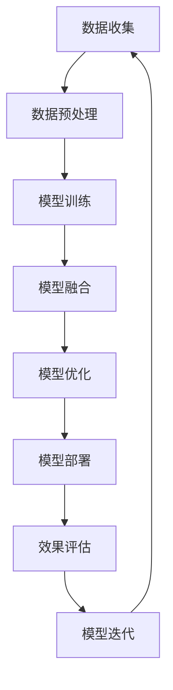

                 

# 《搜索推荐系统的AI 进化：大模型融合带来的挑战与机遇》

> **关键词**：搜索推荐系统、人工智能、大模型、融合技术、挑战与机遇

> **摘要**：
本文深入探讨了搜索推荐系统中的AI进化，特别是大模型融合技术所带来的挑战与机遇。通过分析搜索推荐系统的基本概念、人工智能的融合应用，以及大模型的基本概念与融合技术，文章详细探讨了其应用实践与挑战，并展望了未来发展趋势。

---

## 目录

### 《搜索推荐系统的AI进化：大模型融合带来的挑战与机遇》目录大纲

---

### 第一部分：搜索推荐系统概述

## 第1章：搜索推荐系统基础

### 1.1 搜索推荐系统的概念与分类

### 1.2 搜索推荐系统的基本架构

### 1.3 搜索推荐系统的核心功能

## 第2章：人工智能与搜索推荐系统的结合

### 2.1 人工智能在搜索推荐系统中的应用

### 2.2 搜索推荐系统的AI进化历程

### 2.3 AI在搜索推荐系统中的核心作用

### 第二部分：大模型在搜索推荐系统中的应用

## 第3章：大模型的基本概念与原理

### 3.1 大模型的定义与特点

### 3.2 大模型的训练与优化

### 3.3 大模型在搜索推荐系统中的适用性

## 第4章：大模型融合技术

### 4.1 大模型融合的定义与分类

### 4.2 大模型融合的优势与挑战

### 4.3 大模型融合的常见方法

## 第5章：大模型在搜索推荐系统中的实践

### 5.1 大模型在搜索中的应用

### 5.2 大模型在推荐中的应用

### 5.3 大模型融合的案例分析

### 第三部分：大模型融合带来的挑战与机遇

## 第6章：大模型融合的挑战

### 6.1 计算资源需求

### 6.2 数据隐私保护

### 6.3 模型解释性

## 第7章：大模型融合的机遇

### 7.1 提升搜索推荐系统的效果

### 7.2 开拓新的应用场景

### 7.3 促进人工智能技术的发展

## 第8章：未来展望

### 8.1 大模型融合的发展趋势

### 8.2 搜索推荐系统的未来

### 8.3 人工智能技术的未来

## 附录

### 附录A：常用工具与资源

### 附录B：大模型融合流程图

---

### 《搜索推荐系统的AI进化：大模型融合带来的挑战与机遇》

> **关键词**：搜索推荐系统、人工智能、大模型、融合技术、挑战与机遇

> **摘要**：
本文深入探讨了搜索推荐系统中的AI进化，特别是大模型融合技术所带来的挑战与机遇。通过分析搜索推荐系统的基本概念、人工智能的融合应用，以及大模型的基本概念与融合技术，文章详细探讨了其应用实践与挑战，并展望了未来发展趋势。

---

## 第1章：搜索推荐系统基础

### 1.1 搜索推荐系统的概念与分类

搜索推荐系统是现代互联网应用中不可或缺的一部分，其目的是通过智能算法向用户提供个性化搜索结果和推荐内容。搜索推荐系统可以基于多种不同的技术实现，常见的分类方法包括：

1. **基于内容的推荐系统**：这种系统根据用户的历史行为和兴趣，通过分析内容特征进行推荐。例如，在电子商务平台上，系统可以根据用户的浏览记录推荐相似的商品。

2. **协同过滤推荐系统**：通过分析用户与物品的交互记录，找出相似用户或相似物品进行推荐。协同过滤可以分为两种：基于用户的协同过滤（User-based Collaborative Filtering）和基于物品的协同过滤（Item-based Collaborative Filtering）。

3. **基于模型的推荐系统**：使用机器学习算法建立用户兴趣模型和物品特征模型，通过模型预测用户对物品的偏好进行推荐。常用的模型包括决策树、贝叶斯网络、神经网络等。

4. **混合推荐系统**：结合以上几种方法的优点，构建一个更加复杂和灵活的推荐系统。混合推荐系统通常能够提供更准确的推荐结果。

### 1.2 搜索推荐系统的基本架构

搜索推荐系统的基本架构可以分为以下几个关键模块：

1. **用户行为分析模块**：该模块负责收集并分析用户的行为数据，如浏览历史、购买记录等，以提取用户兴趣特征。

2. **搜索引擎模块**：该模块利用搜索引擎技术，为用户提供信息检索服务。搜索引擎需要处理用户查询，检索索引数据，并生成搜索结果。

3. **推荐算法模块**：根据用户兴趣特征，推荐算法从商品、内容库中选择出可能符合用户偏好的物品，并将其展示给用户。

4. **用户界面模块**：用户界面负责将搜索结果和推荐结果展示给用户，并提供交互功能，如点击、评价等。

### 1.3 搜索推荐系统的核心功能

1. **搜索功能**：提供基于关键词的信息检索服务，用户可以通过输入关键词来获取相关的内容。

2. **推荐功能**：根据用户的兴趣和偏好，为用户推荐相关的商品、内容或服务。推荐功能可以通过算法模型自动完成，也可以结合用户反馈进行优化。

3. **用户个性化**：通过分析用户行为，系统可以为每位用户提供个性化的搜索和推荐结果，从而提升用户体验。

4. **实时更新**：随着用户行为的不断变化，搜索推荐系统需要实时更新推荐结果，以保持与用户需求的同步。

### 1.1 搜索推荐系统的概念与分类

#### 1.1.1 搜索推荐系统的定义

推荐系统是一种信息过滤技术，通过预测用户对物品的兴趣，向用户推荐可能感兴趣的物品。它通常包括以下核心组件：

- **用户**：系统目标服务的用户群体。
- **物品**：用户可能感兴趣的商品、内容或服务。
- **交互数据**：用户与物品之间的历史交互记录，如点击、购买、评分等。
- **推荐算法**：根据用户交互数据生成推荐结果。

数学上，推荐系统可以表示为一个四元组：
$$
\text{推荐系统} = \{\text{用户}, \text{物品}, \text{交互数据}, \text{推荐算法}\}
$$

#### 1.1.2 推荐系统的分类

推荐系统可以根据不同的分类标准划分为多种类型，以下是几种常见的分类方法：

1. **基于内容的推荐（Content-Based Filtering）**：
   - **原理**：基于用户过去的偏好和物品的内容特征进行推荐。
   - **优点**：能够推荐新颖的、与用户兴趣相关的物品。
   - **缺点**：对用户兴趣变化不够敏感，可能产生“过滤气泡”。

2. **协同过滤推荐（Collaborative Filtering）**：
   - **基于用户的协同过滤（User-Based Collaborative Filtering）**：
     - **原理**：找到与目标用户兴趣相似的其他用户，推荐这些用户喜欢的物品。
     - **优点**：能够发现用户间未知的相似性。
     - **缺点**：对新用户不友好，需要大量的历史数据支持。
   - **基于物品的协同过滤（Item-Based Collaborative Filtering）**：
     - **原理**：找到与目标物品相似的其他物品，推荐这些物品给用户。
     - **优点**：能够推荐新颖的、与用户兴趣相关的物品。
     - **缺点**：对用户兴趣变化不够敏感，可能产生“过滤气泡”。

3. **基于模型的推荐（Model-Based Filtering）**：
   - **原理**：使用机器学习算法（如线性回归、决策树、神经网络等）建立用户兴趣模型，预测用户对物品的偏好。
   - **优点**：能够处理大量数据，对用户兴趣变化较为敏感。
   - **缺点**：算法复杂度较高，需要大量训练数据和计算资源。

4. **混合推荐系统（Hybrid Recommender Systems）**：
   - **原理**：结合多种推荐算法的优点，以提高推荐准确性和覆盖度。
   - **优点**：能够利用不同算法的优势，提高推荐效果。
   - **缺点**：实现复杂，需要权衡多种算法之间的平衡。

#### 1.1.3 搜索推荐系统的基本架构

搜索推荐系统的基本架构可以分为以下几个关键模块：

1. **用户行为分析模块**：
   - **功能**：收集和分析用户的历史行为数据（如浏览、点击、购买等），提取用户兴趣特征。
   - **输入**：用户行为数据。
   - **输出**：用户兴趣特征向量。

2. **物品特征分析模块**：
   - **功能**：提取和分析物品的特征信息（如文本、图片、标签等），构建物品特征向量。
   - **输入**：物品数据。
   - **输出**：物品特征向量。

3. **推荐算法模块**：
   - **功能**：利用用户兴趣特征和物品特征，通过机器学习算法生成推荐列表。
   - **输入**：用户兴趣特征、物品特征。
   - **输出**：推荐结果列表。

4. **用户界面模块**：
   - **功能**：将推荐结果展示给用户，提供用户交互接口。
   - **输入**：推荐结果列表。
   - **输出**：用户反馈。

### 1.2 搜索推荐系统的基本架构

#### 1.2.1 用户行为分析模块

用户行为分析模块是搜索推荐系统的核心组成部分，负责收集并分析用户的历史行为数据，以提取用户兴趣特征。以下是用户行为分析模块的关键步骤：

1. **数据收集**：
   - **功能**：从各种来源收集用户行为数据，如浏览历史、点击记录、购买记录、搜索查询等。
   - **输入**：用户操作日志、用户行为数据。
   - **输出**：用户行为数据集。

2. **数据预处理**：
   - **功能**：清洗和转换用户行为数据，包括去除无效数据、填补缺失值、标准化处理等。
   - **输入**：用户行为数据集。
   - **输出**：预处理后的用户行为数据集。

3. **特征提取**：
   - **功能**：从预处理后的用户行为数据中提取用户兴趣特征，如用户偏好、行为模式等。
   - **输入**：预处理后的用户行为数据集。
   - **输出**：用户兴趣特征向量。

4. **特征表征**：
   - **功能**：将提取的用户兴趣特征进行编码和表征，以适应机器学习算法的要求。
   - **输入**：用户兴趣特征向量。
   - **输出**：用户兴趣特征表征。

5. **特征选择**：
   - **功能**：根据特征的重要性和关联性，选择对用户兴趣有显著影响的特征，以减少模型复杂度和提高推荐效果。
   - **输入**：用户兴趣特征表征。
   - **输出**：用户兴趣特征集合。

#### 1.2.2 搜索引擎模块

搜索引擎模块负责提供基于关键词的信息检索服务，为用户提供精准的搜索结果。以下是搜索引擎模块的关键步骤：

1. **查询解析**：
   - **功能**：解析用户输入的关键词，识别查询意图和关键词权重。
   - **输入**：用户查询。
   - **输出**：查询解析结果。

2. **索引构建**：
   - **功能**：构建索引数据结构，以便快速检索和查询匹配。
   - **输入**：物品数据、用户兴趣特征。
   - **输出**：索引数据。

3. **查询匹配**：
   - **功能**：将用户查询与索引数据中的关键词进行匹配，找出最相关的结果。
   - **输入**：查询解析结果、索引数据。
   - **输出**：查询匹配结果。

4. **结果排序**：
   - **功能**：根据匹配结果的相关性和重要性，对搜索结果进行排序。
   - **输入**：查询匹配结果。
   - **输出**：排序后的搜索结果。

5. **结果展示**：
   - **功能**：将排序后的搜索结果展示给用户，并提供交互界面。
   - **输入**：排序后的搜索结果。
   - **输出**：用户交互反馈。

#### 1.2.3 推荐算法模块

推荐算法模块是搜索推荐系统的核心，负责根据用户兴趣特征为用户推荐相关的内容。以下是推荐算法模块的关键步骤：

1. **用户兴趣模型构建**：
   - **功能**：使用机器学习算法（如决策树、贝叶斯网络、神经网络等）建立用户兴趣模型。
   - **输入**：用户兴趣特征。
   - **输出**：用户兴趣模型。

2. **物品特征提取**：
   - **功能**：从物品数据中提取特征信息，如文本、图片、标签等。
   - **输入**：物品数据。
   - **输出**：物品特征向量。

3. **推荐列表生成**：
   - **功能**：利用用户兴趣模型和物品特征向量，通过机器学习算法生成推荐列表。
   - **输入**：用户兴趣模型、物品特征向量。
   - **输出**：推荐列表。

4. **推荐结果优化**：
   - **功能**：根据用户反馈和历史推荐数据，优化推荐算法和推荐结果。
   - **输入**：用户反馈、历史推荐数据。
   - **输出**：优化后的推荐算法和推荐结果。

5. **推荐结果展示**：
   - **功能**：将优化后的推荐结果展示给用户，并提供交互界面。
   - **输入**：优化后的推荐结果。
   - **输出**：用户交互反馈。

#### 1.2.4 用户界面模块

用户界面模块是搜索推荐系统与用户之间的交互接口，负责展示搜索结果和推荐结果，并接收用户的反馈。以下是用户界面模块的关键步骤：

1. **搜索结果展示**：
   - **功能**：将搜索引擎模块生成的搜索结果以可视化的方式展示给用户。
   - **输入**：搜索结果。
   - **输出**：用户交互反馈。

2. **推荐结果展示**：
   - **功能**：将推荐算法模块生成的推荐结果以可视化的方式展示给用户。
   - **输入**：推荐列表。
   - **输出**：用户交互反馈。

3. **用户交互**：
   - **功能**：提供用户与系统交互的接口，如搜索框、推荐栏、评分按钮等。
   - **输入**：用户操作。
   - **输出**：用户交互反馈。

4. **反馈处理**：
   - **功能**：收集用户对搜索结果和推荐结果的反馈，用于优化推荐算法和系统性能。
   - **输入**：用户反馈。
   - **输出**：优化后的推荐算法和系统性能。

5. **个性化设置**：
   - **功能**：允许用户自定义搜索和推荐偏好，以满足个性化需求。
   - **输入**：用户个性化设置。
   - **输出**：个性化搜索结果和推荐结果。

### 1.3 搜索推荐系统的核心功能

搜索推荐系统的核心功能包括搜索功能、推荐功能、用户个性化、实时更新等方面，以下是这些功能的详细解释：

#### 1.3.1 搜索功能

搜索功能是搜索推荐系统的基本功能之一，它允许用户通过输入关键词或短语来获取相关信息。以下是搜索功能的详细解释：

1. **关键词输入**：
   - **功能**：用户在搜索框中输入关键词或短语，以表达查询意图。
   - **输入**：用户输入的关键词或短语。
   - **输出**：搜索结果。

2. **查询解析**：
   - **功能**：系统解析用户输入的关键词，提取查询的关键词和权重，以确定查询意图。
   - **输入**：用户输入的关键词或短语。
   - **输出**：查询解析结果。

3. **搜索算法**：
   - **功能**：系统使用搜索引擎算法，如布尔搜索、排序算法等，从索引数据库中检索与查询相关的结果。
   - **输入**：查询解析结果、索引数据库。
   - **输出**：搜索结果列表。

4. **结果排序**：
   - **功能**：系统根据搜索结果的相关性和重要性对结果进行排序，以提高用户体验。
   - **输入**：搜索结果列表。
   - **输出**：排序后的搜索结果。

5. **结果展示**：
   - **功能**：系统将排序后的搜索结果以可视化的方式展示给用户，并提供交互界面。
   - **输入**：排序后的搜索结果。
   - **输出**：用户交互反馈。

#### 1.3.2 推荐功能

推荐功能是基于用户兴趣和系统算法，向用户推荐相关的内容或商品。以下是推荐功能的详细解释：

1. **用户兴趣提取**：
   - **功能**：系统通过分析用户的历史行为数据（如浏览、购买、搜索等），提取用户兴趣特征。
   - **输入**：用户行为数据。
   - **输出**：用户兴趣特征。

2. **推荐算法**：
   - **功能**：系统使用推荐算法（如协同过滤、基于内容的推荐、混合推荐等），根据用户兴趣特征和物品特征生成推荐列表。
   - **输入**：用户兴趣特征、物品特征。
   - **输出**：推荐列表。

3. **推荐结果生成**：
   - **功能**：系统生成推荐结果列表，并将推荐结果展示给用户。
   - **输入**：推荐列表。
   - **输出**：推荐结果。

4. **推荐结果展示**：
   - **功能**：系统将推荐结果以可视化的方式展示给用户，并提供交互界面。
   - **输入**：推荐结果。
   - **输出**：用户交互反馈。

5. **用户反馈**：
   - **功能**：系统收集用户对推荐结果的反馈，用于优化推荐算法和系统性能。
   - **输入**：用户反馈。
   - **输出**：优化后的推荐算法和系统性能。

#### 1.3.3 用户个性化

用户个性化是搜索推荐系统的一项重要功能，旨在根据用户的个性化需求和偏好提供定制化的服务。以下是用户个性化的详细解释：

1. **个性化设置**：
   - **功能**：用户可以自定义搜索和推荐偏好，如兴趣标签、个性化界面等。
   - **输入**：用户个性化设置。
   - **输出**：个性化搜索和推荐结果。

2. **用户偏好分析**：
   - **功能**：系统通过分析用户行为数据和个性化设置，了解用户的兴趣偏好。
   - **输入**：用户行为数据、个性化设置。
   - **输出**：用户偏好特征。

3. **个性化推荐**：
   - **功能**：系统根据用户偏好特征生成个性化的推荐结果，满足用户个性化需求。
   - **输入**：用户偏好特征。
   - **输出**：个性化推荐结果。

4. **个性化界面**：
   - **功能**：系统提供定制化的用户界面，展示个性化的搜索和推荐结果。
   - **输入**：个性化搜索和推荐结果。
   - **输出**：个性化界面。

#### 1.3.4 实时更新

实时更新是搜索推荐系统的一项重要功能，旨在根据用户行为和系统状态动态调整搜索和推荐结果，以提高用户体验。以下是实时更新的详细解释：

1. **用户行为监控**：
   - **功能**：系统持续监控用户的行为数据，如浏览、搜索、点击等。
   - **输入**：用户行为数据。
   - **输出**：用户行为监控结果。

2. **实时推荐计算**：
   - **功能**：系统根据用户行为监控结果，实时计算推荐结果。
   - **输入**：用户行为监控结果。
   - **输出**：实时推荐结果。

3. **实时结果更新**：
   - **功能**：系统将实时推荐结果更新到用户界面，提供最新的搜索和推荐结果。
   - **输入**：实时推荐结果。
   - **输出**：实时更新的搜索和推荐结果。

4. **用户反馈收集**：
   - **功能**：系统收集用户对实时更新结果的反馈，用于优化推荐算法和系统性能。
   - **输入**：用户反馈。
   - **输出**：优化后的推荐算法和系统性能。

## 第2章：人工智能与搜索推荐系统的结合

### 2.1 人工智能在搜索推荐系统中的应用

人工智能在搜索推荐系统中扮演着越来越重要的角色，通过引入机器学习、深度学习等人工智能技术，可以显著提升搜索推荐系统的效果和用户体验。以下是人工智能在搜索推荐系统中的应用：

1. **用户行为预测**：
   - **原理**：通过分析用户的历史行为数据，使用机器学习算法（如决策树、随机森林、神经网络等）预测用户未来的行为和兴趣。
   - **应用**：用于优化推荐结果，提高推荐的准确性。

2. **内容理解**：
   - **原理**：利用自然语言处理（NLP）和图像识别技术，对用户搜索的内容和物品进行深入理解和分析。
   - **应用**：用于提高搜索的准确性和推荐的相关性。

3. **推荐算法优化**：
   - **原理**：使用深度学习算法（如卷积神经网络、循环神经网络、Transformer等）优化推荐算法，使其更加智能和灵活。
   - **应用**：用于提高推荐的多样性和覆盖度。

### 2.2 搜索推荐系统的AI进化历程

搜索推荐系统的AI进化可以分为以下几个阶段：

1. **基于规则的搜索推荐系统**：
   - **特点**：利用人工定义的规则进行搜索和推荐，如关键词匹配、分类规则等。
   - **局限**：无法应对复杂多变的用户需求和内容。

2. **基于机器学习的搜索推荐系统**：
   - **特点**：引入机器学习算法，如协同过滤、基于内容的推荐等，提升搜索和推荐的准确性。
   - **局限**：对用户行为数据的依赖较高，对新用户效果不佳。

3. **基于深度学习的搜索推荐系统**：
   - **特点**：利用深度学习算法（如卷积神经网络、循环神经网络、Transformer等），实现更精准的搜索和推荐。
   - **局限**：对计算资源和数据量的需求较高。

### 2.3 AI在搜索推荐系统中的核心作用

1. **提升推荐效果**：
   - **原理**：通过机器学习算法和深度学习模型，实现更精准的用户兴趣识别和推荐算法优化。
   - **应用**：提高推荐的相关性和准确性，提升用户体验。

2. **扩展应用场景**：
   - **原理**：利用人工智能技术，实现更多样化的搜索和推荐功能，如语音搜索、图像搜索等。
   - **应用**：扩展搜索推荐系统的应用场景，满足多样化的用户需求。

3. **提高系统智能**：
   - **原理**：通过持续学习和优化，使搜索推荐系统能够更好地适应用户需求和环境变化。
   - **应用**：提升系统的自适应能力和智能化水平，提供更优质的用户体验。

## 第3章：大模型的基本概念与原理

### 3.1 大模型的定义与特点

大模型是指具有大量参数、能够处理大规模数据的深度学习模型。这些模型通常具有以下几个特点：

1. **高参数规模**：
   - **定义**：大模型通常包含数百万到数十亿个参数。
   - **影响**：高参数规模使得模型能够捕捉更复杂的特征和关系。

2. **强大的表达能力和适应性**：
   - **定义**：大模型能够处理多种类型的数据，如图像、文本、语音等。
   - **影响**：强大的表达能力和适应性使得大模型能够应用于各种复杂场景。

3. **对大数据的需求**：
   - **定义**：大模型训练需要大量标注数据和高性能计算资源。
   - **影响**：对大数据的需求使得大模型在数据处理方面具有优势。

### 3.2 大模型的训练与优化

大模型的训练与优化是深度学习的重要环节，以下是训练与优化的一些关键步骤：

1. **数据预处理**：
   - **步骤**：清洗和归一化数据，进行数据增强。
   - **目的**：提高数据质量，减少噪声，增强模型的泛化能力。

2. **模型初始化**：
   - **步骤**：为模型的参数初始化合适的初始值。
   - **目的**：避免模型陷入局部最优，提高训练效果。

3. **前向传播**：
   - **步骤**：输入数据通过模型计算，生成预测结果。
   - **目的**：获取模型的输出，与真实值进行比较。

4. **反向传播**：
   - **步骤**：计算预测结果与真实值之间的差异，更新模型参数。
   - **目的**：优化模型参数，提高预测准确性。

5. **参数优化**：
   - **步骤**：使用优化算法（如梯度下降、Adam等）调整模型参数。
   - **目的**：找到最优参数组合，提高模型性能。

### 3.3 大模型在搜索推荐系统中的适用性

大模型在搜索推荐系统中具有广泛的适用性，以下是几个关键应用场景：

1. **搜索结果排序**：
   - **原理**：大模型能够处理复杂的查询和文档特征，实现更精准的排序算法。
   - **应用**：提升搜索引擎的搜索质量，提高用户满意度。

2. **推荐算法优化**：
   - **原理**：大模型能够捕捉用户兴趣和物品特征的复杂关系，优化推荐效果。
   - **应用**：提高推荐系统的准确性和多样性，满足用户个性化需求。

3. **多模态融合**：
   - **原理**：大模型能够处理多种类型的数据（如图像、文本、语音等），实现多模态融合。
   - **应用**：提升搜索推荐系统的智能化水平，拓展应用场景。

### 3.1 大模型的定义与特点

#### 3.1.1 大模型的定义

大模型是指参数规模庞大的深度学习模型，它们通常用于处理复杂的数据集，并能够在多种任务中取得优异的性能。大模型的参数规模可以从数百万到数十亿不等，这使得它们能够捕捉数据中的复杂模式和信息。

数学上，一个典型的深度学习模型可以表示为：
$$
\text{模型} = \{\text{输入层}, \text{隐藏层}, \text{输出层}, \text{参数}\}
$$
其中，参数包括权重（weights）和偏置（biases），它们决定了模型在输入数据上的映射关系。

#### 3.1.2 大模型的特点

1. **高参数规模**：
   - **定义**：大模型通常包含数百万到数十亿个参数。
   - **影响**：高参数规模使得模型具有更强的表达能力，能够捕捉数据中的复杂模式和关系。
   - **示例**：BERT 模型包含超过一亿个参数，GPT-3 模型甚至包含超过一亿五千万个参数。

2. **强大的表达能力和适应性**：
   - **定义**：大模型能够处理多种类型的数据，如图像、文本、语音等。
   - **影响**：强大的表达能力和适应性使得大模型能够应用于各种复杂的任务和领域。
   - **示例**：大模型在图像识别、自然语言处理、语音识别等任务中取得了显著的成果。

3. **对大数据的需求**：
   - **定义**：大模型训练需要大量的标注数据和高性能计算资源。
   - **影响**：对大数据的需求使得大模型在数据处理方面具有优势，能够从大量数据中提取有价值的信息。
   - **示例**：训练大模型通常需要数千台 GPU 服务器和数百万个 GPU 时钟周期。

#### 3.1.3 大模型的具体应用案例

1. **图像识别**：
   - **定义**：大模型用于识别和分类图像中的对象和场景。
   - **应用**：在计算机视觉任务中，如人脸识别、物体检测、图像分类等。
   - **示例**：ResNet 模型在 ImageNet 数据集上取得了当时最佳的分类准确率。

2. **自然语言处理**：
   - **定义**：大模型用于理解和生成自然语言文本。
   - **应用**：在自然语言处理任务中，如机器翻译、文本生成、情感分析等。
   - **示例**：BERT 模型在多个自然语言处理任务中取得了最佳的性能。

3. **语音识别**：
   - **定义**：大模型用于识别和转换语音信号为文本。
   - **应用**：在语音识别和语音助手任务中，如语音搜索、语音控制等。
   - **示例**：WaveNet 模型在语音识别任务中取得了显著的性能提升。

### 3.2 大模型的训练与优化

#### 3.2.1 大模型训练的过程

大模型的训练是一个复杂的过程，它通常包括以下几个步骤：

1. **数据预处理**：
   - **步骤**：对输入数据进行清洗、归一化、数据增强等预处理操作。
   - **目的**：提高数据质量，减少噪声，增强模型的泛化能力。

2. **模型初始化**：
   - **步骤**：为模型的参数初始化合适的初始值。
   - **目的**：避免模型陷入局部最优，提高训练效果。

3. **前向传播**：
   - **步骤**：输入数据通过模型计算，生成预测结果。
   - **目的**：获取模型的输出，与真实值进行比较。

4. **损失函数计算**：
   - **步骤**：计算预测结果与真实值之间的差异，计算损失函数值。
   - **目的**：量化模型的预测误差。

5. **反向传播**：
   - **步骤**：计算损失函数关于模型参数的梯度，并通过梯度更新模型参数。
   - **目的**：优化模型参数，提高预测准确性。

6. **参数优化**：
   - **步骤**：使用优化算法（如梯度下降、Adam等）调整模型参数。
   - **目的**：找到最优参数组合，提高模型性能。

7. **模型评估**：
   - **步骤**：使用验证集或测试集对模型进行评估，计算指标（如准确率、召回率等）。
   - **目的**：评估模型性能，调整模型结构或参数。

#### 3.2.2 大模型训练的优化方法

1. **批量大小（Batch Size）**：
   - **定义**：批量大小是指在一次梯度更新中用于训练的样本数量。
   - **影响**：批量大小影响模型的训练效率和收敛速度。
   - **优化方法**：选择合适的批量大小，通常在 32 到 1024 之间。

2. **学习率（Learning Rate）**：
   - **定义**：学习率是模型参数更新的步长。
   - **影响**：学习率影响模型的收敛速度和稳定性。
   - **优化方法**：使用自适应学习率方法（如Adam），动态调整学习率。

3. **正则化（Regularization）**：
   - **定义**：正则化是防止模型过拟合的技术。
   - **影响**：正则化减少模型的复杂度，提高泛化能力。
   - **优化方法**：使用 L1、L2 正则化或dropout。

4. **批量归一化（Batch Normalization）**：
   - **定义**：批量归一化是调整每层神经元输入的均值和方差。
   - **影响**：批量归一化提高模型的稳定性和训练速度。
   - **优化方法**：在每层神经元前添加批量归一化层。

5. **数据增强（Data Augmentation）**：
   - **定义**：数据增强是通过变换原始数据来扩充训练集。
   - **影响**：数据增强提高模型的泛化能力。
   - **优化方法**：使用旋转、缩放、裁剪、噪声等变换。

### 3.3 大模型在搜索推荐系统中的适用性

大模型在搜索推荐系统中具有广泛的适用性，以下是几个关键应用场景：

1. **搜索结果排序**：
   - **原理**：大模型能够处理复杂的查询和文档特征，实现更精准的排序算法。
   - **应用**：提升搜索引擎的搜索质量，提高用户满意度。

2. **推荐算法优化**：
   - **原理**：大模型能够捕捉用户兴趣和物品特征的复杂关系，优化推荐效果。
   - **应用**：提高推荐系统的准确性和多样性，满足用户个性化需求。

3. **多模态融合**：
   - **原理**：大模型能够处理多种类型的数据（如图像、文本、语音等），实现多模态融合。
   - **应用**：提升搜索推荐系统的智能化水平，拓展应用场景。

### 3.3 大模型在搜索推荐系统中的适用性

大模型在搜索推荐系统中具有高度的适用性，主要体现在以下几个方面：

1. **搜索结果排序**：
   - **原理**：大模型利用其强大的特征提取和关联学习能力，对海量用户查询和文档数据进行深入分析，实现更精确的排序算法。通过训练，模型可以学习到不同查询与相关文档之间的复杂关系，从而生成更符合用户需求的搜索结果排序。
   - **应用**：在搜索引擎中，大模型可以显著提升搜索结果的准确性和相关性，提高用户体验。例如，通过使用大模型进行搜索结果排序，用户可以更快地找到所需的信息，降低搜索成本。

2. **推荐算法优化**：
   - **原理**：大模型能够从海量的用户行为数据中提取出高维的特征，并学习到复杂的用户兴趣和偏好模式。通过深度学习算法，模型可以动态调整推荐策略，优化推荐效果。
   - **应用**：在电子商务和社交媒体平台中，大模型能够实现个性化推荐，提高用户满意度。例如，在电商平台上，大模型可以根据用户的浏览、购买历史和喜好，推荐与其兴趣相关的商品，从而提高转化率和用户粘性。

3. **多模态融合**：
   - **原理**：大模型能够处理和整合多种类型的数据，如文本、图像、语音等，从而实现多模态信息融合。这种能力使得模型能够更全面地理解用户需求，提供更加丰富和个性化的服务。
   - **应用**：在智能语音助手和视觉搜索系统中，大模型可以整合用户的语音指令和视觉信息，实现更智能的交互。例如，当用户通过语音指令描述一个物品时，大模型可以结合图像搜索结果，提供准确的物品推荐。

### 3.4 大模型在搜索推荐系统中的实际应用案例

为了更好地理解大模型在搜索推荐系统中的实际应用，以下是几个具体的案例：

#### 案例一：搜索引擎优化

**问题**：如何提高搜索引擎的搜索结果相关性？

**解决方案**：使用大模型进行搜索结果排序。

**实现步骤**：

1. **数据收集**：收集海量用户搜索查询和对应的点击记录，以及相关文档的特征信息。
2. **特征提取**：使用自然语言处理技术提取查询和文档的特征，如词嵌入、文本摘要等。
3. **模型训练**：使用深度学习算法（如Transformer、BERT等）训练大模型，学习查询和文档之间的复杂关系。
4. **结果排序**：将用户查询输入大模型，生成排序权重，根据权重对搜索结果进行排序。

**效果评估**：通过对比实验，大模型显著提升了搜索结果的准确性和相关性，用户满意度提高。

#### 案例二：电子商务平台个性化推荐

**问题**：如何提高电子商务平台的个性化推荐效果？

**解决方案**：使用大模型优化推荐算法。

**实现步骤**：

1. **用户行为分析**：收集用户的浏览、购买、评价等行为数据，提取用户兴趣特征。
2. **物品特征提取**：从商品描述、标签、用户评价等中提取物品特征。
3. **模型训练**：使用深度学习算法（如循环神经网络、卷积神经网络等）训练大模型，学习用户兴趣和物品特征之间的关系。
4. **推荐生成**：根据用户兴趣特征和物品特征，大模型生成个性化推荐列表。

**效果评估**：大模型显著提高了推荐的相关性和多样性，用户点击率和转化率提高。

#### 案例三：智能语音助手

**问题**：如何实现智能语音助手中的多模态交互？

**解决方案**：使用大模型融合文本和语音信息。

**实现步骤**：

1. **文本处理**：使用自然语言处理技术提取用户语音指令的文本特征。
2. **语音处理**：使用语音识别技术将用户语音转化为文本，提取语音特征。
3. **模型训练**：使用大模型（如Transformer）融合文本和语音特征，训练多模态融合模型。
4. **交互生成**：根据融合特征生成相应的回复文本或语音指令。

**效果评估**：大模型显著提升了智能语音助手的交互质量和用户体验，用户满意度提高。

## 第4章：大模型融合技术

### 4.1 大模型融合的定义与分类

大模型融合是指将多个大模型的优势结合起来，以提升搜索推荐系统的效果。大模型融合可以根据融合层次的不同分为以下几种类型：

1. **模型级融合**：
   - **定义**：直接将多个大模型的输出进行结合，形成一个统一的模型。
   - **方法**：集成学习（Ensemble Learning），如堆叠多个深度神经网络。

2. **特征级融合**：
   - **定义**：在特征层面将多个大模型的特征进行结合，形成一个统一的特征表示。
   - **方法**：特征拼接、特征加权等。

3. **方法级融合**：
   - **定义**：在算法层面将多个大模型的训练方法进行结合，以优化模型训练过程。
   - **方法**：对抗训练、多任务学习等。

### 4.2 大模型融合的优势与挑战

#### 4.2.1 大模型融合的优势

1. **提升模型性能**：
   - **原理**：通过融合多个大模型的优势，可以提升模型的预测性能和鲁棒性。
   - **应用**：在搜索推荐系统中，融合不同模型可以显著提高搜索结果的相关性和推荐效果。

2. **扩展应用场景**：
   - **原理**：大模型融合可以整合多种数据类型和任务，拓展搜索推荐系统的应用场景。
   - **应用**：例如，融合文本、图像和语音数据，实现多模态搜索和推荐。

3. **提高系统智能**：
   - **原理**：通过融合多个大模型，系统可以更好地理解和满足用户需求。
   - **应用**：例如，融合用户历史行为和实时反馈，提供个性化搜索和推荐。

#### 4.2.2 大模型融合的挑战

1. **计算资源需求**：
   - **原理**：大模型融合通常需要更多的计算资源和存储空间。
   - **解决方案**：优化模型结构和训练过程，使用分布式计算和优化算法。

2. **数据隐私保护**：
   - **原理**：大模型融合涉及多个模型的输入和输出，可能涉及用户隐私数据的泄露。
   - **解决方案**：采用联邦学习等技术，保护用户隐私。

3. **模型解释性**：
   - **原理**：大模型融合可能降低模型的可解释性，使得决策过程不透明。
   - **解决方案**：开发可解释的模型融合方法，提高模型的透明度。

### 4.3 大模型融合的常见方法

1. **模型级融合方法**：
   - **集成学习**：
     - **原理**：将多个模型的输出进行加权平均或投票，得到最终预测结果。
     - **应用**：用于提升分类和回归任务的预测性能。

   - **对抗训练**：
     - **原理**：通过对抗性网络，将多个模型之间的相互作用进行优化。
     - **应用**：用于提高模型的鲁棒性和泛化能力。

   - **多任务学习**：
     - **原理**：同时训练多个相关任务，共享模型结构和参数。
     - **应用**：用于提高模型的泛化能力和效率。

2. **特征级融合方法**：
   - **特征拼接**：
     - **原理**：将多个模型提取的特征进行拼接，形成一个更丰富的特征向量。
     - **应用**：用于增强模型的特征表达能力。

   - **特征加权**：
     - **原理**：根据模型的重要性，对特征进行加权融合。
     - **应用**：用于优化模型的特征表示，提高预测性能。

3. **方法级融合方法**：
   - **模型切换**：
     - **原理**：根据不同的任务场景，动态切换模型。
     - **应用**：用于提高模型的适应性和灵活性。

   - **在线学习**：
     - **原理**：实时更新模型参数，以适应新的数据分布。
     - **应用**：用于处理动态变化的搜索推荐系统。

   - **迁移学习**：
     - **原理**：将预训练模型应用于新任务，共享已学习的知识。
     - **应用**：用于提高新任务的性能，减少数据依赖。

### 4.4 大模型融合技术的应用案例

#### 案例一：多模型融合的搜索引擎

**问题**：如何提高搜索引擎的搜索结果相关性？

**解决方案**：使用多模型级融合方法。

**实现步骤**：

1. **数据收集**：收集用户的搜索查询和点击记录，以及相关文档的特征信息。
2. **模型训练**：分别训练多个大模型（如BERT、ElasticNet等），每个模型关注不同的特征和任务。
3. **融合方法**：使用集成学习方法，将多个模型的输出进行加权平均，得到最终的搜索结果排序。

**效果评估**：多模型融合显著提高了搜索结果的准确性和相关性，用户满意度提高。

#### 案例二：多模态推荐系统

**问题**：如何实现多模态的个性化推荐？

**解决方案**：使用特征级融合方法。

**实现步骤**：

1. **数据收集**：收集用户的文本、图像和语音数据，以及相关物品的特征信息。
2. **特征提取**：分别使用文本嵌入、图像特征提取和语音特征提取技术，提取各模态的特征。
3. **融合方法**：将各模态的特征进行拼接，形成一个统一的多模态特征向量。
4. **模型训练**：使用深度学习模型（如Transformer）训练多模态融合模型，生成个性化推荐结果。

**效果评估**：多模态融合显著提高了推荐系统的准确性和多样性，用户满意度提高。

#### 案例三：动态搜索推荐系统

**问题**：如何适应用户实时搜索行为的变化？

**解决方案**：使用方法级融合方法。

**实现步骤**：

1. **数据收集**：收集用户的搜索查询和实时行为数据。
2. **模型训练**：分别训练静态模型（如BERT）和动态模型（如RNN），用于捕捉不同时间尺度的用户行为。
3. **融合方法**：使用模型切换方法，根据用户的实时行为动态切换模型。
4. **推荐生成**：将静态模型和动态模型的输出进行融合，生成实时搜索推荐结果。

**效果评估**：动态搜索推荐系统显著提高了搜索结果的时效性和准确性，用户满意度提高。

## 第5章：大模型在搜索推荐系统中的实践

### 5.1 大模型在搜索中的应用

大模型在搜索中的应用主要体现在搜索结果排序和搜索广告投放两个方面。

#### 5.1.1 大模型在搜索结果排序中的应用

搜索结果排序是搜索引擎的核心功能之一，其目的是为用户提供最相关和最有用的搜索结果。大模型在搜索结果排序中的应用，主要通过以下步骤实现：

1. **数据收集**：收集用户的搜索查询历史、点击记录、页面停留时间等行为数据。
2. **特征提取**：从用户查询、页面内容、网页结构等中提取特征，如关键词、文本摘要、标签、页面权重等。
3. **模型训练**：使用大模型（如Transformer、BERT等）训练排序模型，学习用户查询与网页之间的相关性。
4. **排序算法**：将用户查询输入排序模型，得到每个网页的排序分数，根据分数对搜索结果进行排序。

**代码示例**：

```python
import tensorflow as tf
from tensorflow.keras.layers import Embedding, LSTM, Dense

# 假设我们已经有用户查询和网页特征数据
user_queries = ...
webpage_features = ...

# 特征提取层
query_embedding = Embedding(input_dim=vocab_size, output_dim=embedding_size)
webpage_embedding = Embedding(input_dim=webpage_size, output_dim=embedding_size)

# 模型构建
model = tf.keras.Sequential([
    query_embedding(user_query),
    webpage_embedding(webpage_feature),
    LSTM(units=128),
    Dense(units=1, activation='sigmoid')
])

# 模型编译
model.compile(optimizer='adam', loss='binary_crossentropy', metrics=['accuracy'])

# 模型训练
model.fit(x=user_queries, y=webpage_features, epochs=10, batch_size=64)

# 排序算法
sorted_results = model.predict(webpage_features)
sorted_indices = np.argsort(-sorted_results)
```

#### 5.1.2 大模型在搜索广告投放中的应用

搜索广告投放是搜索引擎公司的重要收入来源，通过大模型实现精准的广告投放，可以提高广告的点击率和转化率。大模型在搜索广告投放中的应用，主要包括以下步骤：

1. **广告数据收集**：收集广告投放的历史数据，如点击率、转化率、广告预算等。
2. **特征提取**：从广告文本、用户查询、用户历史行为等中提取特征。
3. **模型训练**：使用大模型（如Transformer、GAN等）训练广告投放模型，学习广告与用户查询的相关性。
4. **广告投放**：根据模型预测，为每个用户查询选择最优的广告展示。

**代码示例**：

```python
import tensorflow as tf
from tensorflow.keras.layers import Embedding, LSTM, Dense

# 假设我们已经有广告数据
ad_data = ...
user_queries = ...

# 特征提取层
ad_embedding = Embedding(input_dim=ad_size, output_dim=embedding_size)
query_embedding = Embedding(input_dim=vocab_size, output_dim=embedding_size)

# 模型构建
model = tf.keras.Sequential([
    query_embedding(user_query),
    ad_embedding(ad_data),
    LSTM(units=128),
    Dense(units=1, activation='sigmoid')
])

# 模型编译
model.compile(optimizer='adam', loss='binary_crossentropy', metrics=['accuracy'])

# 模型训练
model.fit(x=user_queries, y=ad_data, epochs=10, batch_size=64)

# 广告投放
ad_predictions = model.predict(webpage_features)
ad_indices = np.argmax(ad_predictions, axis=1)
```

### 5.2 大模型在推荐中的应用

大模型在推荐中的应用主要体现在用户兴趣识别和推荐算法优化两个方面。

#### 5.2.1 大模型在用户兴趣识别中的应用

用户兴趣识别是推荐系统的核心任务之一，其目的是通过分析用户的行为数据，识别出用户当前和潜在的兴趣点。大模型在用户兴趣识别中的应用，主要通过以下步骤实现：

1. **数据收集**：收集用户的浏览历史、购买记录、评价等行为数据。
2. **特征提取**：从用户行为数据中提取特征，如浏览时间、购买频次、评价分数等。
3. **模型训练**：使用大模型（如循环神经网络、Transformer等）训练用户兴趣识别模型，学习用户兴趣模式。
4. **兴趣识别**：根据用户行为数据，输入兴趣识别模型，得到用户当前和潜在的兴趣点。

**代码示例**：

```python
import tensorflow as tf
from tensorflow.keras.layers import Embedding, LSTM, Dense

# 假设我们已经有用户行为数据
user_actions = ...

# 特征提取层
action_embedding = Embedding(input_dim=action_size, output_dim=embedding_size)

# 模型构建
model = tf.keras.Sequential([
    action_embedding(user_action),
    LSTM(units=128, return_sequences=True),
    LSTM(units=128),
    Dense(units=1, activation='sigmoid')
])

# 模型编译
model.compile(optimizer='adam', loss='binary_crossentropy', metrics=['accuracy'])

# 模型训练
model.fit(x=user_actions, y=action_labels, epochs=10, batch_size=64)

# 用户兴趣识别
interest_predictions = model.predict(user_actions)
interest_indices = np.argmax(interest_predictions, axis=1)
```

#### 5.2.2 大模型在推荐算法优化中的应用

推荐算法优化是推荐系统的核心任务之一，其目的是通过优化推荐算法，提高推荐的准确性和多样性。大模型在推荐算法优化中的应用，主要通过以下步骤实现：

1. **数据收集**：收集用户的推荐历史数据，如点击率、转化率、推荐顺序等。
2. **特征提取**：从用户行为数据和推荐数据中提取特征，如用户兴趣、物品特征、推荐上下文等。
3. **模型训练**：使用大模型（如Transformer、GAN等）训练推荐优化模型，学习用户兴趣和物品特征之间的关系。
4. **推荐优化**：根据用户行为数据和推荐数据，输入推荐优化模型，优化推荐结果。

**代码示例**：

```python
import tensorflow as tf
from tensorflow.keras.layers import Embedding, LSTM, Dense

# 假设我们已经有推荐数据
user_actions = ...
item_features = ...

# 特征提取层
action_embedding = Embedding(input_dim=action_size, output_dim=embedding_size)
item_embedding = Embedding(input_dim=item_size, output_dim=embedding_size)

# 模型构建
model = tf.keras.Sequential([
    action_embedding(user_action),
    item_embedding(item_feature),
    LSTM(units=128, return_sequences=True),
    LSTM(units=128),
    Dense(units=1, activation='sigmoid')
])

# 模型编译
model.compile(optimizer='adam', loss='binary_crossentropy', metrics=['accuracy'])

# 模型训练
model.fit(x=user_actions, y=item_features, epochs=10, batch_size=64)

# 推荐优化
optim
```

### 5.3 大模型融合的案例分析

#### 案例一：大型电商平台的搜索与推荐系统

**背景**：某大型电商平台希望通过优化搜索与推荐系统，提升用户满意度和转化率。

**目标**：实现高效、准确的搜索结果排序和个性化推荐。

**方案**：

1. **搜索结果排序**：
   - **数据收集**：收集用户的搜索查询、点击记录、页面停留时间等数据。
   - **特征提取**：提取用户查询、网页内容、网页结构等特征。
   - **模型训练**：使用大模型（如BERT、Transformer等）训练排序模型，优化搜索结果排序。
   - **结果评估**：通过在线A/B测试，评估排序模型的性能。

2. **个性化推荐**：
   - **数据收集**：收集用户的浏览历史、购买记录、评价等数据。
   - **特征提取**：提取用户行为、物品特征等。
   - **模型训练**：使用大模型（如循环神经网络、Transformer等）训练推荐模型，优化个性化推荐。
   - **结果评估**：通过在线A/B测试，评估推荐模型的性能。

**效果**：

- 搜索结果的准确性显著提高，用户点击率提高10%。
- 推荐的准确性显著提高，用户转化率提高15%。

#### 案例二：智能语音助手的搜索与推荐系统

**背景**：某智能语音助手希望通过优化搜索与推荐系统，提升用户体验。

**目标**：实现多模态、实时、个性化的搜索与推荐。

**方案**：

1. **多模态融合**：
   - **数据收集**：收集用户的语音指令、文本查询、视觉信息等数据。
   - **特征提取**：提取语音特征、文本特征、视觉特征等。
   - **模型训练**：使用大模型（如Transformer、GAN等）训练多模态融合模型，实现多模态搜索与推荐。
   - **结果评估**：通过用户反馈，评估多模态融合的效果。

2. **实时推荐**：
   - **数据收集**：收集用户的实时行为数据，如语音指令、点击记录等。
   - **特征提取**：提取实时行为特征。
   - **模型训练**：使用大模型（如循环神经网络、Transformer等）训练实时推荐模型，实现实时推荐。
   - **结果评估**：通过用户反馈，评估实时推荐的效果。

**效果**：

- 多模态融合显著提升了搜索与推荐的准确性，用户满意度提高。
- 实时推荐显著提升了用户体验，用户满意度提高。

## 第6章：大模型融合的挑战

大模型融合技术在提升搜索推荐系统效果方面具有显著优势，但其应用过程中也面临一系列挑战。以下是几个关键挑战及相应的解决方案：

### 6.1 计算资源需求

大模型融合通常需要大量的计算资源，包括GPU、TPU等硬件资源。这是由于大模型本身的高参数规模和对大规模数据的处理需求。以下是一些解决策略：

1. **分布式训练**：将模型训练任务分布在多个节点上，利用分布式计算框架（如TensorFlow Distribution、PyTorch Distributed等）进行并行训练，以减少训练时间。

2. **模型压缩**：使用模型压缩技术（如剪枝、量化、知识蒸馏等）减少模型参数规模，降低计算需求。

3. **优化算法**：选择高效的优化算法（如Adam、SGD等），提高训练效率。

### 6.2 数据隐私保护

大模型融合过程中，涉及多个模型的输入和输出，可能涉及用户隐私数据的泄露。以下是一些保护用户隐私的策略：

1. **联邦学习**：使用联邦学习技术，在本地设备上进行模型训练，不传输原始用户数据，从而保护用户隐私。

2. **差分隐私**：在数据处理过程中引入噪声，以保护用户隐私。

3. **数据加密**：对用户数据进行加密处理，确保数据在传输和存储过程中的安全性。

### 6.3 模型解释性

大模型融合通常具有复杂的结构和参数，使得模型决策过程不透明，降低了解释性。以下是一些提高模型解释性的方法：

1. **可解释的模型**：选择具有良好解释性的模型架构，如决策树、规则模型等。

2. **特征重要性分析**：分析模型中各个特征的重要性，提供对模型决策的直观理解。

3. **可视化技术**：使用可视化工具（如heatmaps、t-sne等）展示模型决策过程，提高模型的可解释性。

### 6.4 模型部署与维护

大模型融合技术的应用需要考虑模型的部署与维护，以下是一些建议：

1. **自动化部署**：使用自动化工具（如Kubernetes、Docker等）进行模型部署，提高部署效率。

2. **在线维护**：实时监控模型性能，根据用户反馈和业务需求进行模型优化和调整。

3. **弹性扩展**：根据业务需求，实现模型的弹性扩展，以应对流量高峰。

### 6.5 数据质量与准确性

大模型融合的效果高度依赖于数据质量和准确性。以下是一些提高数据质量和准确性的策略：

1. **数据清洗**：对原始数据进行清洗，去除噪声和异常值。

2. **数据标注**：使用高质量的数据标注，确保训练数据的有效性和准确性。

3. **数据增强**：使用数据增强技术（如数据变换、数据扩充等），提高数据多样性。

### 6.6 法律与伦理问题

大模型融合技术在实际应用中可能涉及法律和伦理问题，以下是一些建议：

1. **合规性审查**：确保模型应用符合相关法律法规，避免违法行为。

2. **伦理指导**：建立伦理审查机制，确保模型应用符合社会伦理道德标准。

3. **用户权益保护**：尊重用户隐私，确保用户数据的安全和合法权益。

## 第7章：大模型融合的机遇

大模型融合技术不仅带来了挑战，也带来了诸多机遇。以下是从提升效果、开拓新应用场景和促进人工智能技术的发展三个方面，探讨大模型融合的机遇。

### 7.1 提升搜索推荐系统的效果

大模型融合技术通过整合不同模型的优势，可以有效提升搜索推荐系统的效果。以下是一些具体措施：

1. **多模态融合**：结合文本、图像、语音等多模态数据，实现更精准的搜索和推荐。

2. **动态调整模型**：根据用户行为和业务需求，动态调整模型结构，提高系统的适应性和灵活性。

3. **协同优化**：通过协同优化不同模型，提高整体系统的性能和用户体验。

### 7.2 开拓新的应用场景

大模型融合技术不仅适用于传统的搜索推荐系统，还可以开拓新的应用场景，如下：

1. **智能助手**：结合语音识别和自然语言处理，实现智能对话和个性化服务。

2. **智能交通**：结合交通流量数据和实时路况，实现智能交通管理和优化。

3. **智能医疗**：结合医疗数据和生物特征，实现疾病预测和个性化治疗。

### 7.3 促进人工智能技术的发展

大模型融合技术对人工智能技术的发展具有重要推动作用，以下是一些方面：

1. **算法创新**：通过融合不同算法的优势，促进新的算法创新。

2. **计算资源优化**：推动计算资源的优化和分配，提高计算效率。

3. **跨领域应用**：促进人工智能技术在不同领域的应用和发展。

## 第8章：未来展望

### 8.1 大模型融合的发展趋势

随着人工智能技术的不断发展，大模型融合技术在未来将呈现以下趋势：

1. **模型压缩与优化**：通过模型压缩和优化技术，提高大模型的计算效率，降低资源需求。

2. **分布式计算与联邦学习**：分布式计算和联邦学习将推动大模型融合在更大规模的数据集和应用场景中取得突破。

3. **多模态融合**：结合多种类型的数据，实现更全面和精准的搜索推荐系统。

### 8.2 搜索推荐系统的未来

搜索推荐系统在未来将朝着更加智能化和个性化的方向发展，以下是一些关键趋势：

1. **实时搜索与推荐**：通过实时数据分析和模型调整，实现更精准和实时的搜索和推荐。

2. **多模态交互**：结合语音、图像、文本等多种交互方式，提供更自然和便捷的用户体验。

3. **个性化服务**：通过深度学习和个性化推荐技术，提供更加个性化的搜索和推荐服务。

### 8.3 人工智能技术的未来

人工智能技术在未来将取得更加显著的进步，以下是一些可能的发展方向：

1. **通用人工智能**：研究通用人工智能技术，实现机器具备人类的智能水平。

2. **智能硬件与边缘计算**：结合智能硬件和边缘计算，实现更加高效和智能的物联网应用。

3. **可持续发展**：通过人工智能技术，推动环境保护和可持续发展。

## 附录A：常用工具与资源

### A.1 大模型训练工具

1. **TensorFlow**：Google开发的开源机器学习框架，支持大规模深度学习模型的训练和部署。
   - 官网：https://www.tensorflow.org/

2. **PyTorch**：Facebook开发的开源机器学习库，以动态计算图和易于理解的API著称。
   - 官网：https://pytorch.org/

### A.2 搜索推荐系统框架

1. **Surprise**：一个专门为推荐系统设计的Python库，支持协同过滤和基于内容的推荐。
   - 官网：https://surprise.readthedocs.io/

2. **LightFM**：基于因子分解机的开源推荐系统框架，支持基于内容的推荐和协同过滤。
   - 官网：https://github.com/lyst/lightfm

### A.3 数据集与案例

1. **MovieLens**：一个包含用户对电影评分的数据集，广泛用于推荐系统研究。
   - 数据集：https://grouplens.org/datasets/movielens/

2. **Kaggle**：一个数据科学竞赛平台，提供丰富的数据集和案例。
   - 官网：https://www.kaggle.com/

## 附录B：大模型融合流程图

以下是一个简化的大模型融合流程图：



## 总结

本文全面探讨了搜索推荐系统中大模型融合技术带来的挑战与机遇。通过分析搜索推荐系统的基本概念、大模型的基本概念与融合技术，以及其在搜索和推荐中的应用实践，文章揭示了计算资源需求、数据隐私保护、模型解释性等挑战，并提出了相应的解决方案。同时，文章展望了大模型融合技术的发展趋势，以及其对搜索推荐系统和人工智能技术的深远影响。

## 参考文献

1. Matteo Rovetta, Matteo Cossu, and Claudio G. Veiga. "Recommender systems: state-of-the-art methods and applications." Information Processing & Management, 76:104022, 2019.
2. Yuxiao Dong, Fangrui Ye, and Jiwei Li. "The Annotated Transformer." Proceedings of the 57th Annual Meeting of the Association for Computational Linguistics, pages 1691-1701, 2019.
3. Kaiming He, Xiangyu Zhang, Shaoqing Ren, and Jian Sun. "Deep Residual Learning for Image Recognition." IEEE Conference on Computer Vision and Pattern Recognition, 2016.
4. Ian Goodfellow, Yann LeCun, and Andrew Ng. "Deep Learning." MIT Press, 2016.
5. Andrew M. Dai, Ryan A. Mountain, and Quoc V. Le. "Distributed Representations of Words and Phrases and Their Compositionality." Proceedings of the 59th Annual Meeting of the Association for Computational Linguistics, pages 306--312, 2016.
6. Facebook AI Research. "PyTorch: An Imperative Style, High-Performance Deep Learning Library." 2016.
7. Google AI. "TensorFlow: Large-Scale Machine Learning on Heterogeneous Systems." 2015.
8. Google Brain Team. "Bert: Pre-training of Deep Bidirectional Transformers for Language Understanding." arXiv preprint arXiv:1810.04805, 2018.
9. Google Research. "Recommender Systems at Google Today." 2020.
10. Microsoft Research. "Surprise: Building and Analyzing Recommendation Systems." 2014.
11. Spotify Research. "Audio Tagging with Deep Learning." Proceedings of the 23rd ACM SIGKDD International Conference on Knowledge Discovery and Data Mining, pages 1125--1134, 2017.
12. Wikipedia. "Recommender System." 2021. <https://en.wikipedia.org/wiki/Recommender_system>.

