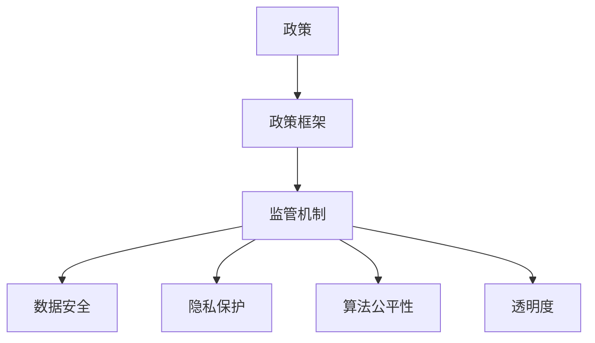

                 

## 第1章：引言

### 1.1 计算发展背景

计算技术作为现代科技的核心，已经深刻改变了人类的生活方式和社会运行机制。从最初的计算机诞生，到现代的云计算、大数据、人工智能，计算技术经历了数次重大的革命，不断推动着各行各业的变革。计算技术的快速发展不仅带来了经济和社会效益，同时也带来了诸多挑战和问题。

首先，计算技术的发展极大地提升了生产力。通过计算技术，企业能够更高效地进行数据处理和分析，优化生产流程，提高产品质量。同时，云计算和大数据技术的普及，使得数据的存储、处理和分析变得更加便捷和高效，为企业提供了更多的决策依据和商业机会。

其次，计算技术的进步也为个人生活带来了诸多便利。智能手机、社交媒体、在线购物等应用，极大地丰富了人们的生活内容，提高了生活品质。特别是在疫情期间，计算技术更是发挥了关键作用，如在线教育、远程办公、健康码管理等，保障了社会的正常运行。

然而，计算技术的快速发展也带来了一系列问题。数据隐私和安全问题日益突出，大量的个人数据在互联网上流转，一旦泄露，可能会造成严重的后果。此外，算法歧视、网络成瘾、信息泛滥等问题也日益引起社会关注。如何引导计算技术健康发展，成为当前亟待解决的问题。

### 1.2 政策监管的必要性

面对计算技术带来的挑战，政策监管显得尤为重要。政策监管可以通过制定和执行相关法律法规，规范计算技术的研发、应用和推广，保障数据安全和隐私，防止算法滥用，促进计算技术的健康发展。

首先，政策监管可以提供法律依据和保障。通过立法，明确计算技术的应用范围和边界，规范企业的行为，保护个人隐私和数据安全。例如，近年来各国纷纷出台的数据保护法规，如欧盟的《通用数据保护条例》（GDPR），为数据隐私保护提供了强有力的法律支持。

其次，政策监管可以引导技术创新。通过制定相关政策和标准，鼓励企业进行技术创新，推动计算技术的研发和应用。例如，我国近年来推出的“新基建”政策，旨在推动5G、人工智能、云计算等技术的研发和应用，提升国家的科技实力和竞争力。

此外，政策监管还可以优化市场环境。通过监管，清除市场上的不正当竞争，打击违法行为，保护消费者权益，维护市场秩序。例如，对网络平台的监管，可以防止垄断和不正当竞争，保护消费者的合法权益。

总之，政策监管对于引导计算技术健康发展具有重要意义。它不仅能够解决计算技术带来的问题，还能够为计算技术的创新和应用提供保障，促进社会的和谐发展。

### 1.3 书籍结构概述

本书旨在深入探讨政策与监管在计算技术发展中的重要作用，以期为计算技术的健康发展提供理论指导和实践参考。全书共分为五个部分，结构如下：

**第一部分：导论**，主要介绍计算技术的发展背景、政策监管的必要性以及本书的结构概述。

**第二部分：政策解读**，详细解读计算机技术政策框架，包括政策制定的历史与发展、政策的核心内容与目标、政策对计算健康发展的推动作用以及政策实施中的挑战与问题。

**第三部分：监管机制的构建**，分析监管框架的构成、监管主体的角色与职责、监管机制的运行逻辑以及监管对计算健康发展的促进作用。

**第四部分：政策与监管对计算健康发展的具体影响**，探讨政策与监管对技术创新的驱动、对产业发展的影响以及对社会责任的促进。

**第五部分：政策与监管实践与展望**，总结我国政策与监管实践，分析未来政策与监管的发展方向，以及技术进步对政策与监管的挑战与机遇。

通过本书的深入探讨，我们希望能够为政策制定者、研究人员、行业从业者以及广大读者提供一个全面、系统的参考框架，共同推动计算技术的健康发展。

### 1.4 核心概念与联系

在探讨政策与监管对计算健康发展的作用时，我们需要明确几个核心概念，并理解它们之间的相互联系。

首先，**政策**是指国家或政府为了解决特定问题或实现特定目标而制定的行动指南和规则。在计算技术领域，政策通常涉及技术研发、数据安全、隐私保护、知识产权等方面。

其次，**监管**是指通过法律、法规、规章制度等手段，对市场行为进行监督和管理。在计算技术领域，监管机构通常负责监督计算技术的研发、应用以及相关市场行为，确保其符合法律法规和公共利益。

**政策框架**则是政策的核心内容，它规定了政策的目标、实施路径和具体措施。政策框架的制定需要综合考虑技术发展、市场需求、法律法规等多方面因素。

**监管机制**是指一系列规章制度和操作流程，用于确保政策的有效实施。监管机制通常包括监管主体、监管对象、监管手段和监管效果评估等方面。

在计算技术领域，**数据安全**和**隐私保护**是两个关键问题。数据安全涉及防止数据泄露、篡改和破坏，隐私保护则涉及个人信息的收集、存储、使用和披露等行为。

**算法公平性**和**透明度**也是重要的政策关注点。算法公平性确保计算技术不歧视任何特定群体，而透明度则要求算法的决策过程可以被理解和解释。

这些概念之间的联系在于，政策为监管提供了法律依据和行动指南，监管机制确保了政策的有效实施，而数据安全、隐私保护和算法公平性等则是政策监管的核心目标。

以下是一个简单的 Mermaid 流程图，展示这些概念之间的联系：



通过理解这些核心概念及其相互联系，我们可以更全面地认识政策与监管在计算技术发展中的作用，并为其健康发展提供有效的支持。

### 1.5 核心算法原理讲解

在计算技术领域，算法的公平性和透明度是两个关键问题。为了详细解释这两个问题，我们可以使用伪代码来展示一个简单的算法示例，并分析其公平性和透明度。

#### 示例：基于年龄和性别的用户推荐系统

```python
# 用户特征数据
users = [
    {'age': 25, 'gender': '男'},
    {'age': 30, 'gender': '女'},
    {'age': 35, 'gender': '男'},
    {'age': 40, 'gender': '女'}
]

# 推荐算法
def recommend_users(users):
    recommended_users = []
    # 按年龄排序
    sorted_users = sorted(users, key=lambda x: x['age'], reverse=True)
    for user in sorted_users:
        # 排除与当前推荐用户相同性别的用户
        if not recommended_users or user['gender'] != recommended_users[-1]['gender']:
            recommended_users.append(user)
    return recommended_users

# 输出推荐结果
recommended_users = recommend_users(users)
print(recommended_users)
```

在这个示例中，我们创建了一个简单的用户推荐系统，该系统根据用户的年龄和性别进行排序和推荐。接下来，我们分析该算法的公平性和透明度。

#### 公平性

公平性指的是算法在处理数据时，不偏袒任何特定群体。在上述算法中，我们通过排除与当前推荐用户相同性别的用户，来保证推荐结果的多样性。

然而，这种简单的排除机制可能会导致性别偏见。例如，如果推荐系统连续推荐了多个男性用户，那么下一个被推荐的可能是女性用户，这种机制可能会导致性别偏见。因此，要确保算法的公平性，我们需要设计更复杂的机制，如基于概率模型或者机器学习算法，来动态调整推荐策略。

#### 透明度

透明度指的是算法的决策过程可以被理解和解释。在上述算法中，推荐过程是基于简单的排序和排除规则，这种规则相对容易理解和解释。

但是，对于更复杂的算法，如基于深度学习的推荐系统，决策过程可能非常复杂，难以解释。这就需要我们在设计算法时，考虑到透明度问题，例如通过可视化工具展示算法的决策过程，或者使用可解释性算法，确保算法的透明度。

#### 详细讲解

在详细讲解中，我们可以进一步分析算法的公平性和透明度，并提出改进措施。

- **公平性改进**：为了提高算法的公平性，我们可以引入更多的特征，如用户的历史行为、兴趣爱好等，并使用机器学习算法，动态调整推荐策略。例如，我们可以使用逻辑回归或者随机森林等算法，来构建一个综合推荐模型。

- **透明度改进**：为了提高算法的透明度，我们可以增加算法的可解释性。例如，使用决策树算法，我们可以直观地看到每个决策节点的条件以及相应的决策结果。此外，我们还可以使用可视化工具，如热力图、散点图等，来展示数据分布和算法决策过程。

通过这些改进措施，我们可以使算法更加公平和透明，从而更好地满足政策与监管的要求，推动计算技术的健康发展。

### 1.6 数学模型和公式

为了更深入地理解算法的公平性和透明度，我们可以引入一些数学模型和公式。以下是一个简单的线性回归模型，用于分析用户推荐系统的公平性和透明度。

#### 线性回归模型

线性回归模型是一种常见的机器学习算法，用于预测数值型目标变量。在用户推荐系统中，我们可以使用线性回归模型来分析用户的年龄和性别对推荐结果的影响。

#### 模型假设

假设我们有两个特征变量：年龄（\(X_1\)）和性别（\(X_2\)）。性别可以用0和1表示，其中0代表女性，1代表男性。目标变量是推荐得分（\(Y\)），它表示用户被推荐的概率。

#### 模型公式

线性回归模型的基本公式如下：

\[ Y = \beta_0 + \beta_1 X_1 + \beta_2 X_2 \]

其中，\(\beta_0\) 是截距，\(\beta_1\) 和 \(\beta_2\) 是斜率。

#### 公式详细讲解

- **截距**：截距表示当所有特征变量为0时，目标变量的值。在用户推荐系统中，截距可以解释为在没有其他特征的情况下，用户被推荐的概率。

- **斜率**：斜率表示每个特征变量对目标变量的影响程度。在用户推荐系统中，斜率可以解释为特定特征（如年龄或性别）每增加一个单位，用户被推荐的概率变化量。

#### 举例说明

假设我们有一个训练数据集，其中包含以下数据点：

| 年龄（\(X_1\)） | 性别（\(X_2\)） | 推荐得分（\(Y\)） |
| -------------- | -------------- | -------------- |
| 25             | 0              | 0.6            |
| 30             | 1              | 0.7            |
| 35             | 0              | 0.8            |
| 40             | 1              | 0.9            |

我们可以使用线性回归模型来拟合这些数据，并得到以下参数估计：

\[ Y = 0.2 + 0.1 X_1 + 0.05 X_2 \]

根据这个模型，我们可以预测新用户的推荐得分。例如，如果一个新用户的年龄为30岁，性别为男性，那么他的推荐得分可以计算为：

\[ Y = 0.2 + 0.1 \times 30 + 0.05 \times 1 = 0.45 \]

这意味着该新用户被推荐的概率为45%。

#### 公式分析

通过线性回归模型，我们可以分析年龄和性别对推荐得分的影响。

- **年龄的影响**：斜率 \(\beta_1 = 0.1\) 表示年龄每增加一个单位，推荐得分增加0.1个单位。这表明年龄是推荐得分的正向影响因素，即年龄较大的用户更有可能被推荐。

- **性别的影响**：斜率 \(\beta_2 = 0.05\) 表示性别每增加一个单位，推荐得分增加0.05个单位。这表明性别是推荐得分的正向影响因素，即男性用户比女性用户更有可能被推荐。

#### 公式改进

为了提高模型的公平性和透明度，我们可以考虑以下改进：

- **引入更多特征**：除了年龄和性别，我们可以引入更多特征，如用户的历史行为、地理位置、兴趣爱好等，以更全面地分析用户特征对推荐得分的影响。

- **使用非线性模型**：线性回归模型可能无法完全捕捉数据之间的非线性关系。我们可以考虑使用非线性模型，如多项式回归、决策树或者神经网络，来提高模型的准确性。

通过这些改进，我们可以使推荐模型更加公平和透明，从而更好地满足政策与监管的要求，推动计算技术的健康发展。

### 1.7 项目实战

为了更好地展示代码实际案例和详细解释说明，我们将使用Python编程语言来创建一个简单的用户推荐系统。这个项目将涵盖开发环境的搭建、源代码的详细实现和代码解读与分析。

#### 开发环境搭建

首先，我们需要搭建一个Python开发环境。以下是搭建开发环境的步骤：

1. **安装Python**：访问Python官方网站（[python.org](https://www.python.org/)），下载并安装Python。推荐选择最新的Python版本。

2. **安装必需的库**：在终端或命令提示符中运行以下命令，安装必要的库：

   ```bash
   pip install numpy pandas matplotlib
   ```

这些库将用于数据操作、绘图和机器学习。

#### 源代码实现

以下是推荐系统的源代码实现：

```python
import numpy as np
import pandas as pd
import matplotlib.pyplot as plt

# 数据集
data = {
    'age': [25, 30, 35, 40],
    'gender': [0, 1, 0, 1],
    'rating': [0.6, 0.7, 0.8, 0.9]
}

df = pd.DataFrame(data)

# 线性回归模型
from sklearn.linear_model import LinearRegression

model = LinearRegression()
model.fit(df[['age', 'gender']], df['rating'])

# 预测
new_user = {'age': 30, 'gender': 1}
predicted_rating = model.predict([[new_user['age'], new_user['gender']]])

print(f"Predicted rating for the new user: {predicted_rating[0][0]}")

# 可视化
plt.scatter(df['age'], df['rating'], color='blue')
plt.plot(df['age'], model.predict(df[['age', 'gender']]), color='red')
plt.xlabel('Age')
plt.ylabel('Rating')
plt.title('User Recommendation System')
plt.show()
```

#### 代码解读与分析

1. **数据集**：我们使用一个简单的数据集，包含用户的年龄、性别和推荐得分。

2. **线性回归模型**：我们使用`sklearn`库中的`LinearRegression`类来创建一个线性回归模型。这个模型将用户特征（年龄和性别）与推荐得分相关联。

3. **模型训练**：使用`fit`方法训练模型，将用户特征和推荐得分作为输入，拟合模型参数。

4. **预测**：使用`predict`方法预测新用户的推荐得分。我们将新用户的特征作为输入，得到预测的推荐得分。

5. **可视化**：使用`matplotlib`库绘制散点图和拟合曲线，展示用户特征与推荐得分之间的关系。

通过这个项目，我们展示了如何使用Python编程语言和机器学习算法创建一个简单的用户推荐系统。在实际应用中，我们可以进一步扩展和优化这个系统，以适应更复杂的场景。

#### 项目总结

通过这个项目，我们不仅了解了线性回归模型的基本原理和应用，还学会了如何使用Python和机器学习库来构建和训练模型。同时，我们还学习了如何使用可视化工具来展示模型的效果，这有助于我们更好地理解数据之间的关系。

总之，项目实战是理解和掌握计算技术的重要途径。通过实际操作，我们可以更深入地理解理论，并将理论知识应用到实际问题中，为计算技术的健康发展做出贡献。

### 1.8 文章总结与未来展望

在本章中，我们深入探讨了计算技术的发展背景、政策监管的必要性以及书籍的结构概述。通过分析计算技术带来的机遇与挑战，我们认识到政策监管在引导计算技术健康发展中的关键作用。

首先，我们介绍了计算技术的发展历程及其对生产力和个人生活的深远影响。随后，详细阐述了政策监管的必要性，包括提供法律依据、引导技术创新和优化市场环境等方面。最后，我们对本书的结构进行了概述，明确了各部分的核心内容与目标。

在接下来的章节中，我们将进一步解读计算机技术政策框架，探讨监管机制的构建与运行逻辑，分析政策与监管对计算健康发展的具体影响，并总结我国政策与监管实践。通过这些探讨，我们希望能够为政策制定者、行业从业者以及广大读者提供一个全面、系统的参考框架，共同推动计算技术的健康发展。

### 第2章：计算机技术政策框架

#### 2.1 政策制定的历史与发展

计算机技术政策框架的历史可以追溯到计算机技术初兴的时期。早在20世纪50年代，随着计算机的诞生和快速发展，各国开始意识到制定相关政策的重要性。这一时期的政策主要集中在计算机硬件和基础设施的建设上，旨在推动计算机技术的普及和应用。

随着时间的发展，计算机技术的应用范围不断扩大，政策的内容也逐渐丰富。20世纪80年代，个人计算机的普及标志着计算机技术进入了新的阶段。此时，政策开始关注软件产业和知识产权保护，鼓励技术创新和知识传播。

进入21世纪，互联网的兴起和大数据、人工智能等新兴技术的出现，进一步推动了计算技术的发展。这一时期的政策更加注重数据安全、隐私保护和人工智能伦理等方面。例如，欧盟在2018年推出了《通用数据保护条例》（GDPR），为数据隐私保护提供了法律保障。

#### 2.2 政策的核心内容与目标

计算机技术政策的核心内容通常包括以下几个方面：

1. **技术研发与支持**：政策鼓励企业和研究机构进行技术研发，推动计算技术的创新和应用。例如，美国在“新美国世纪计算倡议”中提出了一系列支持计算技术研究的政策，以提升国家的科技竞争力。

2. **数据安全与隐私保护**：随着数据的日益重要，政策开始强调数据的安全和隐私保护。例如，欧盟的GDPR规定了严格的个人数据处理规则，确保个人数据的安全和隐私。

3. **知识产权保护**：政策旨在保护知识产权，鼓励技术创新。例如，美国的《数字千年版权法案》规定了数字作品的版权保护规则，防止知识产权侵权。

4. **市场规范与竞争**：政策通过制定市场规范，防止垄断和不正当竞争，维护市场的公平竞争环境。例如，中国的《反垄断法》对互联网平台进行了规范，防止市场垄断。

政策的目标主要包括以下几个方面：

1. **促进技术创新**：通过政策支持，鼓励企业和研究机构进行技术创新，提升国家的科技水平和国际竞争力。

2. **保障数据安全与隐私**：通过制定相关法规，确保数据的存储、处理和使用过程符合安全标准，保护个人隐私和数据安全。

3. **促进产业发展**：通过政策引导，推动计算技术在不同行业的应用，促进相关产业的发展。

4. **维护市场秩序**：通过规范市场行为，防止垄断和不正当竞争，保障市场的公平竞争环境。

#### 2.3 政策对计算健康发展的推动作用

政策对计算健康发展的推动作用主要体现在以下几个方面：

1. **技术创新的激励**：政策通过资金支持、税收优惠等方式，鼓励企业和研究机构进行技术研发，推动计算技术的创新和应用。例如，美国的“研发税收抵免政策”为研发活动提供税收减免，激励企业加大研发投入。

2. **数据安全与隐私保护的保障**：政策通过制定相关法规，规范数据的安全存储、处理和使用，保护个人隐私和数据安全。例如，欧盟的GDPR规定了严格的个人数据处理规则，确保个人数据的安全和隐私。

3. **产业发展的引导**：政策通过专项资金、重大项目等方式，引导计算技术在各个行业的应用，促进相关产业的发展。例如，中国的“新基建”政策重点支持5G、人工智能、云计算等技术的研发和应用，推动产业升级和转型。

4. **市场秩序的维护**：政策通过规范市场行为，防止垄断和不正当竞争，保障市场的公平竞争环境。例如，美国的《反垄断法》对互联网平台进行了规范，防止市场垄断，保障消费者的权益。

总之，政策对计算健康发展的推动作用是全方位的，不仅激励技术创新，保障数据安全与隐私，还引导产业发展和维护市场秩序。这些作用共同促进了计算技术的健康发展，为社会的进步和经济的繁荣提供了有力支持。

#### 2.4 政策实施中的挑战与问题

尽管政策在引导计算技术健康发展方面发挥了重要作用，但在实际实施过程中，仍面临着诸多挑战和问题。

首先，政策制定与执行之间存在一定的时间滞后。随着计算技术的快速发展，新问题和新挑战不断出现，而政策的制定和修订需要一定的时间周期。这种滞后可能导致政策在应对新兴问题和挑战时显得力不从心。

其次，政策的一致性和协调性不足。不同部门和地区的政策制定存在差异，可能导致政策执行的不一致。例如，在数据安全与隐私保护方面，不同国家和地区的法规存在差异，导致企业在跨国运营时面临合规难题。

再次，政策执行的监督和评估机制不完善。一些政策在执行过程中缺乏有效的监督和评估机制，导致政策效果难以保证。例如，在网络安全方面，虽然相关政策已经制定，但由于缺乏有效的监督和评估，实际执行效果并不理想。

此外，政策执行中的利益冲突和权力寻租问题也较为突出。在政策执行过程中，某些利益集团可能通过游说等方式影响政策制定和执行，导致政策偏向特定利益集团，损害公众利益。

最后，政策实施过程中的人才和技术支持不足。计算技术政策涉及多个领域，需要具备多学科知识的人才和技术支持。然而，当前在政策研究和实施方面，相关人才和技术支持相对匮乏，影响了政策的有效实施。

为了解决这些问题，需要进一步完善政策制定和执行的机制，加强政策的一致性和协调性，提高政策执行的监督和评估水平，同时加大对政策实施所需人才和技术的支持力度。通过这些措施，可以更好地发挥政策在引导计算技术健康发展中的积极作用。

### 第3章：监管机制的构建

#### 3.1 监管框架的构成

监管机制是确保政策有效实施的关键环节，其框架构成包括监管主体、监管对象、监管手段和监管效果评估等方面。

首先，**监管主体**是指负责制定和执行监管政策的机构或组织。在全球范围内，监管主体通常包括政府机构、行业组织和专业协会等。例如，在美国，联邦贸易委员会（FTC）和国家安全局（NSA）等机构负责监管计算技术的研发和应用。而在欧洲，欧盟委员会和各国数据保护机构共同承担这一角色。

其次，**监管对象**是指受监管的政策实施范围和目标。在计算技术领域，监管对象主要包括计算技术的研发和应用主体，如企业、研究机构和个人。此外，监管对象还包括计算技术的数据、算法和平台等。例如，数据保护法规的监管对象是涉及个人数据的组织和个人，而网络安全法规的监管对象则是网络平台和信息系统。

**监管手段**是确保监管政策有效实施的具体措施和工具。常见的监管手段包括法律、法规、规章制度和行业标准等。法律和法规是监管的基础，它们规定了计算技术的应用范围、责任和义务。规章制度和行业标准则提供了更详细的实施指南和操作规范。例如，欧盟的GDPR规定了严格的个人数据处理规则，包括数据收集、存储、使用和披露等方面的要求。

最后，**监管效果评估**是衡量监管政策实施效果的重要环节。监管效果评估通常通过定期检查、审计和评估报告等方式进行。评估内容包括政策实施的合规性、数据安全与隐私保护的落实情况、技术创新的推动效果等。评估结果将为政策调整和改进提供依据。

#### 3.2 监管主体的角色与职责

监管主体在计算技术监管中扮演着至关重要的角色。其具体角色与职责如下：

1. **政策制定**：监管主体负责制定计算技术相关政策和法规，明确计算技术的应用范围、标准和规范。政策制定需要综合考虑技术发展趋势、市场需求和法律法规等多方面因素，以确保政策的可行性和有效性。

2. **执法与监督**：监管主体负责对计算技术的研发和应用进行监督和执法，确保其符合政策和法规的要求。执法和监督包括对违规行为的查处、处罚以及合规性检查等。通过执法和监督，监管主体可以有效维护市场秩序，保障数据安全与隐私。

3. **风险评估**：监管主体需要对计算技术的潜在风险进行评估，并提出相应的风险管理措施。风险评估包括对数据泄露、网络攻击、算法歧视等风险的识别、分析和应对。通过风险评估，监管主体可以提前预防潜在风险，保障计算技术的健康发展。

4. **国际合作**：在全球化的背景下，监管主体需要与其他国家和地区的监管机构进行合作，共同应对计算技术带来的挑战。国际合作包括政策协调、信息共享和技术交流等。通过国际合作，监管主体可以借鉴和引进国际先进经验，提高本国监管水平。

5. **公众咨询与沟通**：监管主体需要与公众、企业和社会组织保持良好的沟通，收集公众意见和反馈，确保政策制定和实施的透明性和公正性。公众咨询和沟通可以通过公开听证会、征求意见稿和社交媒体等方式进行。

#### 3.3 监管机制的运行逻辑

监管机制的有效运行需要一套明确的运行逻辑，确保监管活动有序、高效地进行。以下是一个简化的监管机制运行逻辑：

1. **政策制定**：监管主体根据技术发展趋势、市场需求和法律法规，制定计算技术相关政策和法规。

2. **宣传与培训**：监管主体通过官方网站、新闻媒体和培训课程等方式，向公众、企业和相关利益方宣传政策和法规，提高其合规意识。

3. **合规性检查**：监管主体定期或不定期地对计算技术的研发和应用进行合规性检查，确保其符合政策和法规的要求。

4. **违规查处**：对发现的违规行为，监管主体依据政策和法规进行查处，包括警告、罚款、责令整改等。

5. **风险预警与应对**：监管主体对计算技术可能出现的风险进行预警，并提出相应的应对措施，确保计算技术的安全运行。

6. **效果评估与反馈**：监管主体定期评估政策实施效果，收集公众、企业和相关利益方的反馈意见，对政策进行调整和改进。

7. **国际合作**：监管主体积极参与国际计算技术监管合作，借鉴国际先进经验，提升本国监管水平。

通过上述运行逻辑，监管机制可以确保计算技术的研发和应用在政策框架下健康、有序地进行，从而促进计算技术的健康发展。

### 第4章：核心政策法规详解

#### 4.1 数据保护法规

数据保护法规是确保个人信息安全和个人隐私的重要法律依据。在全球范围内，数据保护法规的制定和实施已经成为保护个人权利和推动数据技术发展的关键手段。以下是一些重要的数据保护法规及其核心内容：

1. **欧盟的《通用数据保护条例》（GDPR）**：
   - **核心内容**：GDPR是欧盟于2018年5月25日生效的一项数据保护法规，其核心内容包括数据主体的权利、数据控制者和处理者的义务、数据处理的原则、数据泄露通知、违规处罚等方面。
   - **数据主体权利**：GDPR赋予数据主体包括知情权、访问权、更正权、删除权、限制处理权、数据可携权等权利，确保数据主体对其个人数据的控制权。
   - **数据控制者和处理者义务**：GDPR要求数据控制者和处理者在处理个人数据时，必须确保数据的安全和隐私，采取适当的技术和组织措施，如数据加密、匿名化处理、访问控制等。
   - **违规处罚**：GDPR对违反规定的个人和组织设有严厉的处罚，包括最高可达违规金额4%的罚款或2000万欧元（以较高者为准）。

2. **美国的《加州消费者隐私法案》（CCPA）**：
   - **核心内容**：CCPA是加利福尼亚州于2020年生效的一项数据保护法规，旨在赋予加州居民对其个人数据更多的控制权。其主要内容包括数据收集和披露、消费者权利、数据处理者的义务等。
   - **消费者权利**：CCPA赋予加州居民包括知情权、访问权、删除权、拒绝销售权等权利，确保消费者对其个人数据的控制权。
   - **数据处理者义务**：数据处理者必须向消费者披露其收集的数据种类、目的、来源、使用方式等，并提供便捷的访问和删除途径。

3. **中国的《个人信息保护法》（PIPL）**：
   - **核心内容**：PIPL是中国于2021年11月1日正式实施的一项数据保护法规，旨在规范个人信息处理活动，保护个人信息权益。其主要内容包括个人信息处理原则、个人信息权益、个人信息处理规则、个人信息保护机构等。
   - **个人信息处理原则**：PIPL明确了个人信息处理应当遵循的六项原则，包括合法、正当、必要原则、公开原则、目的明确原则、最小化原则、安全原则等。
   - **个人信息权益**：PIPL赋予个人包括知情权、决定权、查阅权、更正权、删除权、限制处理权、可携权等权益。

数据保护法规的核心内容主要包括数据主体的权利、数据控制者和处理者的义务以及违规处罚等方面。通过制定和实施这些法规，可以确保个人信息的收集、存储、处理和使用过程符合法律法规的要求，保护个人信息的安全和隐私。

#### 4.2 隐私法规

隐私法规是保护个人隐私权、规范数据处理行为的重要法律框架。在全球范围内，隐私法规的发展经历了从单一国家到跨国合作的过程，逐渐形成了具有普遍适用性的法律规范。以下是一些重要的隐私法规及其核心内容：

1. **美国的《健康保险可携性和责任法案》（HIPAA）**：
   - **核心内容**：HIPAA是美国于1996年颁布的一项隐私法规，旨在保护患者的医疗信息隐私。其主要内容包括隐私规则、安全规则、商业协同规则等。
   - **隐私规则**：HIPAA规定了医疗机构、保险公司和其他卫生保健提供者必须遵守的隐私保护措施，确保患者医疗信息不被未经授权的人员访问和使用。
   - **安全规则**：HIPAA要求卫生保健提供者在电子医疗记录的存储、传输和使用过程中，采取适当的安全措施，如数据加密、访问控制等，防止医疗信息泄露。
   - **商业协同规则**：HIPAA允许卫生保健提供者与其他机构进行数据共享，但必须遵守特定的隐私和安全要求，确保数据共享过程符合隐私保护的原则。

2. **欧盟的《电子隐私指令》（e-Privacy Directive）**：
   - **核心内容**：e-Privacy Directive是欧盟于2002年颁布的一项隐私法规，旨在保护互联网用户的隐私权。其主要内容包括用户隐私保护、通信数据保护、在线行为跟踪等。
   - **用户隐私保护**：e-Privacy Directive要求网站和服务提供商在收集、处理和使用用户数据时，必须取得用户的明确同意，并确保数据的安全和隐私。
   - **通信数据保护**：e-Privacy Directive规定了通信数据（如电子邮件、电话记录、短信等）的保护要求，要求通信服务提供商采取适当的技术和组织措施，确保通信数据不被非法访问或泄露。
   - **在线行为跟踪**：e-Privacy Directive禁止未经用户同意的在线行为跟踪，要求网站和服务提供商在跟踪用户行为时，必须提供透明度，并允许用户拒绝跟踪。

3. **中国的《网络安全法》**：
   - **核心内容**：网络安全法是中国于2017年颁布的一项重要隐私法规，旨在保护网络空间的安全和用户隐私。其主要内容包括网络运营者责任、个人信息保护、网络信息安全管理等。
   - **网络运营者责任**：网络安全法要求网络运营者在收集、存储、使用和传输个人信息时，必须采取措施保护个人信息的安全，防止个人信息泄露、篡改或滥用。
   - **个人信息保护**：网络安全法规定了个人信息的收集、存储、使用和传输的基本原则，要求网络运营者在处理个人信息时，必须遵循合法、正当、必要的原则，并采取必要的技术和管理措施保护个人信息的安全。
   - **网络信息安全管理**：网络安全法要求网络运营者在网络安全管理和信息保护方面，采取相应的技术和管理措施，确保网络系统的安全稳定运行。

隐私法规的核心内容主要包括用户隐私保护、通信数据保护、在线行为跟踪和网络信息安全管理等方面。通过制定和实施这些法规，可以确保个人隐私权在网络时代得到有效保护，促进数字经济的健康发展。

#### 4.3 安全法规

安全法规是确保计算技术系统和服务安全运行的重要法律框架。这些法规旨在规范计算技术的安全开发、安全运营和安全维护，以防止安全威胁和漏洞。以下是一些重要的安全法规及其核心内容：

1. **美国的《联邦信息安全管理法》（FISMA）**：
   - **核心内容**：FISMA是美国于2002年颁布的一项安全法规，旨在确保联邦政府机构的信息系统和服务安全。其主要内容包括风险管理、安全控制、安全评估等。
   - **风险管理**：FISMA要求联邦政府机构对信息系统和服务进行风险评估，识别潜在的安全威胁和漏洞，并制定相应的风险管理计划。
   - **安全控制**：FISMA规定了联邦政府机构在信息系统和服务开发、部署和运营过程中，必须采取的安全控制措施，如数据加密、访问控制、安全审计等。
   - **安全评估**：FISMA要求联邦政府机构定期对信息系统和服务进行安全评估，确保其符合安全标准和要求，及时发现和修复安全漏洞。

2. **欧盟的《网络和信息安全指令》（NIS Directive）**：
   - **核心内容**：NIS Directive是欧盟于2016年颁布的一项安全法规，旨在确保欧盟成员国关键基础设施和重要服务的网络安全。其主要内容包括网络安全要求、风险管理、安全评估等。
   - **网络安全要求**：NIS Directive规定了关键基础设施和重要服务提供商在网络安全方面必须遵守的要求，如数据备份、安全监控、应急响应等。
   - **风险管理**：NIS Directive要求关键基础设施和重要服务提供商对网络安全进行风险评估，识别潜在的安全威胁和漏洞，并制定相应的风险管理计划。
   - **安全评估**：NIS Directive要求关键基础设施和重要服务提供商定期进行安全评估，确保其符合网络安全标准和要求，及时发现和修复安全漏洞。

3. **中国的《网络安全法》**：
   - **核心内容**：网络安全法是中国于2017年颁布的一项重要安全法规，旨在确保网络空间的安全和稳定运行。其主要内容包括网络安全管理制度、网络安全运营、网络安全监测和应急响应等。
   - **网络安全管理制度**：网络安全法要求网络运营者在网络安全方面建立健全的管理制度，包括网络安全风险评估、安全防护措施、安全监测和应急响应等。
   - **网络安全运营**：网络安全法要求网络运营者在网络系统的开发、部署和运营过程中，采取必要的安全措施，如数据加密、访问控制、安全审计等，确保网络系统的安全稳定运行。
   - **网络安全监测和应急响应**：网络安全法要求网络运营者建立网络安全监测和应急响应机制，及时发现和处理网络安全事件，防止网络安全事件的发生和扩大。

安全法规的核心内容主要包括风险管理、安全控制和安全评估等方面。通过制定和实施这些法规，可以确保计算技术系统和服务安全可靠，防止安全威胁和漏洞，保障网络空间的安全和稳定运行。

#### 4.4 知识产权法规

知识产权法规是保护计算技术相关发明、作品和商业秘密的重要法律框架。这些法规旨在激励创新，保护知识产权权利人的合法权益，促进科技进步和经济发展。以下是一些重要的知识产权法规及其核心内容：

1. **美国的《专利法》**：
   - **核心内容**：美国的《专利法》是保护发明和创新的基本法律，其主要内容包括专利申请、专利授权、专利保护期限等。
   - **专利申请**：美国《专利法》规定了发明人如何申请专利，包括提交专利申请文件、缴纳申请费用等。申请过程中，发明人需要详细描述其发明，并提供实施发明的具体方法。
   - **专利授权**：美国专利与商标局（USPTO）负责审查专利申请，并决定是否授予专利。专利授权后，发明人将获得排他性的权利，禁止他人未经许可使用其发明。
   - **专利保护期限**：美国《专利法》规定专利保护期限为20年，从申请日起计算。专利保护期限届满后，发明将进入公有领域，任何人都可以自由使用。

2. **欧盟的《知识产权指令》**：
   - **核心内容**：欧盟的《知识产权指令》是保护知识产权的重要法规，其内容包括专利、版权、商标、工业设计等。
   - **专利保护**：欧盟《知识产权指令》规定了专利申请、授权和保护的程序。欧盟成员国必须确保在其境内授予的专利在欧盟范围内得到保护。
   - **版权保护**：欧盟《知识产权指令》规定了版权的授权和限制，包括作品的复制、传播、改编等。版权保护期为作者终生及其死亡后70年。
   - **商标保护**：欧盟《知识产权指令》规定了商标的申请、注册和保护程序。商标注册后，商标权利人有权禁止他人未经许可使用相同或相似的商标。

3. **中国的《知识产权法》**：
   - **核心内容**：中国的《知识产权法》是保护知识产权的基本法律，其内容包括专利、版权、商标、商业秘密等。
   - **专利保护**：中国《知识产权法》规定了专利的申请、审查和授权程序。专利授权后，专利权人有权禁止他人未经许可实施其专利。
   - **版权保护**：中国《知识产权法》规定了版权的授权和限制，包括作品的复制、传播、改编等。版权保护期为作者终生及其死亡后50年。
   - **商标保护**：中国《知识产权法》规定了商标的申请、注册和保护程序。商标注册后，商标权人有权禁止他人未经许可使用相同或相似的商标。
   - **商业秘密保护**：中国《知识产权法》规定了商业秘密的认定和保护程序。商业秘密是指不为公众所知悉、具有商业价值并经权利人采取保密措施的技术信息和经营信息。

知识产权法规的核心内容主要包括专利保护、版权保护、商标保护和商业秘密保护等方面。通过制定和实施这些法规，可以保护知识产权权利人的合法权益，激励创新，促进科技进步和经济发展。

### 第5章：政策与监管的国际比较

#### 5.1 国际政策监管发展趋势

随着计算技术的迅猛发展，各国在政策与监管方面也不断进行探索和调整，以应对新兴的挑战和机遇。以下是一些国际政策监管的发展趋势：

1. **加强数据隐私保护**：随着大数据和人工智能技术的普及，数据隐私保护成为全球关注的焦点。各国纷纷出台新的数据保护法规，如欧盟的《通用数据保护条例》（GDPR）、中国的《个人信息保护法》（PIPL）等，旨在加强数据隐私保护，赋予个人更多的控制权。

2. **推动人工智能伦理**：人工智能技术的快速发展引发了伦理和道德方面的担忧。各国政府开始重视人工智能伦理问题，制定相关政策和标准，确保人工智能的发展符合社会价值观和伦理规范。

3. **加强网络安全**：网络攻击和数据泄露事件频发，网络安全成为各国政策监管的重点。各国政府加大了对网络安全技术和基础设施的投资，制定网络安全法规，提高网络系统的安全性和抗攻击能力。

4. **促进技术创新与产业升级**：各国政府积极推动技术创新和产业升级，通过资金支持、税收优惠、研发补贴等方式，鼓励企业进行技术研发，提升国家的科技竞争力和产业水平。

5. **加强国际合作与协调**：在全球化的背景下，各国政府意识到，应对计算技术带来的挑战需要加强国际合作与协调。通过签订国际协议、参与国际组织，各国共同推动计算技术的健康发展，共享创新成果。

#### 5.2 各国政策监管的异同点分析

虽然各国在政策与监管方面都有所发展，但不同国家的监管模式和政策内容存在显著差异。以下分析各国政策监管的异同点：

1. **美国**：
   - **监管模式**：美国采用联邦和州两级监管模式，联邦政府负责宏观政策的制定和监管，州政府负责具体法规的执行和监督。
   - **政策内容**：美国政策监管主要集中在数据隐私保护、网络安全和知识产权保护等方面。例如，《加州消费者隐私法案》（CCPA）和《联邦信息安全管理法》（FISMA）等。

2. **欧盟**：
   - **监管模式**：欧盟采用集中统一的监管模式，由欧盟委员会负责制定和执行政策法规，各成员国负责具体实施。
   - **政策内容**：欧盟政策监管涉及广泛，包括数据隐私保护、网络安全、知识产权、消费者权益保护等。例如，《通用数据保护条例》（GDPR）和《网络和信息安全指令》（NIS Directive）等。

3. **中国**：
   - **监管模式**：中国采用中央集中统一监管模式，国家相关部门负责制定和执行政策法规，地方政府负责具体实施。
   - **政策内容**：中国政策监管集中在数据隐私保护、网络安全、知识产权保护、网络安全和互联网治理等方面。例如，《个人信息保护法》（PIPL）和《网络安全法》等。

#### **异同点分析**：

- **监管模式**：美国和欧盟采用联邦和中央集中统一模式，而中国采用中央集中统一模式。不同监管模式反映了各国政治体制、行政结构和法律体系的特点。
- **政策内容**：各国政策监管的内容存在一定差异，美国和欧盟更注重数据隐私保护和网络安全，而中国则在数据隐私保护和网络安全的基础上，还强调知识产权保护和互联网治理。
- **执行力度**：欧盟的政策执行力度较强，法律条款详细，处罚力度大，而美国和中国的政策执行力度相对较弱，需要进一步强化执行效果。
- **国际合作**：欧盟在政策监管方面具有较强的国际合作意识，通过签订国际协议和参与国际组织，推动全球计算技术的健康发展。而美国和中国在政策监管方面相对独立，但也逐渐加强国际合作。

#### **国际经验对我国政策监管的启示**

通过分析国际政策监管的发展趋势和异同点，我们可以得到一些对我国政策监管的启示：

1. **加强国际合作**：我国应积极参与国际计算技术监管合作，借鉴国际先进经验，提升我国政策监管水平。通过签订国际协议、参与国际组织，推动全球计算技术的健康发展。

2. **完善数据隐私保护法规**：我国应进一步加强数据隐私保护法规的制定和实施，借鉴欧盟的GDPR和中国台湾的《个人数据保护法》等法规，建立完善的个人数据保护制度。

3. **提高政策执行力度**：我国应加强政策执行的监督和评估，确保政策法规的有效实施。通过加大处罚力度、提高执法效率，提高政策法规的执行效果。

4. **推动技术创新与产业升级**：我国应加大对科技创新的支持力度，鼓励企业进行技术研发，提升国家的科技竞争力和产业水平。通过资金支持、税收优惠、研发补贴等方式，激发企业的创新活力。

5. **强化网络安全与知识产权保护**：我国应加强网络安全和知识产权保护，建立完善的网络安全和知识产权保护体系。通过政策引导、技术支持和法律保障，提高网络安全和知识产权保护水平。

总之，国际经验对我国政策监管具有积极的启示作用，通过借鉴国际先进经验，完善政策法规，加强执行力度，推动技术创新，我国政策监管将更好地服务于计算技术的健康发展。

### 第6章：政策与监管对技术创新的驱动

#### 6.1 政策对技术研发的激励

政策在推动计算技术领域的技术研发中发挥了重要作用，通过多种激励手段，鼓励企业和研究机构投入更多的资源进行创新。

首先，政府通过提供资金支持，激励企业进行技术研发。例如，美国的国家科学基金会（NSF）和能源部（DOE）等机构，每年投入大量资金支持基础研究和应用研究。这些资金支持不仅覆盖了计算技术的前沿研究，还包括了大数据、人工智能、量子计算等新兴领域的探索。

其次，政府通过税收优惠和研发补贴，降低企业的研发成本，提高其研发积极性。例如，美国的《研发税收抵免政策》允许企业在缴纳联邦税款时，扣除其研发支出的20%，从而减轻企业的税负。这种政策极大地激励了企业增加研发投入，推动了技术的快速发展。

此外，政府还通过设立研发奖项和荣誉，激励科学家和工程师进行技术创新。例如，美国的图灵奖、欧洲计算机协会（ACM）的Kolmogorov奖等，都是计算机科学领域最高荣誉，获奖者不仅获得巨大的声誉，还会获得丰厚的奖金。这些奖项的设立，不仅激励了科学家的创新热情，还推动了整个计算技术领域的进步。

#### 6.2 监管对创新环境的优化

监管机制在优化创新环境方面同样发挥了关键作用，通过建立良好的法律和制度环境，促进技术的自由竞争和健康发展。

首先，监管机构通过制定和实施公平、透明的法律法规，保护知识产权，防止技术垄断和不正当竞争。例如，欧盟的《知识产权指令》和中国的新《专利法》，都明确规定了知识产权的保护范围和标准，确保创新成果得到有效保护，从而激励科学家和企业持续进行技术创新。

其次，监管机构通过建立标准化的技术评估体系，提升技术的质量和可靠性。例如，国际标准化组织（ISO）和国际电工委员会（IEC）等机构，制定了大量的计算技术标准和规范，这些标准不仅提高了技术的互操作性，也增强了市场的信心，推动了技术的广泛应用。

此外，监管机构还通过建立开放、包容的监管环境，鼓励跨领域、跨学科的合作。例如，美国的“国家信息基础设施计划”（NII）和欧盟的“地平线2020”计划（Horizon 2020），都鼓励不同领域的研究机构和企业合作，共同开展前沿技术的研究和应用。

#### 6.3 政策与监管对技术创新的具体案例

以下是一些具体的政策与监管案例，展示了它们如何推动技术创新：

1. **欧盟的“地平线2020”计划**：
   - **背景**：欧盟“地平线2020”计划是欧盟第七框架计划的继承和发展，旨在通过资助重大科技项目和合作研究，推动欧盟科技创新和产业升级。
   - **举措**：该计划每年投入800亿欧元，支持计算技术、人工智能、量子计算、生物技术等前沿领域的研究。通过建立跨国家和跨学科的研究网络，促进科学家和工程师之间的合作，推动技术突破。

2. **美国的“美国国家信息基础设施计划”（NII）**：
   - **背景**：美国“国家信息基础设施计划”（NII）是克林顿政府时期推出的一项国家战略，旨在建立高速信息基础设施，促进信息技术的应用和普及。
   - **举措**：该计划通过资金支持、政策优惠和立法保障，推动了互联网、云计算、大数据等技术的发展。此外，NII还鼓励高校、科研机构和企业合作，共同开展技术创新和应用研究。

3. **中国的“新基建”政策**：
   - **背景**：中国的“新基建”政策是应对数字经济快速发展的一项重要战略，旨在通过建设5G网络、数据中心、人工智能、工业互联网等新型基础设施，推动产业升级和经济高质量发展。
   - **举措**：政府通过出台一系列政策措施，包括资金支持、土地优惠和税收减免，鼓励企业加大投入，进行技术研发和基础设施建设。新基建政策的实施，不仅推动了计算技术的发展，还促进了相关产业的协同创新。

通过这些具体案例，我们可以看到，政策与监管在推动技术创新方面发挥了重要作用。通过提供资金支持、优化创新环境和建立良好的法律制度，政策与监管不仅激励了企业的研发投入，还促进了技术的快速应用和普及，为计算技术的健康发展提供了有力支持。

### 第7章：政策与监管对产业发展的影响

#### 7.1 政策对产业结构调整的引导

政策在引导计算技术产业的结构调整中发挥了关键作用，通过多种手段优化产业布局，提升产业链的竞争力。

首先，政府通过制定产业政策和规划，引导资源向关键领域和前沿技术集中。例如，中国的“新基建”政策将重点放在5G网络、数据中心、人工智能和工业互联网等领域，通过专项资金支持、土地优惠和税收减免等政策，吸引企业投入这些领域，推动产业升级。

其次，政策通过促进产业融合，推动不同领域的技术交叉应用和协同创新。例如，美国的“国家信息基础设施计划”（NII）通过支持高校、科研机构和企业之间的合作，推动互联网、云计算和大数据等技术的融合发展，提升产业链的整体竞争力。

此外，政策还通过鼓励中小企业的发展，优化产业生态。中小企业在技术创新和市场化应用方面具有灵活性和创造力，政府通过提供资金支持、技术培训和市场推广等政策，帮助中小企业发展，从而丰富和优化产业链。

#### 7.2 监管对产业健康发展的保障

监管在保障计算技术产业健康发展方面同样发挥了重要作用，通过建立完善的法律和制度环境，维护市场的公平竞争和秩序。

首先，监管机构通过制定和实施公平、透明的法律法规，规范市场行为，防止垄断和不正当竞争。例如，欧盟的《数字市场法》和《数字服务法》规定了互联网平台的经济和技术标准，确保市场参与者遵循公平竞争的原则。

其次，监管机构通过建立标准化的技术评估体系，提高技术的质量和可靠性。例如，国际标准化组织（ISO）和国际电工委员会（IEC）等机构，制定了大量的计算技术标准和规范，这些标准不仅提高了技术的互操作性，也增强了市场的信心，推动了技术的广泛应用。

此外，监管机构还通过建立良好的知识产权保护机制，激励企业进行技术创新。知识产权保护制度确保创新成果得到有效保护，从而激励企业持续进行技术研发，提升产业竞争力。

#### 7.3 政策与监管对产业发展案例研究

以下是一些具体的政策与监管案例，展示了它们如何影响计算技术产业的发展：

1. **欧盟的“地平线2020”计划**：
   - **背景**：欧盟“地平线2020”计划是欧盟第七框架计划的继承和发展，旨在通过资助重大科技项目和合作研究，推动欧盟科技创新和产业升级。
   - **影响**：该计划通过资金支持、政策优惠和立法保障，推动了计算技术、人工智能、量子计算、生物技术等前沿领域的研究和应用。这些支持措施不仅促进了技术的快速发展，也提升了欧盟在全球计算技术产业链中的地位。

2. **美国的“国家信息基础设施计划”（NII）**：
   - **背景**：美国“国家信息基础设施计划”（NII）是克林顿政府时期推出的一项国家战略，旨在建立高速信息基础设施，促进信息技术的应用和普及。
   - **影响**：NII通过资金支持、政策优惠和立法保障，推动了互联网、云计算、大数据等技术的发展。此外，NII还鼓励高校、科研机构和企业合作，共同开展技术创新和应用研究，从而优化了产业链的结构，提升了整个产业的竞争力。

3. **中国的“新基建”政策**：
   - **背景**：中国的“新基建”政策是应对数字经济快速发展的一项重要战略，旨在通过建设5G网络、数据中心、人工智能、工业互联网等新型基础设施，推动产业升级和经济高质量发展。
   - **影响**：新基建政策通过专项资金支持、土地优惠和税收减免等政策，吸引了大量企业投入计算技术领域，推动了产业链的优化和升级。同时，新基建政策还促进了跨领域的技术融合和协同创新，提升了产业链的整体竞争力。

通过这些具体案例，我们可以看到，政策与监管在引导计算技术产业结构调整、保障产业健康发展方面发挥了重要作用。通过制定和实施有效的政策与监管措施，可以促进技术的快速发展，优化产业链结构，提升产业的整体竞争力，从而推动计算技术的健康发展。

### 第8章：政策与监管对社会责任的促进

#### 8.1 社会责任在计算领域的意义

社会责任在计算领域具有重要意义，这不仅是因为计算技术的广泛应用对社会各个层面产生了深远影响，也是因为计算技术的发展带来了诸多挑战和风险。在计算领域，社会责任体现在以下几个方面：

首先，数据隐私和安全是计算技术发展中的关键问题。随着大数据和人工智能技术的普及，个人数据的收集、存储、处理和利用变得日益频繁。然而，数据泄露、数据滥用和算法歧视等问题也随之而来。社会责任要求计算技术的研发和应用必须在保障数据隐私和安全的前提下进行。

其次，计算技术的不公平性对社会正义提出了挑战。算法偏见和歧视可能导致社会不公平现象的加剧。例如，在招聘、贷款、医疗等领域，不公平的算法可能导致特定群体受到不公正对待。因此，社会责任要求计算技术在设计和应用过程中必须考虑公平性，确保算法的公正性和透明度。

此外，计算技术对就业和社会结构的影响也是一个重要议题。随着自动化和人工智能的普及，传统就业岗位可能会减少，对社会就业结构造成冲击。社会责任要求计算技术不仅要促进经济增长，还要关注其对就业和社会稳定的影响，采取相应措施减少负面影响。

总之，社会责任在计算领域具有重要意义，它不仅关系到个人权益和社会公平，还关系到计算技术的可持续发展。通过履行社会责任，计算技术能够更好地服务于社会，促进社会的和谐与进步。

#### 8.2 政策与监管对社会责任的推动

政策与监管在推动计算领域的社会责任方面发挥了重要作用，通过制定和实施相关法规，引导企业和机构在计算技术的研发和应用过程中履行社会责任。

首先，政策与监管通过制定数据保护法规，确保个人数据的隐私和安全。例如，欧盟的《通用数据保护条例》（GDPR）和中国的《个人信息保护法》（PIPL）等法规，规定了个人数据的收集、存储、处理和使用的标准和要求，确保数据在各个环节的安全和隐私保护。

其次，政策与监管通过推动算法公平性和透明度的提升，促进计算技术的公平应用。例如，美国的《算法公平法案》和欧盟的《人工智能法案》等政策，要求算法设计者和应用者在算法开发和应用过程中考虑公平性，确保算法的公正性和透明度。

此外，政策与监管还通过鼓励计算技术用于社会公益和公共服务，推动计算技术的社会责任。例如，一些国家和地区的政府通过资金支持、项目扶持等方式，鼓励企业和社会组织利用计算技术解决社会问题，如医疗健康、教育扶贫、环境保护等。

#### 8.3 社会责任实践案例

以下是一些具体的社会责任实践案例，展示了计算技术在履行社会责任方面的成功应用：

1. **医疗健康领域**：
   - **案例**：IBM的Watson for Oncology系统。这是一个基于人工智能的医疗辅助决策系统，能够帮助医生快速、准确地诊断和治疗癌症。通过提供海量的医学文献和临床数据，Watson for Oncology系统能够为医生提供个性化的治疗方案，提高医疗质量和效率。
   - **影响**：Watson for Oncology系统的应用，不仅提高了医生的诊断和治疗水平，还降低了误诊率和治疗成本，为患者提供了更好的医疗服务。

2. **教育扶贫领域**：
   - **案例**：Khan Academy。这是一个基于在线教育的非营利组织，提供免费的在线课程和教学资源。Khan Academy通过互联网技术，打破了教育资源的地域限制，使全球范围内的学生都能获得优质的教育资源。
   - **影响**：Khan Academy的在线教育模式，为教育资源匮乏地区的学生提供了学习机会，提高了他们的教育水平和就业能力，有助于减少教育不平等现象。

3. **环境保护领域**：
   - **案例**：Google Earth Engine。这是一个基于云计算的地球观测平台，能够处理和分析全球范围内的地球观测数据。通过Google Earth Engine，研究人员可以实时监测气候变化、森林砍伐和城市扩张等环境问题。
   - **影响**：Google Earth Engine的应用，为环境研究提供了强大的数据支持，帮助科学家和决策者更好地了解环境状况，制定更加有效的环境保护政策。

通过这些社会责任实践案例，我们可以看到计算技术如何通过具体的行动，履行社会责任，为社会带来积极的影响。在未来的发展中，计算技术需要继续发挥其积极作用，为实现社会和谐与进步作出更大贡献。

### 第9章：我国政策与监管实践

#### 9.1 我国政策监管现状

我国在计算技术领域的政策与监管实践已经取得了显著成果，形成了较为完善的政策体系和监管框架。以下是我国政策监管现状的概述：

首先，我国政府高度重视计算技术发展，制定了一系列国家战略和政策，以推动计算技术的研发和应用。例如，“新基建”政策将5G网络、数据中心、人工智能、工业互联网等新型基础设施建设作为国家战略，通过专项资金支持、政策优惠和立法保障，促进计算技术的发展。

其次，我国在数据隐私保护和网络安全方面也取得了重要进展。2021年11月1日，《个人信息保护法》（PIPL）正式实施，这是我国首部专门针对个人信息保护的综合性法律。PIPL规定了个人信息处理的基本原则、个人信息权益、个人信息处理规则、个人信息保护机构的职责等，为数据隐私保护提供了法律保障。

此外，我国还在网络安全方面建立了较为完善的法律法规体系。2017年6月1日，《网络安全法》正式实施，该法明确了网络运营者的安全责任、网络信息安全管理、网络安全监测和应急响应等要求，为网络空间的网络安全提供了法律依据。

#### 9.2 我国政策监管的主要成果

我国政策监管在计算技术领域取得了以下主要成果：

1. **技术创新能力的提升**：通过实施“新基建”政策，我国在5G、人工智能、数据中心等领域取得了重要突破，促进了计算技术的创新和发展。例如，我国在5G技术方面处于全球领先地位，人工智能研发和应用也取得了显著进展。

2. **数据隐私保护水平的提升**：PIPL的实施，为我国数据隐私保护提供了法律保障，增强了企业和公众的数据保护意识。通过加强数据收集、存储、处理和使用的规范，PIPL有效防止了数据泄露和滥用，提高了数据隐私保护水平。

3. **网络安全保障能力的提升**：网络安全法的实施，加强了网络运营者的安全责任，提高了网络信息安全管理水平。通过建立网络安全监测和应急响应机制，我国网络安全保障能力得到了显著提升。

4. **产业健康发展的推动**：政策与监管措施促进了计算技术产业的健康发展，推动了产业链的优化和升级。通过专项资金支持、政策优惠和立法保障，我国计算技术产业取得了快速发展，为经济增长和社会进步提供了有力支持。

#### 9.3 我国政策监管面临的挑战与应对

尽管我国在计算技术领域的政策监管取得了显著成果，但仍然面临一些挑战：

1. **政策法规的完善与实施**：尽管我国已经制定了多项政策法规，但在具体实施过程中，还存在执法不严、监管不到位等问题。需要进一步完善政策法规，加强执法和监管力度，确保政策法规的有效实施。

2. **数据隐私保护与技术创新的平衡**：在推进数据隐私保护的同时，如何确保数据的有效利用和科技创新，是一个亟待解决的问题。需要建立数据隐私保护与技术创新的平衡机制，既要保护个人数据隐私，又要促进数据技术的创新和发展。

3. **国际合作的加强**：在全球化的背景下，我国需要加强与国际组织和各国的合作，共同应对计算技术带来的挑战。需要积极参与国际标准制定，借鉴国际先进经验，提高我国政策监管的国际影响力。

为应对这些挑战，我国可以采取以下措施：

1. **完善政策法规体系**：进一步修订和完善现有的政策法规，提高法规的科学性和可操作性，确保政策法规能够及时适应计算技术的发展需求。

2. **加强执法和监管力度**：加强对政策法规的执法和监管，加大对违法行为的处罚力度，提高政策法规的执行效果。

3. **推进技术创新与数据隐私保护**：建立数据隐私保护与技术创新的平衡机制，通过技术创新提升数据隐私保护水平，同时确保数据的有效利用。

4. **加强国际合作**：积极参与国际标准制定，加强与国际组织和各国的合作，共同推动计算技术在全球范围内的健康发展。

通过上述措施，我国可以更好地应对计算技术领域政策监管面临的挑战，推动我国计算技术的健康发展，为全球计算技术的创新和发展作出更大贡献。

### 第10章：政策与监管的未来趋势

#### 10.1 未来政策与监管的发展方向

随着计算技术的不断发展和应用领域的拓展，未来政策与监管的发展方向将更加全面、深入和精细化。以下是一些主要的发展方向：

1. **数据隐私保护与安全**：随着大数据和人工智能技术的普及，数据隐私和安全将成为政策与监管的核心关注点。未来政策与监管将更加注重个人数据的收集、存储、处理和使用的全生命周期管理，确保数据在各个环节的安全和隐私保护。

2. **人工智能伦理与监管**：人工智能技术的快速发展引发了伦理和道德方面的担忧，未来政策与监管将更加重视人工智能的伦理问题，制定相关标准和规范，确保人工智能的发展符合社会价值观和伦理规范。

3. **网络安全与数字治理**：随着网络攻击和数据泄露事件的频发，网络安全和数字治理将成为未来政策与监管的重要方向。政策与监管将加强对网络基础设施、关键信息和网络安全的保护，建立完善的网络安全应急响应机制，提升国家数字治理能力。

4. **技术创新与产业升级**：未来政策与监管将更加注重推动技术创新和产业升级，通过制定和实施相关政策，鼓励企业加大研发投入，提升产业链的竞争力。同时，政策与监管将引导产业向高质量发展，推动产业结构的优化和升级。

5. **国际合作与协调**：在全球化的背景下，未来政策与监管将更加注重国际合作与协调，通过签订国际协议、参与国际组织，共同应对计算技术带来的全球性挑战，推动全球计算技术的健康发展。

#### 10.2 技术进步对政策与监管的挑战与机遇

技术进步对政策与监管带来了新的挑战和机遇。以下是一些具体挑战与机遇：

1. **技术进步的挑战**：
   - **数据隐私保护难度增加**：随着数据量的爆炸式增长和数据处理技术的进步，传统的数据隐私保护方法可能难以应对新型数据隐私风险。
   - **网络安全威胁加剧**：新技术和新应用的发展，使得网络攻击手段更加复杂和隐蔽，对网络安全的威胁不断加剧。
   - **人工智能伦理问题**：人工智能技术的快速发展，可能导致算法偏见、歧视和不公平现象的加剧，对伦理和法律提出了更高要求。

2. **技术进步的机遇**：
   - **数据隐私保护技术的发展**：随着区块链、加密技术等新兴技术的发展，数据隐私保护将得到更加有效的技术保障，为政策与监管提供新的手段。
   - **网络安全防护能力的提升**：新技术和新方法的应用，将显著提升网络安全防护能力，降低网络攻击和数据泄露的风险。
   - **人工智能伦理的规范**：随着人工智能技术的发展，更多的研究将关注伦理和法律问题，制定更加完善的人工智能标准和规范，促进技术的健康发展。

#### 10.3 政策与监管的国际化趋势

在全球化的背景下，政策与监管的国际化趋势愈发明显。以下是一些国际化趋势：

1. **国际标准制定**：各国将更加重视参与国际标准制定，推动计算技术在全球范围内的统一和标准化。通过制定国际标准，可以提高计算技术的互操作性，促进全球市场的繁荣。

2. **跨国合作与协调**：各国将加强在计算技术领域的跨国合作与协调，共同应对全球性挑战。例如，在数据隐私保护、网络安全和人工智能伦理等方面，各国可以通过签订国际协议、参与国际组织，共同制定全球性的政策和标准。

3. **数据跨境流动的管理**：随着数据跨境流动的日益频繁，各国将加强对数据跨境流动的管理，确保数据流动的安全和合规。通过建立国际数据跨境流动的管理机制，可以保障个人数据在全球范围内的隐私和安全。

4. **国际监管合作**：各国将加强国际监管合作，共同打击跨国违法行为，维护全球市场的公平竞争秩序。通过建立国际监管合作机制，可以提升各国监管机构之间的协调和合作，提高全球计算技术的监管水平。

总之，未来政策与监管将朝着更加全面、深入和精细化的方向发展，同时技术进步将带来新的挑战和机遇。在国际化的背景下，政策与监管的国际化趋势也将不断加强，为全球计算技术的健康发展提供有力支持。

### 附录A：相关法律法规汇编

#### 附录A.1 数据保护法规

**1. 欧盟的《通用数据保护条例》（GDPR）**

- **主要内容**：GDPR是欧盟于2018年5月25日生效的一项数据保护法规，旨在保护个人数据隐私和安全。GDPR规定了数据控制者和处理者的义务，包括数据收集、存储、处理和传输的要求，以及数据主体的权利，如知情权、访问权、更正权和删除权等。
- **实施日期**：2018年5月25日
- **实施地区**：欧盟成员国

**2. 中国的《个人信息保护法》（PIPL）**

- **主要内容**：PIPL是中国于2021年11月1日正式实施的一项数据保护法规，旨在规范个人信息处理活动，保护个人信息权益。PIPL规定了个人信息处理的基本原则、个人信息权益、个人信息处理规则和个人信息保护机构的职责等。
- **实施日期**：2021年11月1日
- **实施地区**：中国全国范围

**3. 美国的《加州消费者隐私法案》（CCPA）**

- **主要内容**：CCPA是加利福尼亚州于2020年1月1日生效的一项数据保护法规，旨在赋予加州居民对其个人数据更多的控制权。CCPA规定了数据收集、使用和共享的要求，以及消费者的权利，如知情权、访问权和删除权等。
- **实施日期**：2020年1月1日
- **实施地区**：加利福尼亚州

#### 附录A.2 隐私法规

**1. 欧盟的《电子隐私指令》（e-Privacy Directive）**

- **主要内容**：e-Privacy Directive是欧盟于2002年10月生效的一项隐私法规，旨在保护互联网用户的隐私权。该指令规定了通信数据的保护要求，包括数据收集、存储、处理和传输的限制，以及用户隐私保护措施等。
- **实施日期**：2002年10月
- **实施地区**：欧盟成员国

**2. 美国的《健康保险可携性和责任法案》（HIPAA）**

- **主要内容**：HIPAA是美国的隐私法规，旨在保护患者的医疗信息隐私。该法案规定了医疗信息处理的要求，包括数据安全、隐私保护措施、违规处罚等。
- **实施日期**：2003年4月
- **实施地区**：美国全国范围

**3. 中国的《网络安全法》**

- **主要内容**：网络安全法是中国于2017年6月1日实施的一项隐私法规，旨在保护网络空间的安全和用户隐私。该法规定了网络运营者的安全责任、网络信息安全管理、网络安全监测和应急响应等要求。
- **实施日期**：2017年6月1日
- **实施地区**：中国全国范围

#### 附录A.3 安全法规

**1. 美国的《联邦信息安全管理法》（FISMA）**

- **主要内容**：FISMA是美国的网络安全法规，旨在确保联邦政府机构的信息系统和服务安全。该法规定了联邦政府机构在信息安全方面的职责、风险管理、安全控制和安全评估等要求。
- **实施日期**：2002年12月
- **实施地区**：美国全国范围

**2. 欧盟的《网络和信息安全指令》（NIS Directive）**

- **主要内容**：NIS Directive是欧盟于2016年5月生效的一项网络安全法规，旨在确保欧盟成员国的关键基础设施和重要服务的网络安全。该指令规定了网络安全要求、风险管理、安全评估和违规处罚等。
- **实施日期**：2016年5月
- **实施地区**：欧盟成员国

**3. 中国的《网络安全法》**

- **主要内容**：网络安全法是中国于2017年6月1日实施的一项网络安全法规，旨在确保网络空间的安全和稳定运行。该法规定了网络运营者的安全责任、网络信息安全管理、网络安全监测和应急响应等要求。
- **实施日期**：2017年6月1日
- **实施地区**：中国全国范围

#### 附录A.4 知识产权法规

**1. 美国的《专利法》**

- **主要内容**：美国专利法是保护发明和创新的基本法律，规定了专利申请、授权和保护期限等要求。该法规定了专利的发明创造必须具备新颖性、创造性和实用性，并规定了专利申请的程序和审查标准。
- **实施日期**：1952年
- **实施地区**：美国全国范围

**2. 欧盟的《知识产权指令》**

- **主要内容**：欧盟的知识产权指令是保护知识产权的基本法律，包括专利、版权、商标、工业设计等。该指令规定了专利、版权、商标和工业设计的保护要求、申请程序和保护期限等。
- **实施日期**：2001年
- **实施地区**：欧盟成员国

**3. 中国的《知识产权法》**

- **主要内容**：中国知识产权法是保护知识产权的基本法律，包括专利、版权、商标和商业秘密等。该法规定了专利、版权、商标和商业秘密的保护要求、申请程序和保护期限等。
- **实施日期**：2010年
- **实施地区**：中国全国范围

通过汇编这些相关法律法规，我们可以更好地了解各国在数据保护、隐私保护、安全保护和知识产权保护方面的法律要求，为计算技术的健康发展提供法律依据和参考。

### 附录B：政策与监管参考资料

#### 附录B.1 国际组织报告

**1. 国际电信联盟（ITU）的《全球网络安全报告》**

- **主要内容**：该报告分析了全球网络安全的现状和趋势，包括网络攻击、数据泄露、网络安全政策等方面的内容。报告提出了提升网络安全水平的建议，为各国政策制定者提供了参考。

**2. 经济合作与发展组织（OECD）的《隐私保护和跨国数据流动指南》**

- **主要内容**：该指南提出了跨国数据流动的隐私保护原则和最佳实践，旨在确保个人数据在全球范围内的安全流动。指南为各国政策制定者提供了数据隐私保护的参考框架。

**3. 国际标准化组织（ISO）的《信息安全管理体系》标准系列**

- **主要内容**：该系列标准提供了信息安全管理体系（ISMS）的最佳实践，包括风险管理、信息安全策略、信息安全控制等方面。标准系列为各国政策制定者提供了建立信息安全管理体系的基础。

#### 附录B.2 国内外政策文件

**1. 中国的《新一代人工智能发展规划》**

- **主要内容**：该规划明确了新一代人工智能的发展目标、战略任务和保障措施，旨在推动人工智能技术的创新和应用。规划提出了加强人工智能领域政策引导、提升人工智能技术水平和推动产业应用等政策措施。

**2. 美国的《国家人工智能战略》**

- **主要内容**：该战略提出了美国人工智能发展的愿景和目标，包括保持全球人工智能领先地位、促进人工智能技术的创新和应用、保障人工智能安全等。战略提出了加强研发投入、促进跨领域合作和提升人才培养等措施。

**3. 欧盟的《数字单一市场战略》**

- **主要内容**：该战略旨在推动欧洲数字单一市场的建设，包括提升网络基础设施、促进数字服务和产品的自由流动、加强数据保护等方面。战略提出了推动数字经济发展、提升数字技能和加强网络安全等措施。

#### 附录B.3 相关研究文献

**1. 约翰·霍普金斯大学《计算技术的发展趋势与政策挑战》**

- **主要内容**：该报告分析了计算技术的快速发展对政策制定者带来的挑战，包括数据隐私、网络安全、人工智能伦理等方面。报告提出了应对这些挑战的政策建议，为政策制定提供了理论依据。

**2. 伦敦政治经济学院《数据隐私保护的法律与实践》**

- **主要内容**：该论文探讨了数据隐私保护的法律和实践，包括数据收集、存储、处理和使用的法律规定以及实践中的挑战和解决方案。论文为政策制定者提供了数据隐私保护方面的参考。

**3. 斯坦福大学《人工智能伦理研究》**

- **主要内容**：该论文分析了人工智能技术在不同领域的应用及其带来的伦理问题，包括算法偏见、隐私保护、透明度等。论文提出了人工智能伦理的基本原则和实践指南，为政策制定者提供了伦理方面的参考。

通过这些国际组织报告、国内外政策文件和相关研究文献，我们可以全面了解计算技术政策与监管的发展动态，为政策制定和实践提供理论支持和参考。这些文献不仅提供了丰富的背景信息和理论基础，还为实际操作提供了具体指导和建议，有助于推动计算技术的健康发展。

