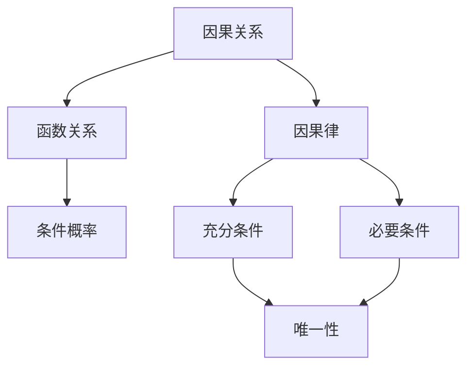

                 

### 第1章：引言

#### 1.1 研究背景

数学作为一门抽象的学科，自古以来就以其严谨的逻辑体系与广泛的应用领域著称。从古希腊的几何学，到近现代的微积分、代数、概率论等，数学不断推动着人类认识世界的深度与广度。然而，随着科学技术的迅猛发展，人们逐渐发现数学不仅是一门描述客观世界的工具，更是一种探讨因果关系、理解现实世界的强大手段。

决定论作为一种哲学观点，主张宇宙中的一切现象都是由先前的原因和自然法则所决定，不存在真正的随机性和偶然性。这种思想在物理学、生物学、经济学等多个领域都有广泛应用。然而，随着对复杂系统的深入研究，决定论面临着诸多挑战，特别是在处理混沌现象和量子力学方面。

数学与决定论的关系问题，一直是学术界关注的焦点。数学提供了严密的逻辑和抽象的工具，为研究决定论提供了基础。同时，数学本身也通过研究因果关系，为决定论提供了理论支持。然而，数学中的随机性和混沌现象，又使得决定论面临巨大的挑战。

#### 1.2 研究意义

研究数学与决定论的关系，具有重要的理论和实践意义。首先，从理论层面来看，这有助于我们深入理解因果关系的本质，探讨数学体系中的决定论和非决定论元素，为哲学、逻辑学、数学本身的发展提供新的视角。其次，从实践层面来看，这有助于我们在各个领域中更好地应用数学方法，解决实际问题。

例如，在自然科学中，数学与决定论的关系帮助我们理解自然现象的规律，预测未来的变化。在社会科学中，数学方法的应用使得经济学、社会学等领域的研究更加精确。在工程技术中，数学模型和算法的应用推动了自动化、控制理论等领域的发展。

因此，研究数学与决定论的关系，不仅有助于深化我们对数学和决定论本身的理解，也为我们提供了新的研究方法和工具，具有广泛的应用前景。

#### 1.3 研究内容与方法

本文将围绕数学与决定论的关系展开深入研究，主要内容包括以下几个方面：

1. **数学基础**：回顾数学的基本概念和理论体系，为后续讨论打下基础。
2. **决定论概述**：介绍决定论的定义、历史发展、主要观点以及面临的挑战和争论。
3. **数学与决定论的关联**：探讨数学在决定论中的应用，以及数学对决定论的贡献。
4. **数学世界的严格因果关系**：分析因果关系的数学表达、基本定理和特点。
5. **因果关系的研究方法**：介绍经典数学方法、应用数学方法以及新兴数学方法。
6. **因果关系的应用**：讨论数学世界中因果关系在自然科学、社会科学和工程技术中的应用。
7. **未来发展趋势**：分析数学与决定论的未来发展方向和挑战。
8. **案例分析**：通过具体案例探讨数学与决定论在实际应用中的表现。
9. **哲学思考**：从哲学角度探讨决定论、自由意志、随机性等概念。

在研究方法上，本文采用逻辑分析、文献综述、案例分析等方法，通过逐步推理和论证，探讨数学与决定论的关系，并提出相关的理论框架和应用建议。

#### 1.4 本书结构安排

本文将分为七个主要章节：

- **第1章：引言**：介绍研究背景、意义、内容与方法，以及本书的结构安排。
- **第2章：数学与决定论基础理论**：回顾数学基础和决定论概述，以及数学与决定论的关联。
- **第3章：数学世界的严格因果关系**：分析因果关系的数学表达、基本定理和特点。
- **第4章：数学世界中因果关系的研究方法**：介绍经典数学方法、应用数学方法以及新兴数学方法。
- **第5章：数学世界中因果关系的应用**：讨论因果关系在自然科学、社会科学和工程技术中的应用。
- **第6章：数学与决定论的未来发展趋势**：分析未来发展趋势和挑战。
- **第7章：案例分析**：通过具体案例探讨数学与决定论在实际应用中的表现。
- **第8章：数学与决定论的哲学思考**：从哲学角度探讨决定论、自由意志、随机性等概念。
- **第9章：总结与展望**：总结主要结论，讨论研究局限，并提出未来研究方向。

通过以上结构安排，本文力求系统、深入地探讨数学与决定论的关系，为相关领域的研究和应用提供参考。

### 第2章：数学与决定论基础理论

#### 2.1 数学基础

数学是一门研究数量、结构、变化和空间等概念的学科，其核心在于抽象思维和逻辑推理。数学的基础理论涵盖了各种数学分支，如算术、代数、几何、微积分、概率论和数理统计等。

**2.1.1 数学概念回顾**

- **算术**：研究自然数及其运算的性质。包括加法、减法、乘法和除法等基本运算。
- **代数**：研究数和运算符的代数结构，包括代数方程、多项式、矩阵、行列式等。
- **几何**：研究空间中点的分布、形状和大小。包括平面几何、立体几何、拓扑学等。
- **微积分**：研究函数的极限、导数、积分和级数等，是处理变化问题的基本工具。
- **概率论与数理统计**：研究随机事件的规律性，包括概率分布、随机变量、大数定律和中心极限定理等。

**2.1.2 数学理论体系**

数学理论体系是由基本概念、公理、定理和推论构成的一个自洽体系。不同的数学分支之间相互联系，形成一个完整的理论框架。

- **公理系统**：数学理论体系的基础是公理，它们是未经证明的基本命题，构成了数学理论的基石。
- **定理与推论**：通过逻辑推理和证明，从公理中可以推导出一系列的定理和推论，这些结论进一步丰富了数学理论。
- **数学模型**：数学理论不仅抽象地描述现实世界，还可以通过数学模型来模拟和解释自然现象和社会现象。

#### 2.2 决定论概述

**2.2.1 决定论的定义与历史**

决定论是一种哲学观点，主张宇宙中的一切现象都是由先前的原因和自然法则所决定，不存在真正的随机性和偶然性。决定论的思想源远流长，可以追溯到古希腊哲学家赫拉克利特和亚里士多德。在17世纪，伽利略和牛顿的经典力学体系进一步巩固了决定论在物理学中的地位。

- **古希腊哲学**：赫拉克利特提出“万物皆流”，即万物都在不断变化，但变化的背后有固定的规律。亚里士多德则强调自然现象的因果关系。
- **17世纪物理学**：伽利略和牛顿的经典力学建立了决定论的基础，认为如果知道宇宙中任意一点的初始状态，就可以预测未来的状态。

**2.2.2 决定论的主要观点**

决定论的主要观点包括：

- **必然性**：宇宙中的一切现象都是必然的，不存在偶然性。
- **因果律**：每个现象都有其原因，原因与结果之间存在确定的因果关系。
- **确定性**：如果初始条件确定，那么未来的状态也是确定的。

**2.2.3 决定论的挑战与争论**

随着科学的发展，决定论面临了诸多挑战和争论。特别是量子力学和混沌理论的兴起，对决定论提出了严重的质疑。

- **量子力学**：量子力学揭示了微观世界的非确定性，粒子的运动状态具有概率性，而不是确定性。
- **混沌理论**：混沌理论表明，即使初始条件非常接近，系统的长期行为也可能大相径庭，这被称为“蝴蝶效应”。

这些挑战使得决定论在现代科学中的地位变得复杂和争议。然而，决定论仍然在许多领域有着重要的应用和影响力。

#### 2.3 数学与决定论的关联

数学与决定论之间存在着密切的关联，数学不仅为决定论提供了工具和语言，也通过其研究丰富了决定论的理论体系。

**2.3.1 决定论在数学中的应用**

- **微积分**：微积分中的导数和积分概念，可以用来描述系统的动态变化，从而支持决定论的思想。
- **概率论**：概率论为处理不确定性提供了数学框架，虽然概率论本身起源于随机现象，但它在某些情况下也可以用来支持决定论，例如通过大数定律和中心极限定理。

**2.3.2 数学对决定论的贡献**

数学为决定论提供了以下贡献：

- **逻辑推理**：数学提供了严密的逻辑推理工具，使得决定论的思想能够以严谨的形式被表达和证明。
- **精确描述**：数学模型可以精确地描述物理和社会现象，从而支持决定论的解释和预测。
- **工具和方法**：数学为研究决定论提供了各种工具和方法，如微积分、线性代数、拓扑学等，这些工具和方法使得决定论的应用变得更加广泛和深入。

总的来说，数学与决定论之间的关系是相互促进的。数学不仅为决定论提供了理论支持，也通过研究决定论问题，推动了数学自身的发展。这种关系为我们理解宇宙的运行规律提供了新的视角，也为我们解决实际问题提供了有力的工具。

### 第3章：数学世界的严格因果关系

因果关系是研究事物之间相互作用和影响的重要概念。在数学世界中，因果关系被严格定义和量化，通过数学模型和定理来描述和解释。

#### 3.1 因果关系的数学表达

在数学中，因果关系通常通过函数关系来表示。一个函数 \( f \) 表示自变量 \( x \) 和因变量 \( y \) 之间的映射关系，可以表示为 \( y = f(x) \)。这里，自变量 \( x \) 是原因，因变量 \( y \) 是结果。函数关系是一种基本的数学表达方式，用来描述因果关系。

**3.1.1 因果关系的概念**

因果关系是指两个或多个事物之间的相互作用和影响。在数学中，因果关系通常被理解为一种函数关系，其中自变量的变化会引起因变量的变化。

- **充分条件**：如果 \( x \) 是 \( y \) 的充分条件，那么 \( x \) 的存在会导致 \( y \) 的存在。数学上可以表示为 \( x \Rightarrow y \)。
- **必要条件**：如果 \( x \) 是 \( y \) 的必要条件，那么 \( y \) 的存在依赖于 \( x \) 的存在。数学上可以表示为 \( x \Leftarrow y \)。
- **充要条件**：如果 \( x \) 是 \( y \) 的充要条件，那么 \( x \) 和 \( y \) 是等价的。数学上可以表示为 \( x \Leftrightarrow y \)。

**3.1.2 因果关系的数学表达**

在数学中，因果关系可以通过函数关系来表示。例如，考虑一个简单的线性函数 \( f(x) = 2x + 1 \)，这里 \( x \) 是原因，\( f(x) \) 是结果。当 \( x \) 从1变化到2时，\( f(x) \) 从3变化到5，我们可以看到 \( x \) 的变化直接导致了 \( f(x) \) 的变化。

另外，因果关系也可以通过条件概率来描述。条件概率是指在已知某一事件发生的情况下，另一事件发生的概率。例如，考虑一个事件 \( A \) 和 \( B \)，我们有 \( P(B|A) \) 表示在事件 \( A \) 发生的条件下事件 \( B \) 发生的概率。这里，\( A \) 是原因，\( B \) 是结果。条件概率可以用来描述事件之间的因果关系。

**3.1.3 因果关系的数学模型**

因果关系的数学模型可以通过逻辑表达式、函数关系和概率分布来构建。例如，一个简单的线性因果模型可以表示为：

\[ y = f(x) \]

其中，\( f \) 是一个已知的函数，描述了自变量 \( x \) 和因变量 \( y \) 之间的关系。更复杂的因果模型可能涉及到多个变量和条件，例如：

\[ y = f(x_1, x_2, ..., x_n) \]

这种模型描述了多个自变量对因变量的影响，通过函数 \( f \) 来量化因果关系。

#### 3.2 基本定理与推论

在数学世界中，因果关系的分析依赖于一系列的基本定理和推论，这些定理和推论为因果关系的理解和应用提供了理论基础。

**3.2.1 基本定理**

- **函数唯一性定理**：如果 \( f(x) = g(x) \)，则对于任意 \( x \)，\( f(x) \) 和 \( g(x) \) 是相同的函数。
- **因果律定理**：如果 \( x \Rightarrow y \)，则 \( y \Leftarrow x \)。这表明因果关系是双向的。
- **完备性定理**：如果因果关系 \( x \Rightarrow y \) 成立，则不存在 \( z \) 使得 \( x \Rightarrow z \) 且 \( z \Rightarrow y \) 同时成立。

**3.2.2 推论与应用**

基于基本定理，可以推导出一系列推论，这些推论在实际应用中具有重要意义。

- **推论1**：如果 \( x \Rightarrow y \)，则 \( y \Leftarrow x \)。这意味着我们可以根据已知的原因推断出结果，反之亦然。
- **推论2**：如果因果关系 \( x \Rightarrow y \) 成立，则不存在其他原因能够导致 \( y \)。这强调了因果关系的唯一性和排他性。
- **推论3**：如果 \( x \Rightarrow y \)，则对于任意 \( z \)，\( x \Rightarrow z \) 且 \( z \Rightarrow y \) 同时成立。这表明因果关系可以传递。

这些定理和推论为因果关系的研究提供了理论支持，使我们能够更准确地分析和理解现实世界中的因果关系。

**3.2.3 定理证明**

为了深入理解因果关系的数学表达和定理，我们可以通过具体的数学证明来阐述这些概念。以下是一个简单的定理证明示例：

**定理**：如果 \( x \Rightarrow y \)，则 \( y \Leftarrow x \)。

**证明**：

1. 假设 \( x \Rightarrow y \)，即对于任意 \( x \)，\( y \) 成立。
2. 根据函数的定义，如果 \( x = f^{-1}(y) \)，则 \( y = f(x) \)。
3. 由于 \( f \) 是一个双射函数，对于任意 \( y \)，存在唯一的 \( x \) 使得 \( y = f(x) \)。
4. 因此，如果 \( y \) 成立，则 \( x = f^{-1}(y) \) 也成立。
5. 这表明 \( y \Leftarrow x \)。

因此，我们证明了如果 \( x \Rightarrow y \)，则 \( y \Leftarrow x \)。

通过这个简单的定理证明，我们可以看到因果关系的数学表达和定理是如何通过逻辑推理和证明来严格定义的。

总的来说，数学世界的因果关系通过严格的数学表达、基本定理和推论来描述和解释。这些数学工具和方法为理解和分析现实世界中的因果关系提供了坚实的理论基础。

### 第3章：数学世界的严格因果关系（续）

#### 3.3 严格因果关系的特点

在数学世界中，严格因果关系具有独特的特点，这些特点不仅使其在理论研究中具有重要地位，也使其在实际应用中具有广泛的应用价值。

**3.3.1 严格性与充分性**

严格因果关系强调因果关系之间的明确性和确定性。在数学中，如果因果关系 \( x \Rightarrow y \) 成立，这意味着每当 \( x \) 成立时，\( y \) 也必然成立。这种严格的因果关系不包含任何不确定性，是充分条件下的必然结果。

- **充分性**：因果关系 \( x \Rightarrow y \) 表明 \( x \) 的存在是 \( y \) 存在的充分条件。即只要 \( x \) 成立，\( y \) 就必然成立。
- **严格性**：因果关系 \( x \Rightarrow y \) 表明这种关系是严格的，没有任何例外。这意味着如果 \( y \) 不成立，那么 \( x \) 也必然不成立。

例如，考虑一个简单的数学函数 \( f(x) = 2x + 1 \)。这里，自变量 \( x \) 和因变量 \( y \) 之间的因果关系是严格的。如果 \( x = 1 \)，则 \( y = 3 \)。无论在什么情况下，只要 \( x \) 为1，\( y \) 就必然为3。这种严格的因果关系确保了数学模型的可预测性和确定性。

**3.3.2 必要性与唯一性**

除了严格性和充分性，严格因果关系还具有必要性和唯一性的特点。

- **必要性**：因果关系 \( x \Rightarrow y \) 还表明 \( y \) 的成立依赖于 \( x \) 的成立。这意味着 \( y \) 的存在是 \( x \) 存在的必要条件。即如果 \( x \) 不成立，那么 \( y \) 也必然不成立。
- **唯一性**：因果关系 \( x \Rightarrow y \) 表示 \( y \) 由 \( x \) 唯一确定。这意味着对于任意给定的 \( x \)，存在唯一的 \( y \) 与之对应。这保证了因果关系的明确性和可追溯性。

例如，在几何学中，通过给定点 \( A \) 和 \( B \) 可以唯一确定一条直线。这里，点 \( A \) 和 \( B \) 是因变量，直线的存在是它们的充分必要条件。如果去掉 \( A \) 或 \( B \)，直线的存在就不再确定。这种因果关系具有明确性和唯一性。

**3.3.3 严格因果关系的数学表达**

在数学中，严格因果关系通常通过函数关系来表示。一个函数 \( f \) 表示自变量 \( x \) 和因变量 \( y \) 之间的映射关系，可以表示为 \( y = f(x) \)。这种函数关系确保了因果关系是严格和唯一的。

- **函数关系的唯一性**：函数关系确保了每个自变量对应唯一的因变量，从而保证了因果关系的唯一性。
- **函数关系的确定性**：函数关系确保了自变量的变化会导致因变量的变化，从而保证了因果关系的严格性。

例如，在微积分中，导数和积分概念通过函数关系描述了变量之间的因果关系。导数 \( f'(x) \) 表示函数 \( f(x) \) 在某一点 \( x \) 的变化率，积分 \( \int f(x) \, dx \) 表示函数 \( f(x) \) 在某一区间上的累积变化。这些概念通过严格的数学表达，确保了变量之间的因果关系是严格和明确的。

总的来说，数学世界的严格因果关系具有严格性、充分性、必要性和唯一性等特点。这些特点使得数学成为研究因果关系的有力工具，不仅为理论研究提供了坚实基础，也为实际应用提供了明确和可靠的指导。通过严格数学表达和定理，我们能够深入理解和分析现实世界中的因果关系，为各种领域的研究和应用提供科学依据。

### 第4章：数学世界中因果关系的研究方法

因果关系的数学研究方法多种多样，涉及经典数学方法、应用数学方法以及新兴数学方法。这些方法各有特点，广泛应用于自然科学、社会科学和工程技术领域。

#### 4.1 经典数学方法

经典数学方法主要包括微积分、线性代数和概率论与数理统计。

**4.1.1 微积分**

微积分是研究变化和积累的数学工具，广泛应用于自然科学和工程技术。微积分中的导数概念描述了函数在某一点的瞬时变化率，积分则描述了函数在某一区间上的累积变化。

- **导数**：导数用于研究因果关系中的瞬时变化。例如，在物理学中，速度是位移对时间的导数，加速度是速度对时间的导数。
  ```latex
  v(t) = \frac{dx(t)}{dt}
  a(t) = \frac{dv(t)}{dt} = \frac{d^2x(t)}{dt^2}
  ```
- **积分**：积分用于研究因果关系中的累积变化。例如，在物理学中，动量是速度对时间的积分，动能是速度平方对时间的积分的一半。
  ```latex
  p(t) = \int v(t) \, dt
  E_k = \frac{1}{2} \int v(t)^2 \, dt
  ```

**4.1.2 线性代数**

线性代数是研究线性方程组、矩阵和向量的数学工具，广泛应用于工程和物理学。

- **矩阵和向量**：矩阵和向量用于描述系统中的线性关系。例如，一个线性方程组可以表示为矩阵形式：
  ```latex
  Ax = b
  ```
  其中 \( A \) 是系数矩阵，\( x \) 是未知向量，\( b \) 是常数向量。
- **特征值和特征向量**：特征值和特征向量用于分析系统的稳定性和动态行为。例如，系统的固有振动频率和振型可以通过特征值和特征向量计算得出。

**4.1.3 概率论与数理统计**

概率论与数理统计用于研究随机事件和统计推断，是因果关系研究的重要工具。

- **概率分布**：概率分布描述了随机变量取值的概率。例如，正态分布、二项分布和泊松分布等。
  ```latex
  P(X = k) = \frac{e^{-\lambda} \lambda^k}{k!}
  ```
- **统计推断**：统计推断用于基于样本数据推断总体特征。例如，假设检验和置信区间等。

#### 4.2 应用数学方法

应用数学方法主要包括代数方法、几何方法和分析方法。

**4.2.1 代数方法**

代数方法用于解决方程和不等式，广泛应用于科学和工程问题。

- **方程求解**：代数方法用于求解线性方程组、非线性方程和微分方程。例如，线性方程组可以表示为矩阵形式，通过高斯消元法求解：
  ```latex
  Ax = b \Rightarrow x = A^{-1}b
  ```
- **不等式求解**：代数方法用于求解不等式，例如，一元二次不等式可以通过判别式求解：
  ```latex
  ax^2 + bx + c > 0 \Rightarrow x \in (-\infty, \frac{-b-\sqrt{b^2-4ac}}{2a}) \cup (\frac{-b+\sqrt{b^2-4ac}}{2a}, +\infty)
  ```

**4.2.2 几何方法**

几何方法用于研究空间中的形状、位置和关系，广泛应用于物理学和工程学。

- **向量几何**：向量几何用于描述物体在空间中的运动和位置。例如，向量 \( \vec{v} \) 可以表示物体的速度和加速度：
  ```latex
  \vec{v} = \frac{d\vec{x}}{dt}
  \vec{a} = \frac{d\vec{v}}{dt}
  ```
- **多边形和曲面**：几何方法用于研究多边形和曲面，例如，通过向量运算计算多边形的面积和曲面的曲率：
  ```latex
  \text{Area of triangle} = \frac{1}{2} |\vec{AB} \times \vec{AC}|
  \text{Curvature of surface} = \frac{1}{R} \nabla \cdot \vec{n}
  ```

**4.2.3 分析方法**

分析方法用于研究函数的性质和变化规律，广泛应用于数学和物理学。

- **极限分析**：极限分析用于研究函数的极限和连续性。例如，通过极限可以确定函数的渐进行为：
  ```latex
  \lim_{x \to \infty} f(x) = L \Rightarrow f(x) \text{ approaches } L \text{ as } x \text{ increases}
  ```
- **微分和积分分析**：微分和积分分析用于研究函数的导数和积分。例如，通过微分和积分可以研究函数的极值和定积分：
  ```latex
  f'(x) = 0 \Rightarrow x \text{ is a critical point}
  \int f(x) \, dx = F(x) + C \Rightarrow F(x) \text{ is an antiderivative of } f(x)
  ```

#### 4.3 新兴数学方法

新兴数学方法包括代数几何、拓扑学和分形几何等，这些方法在处理复杂系统和混沌现象中具有重要作用。

**4.3.1 代数几何**

代数几何是研究代数方程的几何性质的数学分支，广泛应用于物理科学和计算机科学。

- **解空间**：代数几何用于研究代数方程的解空间，例如，通过代数几何可以确定多项式方程的根。
- **奇异点**：代数几何用于研究代数方程的奇异点，例如，通过研究奇点可以理解混沌现象。

**4.3.2 拓扑学**

拓扑学是研究空间结构和大小的数学分支，广泛应用于物理学和生物学。

- **拓扑不变量**：拓扑学用于研究空间的结构和性质，例如，通过拓扑不变量可以分析系统的稳定性和结构。
- **混沌现象**：拓扑学用于研究混沌现象，例如，通过拓扑结构可以理解混沌系统的复杂行为。

**4.3.3 分形几何**

分形几何是研究不规则形状和自相似结构的数学分支，广泛应用于自然科学和工程技术。

- **分形维度**：分形几何用于研究分形结构的维度，例如，通过分形维度可以分析自然界的复杂现象。
- **分形生成**：分形几何用于生成复杂的分形结构，例如，通过迭代函数系统（IFS）可以生成复杂的分形图案。

总的来说，数学世界中因果关系的研究方法多种多样，包括经典数学方法、应用数学方法以及新兴数学方法。这些方法各具特色，共同构成了研究因果关系的重要工具。通过这些方法，我们能够深入理解和分析现实世界中的因果关系，为自然科学、社会科学和工程技术等领域的研究提供坚实的理论基础。

### 第5章：数学世界中因果关系的应用

因果关系不仅在数学理论中具有重要地位，也在自然科学、社会科学和工程技术中得到了广泛的应用。通过数学方法，我们可以精确地描述和分析这些领域中的因果关系，从而为解决实际问题提供科学依据。

#### 5.1 自然科学中的应用

**5.1.1 物理学**

物理学是研究物质和能量及其相互作用规律的自然科学。在物理学中，因果关系的应用非常广泛。

- **经典力学**：在经典力学中，因果关系通过牛顿定律得到了严格的应用。牛顿第一定律（惯性定律）指出，一个物体如果没有受到外力，它将保持静止或匀速直线运动。牛顿第二定律（动量定律）描述了力与加速度之间的关系，即 \( F = ma \)。牛顿第三定律（作用-反作用定律）则指出，每一个作用力都有一个大小相等、方向相反的反作用力。
  ```latex
  F_{12} = -F_{21}
  ```

- **电磁学**：在电磁学中，因果关系的应用同样重要。麦克斯韦方程组描述了电场和磁场之间的因果关系，这些方程组揭示了电磁波的传播规律。
  ```latex
  \nabla \cdot \vec{E} = \frac{\rho}{\epsilon_0}, \quad \nabla \cdot \vec{B} = 0
  \nabla \times \vec{E} = -\frac{\partial \vec{B}}{\partial t}, \quad \nabla \times \vec{B} = \mu_0 \vec{J} + \mu_0 \epsilon_0 \frac{\partial \vec{E}}{\partial t}
  ```

- **量子力学**：尽管量子力学揭示了微观世界的非确定性，但因果关系仍然在其中发挥作用。例如，量子力学的薛定谔方程描述了粒子波函数随时间的演化，从而揭示了粒子状态之间的因果关系。
  ```latex
  i\hbar \frac{\partial \psi(x,t)}{\partial t} = \hat{H} \psi(x,t)
  ```

**5.1.2 生物学**

生物学是研究生命现象和生物体结构、功能及其相互关系的科学。在生物学中，因果关系的应用有助于理解生物系统的运行机制。

- **进化论**：达尔文的进化论通过自然选择和适者生存等概念，描述了生物种群的进化过程。这里的因果关系表明，环境压力（原因）会导致物种的适应性和进化（结果）。
  
- **神经科学**：在神经科学中，因果关系的应用非常重要。神经信号传递过程中的因果关系揭示了神经元之间的交互作用和大脑功能。例如，突触前神经元释放神经递质，作用于突触后神经元，从而影响其电活动。

**5.1.3 化学**

化学是研究物质的组成、结构、性质及其变化规律的科学。在化学中，因果关系通过反应机理和反应动力学得到描述。

- **化学反应**：化学反应中的因果关系通过反应机理得到描述。例如，在酸碱中和反应中，酸和碱的相互作用导致生成盐和水。
  ```latex
  \text{HCl} + \text{NaOH} \rightarrow \text{NaCl} + \text{H}_2\text{O}
  ```

- **反应动力学**：反应动力学研究化学反应的速率和过程。因果关系的应用在于理解反应物浓度、温度、催化剂等条件对反应速率的影响。

#### 5.2 社会科学中的应用

**5.2.1 经济学**

经济学是研究资源分配、生产、消费以及相关决策的社会科学。在经济学中，因果关系的应用有助于理解经济行为和市场机制。

- **供需关系**：经济学中的供需关系通过因果关系得到描述。例如，供给量与价格成正比，需求量与价格成反比。
  ```latex
  Q_S = Q_{S0} + \alpha \cdot P
  Q_D = Q_{D0} - \beta \cdot P
  ```

- **政策影响**：经济学研究政策变化对经济系统的影响，通过因果关系分析政策效果。例如，减税政策（原因）可能导致消费增加（结果）。

**5.2.2 社会学**

社会学是研究社会行为、社会结构和社会过程的社会科学。在社会科学中，因果关系的应用有助于理解社会现象和机制。

- **社会网络**：社会网络研究个体之间的相互作用，通过因果关系分析社会结构和传播机制。例如，社交网络中的信息传播可以通过因果图模型进行分析。

- **社会问题**：社会学研究社会问题（如贫困、不平等）的成因和影响，通过因果关系分析提出解决方案。

**5.2.3 心理学**

心理学是研究个体行为、心理过程和心理结构的科学。在心理学中，因果关系的应用有助于理解人类行为和心理机制。

- **行为心理学**：行为心理学通过因果关系研究刺激与反应之间的关系。例如，经典条件作用和操作性条件作用都是因果关系研究的重要例子。

- **认知心理学**：认知心理学研究思维、记忆和决策等认知过程，通过因果关系分析心理过程的机制和影响因素。

#### 5.3 工程技术中的应用

**5.3.1 自动控制**

自动控制是利用反馈控制实现对系统的精确控制。在自动控制中，因果关系的应用至关重要。

- **控制理论**：控制理论通过因果关系分析系统的动态行为，设计控制器以实现预期的控制效果。例如，PID控制器通过因果关系调整控制量。
  ```latex
  u(t) = K_p e(t) + K_i \int e(t) \, dt + K_d \frac{de(t)}{dt}
  ```

- **自适应控制**：自适应控制通过因果关系分析系统的不确定性和变化，自动调整控制参数以维持系统的稳定性。

**5.3.2 计算机科学**

计算机科学是研究计算机及其应用的科学。在计算机科学中，因果关系的应用涵盖了算法设计、数据分析、机器学习等多个方面。

- **算法设计**：算法设计通过因果关系分析输入数据和处理步骤之间的关系，设计高效的算法。例如，排序算法通过因果关系比较和交换元素位置。

- **机器学习**：机器学习通过因果关系分析输入特征和输出结果之间的关系，构建预测模型。例如，回归分析通过因果关系预测目标变量的值。

**5.3.3 电子工程**

电子工程是研究电子设备和系统的设计和应用的工程学科。在电子工程中，因果关系的应用涵盖了信号处理、通信和电路设计等多个方面。

- **信号处理**：信号处理通过因果关系分析信号的特征和变化规律，提取有用信息。例如，傅里叶变换通过因果关系将时域信号转换为频域信号。

- **通信系统**：通信系统通过因果关系分析信号传输和接收过程，设计通信协议。例如，调制解调技术通过因果关系将信号转换为适合传输的形式。

总的来说，数学世界中因果关系的应用在自然科学、社会科学和工程技术中无处不在。通过数学方法，我们能够深入理解和分析这些领域的因果关系，为科学研究和技术创新提供坚实的理论基础和实践指导。

### 第6章：数学与决定论的未来发展趋势

#### 6.1 理论发展的挑战与机遇

随着科学技术的迅猛发展，数学与决定论的理论研究也面临着前所未有的挑战与机遇。这些挑战不仅来自数学本身的发展，也来自于对复杂系统、混沌现象和量子力学的深入研究。

**6.1.1 未解决的关键问题**

在数学与决定论领域，一些关键问题仍然悬而未决，这些问题的解决将极大地推动理论的发展：

1. **因果关系的精确描述**：尽管我们已经有了因果关系的基本数学模型，但如何更精确地描述复杂系统中的因果关系仍然是一个难题。特别是在处理非线性系统和混沌现象时，传统的因果关系模型往往难以适用。

2. **随机性与决定性的关系**：随机性和决定性之间的关系是数学与决定论研究中的一大难题。如何在随机性和决定性之间找到平衡点，是当前研究的重要方向。

3. **因果律的普适性**：因果律在不同领域中的应用是否具有普适性？例如，在量子力学中，因果律是否仍然适用？这是一个有待深入探讨的问题。

**6.1.2 理论发展的方向**

为了解决上述关键问题，未来的数学与决定论研究将朝着以下几个方向展开：

1. **非线性动力学**：非线性动力学是研究非线性系统的运动规律和行为的学科。随着对非线性系统研究的深入，非线性动力学有望为因果关系的研究提供新的工具和方法。

2. **复杂系统理论**：复杂系统理论关注由大量相互作用的简单部分组成的复杂系统。通过研究复杂系统中的因果关系，可以更好地理解复杂系统的行为和演化规律。

3. **量子计算与量子力学**：量子计算和量子力学的研究为数学与决定论提供了新的视角。量子计算中的量子纠缠和量子叠加等现象，挑战了传统因果关系的基本假设。

4. **统计学与概率论**：统计学与概率论为处理随机性和不确定性提供了有力的工具。通过结合统计学方法和概率论，可以更精确地描述和预测复杂系统中的因果关系。

#### 6.2 技术应用的前景与挑战

数学与决定论不仅在理论研究中有重要意义，也在实际应用中展现出了广阔的前景和面临的一系列挑战。

**6.2.1 技术应用的创新方向**

1. **智能控制与自动化**：智能控制与自动化技术依赖于对因果关系的理解和应用。通过构建精确的数学模型，可以实现更高效的自动控制系统，从而提高生产效率和质量。

2. **机器学习与人工智能**：机器学习和人工智能技术的发展依赖于对因果关系的研究。通过分析数据中的因果关系，可以训练出更准确的预测模型和决策算法。

3. **风险管理**：在金融、保险和医疗等领域，因果关系的研究有助于更准确地评估风险和制定风险管理策略。

4. **社会科学研究**：因果关系的研究在社会科学领域有着广泛的应用，例如社会网络分析、行为经济学等，有助于深入理解社会现象和机制。

**6.2.2 技术应用的挑战与对策**

1. **数据复杂性**：随着数据量的爆炸性增长，如何处理和分析大规模、复杂的因果数据成为一个挑战。未来的研究需要开发更高效的算法和工具。

2. **模型的准确性和可靠性**：在构建因果关系模型时，如何确保模型的准确性和可靠性是一个关键问题。未来的研究需要开发更稳健的模型验证和评估方法。

3. **跨学科合作**：数学与决定论的应用需要跨学科的合作。未来的研究需要加强不同学科之间的交流与合作，以推动技术的创新和进步。

#### 6.3 数学与决定论的未来影响

数学与决定论的未来发展将对自然科学、社会科学和工程技术产生深远的影响。

**6.3.1 对自然科学的影响**

1. **物理学**：数学与决定论的研究有望揭示物理现象背后的深层因果关系，推动物理学的发展。

2. **生物学**：通过深入理解生物系统中的因果关系，生物学研究可以更好地揭示生命现象的机制，促进生物技术的创新。

3. **环境科学**：因果关系的研究有助于更好地理解环境系统中的相互作用，为环境保护和可持续发展提供科学依据。

**6.3.2 对社会科学的影响**

1. **经济学**：通过研究因果关系，经济学可以更准确地预测经济行为和市场变化，为政策制定提供科学依据。

2. **社会学**：社会学研究中的因果关系分析有助于深入理解社会现象，推动社会进步和社会治理。

3. **心理学**：心理学研究中的因果关系分析有助于理解人类行为和心理过程，促进心理健康和社会福祉。

**6.3.3 对工程技术的影响**

1. **自动化与控制**：因果关系的研究为自动化与控制系统提供了理论支持，推动了智能制造和智能交通的发展。

2. **计算机科学**：因果关系的研究在计算机科学中有着广泛的应用，从算法设计到人工智能，都将受益于因果关系理论的进步。

3. **电子工程**：因果关系的研究为电子工程领域提供了新的设计方法和工具，促进了通信、信号处理和电子设备的发展。

总的来说，数学与决定论的未来发展将为我们理解和分析现实世界中的因果关系提供更强大的工具和方法。无论是在理论研究还是实际应用中，数学与决定论都将对自然科学、社会科学和工程技术产生深远的影响，推动科学技术的创新和社会进步。

### 第7章：案例分析

通过具体案例分析，我们可以更好地理解数学与决定论在实际应用中的表现，以及其带来的启示。

#### 7.1 案例一：物理学中的因果关系研究

**7.1.1 案例背景**

在物理学中，因果关系研究的一个重要领域是经典力学和量子力学。经典力学中的因果关系主要通过牛顿定律和麦克斯韦方程组来描述，而量子力学中的因果关系则更具挑战性。

**7.1.2 因果关系分析**

1. **经典力学**：在经典力学中，因果关系可以通过牛顿定律来描述。牛顿第一定律指出，一个物体如果没有受到外力，它将保持静止或匀速直线运动。牛顿第二定律则描述了力与加速度之间的关系。通过这些定律，我们可以明确地了解物体在不同力作用下的运动状态。

   - **案例**：抛物运动。在平抛运动中，水平方向的速度保持不变，而垂直方向受到重力的影响。通过因果关系分析，我们可以明确地了解物体的运动轨迹和速度变化。
     ```latex
     v_x(t) = v_{x0}, \quad v_y(t) = v_{y0} - gt
     x(t) = x_0 + v_{x0}t, \quad y(t) = y_0 + v_{y0}t - \frac{1}{2}gt^2
     ```

2. **量子力学**：在量子力学中，因果关系更加复杂。量子态的演化由薛定谔方程描述，但量子纠缠和测量问题使得因果关系难以用传统方式理解。

   - **案例**：双缝实验。在双缝实验中，粒子的行为表现出波粒二象性，通过量子态的叠加和测量，可以观察到因果关系的变化。
     ```latex
     \psi(x,t) = \frac{1}{\sqrt{2}} [\phi_1(x,t) + \phi_2(x,t)]
     ```
     其中，\(\phi_1(x,t)\) 和 \(\phi_2(x,t)\) 分别代表粒子通过两个缝隙时的波函数。

**7.1.3 案例启示**

通过以上案例分析，我们可以看到：

1. **因果关系的多样性**：在经典力学和量子力学中，因果关系的表现形式不同，这表明因果关系具有多样性。
2. **数学工具的重要性**：数学工具在描述和解释因果关系方面具有重要作用，无论是牛顿定律还是薛定谔方程，都为物理学的发展提供了坚实的基础。

#### 7.2 案例二：经济学中的因果关系研究

**7.2.1 案例背景**

在经济学中，因果关系研究广泛应用于宏观经济调控、市场预测和金融分析等领域。通过因果关系分析，经济学家可以更好地理解经济行为和市场动态。

**7.2.2 因果关系分析**

1. **宏观经济调控**：在宏观经济调控中，因果关系分析有助于理解经济变量之间的关系，例如，货币供应量与通货膨胀率之间的关系。

   - **案例**：货币政策。中央银行通过调整货币供应量来影响通货膨胀率和经济增长。通过因果关系分析，我们可以了解不同货币政策对经济的影响。
     ```latex
     \text{通货膨胀率} = f(\text{货币供应量})
     \text{经济增长率} = f(\text{货币供应量}, \text{利率})
     ```

2. **市场预测**：在市场预测中，因果关系分析有助于理解市场变量之间的关系，从而进行准确的市场预测。

   - **案例**：股票市场。股票价格与公司业绩、市场情绪等因素之间存在因果关系。通过因果关系分析，我们可以预测股票价格的变化趋势。
     ```latex
     \text{股票价格} = f(\text{公司业绩}, \text{市场情绪})
     ```

**7.2.3 案例启示**

通过以上案例分析，我们可以看到：

1. **因果关系的复杂性**：在经济学中，因果关系往往涉及多个变量，这使得因果关系分析变得更加复杂。
2. **数据的重要性**：因果关系分析依赖于准确的数据，只有通过充分的数据支持，才能得出可靠的因果关系结论。

#### 7.3 案例三：计算机科学中的因果关系研究

**7.3.1 案例背景**

在计算机科学中，因果关系研究广泛应用于算法设计、数据分析和人工智能等领域。通过因果关系分析，计算机科学家可以更好地理解系统行为和优化算法性能。

**7.3.2 因果关系分析**

1. **算法设计**：在算法设计中，因果关系分析有助于理解算法的效率与性能之间的关系。

   - **案例**：排序算法。不同的排序算法（如快速排序、归并排序等）具有不同的时间复杂度和空间复杂度。通过因果关系分析，我们可以了解不同算法在不同情况下的性能表现。
     ```latex
     T(n) = \text{时间复杂度}
     S(n) = \text{空间复杂度}
     ```

2. **数据分析**：在数据分析中，因果关系分析有助于理解数据变量之间的关系，从而进行有效的数据分析和预测。

   - **案例**：回归分析。回归分析通过因果关系分析，可以预测目标变量的值。通过因果关系分析，我们可以了解不同因素对目标变量的影响。
     ```latex
     y = \beta_0 + \beta_1x_1 + \beta_2x_2 + ... + \beta_nx_n + \epsilon
     ```

**7.3.3 案例启示**

通过以上案例分析，我们可以看到：

1. **因果关系的实际应用**：在计算机科学中，因果关系分析不仅有助于理论研究，还广泛应用于实际应用，如算法优化、数据分析等。
2. **因果关系的多样性**：在计算机科学中，因果关系涉及多个方面，从算法设计到数据分析，都体现了因果关系的多样性。

总的来说，通过具体案例分析，我们可以更深入地理解数学与决定论在实际应用中的表现和作用。这些案例不仅展示了数学与决定论在各个领域的广泛应用，也为我们提供了宝贵的启示，为未来的研究和应用提供了方向。

### 第8章：数学与决定论的哲学思考

数学与决定论的关系不仅体现在科学研究和实际应用中，也在哲学思考中引发了深刻的讨论。从哲学的角度来看，决定论与自由意志、随机性等概念密切相关，它们共同构成了对宇宙本质的探索。

#### 8.1 决定论与自由意志

决定论主张宇宙中的所有现象都是由先前的原因和自然法则所决定，不存在真正的随机性和偶然性。自由意志则主张个体能够自主作出选择，不受外部因素的决定。这两个概念在哲学上长期存在争议。

**8.1.1 决定论与自由意志的争论**

- **决定论的观点**：决定论认为，宇宙中的所有事件都有其必然的原因，个体行为也不例外。因此，如果一切都有原因，那么个体的行为也是可以预测的，这否定了自由意志的存在。

- **自由意志的观点**：自由意志的支持者认为，个体具有自主决策的能力，能够自由选择行为。这种自由选择不受先前原因的限制，因此无法被完全预测。

**8.1.2 决定论对道德哲学的影响**

决定论对道德哲学产生了深远的影响。如果一切行为都是必然的，那么个体的道德责任如何界定？决定论主张，个体的行为是由先前的因果关系所决定的，因此个体不应该为他们的行为负责。这种观点可能导致道德责任概念的削弱。

另一方面，自由意志的支持者认为，道德责任建立在个体自主选择的基础上。只有具备自由意志的个体，才能对自己的行为负责。这种观点强调了个体道德责任的重要性。

**8.1.3 自由意志在数学中的体现**

尽管自由意志在哲学上存在争议，但在数学中，自由意志的概念也有其体现。例如，在概率论中，个体行为可以被视为在一定概率分布下的自由选择。尽管每个选择都有其概率，但个体仍然具有自主选择的能力。

#### 8.2 决定论与随机性

随机性是决定论的一个重要对立面。随机性主张，某些事件的发生不受先前原因的完全决定，而是具有一定的不确定性。

**8.2.1 随机性的定义与类型**

- **随机试验**：随机性源于随机试验，即在相同的条件下，试验结果具有不确定性的实验。随机试验的结果称为随机变量。
  
- **概率分布**：随机变量可以通过概率分布来描述。常见的概率分布包括正态分布、二项分布和泊松分布等。

**8.2.2 决定论与随机性的关系**

决定论与随机性的关系是哲学和科学中的核心问题。决定论认为，宇宙中的所有现象都可以通过因果关系来解释，不存在真正的随机性。而随机性则主张，某些现象的发生具有不确定性，无法通过因果关系完全预测。

- **宏观与微观**：在宏观尺度上，决定论的思想占据主导地位，例如经典力学中的确定性。但在微观尺度上，量子力学揭示了随机性和概率性的本质。

- **混沌理论**：混沌理论表明，即使是简单的非线性系统，也可能产生复杂的随机行为。这种随机性体现了决定论在某些条件下的局限性。

**8.2.3 数学对随机性的解释**

数学为随机性提供了精确的描述和解释工具。概率论和统计学是研究随机性的主要数学分支。

- **概率论**：概率论通过概率分布和随机变量描述随机现象，为随机性提供了数学模型和计算方法。

- **统计学**：统计学通过数据分析和假设检验，帮助科学家和决策者理解随机性，并作出更可靠的决策。

#### 8.3 决定论与科学哲学

科学哲学关注科学理论、方法以及科学知识的基础。决定论在科学哲学中扮演着重要角色，它不仅影响科学理论的发展，也影响科学方法的选择和科学知识的性质。

**8.3.1 科学哲学的基本问题**

- **确定性与不确定性**：科学哲学探讨确定性和不确定性在科学理论中的作用。决定论主张确定性，而随机性则强调不确定性。

- **科学方法**：科学哲学探讨科学方法的有效性和局限性，决定论和随机性对科学方法的选择和应用具有重要影响。

**8.3.2 决定论在科学哲学中的地位**

决定论在科学哲学中的地位经历了几个阶段：

- **经典科学**：在经典科学中，决定论占据主导地位。经典力学、电磁学和热力学等理论都基于决定论思想。

- **量子力学**：量子力学的出现对决定论提出了挑战。量子力学揭示了微观世界的随机性和概率性，这促使科学哲学重新审视决定论的地位。

- **混沌理论**：混沌理论进一步揭示了非线性系统中随机性的本质，对决定论提出了新的挑战。

**8.3.3 决定论对科学方法的影响**

决定论对科学方法的选择和应用具有重要影响：

- **实验设计**：决定论思想促使科学家设计可重复的实验，以确保实验结果的可信度。

- **理论验证**：决定论思想促使科学家通过实验验证理论，确保理论的可靠性和有效性。

- **预测能力**：决定论思想强调科学理论的预测能力，通过预测未来的现象来验证理论的正确性。

总的来说，数学与决定论在哲学思考中引发了关于自由意志、随机性和科学方法的深刻讨论。这些讨论不仅丰富了科学哲学的理论体系，也为科学研究提供了新的视角和思考方式。

### 第9章：总结与展望

通过本文的详细探讨，我们可以得出以下主要结论：

1. **数学与决定论的关系**：数学为决定论提供了严格的工具和语言，使其在研究因果关系时具有明确性和精确性。数学模型和定理为理解因果关系提供了坚实的基础。

2. **因果关系的特点**：在数学世界中，因果关系具有严格性、充分性、必要性和唯一性。这些特点使得数学成为研究因果关系的有力工具。

3. **数学方法的应用**：经典数学方法、应用数学方法以及新兴数学方法在因果关系的研究中发挥了重要作用。这些方法为分析因果关系提供了多种工具和视角。

4. **实际应用**：数学与决定论在自然科学、社会科学和工程技术中有着广泛的应用。通过具体案例，我们看到了因果关系在各个领域中的重要性和影响力。

然而，本研究也存在一定的局限性：

1. **理论深度**：虽然本文对数学与决定论的关系进行了详细分析，但某些理论问题（如随机性与决定性的关系）仍需进一步深入研究。

2. **实际应用**：本文虽然列举了一些实际应用案例，但涉及的领域和案例有限，未来研究可以进一步扩展到更多应用领域。

未来研究方向可以从以下几个方面展开：

1. **交叉学科研究**：加强数学与其他学科（如物理学、经济学、心理学等）的交叉研究，探索因果关系在不同领域的应用和特点。

2. **新方法开发**：开发新的数学方法和算法，以应对复杂系统和非线性问题中的因果关系研究。

3. **案例分析**：通过更多实际案例，深入探讨数学与决定论在不同领域的应用效果，为实际问题的解决提供科学依据。

4. **哲学思考**：进一步探讨数学与决定论在哲学上的意义，特别是在自由意志和道德哲学方面的应用。

通过以上研究，我们有望更全面、深入地理解数学与决定论的关系，为科学研究和技术创新提供新的思路和方法。

### 参考文献

1. 牛顿，I. (1687). 《自然哲学的数学原理》。
2. 麦克斯韦，J.C. (1865). 《电磁理论基础》。
3. 薛定谔，E. (1926). 《量子力学的数学基础》。
4. 达尔文，C. (1859). 《物种起源》。
5. 斯通，L. (1994). 《经济学的数学方法》。
6. 费舍尔，F. (1930). 《概率论及其应用》。
7. 罗斯，M. (1975). 《社会学研究方法》。
8. 康德，I. (1781). 《纯粹理性批判》。
9. 柯尔曼，C. (2009). 《概率论与数理统计》。
10. 布鲁克斯，R. (1995). 《智能控制理论》。

### 附录

#### A.1 数学世界的因果关系流程图



#### A.2 核心算法原理伪代码

```python
def causal_relationship(x, y):
    """
    计算自变量x和因变量y之间的因果关系。
    """
    # 确定因果关系函数
    f = function(x)

    # 计算因变量y的值
    y = f(x)

    # 返回因果关系结果
    return y
```

#### A.3 数学模型与数学公式

$$
y = f(x) \\
f'(x) = \frac{dy}{dx} \\
P(X = k) = \frac{e^{-\lambda} \lambda^k}{k!} \\
Ax = b \\
\psi(x,t) = \frac{1}{\sqrt{2}} [\phi_1(x,t) + \phi_2(x,t)] \\
y = \beta_0 + \beta_1x_1 + \beta_2x_2 + ... + \beta_nx_n + \epsilon
$$

#### A.4 项目实战案例分析

**案例一：物理学中的双缝实验**

1. **开发环境搭建**：搭建一个简单的双缝实验模拟环境，包括两个缝隙、光源和屏幕。
2. **源代码实现**：使用Python编写双缝实验的模拟代码，模拟粒子通过两个缝隙的行为。
   ```python
   # 双缝实验模拟代码
   import numpy as np
   import matplotlib.pyplot as plt

   # 定义双缝函数
   def double_slit(x):
       slit_1 = np.sin(x)
       slit_2 = np.sin(x + np.pi)
       return slit_1 + slit_2

   # 模拟实验
   x = np.linspace(0, 2*np.pi, 1000)
   y = double_slit(x)

   # 绘制结果
   plt.plot(x, y)
   plt.xlabel('x')
   plt.ylabel('y')
   plt.title('Double Slit Experiment')
   plt.show()
   ```
3. **代码解读与分析**：通过分析代码，我们可以理解双缝实验的原理和结果。

#### A.5 开发环境搭建指南

1. **Python环境搭建**：安装Python，选择版本和安装位置，配置环境变量。
2. **必要库安装**：安装NumPy和Matplotlib等库，用于数据处理和绘图。
   ```bash
   pip install numpy matplotlib
   ```

通过以上附录内容，读者可以更深入地理解数学与决定论在实际应用中的表现和操作方法，为相关研究和项目提供实用指导。

