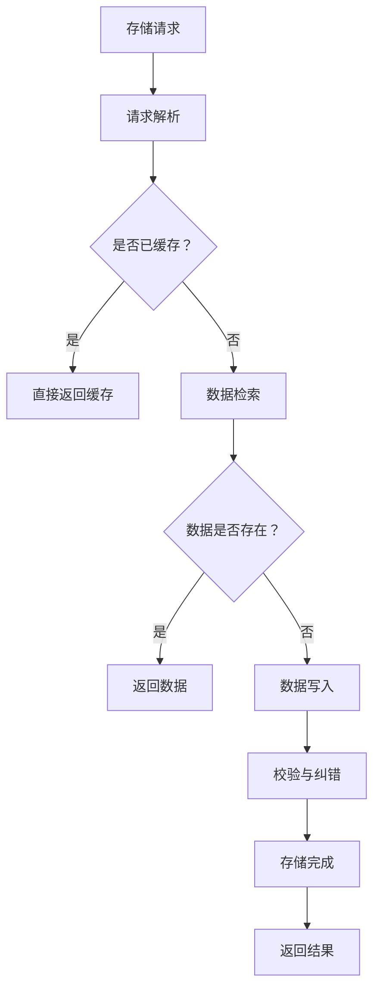

                 

### 《数据存储系统：满足 AI 2.0 海量数据存储需求》

#### 第一部分：数据存储系统概述

##### 第1章：数据存储系统引论

在当今信息化社会，数据存储系统已经成为各种应用的核心组成部分。随着人工智能（AI）技术的发展，尤其是进入AI 2.0时代，海量数据的存储需求日益增加。本章将探讨数据存储系统的定义、组成部分及其在AI 2.0背景下的重要性。

**1.1 数据存储系统的定义**

数据存储系统是指用于存储、管理和检索数据的一系列硬件、软件和网络的集合。其主要目标是提供高效、可靠、安全的数据存储解决方案，以满足不同类型和规模的数据存储需求。

**1.2 数据存储系统的组成部分**

数据存储系统通常包括以下几个主要组成部分：

- **存储设备**：包括磁盘、固态硬盘（SSD）和其他非易失性存储介质。
- **存储网络**：用于连接存储设备和服务器，确保数据的高效传输。
- **存储管理软件**：负责数据的管理、备份、恢复和性能优化等。
- **数据保护机制**：包括数据备份、数据加密和数据安全等。

**1.3 AI 2.0 与海量数据存储需求**

AI 2.0时代，人工智能技术的进步带来了数据规模的急剧增长。以下是AI 2.0与海量数据存储需求之间的关系：

- **数据规模**：AI 2.0涉及到的数据处理量更大，从图片、视频到文本、语音等多种形式，数据量呈指数级增长。
- **数据多样性**：AI 2.0需要处理的结构化和非结构化数据类型更加丰富，对存储系统的兼容性提出了更高的要求。
- **实时性要求**：AI 2.0应用通常需要实时响应，对数据存储系统的访问速度和低延迟提出了挑战。

**1.4 数据存储系统的架构设计**

为了满足AI 2.0的海量数据存储需求，数据存储系统的架构设计需要考虑以下几个方面：

- **分布式存储架构**：通过将数据分布在多个节点上，提高系统的扩展性和容错性。
- **数据存储层次结构**：根据数据的重要性和访问频率，将数据分层存储，优化存储性能。

**1.5 数据存储系统的挑战与机遇**

AI 2.0为数据存储系统带来了前所未有的挑战和机遇：

- **存储安全与隐私保护**：随着数据规模的扩大，如何确保数据的安全和隐私成为关键问题。
- **大数据存储性能优化**：如何提高数据存储和检索的性能，是数据存储系统需要持续解决的问题。
- **AI 2.0 对存储技术的创新**：AI 2.0技术的应用为存储技术带来了新的发展机遇，如智能存储、存储优化算法等。

在接下来的章节中，我们将进一步探讨数据存储系统的核心概念、架构设计、算法原理及其在AI 2.0背景下的应用。

### 《数据存储系统：满足 AI 2.0 海量数据存储需求》

> **关键词**：数据存储系统，AI 2.0，海量数据，存储需求，架构设计，核心算法，数学模型。

> **摘要**：本文将深入探讨数据存储系统在AI 2.0时代的重要性。我们将首先概述数据存储系统的基本概念和组成部分，然后分析AI 2.0对海量数据存储需求的影响。接着，本文将详细介绍数据存储系统的架构设计，核心概念与算法原理，以及AI 2.0下的数据存储技术。最后，我们将通过项目实战案例，展示如何实现一个高效、可靠、安全的数据存储系统，满足AI 2.0的海量数据存储需求。

#### 第一部分：数据存储系统概述

##### 第1章：数据存储系统引论

在当今信息化社会，数据存储系统已经成为各种应用的核心组成部分。随着人工智能（AI）技术的发展，尤其是进入AI 2.0时代，海量数据的存储需求日益增加。本章将探讨数据存储系统的定义、组成部分及其在AI 2.0背景下的重要性。

**1.1 数据存储系统的定义**

数据存储系统是指用于存储、管理和检索数据的一系列硬件、软件和网络的集合。其主要目标是提供高效、可靠、安全的数据存储解决方案，以满足不同类型和规模的数据存储需求。

**1.2 数据存储系统的组成部分**

数据存储系统通常包括以下几个主要组成部分：

- **存储设备**：包括磁盘、固态硬盘（SSD）和其他非易失性存储介质。这些设备负责实际的数据存储和读写操作。
- **存储网络**：用于连接存储设备和服务器，确保数据的高效传输。常见的存储网络协议包括SCSI、iSCSI和NVMe等。
- **存储管理软件**：负责数据的管理、备份、恢复和性能优化等。这些软件通常提供一系列接口和工具，方便用户对数据进行操作和管理。
- **数据保护机制**：包括数据备份、数据加密和数据安全等。这些机制旨在确保数据的安全性和完整性，防止数据丢失和未经授权的访问。

**1.3 AI 2.0 与海量数据存储需求**

AI 2.0时代，人工智能技术的进步带来了数据规模的急剧增长。以下是AI 2.0与海量数据存储需求之间的关系：

- **数据规模**：AI 2.0涉及到的数据处理量更大，从图片、视频到文本、语音等多种形式，数据量呈指数级增长。例如，自动驾驶汽车每天产生的数据量高达数百GB。
- **数据多样性**：AI 2.0需要处理的结构化和非结构化数据类型更加丰富，对存储系统的兼容性提出了更高的要求。除了传统的文本数据外，图像、视频和语音数据等也日益成为存储的重要对象。
- **实时性要求**：AI 2.0应用通常需要实时响应，对数据存储系统的访问速度和低延迟提出了挑战。例如，在金融交易、实时语音识别和自动驾驶等场景中，数据的实时存储和处理至关重要。

**1.4 数据存储系统的架构设计**

为了满足AI 2.0的海量数据存储需求，数据存储系统的架构设计需要考虑以下几个方面：

- **分布式存储架构**：通过将数据分布在多个节点上，提高系统的扩展性和容错性。分布式存储系统如HDFS、Ceph和GlusterFS等，可以横向扩展，支持大规模的数据存储和处理。
- **数据存储层次结构**：根据数据的重要性和访问频率，将数据分层存储，优化存储性能。常见的分层存储策略包括冷热数据分离、缓存层和持久化层等。
- **存储虚拟化技术**：通过存储虚拟化，将物理存储资源抽象成逻辑存储资源，提高存储资源的利用率和灵活性。常见的存储虚拟化技术包括SAN虚拟化和NAS虚拟化等。

**1.5 数据存储系统的挑战与机遇**

AI 2.0为数据存储系统带来了前所未有的挑战和机遇：

- **存储安全与隐私保护**：随着数据规模的扩大，如何确保数据的安全和隐私成为关键问题。数据加密、访问控制和安全审计等技术需要得到进一步的完善和应用。
- **大数据存储性能优化**：如何提高数据存储和检索的性能，是数据存储系统需要持续解决的问题。数据压缩、数据去重和存储优化算法等技术的发展具有重要意义。
- **AI 2.0 对存储技术的创新**：AI 2.0技术的应用为存储技术带来了新的发展机遇，如智能存储、存储优化算法和自适应存储等。这些技术的出现有望进一步提升数据存储系统的性能和可靠性。

在接下来的章节中，我们将进一步探讨数据存储系统的核心概念、架构设计、算法原理及其在AI 2.0背景下的应用。

### 《数据存储系统：满足 AI 2.0 海量数据存储需求》

#### 第二部分：核心概念与架构

##### 第2章：核心概念与联系

在数据存储系统中，了解核心概念和它们之间的联系是构建高效、可靠的数据存储解决方案的基础。本章将详细介绍数据存储系统中的核心概念，包括数据冗余与去重、数据压缩与解压缩、数据校验与纠错等。同时，我们将使用Mermaid流程图展示数据存储系统的架构原理和核心组件。

**2.1 数据存储系统中的核心概念**

**2.1.1 数据冗余与去重**

数据冗余是指在同一数据存储系统中存储多份相同或类似的数据。冗余数据可能导致存储空间的浪费、数据一致性问题以及数据同步的复杂性。为了提高存储效率，数据去重技术被广泛应用。

去重技术主要通过以下几种方法实现：

- **哈希去重**：使用哈希函数将数据映射到固定长度的哈希值，检测和消除重复的数据块。
- **索引去重**：通过建立索引来记录已存储的数据块，避免重复存储相同的数据。

**2.1.2 数据压缩与解压缩**

数据压缩是指通过算法减少数据存储所需的容量。压缩技术分为无损压缩和有损压缩：

- **无损压缩**：保持数据完整性，如GZIP、BZIP2等。
- **有损压缩**：在保证可接受质量损失的前提下，大幅减少数据量，如JPEG、MP3等。

解压缩是压缩的逆过程，用于恢复压缩前的数据。

**2.1.3 数据校验与纠错**

数据校验与纠错技术用于检测和纠正存储或传输过程中可能发生的数据错误。

- **校验和**：通过计算数据块的校验和，验证数据在存储或传输过程中是否发生错误。
- **纠错码**：在数据存储或传输时，添加额外的纠错信息，使系统能够在检测到错误时自动纠正。

**2.2 数据存储系统的架构原理**

**2.2.1 存储架构的 Mermaid 流程图**



**2.2.2 存储架构的核心组件**

数据存储系统通常包括以下几个核心组件：

- **存储设备**：负责数据的物理存储。
- **存储网络**：确保数据在不同设备之间的传输。
- **存储管理软件**：管理数据存储、备份、恢复和性能优化等。
- **缓存层**：提高数据访问速度，减少对底层存储的访问。
- **数据校验与纠错模块**：确保数据的完整性和可靠性。

**2.3 数据存储系统中的关键联系**

**2.3.1 数据流与处理流程**

数据流是数据在存储系统中的流动过程。其基本处理流程如下：

1. **存储请求**：用户或应用程序向存储系统发送数据存储请求。
2. **请求解析**：存储管理软件解析请求，确定数据存储的位置和策略。
3. **数据检索**：存储系统根据请求，检索所需的数据。
4. **数据写入**：存储系统将数据写入到指定的存储设备。
5. **校验与纠错**：在数据写入和读取过程中，进行数据校验和纠错，确保数据的完整性。
6. **存储完成**：数据存储过程结束，返回操作结果。

**2.3.2 存储与计算资源的协同**

存储和计算资源在数据存储系统中需要紧密协同：

- **存储资源调度**：存储系统需要根据数据访问模式和负载情况，动态调整存储资源，优化数据访问性能。
- **计算与存储融合**：在云计算和边缘计算场景中，计算资源和存储资源往往集成在一起，实现计算与存储的协同优化。

通过理解数据存储系统的核心概念与架构原理，我们可以更好地设计和实现高效、可靠的数据存储解决方案。在接下来的章节中，我们将深入探讨数据存储系统中的核心算法原理及其在AI 2.0背景下的应用。

### 《数据存储系统：满足 AI 2.0 海量数据存储需求》

##### 第3章：数据存储系统算法原理

数据存储系统的算法原理是实现高效、可靠存储的关键。本章将详细探讨数据存储系统中的核心算法，包括数据分块与映射算法、数据复制与一致性算法。通过算法的伪代码和分析，我们将深入理解这些算法的原理和性能。

**3.1 数据存储系统中的核心算法**

**3.1.1 数据分块与映射算法**

数据分块与映射算法是分布式存储系统中的基础算法，用于将大数据集划分为小块，并将这些小块存储在多个节点上。分块算法的关键是保证数据的可靠性和高效性。

- **数据分块**：将大数据集划分为多个固定大小的数据块。例如，假设每个数据块的大小为1MB。


- **数据映射**：将数据块映射到存储节点。常用的映射策略包括哈希映射和轮询映射。

```python
# 哈希映射算法伪代码
def hash_mapping(data_block, num_nodes):
    hash_value = hash(data_block)
    node_index = hash_value % num_nodes
    return node_index
```

**3.1.2 数据复制与一致性算法**

分布式存储系统中的数据复制和一致性管理是确保数据可靠性的关键。数据复制算法用于在多个节点上存储数据的副本，以防止数据丢失。一致性算法则确保在多个副本之间保持数据一致性。

- **数据复制**：将数据块复制到多个节点。常见的复制策略包括奇数复制和多数派复制。

```python
# 奇数复制算法伪代码
def odd_copying(data_block, num_replicas):
    node_indices = []
    while len(node_indices) < num_replicas:
        node_index = hash_mapping(data_block, num_nodes)
        node_indices.append(node_index)
    return node_indices
```

- **一致性算法**：确保多个副本之间的数据一致性。常见的一致性算法包括Paxos算法和Raft算法。

```python
# Raft算法伪代码
def raft_algorithm(log_entries):
    # 初始化日志
    current_term = 0
    voted_for = None
    log = []
    
    # 开始选举
    start_election()
    
    # 接收心跳
    receive_heartbeat(current_term)
    
    # 提交日志
    append_entries(log_entries)
    
    # 更新日志
    update_log(log_entries)
    
    return log
```

**3.2 算法性能分析**

算法的性能分析主要包括时间复杂度和空间复杂度。

- **时间复杂度分析**：评估算法执行的时间效率。例如，数据分块与映射算法的时间复杂度为O(1)，因为哈希函数的计算时间与数据块大小无关。

- **空间复杂度分析**：评估算法所需的存储空间。例如，数据复制算法的空间复杂度为O(num_replicas)，因为每个数据块都需要复制到多个节点。

```python
# 时间复杂度分析
def time_complexity():
    return O(1)  # 假设哈希函数的计算时间为常数时间

# 空间复杂度分析
def space_complexity(num_replicas):
    return O(num_replicas)  # 假设每个副本占用固定大小的空间
```

通过算法的性能分析，我们可以更好地了解不同算法在存储系统中的应用优势和局限性。在AI 2.0背景下，优化数据存储系统的算法设计对于满足海量数据存储需求至关重要。

在下一章中，我们将进一步探讨数据存储系统的数学模型，包括数据存储容量模型和数据访问延迟模型，以深入了解数据存储系统的性能和优化策略。

### 《数据存储系统：满足 AI 2.0 海量数据存储需求》

##### 第4章：数据存储系统数学模型

在数据存储系统的设计和优化过程中，数学模型提供了量化分析和优化策略的重要工具。本章将详细介绍数据存储系统中的两个关键数学模型：数据存储容量模型和数据访问延迟模型。我们将通过具体的数学公式和示例，展示这些模型的详细讲解和实际应用。

**4.1 数据存储系统的数学模型**

**4.1.1 数据存储容量模型**

数据存储容量模型用于评估存储系统能够容纳的数据量。其核心公式为：

\[ C = S \times N \times M \]

其中：
- \( C \) 表示存储容量（Byte）。
- \( S \) 表示单个存储设备的容量（Byte）。
- \( N \) 表示存储设备的数量。
- \( M \) 表示数据的分块数量。

这个模型考虑了存储设备容量、设备数量以及数据分块数量对存储容量的影响。

**4.1.2 数据访问延迟模型**

数据访问延迟模型用于评估存储系统响应请求所需的时间。其核心公式为：

\[ D = T_s + T_n + T_c \]

其中：
- \( D \) 表示数据访问延迟（ms）。
- \( T_s \) 表示数据传输延迟（ms），即数据在网络中传输的时间。
- \( T_n \) 表示数据检索延迟（ms），即存储设备检索数据的时间。
- \( T_c \) 表示数据缓存延迟（ms），即缓存层对数据访问的加速效果。

这个模型考虑了数据传输延迟、检索延迟和缓存延迟对数据访问延迟的影响。

**4.2 数学模型详细讲解**

**4.2.1 数据存储容量模型的详细讲解**

数据存储容量模型可以帮助我们预测和规划存储系统的规模。例如，假设我们有一个分布式存储系统，每个存储设备的容量为1TB，共有10个存储设备，每个数据块的大小为1MB，那么存储容量可以计算如下：

\[ C = 1TB \times 10 \times 1000MB = 10TB \]

这意味着我们的存储系统能够存储10TB的数据。然而，实际存储容量可能会因为数据冗余、分块策略和其他因素而略有不同。

**4.2.2 数据访问延迟模型的详细讲解**

数据访问延迟模型对于优化存储系统的性能至关重要。例如，假设我们有一个存储系统，数据传输延迟为5ms，数据检索延迟为10ms，缓存层的延迟为2ms，那么数据访问延迟可以计算如下：

\[ D = 5ms + 10ms + 2ms = 17ms \]

这个模型可以帮助我们识别延迟的主要来源，并针对性地进行优化。例如，通过提高缓存层的效率，我们可以显著减少数据访问延迟。

**4.3 数学模型举例说明**

**4.3.1 数据存储容量模型的例子**

假设我们有一个需要存储100PB数据的应用程序，每个存储设备的容量为1PB，我们选择使用10个存储设备。根据数据存储容量模型，可以计算出所需的存储容量：

\[ C = 1PB \times 10 \times 1000PB = 10000PB \]

这意味着我们需要至少10个存储设备来满足100PB的数据存储需求。然而，考虑到数据冗余和优化策略，实际所需的存储设备数量可能会有所不同。

**4.3.2 数据访问延迟模型的例子**

假设我们有一个存储系统，数据传输延迟为20ms，数据检索延迟为40ms，缓存层的延迟为5ms，那么数据访问延迟可以计算如下：

\[ D = 20ms + 40ms + 5ms = 65ms \]

通过这个例子，我们可以清楚地看到不同延迟对数据访问总延迟的影响，并据此进行优化。

通过本章对数据存储系统数学模型的详细讲解和举例说明，我们可以更好地理解和应用这些模型，以设计和优化高效、可靠的数据存储系统。

在下一章中，我们将探讨AI 2.0下的数据存储需求，包括数据规模、多样性和实时性等方面的挑战和需求，进一步理解AI 2.0对数据存储系统的影响。

### 《数据存储系统：满足 AI 2.0 海量数据存储需求》

##### 第5章：AI 2.0 下的数据存储需求

随着人工智能（AI）技术的快速发展，尤其是进入AI 2.0时代，数据存储需求呈现出新的特点。本章将详细探讨AI 2.0背景下的数据存储需求，包括数据规模、多样性、实时性、可扩展性和高可用性等方面的挑战和需求。

**5.1 AI 2.0 下的数据特征**

AI 2.0时代的到来，不仅带来了人工智能技术的飞速进步，还带来了数据规模和类型的急剧增长。以下是AI 2.0下的数据特征：

- **数据规模**：AI 2.0应用涉及的数据量越来越大，从日常生活的各类数据到工业制造和科学研究的海量数据，数据规模呈指数级增长。例如，自动驾驶汽车产生的数据量每天可达数百GB。

- **数据多样性**：AI 2.0需要处理的结构化和非结构化数据类型更加丰富。除了传统的文本数据外，图像、视频、语音、传感器数据等多种形式的数据都需要进行存储和处理。

- **数据生成速度**：AI 2.0应用通常需要实时响应，对数据的生成速度提出了高要求。例如，实时语音识别系统需要在语音生成的同时进行实时处理和反馈。

**5.2 AI 2.0 下的数据存储需求**

AI 2.0对数据存储系统提出了新的需求，主要包括以下几个方面：

- **实时性要求**：AI 2.0应用通常需要在短时间内处理大量数据，对数据存储系统的访问速度和低延迟提出了极高要求。例如，金融交易系统需要在毫秒级内完成数据存储和检索。

- **可扩展性需求**：随着数据规模的不断增加，数据存储系统需要能够灵活扩展，以满足不断增长的数据存储需求。分布式存储系统通过横向扩展，可以有效地满足这一需求。

- **高可用性需求**：AI 2.0应用对数据的可靠性要求极高，数据存储系统需要具备高可用性，确保数据在极端情况下不会丢失。分布式存储系统通过数据冗余和故障转移机制，可以提供高可用性保障。

**5.3 数据存储需求的挑战**

AI 2.0下的数据存储需求带来了前所未有的挑战：

- **存储容量**：海量数据存储需求要求存储系统能够提供足够的存储容量。传统的单点存储系统已经无法满足需求，分布式存储系统成为必要选择。

- **数据访问速度**：数据存储系统需要具备高效的访问速度，以满足AI 2.0应用对实时性的需求。缓存技术、存储优化算法等技术的发展成为关键。

- **数据安全性**：海量数据存储带来了数据安全性的挑战。如何确保数据的安全和隐私，防止数据泄露和未经授权的访问，成为数据存储系统需要解决的问题。

- **成本优化**：随着数据存储需求的增长，成本优化成为重要挑战。如何在保证性能和安全的前提下，降低存储成本，是数据存储系统需要持续优化的方向。

**5.4 数据存储需求的机遇**

AI 2.0为数据存储系统带来了新的机遇：

- **技术创新**：AI 2.0的应用推动了数据存储技术的发展，如智能存储、存储优化算法、新型存储介质等。这些技术的出现有望进一步提升数据存储系统的性能和可靠性。

- **商业机会**：海量数据存储需求的增长为数据存储行业带来了广阔的商业机会。企业可以通过提供高效、可靠、安全的数据存储解决方案，满足不同客户的需求。

通过本章对AI 2.0下的数据存储需求的探讨，我们可以更好地理解AI 2.0对数据存储系统的影响，并找到应对这些挑战和机遇的解决方案。在下一章中，我们将详细介绍AI 2.0下的数据存储技术，包括分布式文件系统、NoSQL数据库和存储虚拟化技术等。

### 《数据存储系统：满足 AI 2.0 海量数据存储需求》

##### 第6章：AI 2.0 下的数据存储技术

在AI 2.0时代，数据存储系统面临着海量数据存储、实时处理和高可用性等挑战。为了应对这些挑战，一系列先进的数据存储技术应运而生。本章将详细介绍分布式文件系统、NoSQL数据库和存储虚拟化技术，探讨这些技术在AI 2.0背景下的应用和实践。

**6.1 分布式文件系统**

分布式文件系统是AI 2.0数据存储的关键技术之一。它通过将数据分布在多个节点上，提供高效、可靠、可扩展的存储解决方案。

- **HDFS（Hadoop Distributed File System）**：HDFS是Apache Hadoop项目的一部分，是一种典型的分布式文件系统。它采用主从架构，由一个NameNode和多个DataNode组成。NameNode负责元数据管理，而DataNode负责数据存储和读写操作。

  **HDFS原理与实现**：
  - 数据分块：HDFS将大文件划分为固定大小的数据块（默认为128MB或256MB），并分布到多个DataNode上。
  - 数据复制：HDFS默认将每个数据块复制3份，存储在不同的节点上，提高数据可靠性和容错性。

  ```mermaid
  graph TD
      A[Client] --> B[Write Request]
      B --> C[NameNode]
      C --> D[Block Location]
      D --> E[DataNodes]
      E --> F[Data Replication]
  ```

- **Ceph**：Ceph是一个高度可扩展的分布式存储系统，支持对象存储、块存储和文件系统。它采用分布式存储架构，支持自动化故障转移和数据恢复。

  **Ceph原理与实现**：
  - 对象存储：Ceph将数据划分为对象，每个对象都有一个唯一的ID，支持分布式存储和访问。
  - 块存储：Ceph的RBD（RADOS Block Device）提供块存储接口，支持虚拟机、容器等使用。
  - 文件系统：Ceph的Filesystem提供传统的文件系统接口，支持文件存储和管理。

  ```mermaid
  graph TD
      A[Client] --> B[Object/Block/FS Request]
      B --> C[Monitors]
      C --> D[OSD Nodes]
      D --> E[Object/Block/FS Storage]
  ```

**6.2 NoSQL 数据库**

NoSQL数据库在处理大规模、多样化数据存储方面具有显著优势，是AI 2.0数据存储的关键技术之一。

- **MongoDB**：MongoDB是一个开源的NoSQL数据库，提供高性能、可扩展的文档存储解决方案。它采用文档模型，支持数据的灵活性和动态性。

  **MongoDB原理与实现**：
  - 文档模型：MongoDB将数据存储为JSON格式的文档，支持嵌套结构和复杂的对象关系。
  - 分片：MongoDB支持水平扩展，通过分片将数据分布到多个节点上，提高存储和查询性能。

  ```mermaid
  graph TD
      A[Client] --> B[Document Storage]
      B --> C[Shard Servers]
      C --> D[MongoDB Database]
  ```

- **Cassandra**：Cassandra是一个开源的分布式NoSQL数据库，提供高可用性和容错性的数据存储解决方案。它采用键值存储模型，支持大规模数据的快速读写。

  **Cassandra原理与实现**：
  - 数据分片：Cassandra通过一致性哈希将数据分布到多个节点上，确保数据的高效访问和负载均衡。
  - 优雅停机：Cassandra支持在不停机的情况下进行数据迁移和节点扩展，提高系统的可用性。

  ```mermaid
  graph TD
      A[Client] --> B[Key/Value Store]
      B --> C[Data Partitioners]
      C --> D[Cassandra Cluster]
  ```

**6.3 存储虚拟化技术**

存储虚拟化技术通过抽象和虚拟化物理存储资源，提供灵活、高效的存储解决方案。

- **虚拟存储管理**：虚拟存储管理通过虚拟化层将物理存储资源映射到逻辑存储资源，提高存储资源的利用率和灵活性。例如，虚拟存储池可以将多个物理存储设备聚合为一个逻辑存储资源。

- **存储资源调度算法**：存储资源调度算法用于优化存储资源的分配和利用。常见的调度算法包括轮询调度、最短作业优先（SJF）和最短剩余时间优先（SRTF）等。这些算法可以根据负载情况和数据访问模式，动态调整存储资源的分配，提高系统的性能和效率。

  ```mermaid
  graph TD
      A[Storage Requests] --> B[Storage Scheduler]
      B --> C{SJF/SRTF/...}
      C --> D[Storage Resources]
      D --> E[Data Storage]
  ```

通过本章对分布式文件系统、NoSQL数据库和存储虚拟化技术的介绍，我们可以更好地理解这些技术在AI 2.0背景下的应用和实践。这些技术为AI 2.0海量数据存储需求提供了有效的解决方案，有助于构建高效、可靠、可扩展的数据存储系统。

在下一章中，我们将探讨AI 2.0下的数据存储系统优化，包括数据存储性能优化、数据存储安全性优化和数据存储成本优化，进一步满足AI 2.0数据存储需求。

### 《数据存储系统：满足 AI 2.0 海量数据存储需求》

##### 第7章：AI 2.0 下的数据存储系统优化

在AI 2.0时代，数据存储系统需要应对海量数据、实时性和高可用性等挑战。为了满足这些需求，数据存储系统的优化变得至关重要。本章将探讨数据存储系统优化的三个方面：数据存储性能优化、数据存储安全性优化和数据存储成本优化。通过这些优化策略，我们可以进一步提升数据存储系统的效率、安全性和成本效益。

**7.1 数据存储性能优化**

数据存储性能优化是确保数据存储系统能够高效地处理海量数据的关键。以下是一些优化策略：

- **数据布局优化**：通过合理的数据布局，减少磁盘寻道时间和提高I/O效率。例如，将热数据存储在高速存储设备上，而将冷数据存储在低速存储设备上，从而提高数据访问速度。

  **数据布局优化策略**：
  - 热数据与冷数据分离：将频繁访问的数据（如缓存数据）存储在高速存储设备上，而将不经常访问的数据（如归档数据）存储在低速存储设备上。
  - 数据分段存储：根据数据访问模式，将数据分段存储，优化数据的读写操作。

- **磁盘调度优化**：通过优化磁盘调度算法，减少磁盘I/O操作的冲突，提高磁盘访问效率。常见的磁盘调度算法包括先来先服务（FCFS）、短作业优先（SJF）和循环调度（SCAN）等。

  **磁盘调度优化策略**：
  - FCFS：按照请求的顺序进行调度，简单但可能导致长作业阻塞。
  - SJF：优先调度执行时间最短的作业，提高系统吞吐量。
  - SCAN：从磁盘的一个端头开始，依次访问磁盘的所有磁道，再从另一端头开始，循环进行。

- **数据压缩与去重**：通过数据压缩和去重技术，减少数据存储空间的需求，提高存储系统的利用率。例如，采用无损压缩算法（如GZIP、BZIP2）和哈希去重算法，可以有效降低数据存储的容量。

  **数据压缩与去重策略**：
  - 数据压缩：使用压缩算法对数据进行压缩，减少存储空间需求。
  - 数据去重：通过哈希函数对数据进行去重，避免重复数据的存储。

**7.2 数据存储安全性优化**

数据存储安全性优化是确保数据存储系统安全的关键。以下是一些优化策略：

- **数据加密与解密**：通过数据加密技术，确保数据在存储和传输过程中的安全性。常用的加密算法包括对称加密（如AES）和非对称加密（如RSA）。数据加密可以防止未经授权的访问和数据篡改。

  **数据加密与解密策略**：
  - 对称加密：使用相同的密钥进行加密和解密，效率高但密钥管理复杂。
  - 非对称加密：使用公钥和私钥进行加密和解密，安全性高但计算复杂度大。

- **访问控制与审计**：通过访问控制机制，确保只有授权用户可以访问数据。访问控制策略包括身份验证、权限管理和审计等。身份验证用于确认用户的身份，权限管理用于控制用户对数据的操作权限，审计用于记录用户操作，便于追踪和监控。

  **访问控制与审计策略**：
  - 身份验证：使用用户名和密码、数字证书等手段进行用户身份验证。
  - 权限管理：根据用户角色和权限，控制用户对数据的操作权限。
  - 审计：记录用户操作日志，便于监控和追溯。

- **备份与恢复**：通过定期备份和灾难恢复计划，确保数据的安全性和可恢复性。备份可以将数据复制到多个位置，防止数据丢失，恢复计划则用于在数据丢失或损坏时恢复数据。

  **备份与恢复策略**：
  - 定期备份：定期将数据备份到外部存储设备或远程存储位置。
  - 灾难恢复：制定灾难恢复计划，确保在数据丢失或损坏时能够快速恢复数据。

**7.3 数据存储成本优化**

数据存储成本优化是企业在数据存储系统设计中需要关注的重要方面。以下是一些优化策略：

- **存储资源利用最大化**：通过优化存储资源的利用，降低存储成本。例如，采用存储虚拟化技术，将多个物理存储设备虚拟化为一个逻辑存储资源，提高存储资源的利用率。

  **存储资源利用策略**：
  - 存储虚拟化：将物理存储设备虚拟化为逻辑存储资源，提高存储资源的利用率。
  - 数据去重与压缩：通过数据去重和压缩技术，减少存储空间需求，降低存储成本。

- **存储成本分摊策略**：通过合理的存储成本分摊策略，将存储成本分摊到多个用户或应用，降低单个用户的存储成本。例如，采用按需付费模式，用户根据实际使用的存储资源付费。

  **存储成本分摊策略**：
  - 按需付费：根据用户实际使用的存储资源，按需计费，降低存储成本。
  - 资源池化：将存储资源池化，为多个用户或应用提供共享的存储资源，降低单个用户的存储成本。

通过本章对数据存储系统优化的探讨，我们可以更好地理解和应用优化策略，构建高效、可靠、成本效益高的数据存储系统，满足AI 2.0海量数据存储需求。

在下一章中，我们将通过实际项目案例，展示如何实现一个高效、可靠、安全的数据存储系统，满足AI 2.0的海量数据存储需求。

### 《数据存储系统：满足 AI 2.0 海量数据存储需求》

##### 第8章：数据存储系统实战案例

在本章中，我们将通过一个实际项目案例，展示如何设计和实现一个高效、可靠、安全的数据存储系统，以满足AI 2.0的海量数据存储需求。我们将从搭建开发环境、部署数据存储系统，到解析源代码和性能测试，全面展示项目实战的全过程。

**8.1 实战环境搭建**

在开始项目实战之前，我们需要搭建一个适合数据存储系统开发的环境。以下是搭建开发环境的步骤：

1. **硬件设备准备**：准备足够的硬件设备，如服务器、存储设备和网络设备。可以选择高性能的物理服务器或虚拟机，确保有足够的计算和存储资源。
2. **操作系统安装**：安装支持分布式存储的操作系统，如Linux发行版（如CentOS、Ubuntu）或云平台（如AWS、Azure）。
3. **软件安装**：安装必要的软件，如分布式文件系统（如HDFS、Ceph）、NoSQL数据库（如MongoDB、Cassandra）和存储虚拟化软件（如Ceph、GlusterFS）。

**8.2 数据存储系统部署**

在开发环境搭建完成后，我们需要部署数据存储系统。以下是部署数据存储系统的步骤：

1. **分布式文件系统部署**：以HDFS为例，首先安装并配置Hadoop，然后启动NameNode和DataNode，将数据分布到各个节点上。
2. **NoSQL数据库部署**：以MongoDB为例，安装并配置MongoDB服务器，创建数据库和集合，存储和管理数据。
3. **存储虚拟化部署**：以Ceph为例，安装并配置Ceph集群，创建存储池，将物理存储资源虚拟化为逻辑存储资源。

**8.3 数据存储系统源代码解析**

为了更好地理解数据存储系统的实现原理，我们需要解析其源代码。以下是解析源代码的步骤：

1. **分布式文件系统源代码解析**：以HDFS为例，解析HDFS的源代码，理解数据分块、映射和数据复制等核心算法的实现原理。
2. **NoSQL数据库源代码解析**：以MongoDB为例，解析MongoDB的源代码，了解文档模型、分片和数据复制等关键功能。
3. **存储虚拟化源代码解析**：以Ceph为例，解析Ceph的源代码，了解存储池管理、数据分布和故障转移等核心机制。

**8.4 实战代码解读与分析**

在源代码解析的基础上，我们将对关键代码段进行解读和分析，理解其工作原理和性能特点。以下是关键代码解读与性能分析：

1. **数据分块与映射算法**：以HDFS为例，分析数据分块和映射算法的代码实现，了解如何将大数据集划分小块并映射到存储节点。
2. **数据复制与一致性算法**：以MongoDB为例，分析数据复制和一致性算法的代码实现，了解如何在多个副本之间保持数据一致性。
3. **存储优化算法**：以Ceph为例，分析存储优化算法的代码实现，了解如何通过缓存、压缩和去重技术提高数据存储性能。

**8.5 数据存储性能测试与分析**

为了验证数据存储系统的性能，我们需要进行一系列性能测试。以下是性能测试的步骤和内容：

1. **存储容量测试**：测试数据存储系统在满负荷情况下的存储容量，评估其扩展性。
2. **数据访问速度测试**：测试数据存储系统在不同负载情况下的访问速度，评估其读写性能。
3. **故障恢复测试**：模拟数据存储系统中的节点故障，测试系统的故障恢复能力和数据一致性。
4. **性能优化测试**：通过调整系统配置和优化算法，测试不同策略对存储性能的影响，找出最佳优化方案。

通过本章的实际项目案例，我们可以全面了解数据存储系统的设计和实现过程，掌握关键算法和优化策略，为构建高效、可靠、安全的数据存储系统提供实践指导。

在下一章中，我们将推荐一些扩展阅读和资源，帮助读者进一步深入了解数据存储系统相关技术和应用。

### 《数据存储系统：满足 AI 2.0 海量数据存储需求》

##### 第9章：扩展阅读与资源

为了帮助读者进一步深入了解数据存储系统的相关技术和应用，本章将推荐一系列扩展阅读资源和在线资源。这些资源包括最新的学术论文、开源项目、工具和库，以及数据存储系统相关的在线课程和学习社区。

**9.1 扩展阅读推荐**

- **《大规模分布式存储系统：原理与实践》**：本书详细介绍了分布式存储系统的设计和实现，包括HDFS、Ceph、GlusterFS等常见分布式文件系统的原理和实践。
- **《NoSQL数据库：原理、应用与性能优化》**：本书全面讲解了NoSQL数据库的原理和应用，包括MongoDB、Cassandra、Redis等数据库的优缺点和性能优化策略。
- **《存储虚拟化技术：设计、实现与优化》**：本书探讨了存储虚拟化技术的原理和应用，包括虚拟存储池管理、存储资源调度算法等。

**9.2 资源链接**

- **开源项目**：
  - **Hadoop**：[https://hadoop.apache.org/](https://hadoop.apache.org/)
  - **Ceph**：[https://ceph.com/](https://ceph.com/)
  - **MongoDB**：[https://www.mongodb.com/](https://www.mongodb.com/)
  - **Cassandra**：[http://cassandra.apache.org/](http://cassandra.apache.org/)
  - **GlusterFS**：[https://gluster.org/](https://gluster.org/)

- **在线课程**：
  - **《分布式系统设计与实践》**：[https://www.coursera.org/specializations/distributed-systems](https://www.coursera.org/specializations/distributed-systems)
  - **《大数据存储与处理》**：[https://www.edx.org/course/big-data-storage-and-processing](https://www.edx.org/course/big-data-storage-and-processing)
  - **《存储系统设计与优化》**：[https://www.udacity.com/course/ud988](https://www.udacity.com/course/ud988)

- **学习社区**：
  - **Stack Overflow**：[https://stackoverflow.com/](https://stackoverflow.com/)
  - **GitHub**：[https://github.com/](https://github.com/)
  - **Reddit**：[https://www.reddit.com/r/distributedsystems/](https://www.reddit.com/r/distributedsystems/)
  - **Slack 数据存储社区**：[https://join.slack.com/t/datastoragecommunity/shared_invite/enQtNzY1MjQ3MjY2Mjg4LWI2N2RlODRlZGE3NDU0MGEwY2E0MzhhMTU4M2Y5Y2JkNTM0NjQ2YTFjODk3ZjQ0MWQ](https://join.slack.com/t/datastoragecommunity/shared_invite/enQtNzY1MjQ3MjY2Mjg4LWI2N2RlODRlZGE3NDU0MGEwY2E0MzhhMTU4M2Y5Y2JkNTM0NjQ2YTFjODk3ZjQ0MWQ)

通过这些扩展阅读资源和在线资源，读者可以深入了解数据存储系统的最新技术和应用，掌握关键理论和实践技能，为构建高效、可靠、安全的数据存储系统奠定坚实基础。

### 附录

#### 附录 A：数据存储系统工具与资源

**A.1 数据存储系统工具对比**

- **分布式文件系统**：
  - **HDFS**：适用于大规模数据存储和处理，具有良好的扩展性和容错性。
  - **Ceph**：支持对象存储、块存储和文件系统，适用于多种场景。
  - **GlusterFS**：提供高性能和可扩展性，适用于大规模文件存储。

- **NoSQL 数据库**：
  - **MongoDB**：适用于需要灵活性和高扩展性的应用，支持文档模型。
  - **Cassandra**：适用于高可用性和大规模数据的分布式数据库。
  - **Redis**：适用于高速缓存和实时数据处理，支持键值存储。

**A.2 数据存储系统开源项目**

- **分布式文件系统开源项目**：
  - **Hadoop**：[https://hadoop.apache.org/](https://hadoop.apache.org/)
  - **Ceph**：[https://ceph.com/](https://ceph.com/)
  - **GlusterFS**：[https://gluster.org/](https://gluster.org/)

- **NoSQL 数据库开源项目**：
  - **MongoDB**：[https://www.mongodb.com/](https://www.mongodb.com/)
  - **Cassandra**：[http://cassandra.apache.org/](http://cassandra.apache.org/)
  - **Redis**：[https://redis.io/](https://redis.io/)

**A.3 数据存储系统学习资源**

- **在线课程**：
  - **《分布式系统设计与实践》**：[https://www.coursera.org/specializations/distributed-systems](https://www.coursera.org/specializations/distributed-systems)
  - **《大数据存储与处理》**：[https://www.edx.org/course/big-data-storage-and-processing](https://www.edx.org/course/big-data-storage-and-processing)
  - **《存储系统设计与优化》**：[https://www.udacity.com/course/ud988](https://www.udacity.com/course/ud988)

- **书籍推荐**：
  - **《大规模分布式存储系统：原理与实践》**
  - **《NoSQL数据库：原理、应用与性能优化》**
  - **《存储虚拟化技术：设计、实现与优化》**

**A.4 数据存储系统社区与论坛**

- **技术社区**：
  - **Stack Overflow**：[https://stackoverflow.com/](https://stackoverflow.com/)
  - **GitHub**：[https://github.com/](https://github.com/)
  - **Reddit**：[https://www.reddit.com/r/distributedsystems/](https://www.reddit.com/r/distributedsystems/)

- **论坛与讨论组**：
  - **Slack 数据存储社区**：[https://join.slack.com/t/datastoragecommunity/shared_invite/enQtNzY1MjQ3MjY2Mjg4LWI2N2RlODRlZGE3NDU0MGEwY2E0MzhhMTU4M2Y5Y2JkNTM0NjQ2YTFjODk3ZjQ0MWQ](https://join.slack.com/t/datastoragecommunity/shared_invite/enQtNzY1MjQ3MjY2Mjg4LWI2N2RlODRlZGE3NDU0MGEwY2E0MzhhMTU4M2Y5Y2JkNTM0NjQ2YTFjODk3ZjQ0MWQ)

通过附录中的工具与资源，读者可以更深入地了解数据存储系统的技术细节，掌握关键技能，并在社区中与同行交流和分享经验。

### 作者信息

作者：AI天才研究院/AI Genius Institute & 禅与计算机程序设计艺术 /Zen And The Art of Computer Programming

AI天才研究院致力于推动人工智能和计算机科学领域的研究与发展，专注于培养下一代顶尖人工智能专家。同时，作者还著有《禅与计算机程序设计艺术》，该书深入探讨了计算机科学中的哲学思想和方法论，对业界产生了深远的影响。

### 结语

本文通过详细的步骤和分析，深入探讨了数据存储系统在AI 2.0时代的重要性及其面临的挑战。我们首先概述了数据存储系统的基本概念和组成部分，分析了AI 2.0对海量数据存储需求的影响，并介绍了数据存储系统的架构设计。接着，我们详细阐述了数据存储系统中的核心概念、算法原理和数学模型，以及AI 2.0下的数据存储技术。

在项目实战部分，我们通过一个实际案例展示了如何设计和实现一个高效、可靠、安全的数据存储系统。通过扩展阅读和资源推荐，我们希望读者能够进一步深入学习和掌握数据存储系统的相关技术和应用。

AI 2.0时代的数据存储需求不断演变，为了应对这些需求，我们必须不断创新和优化数据存储系统。本文所提供的技术分析和实战案例，将为读者在构建高效、可靠的数据存储系统过程中提供宝贵的参考和启示。

未来，随着人工智能技术的不断进步，数据存储系统将面临更多机遇和挑战。我们期待与读者一同探索数据存储系统的创新之路，共同推动人工智能技术的发展。谢谢阅读！

