                 

# 《数据安全：AI时代的全球性挑战》

> **关键词：数据安全，人工智能，威胁分析，防御策略，隐私保护，全球合作。**

> **摘要：随着人工智能技术的飞速发展，数据安全面临前所未有的挑战。本文将深入探讨AI时代数据安全的基本概念、威胁类型、防御策略、AI技术对数据安全的影响、隐私保护措施，以及全球数据安全合作的现状与展望。**

## 第一部分：数据安全的基本概念与挑战

### 第1章：数据安全概述

#### 1.1 数据安全的定义与重要性

数据安全是指保护数据不被未经授权的访问、使用、披露、破坏、修改或破坏，以确保数据的完整性、可用性和保密性。在数字化时代，数据已成为组织和社会的核心资产。数据安全的重要性不言而喻，它关系到企业的竞争力、国家的安全以及个人的隐私。

**Mermaid流程图：**

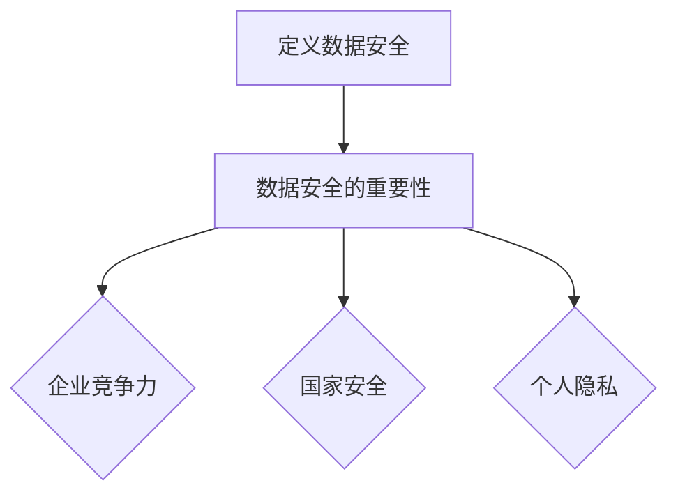

#### 1.2 数据安全的发展历程

数据安全的发展历程可以追溯到计算机网络的诞生。随着信息技术的发展，数据安全也逐渐演变成一门独立的学科。从最初的简单加密技术到现代复杂的安全架构，数据安全经历了多个阶段。

**Mermaid流程图：**

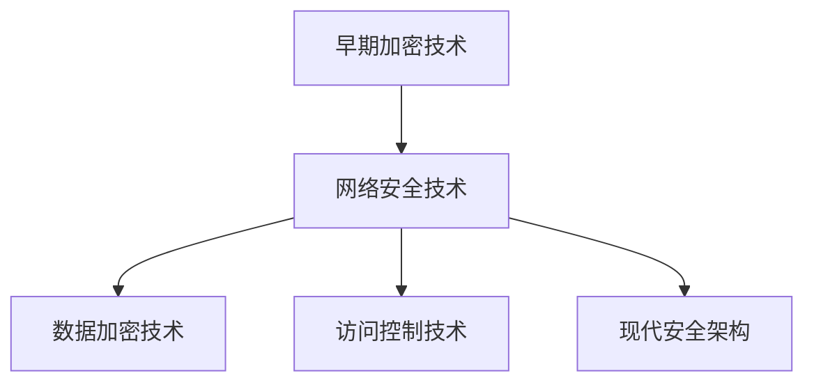

#### 1.3 AI时代的数据安全挑战

AI技术的快速发展给数据安全带来了新的挑战。首先，AI算法的复杂性和不透明性使得攻击者能够利用这些算法进行更高级别的攻击。其次，AI驱动的攻击手段更加隐蔽和智能化，传统的防御策略难以应对。此外，AI技术在数据隐私保护方面也面临诸多挑战。

**Mermaid流程图：**

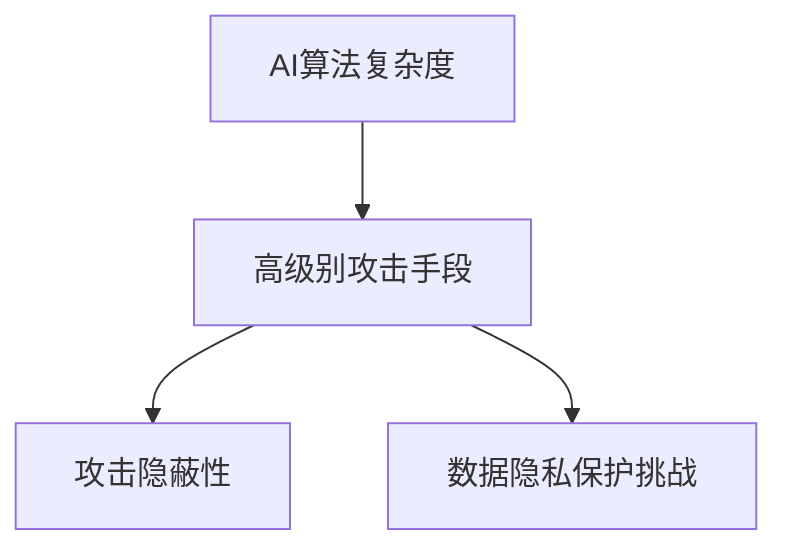

## 第2章：数据安全的威胁类型

### 2.1 数据泄露

数据泄露是指未经授权的人员非法访问、获取、使用、披露或传播敏感数据。数据泄露可能导致严重后果，包括财务损失、声誉损害和法律诉讼。

**核心算法原理讲解：**

数据泄露的防护可以通过以下算法实现：

```python
def data_leak_protection(data, key):
    encrypted_data = encrypt(data, key)
    return encrypted_data
```

#### 2.2 数据篡改

数据篡改是指未经授权的人员对数据进行非法修改，使其失去原始的真实性和完整性。数据篡改可能导致业务中断、经济损失和信誉受损。

**伪代码：**

```python
def data_tampering_detection(data, original_data):
    if data == original_data:
        return "Data is intact."
    else:
        return "Data has been tampered with."
```

#### 2.3 数据丢失

数据丢失是指由于各种原因（如硬件故障、自然灾害、人为错误等）导致数据永久性丧失。数据丢失可能导致业务中断、经济损失和不可挽回的数据损失。

**数学模型和公式：**

数据丢失的概率可以用以下公式表示：

$$ P(丢失) = P(硬件故障) + P(自然灾害) + P(人为错误) $$

#### 2.4 数据滥用

数据滥用是指未经授权的人员使用数据从事非法活动，如身份盗窃、欺诈等。数据滥用可能导致严重的法律后果和道德风险。

**举例说明：**

假设一个金融机构的客户数据被黑客窃取，黑客利用这些数据进行身份盗窃，导致客户遭受财务损失和声誉损害。这种情况属于数据滥用。

**Mermaid流程图：**

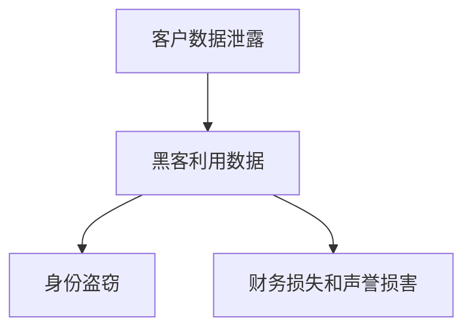

## 第3章：数据安全的防御策略

### 3.1 防火墙与入侵检测系统

防火墙和入侵检测系统是数据安全防御策略的基础。防火墙通过过滤网络流量来防止未经授权的访问，入侵检测系统则用于检测和响应恶意攻击。

**核心算法原理讲解：**

防火墙的核心算法是包过滤，通过检查数据包的源IP、目标IP、端口号等信息来决定是否允许通过。

```c
bool firewall_filter(packet) {
    if (packet.source_ip == "allowed_ip") {
        return true;
    }
    return false;
}
```

**Mermaid流程图：**

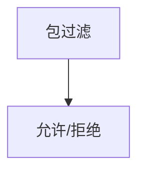

### 3.2 加密技术

加密技术是保护数据机密性的重要手段。通过加密，即使数据被窃取，攻击者也无法解读其内容。

**数学模型和公式：**

加密算法的核心是密钥生成和解密算法：

$$ C = E(K, P) $$
$$ P = D(K, C) $$

其中，$C$ 是密文，$P$ 是明文，$K$ 是密钥，$E$ 是加密函数，$D$ 是解密函数。

**Mermaid流程图：**

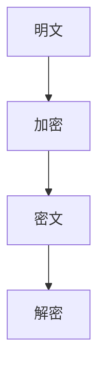

### 3.3 访问控制

访问控制是确保数据只能由授权用户访问的重要机制。通过访问控制列表（ACL）或角色访问控制（RBAC），可以精细管理数据访问权限。

**伪代码：**

```python
def access_control(user, data):
    if user.role == "admin":
        return "Access granted."
    else:
        return "Access denied."
```

### 3.4 数据备份与恢复

数据备份与恢复是应对数据丢失风险的重要措施。通过定期备份，可以在数据丢失后迅速恢复系统。

**数学模型和公式：**

备份频率与数据丢失概率的关系可以用以下公式表示：

$$ P(丢失) = 1 - (1 - P(备份成功))^n $$

其中，$n$ 是备份次数，$P(备份成功)$ 是每次备份成功的概率。

**Mermaid流程图：**

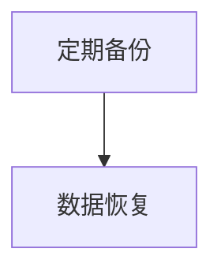

## 第二部分：AI技术对数据安全的威胁与应对

### 第4章：AI技术对数据安全的影响

#### 4.1 AI算法的脆弱性

AI算法的脆弱性使得它们容易受到攻击。例如，对抗性攻击（adversarial attacks）可以通过对输入数据的微小修改来欺骗AI模型，导致错误预测。

**核心算法原理讲解：**

对抗性攻击的核心是找到一种方法，对输入数据进行微小的扰动，使其在人类看来不可察觉，但能够大幅改变模型的输出。

```python
def adversarial_attack(input_data, model):
    perturbed_data = add_noise(input_data)
    prediction = model(perturbed_data)
    return prediction
```

#### 4.2 AI驱动的攻击手段

AI驱动的攻击手段利用AI技术进行更高级别的攻击。例如，自动化的漏洞挖掘工具可以快速识别系统的弱点，进行针对性的攻击。

**伪代码：**

```python
def ai_driven_attack(target_system, model):
    vulnerabilities = model.find_vulnerabilities(target_system)
    for vulnerability in vulnerabilities:
        exploit(vulnerability)
```

#### 4.3 AI算法的透明性与解释性

AI算法的透明性和解释性是数据安全的重大挑战。当前许多AI模型是黑盒模型，攻击者无法了解其内部工作机制，从而难以制定有效的防御策略。

**Mermaid流程图：**

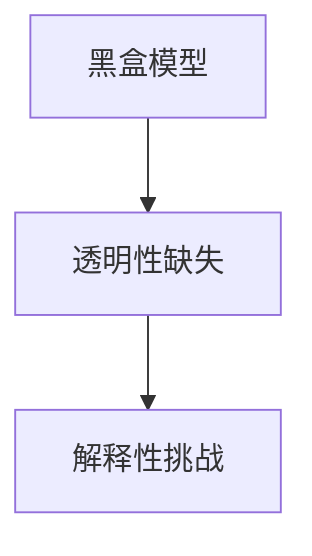

### 第5章：AI时代的隐私保护

#### 5.1 数据隐私保护的基本概念

数据隐私保护是指保护个人和组织的敏感信息不被未经授权的访问和泄露。在AI时代，数据隐私保护面临新的挑战，需要采用更高级别的技术来保护数据。

**核心算法原理讲解：**

数据隐私保护的核心是差分隐私（differential privacy），它通过在数据集上添加噪声来保护个体的隐私。

```python
def privacy_preserving_report(data, epsilon):
    noise = add_noise(data, epsilon)
    report = aggregate(noise)
    return report
```

#### 5.2 隐私保护算法

隐私保护算法包括差分隐私算法、安全多方计算（MPC）和同态加密等。这些算法能够在保护隐私的同时，实现数据的分析和计算。

**伪代码：**

```python
def secure_computation(data, algorithm):
    encrypted_data = encrypt(data)
    result = algorithm(encrypted_data)
    decrypted_result = decrypt(result)
    return decrypted_result
```

#### 5.3 隐私保护的法律法规

隐私保护的法律法规是数据隐私保护的重要保障。各国纷纷出台相关法律法规，加强对数据隐私的保护。

**Mermaid流程图：**

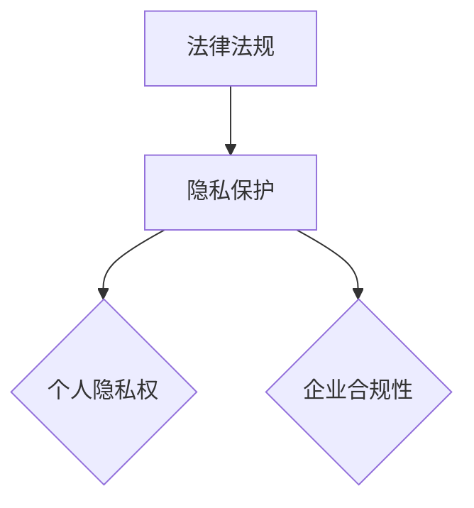

### 第6章：AI驱动的安全防御机制

#### 6.1 自动化安全监控

自动化安全监控利用AI技术实时监测网络流量和系统行为，及时发现并响应潜在的安全威胁。

**核心算法原理讲解：**

自动化安全监控的核心是异常检测算法，如孤立森林（Isolation Forest）和自组织映射（Self-Organizing Map）。

```python
def anomaly_detection(data, model):
    predictions = model.predict(data)
    anomalies = data[predictions == "anomaly"]
    return anomalies
```

#### 6.2 智能威胁响应

智能威胁响应利用AI技术自动识别和应对安全威胁，减少人工干预。

**伪代码：**

```python
def threat_response(threat, model):
    response = model.generate_response(threat)
    execute_response(response)
```

#### 6.3 基于AI的漏洞评估与修复

基于AI的漏洞评估与修复利用AI技术自动识别和修复系统漏洞，提高系统的安全性。

**数学模型和公式：**

漏洞评估的核心是漏洞优先级计算：

$$ P(漏洞) = f(漏洞严重性, 漏洞利用难度) $$

**Mermaid流程图：**

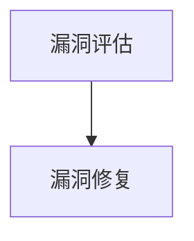

### 第7章：AI时代的数据安全最佳实践

#### 7.1 数据安全策略规划

数据安全策略规划是确保数据安全的关键步骤。它包括风险评估、安全策略制定和安全措施实施。

**核心算法原理讲解：**

风险评估的核心是风险计算：

$$ Risk = Threat \times Vulnerability \times Impact $$

**伪代码：**

```python
def risk_assessment(threat, vulnerability, impact):
    risk = threat * vulnerability * impact
    return risk
```

**Mermaid流程图：**

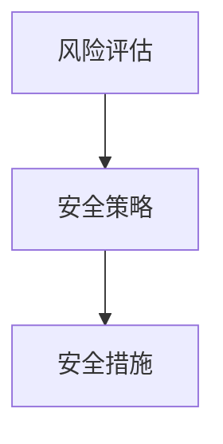

#### 7.2 数据安全教育与培训

数据安全教育与培训是提高组织内部数据安全意识和技能的重要手段。通过培训，员工能够更好地理解和应对数据安全挑战。

**伪代码：**

```python
def data_security_training(employee):
    knowledge = acquire_knowledge(employee)
    test = conduct_test(knowledge)
    certification = grant_certificate(test)
    return certification
```

#### 7.3 数据安全评估与审计

数据安全评估与审计是确保数据安全策略实施效果的重要手段。通过定期评估和审计，可以发现潜在的安全漏洞并采取措施进行修复。

**数学模型和公式：**

安全审计的核心是合规性评估：

$$ Compliance = (Actual\_Implementation / Required\_Implementation) \times 100\% $$

**Mermaid流程图：**

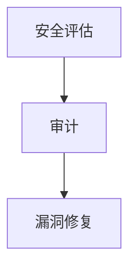

## 第三部分：AI时代的全球数据安全合作

### 第8章：全球数据安全合作现状

#### 8.1 全球数据安全政策分析

全球数据安全政策分析关注各国数据安全政策的制定和实施，以及这些政策对全球数据安全格局的影响。

**核心概念与联系：**

全球数据安全政策涉及以下几个方面：

- **数据保护法**：如欧盟的《通用数据保护条例》（GDPR）
- **网络安全法**：如美国的《网络安全信息共享法》（CISA）
- **数据跨境传输法规**：如《跨国数据传输协议》

**Mermaid流程图：**

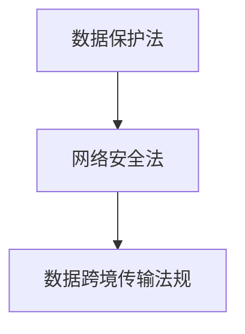

#### 8.2 国际数据安全合作机制

国际数据安全合作机制涉及多国合作，旨在制定统一的数据安全标准，推动全球数据安全合作。

**核心算法原理讲解：**

国际数据安全合作机制的核心是建立数据安全共享平台，实现各国数据的实时共享和分析。

```python
def data_security_cooperation(country1, country2):
    shared_data = share_data(country1, country2)
    analyzed_data = analyze_data(shared_data)
    return analyzed_data
```

**Mermaid流程图：**

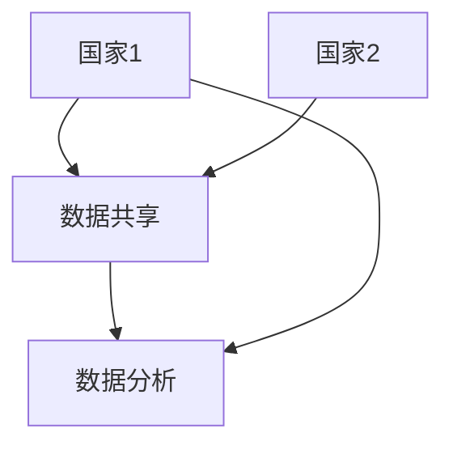

#### 8.3 跨国数据安全挑战

跨国数据安全挑战包括数据跨境传输、数据隐私保护、数据主权等问题。解决这些挑战需要全球合作和制定统一的标准。

**数学模型和公式：**

跨国数据安全挑战的解决可以用以下公式表示：

$$ Solution = Collaboration \times Standardization \times Regulation $$

**Mermaid流程图：**

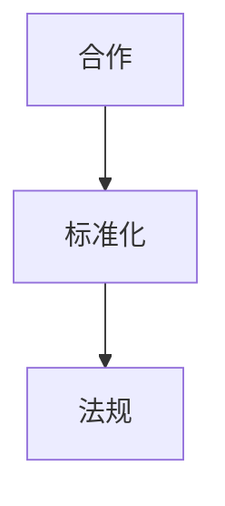

### 第9章：中国数据安全法规与政策

#### 9.1 《网络安全法》概述

《网络安全法》是中国网络安全的基本法，旨在保护网络空间主权和国家安全、社会公共利益，保障公民、法人和其他组织的合法权益。

**核心概念与联系：**

《网络安全法》的主要内容包括：

- **网络安全等级保护**：要求关键信息基础设施的运营者按照相关标准进行安全保护。
- **个人信息保护**：规定了个人信息的收集、存储、使用、处理、传输等环节的保护要求。

**Mermaid流程图：**

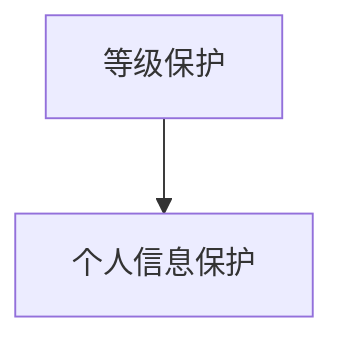

#### 9.2 《个人信息保护法》解读

《个人信息保护法》是中国个人信息保护的基本法，旨在规范个人信息处理活动，保护个人信息权益。

**核心概念与联系：**

《个人信息保护法》的主要内容包括：

- **个人信息定义**：明确了个人信息的概念和范围。
- **个人信息处理规则**：规定了个人信息处理的原则、程序和责任。

**Mermaid流程图：**

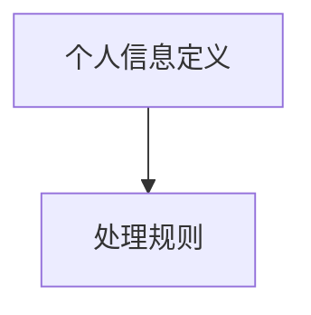

#### 9.3 《数据安全法》分析

《数据安全法》是中国数据安全的基本法，旨在加强数据安全保护，维护国家安全和社会公共利益。

**核心概念与联系：**

《数据安全法》的主要内容包括：

- **数据分类分级**：根据数据的重要性对数据进行分类和分级保护。
- **数据安全保护措施**：规定了数据安全保护的技术和管理措施。

**Mermaid流程图：**

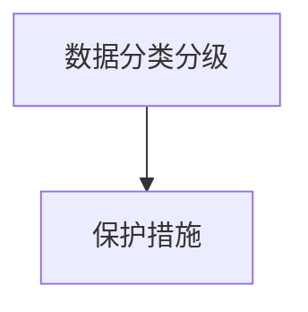

### 第10章：国际数据安全合作展望

#### 10.1 国际数据安全合作趋势

国际数据安全合作趋势包括：

- **数据主权**：各国加强对本国数据的保护，推动数据主权。
- **跨境数据传输**：探索建立跨境数据传输的监管机制。
- **标准统一**：推动国际数据安全标准的统一。

**核心算法原理讲解：**

国际数据安全合作趋势的核心是建立统一的数据安全标准和合作机制。

```python
def international Cooperation(trend1, trend2):
    standardization = merge_standards(trend1, trend2)
    cooperation = establish_mechanism(standardization)
    return cooperation
```

**Mermaid流程图：**

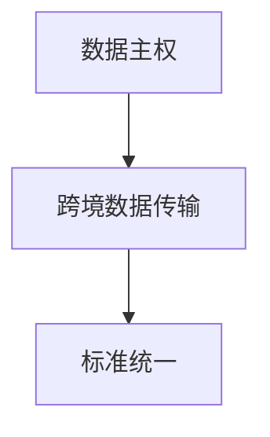

#### 10.2 跨国数据安全合作的挑战与机遇

跨国数据安全合作的挑战包括：

- **数据主权冲突**：不同国家对于数据安全的理解和保护力度不同，可能产生冲突。
- **技术差异**：不同国家的技术水平和安全能力存在差异，影响合作效果。

跨国数据安全合作的机遇包括：

- **共同应对全球威胁**：通过合作，各国可以共同应对网络攻击、数据泄露等全球性威胁。
- **技术交流与进步**：通过合作，各国可以共享技术成果，推动数据安全技术的发展。

**数学模型和公式：**

跨国数据安全合作的挑战与机遇可以用以下公式表示：

$$ Challenge = Conflict + Technical\_Difference $$
$$ Opportunity = Collaboration + Technical\_Exchange $$

**Mermaid流程图：**

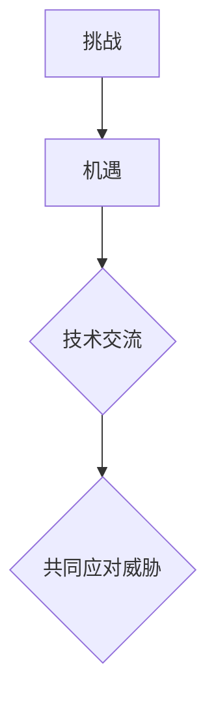

#### 10.3 中国在国际数据安全合作中的角色与责任

中国在国际数据安全合作中扮演着重要角色，应承担以下责任：

- **推动标准统一**：积极参与国际数据安全标准的制定，推动全球数据安全合作。
- **加强技术合作**：与其他国家分享数据安全技术成果，推动技术进步。
- **维护数据主权**：坚决维护本国数据主权，确保数据安全。

**核心算法原理讲解：**

中国在国际数据安全合作中的角色可以用以下公式表示：

$$ Role = Standardization + Technical\_Collaboration + Sovereignty $$

**Mermaid流程图：**

```mermaid
graph TD
    A[推动标准] --> B[加强技术合作]
    B --> C[维护数据主权]
```

## 附录

### 附录A：数据安全相关资源与工具

**附录A.1 数据安全相关的法律法规**

- 《网络安全法》
- 《个人信息保护法》
- 《数据安全法》

**附录A.2 数据安全工具与软件**

- 防火墙
- 入侵检测系统
- 加密软件
- 数据备份与恢复工具

**附录A.3 数据安全研究机构与组织**

- 国家网络安全等级保护机制
- 国际数据安全合作组织
- 美国国家标准与技术研究院（NIST）

### 附录B：参考文献

- GDPR - https://www.eugdpr.org/
- CISA - https://www.cisa.gov/
- NIST - https://www.nist.gov/

**作者：AI天才研究院/AI Genius Institute & 禅与计算机程序设计艺术 /Zen And The Art of Computer Programming**

