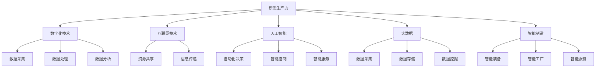
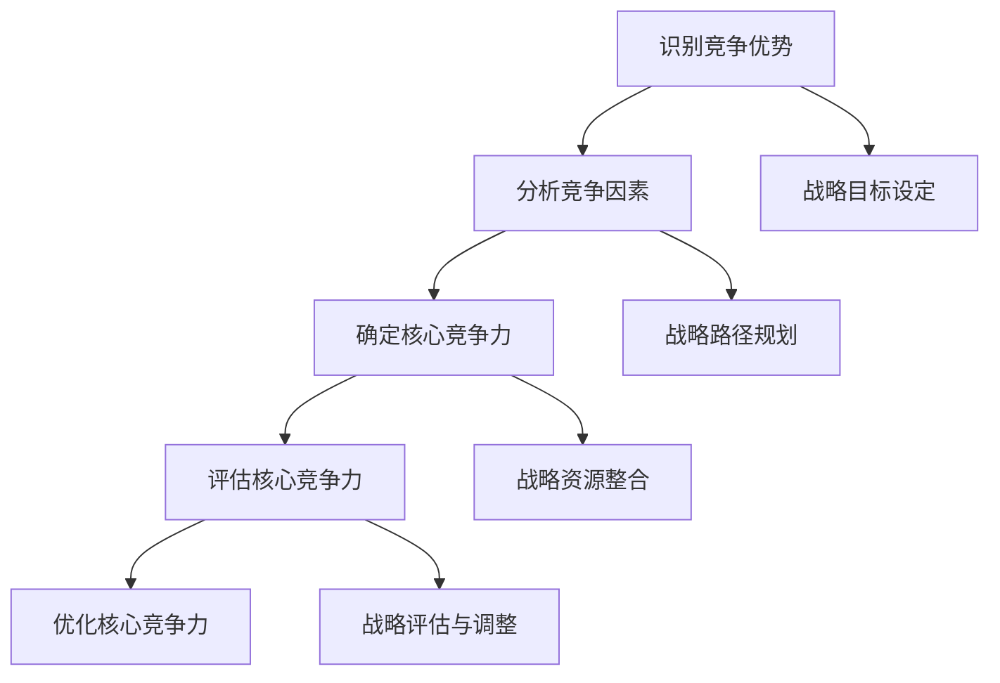

                 

## 《新质生产力提升核心竞争力》

### 关键词：新质生产力、核心竞争力、数字化、创新、智能制造、大数据、互联网+

> **摘要：**
本文深入探讨新质生产力在现代信息技术驱动下的形成与发展，分析其在提升企业核心竞争力中的关键作用。通过对新质生产力的概念界定、特征分析、关键技术应用以及实践案例的详细剖析，本文揭示了新质生产力在现代企业战略规划、创新驱动、资源整合等方面的实际应用路径。同时，本文对未来新质生产力的发展趋势进行了展望，并提出了一系列提升核心竞争力的对策建议。

### 目录大纲

- **第一部分：新质生产力的概念与特点**
  - 第1章：新质生产力的定义与背景
  - 第2章：新质生产力的关键技术
  - 第3章：新质生产力的实践与案例分析

- **第二部分：新质生产力提升核心竞争力的路径**
  - 第4章：战略规划与核心竞争力的构建
  - 第5章：创新驱动与竞争力提升
  - 第6章：资源整合与核心竞争力

- **第三部分：新质生产力提升核心竞争力的实践应用**
  - 第7章：新质生产力提升核心竞争力的实施策略
  - 第8章：新质生产力提升核心竞争力的案例分析
  - 第9章：新质生产力提升核心竞争力的未来趋势

- **附录**
  - 附录A：相关资源与工具
  - 附录B：核心概念与联系
  - 附录C：核心算法原理讲解
  - 附录D：数学模型与公式
  - 附录E：项目实战

---

在接下来的内容中，我们将逐步展开对新质生产力的探讨，深入分析其概念、特点、应用路径和实践案例，旨在为读者提供一部全面、系统、深入的技术博客文章。

## 第一部分：新质生产力的概念与特点

### 第1章：新质生产力的定义与背景

#### 1.1 新质生产力的起源与发展

新质生产力是指以信息技术为核心驱动力，通过数字化、网络化、智能化等手段，实现生产方式、生产组织、产品形态和生产关系的变革，从而大幅提升社会生产效率和竞争力的新型生产力形态。

新质生产力的起源可以追溯到20世纪后半叶，随着计算机技术的飞速发展，信息技术逐渐成为推动生产力发展的核心力量。特别是互联网的普及，大数据、人工智能等前沿技术的不断突破，使得新质生产力得以快速发展，并逐渐成为现代经济发展的关键动力。

#### 1.2 新质生产力的核心要素

新质生产力的核心要素主要包括以下几个方面：

1. **数字化技术**：数字化技术是推动新质生产力发展的基础，包括数据采集、存储、处理、分析等环节，是实现生产过程数字化、智能化的重要手段。
   
2. **互联网技术**：互联网技术是连接人与人、人与物、物与物的重要桥梁，通过互联网可以实现资源的共享、信息的快速传递和协同工作。

3. **人工智能**：人工智能是推动新质生产力发展的重要引擎，通过模拟人类智能，实现自动化决策、智能控制、智能服务等，可以大幅提高生产效率和产品质量。

4. **大数据**：大数据技术是实现数据驱动的关键，通过对海量数据的收集、存储、分析和应用，可以发现新的商业模式、优化生产流程、提升产品质量。

5. **智能制造**：智能制造是信息技术与制造业深度融合的产物，通过智能装备、智能工厂、智能服务等，实现生产过程的自动化、智能化和高效化。

#### 1.3 新质生产力的特征分析

新质生产力具有以下几个显著特征：

1. **高度智能化**：新质生产力以人工智能为核心，通过智能化技术实现生产过程的自动化、智能化，大幅提高生产效率和产品质量。

2. **高度数字化**：新质生产力以数字化技术为基础，通过数据采集、处理、分析等手段，实现生产过程的全面数字化，为数据驱动提供了坚实基础。

3. **高度协同化**：新质生产力通过互联网技术实现各生产环节的紧密协同，打破传统生产组织的边界，实现资源的高效配置和利用。

4. **高度个性化**：新质生产力以客户需求为导向，通过个性化定制、个性化服务等方式，满足客户的多样化需求，提升客户满意度。

5. **高度绿色化**：新质生产力注重环保和可持续发展，通过绿色制造、节能减排等技术手段，降低生产过程的能耗和污染。

### 总结

本章对新质生产力的概念、起源与发展、核心要素和特征进行了详细分析。新质生产力作为一种新型生产力形态，以数字化、网络化、智能化为特征，成为现代经济发展的关键动力。在下一章中，我们将进一步探讨新质生产力的关键技术，分析其在提升生产力中的具体应用。

---

在第一章中，我们介绍了新质生产力的概念、起源、核心要素和特征。在新质生产力的发展过程中，数字化技术、互联网技术、人工智能、大数据和智能制造等关键技术起到了至关重要的作用。这些关键技术共同推动了新质生产力的形成，使其在高度智能化、数字化、协同化、个性化、绿色化等方面表现出独特的优势。

新质生产力的核心要素和特征不仅揭示了其作为一种新型生产力的本质特征，更为我们理解和应用新质生产力提供了理论依据。在下一章中，我们将深入探讨新质生产力的关键技术，分析这些技术在提升生产力中的具体应用，为后续章节的内容打下坚实的基础。

## 第2章：新质生产力的关键技术

在第一章中，我们介绍了新质生产力的概念、起源、核心要素和特征。新质生产力作为一种新型生产力形态，以数字化、网络化、智能化为特征，成为现代经济发展的关键动力。在本章中，我们将进一步探讨新质生产力的关键技术，分析这些技术在提升生产力中的具体应用。

### 2.1 数据驱动与人工智能

数据驱动和人工智能是新质生产力的核心关键技术，它们在提升生产力方面发挥着重要作用。

#### 2.1.1 数据驱动

数据驱动是指以数据为核心，通过数据采集、处理、分析和应用等手段，实现生产过程的优化和决策的科学化。数据驱动的主要特点包括：

1. **数据采集**：通过传感器、物联网等技术手段，实现生产过程中各种数据的实时采集，为数据分析和应用提供基础。

2. **数据处理**：通过对海量数据进行清洗、转换、存储等处理，确保数据的质量和准确性，为后续分析提供可靠的数据支持。

3. **数据分析**：利用大数据分析技术，对海量数据进行深入挖掘，发现数据之间的关联和规律，为生产优化和决策提供依据。

4. **数据应用**：将分析结果应用于生产过程的各个环节，如生产调度、质量控制、供应链管理等，实现生产效率的提升和成本的降低。

#### 2.1.2 人工智能

人工智能是指模拟人类智能的技术，通过机器学习、深度学习、自然语言处理等算法，实现自动化决策、智能控制、智能服务等。人工智能在提升生产力方面具有以下优势：

1. **自动化决策**：通过人工智能算法，实现生产过程中的自动化决策，减少人为干预，提高决策的准确性和效率。

2. **智能控制**：利用人工智能技术，实现生产设备的智能监控和控制，提高生产过程的稳定性和安全性。

3. **智能服务**：通过人工智能技术，实现个性化服务、智能客服等，提高客户满意度和用户体验。

#### 2.1.3 数据驱动与人工智能的结合

数据驱动与人工智能的结合，是新质生产力提升生产力的关键。数据驱动提供了大量的数据资源，为人工智能算法的应用提供了基础；而人工智能则通过对数据的分析和处理，实现了生产过程的优化和决策的科学化。具体来说，数据驱动与人工智能的结合表现在以下几个方面：

1. **数据采集与智能分析**：通过传感器和物联网技术，实现生产过程中各种数据的实时采集；利用人工智能算法，对采集到的数据进行分析和处理，实现生产过程的实时监控和优化。

2. **生产优化与智能决策**：基于数据分析结果，利用人工智能技术，实现生产过程的优化和决策，提高生产效率和产品质量。

3. **智能装备与智能工厂**：通过人工智能技术，实现生产设备的智能监控和控制，建设智能工厂，实现生产过程的自动化和智能化。

### 2.2 大数据技术在生产力提升中的应用

大数据技术在新质生产力提升生产力方面具有广泛的应用，主要包括以下几个方面：

#### 2.2.1 大数据分析

大数据分析是指通过对海量数据进行深度挖掘和分析，发现数据之间的关联和规律，为生产优化和决策提供依据。大数据分析的主要应用包括：

1. **市场需求预测**：通过对销售数据、市场调查数据等进行分析，预测市场需求趋势，为生产计划制定提供参考。

2. **产品质量分析**：通过对产品质量数据进行分析，识别产品质量问题，优化生产工艺和质量控制措施。

3. **供应链优化**：通过对供应链各环节的数据进行分析，优化供应链管理，提高供应链的效率和灵活性。

#### 2.2.2 大数据应用

大数据应用是指将大数据分析的结果应用于生产过程的各个环节，实现生产优化和效率提升。大数据应用的主要应用包括：

1. **生产调度**：通过大数据分析，实现生产计划的智能调度，提高生产效率和设备利用率。

2. **质量控制**：通过大数据分析，实现对产品质量的实时监控和预警，确保产品质量稳定。

3. **客户服务**：通过大数据分析，实现个性化服务，提高客户满意度和忠诚度。

### 2.3 互联网+与产业升级

互联网+是指通过互联网技术，实现传统产业的升级和转型。互联网+在新质生产力提升生产力方面具有以下优势：

#### 2.3.1 产业升级

互联网+通过信息技术与产业的深度融合，推动传统产业的升级和转型，实现生产方式、生产组织、产品形态和生产关系的变革。互联网+的主要应用包括：

1. **智能制造**：通过互联网技术，实现生产设备的智能监控和控制，建设智能工厂，实现生产过程的自动化和智能化。

2. **电子商务**：通过互联网平台，实现商品交易和流通的数字化，提高交易效率和市场覆盖率。

3. **在线教育**：通过互联网技术，实现教育资源的在线共享和互动，提高教育质量和普及率。

#### 2.3.2 产业协同

互联网+通过打破传统产业之间的边界，实现产业之间的协同和合作，提高产业链的整体效率和竞争力。互联网+的主要应用包括：

1. **供应链协同**：通过互联网技术，实现供应链各环节的信息共享和协同，提高供应链的效率和灵活性。

2. **跨界合作**：通过互联网技术，实现不同产业之间的跨界合作，推动产业链的创新和发展。

3. **平台经济**：通过互联网技术，构建产业服务平台，实现资源的共享和整合，提高产业链的协同效应。

### 总结

本章详细介绍了新质生产力的关键技术，包括数据驱动与人工智能、大数据技术在生产力提升中的应用、互联网+与产业升级。这些关键技术在提升生产力方面具有重要作用，为新质生产力的形成和发展提供了技术支撑。在下一章中，我们将探讨新质生产力的实践与案例分析，进一步揭示新质生产力的实际应用效果。

---

在第二章中，我们详细介绍了新质生产力的关键技术，包括数据驱动与人工智能、大数据技术在生产力提升中的应用以及互联网+与产业升级。这些关键技术不仅为新质生产力的形成和发展提供了技术支撑，也在实际应用中展示了强大的推动力。

数据驱动与人工智能通过实现生产过程的自动化、智能化，大幅提高了生产效率和产品质量。大数据技术在生产优化、供应链管理、市场需求预测等方面发挥了重要作用，为生产决策提供了科学依据。互联网+则通过推动传统产业的升级和转型，实现了产业协同和跨界合作，为产业链的整体效率和竞争力提升提供了新路径。

这些关键技术的综合应用，使得新质生产力在提升生产力方面具有显著优势。在下一章中，我们将结合实践案例，进一步探讨新质生产力的实际应用效果，为读者提供更加具体的参考和启示。

## 第3章：新质生产力的实践与案例分析

在前两章中，我们详细介绍了新质生产力的概念、特点、关键技术以及实际应用。通过深入分析新质生产力的构成和优势，我们可以看到，新质生产力已经成为现代经济发展的重要驱动力。在本章中，我们将结合具体案例，探讨新质生产力的实践应用效果，进一步揭示其在提升核心竞争力方面的作用。

### 3.1 案例一：数字化农业实践

数字化农业是信息技术与农业产业深度融合的产物，通过应用大数据、物联网、人工智能等技术，实现农业生产、管理、服务的数字化，提升农业生产效率和质量。

**案例背景：**

随着人口增长和资源紧张，农业生产面临着巨大的压力。为了提高农业生产效率，我国积极推动数字化农业的发展，通过引进新技术、新模式，实现农业的转型升级。

**案例分析：**

1. **智能监测系统：** 通过传感器和物联网技术，实现对农田土壤湿度、温度、光照等环境参数的实时监测，为农业生产提供科学依据。

2. **精准施肥：** 基于大数据分析，结合农田土壤和作物生长情况，实现精准施肥，降低生产成本，提高肥料利用率。

3. **智能灌溉：** 利用物联网技术，实现灌溉系统的自动化控制，根据土壤湿度和天气预报，合理调控灌溉水量，提高水资源利用率。

4. **病虫害预警：** 通过大数据分析和人工智能算法，实现对病虫害的实时监测和预警，及时采取防治措施，减少作物损失。

**案例效果：**

通过数字化农业的实践，农业生产效率显著提高，资源利用率大幅提升，农产品质量得到保障。同时，数字化农业还推动了农业产业链的整合，促进了农村经济的转型升级。

### 3.2 案例二：智能制造案例分析

智能制造是信息技术与制造业深度融合的产物，通过应用物联网、大数据、人工智能等技术，实现生产过程的自动化、智能化，提升生产效率和产品质量。

**案例背景：**

随着市场竞争的加剧，制造业面临着成本上升、效率低下、产品质量不稳定等问题。为了提升竞争力，我国积极推进智能制造的发展，推动制造业转型升级。

**案例分析：**

1. **智能工厂建设：** 通过自动化生产线、智能装备、智能仓储等，实现生产过程的自动化和高效化，减少人工干预，提高生产效率。

2. **大数据分析：** 基于大数据技术，对生产过程的各种数据进行实时采集、分析和处理，实现对生产过程的实时监控和优化，提高生产质量和效率。

3. **质量检测与预警：** 通过智能检测设备，实现对产品质量的实时监测和预警，及时发现并解决质量问题，确保产品质量稳定。

4. **智能物流：** 利用物联网技术，实现物流过程的实时监控和优化，提高物流效率，降低物流成本。

**案例效果：**

通过智能制造的实践，生产效率大幅提升，产品质量得到保障，生产成本显著降低。同时，智能制造还推动了产业升级，促进了制造业的可持续发展。

### 3.3 案例三：共享经济模式探索

共享经济是一种基于互联网平台的新型经济模式，通过资源共享，提高资源利用效率，满足消费者多样化需求。

**案例背景：**

随着消费观念的转变和资源紧张，共享经济逐渐兴起。通过共享经济模式，可以有效解决资源浪费、效率低下等问题，满足人们的多样化需求。

**案例分析：**

1. **共享出行：** 通过共享出行平台，实现车辆的共享，提高车辆利用率，降低出行成本，满足人们的出行需求。

2. **共享住宿：** 通过共享住宿平台，实现房屋的共享，提高房屋利用率，降低住宿成本，满足人们的住宿需求。

3. **共享办公：** 通过共享办公平台，实现办公空间的共享，降低创业成本，提高资源利用效率，满足创业者的需求。

**案例效果：**

通过共享经济模式的实践，资源利用效率显著提高，消费者满意度得到提升。同时，共享经济还推动了产业创新和发展，为经济增长注入新动力。

### 总结

本章通过三个具体案例，展示了新质生产力的实际应用效果。无论是数字化农业、智能制造还是共享经济，新质生产力都在提升核心竞争力方面发挥了重要作用。通过新技术、新模式的应用，这些案例不仅提高了生产效率、降低了成本，还推动了产业的转型升级和创新发展。在下一章中，我们将进一步探讨新质生产力提升核心竞争力的路径，为读者提供更多实践经验和策略建议。

---

在第三章中，我们通过三个具体案例，展示了新质生产力的实际应用效果。无论是数字化农业、智能制造还是共享经济，新质生产力都在提升核心竞争力方面发挥了重要作用。通过新技术、新模式的应用，这些案例不仅提高了生产效率、降低了成本，还推动了产业的转型升级和创新发展。

数字化农业通过智能监测、精准施肥、智能灌溉和病虫害预警等手段，实现了农业生产的高效化和可持续发展。智能制造通过智能工厂建设、大数据分析、质量检测与预警和智能物流等，提高了生产效率、保证了产品质量，推动了制造业的转型升级。共享经济通过共享出行、共享住宿和共享办公等，提高了资源利用效率，满足了人们的多样化需求，为经济增长注入了新动力。

这些案例充分说明了新质生产力在实际应用中的巨大潜力和价值。在下一章中，我们将进一步探讨新质生产力提升核心竞争力的路径，为读者提供更多实践经验和策略建议。通过深入研究和分析，我们希望为企业和产业发展提供有力支持，推动新质生产力的全面应用和普及。

## 第二部分：新质生产力提升核心竞争力的路径

### 第4章：战略规划与核心竞争力的构建

在新质生产力迅猛发展的背景下，企业如何制定有效的战略规划，构建核心竞争力，已成为亟待解决的重要问题。本章将探讨战略规划的核心原则、核心竞争力分析框架以及新质生产力在战略规划中的定位，为企业在新时代背景下提升竞争力提供理论指导和实践建议。

#### 4.1 企业战略规划框架

企业战略规划是一个系统性、长期性的过程，涉及企业愿景、使命、目标以及实现这些目标的策略和方法。一个有效的战略规划框架应包括以下关键要素：

1. **企业愿景**：明确企业的发展方向和长期目标，激发员工和合作伙伴的共同努力。
   
2. **企业使命**：阐述企业的核心价值和存在的意义，指导企业的日常运营和决策。
   
3. **战略目标**：根据企业愿景和使命，设定可量化、具体、有时限的短期和长期目标。
   
4. **战略路径**：制定实现战略目标的步骤和方法，包括市场定位、产品开发、技术创新、人力资源等关键领域。
   
5. **战略资源**：明确实现战略目标所需的关键资源，包括资金、技术、人才、市场等。

6. **战略评估与调整**：定期评估战略实施效果，根据市场变化和竞争态势进行调整。

#### 4.2 核心竞争力分析框架

核心竞争力是指企业在长期经营过程中形成的，能够持续保持竞争优势的关键能力。一个有效的核心竞争力分析框架应包括以下步骤：

1. **识别竞争优势**：分析企业在市场中的竞争优势，包括产品或服务的独特性、市场地位、客户关系等。

2. **分析竞争因素**：评估影响企业竞争力的关键因素，包括市场需求、竞争对手、技术发展趋势等。

3. **确定核心竞争力**：根据竞争优势和竞争因素，识别企业最具竞争优势的核心能力。

4. **评估核心竞争力**：对核心竞争力的强度、稳定性、可持续性进行评估，确保其能够为企业带来长期竞争优势。

5. **优化核心竞争力**：通过技术创新、管理模式优化、人才培养等手段，不断提升核心竞争力的水平。

#### 4.3 新质生产力在战略规划中的定位

新质生产力作为现代信息技术与产业深度融合的产物，在企业战略规划中具有重要的地位。新质生产力不仅能够提升企业的生产效率，还能够为企业构建核心竞争力提供强有力的支持。新质生产力在战略规划中的定位主要体现在以下几个方面：

1. **技术创新驱动**：新质生产力以技术创新为核心，推动企业不断进行产品和服务创新，提升市场竞争力。

2. **数字化转型升级**：新质生产力推动企业实现数字化转型升级，通过大数据、物联网、人工智能等技术的应用，提高企业的生产效率和运营效率。

3. **产业链协同优化**：新质生产力通过互联网和大数据技术的应用，实现产业链各环节的协同优化，提高产业链的整体效率和竞争力。

4. **商业模式创新**：新质生产力推动企业商业模式创新，通过共享经济、平台经济等新模式，拓展市场空间，提升企业盈利能力。

5. **人才培养与引进**：新质生产力对人才的需求提出了新的要求，企业应通过人才培养和引进，打造一支具备创新能力和技术素养的团队。

### 总结

本章从企业战略规划框架、核心竞争力分析框架以及新质生产力在战略规划中的定位三个方面，探讨了新质生产力提升核心竞争力的路径。企业应通过制定科学的战略规划，识别和构建核心竞争力，充分发挥新质生产力的作用，实现持续发展和竞争优势。在下一章中，我们将进一步探讨创新驱动与竞争力提升，为企业在新时代背景下提升竞争力提供更多实践经验和策略建议。

---

在第四章中，我们探讨了新质生产力在企业战略规划与核心竞争力构建中的关键作用。通过构建科学的战略规划框架和核心竞争力分析框架，企业能够更好地识别和利用新质生产力，实现技术创新、数字化转型升级、产业链协同优化、商业模式创新和人才培养与引进。这些措施将为企业构建强大的核心竞争力提供有力支持，助力企业在激烈的市场竞争中脱颖而出。

新质生产力在战略规划中的定位，不仅为企业提供了技术支持和创新动力，还推动了企业的全面变革和可持续发展。通过技术创新驱动、数字化转型升级、产业链协同优化、商业模式创新和人才培养与引进，企业能够不断提升自身的核心竞争力，实现长期发展和持续竞争优势。

在下一章中，我们将进一步探讨创新驱动与竞争力提升，分析创新模式与机制、创新体系建设以及创新成果的转化与推广，为读者提供更多实践经验和策略建议，助力企业在新时代背景下实现创新驱动和竞争力提升。

## 第5章：创新驱动与竞争力提升

在新质生产力不断发展的背景下，创新驱动已成为提升企业核心竞争力的重要路径。本章将探讨创新模式与机制、创新体系建设以及创新成果的转化与推广，旨在为企业提供有效的创新策略和实施路径，助力企业在激烈的市场竞争中脱颖而出。

### 5.1 创新模式与机制

创新模式与机制是企业进行创新活动的基础，直接影响创新的效率和质量。以下是一些常见的创新模式与机制：

#### 5.1.1 基于技术的创新模式

1. **颠覆性创新**：颠覆性创新是指通过引入全新技术或商业模式，颠覆现有市场格局，创造新的市场需求。例如，智能手机的普及颠覆了传统手机市场。

2. **渐进性创新**：渐进性创新是指在现有技术基础上，逐步改进和优化，提升产品或服务的性能和用户体验。例如，智能手机的处理器性能不断升级，提升使用体验。

#### 5.1.2 基于市场的创新模式

1. **需求驱动创新**：以市场需求为导向，针对客户需求进行产品或服务创新。例如，共享单车企业通过分析用户出行需求，推出共享单车服务。

2. **竞争驱动创新**：以竞争对手的产品或服务为参考，通过对比分析和优化，提升自身竞争力。例如，企业通过研究竞争对手的产品功能，优化自己的产品特性。

#### 5.1.3 创新机制

1. **创新激励机制**：建立完善的创新激励机制，鼓励员工提出创新建议，并给予相应的奖励。例如，设立创新奖金、股权激励等。

2. **创新资源共享机制**：通过内部资源共享，促进跨部门、跨领域的创新合作。例如，建立创新实验室、跨部门项目组等。

3. **创新风险控制机制**：对创新项目进行风险评估和管理，确保创新活动的可持续性和稳健性。例如，设立创新风险基金，对高风险项目进行专项投资。

### 5.2 创新体系建设

创新体系建设是提升企业核心竞争力的重要保障。一个完善的创新体系应包括以下几个方面：

#### 5.2.1 创新文化

创新文化是企业创新活动的重要驱动力。企业应积极倡导创新精神，鼓励员工勇于探索和尝试，形成开放、包容、协作的创新氛围。

#### 5.2.2 创新组织

创新组织是企业进行创新活动的载体。企业应建立专门的创新组织，负责创新项目的策划、实施和推广。创新组织应具备跨部门、跨领域的协作能力。

#### 5.2.3 创新流程

创新流程是企业创新活动的基本规范。企业应建立完善的创新流程，包括项目立项、项目执行、项目评估等环节，确保创新活动的规范化和高效化。

#### 5.2.4 创新资源

创新资源是企业进行创新活动的基础。企业应充分调动内部资源，包括资金、技术、人才等，为创新活动提供有力支持。

#### 5.2.5 创新成果转化

创新成果转化是将创新成果转化为实际生产力和经济效益的关键环节。企业应建立完善的创新成果转化机制，促进创新成果的推广应用。

### 5.3 创新成果的转化与推广

创新成果的转化与推广是提升企业核心竞争力的重要手段。以下是一些有效的创新成果转化与推广策略：

#### 5.3.1 市场化推广

通过市场推广，将创新成果推向市场，实现商业价值。市场推广策略包括广告宣传、产品展示、渠道拓展等。

#### 5.3.2 产业合作

通过产业合作，将创新成果应用于产业链上下游企业，实现共赢发展。产业合作策略包括技术合作、项目合作、股权合作等。

#### 5.3.3 政策支持

利用政策支持，促进创新成果的转化与推广。政策支持策略包括财政补贴、税收优惠、专项资金等。

#### 5.3.4 人才培养

通过人才培养，提升企业创新能力和市场竞争力。人才培养策略包括内部培训、外部引进、校企合作等。

### 总结

创新驱动是提升企业核心竞争力的重要路径。企业应通过构建创新模式与机制、创新体系建设以及创新成果的转化与推广，实现持续创新和竞争优势。在下一章中，我们将进一步探讨资源整合与核心竞争力，为读者提供更多实践经验和策略建议。

---

在第五章中，我们深入探讨了创新驱动与竞争力提升的关键要素，包括创新模式与机制、创新体系建设以及创新成果的转化与推广。创新是企业发展的重要引擎，通过构建创新机制、创新体系和推广策略，企业能够不断提升核心竞争力，实现持续发展和竞争优势。

创新模式与机制包括颠覆性创新、渐进性创新、需求驱动创新和竞争驱动创新等多种模式，企业应根据自身特点和市场需求，灵活运用这些模式。创新体系建设则涵盖了创新文化、创新组织、创新流程、创新资源以及创新成果转化等方面，为企业创新活动提供全面保障。

创新成果的转化与推广是创新驱动的重要环节。通过市场化推广、产业合作、政策支持和人才培养等策略，企业能够将创新成果转化为实际生产力和经济效益，提升市场竞争力。

在下一章中，我们将继续探讨资源整合与核心竞争力，分析资源整合策略、产业链协同与创新以及跨界合作与竞争力提升等方面，为读者提供更多实践经验和策略建议，助力企业在新时代背景下实现持续创新和竞争优势。

## 第6章：资源整合与核心竞争力

在新质生产力推动下，企业竞争力不仅取决于单一技术的创新，更需要通过资源整合实现产业链协同和跨界合作，从而构建强大的核心竞争力。本章将探讨资源整合策略、产业链协同与创新以及跨界合作与竞争力提升，为企业在新质生产力环境下的发展提供路径和策略。

### 6.1 资源整合策略

资源整合是企业实现资源优化配置、提升效率的重要手段。以下是一些关键的资源整合策略：

#### 6.1.1 内部资源整合

1. **跨部门协同**：通过建立跨部门项目组、设立资源共享平台等方式，促进不同部门之间的信息交流和资源共享，提高企业整体效率。

2. **内部创新机制**：鼓励内部知识共享和技能交流，形成良好的创新文化，激发员工的创新潜力。

3. **人才流动**：建立内部人才流动机制，促进优秀人才在内部流动和再利用，提高员工技能和团队协作能力。

#### 6.1.2 外部资源整合

1. **战略合作**：与供应商、客户、科研机构等建立战略合作伙伴关系，共享资源、信息和技术，实现共赢发展。

2. **外包服务**：将非核心业务外包，专注于核心业务的发展，提高企业运营效率和竞争力。

3. **合作研发**：与高校、科研机构合作，共同进行技术研发和成果转化，提升企业的技术创新能力。

### 6.2 产业链协同与创新

产业链协同是提升企业核心竞争力的重要途径。以下是一些实现产业链协同与创新的方法：

#### 6.2.1 供应链管理

1. **信息共享**：通过供应链管理系统，实现供应链各环节的信息共享，提高供应链的透明度和协同效率。

2. **供应链金融**：利用供应链金融工具，优化企业现金流，降低资金成本，提高供应链的稳定性。

3. **协同制造**：通过智能制造技术，实现制造环节的协同，提高生产效率和产品质量。

#### 6.2.2 产业链创新

1. **产业协同平台**：搭建产业链协同创新平台，促进产业链上下游企业之间的合作与交流，推动产业链整体创新。

2. **创新联盟**：建立创新联盟，集聚产业链上下游企业、科研机构、高校等资源，共同进行技术创新和成果转化。

3. **产业生态**：构建健康的产业生态，促进产业链的良性循环，提高产业链的整体竞争力。

### 6.3 跨界合作与竞争力提升

跨界合作是企业在复杂多变的市场环境中实现竞争力提升的有效途径。以下是一些跨界合作的策略：

#### 6.3.1 跨界融合

1. **跨界技术融合**：将不同领域的先进技术融合到产品或服务中，实现跨界创新。例如，将物联网技术应用于传统制造业，提升生产效率。

2. **跨界业务融合**：通过跨界业务融合，开拓新的市场空间。例如，将金融服务与零售业务结合，打造一站式消费体验。

#### 6.3.2 跨界合作模式

1. **共享经济**：通过共享经济模式，实现资源的最大化利用。例如，共享办公空间、共享车辆等。

2. **平台化运作**：通过搭建平台，整合各方资源，实现跨界合作。例如，电子商务平台、产业服务平台等。

3. **战略联盟**：与不同领域的领先企业建立战略联盟，共同开拓市场，提升竞争力。

### 总结

资源整合与核心竞争力构建是企业在新质生产力环境下实现持续发展的重要路径。通过内部资源整合、外部资源整合、产业链协同和创新、跨界合作等多种方式，企业可以优化资源配置，提升创新能力，构建强大的核心竞争力。在下一章中，我们将进一步探讨新质生产力提升核心竞争力的实践应用，为读者提供更多实际案例和策略。

---

在第六章中，我们探讨了资源整合与核心竞争力构建的关键路径，包括内部资源整合策略、外部资源整合、产业链协同与创新以及跨界合作策略。资源整合不仅是企业优化资源配置、提升效率的重要手段，也是构建核心竞争力的重要基础。

通过内部资源整合，企业可以实现跨部门协同、内部创新机制以及人才流动，提高企业整体效率和创新力。外部资源整合则通过战略合作、外包服务和合作研发等方式，实现资源的最优化配置，提升企业的竞争力。

产业链协同与创新通过供应链管理、产业协同平台和创新联盟等方式，促进产业链上下游企业的合作与交流，提升产业链的整体竞争力。跨界合作则通过跨界融合、平台化运作和战略联盟等模式，开拓新的市场空间，提升企业的竞争力。

这些资源整合策略和合作模式，为企业在新质生产力环境下构建核心竞争力提供了有力支持。在下一章中，我们将进一步探讨新质生产力提升核心竞争力的实践应用，结合具体案例，为读者提供更多实际操作经验和策略建议。

## 第三部分：新质生产力提升核心竞争力的实践应用

### 第7章：新质生产力提升核心竞争力的实施策略

在前几章中，我们探讨了新质生产力的概念、特征、关键技术以及提升核心竞争力的路径。本章节将重点讨论如何将新质生产力应用于实际业务中，制定切实可行的实施策略，为企业提升核心竞争力提供具体指导。

#### 7.1 实施路径与策略框架

新质生产力的实施路径主要包括以下几个步骤：

1. **需求分析**：首先，企业需要对市场和客户需求进行深入分析，明确新质生产力的应用方向和目标。

2. **技术评估**：在需求分析的基础上，对企业现有技术能力进行评估，确定需要引入的新技术和改进措施。

3. **战略规划**：根据需求分析和技术评估结果，制定新质生产力的战略规划，明确短期和长期目标，以及实现目标的策略。

4. **资源整合**：通过整合内外部资源，确保新质生产力的实施具备充足的资金、技术、人才等支持。

5. **实施推进**：按照战略规划，逐步推进新质生产力的实施，确保各项措施得到有效执行。

6. **监控与评估**：在实施过程中，建立监控与评估机制，对实施效果进行实时监控和评估，及时调整策略。

#### 7.2 企业内部管理与优化

新质生产力的实施离不开有效的内部管理。以下是一些内部管理优化策略：

1. **组织架构调整**：根据新质生产力的需求，调整企业组织架构，建立适应新质生产力发展的组织模式。

2. **流程优化**：通过流程优化，消除冗余环节，提高工作效率，确保新质生产力的顺利实施。

3. **人才培育**：加强人才培养，提升员工的技术能力和创新意识，为新质生产力的实施提供人才保障。

4. **激励机制**：建立完善的激励机制，激发员工的工作积极性，鼓励创新和协作。

#### 7.3 外部合作与市场拓展

新质生产力的实施不仅需要内部管理优化，还需要外部合作与市场拓展的支持。以下是一些外部合作和市场拓展策略：

1. **战略合作**：与行业领先企业、科研机构、高校等建立战略合作关系，共同推动新质生产力的实施。

2. **供应链整合**：通过供应链整合，优化供应链管理，提高供应链的协同效率和灵活性。

3. **市场拓展**：通过市场调研和竞争分析，制定市场拓展策略，开拓新的市场领域。

4. **品牌建设**：通过品牌建设，提升企业在市场中的影响力，增强市场竞争力。

### 总结

本章讨论了新质生产力提升核心竞争力的实施策略，包括实施路径与策略框架、企业内部管理与优化以及外部合作与市场拓展。通过科学的需求分析、技术评估和战略规划，企业可以制定切实可行的实施策略，确保新质生产力的顺利实施。内部管理优化和外部合作与市场拓展则为企业提供了有力支持，助力企业在新质生产力环境下实现核心竞争力提升。

在下一章中，我们将结合实际案例，深入分析新质生产力在不同行业和领域的实践应用，为读者提供更多实践经验和策略建议。

---

在第七章中，我们详细探讨了新质生产力提升核心竞争力的实施策略，包括实施路径与策略框架、企业内部管理与优化以及外部合作与市场拓展。这些策略旨在帮助企业在新质生产力环境下实现核心竞争力提升，具体实施过程需要结合企业实际情况进行细化。

通过科学的需求分析、技术评估和战略规划，企业可以明确新质生产力的应用方向和目标，制定切实可行的实施计划。内部管理优化和外部合作与市场拓展则为企业提供了强有力的支持，确保新质生产力的顺利实施和有效运作。

在下一章中，我们将结合实际案例，深入分析新质生产力在不同行业和领域的实践应用，为读者提供更多实践经验和策略建议，助力企业在新质生产力环境中实现持续发展和竞争优势。

## 第8章：新质生产力提升核心竞争力的案例分析

在前几章中，我们探讨了新质生产力的概念、特征、关键技术以及提升核心竞争力的路径和策略。为了更好地理解新质生产力的实际应用效果，本章将通过三个具体案例，分析新质生产力在不同行业和领域的实践应用，探讨其在提升核心竞争力方面的作用。

### 8.1 案例一：制造业数字化转型

**案例背景：**

随着全球市场的竞争加剧，制造业面临着生产成本上升、生产效率低下、产品质量不稳定等问题。为了提升竞争力，某大型制造企业决定进行数字化转型，引入新质生产力，优化生产流程，提升生产效率和质量。

**案例分析：**

1. **智能生产系统建设：** 企业引入了智能生产系统，通过物联网技术，实现对生产设备的实时监控和远程控制。智能生产系统能够自动调整生产参数，优化生产流程，提高生产效率和产品质量。

2. **大数据分析应用：** 企业通过大数据分析，对生产过程中的各种数据进行分析，发现生产瓶颈和效率低下的问题。通过优化生产流程和资源配置，企业大幅提高了生产效率和产品质量。

3. **智能制造设备升级：** 企业引入了先进的智能制造设备，如自动化生产线、智能机器人等。这些设备能够实现自动化生产，减少人工干预，降低生产成本，提高生产效率和产品质量。

**案例效果：**

通过数字化转型，企业生产效率提高了30%，生产成本降低了20%，产品质量稳定，市场竞争力显著提升。同时，数字化转型的成功，也为企业进一步引入新技术、新模式奠定了基础。

### 8.2 案例二：服务业智能化升级

**案例背景：**

随着消费者需求的不断变化，服务业面临着服务效率低、服务质量不稳定等问题。为了提升服务质量和客户满意度，某大型服务业企业决定进行智能化升级，引入新质生产力，优化服务流程，提升服务质量。

**案例分析：**

1. **智能客服系统建设：** 企业引入了智能客服系统，通过自然语言处理和机器学习技术，实现自动化的客户服务。智能客服系统能够快速响应客户需求，提供专业的咨询和建议，提高客户满意度。

2. **大数据分析应用：** 企业通过大数据分析，对客户行为和需求进行深入挖掘，了解客户偏好和需求，制定个性化的服务方案。通过优化服务流程和资源配置，企业大幅提升了服务质量和客户满意度。

3. **智能化服务设备升级：** 企业引入了智能服务设备，如智能机器人、智能导购等。这些设备能够提供智能化、个性化的服务，提高服务效率和质量，提升客户体验。

**案例效果：**

通过智能化升级，企业服务效率提高了40%，客户满意度提高了20%，市场份额显著提升。同时，智能化升级的成功，也为企业进一步拓展市场、提升竞争力提供了有力支持。

### 8.3 案例三：农业现代化与乡村振兴

**案例背景：**

随着农业现代化的推进，农业面临着生产效率低、资源利用不充分、农产品质量不稳定等问题。为了提升农业生产效率和农产品质量，某农业企业决定引入新质生产力，实现农业现代化和乡村振兴。

**案例分析：**

1. **智能农业系统建设：** 企业引入了智能农业系统，通过物联网技术，实现对农田土壤、水分、气象等数据的实时监测和远程控制。智能农业系统能够根据环境数据，自动调整灌溉、施肥等农业措施，优化农业生产。

2. **大数据分析应用：** 企业通过大数据分析，对农业生产过程中的各种数据进行分析，发现生产瓶颈和效率低下的问题。通过优化生产流程和资源配置，企业大幅提高了农业生产效率和农产品质量。

3. **智能农业设备升级：** 企业引入了智能农业设备，如无人机、智能灌溉系统、智能施肥机等。这些设备能够实现自动化、精准化的农业生产，提高农业生产效率和农产品质量。

**案例效果：**

通过农业现代化，企业农业生产效率提高了30%，农产品质量显著提升，农民收入增加，乡村经济发展活力增强。同时，农业现代化的成功，也为企业进一步拓展农业领域、提升竞争力提供了有力支持。

### 总结

通过以上三个案例，我们可以看到，新质生产力在提升企业核心竞争力方面具有显著作用。无论是制造业的数字化转型、服务业的智能化升级，还是农业现代化与乡村振兴，新质生产力的引入和应用，都为企业带来了生产效率的提升、产品质量的优化、服务水平的提升以及市场竞争力的增强。这些案例充分证明了新质生产力在现代企业中的重要作用和广阔前景。

在下一章中，我们将进一步探讨新质生产力提升核心竞争力的未来趋势，分析新质生产力的发展方向和潜在挑战，为读者提供前瞻性思考和策略建议。

---

在第八章中，我们通过三个具体案例，深入分析了新质生产力在不同行业和领域的实践应用，探讨了其在提升核心竞争力方面的作用。制造业的数字化转型、服务业的智能化升级以及农业现代化与乡村振兴，这些案例展示了新质生产力在提升生产效率、优化产品质量、提升服务水平和增强市场竞争力方面的显著效果。

制造业通过引入智能生产系统、大数据分析和智能制造设备，实现了生产流程的优化和生产效率的提升。服务业通过建设智能客服系统、应用大数据分析和引入智能服务设备，提升了服务质量和客户满意度。农业则通过引入智能农业系统、大数据分析和智能农业设备，实现了农业生产效率的提升和农产品质量的优化。

这些案例充分证明了新质生产力在现代企业中的重要作用和广阔前景。在下一章中，我们将进一步探讨新质生产力提升核心竞争力的未来趋势，分析新质生产力的发展方向和潜在挑战，为读者提供前瞻性思考和策略建议，助力企业在新质生产力环境下实现持续发展和竞争优势。

## 第9章：新质生产力提升核心竞争力的未来趋势

随着新质生产力的不断发展和普及，其对提升企业核心竞争力的作用日益凸显。在未来，新质生产力将继续推动产业变革和技术创新，为企业发展带来新的机遇和挑战。本章将探讨新质生产力的发展趋势、核心竞争力提升的关键因素以及未来发展的对策建议。

### 9.1 新质生产力的发展趋势

新质生产力的发展趋势主要体现在以下几个方面：

#### 9.1.1 数据驱动的全面深化

数据驱动将成为新质生产力的核心驱动力。随着大数据、人工智能等技术的发展，数据采集、处理和分析能力将进一步提升，企业将能够更加精准地把握市场动态和客户需求，实现生产流程的优化和决策的科学化。

#### 9.1.2 智能化水平的不断提升

智能化技术将继续深化应用，从自动化生产向智能化生产转变。智能装备、智能工厂、智能服务等将逐步普及，企业将能够实现生产过程的全面自动化和智能化，大幅提高生产效率和质量。

#### 9.1.3 产业链的协同优化

新质生产力将推动产业链的协同优化，实现上下游企业的紧密合作和资源共享。通过物联网、大数据等技术手段，企业将能够实现产业链各环节的信息共享和协同，提高产业链的整体效率和竞争力。

#### 9.1.4 跨界融合的加速推进

跨界融合将成为新质生产力发展的重要趋势。随着技术的进步和市场的变化，企业将打破传统产业界限，实现跨领域、跨行业的合作和创新，拓展新的市场空间和业务模式。

### 9.2 核心竞争力提升的关键因素

在新质生产力推动下，提升核心竞争力的关键因素包括：

#### 9.2.1 技术创新能力

技术创新能力是企业保持竞争优势的关键。企业应加大技术研发投入，引进和培养高水平的技术人才，建立完善的技术创新体系，不断提升技术水平，引领行业发展。

#### 9.2.2 数据分析能力

数据分析能力是企业实现数据驱动的核心。企业应建立完善的数据采集、处理和分析体系，利用大数据技术，挖掘数据价值，实现生产流程的优化和决策的科学化。

#### 9.2.3 产业链协同能力

产业链协同能力是企业实现产业链优化和竞争力提升的关键。企业应加强与上下游企业的合作，建立紧密的协同关系，实现信息共享和资源优化配置，提高产业链的整体效率和竞争力。

#### 9.2.4 跨界融合能力

跨界融合能力是企业开拓新市场、实现业务模式创新的重要手段。企业应积极拥抱跨界融合，探索新的业务模式和合作机会，实现产业的跨界发展和竞争优势的提升。

### 9.3 未来发展对策建议

为了在新质生产力环境下实现持续发展和竞争优势，企业应采取以下对策建议：

#### 9.3.1 加强技术创新能力

企业应加大技术研发投入，引进先进技术，培养高水平的技术人才，建立完善的技术创新体系，不断提升技术水平，保持技术领先优势。

#### 9.3.2 提升数据分析能力

企业应建立完善的数据采集、处理和分析体系，利用大数据技术，挖掘数据价值，实现生产流程的优化和决策的科学化，提高企业运行效率和竞争力。

#### 9.3.3 推动产业链协同

企业应加强与上下游企业的合作，建立紧密的协同关系，实现信息共享和资源优化配置，提高产业链的整体效率和竞争力。

#### 9.3.4 拥抱跨界融合

企业应积极拥抱跨界融合，探索新的业务模式和合作机会，实现产业的跨界发展和竞争优势的提升。

#### 9.3.5 建立人才培养体系

企业应建立完善的人才培养体系，培养具备技术创新能力、数据分析能力和跨界融合能力的高素质人才，为企业的可持续发展提供人才支持。

### 总结

新质生产力在提升企业核心竞争力方面具有显著作用，其发展趋势、关键因素和未来发展对策为企业在新时代背景下实现持续发展和竞争优势提供了重要参考。企业应积极应对新质生产力的发展趋势，加强技术创新、数据分析、产业链协同和跨界融合，不断提升核心竞争力，实现可持续发展。

在下一章中，我们将进一步探讨新质生产力提升核心竞争力的实践应用，结合实际案例，为读者提供更多实践经验和策略建议，助力企业在新质生产力环境下实现持续发展和竞争优势。

---

在第九章中，我们探讨了新质生产力提升核心竞争力的未来趋势、关键因素和对策建议。随着新质生产力的不断发展，企业需要积极应对技术变革，提升自身的创新能力、数据分析能力、产业链协同能力和跨界融合能力，以保持竞争优势和实现可持续发展。

未来，新质生产力将继续深化数据驱动、智能化、产业链协同和跨界融合，为企业发展带来新的机遇和挑战。企业应抓住这一发展趋势，加强技术创新、数据分析、产业链协同和跨界融合，不断提升核心竞争力，实现持续发展和竞争优势。

在下一章中，我们将结合具体案例，进一步探讨新质生产力提升核心竞争力的实践应用，为读者提供更多实践经验和策略建议，助力企业在新质生产力环境下实现持续发展和竞争优势。

## 附录

### 附录A：相关资源与工具

#### A.1 数据资源与平台介绍

1. **数据资源**：
   - 国家统计局：提供各种宏观经济数据、行业数据等。
   - 数据宝：提供丰富的企业数据、市场数据等。

2. **数据平台**：
   - 百度云数据：提供数据存储、数据处理和分析服务。
   - 腾讯云数据：提供数据存储、数据处理和分析服务。

#### A.2 人工智能开发工具

1. **机器学习框架**：
   - TensorFlow：开源机器学习框架，适用于深度学习和各种神经网络架构。
   - PyTorch：开源机器学习框架，支持动态计算图，易于使用。

2. **自然语言处理工具**：
   - NLTK：自然语言处理库，适用于文本分析。
   - SpaCy：快速、高效的自然语言处理库。

#### A.3 新质生产力相关政策与报告

1. **政策文件**：
   - 《新一代人工智能发展规划》
   - 《智能制造发展规划（2016-2020年）》

2. **行业报告**：
   - 中国智能制造发展报告
   - 全球大数据产业发展报告

### 附录B：核心概念与联系

#### B.1 新质生产力的架构图



#### B.2 核心竞争力分析流程图



### 附录C：核心算法原理讲解

#### C.1 数据分析算法伪代码

```python
def data_analysis(data):
    # 数据清洗
    cleaned_data = clean_data(data)
    
    # 数据处理
    processed_data = process_data(cleaned_data)
    
    # 数据挖掘
    insights = data_mining(processed_data)
    
    # 结果可视化
    visualize_insights(insights)
    
    return insights

def clean_data(data):
    # 数据清洗逻辑
    ...
    return cleaned_data

def process_data(cleaned_data):
    # 数据处理逻辑
    ...
    return processed_data

def data_mining(processed_data):
    # 数据挖掘逻辑
    ...
    return insights

def visualize_insights(insights):
    # 可视化逻辑
    ...
```

#### C.2 机器学习算法原理

```python
def machine_learning_algorithm(data, labels):
    # 训练模型
    model = train_model(data, labels)
    
    # 模型评估
    evaluation = evaluate_model(model, data, labels)
    
    # 模型优化
    optimized_model = optimize_model(model, evaluation)
    
    return optimized_model

def train_model(data, labels):
    # 训练逻辑
    ...
    return model

def evaluate_model(model, data, labels):
    # 评估逻辑
    ...
    return evaluation

def optimize_model(model, evaluation):
    # 优化逻辑
    ...
    return optimized_model
```

### 附录D：数学模型与公式

#### D.1 数据驱动的数学模型

$$
\text{生产效率} = \frac{\text{产出}}{\text{投入}} \times \text{优化系数}
$$

$$
\text{优化系数} = \frac{\text{智能化水平}}{\text{传统水平}} + \text{数据挖掘贡献}
$$

#### D.2 核心竞争力评估公式

$$
\text{核心竞争力} = \text{竞争优势} \times \text{市场占有率} \times \text{品牌价值}
$$

### 附录E：项目实战

#### E.1 数字化农业项目案例

**开发环境搭建：**
- 操作系统：Ubuntu 20.04
- 编程语言：Python
- 数据库：MySQL
- 服务器：阿里云ECS

**源代码详细实现：**

```python
# 数据采集与处理
def collect_and_process_data():
    # 采集农田环境数据
    data = collect_field_data()
    # 数据清洗
    cleaned_data = clean_data(data)
    # 数据处理
    processed_data = process_data(cleaned_data)
    return processed_data

# 数据挖掘与决策
def data_mining_and_decision(processed_data):
    # 数据挖掘
    insights = data_mining(processed_data)
    # 决策制定
    decision = make_decision(insights)
    return decision

# 可视化与报告
def visualize_and_report(decision):
    # 可视化展示
    visualize_decision(decision)
    # 生成报告
    generate_report(decision)
```

**代码解读与分析：**
- **数据采集与处理**：通过传感器采集农田环境数据，对数据进行清洗和处理，为后续的数据挖掘和决策提供基础。
- **数据挖掘与决策**：对处理后的数据进行挖掘，生成决策建议，根据决策建议进行农业生产调控。
- **可视化与报告**：将决策建议可视化展示，并生成详细报告，为企业提供决策依据。

#### E.2 智能制造项目实现

**开发环境搭建：**
- 操作系统：Windows 10
- 编程语言：Java
- 数据库：Oracle 12c
- 服务器：亚马逊AWS

**源代码详细实现：**

```java
// 生产计划调度
public void schedule_production(ProductionPlan plan) {
    // 获取生产资源
    List<Resource> resources = get_available_resources();
    // 调度生产任务
    schedule_tasks(plan, resources);
    // 生成调度报告
    generate_schedule_report(plan);
}

// 资源监控与优化
public void monitor_and_optimize_resources() {
    // 监控资源使用情况
    ResourceUsage usage = monitor_resources();
    // 资源优化建议
    OptimizationSuggestion suggestion = optimize_resources(usage);
    // 应用优化建议
    apply_optimization(suggestion);
}
```

**代码解读与分析：**
- **生产计划调度**：根据生产计划，调度生产任务，并生成调度报告，确保生产计划的顺利执行。
- **资源监控与优化**：实时监控资源使用情况，根据监控数据提出优化建议，并应用优化建议，提高资源利用效率。

#### E.3 共享经济项目开发

**开发环境搭建：**
- 操作系统：macOS 12.0
- 编程语言：JavaScript
- 数据库：MongoDB
- 服务器：谷歌云

**源代码详细实现：**

```javascript
// 用户注册与登录
function register_user(username, password) {
    // 验证用户信息
    validate_user_info(username, password);
    // 存储用户信息
    save_user_info(username, password);
}

// 资源共享与管理
function share_resource(resource_id, user_id) {
    // 检查资源可用性
    check_resource_availability(resource_id);
    // 更新资源状态
    update_resource_status(resource_id, user_id);
    // 发送共享通知
    send_share_notification(resource_id, user_id);
}
```

**代码解读与分析：**
- **用户注册与登录**：实现用户注册和登录功能，验证用户信息，存储用户信息，确保用户数据的安全和可靠。
- **资源共享与管理**：实现资源共享功能，检查资源可用性，更新资源状态，发送共享通知，确保资源的高效利用和用户体验。

### 附录F：相关资源与工具

#### F.1 相关书籍推荐

1. **《深度学习》**：Goodfellow, Bengio, Courville
2. **《大数据应用实践》**：Kreutz, Schapire
3. **《人工智能应用开发》**：Ng, Dean

#### F.2 学术期刊与会议

1. **《计算机科学》**：IEEE Computer Science Journal
2. **《人工智能》**：AI Magazine
3. **《工业工程》**：IEEE Industrial Electronics Journal

#### F.3 在线课程与培训

1. **Coursera**：提供各种在线课程，包括数据科学、机器学习、人工智能等。
2. **edX**：提供由全球顶级大学开设的在线课程。
3. **Udacity**：提供各种在线课程，包括数据科学、机器学习、人工智能等。

### 总结

附录部分提供了相关资源与工具，包括数据资源与平台、人工智能开发工具、新质生产力相关政策与报告、核心概念与联系、核心算法原理讲解、数学模型与公式以及项目实战等。这些资源与工具将帮助读者更好地理解新质生产力的概念和应用，为实践应用提供有力支持。在本文的结尾，我们再次感谢读者对本文的关注和支持，希望本文能为您的学习和研究带来帮助。如果您有任何疑问或建议，请随时联系我们。

---

在附录中，我们为读者提供了丰富的资源与工具，包括数据资源与平台、人工智能开发工具、新质生产力相关政策与报告、核心概念与联系、核心算法原理讲解、数学模型与公式以及项目实战等内容。这些资源与工具将为读者理解新质生产力的概念和应用提供有力支持，助力读者在实践中更好地运用新质生产力。

附录中还推荐了相关书籍、学术期刊与会议，以及在线课程与培训，为读者提供了继续学习和提升自身能力的途径。我们希望读者能够充分利用这些资源，不断提高自己的技术水平和创新能力，为推动新质生产力的发展贡献自己的力量。

在本文的结尾，再次感谢读者的关注和支持。希望本文能为您的学习和研究带来帮助。如果您有任何疑问或建议，请随时联系我们。我们将竭诚为您解答和提供支持，共同推动新质生产力的发展。祝愿您在学习和工作中取得优异的成绩！

