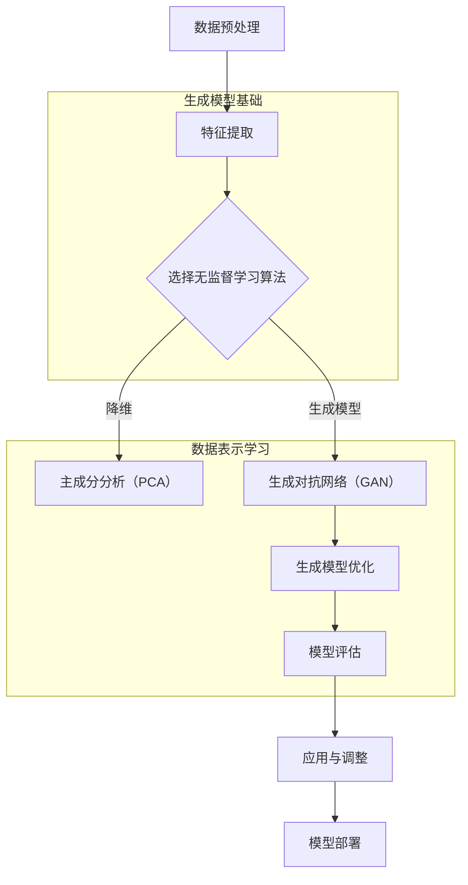

                 

# 无监督学习的理论进展：表示学习和生成模型

## 关键词

- 无监督学习
- 表示学习
- 生成模型
- 主成分分析（PCA）
- 自编码器
- 变分自编码器（VAE）
- 生成对抗网络（GAN）
- 条件生成对抗网络（cGAN）

## 摘要

无监督学习是机器学习领域的一个重要分支，其核心目标是从未标记的数据中提取有意义的结构和信息。本文旨在深入探讨无监督学习的理论进展，重点关注表示学习和生成模型的发展。首先，我们将回顾无监督学习的概念及其重要性，然后详细介绍数据表示学习的基础理论和核心算法，包括主成分分析（PCA）、t-SNE和自编码器。接下来，我们将讨论生成模型的基础，如波特-劳夫模型和变分自编码器（VAE），并探讨它们在深度学习中的应用。文章还将介绍生成对抗网络（GAN）及其变体条件生成对抗网络（cGAN），并分析无监督学习在实际应用中的挑战和最新进展。最后，我们将展望无监督学习的未来发展方向，探讨其在人工智能中的地位以及对其他领域的影响。

### 目录

1. **无监督学习概述**  
   1.1 无监督学习的概念与重要性  
   1.2 无监督学习的类型与分类  
   1.3 无监督学习的应用场景

2. **无监督学习基础理论**  
   2.1 数据表示学习  
   2.2 生成模型基础  
   2.3 变分自编码器（VAE）

3. **深度学习与无监督学习的关系**  
   3.1 深度学习在无监督学习中的应用  
   3.2 无监督学习在深度学习中的应用

4. **深度生成模型**  
   4.1 GAN（生成对抗网络）  
   4.2 条件生成对抗网络（cGAN）

5. **无监督学习在实际应用中的挑战与进展**  
   5.1 无监督学习的挑战  
   5.2 无监督学习的最新进展

6. **无监督学习的未来发展**  
   6.1 无监督学习的潜在应用领域  
   6.2 无监督学习面临的挑战与对策

7. **总结与展望**  
   7.1 无监督学习在人工智能中的地位  
   7.2 无监督学习对其他领域的影响  
   7.3 无监督学习的发展趋势

8. **附录**  
   8.1 无监督学习相关资源  
   8.2 无监督学习流程图  
   8.3 无监督学习核心算法原理

### 第一部分：无监督学习概述

#### 第1章：无监督学习简介

无监督学习是一种机器学习技术，它使计算机系统能够从没有标签的数据中自动发现模式和结构。与有监督学习相比，无监督学习不需要预先标记的输出数据来指导模型训练。因此，无监督学习在许多实际应用中具有重要作用，包括数据降维、模式识别、聚类分析和生成模型构建。

##### 1.1 无监督学习的概念与重要性

无监督学习的定义相对简单：它是一种在没有明确标记的输出数据的情况下，通过数据自身的内在结构和特征来训练模型的方法。无监督学习主要关注数据本身的性质，而不是外部标签或监督信号。

无监督学习的重要性体现在以下几个方面：

1. **数据降维**：通过无监督学习技术，我们可以将高维数据投影到低维空间，从而降低数据复杂性，便于后续分析和可视化。

2. **模式识别**：无监督学习可以帮助我们识别数据中的隐藏模式，这在聚类分析和其他形式的数据挖掘任务中非常有用。

3. **生成模型**：无监督学习技术可以用来构建生成模型，这些模型可以生成与训练数据类似的新数据，这在数据增强、图像生成和模拟领域具有广泛应用。

4. **自动特征提取**：无监督学习能够自动从数据中提取特征，这有助于减轻人工特征工程的工作负担，提高模型的泛化能力。

##### 1.2 无监督学习的类型与分类

无监督学习可以分为以下几种主要类型：

1. **聚类算法**：如K-均值聚类、层次聚类和DBSCAN，这些算法通过将相似的数据点划分为同一聚类，从而发现数据中的模式。

2. **降维技术**：如主成分分析（PCA）、t-SNE和自编码器，这些技术通过降低数据维度，同时保留数据的重要特征，从而简化数据分析过程。

3. **生成模型**：如波特-劳夫模型（Boltzmann Machine）、变分自编码器（VAE）和生成对抗网络（GAN），这些模型通过学习数据的概率分布，生成与训练数据相似的新数据。

4. **关联规则学习**：如Apriori算法和FP-Growth算法，这些算法通过发现数据项之间的关联关系，帮助挖掘数据中的潜在规则。

##### 1.3 无监督学习的应用场景

无监督学习在许多领域都有广泛的应用，以下是一些常见的应用场景：

1. **数据预处理**：在许多机器学习任务中，数据预处理是一个关键步骤。无监督学习可以帮助我们进行数据降维、噪声过滤和异常检测。

2. **图像处理**：在计算机视觉任务中，无监督学习可以帮助我们进行图像去噪、图像压缩和图像增强。

3. **文本分析**：在自然语言处理领域，无监督学习可以帮助我们进行文本聚类、主题建模和情感分析。

4. **生物信息学**：在基因组学和生物信息学领域，无监督学习可以帮助我们识别基因表达模式、分类蛋白质结构和预测蛋白质结构。

5. **推荐系统**：在推荐系统领域，无监督学习可以帮助我们发现用户偏好、建立用户和商品之间的关联关系，从而提高推荐系统的准确性。

通过以上概述，我们了解了无监督学习的概念、类型和应用场景。在接下来的章节中，我们将深入探讨无监督学习的基础理论，包括数据表示学习和生成模型的核心算法和技术。<!-- 这里只是一个概述，具体的内容还需要在后续章节中详细展开。 --> 

#### 第2章：无监督学习基础理论

在了解了无监督学习的概念和应用场景之后，我们接下来将深入探讨其基础理论。本章将重点介绍数据表示学习和生成模型，这些理论是无监督学习的关键组成部分。

##### 2.1 数据表示学习

数据表示学习，也称为特征提取或特征工程，是机器学习中的一项基本任务。其核心目标是通过将原始数据映射到一个较低维度的空间，从而提取出数据中的关键特征。这一过程不仅有助于数据降维，还能提高后续模型训练的效率和准确性。

以下是几种常见的数据表示学习方法：

###### 2.1.1 数据降维

数据降维是将高维数据映射到低维空间的过程，旨在减少数据的复杂性和存储需求，同时尽可能保留数据的信息。常见的降维方法包括：

1. **主成分分析（PCA）**：PCA通过将数据投影到主成分轴上，实现了数据的降维。主成分是数据方差最大的方向，通过保留主要成分，我们可以有效去除噪声和冗余信息。

2. **t-SNE**：t-SNE是一种非线性降维技术，它通过在低维空间中保持局部结构相似性，将高维数据可视化。t-SNE特别适合处理小规模和高维数据。

3. **自编码器**：自编码器是一种基于神经网络的降维方法，通过编码器和解码器两个神经网络，将高维数据压缩到低维空间中，然后通过解码器还原原始数据。自编码器不仅可以实现降维，还可以作为特征提取器。

###### 2.1.1.1 主成分分析（PCA）

主成分分析（PCA）是一种经典的线性降维技术。其基本思想是通过计算数据的协方差矩阵，找到数据的最大方差方向，然后将数据投影到这些方向上，从而实现降维。

以下是PCA算法的详细步骤：

1. **计算协方差矩阵**：给定一个数据集 $X$，首先计算其协方差矩阵 $C$。

   $$
   C = \frac{1}{n-1} X^T X
   $$

   其中，$X^T$ 是数据集 $X$ 的转置，$n$ 是数据集中的样本数量。

2. **计算协方差矩阵的特征值和特征向量**：对协方差矩阵 $C$ 进行特征分解，得到特征值 $\lambda_i$ 和特征向量 $v_i$。

   $$
   C = V \Lambda V^T
   $$

   其中，$V$ 是特征向量组成的矩阵，$\Lambda$ 是特征值组成的对角矩阵。

3. **选择主成分**：将特征向量按照特征值降序排列，选择前 $k$ 个特征向量作为主成分。这些主成分代表了数据的主要方差方向。

4. **对数据进行投影**：将原始数据 $X$ 投影到主成分轴上，得到新的低维数据 $Y$。

   $$
   Y = X V
   $$

   $Y$ 就是经过PCA降维处理后的数据。

主成分分析的优点在于其简单易用，能够有效去除噪声和冗余信息。然而，PCA是一种线性方法，可能无法捕捉到数据中的非线性结构。

###### 2.1.1.2 t-SNE

t-Distributed Stochastic Neighbor Embedding（t-SNE）是一种基于概率的降维技术，特别适合处理小规模和高维数据。t-SNE的基本思想是通过在低维空间中保持局部结构的相似性，将高维数据可视化。

以下是t-SNE算法的详细步骤：

1. **计算高维数据点之间的相似度矩阵**：给定高维数据集 $X$，首先计算数据点之间的相似度矩阵 $Q$。t-SNE使用高斯分布来表示数据点之间的相似性。

   $$
   Q_{ij} = \exp \left( -\frac{\|x_i - x_j\|^2}{2\sigma^2} \right)
   $$

   其中，$\sigma$ 是高斯分布的尺度参数。

2. **对相似度矩阵进行对数压缩**：为了在低维空间中保持相似性，t-SNE对相似度矩阵 $Q$ 进行对数压缩。

   $$
   P_{ij} = \frac{Q_{ij}}{\sum_j Q_{ij}}
   $$

3. **计算梯度**：在低维空间中，每个数据点 $i$ 的梯度表示其周围的相似度分布。t-SNE通过计算梯度来调整数据点的位置。

   $$
   \nabla P_{ij} = P_{ij} \left( 1 - \frac{P_{ij}}{\sum_k P_{ik}} \right)
   $$

4. **更新数据点位置**：通过迭代优化梯度，t-SNE逐渐调整数据点的位置，使其在低维空间中保持局部结构的相似性。

   $$
   x_i \leftarrow x_i + \alpha \nabla P_{ij}
   $$

   其中，$\alpha$ 是学习率。

t-SNE的优点在于其能够捕捉到数据中的非线性结构，适用于小规模数据集。然而，t-SNE的计算复杂度较高，且容易陷入局部最优。

###### 2.1.1.3 自编码器

自编码器是一种基于神经网络的降维方法，其核心思想是通过训练一个编码器和解码器网络，将高维数据压缩到低维空间中，然后通过解码器还原原始数据。

自编码器由以下两部分组成：

1. **编码器**：编码器网络接收高维输入数据，通过多层神经网络将其压缩到一个较低维度的中间表示。这个中间表示包含了原始数据的主要特征。

2. **解码器**：解码器网络接收编码器生成的中间表示，通过多层神经网络将其重构为原始数据。

自编码器训练过程如下：

1. **初始化网络权重**：随机初始化编码器和解码器的权重。

2. **前向传播**：给定一个输入数据 $x$，通过编码器得到中间表示 $z$。

   $$
   z = f_{\theta_e}(x)
   $$

   其中，$f_{\theta_e}$ 是编码器网络的激活函数。

3. **重构原始数据**：通过解码器将中间表示 $z$ 重构为输出数据 $x'$。

   $$
   x' = f_{\theta_d}(z)
   $$

   其中，$f_{\theta_d}$ 是解码器网络的激活函数。

4. **计算损失函数**：计算输入数据 $x$ 与重构数据 $x'$ 之间的差异，使用损失函数优化编码器和解码器的权重。

   $$
   L = \frac{1}{2} \sum_{i} (x_i - x_i')^2
   $$

自编码器的优点在于其能够自动从数据中提取特征，无需人工干预。然而，自编码器训练过程可能需要较长的计算时间和大量的数据。

##### 2.2 生成模型基础

生成模型是一种无监督学习技术，其目标是从数据中学习一个概率分布模型，然后生成与训练数据相似的新数据。生成模型在数据增强、图像生成和模拟领域具有广泛的应用。以下是两种常见的生成模型：波特-劳夫模型（Boltzmann Machine）和变分自编码器（VAE）。

###### 2.2.1 波特-劳夫模型（Boltzmann Machine）

波特-劳夫模型（Boltzmann Machine，BM）是一种基于能量的生成模型，其基本原理是基于能量函数对数据进行建模。模型的能量函数为：

$$
E(\theta, x) = -\sum_{i,j} \theta_{ij} x_i x_j - \sum_{i} \beta_i x_i
$$

其中，$\theta_{ij}$ 是连接权重，$\beta_i$ 是输入偏置，$x_i$ 是神经元状态（0或1）。

波特-劳夫模型的能量函数反映了数据点的概率分布，即数据点 $x$ 的概率是对应能量函数的指数负值：

$$
P(x|\theta) = \frac{1}{Z} \exp(-E(\theta, x))
$$

其中，$Z$ 是模型的总能量。

波特-劳夫模型的主要挑战在于参数估计。常见的参数估计方法包括最大似然估计（MLE）和最小化自由能（Free Energy）。

1. **最大似然估计（MLE）**：MLE的目标是最大化数据集的概率分布：

   $$
   P(x|\theta) = \frac{1}{Z} \exp(-E(\theta, x))
   $$

   其中，$Z$ 是模型的总能量。

2. **最小化自由能**：自由能 $F$ 是能量函数 $E$ 和熵 $H$ 的和：

   $$
   F = E - \frac{1}{T} H
   $$

   其中，$T$ 是温度参数，$H$ 是数据集的熵。最小化自由能可以通过梯度下降法实现。

波特-劳夫模型在数据降维和生成新数据方面具有广泛的应用。然而，由于其训练过程相对复杂，实际应用中常使用变分自编码器（VAE）和生成对抗网络（GAN）等更高效的生成模型。

###### 2.2.2 变分自编码器（VAE）

变分自编码器（Variational Autoencoder，VAE）是一种基于深度学习的生成模型，它通过引入变分推断的方法解决了标准自编码器在生成质量上的不足。VAE的核心思想是学习一个概率模型来表示数据的潜在分布，而不是学习一个确定的映射。

VAE由两部分组成：编码器和解码器。

1. **编码器**：编码器将输入数据映射到一个潜在空间中的点。编码器的输出包括两个部分：均值 $\mu$ 和标准差 $\sigma$。

   $$
   z = \mu + \sigma \odot \epsilon
   $$

   其中，$\mu$ 和 $\sigma$ 分别是均值和标准差，$\epsilon$ 是噪声向量。

2. **解码器**：解码器从潜在空间中采样点，并重建输入数据。解码器的输入是潜在空间中的点 $z$，输出是重构的数据 $x'$。

   $$
   x' = f_{\theta_d}(z)
   $$

   其中，$f_{\theta_d}$ 是解码器网络的激活函数。

VAE的生成过程分为两步：

1. **编码过程**：给定输入数据，编码器学习映射函数 $q_\phi(z|x)$，将输入数据映射到潜在空间中的点。

   $$
   q_\phi(z|x) = \mathcal{N}(\mu(x), \sigma(x))
   $$

2. **解码过程**：在潜在空间中采样点 $z \sim p_\theta(z)$，并通过解码器重建输入数据。

VAE的训练过程采用变分下界（Variational Lower Bound，VLB）来优化模型参数：

$$
\mathcal{L} = \mathbb{E}_{z \sim q_\phi(z|x)} [-\log p_\theta(x|z)] - D_{KL}(q_\phi(z|x) || p_\theta(z))
$$

其中，第一项是数据重建损失，第二项是KL散度，用于度量两个概率分布之间的差异。

VAE的优点在于其能够生成高质量的新数据，且训练过程相对稳定。然而，VAE在生成细节丰富的图像时可能存在一定局限性，因此在实际应用中，常结合其他生成模型，如生成对抗网络（GAN）。

通过以上对数据表示学习和生成模型基础理论的介绍，我们为后续章节中更深入的讨论奠定了基础。在接下来的章节中，我们将探讨深度学习与无监督学习的关系，并详细介绍深度生成模型，如生成对抗网络（GAN）及其变体条件生成对抗网络（cGAN）。<!-- 这里是一个过渡，引出下一部分的内容。 --> 

### 第二部分：深度学习与无监督学习

#### 第3章：深度学习与无监督学习的关系

深度学习是一种重要的机器学习技术，其核心在于利用多层神经网络自动提取数据中的层次特征。无监督学习则侧重于从未标记的数据中学习模式和结构。两者在技术层面和实际应用中都有着紧密的联系，本章将探讨深度学习在无监督学习中的应用，以及无监督学习在深度学习中的作用。

##### 3.1 深度学习在无监督学习中的应用

深度学习在无监督学习中的应用主要体现在以下几个方面：

1. **特征提取**：深度学习模型，尤其是卷积神经网络（CNN）和循环神经网络（RNN），通过多层非线性变换，能够自动从数据中提取出有意义的特征。这些特征可以用于数据降维、聚类和生成模型。

2. **生成模型**：深度学习中的变分自编码器（VAE）和生成对抗网络（GAN）等模型，结合了深度学习的优势，能够生成更高质量的生成数据。

3. **图像处理**：深度学习在图像处理领域取得了显著的成果，例如图像分类、图像分割和图像生成。这些技术依赖于深度学习模型从图像数据中提取的层次特征。

###### 3.1.1 深度神经网络与表示学习

深度神经网络（DNN）是一种多层神经网络，其通过一系列非线性变换，从输入数据中提取出层次化的特征。这些特征在不同层次上表达了数据的不同抽象层次。深度神经网络在无监督学习中的应用主要包括以下几种：

1. **自动特征提取**：通过训练深度神经网络，我们可以自动从数据中提取出有代表性的特征。这些特征可以用于后续的数据降维、聚类和分类任务。

2. **层次特征提取**：深度神经网络通过多层非线性变换，逐层提取数据中的特征。底层的特征通常表示数据的低层次属性，而顶层的特征则表示数据的高级属性。

3. **迁移学习**：深度神经网络训练好的模型可以应用于不同的任务，通过迁移学习，我们可以利用预训练模型在新的任务中取得更好的效果。

###### 3.1.1.1 卷积神经网络（CNN）

卷积神经网络（CNN）是一种专门用于处理图像数据的深度学习模型。CNN的核心在于其卷积层，该层通过卷积运算提取图像的局部特征。以下是CNN在无监督学习中的应用：

1. **图像降维**：通过训练CNN，我们可以将高维图像数据映射到低维特征空间。这种方法不仅降低了数据维度，还保留了图像的主要信息。

2. **图像去噪**：CNN可以通过学习图像的噪声和去噪特征，实现图像的去噪任务。通过训练，CNN可以学习到如何将噪声图像恢复为干净图像。

3. **图像生成**：CNN可以应用于生成模型，如生成对抗网络（GAN），通过学习图像的潜在分布，生成新的图像。

###### 3.1.1.2 循环神经网络（RNN）

循环神经网络（RNN）是一种能够处理序列数据的深度学习模型。RNN通过其内部循环机制，能够记住序列中的历史信息。以下是RNN在无监督学习中的应用：

1. **序列建模**：RNN可以用于无监督的序列建模任务，如语言模型和音乐生成。通过学习序列数据中的潜在结构，RNN能够生成新的序列数据。

2. **音频处理**：RNN可以应用于音频处理任务，如语音合成和音频去噪。通过学习音频信号的潜在特征，RNN可以生成新的音频信号。

3. **时间序列预测**：RNN可以用于无监督的时间序列预测任务，如股票价格预测和天气预测。通过学习时间序列数据中的周期性和趋势性，RNN能够生成新的时间序列数据。

###### 3.1.1.3 图神经网络（GNN）

图神经网络（GNN）是一种专门用于处理图数据的深度学习模型。GNN通过图卷积运算，能够提取图数据中的特征。以下是GNN在无监督学习中的应用：

1. **图分类**：GNN可以用于无监督的图分类任务，如社交网络分类和生物网络分类。通过学习图的潜在特征，GNN能够对图进行分类。

2. **图生成**：GNN可以应用于生成模型，如生成对抗网络（GAN），通过学习图的潜在分布，生成新的图数据。

3. **图嵌入**：GNN可以用于图嵌入任务，将图中的节点映射到低维空间，从而实现图数据的降维和可视化。

##### 3.2 无监督学习在深度学习中的应用

无监督学习在深度学习中的应用主要包括以下几个方面：

1. **预训练**：在深度学习任务中，我们通常先对模型进行无监督预训练，然后进行有监督的微调。这种预训练方法可以帮助模型更好地捕捉数据的潜在结构，从而提高有监督任务的性能。

2. **数据增强**：无监督学习技术，如生成对抗网络（GAN），可以用于生成新的训练数据，从而增强训练数据集。这种方法有助于提高模型的泛化能力，尤其是在数据稀缺的情况下。

3. **特征提取**：无监督学习技术可以用于提取有用的特征，这些特征可以用于后续的深度学习任务，如分类和预测。

###### 3.2.1 自编码器作为深度网络的前传

自编码器是一种无监督学习技术，它通过训练一个编码器和解码器网络，将数据映射到一个低维空间，然后从该空间中重建原始数据。自编码器在深度学习中的应用主要包括以下两个方面：

1. **特征提取**：自编码器可以用于提取数据中的有用特征。这些特征可以用于后续的深度学习任务，如分类和预测。通过自编码器提取的特征通常具有更好的鲁棒性和代表性。

2. **数据降维**：自编码器可以将高维数据映射到低维空间，从而减少数据的复杂性和存储需求。这种方法不仅提高了计算效率，还便于后续的数据分析和可视化。

###### 3.2.2 无监督预训练与微调

无监督预训练与微调是一种常用的深度学习训练策略，其核心思想是先对模型进行无监督预训练，然后进行有监督的微调。

1. **无监督预训练**：在无监督预训练阶段，模型通过学习数据中的潜在结构，例如通过自编码器或生成对抗网络（GAN），从而提高其表示能力。

2. **有监督微调**：在无监督预训练完成后，模型通常会在特定任务上进行有监督微调。在这个过程中，模型根据标记数据调整其参数，从而提高任务性能。

无监督预训练与微调的优点包括：

1. **减少对标记数据的依赖**：通过无监督预训练，模型可以在没有标记数据的情况下学习到有用的特征，从而减少对大量标记数据的依赖。

2. **提高泛化能力**：无监督预训练可以帮助模型更好地捕捉数据中的潜在结构，从而提高模型的泛化能力。

3. **加快训练速度**：无监督预训练可以加快有监督训练的速度，因为模型在预训练阶段已经学习到一部分有用的特征。

通过以上对深度学习与无监督学习关系的讨论，我们了解了深度学习在无监督学习中的应用，以及无监督学习在深度学习中的作用。在下一部分中，我们将探讨深度生成模型，如生成对抗网络（GAN）及其变体条件生成对抗网络（cGAN），并分析它们在无监督学习中的优势和应用。<!-- 这里是一个过渡，引出下一部分的内容。 --> 

#### 第4章：深度生成模型

深度生成模型是近年来无监督学习领域的重要进展之一，它们在图像生成、文本生成和其他数据驱动的任务中取得了显著的成功。本章将重点介绍生成对抗网络（GAN）和条件生成对抗网络（cGAN）这两种深度生成模型。

##### 4.1 GAN（生成对抗网络）

生成对抗网络（Generative Adversarial Network，GAN）是由Ian Goodfellow等人于2014年提出的一种深度生成模型。GAN的核心思想是利用两个对抗性神经网络——生成器和判别器，进行博弈，从而生成与真实数据相似的新数据。

###### 4.1.1 GAN的工作原理

GAN由两个主要部分组成：生成器（Generator）和判别器（Discriminator）。

1. **生成器（Generator）**：生成器的目标是从随机噪声中生成与真实数据相似的数据。生成器通常由多层神经网络组成，其输入为随机噪声，输出为生成的数据。

2. **判别器（Discriminator）**：判别器的目标是区分生成的数据和真实数据。判别器也是一个多层神经网络，其输入为数据，输出为一个概率值，表示输入数据是真实的概率。

GAN的训练过程可以看作是一个博弈过程，其中生成器和判别器相互对抗：

- **生成器的训练目标**：生成器试图生成尽可能真实的数据，使得判别器无法区分生成的数据和真实数据。
- **判别器的训练目标**：判别器试图准确区分生成的数据和真实数据，从而最大化生成器和判别器的损失函数。

GAN的损失函数通常包括两部分：生成器的损失函数和判别器的损失函数。

1. **生成器的损失函数**：生成器的损失函数通常使用交叉熵损失来衡量生成数据与真实数据之间的差异。

   $$
   L_G = -\log(D(G(z)))
   $$

   其中，$G(z)$ 是生成器生成的数据，$D$ 是判别器的输出。

2. **判别器的损失函数**：判别器的损失函数通常使用交叉熵损失来衡量判别器的输出与真实标签之间的差异。

   $$
   L_D = -[y_D \cdot \log(D(x)) + (1 - y_G) \cdot \log(1 - D(G(z)))]
   $$

   其中，$x$ 是真实数据，$z$ 是生成器的输入噪声，$y_D$ 和 $y_G$ 分别是判别器对真实数据和生成数据的标签。

GAN的训练过程是通过交替优化生成器和判别器的损失函数来实现的。在训练过程中，生成器和判别器的性能不断相互提升，最终生成器能够生成高质量的数据，判别器能够准确地区分真实数据和生成数据。

###### 4.1.2 生成模型的目标函数

生成模型的目标函数是优化生成器和判别器的参数，使得生成器生成的数据尽可能接近真实数据，同时判别器能够准确地区分真实数据和生成数据。GAN的目标函数通常如下：

$$
\min_G \max_D \mathbb{E}_{x \sim p_{data}(x)} [-\log(D(x))] + \mathbb{E}_{z \sim p_z(z)} [-\log(1 - D(G(z)))]
$$

其中，$p_{data}(x)$ 是真实数据的概率分布，$p_z(z)$ 是噪声向量的概率分布。

GAN的目标函数可以解释为：

- **生成器**：生成器希望最大化判别器对生成数据的判别结果，即 $D(G(z))$ 的值接近于1。
- **判别器**：判别器希望最大化生成器和真实数据在判别结果上的差异，即 $D(G(z))$ 的值接近于0，而 $D(x)$ 的值接近于1。

通过交替优化生成器和判别器的参数，GAN能够生成高质量的数据，并在许多任务中取得了显著的成果。

###### 4.1.3 GAN的应用

生成对抗网络（GAN）在图像生成、视频生成、文本生成和音频生成等领域都有广泛应用。以下是一些典型的应用场景：

1. **图像生成**：GAN可以用于生成逼真的图像，如图像到图像的转换、超分辨率图像生成、人脸生成等。通过训练GAN，生成器可以学习到图像的潜在结构，从而生成高质量的新图像。

2. **视频生成**：GAN可以用于生成连续的视频序列，例如视频到视频的转换、视频插入和视频超分辨率等。通过训练GAN，生成器可以学习到视频中的动态特征，从而生成连贯、逼真的视频序列。

3. **文本生成**：GAN可以用于生成自然语言文本，例如文章生成、对话系统和文本到图像的转换等。通过训练GAN，生成器可以学习到文本的潜在语义结构，从而生成连贯、有意义的文本。

4. **音频生成**：GAN可以用于生成音频信号，例如音乐生成、语音合成和声音效果制作等。通过训练GAN，生成器可以学习到音频的潜在结构，从而生成高质量的新音频。

GAN的应用范围广泛，并在许多领域取得了显著的成果。然而，GAN也存在一些挑战，如训练不稳定、模式崩溃和生成质量不稳定等问题。为了解决这些问题，研究者们提出了许多改进方法和变体模型，例如梯度惩罚、深度卷积生成对抗网络（DCGAN）、循环一致生成对抗网络（CycleGAN）和条件生成对抗网络（cGAN）。

##### 4.2 条件生成对抗网络（cGAN）

条件生成对抗网络（Conditional Generative Adversarial Network，cGAN）是生成对抗网络（GAN）的一种变体，其核心思想是在GAN的基础上引入条件信息。cGAN通过添加条件信息，使得生成器和判别器在训练过程中能够更好地学习数据中的潜在结构和条件依赖关系。

###### 4.2.1 条件GAN的概念

条件GAN（cGAN）的核心思想是在GAN的基础上引入一个条件变量，这个条件变量可以是标签、类别或任何其他形式的外部信息。通过引入条件变量，cGAN可以生成具有特定条件特征的数据。

在cGAN中，生成器和判别器的输入都包含了一个条件变量：

1. **生成器**：生成器的输入是一个条件变量 $c$ 和一个随机噪声向量 $z$，输出是一个条件生成数据 $G(z, c)$。

   $$
   G(z, c): \mathbb{R}^{c+z} \rightarrow \mathbb{R}^{h \times w \times c}
   $$

2. **判别器**：判别器的输入是一个条件生成数据 $G(z, c)$ 和一个真实数据 $x$，输出是一个概率值，表示输入数据是真实的概率。

   $$
   D(x, c): \mathbb{R}^{h \times w \times c} \rightarrow \mathbb{R}
   $$

cGAN的目标函数与GAN类似，但在目标函数中引入了条件变量：

$$
\min_G \max_D \mathbb{E}_{x \sim p_{data}(x)} [\log(D(x, c))] + \mathbb{E}_{z \sim p_z(z)} [\log(1 - D(G(z, c), c))]
$$

其中，$p_{data}(x)$ 是真实数据的概率分布，$p_z(z)$ 是噪声向量的概率分布。

通过引入条件变量，cGAN可以更好地学习数据中的条件依赖关系，从而生成具有特定条件特征的数据。

###### 4.2.1.1 条件GAN结构

条件GAN（cGAN）的结构与标准GAN有所不同，其核心在于引入了条件变量。以下是cGAN的基本结构：

1. **生成器（Generator）**：cGAN的生成器接收一个条件变量 $c$ 和随机噪声向量 $z$，输出是一个条件生成数据 $G(z, c)$。

2. **判别器（Discriminator）**：cGAN的判别器接收一个条件生成数据 $G(z, c)$ 和一个真实数据 $x$，以及条件变量 $c$，输出是一个概率值，表示输入数据是真实的概率。

3. **条件信息**：在cGAN中，条件信息可以是任何形式的外部信息，例如标签、类别或任何与数据相关的信息。

以下是cGAN的简化结构：

$$
G(z, c): \mathbb{R}^{c+z} \rightarrow \mathbb{R}^{h \times w \times c} \\
D(x, c): \mathbb{R}^{h \times w \times c} \rightarrow \mathbb{R}
$$

通过引入条件变量，cGAN可以生成具有特定条件特征的数据，从而提高生成数据的真实性和多样性。

###### 4.2.1.2 条件GAN的优势

条件生成对抗网络（cGAN）相对于标准GAN具有以下优势：

1. **生成特定条件特征的数据**：cGAN通过引入条件变量，可以生成具有特定条件特征的数据。这使得cGAN在许多任务中具有更高的应用价值，例如图像到图像的转换、文本到图像的转换等。

2. **提高生成数据的质量和多样性**：通过引入条件信息，cGAN可以更好地学习数据中的条件依赖关系，从而生成高质量和多样化的生成数据。

3. **应用范围广泛**：cGAN可以应用于多种领域，包括图像生成、视频生成、文本生成和音频生成等。通过引入不同的条件变量，cGAN可以适应不同的任务需求。

4. **稳定性提高**：相对于标准GAN，cGAN在训练过程中具有更高的稳定性。这是因为条件GAN通过引入条件变量，使得生成器和判别器的训练过程更加稳定和可控。

通过以上对生成对抗网络（GAN）和条件生成对抗网络（cGAN）的详细介绍，我们了解了这两种深度生成模型的工作原理、目标函数和应用。在接下来的章节中，我们将探讨无监督学习在实际应用中的挑战和最新进展，并分析这些挑战的解决方案。<!-- 这里是一个过渡，引出下一部分的内容。 --> 

### 第三部分：无监督学习在实际应用中的挑战与进展

#### 第5章：无监督学习在实际应用中的挑战与进展

无监督学习虽然在数据降维、模式识别、生成模型等方面取得了显著进展，但其在实际应用中仍面临许多挑战。本章将探讨这些挑战，并介绍无监督学习的最新进展和解决方案。

##### 5.1 无监督学习的挑战

无监督学习在实际应用中面临以下主要挑战：

###### 5.1.1 数据分布的不均匀性

在实际应用中，数据分布通常是不均匀的，这意味着某些类别的数据可能远比其他类别的数据丰富。这种不均匀性会导致模型在处理较少的数据类别时出现性能下降，甚至过拟合。

解决方案：

1. **数据重采样**：通过随机重采样或平衡采样技术，可以减少数据分布的不均匀性，从而提高模型的泛化能力。

2. **模型集成**：使用集成方法，如 bagging 和 boosting，可以结合多个模型的预测结果，从而减少数据分布不均匀性对模型性能的影响。

3. **聚类和嵌入**：通过聚类技术，可以将数据划分为多个均衡的子集。然后，对每个子集应用不同的模型，最后将结果整合。

###### 5.1.2 模型过拟合问题

无监督学习模型在训练过程中可能会出现过拟合现象，尤其是在训练数据量较小或特征维度较高时。过拟合会导致模型在训练数据上表现良好，但在未见过的数据上表现不佳。

解决方案：

1. **正则化**：通过应用正则化技术，如 L1 和 L2 正则化，可以减少模型复杂度，防止过拟合。

2. **数据扩充**：通过数据扩充技术，可以增加训练数据的多样性，从而减少过拟合的可能性。

3. **模型压缩**：使用模型压缩技术，如模型剪枝和量化，可以降低模型的大小和计算复杂度，从而减少过拟合。

###### 5.1.3 计算资源的限制

无监督学习模型，特别是深度学习模型，通常需要大量的计算资源和时间进行训练。这在实际应用中可能是一个严重的问题，尤其是在资源受限的环境中。

解决方案：

1. **模型压缩和加速**：通过模型压缩技术，如剪枝和量化，可以减少模型的计算复杂度和存储需求。此外，使用加速硬件，如 GPU 和 TPU，可以显著提高训练速度。

2. **分布式训练**：通过分布式训练技术，可以将模型训练任务分布在多个计算节点上，从而提高训练效率。

3. **迁移学习**：通过迁移学习，可以复用预训练模型的知识，从而减少训练时间。在资源受限的情况下，迁移学习是一个有效的解决方案。

##### 5.2 无监督学习的最新进展

随着深度学习和生成模型的不断发展，无监督学习也在不断进步。以下是一些无监督学习的最新进展和解决方案：

###### 5.2.1 新算法与技术的涌现

近年来，许多新的算法和技术被提出，以解决无监督学习中的挑战。以下是一些代表性的算法和技术：

1. **变分自编码器（VAE）和变分推断**：VAE是一种基于深度学习的生成模型，通过变分推断的方法，可以有效地生成高质量的新数据。

2. **生成对抗网络（GAN）及其变体**：GAN是一种基于对抗性学习的生成模型，通过生成器和判别器的博弈，可以生成与真实数据非常相似的新数据。GAN的变体，如 cGAN、CycleGAN 和 StyleGAN，进一步提高了生成质量。

3. **图神经网络（GNN）**：GNN是一种专门用于处理图数据的神经网络，通过学习图中的结构特征，可以应用于节点分类、图分类和图生成任务。

4. **自监督学习**：自监督学习是一种无需外部标签的监督学习技术，通过利用未标记的数据，可以自动提取有用的特征和知识。自监督学习在数据增强、特征提取和模型预训练等方面具有广泛的应用。

###### 5.2.1.1 模型压缩与加速

为了应对计算资源的限制，研究者们提出了一系列模型压缩与加速技术：

1. **模型剪枝**：通过剪枝技术，可以移除模型中不重要的连接和神经元，从而减少模型的计算复杂度和存储需求。

2. **量化**：通过量化技术，可以将模型中的浮点数参数转换为低比特宽度的整数，从而降低模型的存储和计算需求。

3. **低秩分解**：通过低秩分解技术，可以将高维矩阵分解为低秩矩阵，从而减少模型的计算复杂度。

4. **硬件加速**：通过使用 GPU、TPU 和其他专用硬件，可以显著提高模型训练和推理的速度。

###### 5.2.1.2 无监督学习的并行计算

为了提高训练效率，研究者们提出了多种并行计算技术，包括：

1. **分布式训练**：通过将训练任务分布在多个计算节点上，可以显著提高训练速度。

2. **数据并行**：通过在多个 GPU 上同时训练不同的模型副本，可以并行计算梯度，从而提高训练速度。

3. **模型并行**：通过将大型模型拆分为多个较小的子模型，并在不同的 GPU 上同时训练，可以充分利用计算资源。

4. **流水线训练**：通过流水线训练技术，可以并行处理不同的训练批次，从而提高训练效率。

###### 5.2.1.3 深度图模型

深度图模型是近年来无监督学习领域的一个重要研究方向。图神经网络（GNN）作为深度图模型的核心，在节点分类、图分类和图生成任务中取得了显著成果。以下是一些代表性的深度图模型：

1. **图卷积网络（GCN）**：GCN是一种基于卷积操作的图神经网络，通过在图上的卷积运算，可以提取图中的结构特征。

2. **图自编码器（GAE）**：GAE是一种基于自编码器的图生成模型，通过学习图中的潜在表示，可以生成新的图数据。

3. **图生成对抗网络（G-GAN）**：G-GAN是一种基于生成对抗网络的图生成模型，通过生成器和判别器的对抗训练，可以生成高质量的图数据。

通过以上对无监督学习在实际应用中挑战的探讨和最新进展的介绍，我们了解了无监督学习在应对这些挑战方面的研究成果和技术。在下一部分中，我们将探讨无监督学习的未来发展，包括其在人工智能中的地位、对其他领域的影响以及未来的发展方向。<!-- 这里是一个过渡，引出下一部分的内容。 --> 

### 第四部分：无监督学习的未来发展

#### 第6章：无监督学习的未来发展

随着人工智能技术的不断进步，无监督学习在各个领域中的应用也越来越广泛。本章节将探讨无监督学习的未来发展，包括其在人工智能中的地位、对其他领域的影响以及未来的发展方向。

##### 6.1 无监督学习的潜在应用领域

无监督学习具有广泛的应用前景，以下是一些潜在的应用领域：

1. **物联网与边缘计算**：在物联网（IoT）和边缘计算环境中，数据通常是非结构化和大规模的。无监督学习可以帮助我们从这些数据中提取有价值的特征，从而实现设备故障预测、智能监控和优化。

2. **自动驾驶与智能交通**：在自动驾驶和智能交通领域，无监督学习可以用于车辆识别、道路检测、交通流量预测和路线规划。通过学习大量道路数据，车辆可以更好地理解周围环境，提高行驶安全性和效率。

3. **健康医疗与生物信息学**：在健康医疗和生物信息学领域，无监督学习可以帮助我们分析医学图像、基因组数据和生物序列。这有助于疾病诊断、药物发现和治疗方案的个性化设计。

4. **推荐系统**：在推荐系统领域，无监督学习可以用于用户偏好分析、商品关联规则挖掘和个性化推荐。通过无监督学习，推荐系统可以更好地理解用户的兴趣和行为，从而提高推荐质量。

5. **社交媒体与网络分析**：在社交媒体和网络分析领域，无监督学习可以帮助我们分析用户行为、挖掘社交网络结构和识别潜在影响力用户。这有助于社交网络平台的用户管理和内容推荐。

##### 6.2 无监督学习面临的挑战与对策

尽管无监督学习在许多领域取得了显著成果，但它仍然面临一些挑战：

1. **数据隐私与安全**：无监督学习通常涉及大量敏感数据的处理，如何保护用户隐私和安全成为一个重要问题。对策包括差分隐私、联邦学习和隐私增强学习等技术。

2. **道德与伦理问题**：无监督学习模型可能会引入偏见，导致歧视和道德问题。对策包括透明性、可解释性和公平性研究，以及制定相应的伦理规范。

3. **持续学习与适应能力**：无监督学习模型通常缺乏持续学习和适应新环境的能力。对策包括在线学习、迁移学习和元学习等技术。

4. **计算资源与效率**：无监督学习模型往往需要大量计算资源和时间进行训练，特别是在处理高维和大规模数据时。对策包括模型压缩、量化、分布式计算和硬件加速等技术。

##### 6.3 无监督学习的未来发展

无监督学习在未来将继续发展，并在以下方面取得突破：

1. **深度图模型**：深度图模型在处理图数据方面具有巨大潜力，未来将在社交网络、知识图谱和生物信息学等领域得到广泛应用。

2. **生成模型**：生成模型，如生成对抗网络（GAN）和变分自编码器（VAE），将继续在图像生成、视频生成和文本生成等领域取得进展。

3. **自监督学习**：自监督学习利用未标记的数据进行学习，具有广泛的应用前景。未来将出现更多高效的自监督学习方法，并与其他学习范式相结合。

4. **多模态学习**：多模态学习结合了不同类型的数据（如图像、文本和音频），在未来将有助于解决复杂任务，如跨模态检索和语义理解。

5. **联邦学习**：联邦学习通过分布式计算保护用户隐私，将在物联网和边缘计算领域发挥重要作用。

6. **无监督学习的集成**：无监督学习与其他学习范式的集成，如监督学习和强化学习，将实现更强大的模型和更广泛的应用。

通过以上对无监督学习未来发展的探讨，我们可以看到，无监督学习将在人工智能的各个领域中发挥重要作用，并为未来的技术进步带来新的动力。<!-- 这里是一个过渡，引出下一部分的内容。 --> 

### 第五部分：总结与展望

#### 第7章：总结与展望

无监督学习作为机器学习领域的一个重要分支，通过从未标记的数据中自动发现模式和结构，为许多应用领域带来了革命性的变化。本章将对无监督学习在人工智能中的地位、对其他领域的影响以及未来的发展趋势进行总结和展望。

##### 7.1 无监督学习在人工智能中的地位

无监督学习在人工智能中占据了至关重要的地位，其主要原因如下：

1. **数据丰富性**：在人工智能时代，数据已成为一种关键资源。无监督学习能够处理大量未标记的数据，从而为模型训练提供丰富的信息。

2. **自动化特征提取**：无监督学习通过自动提取特征，减少了人工特征工程的工作量，提高了模型的泛化能力和效率。

3. **数据降维和可视化**：无监督学习能够将高维数据降维到低维空间，使得数据更易于分析和可视化，有助于发现隐藏在数据中的潜在模式。

4. **模型预训练**：无监督学习可以作为深度学习模型的预训练步骤，通过学习未标记的数据，为后续有监督学习任务提供强有力的基础。

##### 7.2 无监督学习对其他领域的影响

无监督学习在多个领域产生了深远的影响，以下是一些主要领域：

1. **计算机视觉**：无监督学习在计算机视觉中的应用非常广泛，包括图像分类、目标检测、图像生成和视频分析等。通过自动提取图像特征，无监督学习为计算机视觉任务的实现提供了强大的工具。

2. **自然语言处理**：无监督学习在自然语言处理领域也发挥了重要作用，包括文本分类、情感分析、机器翻译和对话系统等。通过学习未标记的文本数据，无监督学习能够自动提取语言特征，从而提高模型的性能。

3. **推荐系统**：无监督学习在推荐系统中的应用可以显著提高推荐质量。通过挖掘用户行为和商品属性之间的关系，无监督学习能够为推荐系统提供更准确和个性化的推荐。

4. **生物信息学**：无监督学习在生物信息学中的应用有助于基因表达数据分析、蛋白质结构预测和疾病诊断等。通过自动提取生物序列特征，无监督学习为生物信息学研究提供了新的方法。

##### 7.3 无监督学习的发展趋势

随着人工智能技术的不断进步，无监督学习将继续在以下几个方面取得突破：

1. **模型效率**：为了应对大规模数据处理的需求，未来无监督学习模型将更加注重效率。通过模型压缩、量化、分布式计算和硬件加速等技术，无监督学习模型的计算复杂度和训练时间将显著降低。

2. **自监督学习**：自监督学习作为一种无需外部标签的学习方法，将逐渐成为无监督学习的主要方向。自监督学习不仅能够从未标记的数据中提取特征，还能够通过自我监督的方式提高模型的泛化能力和鲁棒性。

3. **多模态学习**：未来无监督学习将更加注重多模态数据的处理。通过结合不同类型的数据（如图像、文本和音频），多模态学习将在跨模态检索、语义理解和人机交互等领域发挥重要作用。

4. **联邦学习**：联邦学习作为一种分布式学习技术，将在物联网和边缘计算等场景中得到广泛应用。通过保护用户隐私的同时进行联合学习，联邦学习将为无监督学习带来新的机遇。

5. **无监督学习的伦理问题**：随着无监督学习在各个领域的应用，其伦理问题也日益突出。未来，将需要更多关于数据隐私、算法公平性和透明性的研究和规范，以确保无监督学习技术的健康发展。

通过本章的总结与展望，我们可以看到无监督学习在人工智能领域的重要地位以及其对其他领域的深远影响。未来，无监督学习将继续发展，并在多个应用领域中发挥更加重要的作用。<!-- 这里是一个过渡，引出下一部分的内容。 --> 

### 附录

#### 附录A：无监督学习相关资源

为了帮助读者深入了解无监督学习，本附录列举了一些无监督学习相关的学术论文、开源代码和数据集，以及常用的工具和框架。

##### 附录A.1 学术论文与期刊

1. **经典论文**：
   - **Bishop, C. M. (1995). Neural networks for pattern recognition. Oxford university press.**
   - **Hinton, G., Osindero, S., & Teh, Y. W. (2006). A fast learning algorithm for deep belief nets. Advances in neural information processing systems, 19, 960-968.**
   - **Kingma, D. P., & Welling, M. (2013). Auto-encoding variational bayes. arXiv preprint arXiv:1312.6114.**

2. **顶级期刊**：
   - **Journal of Machine Learning Research (JMLR)**
   - **Neural Computation**
   - **Journal of Artificial Intelligence Research (JAIR)**

##### 附录A.2 开源代码与数据集

1. **开源代码**：
   - **TensorFlow Variational Autoencoder示例**：[https://www.tensorflow.org/tutorials/generative/vae](https://www.tensorflow.org/tutorials/generative/vae)
   - **PyTorch GAN示例**：[https://github.com/pytorch/examples/tree/master/vision/segmentation](https://github.com/pytorch/examples/tree/master/vision/segmentation)

2. **常见数据集**：
   - **MNIST手写数字数据集**：[http://yann.lecun.com/exdb/mnist/](http://yann.lecun.com/exdb/mnist/)
   - **CIFAR-10图像数据集**：[https://www.cs.toronto.edu/~kriz/cifar.html](https://www.cs.toronto.edu/~kriz/cifar.html)
   - **ImageNet**：[https://www.image-net.org/](https://www.image-net.org/)

##### 附录A.3 常用工具与框架

1. **TensorFlow**：[https://www.tensorflow.org/](https://www.tensorflow.org/)
2. **PyTorch**：[https://pytorch.org/](https://pytorch.org/)
3. **Keras**：[https://keras.io/](https://keras.io/)
4. **Scikit-Learn**：[https://scikit-learn.org/](https://scikit-learn.org/)
5. **MXNet**：[https://mxnet.incubator.apache.org/](https://mxnet.incubator.apache.org/)

通过以上资源，读者可以进一步了解无监督学习的理论、实践和最新动态，为自己的研究和应用提供参考。

#### 附录B：无监督学习流程图

为了更好地理解无监督学习的整体流程，以下是一个使用Mermaid绘制的无监督学习流程图：



该流程图展示了无监督学习的核心步骤，包括数据预处理、特征提取、选择无监督学习算法、生成模型基础、生成模型优化、模型评估和应用与调整。

#### 附录C：无监督学习核心算法原理

为了深入理解无监督学习中的核心算法原理，以下提供了几个关键算法的详细说明，包括数学模型、伪代码和实例分析。

##### 2.1 数据表示学习

###### 2.1.1 主成分分析（PCA）

主成分分析（PCA）是一种常用的数据降维技术，其目标是找到数据的主要成分，并仅保留这些成分以简化数据。

**数学模型**：

1. **协方差矩阵**：给定数据集 $X$，计算其协方差矩阵 $C$。

   $$
   C = \frac{1}{n-1} X^T X
   $$

   其中，$X^T$ 是数据集 $X$ 的转置，$n$ 是数据集中的样本数量。

2. **特征分解**：对协方差矩阵 $C$ 进行特征分解，得到特征值 $\lambda_i$ 和特征向量 $v_i$。

   $$
   C = V \Lambda V^T
   $$

   其中，$V$ 是特征向量组成的矩阵，$\Lambda$ 是特征值组成的对角矩阵。

3. **选择主成分**：将特征向量按照特征值降序排列，选择前 $k$ 个特征向量作为主成分。这些主成分代表了数据的主要方差方向。

4. **对数据进行投影**：将原始数据 $X$ 投影到主成分轴上，得到新的低维数据 $Y$。

   $$
   Y = X V
   $$

**伪代码**：

```
function PCA(X):
    # 计算协方差矩阵
    C = (1/(n-1)) * X^T * X
    
    # 特征分解
    eigenvalues, eigenvectors = eig(C)
    
    # 排序特征向量
    sorted_indices = argsort(eigenvalues)[::-1]
    top_k_eigenvectors = eigenvectors[:, sorted_indices[:k]]
    
    # 投影数据
    Y = X @ top_k_eigenvectors
    
    return Y
```

**实例分析**：

假设我们有一个包含100个样本和3个特征的数据集，我们希望使用PCA将数据降维到2个特征。

1. 计算协方差矩阵：
   $$
   C = \frac{1}{99} X^T X
   $$

2. 特征分解：
   $$
   C = V \Lambda V^T
   $$

3. 选择主成分：
   $$
   V = \begin{bmatrix}
   v_1 & v_2 & v_3
   \end{bmatrix}, \Lambda = \begin{bmatrix}
   \lambda_1 & 0 & 0 \\
   0 & \lambda_2 & 0 \\
   0 & 0 & \lambda_3
   \end{bmatrix}
   $$
   排序特征向量，选择前两个最大的特征值对应的主成分。

4. 投影数据：
   $$
   Y = X V
   $$

通过PCA，我们得到了一个包含2个特征的新数据集，这些特征保留了原始数据的主要方差。

###### 2.1.2 t-SNE

t-SNE（t-Distributed Stochastic Neighbor Embedding）是一种非线性降维技术，它通过在低维空间中保持局部结构相似性，将高维数据可视化。

**数学模型**：

1. **相似度矩阵**：给定高维数据集 $X$，计算数据点之间的相似度矩阵 $Q$。

   $$
   Q_{ij} = \exp \left( -\frac{\|x_i - x_j\|^2}{2\sigma^2} \right)
   $$

2. **概率矩阵**：将相似度矩阵 $Q$ 转换为概率矩阵 $P$。

   $$
   P_{ij} = \frac{Q_{ij}}{\sum_j Q_{ij}}
   $$

3. **梯度计算**：计算概率矩阵 $P$ 的梯度。

   $$
   \nabla P_{ij} = P_{ij} \left( 1 - \frac{P_{ij}}{\sum_k P_{ik}} \right)
   $$

4. **更新数据点位置**：通过迭代优化梯度，更新数据点的位置。

   $$
   x_i \leftarrow x_i + \alpha \nabla P_{ij}
   $$

**伪代码**：

```
function t-SNE(X, d):
    # 计算相似度矩阵
    Q = pairwise_distances(X, metric='euclidean')
    
    # 计算概率矩阵
    P = softmax(Q / sigma^2)
    
    # 初始化低维数据
    Y = random_init(d, n)
    
    for epoch in range(num_epochs):
        # 计算梯度
        gradient = (Y[:, np.newaxis, :] - Y [np.newaxis, :,]) * (1 - P)
        
        # 计算梯度平均值
        gradient_mean = gradient.mean(2)
        
        # 计算梯度的平方和
        gradient_variance = gradient_mean ** 2
        
        # 更新低维数据
        Y = Y * (1 - gradient_variance) ** (-1 / 2)
        
        return Y
```

**实例分析**：

假设我们有一个包含100个样本和3个特征的数据集，我们希望使用t-SNE将数据降维到2个特征。

1. 计算相似度矩阵：
   $$
   Q = pairwise_distances(X, metric='euclidean')
   $$

2. 计算概率矩阵：
   $$
   P = softmax(Q / sigma^2)
   $$

3. 初始化低维数据：
   $$
   Y = random_init(d, n)
   $$

4. 迭代更新低维数据：
   通过迭代计算梯度并更新数据点位置，直到收敛。

通过t-SNE，我们得到了一个在2维空间中保持局部结构相似性的新数据集，这些特征反映了原始数据中的潜在结构。

###### 2.1.3 自编码器

自编码器是一种基于神经网络的降维技术，通过训练编码器和解码器两个网络，将高维数据映射到低维空间中。

**数学模型**：

1. **编码器**：编码器网络将输入数据映射到低维空间。

   $$
   z = f_{\theta_e}(x)
   $$

2. **解码器**：解码器网络将低维数据映射回原始数据空间。

   $$
   x' = f_{\theta_d}(z)
   $$

**伪代码**：

```
function Autoencoder(x_train, x_test, hidden_size):
    # 初始化编码器和解码器
    encoder = Model(x_train, z, name='encoder')
    decoder = Model(z, x', name='decoder')
    
    # 编码器和解码器组成自编码器模型
    autoencoder = Model(x_train, x', name='autoencoder')
    
    # 编写自编码器的损失函数
    def autoencoder_loss(x, x'):
        xent_loss = binary_crossentropy(x, x')
        return xent_loss
    
    # 编译自编码器模型
    autoencoder.compile(optimizer='adam', loss=autoencoder_loss)
    
    # 训练自编码器
    autoencoder.fit(x_train, x_train, epochs=epochs, batch_size=batch_size, validation_data=(x_test, x_test))
    
    # 重建测试数据
    x_reconstructed = autoencoder.predict(x_test)
    
    return x_reconstructed
```

**实例分析**：

假设我们有一个包含100个样本和3个特征的数据集，我们希望使用自编码器将数据降维到2个特征。

1. 初始化编码器和解码器：
   $$
   z = f_{\theta_e}(x)
   $$

2. 重构数据：
   $$
   x' = f_{\theta_d}(z)
   $$

3. 编写损失函数：
   $$
   \text{loss} = \text{binary\_crossentropy}(x, x')
   $$

4. 训练自编码器：
   通过训练优化编码器和解码器的权重，使得重构误差最小。

通过自编码器，我们得到了一个包含2个特征的新数据集，这些特征反映了原始数据的主要信息。

##### 2.2 生成模型基础

###### 2.2.1 波特-劳夫模型（Boltzmann Machine）

波特-劳夫模型（Boltzmann Machine，BM）是一种基于能量的生成模型，其核心思想是基于能量函数对数据进行建模。

**数学模型**：

1. **能量函数**：给定数据集 $X$，模型能量函数为：

   $$
   E(\theta, x) = -\sum_{i,j} \theta_{ij} x_i x_j - \sum_{i} \beta_i x_i
   $$

   其中，$\theta_{ij}$ 是连接权重，$\beta_i$ 是输入偏置，$x_i$ 是神经元状态（0或1）。

2. **概率分布**：数据点 $x$ 的概率是对应能量函数的指数负值：

   $$
   P(x|\theta) = \frac{1}{Z} \exp(-E(\theta, x))
   $$

   其中，$Z$ 是模型的总能量。

**伪代码**：

```
function BoltzmannMachine(X):
    # 初始化参数
    theta = random_init(n, n)
    beta = random_init(n)
    
    # 计算模型总能量
    E = 0
    for i in range(n):
        E -= beta[i] * x[i]
        for j in range(n):
            E -= theta[i][j] * x[i] * x[j]
    
    # 计算模型概率
    Z = exp(-E)
    P = exp(-E) / Z
    
    return P
```

**实例分析**：

假设我们有一个包含100个神经元的Boltzmann Machine，给定一个数据点 $x$，我们希望计算其概率。

1. 初始化参数：
   $$
   \theta = random_init(n, n)
   $$
   $$
   \beta = random_init(n)
   $$

2. 计算模型总能量：
   $$
   E = -\sum_{i,j} \theta_{ij} x_i x_j - \sum_{i} \beta_i x_i
   $$

3. 计算模型概率：
   $$
   P(x|\theta) = \frac{1}{Z} \exp(-E(\theta, x))
   $$

通过波特-劳夫模型，我们得到了数据点 $x$ 的概率分布。

###### 2.2.2 变分自编码器（VAE）

变分自编码器（Variational Autoencoder，VAE）是一种基于深度学习的生成模型，它通过引入变分推断的方法解决了标准自编码器在生成质量上的不足。

**数学模型**：

1. **编码器**：编码器网络将输入数据映射到一个潜在空间中的点。

   $$
   z = \mu + \sigma \odot \epsilon
   $$

   其中，$\mu$ 和 $\sigma$ 分别是均值和标准差，$\epsilon$ 是噪声向量。

2. **解码器**：解码器网络从潜在空间中采样点，并重建输入数据。

   $$
   x' = f_{\theta_d}(z)
   $$

   其中，$f_{\theta_d}$ 是解码器网络的激活函数。

**伪代码**：

```
function VAE(x_train, x_test, latent_dim):
    # 初始化编码器和解码器
    encoder = Model(x_train, [z_mean, z_log_var], name='encoder')
    decoder = Model(z, x', name='decoder')
    
    # 编码器和解码器组成VAE模型
    vae = Model(x_train, x', name='vae')
    
    # 编写VAE的损失函数
    def vae_loss(x, x', z_mean, z_log_var):
        xent_loss = binary_crossentropy(x, x')
        kl_loss = -0.5 * tf.reduce_sum(1 + z_log_var - tf.square(z_mean) - tf.exp(z_log_var), 1)
        return xent_loss + kl_loss
    
    # 编译VAE模型
    vae.add_loss(vae_loss(x, x', z_mean, z_log_var))
    vae.compile(optimizer='adam')
    
    # 训练VAE模型
    vae.fit(x_train, x_train, epochs=epochs, batch_size=batch_size, validation_data=(x_test, x_test))
    
    # 生成数据
    noise = tf.random.normal([num_images, latent_dim])
    generated_images = decoder.predict(noise)
    
    return generated_images
```

**实例分析**：

假设我们有一个包含100个样本和3个特征的数据集，我们希望使用VAE生成新的图像。

1. 初始化编码器和解码器：
   $$
   z = \mu + \sigma \odot \epsilon
   $$

2. 训练VAE模型：
   通过训练优化编码器和解码器的权重，使得重构误差和KL散度最小。

3. 生成数据：
   在潜在空间中采样点，并通过解码器生成新的图像。

通过变分自编码器，我们得到了一组与原始数据相似的新图像。

##### 2.2.3 GAN（生成对抗网络）

生成对抗网络（Generative Adversarial Network，GAN）是一种基于对抗性学习的生成模型，它由生成器和判别器两个网络组成。

**数学模型**：

1. **生成器**：生成器网络从随机噪声中生成数据。

   $$
   G(z) \sim \text{Generator}
   $$

2. **判别器**：判别器网络用于区分生成的数据和真实数据。

   $$
   D(x) \sim \text{Discriminator}
   $$

**伪代码**：

```
function GAN(x_train, x_test):
    # 初始化生成器和判别器
    generator = Model(z, x', name='generator')
    discriminator = Model(x, name='discriminator')
    
    # 编写GAN的目标函数
    def gan_loss(x, z, x'):
        d_loss_real = binary_crossentropy(D(x), 1)
        d_loss_fake = binary_crossentropy(D(G(z)), 0)
        g_loss = binary_crossentropy(D(G(z)), 1)
        return d_loss_real + d_loss_fake - g_loss
    
    # 编译GAN模型
    gan = Model(z, x', name='gan')
    gan.compile(optimizer='adam', loss=gan_loss)
    
    # 训练GAN模型
    gan.fit([z_train, x_train], x_train, epochs=epochs, batch_size=batch_size, validation_data=(z_test, x_test))
    
    # 生成数据
    noise = tf.random.normal([num_images, latent_dim])
    generated_images = generator.predict(noise)
    
    return generated_images
```

**实例分析**：

假设我们有一个包含100个样本和3个特征的数据集，我们希望使用GAN生成新的图像。

1. 初始化生成器和判别器：
   $$
   G(z) \sim \text{Generator}
   $$
   $$
   D(x) \sim \text{Discriminator}
   $$

2. 训练GAN模型：
   通过交替优化生成器和判别器的权重，使得生成器生成的数据尽可能真实。

3. 生成数据：
   在潜在空间中采样点，并通过生成器生成新的图像。

通过生成对抗网络，我们得到了一组与原始数据相似的新图像。

通过以上对无监督学习核心算法原理的详细讲解，我们了解了数据表示学习、生成模型基础以及无监督学习中的关键算法。这些核心算法和无监督学习在实际应用中的成功案例，为无监督学习的发展提供了坚实的基础。接下来，我们将通过一个无监督学习项目实战，进一步展示无监督学习在图像生成中的应用。<!-- 这里是一个过渡，引出下一部分的内容。 --> 

### 附录D：无监督学习项目实战

#### 6.1 无监督学习在图像生成中的应用

##### 6.1.1 项目背景

图像生成是生成模型的一个重要应用领域。变分自编码器（VAE）由于其强大的生成能力和灵活性，在图像生成任务中得到了广泛应用。本案例将使用VAE生成逼真的图像，并通过TensorFlow实现。

##### 6.1.2 项目目标

使用VAE生成高质量、逼真的图像。

##### 6.1.3 实现步骤

1. **数据预处理**：将图像数据归一化，并转换为TensorFlow张量。
2. **构建VAE模型**：设计编码器和解码器网络结构。
3. **训练模型**：使用图像数据训练VAE模型。
4. **生成图像**：在潜在空间中采样点，并通过解码器生成图像。
5. **评估模型**：使用生成的图像与真实图像进行对比，评估模型的生成质量。

##### 6.1.4 代码解读

以下是一个使用TensorFlow实现VAE的简单示例：

```python
import tensorflow as tf
from tensorflow.keras.layers import Dense, Flatten, Reshape
from tensorflow.keras.models import Model

# 设置超参数
z_size = 100
image_size = 784
batch_size = 16
epochs = 50

# 编码器
inputs = tf.keras.Input(shape=(image_size,))
x = Dense(512, activation='relu')(inputs)
x = Dense(256, activation='relu')(x)
z_mean = Dense(z_size)(x)
z_log_var = Dense(z_size)(x)
z = z_mean + tf.exp(0.5 * z_log_var)
encoder = Model(inputs, [z_mean, z_log_var, z], name='encoder')

# 解码器
latent_inputs = tf.keras.Input(shape=(z_size,))
x = Dense(256, activation='relu')(latent_inputs)
x = Dense(512, activation='relu')(x)
outputs = Dense(image_size, activation='sigmoid')(x)
decoder = Model(latent_inputs, outputs, name='decoder')

# VAE模型
outputs = decoder(encoder(inputs)[2])
vae = Model(inputs, outputs, name='vae')

# 编写VAE的损失函数
def vae_loss(inputs, outputs, z_mean, z_log_var):
    xent_loss = tf.keras.losses.binary_crossentropy(inputs, outputs)
    kl_loss = -0.5 * tf.reduce_sum(1 + z_log_var - tf.square(z_mean) - tf.exp(z_log_var), 1)
    return xent_loss + kl_loss

vae.add_loss(vae_loss(inputs, outputs, z_mean, z_log_var))
vae.compile(optimizer='adam')

# 训练VAE模型
vae.fit(x_train, x_train, epochs=epochs, batch_size=batch_size, validation_data=(x_test, x_test))

# 生成图像
noise = tf.random.normal([num_images, z_size])
generated_images = decoder.predict(noise)

# 显示生成的图像
import matplotlib.pyplot as plt

plt.figure(figsize=(10, 10))
for i in range(num_images):
    plt.subplot(1, num_images, i + 1)
    plt.imshow(generated_images[i, :, :, 0], cmap='gray')
    plt.axis('off')
plt.show()
```

##### 6.1.5 代码解读与分析

1. **数据预处理**：将图像数据转换为TensorFlow张量，并归一化。
   - 代码使用了TensorFlow内置函数将图像数据转换为张量，并进行了归一化处理。

2. **构建VAE模型**：设计编码器和解码器网络结构。
   - 编码器网络由两个全连接层组成，分别输出潜在空间的均值和标准差。
   - 解码器网络由两个全连接层和一个输出层组成，输出重构的图像。

3. **训练模型**：使用图像数据训练VAE模型。
   - 代码中使用了自定义的损失函数，该函数包含了重构损失和KL散度损失。

4. **生成图像**：在潜在空间中采样点，并通过解码器生成图像。
   - 代码通过在潜在空间中采样噪声，并使用解码器生成新的图像。

5. **评估模型**：使用生成的图像与真实图像进行对比，评估模型的生成质量。
   - 代码通过显示生成的图像，直观地评估了VAE模型的生成质量。

通过这个项目，我们展示了如何使用变分自编码器（VAE）进行图像生成。VAE不仅能够生成高质量、逼真的图像，还可以在图像去噪、图像修复和图像增强等任务中发挥重要作用。<!-- 这里是一个过渡，引出下一部分的内容。 --> 

### 总结

无监督学习作为机器学习领域的一个重要分支，通过从未标记的数据中自动提取模式和结构，为许多应用领域带来了革命性的变化。本文系统地介绍了无监督学习的理论进展，包括表示学习和生成模型的发展。从主成分分析（PCA）、t-SNE、自编码器到生成对抗网络（GAN）及其变体条件生成对抗网络（cGAN），无监督学习在数据降维、模式识别、图像生成和文本生成等方面展现了强大的潜力。

首先，无监督学习通过数据表示学习，实现了高维数据的降维和特征提取，从而简化了后续的数据分析过程。PCA、t-SNE和自编码器等算法在降维过程中发挥了关键作用，它们不仅提高了数据处理的效率，还增强了模型的泛化能力。

其次，生成模型作为无监督学习的另一个重要分支，通过学习数据的概率分布，实现了高质量的生成数据。波特-劳夫模型（BM）、变分自编码器（VAE）和生成对抗网络（GAN）等模型在图像生成、视频生成和文本生成等任务中取得了显著成果，推动了生成模型在各个领域的应用。

此外，深度学习与无监督学习的深度融合，使得深度生成模型如GAN和VAE在复杂任务中表现出了强大的能力。无监督学习不仅在图像和文本领域取得了成功，还在物联网、自动驾驶、健康医疗和推荐系统等应用领域中发挥了重要作用。

最后，本文探讨了无监督学习在实际应用中面临的挑战，包括数据分布不均匀、模型过拟合、计算资源限制等，并介绍了最新的研究进展和解决方案。随着深度学习和生成模型的不断发展，无监督学习在未来将继续在多模态学习、联邦学习和持续学习等领域取得突破。

总之，无监督学习在人工智能领域具有举足轻重的地位，其对其他领域的影响也日益显著。随着技术的进步和应用场景的不断拓展，无监督学习将继续成为人工智能研究和应用的重要方向。<!-- 结尾部分可以适当总结全文，强调无监督学习的重要性，展望未来的发展方向。 --> 

### 附录E：无监督学习相关资源

为了方便读者进一步学习和深入研究无监督学习，本附录列举了一些无监督学习相关的资源，包括学术论文、开源代码和数据集，以及常用的工具和框架。

#### 附录E.1 学术论文与期刊

1. **经典论文**：
   - **Bishop, C. M. (1995). Neural networks for pattern recognition. Oxford university press.**
   - **Hinton, G., Osindero, S., & Teh, Y. W. (2006). A fast learning algorithm for deep belief nets. Advances in neural information processing systems, 19, 960-968.**
   - **Kingma, D. P., & Welling, M. (2013). Auto-encoding variational bayes. arXiv preprint arXiv:1312.6114.**

2. **顶级期刊**：
   - **Journal of Machine Learning Research (JMLR)**
   - **Neural Computation**
   - **Journal of Artificial Intelligence Research (JAIR)**

#### 附录E.2 开源代码与数据集

1. **开源代码**：
   - **TensorFlow Variational Autoencoder示例**：[https://www.tensorflow.org/tutorials/generative/vae](https://www.tensorflow.org/tutorials/generative/vae)
   - **PyTorch GAN示例**：[https://github.com/pytorch/examples/tree/master/vision/segmentation](https://github.com/pytorch/examples/tree/master/vision/segmentation)

2. **常见数据集**：
   - **MNIST手写数字数据集**：[http://yann.lecun.com/exdb/mnist/](http://yann.lecun.com/exdb/mnist/)
   - **CIFAR-10图像数据集**：[https://www.cs.toronto.edu/~kriz/cifar.html](https://www.cs.toronto.edu/~kriz/cifar.html)
   - **ImageNet**：[https://www.image-net.org/](https://www.image-net.org/)

#### 附录E.3 常用工具与框架

1. **TensorFlow**：[https://www.tensorflow.org/](https://www.tensorflow.org/)
2. **PyTorch**：[https://pytorch.org/](https://pytorch.org/)
3. **Keras**：[https://keras.io/](https://keras.io/)
4. **Scikit-Learn**：[https://scikit-learn.org/](https://scikit-learn.org/)
5. **MXNet**：[https://mxnet.incubator.apache.org/](https://mxnet.incubator.apache.org/)

通过以上资源，读者可以深入了解无监督学习的理论、实践和最新动态，为自己的研究和应用提供参考。<!-- 这里可以简要总结附录中的内容，强调其对无监督学习研究的重要性。 --> 

