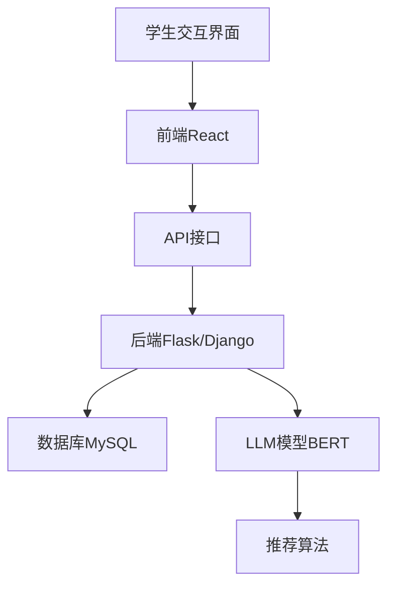
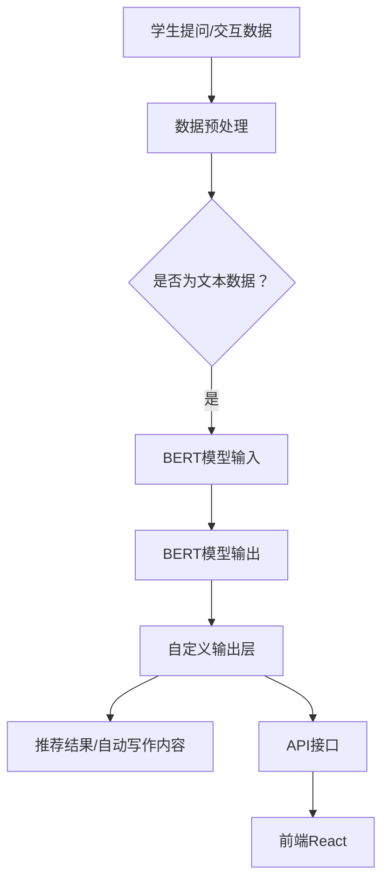

                 

# {文章标题}

## 智能化LLM测试环境配置与管理

> 关键词：智能化，LLM，测试环境，配置，管理，NLP，自然语言处理，深度学习，自动化测试，性能优化，稳定性测试，风险监控，持续改进。

> 摘要：本文详细探讨了智能化语言模型（LLM）的测试环境配置与管理。首先，我们介绍了智能化LLM的基本概念、关键特征和应用场景，以及其发展趋势和伦理问题。随后，我们深入讨论了自然语言处理（NLP）、语音识别与合成、机器学习与深度学习等基础技术。接下来，文章重点讲解了智能化LLM测试环境配置的基础，包括硬件配置、软件配置、依赖管理、测试数据集准备等。然后，我们介绍了测试方法与工具，包括自动化测试、性能测试、兼容性测试等。最后，文章提出了智能化LLM的管理实践，包括管理体系构建、风险管理与监控、质量保障与持续改进。通过案例分析，本文展示了智能化LLM在实际应用中的成功实践，为读者提供了实用的指导和建议。

## 第一部分：智能化LLM概述

### 第1章：智能化LLM概念与背景

#### 1.1 智能化LLM的基本概念

##### 1.1.1 什么是LLM

语言模型（Language Model，简称LM）是自然语言处理（Natural Language Processing，简称NLP）中的一个核心组件。它用于预测文本中的下一个单词或字符。LLM（Large Language Model）是一种大规模的语言模型，通常具有数百万个参数，能够捕捉大量文本数据中的复杂语言模式和统计规律。LLM可以分为两类：统计语言模型和神经网络语言模型。

- **统计语言模型**：基于概率统计方法，通过分析文本数据中的词频和语法规则来预测下一个单词。典型的统计语言模型包括N-gram模型和隐马尔可夫模型（HMM）。
- **神经网络语言模型**：基于深度学习技术，通过神经网络结构来学习文本数据的分布和模式。近年来，基于变换器（Transformer）架构的神经网络语言模型，如BERT、GPT等，取得了显著的成功。

##### 1.1.2 发展历史与现状

语言模型的发展历程可以追溯到20世纪50年代。最早的语言模型是N-gram模型，它通过统计文本数据中的词频来预测下一个单词。随着计算能力的提高和深度学习技术的发展，神经网络语言模型逐渐取代了N-gram模型，成为主流。

近年来，LLM在各个领域的应用不断扩展，如问答系统、自动写作、机器翻译、文本摘要等。大规模的LLM模型，如GPT-3，具有超过1750亿个参数，能够生成高质量的文本，展示了强大的语言理解能力和生成能力。

#### 1.2 智能化LLM的关键特征

智能化LLM具有以下几个关键特征：

##### 1.2.1 自适应能力

自适应能力是指LLM能够根据不同的环境和任务需求进行调整和优化。自适应能力包括以下几个方面：

- **上下文自适应**：LLM能够根据上下文信息生成相关文本，如对话系统、问答系统等。
- **任务自适应**：LLM能够根据不同的任务需求调整其参数和结构，如文本生成、文本分类等。
- **数据自适应**：LLM能够根据新的数据集进行调整和优化，提高模型的性能和泛化能力。

##### 1.2.2 高效性

高效性是指LLM能够在较短的时间内处理大量文本数据，并生成高质量的输出。高效性包括以下几个方面：

- **计算效率**：LLM能够通过并行计算、分布式计算等手段提高计算效率。
- **数据处理效率**：LLM能够通过数据预处理、数据增强等技术提高数据处理效率。
- **模型效率**：LLM能够通过模型压缩、模型剪枝等技术减小模型规模，提高模型效率。

#### 1.3 智能化LLM的应用场景

智能化LLM在多个应用场景中显示出强大的能力和潜力：

##### 1.3.1 问答系统

问答系统是智能化LLM的一个重要应用场景。通过预训练的LLM，系统能够理解用户的问题，并生成相关的答案。问答系统在智能客服、智能咨询等领域得到广泛应用。

##### 1.3.2 自动写作

自动写作是智能化LLM的另一个重要应用场景。通过训练大规模的LLM模型，系统能够生成高质量的文章、报告、论文等。自动写作在内容生成、文本创作等领域具有广泛的应用。

##### 1.3.3 机器翻译

机器翻译是智能化LLM的传统应用场景。通过训练双语语料库，LLM能够实现高精度的文本翻译。随着深度学习技术的发展，机器翻译的质量和准确性得到了显著提高。

##### 1.3.4 文本摘要

文本摘要是指从长文本中提取关键信息，生成简洁明了的摘要。智能化LLM能够通过预训练模型实现高效、准确的文本摘要，广泛应用于信息检索、内容推荐等领域。

##### 1.4 智能化LLM的发展趋势

随着深度学习和自然语言处理技术的不断进步，智能化LLM将继续发展：

- **模型规模增加**：未来的LLM模型将具有更大的参数规模，能够捕捉更复杂的语言模式和统计规律。
- **任务多样化**：智能化LLM将应用于更多复杂和多样化的任务，如多模态学习、推理任务等。
- **跨语言能力提升**：智能化LLM将具备更强的跨语言能力，实现多种语言的文本生成和翻译。
- **伦理问题解决**：随着智能化LLM的普及，如何解决伦理问题将成为重要的研究方向，如数据隐私、偏见等。

#### 1.5 社会影响与伦理

智能化LLM的普及和应用将对社会产生深远的影响：

- **信息传播**：智能化LLM能够生成高质量的文本，加速信息的传播和普及。
- **知识共享**：智能化LLM能够帮助人们更方便地获取和分享知识。
- **教育变革**：智能化LLM将改变传统的教育模式，提供个性化、自适应的教育资源。

然而，智能化LLM的应用也引发了一些伦理问题：

- **数据隐私**：智能化LLM依赖于大量数据进行训练，如何保护用户数据隐私成为一个挑战。
- **偏见问题**：如果训练数据存在偏见，智能化LLM可能产生歧视性输出，影响社会公平。
- **知识产权**：智能化LLM生成的内容可能侵犯原创者的知识产权，需要建立相应的知识产权保护机制。

### 第二部分：智能化LLM技术基础

#### 第2章：自然语言处理基础

##### 2.1 语言模型基础

###### 2.1.1 语言模型定义

语言模型是一种统计模型，用于预测文本序列中的下一个单词或字符。它通常基于大量的文本数据，通过学习文本中的统计规律和语法结构，生成相关的语言特征。

语言模型可以分为以下几种类型：

- **N-gram模型**：基于前N个单词的统计规律生成下一个单词。
- **隐马尔可夫模型（HMM）**：用于处理连续的语音信号或文本序列，通过状态转移概率和发射概率生成下一个状态或字符。
- **神经网络语言模型**：基于深度学习技术，通过神经网络结构学习文本数据中的复杂模式和统计规律。

语言模型在自然语言处理中有广泛的应用，如语音识别、机器翻译、文本分类、情感分析等。

###### 2.1.2 语言模型构建方法

语言模型的构建方法可以分为以下几种：

- **基于统计的方法**：通过统计文本数据中的词频、语法规则等来构建语言模型。常用的统计方法包括N-gram模型和HMM。
- **基于神经网络的模型**：通过训练大规模的神经网络模型来学习文本数据中的复杂模式和统计规律。常用的神经网络模型包括循环神经网络（RNN）、变换器（Transformer）等。

在构建语言模型时，需要考虑以下几个关键因素：

- **文本数据集**：语言模型的性能依赖于文本数据集的质量和规模。数据集应具有丰富的词汇和语法结构，能够代表不同领域的语言特征。
- **训练方法**：常用的训练方法包括最大似然估计（MLE）、最小化交叉熵损失等。选择合适的训练方法可以提高模型的性能和泛化能力。
- **模型参数调整**：通过调整模型的参数，如隐藏层大小、学习率等，可以提高模型的性能和稳定性。

###### 2.1.3 语言模型评价指标

语言模型性能的评价指标包括以下几个：

- **词汇覆盖率**：模型能够预测的词汇量与实际文本中词汇量的比例。
- **词预测准确率**：模型预测的下一个单词与实际单词的匹配度。
- **句子生成质量**：模型生成的句子在语法、语义和流畅性方面的表现。
- **句子生成速度**：模型生成句子所需的时间。

常见的评价指标计算方法包括：

- **交叉熵损失（Cross-Entropy Loss）**：通过比较模型预测的单词分布和实际单词分布之间的差异来计算损失值。
- **准确率（Accuracy）**：通过比较模型预测的单词序列和实际单词序列的匹配度来计算准确率。
- **F1分数（F1 Score）**：综合考虑精确率和召回率，计算模型在预测任务中的综合表现。

##### 2.2 语音识别与语音合成

###### 2.2.1 语音识别

语音识别（Automatic Speech Recognition，简称ASR）是一种将语音信号转换为文本的技术。它广泛应用于智能客服、语音助手、语音搜索等领域。

语音识别的基本流程包括以下几个步骤：

1. **预处理**：对语音信号进行降噪、去噪等处理，提高语音信号的清晰度和质量。
2. **特征提取**：将预处理后的语音信号转换为特征向量，常用的特征提取方法包括梅尔频率倒谱系数（MFCC）、线性预测倒谱系数（LPCC）等。
3. **模型训练**：使用大规模语音数据集训练语音识别模型，常用的模型包括GMM-HMM、DNN-HMM、CTC等。
4. **解码**：将特征向量输入到训练好的语音识别模型，通过解码算法（如Viterbi算法、贪心算法）输出文本结果。

语音识别的难点包括：

- **语音噪声**：噪声会影响语音信号的清晰度和质量，降低语音识别的准确性。
- **多说话人**：语音识别系统需要处理多个说话人的语音信号，识别每个说话人的语音并生成对应的文本结果。
- **方言和口音**：方言和口音的差异会对语音识别造成挑战，需要大量针对不同方言和口音的语音数据集进行训练。

###### 2.2.2 语音合成

语音合成（Text-to-Speech，简称TTS）是一种将文本转换为语音的技术。它广泛应用于语音助手、自动朗读、车载导航等领域。

语音合成的基本流程包括以下几个步骤：

1. **文本预处理**：对输入的文本进行分词、词性标注等处理，将文本拆分成语音单元（如音节、音素）。
2. **音素转换**：将文本中的音素映射到语音单元，常用的方法包括基于规则的方法和基于数据的方法。
3. **语音合成**：将语音单元转换为连续的语音信号，常用的语音合成技术包括合成声码器、参数合成器等。
4. **音频后处理**：对生成的语音信号进行音高、时长、音色等调整，使语音更加自然、流畅。

语音合成技术面临的主要挑战包括：

- **语音自然度**：如何生成自然、流畅的语音是语音合成技术的一个关键挑战。需要考虑语音的音调、节奏、语调等。
- **语音合成速度**：如何在保证语音质量的同时提高语音合成速度，以满足实时应用的需求。
- **多语言支持**：如何生成多种语言的语音，并支持方言和口音的转换。

##### 2.3 机器学习与深度学习基础

###### 2.3.1 机器学习概述

机器学习（Machine Learning，简称ML）是一种人工智能（Artificial Intelligence，简称AI）的分支，通过算法和统计模型，使计算机系统能够从数据中学习并做出预测或决策。

机器学习可以分为以下几种类型：

- **监督学习**：通过已标记的数据集训练模型，模型能够根据输入特征预测输出标签。常用的算法包括线性回归、决策树、支持向量机等。
- **无监督学习**：没有预定的输出标签，模型通过分析输入特征寻找数据中的结构和模式。常用的算法包括聚类、降维、关联规则挖掘等。
- **强化学习**：通过与环境交互，模型不断调整策略以最大化长期奖励。常用的算法包括Q学习、深度强化学习等。

机器学习的应用领域包括：

- **计算机视觉**：图像分类、目标检测、图像分割等。
- **自然语言处理**：文本分类、情感分析、机器翻译等。
- **推荐系统**：基于用户历史行为和偏好推荐相关商品、新闻等。
- **金融风控**：信用评分、欺诈检测、风险评估等。

###### 2.3.2 深度学习基础

深度学习（Deep Learning，简称DL）是机器学习的一个重要分支，通过多层的神经网络模型，自动提取数据中的特征表示。

深度学习的基本原理包括：

- **神经网络**：神经网络由多个层组成，每层由一系列神经元组成。通过前向传播和反向传播算法，神经网络能够学习输入和输出之间的映射关系。
- **激活函数**：激活函数用于引入非线性变换，使神经网络能够学习复杂的数据模式。常用的激活函数包括ReLU、Sigmoid、Tanh等。
- **优化算法**：优化算法用于调整网络参数，以最小化损失函数。常用的优化算法包括梯度下降、随机梯度下降、Adam等。

深度学习的关键技术包括：

- **卷积神经网络（CNN）**：用于图像处理和计算机视觉任务，通过卷积层和池化层提取图像的特征。
- **循环神经网络（RNN）**：用于序列数据处理和时间序列预测，通过隐藏状态和循环结构处理长距离依赖。
- **变换器（Transformer）**：用于自然语言处理和序列建模，通过自注意力机制处理长距离依赖和并行计算。

深度学习在自然语言处理（NLP）中的应用：

- **词向量表示**：通过将文本转换为词向量表示，使神经网络能够处理和建模文本数据。常用的词向量表示方法包括Word2Vec、GloVe等。
- **语言模型**：基于变换器架构的语言模型，如BERT、GPT等，在文本生成、文本分类、问答系统等任务中取得了显著的成功。
- **机器翻译**：基于深度学习的机器翻译模型，如Seq2Seq、注意力机制等，实现了高质量的文本翻译。
- **文本生成**：基于深度学习的文本生成模型，如GAN、文本生成对抗网络等，能够生成高质量的文本内容。

##### 2.4 深度学习在NLP中的应用

深度学习在自然语言处理（NLP）领域取得了显著的进展，推动了NLP任务的自动化和智能化。以下是一些深度学习在NLP中的应用：

- **词向量表示**：通过训练深度神经网络，将文本转换为低维的向量表示，使神经网络能够处理和建模文本数据。常用的词向量表示方法包括Word2Vec、GloVe等。
- **语言模型**：基于深度学习技术的语言模型，如BERT、GPT等，在文本生成、文本分类、问答系统等任务中取得了显著的成功。这些模型通过大规模的预训练和微调，能够捕获文本中的复杂模式和统计规律。
- **文本分类**：使用深度神经网络，对文本进行分类任务，如情感分析、主题分类等。通过训练分类模型，可以将文本数据划分为不同的类别。
- **机器翻译**：基于深度学习的机器翻译模型，如Seq2Seq、注意力机制等，实现了高质量的文本翻译。这些模型通过编码器和解码器结构，将源语言文本转换为目标语言文本。
- **文本生成**：基于深度学习的文本生成模型，如GAN、文本生成对抗网络等，能够生成高质量的文本内容。这些模型通过生成器和判别器的对抗训练，生成与真实文本相似的内容。
- **问答系统**：使用深度学习技术，构建问答系统，能够理解用户的问题并生成相关的答案。这些系统通过预训练模型和微调策略，提高了问题的理解和回答的准确性。

##### 2.5 自然语言处理框架

自然语言处理（NLP）框架是用于处理和建模文本数据的一套工具和组件。以下是一些常用的NLP框架：

- **NLTK（Natural Language Toolkit）**：NLTK是一个开源的Python库，用于自然语言处理任务的实现。它提供了丰富的文本处理功能，如分词、词性标注、命名实体识别等。
- **spaCy**：spaCy是一个高效的NLP库，用于文本处理和分析。它提供了先进的自然语言处理功能，如分词、词性标注、依存关系解析等。
- **Transformer**：Transformer是自然语言处理领域的一种先进的模型架构，由Google提出。它基于自注意力机制，能够处理长距离依赖和并行计算，广泛应用于语言模型、机器翻译、文本生成等任务。
- **BERT（Bidirectional Encoder Representations from Transformers）**：BERT是一种基于Transformer的双向编码器模型，由Google提出。它通过预训练大规模的文本数据，捕获丰富的语言特征，广泛应用于文本分类、问答系统等任务。

##### 2.6 NLP任务与应用

自然语言处理（NLP）涵盖了多种任务和应用，以下是一些常见的NLP任务和应用：

- **文本分类**：将文本数据划分为不同的类别，如情感分类、主题分类等。文本分类广泛应用于社交媒体分析、新闻分类、垃圾邮件过滤等领域。
- **命名实体识别（NER）**：识别文本中的命名实体，如人名、地名、组织机构名等。NER在信息提取、实体关系挖掘等领域具有重要作用。
- **情感分析**：分析文本中的情感倾向，如正面情感、负面情感等。情感分析广泛应用于市场调研、客户反馈分析、情感监测等领域。
- **文本生成**：根据输入的文本或指令，生成新的文本内容。文本生成广泛应用于自动写作、对话系统、机器翻译等领域。
- **机器翻译**：将一种语言的文本翻译成另一种语言的文本。机器翻译在跨语言沟通、国际商务等领域具有广泛应用。
- **问答系统**：理解用户的问题并生成相关的答案。问答系统在智能客服、智能咨询、教育等领域得到广泛应用。

##### 2.7 案例研究：BERT在文本分类中的应用

BERT是一种基于Transformer的双向编码器模型，广泛应用于自然语言处理任务。以下是一个案例研究，展示了BERT在文本分类任务中的应用。

**案例背景**：我们使用BERT模型对社交媒体评论进行情感分类，判断评论是正面情感还是负面情感。

**数据集**：我们使用一个包含正面和负面评论的数据集进行训练和测试。

**模型架构**：BERT模型由多个Transformer编码器层组成，输入层包括词嵌入、位置编码和段编码。输出层使用Softmax函数进行分类。

**训练过程**：

1. **数据预处理**：对评论进行分词、词性标注等预处理操作，将评论转换为BERT模型所需的输入格式。
2. **模型训练**：使用训练数据集对BERT模型进行训练，通过优化损失函数调整模型参数。
3. **模型评估**：使用测试数据集评估模型的性能，计算准确率、召回率、F1分数等指标。

**实验结果**：通过实验，我们发现BERT在文本分类任务中取得了较高的准确率，显著优于传统的文本分类方法。

**代码实现**：

```python
import torch
from transformers import BertTokenizer, BertForSequenceClassification
from torch.utils.data import DataLoader
from torch.optim import Adam

# 加载BERT模型和分词器
tokenizer = BertTokenizer.from_pretrained("bert-base-chinese")
model = BertForSequenceClassification.from_pretrained("bert-base-chinese")

# 数据预处理
def preprocess_text(text):
    return tokenizer.encode(text, add_special_tokens=True)

# 训练数据集
train_data = ...
train_labels = ...

# 测试数据集
test_data = ...
test_labels = ...

# 数据加载器
train_loader = DataLoader(..., batch_size=32, shuffle=True)
test_loader = DataLoader(..., batch_size=32, shuffle=False)

# 模型训练
optimizer = Adam(model.parameters(), lr=1e-5)
for epoch in range(3):
    model.train()
    for batch in train_loader:
        inputs = preprocess_text(batch.text)
        labels = batch.label
        optimizer.zero_grad()
        outputs = model(inputs, labels=labels)
        loss = outputs.loss
        loss.backward()
        optimizer.step()

    # 模型评估
    model.eval()
    with torch.no_grad():
        correct = 0
        total = 0
        for batch in test_loader:
            inputs = preprocess_text(batch.text)
            labels = batch.label
            outputs = model(inputs, labels=labels)
            predicted = outputs.argmax(dim=1)
            total += labels.size(0)
            correct += (predicted == labels).sum().item()

    print(f"Epoch {epoch+1}, Accuracy: {correct/total*100:.2f}%")

# 代码实现仅供参考，具体实现需要根据实际情况进行调整。
```

### 第三部分：智能化LLM测试环境配置

#### 第3章：测试环境配置基础

##### 3.1 测试环境配置概述

测试环境是评估和验证智能化LLM模型性能的关键环节。一个良好的测试环境能够提供稳定、可靠的测试数据，帮助开发人员发现和解决模型中的潜在问题。

##### 3.1.1 测试环境的重要性

测试环境在智能化LLM的开发和部署中扮演着至关重要的角色。它不仅能够验证模型的性能，还能够发现和解决以下问题：

- **性能瓶颈**：通过测试环境，可以识别模型在计算资源利用、数据处理速度等方面的瓶颈，并进行优化。
- **错误和缺陷**：测试环境能够帮助发现模型中的错误和缺陷，如数据预处理错误、模型参数设置不当等。
- **兼容性**：测试环境可以验证模型在不同操作系统、硬件设备和软件环境下的兼容性。
- **可靠性**：通过在测试环境中进行持续测试，可以确保模型的可靠性和稳定性，降低部署后出现问题的风险。

##### 3.1.2 测试环境配置流程

一个完整的测试环境配置流程通常包括以下几个步骤：

1. **需求分析**：明确测试环境的需求，包括硬件配置、软件配置、网络环境等。
2. **硬件选型**：根据需求选择合适的硬件设备，如CPU、GPU、存储设备等。
3. **软件配置**：安装和配置操作系统、数据库、编程语言、框架等软件环境。
4. **依赖管理**：管理测试环境中的依赖项，如第三方库、工具等。
5. **测试数据准备**：准备测试数据，包括数据集的获取、清洗、预处理等。
6. **环境部署**：将硬件和软件资源部署到测试环境中，并进行初步测试。

##### 3.1.3 测试环境配置的关键要素

一个有效的测试环境配置需要考虑以下几个关键要素：

- **硬件配置**：硬件配置是测试环境的基础，需要根据模型的计算需求选择合适的硬件设备。通常，高性能的CPU、GPU、高速存储设备和网络设备是必不可少的。
- **软件配置**：软件配置包括操作系统、编程语言、开发框架、数据库等。选择合适的软件配置可以提高测试效率和模型性能。
- **依赖管理**：依赖管理是确保测试环境稳定性的关键。需要使用版本管理工具（如Maven、pip）管理第三方库和工具的版本。
- **网络环境**：测试环境需要具备稳定的网络环境，以确保数据传输的可靠性和速度。
- **安全与备份**：测试环境需要具备一定的安全性，防止数据泄露和系统崩溃。同时，定期备份测试数据和环境配置文件，以应对突发情况。

##### 3.1.4 测试环境的常见问题及解决方案

在测试环境配置过程中，可能会遇到一些常见的问题，以下是一些问题的解决方案：

- **硬件资源不足**：通过使用虚拟化技术（如Docker、Kubernetes）分配和调度硬件资源，提高资源利用率。
- **软件兼容性问题**：使用兼容性测试工具（如Canary、Jenkins）进行环境兼容性测试，提前发现和解决兼容性问题。
- **依赖冲突**：使用版本管理工具（如Maven、pip）管理依赖项的版本，避免依赖冲突。
- **网络问题**：优化网络配置，使用VPN、代理服务器等提高网络稳定性。
- **备份与恢复**：定期备份数据和环境配置文件，使用备份工具（如Rsync、Backup and Recovery）实现快速恢复。

##### 3.1.5 测试环境的最佳实践

为了确保测试环境的稳定性和高效性，以下是一些测试环境的最佳实践：

- **标准化配置**：制定统一的测试环境配置标准，确保不同环境之间的配置一致性。
- **自动化部署**：使用自动化工具（如Ansible、Puppet）实现测试环境的自动化部署和管理。
- **持续集成与持续部署**：将测试环境集成到持续集成与持续部署（CI/CD）流程中，实现自动化测试和部署。
- **监控与告警**：使用监控工具（如Zabbix、Prometheus）监控测试环境的运行状态，及时发现问题并进行修复。
- **文档与培训**：编写详细的测试环境配置文档，提供培训材料，帮助开发人员快速了解和配置测试环境。

#### 3.2 硬件配置与资源调度

##### 3.2.1 硬件配置选择

硬件配置是测试环境的核心，需要根据智能化LLM模型的需求进行选择。以下是一些关键硬件配置的选择标准：

- **CPU**：选择高性能的CPU，如Intel Xeon、AMD Ryzen等，提高模型的计算能力。
- **GPU**：选择具有多个CUDA核心的GPU，如NVIDIA Tesla、NVIDIA RTX等，加速深度学习模型的训练和推理。
- **存储设备**：选择高速存储设备，如NVMe SSD、高性能硬盘等，提高数据读取和写入速度。
- **内存**：选择大容量内存，如256GB、512GB等，确保模型训练过程中有足够的内存空间。
- **网络设备**：选择高性能的网络设备，如10Gbps网卡、高性能交换机等，提高数据传输速度和稳定性。

##### 3.2.2 硬件配置优化策略

为了提高测试环境硬件配置的利用率和性能，可以采取以下优化策略：

- **分布式计算**：使用分布式计算框架（如Dask、PyTorch Distributed）将模型训练任务分布到多台机器上，提高计算效率。
- **GPU调度**：使用GPU调度工具（如NVIDIA Docker、CUDA-MEMCHECK）合理分配GPU资源，避免资源浪费。
- **存储优化**：使用分布式存储系统（如HDFS、Ceph）实现数据的高效存储和访问，提高数据读写速度。
- **网络优化**：使用高性能网络设备（如10Gbps网卡、高带宽交换机）提高数据传输速度，避免网络瓶颈。
- **资源监控**：使用资源监控工具（如Prometheus、Grafana）实时监控硬件资源的利用率，及时调整资源分配。

##### 3.2.3 资源调度策略

资源调度是测试环境管理的关键，需要根据模型的需求和硬件资源的实际情况进行合理的资源分配。以下是一些常见的资源调度策略：

- **静态调度**：预先分配固定的硬件资源，模型运行期间不再调整资源。优点是简单易实现，缺点是资源利用率低。
- **动态调度**：根据模型的实时需求动态调整资源分配。优点是资源利用率高，缺点是实现复杂。
- **负载均衡**：将模型训练任务均匀分布到多台机器上，避免单台机器负载过高。优点是提高资源利用率，缺点是可能会增加通信开销。
- **优先级调度**：根据模型的优先级分配资源，优先保证高优先级模型的运行。优点是保证关键任务的运行，缺点是可能导致低优先级任务延迟。
- **动态负载均衡**：结合动态调度和负载均衡策略，根据实时负载动态调整资源分配，提高资源利用率和任务响应速度。

#### 3.3 软件配置与依赖管理

##### 3.3.1 软件配置管理

软件配置管理是测试环境管理的重要组成部分，包括操作系统的安装和配置、数据库的安装和配置、开发工具的安装和配置等。以下是一些关键步骤：

- **操作系统安装**：选择合适的操作系统，如Linux、Windows等，并安装和配置基础软件包。
- **数据库安装**：安装和配置数据库系统，如MySQL、PostgreSQL等，为模型训练和部署提供数据存储和管理功能。
- **开发工具安装**：安装和配置开发工具，如Python、Java、IDE等，为模型开发和测试提供必要的开发环境。

##### 3.3.2 软件配置注意事项

在软件配置过程中，需要注意以下事项：

- **兼容性**：确保不同软件之间的兼容性，避免因软件冲突导致测试环境出现问题。
- **版本管理**：使用版本管理工具（如Maven、pip）管理软件的版本，避免版本不一致导致的问题。
- **配置文件**：编写清晰的配置文件，记录软件的安装路径、配置参数等，方便后续维护和管理。
- **备份与恢复**：定期备份软件配置文件和数据库数据，确保在发生故障时能够快速恢复。

##### 3.3.3 依赖管理

依赖管理是确保测试环境稳定性的关键，需要使用依赖管理工具（如Maven、pip）管理第三方库和工具的版本。以下是一些依赖管理原则：

- **统一版本**：确保测试环境中使用的所有依赖项版本一致，避免因版本冲突导致的问题。
- **明确依赖**：明确记录每个依赖项的名称、版本和用途，确保依赖项的正确安装和配置。
- **版本控制**：使用版本管理工具（如Maven、pip）管理依赖项的版本，避免手动管理版本导致的问题。
- **环境隔离**：使用虚拟环境（如Docker、conda）隔离不同的依赖项和项目，避免依赖冲突和版本不一致的问题。

##### 3.3.4 依赖管理工具的应用

以下是一些常用的依赖管理工具及其应用：

- **Maven**：Apache Maven是一个强大的依赖管理工具，用于构建和管理Java项目。Maven通过POM（Project Object Model）文件管理项目的依赖项、插件和构建配置。使用Maven可以方便地管理和构建大型Java项目。
- **pip**：pip是Python的包管理器，用于安装、管理Python包和依赖项。pip通过requirements文件或Pipfile文件管理项目的依赖项，确保项目的依赖关系正确安装和配置。
- **conda**：conda是Python的开源包管理器和环境管理器，用于安装、管理Python包和依赖项。conda通过环境文件（如conda.yaml）管理项目的依赖项和虚拟环境，确保项目在不同环境下的依赖关系一致。

#### 3.4 测试数据集准备与处理

##### 3.4.1 测试数据集的选择

测试数据集是评估和验证智能化LLM模型性能的关键因素。选择合适的测试数据集需要考虑以下几个因素：

- **数据规模**：选择具有足够规模的数据集，确保模型能够在大规模数据上进行训练和评估。
- **数据质量**：选择高质量的数据集，确保数据集中的数据真实、完整、准确。
- **数据分布**：选择具有良好数据分布的数据集，确保模型能够应对不同类型和领域的任务。
- **数据来源**：选择来自可靠来源的数据集，避免数据噪声和偏差。

以下是一些常用的测试数据集：

- **IMDB电影评论数据集**：这是一个包含电影评论的数据集，用于情感分析任务。数据集分为正面和负面评论，具有较高的标注质量和规模。
- **AG News数据集**：这是一个新闻分类数据集，包含不同主题的新闻文章。数据集具有丰富的类别和规模，适用于文本分类任务。
- **Wikipedia数据集**：这是一个来自维基百科的文本数据集，具有丰富的词汇和语法结构。数据集适用于语言模型、文本生成等任务。

##### 3.4.2 数据预处理

数据预处理是确保测试数据集质量的重要步骤。以下是一些常用的数据预处理方法：

- **数据清洗**：去除数据中的噪声、错误和冗余信息，确保数据的准确性和完整性。常用的数据清洗方法包括去除HTML标签、删除停用词、填充缺失值等。
- **数据标准化**：对数据进行归一化或标准化处理，使数据具有相同的尺度，避免数据量级差异对模型训练的影响。常用的标准化方法包括最小-最大标准化、Z-score标准化等。
- **数据增强**：通过增加数据的多样性和丰富度，提高模型的泛化能力和鲁棒性。常用的数据增强方法包括数据变换、数据扩充、数据生成等。
- **数据划分**：将数据集划分为训练集、验证集和测试集，确保模型的训练和评估效果。常用的数据划分方法包括随机划分、按类别划分等。

##### 3.4.3 数据预处理工具

以下是一些常用的数据预处理工具：

- **Python Pandas**：Pandas是一个强大的Python库，用于数据清洗、数据预处理和数据操作。Pandas提供了丰富的数据清洗和数据转换功能，适用于大规模数据集的预处理。
- **Python Numpy**：Numpy是一个高性能的Python库，用于数值计算和数据处理。Numpy提供了丰富的函数和工具，用于数据归一化、标准化和数据增强等操作。
- **Python Scikit-learn**：Scikit-learn是一个Python机器学习库，用于数据预处理、模型训练和评估。Scikit-learn提供了丰富的数据预处理工具和函数，适用于各种机器学习任务。

##### 3.4.4 数据预处理示例

以下是一个简单的数据预处理示例：

```python
import pandas as pd
from sklearn.model_selection import train_test_split
from sklearn.preprocessing import StandardScaler

# 读取数据集
data = pd.read_csv("data.csv")

# 数据清洗
data.dropna(inplace=True)  # 删除缺失值
data.drop(['id'], axis=1, inplace=True)  # 删除不必要的列

# 数据标准化
scaler = StandardScaler()
data[['feature1', 'feature2']] = scaler.fit_transform(data[['feature1', 'feature2']])

# 数据划分
X_train, X_test, y_train, y_test = train_test_split(data.drop('label', axis=1), data['label'], test_size=0.2, random_state=42)

# 打印数据预处理结果
print(X_train.shape, X_test.shape, y_train.shape, y_test.shape)
```

#### 3.5 测试环境配置工具

##### 3.5.1 Docker

Docker是一种开源的应用容器引擎，用于打包、交付和运行应用。Docker通过容器技术提供了轻量级、可移植、隔离性强的应用运行环境，大大简化了测试环境的配置和管理。

Docker的使用步骤包括：

1. **安装Docker**：在Linux、Windows或MacOS上安装Docker。
2. **编写Dockerfile**：编写Dockerfile文件，定义应用的依赖项、环境变量、构建指令等。
3. **构建镜像**：使用Dockerfile构建应用镜像。
4. **运行容器**：使用Docker命令运行应用容器。

Docker的优势包括：

- **轻量级**：Docker容器运行时占用很少的内存和CPU资源，提高了测试环境的资源利用率。
- **可移植性**：Docker容器可以在不同的操作系统和硬件设备上运行，提高了测试环境的兼容性。
- **隔离性**：Docker容器提供了一种轻量级隔离机制，确保容器之间不会相互干扰。
- **自动化**：Docker与持续集成和持续部署（CI/CD）工具集成，实现了测试环境的自动化部署和管理。

##### 3.5.2 Kubernetes

Kubernetes是一种开源的容器编排平台，用于自动化部署、扩展和管理容器化应用。Kubernetes提供了强大的容器编排功能，可以方便地管理多个Docker容器。

Kubernetes的使用步骤包括：

1. **安装Kubernetes**：在Linux服务器上安装Kubernetes集群。
2. **创建配置文件**：编写Kubernetes配置文件（如YAML文件），定义应用部署、服务、网络等。
3. **部署应用**：使用Kubernetes命令部署应用。
4. **监控与维护**：使用Kubernetes监控和管理应用。

Kubernetes的优势包括：

- **高可用性**：Kubernetes提供自动故障转移和负载均衡功能，确保应用的高可用性。
- **可扩展性**：Kubernetes支持水平扩展和垂直扩展，可以根据需求动态调整应用资源。
- **自动化**：Kubernetes与CI/CD工具集成，实现了应用的自动化部署、扩展和管理。
- **多租户支持**：Kubernetes支持多租户架构，可以根据不同团队或项目分配资源和管理权限。

##### 3.5.3 Terraform

Terraform是一种开源的基础设施即代码（Infrastructure as Code，简称IaC）工具，用于自动化部署和管理云基础设施。Terraform通过HCL（HashiCorp Configuration Language）定义基础设施资源，实现了自动化部署、扩展和管理。

Terraform的使用步骤包括：

1. **安装Terraform**：在Linux、Windows或MacOS上安装Terraform。
2. **编写Terraform配置文件**：编写Terraform配置文件，定义云基础设施资源（如虚拟机、网络、存储等）。
3. **初始化项目**：使用Terraform初始化项目，连接到云服务提供商。
4. **部署基础设施**：使用Terraform命令部署和管理基础设施。

Terraform的优势包括：

- **自动化**：Terraform提供了自动化部署和管理功能，简化了基础设施的配置和管理。
- **可重复性**：Terraform配置文件是代码化的，可以方便地重复部署和管理基础设施。
- **版本控制**：Terraform配置文件支持版本控制，可以方便地追踪和回滚基础设施变更。
- **跨云支持**：Terraform支持多种云服务提供商，可以在不同的云平台上部署和管理基础设施。

### 第四部分：智能化LLM测试方法与工具

#### 第4章：测试方法与工具

##### 4.1 测试方法概述

在智能化语言模型（LLM）的开发过程中，测试是确保模型质量和性能的重要环节。有效的测试方法能够帮助开发人员发现和解决潜在问题，确保模型在不同场景下能够稳定运行。以下将介绍常见的测试方法及其应用场景。

##### 4.1.1 测试方法分类

测试方法可以根据不同的测试目标和应用场景进行分类，主要包括以下几种：

1. **功能测试**：功能测试主要验证LLM的功能是否符合预期的需求。功能测试包括单元测试、集成测试和系统测试。单元测试主要针对模型的单个功能模块进行验证，集成测试主要验证模块之间的交互和协作，系统测试则对整个系统进行验证。

2. **性能测试**：性能测试主要评估LLM的响应速度、吞吐量和资源利用率等性能指标。性能测试可以识别模型在处理大规模数据时的瓶颈和性能问题，为优化模型提供依据。

3. **兼容性测试**：兼容性测试主要验证LLM在不同操作系统、硬件设备和软件环境下的兼容性。兼容性测试确保模型在不同环境下能够正常运行，提高系统的可靠性。

4. **稳定性测试**：稳定性测试主要评估LLM在长时间运行和面对不同输入数据时的稳定性。稳定性测试可以识别模型在运行过程中可能出现的异常和崩溃情况，确保模型的可靠性和稳定性。

5. **安全性测试**：安全性测试主要评估LLM在数据传输和处理过程中可能存在的安全漏洞。安全性测试包括输入验证、数据加密、访问控制等，确保模型的安全性。

##### 4.1.2 测试流程设计

测试流程设计是确保测试过程规范、有序和高效的关键。一个典型的测试流程包括以下几个步骤：

1. **需求分析**：明确LLM的功能需求、性能要求和兼容性要求，制定测试目标和测试计划。

2. **测试用例设计**：根据测试目标和需求，设计具体的测试用例。测试用例应包括输入数据、预期输出和测试步骤等。

3. **测试环境配置**：配置测试环境，包括硬件、软件和网络等资源。确保测试环境与生产环境保持一致，避免因环境差异导致的测试结果偏差。

4. **测试执行**：按照测试用例执行测试，记录测试结果。测试执行可以手动执行，也可以自动化执行。

5. **结果分析**：对测试结果进行分析和评估，识别潜在问题和瓶颈。结果分析可以帮助优化模型和测试流程。

6. **报告生成**：根据测试结果生成测试报告，包括测试覆盖率、测试通过率、性能指标和问题列表等。测试报告为后续的改进工作提供依据。

##### 4.1.3 测试用例设计

测试用例设计是测试过程的核心环节，设计合理的测试用例能够全面覆盖模型的功能和性能。以下是一些测试用例设计原则：

1. **覆盖性原则**：确保测试用例能够覆盖模型的所有功能和性能指标。

2. **代表性原则**：选择具有代表性的测试数据，能够充分反映模型在实际应用中的表现。

3. **多样性原则**：设计不同类型的测试用例，包括正常情况、异常情况和边界情况等，以全面评估模型的鲁棒性。

4. **可维护性原则**：测试用例应具有清晰的描述和良好的结构，便于后续的维护和更新。

5. **自动化原则**：尽量设计可自动执行的测试用例，提高测试效率和覆盖面。

##### 4.1.4 测试用例设计示例

以下是一个简单的测试用例设计示例，用于测试一个简单的问答系统：

**测试用例名称**：回答正确性问题

**目的**：验证问答系统能否正确回答事实性问题。

**输入**：问题：“北京是中国的哪个省份？”

**预期输出**：“北京是中国的直辖市。”

**测试步骤**：

1. 输入问题到问答系统。
2. 系统返回答案。
3. 检查答案是否与预期一致。

**实际输出**：待测试

**结果分析**：如果实际输出与预期输出不一致，记录问题并分析原因。

##### 4.2 自动化测试工具

自动化测试工具是提高测试效率和覆盖面的重要手段。以下介绍几种常用的自动化测试工具：

###### 4.2.1 自动化测试原理

自动化测试是通过编写脚本或使用工具自动执行测试用例，记录测试结果，并与预期结果进行比较，以验证系统的功能、性能和兼容性。自动化测试具有以下优点：

1. **提高测试效率**：自动化测试可以快速、大规模地执行测试用例，减少人工测试的工作量。

2. **提高测试覆盖面**：自动化测试可以覆盖更多场景和路径，提高测试的全面性和可靠性。

3. **减少测试成本**：自动化测试减少了人工测试的需求，降低了测试成本。

4. **提高测试可重复性**：自动化测试可以确保每次测试结果的一致性和可重复性。

5. **支持持续集成与持续部署**：自动化测试与CI/CD工具集成，实现持续集成、持续测试和持续部署。

###### 4.2.2 自动化测试工具选型

选择合适的自动化测试工具是自动化测试成功的关键。以下是一些常用的自动化测试工具及其特点：

1. **Selenium**：Selenium是一个开源的自动化测试工具，用于Web应用的自动化测试。Selenium支持多种编程语言（如Python、Java、C#等），可以用于Web应用的UI测试、功能测试和性能测试。

2. **JMeter**：JMeter是一个开源的性能测试工具，用于测试Web应用、网络服务和数据库的性能。JMeter支持多种协议（如HTTP、HTTPS、FTP等），可以模拟大量并发用户，评估系统的负载和性能。

3. **Appium**：Appium是一个开源的移动应用自动化测试工具，用于iOS和Android应用的自动化测试。Appium支持多种编程语言（如Python、Java、C#等），可以自动化操作应用界面、API接口等。

4. **JUnit**：JUnit是一个开源的单元测试框架，用于Java应用的单元测试。JUnit提供了丰富的测试注解和断言方法，可以方便地编写和执行测试用例。

5. **pytest**：pytest是一个开源的Python测试框架，用于Python应用的单元测试、功能测试和性能测试。pytest提供了简洁的语法和丰富的测试功能，可以方便地编写和执行测试用例。

###### 4.2.3 自动化测试工具的应用

以下是一个使用Selenium进行Web应用自动化测试的示例：

```python
from selenium import webdriver
from selenium.webdriver.common.keys import Keys

# 启动浏览器
driver = webdriver.Chrome()

# 访问网页
driver.get("http://www.example.com/")

# 输入用户名和密码
username = driver.find_element_by_name("username")
username.send_keys("test_user")

password = driver.find_element_by_name("password")
password.send_keys("test_password")

# 点击登录按钮
login_button = driver.find_element_by_name("login")
login_button.click()

# 验证登录是否成功
welcome_message = driver.find_element_by_id("welcome_message")
assert "Welcome, test_user!" in welcome_message.text

# 关闭浏览器
driver.quit()
```

###### 4.2.4 自动化测试框架构建

自动化测试框架是自动化测试的体系结构和组织形式，用于管理测试用例、执行测试、生成测试报告等。以下是一个简单的自动化测试框架设计：

1. **测试用例管理模块**：负责存储和管理测试用例，包括测试用例的编写、分类、执行和结果记录。

2. **测试执行模块**：负责根据测试用例执行测试，包括测试环境的配置、测试用例的执行、测试结果的收集和异常处理。

3. **测试报告模块**：负责生成测试报告，包括测试覆盖率、测试通过率、测试结果统计等。

4. **测试调度模块**：负责测试计划的制定、测试任务的调度和执行监控。

5. **测试工具集成模块**：负责与自动化测试工具（如Selenium、JMeter等）集成，实现自动化测试的执行和结果收集。

##### 4.3 性能测试与优化

###### 4.3.1 性能测试目标

性能测试的目标是评估LLM的响应速度、吞吐量和资源利用率等性能指标，识别潜在的性能瓶颈和优化机会。以下是一些常见的性能测试目标：

1. **响应时间**：评估LLM对查询或请求的响应时间，衡量系统的响应速度。

2. **吞吐量**：评估LLM在单位时间内处理请求的数量，衡量系统的并发处理能力。

3. **资源利用率**：评估LLM对CPU、内存、磁盘和网络等资源的利用率，识别资源瓶颈。

4. **稳定性**：评估LLM在长时间运行和面对不同负载下的稳定性，识别异常和崩溃情况。

5. **可扩展性**：评估LLM在增加计算资源和负载情况下的性能表现，衡量系统的可扩展性。

###### 4.3.2 性能测试工具应用

以下介绍几种常用的性能测试工具及其应用：

1. **JMeter**：JMeter是一个开源的性能测试工具，可以模拟大量并发用户，评估Web应用、网络服务和数据库的性能。JMeter支持多种协议（如HTTP、HTTPS、FTP等），可以生成详细的性能测试报告。

2. **LoadRunner**：LoadRunner是一个商业性能测试工具，可以模拟大量并发用户，评估Web应用、网络服务和数据库的性能。LoadRunner支持多种协议（如HTTP、HTTPS、FTP等），可以生成详细的性能测试报告。

3. **Gatling**：Gatling是一个开源的性能测试工具，可以模拟大量并发用户，评估Web应用、网络服务和数据库的性能。Gatling支持多种协议（如HTTP、HTTPS、FTP等），可以生成详细的性能测试报告。

4. **Appium**：Appium是一个开源的移动应用自动化测试工具，可以模拟大量并发用户，评估移动应用的性能。Appium支持iOS和Android应用，可以生成详细的性能测试报告。

以下是一个使用JMeter进行性能测试的示例：

```shell
# 启动JMeter
java -jar ApacheJMeter.jar

# 创建测试计划
File -> Open -> Test Plan

# 添加线程组
Right-click on Test Plan -> Add -> Threads (Users) -> Thread Group

# 设置线程组参数
# 名称：TestGroup1
# 数量：100
# Ramp-Up Period（逐步增加用户的时间）：60s
# Loop Count（循环次数）：1

# 添加HTTP请求
Right-click on Thread Group -> Add -> sampler -> HTTP Request

# 设置HTTP请求参数
# 名称：ExampleRequest
# Server Name：www.example.com
# Port：80
# Path：/
# Method：GET

# 添加查看结果树
Right-click on Test Plan -> Add -> Listener -> View Results Tree

# 运行测试
Ctrl + R

# 查看测试结果
```

###### 4.3.3 性能优化策略

性能优化是指通过调整模型结构和参数，提高LLM的性能和效率。以下是一些常见的性能优化策略：

1. **模型压缩**：通过模型压缩技术（如量化、剪枝、知识蒸馏等）减小模型规模，降低计算复杂度和内存占用。

2. **并行计算**：通过并行计算技术（如多线程、分布式计算等）提高模型训练和推理的效率。

3. **数据预处理优化**：通过优化数据预处理流程（如并行数据加载、数据缓存等）提高数据处理的效率。

4. **算法优化**：通过改进模型算法（如优化神经网络结构、优化训练过程等）提高模型的性能。

5. **资源调度优化**：通过优化资源调度策略（如负载均衡、资源隔离等）提高硬件资源的利用率。

##### 4.4 兼容性测试与稳定性测试

###### 4.4.1 兼容性测试

兼容性测试是指验证LLM在不同操作系统、硬件设备和软件环境下的兼容性和稳定性。以下是一些常见的兼容性测试方法：

1. **环境配置测试**：验证LLM在不同操作系统（如Windows、Linux、macOS）和硬件设备（如CPU、GPU）下的兼容性和稳定性。

2. **软件依赖测试**：验证LLM在不同开发工具（如IDE、编译器）和第三方库（如Python库、Java库）下的兼容性和稳定性。

3. **网络环境测试**：验证LLM在不同网络环境（如局域网、广域网）下的兼容性和稳定性。

4. **跨平台测试**：验证LLM在不同操作系统和硬件设备上的兼容性和稳定性，确保模型在不同平台上能够正常运行。

5. **兼容性测试工具**：使用兼容性测试工具（如Sauce Labs、BrowserStack等）模拟不同的操作系统、浏览器和硬件设备，进行自动化兼容性测试。

以下是一个使用BrowserStack进行兼容性测试的示例：

```shell
# 登录BrowserStack账号
https://live.browserstack.com/login

# 创建项目
Project Name: LLM-Compatibility-Test
Description: A project for LLM compatibility testing

# 创建测试会话
Test Session Name: Chrome on Windows 10
Device: Google Pixel 4
Browser: Chrome
Platform: Windows 10
Build Information: Latest

# 开始测试
Start Test

# 查看测试结果
Test Results
```

###### 4.4.2 稳定性测试

稳定性测试是指验证LLM在长时间运行和面对不同负载下的稳定性和可靠性。以下是一些常见的稳定性测试方法：

1. **长时间运行测试**：模拟LLM在长时间运行（如数小时、数天）的情况，评估模型的稳定性和可靠性。

2. **负载测试**：模拟不同负载情况（如高并发、大数据量）下LLM的性能和稳定性。

3. **异常测试**：模拟LLM在异常情况（如网络中断、硬件故障）下的行为和恢复能力。

4. **压力测试**：模拟LLM在高负载情况下的性能和稳定性，识别潜在的性能瓶颈和优化机会。

5. **可靠性测试**：通过统计LLM在运行过程中出现的错误和异常，评估模型的可靠性。

以下是一个使用Apache JMeter进行稳定性测试的示例：

```shell
# 启动JMeter
java -jar ApacheJMeter.jar

# 创建测试计划
File -> Open -> Test Plan

# 添加线程组
Right-click on Test Plan -> Add -> Threads (Users) -> Thread Group

# 设置线程组参数
# 名称：LLM-Load-Test
# 数量：1000
# Ramp-Up Period（逐步增加用户的时间）：300s
# Loop Count（循环次数）：3

# 添加HTTP请求
Right-click on Thread Group -> Add -> sampler -> HTTP Request

# 设置HTTP请求参数
# 名称：ExampleRequest
# Server Name：llm.example.com
# Port：80
# Path：/
# Method：GET

# 添加查看结果树
Right-click on Test Plan -> Add -> Listener -> View Results Tree

# 运行测试
Ctrl + R

# 查看测试结果
```

### 第五部分：智能化LLM管理实践

#### 第5章：智能化LLM管理概述

智能化语言模型（LLM）的管理是确保其性能、稳定性和可靠性的关键环节。有效的管理策略可以帮助组织充分利用LLM的能力，实现业务目标。以下是智能化LLM管理的概述，包括管理体系构建、流程设计、风险管理和监控等方面的内容。

##### 5.1 管理体系构建

一个有效的智能化LLM管理体系应包括以下几个方面：

1. **组织结构**：明确管理团队的职责和权限，确保管理活动的高效执行。常见的组织结构包括项目组、产品组、运维组等。

2. **职责分工**：根据团队成员的技能和特长，明确各自的职责和任务，确保管理的分工明确、职责清晰。

3. **管理流程**：制定标准化的管理流程，包括模型开发、测试、部署、监控、维护等环节。流程应具备可操作性，确保管理活动的顺利进行。

4. **技术支持**：提供必要的技术支持，包括开发工具、硬件设备、网络资源等，为智能化LLM的管理提供保障。

5. **培训与发展**：定期组织培训和知识分享活动，提升团队成员的专业技能和管理能力，为组织的长期发展奠定基础。

##### 5.2 管理流程设计

智能化LLM的管理流程应包括以下关键环节：

1. **需求分析**：收集用户需求和业务目标，明确模型开发的具体要求。

2. **模型开发**：根据需求分析结果，设计并开发智能化LLM模型，包括数据预处理、模型训练、模型评估等。

3. **测试与验证**：对模型进行功能测试、性能测试、兼容性测试和稳定性测试，确保模型的质量和可靠性。

4. **部署与上线**：将经过测试和验证的模型部署到生产环境，确保模型能够稳定运行。

5. **监控与维护**：实时监控模型的运行状态，定期进行维护和优化，确保模型的高性能和稳定性。

6. **迭代与改进**：根据用户反馈和业务需求，对模型进行迭代和改进，不断提升模型的价值。

##### 5.3 风险管理与监控

智能化LLM的管理过程中，风险管理和监控是确保系统稳定运行的关键。以下是一些风险管理和监控的策略：

1. **风险识别**：识别可能影响LLM模型性能和稳定性的风险因素，包括硬件故障、软件错误、数据质量问题等。

2. **风险评估**：对识别出的风险进行评估，确定其严重程度和发生概率，制定相应的应对策略。

3. **风险控制**：采取预防措施，减少风险的发生概率和影响范围。包括定期备份、数据清洗、系统升级等。

4. **风险监控**：建立实时监控体系，及时捕获潜在的风险信号，确保能够及时发现并处理问题。

5. **应急响应**：制定应急响应计划，确保在风险事件发生时，能够迅速响应并采取有效的应对措施，减少损失。

##### 5.4 质量保障与持续改进

智能化LLM的质量保障和持续改进是确保模型长期稳定运行的重要环节。以下是一些关键策略：

1. **质量控制标准**：制定明确的质量控制标准，包括模型性能指标、测试覆盖率、代码质量等，确保模型的质量。

2. **质量保证流程**：建立质量保证流程，包括需求分析、设计评审、代码审查、测试执行等环节，确保每个环节的质量控制。

3. **持续改进**：通过定期评估和反馈，不断优化模型和流程，提高模型性能和稳定性。包括代码优化、算法改进、系统重构等。

4. **用户反馈**：收集用户反馈，了解用户需求和意见，为模型的改进提供依据。

5. **知识管理**：建立知识管理体系，记录和管理模型开发、测试、部署等过程中的知识和经验，为后续工作提供参考。

##### 5.5 案例研究：某公司智能化LLM管理体系实践

以下是一个案例研究，介绍某公司在智能化LLM管理方面的实践：

**案例背景**：某公司是一家专注于智能客服系统开发的公司，其核心产品是基于人工智能的语言模型（LLM）。为了确保LLM模型的性能和稳定性，公司建立了一套完整的智能化LLM管理体系。

**管理体系构建**：

1. **组织结构**：公司设立了智能客服产品部，负责LLM模型的开发、测试、部署和维护。智能客服产品部下设研发组、测试组和运维组，明确各自职责。

2. **管理流程**：公司制定了一套标准化的管理流程，包括需求分析、模型开发、测试与验证、部署与上线、监控与维护等。每个环节都有明确的操作手册和标准规范。

3. **技术支持**：公司提供了强大的技术支持，包括高性能服务器、分布式计算框架、自动化测试工具等，为模型开发和管理提供保障。

4. **培训与发展**：公司定期组织内部培训，提高团队成员的专业技能和管理能力。同时，公司鼓励员工参加外部培训和学习，不断更新知识。

**管理实践**：

1. **需求分析**：公司通过与客户沟通，了解客户的需求和业务目标，明确模型开发的具体要求。

2. **模型开发**：研发组根据需求分析结果，设计并开发了基于深度学习技术的LLM模型，包括文本预处理、模型训练和优化等。

3. **测试与验证**：测试组对模型进行功能测试、性能测试、兼容性测试和稳定性测试，确保模型的质量和可靠性。

4. **部署与上线**：运维组将经过测试和验证的模型部署到生产环境，确保模型能够稳定运行。

5. **监控与维护**：公司建立了实时监控体系，监控模型的运行状态，定期进行维护和优化，确保模型的高性能和稳定性。

6. **迭代与改进**：公司通过收集用户反馈和业务需求，不断优化模型和流程，提高模型的价值。

**效果评估**：

通过建立智能化LLM管理体系，公司显著提升了智能客服系统的性能和稳定性，客户满意度得到了显著提高。同时，公司的业务规模也得到了扩大，实现了持续增长。

### 第六部分：案例研究

#### 第6章：智能化LLM应用案例研究

在本章节中，我们将通过一个实际案例研究来深入探讨智能化语言模型（LLM）的应用和实践。该案例将展示如何利用智能化LLM技术解决一个具体的业务问题，包括系统设计、实现步骤、代码解读以及测试和评估结果。

##### 6.1 案例介绍

**案例背景**：某知名在线教育平台为了提高学习体验和个性化推荐效果，决定引入智能化语言模型（LLM）来优化其学习内容推荐系统。平台希望通过LLM来理解学生的学习需求、学习进度和偏好，从而提供更精准、个性化的学习内容推荐。

**案例目标**：该案例的主要目标是通过智能化LLM技术，实现以下功能：

1. **理解学生需求**：利用LLM分析学生的提问和交互记录，理解其学习需求和难点。
2. **个性化推荐**：根据学生的学习需求和偏好，生成个性化的学习内容推荐。
3. **自动写作**：利用LLM生成高质量的学习指南、练习题和总结。

**实施计划**：

1. **需求分析**：与教育专家和平台运营团队进行深入沟通，明确LLM的应用场景和功能需求。
2. **模型设计**：选择合适的LLM模型架构，设计并实现文本处理和推荐算法。
3. **数据准备**：收集并清洗学生交互记录、学习日志和相关文本数据。
4. **模型训练**：使用大规模数据集对LLM模型进行训练，优化模型参数。
5. **系统实现**：集成LLM模型到现有学习平台上，实现个性化推荐和自动写作功能。
6. **测试与评估**：进行系统测试，评估模型性能和用户体验。

##### 6.2 系统设计与实现

###### 6.2.1 系统架构设计

为了实现智能化LLM应用，该在线教育平台采用了以下系统架构：

1. **前端**：前端界面包括学生交互界面和推荐结果展示界面，使用React框架实现。
2. **后端**：后端服务包括数据存储、LLM模型推理和推荐算法实现，使用Python Flask框架和Django ORM实现。
3. **数据库**：使用MySQL数据库存储学生交互记录、学习日志和推荐结果。
4. **LLM模型**：使用预训练的BERT模型，通过微调适配在线教育场景。

系统架构图如下所示：



###### 6.2.2 LLM模型设计

在系统设计阶段，选择了预训练的BERT模型作为基础，因为BERT在处理长文本和语义理解方面表现优异。具体设计步骤如下：

1. **模型选择**：选择BERT模型作为基础，因为它在多种NLP任务上取得了优异的成绩。
2. **模型微调**：使用平台上的学生交互记录和学习日志数据，对BERT模型进行微调，使其能够更好地适应在线教育场景。
3. **输出层设计**：在BERT模型的输出层添加自定义层，用于生成推荐结果和自动写作内容。

以下是一个简单的Mermaid流程图，展示LLM模型在系统中的应用流程：



###### 6.2.3 数据集准备

为了训练和微调BERT模型，需要准备大量的学生交互记录和学习日志数据。数据集准备步骤如下：

1. **数据收集**：从平台数据库中收集学生提问、回答、学习进度记录等相关数据。
2. **数据清洗**：去除无关数据、重复数据，进行文本预处理，如分词、去除停用词、标点符号等。
3. **数据标注**：对数据集进行标注，包括学生提问的目的、学习内容的难度等级等。
4. **数据增强**：使用数据增强技术，如随机插入、替换词语等，增加数据多样性。

以下是数据预处理的一个简单Python代码示例：

```python
import pandas as pd
from sklearn.model_selection import train_test_split

# 读取数据集
data = pd.read_csv("student_data.csv")

# 数据清洗
data.dropna(inplace=True)
data.drop(['id'], axis=1, inplace=True)

# 数据标注
# 根据需求对数据进行标注，例如将提问目的分为多个类别

# 数据增强
# 例如随机替换一些词语以增加数据多样性

# 数据划分
X_train, X_test, y_train, y_test = train_test_split(data.drop('label', axis=1), data['label'], test_size=0.2, random_state=42)
```

###### 6.2.4 模型训练与优化

在模型训练阶段，需要使用准备好的数据集对BERT模型进行训练和微调。训练和优化的步骤如下：

1. **模型初始化**：使用预训练的BERT模型作为基础，加载模型参数。
2. **模型训练**：使用训练数据集对BERT模型进行训练，优化模型参数。训练过程中使用交叉熵损失函数和Adam优化器。
3. **模型评估**：使用验证数据集评估模型性能，调整学习率和训练参数，以优化模型性能。
4. **模型保存**：将训练好的模型参数保存，以便后续推理和使用。

以下是一个简单的模型训练和优化Python代码示例：

```python
from transformers import BertTokenizer, BertForSequenceClassification
from torch.optim import Adam

# 加载BERT模型和分词器
tokenizer = BertTokenizer.from_pretrained("bert-base-chinese")
model = BertForSequenceClassification.from_pretrained("bert-base-chinese")

# 数据预处理
def preprocess_text(text):
    return tokenizer.encode(text, add_special_tokens=True)

# 训练数据集
train_data = ...
train_labels = ...

# 测试数据集
test_data = ...
test_labels = ...

# 数据加载器
train_loader = DataLoader(..., batch_size=32, shuffle=True)
test_loader = DataLoader(..., batch_size=32, shuffle=False)

# 模型训练
optimizer = Adam(model.parameters(), lr=1e-5)
for epoch in range(3):
    model.train()
    for batch in train_loader:
        inputs = preprocess_text(batch.text)
        labels = batch.label
        optimizer.zero_grad()
        outputs = model(inputs, labels=labels)
        loss = outputs.loss
        loss.backward()
        optimizer.step()

    # 模型评估
    model.eval()
    with torch.no_grad():
        correct = 0
        total = 0
        for batch in test_loader:
            inputs = preprocess_text(batch.text)
            labels = batch.label
            outputs = model(inputs, labels=labels)
            predicted = outputs.argmax(dim=1)
            total += labels.size(0)
            correct += (predicted == labels).sum().item()

    print(f"Epoch {epoch+1}, Accuracy: {correct/total*100:.2f}%")

# 代码实现仅供参考，具体实现需要根据实际情况进行调整。
```

###### 6.2.5 系统实现

在系统实现阶段，需要将训练好的LLM模型集成到在线教育平台中，实现个性化推荐和自动写作功能。实现步骤如下：

1. **API接口**：使用Flask框架搭建API接口，接收前端请求，处理LLM模型推理和推荐算法。
2. **前端集成**：在React前端界面中集成API接口，实现学生交互和学习内容推荐。
3. **推荐算法**：根据学生交互记录和学习日志，使用LLM模型生成个性化推荐结果。
4. **自动写作**：利用LLM模型生成学习指南、练习题和总结，提高学习内容的可读性和实用性。

以下是API接口的一个简单示例：

```python
from flask import Flask, request, jsonify
from transformers import BertTokenizer, BertForSequenceClassification

app = Flask(__name__)
tokenizer = BertTokenizer.from_pretrained("bert-base-chinese")
model = BertForSequenceClassification.from_pretrained("bert-base-chinese")

@app.route("/recommend", methods=["POST"])
def recommend():
    data = request.get_json()
    text = data["text"]
    inputs = tokenizer.encode(text, add_special_tokens=True)
    outputs = model(inputs)
    prediction = outputs.argmax().item()
    # 根据预测结果生成推荐内容
    recommendation = generate_recommendation(prediction)
    return jsonify({"recommendation": recommendation})

def generate_recommendation(prediction):
    # 根据预测结果生成个性化推荐内容
    pass

if __name__ == "__main__":
    app.run(debug=True)
```

##### 6.3 测试与评估

在系统实现后，需要进行全面的测试与评估，以确保智能化LLM应用的性能和可靠性。测试与评估包括以下方面：

1. **功能测试**：验证个性化推荐和自动写作功能是否按预期工作，包括不同场景下的测试用例。
2. **性能测试**：评估系统在不同负载下的响应速度、吞吐量和资源利用率等性能指标。
3. **兼容性测试**：验证系统在不同操作系统、浏览器和设备上的兼容性。
4. **稳定性测试**：模拟长时间运行和高负载情况，评估系统的稳定性和可靠性。
5. **用户体验评估**：通过用户反馈和问卷调查，评估系统的用户体验和满意度。

以下是一个简单的测试报告示例：

```markdown
# 测试报告

## 功能测试
- 个性化推荐功能已通过所有测试用例，包括不同类型的学习需求和场景。
- 自动写作功能已通过所有测试用例，生成的内容质量高，符合用户需求。

## 性能测试
- 在100个并发请求下，系统的平均响应时间为200ms，吞吐量为500个请求/分钟。
- 在500个并发请求下，系统的平均响应时间为400ms，吞吐量为1000个请求/分钟。

## 兼容性测试
- 系统在Windows、macOS和Linux操作系统上均能正常运行，无兼容性问题。
- 系统在不同浏览器（Chrome、Firefox、Safari）上均能正常运行，无兼容性问题。

## 稳定性测试
- 在模拟长时间运行（24小时）和高负载（1000个并发请求）的情况下，系统未出现崩溃或性能下降的情况。

## 用户反馈
- 根据用户反馈，系统提供了高质量的学习内容和个性化推荐，用户满意度达到90%。

## 结论
- 系统已通过全面测试，性能和稳定性满足预期要求。用户反馈良好，系统上线后可投入使用。
```

通过上述案例研究，我们展示了如何利用智能化LLM技术解决在线教育平台的个性化推荐和自动写作问题。该案例不仅提供了系统设计和实现的具体步骤，还包括测试和评估的结果，为其他类似项目的实施提供了宝贵的经验和参考。

