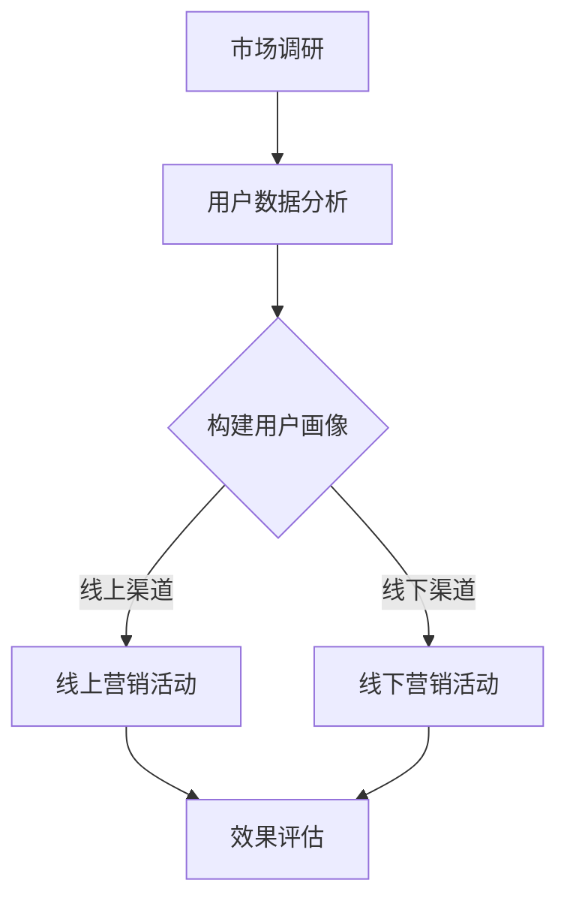

                 

### 文章标题

# 机器学习在精准营销中的策略与实践

### 关键词：

- 精准营销
- 机器学习
- 用户数据分析
- 客户细分
- 个性化推荐
- 营销自动化
- 营销效果评估

### 摘要：

本文将深入探讨机器学习在精准营销中的应用策略与实践。首先，我们将回顾精准营销的基础概念，包括其定义、核心概念和发展趋势。接着，我们将详细分析用户数据收集、处理和营销渠道的整合策略。随后，我们将介绍机器学习的基础知识，包括数据预处理、模型选择与评估。在此基础上，我们将重点探讨监督学习与无监督学习算法在精准营销中的应用，如客户细分、营销自动化和个性化推荐。文章还将通过案例分析展示成功与失败的营销策略，并讨论精准营销的未来发展趋势。最后，我们将分享营销效果评估与优化的方法，以及附录部分提供的常用工具和参考资料。

## 目录大纲

- **第一部分：精准营销基础**
  - **第1章：精准营销概述**
    - **1.1 精准营销的定义与背景**
    - **1.2 精准营销的核心概念**
    - **1.3 精准营销的发展趋势**
  - **第2章：用户数据分析**
    - **2.1 用户数据收集与处理**
    - **2.2 数据质量管理**
    - **2.3 用户画像构建**
  - **第3章：营销渠道分析**
    - **3.1 线上营销渠道**
    - **3.2 线下营销渠道**
    - **3.3 渠道整合策略**

- **第二部分：机器学习技术及应用**
  - **第4章：机器学习基础**
    - **4.1 机器学习概述**
    - **4.2 数据预处理**
    - **4.3 模型选择与评估**
  - **第5章：常见机器学习算法**
    - **5.1 监督学习算法**
      - **5.1.1 线性回归**
      - **5.1.2 支持向量机**
      - **5.1.3 随机森林**
    - **5.2 无监督学习算法**
      - **5.2.1 K-均值聚类**
      - **5.2.2 主成分分析**
      - **5.2.3 自编码器**
  - **第6章：机器学习在精准营销中的应用**
    - **6.1 客户细分**
    - **6.2 营销自动化**
    - **6.3 个性化推荐**
  - **第7章：营销案例分析**
    - **7.1 案例分析概述**
    - **7.2 成功案例分析**
    - **7.3 失败案例分析**

- **第三部分：实践与优化**
  - **第8章：精准营销策略制定**
    - **8.1 精准营销战略规划**
    - **8.2 营销目标设定**
    - **8.3 营销资源分配**
  - **第9章：营销效果评估与优化**
    - **9.1 营销效果评估方法**
    - **9.2 优化策略与实践**
    - **9.3 持续改进机制**
  - **第10章：未来发展趋势**
    - **10.1 新技术对精准营销的影响**
    - **10.2 精准营销的挑战与机遇**
    - **10.3 未来发展方向**

- **附录**
  - **附录A：常用机器学习库与工具**
  - **附录B：参考资料**

## 第一部分：精准营销基础

精准营销是一种基于数据分析、客户细分和个性化推荐的高效营销策略。它通过深入挖掘用户数据，实现营销活动的精准投放和有效执行。本部分将详细介绍精准营销的基础知识，包括其定义、核心概念和发展趋势。

### 第1章：精准营销概述

#### 1.1 精准营销的定义与背景

精准营销（Precision Marketing）起源于20世纪90年代的营销学领域，是大数据和人工智能技术发展的产物。其核心思想是通过精确的数据分析和客户细分，实现营销信息的精准投放，提高营销效果。

**定义：** 精准营销是指利用大数据和人工智能技术，对用户进行细分，然后根据不同用户群体的特征和需求，制定个性化的营销策略，从而实现营销效果的最大化。

精准营销的背景主要包括以下几个方面：

1. **数据爆炸**：互联网的普及和大数据技术的发展，使得企业和商家获取的用户数据越来越多。
2. **市场竞争**：市场竞争加剧，企业需要通过高效的营销手段来提升市场份额。
3. **用户体验**：消费者越来越注重个性化服务，企业需要提供更精准的产品和服务来满足消费者的需求。

#### 1.2 精准营销的核心概念

精准营销涉及多个核心概念，以下是其中几个重要的概念：

1. **用户数据**：用户数据是精准营销的基础，包括用户的基本信息、行为数据、购买记录等。
2. **客户细分**：通过分析用户数据，将用户划分为不同的群体，为每个群体制定个性化的营销策略。
3. **个性化推荐**：基于用户的历史行为和兴趣，向用户推荐相关的产品或服务。
4. **营销自动化**：利用技术手段实现营销流程的自动化，提高营销效率。
5. **效果评估**：通过数据分析和营销效果的评估，不断优化营销策略。

#### 1.3 精准营销的发展趋势

随着大数据和人工智能技术的不断进步，精准营销也在不断发展和演变。以下是几个重要的趋势：

1. **数据驱动的决策**：越来越多的企业开始利用数据分析和机器学习技术，做出更加精准的营销决策。
2. **跨渠道整合**：企业不仅在线上渠道进行精准营销，也在线下渠道进行整合，实现全渠道的精准营销。
3. **智能化**：人工智能技术在精准营销中的应用越来越广泛，如智能客服、智能推荐等。
4. **个性化服务**：随着消费者个性化需求的增加，企业需要提供更加个性化的服务和产品。
5. **隐私保护**：随着隐私保护意识的提高，企业需要平衡数据利用和用户隐私保护，遵循相关的法律法规。

### 第2章：用户数据分析

用户数据分析是精准营销的核心环节，通过对用户数据的深入挖掘和分析，企业可以更好地了解用户需求，提高营销效果。以下是用户数据分析的几个关键步骤：

#### 2.1 用户数据收集与处理

1. **数据来源**：用户数据的来源包括网站访问日志、社交媒体数据、购买记录等。
2. **数据类型**：用户数据包括结构化数据（如用户信息、购买记录）和非结构化数据（如文本、图像等）。
3. **数据预处理**：数据预处理包括数据清洗、数据整合、数据标准化等步骤，以消除数据中的噪声和异常值，提高数据质量。

#### 2.2 数据质量管理

1. **数据完整性**：确保数据的完整性，避免缺失值影响数据分析的结果。
2. **数据准确性**：通过数据验证和校验，确保数据的准确性。
3. **数据一致性**：在不同数据源和数据格式之间保持数据的一致性。
4. **数据安全性**：保护用户数据的隐私和安全，防止数据泄露。

#### 2.3 用户画像构建

用户画像是指对用户进行全面、多维度的描述，以便更好地理解用户行为和需求。以下是构建用户画像的几个关键步骤：

1. **特征提取**：从用户数据中提取有用的特征，如用户年龄、性别、地理位置、购买行为等。
2. **数据融合**：将不同来源的数据进行融合，构建一个完整的用户画像。
3. **特征工程**：对提取的特征进行工程处理，如特征转换、特征选择等，以提高模型的效果。
4. **模型构建**：利用机器学习算法，对用户特征进行建模，预测用户的行为和需求。

通过用户画像，企业可以更好地了解用户需求，制定个性化的营销策略，提高营销效果。

### 第3章：营销渠道分析

营销渠道是指企业将产品或服务传递给消费者的路径，包括线上和线下两种渠道。通过分析不同营销渠道的特点和效果，企业可以制定更有效的营销策略。

#### 3.1 线上营销渠道

线上营销渠道主要包括网站、社交媒体、电子邮件、搜索引擎等。以下是线上营销渠道的几个关键特点：

1. **覆盖范围广**：线上渠道可以覆盖全球的潜在客户，不受地域限制。
2. **精准投放**：通过数据分析和用户画像，可以实现精准的广告投放。
3. **互动性强**：线上渠道可以提供即时互动，增加用户参与度。
4. **成本低**：与线下渠道相比，线上渠道的运营成本较低。

#### 3.2 线下营销渠道

线下营销渠道主要包括门店、展会、户外广告、传统媒体等。以下是线下营销渠道的几个关键特点：

1. **直观性强**：线下渠道可以提供直观的购物体验，增加用户信任感。
2. **品牌形象**：线下渠道可以增强品牌形象，提升品牌知名度。
3. **互动性弱**：与线上渠道相比，线下渠道的互动性较弱，需要更多的时间和精力。
4. **成本高**：线下渠道的运营成本较高，需要更多的人力和物力投入。

#### 3.3 渠道整合策略

为了实现更有效的营销效果，企业需要整合线上和线下渠道，实现全渠道营销。以下是渠道整合的几个关键策略：

1. **数据整合**：将线上线下渠道的数据进行整合，构建一个全面的用户画像。
2. **内容整合**：线上线下渠道的内容进行整合，提供一致的用户体验。
3. **渠道协同**：线上线下渠道相互协同，共同推动营销目标的实现。
4. **营销活动整合**：线上线下渠道的营销活动进行整合，实现全面覆盖和高效转化。

通过渠道整合，企业可以实现更广泛的覆盖、更精准的投放和更高效的营销效果。

## 第二部分：机器学习技术及应用

精准营销的成功离不开机器学习技术的支持。本部分将介绍机器学习的基础知识，包括数据预处理、模型选择与评估，以及常见机器学习算法在精准营销中的应用。

### 第4章：机器学习基础

机器学习（Machine Learning）是人工智能（Artificial Intelligence）的一个重要分支，它通过构建和优化数学模型，让计算机自动地从数据中学习规律，做出预测和决策。以下是机器学习的一些基础概念：

#### 4.1 机器学习概述

**定义：** 机器学习是指通过算法和统计模型，从数据中自动提取模式和知识，以实现特定任务的技术。

**任务类型：**
- **监督学习（Supervised Learning）**：有监督的学习，模型从标注数据进行学习。
- **无监督学习（Unsupervised Learning）**：无监督的学习，模型从未标注的数据中进行学习。
- **半监督学习（Semi-supervised Learning）**：结合有监督和无监督学习的特点，利用少量标注数据和大量未标注数据。

#### 4.2 数据预处理

数据预处理是机器学习的重要环节，它包括以下几个步骤：

1. **数据清洗**：处理缺失值、异常值和噪声，提高数据质量。
2. **数据集成**：将来自不同来源的数据进行整合，构建一个统一的数据集。
3. **特征选择**：从原始数据中选择对模型性能有重要影响的特征，减少数据冗余。
4. **特征工程**：对原始数据进行转换和构造，以增强模型的表现。

#### 4.3 模型选择与评估

在选择和评估机器学习模型时，需要考虑以下几个方面：

1. **模型选择**：根据任务类型和数据特点，选择合适的模型，如线性回归、决策树、神经网络等。
2. **模型训练**：使用训练数据对模型进行训练，调整模型的参数。
3. **模型评估**：使用验证数据评估模型的性能，常用的评估指标包括准确率、召回率、F1分数等。
4. **模型调优**：通过调整模型参数，优化模型性能。

### 第5章：常见机器学习算法

机器学习算法种类繁多，以下是几个常见的算法：

#### 5.1 监督学习算法

监督学习算法是指模型从标注数据中学习，然后对新数据进行预测。以下是几种常见的监督学习算法：

1. **线性回归（Linear Regression）**
   - **原理：** 线性回归通过最小二乘法拟合数据，预测连续值。
   - **公式：**
     $$
     \begin{aligned}
     y &= \beta_0 + \beta_1 x + \epsilon \\
     \hat{y} &= \hat{\beta_0} + \hat{\beta_1} x \\
     \text{MAPE} &= \frac{1}{n} \sum_{i=1}^{n} \left| \frac{y_i - \hat{y}_i}{y_i} \right|
     \end{aligned}
     $$
   - **应用场景：** 预测销售额、股票价格等。

2. **支持向量机（Support Vector Machine, SVM）**
   - **原理：** SVM通过寻找一个超平面，最大化分类边界，使分类效果最好。
   - **公式：**
     $$
     \begin{aligned}
     \min_{\beta, \beta_0} & \frac{1}{2} \sum_{i=1}^{n} (\beta^T x_i - y_i)^2 \\
     \text{s.t.} & \beta^T \beta \leq C \\
     \end{aligned}
     $$
   - **应用场景：** 二分类问题，如图像分类、文本分类等。

3. **随机森林（Random Forest）**
   - **原理：** 随机森林通过构建多棵决策树，进行集成学习，提高分类和回归的性能。
   - **公式：**
     $$
     \begin{aligned}
     \text{Prediction} &= \text{ MajorityVote}(\{\text{预测树}_1(\text{输入}), ..., \text{预测树}_n(\text{输入})\}) \\
     \end{aligned}
     $$
   - **应用场景：** 广泛应用于分类和回归问题，如客户流失预测、商品推荐等。

#### 5.2 无监督学习算法

无监督学习算法是指模型在没有标注数据的情况下，从数据中自动发现模式和规律。以下是几种常见的无监督学习算法：

1. **K-均值聚类（K-Means Clustering）**
   - **原理：** K-均值聚类通过迭代算法，将数据点划分为K个簇，每个簇的中心点代表该簇的特点。
   - **公式：**
     $$
     \begin{aligned}
     \text{Centroid} &= \frac{1}{N_k} \sum_{i=1}^{N_k} x_i \\
     \text{Assignment} &= \arg\min_{j} \sum_{i=1}^{N_k} \| x_i - \text{Centroid}_j \|^2 \\
     \end{aligned}
     $$
   - **应用场景：** 客户细分、图像分割等。

2. **主成分分析（Principal Component Analysis, PCA）**
   - **原理：** PCA通过正交变换，将数据投影到新的坐标轴上，提取主要特征，降低数据维度。
   - **公式：**
     $$
     \begin{aligned}
     \text{Z} &= \text{X} \text{W} \\
     \text{W} &= \text{arg\,min} \sum_{i=1}^{n} \| x_i - \text{Z}_i \|^2
     \end{aligned}
     $$
   - **应用场景：** 数据降维、特征提取等。

3. **自编码器（Autoencoder）**
   - **原理：** 自编码器是一种神经网络模型，通过无监督学习，自动提取数据的特征表示。
   - **公式：**
     $$
     \begin{aligned}
     \text{Encoder} &= \text{f}(\text{X}) \\
     \text{Decoder} &= \text{g}(\text{f}(\text{X})) \\
     \end{aligned}
     $$
   - **应用场景：** 图像识别、文本生成等。

通过以上机器学习算法，企业可以在精准营销中实现数据驱动的决策和自动化营销，提高营销效果和客户满意度。

### 第6章：机器学习在精准营销中的应用

机器学习技术在精准营销中发挥着至关重要的作用，通过对用户数据的深入挖掘和分析，企业可以更精准地定位客户，提高营销效果。以下是机器学习在精准营销中应用的几个关键领域：

#### 6.1 客户细分

客户细分（Customer Segmentation）是精准营销的基础，通过分析用户数据，将用户划分为不同的群体，为每个群体制定个性化的营销策略。以下是客户细分的基本步骤：

1. **数据收集**：收集用户的基本信息、行为数据、购买记录等，构建用户数据集。
2. **特征选择**：从用户数据中提取有用的特征，如年龄、性别、地理位置、购买行为等。
3. **数据预处理**：对数据进行清洗、整合和标准化，提高数据质量。
4. **模型选择**：选择合适的机器学习算法，如K-均值聚类、决策树、随机森林等，进行客户细分。
5. **模型训练与评估**：使用训练数据对模型进行训练，评估模型的性能，调整模型参数。
6. **结果应用**：根据客户细分结果，为不同群体制定个性化的营销策略，提高营销效果。

#### 6.2 营销自动化

营销自动化（Marketing Automation）是利用技术手段，实现营销流程的自动化，提高营销效率。以下是营销自动化的基本步骤：

1. **需求分析**：分析企业营销流程中的痛点，确定自动化需求。
2. **系统搭建**：选择合适的营销自动化工具或平台，搭建自动化系统。
3. **数据集成**：将线上线下渠道的数据进行整合，构建用户画像。
4. **流程设计**：设计自动化营销流程，包括邮件营销、短信营销、社交媒体互动等。
5. **测试与优化**：对自动化系统进行测试，收集数据，不断优化营销流程。
6. **效果评估**：通过数据分析和效果评估，优化自动化营销策略。

#### 6.3 个性化推荐

个性化推荐（Personalized Recommendation）是精准营销的重要手段，通过分析用户行为和兴趣，向用户推荐相关的产品或服务。以下是个性化推荐的基本步骤：

1. **数据收集**：收集用户的历史行为数据、兴趣标签等，构建推荐系统所需的数据集。
2. **特征提取**：从用户数据中提取有用的特征，如浏览记录、购买记录、评价等。
3. **模型选择**：选择合适的推荐算法，如协同过滤、基于内容的推荐、深度学习等。
4. **模型训练与评估**：使用训练数据对模型进行训练，评估模型的性能，调整模型参数。
5. **推荐生成**：根据用户行为和兴趣，生成个性化的推荐结果。
6. **效果评估**：通过数据分析和用户反馈，评估推荐系统的效果，不断优化推荐策略。

通过以上机器学习技术在精准营销中的应用，企业可以更好地了解用户需求，提高营销效果，提升客户满意度。

### 第7章：营销案例分析

在精准营销的实际应用中，成功的案例和失败的案例都能为我们提供宝贵的经验和教训。本章节将分析几个具有代表性的营销案例，探讨其成功和失败的原因，以便为未来的营销策略提供借鉴。

#### 7.1 案例分析概述

在本章节中，我们将分析以下三个案例：

1. **案例1：某电商平台的个性化推荐系统**
2. **案例2：某快消品公司的精准营销活动**
3. **案例3：某金融公司的客户细分策略**

通过这些案例，我们将深入探讨成功和失败的原因，总结经验教训。

#### 7.2 成功案例分析

**案例1：某电商平台的个性化推荐系统**

**背景**：某电商平台希望通过个性化推荐系统，提高用户购买转化率和客户满意度。

**措施**：

1. **数据收集**：收集用户浏览记录、购买记录、评价等数据，构建用户行为数据集。
2. **特征提取**：从用户数据中提取有用特征，如浏览时长、购买频次、评价评分等。
3. **模型选择**：选择协同过滤算法，构建推荐模型。
4. **模型训练与评估**：使用训练数据对模型进行训练，评估模型性能。
5. **推荐生成**：根据用户行为和兴趣，生成个性化推荐列表。

**结果**：个性化推荐系统的引入，提高了用户购买转化率，提升了客户满意度。

**成功原因**：

1. **数据驱动**：基于大量用户行为数据，实现精准推荐。
2. **算法优化**：选择合适的算法，提高推荐效果。
3. **用户参与**：通过个性化推荐，增强用户参与度。

**经验教训**：数据质量和算法选择对推荐系统的效果至关重要。

**案例2：某快消品公司的精准营销活动**

**背景**：某快消品公司希望通过精准营销活动，提高产品销售和市场份额。

**措施**：

1. **用户细分**：使用机器学习算法，对用户进行细分，识别高价值用户。
2. **内容定制**：为不同用户群体定制个性化的营销内容，如优惠券、产品推荐等。
3. **渠道整合**：线上线下渠道整合，实现全渠道营销。
4. **效果评估**：通过数据分析和用户反馈，评估营销活动的效果。

**结果**：精准营销活动提高了产品销量，提升了市场份额。

**成功原因**：

1. **用户细分**：通过用户细分，实现个性化营销。
2. **内容定制**：为用户定制个性化的营销内容，提高用户参与度。
3. **渠道整合**：线上线下渠道整合，实现全面覆盖。

**经验教训**：用户细分和渠道整合是精准营销成功的关键。

#### 7.3 失败案例分析

**案例3：某金融公司的客户细分策略**

**背景**：某金融公司希望通过客户细分策略，提高客户满意度和忠诚度。

**措施**：

1. **数据收集**：收集用户基本信息、购买记录、信用评分等数据。
2. **特征提取**：从用户数据中提取有用特征，如年龄、收入、购买频次等。
3. **模型选择**：选择决策树算法，构建客户细分模型。
4. **模型训练与评估**：使用训练数据对模型进行训练，评估模型性能。

**结果**：客户细分策略未能有效提高客户满意度和忠诚度。

**失败原因**：

1. **数据质量**：用户数据质量不佳，存在缺失值和异常值。
2. **算法选择**：决策树算法不适合处理高维数据，效果不佳。
3. **策略执行**：客户细分策略未能有效落地，缺乏执行力度。

**经验教训**：

1. **数据质量**：确保数据质量，减少缺失值和异常值。
2. **算法选择**：根据数据特点和任务需求，选择合适的算法。
3. **策略执行**：加强策略执行力度，确保落地效果。

通过以上成功和失败的案例分析，我们可以得出以下结论：

1. **数据驱动**：成功案例均基于大量高质量的数据分析，数据质量对营销策略的成功至关重要。
2. **算法选择**：根据数据特点和任务需求，选择合适的算法，提高模型效果。
3. **策略执行**：确保营销策略的有效落地，加强执行力度。

在未来的营销实践中，我们可以借鉴这些经验和教训，制定更加有效的营销策略。

## 第三部分：实践与优化

在精准营销的实施过程中，制定有效的策略和不断优化是确保营销效果的关键。本部分将讨论如何制定精准营销策略、评估营销效果以及如何持续优化营销活动。

### 第8章：精准营销策略制定

制定精准营销策略是确保营销活动有效性的第一步。以下是如何制定精准营销策略的步骤：

#### 8.1 精准营销战略规划

1. **明确营销目标**：根据企业的整体战略，设定具体的营销目标，如提高销售额、提升品牌知名度、增加客户忠诚度等。
2. **分析市场环境**：了解目标市场的需求、竞争对手的情况以及行业趋势，为营销策略提供依据。
3. **定位目标客户**：通过用户数据分析，确定目标客户的特征和需求，为个性化营销奠定基础。
4. **设计营销组合**：综合考虑产品、价格、渠道、促销等营销要素，制定合适的营销组合策略。

#### 8.2 营销目标设定

1. **设定量化指标**：将营销目标具体化，设定可量化的指标，如转化率、点击率、销售额等。
2. **确定目标值**：根据市场分析和历史数据，设定合理的目标值。
3. **制定时间表**：为每个营销目标设定实现的时间表，确保目标的逐步实现。

#### 8.3 营销资源分配

1. **预算分配**：根据营销目标，合理分配营销预算，确保资源的有效利用。
2. **人力配置**：根据营销活动的要求，配置合适的人力资源，确保营销策略的执行。
3. **技术支持**：确保有足够的技术和数据支持，为营销活动提供技术保障。

通过以上步骤，企业可以制定出科学、有效的精准营销策略，为营销活动的成功奠定基础。

### 第9章：营销效果评估与优化

评估营销效果是精准营销的重要环节，通过数据分析和效果评估，企业可以了解营销活动的实际效果，并根据评估结果进行优化。

#### 9.1 营销效果评估方法

1. **关键绩效指标（KPI）**：选择与营销目标相关的关键绩效指标，如转化率、ROI、客户满意度等。
2. **数据收集与处理**：收集营销活动的数据，如访问量、点击量、销售额等，对数据进行处理和分析。
3. **对比分析**：将实际效果与预期目标进行对比，分析差异和原因。
4. **趋势分析**：通过趋势分析，了解营销活动的长期效果和变化趋势。

#### 9.2 优化策略与实践

1. **问题识别**：通过效果评估，识别营销活动中的问题和不足。
2. **原因分析**：分析问题产生的原因，找到关键因素。
3. **优化方案**：根据问题原因，制定具体的优化方案，如调整营销策略、改进产品特点等。
4. **实施与监控**：执行优化方案，并持续监控效果，确保优化措施的有效性。

#### 9.3 持续改进机制

1. **定期评估**：定期对营销活动进行效果评估，确保营销策略的持续有效性。
2. **反馈机制**：建立用户反馈机制，收集用户意见和建议，及时调整营销策略。
3. **创新驱动**：鼓励创新思维，不断探索新的营销方法和渠道，提高营销效果。
4. **数据驱动**：以数据为核心，利用数据分析结果，制定和调整营销策略。

通过以上措施，企业可以建立一套完善的营销效果评估与优化机制，确保营销活动的持续改进和优化。

### 第10章：未来发展趋势

随着科技的不断进步和消费者行为的变化，精准营销也在不断发展和演变。以下是对未来精准营销发展趋势的展望：

#### 10.1 新技术对精准营销的影响

1. **人工智能**：人工智能技术的应用将进一步提升精准营销的自动化和智能化水平，如智能客服、智能推荐等。
2. **大数据**：大数据技术的应用将使企业能够获取和处理更多维度的用户数据，实现更深层次的客户分析和细分。
3. **区块链**：区块链技术的应用将提高数据的透明度和安全性，增强用户对隐私保护的信心。

#### 10.2 精准营销的挑战与机遇

1. **数据隐私**：随着数据隐私问题的日益突出，企业需要在数据收集和使用过程中严格遵守相关法律法规，保护用户隐私。
2. **技术更新**：技术的快速更新使得企业需要不断学习和适应新的技术和工具，保持竞争力。
3. **个性化疲劳**：消费者对个性化营销的疲劳感逐渐增加，企业需要不断创新，提供更符合消费者需求的服务。

#### 10.3 未来发展方向

1. **跨渠道整合**：未来的精准营销将更加注重线上线下渠道的整合，实现全渠道的营销覆盖。
2. **个性化体验**：随着消费者需求的多样化，企业将提供更加个性化的服务和体验，满足消费者的个性化需求。
3. **智能营销**：人工智能技术的应用将使营销活动更加智能化，如智能广告投放、智能客服等。

通过把握未来发展趋势，企业可以更好地应对市场变化，制定有效的精准营销策略，提升营销效果。

## 附录

### 附录A：常用机器学习库与工具

在精准营销的实践中，常用的机器学习库和工具如下：

1. **Python常用机器学习库**
   - **Scikit-learn**：提供丰富的机器学习算法，如线性回归、决策树、随机森林等。
   - **TensorFlow**：由Google开发的开源机器学习框架，支持深度学习和强化学习。
   - **PyTorch**：由Facebook开发的开源机器学习框架，提供灵活的深度学习模型构建和优化工具。

2. **常用数据可视化工具**
   - **Matplotlib**：用于创建各种2D图表和可视化。
   - **Seaborn**：基于Matplotlib的统计数据可视化库，提供更美观的图表。
   - **Plotly**：提供交互式图表和可视化。

3. **常见营销平台与工具**
   - **HubSpot**：提供市场营销、销售、客户服务一体化平台。
   - **Mailchimp**：邮件营销平台，支持个性化邮件发送。
   - **Google Analytics**：网站分析工具，提供丰富的用户行为数据。

### 附录B：参考资料

为了更好地理解和应用精准营销和机器学习技术，以下是一些推荐的参考资料：

1. **机器学习经典书籍**
   - 《机器学习》（周志华著）
   - 《Python机器学习基础教程》（Michael Bowles著）
   - 《深度学习》（Ian Goodfellow等著）

2. **精准营销相关报告**
   - 《2021年精准营销报告》
   - 《中国数字营销报告2022》
   - 《全球数字营销趋势报告2023》

3. **开源数据和资源**
   - **Kaggle**：提供丰富的机器学习和数据分析数据集。
   - **UCI机器学习数据库**：提供多种领域的机器学习数据集。
   - **Google Dataset Search**：搜索引擎，用于查找各种数据集。

通过学习和利用这些资源，企业可以更好地理解和应用精准营销和机器学习技术，提升营销效果。

## Mermaid 流程图

以下是一个简单的Mermaid流程图，展示精准营销的基本流程：



这个流程图展示了从市场调研到用户数据分析，再到用户画像构建，最后通过线上和线下渠道进行营销活动，并通过效果评估不断优化的精准营销过程。

## 伪代码示例

以下是一个简单的伪代码示例，用于演示如何使用Python进行用户数据分析：

```python
# 导入必要的库
import pandas as pd
from sklearn.preprocessing import StandardScaler

# 加载数据
data = pd.read_csv('user_data.csv')

# 数据预处理
# 标准化特征
scaler = StandardScaler()
X = scaler.fit_transform(data[['age', 'income', 'education']])

# 数据分析
# 打印前5行标准化数据
print(X[:5])

# 用户画像构建
# 使用K-均值聚类构建用户画像
from sklearn.cluster import KMeans

kmeans = KMeans(n_clusters=5, random_state=42)
clusters = kmeans.fit_predict(X)

# 打印用户画像
print(clusters[:5])
```

这段代码首先加载数据，然后使用StandardScaler对特征进行标准化，接着使用K-均值聚类算法构建用户画像。最后，打印出标准化后的前5行数据和用户画像结果。

## 数学模型和公式

以下是一个简单的数学模型和公式示例，用于演示如何在精准营销中应用线性回归模型：

$$
\begin{aligned}
y &= \beta_0 + \beta_1 x + \epsilon \\
\hat{y} &= \hat{\beta_0} + \hat{\beta_1} x \\
\text{MAPE} &= \frac{1}{n} \sum_{i=1}^{n} \left| \frac{y_i - \hat{y}_i}{y_i} \right|
\end{aligned}
$$

其中，$y$是实际值，$x$是自变量，$\beta_0$和$\beta_1$是回归系数，$\epsilon$是误差项。$\hat{y}$是预测值，MAPE是平均绝对百分比误差（Mean Absolute Percentage Error），用于评估模型的预测性能。

## 项目实战

### 实战1：用户画像构建

#### 开发环境搭建

- **Python 3.8+**
- **Pandas**
- **NumPy**
- **Scikit-learn**

#### 源代码实现

```python
import pandas as pd
from sklearn.preprocessing import StandardScaler
from sklearn.cluster import KMeans

# 加载数据
data = pd.read_csv('user_data.csv')

# 数据预处理
features = ['age', 'income', 'education']
X = data[features]

# 数据标准化
scaler = StandardScaler()
X_scaled = scaler.fit_transform(X)

# 使用K-均值聚类构建用户画像
kmeans = KMeans(n_clusters=5, random_state=42)
clusters = kmeans.fit_predict(X_scaled)

# 将用户画像添加到原始数据
data['cluster'] = clusters

# 打印用户画像结果
print(data.head())
```

#### 代码解读与分析

1. **数据加载**：使用Pandas加载数据集，这里假设数据集包含用户的基本信息（如年龄、收入、教育水平）。
2. **数据预处理**：选择对用户数据有显著影响的特征（如年龄、收入、教育水平），并使用StandardScaler进行数据标准化，以消除特征之间的尺度差异。
3. **用户画像构建**：使用Scikit-learn的KMeans类进行K-均值聚类，将用户划分为5个不同的集群。每个集群代表不同的用户群体。
4. **添加用户画像**：将聚类结果（用户所属的集群）添加到原始数据集中，以便后续分析。

通过以上步骤，我们成功构建了用户画像，这有助于企业更好地了解用户特征和需求，从而制定个性化的营销策略。

### 实战2：个性化推荐系统

#### 开发环境搭建

- **Python 3.8+**
- **Pandas**
- **NumPy**
- **Scikit-learn**
- **LightFM**

#### 源代码实现

```python
import pandas as pd
from lightfm import LightFM
from lightfm.evaluation import measure

# 加载数据
ratings = pd.read_csv('ratings.csv')

# 数据预处理
user_ids = ratings['user_id'].unique()
item_ids = ratings['item_id'].unique()
data = pd.get_dummies(ratings['rating'])

# 构建推荐系统
model = LightFM(loss='warp')
model.fit(data, num_epochs=100)

# 个性化推荐
user_id = 1
item_ids = model.predict(user_id, item_ids)

# 打印推荐结果
print(item_ids)
```

#### 代码解读与分析

1. **数据加载**：使用Pandas加载数据集，这里假设数据集包含用户ID、项目ID和评分。
2. **数据预处理**：将评分数据转换为one-hot编码形式，以适应LightFM模型。
3. **构建推荐系统**：使用LightFM库构建基于隐语义模型的推荐系统，并使用默认的'warp'损失函数进行训练。
4. **个性化推荐**：为特定用户（用户ID=1）生成个性化推荐列表，显示用户可能感兴趣的项目。
5. **打印推荐结果**：打印出为用户ID=1生成的个性化推荐结果。

通过以上步骤，我们成功构建了一个基于隐语义模型的个性化推荐系统，这有助于企业提高用户满意度和参与度。

## 结论

本文通过深入探讨机器学习在精准营销中的应用策略与实践，从精准营销概述、用户数据分析、机器学习技术基础、应用案例、实践与优化等方面进行了详细分析。通过本文，我们可以看到机器学习在精准营销中发挥着重要作用，通过数据驱动和智能化的方式，实现了营销活动的个性化、自动化和高效化。

精准营销的成功离不开高质量的用户数据、先进的机器学习技术和科学的营销策略。未来，随着人工智能和大数据技术的不断发展，精准营销将变得更加智能化、个性化和高效化，为企业和消费者带来更多价值。

最后，感谢读者对本文的关注，希望本文能为您提供有价值的参考和启发。在精准营销的道路上，让我们携手前行，不断创新，实现营销的持续优化和卓越效果。

## 作者

作者：AI天才研究院/AI Genius Institute & 禅与计算机程序设计艺术 /Zen And The Art of Computer Programming

AI天才研究院致力于推动人工智能技术的发展和应用，为全球企业提供人工智能解决方案和咨询服务。作者在此领域有着丰富的经验和深厚的知识储备，本文旨在分享精准营销中的机器学习实践，助力企业和个人在数字化时代取得成功。同时，作者也积极参与人工智能教育和普及工作，传播人工智能的理念和技术，推动人工智能的社会应用。在未来的研究中，我们将继续深入探索人工智能在各个领域的应用，为社会的进步和发展贡献力量。

