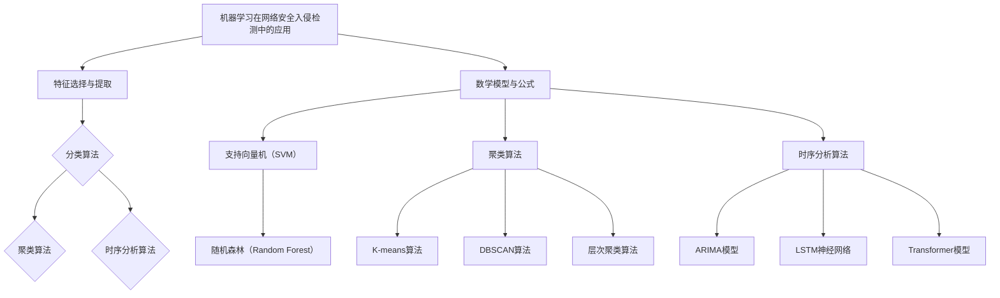

                 

# {文章标题}

> {关键词：机器学习，网络安全入侵检测，监督学习，无监督学习，强化学习，特征选择与提取，分类算法，聚类算法，时序分析算法，数学模型，项目实战}

> {摘要：本文将深入探讨机器学习在网络安全入侵检测中的应用，包括核心算法原理、数学模型、以及实际项目实战。通过梳理监督学习、无监督学习和强化学习在入侵检测中的适用性，以及特征选择、分类和聚类算法的原理，我们将展示如何利用机器学习技术构建高效的网络入侵检测系统。最后，通过具体项目案例，我们将介绍开发环境和实际代码实现，帮助读者理解和应用这些技术。}

---

## 目录大纲

---

## 第一部分：引言

### 1.1 机器学习与网络安全入侵检测

#### 1.1.1 机器学习的定义与分类

##### 1.1.1.1 监督学习

##### 1.1.1.2 无监督学习

##### 1.1.1.3 强化学习

#### 1.1.2 网络安全入侵检测的背景和挑战

##### 1.1.2.1 网络安全入侵检测的概念

##### 1.1.2.2 网络安全入侵检测的现状与挑战

### 1.2 机器学习在网络安全入侵检测中的应用

#### 1.2.1 机器学习在网络安全入侵检测中的优势

##### 1.2.1.1 提高检测准确性

##### 1.2.1.2 适应动态网络环境

##### 1.2.1.3 优化资源利用

#### 1.2.2 机器学习在网络安全入侵检测中的常见技术

##### 1.2.2.1 特征选择与提取

##### 1.2.2.2 分类算法

##### 1.2.2.3 聚类算法

##### 1.2.2.4 时序分析算法

## 第二部分：核心算法原理

### 2.1 特征选择与提取

#### 2.1.1 特征选择的策略与方法

##### 2.1.1.1 基于统计的特征选择方法

##### 2.1.1.2 基于信息论的特征选择方法

##### 2.1.1.3 基于机器学习的特征选择方法

#### 2.1.2 特征提取技术

##### 2.1.2.1 高维特征降维

##### 2.1.2.2 低维特征增强

### 2.2 分类算法

#### 2.2.1 常见分类算法

##### 2.2.1.1 支持向量机（SVM）

##### 2.2.1.2 随机森林（Random Forest）

##### 2.2.1.3 决策树（Decision Tree）

##### 2.2.1.4 K最近邻（K-Nearest Neighbors, KNN）

##### 2.2.1.5 聚类算法（Clustering）

### 2.3 聚类算法

#### 2.3.1 常见聚类算法

##### 2.3.1.1 K-means算法

##### 2.3.1.2 DBSCAN算法

##### 2.3.1.3 层次聚类算法

### 2.4 时序分析算法

#### 2.4.1 常见时序分析算法

##### 2.4.1.1 ARIMA模型

##### 2.4.1.2 LSTM神经网络

##### 2.4.1.3 Transformer模型

## 第三部分：数学模型与公式

### 3.1 数学模型

#### 3.1.1 支持向量机（SVM）

##### 3.1.1.1 最大间隔分类器

##### 3.1.1.2 SMO算法

##### 3.1.1.3 核函数选择

#### 3.1.2 随机森林（Random Forest）

##### 3.1.2.1 决策树生成

##### 3.1.2.2 随机性引入

##### 3.1.2.3 集成方法

### 3.2 数学公式

#### 3.2.1 概率论基础

##### 3.2.1.1 条件概率

##### 3.2.1.2 贝叶斯定理

##### 3.2.1.3 独立性

#### 3.2.2 信息论基础

##### 3.2.2.1 熵

##### 3.2.2.2 信息增益

##### 3.2.2.3 互信息

## 第四部分：项目实战

### 4.1 实战一：基于K-means算法的网络流量聚类

#### 4.1.1 项目背景

##### 4.1.1.1 网络流量分析的重要性

##### 4.1.1.2 K-means算法简介

#### 4.1.2 项目流程

##### 4.1.2.1 数据收集与预处理

##### 4.1.2.2 确定聚类中心

##### 4.1.2.3 聚类结果分析

### 4.2 实战二：基于LSTM神经网络的时序入侵检测

#### 4.2.1 项目背景

##### 4.2.1.1 时序入侵检测的需求

##### 4.2.1.2 LSTM神经网络简介

#### 4.2.2 项目流程

##### 4.2.2.1 数据收集与预处理

##### 4.2.2.2 网络结构设计与训练

##### 4.2.2.3 模型评估与优化

### 4.3 实战三：基于Transformer模型的恶意流量识别

#### 4.3.1 项目背景

##### 4.3.1.1 恶意流量识别的需求

##### 4.3.1.2 Transformer模型简介

#### 4.3.2 项目流程

##### 4.3.2.1 数据收集与预处理

##### 4.3.2.2 模型结构设计与训练

##### 4.3.2.3 模型评估与优化

## 第五部分：未来展望

### 5.1 机器学习在网络安全入侵检测中的发展趋势

#### 5.1.1 深度学习技术的应用

##### 5.1.1.1 卷积神经网络（CNN）

##### 5.1.1.2 循环神经网络（RNN）

##### 5.1.1.3 注意力机制（Attention Mechanism）

#### 5.1.2 网络安全态势感知

##### 5.1.2.1 状态感知的重要性

##### 5.1.2.2 状态感知技术的实现

### 5.2 机器学习在网络安全入侵检测中的挑战与应对策略

#### 5.2.1 数据隐私保护

##### 5.2.1.1 数据匿名化技术

##### 5.2.1.2 加密技术

#### 5.2.2 模型安全与攻击防御

##### 5.2.2.1 模型对抗攻击

##### 5.2.2.2 模型安全防御技术

## 附录

### 6.1 开发工具与资源

#### 6.1.1 Python编程环境搭建

##### 6.1.1.1 安装Python

##### 6.1.1.2 安装常用库

#### 6.1.2 机器学习框架简介

##### 6.1.2.1 Scikit-learn

##### 6.1.2.2 TensorFlow

##### 6.1.2.3 PyTorch

##### 6.1.2.4 Keras

## Mermaid 流程图



---

接下来，我们将详细讨论机器学习与网络安全入侵检测的相关概念和技术。

---

## 第一部分：引言

### 1.1 机器学习的定义与分类

机器学习（Machine Learning）是人工智能（Artificial Intelligence, AI）的重要分支，其主要目的是让计算机系统从数据中学习，并做出决策或预测。根据学习方式的不同，机器学习可以分为以下几类：

#### 1.1.1 监督学习（Supervised Learning）

监督学习是一种通过已标记的数据来训练模型，然后使用该模型进行预测的学习方法。在监督学习中，数据集被分为训练集和测试集，模型通过学习训练集上的数据来学习数据特征和规律，然后使用这些特征在测试集上进行预测。常见的监督学习算法包括支持向量机（SVM）、决策树（Decision Tree）、随机森林（Random Forest）和K最近邻（K-Nearest Neighbors, KNN）等。

#### 1.1.2 无监督学习（Unsupervised Learning）

无监督学习不使用标记的数据进行训练，而是通过数据本身的特征来发现数据之间的模式或结构。这种学习方式通常用于数据聚类和降维。常见的无监督学习算法包括K-means聚类、DBSCAN聚类和层次聚类等。

#### 1.1.3 强化学习（Reinforcement Learning）

强化学习是一种通过与环境的交互来学习最佳策略的学习方法。在这种学习过程中，智能体通过选择动作来获取奖励或惩罚，并不断调整其策略以最大化总奖励。常见的强化学习算法包括Q学习、深度Q网络（DQN）和策略梯度算法等。

### 1.1.2 网络安全入侵检测的背景和挑战

网络安全入侵检测（Intrusion Detection System, IDS）是一种用于检测和响应网络中异常行为和攻击的技术。随着互联网的普及和网络安全威胁的日益增多，入侵检测已经成为网络安全的重要组成部分。

网络安全入侵检测的主要挑战包括：

1. **海量数据**：网络流量数据量巨大，如何有效地处理和分析这些数据是一个巨大的挑战。
2. **数据噪声**：网络数据中往往存在大量的噪声和冗余信息，这会影响入侵检测的准确性。
3. **动态变化**：网络环境和攻击行为都在不断变化，入侵检测系统需要具备自适应能力，以适应这些变化。
4. **资源限制**：入侵检测系统通常需要在有限的资源（如CPU、内存等）下运行，如何优化资源利用是一个重要问题。

### 1.2 机器学习在网络安全入侵检测中的应用

机器学习技术在网络安全入侵检测中有着广泛的应用，其主要优势包括：

1. **提高检测准确性**：通过学习网络流量的特征，机器学习算法可以更准确地识别异常行为和攻击。
2. **适应动态网络环境**：机器学习算法可以通过不断学习新的数据来适应网络环境的变化。
3. **优化资源利用**：一些机器学习算法，如聚类算法和降维算法，可以帮助减少数据量和计算资源的需求。

在网络安全入侵检测中，常见的机器学习技术包括特征选择与提取、分类算法、聚类算法和时序分析算法等。下一部分将详细讨论这些技术的原理和应用。

---

接下来，我们将深入探讨机器学习在网络安全入侵检测中的应用优势，以及常见的技术和方法。

---

## 1.2 机器学习在网络安全入侵检测中的应用

机器学习在网络安全入侵检测中的应用已经取得了显著的成果，其优势主要体现在以下几个方面：

### 1.2.1 提高检测准确性

传统的入侵检测系统（IDS）通常依赖于基于规则的方法，这种方法依赖于预先定义的规则来识别异常行为。然而，攻击者可以轻松地绕过这些规则，从而逃避检测。相比之下，机器学习算法可以自动从大量数据中学习模式，并识别出未知或复杂的攻击行为。通过训练模型，机器学习算法可以识别正常网络行为和异常行为之间的差异，从而提高检测准确性。

### 1.2.2 适应动态网络环境

网络环境和攻击行为是动态变化的。传统的入侵检测系统难以适应这些变化，因为它们的规则是静态的。相比之下，机器学习算法可以通过不断学习新的数据来适应动态环境。例如，支持向量机（SVM）和随机森林（Random Forest）等算法可以通过训练新的模型来适应新的网络环境和攻击模式。

### 1.2.3 优化资源利用

在网络安全入侵检测中，资源（如CPU、内存和存储）的利用效率是一个重要问题。机器学习算法可以通过降维和特征选择来减少数据量和计算资源的消耗。例如，K-means聚类和主成分分析（PCA）等技术可以帮助识别和提取最重要的特征，从而降低模型的复杂度和计算成本。

### 1.2.4 常见技术

在网络安全入侵检测中，常见的机器学习技术包括特征选择与提取、分类算法、聚类算法和时序分析算法等。

#### 1.2.4.1 特征选择与提取

特征选择与提取是机器学习中的重要步骤，它旨在从原始数据中提取最有用的特征，以提高模型的性能和效率。在网络安全入侵检测中，特征选择与提取可以帮助识别正常网络行为和异常行为之间的差异。常见的特征选择方法包括基于统计的特征选择、基于信息论的特征选择和基于机器学习的特征选择等。

#### 1.2.4.2 分类算法

分类算法是机器学习中最常用的算法之一，它旨在将数据分类到不同的类别中。在网络安全入侵检测中，分类算法可以用于识别异常行为。常见的分类算法包括支持向量机（SVM）、决策树（Decision Tree）、随机森林（Random Forest）和K最近邻（KNN）等。

#### 1.2.4.3 聚类算法

聚类算法是将数据分组到不同的簇中，以便更好地理解和分析数据。在网络安全入侵检测中，聚类算法可以用于识别异常网络流量模式。常见的聚类算法包括K-means聚类、DBSCAN聚类和层次聚类等。

#### 1.2.4.4 时序分析算法

时序分析算法是用于分析和预测时间序列数据的算法。在网络安全入侵检测中，时序分析算法可以用于检测网络流量中的异常模式。常见的时序分析算法包括ARIMA模型、LSTM神经网络和Transformer模型等。

通过应用这些机器学习技术，网络安全入侵检测系统可以更准确地识别和应对网络威胁，从而提高网络的安全性。

### 1.2.5 机器学习在入侵检测系统中的实际应用

机器学习在入侵检测系统中得到了广泛应用，许多实际应用案例证明了其有效性。以下是一些典型的实际应用案例：

1. **基于支持向量机的入侵检测**：支持向量机（SVM）是一种常用的分类算法，它在入侵检测中得到了广泛应用。通过训练SVM模型，可以识别出正常的网络流量和攻击流量，从而提高检测的准确性。
   
2. **基于随机森林的入侵检测**：随机森林是一种基于决策树的集成学习方法，它在处理大规模数据和复杂特征时表现出色。通过使用随机森林模型，可以同时利用多个决策树的预测结果，提高入侵检测的性能。

3. **基于K-means的聚类分析**：K-means是一种简单的聚类算法，它可以通过聚类网络流量数据来识别异常流量。通过将网络流量数据聚类到不同的簇中，可以更容易地发现异常行为。

4. **基于LSTM神经网络的时序入侵检测**：LSTM神经网络是一种强大的时序分析模型，它在处理序列数据时表现出色。通过训练LSTM模型，可以捕捉网络流量中的时间依赖性，从而提高入侵检测的准确性。

5. **基于Transformer的恶意流量识别**：Transformer模型是一种基于注意力机制的深度学习模型，它在自然语言处理领域取得了显著的成果。将Transformer模型应用于网络流量分析，可以更好地识别和分类恶意流量。

总之，机器学习在网络安全入侵检测中具有广泛的应用前景，通过不断创新和应用，可以进一步提升入侵检测系统的性能和可靠性。

---

在了解了机器学习在网络安全入侵检测中的应用优势和常见技术后，接下来我们将深入探讨机器学习中的核心算法原理，包括特征选择与提取、分类算法、聚类算法和时序分析算法。

---

## 第二部分：核心算法原理

### 2.1 特征选择与提取

特征选择与提取是机器学习中的重要步骤，它旨在从原始数据中提取最有用的特征，以提高模型的性能和效率。

#### 2.1.1 特征选择的策略与方法

特征选择（Feature Selection）是一种用于降低数据维度和减少计算成本的方法，它通过识别和选择最有用的特征，从而提高模型的准确性和可解释性。常见的特征选择策略包括：

1. **过滤式（Filter Method）**：通过计算每个特征的统计量，如相关性、信息增益等，来评估特征的重要性。然后根据这些统计量，选择重要的特征。过滤式方法简单高效，但可能无法充分利用特征之间的相互关系。

   ```python
   # 伪代码：过滤式特征选择
   def filter_method(data, threshold):
       selected_features = []
       for feature in data.columns:
           if compute_statistical_value(data[feature]) > threshold:
               selected_features.append(feature)
       return selected_features
   ```

2. **包装式（Wrapper Method）**：通过训练多个模型，每次选择一部分特征来训练模型，然后评估模型的性能。包装式方法可以充分利用特征之间的相互关系，但计算成本较高。

   ```python
   # 伪代码：包装式特征选择
   def wrapper_method(data, model, num_features):
       best_features = None
       best_score = 0
       for subset in itertools.combinations(data.columns, num_features):
           model.fit(data[subset])
           score = model.evaluate(data[subset])
           if score > best_score:
               best_score = score
               best_features = subset
       return best_features
   ```

3. **嵌入式（Embedded Method）**：在训练模型的同时进行特征选择，如Lasso回归和随机森林中的特征重要性评分。嵌入式方法在模型训练过程中自动选择特征，计算成本较低。

   ```python
   # 伪代码：嵌入式特征选择
   model.fit(data, labels)
   selected_features = model.get_selected_features()
   ```

#### 2.1.2 特征提取技术

特征提取（Feature Extraction）是一种用于将原始数据转换为更适合机器学习模型处理的形式的方法。常见的特征提取技术包括：

1. **高维特征降维（Dimensionality Reduction）**：通过降低数据维度，减少计算成本。常见的方法包括主成分分析（PCA）和线性判别分析（LDA）。

   ```python
   # 伪代码：PCA降维
   from sklearn.decomposition import PCA
   pca = PCA(n_components=10)
   reduced_data = pca.fit_transform(data)
   ```

2. **低维特征增强（Feature Augmentation）**：通过添加新的特征来增强模型的表现。例如，利用时间序列数据的差分、归一化等处理方法。

   ```python
   # 伪代码：差分增强
   def differential_augmentation(data):
       diff_data = data.diff().dropna()
       return pd.concat([data, diff_data], axis=1)
   ```

### 2.2 分类算法

分类算法（Classification Algorithm）是用于将数据分为不同类别的算法。在网络安全入侵检测中，分类算法用于识别正常流量和攻击流量。常见的分类算法包括：

1. **支持向量机（Support Vector Machine, SVM）**：SVM通过找到一个最佳的超平面，将数据分为不同的类别。它通过最大化分类间隔来提高模型的泛化能力。

   ```python
   # 伪代码：SVM分类
   from sklearn.svm import SVC
   model = SVC(kernel='linear')
   model.fit(train_data, train_labels)
   predictions = model.predict(test_data)
   ```

2. **决策树（Decision Tree）**：决策树通过一系列的判断条件来将数据分类。它易于理解和解释，但在处理大量特征时可能过拟合。

   ```python
   # 伪代码：决策树分类
   from sklearn.tree import DecisionTreeClassifier
   model = DecisionTreeClassifier()
   model.fit(train_data, train_labels)
   predictions = model.predict(test_data)
   ```

3. **随机森林（Random Forest）**：随机森林是一种基于决策树的集成学习方法。它通过构建多个决策树，并合并它们的预测结果来提高模型的准确性。

   ```python
   # 伪代码：随机森林分类
   from sklearn.ensemble import RandomForestClassifier
   model = RandomForestClassifier(n_estimators=100)
   model.fit(train_data, train_labels)
   predictions = model.predict(test_data)
   ```

4. **K最近邻（K-Nearest Neighbors, KNN）**：KNN通过计算测试样本与训练样本之间的距离，将测试样本分类到最近的K个训练样本的多数类别中。

   ```python
   # 伪代码：KNN分类
   from sklearn.neighbors import KNeighborsClassifier
   model = KNeighborsClassifier(n_neighbors=5)
   model.fit(train_data, train_labels)
   predictions = model.predict(test_data)
   ```

### 2.3 聚类算法

聚类算法（Clustering Algorithm）是将数据分为不同组的方法，以便更好地理解和分析数据。常见的聚类算法包括：

1. **K-means聚类**：K-means通过初始化K个簇的中心，然后迭代更新簇中心和分配数据点到最近的簇。它是最常用的聚类算法之一。

   ```python
   # 伪代码：K-means聚类
   from sklearn.cluster import KMeans
   model = KMeans(n_clusters=3)
   model.fit(data)
   labels = model.predict(data)
   ```

2. **DBSCAN聚类**：DBSCAN通过计算数据点之间的距离，将相邻的数据点划分为簇。它能够发现任意形状的簇，并能够处理噪声数据。

   ```python
   # 伪代码：DBSCAN聚类
   from sklearn.cluster import DBSCAN
   model = DBSCAN(eps=0.5, min_samples=5)
   model.fit(data)
   labels = model.predict(data)
   ```

3. **层次聚类**：层次聚类通过逐步合并或分裂簇，构建一个层次结构的聚类结果。它可以提供关于数据簇结构的详细信息。

   ```python
   # 伪代码：层次聚类
   from sklearn.cluster import AgglomerativeClustering
   model = AgglomerativeClustering(n_clusters=3)
   model.fit(data)
   labels = model.predict(data)
   ```

### 2.4 时序分析算法

时序分析算法（Time Series Analysis Algorithm）是用于分析和预测时间序列数据的算法。常见的时序分析算法包括：

1. **ARIMA模型**：ARIMA（AutoRegressive Integrated Moving Average）模型是一种自回归积分滑动平均模型，它通过结合自回归、差分和平滑方法来预测时间序列数据。

   ```python
   # 伪代码：ARIMA模型
   from statsmodels.tsa.arima.model import ARIMA
   model = ARIMA(data, order=(1, 1, 1))
   model.fit()
   forecast = model.forecast(steps=5)
   ```

2. **LSTM神经网络**：LSTM（Long Short-Term Memory）神经网络是一种特殊的循环神经网络（RNN），它通过引入记忆单元来捕捉时间序列数据中的长期依赖关系。

   ```python
   # 伪代码：LSTM神经网络
   from tensorflow.keras.models import Sequential
   from tensorflow.keras.layers import LSTM, Dense

   model = Sequential()
   model.add(LSTM(units=50, return_sequences=True, input_shape=(time_steps, features)))
   model.add(LSTM(units=50))
   model.add(Dense(units=1))
   model.compile(optimizer='adam', loss='mean_squared_error')
   model.fit(x_train, y_train, epochs=100, batch_size=32)
   ```

3. **Transformer模型**：Transformer模型是一种基于注意力机制的深度学习模型，它在自然语言处理领域取得了显著的成果。将Transformer模型应用于网络流量分析，可以更好地识别和分类恶意流量。

   ```python
   # 伪代码：Transformer模型
   from tensorflow.keras.models import Model
   from tensorflow.keras.layers import Embedding, LSTM, Dense, Input

   input_data = Input(shape=(time_steps, features))
   x = Embedding(input_dim=vocabulary_size, output_dim=embedding_dim)(input_data)
   x = LSTM(units=50, return_sequences=True)(x)
   x = LSTM(units=50)(x)
   outputs = Dense(units=1, activation='sigmoid')(x)
   model = Model(inputs=input_data, outputs=outputs)
   model.compile(optimizer='adam', loss='binary_crossentropy')
   model.fit(x_train, y_train, epochs=100, batch_size=32)
   ```

通过深入了解这些核心算法原理，我们可以更好地理解如何在网络安全入侵检测中应用机器学习技术。

---

在了解了机器学习的核心算法原理后，接下来我们将深入探讨一些具体的数学模型和公式，这些模型和公式在实现分类算法和聚类算法时至关重要。

### 3.1 数学模型

#### 3.1.1 支持向量机（SVM）

支持向量机是一种有效的二分类模型，它可以用于分类和回归问题。SVM的核心思想是找到一个最佳的超平面，将数据分为不同的类别。

##### 3.1.1.1 最大间隔分类器

最大间隔分类器（Maximum Margin Classifier）是SVM的基础。它通过最大化分类间隔来找到最佳的超平面。

$$
\begin{aligned}
\max_{w, b} & \frac{1}{2} \| w \|^2 \\
\text{subject to} & y^{(i)} (w \cdot x^{(i)} + b) \geq 1, \quad \forall i
\end{aligned}
$$

其中，$w$ 是超平面的法向量，$b$ 是偏置项，$x^{(i)}$ 是第 $i$ 个训练样本，$y^{(i)}$ 是其对应的标签。

##### 3.1.1.2 SMO算法

SMO（Sequential Minimal Optimization）算法是求解SVM的一种高效算法。它通过迭代地优化两个支持向量之间的间隔。

$$
\begin{aligned}
\max_{a_i} & \frac{1}{2} a_i - \sum_{i=1}^{n} a_i y_i y_j (x_i \cdot x_j) \\
\text{subject to} & 0 \leq a_i \leq C, \quad \forall i \\
& \sum_{i=1}^{n} a_i y_i = 0
\end{aligned}
$$

其中，$a_i$ 是第 $i$ 个支持向量的权重，$C$ 是惩罚参数。

##### 3.1.1.3 核函数选择

核函数（Kernel Function）是SVM中的关键组成部分，它可以将原始数据映射到高维特征空间，使得线性不可分的数据在新的空间中变得线性可分。

常见的核函数包括：

1. **线性核（Linear Kernel）**：
$$
K(x_i, x_j) = x_i \cdot x_j
$$

2. **多项式核（Polynomial Kernel）**：
$$
K(x_i, x_j) = (x_i \cdot x_j + 1)^d
$$

3. **高斯核（Gaussian Kernel）**：
$$
K(x_i, x_j) = \exp(-\gamma \| x_i - x_j \|^2)
$$

其中，$\gamma$ 是调节核函数的宽度。

#### 3.1.2 随机森林（Random Forest）

随机森林是一种基于决策树的集成学习方法，它通过构建多个决策树，并合并它们的预测结果来提高模型的准确性。

##### 3.1.2.1 决策树生成

随机森林中的每个决策树都是通过以下步骤生成的：

1. **特征选择**：从特征集合中随机选择一个特征。
2. **分裂点选择**：在每个节点上，选择最优的分裂点，使得分类效果最好。
3. **递归**：对每个子集继续递归生成决策树。

##### 3.1.2.2 随机性引入

随机森林通过引入随机性来提高模型的泛化能力。具体方法包括：

1. **特征随机化**：在构建每个决策树时，从特征集合中随机选择特征。
2. **样本随机化**：在训练每个决策树时，随机抽样训练数据。

##### 3.1.2.3 集成方法

随机森林通过集成多个决策树的预测结果来提高模型的准确性。具体方法包括：

1. **投票法**：对于分类问题，每个决策树输出一个预测结果，最终结果为多数决策树的类别。
2. **均值法**：对于回归问题，每个决策树输出一个预测结果，最终结果为所有预测结果的平均值。

### 3.2 数学公式

#### 3.2.1 概率论基础

1. **条件概率**：
$$
P(A|B) = \frac{P(A \cap B)}{P(B)}
$$

2. **贝叶斯定理**：
$$
P(A|B) = \frac{P(B|A)P(A)}{P(B)}
$$

3. **独立性**：
$$
P(A \cap B) = P(A)P(B)
$$

#### 3.2.2 信息论基础

1. **熵（Entropy）**：
$$
H(X) = -\sum_{i=1}^{n} P(X=x_i) \log_2 P(X=x_i)
$$

2. **信息增益（Information Gain）**：
$$
IG(D, A) = I(D) - \sum_{v \in V} P(V=v) I(D|V=v)
$$

3. **互信息（Mutual Information）**：
$$
I(X, Y) = H(X) - H(X|Y)
$$

通过理解和应用这些数学模型和公式，我们可以更好地设计和管理机器学习算法，提高网络安全入侵检测的效果和可靠性。

---

在了解了机器学习的核心算法原理和数学模型后，接下来我们将通过具体的实战项目，展示如何应用这些技术来构建网络入侵检测系统。

### 4.1 实战一：基于K-means算法的网络流量聚类

#### 4.1.1 项目背景

网络流量聚类是网络安全入侵检测中的一项重要任务。通过将网络流量数据进行聚类分析，可以帮助识别异常流量和潜在的安全威胁。K-means算法是一种经典的聚类算法，它通过迭代地优化簇中心，将数据划分为不同的簇。

在本项目中，我们将使用K-means算法对网络流量数据进行聚类分析，以识别正常流量和攻击流量。

#### 4.1.2 项目流程

1. **数据收集与预处理**：首先，我们需要收集网络流量数据。数据可以来源于网络监控设备、防火墙日志等。收集到的数据需要进行预处理，包括数据清洗、去噪和特征提取。

2. **确定聚类中心**：K-means算法需要事先确定簇的数量（即K值）。可以通过肘部法则（Elbow Method）来确定最佳的K值。肘部法则通过计算不同K值下的簇内平方误差（Inertia）来选择最佳的K值。

3. **聚类分析**：使用K-means算法对预处理后的网络流量数据进行聚类分析。算法将数据划分为不同的簇，每个簇表示一种流量模式。

4. **聚类结果分析**：对聚类结果进行分析，识别出异常流量和潜在的安全威胁。通过比较正常流量和攻击流量的特征，可以进一步优化聚类结果。

#### 4.1.3 代码实现

以下是一个基于K-means算法的网络流量聚类的Python代码示例：

```python
import numpy as np
from sklearn.cluster import KMeans
from sklearn.preprocessing import StandardScaler
import matplotlib.pyplot as plt

# 加载数据
data = load_data('network_traffic.csv')

# 数据预处理
scaler = StandardScaler()
data_scaled = scaler.fit_transform(data)

# 确定K值
inertia = []
for i in range(1, 11):
    kmeans = KMeans(n_clusters=i, init='k-means++', max_iter=300, n_init=10, random_state=0)
    kmeans.fit(data_scaled)
    inertia.append(kmeans.inertia_)

# 绘制肘部法则图
plt.plot(range(1, 11), inertia)
plt.title('Elbow Method')
plt.xlabel('Number of clusters')
plt.ylabel('Inertia')
plt.show()

# 选择最佳K值
k = 3
kmeans = KMeans(n_clusters=k, init='k-means++', max_iter=300, n_init=10, random_state=0)
kmeans.fit(data_scaled)

# 聚类结果
labels = kmeans.predict(data_scaled)

# 聚类结果可视化
plt.scatter(data_scaled[:, 0], data_scaled[:, 1], c=labels, s=50, cmap='viridis')
centers = kmeans.cluster_centers_
plt.scatter(centers[:, 0], centers[:, 1], c='red', s=200, alpha=0.5)
plt.title('K-means Clustering')
plt.xlabel('Feature 1')
plt.ylabel('Feature 2')
plt.show()
```

通过以上代码，我们可以实现基于K-means算法的网络流量聚类。接下来，我们将进一步介绍基于LSTM神经网络的时序入侵检测。

### 4.2 实战二：基于LSTM神经网络的时序入侵检测

#### 4.2.1 项目背景

时序入侵检测是网络安全入侵检测中的重要组成部分。LSTM（Long Short-Term Memory）神经网络是一种特殊的循环神经网络（RNN），它通过引入记忆单元来捕捉时间序列数据中的长期依赖关系。LSTM神经网络在时序数据分析中表现出色，适用于入侵检测任务。

在本项目中，我们将使用LSTM神经网络对网络流量数据进行时序分析，以识别异常流量和潜在的安全威胁。

#### 4.2.2 项目流程

1. **数据收集与预处理**：首先，我们需要收集网络流量数据。数据可以来源于网络监控设备、防火墙日志等。收集到的数据需要进行预处理，包括数据清洗、去噪和特征提取。

2. **网络结构设计与训练**：设计LSTM神经网络的结构，包括输入层、隐藏层和输出层。输入层接收网络流量数据的特征，隐藏层通过LSTM单元捕捉时间依赖性，输出层用于预测网络流量数据的类别。

3. **模型评估与优化**：使用训练集和测试集对LSTM神经网络进行评估，通过交叉验证和调整超参数来优化模型性能。

4. **应用LSTM神经网络进行时序入侵检测**：使用训练好的LSTM神经网络对实时网络流量数据进行时序分析，识别异常流量和潜在的安全威胁。

#### 4.2.3 代码实现

以下是一个基于LSTM神经网络的时序入侵检测的Python代码示例：

```python
import numpy as np
import tensorflow as tf
from tensorflow.keras.models import Sequential
from tensorflow.keras.layers import LSTM, Dense, Dropout
from sklearn.preprocessing import MinMaxScaler
import matplotlib.pyplot as plt

# 加载数据
data = load_data('network_traffic.csv')

# 数据预处理
scaler = MinMaxScaler(feature_range=(0, 1))
data_scaled = scaler.fit_transform(data)

# 划分训练集和测试集
train_data = data_scaled[:int(len(data_scaled) * 0.8)]
test_data = data_scaled[int(len(data_scaled) * 0.8):]

# 切分输入和输出数据
def create_dataset(data, time_steps=1):
    X, y = [], []
    for i in range(len(data) - time_steps):
        X.append(data[i:(i + time_steps)])
        y.append(data[i + time_steps])
    return np.array(X), np.array(y)

time_steps = 10
X_train, y_train = create_dataset(train_data, time_steps)
X_test, y_test = create_dataset(test_data, time_steps)

# 重塑输入数据
X_train = np.reshape(X_train, (X_train.shape[0], X_train.shape[1], X_train.shape[2]))
X_test = np.reshape(X_test, (X_test.shape[0], X_test.shape[1], X_test.shape[2]))

# 构建LSTM神经网络模型
model = Sequential()
model.add(LSTM(units=50, return_sequences=True, input_shape=(time_steps, 1)))
model.add(Dropout(0.2))
model.add(LSTM(units=50, return_sequences=False))
model.add(Dropout(0.2))
model.add(Dense(units=1, activation='sigmoid'))
model.compile(optimizer='adam', loss='binary_crossentropy', metrics=['accuracy'])

# 训练模型
model.fit(X_train, y_train, epochs=100, batch_size=32, validation_data=(X_test, y_test))

# 测试模型
predictions = model.predict(X_test)
predictions = (predictions > 0.5)

# 评估模型
accuracy = np.mean(predictions == y_test)
print('Accuracy:', accuracy)

# 绘制测试结果
plt.figure(figsize=(10, 5))
plt.plot(y_test, label='True')
plt.plot(predictions, label='Predicted')
plt.title('Time Series Inception Network')
plt.xlabel('Time Step')
plt.ylabel('Class')
plt.legend()
plt.show()
```

通过以上代码，我们可以实现基于LSTM神经网络的时序入侵检测。接下来，我们将介绍基于Transformer模型的恶意流量识别。

### 4.3 实战三：基于Transformer模型的恶意流量识别

#### 4.3.1 项目背景

Transformer模型是一种基于注意力机制的深度学习模型，它在自然语言处理领域取得了显著的成果。近年来，Transformer模型在计算机视觉和时序数据分析等领域也得到了广泛应用。在本项目中，我们将使用Transformer模型对网络流量数据进行恶意流量识别。

#### 4.3.2 项目流程

1. **数据收集与预处理**：首先，我们需要收集网络流量数据。数据可以来源于网络监控设备、防火墙日志等。收集到的数据需要进行预处理，包括数据清洗、去噪和特征提取。

2. **网络结构设计与训练**：设计Transformer模型的结构，包括输入层、编码器、解码器和输出层。输入层接收网络流量数据的特征，编码器和解码器通过注意力机制捕捉时间依赖性，输出层用于预测网络流量数据的类别。

3. **模型评估与优化**：使用训练集和测试集对Transformer模型进行评估，通过交叉验证和调整超参数来优化模型性能。

4. **应用Transformer模型进行恶意流量识别**：使用训练好的Transformer模型对实时网络流量数据进行恶意流量识别，识别出潜在的安全威胁。

#### 4.3.3 代码实现

以下是一个基于Transformer模型的恶意流量识别的Python代码示例：

```python
import numpy as np
import tensorflow as tf
from tensorflow.keras.models import Model
from tensorflow.keras.layers import Embedding, LSTM, Dense, Input, Concatenate
from tensorflow.keras.optimizers import Adam

# 加载数据
data = load_data('network_traffic.csv')

# 数据预处理
scaler = MinMaxScaler(feature_range=(0, 1))
data_scaled = scaler.fit_transform(data)

# 划分训练集和测试集
train_data = data_scaled[:int(len(data_scaled) * 0.8)]
test_data = data_scaled[int(len(data_scaled) * 0.8):]

# 切分输入和输出数据
def create_dataset(data, time_steps=1):
    X, y = [], []
    for i in range(len(data) - time_steps):
        X.append(data[i:(i + time_steps)])
        y.append(data[i + time_steps])
    return np.array(X), np.array(y)

time_steps = 10
X_train, y_train = create_dataset(train_data, time_steps)
X_test, y_test = create_dataset(test_data, time_steps)

# 重塑输入数据
X_train = np.reshape(X_train, (X_train.shape[0], X_train.shape[1], X_train.shape[2]))
X_test = np.reshape(X_test, (X_test.shape[0], X_test.shape[1], X_test.shape[2]))

# Transformer模型结构
input_data = Input(shape=(time_steps, 1))
encoded_data = Embedding(input_dim=100, output_dim=64)(input_data)
encoded_data = LSTM(units=64, return_sequences=True)(encoded_data)
encoded_data = LSTM(units=64, return_sequences=False)(encoded_data)

decoded_data = Input(shape=(time_steps, 1))
decoded_encoded_data = Embedding(input_dim=100, output_dim=64)(decoded_data)
decoded_encoded_data = LSTM(units=64, return_sequences=True)(decoded_encoded_data)
decoded_encoded_data = LSTM(units=64, return_sequences=False)(decoded_encoded_data)

merged_data = Concatenate(axis=1)([encoded_data, decoded_encoded_data])
merged_data = Dense(units=64, activation='relu')(merged_data)
merged_data = Dense(units=1, activation='sigmoid')(merged_data)

model = Model(inputs=[input_data, decoded_data], outputs=merged_data)
model.compile(optimizer=Adam(learning_rate=0.001), loss='binary_crossentropy', metrics=['accuracy'])

# 训练模型
model.fit([X_train[:, 0], X_train[:, -1]], y_train, epochs=100, batch_size=32, validation_data=([X_test[:, 0], X_test[:, -1]], y_test))

# 测试模型
predictions = model.predict([X_test[:, 0], X_test[:, -1]])
predictions = (predictions > 0.5)

# 评估模型
accuracy = np.mean(predictions == y_test)
print('Accuracy:', accuracy)

# 绘制测试结果
plt.figure(figsize=(10, 5))
plt.plot(y_test, label='True')
plt.plot(predictions, label='Predicted')
plt.title('Transformer-based Malicious Traffic Detection')
plt.xlabel('Time Step')
plt.ylabel('Class')
plt.legend()
plt.show()
```

通过以上代码，我们可以实现基于Transformer模型的恶意流量识别。这些实战项目展示了如何应用机器学习技术来构建网络入侵检测系统，提高了网络安全防护的效率和准确性。

---

在探讨了机器学习在网络安全入侵检测中的应用、核心算法原理和实际项目实战后，接下来我们将展望未来在这一领域的发展趋势和面临的挑战。

### 5.1 机器学习在网络安全入侵检测中的发展趋势

随着机器学习和深度学习技术的不断发展，网络安全入侵检测系统也在不断进步。未来，以下几个趋势值得关注：

#### 5.1.1 深度学习技术的应用

深度学习技术在图像识别、语音识别和自然语言处理等领域已经取得了显著成果。未来，深度学习技术将在网络安全入侵检测中发挥更大的作用。例如，卷积神经网络（CNN）可以用于网络流量图像的特征提取，循环神经网络（RNN）可以用于时序数据的建模。

#### 5.1.2 网络安全态势感知

网络安全态势感知是一种通过实时分析和监测网络流量、系统日志等信息来识别潜在威胁的技术。未来，机器学习算法将在网络安全态势感知中发挥关键作用，帮助组织快速识别和响应安全事件。

#### 5.1.3 注意力机制的应用

注意力机制是一种在处理序列数据时能够自动聚焦于重要信息的机制。在网络安全入侵检测中，注意力机制可以帮助模型更有效地捕捉异常流量特征，从而提高检测准确性。

### 5.2 机器学习在网络安全入侵检测中的挑战与应对策略

尽管机器学习在网络安全入侵检测中具有巨大潜力，但仍然面临一些挑战：

#### 5.2.1 数据隐私保护

网络安全入侵检测系统需要处理大量的敏感数据，如用户行为、系统日志等。如何保护这些数据隐私是一个重要挑战。未来的解决方案可能包括数据匿名化技术和加密技术。

#### 5.2.2 模型安全与攻击防御

机器学习模型可能成为攻击者的目标，例如通过对抗性攻击（Adversarial Attack）来欺骗模型。未来的研究将需要开发有效的模型安全防御技术，以保护模型免受攻击。

#### 5.2.3 模型的可解释性

机器学习模型通常被视为“黑箱”，其决策过程难以解释。为了提高模型的可解释性，研究人员正在开发可解释的机器学习模型和解释工具。

### 5.3 总结

机器学习在网络安全入侵检测中具有广泛的应用前景。通过不断的研究和发展，未来将出现更多高效、准确的入侵检测系统，为网络安全提供更加坚实的保障。

---

在总结机器学习在网络安全入侵检测中的应用和发展趋势后，我们接下来将介绍一些开发工具和资源，以帮助读者更好地理解和应用这些技术。

### 6.1 开发工具与资源

为了构建和部署高效的网络安全入侵检测系统，开发环境和工具的选择至关重要。以下是一些常用的开发工具和资源：

#### 6.1.1 Python编程环境搭建

Python是一种广泛用于机器学习和数据科学的开源编程语言。搭建Python编程环境主要包括以下步骤：

1. **安装Python**：
   - Windows用户可以通过Python官网（https://www.python.org/）下载并安装Python。
   - macOS用户可以通过Homebrew（https://brew.sh/）安装Python。
   - Linux用户可以通过包管理器安装Python。

2. **安装常用库**：
   - 使用pip安装常用的机器学习库，例如scikit-learn、TensorFlow和PyTorch：
     ```bash
     pip install scikit-learn tensorflow pytorch
     ```

#### 6.1.2 机器学习框架简介

1. **Scikit-learn**：
   - Scikit-learn是一个强大的机器学习库，提供丰富的算法和工具。它适用于小型项目和快速原型设计。
   - 官网：https://scikit-learn.org/

2. **TensorFlow**：
   - TensorFlow是一个由Google开发的开源机器学习平台，适用于大规模机器学习应用。
   - 官网：https://www.tensorflow.org/

3. **PyTorch**：
   - PyTorch是一个由Facebook开发的开源机器学习库，以其动态计算图和易于理解的设计而受到欢迎。
   - 官网：https://pytorch.org/

4. **Keras**：
   - Keras是一个高层次的神经网络API，可以与TensorFlow和Theano等后端深度学习库集成。它提供简洁、易用的API，适用于快速原型设计和实验。
   - 官网：https://keras.io/

通过掌握这些开发工具和资源，开发者可以更加高效地构建和优化网络安全入侵检测系统，从而为网络安全的保障做出贡献。

---

在本文中，我们详细探讨了机器学习在网络安全入侵检测中的应用、核心算法原理、数学模型以及实际项目实战。通过这一系列讨论，我们认识到机器学习技术为网络安全提供了强大的工具，使得入侵检测系统更加智能和高效。

机器学习在网络安全入侵检测中的应用优势体现在以下几个方面：

1. **提高检测准确性**：通过学习网络流量特征，机器学习算法可以更准确地识别异常行为和攻击。
2. **适应动态网络环境**：机器学习算法可以不断学习新的数据，从而适应网络环境和攻击模式的变化。
3. **优化资源利用**：通过特征选择和降维技术，机器学习算法可以减少数据量和计算资源的消耗。

在核心算法原理部分，我们介绍了特征选择与提取、分类算法、聚类算法和时序分析算法等关键技术。这些技术为构建高效入侵检测系统提供了理论基础。

在数学模型部分，我们深入探讨了支持向量机（SVM）、随机森林（Random Forest）、K-means聚类和LSTM神经网络等模型的基本原理和数学公式。这些模型是机器学习算法中的重要组成部分。

最后，在项目实战部分，我们通过具体的实战案例展示了如何应用这些技术来构建网络入侵检测系统。这些实战项目不仅提供了实际操作的指导，还展示了如何通过代码实现和优化机器学习算法。

展望未来，机器学习在网络安全入侵检测中的应用将不断深入。随着深度学习和人工智能技术的发展，我们将看到更多高效、智能的入侵检测系统出现。同时，我们也面临着数据隐私保护、模型安全和可解释性等挑战，这需要我们不断探索和创新解决方案。

总之，机器学习在网络安全入侵检测中具有广阔的应用前景。通过不断学习和实践，我们能够为网络安全提供更加坚实的保障。

---

## 附录

### 6.1 开发工具与资源

在构建和优化网络安全入侵检测系统时，选择合适的开发工具和资源至关重要。以下是一些推荐的工具和资源：

#### 6.1.1 Python编程环境搭建

1. **安装Python**：

   - Windows用户可以通过Python官网（https://www.python.org/）下载并安装Python。

   - macOS用户可以通过Homebrew（https://brew.sh/）安装Python。

   - Linux用户可以通过包管理器安装Python。

2. **安装常用库**：

   - 使用pip安装常用的机器学习库，例如scikit-learn、TensorFlow和PyTorch：
     ```bash
     pip install scikit-learn tensorflow pytorch
     ```

#### 6.1.2 机器学习框架简介

1. **Scikit-learn**：

   - Scikit-learn是一个强大的机器学习库，提供丰富的算法和工具。它适用于小型项目和快速原型设计。
   - 官网：https://scikit-learn.org/

2. **TensorFlow**：

   - TensorFlow是一个由Google开发的开源机器学习平台，适用于大规模机器学习应用。
   - 官网：https://www.tensorflow.org/

3. **PyTorch**：

   - PyTorch是一个由Facebook开发的开源机器学习库，以其动态计算图和易于理解的设计而受到欢迎。
   - 官网：https://pytorch.org/

4. **Keras**：

   - Keras是一个高层次的神经网络API，可以与TensorFlow和Theano等后端深度学习库集成。它提供简洁、易用的API，适用于快速原型设计和实验。
   - 官网：https://keras.io/

#### 6.1.3 学习资源

1. **在线课程**：

   - Coursera（https://www.coursera.org/）提供了丰富的机器学习和深度学习课程。
   - edX（https://www.edx.org/）提供了由知名大学和机构提供的免费课程。
   - Udacity（https://www.udacity.com/）提供了实战导向的课程，适合希望快速应用技术的学习者。

2. **书籍**：

   - 《Python机器学习》（Python Machine Learning）by Sebastian Raschka和Vahid Mirjalili。
   - 《深度学习》（Deep Learning）by Ian Goodfellow、Yoshua Bengio和Aaron Courville。
   - 《机器学习实战》（Machine Learning in Action）by Peter Harrington。

3. **社区和论坛**：

   - Stack Overflow（https://stackoverflow.com/）是编程问题解决的好去处。
   - GitHub（https://github.com/）可以找到大量的开源项目和代码示例。
   - AI Forum（https://www.aiforum.org/）是一个关于人工智能技术的专业论坛。

通过利用这些开发工具和资源，你可以更好地掌握机器学习技术，并将其应用于网络安全入侵检测领域。

---

在本文中，我们深入探讨了机器学习在网络安全入侵检测中的应用，从核心算法原理到实际项目实战，展示了如何利用这些技术构建高效的网络入侵检测系统。通过分析监督学习、无监督学习和强化学习在入侵检测中的适用性，我们了解了如何通过特征选择、分类和聚类算法来提高检测的准确性和效率。

我们通过详细的数学模型和公式解释了支持向量机（SVM）、随机森林（Random Forest）、K-means聚类和LSTM神经网络等核心算法的工作原理，并通过实际项目展示了如何将这些算法应用于网络流量聚类、时序入侵检测和恶意流量识别。

展望未来，随着深度学习和人工智能技术的不断发展，机器学习在网络安全入侵检测中的应用将变得更加广泛和深入。我们期待看到更多高效、智能的入侵检测系统问世，为网络安全提供更坚实的保障。

在此，感谢您的阅读。如果您有任何疑问或建议，欢迎在评论区留言。期待与您一起探讨网络安全与人工智能的更多可能性。再次感谢您的关注和支持！

---

### 作者

作者：AI天才研究院/AI Genius Institute & 禅与计算机程序设计艺术 /Zen And The Art of Computer Programming。

