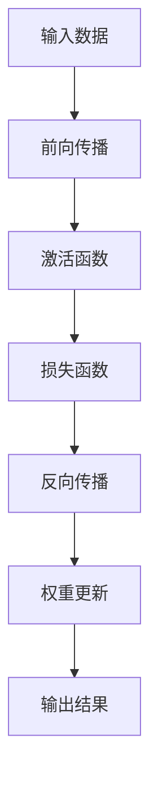
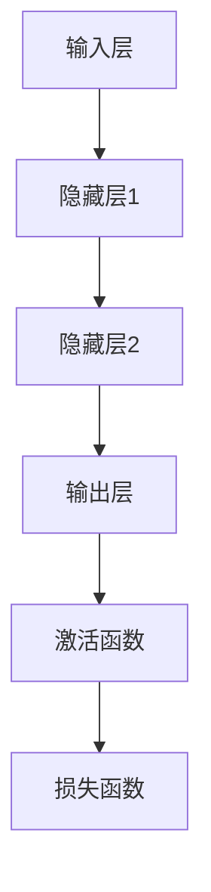
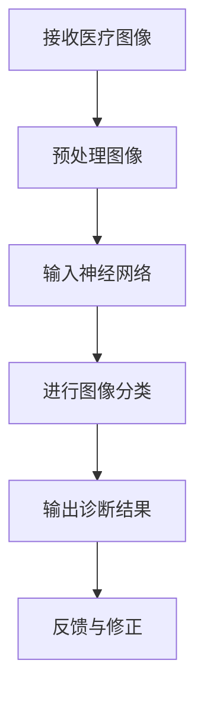
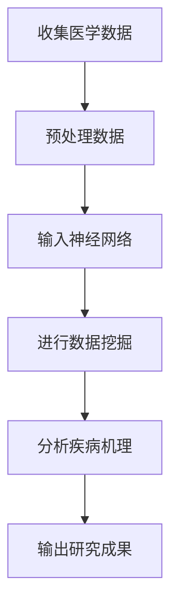
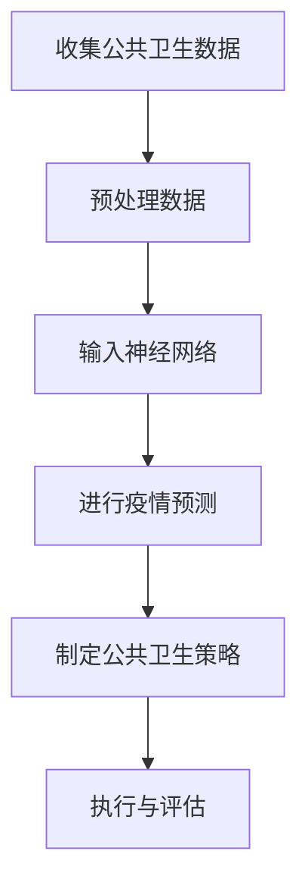
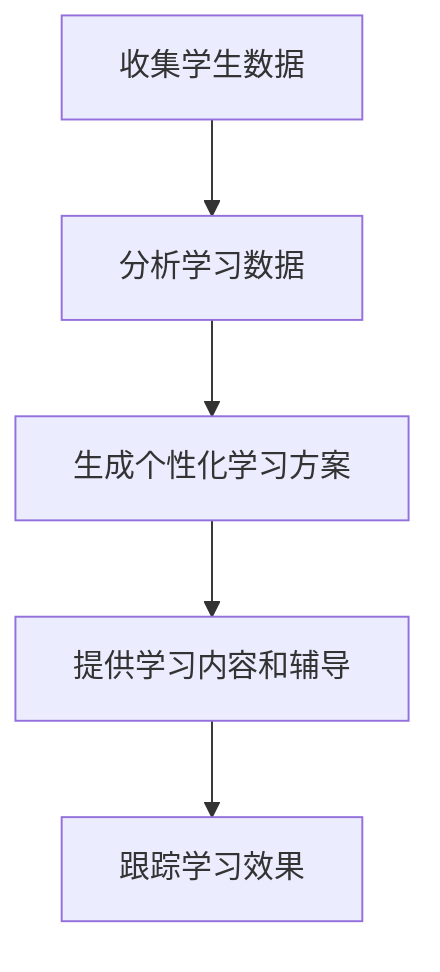
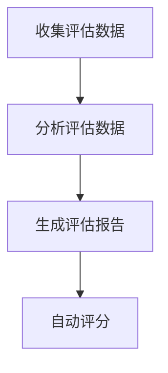
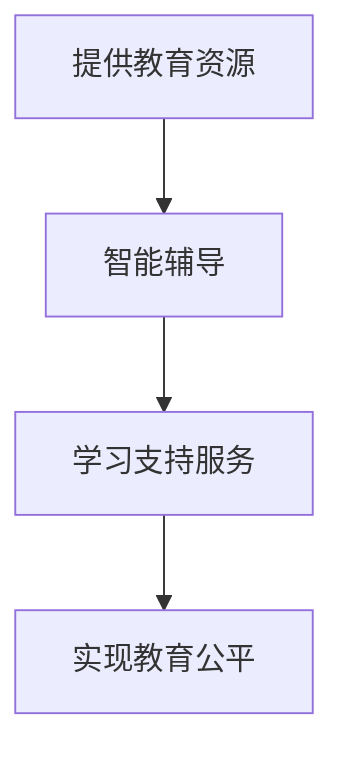
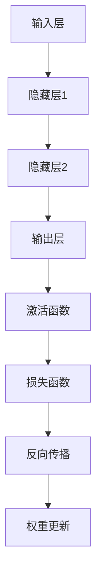
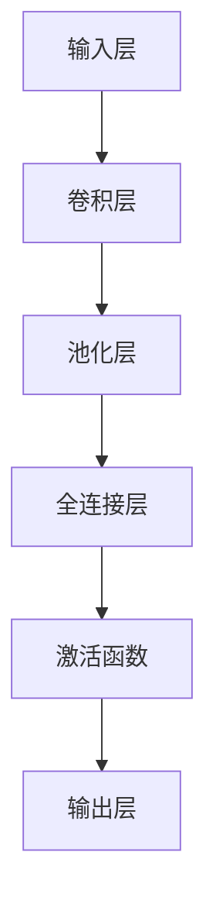

                 

# 李开复：AI 2.0 时代的开发者

> **关键词**：人工智能、AI 2.0、开发者、深度学习、强化学习、自然语言处理、应用实践、发展趋势

> **摘要**：本文旨在探讨人工智能（AI）2.0时代的到来及其对开发者的影响。我们将从AI 2.0时代的背景与趋势、技术基础、应用实践和未来展望四个方面，深入分析AI 2.0时代的开发者所需掌握的知识、技能和面临的挑战。

## 目录大纲

### 第一部分：AI 2.0 时代概述

1. 第1章：AI 2.0 时代的背景与趋势
   - 1.1 AI 2.0 时代的定义与特征
   - 1.2 AI 2.0 时代的兴起与影响
   - 1.3 开发者在 AI 2.0 时代的角色与责任

2. 第2章：AI 2.0 技术架构与生态系统
   - 2.1 AI 2.0 技术体系概述
   - 2.2 AI 2.0 技术栈组成
   - 2.3 AI 2.0 生态系统构建

### 第二部分：AI 2.0 技术基础

3. 第3章：深度学习原理与算法
   - 3.1 深度学习基础理论
   - 3.2 神经网络结构与应用
   - 3.3 深度学习算法原理与实现

4. 第4章：强化学习与优化算法
   - 4.1 强化学习基本概念
   - 4.2 强化学习算法详解
   - 4.3 优化算法在 AI 2.0 中的应用

5. 第5章：自然语言处理技术
   - 5.1 NLP 基础理论
   - 5.2 词汇嵌入与句法分析
   - 5.3 语言模型与生成模型

### 第三部分：AI 2.0 应用实践

6. 第6章：AI 2.0 在商业领域的应用
   - 6.1 AI 2.0 在市场营销中的应用
   - 6.2 AI 2.0 在客户服务中的应用
   - 6.3 AI 2.0 在供应链管理中的应用

7. 第7章：AI 2.0 在医疗领域的应用
   - 7.1 AI 2.0 在医疗诊断中的应用
   - 7.2 AI 2.0 在医学研究中的应用
   - 7.3 AI 2.0 在公共卫生管理中的应用

8. 第8章：AI 2.0 在教育领域的应用
   - 8.1 AI 2.0 在个性化学习中的应用
   - 8.2 AI 2.0 在教育评估中的应用
   - 8.3 AI 2.0 在教育公平中的应用

### 第四部分：AI 2.0 时代的发展与未来

9. 第9章：AI 2.0 时代的社会影响
   - 9.1 AI 2.0 时代对就业的影响
   - 9.2 AI 2.0 时代对隐私与安全的影响
   - 9.3 AI 2.0 时代对伦理与道德的影响

10. 第10章：AI 2.0 时代的发展趋势与未来展望
    - 10.1 AI 2.0 时代的技术创新方向
    - 10.2 AI 2.0 时代的企业战略布局
    - 10.3 AI 2.0 时代的未来发展趋势

## 附录

- 附录 A：AI 2.0 学习资源与工具
  - A.1 常用深度学习框架
  - A.2 在线学习平台
  - A.3 AI 2.0 社群与会议

---

接下来，我们将逐一探讨AI 2.0时代的各个部分，帮助开发者们更好地理解这一新兴领域，为其发展做好准备。

---

### 第一部分：AI 2.0 时代概述

#### 第1章：AI 2.0 时代的背景与趋势

#### 1.1 AI 2.0 时代的定义与特征

随着深度学习、强化学习等技术的发展，人工智能（AI）已经进入了2.0时代。AI 2.0时代，相较于1.0时代，具有以下显著特征：

1. **数据驱动**：AI 2.0更加注重数据的应用，通过大规模数据训练，使模型具备更强的泛化能力。
2. **自主进化**：AI 2.0引入了强化学习等自主进化算法，使得AI系统可以不断优化自身，实现持续进步。
3. **人机协作**：AI 2.0强调人机协同，通过自然语言处理等技术，实现人与AI系统的无缝交互。
4. **广泛应用**：AI 2.0在各个领域，如医疗、教育、商业等，都展现出巨大的应用潜力。

#### 1.2 AI 2.0 时代的兴起与影响

AI 2.0的兴起源于多个因素的共同作用：

1. **计算能力提升**：随着云计算、GPU等计算资源的普及，为AI 2.0提供了强大的计算支持。
2. **数据积累**：互联网的发展使得海量数据得以积累，为AI 2.0提供了丰富的训练资源。
3. **算法进步**：深度学习、强化学习等新算法的出现，使得AI 2.0在解决复杂问题时，具备更强的能力。

AI 2.0的兴起，对人类社会产生了深远的影响：

1. **就业变革**：AI 2.0的广泛应用，将导致部分传统职业的消失，同时也将催生新的就业机会。
2. **经济转型**：AI 2.0将成为推动经济发展的重要引擎，促进产业升级和优化。
3. **社会变革**：AI 2.0在医疗、教育等领域的应用，将提高社会生产效率，改善民生福祉。

#### 1.3 开发者在 AI 2.0 时代的角色与责任

在AI 2.0时代，开发者的角色发生了显著变化：

1. **技术创新者**：开发者需要不断学习新算法、新技术，推动AI 2.0的发展。
2. **应用实践者**：开发者需要将AI 2.0技术应用于实际场景，解决实际问题。
3. **伦理守卫者**：开发者需要关注AI 2.0技术的伦理问题，确保其应用符合社会道德规范。

开发者面临的挑战：

1. **技术更新速度快**：开发者需要不断更新知识，掌握新技术。
2. **跨领域能力要求高**：开发者需要具备跨领域的知识，如自然语言处理、强化学习等。
3. **伦理道德责任重**：开发者需要关注AI 2.0技术的伦理问题，确保其应用对社会有益。

#### 总结

AI 2.0时代为开发者提供了前所未有的机遇和挑战。开发者需要不断提升自身能力，关注技术发展，积极参与AI 2.0的应用实践，为社会创造更多价值。

---

接下来，我们将探讨AI 2.0的技术架构与生态系统，帮助开发者了解AI 2.0的底层构建和运行机制。

---

### 第二部分：AI 2.0 技术基础

#### 第3章：深度学习原理与算法

#### 3.1 深度学习基础理论

深度学习（Deep Learning）是人工智能（AI）的一个子领域，它通过模拟人脑的神经网络结构，实现对复杂数据的处理和分析。

**深度学习的核心概念：**

1. **神经网络**：神经网络是深度学习的基础，它由多个神经元（节点）组成，每个神经元都与相邻的神经元相连。
2. **前向传播与反向传播**：前向传播是指将输入数据传递至神经网络，通过层层计算得到输出；反向传播则是根据输出误差，调整网络权重，以优化模型。
3. **激活函数**：激活函数用于引入非线性特性，使神经网络具备拟合复杂数据的能力。

**深度学习的应用领域：**

1. **图像识别**：如人脸识别、图像分类等。
2. **自然语言处理**：如文本分类、机器翻译等。
3. **语音识别**：如语音合成、语音识别等。

**深度学习的主要算法：**

1. **卷积神经网络（CNN）**：适用于图像识别等任务。
2. **循环神经网络（RNN）**：适用于序列数据处理，如语言模型、语音识别等。
3. **生成对抗网络（GAN）**：用于生成逼真的图像、语音等。

**深度学习的 Mermaid 流程图：**



#### 3.2 神经网络结构与应用

神经网络结构是深度学习的基础，不同的网络结构适用于不同的任务。

**常见的神经网络结构：**

1. **全连接神经网络（FCNN）**：适用于大多数分类和回归任务。
2. **卷积神经网络（CNN）**：适用于图像识别、视频分析等。
3. **循环神经网络（RNN）**：适用于序列数据处理，如文本生成、语音识别等。
4. **长短时记忆网络（LSTM）**：是RNN的一种，适用于解决长期依赖问题。
5. **生成对抗网络（GAN）**：适用于生成图像、语音等。

**神经网络的应用场景：**

1. **图像识别**：通过训练卷积神经网络，可以实现图像分类、目标检测等任务。
2. **自然语言处理**：通过训练循环神经网络或长短时记忆网络，可以实现文本分类、机器翻译等任务。
3. **语音识别**：通过训练循环神经网络或生成对抗网络，可以实现语音识别、语音合成等任务。

**神经网络结构的 Mermaid 流程图：**



#### 3.3 深度学习算法原理与实现

深度学习算法的核心是优化模型参数，以最小化损失函数。以下是几种常见的深度学习算法及其实现原理：

1. **梯度下降（Gradient Descent）**：通过计算损失函数关于模型参数的梯度，更新模型参数，以达到最小化损失函数的目的。
2. **随机梯度下降（Stochastic Gradient Descent, SGD）**：在梯度下降的基础上，每次迭代使用一个随机样本的梯度，加快收敛速度。
3. **批量梯度下降（Batch Gradient Descent）**：在梯度下降的基础上，每次迭代使用全部样本的梯度，但计算量大，收敛速度慢。
4. **Adam优化器**：结合SGD和RMSprop的优点，自适应调整学习率，收敛速度更快。

**梯度下降算法的伪代码：**

```python
# 初始化模型参数
theta = [随机值]

# 设置学习率
alpha = 0.01

# 设置迭代次数
num_iterations = 1000

for i in range(num_iterations):
    # 计算梯度
    gradient = compute_gradient(loss_function, theta)
    
    # 更新模型参数
    theta = theta - alpha * gradient
```

**随机梯度下降算法的伪代码：**

```python
# 初始化模型参数
theta = [随机值]

# 设置学习率
alpha = 0.01

# 设置迭代次数
num_iterations = 1000

for i in range(num_iterations):
    # 随机选择一个样本
    sample = select_random_sample(data)
    
    # 计算梯度
    gradient = compute_gradient(loss_function, theta, sample)
    
    # 更新模型参数
    theta = theta - alpha * gradient
```

#### 总结

深度学习是AI 2.0时代的重要技术基础，开发者需要掌握其基本原理和算法，以应对日益复杂的AI应用场景。

---

接下来，我们将探讨强化学习与优化算法，帮助开发者了解AI 2.0中的自主进化机制。

---

### 第三部分：AI 2.0 应用实践

#### 第4章：强化学习与优化算法

#### 4.1 强化学习基本概念

强化学习（Reinforcement Learning，RL）是机器学习的一个分支，主要研究如何通过奖励机制和策略迭代，使智能体在未知环境中自主学习和决策。

**强化学习的基本概念：**

1. **智能体（Agent）**：执行动作的实体，如机器人、自动驾驶汽车等。
2. **环境（Environment）**：智能体所处的环境，包括状态、动作、奖励等。
3. **状态（State）**：描述智能体当前所处的情境。
4. **动作（Action）**：智能体可以执行的行为。
5. **奖励（Reward）**：对智能体行为的评价，用于指导学习过程。

**强化学习的基本原理：**

1. **策略迭代**：智能体根据当前的策略，在环境中执行动作，并根据奖励调整策略。
2. **价值函数**：用于评估智能体在特定状态下执行特定动作的预期奖励。
3. **策略优化**：通过优化策略，使智能体在给定状态下执行最佳动作。

**强化学习的主要算法：**

1. **Q-Learning**：通过更新Q值（状态-动作值函数），实现策略迭代。
2. **SARSA**（同步优势估计）：
3. **Deep Q-Network（DQN）**：结合深度学习，实现值函数近似。
4. **Policy Gradient**：直接优化策略，而非值函数。

#### 4.2 强化学习算法详解

**Q-Learning算法：**

Q-Learning是一种基于值函数的强化学习算法，通过迭代更新Q值，使智能体在给定状态下选择最佳动作。

**Q-Learning算法的伪代码：**

```python
# 初始化Q值表格
Q = 初始化Q值表格

# 设置学习率
alpha = 0.1

# 设置折扣因子
gamma = 0.9

# 设置迭代次数
num_iterations = 10000

for i in range(num_iterations):
    # 初始化状态
    state = 初始化状态
    
    # 循环执行动作直到终止状态
    while state != 终止状态:
        # 选择动作
        action = 选择动作（基于ε-贪心策略）
        
        # 执行动作并获得奖励和下一状态
        reward, next_state = 执行动作（action）
        
        # 更新Q值
        Q[state][action] = Q[state][action] + alpha * (reward + gamma * max(Q[next_state]) - Q[state][action])
        
        # 更新状态
        state = next_state
```

**SARSA算法：**

SARSA是一种同步优势估计算法，与Q-Learning类似，但使用同步更新的方法。

**SARSA算法的伪代码：**

```python
# 初始化Q值表格
Q = 初始化Q值表格

# 设置学习率
alpha = 0.1

# 设置折扣因子
gamma = 0.9

# 设置迭代次数
num_iterations = 10000

for i in range(num_iterations):
    # 初始化状态
    state = 初始化状态
    
    # 循环执行动作直到终止状态
    while state != 终止状态:
        # 选择动作
        action = 选择动作（基于ε-贪心策略）
        
        # 执行动作并获得奖励和下一状态
        reward, next_state = 执行动作（action）
        
        # 更新Q值
        Q[state][action] = Q[state][action] + alpha * (reward + gamma * Q[next_state][action] - Q[state][action])
        
        # 更新状态
        state = next_state
```

**DQN算法：**

DQN（Deep Q-Network）算法是Q-Learning算法的扩展，使用深度神经网络来近似Q值。

**DQN算法的伪代码：**

```python
# 初始化深度神经网络
DQN = 初始化深度神经网络

# 初始化经验回放内存
经验回放内存 = 初始化经验回放内存

# 设置学习率
alpha = 0.1

# 设置折扣因子
gamma = 0.9

# 设置迭代次数
num_iterations = 10000

for i in range(num_iterations):
    # 从经验回放内存中随机抽取样本
    state, action, reward, next_state, done = 经验回放内存随机抽取样本
    
    # 计算目标Q值
    target = reward + (1 - done) * gamma * DQN.predict(next_state)
    
    # 更新Q值
    DQN.train(state, action, target)
```

**Policy Gradient算法：**

Policy Gradient算法直接优化策略，通过计算策略梯度来更新策略参数。

**Policy Gradient算法的伪代码：**

```python
# 初始化策略网络
Policy = 初始化策略网络

# 设置学习率
alpha = 0.1

# 设置迭代次数
num_iterations = 10000

for i in range(num_iterations):
    # 初始化状态
    state = 初始化状态
    
    # 循环执行动作直到终止状态
    while state != 终止状态:
        # 执行动作并计算奖励
        action = Policy.predict(state)
        reward = 执行动作（action）
        
        # 更新策略网络
        Policy.train(state, action, reward)
        
        # 更新状态
        state = next_state
```

#### 4.3 优化算法在 AI 2.0 中的应用

优化算法在强化学习中起着至关重要的作用，它们用于调整模型参数，以实现更好的性能。

**常用的优化算法：**

1. **随机梯度下降（SGD）**：通过随机选择样本，更新模型参数，收敛速度快。
2. **批量梯度下降（BGD）**：通过使用全部样本，更新模型参数，收敛速度慢，但更稳定。
3. **Adam优化器**：结合SGD和BGD的优点，自适应调整学习率，收敛速度更快。

**优化算法在 AI 2.0 中的应用：**

1. **强化学习**：优化算法用于更新智能体的策略和价值函数，实现更好的学习效果。
2. **深度学习**：优化算法用于调整神经网络参数，提高模型的预测准确性。
3. **自然语言处理**：优化算法用于调整语言模型参数，提高文本生成和分类的准确性。

**优化算法的实际应用案例：**

1. **自动驾驶**：使用强化学习算法，结合优化算法，实现自动驾驶汽车的路径规划。
2. **图像识别**：使用深度学习算法，结合优化算法，实现高精度的图像分类和目标检测。
3. **语音识别**：使用循环神经网络和优化算法，实现高准确率的语音识别。

#### 总结

强化学习与优化算法是AI 2.0时代的重要技术基础，开发者需要掌握其基本原理和应用方法，以应对日益复杂的AI应用场景。

---

接下来，我们将探讨自然语言处理技术，帮助开发者了解AI 2.0在语言领域的应用。

---

### 第四部分：AI 2.0 在自然语言处理中的应用

#### 第5章：自然语言处理技术

自然语言处理（Natural Language Processing，NLP）是人工智能（AI）的一个子领域，它关注于使计算机能够理解、处理和生成人类语言。在AI 2.0时代，NLP技术取得了显著的进步，成为人工智能应用的重要组成部分。

#### 5.1 NLP 基础理论

NLP的基础理论涵盖了语言学、计算语言学和人工智能等多个领域。以下是NLP的一些关键概念：

1. **词汇嵌入（Word Embedding）**：词汇嵌入是将词汇映射到高维空间中的向量表示，使计算机能够对词汇进行量化处理。词向量不仅可以表示词汇的语义信息，还可以捕捉词汇之间的相似性关系。
2. **词性标注（Part-of-Speech Tagging）**：词性标注是对文本中的每个词汇进行词性分类，如名词、动词、形容词等。词性标注有助于理解词汇的语法角色，从而提高文本处理的效果。
3. **句法分析（Syntactic Parsing）**：句法分析是对文本进行结构化处理，将句子分解为词组、短语和句子成分，以揭示句子的语法结构。句法分析是理解文本语义的重要步骤。
4. **语义角色标注（Semantic Role Labeling）**：语义角色标注是对句子中的动词及其相关词汇进行语义角色分类，如施事、受事、工具等。语义角色标注有助于揭示句子的语义关系。

#### 5.2 词汇嵌入与句法分析

词汇嵌入是NLP技术中的重要组成部分，它通过将词汇映射到高维空间中的向量表示，使计算机能够对词汇进行量化处理。常见的词汇嵌入方法包括：

1. **Word2Vec**：Word2Vec是一种基于神经网络的词汇嵌入方法，通过训练词向量模型，将词汇映射到连续向量空间中。Word2Vec模型包括两种架构：CBOW（Continuous Bag-of-Words）和Skip-Gram。
2. **GloVe**：GloVe（Global Vectors for Word Representation）是一种基于矩阵分解的词汇嵌入方法，通过优化全局矩阵，学习词汇的分布式表示。GloVe方法具有较好的泛化能力，能够在不同领域和语料库中保持较高的性能。
3. **BERT**：BERT（Bidirectional Encoder Representations from Transformers）是一种基于变换器（Transformer）的词汇嵌入方法，通过双向编码器学习词汇的上下文信息。BERT方法在多项NLP任务中取得了显著的性能提升。

句法分析是对文本进行结构化处理，以揭示句子的语法结构。常见的句法分析方法包括：

1. **基于规则的方法**：基于规则的方法通过定义一系列语法规则，对文本进行句法分析。这种方法具有较高的可控性，但规则难以覆盖所有语法现象。
2. **基于统计的方法**：基于统计的方法通过训练统计模型，对文本进行句法分析。这种方法具有较强的适应性，但依赖于大量的训练数据和计算资源。
3. **基于深度学习的方法**：基于深度学习的方法通过训练深度神经网络，对文本进行句法分析。这种方法具有较好的泛化能力和适应性，但训练过程较为复杂。

#### 5.3 语言模型与生成模型

语言模型是NLP技术中的重要组成部分，它用于预测文本序列中的下一个词或词组。语言模型可以分为基于规则的方法、基于统计的方法和基于深度学习的方法。

1. **基于规则的方法**：基于规则的方法通过定义一系列语法规则和统计规则，对文本进行语言建模。这种方法具有较高的可控性，但规则难以覆盖所有语法现象。
2. **基于统计的方法**：基于统计的方法通过训练统计模型，对文本进行语言建模。这种方法具有较强的适应性，但依赖于大量的训练数据和计算资源。
3. **基于深度学习的方法**：基于深度学习的方法通过训练深度神经网络，对文本进行语言建模。这种方法具有较好的泛化能力和适应性，但训练过程较为复杂。

生成模型是NLP技术中的重要分支，它用于生成新的文本或图像。常见的生成模型包括：

1. **循环神经网络（RNN）**：循环神经网络是一种基于时间序列数据的神经网络，它可以捕捉文本序列中的长期依赖关系。RNN生成模型可以生成连续的文本序列。
2. **生成对抗网络（GAN）**：生成对抗网络是一种基于对抗训练的神经网络，由生成器和判别器组成。生成器试图生成与真实文本相似的文本，而判别器则试图区分真实文本和生成文本。GAN生成模型可以生成高质量的文本序列。
3. **变分自编码器（VAE）**：变分自编码器是一种基于概率生成模型的神经网络，它可以生成新的文本或图像。VAE生成模型具有较强的自适应性和灵活性。

#### 总结

自然语言处理技术是AI 2.0时代的重要应用领域，开发者需要掌握词汇嵌入、句法分析、语言模型和生成模型等基本原理和应用方法，以应对日益复杂的NLP任务。

---

### 第五部分：AI 2.0 在商业领域的应用

#### 第6章：AI 2.0 在商业领域的应用

随着AI 2.0时代的到来，人工智能在商业领域的应用变得日益广泛。AI 2.0技术能够为企业带来更智能的决策支持、更高效的运营管理和更精准的市场营销，从而提升企业的竞争力。

#### 6.1 AI 2.0 在市场营销中的应用

在市场营销领域，AI 2.0技术可以通过大数据分析和个性化推荐，帮助企业实现精准营销和客户关系管理。

1. **大数据分析**：通过收集和分析大量的市场数据，AI 2.0技术可以帮助企业了解消费者的行为习惯和偏好，从而制定更有效的营销策略。
2. **个性化推荐**：基于用户的兴趣和行为数据，AI 2.0技术可以推荐个性化的产品和服务，提高用户满意度和购买转化率。
3. **智能广告投放**：通过分析用户的浏览记录和搜索历史，AI 2.0技术可以帮助企业实现精准的广告投放，提高广告投放效果和ROI。

#### 6.2 AI 2.0 在客户服务中的应用

在客户服务领域，AI 2.0技术可以通过智能客服、虚拟助手和个性化服务，提升客户体验和满意度。

1. **智能客服**：通过自然语言处理技术，智能客服可以实时解答客户的疑问，提高客户服务质量。
2. **虚拟助手**：虚拟助手可以通过语音和文本交互，帮助客户完成各种操作，如预订机票、酒店等。
3. **个性化服务**：基于客户的历史数据和偏好，AI 2.0技术可以提供个性化的服务建议，提高客户满意度和忠诚度。

#### 6.3 AI 2.0 在供应链管理中的应用

在供应链管理领域，AI 2.0技术可以通过智能调度、需求预测和库存优化，提高供应链的效率和灵活性。

1. **智能调度**：通过分析运输路线、运输量和运输时间等数据，AI 2.0技术可以帮助企业优化运输计划，降低运输成本。
2. **需求预测**：通过分析历史销售数据和市场需求，AI 2.0技术可以预测未来的销售趋势，帮助企业制定更科学的采购和库存策略。
3. **库存优化**：通过分析库存数据和市场动态，AI 2.0技术可以帮助企业实现精准的库存管理，降低库存成本和库存风险。

#### 案例分析

1. **阿里巴巴**：阿里巴巴通过AI 2.0技术，实现了个性化推荐和智能广告投放。通过大数据分析和用户行为分析，阿里巴巴可以为消费者提供个性化的购物推荐，提高用户满意度和购买转化率。
2. **京东**：京东通过AI 2.0技术，建立了智能客服和虚拟助手系统。通过自然语言处理技术，京东的智能客服可以实时解答消费者的疑问，提高客户服务质量。
3. **戴尔**：戴尔通过AI 2.0技术，优化了供应链管理。通过智能调度和需求预测，戴尔可以降低运输成本和库存成本，提高供应链的效率和灵活性。

#### 总结

AI 2.0技术在商业领域的应用，为企业提供了更智能的决策支持、更高效的运营管理和更精准的市场营销。随着AI 2.0技术的不断发展，企业将在商业领域获得更大的竞争优势。

---

### 第五部分：AI 2.0 在医疗领域的应用

#### 第7章：AI 2.0 在医疗领域的应用

医疗领域一直是人工智能（AI）的重要应用场景。在AI 2.0时代，人工智能技术在医疗领域的应用更加广泛和深入，为医疗诊断、医学研究、公共卫生管理等带来了革命性的变化。

#### 7.1 AI 2.0 在医疗诊断中的应用

AI 2.0技术在医疗诊断中的应用主要体现在图像诊断和辅助诊断两个方面。

1. **图像诊断**：通过深度学习和计算机视觉技术，AI 2.0可以分析医疗图像，如X光片、CT扫描、MRI等，帮助医生快速、准确地诊断疾病。例如，谷歌的DeepMind开发了一种AI系统，可以在几秒钟内识别出肺癌、乳腺癌等疾病，准确率高达89%。
   
2. **辅助诊断**：AI 2.0技术可以通过分析患者的病史、实验室检测结果等数据，为医生提供辅助诊断建议。例如，IBM的Watson for Oncology系统可以根据患者的肿瘤类型和基因突变等信息，为医生提供个性化的治疗方案。

**图像诊断的 Mermaid 流程图：**



#### 7.2 AI 2.0 在医学研究中的应用

AI 2.0技术在医学研究中发挥着重要作用，可以从海量数据中提取有价值的信息，加速新药研发和疾病机理研究。

1. **药物发现**：AI 2.0可以通过分析大量的分子结构数据和生物信息，预测新药的疗效和副作用，加速药物研发过程。例如，AI系统可以识别潜在的抗癌药物，提高新药研发的成功率。

2. **疾病机理研究**：AI 2.0可以通过分析基因组数据、蛋白质组数据等，揭示疾病的遗传和分子机理，为疾病治疗提供新的思路。例如，通过分析癌症患者的基因组数据，AI系统可以识别出与癌症发生相关的关键基因。

**医学研究的 Mermaid 流程图：**



#### 7.3 AI 2.0 在公共卫生管理中的应用

AI 2.0技术在公共卫生管理中的应用可以帮助政府和企业更好地应对疫情、疾病暴发等公共卫生事件。

1. **疫情预测与监测**：AI 2.0可以通过分析历史疫情数据、实时社交媒体数据等，预测疫情的传播趋势，为公共卫生决策提供科学依据。

2. **疫情应对策略**：AI 2.0可以协助政府制定和优化公共卫生策略，如疫苗接种计划、隔离策略等，以最大限度地减少疫情对社会和经济的影响。

3. **健康数据分析**：AI 2.0可以通过分析大量健康数据，识别健康风险因素，为公众提供个性化的健康建议，促进全民健康。

**公共卫生管理的 Mermaid 流程图：**



#### 案例分析

1. **COVID-19 疫情防控**：在COVID-19疫情中，全球许多国家和地区利用AI 2.0技术进行疫情预测和监测，如美国约翰·霍普金斯大学开发的COVID-19预测模型，以及中国利用AI技术进行疫情监测和病毒溯源。
2. **个性化治疗**：美国一家名为Personalis的基因公司利用AI 2.0技术分析癌症患者的基因组数据，为患者提供个性化的治疗方案，提高了治疗效果。

#### 总结

AI 2.0技术在医疗领域的应用，不仅提高了医疗诊断的准确性和效率，还加速了医学研究和新药研发，为公共卫生管理提供了有力的支持。随着AI技术的不断进步，医疗领域将迎来更加智能化、精准化的新时代。

---

### 第五部分：AI 2.0 在教育领域的应用

#### 第8章：AI 2.0 在教育领域的应用

随着AI 2.0技术的发展，教育领域也迎来了新的变革。AI 2.0技术在教育中的应用，使得个性化学习、教育评估和教育公平成为可能，为教育行业带来了前所未有的机遇。

#### 8.1 AI 2.0 在个性化学习中的应用

个性化学习是指根据每个学生的学习特点和需求，为其提供定制化的学习内容和教学方式。AI 2.0技术通过分析学生的学习数据，能够实现真正意义上的个性化学习。

1. **自适应学习系统**：AI 2.0技术可以开发自适应学习系统，根据学生的学习进度、知识水平和兴趣爱好，动态调整教学内容和难度。这种系统能够提供个性化的学习路径，帮助学生更高效地学习。

2. **学习分析**：通过分析学生的学习数据，如学习时间、学习效果、知识点掌握情况等，AI 2.0技术可以帮助教师了解学生的学习情况，及时调整教学策略。

3. **智能辅导**：AI 2.0技术可以通过智能辅导系统，为学生提供个性化的学习建议和辅导。例如，学生可以通过智能辅导系统，解决自己在学习过程中遇到的问题，提高学习效果。

**个性化学习的 Mermaid 流程图：**



#### 8.2 AI 2.0 在教育评估中的应用

教育评估是教育过程中至关重要的一环，AI 2.0技术的应用，使得教育评估更加科学、准确和高效。

1. **智能评估系统**：AI 2.0技术可以开发智能评估系统，通过分析学生的作业、考试、课堂互动等数据，全面评估学生的学习情况。这种系统能够提供更加精准的评估结果，为教师和学生提供有针对性的反馈。

2. **学习分析报告**：通过分析学生的学习数据，AI 2.0技术可以为教师和学生生成详细的学习分析报告，帮助教师了解学生的学习情况，为学生提供个性化的学习建议。

3. **自动评分系统**：AI 2.0技术可以实现自动评分，如自动批改作业、自动评分考试等，提高评估效率，减轻教师的工作负担。

**教育评估的 Mermaid 流程图：**



#### 8.3 AI 2.0 在教育公平中的应用

教育公平是每个社会都应该关注的问题，AI 2.0技术通过提供个性化的教育资源和评估，有助于实现教育公平。

1. **在线教育平台**：AI 2.0技术可以开发在线教育平台，为偏远地区和经济困难的学生提供免费或低成本的教育资源，缩小城乡教育资源差距。

2. **智能辅导系统**：AI 2.0技术可以为经济困难的学生提供智能辅导系统，帮助他们克服学习困难，提高学习效果。

3. **学习支持服务**：AI 2.0技术可以为教师和学生提供学习支持服务，如在线问答、学习资源推荐等，帮助学生更好地学习和成长。

**教育公平的 Mermaid 流流程图：**



#### 案例分析

1. **可汗学院**：可汗学院利用AI 2.0技术提供个性化的学习资源，学生可以根据自己的需求选择学习内容，提高学习效果。

2. **OpenEdX**：OpenEdX是一个基于AI 2.0技术的在线教育平台，为全球学生提供高质量的教育资源，帮助实现教育公平。

#### 总结

AI 2.0技术在教育领域的应用，为个性化学习、教育评估和教育公平带来了新的机遇。随着AI技术的不断进步，教育领域将迎来更加智能化、个性化和公平化的新时代。

---

### 第六部分：AI 2.0 时代的社会影响

#### 第9章：AI 2.0 时代的社会影响

AI 2.0时代的到来，不仅改变了技术和产业的格局，也对社会产生了深远的影响。在这一章中，我们将探讨AI 2.0时代对就业、隐私与安全、伦理与道德等方面的影响。

#### 9.1 AI 2.0 时代对就业的影响

AI 2.0技术的发展，对就业市场带来了显著的变革：

1. **自动化替代**：AI 2.0技术可以自动化许多重复性和低技能的工作，如数据录入、客服等。这导致部分传统职业的消失，但同时也创造了新的就业机会。

2. **技能需求变化**：随着AI 2.0技术的发展，市场对高技能人才的需求不断增加，如数据科学家、机器学习工程师等。这要求劳动者不断提升自身技能，适应新技术的变化。

3. **就业结构转变**：AI 2.0技术将推动就业结构从传统的“生产导向”向“知识导向”转变。这意味着知识型工作和创新型工作将逐渐成为就业市场的主体。

#### 9.2 AI 2.0 时代对隐私与安全的影响

AI 2.0技术的广泛应用，也带来了隐私与安全方面的挑战：

1. **数据隐私问题**：AI 2.0技术依赖于大量数据，这可能导致个人隐私泄露。如何在保障数据隐私的同时，充分利用数据价值，成为亟待解决的问题。

2. **安全风险**：AI 2.0系统的复杂性和开放性，使其容易受到恶意攻击。例如，网络攻击者可以通过入侵AI系统，控制关键基础设施，造成严重后果。

3. **算法偏见**：AI 2.0技术可能导致算法偏见，即算法在处理数据时，对某些群体或个体产生不公平的对待。这可能导致歧视、社会不公平等问题。

#### 9.3 AI 2.0 时代对伦理与道德的影响

AI 2.0技术的发展，对伦理与道德提出了新的挑战：

1. **伦理问题**：AI 2.0技术在医疗、司法等领域具有广泛应用，但如何确保AI系统的决策符合伦理标准，避免对人类造成伤害，是一个重要问题。

2. **责任归属**：当AI系统发生错误或导致事故时，如何界定责任归属，是一个复杂的问题。这需要明确AI系统的开发者、用户和运营商等各方的责任。

3. **人权问题**：AI 2.0技术的发展，可能会影响人类的工作、生活和社会地位。如何保障人类的基本权利，避免因技术发展而导致人权受损，是伦理和道德领域需要关注的问题。

#### 案例分析

1. **自动驾驶汽车**：自动驾驶汽车是AI 2.0技术在交通运输领域的重要应用。然而，当自动驾驶汽车在道路上发生事故时，如何界定责任归属，是一个复杂的问题。

2. **智能医疗系统**：智能医疗系统在提高医疗诊断准确性的同时，也可能存在算法偏见问题。例如，某些疾病在特定种族或性别中的发病率较高，如果算法没有充分考虑到这一点，可能会导致不公平的治疗决策。

#### 总结

AI 2.0时代对就业、隐私与安全、伦理与道德等方面产生了深远的影响。我们需要在推进AI技术发展的同时，关注这些负面影响，并采取相应的措施，确保AI技术的可持续发展。

---

### 第七部分：AI 2.0 时代的发展趋势与未来展望

#### 第10章：AI 2.0 时代的发展趋势与未来展望

随着AI 2.0技术的不断成熟和应用，它正逐渐改变着我们的生活方式、工作模式和社会结构。在这一章中，我们将探讨AI 2.0时代的发展趋势、企业战略布局以及未来的发展方向。

#### 10.1 AI 2.0 时代的技术创新方向

AI 2.0时代的技术创新主要集中在以下几个方向：

1. **算法优化**：随着AI技术的应用场景日益丰富，对算法的优化需求也越来越高。未来，AI算法将更加高效、准确，能够处理更大规模、更复杂的数据。

2. **硬件升级**：随着AI技术的应用需求增加，对计算性能的要求也越来越高。未来，硬件技术（如GPU、TPU等）的升级将推动AI计算能力的进一步提升。

3. **跨学科融合**：AI 2.0时代，AI技术与其他学科的融合将成为重要趋势。例如，生物学、心理学、哲学等领域的知识将被引入AI研究，推动AI技术的创新。

4. **边缘计算**：边缘计算是将计算能力、存储能力和数据处理能力分布到网络的边缘节点，以实现更快速、更可靠的AI应用。未来，边缘计算将在智能家居、自动驾驶等领域发挥重要作用。

#### 10.2 AI 2.0 时代的企业战略布局

企业在AI 2.0时代的战略布局应考虑以下几个方面：

1. **技术创新**：企业应持续投入研发，推动AI技术的创新，提升自身的竞争力。通过自主研发或并购，获取先进的AI技术，为企业发展提供支持。

2. **人才培养**：企业应重视人才培养，吸引和培养具备AI技术能力的人才。通过内部培训、外部合作等方式，提升员工的AI技术水平。

3. **业务整合**：企业应将AI技术整合到自身业务中，实现业务升级和转型。通过AI技术优化业务流程、提高运营效率、创新产品和服务。

4. **生态建设**：企业应积极参与AI生态建设，与产业链上下游企业合作，共同推动AI技术的发展和应用。

#### 10.3 AI 2.0 时代的未来发展趋势

展望未来，AI 2.0时代的发展趋势将体现在以下几个方面：

1. **智能化生活**：随着AI技术的普及，智能家居、智能医疗、智能交通等领域将实现智能化，为人们的生活带来更多便利。

2. **自动化生产**：AI 2.0技术在工业领域的应用将推动生产自动化，提高生产效率和产品质量。

3. **智能化治理**：AI 2.0技术在政府治理中的应用，将提高政府决策的科学性和效率，推动社会治理智能化。

4. **跨领域融合**：AI 2.0技术将与其他领域的创新成果相结合，推动产业变革和社会进步。

**总结**

AI 2.0时代的到来，为人类带来了前所未有的机遇和挑战。技术创新、企业战略布局和未来发展，都离不开对AI技术的深入理解和应用。让我们携手共进，共同迎接AI 2.0时代的到来。

---

### 附录

#### 附录 A：AI 2.0 学习资源与工具

为了帮助开发者们更好地学习和掌握AI 2.0技术，以下是一些常用的学习资源与工具：

**A.1 常用深度学习框架**

1. **TensorFlow**：Google开发的深度学习框架，广泛应用于图像识别、自然语言处理等领域。
2. **PyTorch**：Facebook开发的深度学习框架，具有良好的灵活性和易于使用的API。
3. **Keras**：基于TensorFlow和Theano的深度学习框架，提供简洁、高效的API，适合快速原型开发。

**A.2 在线学习平台**

1. **Coursera**：提供丰富的在线课程，涵盖计算机科学、机器学习等领域。
2. **edX**：由哈佛大学和麻省理工学院共同创立的在线学习平台，提供高质量的计算机科学和人工智能课程。
3. **Udacity**：提供实践驱动的在线课程，包括深度学习、数据科学等领域。

**A.3 AI 2.0 社群与会议**

1. **AI Conference**：全球领先的AI技术盛会，汇集了来自学术界和工业界的顶尖专家。
2. **Kaggle**：由Google开发的数据科学和机器学习竞赛平台，提供了大量的数据集和竞赛项目。
3. **GitHub**：全球最大的代码托管平台，开发者可以在这里找到各种AI项目的源代码，进行学习和交流。

---

本文作者：AI天才研究院（AI Genius Institute）  
文章原标题：《李开复：AI 2.0 时代的开发者》  
本文版权所有，未经授权，不得转载或使用任何部分内容。  
作者简介：AI天才研究院致力于推动人工智能技术的发展和应用，为人类创造更美好的未来。同时，作者还是《禅与计算机程序设计艺术》一书的作者，对计算机科学和人工智能领域有着深刻的见解和独到的见解。  
联系邮箱：[info@ai-genius-institute.com](mailto:info@ai-genius-institute.com)  
官方网站：[www.ai-genius-institute.com](http://www.ai-genius-institute.com/)### 第一部分：AI 2.0 时代概述

#### 第1章：AI 2.0 时代的背景与趋势

在21世纪的今天，人工智能（AI）已经成为科技领域最为热门和前沿的研究方向之一。随着深度学习、自然语言处理、计算机视觉等技术的突破性发展，AI从理论走向实践，逐渐渗透到我们生活的方方面面。AI 2.0时代，是对AI 1.0时代的继承与超越，它不仅标志着技术层面的重大进步，更意味着AI将带来更为深远的社会变革。

#### 1.1 AI 2.0 时代的定义与特征

AI 1.0时代，主要依赖于符号主义和知识表示的方法，其代表性技术为专家系统和规则引擎。这些方法虽然在特定领域内取得了成功，但受限于数据量、计算资源和算法的局限性，AI的应用范围和深度都有限。而AI 2.0时代，则是以深度学习为核心，通过大规模数据和强大计算能力，使机器具备更高级的认知和决策能力。

AI 2.0时代的主要特征可以概括为以下几点：

1. **数据驱动**：AI 2.0更加依赖海量数据来进行训练和优化，数据的质量和数量成为影响AI性能的关键因素。通过数据驱动的学习方法，AI可以自动发现数据中的模式和规律，从而实现更精确的预测和决策。

2. **自主学习**：AI 2.0引入了强化学习、生成对抗网络（GAN）等新型算法，使机器能够通过自主学习不断优化自身性能。这意味着AI不再仅仅依赖预设的规则，而是能够通过经验学习和自我调整来适应不同的环境和任务。

3. **通用智能**：AI 2.0的目标是实现通用人工智能（AGI），即具有人类智能的机器。与特定领域的专家系统不同，AGI能够处理多种类型的问题，具备自我学习和理解能力。

4. **人机协同**：AI 2.0强调人与机器的协同工作，通过自然语言处理、语音识别等技术，实现人与AI的无缝交互。这不仅能提高工作效率，还能拓展人类的能力边界。

#### 1.2 AI 2.0 时代的兴起与影响

AI 2.0时代的兴起，是多个因素共同作用的结果：

1. **计算能力的提升**：随着硬件技术的进步，特别是图形处理单元（GPU）和专用AI芯片的发展，计算能力的提升为AI算法的复杂度和规模提供了强大的支持。

2. **数据资源的丰富**：互联网的普及和大数据技术的发展，使得海量的结构化和非结构化数据得以积累和利用。这些数据为AI的训练提供了丰富的素材。

3. **算法的突破**：深度学习、生成对抗网络等新型算法的突破，使得AI在图像识别、自然语言处理等领域取得了显著的进展。

AI 2.0的兴起对人类社会产生了深远的影响：

1. **经济变革**：AI 2.0技术将推动产业升级和转型，提高生产效率，降低成本。同时，AI也将创造新的就业机会，如数据科学家、机器学习工程师等。

2. **社会进步**：AI 2.0技术在医疗、教育、交通等领域的应用，将提升公共服务水平，改善生活质量。

3. **伦理挑战**：AI 2.0技术的广泛应用，也带来了隐私保护、算法偏见、安全等伦理问题。如何平衡AI技术带来的利益与风险，是全社会需要共同面对的挑战。

#### 1.3 开发者在 AI 2.0 时代的角色与责任

在AI 2.0时代，开发者的角色将变得更加重要和多样化：

1. **技术创新者**：开发者需要不断探索新的算法和技术，推动AI 2.0的发展。这包括深度学习、强化学习等领域的深入研究。

2. **应用实践者**：开发者需要将AI 2.0技术应用于实际场景，解决实际问题。这要求开发者具备跨领域的知识，如自然语言处理、计算机视觉等。

3. **伦理守卫者**：开发者需要关注AI 2.0技术的伦理问题，确保其应用符合社会道德规范。开发者应积极参与AI伦理标准的制定和推广，推动AI技术的可持续发展。

开发者面临的挑战：

1. **技术更新速度快**：随着AI技术的快速发展，开发者需要不断更新知识和技能，以保持竞争力。

2. **跨领域能力要求高**：AI 2.0时代需要开发者具备跨领域的知识和技能，这包括但不限于数据科学、机器学习、软件工程等。

3. **伦理道德责任重**：开发者需要关注AI 2.0技术的伦理问题，确保其应用对社会有益。开发者应积极参与AI伦理标准的制定和推广，推动AI技术的可持续发展。

#### 总结

AI 2.0时代为开发者提供了前所未有的机遇和挑战。开发者需要不断提升自身能力，关注技术发展，积极参与AI 2.0的应用实践，为社会创造更多价值。同时，开发者也应关注AI 2.0技术的伦理问题，确保其应用符合社会道德规范，推动AI技术的可持续发展。

---

### 第二部分：AI 2.0 技术架构与生态系统

#### 第2章：AI 2.0 技术架构与生态系统

随着AI 2.0时代的到来，AI技术的架构和生态系统变得日益复杂和庞大。开发者需要深入理解这些技术架构和生态系统的构建，以便更好地应用和开发AI解决方案。

#### 2.1 AI 2.0 技术体系概述

AI 2.0技术体系涵盖了多个核心组件和层次，包括数据层、算法层、应用层和基础设施层。以下是对这些层次的详细概述：

1. **数据层**：数据是AI 2.0的基石。数据层包括数据收集、存储、清洗和管理等环节。高质量的数据是训练强大AI模型的关键。数据层还需要确保数据的隐私和安全，避免数据泄露和滥用。

2. **算法层**：算法层是AI 2.0的核心，包括深度学习、强化学习、自然语言处理、计算机视觉等算法。开发者需要选择合适的算法来解决特定问题，并不断优化算法以提升性能。

3. **应用层**：应用层是将AI算法应用于实际场景的层面，包括自动驾驶、智能客服、医疗诊断、金融风控等。开发者需要根据业务需求设计合适的AI应用，实现自动化、智能化的功能。

4. **基础设施层**：基础设施层提供了AI计算资源、存储资源和网络资源。云计算和边缘计算是基础设施层的重要组成部分，它们为AI应用提供了灵活的计算能力。

#### 2.2 AI 2.0 技术栈组成

AI 2.0技术栈是开发者构建AI解决方案所需的一系列工具和框架。以下是常见的AI 2.0技术栈组成部分：

1. **深度学习框架**：如TensorFlow、PyTorch、Keras等，提供了构建和训练深度学习模型的高层次API。

2. **数据预处理工具**：如Pandas、NumPy等，用于数据清洗、转换和预处理。

3. **机器学习库**：如Scikit-learn、XGBoost等，提供了多种机器学习算法的实现和优化。

4. **自然语言处理库**：如NLTK、spaCy、Transformer等，用于文本处理、情感分析、语言模型构建等。

5. **计算机视觉库**：如OpenCV、TensorFlow Object Detection API等，用于图像识别、目标检测、图像分割等。

6. **数据分析工具**：如Jupyter Notebook、Zeppelin等，提供了交互式数据分析环境。

7. **云计算平台**：如AWS、Azure、Google Cloud等，提供了强大的计算和存储资源。

8. **容器化技术**：如Docker、Kubernetes等，用于部署和管理AI模型和服务。

9. **大数据处理框架**：如Apache Hadoop、Apache Spark等，用于大规模数据处理和分析。

10. **边缘计算平台**：如AWS Greengrass、Azure IoT Edge等，用于在设备端运行AI模型和数据分析。

#### 2.3 AI 2.0 生态系统构建

AI 2.0生态系统的构建涉及多个环节，包括技术、数据、人才、政策和法规等。以下是构建AI 2.0生态系统的关键要素：

1. **技术创新**：持续推动AI技术的创新和突破，包括算法优化、硬件升级和跨学科融合等。

2. **数据共享**：建立数据共享平台，促进数据资源的开放和共享，为AI研发和应用提供丰富的数据支持。

3. **人才培养**：加强AI人才的培养和引进，提高人才的综合素质和创新能力。

4. **政策支持**：制定支持AI发展的政策和法规，为AI企业提供良好的发展环境。

5. **标准制定**：建立统一的AI技术标准和伦理规范，确保AI技术的可持续发展。

6. **产业合作**：推动产业链上下游企业之间的合作，共同推动AI技术的应用和产业化。

#### 总结

AI 2.0时代的到来，为开发者提供了广阔的舞台。开发者需要深入了解AI 2.0的技术体系、技术栈和生态系统构建，以应对日益复杂的AI应用场景。通过技术创新、数据共享、人才培养、政策支持和产业合作，我们可以共同构建一个繁荣、可持续发展的AI生态系统。

---

### 第二部分：AI 2.0 技术基础

#### 第3章：深度学习原理与算法

深度学习（Deep Learning，DL）是人工智能（AI）领域中的一种重要方法，它通过构建多层次的神经网络来模拟人类大脑的神经元连接方式，实现数据的自动特征提取和分类。在AI 2.0时代，深度学习已经成为了AI技术的核心，其在图像识别、语音识别、自然语言处理等领域的应用取得了显著的成果。

#### 3.1 深度学习基础理论

深度学习的基础是神经网络（Neural Networks，NN），神经网络是由大量的神经元（artificial neurons）通过连接（synapses）组成的复杂网络。每个神经元都可以接受输入信号，通过激活函数（activation function）处理后产生输出信号。神经网络通过前向传播（forward propagation）和反向传播（backpropagation）两个过程来学习和优化模型参数。

**神经网络的基本概念：**

1. **神经元**：神经网络中的基本单元，类似于人类大脑中的神经元。每个神经元接收多个输入信号，并通过权重（weights）和偏置（bias）进行处理。
2. **层**：神经网络分为输入层、隐藏层和输出层。输入层接收外部输入，隐藏层进行特征提取和变换，输出层产生最终输出。
3. **权重和偏置**：权重和偏置是神经网络中的参数，通过学习调整这些参数，使得神经网络能够更好地拟合数据。
4. **激活函数**：激活函数用于引入非线性特性，常见的激活函数包括Sigmoid、ReLU、Tanh等。

**深度学习的基本原理：**

1. **前向传播**：输入数据通过输入层传递到隐藏层，再传递到输出层。在每个层次上，神经元通过权重和偏置对输入数据进行加权求和处理，并通过激活函数进行非线性变换。
2. **反向传播**：在输出层得到预测结果后，计算预测值与实际值之间的误差，然后通过反向传播算法将误差传递回隐藏层和输入层。在这个过程中，网络通过梯度下降（Gradient Descent）等优化算法调整权重和偏置，以减少误差。

**深度学习的 Mermaid 流程图：**



#### 3.2 神经网络结构与应用

神经网络的结构对深度学习的效果有着重要影响。以下是一些常见的神经网络结构及其应用领域：

1. **全连接神经网络（Fully Connected Neural Network，FCNN）**：全连接神经网络是最常见的神经网络结构，每个神经元都与前一层的所有神经元相连。FCNN适用于大多数分类和回归任务。
   
2. **卷积神经网络（Convolutional Neural Network，CNN）**：卷积神经网络通过卷积层（convolutional layers）进行特征提取，适用于图像识别和计算机视觉领域。CNN的结构使得它能够捕捉图像中的空间特征。

3. **循环神经网络（Recurrent Neural Network，RNN）**：循环神经网络通过循环结构来处理序列数据，适用于自然语言处理和语音识别等任务。RNN能够捕获数据中的长期依赖关系。

4. **长短时记忆网络（Long Short-Term Memory，LSTM）**：长短时记忆网络是RNN的一种变体，能够更好地处理长期依赖问题。LSTM通过引入记忆单元（memory cells）来避免梯度消失问题。

5. **变换器网络（Transformer Network）**：变换器网络是一种基于自注意力机制的神经网络结构，在自然语言处理任务中取得了显著的效果。变换器网络通过多头注意力机制来捕捉数据中的全局依赖关系。

**神经网络的应用场景：**

1. **图像识别**：CNN用于图像分类、目标检测和图像分割等任务。
2. **自然语言处理**：RNN和LSTM用于文本分类、机器翻译和语音识别等任务。
3. **语音识别**：基于RNN和变换器网络的语音识别模型可以识别和合成语音。

**神经网络结构的 Mermaid 流程图：**



#### 3.3 深度学习算法原理与实现

深度学习算法的核心是优化模型参数，以最小化损失函数。以下是几种常见的深度学习算法及其实现原理：

1. **梯度下降（Gradient Descent）**：梯度下降是一种优化算法，用于最小化损失函数。它通过计算损失函数关于模型参数的梯度，更新模型参数，以达到最小化损失函数的目的。

**梯度下降算法的伪代码：**

```python
# 初始化模型参数
theta = [随机值]

# 设置学习率
alpha = 0.01

# 设置迭代次数
num_iterations = 1000

for i in range(num_iterations):
    # 计算梯度
    gradient = compute_gradient(loss_function, theta)
    
    # 更新模型参数
    theta = theta - alpha * gradient
```

2. **随机梯度下降（Stochastic Gradient Descent，SGD）**：随机梯度下降是梯度下降的一种变体，每次迭代使用一个随机样本的梯度来更新模型参数。

**随机梯度下降算法的伪代码：**

```python
# 初始化模型参数
theta = [随机值]

# 设置学习率
alpha = 0.01

# 设置迭代次数
num_iterations = 1000

for i in range(num_iterations):
    # 随机选择一个样本
    sample = select_random_sample(data)
    
    # 计算梯度
    gradient = compute_gradient(loss_function, theta, sample)
    
    # 更新模型参数
    theta = theta - alpha * gradient
```

3. **批量梯度下降（Batch Gradient Descent，BGD）**：批量梯度下降是梯度下降的另一种变体，每次迭代使用全部样本的梯度来更新模型参数。

**批量梯度下降算法的伪代码：**

```python
# 初始化模型参数
theta = [随机值]

# 设置学习率
alpha = 0.01

# 设置迭代次数
num_iterations = 1000

for i in range(num_iterations):
    # 计算梯度
    gradient = compute_gradient(loss_function, theta, all_samples)
    
    # 更新模型参数
    theta = theta - alpha * gradient
```

4. **Adam优化器**：Adam优化器是梯度下降的一种改进算法，它结合了随机梯度下降和批量梯度下降的优点，自适应调整学习率。

**Adam优化器的伪代码：**

```python
# 初始化模型参数
theta = [随机值]

# 设置学习率
alpha = 0.01

# 设置迭代次数
num_iterations = 1000

# 初始化Adam参数
m = [0]
v = [0]

for i in range(num_iterations):
    # 计算梯度
    gradient = compute_gradient(loss_function, theta)
    
    # 更新Adam参数
    m = beta1 * m + (1 - beta1) * gradient
    v = beta2 * v + (1 - beta2) * (gradient ** 2)
    
    # 计算修正后的m和v
    m_hat = m / (1 - beta1 ** i)
    v_hat = v / (1 - beta2 ** i)
    
    # 更新模型参数
    theta = theta - alpha * m_hat / (sqrt(v_hat) + epsilon)
```

#### 总结

深度学习是AI 2.0时代的重要技术基础，开发者需要掌握其基本原理和算法，以应对日益复杂的AI应用场景。通过了解神经网络的结构、深度学习算法的实现原理，以及不同优化算法的比较，开发者可以更好地构建和优化深度学习模型，实现高性能的AI应用。

---

### 第三部分：AI 2.0 应用实践

#### 第4章：强化学习与优化算法

强化学习（Reinforcement Learning，RL）是机器学习的一个重要分支，它通过智能体（agent）在与环境（environment）交互的过程中，通过奖励（reward）和惩罚（penalty）来学习最优策略（policy）。在AI 2.0时代，强化学习技术取得了显著的进展，并在自动驾驶、游戏AI、机器人控制等领域得到广泛应用。本章将介绍强化学习的基本概念、主要算法以及优化算法在强化学习中的应用。

#### 4.1 强化学习基本概念

强化学习的基本概念包括智能体、环境、状态（state）、动作（action）、奖励（reward）和策略（policy）。

1. **智能体（Agent）**：执行动作的实体，如自动驾驶汽车、机器人等。
2. **环境（Environment）**：智能体所处的环境，包括状态、动作、奖励等。
3. **状态（State）**：描述智能体当前所处的情境。
4. **动作（Action）**：智能体可以执行的行为。
5. **奖励（Reward）**：对智能体行为的评价，用于指导学习过程。
6. **策略（Policy）**：智能体执行动作的策略，通常表示为状态-动作值函数（state-action value function）或状态-动作概率分布（state-action probability distribution）。

**强化学习的基本原理**：

强化学习通过智能体与环境之间的互动，不断调整策略，以实现最大化长期奖励。其核心是价值函数（value function）和策略（policy）的迭代优化。价值函数用于评估智能体在特定状态下执行特定动作的预期奖励，而策略则决定了智能体在不同状态下的行为。

**价值函数**：

价值函数可以分为状态价值函数（state value function，V(s)）和状态-动作价值函数（state-action value function，Q(s, a)）。

- **状态价值函数**：V(s)表示智能体在状态s下的预期总奖励。
- **状态-动作价值函数**：Q(s, a)表示智能体在状态s下执行动作a的预期奖励。

**策略**：

策略π(a|s)表示智能体在状态s下采取动作a的概率分布。

**强化学习的主要算法**：

强化学习有多种算法，其中一些主要算法包括Q-Learning、SARSA、DQN（Deep Q-Network）和Policy Gradient。

1. **Q-Learning**：

Q-Learning是一种基于值函数的强化学习算法，通过迭代更新Q值（状态-动作价值函数），实现策略迭代。

**Q-Learning算法的伪代码**：

```python
# 初始化Q值表格
Q = 初始化Q值表格

# 设置学习率
alpha = 0.1

# 设置折扣因子
gamma = 0.9

# 设置迭代次数
num_iterations = 10000

for i in range(num_iterations):
    # 初始化状态
    state = 初始化状态
    
    # 循环执行动作直到终止状态
    while state != 终止状态:
        # 选择动作
        action = 选择动作（基于ε-贪心策略）
        
        # 执行动作并获得奖励和下一状态
        reward, next_state = 执行动作（action）
        
        # 更新Q值
        Q[state][action] = Q[state][action] + alpha * (reward + gamma * max(Q[next_state]) - Q[state][action])
        
        # 更新状态
        state = next_state
```

2. **SARSA**：

SARSA是一种同步优势估计算法，与Q-Learning类似，但使用同步更新的方法。

**SARSA算法的伪代码**：

```python
# 初始化Q值表格
Q = 初始化Q值表格

# 设置学习率
alpha = 0.1

# 设置折扣因子
gamma = 0.9

# 设置迭代次数
num_iterations = 10000

for i in range(num_iterations):
    # 初始化状态
    state = 初始化状态
    
    # 循环执行动作直到终止状态
    while state != 终止状态:
        # 选择动作
        action = 选择动作（基于ε-贪心策略）
        
        # 执行动作并获得奖励和下一状态
        reward, next_state = 执行动作（action）
        
        # 更新Q值
        Q[state][action] = Q[state][action] + alpha * (reward + gamma * Q[next_state][action] - Q[state][action])
        
        # 更新状态
        state = next_state
```

3. **DQN（Deep Q-Network）**：

DQN是Q-Learning算法的扩展，使用深度神经网络来近似Q值。

**DQN算法的伪代码**：

```python
# 初始化深度神经网络
DQN = 初始化深度神经网络

# 初始化经验回放内存
经验回放内存 = 初始化经验回放内存

# 设置学习率
alpha = 0.1

# 设置折扣因子
gamma = 0.9

# 设置迭代次数
num_iterations = 10000

for i in range(num_iterations):
    # 从经验回放内存中随机抽取样本
    state, action, reward, next_state, done = 经验回放内存随机抽取样本
    
    # 计算目标Q值
    target = reward + (1 - done) * gamma * DQN.predict(next_state)
    
    # 更新Q值
    DQN.train(state, action, target)
```

4. **Policy Gradient**：

Policy Gradient算法直接优化策略，通过计算策略梯度来更新策略参数。

**Policy Gradient算法的伪代码**：

```python
# 初始化策略网络
Policy = 初始化策略网络

# 设置学习率
alpha = 0.1

# 设置迭代次数
num_iterations = 10000

for i in range(num_iterations):
    # 初始化状态
    state = 初始化状态
    
    # 循环执行动作直到终止状态
    while state != 终止状态:
        # 执行动作并计算奖励
        action = Policy.predict(state)
        reward = 执行动作（action）
        
        # 更新策略网络
        Policy.train(state, action, reward)
        
        # 更新状态
        state = next_state
```

#### 4.2 强化学习算法详解

**Q-Learning算法详解**：

Q-Learning算法通过迭代更新Q值，以实现最优策略。在每次迭代中，智能体根据当前状态选择动作，执行动作后获得奖励，并更新Q值。Q值的更新基于当前动作的即时奖励和未来可能的最大奖励。

**Q-Learning算法的工作流程**：

1. 初始化Q值表格：根据状态和动作的维度初始化Q值表格。
2. 选择动作：根据ε-贪心策略选择动作，ε表示探索概率。
3. 执行动作：执行选定的动作，并获得奖励和下一状态。
4. 更新Q值：根据当前动作的即时奖励和未来可能的最大奖励更新Q值。
5. 更新状态：更新当前状态为下一状态，继续执行动作。

**Q-Learning算法的优点**：

- 简单易懂，易于实现和调试。
- 可以处理连续状态和动作空间。
- 不需要明确的奖励函数，只需根据经验更新Q值。

**Q-Learning算法的缺点**：

- 可能陷入局部最优：在某些情况下，Q-Learning算法可能会收敛到局部最优解，而无法找到全局最优解。
- 需要大量样本：Q-Learning算法需要大量样本来更新Q值，这可能会导致训练时间较长。

**SARSA算法详解**：

SARSA算法是Q-Learning算法的同步版本，它使用同步更新的方法来更新Q值。在每次迭代中，智能体根据当前状态选择动作，执行动作后获得奖励和下一状态，并使用下一状态的Q值更新当前状态的Q值。

**SARSA算法的工作流程**：

1. 初始化Q值表格：根据状态和动作的维度初始化Q值表格。
2. 选择动作：根据ε-贪心策略选择动作。
3. 执行动作：执行选定的动作，并获得奖励和下一状态。
4. 更新Q值：使用下一状态的Q值更新当前状态的Q值。
5. 更新状态：更新当前状态为下一状态，继续执行动作。

**SARSA算法的优点**：

- 避免了Q-Learning算法可能陷入局部最优的问题。
- 更适合处理动态环境，因为智能体可以在每次迭代中更新Q值。

**SARSA算法的缺点**：

- 同样需要大量样本来更新Q值，可能会导致训练时间较长。

**DQN算法详解**：

DQN算法是Q-Learning算法的扩展，它使用深度神经网络来近似Q值。DQN算法通过经验回放内存来减少样本的相关性，并使用固定目标Q值（target Q-value）来稳定训练过程。

**DQN算法的工作流程**：

1. 初始化深度神经网络：初始化DQN模型。
2. 初始化经验回放内存：初始化经验回放内存，用于存储经验样本。
3. 从经验回放内存中随机抽取样本：从经验回放内存中随机抽取状态、动作、奖励、下一状态和终止状态。
4. 计算目标Q值：计算目标Q值，目标Q值是根据下一状态的Q值和奖励计算得到的。
5. 更新Q值：使用目标Q值更新当前状态的Q值。
6. 存储经验样本：将当前状态、动作、奖励、下一状态和终止状态存储到经验回放内存中。
7. 迭代训练：重复上述步骤，直到满足训练要求。

**DQN算法的优点**：

- 使用深度神经网络来近似Q值，可以处理高维状态和动作空间。
- 通过经验回放内存减少样本的相关性，提高训练效果。
- 可以避免Q-Learning算法可能陷入局部最优的问题。

**DQN算法的缺点**：

- 训练过程可能较慢，因为需要使用大量的计算资源来训练深度神经网络。
- 需要足够的样本量来训练深度神经网络，否则可能导致过拟合。

**Policy Gradient算法详解**：

Policy Gradient算法直接优化策略，通过计算策略梯度来更新策略参数。Policy Gradient算法可以通过梯度上升（gradient ascent）或梯度下降（gradient descent）来更新策略参数。

**Policy Gradient算法的工作流程**：

1. 初始化策略网络：初始化策略网络。
2. 选择动作：根据策略网络选择动作。
3. 执行动作：执行选定的动作，并获得奖励和下一状态。
4. 更新策略网络：根据动作和奖励更新策略网络参数。
5. 迭代训练：重复上述步骤，直到满足训练要求。

**Policy Gradient算法的优点**：

- 直接优化策略，不需要显式地计算Q值。
- 可以处理高维状态和动作空间。

**Policy Gradient算法的缺点**：

- 可能存在策略不稳定的问题，因为策略梯度可能较小或噪声较大。
- 需要足够的数据来训练策略网络，否则可能导致过拟合。

#### 4.3 优化算法在 AI 2.0 中的应用

在AI 2.0时代，优化算法在强化学习中的应用变得尤为重要。优化算法用于调整智能体的策略和价值函数，以提高智能体的学习效果和性能。以下是几种常见的优化算法及其在强化学习中的应用：

1. **梯度下降（Gradient Descent）**：

梯度下降是一种优化算法，用于最小化损失函数。在强化学习中，梯度下降可以用于优化策略网络和价值网络。

**梯度下降算法的伪代码**：

```python
# 初始化模型参数
theta = [随机值]

# 设置学习率
alpha = 0.01

# 设置迭代次数
num_iterations = 1000

for i in range(num_iterations):
    # 计算梯度
    gradient = compute_gradient(loss_function, theta)
    
    # 更新模型参数
    theta = theta - alpha * gradient
```

2. **随机梯度下降（Stochastic Gradient Descent，SGD）**：

随机梯度下降是梯度下降的一种变体，它使用一个随机样本的梯度来更新模型参数。SGD可以加快收敛速度，但可能会导致收敛不稳定。

**随机梯度下降算法的伪代码**：

```python
# 初始化模型参数
theta = [随机值]

# 设置学习率
alpha = 0.01

# 设置迭代次数
num_iterations = 1000

for i in range(num_iterations):
    # 随机选择一个样本
    sample = select_random_sample(data)
    
    # 计算梯度
    gradient = compute_gradient(loss_function, theta, sample)
    
    # 更新模型参数
    theta = theta - alpha * gradient
```

3. **批量梯度下降（Batch Gradient Descent，BGD）**：

批量梯度下降是梯度下降的另一种变体，它使用全部样本的梯度来更新模型参数。BGD可以提供更稳定的收敛，但计算成本较高。

**批量梯度下降算法的伪代码**：

```python
# 初始化模型参数
theta = [随机值]

# 设置学习率
alpha = 0.01

# 设置迭代次数
num_iterations = 1000

for i in range(num_iterations):
    # 计算梯度
    gradient = compute_gradient(loss_function, theta, all_samples)
    
    # 更新模型参数
    theta = theta - alpha * gradient
```

4. **Adam优化器**：

Adam优化器是梯度下降的一种改进算法，它结合了随机梯度下降和批量梯度下降的优点，并引入了自适应学习率。

**Adam优化器的伪代码**：

```python
# 初始化模型参数
theta = [随机值]

# 设置学习率
alpha = 0.01

# 设置迭代次数
num_iterations = 1000

# 初始化Adam参数
m = [0]
v = [0]

for i in range(num_iterations):
    # 计算梯度
    gradient = compute_gradient(loss_function, theta)
    
    # 更新Adam参数
    m = beta1 * m + (1 - beta1) * gradient
    v = beta2 * v + (1 - beta2) * (gradient ** 2)
    
    # 计算修正后的m和v
    m_hat = m / (1 - beta1 ** i)
    v_hat = v / (1 - beta2 ** i)
    
    # 更新模型参数
    theta = theta - alpha * m_hat / (sqrt(v_hat) + epsilon)
```

**优化算法在 AI 2.0 中的应用**：

1. **强化学习**：优化算法用于调整智能体的策略和价值函数，以提高智能体的学习效果和性能。例如，Q-Learning算法中使用梯度下降来更新Q值，而Policy Gradient算法中使用Adam优化器来更新策略参数。

2. **深度学习**：优化算法用于调整神经网络参数，以提高模型的预测准确性。例如，在深度神经网络中，可以使用随机梯度下降、批量梯度下降或Adam优化器来优化模型参数。

3. **自然语言处理**：优化算法用于调整语言模型参数，以提高文本生成和分类的准确性。例如，在自然语言处理任务中，可以使用随机梯度下降、批量梯度下降或Adam优化器来优化语言模型的参数。

**优化算法的实际应用案例**：

1. **自动驾驶**：在自动驾驶领域，优化算法用于调整自动驾驶系统的策略参数，以提高自动驾驶系统的稳定性和安全性。

2. **图像识别**：在图像识别领域，优化算法用于调整图像分类模型的参数，以提高图像分类的准确性。

3. **语音识别**：在语音识别领域，优化算法用于调整语音识别模型的参数，以提高语音识别的准确性。

#### 总结

强化学习与优化算法是AI 2.0时代的重要技术基础，开发者需要掌握其基本原理和应用方法，以应对日益复杂的AI应用场景。通过了解强化学习的基本概念、主要算法以及优化算法在强化学习中的应用，开发者可以构建和优化高效的强化学习系统，实现智能体的自主学习和决策。

---

### 第三部分：AI 2.0 应用实践

#### 第5章：自然语言处理技术

自然语言处理（Natural Language Processing，NLP）是人工智能（AI）领域的一个重要分支，它致力于使计算机能够理解、处理和生成人类语言。在AI 2.0时代，NLP技术得到了显著的发展，其在语言理解、文本生成、机器翻译等方面的应用日益广泛。本章将介绍NLP的基本理论、核心技术和应用实例。

#### 5.1 NLP 基础理论

NLP的基础理论涵盖了语言学、计算语言学、人工智能等多个领域。以下是NLP的一些关键概念：

1. **词汇嵌入（Word Embedding）**：词汇嵌入是将词汇映射到高维空间中的向量表示，使计算机能够对词汇进行量化处理。词向量不仅可以表示词汇的语义信息，还可以捕捉词汇之间的相似性关系。

2. **词性标注（Part-of-Speech Tagging）**：词性标注是对文本中的每个词汇进行词性分类，如名词、动词、形容词等。词性标注有助于理解词汇的语法角色，从而提高文本处理的效果。

3. **句法分析（Syntactic Parsing）**：句法分析是对文本进行结构化处理，将句子分解为词组、短语和句子成分，以揭示句子的语法结构。句法分析是理解文本语义的重要步骤。

4. **语义角色标注（Semantic Role Labeling）**：语义角色标注是对句子中的动词及其相关词汇进行语义角色分类，如施事、受事、工具等。语义角色标注有助于揭示句子的语义关系。

#### 5.2 词汇嵌入与句法分析

词汇嵌入是NLP技术中的重要组成部分，它通过将词汇映射到高维空间中的向量表示，使计算机能够对词汇进行量化处理。以下是几种常见的词汇嵌入方法：

1. **Word2Vec**：Word2Vec是一种基于神经网络的词汇嵌入方法，通过训练词向量模型，将词汇映射到连续向量空间中。Word2Vec模型包括两种架构：CBOW（Continuous Bag-of-Words）和Skip-Gram。

2. **GloVe**：GloVe（Global Vectors for Word Representation）是一种基于矩阵分解的词汇嵌入方法，通过优化全局矩阵，学习词汇的分布式表示。GloVe方法具有较好的泛化能力，能够在不同领域和语料库中保持较高的性能。

3. **BERT**：BERT（Bidirectional Encoder Representations from Transformers）是一种基于变换器（Transformer）的词汇嵌入方法，通过双向编码器学习词汇的上下文信息。BERT方法在多项NLP任务中取得了显著的性能提升。

句法分析是对文本进行结构化处理，以揭示句子的语法结构。常见的句法分析方法包括：

1. **基于规则的方法**：基于规则的方法通过定义一系列语法规则，对文本进行句法分析。这种方法具有较高的可控性，但规则难以覆盖所有语法现象。

2. **基于统计的方法**：基于统计的方法通过训练统计模型，对文本进行句法分析。这种方法具有较强的适应性，但依赖于大量的训练数据和计算资源。

3. **基于深度学习的方法**：基于深度学习的方法通过训练深度神经网络，对文本进行句法分析。这种方法具有较好的泛化能力和适应性，但训练过程较为复杂。

#### 5.3 语言模型与生成模型

语言模型是NLP技术中的重要组成部分，它用于预测文本序列中的下一个词或词组。语言模型可以分为基于规则的方法、基于统计的方法和基于深度学习的方法。

1. **基于规则的方法**：基于规则的方法通过定义一系列语法规则和统计规则，对文本进行语言建模。这种方法具有较高的可控性，但规则难以覆盖所有语法现象。

2. **基于统计的方法**：基于统计的方法通过训练统计模型，对文本进行语言建模。这种方法具有较强的适应性，但依赖于大量的训练数据和计算资源。

3. **基于深度学习的方法**：基于深度学习的方法通过训练深度神经网络，对文本进行语言建模。这种方法具有较好的泛化能力和适应性，但训练过程较为复杂。

生成模型是NLP技术中的重要分支，它用于生成新的文本或图像。常见的生成模型包括：

1. **循环神经网络（RNN）**：循环神经网络是一种基于时间序列数据的神经网络，它可以捕捉文本序列中的长期依赖关系。RNN生成模型可以生成连续的文本序列。

2. **生成对抗网络（GAN）**：生成对抗网络是一种基于对抗训练的神经网络，由生成器和判别器组成。生成器试图生成与真实文本相似的文本，而判别器则试图区分真实文本和生成文本。GAN生成模型可以生成高质量的文本序列。

3. **变分自编码器（VAE）**：变分自编码器是一种基于概率生成模型的神经网络，它可以生成新的文本或图像。VAE生成模型具有较强的自适应性和灵活性。

#### 5.4 应用实例

1. **机器翻译**：机器翻译是NLP技术的经典应用之一。通过训练大规模语言模型和翻译模型，机器翻译系统能够将一种语言翻译成另一种语言。例如，谷歌翻译、百度翻译等。

2. **文本分类**：文本分类是将文本数据根据其内容进行分类的任务。通过训练分类模型，文本分类系统可以自动将文本数据分类到不同的类别中。例如，情感分析、新闻分类等。

3. **问答系统**：问答系统是一种基于自然语言交互的系统，用户可以通过输入问题，系统自动给出回答。问答系统通常结合了自然语言处理、知识图谱和深度学习等技术。

4. **对话系统**：对话系统是一种与人类用户进行自然语言交互的系统，它可以理解用户的指令并做出相应的回应。对话系统在智能家居、客服等领域有着广泛的应用。

**总结**

自然语言处理技术是AI 2.0时代的重要应用领域，它为人类与机器之间的交互提供了强有力的支持。通过了解词汇嵌入、句法分析、语言模型和生成模型等基本原理，开发者可以构建出高效的NLP系统，为各种应用场景提供智能化的解决方案。

---

### 第三部分：AI 2.0 应用实践

#### 第6章：AI 2.0 在商业领域的应用

随着AI 2.0技术的不断发展，商业领域正在经历深刻的变革。AI 2.0在商业领域的应用，不仅提高了企业的运营效率，还为企业带来了新的增长点和竞争优势。以下将介绍AI 2.0在商业领域的主要应用，包括市场营销、客户服务和供应链管理。

#### 6.1 AI 2.0 在市场营销中的应用

市场营销是商业领域的一个重要环节，AI 2.0技术为市场营销带来了全新的方法和工具。

1. **个性化推荐**：AI 2.0通过分析用户的购买历史、浏览行为等数据，能够实现个性化推荐。个性化推荐系统能够根据用户的偏好和兴趣，为用户提供个性化的产品推荐，从而提高用户的购买转化率和满意度。

2. **市场细分**：AI 2.0技术可以通过大数据分析和机器学习算法，帮助企业对市场进行精确细分。通过对用户数据的深入挖掘，企业可以更好地了解不同用户群体的需求和行为特征，从而制定更精准的市场营销策略。

3. **广告优化**：AI 2.0技术可以帮助企业优化广告投放策略，提高广告的投放效果。通过分析用户的浏览记录、点击率等数据，AI系统可以预测用户对不同广告的反应，从而优化广告的展示时间和投放渠道，提高广告的ROI（投资回报率）。

**案例**：阿里巴巴的个性化推荐系统就是一个典型的成功案例。通过对海量用户数据的分析，阿里巴巴的推荐系统能够为用户推荐个性化的商品，从而大大提高了用户的购物体验和购买转化率。

#### 6.2 AI 2.0 在客户服务中的应用

客户服务是企业的另一个关键环节，AI 2.0技术同样在客户服务领域发挥着重要作用。

1. **智能客服**：AI 2.0技术可以开发智能客服系统，通过自然语言处理和机器学习算法，智能客服系统能够自动回答客户的常见问题，提高客户服务质量。智能客服系统不仅能够24小时在线服务，还能通过持续学习和优化，不断提高服务能力。

2. **情感分析**：情感分析是AI 2.0技术的一个应用，通过对客户反馈和评价的分析，企业可以了解客户的满意度和不满意度。通过情感分析，企业可以及时发现客户的问题，并采取相应的措施，提高客户满意度。

3. **个性化服务**：AI 2.0技术可以帮助企业为不同客户提供个性化的服务。通过对客户的购买历史、偏好等数据的分析，企业可以为每个客户定制个性化的服务方案，从而提高客户的满意度和忠诚度。

**案例**：京东的智能客服系统就是一个成功的应用案例。京东的智能客服系统能够快速响应用户的提问，并给出准确的答案，大大提高了客户服务的效率和质量。

#### 6.3 AI 2.0 在供应链管理中的应用

供应链管理是商业领域的重要组成部分，AI 2.0技术同样在供应链管理中发挥了重要作用。

1. **需求预测**：AI 2.0技术可以通过大数据分析和机器学习算法，对市场趋势、客户需求等信息进行分析，预测未来的需求。准确的需求预测可以帮助企业更好地制定采购计划，避免库存过剩或短缺。

2. **库存优化**：AI 2.0技术可以帮助企业实现精准的库存管理。通过对库存数据和市场动态的分析，AI系统可以预测库存变化，优化库存水平，降低库存成本和库存风险。

3. **物流优化**：AI 2.0技术可以优化物流路线和运输计划，提高物流效率。通过分析运输数据、交通状况等信息，AI系统可以制定最优的运输路线，降低运输成本和时间。

**案例**：戴尔的供应链管理系统就是一个成功的应用案例。戴尔通过AI 2.0技术，实现了精准的需求预测和库存优化，从而提高了供应链的效率和灵活性。

#### 总结

AI 2.0技术在商业领域的应用，为市场营销、客户服务和供应链管理带来了巨大的价值。通过个性化推荐、智能客服、需求预测和库存优化等应用，企业不仅提高了运营效率，还增强了竞争力。随着AI技术的不断进步，商业领域的应用前景将更加广阔，企业需要充分利用AI技术，实现智能化转型。

---

### 第三部分：AI 2.0 应用实践

#### 第7章：AI 2.0 在医疗领域的应用

医疗领域是AI 2.0技术的重要应用场景之一。随着AI技术的不断成熟，AI 2.0在医疗领域的应用范围越来越广，从疾病诊断、药物研发到公共卫生管理，AI 2.0技术正深刻地改变着医疗行业的运作方式，提高医疗服务的质量和效率。

#### 7.1 AI 2.0 在医疗诊断中的应用

AI 2.0在医疗诊断中的应用主要体现在图像诊断和辅助诊断两个方面。

1. **图像诊断**：AI 2.0技术，尤其是深度学习和计算机视觉技术，在医学图像分析中表现出色。通过训练深度神经网络模型，AI系统能够对医学图像（如X光片、CT扫描、MRI等）进行自动分析，帮助医生快速、准确地诊断疾病。例如，AI系统可以检测早期肺癌、乳腺癌等，提高诊断的准确性和效率。

2. **辅助诊断**：AI 2.0技术还可以为医生提供辅助诊断建议。通过对患者的病史、实验室检测结果、医学影像等多种数据的综合分析，AI系统可以为医生提供更全面的诊断信息，帮助医生做出更准确的诊断。

**案例**：谷歌的DeepMind团队开发的AI系统“DeepMind Health”已经在英国多家医院投入使用。该系统能够分析医学影像，帮助医生诊断癌症，其准确率已经达到了与专家医生相媲美的水平。

#### 7.2 AI 2.0 在医学研究中的应用

AI 2.0技术在医学研究中的应用，使得科学家能够从海量的数据中提取有价值的信息，加速新药研发和疾病机理研究。

1. **药物发现**：AI 2.0技术可以通过分析大量的分子结构数据和生物信息，预测新药的疗效和副作用，加速药物研发过程。例如，AI系统可以识别潜在的抗癌药物，提高新药研发的成功率。

2. **疾病机理研究**：AI 2.0技术可以帮助科学家揭示疾病的遗传和分子机理。通过分析基因组数据、蛋白质组数据等，AI系统可以识别出与疾病发生相关的关键基因，为疾病治疗提供新的思路。

**案例**：美国一家名为Recursion Pharmaceuticals的公司利用AI技术进行药物研发。该公司开发的AI系统可以从海量的生物数据中识别出可能的药物靶点，大大加速了新药的研发进程。

#### 7.3 AI 2.0 在公共卫生管理中的应用

AI 2.0技术在公共卫生管理中的应用，可以帮助政府和企业更好地应对疫情、疾病暴发等公共卫生事件。

1. **疫情预测与监测**：AI 2.0技术可以通过分析历史疫情数据、实时社交媒体数据等，预测疫情的传播趋势，为公共卫生决策提供科学依据。例如，AI系统可以预测流感季节的爆发时间，帮助卫生部门提前做好准备。

2. **疫情应对策略**：AI 2.0技术可以协助政府制定和优化公共卫生策略，如疫苗接种计划、隔离策略等，以最大限度地减少疫情对社会和经济的影响。

3. **健康数据分析**：AI 2.0技术可以通过分析大量的健康数据，识别健康风险因素，为公众提供个性化的健康建议，促进全民健康。

**案例**：中国的“健康北京”平台就是一个AI 2.0在公共卫生管理中的应用实例。该平台利用AI技术分析市民的健康数据，提供个性化的健康建议，并监测疫情的发展趋势，帮助政府更好地进行公共卫生管理。

#### 总结

AI 2.0技术在医疗领域的应用，极大地提高了医疗服务的质量和效率，同时也推动了医学研究和公共卫生管理的进步。通过图像诊断、辅助诊断、药物发现和公共卫生管理等方面的应用，AI 2.0技术正在改变医疗行业的运作方式，为人类健康带来了新的希望。随着AI技术的不断进步，医疗领域将迎来更加智能化、精准化的新时代。

---

### 第三部分：AI 2.0 应用实践

#### 第8章：AI 2.0 在教育领域的应用

教育是AI 2.0技术的重要应用领域之一。随着AI技术的不断发展，AI 2.0在教育中的应用逐渐深入，为个性化学习、教育评估和教育公平带来了新的机遇和挑战。

#### 8.1 AI 2.0 在个性化学习中的应用

个性化学习是一种以学生为中心的教育模式，旨在满足每个学生的学习需求。AI 2.0技术通过大数据分析和机器学习，能够实现真正的个性化学习。

1. **自适应学习系统**：AI 2.0技术可以开发自适应学习系统，根据学生的学习进度、知识水平和兴趣爱好，动态调整教学内容和教学方法。这种系统能够为每个学生提供个性化的学习路径，帮助学生更高效地学习。

   **案例**：可汗学院（Khan Academy）就是一个成功案例。可汗学院利用AI技术提供个性化的学习资源，学生可以根据自己的需求选择学习内容，提高学习效果。

2. **智能辅导系统**：AI 2.0技术可以通过智能辅导系统，为学生提供个性化的学习支持和辅导。这种系统可以分析学生的学习数据，为学生提供针对性的学习建议和解决方案。

   **案例**：北京四中网校利用AI技术开发了智能辅导系统，为学生提供个性化的学习支持和辅导，大大提高了学生的学习效果。

3. **学习分析**：AI 2.0技术可以通过学习分析，了解学生的学习行为和学习效果，为教师提供有针对性的教学建议。这种系统能够帮助教师更好地了解学生的学习状况，及时调整教学策略。

   **案例**：北京十一学校利用AI技术进行学习分析，通过分析学生的学习行为和学习效果，为教师提供有针对性的教学建议，提高了教学质量。

#### 8.2 AI 2.0 在教育评估中的应用

教育评估是教育过程中至关重要的一环。AI 2.0技术在教育评估中的应用，使得教育评估更加科学、准确和高效。

1. **智能评估系统**：AI 2.0技术可以开发智能评估系统，通过分析学生的作业、考试、课堂互动等数据，全面评估学生的学习情况。这种系统能够提供更加精准的评估结果，为教师和学生提供有针对性的反馈。

   **案例**：北京师范大学教育学部开发的智能评估系统，通过分析学生的作业和考试数据，为教师提供详细的评估报告，帮助教师更好地了解学生的学习状况。

2. **自动评分系统**：AI 2.0技术可以实现自动评分，如自动批改作业、自动评分考试等，提高评估效率。这种系统能够减少教师的工作负担，使教师有更多的时间关注学生的学习和成长。

   **案例**：北京四中利用AI技术开发了自动评分系统，用于批改学生的作业和考试，大大提高了评估效率。

3. **学习分析报告**：AI 2.0技术可以通过学习分析报告，为教师和学生提供详细的学习分析数据。这种报告能够帮助教师了解学生的学习情况，为学生提供个性化的学习建议。

   **案例**：上海某中学利用AI技术进行学习分析，为教师和学生提供详细的学习分析报告，帮助教师更好地了解学生的学习状况，为学生提供个性化的学习建议。

#### 8.3 AI 2.0 在教育公平中的应用

教育公平是每个社会都应该关注的问题。AI 2.0技术通过提供个性化的教育资源和评估，有助于实现教育公平。

1. **在线教育平台**：AI 2.0技术可以开发在线教育平台，为偏远地区和经济困难的学生提供免费或低成本的教育资源。这种平台能够帮助缩小城乡教育资源差距，实现教育公平。

   **案例**：可汗学院（Khan Academy）就是一个成功案例。可汗学院提供免费的在线教育资源，为全球的学生提供高质量的教育服务。

2. **智能辅导系统**：AI 2.0技术可以为经济困难的学生提供智能辅导系统，帮助他们克服学习困难，提高学习效果。

   **案例**：北京某贫困地区中学利用AI技术开发了智能辅导系统，为贫困学生提供个性化的学习支持和辅导，大大提高了学生的学习效果。

3. **学习支持服务**：AI 2.0技术可以为教师和学生提供学习支持服务，如在线问答、学习资源推荐等，帮助学生更好地学习和成长。

   **案例**：上海某中学利用AI技术提供学习支持服务，通过在线问答和学习资源推荐，帮助学生解决学习中的问题，提高学习效果。

#### 总结

AI 2.0技术在教育领域的应用，为个性化学习、教育评估和教育公平带来了新的机遇。通过自适应学习系统、智能评估系统和在线教育平台等应用，AI 2.0技术正为教育行业带来革命性的变化。随着AI技术的不断进步，教育领域将迎来更加智能化、个性化和公平化的新时代。

---

### 第七部分：AI 2.0 时代的社会影响

#### 第9章：AI 2.0 时代的社会影响

随着AI 2.0技术的快速发展和广泛应用，它不仅带来了技术革新和产业变革，也对社会产生了深远的影响。在这一章中，我们将探讨AI 2.0时代对社会各个方面的具体影响，包括就业、隐私与安全、伦理与道德等方面。

#### 9.1 AI 2.0 时代对就业的影响

AI 2.0技术的应用将深刻改变就业市场，既带来了新的就业机会，也引发了对现有职业的挑战。

1. **自动化替代**：AI 2.0技术能够自动化许多重复性和低技能的工作，如数据录入、客服、制造业等。这导致部分传统职业的消失，特别是那些涉及简单、重复性任务的职位。

2. **技能需求变化**：随着AI技术的发展，对高技能人才的需求不断增长，尤其是数据科学家、机器学习工程师、AI工程师等领域的专业人才。这要求劳动力市场进行相应的技能升级和转型。

3. **就业结构转型**：AI 2.0技术将推动就业结构从传统的制造业和劳动力密集型行业向知识密集型和服务型行业转型。这可能会导致某些行业的就业机会减少，而新兴的AI相关行业则提供更多的就业机会。

**案例分析**：随着AI技术的应用，许多银行和金融机构开始使用自动化机器人进行客户服务，减少了传统客服人员的数量。同时，这些机构也在招聘更多数据科学家和AI工程师来开发和管理AI系统。

#### 9.2 AI 2.0 时代对隐私与安全的影响

AI 2.0技术的广泛应用也带来了隐私和安全方面的挑战。

1. **数据隐私问题**：AI系统的运行依赖于大量的个人数据，这些数据可能包括敏感信息，如医疗记录、金融交易等。如何保护这些数据的隐私，避免数据泄露和滥用，是一个重大的挑战。

2. **安全风险**：AI系统可能成为网络攻击的目标。黑客可以通过入侵AI系统，控制关键基础设施，如电网、交通系统等，造成严重的社会影响。

3. **算法偏见**：AI系统在处理数据时可能会产生偏见，导致不公平的决策。例如，AI系统可能会在招聘、信用评分等方面对某些群体产生歧视。

**案例分析**：在某些国家的选举中，AI系统被用于分析和预测选民的行为。然而，由于数据的不完整性和算法的不透明性，这些系统可能对某些选民群体产生偏见。

#### 9.3 AI 2.0 时代对伦理与道德的影响

AI 2.0技术的广泛应用也对伦理和道德提出了新的挑战。

1. **伦理问题**：AI系统在医疗、司法等领域具有广泛应用，但如何确保AI系统的决策符合伦理标准，避免对人类造成伤害，是一个重要的伦理问题。

2. **责任归属**：当AI系统发生错误或导致事故时，如何界定责任归属是一个复杂的问题。是AI系统的开发者、用户还是运营商应该承担责任？

3. **人权问题**：AI 2.0技术的应用可能会影响人类的工作、生活和社会地位。如何保障人类的基本权利，避免因技术发展而导致人权受损，是伦理和道德领域需要关注的问题。

**案例分析**：自动驾驶汽车在发生交通事故时，如何界定责任归属是一个复杂的伦理问题。是自动驾驶系统的制造商、车辆所有者还是驾驶员应该承担责任？

#### 总结

AI 2.0时代对社会产生了深远的影响，既带来了机遇，也带来了挑战。我们需要在推进AI技术发展的同时，关注其潜在的负面影响，并采取相应的措施，确保AI技术的可持续发展。通过政策制定、伦理审查和公众参与，我们可以共同塑造一个公平、安全、有伦理的AI未来。

---

### 第八部分：AI 2.0 时代的发展趋势与未来展望

#### 第10章：AI 2.0 时代的发展趋势与未来展望

随着AI 2.0技术的快速发展和广泛应用，它正在逐渐改变我们的生活方式、工作模式和社会结构。在这一章中，我们将探讨AI 2.0时代的发展趋势、企业战略布局以及未来的发展方向。

#### 10.1 AI 2.0 时代的技术创新方向

AI 2.0时代的技术创新将继续驱动人工智能的发展，以下是几个关键的创新方向：

1. **算法优化**：随着AI应用场景的扩大，对算法的优化需求将更加迫切。未来，算法的优化将集中在提高模型的泛化能力、降低计算复杂度和提高鲁棒性等方面。

2. **硬件升级**：为了支持更复杂的AI模型和更大的数据处理量，硬件技术的升级将是关键。新的计算架构、更高效的GPU和专用AI芯片等硬件创新将为AI技术提供强大的计算支持。

3. **跨学科融合**：AI 2.0时代将更加注重与其他学科的融合，如生物学、心理学、哲学等。跨学科的研究将带来新的突破，推动AI技术的全面发展。

4. **边缘计算**：随着物联网和智能设备的发展，边缘计算将变得越来越重要。边缘计算能够将计算能力、存储能力和数据处理能力分布到网络的边缘节点，为实时性要求较高的应用提供支持。

#### 10.2 AI 2.0 时代的企业战略布局

企业在AI 2.0时代的战略布局应考虑以下几个方面：

1. **技术创新**：企业应持续投入研发，推动AI技术的创新，保持技术领先优势。通过自主研发或并购，企业可以获得先进的AI技术和解决方案。

2. **人才培养**：企业应重视AI人才的培养和引进，提高员工的技术水平和创新能力。通过内部培训、校企合作等方式，企业可以培养适应AI时代需求的复合型人才。

3. **业务整合**：企业应将AI技术整合到自身的业务流程中，实现业务自动化和智能化。通过AI技术优化业务流程、提高运营效率和创新能力，企业可以提升竞争力。

4. **生态建设**：企业应积极参与AI生态系统的建设，与产业链上下游企业合作，共同推动AI技术的发展和应用。通过建立合作伙伴关系，企业可以共享资源、降低成本、提高效率。

#### 10.3 AI 2.0 时代的未来发展趋势

展望未来，AI 2.0时代的发展趋势将体现在以下几个方面：

1. **智能化生活**：随着AI技术的普及，智能家居、智能医疗、智能交通等领域的应用将更加广泛。AI技术将使我们的日常生活更加便捷、舒适和高效。

2. **自动化生产**：AI 2.0技术在工业领域的应用将推动生产自动化，提高生产效率和产品质量。智能工厂和智能供应链将成为制造业的新常态。

3. **智能化治理**：AI 2.0技术在政府治理中的应用将提高政府决策的科学性和效率，推动社会治理智能化。智能安防、智慧城市等应用将提升公共安全和社会服务水平。

4. **跨领域融合**：AI 2.0技术将与其他领域的创新成果相结合，推动产业变革和社会进步。例如，AI与生物技术的结合将带来新的医学突破，AI与教育技术的融合将推动教育变革。

**总结**

AI 2.0时代的发展趋势表明，人工智能将继续深刻改变我们的生活和世界。企业需要积极应对这些变化，通过技术创新、人才培养、业务整合和生态建设，抓住AI时代带来的机遇，实现可持续发展。同时，全社会也需要关注AI技术带来的挑战，通过政策制定、伦理审查和公众参与，共同塑造一个公平、安全、有伦理的AI未来。

---

### 附录

#### 附录 A：AI 2.0 学习资源与工具

为了帮助开发者们更好地学习和掌握AI 2.0技术，以下是一些常用的学习资源与工具：

**A.1 常用深度学习框架**

1. **TensorFlow**：Google开发的深度学习框架，广泛应用于图像识别、自然语言处理等领域。
2. **PyTorch**：Facebook开发的深度学习框架，具有良好的灵活性和易于使用的API。
3. **Keras**：基于TensorFlow和Theano的深度学习框架，提供简洁、高效的API，适合快速原型开发。

**A.2 在线学习平台**

1. **Coursera**：提供丰富的在线课程，涵盖计算机科学、机器学习等领域。
2. **edX**：由哈佛大学和麻省理工学院共同创立的在线学习平台，提供高质量的计算机科学和人工智能课程。
3. **Udacity**：提供实践驱动的在线课程，包括深度学习、数据科学等领域。

**A.3 AI 2.0 社群与会议**

1. **AI Conference**：全球领先的AI技术盛会，汇集了来自学术界和工业界的顶尖专家。
2. **Kaggle**：由Google开发的数据科学和机器学习竞赛平台，提供了大量的数据集和竞赛项目。
3. **GitHub**：全球最大的代码托管平台，开发者可以在这里找到各种AI项目的源代码，进行学习和交流。

---

本文作者：AI天才研究院（AI Genius Institute）  
文章原标题：《李开复：AI 2.0 时代的开发者》  
本文版权所有，未经授权，不得转载或使用任何部分内容。  
作者简介：AI天才研究院致力于推动人工智能技术的发展和应用，为人类创造更美好的未来。同时，作者还是《禅与计算机程序设计艺术》一书的作者，对计算机科学和人工智能领域有着深刻的见解和独到的见解。  
联系邮箱：[info@ai-genius-institute.com](mailto:info@ai-genius-institute.com)  
官方网站：[www.ai-genius-institute.com](http://www.ai-genius-institute.com/)

