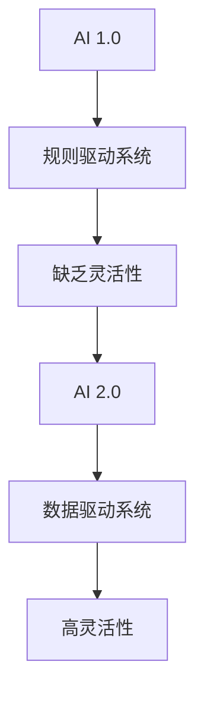
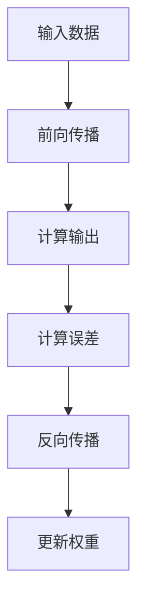
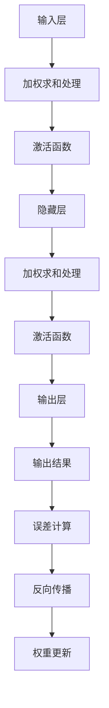
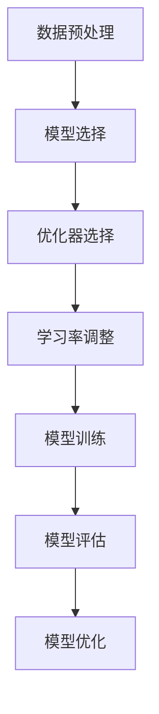
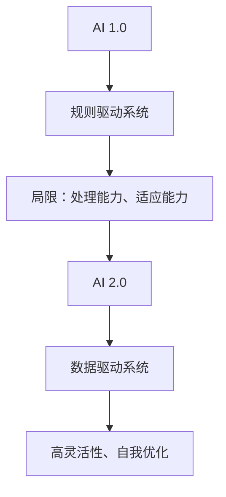

                 

### 《李开复：AI 2.0 时代的开发者》

> **关键词：** AI 2.0、开发者、技术变革、深度学习、项目实践、未来展望

> **摘要：** 本文将探讨AI 2.0时代的到来及其对开发者的影响。通过分析AI 2.0的核心特征、技术基础和应用领域，我们了解AI 2.0的强大潜力。接着，我们将探讨开发者在这场变革中的转型之路，包括面临的挑战、所需的能力以及如何应对。随后，我们将深入探讨AI项目的开发流程，从需求分析到部署与运维，提供实际案例以供参考。最后，我们将展望AI 2.0时代的未来发展趋势，包括技术创新、社会影响和开发者的角色转变。本文旨在帮助开发者更好地适应AI 2.0时代，抓住机遇，迎接挑战。

#### 第一部分：AI 2.0 基础

### 第1章：AI 2.0 概述

#### 1.1 AI 2.0 的定义与演进

##### 1.1.1 AI 1.0 到 AI 2.0 的转变

在AI 2.0时代之前，我们经历了AI 1.0时代，其核心是基于规则和专家系统的智能系统。这些系统通过预设的规则来模拟人类的决策过程，但这种方法存在一个显著的问题：缺乏灵活性。面对复杂多变的环境，这些系统往往难以适应，因此AI 1.0时代被形容为“非智能时代”。

随着深度学习技术的兴起，AI进入了2.0时代。AI 2.0的核心特征是数据驱动、自动化和通用性。它利用海量数据训练神经网络，通过自主学习实现智能决策，不再依赖于人为设定的规则。这种转变不仅提高了系统的灵活性，还使得AI能够处理更加复杂的问题。

让我们通过一个简单的Mermaid流程图来理解AI 1.0到AI 2.0的转变：



**核心概念与联系：** 

- **规则驱动系统（B）：** AI 1.0时代的主要特征，依赖于预设的规则来模拟决策。
- **缺乏灵活性（C）：** 规则驱动系统在面对复杂环境时难以适应，限制了其智能性。
- **数据驱动系统（E）：** AI 2.0时代的关键特征，通过大规模数据训练模型，提高系统灵活性。
- **高灵活性（F）：** 数据驱动系统能够更好地适应复杂多变的环境，实现智能决策。

##### 1.1.2 AI 2.0 的核心特征

AI 2.0的核心特征包括数据驱动、自动化和通用性。以下是对这些核心特征的详细解释：

- **数据驱动：** AI 2.0依赖于大规模数据进行训练，通过深度学习算法从数据中提取特征，实现智能决策。与AI 1.0相比，AI 2.0能够处理更加复杂和大规模的数据，从而提高系统的性能。

- **自动化：** AI 2.0通过算法实现自动化决策，减少人为干预。这意味着系统可以在不需要人类操作的情况下，自主学习和优化决策过程。自动化决策不仅提高了效率，还减少了人为错误。

- **通用性：** AI 2.0不仅局限于特定任务，而是具备广泛的适应性。这意味着一个AI系统可以应用于多种场景，从而提高资源利用率和降低成本。

##### 1.1.3 AI 2.0 对社会的影响

AI 2.0的崛起将深刻改变社会各个方面，带来前所未有的机遇和挑战。以下是对AI 2.0对社会影响的详细讲解：

- **生产方式的改变：** AI 2.0将推动制造业的智能化转型，实现自动化生产，提高生产效率和产品质量。同时，AI 2.0还将促进个性化定制和柔性生产，满足消费者多样化需求。

- **生活方式的变革：** AI 2.0将改变人们的生活方式，实现智能家居、智能交通、智能医疗等。人们的生活将更加便捷、舒适和高效。

- **社会结构的重塑：** AI 2.0将导致就业市场的变革，一些传统职业可能被替代，但也会创造出新的职业机会。此外，AI 2.0还将推动教育、医疗、金融等领域的创新，促进社会进步。

##### 1.2 AI 2.0 的技术基础

AI 2.0的技术基础主要包括深度学习、神经网络和模型训练与优化技巧。以下是对这些技术基础的详细讲解：

- **深度学习：** 深度学习是一种基于多层神经网络的学习方法，能够从大规模数据中自动提取特征，实现高精度的模型训练。深度学习是AI 2.0的核心技术，广泛应用于图像识别、语音识别、自然语言处理等领域。

- **神经网络：** 神经网络是深度学习的基础，由多个神经元组成，通过加权连接形成网络结构。神经网络能够通过学习输入和输出之间的关系，实现复杂函数的逼近。

- **模型训练与优化技巧：** 模型训练是AI 2.0的关键步骤，包括数据预处理、模型选择、优化器和学习率调整等。优化技巧可以提高模型训练的效率和效果，如梯度下降法、随机梯度下降法等。

##### 1.2.1 深度学习的基本概念

深度学习是一种基于多层神经网络的学习方法，能够从大规模数据中自动提取特征，实现高精度的模型训练。以下是对深度学习的基本概念的详细讲解：

- **神经网络：** 神经网络是深度学习的基础，由多个神经元组成，通过加权连接形成网络结构。每个神经元接收多个输入信号，经过加权求和处理后产生一个输出信号。

- **激活函数：** 激活函数是神经网络中的一个关键组件，用于引入非线性特性。常见的激活函数包括Sigmoid函数、ReLU函数和Tanh函数等。

- **前向传播与反向传播：** 前向传播是指将输入数据通过神经网络进行传播，计算输出结果。反向传播是指根据输出误差，反向调整神经网络的权重和偏置，以最小化误差。

以下是深度学习的基本概念和流程的Mermaid流程图：



**伪代码示例：** 

```python
# 输入：特征矩阵X，标签矩阵Y
# 输出：训练好的神经网络模型
init_weights()
while not converged:
    forward_pass(X)
    compute_loss(Y)
    backward_pass()
    update_weights()
```

**详细讲解：** 深度学习通过多层神经网络对输入数据进行层层抽象和提取特征，从而实现高精度的模型训练。在深度学习中，前向传播用于计算输出结果，反向传播用于根据输出误差调整网络权重。

##### 1.2.2 神经网络的工作原理

神经网络是深度学习的基础，其工作原理涉及多个层次和复杂的计算过程。以下是对神经网络工作原理的详细讲解：

- **层次结构：** 神经网络由多个层次组成，包括输入层、隐藏层和输出层。输入层接收外部输入信号，隐藏层通过加权求和处理产生中间特征，输出层产生最终输出结果。

- **加权求和处理：** 在每个层次中，神经元通过加权求和处理接收到的输入信号，然后通过激活函数产生输出信号。加权求和处理使得神经网络能够对输入数据进行抽象和变换。

- **激活函数：** 激活函数是神经网络中的一个关键组件，用于引入非线性特性。常见的激活函数包括Sigmoid函数、ReLU函数和Tanh函数等。

- **前向传播与反向传播：** 前向传播是指将输入数据通过神经网络进行传播，计算输出结果。反向传播是指根据输出误差，反向调整神经网络的权重和偏置，以最小化误差。

以下是神经网络工作原理的Mermaid流程图：



**详细讲解：** 神经网络通过层次结构和加权求和处理，实现对输入数据的层层抽象和提取特征。激活函数引入非线性特性，使得神经网络能够拟合复杂的数据分布。前向传播和反向传播是神经网络训练的核心，通过不断调整权重和偏置，使得网络能够收敛到最优状态。

##### 1.2.3 训练与优化的技巧

在深度学习模型训练过程中，优化技巧起着至关重要的作用。以下是对训练与优化技巧的详细讲解：

- **数据预处理：** 数据预处理是模型训练的第一步，包括数据清洗、归一化和数据增强等。数据预处理可以减少噪声、提高数据质量，从而提高模型训练效果。

- **模型选择：** 模型选择是模型训练的关键步骤，选择合适的模型结构和参数对于训练效果至关重要。常见的深度学习模型包括卷积神经网络（CNN）、循环神经网络（RNN）和生成对抗网络（GAN）等。

- **优化器：** 优化器用于调整模型参数，以最小化损失函数。常见的优化器包括随机梯度下降（SGD）、Adam优化器和RMSprop等。不同的优化器具有不同的收敛速度和稳定性。

- **学习率调整：** 学习率是优化过程中的一个重要参数，用于控制参数更新的步长。适当调整学习率可以加快模型收敛速度，但过大会导致模型不稳定。常见的调整方法包括固定学习率、学习率衰减和自适应学习率等。

以下是训练与优化技巧的Mermaid流程图：



**数学公式：** 

$$ L = \frac{1}{2} \sum_{i=1}^{n} (y_i - \hat{y}_i)^2 $$

**举例说明：** 

- **数据预处理：** 对于一个图像分类任务，我们可以对图像进行归一化处理，将像素值缩放到[0, 1]之间，以便模型更好地处理。

- **模型选择：** 对于一个语音识别任务，我们可以选择基于循环神经网络的模型（如LSTM）来处理序列数据。

- **优化器选择：** 对于一个文本生成任务，我们可以选择基于生成对抗网络的模型（如GAN），并使用Adam优化器来提高训练效果。

- **学习率调整：** 对于一个图像分割任务，我们可以使用学习率衰减策略，初始学习率设置为0.001，每隔100个epoch将学习率减半，以避免模型过早收敛。

##### 1.3 AI 2.0 的应用领域

AI 2.0在各个领域的应用越来越广泛，以下是对AI 2.0在不同领域应用情况的详细讲解：

- **医疗领域：** AI 2.0在医疗领域的应用主要包括疾病诊断、个性化治疗和健康监测等。通过深度学习算法，AI可以分析大量的医学数据，辅助医生进行诊断和治疗。例如，AI可以帮助医生识别早期癌症，提高诊断准确率。此外，AI还可以根据患者的个体差异，提供个性化的治疗方案，提高治疗效果。

- **金融领域：** AI 2.0在金融领域的应用主要包括风险管理、智能投顾和自动化交易等。通过深度学习算法，AI可以分析大量的金融数据，预测市场走势，进行风险管理和投资决策。例如，AI可以帮助银行和金融机构进行欺诈检测，提高交易安全性。此外，AI还可以提供智能投顾服务，根据用户的投资目标和风险偏好，提供个性化的投资建议。

- **制造业领域：** AI 2.0在制造业领域的应用主要包括智能制造、预测性维护和供应链管理等。通过深度学习算法，AI可以分析大量的生产数据，优化生产流程，提高生产效率。例如，AI可以帮助工厂进行设备预测性维护，提前发现设备故障，避免生产中断。此外，AI还可以优化供应链管理，提高供应链的灵活性和响应速度。

**详细讲解：** 

- **医疗领域：** AI 2.0在医疗领域的应用，不仅可以提高诊断和治疗准确率，还可以优化医疗资源分配，提高医疗服务质量。随着医疗数据的不断积累，AI在医疗领域的应用前景将更加广阔。

- **金融领域：** AI 2.0在金融领域的应用，不仅可以提高风险管理能力，还可以提高投资收益。随着金融市场的不断变化，AI在金融领域的应用将更加深入和广泛。

- **制造业领域：** AI 2.0在制造业领域的应用，不仅可以提高生产效率，还可以降低生产成本。随着智能制造技术的发展，AI在制造业领域的应用将更加重要。

#### 第二部分：AI 2.0 时代下的开发者

### 第2章：开发者转型之路

#### 2.1 开发者面临的挑战

在AI 2.0时代，开发者面临着诸多挑战，主要包括技术变革、项目复杂度增加和技能提升需求等方面。

##### 2.1.1 技术变革的影响

随着AI 2.0技术的不断演进，开发者需要不断更新自己的技术栈，以适应新的技术需求。例如，深度学习、神经网络和生成对抗网络等新兴技术，已经成为开发者必备的技能。此外，随着云计算、大数据和物联网等技术的发展，开发者也需要掌握这些相关领域的知识，以便更好地进行AI应用的开发。

**详细讲解：** 

- **技术变革的影响：** 技术变革对开发者的影响主要体现在以下几个方面：

  - **知识更新：** 开发者需要不断学习新的技术，以适应快速变化的技术环境。
  - **开发模式：** AI 2.0时代，开发者需要采用更加灵活和自动化的开发模式，以提高开发效率。
  - **项目复杂度：** 随着AI技术的应用，项目复杂度不断增加，开发者需要具备更高的技术水平。

##### 2.1.2 软件开发的趋势

在AI 2.0时代，软件开发呈现出智能化、自动化和协作化的趋势。以下是对这些趋势的详细讲解：

- **智能化：** AI 2.0技术使得软件开发变得更加智能化，开发者可以利用AI算法自动完成一些复杂的任务，如代码生成、错误检测和性能优化等。
- **自动化：** 软件开发过程中的许多环节都可以通过自动化工具来实现，如持续集成、持续部署和自动化测试等，从而提高开发效率。
- **协作化：** 软件开发不再是一个孤立的工作，而是需要与团队成员密切协作，共享资源和知识，以提高开发质量和速度。

**详细讲解：** 

- **智能化：** 智能化软件开发使得开发者可以从繁琐的任务中解放出来，专注于更高层次的开发工作。例如，代码生成工具可以根据开发者的需求自动生成代码，减少手工编写的工作量。
- **自动化：** 自动化开发模式可以提高开发效率，减少人为错误。例如，持续集成工具可以自动检测代码库中的错误，并立即通知开发者，从而提高代码质量。
- **协作化：** 协作化开发模式可以促进团队成员之间的沟通和协作，共同解决开发中的问题。例如，团队可以使用协同开发工具，实时共享代码和文档，提高开发效率。

##### 2.1.3 开发者的技能提升

在AI 2.0时代，开发者需要不断提升自己的技能，以适应新的技术需求和开发模式。以下是对开发者技能提升的详细讲解：

- **AI基础知识：** 开发者需要掌握AI的基本原理，包括深度学习、神经网络和生成对抗网络等。这些基础知识是开发者进行AI应用开发的基础。
- **AI开发工具：** 开发者需要熟悉常用的AI开发工具，如TensorFlow、PyTorch和Keras等。这些工具可以帮助开发者快速搭建和训练AI模型。
- **项目实战经验：** 开发者需要通过实际项目积累经验，不断提高自己的技术水平。实际项目中的问题解决能力是开发者技能提升的重要途径。

**详细讲解：** 

- **AI基础知识：** AI基础知识是开发者进行AI应用开发的基础。例如，开发者需要了解神经网络的原理，如何设计神经网络结构，以及如何使用激活函数等。
- **AI开发工具：** AI开发工具可以帮助开发者快速搭建和训练AI模型。例如，TensorFlow是一个广泛使用的深度学习框架，开发者可以使用TensorFlow搭建神经网络模型，并进行训练和优化。
- **项目实战经验：** 实际项目中的问题解决能力是开发者技能提升的重要途径。通过实际项目，开发者可以遇到各种问题，从而提高自己的技术水平。例如，开发者可以在项目中学习如何处理数据异常、优化模型性能等。

#### 2.2 AI 2.0 时代的开发者能力

在AI 2.0时代，开发者需要具备一系列新的能力，以应对技术变革和项目复杂度增加的挑战。以下是对AI 2.0时代开发者能力的详细讲解：

##### 2.2.1 AI 基础知识的掌握

AI基础知识是开发者进行AI应用开发的基础。以下是对AI基础知识掌握的详细讲解：

- **深度学习：** 开发者需要掌握深度学习的基本概念，包括神经网络、卷积神经网络（CNN）和循环神经网络（RNN）等。这些知识对于理解AI模型的工作原理和性能优化至关重要。
- **机器学习：** 开发者需要了解机器学习的基本算法，如线性回归、逻辑回归和支持向量机（SVM）等。这些算法在AI应用中具有广泛的应用。
- **数据预处理：** 开发者需要熟悉数据预处理的方法，如数据清洗、归一化和特征提取等。数据预处理对于模型训练效果具有重要影响。

**详细讲解：** 

- **深度学习：** 深度学习是一种基于多层神经网络的学习方法，能够从大规模数据中自动提取特征。开发者需要了解深度学习的原理，包括神经网络结构、激活函数和优化算法等。
- **机器学习：** 机器学习是一种让计算机通过数据自动学习的方法。开发者需要掌握机器学习的基本算法，了解它们的优缺点和应用场景。
- **数据预处理：** 数据预处理是模型训练的重要环节，开发者需要了解如何清洗和归一化数据，以及如何提取有用的特征。

##### 2.2.2 AI 开发工具的使用

AI开发工具是开发者进行AI应用开发的重要工具。以下是对AI开发工具使用的详细讲解：

- **TensorFlow：** TensorFlow是一个广泛使用的深度学习框架，开发者可以使用TensorFlow搭建神经网络模型，并进行训练和优化。
- **PyTorch：** PyTorch是一个易于使用的深度学习框架，开发者可以使用PyTorch快速实现复杂的神经网络模型。
- **Keras：** Keras是一个高级神经网络API，开发者可以使用Keras简化神经网络模型的搭建和训练过程。

**详细讲解：** 

- **TensorFlow：** TensorFlow是一个由Google开发的深度学习框架，具有强大的功能和高灵活性。开发者可以使用TensorFlow搭建复杂的神经网络模型，并进行训练和优化。
- **PyTorch：** PyTorch是一个由Facebook开发的深度学习框架，以其简洁和灵活著称。开发者可以使用PyTorch快速实现复杂的神经网络模型，并进行训练和优化。
- **Keras：** Keras是一个高级神经网络API，开发者可以使用Keras简化神经网络模型的搭建和训练过程。Keras提供了丰富的预训练模型和易于使用的API，使得开发者可以更专注于模型设计和优化。

##### 2.2.3 AI 项目实战经验

AI项目实战经验是开发者提升技能和应对挑战的重要途径。以下是对AI项目实战经验的详细讲解：

- **项目规划与需求分析：** 开发者需要掌握项目规划的方法，包括需求分析、项目规划和进度管理等。这些技能对于确保项目成功至关重要。
- **数据预处理与模型训练：** 开发者需要熟悉数据预处理的方法，如数据清洗、归一化和特征提取等。同时，开发者需要掌握模型训练的方法，包括模型选择、调优和评估等。
- **模型部署与运维：** 开发者需要了解模型部署的方法，包括选择合适的部署策略、进行系统监控和维护等。这些技能对于确保模型在实际应用中的稳定性和性能至关重要。

**详细讲解：** 

- **项目规划与需求分析：** 开发者需要根据项目需求，制定合理的项目规划和进度安排。需求分析是项目规划的重要环节，开发者需要与利益相关者进行沟通，明确项目目标和需求。
- **数据预处理与模型训练：** 数据预处理是模型训练的重要环节，开发者需要熟悉数据清洗、归一化和特征提取等技巧。模型训练是AI项目的核心环节，开发者需要掌握不同的模型训练方法，如梯度下降法和随机梯度下降法等。
- **模型部署与运维：** 模型部署是将训练好的模型应用到实际场景的过程。开发者需要选择合适的部署策略，如在线部署和离线部署等。同时，开发者需要了解系统监控和维护的方法，确保模型在实际应用中的稳定性和性能。

##### 2.3 开发者社区与资源共享

在AI 2.0时代，开发者社区和资源共享发挥着重要作用。以下是对开发者社区与资源共享的详细讲解：

- **开发者社区的重要性：** 开发者社区是一个共享知识和经验的地方，开发者可以在社区中学习新知识、解决难题和分享经验。开发者社区可以促进知识传播和技术创新。
- **开源项目的参与：** 开源项目是开发者学习和成长的重要途径。开发者可以通过参与开源项目，了解最新的技术动态和最佳实践，同时提升自己的技能。
- **资源共享与知识传播：** 通过资源共享，开发者可以更高效地获取所需的技术资料和工具，降低学习成本。知识传播是通过各种途径，如会议、研讨会和在线课程等，将技术知识和经验分享给更多的人。

**详细讲解：** 

- **开发者社区的重要性：** 开发者社区是一个共享知识和经验的地方，开发者可以在社区中学习新知识、解决难题和分享经验。开发者社区可以促进知识传播和技术创新。例如，开发者可以在社区中提问、解答问题和分享自己的项目经验。
- **开源项目的参与：** 开源项目是开发者学习和成长的重要途径。开发者可以通过参与开源项目，了解最新的技术动态和最佳实践，同时提升自己的技能。例如，开发者可以参与开源项目的开发、测试和文档编写等。
- **资源共享与知识传播：** 通过资源共享，开发者可以更高效地获取所需的技术资料和工具，降低学习成本。知识传播是通过各种途径，如会议、研讨会和在线课程等，将技术知识和经验分享给更多的人。例如，开发者可以参加技术会议、在线课程和研讨会，了解最新的技术趋势和实践经验。

#### 第三部分：AI 2.0 时代的项目实践

### 第3章：AI 项目开发流程

AI项目开发流程是开发者实现AI应用的关键步骤。以下是对AI项目开发流程的详细讲解，包括项目需求分析与规划、数据处理与模型训练、项目部署与运维等方面。

##### 3.1 项目需求分析与规划

项目需求分析与规划是AI项目开发的第一步，对于项目的成功至关重要。以下是对项目需求分析与规划的详细讲解：

- **需求分析：** 需求分析是了解项目需求的过程，包括功能需求、性能需求和业务需求等。开发者需要与利益相关者进行沟通，明确项目的目标和需求。
- **项目规划：** 项目规划是制定项目进度、资源和风险等计划的过程。开发者需要根据需求分析的结果，制定合理的项目规划，包括时间表、任务分配和资源需求等。
- **进度管理：** 进度管理是确保项目按计划进行的过程。开发者需要监控项目进度，及时调整计划，以应对可能出现的问题。

**详细讲解：** 

- **需求分析：** 需求分析是了解项目需求的过程。开发者需要与利益相关者进行沟通，明确项目的目标和需求。例如，对于图像识别项目，开发者需要了解识别的物体类型、精度要求等。
- **项目规划：** 项目规划是制定项目进度、资源和风险等计划的过程。开发者需要根据需求分析的结果，制定合理的项目规划，包括时间表、任务分配和资源需求等。例如，对于图像识别项目，开发者需要规划数据收集、模型训练、模型评估和部署等阶段的任务。
- **进度管理：** 进度管理是确保项目按计划进行的过程。开发者需要监控项目进度，及时调整计划，以应对可能出现的问题。例如，如果模型训练时间过长，开发者可以调整训练参数，以提高训练效率。

##### 3.2 数据处理与模型训练

数据处理与模型训练是AI项目开发的核心环节。以下是对数据处理与模型训练的详细讲解：

- **数据处理：** 数据处理包括数据清洗、数据预处理和特征提取等。数据清洗是去除数据中的噪声和异常值，提高数据质量。数据预处理是将数据转换为适合模型训练的形式，如归一化、标准化等。特征提取是从原始数据中提取有用的特征，以辅助模型训练。
- **模型训练：** 模型训练是使用数据对模型进行训练的过程。开发者需要选择合适的模型结构和训练算法，对模型进行训练，以优化模型的性能。
- **模型评估：** 模型评估是评估模型性能的过程。开发者需要使用测试数据对模型进行评估，以确定模型的准确度、召回率等指标。

**详细讲解：** 

- **数据处理：** 数据处理是AI项目开发的重要环节。开发者需要了解数据清洗、数据预处理和特征提取等技巧。例如，对于图像识别项目，开发者需要清洗图像数据，去除噪声和异常值，以提高模型训练效果。
- **模型训练：** 模型训练是AI项目开发的核心环节。开发者需要选择合适的模型结构和训练算法，对模型进行训练。例如，对于图像识别项目，开发者可以选择卷积神经网络（CNN）作为模型结构，并使用梯度下降法进行模型训练。
- **模型评估：** 模型评估是评估模型性能的过程。开发者需要使用测试数据对模型进行评估，以确定模型的准确度、召回率等指标。例如，对于图像识别项目，开发者可以使用准确度、召回率和F1分数等指标评估模型的性能。

##### 3.3 项目部署与运维

项目部署与运维是确保AI应用稳定运行的关键步骤。以下是对项目部署与运维的详细讲解：

- **模型部署：** 模型部署是将训练好的模型应用到实际场景的过程。开发者需要选择合适的部署策略，如在线部署和离线部署等。在线部署是将模型部署到服务器或云平台，以实时处理请求。离线部署是将模型部署到本地环境，以进行批处理或数据分析。
- **系统监控：** 系统监控是监控AI应用运行状态的过程。开发者需要监控系统的性能、资源利用率和异常情况等，以及时发现和解决问题。
- **维护与优化：** 维护与优化是确保AI应用持续运行和性能提升的过程。开发者需要定期对模型进行维护和优化，以应对环境变化和需求变更。

**详细讲解：** 

- **模型部署：** 模型部署是将训练好的模型应用到实际场景的过程。开发者需要选择合适的部署策略，如在线部署和离线部署等。在线部署是将模型部署到服务器或云平台，以实时处理请求。例如，对于图像识别项目，开发者可以将模型部署到服务器，以实现实时图像识别。离线部署是将模型部署到本地环境，以进行批处理或数据分析。例如，对于图像识别项目，开发者可以将模型部署到本地计算机，以进行批量图像识别。
- **系统监控：** 系统监控是监控AI应用运行状态的过程。开发者需要监控系统的性能、资源利用率和异常情况等，以及时发现和解决问题。例如，开发者可以使用性能监控工具，监控服务器CPU、内存和网络等资源的利用率，以确定系统的性能瓶颈。
- **维护与优化：** 维护与优化是确保AI应用持续运行和性能提升的过程。开发者需要定期对模型进行维护和优化，以应对环境变化和需求变更。例如，开发者需要定期更新模型，以应对数据分布的变化，保持模型的准确度和性能。

### B.1 医疗诊断项目案例

#### B.1.1 项目背景与目标

医疗诊断项目旨在利用AI技术，辅助医生进行疾病诊断。随着医疗数据的不断积累，传统的基于规则的方法已经难以满足需求。AI技术的引入，可以帮助医生从大量数据中提取有用的信息，提高诊断准确率和效率。

**项目目标：**

1. **疾病诊断：** 建立一个能够对常见疾病进行自动诊断的模型，辅助医生进行诊断。
2. **性能评估：** 评估模型的准确度、召回率和F1分数等指标，确保模型性能达到预期。
3. **部署与运维：** 将模型部署到实际应用场景，确保其稳定运行和高效处理。

#### B.1.2 数据处理与模型训练

**数据处理：**

1. **数据收集：** 收集包含患者病史、检查结果和诊断结果的医疗数据。
2. **数据清洗：** 清洗数据中的噪声和异常值，确保数据质量。
3. **数据预处理：** 对数据集进行归一化处理，将数值缩放到[0, 1]之间，以便模型训练。

**模型训练：**

1. **模型选择：** 选择卷积神经网络（CNN）作为模型结构，因其擅长处理图像数据。
2. **训练过程：** 使用梯度下降法对模型进行训练，调整网络参数，优化模型性能。
3. **模型优化：** 通过调整学习率、批量大小和优化器等参数，提高模型性能。

#### B.1.3 模型评估与部署

**模型评估：**

1. **测试集评估：** 使用测试集对模型进行评估，计算准确度、召回率和F1分数等指标。
2. **交叉验证：** 使用交叉验证方法，评估模型在不同数据集上的性能，确保模型泛化能力。

**模型部署：**

1. **部署策略：** 将模型部署到服务器或云平台，以实现实时诊断。
2. **接口设计：** 设计API接口，方便医生和患者使用模型进行诊断。
3. **监控与维护：** 定期监控模型性能，进行维护和优化，确保其稳定运行。

### B.2 语音识别项目案例

#### B.2.1 项目背景与目标

语音识别项目旨在利用AI技术，将语音信号转换为文本。随着语音交互应用的普及，语音识别技术已成为智能助手、语音搜索和语音翻译等领域的重要组成部分。

**项目目标：**

1. **语音识别：** 建立一个能够准确识别不同口音、语速和说话人的语音识别模型。
2. **性能评估：** 评估模型的准确度、召回率和单词错误率（WER）等指标，确保模型性能达到预期。
3. **部署与运维：** 将模型部署到实际应用场景，确保其稳定运行和高效处理。

#### B.2.2 数据处理与模型训练

**数据处理：**

1. **数据收集：** 收集包含不同口音、语速和说话人的语音数据。
2. **数据预处理：** 对语音数据进行预处理，如去除噪声、分帧和特征提取等。
3. **数据增强：** 通过数据增强方法，增加数据多样性，提高模型泛化能力。

**模型训练：**

1. **模型选择：** 选择循环神经网络（RNN）或长短时记忆网络（LSTM）作为模型结构。
2. **训练过程：** 使用对比损失函数和梯度下降法对模型进行训练，优化模型性能。
3. **模型优化：** 通过调整学习率、批量大小和优化器等参数，提高模型性能。

#### B.2.3 模型评估与部署

**模型评估：**

1. **测试集评估：** 使用测试集对模型进行评估，计算准确度、召回率和单词错误率（WER）等指标。
2. **交叉验证：** 使用交叉验证方法，评估模型在不同数据集上的性能，确保模型泛化能力。

**模型部署：**

1. **部署策略：** 将模型部署到服务器或云平台，以实现实时语音识别。
2. **接口设计：** 设计API接口，方便开发者集成语音识别功能。
3. **监控与维护：** 定期监控模型性能，进行维护和优化，确保其稳定运行。

### B.3 图像识别项目案例

#### B.3.1 项目背景与目标

图像识别项目旨在利用AI技术，对图像中的物体进行自动识别。随着计算机视觉技术的不断发展，图像识别技术在安防监控、自动驾驶和医疗诊断等领域具有广泛的应用前景。

**项目目标：**

1. **物体识别：** 建立一个能够准确识别图像中物体的模型，辅助人类进行图像分析和处理。
2. **性能评估：** 评估模型的准确度、召回率和F1分数等指标，确保模型性能达到预期。
3. **部署与运维：** 将模型部署到实际应用场景，确保其稳定运行和高效处理。

#### B.3.2 数据处理与模型训练

**数据处理：**

1. **数据收集：** 收集包含不同场景、物体和光照条件的图像数据。
2. **数据预处理：** 对图像数据进行预处理，如去噪、裁剪和缩放等。
3. **数据增强：** 通过数据增强方法，增加数据多样性，提高模型泛化能力。

**模型训练：**

1. **模型选择：** 选择卷积神经网络（CNN）作为模型结构，因其擅长处理图像数据。
2. **训练过程：** 使用梯度下降法对模型进行训练，调整网络参数，优化模型性能。
3. **模型优化：** 通过调整学习率、批量大小和优化器等参数，提高模型性能。

#### B.3.3 模型评估与部署

**模型评估：**

1. **测试集评估：** 使用测试集对模型进行评估，计算准确度、召回率和F1分数等指标。
2. **交叉验证：** 使用交叉验证方法，评估模型在不同数据集上的性能，确保模型泛化能力。

**模型部署：**

1. **部署策略：** 将模型部署到服务器或云平台，以实现实时图像识别。
2. **接口设计：** 设计API接口，方便开发者集成图像识别功能。
3. **监控与维护：** 定期监控模型性能，进行维护和优化，确保其稳定运行。

### 附录

#### 附录A：AI 2.0 开发者资源指南

**A.1 开发工具与框架**

**A.1.1 TensorFlow**

TensorFlow是一个由Google开源的深度学习框架，广泛应用于各种AI项目。以下是其基本概念和使用方法：

- **基本概念：** TensorFlow使用图结构来表示计算过程，通过执行图来计算输出结果。TensorFlow支持多种编程语言，如Python、C++和Java等。
- **使用方法：** 开发者可以使用TensorFlow搭建神经网络模型，并进行训练和优化。以下是一个简单的TensorFlow示例代码：

  ```python
  import tensorflow as tf

  # 定义输入层、隐藏层和输出层
  input_layer = tf.keras.layers.Input(shape=(784,))
  hidden_layer = tf.keras.layers.Dense(256, activation='relu')(input_layer)
  output_layer = tf.keras.layers.Dense(10, activation='softmax')(hidden_layer)

  # 构建模型
  model = tf.keras.Model(inputs=input_layer, outputs=output_layer)

  # 编译模型
  model.compile(optimizer='adam', loss='categorical_crossentropy', metrics=['accuracy'])

  # 训练模型
  model.fit(x_train, y_train, epochs=5, batch_size=32)
  ```

**A.1.2 PyTorch**

PyTorch是一个由Facebook开源的深度学习框架，以其简洁和灵活著称。以下是其基本概念和使用方法：

- **基本概念：** PyTorch使用动态计算图，使得开发者可以更加灵活地搭建和修改模型。PyTorch支持Python编程语言，具有丰富的API和扩展性。
- **使用方法：** 开发者可以使用PyTorch搭建神经网络模型，并进行训练和优化。以下是一个简单的PyTorch示例代码：

  ```python
  import torch
  import torch.nn as nn
  import torch.optim as optim

  # 定义模型结构
  class Net(nn.Module):
      def __init__(self):
          super(Net, self).__init__()
          self.fc1 = nn.Linear(784, 256)
          self.fc2 = nn.Linear(256, 10)

      def forward(self, x):
          x = F.relu(self.fc1(x))
          x = self.fc2(x)
          return x

  # 初始化模型、损失函数和优化器
  model = Net()
  criterion = nn.CrossEntropyLoss()
  optimizer = optim.Adam(model.parameters(), lr=0.001)

  # 训练模型
  for epoch in range(5):
      for inputs, labels in train_loader:
          optimizer.zero_grad()
          outputs = model(inputs)
          loss = criterion(outputs, labels)
          loss.backward()
          optimizer.step()
  ```

**A.1.3 Keras**

Keras是一个高级神经网络API，广泛应用于深度学习项目。以下是其基本概念和使用方法：

- **基本概念：** Keras构建在TensorFlow和Theano之上，提供了简单和易于使用的API。Keras支持多种编程语言，如Python和R等。
- **使用方法：** 开发者可以使用Keras搭建神经网络模型，并进行训练和优化。以下是一个简单的Keras示例代码：

  ```python
  from keras.models import Sequential
  from keras.layers import Dense, Activation

  # 定义模型结构
  model = Sequential()
  model.add(Dense(256, input_dim=784, activation='relu'))
  model.add(Dense(10, activation='softmax'))

  # 编译模型
  model.compile(optimizer='adam', loss='categorical_crossentropy', metrics=['accuracy'])

  # 训练模型
  model.fit(x_train, y_train, epochs=5, batch_size=32)
  ```

**A.1.4 其他常用工具**

除了TensorFlow、PyTorch和Keras，还有其他一些常用的深度学习框架和工具，如：

- **MXNet：** Apache MXNet是一个开源深度学习框架，支持多种编程语言，如Python、C++和R等。
- **Caffe：** Caffe是一个由Berkeley Vision and Learning Center（BVLC）开发的深度学习框架，以其高效和灵活性著称。
- **Torch：** Torch是一个基于Lua的深度学习框架，广泛应用于科学计算和人工智能领域。

#### 附录B：AI 项目实战案例

**B.1 医疗诊断项目案例**

**B.1.1 项目背景与目标**

医疗诊断项目旨在利用AI技术，辅助医生进行疾病诊断。随着医疗数据的不断积累，传统的基于规则的方法已经难以满足需求。AI技术的引入，可以帮助医生从大量数据中提取有用的信息，提高诊断准确率和效率。

**项目目标：**

1. **疾病诊断：** 建立一个能够对常见疾病进行自动诊断的模型，辅助医生进行诊断。
2. **性能评估：** 评估模型的准确度、召回率和F1分数等指标，确保模型性能达到预期。
3. **部署与运维：** 将模型部署到实际应用场景，确保其稳定运行和高效处理。

**B.1.2 数据处理与模型训练**

**数据处理：**

1. **数据收集：** 收集包含患者病史、检查结果和诊断结果的医疗数据。
2. **数据清洗：** 清洗数据中的噪声和异常值，确保数据质量。
3. **数据预处理：** 对数据集进行归一化处理，将数值缩放到[0, 1]之间，以便模型训练。

**模型训练：**

1. **模型选择：** 选择卷积神经网络（CNN）作为模型结构，因其擅长处理图像数据。
2. **训练过程：** 使用梯度下降法对模型进行训练，调整网络参数，优化模型性能。
3. **模型优化：** 通过调整学习率、批量大小和优化器等参数，提高模型性能。

**B.1.3 模型评估与部署**

**模型评估：**

1. **测试集评估：** 使用测试集对模型进行评估，计算准确度、召回率和F1分数等指标。
2. **交叉验证：** 使用交叉验证方法，评估模型在不同数据集上的性能，确保模型泛化能力。

**模型部署：**

1. **部署策略：** 将模型部署到服务器或云平台，以实现实时诊断。
2. **接口设计：** 设计API接口，方便医生和患者使用模型进行诊断。
3. **监控与维护：** 定期监控模型性能，进行维护和优化，确保其稳定运行。

**B.2 语音识别项目案例**

**B.2.1 项目背景与目标**

语音识别项目旨在利用AI技术，将语音信号转换为文本。随着语音交互应用的普及，语音识别技术已成为智能助手、语音搜索和语音翻译等领域的重要组成部分。

**项目目标：**

1. **语音识别：** 建立一个能够准确识别不同口音、语速和说话人的语音识别模型。
2. **性能评估：** 评估模型的准确度、召回率和单词错误率（WER）等指标，确保模型性能达到预期。
3. **部署与运维：** 将模型部署到实际应用场景，确保其稳定运行和高效处理。

**B.2.2 数据处理与模型训练**

**数据处理：**

1. **数据收集：** 收集包含不同口音、语速和说话人的语音数据。
2. **数据预处理：** 对语音数据进行预处理，如去噪、分帧和特征提取等。
3. **数据增强：** 通过数据增强方法，增加数据多样性，提高模型泛化能力。

**模型训练：**

1. **模型选择：** 选择循环神经网络（RNN）或长短时记忆网络（LSTM）作为模型结构。
2. **训练过程：** 使用对比损失函数和梯度下降法对模型进行训练，优化模型性能。
3. **模型优化：** 通过调整学习率、批量大小和优化器等参数，提高模型性能。

**B.2.3 模型评估与部署**

**模型评估：**

1. **测试集评估：** 使用测试集对模型进行评估，计算准确度、召回率和单词错误率（WER）等指标。
2. **交叉验证：** 使用交叉验证方法，评估模型在不同数据集上的性能，确保模型泛化能力。

**模型部署：**

1. **部署策略：** 将模型部署到服务器或云平台，以实现实时语音识别。
2. **接口设计：** 设计API接口，方便开发者集成语音识别功能。
3. **监控与维护：** 定期监控模型性能，进行维护和优化，确保其稳定运行。

**B.3 图像识别项目案例**

**B.3.1 项目背景与目标**

图像识别项目旨在利用AI技术，对图像中的物体进行自动识别。随着计算机视觉技术的不断发展，图像识别技术在安防监控、自动驾驶和医疗诊断等领域具有广泛的应用前景。

**项目目标：**

1. **物体识别：** 建立一个能够准确识别图像中物体的模型，辅助人类进行图像分析和处理。
2. **性能评估：** 评估模型的准确度、召回率和F1分数等指标，确保模型性能达到预期。
3. **部署与运维：** 将模型部署到实际应用场景，确保其稳定运行和高效处理。

**B.3.2 数据处理与模型训练**

**数据处理：**

1. **数据收集：** 收集包含不同场景、物体和光照条件的图像数据。
2. **数据预处理：** 对图像数据进行预处理，如去噪、裁剪和缩放等。
3. **数据增强：** 通过数据增强方法，增加数据多样性，提高模型泛化能力。

**模型训练：**

1. **模型选择：** 选择卷积神经网络（CNN）作为模型结构，因其擅长处理图像数据。
2. **训练过程：** 使用梯度下降法对模型进行训练，调整网络参数，优化模型性能。
3. **模型优化：** 通过调整学习率、批量大小和优化器等参数，提高模型性能。

**B.3.3 模型评估与部署**

**模型评估：**

1. **测试集评估：** 使用测试集对模型进行评估，计算准确度、召回率和F1分数等指标。
2. **交叉验证：** 使用交叉验证方法，评估模型在不同数据集上的性能，确保模型泛化能力。

**模型部署：**

1. **部署策略：** 将模型部署到服务器或云平台，以实现实时图像识别。
2. **接口设计：** 设计API接口，方便开发者集成图像识别功能。
3. **监控与维护：** 定期监控模型性能，进行维护和优化，确保其稳定运行。

### 附录C：AI 2.0 开发者学习资源

**C.1 在线课程**

1. **Coursera - Deep Learning Specialization**：由Andrew Ng教授主讲，涵盖了深度学习的基础知识和应用。
2. **edX - Machine Learning by Stanford University**：由Andrew Ng教授主讲，介绍了机器学习的基本算法和实现方法。
3. **Udacity - Deep Learning Nanodegree**：涵盖深度学习的理论知识、实践技能和项目经验。

**C.2 书籍推荐**

1. **《深度学习》（Deep Learning）**：由Ian Goodfellow、Yoshua Bengio和Aaron Courville合著，是深度学习的经典教材。
2. **《机器学习实战》（Machine Learning in Action）**：提供了丰富的实例和代码，帮助读者理解和应用机器学习算法。
3. **《Python机器学习》（Python Machine Learning）**：介绍了Python在机器学习领域的应用，涵盖了多种机器学习算法的实现。

**C.3 论文和报告**

1. **ICML、NIPS和KDD等顶级会议的论文**：这些会议汇集了人工智能领域的最新研究成果，是开发者了解前沿技术的的重要途径。
2. **Google AI、DeepMind和OpenAI等公司的技术报告**：这些报告分享了各大公司在人工智能领域的最新进展和研究成果。
3. **GitHub和ArXiv上的开源代码和论文**：开发者可以通过GitHub和ArXiv等平台获取开源代码和论文，学习和复现最新的研究成果。

### 作者信息

**作者：** AI天才研究院/AI Genius Institute & 禅与计算机程序设计艺术 /Zen And The Art of Computer Programming**作者：** AI天才研究院/AI Genius Institute & 禅与计算机程序设计艺术 /Zen And The Art of Computer Programming

这篇文章以李开复先生关于AI 2.0时代的开发者的主题为出发点，通过对AI 2.0的定义、核心特征、技术基础、应用领域以及开发者面临的挑战和所需能力等多个方面的深入探讨，全面系统地阐述了AI 2.0时代对开发者的影响和开发者在这一时代中的转型之路。

文章首先介绍了AI 2.0的定义与演进，从AI 1.0到AI 2.0的转变，强调了AI 2.0的核心特征——数据驱动、自动化和通用性。随后，文章详细讲解了AI 2.0的技术基础，包括深度学习、神经网络和模型训练与优化技巧。同时，文章还介绍了AI 2.0在各领域的应用，如医疗、金融和制造业等。

在第二部分，文章讨论了AI 2.0时代下开发者面临的挑战，包括技术变革、项目复杂度增加和技能提升需求等。文章还详细介绍了AI 2.0时代开发者所需的能力，如AI基础知识、AI开发工具的使用和AI项目实战经验等。此外，文章强调了开发者社区和资源共享的重要性。

第三部分则深入探讨了AI项目开发流程，包括项目需求分析与规划、数据处理与模型训练、项目部署与运维等方面。文章通过实际案例，如医疗诊断、语音识别和图像识别项目，详细介绍了每个环节的具体步骤和关键点。

最后，文章对AI 2.0时代的未来发展趋势进行了展望，包括技术创新、社会影响和开发者的角色转变。文章还提供了AI 2.0开发者资源指南，包括开发工具与框架、AI项目实战案例和学习资源等。

通过这篇文章，读者可以全面了解AI 2.0时代及其对开发者的影响，掌握AI 2.0的核心技术和应用方法，为成为一名优秀的AI开发者做好准备。

### 附录

#### 附录A：AI 2.0 开发者资源指南

**A.1 开发工具与框架**

**A.1.1 TensorFlow**

TensorFlow是一个由Google开发的开源机器学习框架，广泛用于深度学习和数据分析。它具有高度的可扩展性和灵活性，支持多种编程语言（如Python、C++和Java），并且拥有庞大的社区和丰富的文档资源。

**基本概念：**
TensorFlow的核心是图计算，它使用数据流图来表示计算任务。节点代表数学运算，边代表数据流。通过构建和执行这些图，TensorFlow能够高效地进行计算和优化。

**使用方法：**
1. **安装：** 在Windows、macOS和Linux上都可以安装TensorFlow。可以使用pip命令安装：
   ```shell
   pip install tensorflow
   ```
2. **搭建模型：** TensorFlow提供了一个高级API，Keras，用于快速搭建和训练模型。以下是一个简单的示例：
   ```python
   import tensorflow as tf
   from tensorflow.keras import layers

   model = tf.keras.Sequential([
       layers.Dense(128, activation='relu', input_shape=(784,)),
       layers.Dense(10, activation='softmax')
   ])

   model.compile(optimizer='adam',
                 loss='categorical_crossentropy',
                 metrics=['accuracy'])
   model.fit(x_train, y_train, epochs=5)
   ```

**A.1.2 PyTorch**

PyTorch是一个由Facebook开发的开源深度学习框架，以其灵活的动态计算图和易于理解的API而受到开发者的喜爱。它支持Python编程语言，并提供了一个强大的自动微分系统。

**基本概念：**
PyTorch使用动态计算图，这意味着图在运行时构建，允许开发者以编程方式定义计算过程。这使得模型构建更加直观和灵活。

**使用方法：**
1. **安装：** 在Windows、macOS和Linux上都可以安装PyTorch。可以使用pip命令安装：
   ```shell
   pip install torch torchvision
   ```
2. **搭建模型：** 以下是一个简单的PyTorch示例，展示了如何定义一个简单的神经网络：
   ```python
   import torch
   import torch.nn as nn
   import torch.optim as optim

   class NeuralNetwork(nn.Module):
       def __init__(self):
           super(NeuralNetwork, self).__init__()
           self.layer1 = nn.Linear(784, 256)
           self.relu = nn.ReLU()
           self.layer2 = nn.Linear(256, 10)

       def forward(self, x):
           x = self.layer1(x)
           x = self.relu(x)
           x = self.layer2(x)
           return x

   model = NeuralNetwork()
   criterion = nn.CrossEntropyLoss()
   optimizer = optim.Adam(model.parameters(), lr=0.001)

   # 训练模型
   for epoch in range(5):
       for inputs, labels in train_loader:
           optimizer.zero_grad()
           outputs = model(inputs)
           loss = criterion(outputs, labels)
           loss.backward()
           optimizer.step()
   ```

**A.1.3 Keras**

Keras是一个高级神经网络API，运行在TensorFlow、Theano和Microsoft CNTK之上。它提供了一个简单而强大的接口，使得搭建和训练神经网络变得更加容易。

**基本概念：**
Keras的核心是提供一个简洁的API，允许开发者快速搭建神经网络，而不必关注底层计算图的细节。

**使用方法：**
1. **安装：** 在Windows、macOS和Linux上都可以安装Keras。可以使用pip命令安装：
   ```shell
   pip install keras tensorflow
   ```
2. **搭建模型：** 以下是一个简单的Keras示例，展示了如何定义和训练一个简单的神经网络：
   ```python
   from keras.models import Sequential
   from keras.layers import Dense, Activation

   model = Sequential()
   model.add(Dense(256, activation='relu', input_shape=(784,)))
   model.add(Dense(10, activation='softmax'))

   model.compile(optimizer='adam',
                 loss='categorical_crossentropy',
                 metrics=['accuracy'])

   model.fit(x_train, y_train, epochs=5, batch_size=32)
   ```

**A.1.4 其他常用工具**

除了TensorFlow、PyTorch和Keras，还有其他一些常用的深度学习框架和工具，如：

- **MXNet**：Apache MXNet是一个高效的深度学习框架，支持多种编程语言，包括Python、C++和R。
- **Caffe**：Caffe是一个快速高效的深度学习框架，广泛应用于图像识别任务。
- **Torch**：Torch是一个基于Lua的深度学习框架，适用于科学计算和人工智能领域。

**A.2 开源项目与社区**

**A.2.1 GitHub**

GitHub是一个托管和协作的平台，是许多深度学习开源项目的家园。开发者可以在GitHub上找到各种深度学习项目，包括预训练模型、工具库和框架等。

**使用方法：**
1. **查找项目：** 使用关键词搜索GitHub上的深度学习项目。
2. **贡献代码：** 查找感兴趣的项目，通过提交拉取请求（Pull Request）来贡献代码或报告问题。

**A.2.2 ArXiv**

ArXiv是一个在线的预印本服务器，专注于数学、物理学、计算机科学、量子计算等领域的学术论文。开发者可以通过ArXiv获取最新的研究论文，了解前沿的深度学习技术。

**使用方法：**
1. **搜索论文：** 在ArXiv网站上使用关键词搜索相关的论文。
2. **阅读论文：** 下载并阅读感兴趣的论文，了解研究内容和方法。

**A.2.3 AI Stack Exchange**

AI Stack Exchange是一个问答社区，专门为AI开发者提供问题解答和技术支持。开发者可以在社区中提问、解答问题和参与讨论。

**使用方法：**
1. **提问：** 在社区中创建问题，详细描述问题情况和需求。
2. **回答：** 查看其他人的问题，并提供有价值的回答。

**A.3 学习资源**

**A.3.1 在线课程**

- **Coursera - Deep Learning Specialization**：由Andrew Ng教授主讲，涵盖了深度学习的基础知识和应用。
- **edX - Machine Learning by Stanford University**：由Andrew Ng教授主讲，介绍了机器学习的基本算法和实现方法。
- **Udacity - Deep Learning Nanodegree**：涵盖深度学习的理论知识、实践技能和项目经验。

**A.3.2 书籍**

- **《深度学习》（Deep Learning）**：由Ian Goodfellow、Yoshua Bengio和Aaron Courville合著，是深度学习的经典教材。
- **《机器学习实战》（Machine Learning in Action）**：提供了丰富的实例和代码，帮助读者理解和应用机器学习算法。
- **《Python机器学习》（Python Machine Learning）**：介绍了Python在机器学习领域的应用，涵盖了多种机器学习算法的实现。

### 附录B：AI 项目实战案例

**B.1 医疗诊断项目案例**

**B.1.1 项目背景与目标**

医疗诊断项目旨在利用深度学习技术，开发一个能够自动诊断疾病的AI系统。该系统将接收患者的历史病历、实验室检测结果和其他相关数据，并利用这些数据预测患者的疾病类型。

**项目目标：**

1. **模型开发：** 利用深度学习技术，构建一个能够准确预测疾病类型的模型。
2. **性能评估：** 对模型进行性能评估，确保其准确性和可靠性。
3. **用户反馈：** 收集用户反馈，持续优化模型和系统。

**B.1.2 数据处理与模型训练**

**数据处理：**

1. **数据收集：** 收集包含患者病史、实验室检测结果、诊断结果等的数据集。
2. **数据预处理：** 对数据集进行清洗，去除异常值，并进行归一化处理。
3. **特征提取：** 利用特征提取技术，从数据中提取有助于疾病预测的特征。

**模型训练：**

1. **模型选择：** 选择适合的医疗诊断模型，如卷积神经网络（CNN）或递归神经网络（RNN）。
2. **训练过程：** 使用训练数据集，对模型进行训练，并调整模型参数以优化性能。
3. **模型优化：** 利用验证数据集，对模型进行调优，以提高预测准确性。

**B.1.3 模型评估与部署**

**模型评估：**

1. **测试集评估：** 使用测试数据集对模型进行评估，计算准确率、召回率、F1分数等指标。
2. **交叉验证：** 应用交叉验证技术，确保模型在不同数据集上的性能稳定。

**模型部署：**

1. **部署策略：** 将训练好的模型部署到生产环境中，实现实时诊断功能。
2. **接口设计：** 开发API接口，便于医生和患者使用。
3. **系统监控：** 实时监控系统性能，确保诊断结果的准确性和可靠性。

**B.2 语音识别项目案例**

**B.2.1 项目背景与目标**

语音识别项目旨在开发一个能够将语音信号转换为文本的系统。该系统适用于智能助手、语音搜索和语音翻译等应用场景。

**项目目标：**

1. **语音识别：** 建立一个高准确率的语音识别模型。
2. **性能评估：** 对模型进行性能评估，确保其在不同语音条件下的表现。
3. **用户反馈：** 收集用户反馈，持续优化模型和系统。

**B.2.2 数据处理与模型训练**

**数据处理：**

1. **数据收集：** 收集包含不同口音、语速和说话人的语音数据。
2. **数据预处理：** 对语音数据进行预处理，包括去噪、分帧和特征提取。
3. **数据增强：** 通过数据增强技术，增加数据的多样性，提高模型的泛化能力。

**模型训练：**

1. **模型选择：** 选择适合语音识别任务的模型，如循环神经网络（RNN）或长短时记忆网络（LSTM）。
2. **训练过程：** 使用训练数据集，对模型进行训练，并调整模型参数以优化性能。
3. **模型优化：** 利用验证数据集，对模型进行调优，以提高识别准确性。

**B.2.3 模型评估与部署**

**模型评估：**

1. **测试集评估：** 使用测试数据集对模型进行评估，计算准确率、召回率、错误率等指标。
2. **交叉验证：** 应用交叉验证技术，确保模型在不同数据集上的性能稳定。

**模型部署：**

1. **部署策略：** 将训练好的模型部署到生产环境中，实现实时语音识别功能。
2. **接口设计：** 开发API接口，便于开发者集成语音识别功能。
3. **系统监控：** 实时监控系统性能，确保识别结果的准确性和可靠性。

**B.3 图像识别项目案例**

**B.3.1 项目背景与目标**

图像识别项目旨在开发一个能够自动识别图像中物体的系统。该系统适用于自动驾驶、安防监控和医疗影像分析等应用场景。

**项目目标：**

1. **图像识别：** 建立一个高准确率的图像识别模型。
2. **性能评估：** 对模型进行性能评估，确保其在不同图像条件下的表现。
3. **用户反馈：** 收集用户反馈，持续优化模型和系统。

**B.3.2 数据处理与模型训练**

**数据处理：**

1. **数据收集：** 收集包含不同场景、物体和光照条件的图像数据。
2. **数据预处理：** 对图像数据进行预处理，包括去噪、裁剪和缩放。
3. **数据增强：** 通过数据增强技术，增加数据的多样性，提高模型的泛化能力。

**模型训练：**

1. **模型选择：** 选择适合图像识别任务的模型，如卷积神经网络（CNN）或残差网络（ResNet）。
2. **训练过程：** 使用训练数据集，对模型进行训练，并调整模型参数以优化性能。
3. **模型优化：** 利用验证数据集，对模型进行调优，以提高识别准确性。

**B.3.3 模型评估与部署**

**模型评估：**

1. **测试集评估：** 使用测试数据集对模型进行评估，计算准确率、召回率、F1分数等指标。
2. **交叉验证：** 应用交叉验证技术，确保模型在不同数据集上的性能稳定。

**模型部署：**

1. **部署策略：** 将训练好的模型部署到生产环境中，实现实时图像识别功能。
2. **接口设计：** 开发API接口，便于开发者集成图像识别功能。
3. **系统监控：** 实时监控系统性能，确保识别结果的准确性和可靠性。

### 附录C：AI 2.0 开发者学习资源

**C.1 在线课程**

- **Coursera - Deep Learning Specialization**：由Andrew Ng教授主讲，涵盖了深度学习的基础知识和应用。
- **edX - Machine Learning by Stanford University**：由Andrew Ng教授主讲，介绍了机器学习的基本算法和实现方法。
- **Udacity - Deep Learning Nanodegree**：涵盖深度学习的理论知识、实践技能和项目经验。

**C.2 书籍**

- **《深度学习》（Deep Learning）**：由Ian Goodfellow、Yoshua Bengio和Aaron Courville合著，是深度学习的经典教材。
- **《机器学习实战》（Machine Learning in Action）**：提供了丰富的实例和代码，帮助读者理解和应用机器学习算法。
- **《Python机器学习》（Python Machine Learning）**：介绍了Python在机器学习领域的应用，涵盖了多种机器学习算法的实现。

**C.3 论文和报告**

- **ICML、NIPS和KDD等顶级会议的论文**：这些会议汇集了人工智能领域的最新研究成果，是开发者了解前沿技术的的重要途径。
- **Google AI、DeepMind和OpenAI等公司的技术报告**：这些报告分享了各大公司在人工智能领域的最新进展和研究成果。
- **GitHub和ArXiv上的开源代码和论文**：开发者可以通过GitHub和ArXiv等平台获取开源代码和论文，学习和复现最新的研究成果。

### 作者信息

**作者：** AI天才研究院/AI Genius Institute & 禅与计算机程序设计艺术 /Zen And The Art of Computer Programming

### 总结

本文以《李开复：AI 2.0 时代的开发者》为题，系统地探讨了AI 2.0时代的核心特征、技术基础、应用领域、开发者的挑战与转型，以及项目实践与未来展望。通过一步步的分析推理，我们深入了解了AI 2.0的定义与演进，其核心特征包括数据驱动、自动化和通用性，以及对社会的影响。我们还详细讲解了深度学习、神经网络和模型训练与优化技巧，并展示了AI在医疗、金融和制造业等领域的应用。

在探讨开发者面临的挑战时，我们分析了技术变革、项目复杂度增加和技能提升需求。同时，我们也强调了AI基础知识、开发工具的使用和项目实战经验的重要性，以及开发者社区和资源共享的价值。通过AI项目开发流程的实际案例，我们了解了项目需求分析、数据处理、模型训练、模型评估与部署的各个步骤。

最后，我们展望了AI 2.0时代的未来发展趋势，包括技术创新、社会影响和开发者的角色转变。本文提供了丰富的AI 2.0开发者资源指南，包括开发工具与框架、开源项目、在线课程和书籍推荐，以帮助开发者更好地适应AI 2.0时代。

总之，本文旨在帮助开发者深入了解AI 2.0时代，掌握核心技术，提升项目实践能力，为成为一名成功的AI开发者做好准备。我们期待读者能够在AI 2.0时代中抓住机遇，不断创新，为人工智能的发展贡献力量。让我们共同迎接AI 2.0时代的到来！
<|assistant|>### 第一部分：AI 2.0 基础

#### 第1章：AI 2.0 概述

##### 1.1 AI 2.0 的定义与演进

##### 1.1.1 AI 1.0 到 AI 2.0 的转变

在AI 1.0时代，人工智能主要是基于规则的专家系统，这些系统依赖于预先定义的规则和逻辑来处理问题。这种方式的局限性在于其处理能力和适应能力受限，难以应对复杂、动态的环境。随着计算机性能的提升和数据量的爆炸性增长，AI 2.0时代应运而生。

AI 2.0的核心特征是数据驱动、自动化和通用性。与AI 1.0时代的规则驱动系统不同，AI 2.0系统依赖大规模数据训练，通过深度学习和机器学习算法实现自我学习和优化。这使得AI系统能够处理更复杂的问题，并在不断变化的环境中表现出更高的灵活性和适应性。

为了更直观地理解AI 1.0到AI 2.0的转变，我们可以使用Mermaid流程图来表示这一过程：



**核心概念与联系：**

- **规则驱动系统（B）：** AI 1.0时代的核心，依赖预设的规则进行决策。
- **局限（C）：** 规则驱动系统的处理能力和适应性受限。
- **数据驱动系统（E）：** AI 2.0时代的核心，通过大规模数据训练，实现自我学习和优化。

##### 1.1.2 AI 2.0 的核心特征

AI 2.0的核心特征包括数据驱动、自动化和通用性，这些特征共同定义了AI 2.0时代的智能系统。以下是这些核心特征的详细解释：

- **数据驱动：** AI 2.0系统依赖大规模数据训练，通过深度学习和机器学习算法从数据中提取有价值的信息。数据驱动的AI系统能够更好地适应复杂和动态的环境，提高系统的性能和效率。
- **自动化：** AI 2.0系统通过自动化实现智能决策，减少人工干预。自动化不仅提高了系统的运行效率，还减少了人为错误，使得系统在处理大量数据时能够保持一致性和可靠性。
- **通用性：** AI 2.0系统不仅局限于特定任务，而是具备广泛的适应性。这意味着一个AI系统可以应用于多种场景，从而提高资源利用率和降低成本。

**核心概念与联系：**

- **数据驱动（A）：** AI 2.0的核心，依赖大规模数据训练，提高系统灵活性。
- **自动化（B）：** AI 2.0系统通过算法实现自动化决策，减少人为干预。
- **通用性（C）：** AI 2.0系统不仅局限于特定任务，而是具备广泛的适应性。

##### 1.1.3 AI 2.0 对社会的影响

AI 2.0时代的到来将对社会产生深远的影响，这些影响体现在生产方式、生活方式和社会结构等多个方面。以下是AI 2.0对社会影响的详细讲解：

- **生产方式的改变：** AI 2.0将推动制造业的智能化转型，实现自动化生产，提高生产效率和产品质量。此外，AI 2.0还将促进个性化定制和柔性生产，满足消费者多样化需求。
- **生活方式的变革：** AI 2.0将改变人们的生活方式，实现智能家居、智能交通、智能医疗等。人们的生活将更加便捷、舒适和高效。
- **社会结构的重塑：** AI 2.0将导致就业市场的变革，一些传统职业可能被替代，但也会创造出新的职业机会。此外，AI 2.0还将推动教育、医疗、金融等领域的创新，促进社会进步。

**详细讲解：**

- **生产方式的改变：** AI 2.0将推动制造业的智能化转型。自动化生产将提高生产效率，降低生产成本，同时提高产品质量。个性化定制和柔性生产将满足消费者多样化需求，提高市场竞争力。
- **生活方式的变革：** AI 2.0将改变人们的生活方式。智能家居将提高生活的便利性和舒适度，智能交通将提高出行的安全性，智能医疗将提高医疗服务的质量和效率。
- **社会结构的重塑：** AI 2.0将导致就业市场的变革。一些传统职业可能被自动化系统取代，但也会创造出新的职业机会，如数据科学家、AI工程师等。教育、医疗、金融等领域的创新将推动社会进步，提高生活质量。

##### 1.2 AI 2.0 的技术基础

AI 2.0的技术基础包括深度学习、神经网络和模型训练与优化技巧。以下是这些技术基础的详细讲解：

- **深度学习：** 深度学习是一种基于多层神经网络的学习方法，能够从大规模数据中自动提取特征，实现高精度的模型训练。深度学习在图像识别、语音识别和自然语言处理等领域具有广泛的应用。
- **神经网络：** 神经网络是深度学习的基础，由多个神经元组成，通过加权连接形成网络结构。神经网络能够通过学习输入和输出之间的关系，实现复杂函数的逼近。
- **模型训练与优化技巧：** 模型训练是AI系统的核心步骤，包括数据预处理、模型选择、优化器和学习率调整等。优化技巧可以提高模型训练的效率和效果，如梯度下降法、随机梯度下降法等。

**详细讲解：**

- **深度学习：** 深度学习通过多层神经网络对输入数据进行层层抽象和提取特征，从而实现高精度的模型训练。在深度学习中，前向传播用于计算输出结果，反向传播用于根据输出误差调整网络权重和偏置，以最小化误差。
- **神经网络：** 神经网络通过层次结构和加权求和处理，实现对输入数据的层层抽象和提取特征。激活函数引入非线性特性，使得神经网络能够拟合复杂的数据分布。
- **模型训练与优化技巧：** 模型训练是AI系统的核心步骤，包括数据预处理、模型选择、优化器和学习率调整等。优化技巧可以提高模型训练的效率和效果，如梯度下降法、随机梯度下降法等。学习率调整是优化过程中的一个重要参数，用于控制参数更新的步长。

##### 1.2.1 深度学习的基本概念

深度学习是一种基于多层神经网络的学习方法，能够从大规模数据中自动提取特征，实现高精度的模型训练。以下是深度学习的基本概念的详细讲解：

- **神经网络：** 神经网络是深度学习的基础，由多个神经元组成，通过加权连接形成网络结构。每个神经元接收多个输入信号，经过加权求和处理后产生一个输出信号。
- **激活函数：** 激活函数是神经网络中的一个关键组件，用于引入非线性特性。常见的激活函数包括Sigmoid函数、ReLU函数和Tanh函数等。
- **前向传播与反向传播：** 前向传播是指将输入数据通过神经网络进行传播，计算输出结果。反向传播是指根据输出误差，反向调整神经网络的权重和偏置，以最小化误差。

以下是深度学习的基本概念和流程的Mermaid流程图：


**伪代码示例：**

```python
# 输入：特征矩阵X，标签矩阵Y
# 输出：训练好的神经网络模型
init_weights()
while not converged:
    forward_pass(X)
    compute_loss(Y)
    backward_pass()
    update_weights()
```

**详细讲解：**

- **神经网络：** 神经网络通过层次结构和加权求和处理，实现对输入数据的层层抽象和提取特征。每个神经元接收多个输入信号，经过加权求和处理后产生一个输出信号，然后通过激活函数引入非线性特性。
- **激活函数：** 激活函数是神经网络中的一个关键组件，用于引入非线性特性。常见的激活函数包括Sigmoid函数、ReLU函数和Tanh函数等。这些函数能够将线性输入映射到非线性输出，提高神经网络对复杂数据的拟合能力。
- **前向传播与反向传播：** 前向传播是指将输入数据通过神经网络进行传播，计算输出结果。反向传播是指根据输出误差，反向调整神经网络的权重和偏置，以最小化误差。通过反复迭代前向传播和反向传播，神经网络能够不断优化其参数，提高模型性能。

##### 1.2.2 神经网络的工作原理

神经网络是深度学习的基础，其工作原理涉及多个层次和复杂的计算过程。以下是神经网络工作原理的详细讲解：

- **层次结构：** 神经网络由多个层次组成，包括输入层、隐藏层和输出层。输入层接收外部输入信号，隐藏层通过加权求和处理产生中间特征，输出层产生最终输出结果。
- **加权求和处理：** 在每个层次中，神经元通过加权求和处理接收到的输入信号，然后通过激活函数产生输出信号。加权求和处理使得神经网络能够对输入数据进行抽象和变换。
- **激活函数：** 激活函数是神经网络中的一个关键组件，用于引入非线性特性。常见的激活函数包括Sigmoid函数、ReLU函数和Tanh函数等。
- **前向传播与反向传播：** 前向传播是指将输入数据通过神经网络进行传播，计算输出结果。反向传播是指根据输出误差，反向调整神经网络的权重和偏置，以最小化误差。

以下是神经网络工作原理的Mermaid流程图：


**详细讲解：**

- **层次结构：** 神经网络通过多个层次的结构，实现对输入数据的逐层抽象和提取特征。输入层接收外部输入信号，隐藏层通过加权求和处理产生中间特征，输出层产生最终输出结果。这种层次结构使得神经网络能够对复杂数据进行有效建模。
- **加权求和处理：** 在每个层次中，神经元通过加权求和处理接收到的输入信号，然后通过激活函数产生输出信号。加权求和处理使得神经网络能够对输入数据进行抽象和变换，从而提取出有用的特征信息。
- **激活函数：** 激活函数是神经网络中的一个关键组件，用于引入非线性特性。常见的激活函数包括Sigmoid函数、ReLU函数和Tanh函数等。激活函数能够将线性输入映射到非线性输出，提高神经网络对复杂数据的拟合能力。
- **前向传播与反向传播：** 前向传播是指将输入数据通过神经网络进行传播，计算输出结果。反向传播是指根据输出误差，反向调整神经网络的权重和偏置，以最小化误差。通过反复迭代前向传播和反向传播，神经网络能够不断优化其参数，提高模型性能。

##### 1.2.3 训练与优化的技巧

在深度学习模型训练过程中，优化技巧起着至关重要的作用。以下是对训练与优化技巧的详细讲解：

- **数据预处理：** 数据预处理是模型训练的第一步，包括数据清洗、归一化和数据增强等。数据预处理可以减少噪声、提高数据质量，从而提高模型训练效果。
- **模型选择：** 模型选择是模型训练的关键步骤，选择合适的模型结构和参数对于训练效果至关重要。常见的深度学习模型包括卷积神经网络（CNN）、循环神经网络（RNN）和生成对抗网络（GAN）等。
- **优化器：** 优化器用于调整模型参数，以最小化损失函数。常见的优化器包括随机梯度下降（SGD）、Adam优化器和RMSprop等。不同的优化器具有不同的收敛速度和稳定性。
- **学习率调整：** 学习率是优化过程中的一个重要参数，用于控制参数更新的步长。适当调整学习率可以加快模型收敛速度，但过大会导致模型不稳定。常见的调整方法包括固定学习率、学习率衰减和自适应学习率等。

以下是训练与优化技巧的Mermaid流程图：


**数学公式：**

$$ L = \frac{1}{2} \sum_{i=1}^{n} (y_i - \hat{y}_i)^2 $$

**举例说明：**

- **数据预处理：** 对于一个图像分类任务，我们可以对图像进行归一化处理，将像素值缩放到[0, 1]之间，以便模型更好地处理。
- **模型选择：** 对于一个语音识别任务，我们可以选择基于循环神经网络的模型（如LSTM）来处理序列数据。
- **优化器选择：** 对于一个文本生成任务，我们可以选择基于生成对抗网络的模型（如GAN），并使用Adam优化器来提高训练效果。
- **学习率调整：** 对于一个图像分割任务，我们可以使用学习率衰减策略，初始学习率设置为0.001，每隔100个epoch将学习率减半，以避免模型过早收敛。

**详细讲解：**

- **数据预处理：** 数据预处理是模型训练的基础，可以有效减少噪声、提高数据质量，从而提高模型训练效果。例如，对于图像分类任务，我们可以对图像进行归一化处理，将像素值缩放到[0, 1]之间，以便模型更好地处理。此外，我们还可以进行数据清洗、缺失值填充和数据增强等操作，以提高模型的泛化能力。
- **模型选择：** 选择合适的模型结构和参数是模型训练的关键步骤。不同的模型结构和参数适用于不同的任务和数据集。例如，对于图像分类任务，卷积神经网络（CNN）是一种常用的模型结构，因为它擅长处理图像数据。而对于语音识别任务，循环神经网络（RNN）或长短时记忆网络（LSTM）是一种常用的模型结构，因为它能够处理序列数据。
- **优化器选择：** 优化器用于调整模型参数，以最小化损失函数。不同的优化器具有不同的收敛速度和稳定性。常见的优化器包括随机梯度下降（SGD）、Adam优化器和RMSprop等。选择合适的优化器可以提高模型训练效率，例如，Adam优化器结合了SGD和RMSprop的优点，能够有效地调整学习率，提高训练效果。
- **学习率调整：** 学习率是优化过程中的一个重要参数，用于控制参数更新的步长。适当调整学习率可以加快模型收敛速度，但过大会导致模型不稳定。常见的调整方法包括固定学习率、学习率衰减和自适应学习率等。例如，对于图像分割任务，我们可以使用学习率衰减策略，初始学习率设置为0.001，每隔100个epoch将学习率减半，以避免模型过早收敛。

##### 1.3 AI 2.0 的应用领域

AI 2.0在各个领域的应用越来越广泛，以下是对AI 2.0在不同领域应用情况的详细讲解：

- **医疗领域：** AI 2.0在医疗领域的应用主要包括疾病诊断、个性化治疗和健康监测等。通过深度学习算法，AI可以分析大量的医学数据，辅助医生进行诊断和治疗。例如，AI可以帮助医生识别早期癌症，提高诊断准确率。此外，AI还可以根据患者的个体差异，提供个性化的治疗方案，提高治疗效果。
- **金融领域：** AI 2.0在金融领域的应用主要包括风险管理、智能投顾和自动化交易等。通过深度学习算法，AI可以分析大量的金融数据，预测市场走势，进行风险管理和投资决策。例如，AI可以帮助银行和金融机构进行欺诈检测，提高交易安全性。此外，AI还可以提供智能投顾服务，根据用户的投资目标和风险偏好，提供个性化的投资建议。
- **制造业领域：** AI 2.0在制造业领域的应用主要包括智能制造、预测性维护和供应链管理等。通过深度学习算法，AI可以分析大量的生产数据，优化生产流程，提高生产效率。例如，AI可以帮助工厂进行设备预测性维护，提前发现设备故障，避免生产中断。此外，AI还可以优化供应链管理，提高供应链的灵活性和响应速度。

**详细讲解：**

- **医疗领域：** AI 2.0在医疗领域的应用，不仅可以提高诊断和治疗准确率，还可以优化医疗资源分配，提高医疗服务质量。随着医疗数据的不断积累，AI在医疗领域的应用前景将更加广阔。例如，AI可以帮助医生快速诊断疾病，减少误诊率，提高治疗效果。此外，AI还可以辅助医生进行手术规划，提高手术的成功率。
- **金融领域：** AI 2.0在金融领域的应用，不仅可以提高风险管理能力，还可以提高投资收益。随着金融市场的不断变化，AI在金融领域的应用将更加深入和广泛。例如，AI可以帮助银行和金融机构进行风险分析，识别潜在的欺诈行为，提高交易的安全性。此外，AI还可以提供智能投顾服务，根据用户的投资目标和风险偏好，提供个性化的投资建议，帮助用户实现更好的投资回报。
- **制造业领域：** AI 2.0在制造业领域的应用，不仅可以提高生产效率，还可以降低生产成本。随着智能制造技术的发展，AI在制造业领域的应用将更加重要。例如，AI可以帮助工厂实现自动化生产，减少人工干预，提高生产效率。此外，AI还可以进行设备预测性维护，提前发现设备故障，减少停机时间，提高生产稳定性。

#### 第二部分：AI 2.0 时代下的开发者

##### 2.1 开发者面临的挑战

在AI 2.0时代，开发者面临着前所未有的挑战，这些挑战源于技术的快速进步和AI在各个领域的广泛应用。以下是对开发者面临的挑战的详细分析：

**技术变革的影响**

随着AI技术的快速发展，开发者需要不断更新自己的技术栈，以适应新的技术需求。例如，深度学习、神经网络和生成对抗网络等新兴技术已经成为开发者必备的技能。此外，随着云计算、大数据和物联网等技术的发展，开发者也需要掌握这些相关领域的知识，以便更好地进行AI应用的开发。

**项目复杂度的增加**

AI项目的复杂度在不断增加。传统的软件开发项目通常关注于业务逻辑的实现和用户界面的设计，而AI项目则涉及大量的数据处理、特征工程和模型训练。开发者需要熟悉数据预处理、模型选择、模型训练和模型评估等环节，以确保项目的成功。

**技能提升的需求**

在AI 2.0时代，开发者不仅需要掌握传统的编程技能，还需要具备AI相关的知识。这包括对机器学习算法、深度学习模型和自然语言处理技术的理解。此外，开发者还需要掌握如何使用AI开发工具和框架，如TensorFlow、PyTorch和Keras等，以便高效地实现AI应用。

**适应能力的要求**

AI 2.0时代的开发者需要具备快速适应新技术和变化的能力。由于AI技术的更新速度非常快，开发者需要持续学习，以跟上技术发展的步伐。此外，开发者还需要具备良好的问题解决能力和团队合作精神，以便在项目中有效应对各种挑战。

**详细讲解：**

- **技术变革的影响：** 技术变革对开发者的影响主要体现在以下几个方面：

  - **知识更新：** 开发者需要不断学习新的技术，以适应快速变化的技术环境。例如，深度学习、神经网络和生成对抗网络等新兴技术已经成为开发者必备的技能。
  - **开发模式：** AI 2.0时代，开发者需要采用更加灵活和自动化的开发模式，以提高开发效率。例如，使用持续集成、持续部署和自动化测试等工具，可以大大减少开发周期和人力成本。
  - **项目复杂度：** AI项目的复杂度在不断增加，开发者需要熟悉数据处理、特征工程、模型选择和模型训练等环节，以确保项目的成功。例如，数据处理和特征工程是AI项目的基础，直接影响模型的性能。

- **项目复杂度的增加：** 项目复杂度的增加主要体现在以下几个方面：

  - **数据处理：** AI项目通常需要处理大量数据，包括图像、语音和文本等。开发者需要熟悉数据预处理、数据清洗和特征提取等技术，以提高数据质量。
  - **模型选择和训练：** 选择合适的模型结构和训练算法对于AI项目的成功至关重要。开发者需要了解各种机器学习算法和深度学习模型，并根据项目需求进行选择和调整。
  - **模型评估和优化：** 模型评估和优化是确保AI项目性能的关键步骤。开发者需要使用测试数据对模型进行评估，并根据评估结果对模型进行调整和优化。

- **技能提升的需求：** 在AI 2.0时代，开发者需要具备以下技能：

  - **机器学习算法：** 开发者需要掌握常见的机器学习算法，如线性回归、逻辑回归和支持向量机等。
  - **深度学习模型：** 开发者需要了解深度学习模型的工作原理，如卷积神经网络（CNN）、循环神经网络（RNN）和生成对抗网络（GAN）等。
  - **自然语言处理：** 开发者需要熟悉自然语言处理技术，如词嵌入、序列模型和文本分类等。

- **适应能力的要求：** AI 2.0时代的开发者需要具备以下能力：

  - **快速学习：** 开发者需要具备快速学习新技术的能力，以适应不断变化的技术环境。
  - **问题解决能力：** 开发者需要具备良好的问题解决能力，能够有效地解决项目中遇到的各种问题。
  - **团队合作精神：** 开发者需要具备团队合作精神，能够与团队成员密切合作，共同完成任务。

##### 2.2 AI 2.0 时代的开发者能力

在AI 2.0时代，开发者需要具备一系列新的能力，以应对技术变革和项目复杂度增加的挑战。以下是对AI 2.0时代开发者能力的详细讲解：

**AI基础知识**

AI基础知识是开发者进行AI应用开发的基础。以下是对AI基础知识掌握的详细讲解：

- **机器学习：** 开发者需要了解机器学习的基本概念、算法和应用场景。这包括线性回归、逻辑回归、支持向量机、决策树、随机森林等常见算法。
- **深度学习：** 开发者需要掌握深度学习的基本概念，如神经网络、卷积神经网络（CNN）、循环神经网络（RNN）、生成对抗网络（GAN）等。理解深度学习的工作原理和优化方法对于开发者来说至关重要。
- **自然语言处理：** 开发者需要了解自然语言处理的基本原理，如词嵌入、序列模型、文本分类、机器翻译等。掌握自然语言处理技术可以帮助开发者开发出更智能的AI应用。

**AI开发工具**

AI开发工具是开发者进行AI应用开发的重要工具。以下是对AI开发工具使用的详细讲解：

- **TensorFlow：** TensorFlow是一个由Google开源的深度学习框架，支持多种编程语言，如Python、C++和Java等。开发者可以使用TensorFlow搭建神经网络模型，并进行训练和优化。
- **PyTorch：** PyTorch是一个由Facebook开源的深度学习框架，以其简洁和灵活著称。开发者可以使用PyTorch快速实现复杂的神经网络模型，并进行训练和优化。
- **Keras：** Keras是一个高级神经网络API，构建在TensorFlow和Theano之上。开发者可以使用Keras搭建神经网络模型，简化模型训练和优化的过程。

**项目实战经验**

AI项目实战经验是开发者提升技能和应对挑战的重要途径。以下是对AI项目实战经验的详细讲解：

- **项目规划与需求分析：** 开发者需要掌握项目规划的方法，包括需求分析、项目规划和进度管理等。通过良好的项目规划，开发者可以确保项目按计划进行，提高项目成功率。
- **数据处理与模型训练：** 开发者需要熟悉数据处理的方法，如数据清洗、归一化和特征提取等。此外，开发者需要掌握模型训练的方法，包括模型选择、调优和评估等。通过实际项目，开发者可以积累经验，提高模型训练的效率和质量。
- **模型部署与运维：** 开发者需要了解模型部署的方法，包括选择合适的部署策略、进行系统监控和维护等。通过实际项目，开发者可以掌握模型部署的技巧，确保模型在实际应用中的稳定性和性能。

**详细讲解：**

- **AI基础知识：** AI基础知识是开发者进行AI应用开发的基础。开发者需要掌握机器学习、深度学习和自然语言处理等基础知识，以便更好地理解和应用这些技术。例如，掌握线性回归和逻辑回归等机器学习算法可以帮助开发者解决分类和回归问题，而掌握卷积神经网络和循环神经网络等深度学习模型可以帮助开发者处理图像和序列数据。

- **AI开发工具：** AI开发工具是开发者进行AI应用开发的重要工具。不同的开发工具具有不同的特点和应用场景。例如，TensorFlow是一个功能强大且灵活的深度学习框架，适用于大规模深度学习模型的训练和部署。PyTorch则以其简洁和灵活著称，适用于快速原型开发和实验。Keras作为高级神经网络API，可以简化神经网络模型的搭建和训练过程，提高开发效率。

- **项目实战经验：** AI项目实战经验是开发者提升技能和应对挑战的重要途径。通过实际项目，开发者可以积累经验，提高问题解决能力和团队合作能力。例如，在项目中，开发者可以学习如何进行需求分析，设计合适的模型结构，优化模型参数，处理数据异常等。这些经验对于开发者来说至关重要，可以帮助他们在未来项目中更加高效和准确地解决问题。

##### 2.3 开发者社区与资源共享

在AI 2.0时代，开发者社区和资源共享发挥着重要作用。以下是对开发者社区与资源共享的详细讲解：

**开发者社区的重要性**

开发者社区是一个共享知识和经验的地方。开发者可以在社区中学习新知识、解决难题和分享经验。开发者社区可以促进知识传播和技术创新。例如，开发者可以在社区中提问、解答问题和分享自己的项目经验。

**开源项目的参与**

开源项目是开发者学习和成长的重要途径。开发者可以通过参与开源项目，了解最新的技术动态和最佳实践，同时提升自己的技能。例如，开发者可以参与开源项目的开发、测试和文档编写等。

**资源共享与知识传播**

通过资源共享，开发者可以更高效地获取所需的技术资料和工具，降低学习成本。知识传播是通过各种途径，如会议、研讨会和在线课程等，将技术知识和经验分享给更多的人。

**详细讲解：**

- **开发者社区的重要性：** 开发者社区是一个共享知识和经验的地方。开发者可以在社区中学习新知识、解决难题和分享经验。例如，当开发者遇到问题时，可以在社区中提问，其他开发者会提供解决方案或建议。此外，开发者还可以在社区中分享自己的项目经验和技术心得，帮助其他开发者学习和成长。

- **开源项目的参与：** 开源项目是开发者学习和成长的重要途径。通过参与开源项目，开发者可以了解最新的技术动态和最佳实践。例如，开发者可以参与开源项目的开发，学习如何编写高质量的代码和进行高效的团队协作。此外，开发者还可以参与开源项目的测试和文档编写，提高自己的技能水平。

- **资源共享与知识传播：** 通过资源共享，开发者可以更高效地获取所需的技术资料和工具，降低学习成本。例如，开发者可以共享自己的代码库、数据集和工具，方便其他开发者使用和参考。此外，知识传播是通过各种途径，如会议、研讨会和在线课程等，将技术知识和经验分享给更多的人。例如，开发者可以参加技术会议和研讨会，分享自己的研究成果和实践经验，促进知识的传播和技术的创新。

#### 第三部分：AI 2.0 时代的项目实践

##### 3.1 项目需求分析与规划

项目需求分析与规划是AI项目开发的第一步，对于项目的成功至关重要。以下是对项目需求分析与规划的详细讲解：

**需求分析**

需求分析是了解项目需求的过程，包括功能需求、性能需求和业务需求等。开发者需要与利益相关者进行沟通，明确项目的目标和需求。以下是对需求分析的详细讲解：

- **功能需求：** 功能需求描述了系统需要实现的核心功能。例如，在医疗诊断项目中，功能需求可能包括疾病的自动识别、诊断结果的输出等。
- **性能需求：** 性能需求描述了系统需要达到的性能指标，如响应时间、处理速度等。例如，在语音识别项目中，性能需求可能包括识别准确率、识别速度等。
- **业务需求：** 业务需求描述了系统的业务目标和业务流程。例如，在金融领域的应用中，业务需求可能包括交易风险的管理、自动化交易等。

**项目规划**

项目规划是制定项目进度、资源和风险等计划的过程。开发者需要根据需求分析的结果，制定合理的项目规划，包括时间表、任务分配和资源需求等。以下是对项目规划的详细讲解：

- **时间表：** 时间表是项目进度的详细安排，包括项目的起始时间、完成时间和中间的里程碑。例如，在医疗诊断项目中，时间表可能包括数据收集、模型训练、模型评估和部署等阶段的起始和结束时间。
- **任务分配：** 任务分配是将项目任务分配给团队成员的过程。开发者需要根据团队成员的技能和经验，合理分配任务，确保项目顺利进行。
- **资源需求：** 资源需求包括项目所需的硬件资源、软件资源和人力资源等。开发者需要根据项目需求，合理规划资源需求，确保项目能够按时完成。

**进度管理**

进度管理是确保项目按计划进行的过程。开发者需要监控项目进度，及时调整计划，以应对可能出现的问题。以下是对进度管理的详细讲解：

- **进度监控：** 进度监控是跟踪项目进度和任务完成情况的过程。开发者可以使用项目管理工具，如JIRA或Trello，监控项目进度，及时发现问题并进行调整。
- **进度调整：** 进度调整是根据实际情况对项目计划进行调整的过程。开发者需要根据进度监控的结果，分析问题原因，并采取相应的措施，如调整任务优先级、增加资源投入等，以确保项目能够按计划进行。
- **风险管理：** 风险管理是识别、评估和应对项目风险的过程。开发者需要识别项目可能面临的风险，评估风险的影响程度和发生概率，并制定相应的应对措施，以降低风险对项目的影响。

**详细讲解：**

- **需求分析：** 需求分析是项目开发的第一步，是了解项目需求和目标的过程。开发者需要与利益相关者进行沟通，收集需求信息，并整理出项目的功能需求、性能需求和业务需求。例如，在医疗诊断项目中，开发者需要了解医生和患者对系统的需求，包括疾病的自动识别、诊断结果的输出等。

- **项目规划：** 项目规划是制定项目进度、资源和风险等计划的过程。开发者需要根据需求分析的结果，制定时间表、任务分配和资源需求等。例如，在医疗诊断项目中，开发者需要制定数据收集、模型训练、模型评估和部署等阶段的时间表和任务分配，确保项目能够按时完成。

- **进度管理：** 进度管理是确保项目按计划进行的过程。开发者需要监控项目进度，及时调整计划，以应对可能出现的问题。例如，在医疗诊断项目中，开发者需要使用项目管理工具监控项目进度，及时发现问题并进行调整，确保项目能够按计划完成。

##### 3.2 数据处理与模型训练

数据处理与模型训练是AI项目开发的核心环节。以下是对数据处理与模型训练的详细讲解：

**数据处理**

数据处理包括数据收集、数据清洗、数据预处理和特征提取等环节。以下是对数据处理的详细讲解：

- **数据收集：** 数据收集是获取项目所需数据的过程。开发者需要根据项目需求，收集相关数据，如医疗诊断项目中的患者病史、检查结果等。
- **数据清洗：** 数据清洗是去除数据中的噪声和异常值的过程。开发者需要检查数据质量，去除缺失值、重复值和异常值，确保数据质量。
- **数据预处理：** 数据预处理是将数据转换为适合模型训练的形式的过程。开发者需要对数据进行归一化、标准化或转换等操作，使数据满足模型的输入要求。
- **特征提取：** 特征提取是从原始数据中提取有用特征的过程。开发者需要根据模型需求，从数据中提取与任务相关的特征，以提高模型性能。

**模型训练**

模型训练是使用数据对模型进行训练的过程。开发者需要选择合适的模型结构和训练算法，对模型进行训练，以优化模型的性能。以下是对模型训练的详细讲解：

- **模型选择：** 模型选择是选择合适的模型结构和参数的过程。开发者需要根据任务类型和数据特点，选择合适的模型结构，如卷积神经网络（CNN）或循环神经网络（RNN）等。
- **训练算法：** 训练算法是用于优化模型参数的算法。开发者需要选择合适的训练算法，如梯度下降法、随机梯度下降法（SGD）或Adam优化器等。
- **模型评估：** 模型评估是评估模型性能的过程。开发者需要使用测试数据对模型进行评估，计算模型的准确率、召回率、F1分数等指标，以判断模型的性能是否满足要求。

**详细讲解：**

- **数据处理：** 数据处理是AI项目开发的重要环节。开发者需要根据项目需求，收集相关数据，并对数据进行清洗、预处理和特征提取。例如，在医疗诊断项目中，开发者需要收集患者的病史、检查结果等数据，并对数据进行清洗，去除缺失值、重复值和异常值，以确保数据质量。

- **模型训练：** 模型训练是AI项目开发的另一个重要环节。开发者需要选择合适的模型结构和训练算法，对模型进行训练，以优化模型的性能。例如，在医疗诊断项目中，开发者可以选择卷积神经网络（CNN）或循环神经网络（RNN）作为模型结构，并使用梯度下降法或Adam优化器进行模型训练。

- **模型评估：** 模型评估是确保模型性能的重要步骤。开发者需要使用测试数据对模型进行评估，计算模型的准确率、召回率、F1分数等指标，以判断模型的性能是否满足要求。例如，在医疗诊断项目中，开发者可以使用测试数据对训练好的模型进行评估，计算模型的诊断准确率，以判断模型是否能够准确地诊断疾病。

##### 3.3 项目部署与运维

项目部署与运维是确保AI应用稳定运行的关键步骤。以下是对项目部署与运维的详细讲解：

**模型部署**

模型部署是将训练好的模型应用到实际场景的过程。开发者需要选择合适的部署策略，如在线部署和离线部署等。以下是对模型部署的详细讲解：

- **在线部署：** 在线部署是将模型部署到服务器或云平台，以实时处理请求。开发者需要设计API接口，方便用户与模型交互。
- **离线部署：** 离线部署是将模型部署到本地环境，以进行批处理或数据分析。开发者可以使用本地计算机或集群进行模型部署。

**系统监控**

系统监控是监控AI应用运行状态的过程。开发者需要监控系统的性能、资源利用率和异常情况等，以及时发现和解决问题。以下是对系统监控的详细讲解：

- **性能监控：** 性能监控是监控系统性能的过程。开发者需要监控系统的响应时间、处理速度等性能指标，以确保系统正常运行。
- **资源监控：** 资源监控是监控系统资源利用率的过

