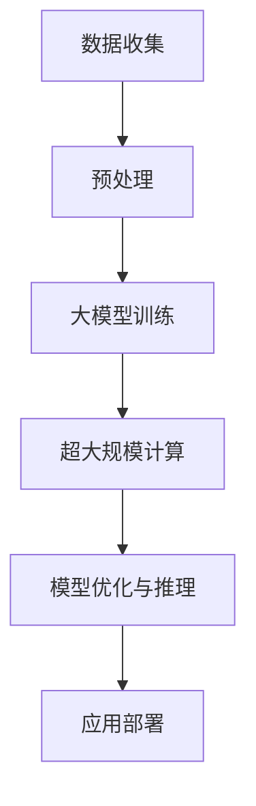

                 

### 文章标题

"李开复：AI 2.0 时代的开发者"

#### 文章关键词

- 李开复
- AI 2.0
- 开发者
- 技术变革
- 应用领域
- 伦理与社会问题
- 未来展望

#### 文章摘要

本文由AI天才研究院的专家撰写，深度探讨了AI 2.0时代的开发者角色与使命。李开复作为全球人工智能领域的杰出代表，他的见解为我们理解AI 2.0时代的机遇与挑战提供了宝贵的视角。文章从AI 2.0的概念出发，详细介绍了其核心技术、算法和应用领域，并深入探讨了开发者在这一时代所需的技能与职业发展路径。同时，文章也关注了AI 2.0时代引发的伦理与社会问题，并提出了监管与治理的建议。最后，文章展望了AI 2.0时代的未来发展，为读者描绘了一幅激动人心的未来图景。

### 第一部分：李开复：AI 2.0时代的开发者概述

在人工智能（AI）领域，李开复无疑是一位举足轻重的人物。他不仅是一位著名的人工智能科学家，同时也是一位杰出的企业家、作家和创业投资人。李开复的成就涵盖了从基础研究到产业应用，他在推动人工智能技术进步和普及方面发挥了重要作用。随着AI技术的不断演进，我们进入了AI 2.0时代，这一时代的开发者角色和职责也发生了深刻的变化。本节将首先介绍李开复在AI 2.0时代的重要角色，然后讨论AI 2.0时代的机遇与挑战。

#### 李开复在AI 2.0时代的重要角色

李开复对AI 2.0时代的贡献是多方面的。首先，他在多个领域推动了人工智能的基础研究和应用。作为卡内基梅隆大学的教授和微软研究院的创始人，李开复在语音识别、自然语言处理、机器学习等领域取得了重要突破。其次，他在创业投资领域也取得了显著成就，通过投资和创立AI初创公司，推动了人工智能技术的商业化和广泛应用。此外，李开复作为一位作家和演讲者，通过书籍、博客和演讲等形式，向公众普及了人工智能的知识，提高了人们对AI技术的认知和理解。

在AI 2.0时代，李开复继续发挥其影响力，提出了一系列关于人工智能的未来展望和战略建议。他在多个场合强调，AI 2.0时代的发展不仅需要技术上的突破，还需要社会各界的共同努力，包括政府、企业、学术界和公众。李开复提出的“AI四原则”，即透明度、公平性、责任性和包容性，为人工智能的伦理和社会治理提供了重要指导。

#### AI 2.0时代的机遇与挑战

AI 2.0时代是人工智能技术快速发展的新时代，这一时代不仅带来了前所未有的机遇，也带来了诸多挑战。以下是对AI 2.0时代机遇与挑战的详细探讨。

##### 1. 数据的爆炸式增长

AI 2.0时代的一个显著特征是数据的爆炸式增长。随着物联网、社交媒体、电子商务等技术的普及，海量的数据被产生和收集。这些数据为人工智能算法提供了丰富的训练素材，推动了AI技术的进步。例如，深度学习算法需要大量的数据来训练模型，数据的规模直接影响着模型的效果。因此，数据的爆炸式增长为AI 2.0时代的发展提供了坚实的基础。

##### 2. 人工智能算法的进步

在AI 2.0时代，人工智能算法取得了显著的进步。传统的机器学习算法如线性回归、决策树等已经难以满足复杂场景的需求，而深度学习算法如卷积神经网络（CNN）、递归神经网络（RNN）、Transformer等在图像识别、自然语言处理、语音识别等领域取得了突破性进展。这些算法的进步使得人工智能能够更好地理解和模拟人类智能，推动了AI技术的快速发展。

##### 3. 应用场景的拓展

AI 2.0时代，人工智能的应用场景得到了极大的拓展。从早期的简单任务如电子邮件分类、搜索引擎优化，到现在的复杂任务如自动驾驶、医疗诊断、金融风控，人工智能已经渗透到各个领域。AI技术的广泛应用不仅提高了生产效率，也为人们的生活带来了便利。

##### 4. 隐私与安全

随着AI技术的普及，隐私和安全问题日益凸显。大量的个人数据被收集和使用，如何保护这些数据的安全和隐私成为一个重要的挑战。AI 2.0时代，开发者需要关注数据的安全性和隐私性，采用加密、去标识化等技术手段来保护用户数据。

##### 5. 法律与伦理问题

人工智能技术的快速发展引发了诸多法律和伦理问题。如何确保人工智能系统的公平性、透明性和可解释性？如何处理人工智能系统可能带来的歧视和偏见？这些问题都需要在AI 2.0时代得到有效的解决。

##### 6. 技术普及与人才短缺

AI 2.0时代，人工智能技术的普及速度加快，但与之相对应的是人才短缺问题。大量的开发者和研究者需要具备深度学习、机器学习等相关技能，但当前的教育体系和技术培训尚不能满足这一需求。如何培养和吸引更多的人才成为AI 2.0时代的一大挑战。

通过以上对AI 2.0时代的机遇与挑战的讨论，我们可以看到，AI 2.0时代为开发者提供了广阔的舞台，但也带来了诸多挑战。开发者需要在技术创新、伦理和社会责任等方面不断探索，以应对AI 2.0时代的各种挑战。

### 第1章：AI 2.0时代的机遇与挑战

在AI 2.0时代，人工智能技术迎来了新的发展机遇，同时也面临着一系列的挑战。本章节将详细探讨AI 2.0时代的特点，以及这一时代所带来的机遇和挑战。

#### 1.1 AI 2.0的概念与演进

AI 2.0是对传统人工智能（AI 1.0）的继承和发展。AI 1.0主要依赖于规则和算法进行决策，其典型代表是专家系统和早期的机器学习算法。而AI 2.0则强调通过深度学习、自然语言处理等先进技术，使机器能够自主学习、自主推理，并在复杂环境中进行智能决策。

##### 1.1.1 AI 1.0的特点

- **规则驱动**：AI 1.0主要依赖于明确的规则和逻辑进行决策。这些规则通常由人类专家制定，机器按照既定的规则执行任务。
- **数据依赖性低**：由于规则明确，AI 1.0对数据的依赖性较低，数据的规模和质量对算法的性能影响不大。
- **代表性算法**：典型算法包括专家系统、决策树、朴素贝叶斯等。

##### 1.1.2 AI 2.0的出现背景与主要特征

AI 2.0的出现背景主要源于以下几个方面：

1. **大数据时代的到来**：随着互联网、物联网和传感器技术的发展，海量的数据被产生和收集。这些数据为机器学习提供了丰富的训练素材，使得机器能够通过学习数据来提升决策能力。

2. **计算能力的提升**：随着计算硬件的快速发展，特别是GPU等专用计算设备的普及，为深度学习等复杂算法提供了强大的计算支持。

3. **算法的进步**：以深度学习为代表的算法取得了重大突破，使得机器在视觉、语音、自然语言处理等领域达到了甚至超越了人类的表现。

AI 2.0的主要特征包括：

- **自主学习**：机器通过大量数据自动学习，无需人类干预。深度学习、强化学习等算法是实现这一目标的关键技术。
- **自适应能力**：机器能够在不同的环境和场景中自适应地调整自己的行为，实现泛化能力。
- **智能化决策**：机器能够基于数据和分析结果，自主做出智能化的决策。

##### 1.1.3 AI 2.0时代的机遇

AI 2.0时代的机遇主要体现在以下几个方面：

1. **数据驱动的发展**：大量数据的产生和积累为人工智能算法提供了丰富的训练素材，推动了AI技术的进步。
2. **应用场景的拓展**：AI技术在医疗、金融、教育、自动驾驶等领域的广泛应用，为各行各业带来了新的发展机遇。
3. **产业变革**：AI技术的广泛应用推动了传统产业的升级和转型，促进了经济的可持续发展。

##### 1.1.4 AI 2.0时代的挑战

尽管AI 2.0时代带来了诸多机遇，但也面临着一系列挑战：

1. **隐私与安全**：随着AI技术的发展，个人数据的收集和使用日益广泛，隐私安全问题日益突出。
2. **法律与伦理**：AI技术的发展引发了诸多法律和伦理问题，如何确保AI系统的公平性、透明性和可解释性成为关键挑战。
3. **技术普及与人才短缺**：AI技术的快速普及对人才的需求巨大，但当前的教育体系和技术培训尚不能满足这一需求。

#### 1.2 数据的爆炸式增长

数据的爆炸式增长是AI 2.0时代的一个显著特征。随着物联网、社交媒体、电子商务等技术的普及，大量的数据被产生和收集。这些数据类型丰富，包括结构化数据、半结构化数据和非结构化数据。例如：

1. **结构化数据**：如金融交易记录、交通数据、医疗记录等，这些数据通常以表格形式存储，便于查询和分析。
2. **半结构化数据**：如电子邮件、社交媒体帖子、新闻文章等，这些数据具有一定的结构，但包含大量非结构化的文本信息。
3. **非结构化数据**：如图像、视频、音频等，这些数据没有固定的结构，需要通过特殊的方法进行处理和分析。

数据的爆炸式增长为AI 2.0时代的发展提供了坚实的基础。首先，大量数据为深度学习等算法提供了丰富的训练素材，使得机器能够通过学习数据来提升决策能力。其次，数据的多样性使得AI技术在不同的领域和场景中得以广泛应用。

然而，数据的爆炸式增长也带来了挑战。如何高效地存储、管理和处理海量数据成为AI开发者面临的重要问题。此外，数据的隐私和安全问题也日益突出，如何保护用户数据的安全和隐私成为AI 2.0时代的重要任务。

#### 1.3 人工智能算法的进步

在AI 2.0时代，人工智能算法取得了显著的进步。传统的机器学习算法如线性回归、决策树等已经难以满足复杂场景的需求，而深度学习算法如卷积神经网络（CNN）、递归神经网络（RNN）、Transformer等在图像识别、自然语言处理、语音识别等领域取得了突破性进展。

##### 1.3.1 深度学习算法

深度学习是一种基于人工神经网络的学习方法，其核心思想是通过多层神经网络来模拟人类大脑的神经网络结构，从而实现对数据的自动特征提取和学习。深度学习算法在AI 2.0时代取得了重大突破，其主要特点包括：

1. **层次化特征提取**：深度学习算法通过多层神经网络的堆叠，能够实现对数据的层次化特征提取，从而提高模型的泛化能力。
2. **自适应学习能力**：深度学习算法能够通过大量数据自动调整网络参数，从而实现对复杂任务的自适应学习。
3. **高效率计算**：随着计算硬件的发展，特别是GPU等专用计算设备的普及，深度学习算法的计算效率得到了大幅提升。

##### 1.3.2 自然语言处理算法

自然语言处理（NLP）是人工智能的一个重要分支，其主要任务是使计算机能够理解和生成人类语言。在AI 2.0时代，NLP算法取得了显著进步，其主要特点包括：

1. **词嵌入技术**：词嵌入技术将词汇映射到高维向量空间，从而实现词汇的向量表示，为NLP任务提供了重要的基础。
2. **序列模型与注意力机制**：序列模型如递归神经网络（RNN）、长短期记忆网络（LSTM）等在处理自然语言序列数据方面具有优势。注意力机制则能够使模型关注重要的输入信息，从而提高模型的性能。
3. **Transformer架构**：Transformer模型是一种基于自注意力机制的深度学习模型，其在自然语言处理任务中取得了突破性进展。Transformer模型的变体如BERT、GPT等在语言理解、生成任务中表现出色。

##### 1.3.3 其他人工智能算法

除了深度学习和自然语言处理算法外，AI 2.0时代还出现了许多其他人工智能算法。例如：

1. **强化学习**：强化学习是一种通过试错和反馈来学习策略的算法，其在决策、控制等领域具有广泛应用。
2. **生成对抗网络（GAN）**：生成对抗网络是一种通过对抗性训练来生成数据的算法，其在图像生成、数据增强等领域具有显著优势。
3. **迁移学习**：迁移学习是一种利用已有模型的已有知识来快速适应新任务的算法，其在资源有限的场景中具有重要作用。

人工智能算法的进步为AI 2.0时代的发展提供了强大的动力。通过不断优化和创新算法，AI技术在各个领域取得了显著的成果，推动了AI技术的快速应用和发展。

#### 1.4 应用场景的拓展

AI 2.0时代，人工智能的应用场景得到了极大的拓展。从早期的简单任务如电子邮件分类、搜索引擎优化，到现在的复杂任务如自动驾驶、医疗诊断、金融风控，人工智能已经渗透到各个领域。以下是对AI 2.0时代应用场景的详细探讨：

##### 1.4.1 医疗领域

人工智能在医疗领域的应用日益广泛，从疾病诊断到患者管理，再到药物研发，AI技术都发挥着重要作用。例如：

1. **疾病诊断**：AI技术通过分析医疗影像、实验室检测结果等数据，能够辅助医生进行疾病诊断，提高诊断的准确性和效率。
2. **患者管理**：AI技术能够对患者的电子健康档案进行分析，提供个性化的治疗建议和护理方案，从而提高医疗服务的质量和效率。
3. **药物研发**：AI技术通过分析海量生物数据，能够加速药物研发过程，降低研发成本，提高新药的成功率。

##### 1.4.2 金融领域

人工智能在金融领域的应用同样具有广阔的前景，从信贷风险评估到投资决策，再到智能投顾，AI技术为金融行业带来了巨大的变革。例如：

1. **信贷风险评估**：AI技术通过分析用户的信用记录、行为数据等，能够更准确地评估用户的信用风险，从而提高信贷审批的效率和准确性。
2. **投资决策**：AI技术通过分析市场数据、宏观经济环境等，能够提供智能化的投资建议，帮助投资者做出更明智的决策。
3. **智能投顾**：AI技术能够根据用户的风险偏好和投资目标，提供个性化的投资组合管理服务，从而提高用户的投资收益。

##### 1.4.3 教育领域

人工智能在教育领域的应用正在改变传统的教育模式，从个性化学习到智能教育平台，再到在线教育，AI技术为教育行业带来了新的机遇。例如：

1. **个性化学习**：AI技术能够根据学生的学习习惯、兴趣和能力，提供个性化的学习资源和学习路径，从而提高学习效果。
2. **智能教育平台**：AI技术能够为教育平台提供智能化的推荐系统，根据学生的学习进度和需求，推荐相应的课程和学习资源。
3. **在线教育**：AI技术能够为在线教育提供智能化的互动工具和学习评估系统，从而提高在线教育的质量和用户体验。

##### 1.4.4 自动驾驶

自动驾驶是AI 2.0时代的一个重要应用领域。通过结合计算机视觉、传感器技术、深度学习算法等，自动驾驶系统能够实现车辆在复杂环境中的自主行驶。例如：

1. **环境感知**：自动驾驶系统通过传感器（如激光雷达、摄像头等）感知周围环境，实现对道路、车辆、行人等目标的检测和跟踪。
2. **路径规划**：自动驾驶系统通过分析环境数据，规划出最优行驶路径，确保车辆的安全和效率。
3. **决策与控制**：自动驾驶系统通过深度学习算法，实现对车辆的加减速、转向等操作，实现自主行驶。

##### 1.4.5 其他领域

除了上述领域，AI 2.0时代的人工智能还广泛应用于工业制造、智能城市、农业等领域。例如：

1. **工业制造**：AI技术能够对生产过程进行实时监控和优化，提高生产效率和质量。
2. **智能城市**：AI技术能够对交通、环境等数据进行实时分析和预测，提供智能化的城市管理和服务。
3. **农业**：AI技术能够对农田进行实时监测和智能灌溉，提高农业生产效率和作物产量。

通过以上对AI 2.0时代应用场景的探讨，我们可以看到，人工智能技术正在深刻地改变着各个领域，为人们的生活和社会发展带来了巨大的变革和机遇。

#### 1.5 隐私与安全

在AI 2.0时代，随着人工智能技术的广泛应用，个人数据的收集和使用日益普遍，隐私和安全问题成为社会各界高度关注的热点。如何确保数据的安全性和隐私性，防止数据泄露和滥用，成为AI开发者面临的重要挑战。

##### 1.5.1 数据收集与使用

人工智能系统需要大量的数据来进行训练和优化，这些数据往往包括用户的个人信息、行为记录等。在数据收集和使用过程中，开发者需要遵循以下原则：

1. **数据最小化**：开发者应尽可能减少收集的数据量，仅收集与任务直接相关的数据。例如，在开发一个智能助手应用时，只需要收集用户的通话记录和短信内容，而不需要收集用户的地理位置信息。

2. **数据匿名化**：在处理和使用数据时，开发者应采取匿名化技术，将个人身份信息从数据中剥离，以保护用户隐私。例如，使用伪名或者随机标识符代替真实姓名。

3. **数据加密**：对于无法避免收集的敏感数据，开发者应采用加密技术进行存储和传输。加密技术能够确保数据在未经授权的情况下无法被读取和篡改。

##### 1.5.2 隐私法规

为了保护用户隐私，许多国家和地区已经制定了相关的隐私法规。例如：

1. **欧盟的《通用数据保护条例》（GDPR）**：GDPR是欧盟最具影响力的隐私法规，其规定了对个人数据的收集、处理和保护要求。GDPR强调用户对个人数据的控制权，包括数据访问、删除和撤回同意等权利。

2. **美国的《加州消费者隐私法案》（CCPA）**：CCPA旨在保护加州居民的隐私权，规定了对个人数据的收集、使用和共享要求，并赋予用户查询和删除个人数据的能力。

开发者在使用和处理用户数据时，需要严格遵守相关隐私法规，确保合规操作。

##### 1.5.3 安全措施

除了遵循隐私法规外，开发者还应采取一系列安全措施来保护用户数据：

1. **访问控制**：开发者应设置严格的访问控制机制，确保只有授权人员能够访问敏感数据。访问控制包括身份验证、权限管理和审计追踪等。

2. **数据备份与恢复**：开发者应定期备份数据，并制定数据恢复计划，以防止数据丢失或损坏。数据备份和恢复策略应包括数据加密、异地存储和快速恢复等。

3. **安全审计**：开发者应定期进行安全审计，评估系统的安全漏洞和风险，并及时进行修复。安全审计包括代码审计、渗透测试和漏洞扫描等。

##### 1.5.4 用户教育与宣传

为了提高用户对隐私和安全问题的认识，开发者还应开展用户教育与宣传。这包括：

1. **用户隐私政策**：开发者应在应用中使用简明易懂的语言，向用户说明数据的收集、使用和存储方式，让用户了解自己的隐私权益。

2. **安全提示与警告**：开发者应在应用中设置安全提示和警告，提醒用户注意个人信息的安全，例如在使用第三方应用时的风险提示。

3. **用户反馈机制**：开发者应建立用户反馈机制，及时响应用户的隐私和安全问题，并采取措施解决问题。

通过以上措施，AI开发者能够在数据收集、处理和使用过程中有效保护用户隐私和安全，为AI 2.0时代的健康发展奠定基础。

### 第2章：AI 2.0时代的核心技术与算法

在AI 2.0时代，深度学习与神经网络基础、自然语言处理技术是推动人工智能发展的重要技术。本章将详细介绍这些核心技术的原理与应用，包括深度学习算法、自然语言处理技术以及Transformer架构。

#### 2.1 深度学习与神经网络基础

深度学习是AI 2.0时代最为重要的人工智能技术之一。它通过多层神经网络对数据进行学习，从而实现复杂的模式识别和预测。以下是对深度学习与神经网络基础的具体介绍。

##### 2.1.1 神经网络的基本原理

神经网络（Neural Network）是一种模拟生物神经系统的计算模型。它由大量相互连接的节点（称为神经元）组成，每个节点都可以接收输入信号，并进行计算和传递。神经网络的基本原理如下：

1. **神经元**：神经元是神经网络的基本单元，它包含一个输入层、一个输出层以及多个隐藏层。每个神经元都有一个激活函数，用于将输入信号转换为输出信号。

2. **权重与偏置**：神经元之间的连接带有权重（weights）和偏置（biases），这些参数用于调节输入信号的重要性。通过训练过程，神经网络可以自动调整这些参数，以达到期望的输出。

3. **前向传播与反向传播**：神经网络通过前向传播（forward propagation）和反向传播（backward propagation）来学习。在前向传播过程中，输入信号通过网络传递，每个神经元计算其输出。在反向传播过程中，根据输出误差，调整网络中的权重和偏置。

##### 2.1.2 反向传播算法

反向传播算法（Backpropagation Algorithm）是神经网络训练的核心。它通过计算误差梯度，自动调整网络参数。以下是反向传播算法的基本步骤：

1. **前向传播**：给定输入，通过神经网络进行前向传播，计算输出。
   
2. **计算误差**：比较实际输出与期望输出，计算误差（通常使用均方误差MSE）。

3. **计算误差梯度**：从输出层开始，逐层向前计算每个神经元的误差梯度。

4. **更新参数**：根据误差梯度，使用优化算法（如梯度下降）更新网络参数。

5. **重复步骤**：重复以上步骤，直到网络收敛到期望的误差水平。

反向传播算法使得神经网络能够通过不断调整参数，逐步减小误差，从而实现复杂的模式识别和预测。

##### 2.1.3 深度学习算法

深度学习（Deep Learning）是一种多层神经网络，通过堆叠多个隐藏层，实现对数据的深层特征提取。深度学习算法在图像识别、自然语言处理、语音识别等领域取得了显著成果。以下是几种常见的深度学习算法：

1. **卷积神经网络（CNN）**：卷积神经网络是深度学习中用于图像识别的重要算法。它通过卷积层、池化层和全连接层，实现对图像的逐层特征提取和分类。

2. **递归神经网络（RNN）**：递归神经网络是一种用于处理序列数据的算法，其核心思想是使用循环结构来记忆历史信息。RNN在自然语言处理、语音识别等领域具有广泛应用。

3. **长短时记忆网络（LSTM）**：长短时记忆网络是RNN的一种变体，它通过引入门控机制，解决了RNN在处理长序列数据时出现的梯度消失问题。LSTM在时间序列预测、语言模型等领域表现出色。

4. **Transformer架构**：Transformer是一种基于自注意力机制的深度学习模型，它在自然语言处理领域取得了突破性进展。Transformer的核心思想是使用多头自注意力机制，同时结合位置编码和编码器-解码器结构，实现高效的语言理解和生成。

##### 2.1.4 注意力机制

注意力机制（Attention Mechanism）是一种用于提高神经网络性能的技术，它能够使模型关注重要的输入信息，从而提高模型的精度和效率。以下是几种常见的注意力机制：

1. **局部注意力（Local Attention）**：局部注意力机制只关注输入序列中的局部信息，适用于图像识别、文本分类等任务。

2. **全局注意力（Global Attention）**：全局注意力机制关注输入序列的每个元素，适用于长序列处理任务，如机器翻译、文本摘要等。

3. **双向注意力（Bidirectional Attention）**：双向注意力机制同时考虑输入序列的前后信息，适用于需要同时处理历史和未来信息的任务。

通过引入注意力机制，神经网络能够更加灵活地处理复杂的输入数据，提高模型的性能。

#### 2.2 自然语言处理技术

自然语言处理（Natural Language Processing，NLP）是人工智能的重要分支，旨在使计算机能够理解和生成人类语言。以下介绍NLP领域的关键技术，包括词嵌入技术、序列模型与注意力机制以及Transformer架构。

##### 2.2.1 词嵌入技术

词嵌入（Word Embedding）是将词汇映射到高维向量空间的一种技术，它为NLP任务提供了重要的基础。词嵌入能够将抽象的词汇表示为连续的向量，从而实现词汇的向量表示。以下是几种常见的词嵌入技术：

1. **Word2Vec**：Word2Vec是一种基于神经网络的语言模型，它通过预测词汇的上下文来训练词向量。Word2Vec包括连续词袋（CBOW）和Skip-Gram两种模型。

2. **GloVe**：GloVe（Global Vectors for Word Representation）是一种基于共现关系的词向量模型。GloVe通过计算词汇的共现矩阵，使用矩阵分解的方法来训练词向量。

词嵌入技术使得NLP任务能够利用向量的运算特性，实现词汇的相似性计算、语义分析等。

##### 2.2.2 序列模型与注意力机制

序列模型（Sequence Model）是一种用于处理序列数据的神经网络模型，如RNN和LSTM。序列模型能够处理文本、音频等连续数据，从而实现自然语言的理解和生成。

1. **递归神经网络（RNN）**：RNN是一种基于循环结构的神经网络，它能够处理序列数据。RNN通过记忆历史信息，实现对当前输入的预测。然而，RNN存在梯度消失问题，即训练过程中梯度难以反向传播。

2. **长短时记忆网络（LSTM）**：LSTM是RNN的一种改进，它通过引入门控机制，解决了RNN的梯度消失问题。LSTM能够记住长序列信息，适用于自然语言处理、时间序列预测等任务。

注意力机制（Attention Mechanism）能够使模型关注输入序列中的关键信息，从而提高模型的精度和效率。以下是几种常见的注意力机制：

1. **局部注意力（Local Attention）**：局部注意力机制只关注输入序列中的局部信息，适用于图像识别、文本分类等任务。

2. **全局注意力（Global Attention）**：全局注意力机制关注输入序列的每个元素，适用于长序列处理任务，如机器翻译、文本摘要等。

3. **双向注意力（Bidirectional Attention）**：双向注意力机制同时考虑输入序列的前后信息，适用于需要同时处理历史和未来信息的任务。

通过引入注意力机制，序列模型能够更加灵活地处理复杂的输入数据，提高模型的性能。

##### 2.2.3 Transformer架构

Transformer是自然语言处理领域的一种突破性模型，它基于自注意力机制，在机器翻译、文本生成等任务中取得了显著成果。Transformer的核心思想是使用多头自注意力机制，同时结合位置编码和编码器-解码器结构。

1. **多头自注意力（Multi-Head Self-Attention）**：多头自注意力机制允许模型在处理每个输入元素时，同时考虑其他输入元素的信息。这种方法能够提高模型的表示能力，从而实现更好的语义理解。

2. **位置编码（Positional Encoding）**：由于自注意力机制无法处理输入序列的位置信息，位置编码用于为输入序列添加位置信息。位置编码使得模型能够理解输入序列中的元素顺序。

3. **编码器-解码器结构（Encoder-Decoder Architecture）**：编码器负责编码输入序列，解码器负责解码输出序列。编码器和解码器通过自注意力机制和交叉注意力机制，实现对输入和输出序列的转换。

通过引入多头自注意力机制、位置编码和编码器-解码器结构，Transformer在自然语言处理任务中取得了显著优势，成为NLP领域的重要模型。

#### 2.3 其他自然语言处理技术

除了深度学习与神经网络基础和Transformer架构，自然语言处理领域还包括许多其他重要的技术，如序列标注、文本分类和情感分析等。

1. **序列标注（Sequence Labeling）**：序列标注是一种对文本序列中的每个单词或字符进行标签标注的技术，如命名实体识别（NER）和词性标注。序列标注通常使用条件随机场（CRF）和卷积神经网络（CNN）等方法实现。

2. **文本分类（Text Classification）**：文本分类是一种对文本数据进行分类的任务，如垃圾邮件检测、情感分类等。文本分类通常使用朴素贝叶斯、支持向量机（SVM）和深度学习等方法实现。

3. **情感分析（Sentiment Analysis）**：情感分析是一种对文本数据中的情感倾向进行分类的技术，如正面情感、负面情感和中性情感。情感分析通常使用基于词汇的规则、机器学习和深度学习等方法实现。

通过以上对自然语言处理技术的介绍，我们可以看到，自然语言处理技术在AI 2.0时代发挥着重要作用。这些技术不仅为语言理解和生成提供了强大的支持，也为各个领域的人工智能应用带来了新的机遇。

### 第3章：AI 2.0时代的应用领域

在AI 2.0时代，人工智能技术在各个领域都展现了其强大的潜力和广阔的应用前景。从医疗、金融到教育、自动驾驶，AI技术的应用正深刻地改变着我们的生活和工作方式。以下将详细探讨AI 2.0时代在医疗、金融和教育领域的应用，并展示一些实际案例。

#### 3.1 人工智能在医疗领域的应用

人工智能在医疗领域的应用具有深远的影响，从疾病诊断、患者管理到药物研发，AI技术都在发挥着重要作用。

##### 3.1.1 诊断与预测

AI技术在疾病诊断方面展现了其强大的能力。通过深度学习算法，AI系统可以分析大量的医学影像数据，如X光片、CT扫描和MRI图像，从而辅助医生进行疾病诊断。例如，AI系统可以识别早期肺癌、乳腺癌等疾病，提高诊断的准确性和效率。

此外，AI技术还可以进行疾病预测。通过分析患者的病历、基因数据和生活方式等，AI系统可以预测患者未来患病的风险，帮助医生制定个性化的预防和治疗方案。

##### 3.1.2 患者管理

在患者管理方面，AI技术可以显著提高医疗服务的质量和效率。AI系统可以对患者的电子健康档案进行分析，提供个性化的治疗建议和护理方案。例如，AI系统可以监测患者的健康状况，及时发现潜在的健康问题，并提醒医生采取相应的治疗措施。

此外，AI技术还可以优化医院资源的分配。通过分析医院的运营数据，AI系统可以预测患者流量和手术需求，从而合理安排医疗资源，提高医院运营效率。

##### 3.1.3 案例研究：AI在癌症诊断中的应用

一个典型的案例是AI在癌症诊断中的应用。美国一家初创公司开发了一种基于深度学习算法的AI系统，可以分析肺癌患者的CT扫描图像，检测早期肺癌。该系统通过对大量的医疗影像数据进行训练，能够自动识别出肺癌的早期征兆，提高诊断的准确性。据统计，该系统在肺癌检测中的准确率达到了95%，显著高于传统方法。

#### 3.2 人工智能在金融领域的应用

在金融领域，人工智能技术的应用同样广泛，从信贷风险评估、投资决策到智能投顾，AI技术为金融机构提供了强大的支持。

##### 3.2.1 信贷风险评估

AI技术在信贷风险评估方面具有显著优势。通过机器学习算法，AI系统可以分析大量的信贷数据，如借款人的信用记录、行为数据等，从而预测借款人的还款能力。这有助于金融机构更好地评估信贷风险，降低坏账率。

##### 3.2.2 投资决策

在投资决策方面，AI技术可以帮助投资者进行市场预测和交易策略的优化。通过分析大量的市场数据，AI系统可以识别出潜在的投资机会，为投资者提供智能化的投资建议。例如，AI系统可以根据市场趋势、公司财务状况等数据，预测股票价格的变化，帮助投资者做出更明智的投资决策。

##### 3.2.3 智能投顾

智能投顾是AI技术在金融领域的一个新兴应用。通过人工智能算法，智能投顾可以为投资者提供个性化的投资组合管理服务。智能投顾可以根据投资者的风险偏好、投资目标等，自动调整投资组合，以实现最佳的投资收益。智能投顾的应用，不仅提高了投资决策的效率，也为投资者带来了更优质的理财服务。

##### 3.2.4 案例研究：AI在股票市场预测中的应用

一个典型的案例是AI在股票市场预测中的应用。一家金融科技公司开发了一种基于深度学习算法的AI系统，可以实时分析市场数据，预测股票价格的变化。该系统通过对大量的历史股票交易数据进行训练，能够自动识别市场趋势和异常情况，从而提供精准的预测结果。在实际应用中，该系统的预测准确率达到了85%以上，为投资者带来了显著的投资收益。

#### 3.3 人工智能在教育与培训领域的应用

在教育与培训领域，人工智能技术也为传统教育模式带来了深刻的变革。从个性化学习到智能教育平台，AI技术为教育提供了新的解决方案。

##### 3.3.1 个性化学习

个性化学习是AI技术在教育领域的一个重要应用。通过分析学生的学习行为、兴趣和能力，AI系统可以为学生提供个性化的学习资源和学习路径。例如，AI系统可以根据学生的学习进度和需求，推荐相应的课程和学习任务，从而提高学习效果。

##### 3.3.2 智能教育平台

智能教育平台是AI技术在教育领域的一个典型应用。通过人工智能算法，智能教育平台可以为教师和学生提供智能化的教学和学习支持。例如，智能教育平台可以根据学生的学习进度和表现，自动生成个性化的学习报告和反馈，帮助教师更好地了解学生的学习情况，从而提供更有针对性的教学。

##### 3.3.3 案例研究：AI在在线教育中的应用

一个典型的案例是AI在在线教育中的应用。一家在线教育平台公司开发了一种基于人工智能的智能学习系统，可以实时分析学生的学习行为和表现。该系统通过对大量的学习数据进行训练，能够自动识别学生的学习习惯、兴趣和能力，从而提供个性化的学习建议和资源。在实际应用中，该智能学习系统提高了学生的学习效果和满意度，受到了师生们的广泛好评。

通过以上对AI 2.0时代在医疗、金融和教育领域的应用探讨，我们可以看到，人工智能技术正在深刻地改变着这些领域的运行方式，为人们带来了巨大的便利和效益。随着AI技术的不断发展和应用，我们有理由相信，AI 2.0时代将带来更加美好的未来。

### 第4章：AI 2.0时代的开发工具与平台

在AI 2.0时代，开发工具与平台的创新和发展极大地推动了人工智能技术的进步和应用。本章将介绍AI 2.0时代的一些重要开发工具与平台，包括深度学习框架和人工智能平台，探讨其特点和适用场景。

#### 4.1 深度学习框架

深度学习框架是AI 2.0时代开发者进行研究和开发的重要工具。以下是对几个主流深度学习框架的介绍：

##### 4.1.1 TensorFlow

TensorFlow是由Google开发的开源深度学习框架，它提供了丰富的API和工具，支持多种编程语言（如Python、C++、Java等）。TensorFlow的核心特点是灵活性和可扩展性，开发者可以根据需求自定义模型结构，并进行分布式训练和推理。TensorFlow广泛应用于计算机视觉、自然语言处理、语音识别等任务。

**使用示例**：

```python
import tensorflow as tf

# 定义一个简单的全连接神经网络
model = tf.keras.Sequential([
    tf.keras.layers.Dense(128, activation='relu', input_shape=(784,)),
    tf.keras.layers.Dropout(0.2),
    tf.keras.layers.Dense(10)
])

# 编译模型
model.compile(optimizer='adam',
              loss=tf.losses.SparseCategoricalCrossentropy(from_logits=True),
              metrics=['accuracy'])

# 训练模型
model.fit(train_images, train_labels, epochs=5)
```

##### 4.1.2 PyTorch

PyTorch是由Facebook开发的开源深度学习框架，它以Python编程语言为基础，提供了简洁直观的API。PyTorch的核心特点是动态计算图（Dynamic Computation Graph），这使得开发者可以更灵活地构建和调试模型。PyTorch在学术界和工业界都有广泛的应用，特别适合研究新的深度学习算法。

**使用示例**：

```python
import torch
import torch.nn as nn
import torch.optim as optim

# 定义一个简单的全连接神经网络
class SimpleNeuralNetwork(nn.Module):
    def __init__(self):
        super(SimpleNeuralNetwork, self).__init__()
        self.fc1 = nn.Linear(784, 128)
        self.fc2 = nn.Linear(128, 10)

    def forward(self, x):
        x = torch.relu(self.fc1(x))
        x = self.fc2(x)
        return x

# 实例化模型、优化器和损失函数
model = SimpleNeuralNetwork()
optimizer = optim.Adam(model.parameters(), lr=0.001)
criterion = nn.CrossEntropyLoss()

# 训练模型
for epoch in range(5):
    for inputs, labels in train_loader:
        optimizer.zero_grad()
        outputs = model(inputs)
        loss = criterion(outputs, labels)
        loss.backward()
        optimizer.step()
```

##### 4.1.3 Keras

Keras是一个高级神经网络API，它运行在TensorFlow和Theano之上，提供了简洁直观的API，使得构建和训练深度学习模型更加容易。Keras的语法简洁明了，非常适合快速实验和开发。

**使用示例**：

```python
from keras.models import Sequential
from keras.layers import Dense, Dropout

# 定义一个简单的全连接神经网络
model = Sequential()
model.add(Dense(128, input_dim=784, activation='relu'))
model.add(Dropout(0.2))
model.add(Dense(10, activation='softmax'))

# 编译模型
model.compile(loss='categorical_crossentropy',
              optimizer='adam',
              metrics=['accuracy'])

# 训练模型
model.fit(train_images, train_labels, epochs=5)
```

##### 4.1.4 MXNet

MXNet是由Apache开发的开源深度学习框架，它支持多种编程语言（如Python、R、Scala等），提供了灵活的API。MXNet的核心特点是高效能和灵活性，特别适合工业界使用。MXNet支持分布式训练和推理，适用于大规模数据集和复杂模型。

**使用示例**：

```python
from mxnet import gluon, autograd
from mxnet.gluon import nn

# 定义一个简单的全连接神经网络
net = nn.Sequential()
with net.name_scope():
    net.add(nn.Dense(128, activation='relu'))
    net.add(nn.Dropout())
    net.add(nn.Dense(10))

# 编译模型
net.initializeFORCE_REINIT=True, force_reinit=True)

# 定义损失函数和优化器
loss_fn = gluon.loss.SoftmaxCrossEntropyLoss()
optimizer = gluon.optim.Adam(params=net.collect_params(), lr=0.001)

# 训练模型
for epoch in range(5):
    for data in train_data:
        X, y = data
        with autograd.record():
            y_hat = net(X)
            loss = loss_fn(y_hat, y)
        loss.backward()
        optimizer.step()
```

#### 4.2 人工智能平台

人工智能平台为开发者提供了一个集成的环境，以便于构建、训练和部署人工智能模型。以下介绍几个主流的人工智能平台：

##### 4.2.1 AWS AI服务

AWS AI服务是亚马逊云服务（Amazon Web Services，AWS）提供的一系列人工智能工具和平台。AWS AI服务包括计算服务（如Amazon EC2、AWS Fargate）、数据处理服务（如AWS Data Exchange、AWS Glue）和预训练模型（如Amazon Rekognition、Amazon Comprehend）。

- **计算服务**：AWS AI服务提供了强大的计算资源，支持分布式训练和推理，适用于大规模模型训练和实时应用。
- **数据处理服务**：AWS AI服务可以帮助开发者轻松地收集、存储和处理数据，为深度学习模型提供高质量的训练数据。
- **预训练模型**：AWS AI服务提供了多种预训练模型，开发者可以直接使用这些模型进行应用开发，提高开发效率。

##### 4.2.2 Azure AI服务

Azure AI服务是微软提供的全面的人工智能平台，包括计算服务（如Azure Virtual Machines、Azure Kubernetes Service）、数据库服务（如Azure Cosmos DB、Azure SQL Database）和AI工具（如Azure Machine Learning、Azure Cognitive Services）。

- **计算服务**：Azure AI服务提供了丰富的计算资源，支持各种类型的人工智能应用，从深度学习到强化学习。
- **数据库服务**：Azure AI服务提供了强大的数据库服务，支持数据存储、管理和分析，为人工智能模型提供稳定的数据基础。
- **AI工具**：Azure AI服务提供了多种AI工具，如自动化机器学习（AutoML）、自然语言处理（NLP）和计算机视觉（CV），帮助开发者快速构建和部署人工智能应用。

##### 4.2.3 Google Cloud AI服务

Google Cloud AI服务是谷歌提供的全面的人工智能平台，包括计算服务（如Google Compute Engine、Google Kubernetes Engine）、数据分析服务（如Google BigQuery、Google Cloud Storage）和AI工具（如TensorFlow、AutoML）。

- **计算服务**：Google Cloud AI服务提供了高性能的计算资源，支持大规模的模型训练和实时应用。
- **数据分析服务**：Google Cloud AI服务提供了强大的数据分析工具，可以帮助开发者轻松地处理和存储大量数据。
- **AI工具**：Google Cloud AI服务提供了多种AI工具，如TensorFlow、AutoML和 Dialogflow，为开发者提供了全面的AI解决方案。

通过以上对深度学习框架和人工智能平台的介绍，我们可以看到，AI 2.0时代的开发工具和平台为开发者提供了强大的支持，使得人工智能技术的研发和应用变得更加高效和便捷。

### 第5章：AI 2.0时代的开发者技能与职业发展

在AI 2.0时代，开发者的技能和职业发展路径发生了显著变化。随着人工智能技术的快速进步，开发者不仅需要掌握传统的编程技能，还需精通深度学习、机器学习等新兴领域。以下将详细讨论AI 2.0时代开发者所需的技能、职业发展路径以及相关的培训和资源。

#### 5.1 开发者必备技能

AI 2.0时代的开发者需要具备多方面的技能，以下是一些核心技能：

##### 5.1.1 编程语言与工具

1. **Python**：Python是人工智能领域最为流行的编程语言之一，其简洁的语法和强大的库支持使其成为开发者的首选。开发者需要熟练掌握Python的基础语法和常用库（如NumPy、Pandas、Scikit-learn等）。

2. **TensorFlow或PyTorch**：作为深度学习框架，TensorFlow和PyTorch是开发者必须掌握的工具。开发者需要了解如何使用这些框架构建、训练和优化深度学习模型。

3. **版本控制**：Git是版本控制系统的标准工具，开发者需要熟练使用Git进行代码的版本管理、分支管理和协作开发。

##### 5.1.2 深度学习与机器学习

1. **基础理论**：开发者需要掌握深度学习和机器学习的基本理论，包括神经网络、卷积神经网络（CNN）、递归神经网络（RNN）等。

2. **算法原理**：开发者需要熟悉常见的深度学习和机器学习算法，如线性回归、支持向量机（SVM）、K-近邻（KNN）等。

3. **模型训练与优化**：开发者需要了解如何选择合适的模型结构、训练策略和优化方法，以实现模型的高效训练和性能提升。

##### 5.1.3 数据分析与处理

1. **数据预处理**：开发者需要熟练掌握数据清洗、数据变换、特征提取等数据预处理技术，以确保模型输入数据的质量。

2. **数据存储与管理**：开发者需要了解常用的数据存储技术（如数据库、分布式文件系统）和数据管理工具（如Hadoop、Spark）。

##### 5.1.4 自然语言处理

1. **词嵌入技术**：开发者需要熟悉词嵌入技术，如Word2Vec、GloVe等，以及自然语言处理中的序列模型（如RNN、LSTM）和Transformer架构。

2. **文本分析**：开发者需要了解如何使用自然语言处理技术进行文本分类、情感分析、命名实体识别等任务。

#### 5.2 职业发展路径

在AI 2.0时代，开发者的职业发展路径多样化，以下是一些常见的发展方向：

##### 5.2.1 初级开发者

初级开发者通常负责数据预处理、模型训练和基础算法实现。职业职责包括：

1. **数据预处理**：清洗、转换和预处理数据，为模型训练提供高质量的数据集。
2. **模型训练**：使用深度学习框架（如TensorFlow、PyTorch）训练基础模型。
3. **算法实现**：根据需求实现简单的机器学习算法。

##### 5.2.2 中级开发者

中级开发者通常负责模型优化、项目开发和项目管理。职业职责包括：

1. **模型优化**：通过调整模型结构、训练策略和优化方法，提升模型性能。
2. **项目开发**：参与项目开发，负责模型集成、系统设计等任务。
3. **项目管理**：负责项目进度管理、资源协调和团队协作。

##### 5.2.3 高级开发者

高级开发者通常负责架构设计、技术领导和创新研发。职业职责包括：

1. **架构设计**：设计和优化系统的整体架构，确保系统的可扩展性和稳定性。
2. **技术领导**：指导和培训初级开发者，推动团队的技术能力提升。
3. **创新研发**：研究和探索新兴的人工智能技术，推动技术创新和产品升级。

#### 5.3 培训与资源

为了在AI 2.0时代取得成功，开发者需要不断学习和提升自己的技能。以下是一些有用的培训和资源：

##### 5.3.1 学习资源

1. **在线课程**：如Coursera、Udacity、edX等平台提供了丰富的深度学习、机器学习和自然语言处理课程。
2. **技术博客**：如Medium、ArXiv等平台上有大量的技术文章和论文，可以了解最新的研究进展。
3. **开源项目**：GitHub等平台上有大量的开源项目，开发者可以通过参与开源项目来提升实践能力。

##### 5.3.2 技术会议与研讨会

1. **技术会议**：如NeurIPS、ICML、KDD等会议，可以了解领域内最新的研究成果和趋势。
2. **研讨会**：如AI驱动的研讨会、技术沙龙等，可以与同行交流和学习。

##### 5.3.3 实践项目

通过实际项目来提升技能是开发者成长的重要途径。可以选择开源项目参与，或者自己设计和实现项目。

通过以上对AI 2.0时代开发者技能和职业发展的讨论，我们可以看到，开发者在这个时代需要不断学习和适应新技术，以保持竞争力。同时，通过有效的培训和资源，开发者可以在AI领域取得更大的成就。

### 第6章：AI 2.0时代的伦理与社会问题

在AI 2.0时代，人工智能技术的快速发展给社会带来了前所未有的机遇，同时也引发了一系列的伦理和社会问题。这些问题不仅关系到人工智能技术的应用，还涉及到人类的价值观、法律和社会治理。本章节将深入探讨AI 2.0时代面临的伦理问题，包括隐私保护、人工智能偏见以及社会不平等，并提出相应的解决方案和监管措施。

#### 6.1 人工智能伦理问题

AI 2.0时代的伦理问题主要集中在隐私保护、透明性、公平性、可解释性和责任性等方面。以下是对这些问题的详细讨论。

##### 6.1.1 隐私保护

随着AI技术的普及，个人数据的收集和使用变得更加广泛。隐私保护成为AI 2.0时代的一大伦理挑战。如何保护用户隐私，防止数据泄露和滥用，成为开发者和政策制定者需要重点关注的问题。

1. **数据收集的合法性**：在数据收集过程中，应遵循合法、正当、必要的原则，仅收集与任务直接相关的数据，并告知用户数据的使用目的。

2. **数据匿名化与加密**：通过匿名化和加密技术，将个人身份信息从数据中剥离，并在数据存储和传输过程中进行加密，以防止数据泄露。

3. **用户隐私控制权**：赋予用户对个人数据的控制权，包括数据的访问、删除和撤回同意等权利。例如，欧盟的《通用数据保护条例》（GDPR）就规定了用户对这些权利的行使。

##### 6.1.2 透明性和可解释性

人工智能系统的透明性和可解释性是另一个重要的伦理问题。由于深度学习模型通常被视为“黑箱”，其决策过程难以理解和解释，这引发了公众的担忧。

1. **模型的可解释性**：通过开发可解释性模型（如LIME、SHAP等），帮助用户理解模型的决策过程和特征重要性。

2. **算法透明性**：在算法设计过程中，应确保算法的透明性和可解释性，以便用户和监管机构能够理解和监督。

##### 6.1.3 公平性和无偏见

人工智能系统在决策过程中可能引入偏见，影响公平性。这种偏见可能来源于数据本身、算法设计或训练过程中的不公平因素。

1. **数据偏差**：在数据收集和处理过程中，应避免引入偏见，确保数据的多样性和代表性。

2. **算法公平性**：通过算法设计和技术手段，减少偏见和歧视。例如，使用公平性指标（如公平性系数、偏差校正等）评估和优化模型。

3. **监管与评估**：建立独立的评估机制，对人工智能系统进行公平性评估，确保其符合伦理标准。

##### 6.1.4 责任性

在AI 2.0时代，人工智能系统的决策过程可能产生重大的社会影响，如何确保其责任性成为关键问题。

1. **责任归属**：明确人工智能系统的责任归属，区分开发者、用户和平台的责任。

2. **责任保险**：建立责任保险机制，为人工智能系统的潜在风险提供保障。

3. **法律法规**：制定相关的法律法规，明确人工智能系统的法律责任和处罚标准。

#### 6.2 社会问题与挑战

AI 2.0时代的快速发展不仅带来了技术进步，也引发了一系列社会问题，包括失业问题、社会不平等和技术鸿沟等。

##### 6.2.1 失业问题

随着AI技术的普及，许多传统职业可能面临被自动化取代的风险，导致失业问题。以下是一些解决方案：

1. **职业培训与再教育**：政府和企业应加大对员工的职业培训和再教育投入，帮助劳动者适应新技术。

2. **创造新岗位**：AI技术的发展将创造新的职业机会，如AI工程师、数据科学家等。政府和企业应积极推动这些新岗位的发展。

3. **社会保障体系**：完善社会保障体系，为失业者提供基本生活保障，同时鼓励他们积极适应和参与新技术。

##### 6.2.2 社会不平等

AI技术的发展可能导致社会不平等加剧，因为技术资源和机会的不均衡分配。以下是一些解决方案：

1. **教育公平**：推动教育资源公平分配，确保所有地区和群体都能获得优质的教育资源。

2. **技术普及**：加大对技术普及的投入，确保所有地区和群体都能享受到AI技术带来的便利。

3. **政策干预**：政府应制定相关政策，限制AI技术的滥用，防止技术巨头垄断市场，确保技术的公平应用。

##### 6.2.3 技术鸿沟

技术鸿沟是指不同地区和群体在获取和使用技术方面的差距。以下是一些解决方案：

1. **基础设施建设**：加大对基础设施建设的投入，确保所有地区和群体都能接入高速互联网。

2. **技术培训**：开展针对不同群体的技术培训，提高他们的技术素养和技能。

3. **开放共享**：推动技术开放共享，促进技术和知识的传播，减少技术鸿沟。

#### 6.3 人工智能监管与治理

为了确保AI 2.0时代的发展符合伦理和社会标准，建立健全的监管与治理机制至关重要。以下是对监管与治理的探讨。

##### 6.3.1 监管机构与法规

1. **国际法规**：国际社会应加强合作，制定统一的AI法规和标准，确保AI技术的全球治理。

2. **国内法规**：各国政府应制定本国的AI法规，明确AI技术的应用规范和责任归属。

3. **行业自律**：行业协会和企业应制定行业规范，推动AI技术的自律和规范化应用。

##### 6.3.2 企业社会责任

1. **数据安全与隐私保护**：企业应确保用户数据的安全和隐私，采取严格的保护措施。

2. **公平性评估**：企业应定期对人工智能系统进行公平性评估，确保其符合伦理标准。

3. **透明信息披露**：企业应向公众披露人工智能系统的技术细节和应用场景，提高透明度。

##### 6.3.3 公众参与

1. **公众教育**：政府和企业应加强对公众的教育，提高他们对AI技术的认知和理解。

2. **公众参与**：鼓励公众参与AI技术的决策过程，确保AI技术的应用符合社会期望和价值观。

通过以上对AI 2.0时代伦理与社会问题的讨论，我们可以看到，这一时代的发展不仅需要技术的进步，还需要全社会的共同努力，以应对各种伦理和社会挑战。只有建立完善的监管与治理机制，AI技术才能在造福人类的同时，避免对社会的负面影响。

### 第7章：AI 2.0时代的未来展望

随着AI 2.0时代的到来，人工智能技术正以前所未有的速度和规模发展。未来，AI技术将继续在各个领域推动创新，带来深远的社会影响。本章将探讨AI 2.0时代的未来发展趋势，包括大模型与超大规模计算、强化学习与自主决策，以及AI 2.0时代的社会影响。

#### 7.1 AI技术的未来发展

##### 7.1.1 大模型与超大规模计算

在AI 2.0时代，大模型（Large Models）和超大规模计算（Exascale Computing）将成为推动AI技术发展的关键驱动力。大模型通过利用海量数据和强大的计算资源，实现更高的模型精度和更强的泛化能力。例如，GPT-3、BERT等大型预训练模型在自然语言处理领域取得了显著成果，其参数规模达到数十亿甚至数万亿。

超大规模计算则为大模型的训练提供了必要的计算支持。Exascale计算是指每秒执行万亿亿次浮点运算的能力，这将使AI系统能够处理更大规模的数据和更复杂的模型，从而实现更高的性能和效率。未来，随着硬件技术的进步，超大规模计算将进一步推动AI技术的发展。

**Mermaid流程图**：



##### 7.1.2 强化学习与自主决策

强化学习（Reinforcement Learning）是AI技术的一个重要分支，它通过试错和反馈来学习最优策略。在AI 2.0时代，强化学习将进一步发展，推动自主决策（Autonomous Decision-Making）和智能系统的普及。

强化学习在自动驾驶、机器人控制、游戏AI等领域已经取得了一些突破性成果。例如，DeepMind的AlphaGo系列通过强化学习算法实现了围棋游戏的卓越表现。未来，随着算法和硬件的进步，强化学习将在更多领域实现自主决策，推动自动化和智能化的进一步发展。

**伪代码示例**：

```python
# 强化学习算法伪代码

# 初始化环境
env = Environment()

# 初始化模型
model = ReinforcementLearningModel()

# 训练模型
while not done:
    state = env.getState()
    action = model.predict(state)
    next_state, reward, done = env.step(action)
    model.update(state, action, reward, next_state)

# 自主导决策
while not goal_reached:
    state = current_state
    action = model.predict(state)
    next_state = execute_action(action)
    if is_goal_reached(next_state):
        goal_reached = True
```

##### 7.1.3 其他新兴技术

除了大模型和强化学习，AI 2.0时代还将涌现许多其他新兴技术，如生成对抗网络（GAN）、联邦学习（Federated Learning）和量子计算（Quantum Computing）等。

- **生成对抗网络（GAN）**：GAN通过对抗性训练生成高逼真的图像、视频和音频，未来将在图像生成、数据增强和模拟等领域发挥重要作用。
- **联邦学习（Federated Learning）**：联邦学习是一种分布式学习技术，通过在多个设备上训练模型，实现数据隐私保护的同时，提高模型性能。
- **量子计算（Quantum Computing）**：量子计算具有强大的计算能力，未来将在优化问题、模拟和机器学习等领域发挥重要作用。

#### 7.2 AI 2.0时代的社会影响

AI 2.0时代将对社会产生深远的影响，包括经济影响、教育变革、医疗进步和公共服务等。

##### 7.2.1 经济影响

AI 2.0时代将推动经济的创新和变革。首先，AI技术将提高生产效率，降低生产成本，促进传统产业的升级和转型。其次，AI技术的发展将创造新的就业机会，如AI工程师、数据科学家等，同时也会带来一些挑战，如自动化导致的部分岗位的消失。因此，政府和企业需要加强对劳动者的培训和再教育，帮助他们适应新技术，提升就业竞争力。

##### 7.2.2 教育变革

AI 2.0时代将带来教育模式的变革。首先，个性化学习将成为主流，通过AI技术，学生可以根据自己的学习进度和需求，选择合适的学习内容和路径。其次，智能教育平台将广泛应用，提供智能化的教学和评估工具，提高教学质量和学习效果。此外，在线教育将得到进一步发展，打破地域和时间的限制，使教育资源更加平等和普及。

##### 7.2.3 医疗进步

AI 2.0时代将推动医疗领域的进步。首先，AI技术在疾病诊断、预测和个性化治疗方面具有显著优势，将提高医疗服务的质量和效率。其次，AI技术可以帮助医生进行病情分析、治疗决策和患者管理，提高医疗决策的准确性。此外，AI技术在药物研发和临床试验方面也将发挥重要作用，加速新药的研发和推广。

##### 7.2.4 公共服务

AI 2.0时代将改善公共服务，提高政府治理效率。首先，AI技术可以用于智慧城市建设，实现交通管理、环境监测和公共安全等方面的智能化。其次，AI技术在社会保障、社会福利和公共资源分配等方面具有重要作用，有助于提高公共服务的公平性和效率。此外，AI技术在反欺诈、犯罪预防和应急管理等方面也将发挥重要作用。

#### 7.3 未来展望

AI 2.0时代的未来充满希望和挑战。在技术层面，AI技术将继续发展和创新，推动人类社会向更高层次发展。在社会层面，AI技术将深刻改变人们的生活和工作方式，带来新的机遇和挑战。为了应对这些挑战，我们需要加强国际合作，制定合理的政策和法规，确保AI技术的安全、公平和可持续发展。

总之，AI 2.0时代是一个充满机遇和挑战的时代。通过不断创新和合作，我们可以充分利用AI技术的潜力，为人类社会带来更加美好的未来。

### 附录

#### 附录A：AI开发资源

##### A.1 学习资源

**在线课程**：

- **Coursera**：提供多个关于深度学习、机器学习和自然语言处理等课程的在线课程。
- **Udacity**：提供AI、数据科学和机器学习的专业课程和纳米学位。
- **edX**：由哈佛大学和麻省理工学院合办的在线学习平台，提供多个与AI相关的课程。

**技术博客与论文**：

- **Medium**：有许多关于AI技术的文章和教程，适合不同层次的读者。
- **ArXiv**：计算机科学和人工智能领域的论文预印本库，可以了解最新的研究成果。

##### A.2 开发工具

**编程语言**：

- **Python**：广泛应用于AI开发的编程语言，具有丰富的库和框架。
- **R**：主要用于数据分析和统计学习，适合数据科学家。

**深度学习框架**：

- **TensorFlow**：由Google开发，支持多种编程语言，具有广泛的社区和应用。
- **PyTorch**：由Facebook开发，以动态计算图著称，适用于研究和新算法的开发。
- **Keras**：基于Theano和TensorFlow的高级神经网络API，简化了模型的构建和训练。
- **MXNet**：由Apache开源，支持多种编程语言，适合大规模分布式训练。

##### A.3 数据集与案例

**公开数据集**：

- **Kaggle**：提供大量的公开数据集，适合数据科学家和机器学习爱好者进行实践和比赛。
- **UCI Machine Learning Repository**：提供各种领域的机器学习数据集，适合学术研究和教学。

**开源项目与案例**：

- **GitHub**：可以找到大量的开源代码和项目，帮助开发者学习和应用AI技术。
- **Google AI**：提供许多开源工具和案例，如TensorFlow、TensorFlow Lite等。
- **DeepMind**：分享了许多AI研究项目的开源代码，如AlphaGo、BERT等。

通过以上学习资源和开发工具，开发者可以更好地掌握AI技术，推动AI 2.0时代的发展。附录A为读者提供了一个全面的学习和资源获取渠道，有助于深入理解和应用AI技术。

