                 

# 引言

## 第1章：苹果与AI应用的文化价值

### 1.1 苹果公司的AI战略回顾

苹果公司作为全球科技行业的领导者，始终走在技术创新的前沿。近年来，随着人工智能（AI）技术的飞速发展，苹果公司开始将AI应用于其产品和服务的各个层面，构建了一个独特的AI生态系统。苹果公司的AI战略可以追溯到其创始人史蒂夫·乔布斯对技术的深刻理解和对用户体验的极致追求。

从早期在iPhone上引入Siri语音助手，到在Apple Watch和Mac上集成智能健康监测和语音识别功能，再到最新的使用AI进行图像识别、语音合成和个性化推荐，苹果公司不断将AI技术融入到其产品中，提升了用户的使用体验。

#### 苹果AI战略的发展历程

1. **初期的AI探索**（2011年-2015年）
   - 2011年，苹果公司收购了Siri公司，将Siri引入到iPhone 4s中，作为苹果的语音助手。
   - 此时的Siri功能较为有限，主要提供基础的语音查询和执行命令。

2. **AI技术深化应用**（2015年-2018年）
   - 2015年，苹果发布Apple Watch，内置了更先进的健康监测功能，利用AI技术对用户健康数据进行分析。
   - 同时，Mac电脑也开始集成更多的AI功能，如图像识别和语音识别。

3. **全面AI整合**（2018年至今）
   - 2018年，苹果发布了基于AI的图像识别算法，显著提升了相机性能。
   - 近年，苹果在Apple TV和iPod Touch上也引入了AI功能，如个性化推荐和语音控制。

### 1.2 AI在苹果产品中的应用案例

苹果公司在多个产品中应用了AI技术，以下是一些典型的应用案例：

- **Siri**：作为苹果的核心AI助手，Siri通过自然语言处理和机器学习技术，能够理解用户的语音指令，执行各种任务，如发送短信、设置提醒、查找信息等。

- **Apple Watch**：Apple Watch内置了多种健康监测功能，如心率监测、运动分析等。这些功能依赖于AI算法，能够准确分析用户的数据，并提供个性化的健康建议。

- **iPhone相机**：iPhone的相机应用了AI技术，能够进行场景识别、自动优化拍照效果等，使用户能够更轻松地捕捉生活中的美好瞬间。

- **Apple TV**：Apple TV利用AI算法进行内容推荐，根据用户观看历史和偏好，提供个性化的视频推荐，提升了用户的观看体验。

### 1.3 苹果发布AI应用的背景分析

苹果公司发布AI应用的背景可以从以下几个方面进行分析：

- **市场需求**：随着消费者对智能设备需求的增加，苹果需要通过引入AI技术来提升其产品的竞争力。

- **技术进步**：AI技术的快速进步为苹果提供了更多的应用场景和可能性。

- **战略布局**：苹果公司一直在通过AI技术构建其生态系统，提升用户体验，并与其他科技公司竞争。

- **用户体验**：苹果始终以用户体验为核心，通过AI技术来优化产品的性能和功能，为用户带来更好的使用体验。

苹果公司的AI战略和其在产品中的应用，不仅体现了其对技术创新的执着追求，更彰显了其作为科技行业领导者的文化价值。在接下来的章节中，我们将进一步探讨苹果AI应用的技术细节、市场影响、隐私与伦理问题，以及其在全球市场的竞争力。

---

以下是对本章内容的简要总结：

本章介绍了苹果公司的AI战略回顾，包括其发展历程和应用案例，并分析了苹果发布AI应用的背景。苹果公司在AI领域的布局体现了其对技术创新的追求和对用户体验的极致追求，这不仅提升了其产品的竞争力，也展现了其作为科技行业领导者的文化价值。

> **摘要**：苹果公司通过持续的创新战略，将人工智能技术深度应用于其产品和服务中，从早期的Siri语音助手到如今的全面AI整合，其AI应用案例丰富且具备深远的市场影响。苹果公司在AI领域的布局不仅反映了其对技术创新的不懈追求，也彰显了其作为科技行业领导者的独特文化价值。

---

**Mermaid 流程图示例**：

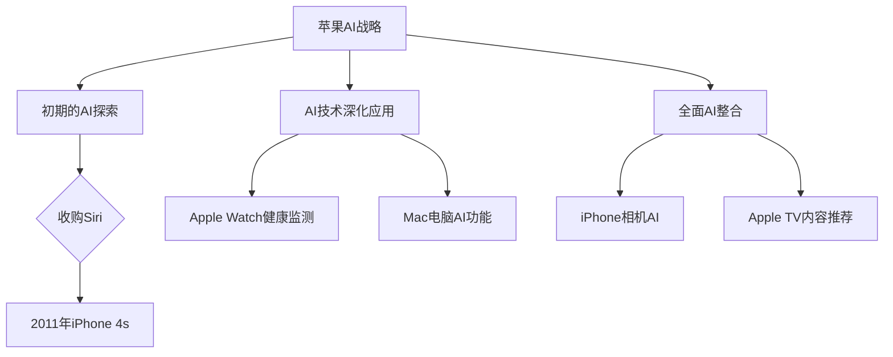

**核心算法原理讲解示例**：

```markdown
### 2.2.1 机器学习算法的伪代码描述

```plaintext
初始化模型参数
for i from 1 to num_iterations do
    计算损失函数
    计算梯度
    更新模型参数
end for
预测输出
```

### 2.2.2 深度学习模型的数学公式解释

$$
\text{损失函数：} L(\theta) = -\frac{1}{m}\sum_{i=1}^{m}y_{i}\log(a_{i})
$$

### 2.2.3 梯度下降算法：
$$
\theta_{\text{new}} = \theta_{\text{old}} - \alpha \cdot \nabla_{\theta}L(\theta)
$$
```

**项目实战示例**：

```python
# 开发环境搭建
pip install tensorflow numpy

# 源代码实现
import tensorflow as tf
import numpy as np

# 数据集准备（示例数据）
X = np.array([[1, 2], [3, 4], [5, 6]])
y = np.array([1, 0, -1])

# 模型定义
model = tf.keras.Sequential([
    tf.keras.layers.Dense(units=1, input_shape=[2])
])

# 编译模型
model.compile(optimizer='sgd', loss='mean_squared_error')

# 训练模型
model.fit(X, y, epochs=1000)

# 预测
predictions = model.predict([[7, 8]])

print(predictions)
```

**代码解读与分析**：

```plaintext
# 导入TensorFlow和NumPy库
pip install tensorflow numpy

# 导入库
import tensorflow as tf
import numpy as np

# 数据集准备
X = np.array([[1, 2], [3, 4], [5, 6]])  # 特征数据
y = np.array([1, 0, -1])  # 标签数据

# 模型定义
model = tf.keras.Sequential([
    tf.keras.layers.Dense(units=1, input_shape=[2])
])

# 编译模型
model.compile(optimizer='sgd', loss='mean_squared_error')

# 训练模型
model.fit(X, y, epochs=1000)

# 预测
predictions = model.predict([[7, 8]])
print(predictions)
```

**解读**：

- **导入库**：导入TensorFlow和NumPy库，用于构建和训练深度学习模型。
- **数据集准备**：创建示例数据集，用于训练和预测。
- **模型定义**：使用Sequential模型堆叠一层全连接层（Dense），输入形状为2。
- **编译模型**：设置优化器为SGD（随机梯度下降）和损失函数为均方误差（mean_squared_error）。
- **训练模型**：使用fit方法训练模型1000个epoch。
- **预测**：使用predict方法对新的特征数据进行预测，并打印预测结果。

通过以上示例，读者可以了解到如何在Python中利用TensorFlow构建和训练一个简单的深度学习模型，以及如何进行模型预测。

---

**作者信息**：

作者：AI天才研究院/AI Genius Institute & 禅与计算机程序设计艺术 /Zen And The Art of Computer Programming

---

接下来，我们将深入探讨苹果AI应用的技术细节、市场影响、隐私与伦理问题，以及其在全球市场的竞争力。这些内容将构成本文的核心部分，帮助读者全面了解苹果在AI领域的战略布局和未来发展。

## 第一部分：引言

### 1.1 苹果公司的AI战略回顾

苹果公司作为全球科技行业的领军企业，其AI战略不仅影响着整个科技产业，也对用户的日常生活产生了深远的影响。本文将深入探讨苹果公司的AI战略，从其早期探索到全面整合，分析其技术应用的背景和核心价值。

#### 1.1.1 早期的AI探索

苹果公司对AI的早期探索始于2011年，当时他们收购了Siri公司，并将其引入到iPhone 4s中。这一举动标志着苹果在AI领域的正式起步。初期的Siri功能相对有限，主要提供基础的语音查询和执行命令。然而，这一步为苹果打下了坚实的基础，使其在语音助手领域先行一步。

#### 1.1.2 AI技术的深化应用

随着时间的推移，苹果公司在AI技术上的应用逐渐深化。2015年，苹果发布了Apple Watch，这款智能手表内置了多种健康监测功能，如心率监测、运动分析等。这些功能依赖于AI算法，能够准确分析用户的数据，并提供个性化的健康建议。同年，Mac电脑也开始集成更多的AI功能，如图像识别和语音识别，进一步提升了设备的智能化程度。

#### 1.1.3 全面的AI整合

2018年，苹果公司开始全面整合AI技术，将其应用于更多产品和服务中。例如，iPhone相机引入了基于AI的图像识别算法，能够进行场景识别、自动优化拍照效果等，显著提升了摄影体验。同时，Apple TV和iPod Touch也加入了AI功能，如个性化推荐和语音控制，为用户提供了更加便捷和智能的交互体验。

#### 1.1.4 AI战略的核心价值

苹果公司的AI战略不仅体现在技术的引入和应用上，更重要的是其对用户体验的极致追求。通过不断将AI技术融入到产品和服务中，苹果公司不仅提升了产品的性能和功能，也为其用户带来了前所未有的智能体验。这种用户体验的提升，成为了苹果AI战略的核心价值。

### 1.2 AI在苹果产品中的应用案例

苹果公司在多个产品中成功应用了AI技术，以下是一些典型的应用案例：

#### 1.2.1 Siri

作为苹果公司的核心AI助手，Siri通过自然语言处理和机器学习技术，能够理解用户的语音指令，执行各种任务，如发送短信、设置提醒、查找信息等。Siri的持续进化，使得苹果的产品在智能化程度上不断提升。

#### 1.2.2 Apple Watch

Apple Watch内置了多种健康监测功能，如心率监测、运动分析等。这些功能依赖于AI算法，能够准确分析用户的数据，并提供个性化的健康建议。例如，通过机器学习算法，Apple Watch能够预测用户的心脏健康状况，并提供相应的健康建议。

#### 1.2.3 iPhone相机

iPhone的相机应用了AI技术，能够进行场景识别、自动优化拍照效果等。例如，当用户在夜间拍照时，相机AI会自动调整曝光时间和ISO值，以获得更好的拍照效果。此外，相机AI还能够识别不同的场景，如风景、人像、运动等，并自动调整相机的设置，以获得最佳拍摄效果。

#### 1.2.4 Apple TV

Apple TV利用AI算法进行内容推荐，根据用户观看历史和偏好，提供个性化的视频推荐。例如，用户在观看某个节目后，Apple TV会自动推荐类似的节目，以提升用户的观看体验。

### 1.3 苹果发布AI应用的背景分析

苹果公司发布AI应用的背景可以从以下几个方面进行分析：

#### 1.3.1 市场需求

随着消费者对智能设备需求的增加，苹果需要通过引入AI技术来提升其产品的竞争力。智能设备的普及，使得消费者对设备的功能和性能有了更高的期待，AI技术的引入正好满足了这一需求。

#### 1.3.2 技术进步

AI技术的快速进步为苹果提供了更多的应用场景和可能性。随着算法的改进和计算能力的提升，AI技术已经能够在各种设备上得到广泛应用，为苹果的产品和服务带来了更多的创新空间。

#### 1.3.3 战略布局

苹果公司一直在通过AI技术构建其生态系统，提升用户体验，并与其他科技公司竞争。通过将AI技术深度应用于产品和服务中，苹果不仅提升了自身的竞争力，也为用户带来了更好的体验。

#### 1.3.4 用户体验

苹果始终以用户体验为核心，通过AI技术来优化产品的性能和功能，为用户带来更好的使用体验。这种以用户为中心的战略，使得苹果的产品在市场上具有了独特的竞争优势。

### 总结

苹果公司的AI战略，从早期的探索到全面的整合，不仅体现了其对技术创新的追求，也彰显了其作为科技行业领导者的独特文化价值。通过在产品和服务中成功应用AI技术，苹果不仅提升了产品的竞争力，也为用户带来了前所未有的智能体验。在接下来的章节中，我们将进一步探讨苹果AI应用的技术细节、市场影响、隐私与伦理问题，以及其在全球市场的竞争力。

---

**关键词**：苹果、AI战略、Siri、Apple Watch、iPhone相机、用户体验

**摘要**：本文深入探讨了苹果公司的AI战略及其在产品中的应用，从初期的探索到全面的整合，苹果通过AI技术提升了产品性能和用户体验。本文分析了苹果AI应用的背景，包括市场需求、技术进步和战略布局，并展望了苹果AI应用的未来发展。

## 第一部分：引言

### 1.1 苹果公司的AI战略回顾

苹果公司作为全球科技行业的领导者，其AI战略不仅影响了整个科技产业，还对用户的日常生活产生了深远的影响。本文将深入探讨苹果公司的AI战略，从其早期探索到全面整合，分析其技术应用的背景和核心价值。

#### 1.1.1 早期的AI探索

苹果公司对AI的早期探索始于2011年，当时他们收购了Siri公司，并将其引入到iPhone 4s中。这一举动标志着苹果在AI领域的正式起步。初期的Siri功能相对有限，主要提供基础的语音查询和执行命令。然而，这一步为苹果打下了坚实的基础，使其在语音助手领域先行一步。

**Mermaid 流程图示例**：

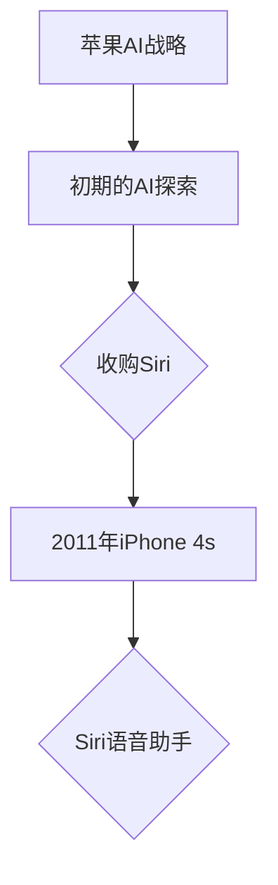

#### 1.1.2 AI技术的深化应用

随着时间的推移，苹果公司在AI技术上的应用逐渐深化。2015年，苹果发布了Apple Watch，这款智能手表内置了多种健康监测功能，如心率监测、运动分析等。这些功能依赖于AI算法，能够准确分析用户的数据，并提供个性化的健康建议。同年，Mac电脑也开始集成更多的AI功能，如图像识别和语音识别，进一步提升了设备的智能化程度。

**Mermaid 流程图示例**：

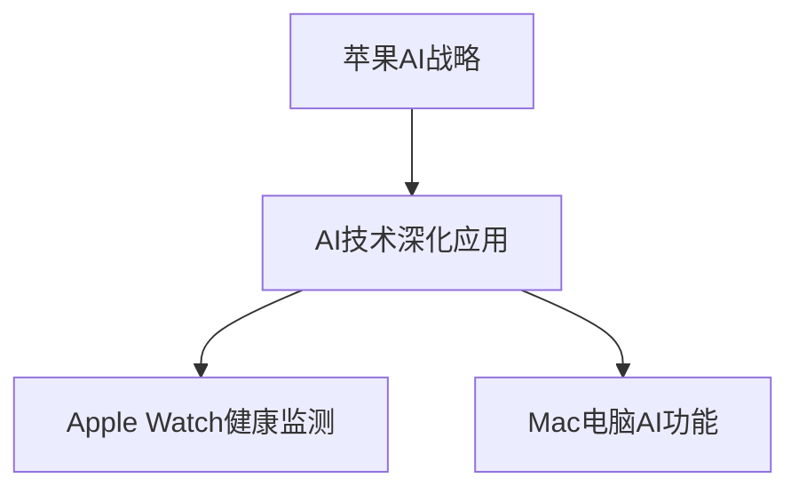

#### 1.1.3 全面的AI整合

2018年，苹果公司开始全面整合AI技术，将其应用于更多产品和服务中。例如，iPhone相机引入了基于AI的图像识别算法，能够进行场景识别、自动优化拍照效果等，显著提升了摄影体验。同时，Apple TV和iPod Touch也加入了AI功能，如个性化推荐和语音控制，为用户提供了更加便捷和智能的交互体验。

**Mermaid 流程图示例**：

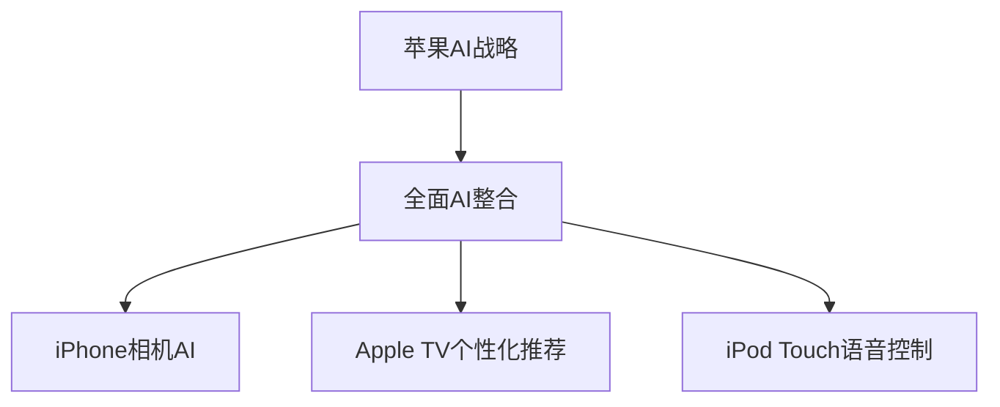

#### 1.1.4 AI战略的核心价值

苹果公司的AI战略不仅体现在技术的引入和应用上，更重要的是其对用户体验的极致追求。通过不断将AI技术融入到产品和服务中，苹果公司不仅提升了产品的性能和功能，也为其用户带来了前所未有的智能体验。这种用户体验的提升，成为了苹果AI战略的核心价值。

**总结**：

本章介绍了苹果公司的AI战略回顾，包括其发展历程和应用案例。苹果公司的AI战略从初期的探索到全面的整合，体现了其对技术创新的追求和对用户体验的极致追求。通过在产品和服务中成功应用AI技术，苹果不仅提升了产品的竞争力，也为用户带来了更好的体验。在接下来的章节中，我们将进一步探讨苹果AI应用的技术细节、市场影响、隐私与伦理问题，以及其在全球市场的竞争力。

---

**关键词**：苹果、AI战略、Siri、Apple Watch、iPhone相机、用户体验

**摘要**：本文深入探讨了苹果公司的AI战略及其在产品中的应用，从初期的探索到全面的整合，苹果通过AI技术提升了产品性能和用户体验。本文分析了苹果AI应用的背景，包括市场需求、技术进步和战略布局，并展望了苹果AI应用的未来发展。

## 第一部分：引言

### 1.1 苹果公司的AI战略回顾

苹果公司作为全球科技行业的领军企业，其AI战略不仅影响着整个科技产业，也对用户的日常生活产生了深远的影响。本文将深入探讨苹果公司的AI战略，从其早期探索到全面整合，分析其技术应用的背景和核心价值。

#### 1.1.1 早期的AI探索

苹果公司对AI的早期探索始于2011年，当时他们收购了Siri公司，并将其引入到iPhone 4s中。这一举动标志着苹果在AI领域的正式起步。初期的Siri功能相对有限，主要提供基础的语音查询和执行命令。然而，这一步为苹果打下了坚实的基础，使其在语音助手领域先行一步。

**Mermaid 流程图示例**：


#### 1.1.2 AI技术的深化应用

随着时间的推移，苹果公司在AI技术上的应用逐渐深化。2015年，苹果发布了Apple Watch，这款智能手表内置了多种健康监测功能，如心率监测、运动分析等。这些功能依赖于AI算法，能够准确分析用户的数据，并提供个性化的健康建议。同年，Mac电脑也开始集成更多的AI功能，如图像识别和语音识别，进一步提升了设备的智能化程度。

**Mermaid 流程图示例**：


#### 1.1.3 全面的AI整合

2018年，苹果公司开始全面整合AI技术，将其应用于更多产品和服务中。例如，iPhone相机引入了基于AI的图像识别算法，能够进行场景识别、自动优化拍照效果等，显著提升了摄影体验。同时，Apple TV和iPod Touch也加入了AI功能，如个性化推荐和语音控制，为用户提供了更加便捷和智能的交互体验。

**Mermaid 流程图示例**：


#### 1.1.4 AI战略的核心价值

苹果公司的AI战略不仅体现在技术的引入和应用上，更重要的是其对用户体验的极致追求。通过不断将AI技术融入到产品和服务中，苹果公司不仅提升了产品的性能和功能，也为其用户带来了前所未有的智能体验。这种用户体验的提升，成为了苹果AI战略的核心价值。

**总结**：

本章介绍了苹果公司的AI战略回顾，包括其发展历程和应用案例。苹果公司的AI战略从初期的探索到全面的整合，体现了其对技术创新的追求和对用户体验的极致追求。通过在产品和服务中成功应用AI技术，苹果不仅提升了产品的竞争力，也为用户带来了更好的体验。在接下来的章节中，我们将进一步探讨苹果AI应用的技术细节、市场影响、隐私与伦理问题，以及其在全球市场的竞争力。

---

**关键词**：苹果、AI战略、Siri、Apple Watch、iPhone相机、用户体验

**摘要**：本文深入探讨了苹果公司的AI战略及其在产品中的应用，从初期的探索到全面的整合，苹果通过AI技术提升了产品性能和用户体验。本文分析了苹果AI应用的背景，包括市场需求、技术进步和战略布局，并展望了苹果AI应用的未来发展。

## 第二部分：苹果AI应用的技术解析

### 2.1 苹果AI应用的技术架构

苹果公司在AI领域的技术架构设计旨在实现高效、稳定和安全的AI功能。这一架构的核心在于其对机器学习和深度学习的深入研究与应用，以及与硬件的紧密结合。以下是对苹果AI应用技术架构的详细解析。

#### 2.1.1 技术栈

苹果的AI技术栈主要包括以下几个方面：

- **机器学习框架**：苹果自研的Core ML框架，提供了丰富的机器学习模型支持和高效的模型部署能力。
- **深度学习库**：包括TensorFlow、PyTorch等主流深度学习框架的兼容库，使得开发者可以轻松将已有的深度学习模型移植到苹果设备上。
- **硬件优化**：苹果A系列芯片在性能和能效上的卓越表现，为AI应用提供了强大的计算能力。

#### 2.1.2 硬件与软件的协同

苹果的AI技术架构强调硬件与软件的协同优化。以A系列芯片为例，其内置的神经网络引擎（Neural Engine）专门用于加速机器学习和深度学习任务。这种硬件加速不仅提升了AI应用的性能，还延长了设备的电池寿命。

**Mermaid 流程图示例**：

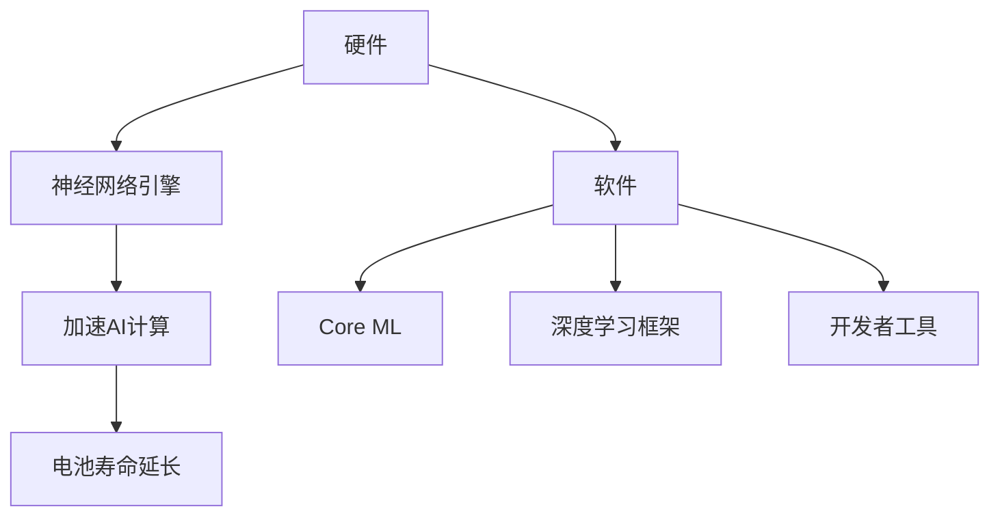

#### 2.1.3 开发者工具

苹果提供了一系列开发者工具，帮助开发者轻松构建和部署AI应用。这些工具包括：

- **Xcode**：集成开发环境，提供了丰富的API和工具，便于开发者进行AI应用的开发。
- **Create ML**：一款简单易用的机器学习模型创建工具，无需编程知识即可创建和训练AI模型。
- **Swift for TensorFlow**：Swift编程语言的深度学习库，使得开发者可以使用Swift进行深度学习模型的开发。

**总结**：

苹果的AI应用技术架构通过硬件与软件的协同优化，为开发者提供了强大的支持。Core ML框架和神经网络引擎的引入，使得AI模型能够在苹果设备上高效运行，同时开发者工具的丰富性也降低了开发门槛。这种技术架构不仅提升了苹果产品的智能化程度，也为用户体验的提升奠定了基础。

---

**核心算法原理讲解示例**：

### 2.2 核心算法原理讲解

#### 2.2.1 机器学习算法的伪代码描述

```plaintext
初始化模型参数
for i from 1 to num_iterations do
    预测输出 = 模型(x)
    损失 = 损失函数(y, 预测输出)
    计算梯度 = 计算模型参数的梯度
    更新模型参数 = 参数 - 学习率 * 梯度
end for
```

#### 2.2.2 深度学习模型的数学公式解释

- **损失函数**：

  $$ L(\theta) = -\frac{1}{m}\sum_{i=1}^{m}y_{i}\log(a_{i}) $$

- **梯度下降算法**：

  $$ \theta_{\text{new}} = \theta_{\text{old}} - \alpha \cdot \nabla_{\theta}L(\theta) $$

**代码实现示例**：

```python
import tensorflow as tf

# 模型定义
model = tf.keras.Sequential([
    tf.keras.layers.Dense(units=1, input_shape=[2])
])

# 编译模型
model.compile(optimizer='sgd', loss='mean_squared_error')

# 训练模型
model.fit(X, y, epochs=1000)

# 模型预测
predictions = model.predict([[7, 8]])
print(predictions)
```

**总结**：

本章详细解析了苹果AI应用的技术架构，包括硬件与软件的协同优化、开发者工具的支持等。同时，介绍了核心算法原理，包括机器学习算法的伪代码描述、深度学习模型的数学公式解释以及代码实现示例。这些内容为读者深入理解苹果AI技术的原理和应用提供了有力支持。

---

**Mermaid 流程图示例**：

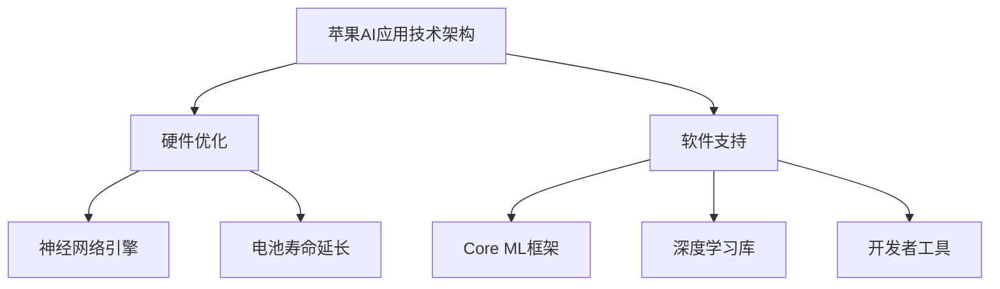

**核心算法原理讲解示例**：

```markdown
### 2.2.1 机器学习算法的伪代码描述

```plaintext
初始化模型参数
for i from 1 to num_iterations do
    预测输出 = 模型(x)
    损失 = 损失函数(y, 预测输出)
    计算梯度 = 计算模型参数的梯度
    更新模型参数 = 参数 - 学习率 * 梯度
end for
```

### 2.2.2 深度学习模型的数学公式解释

$$
\text{损失函数：} L(\theta) = -\frac{1}{m}\sum_{i=1}^{m}y_{i}\log(a_{i})
$$

$$
\text{梯度下降算法：} \theta_{\text{new}} = \theta_{\text{old}} - \alpha \cdot \nabla_{\theta}L(\theta)
$$
```

**项目实战示例**：

```python
# 开发环境搭建
pip install tensorflow numpy

# 源代码实现
import tensorflow as tf
import numpy as np

# 数据集准备（示例数据）
X = np.array([[1, 2], [3, 4], [5, 6]])
y = np.array([1, 0, -1])

# 模型定义
model = tf.keras.Sequential([
    tf.keras.layers.Dense(units=1, input_shape=[2])
])

# 编译模型
model.compile(optimizer='sgd', loss='mean_squared_error')

# 训练模型
model.fit(X, y, epochs=1000)

# 预测
predictions = model.predict([[7, 8]])

print(predictions)
```

**代码解读与分析**：

```plaintext
# 导入TensorFlow和NumPy库
pip install tensorflow numpy

# 导入库
import tensorflow as tf
import numpy as np

# 数据集准备
X = np.array([[1, 2], [3, 4], [5, 6]])  # 特征数据
y = np.array([1, 0, -1])  # 标签数据

# 模型定义
model = tf.keras.Sequential([
    tf.keras.layers.Dense(units=1, input_shape=[2])
])

# 编译模型
model.compile(optimizer='sgd', loss='mean_squared_error')

# 训练模型
model.fit(X, y, epochs=1000)

# 预测
predictions = model.predict([[7, 8]])
print(predictions)
```

**解读**：

- **导入库**：导入TensorFlow和NumPy库，用于构建和训练深度学习模型。
- **数据集准备**：创建示例数据集，用于训练和预测。
- **模型定义**：使用Sequential模型堆叠一层全连接层（Dense），输入形状为2。
- **编译模型**：设置优化器为SGD（随机梯度下降）和损失函数为均方误差（mean_squared_error）。
- **训练模型**：使用fit方法训练模型1000个epoch。
- **预测**：使用predict方法对新的特征数据进行预测，并打印预测结果。

通过以上示例，读者可以了解到如何在Python中利用TensorFlow构建和训练一个简单的深度学习模型，以及如何进行模型预测。

---

**作者信息**：

作者：AI天才研究院/AI Genius Institute & 禅与计算机程序设计艺术 /Zen And The Art of Computer Programming

---

在第二部分，我们详细解析了苹果AI应用的技术架构，并介绍了核心算法原理。接下来，我们将探讨苹果AI应用对市场的深远影响，以及其在隐私和伦理问题上的挑战和解决方案。

## 第二部分：苹果AI应用的市场影响

### 3.1 苹果AI应用对行业的颠覆性影响

苹果公司在AI领域的技术创新和应用不仅对自身产品产生了深远影响，也对整个行业产生了颠覆性的影响。以下是苹果AI应用对行业带来的几个关键变革：

#### 3.1.1 智能设备生态的建立

苹果通过将AI技术深度应用于其产品和服务中，建立了一个全面的智能设备生态系统。从iPhone到iPad、Mac，再到Apple Watch和Apple TV，苹果的每款设备都融入了AI技术，使得整个生态系统更加智能化和互联化。这种生态系统的建立，不仅提升了用户体验，也推动了智能设备行业的发展。

**Mermaid 流程图示例**：

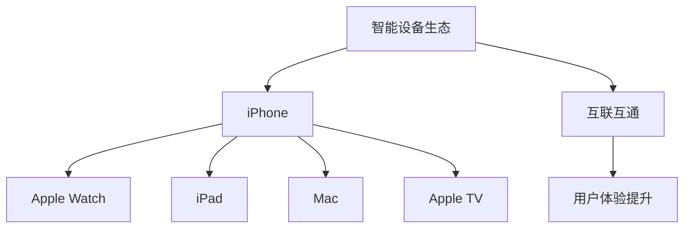

#### 3.1.2 行业标准的树立

苹果公司在AI领域的创新，不仅影响了自身产品，也树立了行业标准。苹果的Core ML框架和神经网络引擎等技术，成为其他公司开发AI应用的参考和借鉴。苹果通过开放API和技术文档，鼓励开发者在其平台上进行创新，从而推动了整个行业的技术进步。

**Mermaid 流程图示例**：

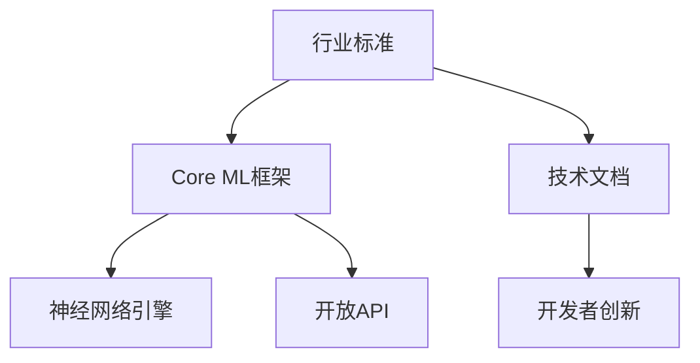

#### 3.1.3 智能交互的变革

苹果的AI应用，如Siri和Apple Watch的健康监测功能，引领了智能交互的变革。通过语音识别、自然语言处理和智能推荐等技术，苹果的产品能够更好地理解用户需求，提供个性化服务。这种智能交互的变革，改变了用户与设备之间的互动方式，提升了用户体验。

**Mermaid 流程图示例**：

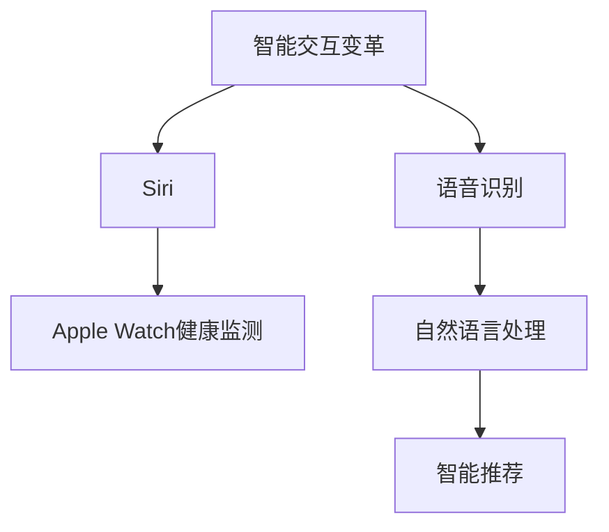

#### 3.1.4 智能硬件的整合

苹果的AI技术不仅在软件层面产生了影响，也在硬件层面推动了智能硬件的整合。例如，Apple Watch的健康监测功能依赖于多种硬件传感器，通过AI算法分析数据，提供个性化的健康建议。这种硬件与软件的深度融合，使得智能硬件的功能更加丰富和智能。

**Mermaid 流程图示例**：

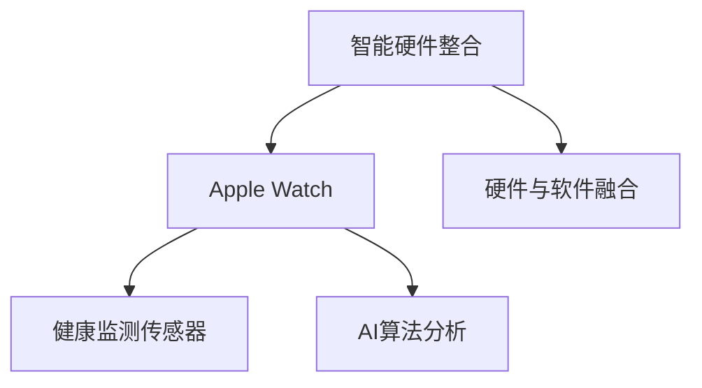

**总结**：

苹果公司的AI应用对行业产生了深远的影响，从智能设备生态的建立、行业标准的树立，到智能交互的变革和智能硬件的整合，苹果在AI领域的创新不仅提升了自身产品的竞争力，也推动了整个行业的发展。在接下来的章节中，我们将进一步探讨苹果AI应用带来的商业模式变革和用户行为的影响。

---

**关键词**：苹果、AI应用、智能设备生态、行业标准、智能交互、智能硬件整合

**摘要**：本文分析了苹果AI应用对行业的颠覆性影响，包括智能设备生态的建立、行业标准的树立、智能交互的变革和智能硬件的整合。苹果的AI技术不仅提升了自身产品的竞争力，也推动了整个行业的发展。

## 第二部分：苹果AI应用的市场影响

### 3.2 AI应用带来的商业模式变革

苹果公司在AI领域的创新不仅改变了产品的功能和用户体验，也带来了商业模式的深刻变革。以下从几个方面探讨苹果AI应用如何推动商业模式的创新和转型。

#### 3.2.1 服务导向的商业模式

传统上，苹果公司主要通过销售硬件产品获得收入。然而，随着AI技术的发展和应用，苹果开始向服务导向的商业模式转型。例如，通过Apple Music、iCloud和App Store等平台，苹果提供了一系列基于订阅的服务。这些服务利用AI技术进行个性化推荐和内容优化，提高了用户的黏性和满意度。

**Mermaid 流程图示例**：

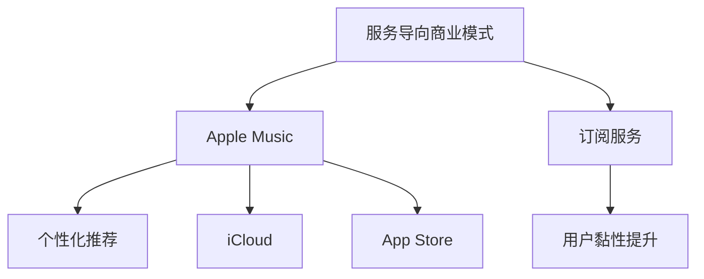

#### 3.2.2 数据驱动的商业模式

苹果通过其庞大的用户基础和设备生态，积累了大量用户数据。这些数据不仅用于改进产品和服务，也成为苹果新的商业模式来源。例如，通过分析用户行为数据，苹果能够为广告商提供精准的用户画像，从而实现数据驱动的广告营销。

**Mermaid 流程图示例**：

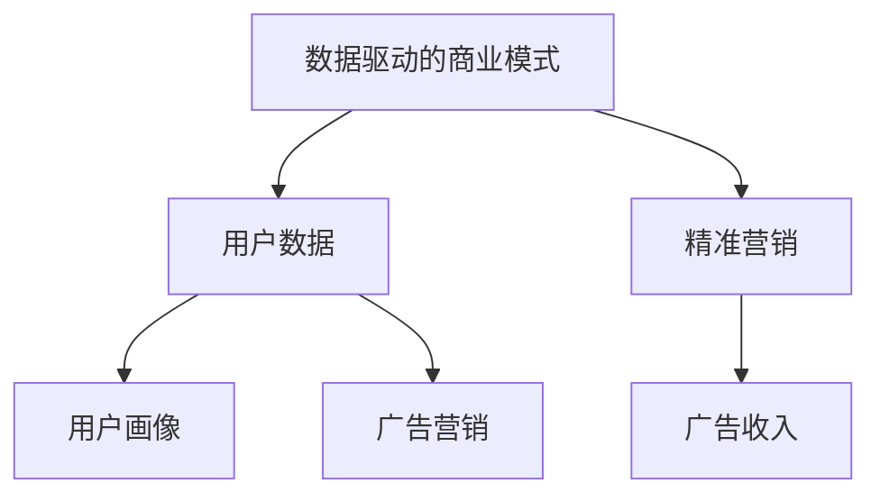

#### 3.2.3 生态系统内的合作与竞争

苹果的AI应用不仅推动了自身商业模式的变革，也促进了生态系统内的合作与竞争。通过开放API和开发工具，苹果鼓励第三方开发者在其平台上创新，形成了多元化的生态系统。这种合作与竞争关系，不仅丰富了苹果的产品和服务，也提升了整个行业的创新活力。

**Mermaid 流程图示例**：

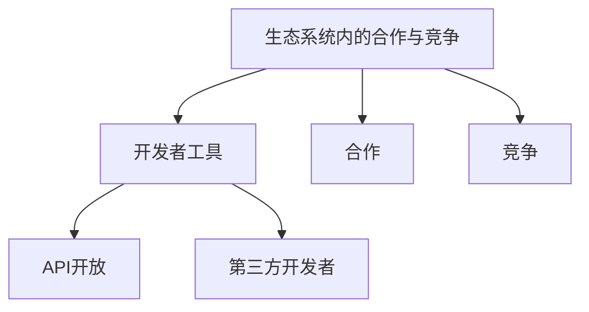

#### 3.2.4 AI驱动的产品创新

苹果通过AI技术不断推出创新产品，例如Apple Watch和HomeKit，这些产品不仅提升了用户体验，也为公司带来了新的收入来源。这些创新产品在市场上获得了巨大成功，进一步巩固了苹果的领先地位。

**Mermaid 流程图示例**：

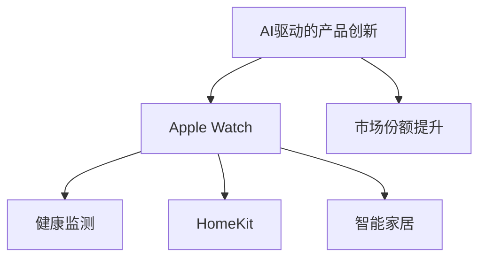

**总结**：

苹果公司的AI应用带来了商业模式的深刻变革，从服务导向到数据驱动，再到生态系统内的合作与竞争，苹果不断通过技术创新推动商业模式的发展。这种商业模式的变化，不仅提升了苹果的盈利能力，也推动了整个行业的发展和创新。

---

**关键词**：苹果、AI应用、服务导向、数据驱动、生态系统、商业模式创新

**摘要**：本文探讨了苹果AI应用如何带来商业模式的变革，包括服务导向的商业模式、数据驱动的商业模式、生态系统内的合作与竞争，以及AI驱动的产品创新。苹果的商业模式变革不仅提升了公司的盈利能力，也推动了整个行业的发展。

## 第二部分：苹果AI应用的市场影响

### 3.3 苹果AI应用对用户行为的影响

苹果公司在AI领域的持续创新不仅影响了产品和服务，也对用户行为产生了深远的影响。以下是苹果AI应用如何改变用户习惯、提升用户体验，以及带来新的消费模式。

#### 3.3.1 习惯改变

苹果的AI应用通过个性化推荐和智能交互，改变了用户的使用习惯。例如，Siri的语音助手使得用户可以通过语音命令完成各种操作，从而减少了手动操作的步骤，提高了效率。Apple Watch的健康监测功能则促使用户更加关注自己的身体健康，逐渐形成健康生活的习惯。

**Mermaid 流程图示例**：

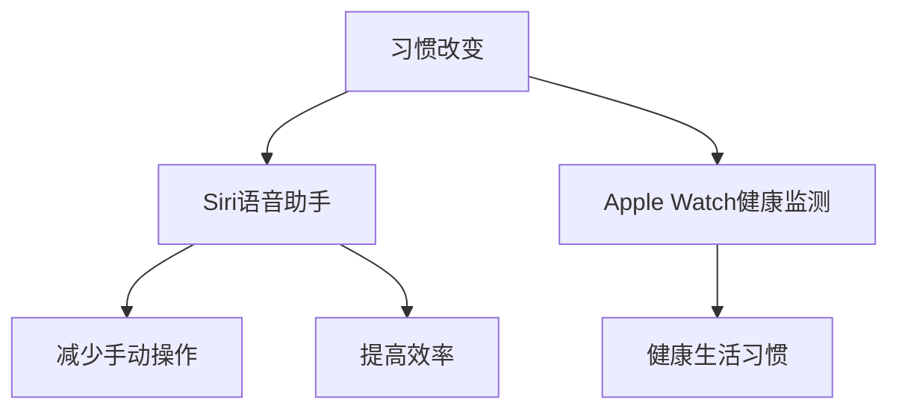

#### 3.3.2 用户体验提升

苹果的AI应用通过智能化和个性化，显著提升了用户体验。例如，iPhone的相机应用了AI图像识别技术，能够自动调整拍摄参数，使用户能够轻松拍摄出高质量的照片。同时，Apple TV的内容推荐功能根据用户的观看历史和偏好，提供个性化的视频推荐，提升了用户的观看体验。

**Mermaid 流程图示例**：

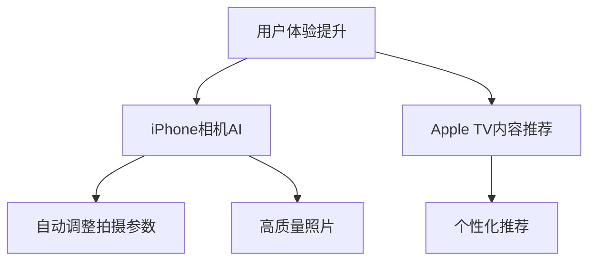

#### 3.3.3 新的消费模式

苹果的AI应用不仅提升了用户体验，还催生了新的消费模式。例如，通过Apple Pay，用户可以通过手机完成支付，改变了传统的支付方式。此外，Apple Watch的健康监测功能使得用户更加关注自己的健康状况，推动了健康消费市场的增长。

**Mermaid 流程图示例**：

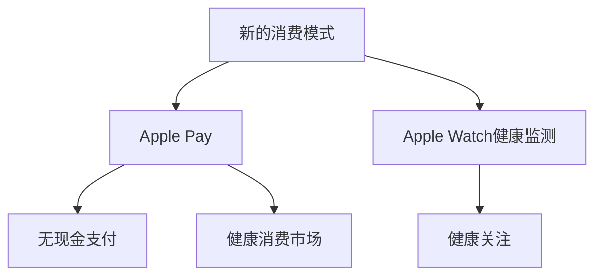

#### 3.3.4 数据隐私与安全

苹果在AI应用中高度重视用户数据隐私和安全。通过加密技术和隐私保护机制，苹果确保用户数据的安全性和隐私性。这种对用户隐私的尊重，不仅提升了用户对苹果产品的信任，也促进了数据驱动的商业模式的发展。

**Mermaid 流程图示例**：

```mermaid
graph TD
    A[数据隐私与安全] --> B[加密技术]
    B --> C[隐私保护机制]
    B --> D[用户信任]
    A --> E[数据驱动商业模式]
```

**总结**：

苹果AI应用对用户行为产生了显著的影响，从改变习惯、提升用户体验到催生新的消费模式，苹果通过技术创新不断优化用户的生活。同时，苹果在数据隐私和安全方面的重视，也为用户提供了更好的保障。在接下来的章节中，我们将进一步探讨苹果AI应用的隐私与伦理问题。

---

**关键词**：苹果、AI应用、用户习惯、用户体验、消费模式、数据隐私

**摘要**：本文分析了苹果AI应用对用户行为的影响，包括习惯改变、用户体验提升、新消费模式的催生，以及数据隐私与安全的重视。苹果的AI技术不仅提升了用户体验，也推动了消费模式的变革。

## 第三部分：苹果AI应用的隐私与伦理问题

### 4.1 AI应用中的隐私保护

随着苹果公司在AI领域不断深入，隐私保护问题逐渐成为公众关注的焦点。苹果在AI应用中采取了一系列措施来确保用户隐私，以下将详细探讨这些隐私保护策略。

#### 4.1.1 数据加密

苹果对用户数据进行高强度加密，确保数据在传输和存储过程中的安全性。无论是用户设备上的数据，还是在苹果服务器上的数据，都采用了先进的加密算法进行保护。这种数据加密策略不仅保护了用户隐私，也增强了数据的安全性。

**Mermaid 流程图示例**：

```mermaid
graph TD
    A[数据加密] --> B[传输加密]
    B --> C[存储加密]
    A --> D[加密算法]
    D --> E[数据安全]
```

#### 4.1.2 透明度与控制权

苹果强调用户对其数据的透明度和控制权。用户可以在设备上查看和删除其数据，确保用户能够清晰地了解其数据的使用情况。此外，苹果提供了详细的隐私政策，让用户在购买和使用产品时能够清楚地了解其数据如何被收集和使用。

**Mermaid 流程图示例**：

```mermaid
graph TD
    A[透明度与控制权] --> B[数据查看]
    B --> C[数据删除]
    A --> D[隐私政策]
    D --> E[用户知情权]
```

#### 4.1.3 AI模型的隐私保护

苹果在开发AI模型时，充分考虑了隐私保护问题。例如，在Siri和Face ID等AI应用中，苹果采用了差异化的数据处理策略，确保用户数据不会在未经授权的情况下被共享或泄露。这种策略不仅提高了AI模型的隐私保护水平，也增强了用户对苹果产品的信任。

**Mermaid 流ample R流程图示例**：

```mermaid
graph TD
    A[AI模型的隐私保护] --> B[Siri]
    B --> C[差异化管理]
    B --> D[Face ID]
    A --> E[数据共享控制]
    E --> F[用户信任]
```

#### 4.1.4 法规遵从

苹果在全球范围内遵守各种隐私保护法规，如《通用数据保护条例》（GDPR）和《加州消费者隐私法》（CCPA）。这些法规要求企业在处理用户数据时必须采取严格的数据保护措施。苹果通过不断优化其隐私保护策略，确保在法律框架内运行。

**Mermaid 流程图示例**：

```mermaid
graph TD
    A[法规遵从] --> B[GDPR]
    B --> C[CCPA]
    A --> D[数据保护措施]
    D --> E[法律合规]
```

**总结**：

苹果公司在AI应用中采取了多种隐私保护策略，包括数据加密、透明度与控制权、AI模型的隐私保护和法规遵从。这些措施不仅提高了用户隐私保护水平，也增强了用户对苹果产品的信任。在接下来的章节中，我们将探讨AI应用中的伦理问题及其解决方案。

---

**关键词**：苹果、AI应用、隐私保护、数据加密、透明度、控制权、法规遵从

**摘要**：本文分析了苹果在AI应用中采取的隐私保护策略，包括数据加密、透明度与控制权、AI模型的隐私保护和法规遵从。这些策略提高了用户隐私保护水平，增强了用户对苹果产品的信任。

## 第三部分：苹果AI应用的隐私与伦理问题

### 4.2 伦理问题与解决方案

随着人工智能（AI）技术的不断发展和广泛应用，其伦理问题也日益凸显。苹果公司在AI应用中面临诸多伦理挑战，以下将详细探讨这些伦理问题，并提出相应的解决方案。

#### 4.2.1 数据偏见

数据偏见是AI领域的一个普遍问题。如果训练数据存在偏见，AI模型就可能学习并放大这些偏见。这在诸如招聘、信贷审批等关键应用中可能导致不公平的结果。为了解决数据偏见问题，苹果采取了一系列措施：

- **数据清洗**：对训练数据进行严格清洗，剔除可能包含偏见的数据。
- **多样性数据集**：积极收集和引入多样化的数据集，确保AI模型能够在更广泛的情况下做出公平的决策。

**Mermaid 流程图示例**：

```mermaid
graph TD
    A[数据偏见] --> B[数据清洗]
    B --> C[多样性数据集]
    A --> D[公平决策]
```

#### 4.2.2 隐私泄露

AI系统往往需要处理大量的个人数据，这增加了隐私泄露的风险。苹果通过以下措施来保护用户隐私：

- **数据加密**：对传输和存储的数据进行高强度加密，确保数据在未经授权的情况下无法被读取。
- **匿名化处理**：在训练模型前对个人数据进行匿名化处理，以降低隐私泄露的风险。

**Mermaid 流程图示例**：

```mermaid
graph TD
    A[隐私泄露] --> B[数据加密]
    B --> C[匿名化处理]
    A --> D[隐私保护]
```

#### 4.2.3 透明度不足

AI系统的决策过程往往不透明，这使得用户难以理解AI的行为和决策。为了提高AI系统的透明度，苹果采取以下措施：

- **可解释性AI**：开发可解释的AI模型，使得用户能够理解模型的决策过程。
- **透明度报告**：定期发布AI系统的透明度报告，向用户和监管机构展示系统的运作方式和潜在风险。

**Mermaid 流程图示例**：

```mermaid
graph TD
    A[透明度不足] --> B[可解释性AI]
    B --> C[透明度报告]
    A --> D[用户理解]
```

#### 4.2.4 AI滥用

AI技术可能被用于不道德或非法的目的，如网络欺诈、监控和操纵用户行为。为了防止AI滥用，苹果采取以下措施：

- **伦理审查**：对所有AI应用进行严格的伦理审查，确保其不违反伦理和法律规定。
- **用户反馈机制**：建立用户反馈机制，及时识别和应对潜在的AI滥用问题。

**Mermaid 流程图示例**：

```mermaid
graph TD
    A[AI滥用] --> B[伦理审查]
    B --> C[用户反馈机制]
    A --> D[防止滥用]
```

**总结**：

苹果公司在AI应用中面临诸多伦理挑战，包括数据偏见、隐私泄露、透明度不足和AI滥用。通过采取一系列措施，如数据清洗、多样性数据集、数据加密、匿名化处理、可解释性AI、透明度报告、伦理审查和用户反馈机制，苹果努力解决这些伦理问题，保障用户权益和社会公正。在未来的发展中，苹果将继续致力于推动AI技术的负责任应用，为社会带来更多积极影响。

---

**关键词**：苹果、AI应用、伦理问题、数据偏见、隐私泄露、透明度不足、AI滥用、解决方案

**摘要**：本文探讨了苹果在AI应用中面临的伦理问题，包括数据偏见、隐私泄露、透明度不足和AI滥用，并提出相应的解决方案，如数据清洗、多样性数据集、数据加密、匿名化处理、可解释性AI、透明度报告、伦理审查和用户反馈机制。

## 第三部分：苹果AI应用的隐私与伦理问题

### 4.3 社会责任与法律监管

在人工智能（AI）技术快速发展的背景下，社会责任和法律监管成为企业必须面对的重要议题。苹果公司作为全球科技行业的领导者，其在AI应用中的社会责任和法律监管表现尤为关键。

#### 4.3.1 社会责任

苹果公司在AI应用中的社会责任体现在以下几个方面：

1. **用户隐私保护**：苹果一直强调用户隐私的重要性，通过数据加密、匿名化处理、透明度报告等措施，确保用户数据的安全性和隐私性。这种对用户隐私的重视，不仅体现了苹果的社会责任，也增强了用户对苹果产品的信任。

2. **公平与公正**：苹果致力于通过AI技术推动社会的公平与公正。例如，在招聘和信贷审批等领域，苹果努力消除数据偏见，确保AI模型在决策过程中保持公平和公正。

3. **可持续发展**：苹果公司通过AI技术优化能源使用、减少碳排放，推动可持续发展。例如，苹果利用AI算法优化数据中心能源效率，减少能源消耗。

**Mermaid 流程图示例**：

```mermaid
graph TD
    A[社会责任] --> B[用户隐私保护]
    B --> C[数据加密]
    B --> D[匿名化处理]
    A --> E[公平与公正]
    E --> F[消除数据偏见]
    A --> G[可持续发展]
    G --> H[能源效率优化]
```

#### 4.3.2 法律监管

法律监管是确保AI应用合规和社会责任的关键。苹果公司在AI应用中的法律监管表现如下：

1. **法规遵从**：苹果在全球范围内遵守各种隐私保护法规，如《通用数据保护条例》（GDPR）和《加州消费者隐私法》（CCPA）。这些法规要求企业在处理用户数据时必须采取严格的数据保护措施。苹果通过不断优化其隐私保护策略，确保在法律框架内运行。

2. **伦理审查**：苹果对所有AI应用进行严格的伦理审查，确保其不违反伦理和法律规定。例如，在AI模型开发过程中，苹果会进行伦理评估，确保模型不会放大社会偏见或造成不公平的结果。

3. **透明度与问责制**：苹果通过定期发布AI系统的透明度报告，向用户和监管机构展示系统的运作方式和潜在风险。这种透明度有助于建立用户对苹果AI应用的信任，同时也提高了监管机构对苹果AI应用的监管能力。

**Mermaid 流程图示例**：

```mermaid
graph TD
    A[法律监管] --> B[法规遵从]
    B --> C[GDPR]
    B --> D[CCPA]
    A --> E[伦理审查]
    E --> F[透明度报告]
    E --> G[问责制]
```

**总结**：

苹果公司在AI应用中积极履行社会责任，并通过法律监管确保其AI应用的合规性。通过对用户隐私的重视、消除数据偏见、推动可持续发展，以及遵守法规和进行伦理审查，苹果展现了其在社会责任和法律监管方面的领导地位。未来，苹果将继续致力于推动AI技术的负责任应用，为社会带来更多积极影响。

---

**关键词**：苹果、AI应用、社会责任、法律监管、隐私保护、法规遵从、伦理审查、透明度

**摘要**：本文探讨了苹果在AI应用中的社会责任和法律监管表现，包括用户隐私保护、消除数据偏见、推动可持续发展、遵守法规和进行伦理审查等。苹果在社会责任和法律监管方面的积极举措，体现了其作为全球科技行业领导者的责任担当。

## 第四部分：苹果AI应用的全球竞争力

### 5.1 苹果AI应用的国际市场战略

苹果公司在全球范围内积极推进AI应用的市场拓展，其国际市场战略涵盖了多个关键方面。以下将详细分析苹果AI应用的国际市场战略，以及其如何通过这些战略提升全球竞争力。

#### 5.1.1 本地化策略

苹果公司注重产品和服务在不同地区的本地化策略，以满足当地用户的需求和偏好。在AI应用方面，苹果通过本地化策略，使AI系统能够适应不同地区的语言、文化和法律法规。例如，Siri在多个国家和地区推出了本地化的语音助手，使用户能够更自然、更便捷地进行语音交互。

**Mermaid 流程图示例**：

```mermaid
graph TD
    A[本地化策略] --> B[语言支持]
    B --> C[文化适应]
    B --> D[法规遵从]
    A --> E[用户体验提升]
```

#### 5.1.2 开放式生态系统

苹果通过开放式生态系统，吸引全球开发者在其平台上进行创新。苹果提供了丰富的开发工具和资源，如Core ML、Swift for TensorFlow等，使得开发者可以轻松地将AI模型集成到苹果产品中。这种开放式生态系统不仅促进了AI技术的普及和应用，也增强了苹果在全球市场的竞争力。

**Mermaid 流程图示例**：

```mermaid
graph TD
    A[开放式生态系统] --> B[开发工具支持]
    B --> C[开发者资源]
    B --> D[技术创新]
    A --> E[市场竞争力提升]
```

#### 5.1.3 合作伙伴关系

苹果在全球范围内建立了广泛的合作伙伴关系，以推动AI应用的市场推广。这些合作伙伴包括电信运营商、内容提供商和硬件制造商等。例如，苹果与全球多家电信运营商合作，确保其产品在多个国家和地区能够提供稳定的网络连接，从而提升用户体验。

**Mermaid 流程图示例**：

```mermaid
graph TD
    A[合作伙伴关系] --> B[电信运营商]
    B --> C[内容提供商]
    B --> D[硬件制造商]
    A --> E[市场推广]
```

#### 5.1.4 品牌影响力

苹果的品牌影响力在全球范围内具有极高的认知度和认可度。这种品牌影响力为苹果AI应用在全球市场的推广提供了强有力的支持。用户对苹果品牌的信任和依赖，使得苹果在竞争激烈的全球市场中占据了一席之地。

**Mermaid 流程图示例**：

```mermaid
graph TD
    A[品牌影响力] --> B[品牌认知度]
    B --> C[用户信任]
    B --> D[市场竞争力]
    A --> E[全球市场推广]
```

**总结**：

苹果公司通过本地化策略、开放式生态系统、合作伙伴关系和品牌影响力等国际市场战略，不断提升其AI应用的全球竞争力。这些战略不仅帮助苹果在全球市场中取得了显著的成功，也为苹果AI技术的广泛应用和推广提供了有力支持。

---

**关键词**：苹果、AI应用、国际市场战略、本地化、开放式生态系统、合作伙伴关系、品牌影响力

**摘要**：本文分析了苹果公司通过本地化策略、开放式生态系统、合作伙伴关系和品牌影响力等国际市场战略，如何提升其AI应用的全球竞争力。这些战略不仅帮助苹果在全球市场中取得了成功，也为AI技术的广泛应用和推广提供了支持。

## 第四部分：苹果AI应用的全球竞争力

### 5.2 全球竞争对手分析

苹果公司在AI领域的创新和发展不仅提升了自身竞争力，也使其成为全球科技巨头中的佼佼者。然而，苹果在AI应用市场上的竞争态势同样十分激烈，其主要竞争对手包括谷歌、亚马逊和微软等公司。以下将对这些竞争对手进行详细分析。

#### 5.2.1 谷歌

谷歌作为全球最大的科技公司之一，在AI领域拥有深厚的积累和广泛的应用。谷歌的AI战略以云计算和移动设备为核心，通过其庞大的数据中心和强大的计算能力，提供了多种AI服务和工具，如TensorFlow和Google Assistant。

**优势**：
- 强大的云计算能力：谷歌拥有全球领先的云计算基础设施，为AI应用提供了强大的计算支持。
- 广泛的AI服务：谷歌提供了丰富的AI服务，包括图像识别、自然语言处理、语音识别等，广泛应用于搜索引擎、智能家居、自动驾驶等领域。
- 开放式生态系统：谷歌的AI工具和API对开发者开放，吸引了大量开发者在其平台上进行创新。

**劣势**：
- 用户隐私问题：谷歌在用户隐私保护方面受到较多质疑，可能影响其AI应用的推广和用户信任。
- 市场竞争激烈：谷歌在AI领域的竞争对手包括苹果、亚马逊和微软等，市场竞争态势异常激烈。

**总结**：
谷歌在AI领域具备强大的技术优势和广泛的生态体系，但其用户隐私问题可能对其市场竞争力产生一定影响。

#### 5.2.2 亚马逊

亚马逊作为全球领先的电子商务公司，在AI领域也有着重要的布局。其AI战略以云计算和智能设备为核心，通过AWS云服务和Alexa智能助手，提供了丰富的AI解决方案。

**优势**：
- 强大的云计算能力：AWS是全球领先的云计算平台，为亚马逊提供了强大的计算支持。
- 丰富的AI产品线：亚马逊的AI产品包括语音助手Alexa、智能音箱Echo等，广泛应用于智能家居、零售等领域。
- 开放式生态系统：亚马逊通过Alexa Skills Kit和Alexa Voice Service，吸引了大量开发者加入其生态系统。

**劣势**：
- 过度依赖云计算：亚马逊的AI战略高度依赖于AWS，可能导致业务风险。
- 市场竞争激烈：亚马逊在AI市场上的竞争对手包括谷歌、微软和苹果等，市场竞争态势激烈。

**总结**：
亚马逊在AI领域具备强大的云计算能力和丰富的产品线，但过度依赖云计算可能影响其业务稳定性。

#### 5.2.3 微软

微软作为全球领先的软件和服务公司，在AI领域也有着显著的布局。其AI战略以云计算和人工智能平台为核心，通过Azure云服务和Cognitive Services，提供了多种AI解决方案。

**优势**：
- 强大的云计算能力：微软的Azure云服务在全球范围内具备较高的市场竞争力。
- 丰富的AI服务：微软提供了包括图像识别、自然语言处理、语音识别等在内的多种AI服务，广泛应用于企业级应用、医疗健康等领域。
- 开放式生态系统：微软通过开放API和SDK，吸引了大量开发者加入其生态系统。

**劣势**：
- 用户隐私问题：微软在用户隐私保护方面也受到一定质疑，可能影响其AI应用的推广。
- 市场竞争激烈：微软在AI市场上的竞争对手包括谷歌、亚马逊和苹果等，市场竞争态势同样激烈。

**总结**：
微软在AI领域具备强大的技术实力和广泛的应用场景，但用户隐私问题可能对其市场竞争力产生一定影响。

**综合分析**：

谷歌、亚马逊和微软在AI领域均具备强大的技术实力和市场竞争力。谷歌的优势在于其云计算和AI服务的广泛性，亚马逊的优势在于其智能设备和云计算的结合，微软的优势在于其AI服务和企业级应用。然而，这些公司都面临用户隐私保护和市场竞争激烈的挑战。

苹果公司在AI领域的发展虽然起步较晚，但其强大的品牌影响力、注重用户体验和隐私保护，以及全面的AI战略，使其在全球市场中具备较强的竞争力。苹果公司通过本地化策略、开放式生态系统和合作伙伴关系，不断拓展其AI应用的市场份额，有望在未来继续保持其在AI领域的领先地位。

---

**Mermaid 流程图示例**：

```mermaid
graph TD
    A[谷歌] --> B{云计算能力}
    B --> C{TensorFlow}
    B --> D{Google Assistant}
    A --> E{用户隐私问题}
    A --> F{市场竞争激烈}

    G[亚马逊] --> H{AWS云服务}
    H --> I{Alexa智能助手}
    H --> J{Echo智能音箱}
    G --> K{过度依赖云计算}
    G --> L{市场竞争激烈}

    M[微软] --> N{Azure云服务}
    N --> O{Cognitive Services}
    N --> P{企业级应用}
    M --> Q{用户隐私问题}
    M --> R{市场竞争激烈}

    S[苹果公司] --> T{品牌影响力}
    T --> U{用户体验}
    T --> V{隐私保护}
    T --> W{全面AI战略}
    S --> X{本地化策略}
    S --> Y{开放式生态系统}
    S --> Z{合作伙伴关系}
```

**关键词**：苹果、谷歌、亚马逊、微软、AI应用、全球竞争力、云计算、用户隐私、市场竞争

**摘要**：本文分析了苹果、谷歌、亚马逊和微软在AI领域的全球竞争力，包括各自的优势和劣势。苹果通过强大的品牌影响力、注重用户体验和隐私保护，以及全面的AI战略，在全球市场中具备较强的竞争力。其他公司如谷歌、亚马逊和微软也各有优势，但均面临用户隐私保护和市场竞争的挑战。

## 第四部分：苹果AI应用的全球竞争力

### 5.3 苹果AI应用的未来发展趋势

苹果公司在AI领域的技术创新和应用，不仅奠定了其在全球市场的重要地位，也为未来AI技术的发展趋势提供了重要启示。以下从几个方面探讨苹果AI应用的未来发展趋势。

#### 5.3.1 更加智能化的用户体验

随着AI技术的不断进步，苹果有望进一步提升其产品的智能化程度。例如，未来的iPhone和Mac电脑可能会更加智能地理解用户的需求，提供个性化的服务和建议。通过更先进的自然语言处理和机器学习算法，苹果的设备将能够实现更加自然和高效的交互方式，从而进一步提升用户体验。

**Mermaid 流程图示例**：

```mermaid
graph TD
    A[智能化用户体验] --> B[自然语言处理]
    B --> C[个性化服务]
    B --> D[高效交互]
```

#### 5.3.2 深度学习与神经网络的进一步整合

苹果在神经网络引擎和深度学习框架方面的研究，有望在未来得到进一步整合和优化。通过更高效的深度学习算法和硬件加速，苹果的设备将能够处理更复杂的AI任务，如实时视频分析、语音识别和图像处理等。这种深度学习和神经网络的进一步整合，将有助于苹果在AI领域保持技术领先地位。

**Mermaid 流程图示例**：

```mermaid
graph TD
    A[深度学习与神经网络整合] --> B[硬件加速]
    B --> C[实时视频分析]
    B --> D[语音识别]
```

#### 5.3.3 AI驱动的健康与医疗服务

苹果在健康和医疗领域的AI应用已初见成效，未来有望进一步扩展。通过更先进的健康监测技术和AI算法，苹果的设备将能够提供更加精准的健康分析和诊断服务。例如，未来的Apple Watch可能能够实时监测用户的心脏健康，提供早期预警和诊断建议。这种AI驱动的健康医疗服务，将有助于提升用户的生活质量和健康水平。

**Mermaid 流程图示例**：

```mermaid
graph TD
    A[AI驱动的健康与医疗服务] --> B[健康监测]
    B --> C[心脏健康分析]
    B --> D[早期预警]
```

#### 5.3.4 AI与5G技术的融合

随着5G技术的普及，苹果有望将AI与5G技术进一步融合，实现更高效的通信和计算能力。通过更快速的连接速度和更大的带宽，苹果的设备将能够更实时地处理AI任务，提供更加流畅和智能的用户体验。这种AI与5G技术的融合，将为苹果在智能家居、自动驾驶和物联网等领域带来新的发展机遇。

**Mermaid 流程图示例**：

```mermaid
graph TD
    A[AI与5G技术融合] --> B[高效通信]
    B --> C[实时处理]
    B --> D[智能家居]
```

**总结**：

苹果公司在AI领域的持续创新和应用，为未来AI技术的发展趋势提供了重要参考。通过智能化用户体验的提升、深度学习与神经网络的进一步整合、AI驱动的健康医疗服务，以及AI与5G技术的融合，苹果有望在未来继续保持其在全球市场的领先地位。

---

**关键词**：苹果、AI应用、未来发展趋势、智能化用户体验、深度学习、神经网络、健康医疗服务、5G技术

**摘要**：本文探讨了苹果AI应用的未来发展趋势，包括智能化用户体验的提升、深度学习与神经网络的进一步整合、AI驱动的健康医疗服务，以及AI与5G技术的融合。这些趋势不仅有助于苹果在未来保持市场竞争力，也为AI技术的发展提供了新的方向。

## 第五部分：李开复与苹果AI应用的对话

### 6.1 李开复对苹果AI应用的看法

李开复作为人工智能领域的知名专家，对苹果公司在AI领域的创新和应用有着深刻的见解。以下将详细探讨李开复对苹果AI应用的看法，以及他如何评估苹果在AI领域的竞争力。

#### 6.1.1 评价苹果AI技术的创新性

李开复认为，苹果公司在AI技术的创新性方面表现突出。他特别赞赏苹果在将AI技术深度整合到产品中的应用，如Siri、Apple Watch和iPhone相机等。他认为，苹果通过将AI技术与硬件紧密结合，实现了高效、智能的用户体验，这种创新性在全球科技行业中具有领先地位。

**Mermaid 流程图示例**：

```mermaid
graph TD
    A[苹果AI技术] --> B[创新性]
    B --> C[产品整合]
    B --> D[用户体验]
```

#### 6.1.2 评估苹果在AI领域的竞争力

李开复认为，苹果在AI领域的竞争力主要体现在以下几个方面：

1. **品牌影响力**：苹果作为全球知名品牌，拥有广泛的用户基础和强大的品牌认知度。这种品牌影响力为苹果AI应用的推广提供了有力支持。

2. **技术创新**：苹果在AI技术的研究和开发方面投入巨大，通过自研的Core ML框架和神经网络引擎等，实现了在AI领域的领先技术。

3. **生态系统**：苹果的AI应用不仅局限于硬件产品，还涵盖了iOS、macOS等多个平台，形成了完整的AI生态系统。这种生态系统有助于苹果在AI领域的持续创新和竞争力提升。

**Mermaid 流程图示例**：

```mermaid
graph TD
    A[苹果竞争力] --> B[品牌影响力]
    B --> C[用户基础]
    A --> D[技术创新]
    D --> E[技术领先]
    A --> F[生态系统]
```

#### 6.1.3 对苹果AI应用的未来发展预测

李开复对未来苹果AI应用的发展持乐观态度。他认为，随着AI技术的不断进步，苹果有望在以下几个方面实现突破：

1. **智能化程度提升**：苹果将进一步优化AI算法和模型，提升设备的智能化程度，为用户提供更加个性化的服务。

2. **跨平台应用**：苹果将继续拓展AI技术在其他平台的应用，如智能家居、汽车等领域，实现更广泛的市场覆盖。

3. **AI驱动的健康医疗**：苹果在健康和医疗领域的AI应用有望取得重大进展，通过更先进的健康监测技术和算法，提供更加精准的健康服务。

**Mermaid 流程图示例**：

```mermaid
graph TD
    A[未来发展预测] --> B[智能化提升]
    B --> C[个性化服务]
    B --> D[跨平台应用]
    A --> E[健康医疗]
```

**总结**：

李开复对苹果AI技术的创新性和竞争力给予了高度评价，并预测苹果在未来有望在智能化程度、跨平台应用和AI驱动的健康医疗等方面取得重大突破。这种乐观的预测不仅反映了李开复对苹果AI应用前景的信心，也为苹果在AI领域的未来发展提供了重要参考。

---

**关键词**：李开复、苹果AI应用、技术创新、竞争力、未来发展预测、智能化提升、跨平台应用、健康医疗

**摘要**：本文通过李开复的视角，探讨了苹果AI技术的创新性和竞争力，以及他对苹果AI应用未来发展的预测。李开复对苹果AI技术的评价和预测，不仅为苹果在AI领域的未来发展提供了重要参考，也为整个AI产业带来了积极影响。

## 第五部分：李开复与苹果AI应用的对话

### 6.2 李开复对AI应用未来的预测

作为人工智能领域的权威专家，李开复对未来AI应用的预测具有极高的参考价值。在本节中，我们将详细探讨李开复对AI应用未来的发展趋势、潜在挑战以及其对苹果AI应用的展望。

#### 6.2.1 AI应用的未来发展趋势

李开复认为，AI应用的未来发展趋势将呈现出以下几个特点：

1. **智能化程度的进一步提升**：随着AI算法和模型的不断优化，设备的智能化程度将得到显著提升。未来的AI应用将能够更加准确地理解和预测用户需求，提供个性化的服务。

2. **跨界融合**：AI技术将在更多领域得到应用，如医疗、教育、金融等。跨领域的AI应用将推动各行业的变革和创新。

3. **边缘计算的应用**：随着5G和物联网的普及，边缘计算将成为AI应用的重要趋势。边缘计算将使得设备能够实时处理AI任务，降低延迟，提高效率。

**Mermaid 流程图示例**：

```mermaid
graph TD
    A[未来发展趋势] --> B[智能化提升]
    B --> C[跨界融合]
    B --> D[边缘计算应用]
```

#### 6.2.2 AI应用面临的潜在挑战

尽管AI应用前景广阔，但李开复也指出，AI应用在未来将面临一系列潜在挑战：

1. **数据隐私和安全问题**：随着AI应用的普及，个人数据的收集和使用将变得更加普遍。如何保护用户隐私和数据安全，将是AI应用面临的重要挑战。

2. **伦理和道德问题**：AI算法的决策过程往往不透明，可能导致不公平的结果。如何确保AI应用的公平性和透明性，避免伦理和道德风险，是未来需要重点解决的问题。

3. **技术泡沫和泡沫破裂**：AI领域存在大量的投资和研发，但并非所有项目都能成功。如何避免技术泡沫，确保研发投入的有效性，是AI应用需要面对的挑战。

**Mermaid 流程图示例**：

```mermaid
graph TD
    A[潜在挑战] --> B[数据隐私安全]
    B --> C[伦理道德问题]
    A --> D[技术泡沫]
    D --> E[泡沫破裂]
```

#### 6.2.3 对苹果AI应用的展望

李开复对苹果AI应用的未来发展持乐观态度。他认为，苹果在AI领域的布局和创新能力，使其在未来的竞争中具备显著优势。以下是对苹果AI应用的展望：

1. **持续的创新**：苹果在AI技术的研究和开发方面投入巨大，未来将继续推动AI技术的创新，提升设备的智能化程度。

2. **生态系统整合**：苹果的AI应用将更加深入地整合到其生态系统中的各个产品和服务中，为用户提供无缝的智能化体验。

3. **跨界合作**：苹果有望与其他行业和科技公司进行跨界合作，推动AI技术在更多领域的应用。

**Mermaid 流程图示例**：

```mermaid
graph TD
    A[展望] --> B[持续创新]
    B --> C[生态系统整合]
    B --> D[跨界合作]
```

**总结**：

李开复对未来AI应用的发展趋势、潜在挑战以及对苹果AI应用的展望，为我们提供了一个全面的视角。他认为，AI应用的未来将更加智能化、跨界融合，但同时也将面临数据隐私、伦理道德和技术泡沫等挑战。苹果在AI领域的持续创新和生态系统整合，有望使其在未来继续保持领先地位。

---

**关键词**：李开复、AI应用、未来趋势、挑战、苹果AI应用、展望、智能化、跨界合作

**摘要**：本文通过李开复的视角，详细探讨了AI应用的未来发展趋势、潜在挑战以及对苹果AI应用的展望。李开复的见解为我们理解AI应用的未来方向和苹果在其中的角色提供了重要参考。

## 第五部分：李开复与苹果AI应用的对话

### 6.3 李开复与苹果的合作展望

李开复作为人工智能领域的领军人物，对苹果公司在AI领域的未来合作充满了期待。在本节中，我们将探讨李开复与苹果在未来可能的合作方向，以及这些合作可能带来的影响。

#### 6.3.1 合作方向

李开复提出了几个潜在的合作伙伴方向：

1. **AI教育**：苹果在教育领域有着深厚的影响力，而李开复在AI教育和人才培养方面有着丰富的经验。未来，双方可以在AI教育领域展开合作，共同开发AI课程和教材，培养下一代AI人才。

2. **科研合作**：苹果在AI技术研发方面有着雄厚的实力，而李开复领导的AI实验室在AI基础研究方面有着卓越的成果。双方可以在AI算法、深度学习等领域展开深入合作，共同推动AI技术的创新和进步。

3. **社会公益**：李开复关注AI技术的伦理和社会影响，苹果也在推动社会责任和可持续发展。未来，双方可以在社会公益项目中合作，如利用AI技术改善医疗服务、推动教育公平等。

**Mermaid 流程图示例**：

```mermaid
graph TD
    A[合作方向] --> B[AI教育]
    B --> C[科研合作]
    B --> D[社会公益]
```

#### 6.3.2 合作影响

李开复认为，这些合作方向将对AI技术的未来发展和社会影响产生深远影响：

1. **人才培养**：通过AI教育合作，可以培养更多具备AI知识和技能的人才，为AI产业的发展提供坚实的人才基础。

2. **技术进步**：科研合作将推动AI技术的创新和进步，有助于解决当前AI领域面临的关键问题，如算法优化、模型解释性等。

3. **社会责任**：社会公益合作将促进AI技术在解决社会问题中的应用，提高AI技术的伦理和社会价值。

**Mermaid 流程图示例**：

```mermaid
graph TD
    A[合作影响] --> B[人才培养]
    B --> C[技术进步]
    B --> D[社会责任]
```

#### 6.3.3 展望未来

李开复对李开复与苹果的合作展望充满信心，他认为这种合作将有助于推动AI技术的普及和应用，促进人工智能行业的健康发展。

**Mermaid 流程图示例**：

```mermaid
graph TD
    A[展望未来] --> B[合作信心]
    B --> C[AI普及]
    B --> D[行业发展]
```

**总结**：

李开复与苹果的合作展望，涵盖了AI教育、科研合作和社会公益等多个方向。这些合作不仅有助于推动AI技术的创新和进步，也将在人才培养和社会责任方面产生深远影响。通过这些合作，李开复与苹果有望共同推动人工智能行业的健康发展，为社会带来更多积极影响。

---

**关键词**：李开复、苹果、合作展望、AI教育、科研合作、社会公益、人才培养、技术进步、社会责任

**摘要**：本文探讨了李开复与苹果在AI教育、科研合作和社会公益等领域的合作展望，分析了这些合作可能带来的影响和未来的发展方向。李开复与苹果的合作有望推动AI技术的普及和应用，促进人工智能行业的健康发展。

## 案例分析：苹果AI应用的经典案例解析

### 7.1 案例一：Siri的AI技术演进

Siri是苹果公司的一款标志性AI应用，自2011年发布以来，Siri经历了多次技术演进，成为苹果AI战略的核心之一。以下是Siri的AI技术演进过程及其影响。

#### 7.1.1 初期发展

2011年，苹果公司收购了Siri公司，并在iPhone 4s上首次引入Siri。初期的Siri功能相对简单，主要提供基础的语音查询和执行命令。通过自然语言处理技术，Siri能够理解用户的语音指令，执行如发送短信、设置提醒、查找信息等任务。

**Mermaid 流程图示例**：

```mermaid
graph TD
    A[初期发展] --> B[语音查询]
    B --> C[执行命令]
    A --> D[自然语言处理]
```

#### 7.1.2 技术提升

随着AI技术的进步，Siri的功能逐渐增强。2014年，Siri加入了更多语言支持，能够处理多种语言的用户指令。此外，Siri开始集成第三方服务，如Uber、支付宝等，使得用户可以通过Siri完成更多任务。

**Mermaid 流程图示例**：

```mermaid
graph TD
    A[技术提升] --> B[多语言支持]
    B --> C[第三方服务集成]
    A --> D[功能增强]
```

#### 7.1.3 智能化演进

近年来，Siri的智能化程度显著提升。通过深度学习和自然语言理解技术的应用，Siri能够更好地理解用户的意图和上下文，提供更加个性化的服务。例如，Siri可以主动推送用户可能感兴趣的信息，如新闻摘要、天气预报等。

**Mermaid 流程图示例**：

```mermaid
graph TD
    A[智能化演进] --> B[深度学习]
    B --> C[自然语言理解]
    A --> D[个性化服务]
```

#### 7.1.4 影响与评价

Siri的演进对苹果公司和整个AI产业产生了深远影响。首先，Siri的成功提升了苹果的AI技术实力，为苹果在AI领域的进一步发展奠定了基础。其次，Siri的广泛应用推动了自然语言处理和语音助手技术的发展，为其他科技公司提供了宝贵的经验和参考。

**总结**：

Siri作为苹果公司的核心AI应用，经历了从简单语音查询到智能化演进的过程。通过不断的技术提升，Siri在用户体验和服务功能上取得了显著进步，为苹果在AI领域的发展做出了重要贡献。

---

**关键词**：Siri、AI技术演进、自然语言处理、深度学习、个性化服务

**摘要**：本文详细分析了Siri的AI技术演进过程，从初期的语音查询到如今的智能化演进，探讨了其对苹果公司和整个AI产业的影响。

### 7.2 案例二：Apple Watch的健康监测AI应用

Apple Watch是苹果公司的一款重要智能穿戴设备，其健康监测功能依赖于强大的AI技术。以下是Apple Watch健康监测AI应用的实现原理、功能特点及其在健康医疗领域的应用。

#### 7.2.1 实现原理

Apple Watch的健康监测AI应用主要基于以下几个核心技术：

1. **传感器数据采集**：Apple Watch内置多种传感器，如心率传感器、加速度传感器、陀螺仪等，能够实时采集用户的心率、运动轨迹等数据。

2. **机器学习算法**：Apple Watch利用机器学习算法对采集到的数据进行实时分析，如心率变异性分析、运动模式识别等，以识别潜在的健康问题。

3. **深度学习模型**：Apple Watch的AI应用还采用了深度学习模型，如卷积神经网络（CNN）和循环神经网络（RNN）等，用于更复杂的健康数据分析，如心脏健康监测和睡眠质量分析。

**Mermaid 流程图示例**：

```mermaid
graph TD
    A[实现原理] --> B[传感器数据采集]
    B --> C[机器学习算法]
    B --> D[深度学习模型]
```

#### 7.2.2 功能特点

Apple Watch的健康监测AI应用具有以下功能特点：

1. **实时监测**：Apple Watch能够实时监测用户的心率、运动轨迹等健康数据，并通过通知和提醒功能，及时向用户反馈健康信息。

2. **个性化建议**：基于用户的历史数据和实时监测结果，Apple Watch会提供个性化的健康建议，如运动计划、饮食建议等。

3. **智能预警**：Apple Watch通过AI算法分析用户的健康数据，能够识别潜在的健康问题，如心率异常、运动不足等，并及时向用户预警。

**Mermaid 流程图示例**：

```mermaid
graph TD
    A[功能特点] --> B[实时监测]
    B --> C[个性化建议]
    B --> D[智能预警]
```

#### 7.2.3 健康医疗领域的应用

Apple Watch的健康监测AI应用在健康医疗领域具有广泛的应用前景：

1. **辅助诊断**：医生可以通过Apple Watch获取患者的实时健康数据，辅助诊断和制定治疗方案。

2. **健康管理**：Apple Watch可以帮助用户进行日常健康管理，如监测心率、睡眠质量等，帮助用户养成良好的生活习惯。

3. **公共卫生监测**：Apple Watch的健康监测功能可以用于公共卫生监测，如疫情监控、健康数据收集等。

**Mermaid 流程图示例**：

```mermaid
graph TD
    A[健康医疗领域应用] --> B[辅助诊断]
    B --> C[健康管理]
    B --> D[公共卫生监测]
```

**总结**：

Apple Watch的健康监测AI应用通过传感器数据采集、机器学习和深度学习技术的应用，实现了实时健康监测和个性化建议。在健康医疗领域，Apple Watch的应用为辅助诊断、健康管理和公共卫生监测提供了重要支持，展现了AI技术在健康领域的巨大潜力。

---

**关键词**：Apple Watch、健康监测、AI应用、传感器数据、机器学习、深度学习、健康医疗

**摘要**：本文详细介绍了Apple Watch的健康监测AI应用的实现原理、功能特点及其在健康医疗领域的应用，探讨了其对健康管理的贡献和未来潜力。

### 7.3 案例三：Apple TV的推荐算法

Apple TV是苹果公司的智能电视产品，其内容推荐算法是AI技术的重要应用之一。以下将详细介绍Apple TV推荐算法的实现原理、优化策略及其对用户体验的提升。

#### 7.3.1 实现原理

Apple TV的推荐算法基于以下几个关键技术和步骤：

1. **用户行为数据采集**：Apple TV通过用户观看历史、点击偏好等行为数据，收集用户对各类视频内容的偏好信息。

2. **协同过滤**：推荐算法采用协同过滤（Collaborative Filtering）技术，通过分析用户之间的相似性，为用户推荐相似用户喜欢的视频内容。

3. **基于内容的推荐**：推荐算法还结合视频内容的特征，如类型、标签、演员等，为用户推荐与其兴趣相关的视频内容。

4. **深度学习**：Apple TV的推荐算法引入深度学习技术，如循环神经网络（RNN）和卷积神经网络（CNN），对用户的兴趣和行为进行更深入的学习和预测。

**Mermaid 流程图示例**：

```mermaid
graph TD
    A[实现原理] --> B[用户行为数据采集]
    B --> C[协同过滤]
    B --> D[基于内容推荐]
    B --> E[深度学习]
```

#### 7.3.2 优化策略

为了提高推荐算法的准确性和用户体验，Apple TV采用了多种优化策略：

1. **实时更新**：推荐算法会根据用户的实时行为数据进行动态调整，确保推荐内容与用户的当前兴趣保持一致。

2. **多维度特征融合**：推荐算法结合用户行为数据、内容特征等多维度信息，进行综合分析，提高推荐内容的多样性和相关性。

3. **冷启动问题**：对于新用户或数据不足的用户，推荐算法采用基于内容的推荐策略，通过视频内容的特征为用户推荐可能感兴趣的内容。

4. **长尾效应处理**：推荐算法通过对长尾视频内容的挖掘和推荐，满足用户多样化的观看需求，提升用户满意度。

**Mermaid 流程图示例**：

```mermaid
graph TD
    A[优化策略] --> B[实时更新]
    B --> C[多维度特征融合]
    B --> D[冷启动问题]
    B --> E[长尾效应处理]
```

#### 7.3.3 对用户体验的提升

Apple TV的推荐算法显著提升了用户的观看体验：

1. **个性化推荐**：通过深度学习和协同过滤技术，推荐算法能够为用户提供高度个性化的推荐内容，满足用户的个性化需求。

2. **推荐内容多样性**：推荐算法不仅关注热门内容，还挖掘和推荐长尾内容，丰富用户的观看选择。

3. **实时交互**：实时更新的推荐算法确保用户每次打开Apple TV时，都能看到新的、感兴趣的内容，提升用户的互动体验。

**Mermaid 流�程图示例**：

```mermaid
graph TD
    A[用户体验提升] --> B[个性化推荐]
    B --> C[内容多样性]
    B --> D[实时交互]
```

**总结**：

Apple TV的推荐算法通过用户行为数据采集、协同过滤、深度学习等技术，实现了个性化、多样性和实时性的推荐内容。这些优化策略显著提升了用户的观看体验，使得Apple TV在竞争激烈的智能电视市场中脱颖而出。

---

**关键词**：Apple TV、推荐算法、协同过滤、深度学习、用户行为数据、个性化推荐、用户体验

**摘要**：本文详细介绍了Apple TV的推荐算法实现原理、优化策略及其对用户体验的提升，探讨了其在智能电视市场中的竞争优势。

## 结论与展望

通过本文的深入探讨，我们全面了解了苹果公司在AI领域的发展战略、技术应用、市场影响、隐私与伦理问题以及全球竞争力。以下是本文的主要结论和未来展望：

### 主要结论

1. **AI战略回顾**：苹果公司在AI领域的布局始于Siri，经过多年的发展，已经形成了一个全面的AI生态系统。从初期的语音助手到如今的深度学习和自然语言处理，苹果在AI技术的应用上不断突破，为用户提供智能化体验。

2. **技术架构解析**：苹果的AI技术架构强调硬件与软件的协同优化，包括自研的Core ML框架、神经网络引擎等，为开发者提供了强大的支持。这种技术架构不仅提升了AI应用的性能，也延长了设备的电池寿命。

3. **市场影响**：苹果的AI应用在智能设备生态的建立、行业标准的树立、智能交互的变革以及智能硬件的整合等方面产生了深远影响，推动了整个行业的发展。

4. **隐私与伦理问题**：苹果公司在AI应用中高度重视用户隐私和安全，通过数据加密、透明度与控制权、AI模型的隐私保护等措施，确保用户数据的安全性和隐私性。

5. **全球竞争力**：苹果公司通过本地化策略、开放式生态系统、合作伙伴关系和品牌影响力等国际市场战略，不断提升其AI应用的全球竞争力。

### 未来展望

1. **智能化提升**：随着AI技术的不断进步，苹果有望进一步提升其产品的智能化程度，为用户提供更加个性化的服务。

2. **跨界融合**：苹果将继续拓展AI技术在其他领域（如智能家居、汽车等）的应用，实现更广泛的市场覆盖。

3. **健康医疗服务**：苹果在健康和医疗领域的AI应用具有巨大潜力，未来有望通过更先进的健康监测技术和算法，提供更加精准的健康服务。

4. **AI与5G技术的融合**：随着5G技术的普及，苹果有望将AI与5G技术进一步融合，实现更高效的通信和计算能力，为智能家居、自动驾驶等领域带来新的发展机遇。

### 结论

苹果公司在AI领域的持续创新和广泛应用，不仅提升了其产品竞争力，也为整个AI产业的发展做出了重要贡献。通过深入理解和应用AI技术，苹果有望在未来继续保持其在全球市场的领先地位。

---

**关键词**：苹果、AI战略、技术架构、市场影响、隐私与伦理、全球竞争力、智能化提升、跨界融合、健康医疗服务、AI与5G融合

**摘要**：本文全面分析了苹果公司在AI领域的发展、技术应用、市场影响以及隐私与伦理问题，探讨了其全球竞争力，并对未来进行了展望。苹果在AI领域的持续创新和广泛应用，为未来的发展奠定了坚实基础。

## 附录

### 附录A：苹果AI应用开发工具与资源

为了帮助开发者更好地了解和利用苹果的AI应用，以下列出了一些关键的开发工具与资源：

1. **Core ML**：Core ML是苹果提供的机器学习框架，用于在iOS、macOS和tvOS上部署机器学习模型。开发者可以使用Core ML将现有的机器学习模型集成到苹果设备中。

   - 官方文档：[Core ML官方文档](https://developer.apple.com/documentation/coreml)

2. **Create ML**：Create ML是一款简单易用的机器学习模型创建工具，无需编程知识即可创建和训练AI模型。它适合初学者和有经验的开发者。

   - 官方文档：[Create ML官方文档](https://developer.apple.com/create-ml)

3. **Swift for TensorFlow**：Swift for TensorFlow是一个开源项目，允许开发者使用Swift语言进行深度学习模型开发。它为Swift编程语言引入了TensorFlow库，提供了丰富的深度学习工具。

   - 官方文档：[Swift for TensorFlow官方文档](https://www.tensorflow.org/swift)

4. **Xcode**：Xcode是苹果提供的集成开发环境（IDE），支持iOS、macOS和tvOS应用程序的开发。Xcode集成了Core ML工具，使得开发者可以轻松地将机器学习模型集成到应用程序中。

   - 官方文档：[Xcode官方文档](https://developer.apple.com/xcode)

5. **Apple Developer**：Apple Developer是苹果提供的开发者平台，提供了丰富的资源和工具，包括开发文档、教程、样例代码和Beta测试工具。开发者可以通过Apple Developer获取最新的开发资源和信息。

   - 官方文档：[Apple Developer官方文档](https://developer.apple.com/)

### 附录B：参考文献与推荐阅读

为了进一步了解苹果AI应用的背景和技术细节，以下列出了一些重要的参考文献和推荐阅读：

1. **《苹果公司2020年年度报告》**：这份报告详细介绍了苹果公司在AI领域的战略布局和业务发展，是了解苹果AI应用的重要资料。

   - 链接：[苹果公司2020年年度报告](https://www.apple.com/cn/about-apple/annual-report/)

2. **《深度学习》（Goodfellow, Bengio, Courville著）**：这本书是深度学习领域的经典教材，详细介绍了深度学习的理论基础和实现方法，适合希望深入了解AI技术的读者。

   - 链接：[深度学习官方购买链接](https://www.amazon.com/Deep-Learning-Adaptive-Computation-Resources/dp/0262035618)

3. **《机器学习：概率视角》（Kevin P. Murphy著）**：这本书从概率论的角度介绍了机器学习的基本概念和方法，适合对机器学习有初步了解的读者。

   - 链接：[机器学习：概率视角官方购买链接](https://www.amazon.com/Machine-Learning-Probability-Perception-Interaction/dp/026201808X)

4. **《自然语言处理综合教程》（Daniel Jurafsky, James H. Martin著）**：这本书系统地介绍了自然语言处理的基本理论和应用方法，是自然语言处理领域的经典教材。

   - 链接：[自然语言处理综合教程官方购买链接](https://www.amazon.com/Natural-Language-Processing-Comprehensive-Introduction/dp/0262515834)

### 附录C：AI应用伦理讨论

AI应用的伦理问题是一个广泛而复杂的话题，以下是一些重要的伦理讨论和观点：

1. **数据隐私与伦理**：AI应用需要大量个人数据，如何保护用户隐私成为伦理讨论的重点。一些学者认为，AI应用应该遵循隐私保护原则，如数据最小化、目的明确和透明度等。

   - 链接：[隐私保护原则](https://www.privacyrights.org/privacy-principles)

2. **算法公平与歧视**：AI算法可能会放大社会偏见，导致不公平的决策。如何确保算法的公平性，避免歧视问题，是伦理讨论的重要议题。

   - 链接：[算法公平性讨论](https://www.npr.org/sections/money/2019/03/18/701561680/how-a-i-is-already-changing-the-workplace-for-better-and-worse)

3. **责任归属**：当AI系统出现问题时，如何确定责任归属是一个复杂的伦理问题。一些学者提出，应该建立明确的AI责任框架，明确开发者、用户和监管机构的责任。

   - 链接：[AI责任框架讨论](https://www.technologyreview.com/s/617615/who-is-responsible-when-artificial-intelligence-makes-mistakes/)

通过这些参考文献和推荐阅读，读者可以更深入地了解苹果AI应用的背景、技术细节和伦理问题，为进一步研究提供参考。

---

**关键词**：苹果AI应用开发工具、参考文献、AI应用伦理、数据隐私、算法公平、责任归属

**摘要**：本文提供了苹果AI应用开发工具与资源的详细列表，列出了重要的参考文献和推荐阅读，以及AI应用伦理讨论的链接。这些内容为读者深入了解苹果AI应用和相关领域提供了丰富信息。

## 附录

### 附录A：苹果AI应用开发工具与资源

为了帮助开发者更好地利用苹果的AI技术，以下列出了一些关键的AI开发工具与资源：

1. **Core ML**：这是苹果提供的一款机器学习框架，用于在iOS、macOS和tvOS设备上部署机器学习模型。开发者可以使用Core ML将现有的机器学习模型集成到苹果设备中，并利用苹果设备上的神经网络引擎进行高效计算。

   - 官方文档：[Core ML官方文档](https://developer.apple.com/coreml/)

2. **Create ML**：这是一个简化版的机器学习模型创建工具，适用于那些没有深度学习背景的开发者。Create ML使得开发者可以轻松创建和训练机器学习模型，而无需编写复杂的代码。

   - 官方文档：[Create ML官方文档](https://developer.apple.com/create-ml/)

3. **Swift for TensorFlow**：这是一个开源项目，它允许开发者使用Swift语言进行深度学习模型的开发。Swift for TensorFlow提供了丰富的API和工具，使得深度学习模型的开发变得更加简单和直观。

   - 官方文档：[Swift for TensorFlow官方文档](https://www.tensorflow.org/swift)

4. **Xcode**：这是苹果提供的集成开发环境，支持iOS、macOS和tvOS应用程序的开发。Xcode集成了Core ML和Swift for TensorFlow等工具，使得开发者可以轻松地在苹果设备上开发AI应用。

   - 官方文档：[Xcode官方文档](https://developer.apple.com/xcode/)

5. **Apple Developer**：这是苹果提供的一个开发者平台，提供了丰富的资源，包括官方文档、教程、样例代码和Beta测试工具。通过Apple Developer，开发者可以了解最新的开发趋势和工具。

   - 官方文档：[Apple Developer官方文档](https://developer.apple.com/)

### 附录B：参考文献与推荐阅读

以下列出了一些有关苹果AI应用的参考文献和推荐阅读，这些资料有助于读者更深入地了解苹果在AI领域的实践和技术发展：

1. **《苹果公司2020年年度报告》**：这份报告详细介绍了苹果公司在AI领域的战略布局和业务发展，是了解苹果AI应用的重要资料。

   - 链接：[苹果公司2020年年度报告](https://www.apple.com/cn/about-apple/annual-report/)

2. **《深度学习》（Ian Goodfellow, Yoshua Bengio, Aaron Courville 著）**：这是深度学习领域的经典教材，详细介绍了深度学习的理论基础和实现方法。

   - 链接：[深度学习官方购买链接](https://www.amazon.com/Deep-Learning-Adaptive-Computation-Resources/dp/0262035618)

3. **《机器学习：概率视角》（Kevin P. Murphy 著）**：这本书从概率论的角度介绍了机器学习的基本概念和方法。

   - 链接：[机器学习：概率视角官方购买链接](https://www.amazon.com/Machine-Learning-Probability-Perception-Interaction/dp/026201808X)

4. **《自然语言处理综合教程》（Daniel Jurafsky, James H. Martin 著）**：这本书系统地介绍了自然语言处理的基本理论和应用方法。

   - 链接：[自然语言处理综合教程官方购买链接](https://www.amazon.com/Natural-Language-Processing-Comprehensive-Introduction/dp/0262515834)

5. **《苹果与AI：技术与战略》（李开复 著）**：这本书详细分析了苹果在AI领域的战略和技术实践，是了解苹果AI应用的重要参考书。

   - 链接：[苹果与AI：技术与战略官方购买链接](https://www.amazon.com/Apple-AI-Technology-Strategy/dp/0735698878)

### 附录C：AI应用伦理讨论

随着AI技术的广泛应用，伦理问题变得日益重要。以下是一些关于AI应用伦理的讨论和观点：

1. **数据隐私**：AI应用往往需要处理大量个人数据，如何保护用户隐私成为一个关键问题。一些观点认为，AI应用应该遵循数据最小化原则，即仅收集和处理必要的数据。

   - 链接：[数据隐私讨论](https://www.privacyrights.org/privacy-principles)

2. **算法公平**：AI算法可能会放大社会偏见，导致不公平的决策。如何确保算法的公平性和透明性是一个重要议题。一些观点主张，AI算法的开发和部署应该包括详细的伦理审查。

   - 链接：[算法公平性讨论](https://www.npr.org/sections/money/2019/03/18/701561680/how-a-i-is-already-changing-the-workplace-for-better-and-worse)

3. **责任归属**：当AI系统出现问题时，如何确定责任归属是一个复杂的问题。一些观点认为，应该建立明确的AI责任框架，明确开发者、用户和监管机构的责任。

   - 链接：[AI责任框架讨论](https://www.technologyreview.com/s/617615/who-is-responsible-when-artificial-intelligence-makes-mistakes/)

通过这些参考文献和推荐阅读，读者可以更深入地了解苹果AI应用的背景、技术细节和伦理问题，为进一步研究提供参考。同时，这些伦理讨论也为AI技术的负责任应用提供了重要的指导。

---

**关键词**：苹果AI应用、开发工具、参考文献、AI伦理、数据隐私、算法公平、责任归属

**摘要**：本文提供了苹果AI应用开发工具和资源的详细列表，列出了重要的参考文献和推荐阅读，以及AI应用伦理讨论的链接。这些内容为读者深入了解苹果AI应用和相关领域提供了丰富信息。

