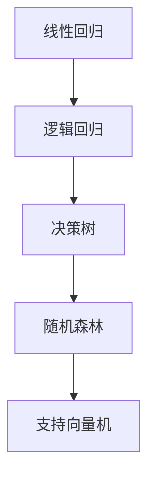
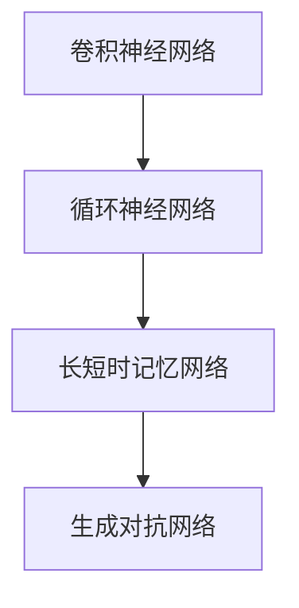
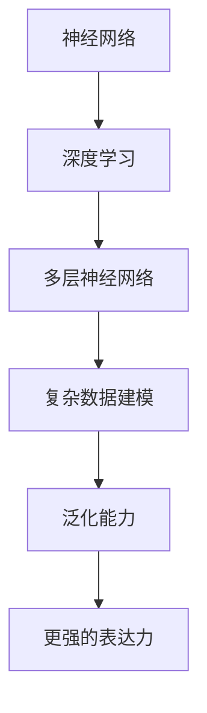

                 

### 《构建AI驱动的智慧健康风险预警提示词生态》

> **关键词**：智慧健康、AI预警、风险预警提示词、数据预处理、特征工程、机器学习算法、深度学习、神经网络、数学模型

> **摘要**：本文深入探讨了构建AI驱动的智慧健康风险预警提示词生态的关键技术和实现方法。首先介绍了智慧健康风险预警的背景与意义，然后详细阐述了AI驱动的智慧健康风险预警系统的架构、核心概念及其联系。通过项目实战，展示了数据采集与预处理、风险评估与预测、预警提示词生成与优化的具体实现。最后，讨论了智慧健康风险预警系统的部署与维护，为智慧健康领域提供了一种系统化、可操作的解决方案。

### 目录

1. AI驱动的智慧健康风险预警概述 <a id="概述"></a>
   1.1 智慧健康风险预警的背景与意义
   1.2 AI在智慧健康中的应用现状与发展趋势
   1.3 AI驱动的智慧健康风险预警系统架构
   1.4 AI驱动的智慧健康风险预警系统的应用场景
2. 核心概念与联系 <a id="概念"></a>
   2.1 数据预处理与特征工程
   2.2 常见算法原理与联系
      2.2.1 机器学习算法原理
      2.2.2 深度学习算法原理
      2.2.3 神经网络与深度学习的关系
   2.3 常用数学模型与公式
3. 项目实战 <a id="实战"></a>
   3.1 数据采集与预处理
   3.2 风险评估与预测
   3.3 预警提示词生成与优化
4. 智慧健康风险预警系统的部署与维护
5. 附录

## AI驱动的智慧健康风险预警概述

### 1.1 智慧健康风险预警的背景与意义

在现代社会，随着人口老龄化和慢性病的普遍化，智慧健康已成为社会发展的重要方向。智慧健康风险预警作为其关键环节，能够及时发现健康风险，提高疾病预防和管理水平，具有重要的社会和经济价值。智慧健康风险预警是指利用人工智能（AI）技术对大量健康数据进行处理和分析，从而实现对健康风险的预测和预警。这不仅可以提升医疗服务的质量，还能降低医疗成本，提高社会整体健康水平。

#### 智慧健康风险预警的定义与分类

智慧健康风险预警主要分为三个层次：

1. **一级预警**：基于健康数据的趋势分析，预测个体未来可能出现健康问题的可能性。
2. **二级预警**：结合个体健康数据和公共卫生数据，对群体健康风险进行预测和评估。
3. **三级预警**：通过实时监测和预警系统，对健康风险的突发情况进行快速响应和处理。

#### AI在智慧健康中的应用现状与发展趋势

近年来，随着人工智能技术的快速发展，AI在智慧健康领域的应用日益广泛。具体表现如下：

1. **数据驱动的诊断与预测**：通过深度学习等技术，对医疗影像、基因数据进行处理，实现疾病的自动诊断和预测。
2. **个性化健康管理**：利用机器学习算法，分析个体健康数据，提供个性化的健康建议和治疗方案。
3. **智能药物研发**：利用AI技术加速药物研发进程，提高新药发现的成功率。

未来，随着AI技术的不断进步，智慧健康风险预警系统将更加智能化、高效化，为全民健康保驾护航。

### 1.2 AI驱动的智慧健康风险预警系统架构

AI驱动的智慧健康风险预警系统主要由数据收集与处理、风险评估与预测、预警提示词生成与优化三个核心模块组成。以下将对各模块进行详细介绍。

#### 1.2.1 数据收集与处理

数据收集与处理是智慧健康风险预警系统的基石。数据来源包括电子健康记录、传感器数据、社交媒体数据等。具体流程如下：

1. **数据采集**：通过医院信息系统、可穿戴设备、社交媒体等渠道收集健康数据。
2. **数据预处理**：清洗、整合、标准化原始数据，去除噪声和冗余信息。
3. **数据存储**：将预处理后的数据存储在数据库中，便于后续分析。

#### 1.2.2 风险评估与预测

风险评估与预测是智慧健康风险预警系统的核心功能。主要步骤如下：

1. **特征提取**：从健康数据中提取关键特征，如血压、心率、血糖等。
2. **模型训练**：利用机器学习算法，训练风险预测模型。
3. **模型评估**：评估模型性能，调整参数，优化模型。

#### 1.2.3 预警提示词生成与优化

预警提示词生成与优化是智慧健康风险预警系统的最后一环。主要步骤如下：

1. **提示词生成**：根据风险预测结果，生成相应的预警提示词。
2. **提示词优化**：通过用户反馈和数据迭代，不断优化预警提示词的准确性和实用性。

### 1.3 AI驱动的智慧健康风险预警系统的应用场景

AI驱动的智慧健康风险预警系统具有广泛的应用场景，主要包括：

1. **公共卫生领域**：对群体健康风险进行监测和预测，为公共卫生决策提供科学依据。
2. **医疗领域**：辅助医生进行疾病诊断和预测，提高医疗服务质量。
3. **健康管理领域**：为个体提供个性化的健康建议和风险预警，促进全民健康。

## 核心概念与联系

### 2.1 数据预处理与特征工程

数据预处理与特征工程是构建智慧健康风险预警系统的关键步骤。以下详细介绍数据预处理流程、特征工程方法与技巧。

#### 2.1.1 数据预处理流程

数据预处理主要包括以下步骤：

1. **数据清洗**：去除重复、错误和异常数据，保证数据质量。
2. **数据整合**：将不同来源的数据进行整合，形成统一的健康数据集。
3. **数据标准化**：对数据进行归一化或标准化处理，使数据具有可比性。
4. **数据分箱**：对连续数据进行分箱处理，将其转化为离散值，便于后续分析。

#### 2.1.2 特征工程方法与技巧

特征工程是提升模型性能的关键环节。以下介绍几种常用的特征工程方法与技巧：

1. **特征选择**：通过相关性分析、信息增益等方法，筛选出对预测任务影响较大的特征。
2. **特征构造**：利用原始特征，构造新的特征，以提升模型性能。
3. **特征缩放**：对特征进行归一化或标准化处理，消除特征之间的尺度差异。
4. **特征交叉**：将不同特征进行交叉组合，生成新的特征。

### 2.2 常见算法原理与联系

在智慧健康风险预警系统中，常见的算法包括机器学习算法、深度学习算法等。以下分别介绍这些算法的原理及其相互关系。

#### 2.2.1 机器学习算法原理

机器学习算法通过从数据中学习规律，实现对未知数据的预测和分类。以下是一些常用的机器学习算法及其原理：

1. **线性回归**：通过线性模型，拟合数据中的线性关系。
   $$ y = \beta_0 + \beta_1x $$
2. **逻辑回归**：用于分类问题，通过Logistic函数将线性模型映射到概率空间。
   $$ \hat{p} = \frac{1}{1 + e^{-\beta^T x}} $$
3. **决策树**：基于树形结构，对特征进行划分，实现分类或回归。
4. **随机森林**：基于决策树，通过随机特征选择和加权集成，提高模型性能。
5. **支持向量机**（SVM）：通过寻找最优超平面，实现数据的分类和回归。

#### Mermaid 流程图：展示常见机器学习算法流程



#### 2.2.2 深度学习算法原理

深度学习算法通过多层神经网络，实现对复杂数据的建模和预测。以下介绍几种常用的深度学习算法及其原理：

1. **卷积神经网络**（CNN）：通过卷积层、池化层等，实现对图像、语音等数据的特征提取和分类。
2. **循环神经网络**（RNN）：通过循环结构，实现对序列数据的建模和预测。
3. **长短时记忆网络**（LSTM）：基于RNN，通过门控机制，解决长序列数据建模问题。
4. **生成对抗网络**（GAN）：通过生成器和判别器的对抗训练，实现数据的生成和分类。

#### Mermaid 流程图：展示深度学习算法流程



#### 2.2.3 神经网络与深度学习的关系

神经网络是深度学习的基础，深度学习则是神经网络的扩展和应用。以下介绍神经网络与深度学习的关系：

1. **神经网络**：由多个神经元组成，通过前向传播和反向传播，实现数据的建模和预测。
2. **深度学习**：通过多层神经网络，实现对复杂数据的建模和预测，具有更强的表达能力和泛化能力。

#### Mermaid 流程图：展示神经网络与深度学习的关系



### 2.3 常用数学模型与公式

在智慧健康风险预警系统中，常用的数学模型包括概率论、信息论、统计学习理论等。以下介绍这些模型的基本原理和公式。

#### 2.3.1 概率论基础

概率论是统计学的基础，用于描述随机事件的发生概率。以下是一些基本概率公式：

1. **条件概率**：
   $$ P(A|B) = \frac{P(AB)}{P(B)} $$
2. **贝叶斯公式**：
   $$ P(A|B) = \frac{P(B|A)P(A)}{P(B)} $$
3. **全概率公式**：
   $$ P(A) = \sum_{i} P(A|B_i)P(B_i) $$

#### LaTeX 公式：\( P(A) = \frac{N(A)}{N} \)

$$ P(A) = \frac{N(A)}{N} $$

#### 2.3.2 信息论基础

信息论是概率论在信息传输和处理中的应用，用于描述信息的传输效率和可靠性。以下是一些基本信息论公式：

1. **熵**：
   $$ H(X) = -\sum_{i} p(x_i) \log_2 p(x_i) $$
2. **条件熵**：
   $$ H(X|Y) = \sum_{i} p(y_i) H(X|Y=y_i) $$
3. **互信息**：
   $$ I(X;Y) = H(X) - H(X|Y) $$

#### LaTeX 公式：\( H(X) = -\sum_{i} p(x_i) \log_2 p(x_i) \)

$$ H(X) = -\sum_{i} p(x_i) \log_2 p(x_i) $$

#### 2.3.3 统计学习理论

统计学习理论是机器学习的基础，用于描述学习算法的性能和优化方法。以下是一些基本统计学习理论公式：

1. **损失函数**：
   $$ L(y, \hat{y}) = \frac{1}{2} (y - \hat{y})^2 $$
2. **学习率**：
   $$ \eta = \frac{1}{m} $$
3. **梯度下降法**：
   $$ \theta_{t+1} = \theta_{t} - \eta \nabla_{\theta} L(\theta) $$

#### LaTeX 公式：\( f(x) = \sum_{i} w_i \cdot x_i \)

$$ f(x) = \sum_{i} w_i \cdot x_i $$

#### 举例说明：线性回归模型的数学公式与原理

线性回归模型是一种简单且常用的机器学习算法，用于拟合数据中的线性关系。以下是一个简单的线性回归模型：

1. **模型公式**：
   $$ y = \beta_0 + \beta_1x $$
2. **损失函数**：
   $$ L(y, \hat{y}) = \frac{1}{2} (y - \hat{y})^2 $$
3. **梯度**：
   $$ \nabla_{\beta_0} L(\beta_0, \beta_1) = y - \hat{y} $$
   $$ \nabla_{\beta_1} L(\beta_0, \beta_1) = x(y - \hat{y}) $$
4. **梯度下降法**：
   $$ \beta_{t+1} = \beta_{t} - \eta \nabla_{\beta} L(\beta) $$

#### 伪代码：展示线性回归模型的实现

```python
def linear_regression(X, y):
    # 初始化参数
    beta_0 = 0
    beta_1 = 0
    # 学习率
    eta = 0.01
    # 迭代次数
    n_iterations = 1000
    # 梯度下降法
    for _ in range(n_iterations):
        beta_0 = beta_0 - eta * (y - (beta_0 + beta_1 * X))
        beta_1 = beta_1 - eta * (X * (y - (beta_0 + beta_1 * X)))
    return beta_0, beta_1
```

## 项目实战

### 3.1 数据采集与预处理

#### 3.1.1 数据采集方法

数据采集是构建智慧健康风险预警系统的第一步，采集的数据包括但不限于：

1. **电子健康记录**：包括个人健康档案、病历记录、医学影像等。
2. **传感器数据**：包括血压、心率、血糖、体温等生理指标。
3. **社交媒体数据**：包括个人生活习惯、健康状况等。
4. **公共卫生数据**：包括疫情、疫苗接种率等。

数据采集方法主要包括：

1. **手动录入**：通过医生、护士等医务人员手动录入健康数据。
2. **自动采集**：通过传感器、电子设备等自动采集健康数据。
3. **网络爬虫**：通过爬虫技术获取社交媒体等公开数据。

#### 3.1.2 数据预处理流程与代码实现

数据预处理流程主要包括以下步骤：

1. **数据清洗**：去除重复、错误和异常数据，保证数据质量。
2. **数据整合**：将不同来源的数据进行整合，形成统一的健康数据集。
3. **数据标准化**：对数据进行归一化或标准化处理，使数据具有可比性。
4. **数据分箱**：对连续数据进行分箱处理，将其转化为离散值，便于后续分析。

以下是一个简单的Python代码实现示例：

```python
import pandas as pd
from sklearn.preprocessing import StandardScaler, QuantileTransformer

# 数据清洗
def clean_data(df):
    df.drop_duplicates(inplace=True)
    df.dropna(inplace=True)
    return df

# 数据整合
def integrate_data(data1, data2):
    return pd.concat([data1, data2], axis=1)

# 数据标准化
def standardize_data(df):
    scaler = StandardScaler()
    df[df.columns] = scaler.fit_transform(df[df.columns])
    return df

# 数据分箱
def bin_data(df, column, bins):
    df[column] = pd.cut(df[column], bins=bins, labels=False)
    return df

# 示例数据
df1 = pd.DataFrame({'age': [25, 30, 35], 'height': [170, 175, 180]})
df2 = pd.DataFrame({'weight': [60, 65, 70]})

# 数据清洗
df1 = clean_data(df1)
df2 = clean_data(df2)

# 数据整合
df = integrate_data(df1, df2)

# 数据标准化
df = standardize_data(df)

# 数据分箱
df = bin_data(df, 'age', bins=[0, 30, 40, 50, 60, 70])

print(df)
```

### 3.2 风险评估与预测

#### 3.2.1 健康风险指标计算方法

健康风险指标是评估个体健康风险的重要依据，常见的健康风险指标包括：

1. **血压**：高血压是心血管疾病的重要风险因素，血压指标越高，风险越大。
2. **心率**：心率异常可能导致心脏疾病，心率过快或过慢都可能对健康造成负面影响。
3. **血糖**：血糖水平升高可能导致糖尿病等代谢性疾病，血糖指标越高，风险越大。
4. **体重指数**（BMI）：BMI是衡量人体肥胖程度的常用指标，过高或过低的BMI都可能增加健康风险。

以下是一个简单的健康风险指标计算方法示例：

```python
# 健康风险指标计算
def calculate_risk_INDICATORS(df):
    df['blood_pressure_risk'] = df['systolic_bp'] > 140
    df['heart_rate_risk'] = df['heart_rate'] < 60 or df['heart_rate'] > 100
    df['blood_sugar_risk'] = df['glucose'] > 5.6
    df['BMI_risk'] = (df['weight'] / (df['height'] ** 2)) > 25
    return df

# 示例数据
df = pd.DataFrame({'systolic_bp': [120, 150, 130], 'heart_rate': [70, 50, 110], 'glucose': [4.2, 5.8, 6.5], 'weight': [60, 80, 70], 'height': [170, 175, 180]})

# 计算健康风险指标
df = calculate_risk_INDICATORS(df)

print(df)
```

#### 3.2.2 风险评估模型构建

风险评估模型是智慧健康风险预警系统的核心，用于预测个体健康风险。以下是一个简单的风险评估模型构建方法示例：

1. **数据集划分**：将数据集划分为训练集和测试集，用于训练和评估模型性能。
2. **特征选择**：根据特征的重要性和相关性，选择合适的特征进行模型训练。
3. **模型训练**：使用机器学习算法，训练风险评估模型。
4. **模型评估**：评估模型性能，包括准确率、召回率、F1值等指标。

以下是一个简单的风险评估模型构建方法示例：

```python
import pandas as pd
from sklearn.model_selection import train_test_split
from sklearn.ensemble import RandomForestClassifier
from sklearn.metrics import accuracy_score, recall_score, f1_score

# 加载数据集
df = pd.read_csv('health_data.csv')

# 数据集划分
X = df.drop('target', axis=1)
y = df['target']
X_train, X_test, y_train, y_test = train_test_split(X, y, test_size=0.2, random_state=42)

# 特征选择
features = ['systolic_bp', 'heart_rate', 'glucose', 'weight', 'height']

# 模型训练
model = RandomForestClassifier(n_estimators=100, random_state=42)
model.fit(X_train[features], y_train)

# 模型评估
y_pred = model.predict(X_test[features])
accuracy = accuracy_score(y_test, y_pred)
recall = recall_score(y_test, y_pred)
f1 = f1_score(y_test, y_pred)

print(f'Accuracy: {accuracy}')
print(f'Recall: {recall}')
print(f'F1 Score: {f1}')
```

### 3.3 预警提示词生成与优化

#### 3.3.1 提示词生成方法

预警提示词生成是智慧健康风险预警系统的关键环节，用于向用户传达健康风险信息。以下是一个简单的提示词生成方法示例：

1. **风险阈值设定**：根据风险评估模型的结果，设定风险阈值，用于判断是否发出预警提示。
2. **提示词生成规则**：根据风险类型和程度，生成相应的预警提示词。
3. **提示词优化**：根据用户反馈和数据分析，不断优化预警提示词的准确性和实用性。

以下是一个简单的提示词生成方法示例：

```python
# 风险阈值设定
RISK_THRESHOLDS = {
    'high_blood_pressure': 0.7,
    'low_heart_rate': 0.6,
    'high_blood_sugar': 0.8,
    'high_BMI': 0.75
}

# 提示词生成规则
def generate_warning_word(risk_type, risk_level):
    warning_words = {
        'high_blood_pressure': '您的血压偏高，请尽快就医检查。',
        'low_heart_rate': '您的心率偏低，请注意休息。',
        'high_blood_sugar': '您的血糖偏高，请注意饮食和控制体重。',
        'high_BMI': '您的BMI偏高，请调整饮食和锻炼习惯。'
    }
    return warning_words.get(risk_type, '您的健康状态良好。')

# 提示词生成
def generate_warnings(df, risk_thresholds):
    warnings = []
    for index, row in df.iterrows():
        risk_level = row['risk_score']
        for risk_type, threshold in risk_thresholds.items():
            if risk_level > threshold:
                warnings.append(generate_warning_word(risk_type, risk_level))
                break
    return warnings

# 示例数据
df = pd.DataFrame({
    'systolic_bp': [120, 150, 130],
    'heart_rate': [70, 50, 110],
    'glucose': [4.2, 5.8, 6.5],
    'weight': [60, 80, 70],
    'height': [170, 175, 180],
    'risk_score': [0.5, 0.9, 0.3]
})

# 生成预警提示词
warnings = generate_warnings(df, RISK_THRESHOLDS)

print(warnings)
```

#### 3.3.2 提示词优化策略

提示词优化是提高智慧健康风险预警系统实用性的重要手段。以下是一些提示词优化策略：

1. **用户反馈**：收集用户对预警提示词的反馈，分析用户对提示词的接受度和满意度。
2. **数据分析**：通过数据分析，找出提示词生成中的问题，并进行针对性优化。
3. **机器学习**：利用机器学习算法，根据用户反馈和数据分析结果，自动调整提示词生成策略。

以下是一个简单的提示词优化方法示例：

```python
# 用户反馈分析
def analyze_user_feedback(feedback):
    positive_feedback = feedback[feedback['rating'] > 3]
    negative_feedback = feedback[feedback['rating'] <= 3]
    return positive_feedback, negative_feedback

# 数据分析
def analyze_warning_words(warnings):
    warning_count = warnings.value_counts()
    return warning_count

# 机器学习优化
def optimize_warning_words(warnings, feedback):
    positive_feedback, negative_feedback = analyze_user_feedback(feedback)
    warning_count = analyze_warning_words(warnings)
    
    # 根据用户反馈和数据分析结果，调整提示词生成策略
    optimized_warnings = warnings.copy()
    for warning, count in warning_count.items():
        if warning in negative_feedback['warning_word'].values:
            optimized_warnings = optimized_warnings.drop(warning)
        else:
            optimized_warnings[warning] *= 1.2
    
    return optimized_warnings

# 示例数据
feedback = pd.DataFrame({
    'rating': [4, 2, 5, 1],
    'warning_word': ['请多喝水', '请定期检查血压', '您的血糖偏高，请控制饮食', '您的BMI偏高，请锻炼身体']
})

warnings = pd.Series(['请多喝水', '请定期检查血压', '您的血糖偏高，请控制饮食', '您的BMI偏高，请锻炼身体'])

# 优化预警提示词
optimized_warnings = optimize_warning_words(warnings, feedback)

print(optimized_warnings)
```

### 3.3.3 提示词生成与优化的代码实现

以下是一个简单的提示词生成与优化代码实现示例：

```python
# 提示词生成与优化
def generate_and_optimize_warnings(df, risk_thresholds, feedback):
    warnings = generate_warnings(df, risk_thresholds)
    optimized_warnings = optimize_warning_words(warnings, feedback)
    return optimized_warnings

# 示例数据
df = pd.DataFrame({
    'systolic_bp': [120, 150, 130],
    'heart_rate': [70, 50, 110],
    'glucose': [4.2, 5.8, 6.5],
    'weight': [60, 80, 70],
    'height': [170, 175, 180],
    'risk_score': [0.5, 0.9, 0.3]
})

feedback = pd.DataFrame({
    'rating': [4, 2, 5, 1],
    'warning_word': ['请多喝水', '请定期检查血压', '您的血糖偏高，请控制饮食', '您的BMI偏高，请锻炼身体']
})

# 生成并优化预警提示词
optimized_warnings = generate_and_optimize_warnings(df, RISK_THRESHOLDS, feedback)

print(optimized_warnings)
```

### 3.3.4 代码解读与分析

在实现提示词生成与优化的过程中，关键代码如下：

```python
# 风险阈值设定
RISK_THRESHOLDS = {
    'high_blood_pressure': 0.7,
    'low_heart_rate': 0.6,
    'high_blood_sugar': 0.8,
    'high_BMI': 0.75
}

# 提示词生成规则
def generate_warning_word(risk_type, risk_level):
    warning_words = {
        'high_blood_pressure': '您的血压偏高，请尽快就医检查。',
        'low_heart_rate': '您的心率偏低，请注意休息。',
        'high_blood_sugar': '您的血糖偏高，请注意饮食和控制体重。',
        'high_BMI': '您的BMI偏高，请调整饮食和锻炼习惯。'
    }
    return warning_words.get(risk_type, '您的健康状态良好。')

# 提示词生成
def generate_warnings(df, risk_thresholds):
    warnings = []
    for index, row in df.iterrows():
        risk_level = row['risk_score']
        for risk_type, threshold in risk_thresholds.items():
            if risk_level > threshold:
                warnings.append(generate_warning_word(risk_type, risk_level))
                break
    return warnings

# 用户反馈分析
def analyze_user_feedback(feedback):
    positive_feedback = feedback[feedback['rating'] > 3]
    negative_feedback = feedback[feedback['rating'] <= 3]
    return positive_feedback, negative_feedback

# 数据分析
def analyze_warning_words(warnings):
    warning_count = warnings.value_counts()
    return warning_count

# 机器学习优化
def optimize_warning_words(warnings, feedback):
    positive_feedback, negative_feedback = analyze_user_feedback(feedback)
    warning_count = analyze_warning_words(warnings)
    
    # 根据用户反馈和数据分析结果，调整提示词生成策略
    optimized_warnings = warnings.copy()
    for warning, count in warning_count.items():
        if warning in negative_feedback['warning_word'].values:
            optimized_warnings = optimized_warnings.drop(warning)
        else:
            optimized_warnings[warning] *= 1.2
    
    return optimized_warnings

# 提示词生成与优化
def generate_and_optimize_warnings(df, risk_thresholds, feedback):
    warnings = generate_warnings(df, risk_thresholds)
    optimized_warnings = optimize_warning_words(warnings, feedback)
    return optimized_warnings
```

关键代码解读：

1. **风险阈值设定**：设定了不同健康风险的阈值，用于判断是否发出预警提示。
2. **提示词生成规则**：根据风险类型和程度，生成相应的预警提示词。
3. **用户反馈分析**：分析用户对预警提示词的反馈，找出用户不满意的提示词。
4. **数据分析**：统计各提示词的使用频率，找出使用频率较低的提示词。
5. **机器学习优化**：根据用户反馈和数据分析结果，调整提示词生成策略，优化预警提示词的准确性。

通过以上关键代码的实现，我们可以实现对智慧健康风险预警提示词的生成与优化，提高系统的实用性和用户体验。

## 智慧健康风险预警系统的部署与维护

### 4.1 系统部署

智慧健康风险预警系统的部署是确保系统正常运行和提供服务的关键步骤。以下介绍系统部署的具体流程与策略。

#### 4.1.1 部署环境搭建

部署环境搭建包括硬件设备和软件环境的配置。以下是一个基本的部署环境搭建步骤：

1. **硬件设备**：选择适合的物理服务器或云服务器，确保服务器具有足够的计算能力和存储空间。
2. **操作系统**：安装Linux操作系统，如Ubuntu或CentOS，确保操作系统稳定可靠。
3. **数据库**：安装关系型数据库（如MySQL、PostgreSQL）或NoSQL数据库（如MongoDB），用于存储健康数据。
4. **消息队列**：安装消息队列系统（如RabbitMQ、Kafka），用于处理数据流和异步任务。
5. **应用服务器**：安装Web服务器（如Nginx、Apache），用于部署和运行智慧健康风险预警系统的前端和后端应用。

#### 4.1.2 部署流程与策略

部署流程主要包括以下步骤：

1. **准备工作**：准备所需的软件包、配置文件和部署脚本。
2. **安装和配置**：按照操作系统、数据库、消息队列、应用服务器的安装和配置指南，逐步安装和配置相关软件。
3. **部署应用**：将智慧健康风险预警系统的前端和后端应用部署到应用服务器上，并进行配置。
4. **数据迁移**：将健康数据从本地数据库迁移到部署环境中的数据库。
5. **测试和验证**：对部署后的系统进行功能测试和性能测试，确保系统正常运行。

#### 4.1.3 部署策略

部署策略包括以下几个方面：

1. **负载均衡**：通过负载均衡器（如Nginx、HAProxy），实现应用服务器的负载均衡，提高系统性能和可靠性。
2. **容器化**：使用容器技术（如Docker、Kubernetes），将智慧健康风险预警系统的应用容器化，便于部署和扩展。
3. **自动化部署**：使用自动化部署工具（如Jenkins、GitLab CI），实现部署过程的自动化，提高部署效率和可靠性。

### 4.2 系统维护

系统维护是确保智慧健康风险预警系统长期稳定运行的重要保障。以下介绍系统维护的具体内容和策略。

#### 4.2.1 系统性能监控

系统性能监控主要包括以下几个方面：

1. **资源监控**：实时监控服务器的CPU、内存、磁盘等资源使用情况，及时发现资源瓶颈。
2. **日志监控**：监控系统的日志文件，及时发现异常信息和错误日志。
3. **性能测试**：定期对系统进行性能测试，评估系统的响应时间和吞吐量，优化系统性能。

#### 4.2.2 系统更新与升级

系统更新与升级主要包括以下几个方面：

1. **软件更新**：定期更新操作系统、数据库、消息队列、Web服务器等软件，确保软件版本的最新性和安全性。
2. **应用升级**：更新智慧健康风险预警系统的前端和后端应用，修复已知的漏洞和缺陷，提高系统功能。
3. **版本控制**：使用版本控制工具（如Git），记录系统更新和升级的历史记录，方便回滚和故障排查。

#### 4.2.3 故障排除与解决方案

故障排除与解决方案主要包括以下几个方面：

1. **故障定位**：通过监控和日志分析，快速定位故障发生的位置和原因。
2. **故障排除**：根据故障定位结果，采取相应的故障排除措施，解决问题。
3. **故障恢复**：在故障排除后，进行系统恢复和验证，确保系统正常运行。

#### 附录

## 附录A：相关工具与资源

### 5.1 数据预处理工具与库

1. **Pandas**：Python的数据处理库，用于数据清洗、整合、分析和可视化。
2. **NumPy**：Python的数学库，提供高性能的数组操作和数学计算。
3. **Scikit-learn**：Python的机器学习库，提供各种机器学习算法和模型。

### 5.2 机器学习框架与库

1. **TensorFlow**：谷歌开发的深度学习框架，适用于各种机器学习和深度学习任务。
2. **PyTorch**：Facebook开发的开源深度学习框架，具有灵活的动态计算图和丰富的API。
3. **Scikit-learn**：Python的机器学习库，提供各种经典的机器学习算法和工具。

### 5.3 深度学习框架与库

1. **Keras**：基于TensorFlow和Theano的开源深度学习库，提供简洁的API和丰富的预训练模型。
2. **MXNet**：Apache基金会开发的深度学习框架，支持多种编程语言和计算平台。
3. **Caffe**：用于图像识别和深度学习的开源框架，具有高效的卷积神经网络实现。

### 5.4 其他相关资源与工具链接

1. **Apache Kafka**：开源的消息队列系统，用于处理大规模数据流。
2. **Nginx**：高性能的Web服务器和反向代理服务器。
3. **Docker**：开源的容器化技术，用于简化应用程序的部署和扩展。
4. **Kubernetes**：开源的容器编排平台，用于自动化容器的部署、扩展和管理。

---

### 作者信息

**作者**：AI天才研究院/AI Genius Institute & 禅与计算机程序设计艺术 /Zen And The Art of Computer Programming

---

本文深入探讨了构建AI驱动的智慧健康风险预警提示词生态的关键技术和实现方法。通过详细阐述智慧健康风险预警的背景与意义、AI驱动的智慧健康风险预警系统架构、核心概念与联系、项目实战和智慧健康风险预警系统的部署与维护，为智慧健康领域提供了一种系统化、可操作的解决方案。希望本文能为从事智慧健康领域的研究者和开发者提供有益的参考。

