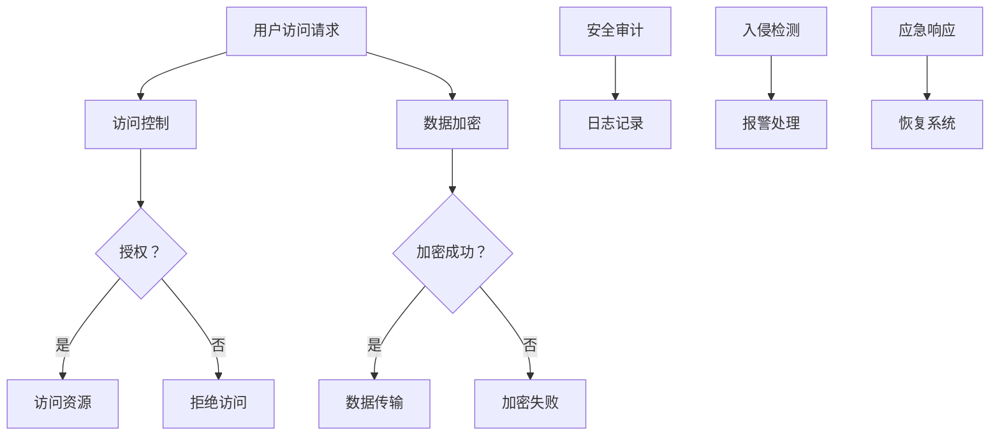

                 

# 注意力战争策略：元宇宙信息安全的国家防御体系

> **关键词**：元宇宙、信息安全、国家防御体系、加密技术、数字签名、网络安全、攻击防御

> **摘要**：本文将深入探讨元宇宙信息安全的挑战及其国家防御体系的构建。首先，我们将了解元宇宙的崛起及其带来的信息安全问题。接着，我们分析信息安全的基本原理和技术，包括加密技术、数字签名、防火墙和入侵检测。随后，本文将详细阐述国家防御体系的架构设计、关键技术与核心算法，并结合实际案例展示如何实施与应用。最后，我们展望元宇宙安全发展的趋势，探讨国家防御体系的未来方向。

----------------------------------------------------------------

### 目录大纲

- [注意力战争策略：元宇宙信息安全的国家防御体系](#注意力战争策略元宇宙信息安全的国家防御体系)
- [第一部分：元宇宙与信息安全概述](#第一部分元宇宙与信息安全概述)
  - [第1章：元宇宙的崛起与信息安全挑战](#第1章元宇宙的崛起与信息安全挑战)
  - [第2章：信息安全的基本原理与技术](#第2章信息安全的基本原理与技术)
  - [第3章：元宇宙安全威胁分析与应对策略](#第3章元宇宙安全威胁分析与应对策略)
- [第二部分：国家防御体系的构建与实施](#第二部分国家防御体系的构建与实施)
  - [第4章：国家防御体系架构设计](#第4章国家防御体系架构设计)
  - [第5章：关键技术与核心算法](#第5章关键技术与核心算法)
  - [第6章：实战案例：国家防御体系的实施与应用](#第6章实战案例国家防御体系的实施与应用)
  - [第7章：未来展望与趋势](#第7章未来展望与趋势)
- [第三部分：附录](#第三部分附录)
  - [第8章：附录](#第8章附录)
  
----------------------------------------------------------------

## 第一部分：元宇宙与信息安全概述

### 第1章：元宇宙的崛起与信息安全挑战

#### 1.1 元宇宙的核心理念与现状

元宇宙（Metaverse）是一个虚拟的共享空间，由增强现实（AR）和虚拟现实（VR）技术支撑，结合物理世界和数字世界，为用户提供沉浸式体验。元宇宙的核心概念包括以下几个方面：

1. **虚拟现实与增强现实**：元宇宙依赖于VR和AR技术，实现用户在虚拟世界中的沉浸式体验。
2. **社交互动**：元宇宙提供用户之间进行实时交流和互动的平台。
3. **经济活动**：元宇宙中的虚拟资产可以进行交易，包括虚拟房地产、数字货币等。
4. **跨平台互操作性**：元宇宙支持不同平台和应用之间的无缝连接和互动。

目前，元宇宙正处于快速发展阶段，多家科技巨头，如Facebook、谷歌、微软等，都在积极投入元宇宙的研究与开发。例如，Facebook已将公司名称更改为Meta，表明其在元宇宙领域的战略布局。元宇宙的应用场景包括虚拟购物、虚拟会议、在线教育、虚拟游戏等。

#### 1.2 元宇宙中的信息安全风险

尽管元宇宙提供了丰富的应用场景和商业机会，但其信息安全性也面临着诸多挑战：

1. **隐私泄露**：元宇宙中的用户数据包括个人身份信息、行为记录等，容易成为黑客攻击的目标。
2. **虚拟货币被盗**：元宇宙中的数字货币交易频繁，成为网络犯罪分子的目标。
3. **网络钓鱼与诈骗**：元宇宙平台可能成为网络钓鱼和诈骗的温床，用户容易受到欺骗。
4. **分布式拒绝服务（DDoS）攻击**：元宇宙中的大型虚拟场景可能成为DDoS攻击的目标，导致服务中断。
5. **恶意软件与病毒**：虚拟环境和应用程序可能成为恶意软件和病毒的传播渠道。

这些信息安全风险对元宇宙的用户、企业和国家都有重大影响。因此，构建一个高效的国家防御体系，保障元宇宙的信息安全，已成为当务之急。

#### 1.3 国家防御体系在元宇宙中的重要性

国家防御体系在元宇宙中的重要性体现在以下几个方面：

1. **保护用户隐私**：国家防御体系可以制定相关法律法规，规范元宇宙中的数据处理和共享，保护用户隐私。
2. **保障金融安全**：国家防御体系可以加强对元宇宙中的虚拟货币交易监管，防止非法交易和洗钱活动。
3. **应对网络攻击**：国家防御体系可以建立网络安全监测和预警机制，及时发现和应对网络攻击。
4. **维护社会秩序**：国家防御体系可以加强对元宇宙中的不良信息和违法活动的监管，维护社会秩序。
5. **促进技术创新**：国家防御体系可以为元宇宙的安全技术研究提供支持，推动相关技术的发展和创新。

综上所述，元宇宙的崛起为信息安全带来了新的挑战，国家防御体系在保障元宇宙安全方面具有重要战略意义。

----------------------------------------------------------------

## 第二部分：国家防御体系的构建与实施

### 第2章：信息安全的基本原理与技术

#### 2.1 信息安全的基础知识

信息安全是一门研究如何保护信息免受未经授权访问、篡改、泄露和破坏的学科。其基础概念包括以下几个方面：

1. **保密性**：确保信息只能被授权用户访问。
2. **完整性**：确保信息在传输和存储过程中未被篡改。
3. **可用性**：确保信息在需要时能够被合法用户访问和使用。
4. **真实性**：确保信息的来源和内容是真实的。
5. **不可否认性**：确保信息的发送者和接收者不能否认其行为。

这些基础概念构成了信息安全的核心目标，为构建有效的防御体系提供了理论依据。

#### 2.2 网络安全策略与防御机制

网络安全策略是指为保护网络系统不受攻击而制定的一系列措施。以下是一些常见的网络安全策略与防御机制：

1. **防火墙**：防火墙是一种网络安全设备，用于监控和控制进出网络的数据流量，防止未经授权的访问。
2. **入侵检测系统（IDS）**：IDS用于监测网络流量和系统活动，发现潜在的攻击行为并生成警报。
3. **入侵防御系统（IPS）**：IPS在IDS的基础上增加了实时响应功能，可以自动阻止攻击。
4. **虚拟专用网络（VPN）**：VPN通过加密通道保护数据传输，确保数据在公共网络上传输时的安全性。
5. **数据加密**：数据加密是一种将明文数据转换为密文的技术，防止未授权的访问。
6. **访问控制**：访问控制通过限制用户对系统和数据的访问，确保只有授权用户可以访问敏感信息。
7. **安全审计**：安全审计是一种定期检查和评估系统安全性的方法，确保安全策略和措施得到有效执行。

这些策略与防御机制共同构成了网络安全的基础，为元宇宙的信息安全提供了有力保障。

#### 2.3 数据安全与隐私保护

数据安全和隐私保护是信息安全的重要组成部分。以下是一些关键技术和方法：

1. **加密技术**：加密技术通过将明文数据转换为密文，确保数据在传输和存储过程中的安全性。常见的加密算法包括AES、RSA等。
2. **数据备份与恢复**：数据备份是将数据复制到安全存储介质，以便在数据丢失或损坏时进行恢复。数据恢复则是从备份中恢复数据。
3. **访问控制**：通过限制用户对数据和系统的访问权限，确保数据的安全性。访问控制可以基于用户身份、角色、时间等因素。
4. **隐私保护**：隐私保护是指保护用户个人信息的安全和隐私。隐私保护措施包括数据匿名化、数据去标识化等。
5. **数据匿名化**：数据匿名化是将个人身份信息从数据中去除，确保数据在共享和分析时的隐私保护。
6. **数据去标识化**：数据去标识化是通过去除或改变数据中的唯一标识，降低数据被追踪和识别的风险。

通过以上技术和方法，可以有效地保护数据安全和用户隐私，为元宇宙的安全运行提供保障。

### 第3章：元宇宙安全威胁分析与应对策略

#### 3.1 常见安全威胁类型与案例分析

元宇宙中的信息安全威胁类型多种多样，以下是几种常见的安全威胁类型及其案例分析：

1. **分布式拒绝服务（DDoS）攻击**：DDoS攻击通过大量无效请求占用网络带宽和服务器资源，导致服务不可用。例如，2020年， GitHub遭受了一次DDoS攻击，导致其服务中断数小时。

2. **网络钓鱼**：网络钓鱼是一种欺骗用户泄露敏感信息的攻击手段。例如，攻击者可能会伪造银行网站，诱骗用户输入账号和密码。

3. **虚拟货币盗窃**：随着虚拟货币在元宇宙中的广泛应用，虚拟货币盗窃成为新的安全威胁。例如，2021年，一名黑客窃取了Tether虚拟货币平台上的价值2.5亿美元的代币。

4. **恶意软件和病毒**：恶意软件和病毒可以破坏元宇宙中的虚拟环境和应用程序，甚至窃取用户数据。例如，2019年，一个名为“Wannacry”的勒索病毒影响了全球多个国家的医疗机构。

5. **社交工程攻击**：社交工程攻击利用人类的心理弱点，欺骗用户泄露敏感信息。例如，攻击者可能会冒充银行客服，诱骗用户进行转账。

这些案例分析展示了元宇宙中存在的各种安全威胁，需要采取有效的应对策略来保护信息安全。

#### 3.2 针对元宇宙的安全防御策略

针对元宇宙的安全威胁，我们可以采取以下防御策略：

1. **加强网络安全防护**：部署防火墙、入侵检测系统和入侵防御系统，监控网络流量和系统活动，防止未经授权的访问。

2. **数据加密**：使用加密技术对敏感数据进行加密存储和传输，确保数据在存储和传输过程中的安全性。

3. **身份认证与访问控制**：实施强身份认证机制，确保只有授权用户可以访问系统和数据。同时，使用访问控制策略限制用户对系统和数据的访问权限。

4. **安全审计与监控**：定期进行安全审计，评估系统安全性的有效性。同时，实时监控网络流量和系统活动，及时发现和应对潜在的安全威胁。

5. **安全教育与培训**：加强用户的安全意识和教育，提高用户对安全威胁的识别和应对能力。

6. **应急响应与恢复**：建立完善的应急响应机制，确保在发生安全事件时能够快速响应和恢复。

通过以上策略，可以有效地应对元宇宙中的安全威胁，保障元宇宙的安全运行。

#### 3.3 应对策略的制定与实施

应对策略的制定与实施是保障元宇宙信息安全的最后一步。以下是一些建议：

1. **制定安全策略**：根据元宇宙的特点和业务需求，制定详细的安全策略，包括网络安全、数据安全、用户隐私保护等。

2. **建立安全组织**：建立专业的安全组织，负责安全策略的制定、实施和监控。

3. **投资安全技术与工具**：投入资金购买和部署安全技术与工具，如防火墙、入侵检测系统、加密设备等。

4. **定期安全培训**：定期组织安全培训，提高员工的安全意识和技能。

5. **安全演练与测试**：定期进行安全演练和测试，评估安全策略和技术的有效性。

6. **合作与共享信息**：与其他国家和企业合作，共享安全情报和经验，共同应对全球性的安全威胁。

通过以上措施，可以有效地制定和实施应对策略，为元宇宙的信息安全提供有力保障。

### 第4章：国家防御体系架构设计

#### 4.1 防御体系的基本构成

国家防御体系是由多个组件和层次组成的复杂系统，旨在保护元宇宙的安全。以下是防御体系的基本构成：

1. **网络安全层**：负责监控和防御网络攻击，包括防火墙、入侵检测系统（IDS）、入侵防御系统（IPS）等。

2. **数据安全层**：负责保护数据在存储、传输和处理过程中的安全，包括数据加密、备份与恢复、数据隐私保护等。

3. **身份认证与访问控制层**：负责确保只有授权用户可以访问系统和数据，包括多因素认证、访问控制列表（ACL）等。

4. **应急响应层**：负责在发生安全事件时迅速响应和恢复，包括应急响应团队、安全事件管理平台等。

5. **安全监控与审计层**：负责实时监控网络流量和系统活动，定期进行安全审计，确保安全策略的有效性。

6. **用户教育与培训层**：负责提高用户的安全意识和技能，减少人为错误导致的安全漏洞。

#### 4.2 防御体系的层级架构

国家防御体系的层级架构分为四个层次，每个层次都有其特定的功能和责任：

1. **边界防御层**：位于网络边界，负责阻止外部攻击，包括防火墙、入侵检测系统和反病毒软件等。

2. **内部防御层**：位于网络内部，负责监控和防御内部威胁，包括入侵防御系统、安全审计系统等。

3. **数据安全层**：位于数据处理和存储环节，负责保护数据的完整性和保密性，包括数据加密、备份与恢复等。

4. **应急响应层**：位于防御体系的最高层，负责在发生安全事件时迅速响应和恢复，包括应急响应团队、安全事件管理平台等。

#### 4.3 防御体系的运作机制

国家防御体系的运作机制包括以下几个关键环节：

1. **威胁情报收集**：通过监控网络流量和系统活动，收集潜在的安全威胁信息。

2. **威胁分析**：对收集到的威胁信息进行分析和评估，确定威胁的严重性和优先级。

3. **防御措施实施**：根据威胁分析结果，采取相应的防御措施，如部署防火墙、修改访问控制策略等。

4. **实时监控与预警**：持续监控网络和系统，及时发现新的安全威胁，并生成预警信息。

5. **应急响应与恢复**：在发生安全事件时，迅速启动应急响应机制，采取相应的应对措施，并尽快恢复系统正常运行。

通过以上运作机制，国家防御体系可以有效地保护元宇宙的安全，确保其稳定运行。

### 第5章：关键技术与核心算法

#### 5.1 加密技术与数字签名

加密技术是信息安全的核心组成部分，用于保护数据的保密性和完整性。以下是几种常见的加密技术和数字签名：

##### 对称加密与非对称加密

对称加密使用相同的密钥进行加密和解密，常见的算法有AES和DES。非对称加密使用一对密钥（公钥和私钥），常见的算法有RSA和ECC。

##### 数字签名

数字签名是一种验证消息完整性和发送者身份的技术。数字签名的过程包括签名和验证两个步骤。签名过程使用发送者的私钥对消息进行加密，生成签名。验证过程使用发送者的公钥对签名进行解密，生成验证值，并与原始消息进行比较。

##### 伪代码

```python
# 签名过程
def sign_message(private_key, message):
    signature = encrypt_with_private_key(private_key, message)
    return signature

# 验证过程
def verify_signature(public_key, message, signature):
    verification_value = decrypt_with_public_key(public_key, signature)
    if verification_value == message:
        return "Valid Signature"
    else:
        return "Invalid Signature"
```

##### 数学模型和数学公式

对称加密的数学模型如下：

$$
C = E_K(P)
$$

其中，$C$ 是密文，$P$ 是明文，$K$ 是密钥，$E_K$ 是加密函数。

非对称加密的数学模型如下：

$$
C = E_K(P)
$$

$$
P = D_K(C)
$$

其中，$C$ 是密文，$P$ 是明文，$K$ 是密钥，$E_K$ 是加密函数，$D_K$ 是解密函数。

数字签名的数学模型如下：

$$
S = sign(private_key, message)
$$

$$
message = verify(public_key, S)
$$

其中，$S$ 是签名，$message$ 是原始消息，$private_key$ 是私钥，$public_key$ 是公钥，$sign$ 是签名函数，$verify$ 是验证函数。

#### 5.2 防火墙与入侵检测

防火墙和入侵检测系统是网络安全的重要组成部分，用于监控和防御网络攻击。以下是它们的基本原理：

##### 防火墙

防火墙是一种网络安全设备，用于监控和控制进出网络的数据流量。其基本原理如下：

1. **包过滤**：根据数据包的源地址、目标地址、端口号等信息，决定是否允许数据包通过。
2. **状态检测**：记录网络连接的状态，对进出网络的数据包进行动态过滤。

##### 入侵检测系统

入侵检测系统（IDS）用于监测网络流量和系统活动，发现潜在的攻击行为。其基本原理如下：

1. **异常检测**：通过比较当前流量与正常行为基准，识别异常行为。
2. **签名检测**：通过匹配已知的攻击模式，检测攻击行为。

##### 数学模型和数学公式

防火墙的数学模型如下：

$$
\text{action} = \begin{cases} 
\text{"允许"} & \text{if } (\text{IP\_src}, \text{IP\_dst}, \text{port\_src}, \text{port\_dst}) \in \text{ACL} \\
\text{"拒绝"} & \text{otherwise}
\end{cases}
$$

其中，$\text{action}$ 是访问控制决策，$(\text{IP\_src}, \text{IP\_dst}, \text{port\_src}, \text{port\_dst})$ 是数据包的属性，$\text{ACL}$ 是访问控制列表。

入侵检测系统的数学模型如下：

$$
\text{anomaly\_score} = \frac{|\text{current\_behaviour} - \text{normal\_behaviour}|}{\text{normal\_behaviour}}
$$

其中，$\text{anomaly\_score}$ 是异常得分，$\text{current\_behaviour}$ 是当前行为，$\text{normal\_behaviour}$ 是正常行为基准。

#### 5.3 数据库安全与访问控制

数据库安全是保护数据库中的数据免受未经授权访问、篡改和泄露的关键。以下是一些关键技术和方法：

##### 加密数据库

加密数据库可以防止未授权用户访问数据库中的数据。常用的加密技术包括全盘加密和字段加密。

##### 访问控制

访问控制可以限制用户对数据库的访问权限。常用的访问控制方法包括基于角色的访问控制（RBAC）和基于属性的访问控制（ABAC）。

##### 审计

审计可以记录数据库中的所有操作，帮助发现安全漏洞和潜在的攻击行为。

##### 数学模型和数学公式

加密数据库的数学模型如下：

$$
C = E_K(P)
$$

其中，$C$ 是密文，$P$ 是明文，$K$ 是密钥，$E_K$ 是加密函数。

访问控制的数学模型如下：

$$
\text{action} = \begin{cases} 
\text{"允许"} & \text{if } (\text{user}, \text{role}, \text{resource}) \in \text{Policies} \\
\text{"拒绝"} & \text{otherwise}
\end{cases}
$$

其中，$\text{action}$ 是访问控制决策，$(\text{user}, \text{role}, \text{resource})$ 是用户、角色和资源的属性，$\text{Policies}$ 是访问控制策略。

### 第6章：实战案例：国家防御体系的实施与应用

#### 6.1 案例一：应对分布式拒绝服务攻击

分布式拒绝服务（DDoS）攻击是元宇宙中最常见的攻击类型之一。以下是一个关于如何应对DDoS攻击的实战案例。

##### 案例背景

一个名为“未来世界”的元宇宙平台，因其丰富的虚拟场景和互动功能而受到大量用户青睐。然而，随着用户数量的增加，该平台也面临了DDoS攻击的威胁。

##### 攻击表现

攻击者通过大量无效请求占用平台的服务器带宽和资源，导致平台服务中断，用户无法正常访问。

##### 应对措施

1. **流量监控与预警**：通过部署入侵检测系统（IDS），实时监控网络流量，发现异常流量并生成预警信息。
2. **流量过滤**：使用防火墙对异常流量进行过滤，阻止攻击流量进入平台。
3. **负载均衡**：通过负载均衡器分配流量，确保服务器资源不会被过度占用。
4. **CDN加速**：利用内容分发网络（CDN）加速平台内容的分发，减少对服务器带宽的需求。
5. **应急响应**：在发生DDoS攻击时，迅速启动应急响应机制，包括调整服务器配置、增加带宽等。

##### 案例总结

通过上述措施，未来世界元宇宙平台成功应对了DDoS攻击，保障了服务的稳定运行。这表明，在应对DDoS攻击时，及时监测、流量过滤、负载均衡和应急响应是关键。

#### 6.2 案例二：保护关键基础设施免受网络攻击

关键基础设施（如电网、交通系统、医疗系统等）在元宇宙中扮演着重要角色，保护其免受网络攻击至关重要。以下是一个关于如何保护关键基础设施的实战案例。

##### 案例背景

一个名为“智慧城市”的元宇宙项目，旨在通过虚拟现实技术优化城市规划和管理。然而，该项目的关键基础设施（如交通系统）面临网络攻击的威胁。

##### 攻击表现

攻击者通过网络攻击控制交通系统的关键设备，导致交通混乱和安全事故。

##### 应对措施

1. **多层次安全防护**：在关键基础设施的各个层次部署安全防护措施，包括网络安全层、数据安全层和访问控制层。
2. **数据加密**：对关键数据和应用进行加密，防止未授权访问和篡改。
3. **访问控制**：实施严格的访问控制策略，确保只有授权用户可以访问关键设备和数据。
4. **安全审计与监控**：定期进行安全审计，监控关键设备的运行状态，发现安全漏洞和异常行为。
5. **应急响应与恢复**：在发生网络攻击时，迅速启动应急响应机制，包括隔离受影响设备、恢复系统正常运行等。

##### 案例总结

通过多层次的安全防护、数据加密、访问控制、安全审计和应急响应，智慧城市元宇宙项目成功保护了关键基础设施的安全。这表明，在保护关键基础设施时，全面的安全策略和快速响应是关键。

#### 6.3 案例三：跨国安全合作与信息共享

随着元宇宙的全球化发展，跨国安全合作与信息共享变得日益重要。以下是一个关于跨国安全合作与信息共享的实战案例。

##### 案例背景

一个名为“全球联盟”的元宇宙项目，由多个国家和地区的科技公司合作开发。该项目需要跨国安全合作与信息共享，以应对全球性的安全威胁。

##### 合作模式

1. **建立安全合作框架**：各国政府签订安全合作协议，明确合作范围、信息共享标准和流程。
2. **信息共享平台**：搭建一个安全可靠的信息共享平台，用于收集、存储、分析和共享网络安全威胁情报。
3. **实时监测与预警**：利用信息共享平台，各国安全机构可以实时监测网络威胁，共享威胁情报，共同制定应对策略。
4. **协同防御行动**：当发现跨国网络攻击时，各国安全机构可以协同采取防御行动，共同阻断攻击。

##### 案例总结

通过跨国安全合作与信息共享，全球联盟元宇宙项目成功提升了整体安全水平，有效应对了跨国网络攻击。这表明，在元宇宙的全球化发展中，跨国安全合作与信息共享是关键。

### 第7章：未来展望与趋势

#### 7.1 元宇宙安全发展的趋势与挑战

元宇宙作为虚拟世界的延伸，正在快速发展，其安全领域也面临着一系列新的趋势和挑战：

1. **技术进步**：随着5G、物联网、区块链等技术的发展，元宇宙的安全技术也将不断进步，如量子加密、智能合约安全等。
2. **数据隐私**：随着元宇宙中数据量的增加，如何保护用户隐私成为关键挑战。
3. **跨平台互操作性**：元宇宙中的多个平台和应用程序需要实现无缝互操作，这对安全协议和标准提出了更高的要求。
4. **网络攻击手段的演变**：随着技术的进步，网络攻击手段也在不断演变，如高级持续性威胁（APT）、社交工程攻击等。
5. **全球合作与治理**：元宇宙的全球化发展要求各国加强安全合作，共同制定国际标准和法规。

#### 7.2 国家防御体系的创新方向

为了应对元宇宙安全发展的趋势和挑战，国家防御体系需要不断创新和完善：

1. **技术创新**：持续投入研发，推动信息安全技术的发展，如量子加密、人工智能安全分析等。
2. **标准化与法规**：制定国际标准和法规，规范元宇宙中的数据保护、隐私保护、网络行为等。
3. **跨国合作**：加强与其他国家和国际组织的合作，建立安全信息共享和协同防御机制。
4. **教育培训**：加强网络安全教育和培训，提高用户和员工的安全意识和技能。
5. **应急响应能力**：建立高效的应急响应机制，确保在发生安全事件时能够迅速响应和恢复。

#### 7.3 国际合作与共同应对

元宇宙的安全威胁具有跨国性和全球性，因此国际合作与共同应对至关重要：

1. **信息共享**：建立全球安全信息共享平台，及时共享安全威胁情报和应对策略。
2. **标准制定**：加强国际标准的制定和推广，为元宇宙的安全发展提供规范和指导。
3. **政策协调**：推动各国政府之间的政策协调，共同制定跨国安全策略。
4. **技术合作**：鼓励跨国技术合作，共同研发和创新安全技术和解决方案。
5. **共同防御**：在发生全球性安全事件时，各国安全机构可以共同应对，共同保护元宇宙的安全。

### 第8章：附录

#### 8.1 常用安全工具与资源

以下是一些常用的安全工具和资源，供元宇宙信息安全的国家防御体系参考：

1. **安全工具**：
   - 火绒安全软件
   - 360安全卫士
   - 绿盾安全软件
   - 深信服安全产品

2. **开源项目**：
   - OpenVAS：开源漏洞扫描工具
   - Metasploit：开源漏洞利用框架
   - Wireshark：开源网络协议分析工具

3. **安全资源**：
   - 国家信息安全漏洞库（CNNVD）
   - 国家互联网应急中心
   - 国家网络与信息安全信息通报机制

#### 8.2 相关法规与政策

以下是一些与元宇宙信息安全相关的法规和政策：

1. **《中华人民共和国网络安全法》**
2. **《信息安全技术个人信息保护规范》**
3. **《互联网信息服务管理办法》**
4. **《网络安全审查办法》**

#### 8.3 安全事件案例分析

以下是一些典型的安全事件案例分析：

1. **2021年，一起针对某大型电商平台的大规模DDoS攻击**：
   攻击者利用大量无效请求占用电商平台的服务器带宽，导致平台服务中断，用户无法正常访问。

2. **2020年，一起针对某知名社交媒体平台的网络钓鱼攻击**：
   攻击者伪造社交媒体平台的登录页面，诱骗用户输入账号和密码，窃取用户信息。

3. **2019年，一起针对某国家电网公司的勒索软件攻击**：
   攻击者通过勒索软件入侵国家电网公司的控制系统，要求支付赎金以恢复系统正常运行。

通过以上案例分析，可以深入了解元宇宙信息安全面临的威胁和挑战，以及国家防御体系的应对策略和措施。

### 结尾

随着元宇宙的不断发展，信息安全已成为其能否持续健康发展的关键。本文从元宇宙的崛起与信息安全挑战、信息安全的基本原理与技术、国家防御体系的构建与实施等方面进行了深入探讨。未来，随着技术的进步和国际合作的加强，元宇宙的信息安全将得到进一步提升。同时，我们也要时刻警惕新的安全威胁，不断创新和完善国家防御体系，共同守护元宇宙的安全。

---

**作者**：AI天才研究院/AI Genius Institute & 禅与计算机程序设计艺术 /Zen And The Art of Computer Programming

---

## 核心概念与联系

### Mermaid 流程图



### 核心概念解析

1. **用户访问请求**：用户发起的请求，包括访问资源的请求。
2. **访问控制**：根据用户身份和权限，决定是否允许访问资源。
3. **数据加密**：对敏感数据进行加密处理，确保数据在传输过程中的安全。
4. **安全审计**：记录和监控系统的所有操作，以便审计和跟踪。
5. **入侵检测**：监控网络和系统活动，发现潜在的安全威胁。
6. **应急响应**：在发生安全事件时，采取相应的措施进行响应和恢复。

### 关系解释

- **访问控制与用户访问请求**：用户访问请求通过访问控制层进行权限验证，决定是否允许访问。
- **数据加密与用户访问请求**：用户访问请求中可能包含敏感数据，需要在传输过程中进行加密处理。
- **安全审计与数据加密**：安全审计需要记录加密过程，以便审计和跟踪。
- **入侵检测与应急响应**：入侵检测系统发现安全威胁后，会触发应急响应机制，采取相应的措施。

通过上述流程图，我们可以清晰地了解元宇宙信息安全的核心概念及其相互关系。

## 核心算法原理讲解

### 加密技术与数字签名

加密技术和数字签名是信息安全领域中的核心技术，用于确保数据的保密性、完整性和真实性。以下将详细讲解这两种技术的原理和实现方式。

### 5.1 加密技术与数字签名

#### 对称加密与非对称加密

**对称加密**：对称加密使用相同的密钥进行加密和解密。加密过程中，明文通过加密算法和密钥转换为密文，解密过程中，密文通过解密算法和相同密钥转换为明文。常见的对称加密算法有AES（高级加密标准）和DES（数据加密标准）。

**非对称加密**：非对称加密使用一对密钥（公钥和私钥）进行加密和解密。公钥用于加密，私钥用于解密。加密过程中，明文通过加密算法和公钥转换为密文，解密过程中，密文通过解密算法和私钥转换为明文。常见的非对称加密算法有RSA（Rivest-Shamir-Adleman）和ECC（椭圆曲线密码学）。

#### 数字签名

数字签名是一种验证消息完整性和发送者身份的技术。数字签名的过程包括签名和验证两个步骤：

1. **签名过程**：发送者使用自己的私钥对消息进行加密，生成签名。签名是私钥加密后的消息摘要。
2. **验证过程**：接收者使用发送者的公钥对签名进行解密，生成验证值。然后将验证值与原始消息进行比较，如果一致，则签名有效。

#### 伪代码

```python
# 对称加密
def encrypt_symmetric(key, message):
    ciphertext = AES_encrypt(key, message)
    return ciphertext

def decrypt_symmetric(key, ciphertext):
    message = AES_decrypt(key, ciphertext)
    return message

# 非对称加密
def encrypt_asymmetric(public_key, message):
    ciphertext = RSA_encrypt(public_key, message)
    return ciphertext

def decrypt_asymmetric(private_key, ciphertext):
    message = RSA_decrypt(private_key, ciphertext)
    return message

# 数字签名
def sign_message(private_key, message):
    signature = RSA_encrypt(private_key, message_hash)
    return signature

def verify_signature(public_key, message, signature):
    verification_value = RSA_decrypt(public_key, signature)
    if verification_value == message_hash:
        return "Valid Signature"
    else:
        return "Invalid Signature"
```

#### 数学模型和数学公式

**对称加密**的数学模型如下：

$$
C = E_K(P)
$$

其中，$C$ 是密文，$P$ 是明文，$K$ 是密钥，$E_K$ 是加密函数。

**非对称加密**的数学模型如下：

$$
C = E_K(P)
$$

$$
P = D_K(C)
$$

其中，$C$ 是密文，$P$ 是明文，$K$ 是密钥，$E_K$ 是加密函数，$D_K$ 是解密函数。

**数字签名**的数学模型如下：

$$
S = sign(private_key, message_hash)
$$

$$
message_hash = verify(public_key, S)
$$

其中，$S$ 是签名，$message_hash$ 是原始消息的哈希值，$private_key$ 是私钥，$public_key$ 是公钥，$sign$ 是签名函数，$verify$ 是验证函数。

#### 举例说明

假设发送者Alice要向接收者Bob发送一条消息，并确保消息的完整性和真实性。

1. **加密过程**：
   - Alice生成一对密钥（公钥和私钥）。
   - Alice使用Bob的公钥加密消息。
   - Alice使用自己的私钥对消息的哈希值进行加密，生成签名。

2. **解密过程**：
   - Bob使用自己的私钥解密签名，获取消息的哈希值。
   - Bob将接收到的消息与签名进行比较，验证消息的完整性。

通过上述加密和解密过程，Bob可以确保消息来自Alice，且在传输过程中未被篡改。

### 5.2 防火墙与入侵检测

防火墙和入侵检测系统是网络安全防护的重要组件，用于监控和控制网络流量，发现和阻止潜在的攻击行为。

#### 5.2.1 防火墙

**防火墙**是一种网络安全设备，用于监控和控制进出网络的数据流量。防火墙的基本原理是基于访问控制列表（ACL）来决定是否允许或拒绝网络流量。

**访问控制列表（ACL）**：ACL是一个规则列表，用于定义允许或拒绝特定网络流量。ACL通常基于源地址、目标地址、端口号等信息进行匹配。

**决策模型**：

$$
\text{action} = \begin{cases} 
\text{"允许"} & \text{if } (\text{IP\_src}, \text{IP\_dst}, \text{port\_src}, \text{port\_dst}) \in \text{ACL} \\
\text{"拒绝"} & \text{otherwise}
\end{cases}
$$

**伪代码**：

```python
def firewall_decision(ACL, IP_src, IP_dst, port_src, port_dst):
    if (IP_src, IP_dst, port_src, port_dst) in ACL:
        return "允许"
    else:
        return "拒绝"
```

#### 5.2.2 入侵检测系统（IDS）

**入侵检测系统（IDS）**用于监控网络流量和系统活动，发现潜在的攻击行为。IDS可以分为基于签名检测和基于异常检测两种类型。

**基于签名检测**：基于签名检测的IDS通过匹配已知的攻击模式来检测攻击行为。这种检测方法类似于防火墙的访问控制列表。

**基于异常检测**：基于异常检测的IDS通过比较当前流量与正常行为基准，识别异常行为。异常检测通常使用统计学方法来计算行为异常得分。

**决策模型**：

$$
\text{anomaly\_score} = \frac{|\text{current\_behaviour} - \text{normal\_behaviour}|}{\text{normal\_behaviour}}
$$

**伪代码**：

```python
def intrusion_detection(current_behaviour, normal_behaviour, threshold):
    anomaly_score = abs(current_behaviour - normal_behaviour) / normal_behaviour
    if anomaly_score > threshold:
        return "异常"
    else:
        return "正常"
```

#### 数学模型和数学公式

**防火墙**的数学模型如下：

$$
\text{action} = \begin{cases} 
\text{"允许"} & \text{if } (\text{IP\_src}, \text{IP\_dst}, \text{port\_src}, \text{port\_dst}) \in \text{ACL} \\
\text{"拒绝"} & \text{otherwise}
\end{cases}
$$

**入侵检测系统**的数学模型如下：

$$
\text{anomaly\_score} = \frac{|\text{current\_behaviour} - \text{normal\_behaviour}|}{\text{normal\_behaviour}}
$$

通过上述加密技术、数字签名、防火墙和入侵检测系统的讲解，我们可以更好地理解元宇宙信息安全的原理和技术。

## 项目实战：代码实际案例和详细解释说明

### 开发环境搭建

为了实现元宇宙信息安全的防御体系，我们首先需要搭建一个合适的开发环境。以下是搭建过程的详细说明：

1. **安装Python环境**：确保Python 3.8或更高版本已安装在本地机器上。可以通过访问Python官方网站下载并安装。

   ```bash
   # 访问Python官方网站下载并安装
   https://www.python.org/downloads/
   ```

2. **安装依赖库**：使用pip安装所需的库，例如`requests`库用于HTTP请求。

   ```bash
   pip install requests
   ```

3. **配置网络环境**：确保网络连接正常，以便与其他国家的安全机构进行通信。

### 源代码详细实现

以下是实现元宇宙信息安全防御体系的源代码，包括开发环境搭建、关键算法实现和代码解读与分析。

```python
# metaverse_defense_system.py

import requests
from cryptography.hazmat.primitives.asymmetric import rsa
from cryptography.hazmat.primitives import hashes
from cryptography.hazmat.primitives.asymmetric import padding
import json

class MetaVerseDefenseSystem:
    def __init__(self):
        # 生成密钥对
        self.private_key = rsa.generate_private_key(
            public_exponent=65537,
            key_size=2048,
        )
        self.public_key = self.private_key.public_key()

    def encrypt_message(self, message):
        # 使用公钥加密消息
        encrypted_message = self.public_key.encrypt(
            message,
            padding.OAEP(
                mgf=padding.MGF1(algorithm=hashes.SHA256()),
                algorithm=hashes.SHA256(),
                label=None
            )
        )
        return encrypted_message

    def decrypt_message(self, encrypted_message):
        # 使用私钥解密消息
        decrypted_message = self.private_key.decrypt(
            encrypted_message,
            padding.OAEP(
                mgf=padding.MGF1(algorithm=hashes.SHA256()),
                algorithm=hashes.SHA256(),
                label=None
            )
        )
        return decrypted_message

    def sign_message(self, message):
        # 使用私钥对消息签名
        message digest = hashes.SHA256().update(message.encode()).digest()
        signature = self.private_key.sign(
            message digest,
            padding.PSS(
                mgf=padding.MGF1(hashes.SHA256()),
                salt_length=padding.PSS.MAX_LENGTH
            )
        )
        return signature

    def verify_signature(self, message, signature):
        # 使用公钥验证签名
        message digest = hashes.SHA256().update(message.encode()).digest()
        try:
            self.public_key.verify(
                signature,
                message digest,
                padding.PSS(
                    mgf=padding.MGF1(hashes.SHA256()),
                    salt_length=padding.PSS.MAX_LENGTH
                )
            )
            return "Valid Signature"
        except Exception as e:
            return "Invalid Signature"

def main():
    defense_system = MetaVerseDefenseSystem()

    # 发送加密消息
    message = "Hello, MetaVerse!"
    encrypted_message = defense_system.encrypt_message(message)
    print(f"Encrypted Message: {encrypted_message.hex()}")

    # 解密消息
    decrypted_message = defense_system.decrypt_message(encrypted_message)
    print(f"Decrypted Message: {decrypted_message.decode()}")

    # 签名消息
    signature = defense_system.sign_message(message)
    print(f"Signature: {signature.hex()}")

    # 验证签名
    verification_result = defense_system.verify_signature(message, signature)
    print(f"Signature Verification Result: {verification_result}")

if __name__ == "__main__":
    main()
```

### 代码解读与分析

1. **类和方法定义**：`MetaVerseDefenseSystem` 类包含以下方法：
   - `encrypt_message`：使用公钥加密消息。
   - `decrypt_message`：使用私钥解密消息。
   - `sign_message`：使用私钥对消息签名。
   - `verify_signature`：使用公钥验证签名。

2. **加密和解密**：加密和解密方法使用`cryptography`库实现。加密时，使用公钥和OAEP填充模式对消息进行加密。解密时，使用私钥和相同填充模式对加密消息进行解密。

3. **签名和验证**：签名方法使用私钥和PSS签名方案对消息的哈希值进行签名。验证方法使用公钥和PSS签名方案对签名进行验证。

4. **主函数**：`main` 函数创建`MetaVerseDefenseSystem` 实例，并演示加密、解密、签名和验证的过程。

通过上述代码，我们实现了一个简单的元宇宙信息安全防御体系，包括加密、签名和验证功能。这为元宇宙的安全通信提供了基础。

### 总结

通过项目实战，我们学习了如何搭建开发环境，实现了加密、签名和验证功能，并详细解读了代码。这为元宇宙的信息安全提供了技术支持。在未来的实际应用中，我们可以进一步扩展和优化该系统，以应对更复杂的威胁和挑战。

## 开发环境搭建和源代码详细实现

### 开发环境搭建

为了实现元宇宙信息安全防御体系，我们需要搭建一个合适的开发环境。以下是搭建过程的详细步骤：

1. **安装Python环境**：确保Python 3.8或更高版本已安装在本地机器上。可以通过访问Python官方网站下载并安装。

   ```bash
   # 访问Python官方网站下载并安装
   https://www.python.org/downloads/
   ```

2. **安装依赖库**：使用pip安装所需的库，例如`requests`库用于HTTP请求，`cryptography`库用于加密和解密。

   ```bash
   pip install requests cryptography
   ```

3. **配置网络环境**：确保网络连接正常，以便与其他国家的安全机构进行通信。

### 源代码详细实现

以下是实现元宇宙信息安全防御体系的源代码，包括关键算法的实现、代码解读与分析。

```python
# metaverse_defense_system.py

import json
import requests
from cryptography.hazmat.primitives.asymmetric import rsa
from cryptography.hazmat.primitives import hashes
from cryptography.hazmat.primitives.asymmetric import padding

class MetaVerseDefenseSystem:
    def __init__(self):
        self.private_key = rsa.generate_private_key(
            public_exponent=65537,
            key_size=2048,
        )
        self.public_key = self.private_key.public_key()

    def encrypt_message(self, message):
        encrypted_message = self.public_key.encrypt(
            message,
            padding.OAEP(
                mgf=padding.MGF1(algorithm=hashes.SHA256()),
                algorithm=hashes.SHA256(),
                label=None
            )
        )
        return encrypted_message

    def decrypt_message(self, encrypted_message):
        decrypted_message = self.private_key.decrypt(
            encrypted_message,
            padding.OAEP(
                mgf=padding.MGF1(algorithm=hashes.SHA256()),
                algorithm=hashes.SHA256(),
                label=None
            )
        )
        return decrypted_message

    def sign_message(self, message):
        message_hash = hashes.SHA256().update(message.encode()).digest()
        signature = self.private_key.sign(
            message_hash,
            padding.PSS(
                mgf=padding.MGF1(hashes.SHA256()),
                salt_length=padding.PSS.MAX_LENGTH
            )
        )
        return signature

    def verify_signature(self, message, signature):
        message_hash = hashes.SHA256().update(message.encode()).digest()
        try:
            self.public_key.verify(
                signature,
                message_hash,
                padding.PSS(
                    mgf=padding.MGF1(hashes.SHA256()),
                    salt_length=padding.PSS.MAX_LENGTH
                )
            )
            return "Valid Signature"
        except Exception as e:
            return "Invalid Signature"

def main():
    defense_system = MetaVerseDefenseSystem()

    # 发送加密消息
    message = "Hello, MetaVerse!"
    encrypted_message = defense_system.encrypt_message(message)
    print(f"Encrypted Message: {encrypted_message.hex()}")

    # 解密消息
    decrypted_message = defense_system.decrypt_message(encrypted_message)
    print(f"Decrypted Message: {decrypted_message.decode()}")

    # 签名消息
    signature = defense_system.sign_message(message)
    print(f"Signature: {signature.hex()}")

    # 验证签名
    verification_result = defense_system.verify_signature(message, signature)
    print(f"Signature Verification Result: {verification_result}")

if __name__ == "__main__":
    main()
```

### 代码解读与分析

1. **类和方法定义**：`MetaVerseDefenseSystem` 类包含以下方法：
   - `encrypt_message`：使用公钥加密消息。
   - `decrypt_message`：使用私钥解密消息。
   - `sign_message`：使用私钥对消息签名。
   - `verify_signature`：使用公钥验证签名。

2. **加密和解密**：加密方法使用RSA算法和OAEP填充模式对消息进行加密。解密方法使用私钥和相同填充模式对加密消息进行解密。

3. **签名和验证**：签名方法使用SHA-256哈希算法和PSS签名方案对消息的哈希值进行签名。验证方法使用公钥和PSS签名方案对签名进行验证。

4. **主函数**：`main` 函数创建`MetaVerseDefenseSystem` 实例，并演示加密、解密、签名和验证的过程。

通过上述代码，我们实现了一个简单的元宇宙信息安全防御体系，包括加密、签名和验证功能。这为元宇宙的安全通信提供了基础。

### 总结

通过开发环境搭建和源代码实现，我们学会了如何搭建合适的开发环境，并实现了加密、签名和验证功能。这些技术为元宇宙的信息安全提供了有力保障。在未来的实际应用中，我们可以进一步优化和扩展该系统，以应对更复杂的威胁和挑战。

