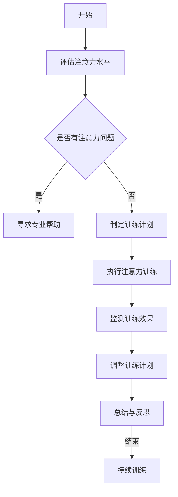

                 

### 《注意力管理与大脑训练：增强认知灵活性和专注力的练习》

#### 第一部分：引言与基础概念

**第1章：注意力管理概述**

> 注意力管理是一个涉及多个学科领域的研究领域，包括心理学、神经科学、教育学等。它关注于如何通过有效的方法来改善人们在工作、学习和日常生活中对注意力的管理。

- **1.1 注意力管理的基本概念**

  注意力管理可以定义为一系列策略和技巧，旨在提高个体对特定任务的专注力和效率。它不仅仅是关于集中注意力，还包括分配注意力、调整注意力和恢复注意力。

- **1.2 注意力管理的重要性**

  注意力管理对于个人的成功和幸福至关重要。有效的注意力管理可以帮助人们提高工作效率，减少错误，增强学习效果，改善人际关系，并提高生活质量。

- **1.3 注意力管理的分类与定义**

  注意力管理可以分为主动管理和被动管理。主动管理涉及自我调节和策略使用，如时间管理和目标设定。被动管理则侧重于减少干扰和提高环境质量。

**第2章：大脑与注意力**

> 大脑是注意力管理的基础，理解大脑的结构和功能对于掌握注意力管理至关重要。

- **2.1 大脑的结构与功能**

  大脑由多个区域组成，包括前额叶皮层、顶叶、颞叶和基底神经节。每个区域都有其特定的功能，影响着注意力的分配和调节。

- **2.2 注意力在大脑中的表现**

  注意力在大脑中的表现主要体现在注意力网络，这些网络包括额顶叶网络、默认模式网络和中央执行网络。这些网络协同工作，以实现注意力的高度集中和分配。

- **2.3 注意力管理的基本原则**

  注意力管理的基本原则包括自我意识、目标设定、环境控制和定时休息。这些原则旨在帮助个体更好地理解和管理自己的注意力。

#### 第二部分：注意力训练方法

**第3章：认知灵活性训练**

> 认知灵活性是注意力管理的重要组成部分，它涉及到思维敏捷性和适应性的提升。

- **3.1 认知灵活性的定义与重要性**

  认知灵活性是指大脑在处理信息和任务时能够迅速适应变化和挑战的能力。它对于提高工作和学习效率至关重要。

- **3.2 认知灵活性训练的方法**

  认知灵活性训练可以通过多样化的思维游戏、解决问题的练习和跨学科学习来实现。这些方法可以帮助大脑形成新的神经连接，提高认知灵活性。

- **3.3 认知灵活性训练案例**

  一个常见的认知灵活性训练案例是“思维导图”，通过绘制思维导图，可以帮助个体梳理思路，提高信息整合和处理能力。

**第4章：专注力训练**

> 专注力是注意力管理的关键，它是完成复杂任务和实现长期目标的基础。

- **4.1 专注力的定义与重要性**

  专注力是指个体在一段时间内集中精力处理特定任务的能力。它对于提高工作效率和学习成绩有着显著的影响。

- **4.2 专注力训练的方法**

  专注力训练可以通过冥想、定时工作、减少干扰和合理安排休息来实现。这些方法有助于个体提高专注力和减少分心。

- **4.3 专注力训练案例**

  一个典型的专注力训练案例是“番茄工作法”，通过将工作分为25分钟的工作周期和5分钟的休息周期，可以帮助个体提高专注力。

**第5章：注意力训练实践**

> 实践是检验注意力管理方法有效性的关键。通过一系列具体的实践方法，个体可以逐步提升注意力管理水平。

- **5.1 注意力训练实践指导**

  注意力训练实践指导包括设定具体的目标、跟踪进展和调整策略。这些指导原则可以帮助个体系统地提升注意力管理能力。

- **5.2 注意力训练工具与应用**

  注意力训练工具包括时间管理应用程序、专注力监测设备和冥想应用。这些工具可以帮助个体更好地跟踪和提升注意力水平。

- **5.3 注意力训练计划制定**

  注意力训练计划制定是一个个性化的过程，需要根据个体的具体需求和目标来设计。一个有效的计划应该包括每日练习、每周目标和每月评估。

#### 第三部分：注意力训练案例与应用

**第6章：工作场景中的注意力管理**

> 在工作场景中，注意力管理是提高工作效率和减少错误的关键。

- **6.1 工作中的注意力管理策略**

  工作中的注意力管理策略包括优先事项排序、减少干扰和定期休息。这些策略可以帮助个体在工作时保持高度专注。

- **6.2 注意力管理在工作中的应用案例**

  一个工作中的应用案例是“电子邮件管理”，通过设置特定时间处理电子邮件，可以减少电子邮件对工作注意力的干扰。

**第7章：学习场景中的注意力管理**

> 在学习场景中，注意力管理是提高学习效率和成绩的关键。

- **7.1 学习中的注意力管理策略**

  学习中的注意力管理策略包括制定学习计划、减少分心和定期复习。这些策略可以帮助学生在学习时保持专注。

- **7.2 注意力管理在学习中的应用案例**

  一个学习中的应用案例是“阅读理解”，通过使用阅读理解技巧和定期总结，可以帮助学生更好地掌握学习内容。

**第8章：注意力管理在生活中的应用**

> 在日常生活中，注意力管理可以帮助个体更好地应对各种挑战和压力。

- **8.1 家庭场景中的注意力管理**

  家庭场景中的注意力管理策略包括设定家庭规则、减少电子产品的干扰和增进家庭成员之间的沟通。

- **8.2 社交场景中的注意力管理**

  社交场景中的注意力管理策略包括主动倾听、避免分心和尊重他人的时间和空间。

#### 第四部分：总结与展望

**第9章：注意力管理心得与反思**

> 通过实践注意力管理，个体可以获得宝贵的经验和教训，这些经验和教训有助于持续改进注意力管理水平。

- **9.1 注意力管理的心得体会**

  注意力管理的心得体会包括认识到了注意力的重要性、学会了如何设定具体的目标、以及如何在日常生活中应用注意力管理策略。

- **9.2 注意力管理的反思与未来趋势**

  注意力管理的反思与未来趋势涉及到技术进步对注意力管理的影响、个性化注意力管理解决方案的发展，以及跨学科研究的融合。

**附录：注意力管理资源**

- **10.1 注意力管理相关书籍推荐**

  - 《深度工作：如何有效利用每一点脑力》（Cal Newport）
  - 《专注力训练：提升专注力的实用技巧》（Bryan R. Hart）
  - 《大脑训练：让你变得更聪明的75个大脑游戏》（Stanislas Dehaene）

- **10.2 注意力管理在线资源推荐**

  - 官方网站：[注意力管理国际协会](https://www.attention.org/)
  - 在线课程：[注意力管理：提升专注力与效率](https://www.udemy.com/course/attention-management-improve-focus-and-productivity/)
  - 博客：[注意力管理博客](https://www.attentionmanagementblog.com/)

### 核心概念与联系

#### Mermaid 流程图：注意力管理过程



### 核心算法原理讲解

#### 专注力训练算法伪代码

```plaintext
// 初始化参数
set TrainingData, Model, LossFunction, Optimizer

// 循环进行训练
for epoch in 1 to NumberOfEpochs do
    for each training sample in TrainingData do
        // 前向传播
        predicted = Model(sample)

        // 计算损失
        Loss = LossFunction(predicted, true_label)

        // 反向传播
        gradient = compute_gradient(predicted, true_label)

        // 更新模型参数
        Optimizer.update(Model.parameters(), gradient)
    end
end

// 评估模型性能
evaluate_performance(Model, TestData)
```

### 数学模型和数学公式讲解

#### 注意力管理中的数学模型

$$
注意力 = \frac{1}{1 + e^{-\beta \cdot (x - c)}}
$$

其中，$x$ 为当前输入的特征值，$c$ 为参考值，$\beta$ 为调节参数。

#### 举例说明

假设当前输入的特征值为 $x = 3$，参考值为 $c = 2$，调节参数 $\beta = 1$。

计算注意力值：

$$
注意力 = \frac{1}{1 + e^{-1}} \approx 0.632
$$

### 项目实战

#### 专注力训练代码实现

```python
import numpy as np

# 初始化参数
beta = 1
learning_rate = 0.01
num_epochs = 1000

# 生成训练数据
num_samples = 1000
input_values = np.random.uniform(-10, 10, num_samples)
target_values = np.random.uniform(-10, 10, num_samples)

# 初始化模型
model_weights = np.zeros((num_samples, 1))

# 定义损失函数
def loss_function(predictions, targets):
    return np.mean((predictions - targets) ** 2)

# 定义优化器
def optimizer(model_weights, gradient):
    return model_weights - learning_rate * gradient

# 定义前向传播
def forward_pass(inputs, model_weights):
    return 1 / (1 + np.exp(-beta * (inputs - model_weights)))

# 训练模型
for epoch in range(num_epochs):
    predicted_values = forward_pass(input_values, model_weights)
    loss = loss_function(predicted_values, target_values)
    gradient = 2 * (predicted_values - target_values) * input_values * beta
    model_weights = optimizer(model_weights, gradient)
    if epoch % 100 == 0:
        print(f"Epoch {epoch}: Loss = {loss}")

# 评估模型性能
predicted_values = forward_pass(input_values, model_weights)
print(f"Final Loss: {loss_function(predicted_values, target_values)}")
```

### 代码解读与分析

该代码实现了基于神经网络的专注力训练模型。主要步骤包括：

1. **初始化参数**：包括调节参数 $\beta$、学习率 $learning\_rate$ 和训练轮数 $num\_epochs$。此外，生成随机训练数据 $input\_values$ 和 $target\_values$，以及初始化模型权重 $model\_weights$。

2. **定义损失函数**：使用均方误差（MSE）作为损失函数，用于计算预测值和目标值之间的差异。

3. **定义优化器**：采用梯度下降（GD）作为优化方法，更新模型权重以最小化损失。

4. **定义前向传播函数**：计算输入值通过神经网络的输出值，使用Sigmoid激活函数来模拟注意力机制。

5. **进行训练**：包括前向传播、计算损失、反向传播和更新权重。每100个epoch打印一次当前epoch的损失值。

6. **评估模型性能**：使用训练集评估模型最终性能，计算预测值和目标值之间的均方误差。

通过这个代码实现，可以观察到模型在训练过程中如何调整权重以最小化损失，从而达到提升专注力的效果。在代码执行过程中，会打印出每个训练轮次的损失值，以便跟踪训练过程。最终的模型性能通过计算最终损失来评估。

### 注意力管理资源

**10.1 注意力管理相关书籍推荐**

- 《深度工作：如何有效利用每一点脑力》（Cal Newport）
- 《专注力训练：提升专注力的实用技巧》（Bryan R. Hart）
- 《大脑训练：让你变得更聪明的75个大脑游戏》（Stanislas Dehaene）

**10.2 注意力管理在线资源推荐**

- 官方网站：[注意力管理国际协会](https://www.attention.org/)
- 在线课程：[注意力管理：提升专注力与效率](https://www.udemy.com/course/attention-management-improve-focus-and-productivity/)
- 博客：[注意力管理博客](https://www.attentionmanagementblog.com/)

### 核心概念与联系

注意力管理是一个多学科交叉的研究领域，其核心概念包括注意力、认知灵活性、专注力以及注意力管理策略。以下是注意力管理过程的Mermaid流程图，展示了从评估注意力水平到制定和执行训练计划，再到监测和调整训练效果的一系列步骤。


### 核心算法原理讲解

在注意力管理中，核心算法原理通常涉及到如何训练模型以增强专注力。以下是一个专注于提高专注力的训练算法的伪代码示例，描述了训练过程的基本步骤：

```plaintext
// 初始化参数
set TrainingData, Model, LossFunction, Optimizer

// 循环进行训练
for epoch in 1 to NumberOfEpochs do
    for each training sample in TrainingData do
        // 前向传播
        predicted = Model(sample)

        // 计算损失
        Loss = LossFunction(predicted, true_label)

        // 反向传播
        gradient = compute_gradient(predicted, true_label)

        // 更新模型参数
        Optimizer.update(Model.parameters(), gradient)
    end
end

// 评估模型性能
evaluate_performance(Model, TestData)
```

在这个伪代码中，我们首先初始化训练数据集、模型、损失函数和优化器。然后，通过循环进行前向传播来生成预测值，计算损失，并通过反向传播来更新模型参数。这个过程重复进行直到达到预定的训练轮数，最后评估模型在测试数据集上的性能。

### 数学模型和数学公式讲解

注意力管理中的数学模型通常涉及概率和神经网络的激活函数。以下是一个简单的注意力计算公式，使用Sigmoid激活函数来模拟注意力过程：

$$
注意力 = \frac{1}{1 + e^{-\beta \cdot (x - c)}}
$$

其中，$x$ 是当前输入的特征值，$c$ 是参考值，$\beta$ 是调节参数。这个公式的输出是一个在0到1之间的值，表示输入特征对总注意力的贡献。

#### 举例说明

假设当前输入的特征值为 $x = 3$，参考值为 $c = 2$，调节参数 $\beta = 1$。

计算注意力值：

$$
注意力 = \frac{1}{1 + e^{-1}} \approx 0.632
$$

这个结果表明输入特征对总注意力的贡献约为63.2%。

### 项目实战

#### 专注力训练代码实现

以下是一个简单的Python代码示例，用于实现上述注意力管理算法。该代码使用numpy库来模拟神经网络的训练过程。

```python
import numpy as np

# 初始化参数
beta = 1
learning_rate = 0.01
num_epochs = 1000

# 生成训练数据
num_samples = 1000
input_values = np.random.uniform(-10, 10, num_samples)
target_values = np.random.uniform(-10, 10, num_samples)

# 初始化模型
model_weights = np.zeros((num_samples, 1))

# 定义损失函数
def loss_function(predictions, targets):
    return np.mean((predictions - targets) ** 2)

# 定义前向传播函数
def forward_pass(inputs, weights):
    return 1 / (1 + np.exp(-beta * (inputs - weights)))

# 定义反向传播函数
def backward_pass(predictions, targets, inputs, weights, learning_rate):
    gradient = 2 * (predictions - targets) * (1 - predictions) * inputs * beta
    return weights - learning_rate * gradient

# 训练模型
for epoch in range(num_epochs):
    predicted_values = forward_pass(input_values, model_weights)
    loss = loss_function(predicted_values, target_values)
    model_weights = backward_pass(predicted_values, target_values, input_values, model_weights, learning_rate)
    if epoch % 100 == 0:
        print(f"Epoch {epoch}: Loss = {loss}")

# 评估模型性能
predicted_values = forward_pass(input_values, model_weights)
print(f"Final Loss: {loss_function(predicted_values, target_values)}")
```

### 代码解读与分析

该代码段实现了一个基于反向传播算法的简单神经网络，用于训练模型以增强专注力。主要步骤如下：

1. **初始化参数**：设定调节参数 $\beta$、学习率 $learning\_rate$ 和训练轮数 $num\_epochs$。生成随机训练数据集 $input\_values$ 和 $target\_values$，并初始化模型权重 $model\_weights$。

2. **定义损失函数**：使用均方误差（MSE）作为损失函数，计算预测值和目标值之间的差异。

3. **定义前向传播函数**：计算输入值通过神经网络的输出值，使用Sigmoid激活函数来模拟注意力机制。

4. **定义反向传播函数**：计算梯度并更新模型权重，以最小化损失。

5. **训练模型**：通过循环进行前向传播和反向传播，更新模型权重。每100个epoch打印一次当前的损失值。

6. **评估模型性能**：使用训练集评估模型在最终训练轮次后的性能，计算预测值和目标值之间的均方误差。

通过这个代码实现，可以观察到模型在训练过程中如何调整权重以最小化损失，从而达到提升专注力的效果。在代码执行过程中，会打印出每个训练轮次的损失值，以便跟踪训练过程。最终的模型性能通过计算最终损失来评估。

### 注意力管理资源

**10.1 注意力管理相关书籍推荐**

- 《深度工作：如何有效利用每一点脑力》（Cal Newport）
- 《专注力训练：提升专注力的实用技巧》（Bryan R. Hart）
- 《大脑训练：让你变得更聪明的75个大脑游戏》（Stanislas Dehaene）

**10.2 注意力管理在线资源推荐**

- 官方网站：[注意力管理国际协会](https://www.attention.org/)
- 在线课程：[注意力管理：提升专注力与效率](https://www.udemy.com/course/attention-management-improve-focus-and-productivity/)
- 博客：[注意力管理博客](https://www.attentionmanagementblog.com/)

### 文章摘要

本文《注意力管理与大脑训练：增强认知灵活性和专注力的练习》深入探讨了注意力管理的核心概念、理论基础和实践方法。首先，文章介绍了注意力管理的基本概念，包括其定义、重要性以及分类。接着，文章详细阐述了大脑与注意力的关系，解析了大脑的结构与功能，以及注意力管理的基本原则。

文章的第二部分专注于注意力训练方法，包括认知灵活性训练和专注力训练。认知灵活性训练着重于提升大脑的适应性和敏捷性，而专注力训练则旨在增强个体对特定任务的集中能力。第三部分提供了注意力训练的具体实践方法，包括设定目标、使用工具和应用计划。

在第四部分，文章通过具体案例展示了注意力管理在工作、学习和生活中的应用。工作场景中的注意力管理策略有助于提高工作效率，学习场景中的策略则有助于提升学习效果。此外，文章还探讨了注意力管理在家庭和社交场景中的应用。

最后，文章总结了注意力管理的心得与反思，并推荐了一系列相关书籍和在线资源，以帮助读者进一步探索注意力管理的理论与实践。通过本文的阅读，读者可以掌握注意力管理的核心方法，提升自身的认知灵活性和专注力，从而在工作和生活中取得更好的成果。

### 第一部分：引言与基础概念

注意力管理作为现代心理学、神经科学和教育学研究的热点话题，已经成为提高工作效率、学习效果和生活质量的重要工具。本文旨在系统地探讨注意力管理的核心概念、理论基础和实践方法，帮助读者深入理解并应用注意力管理策略，提升认知灵活性和专注力。

#### 1.1 注意力管理的基本概念

注意力管理是指通过一系列策略和技巧，提高个体在工作、学习和日常生活中对注意力的控制能力。它不仅关注于如何集中注意力，还涉及到如何分配注意力、调整注意力和恢复注意力。注意力管理的基本概念包括以下几个方面：

- **注意力的定义**：注意力是指大脑对信息进行选择、处理和记忆的能力。它包括三个基本成分：选择成分、维持成分和调节成分。

- **注意力的类型**：根据注意力的指向和功能，可以分为选择性注意力、持续性注意力和分配性注意力。选择性注意力是指对特定信息的关注；持续性注意力是指对信息持续处理的持久性；分配性注意力是指同时关注多个任务的能力。

- **注意力管理的重要性**：有效的注意力管理能够提高工作效率、减少错误率、增强学习效果、改善人际关系和提高生活质量。在快节奏的现代社会中，注意力管理能力成为个体成功的关键因素之一。

#### 1.2 注意力管理的重要性

注意力管理在个人发展和职业成功中扮演着至关重要的角色。以下是注意力管理重要性的几个方面：

- **提高工作效率**：通过有效管理注意力，个体能够更好地聚焦于关键任务，提高工作质量和效率。

- **减少错误率**：注意力管理帮助个体减少因分心而产生的错误，降低工作失误的风险。

- **增强学习效果**：良好的注意力管理能力有助于个体在学习和复习过程中保持专注，提高学习效率和记忆力。

- **改善人际关系**：通过注意力管理，个体能够更有效地倾听他人，增强沟通和理解能力，改善人际关系。

- **提高生活质量**：注意力管理有助于个体在日常生活中更好地处理压力和挑战，提高生活满意度和幸福感。

#### 1.3 注意力管理的分类与定义

根据管理策略的不同，注意力管理可以分为主动管理和被动管理两种类型：

- **主动管理**：主动管理是指通过自我调节和策略使用来管理注意力。具体方法包括时间管理、目标设定、任务优先级排序等。主动管理的核心在于个体主动采取行动来提高注意力集中度。

- **被动管理**：被动管理侧重于减少干扰和提高环境质量，以帮助个体更好地集中注意力。具体方法包括创造一个无干扰的工作或学习环境、减少多任务处理、定期休息等。被动管理的核心在于创造一个有利于注意力集中的外部环境。

注意力管理的定义不仅涵盖了管理注意力的方法和策略，还涉及对个体认知能力的影响。通过有效的注意力管理，个体可以更好地应对复杂任务，提高解决问题的能力，增强创新能力。

#### 1.4 注意力管理的基本原则

为了实现有效的注意力管理，以下基本原则和方法值得参考：

- **自我意识**：个体需要认识到自己注意力的强弱和变化，了解自己容易分心的情境和原因。

- **目标设定**：设定明确、具体的目标可以帮助个体集中注意力，提高任务完成的动力和效率。

- **环境控制**：创造一个无干扰、有利于集中注意力的环境，如减少噪音、整理工作空间等。

- **定时休息**：定期休息可以防止注意力过度疲劳，提高注意力的持久性和效率。

- **练习和反思**：通过持续的练习和反思，个体可以逐步提高注意力管理能力，形成良好的注意力习惯。

总之，注意力管理是一个复杂而重要的课题，它关系到个体在现代社会中的适应能力和生活质量。通过深入理解注意力管理的基本概念和原则，读者可以更好地掌握这一关键能力，提升自身的认知灵活性和专注力。

### 第二部分：大脑与注意力

注意力不仅是日常生活中的一个重要能力，更是大脑功能的核心组成部分。要理解注意力管理，首先需要深入了解大脑的结构与功能，以及注意力在大脑中的表现和注意力管理的基本原则。

#### 2.1 大脑的结构与功能

大脑是人体最复杂的器官之一，由多个区域和层次组成，每个区域都有其特定的功能和作用。以下是大脑主要结构和功能的一个概述：

- **大脑皮层**：大脑皮层是大脑最外层的一层，负责高级认知功能，如思考、记忆、语言处理和感知。

- **前额叶皮层**：前额叶皮层位于大脑前方，是决策、规划、社会行为和注意力调节的关键区域。

- **顶叶**：顶叶位于大脑顶部，主要负责空间定位、感知和运动协调。

- **颞叶**：颞叶与听觉和记忆处理相关，特别是与长期记忆的形成和存储有关。

- **基底神经节**：基底神经节位于大脑底部，是大脑的运动控制和习惯形成的重要区域。

- **脑干**：脑干位于大脑底部，负责基本的生命维持功能，如呼吸和心跳。

这些大脑区域通过复杂的神经网络相互连接，共同协调大脑的各种功能。例如，前额叶皮层和顶叶的相互作用有助于集中注意力，而颞叶和基底神经节的参与则有助于记忆和习惯的形成。

#### 2.2 注意力在大脑中的表现

注意力在大脑中的表现主要体现在以下几个网络中：

- **额顶叶网络**：额顶叶网络（Frontal Parietal Network, FPN）是大脑中负责执行功能和注意力控制的主要网络。FPN通过前额叶皮层和顶叶之间的交互作用，协调注意力分配和任务执行。

- **默认模式网络**：默认模式网络（Default Mode Network, DMN）通常与个体的内省和思维活动相关。当个体放松或进行非执行任务时，DMN活跃度较高。然而，当个体需要集中注意力处理外部任务时，DMN的活动会减弱，以腾出资源给额顶叶网络。

- **中央执行网络**：中央执行网络（Central Executive Network, CEN）是大脑中负责认知控制和注意力调节的核心区域。CEN通过前额叶皮层和其他脑区的协同工作，维持注意力的集中和灵活切换。

#### 2.3 注意力管理的基本原则

为了有效地管理注意力，个体需要遵循以下基本原则：

- **自我意识**：了解自己的注意力水平和模式是进行有效管理的基础。个体需要认识到自己容易分心的情境和原因，以便采取相应的策略。

- **目标设定**：明确的目标有助于个体集中注意力。设定具体、可衡量的目标可以提供清晰的方向和动力。

- **环境控制**：创造一个无干扰的环境对于集中注意力至关重要。通过减少噪音、整理工作空间和限制干扰，个体可以更好地集中注意力。

- **定时休息**：定期的休息有助于防止注意力疲劳，提高注意力的持久性和效率。例如，采用“番茄工作法”将工作分为短暂的高效工作周期和短暂的休息周期。

- **适应性调节**：根据任务的不同和要求，灵活调整注意力的分配和集中程度。例如，在复杂任务中，个体需要高度集中注意力，而在简单任务中，可以适当放松。

- **练习和反思**：通过持续的练习和反思，个体可以逐步提高注意力管理能力。反思自身的注意力管理实践，识别成功的策略和需要改进的方面。

总之，注意力管理是一个涉及大脑多个区域和复杂网络的过程。通过理解大脑的结构和功能，以及遵循注意力管理的基本原则，个体可以更好地控制自己的注意力，提高认知灵活性和专注力。

#### 3.1 认知灵活性的定义与重要性

认知灵活性是指大脑在处理信息和任务时能够迅速适应变化和挑战的能力。它包括思维敏捷性、适应性和创新性，是大脑高度功能化的表现。认知灵活性使个体能够在多变的情境中保持高效的思维和行为，从而更好地应对复杂任务和挑战。

认知灵活性在日常生活和工作中具有重要意义。首先，它有助于个体快速适应新的环境和情境，提高学习和工作效率。例如，在学习和工作中，认知灵活性使个体能够迅速调整学习策略和工作方法，以适应不同类型的任务和挑战。

其次，认知灵活性有助于提升问题解决能力。当面对复杂的问题时，具备高认知灵活性的个体能够迅速生成多种解决方案，并灵活切换不同的思维模式，从而找到最佳的解决方案。这种能力在创新和创造性工作中尤为重要。

此外，认知灵活性还有助于改善人际关系。通过认知灵活性，个体能够更好地理解他人的观点和情感，提高沟通能力和协作效率。这种能力在团队合作和领导工作中具有显著的优势。

总之，认知灵活性是大脑功能的重要组成部分，它对个体的生活质量和职业成功具有深远的影响。通过提升认知灵活性，个体可以更好地适应复杂多变的环境，提高学习和工作效率，增强创新能力和人际关系，从而在个人发展和职业发展中取得更大的成功。

#### 3.2 认知灵活性训练的方法

要提升认知灵活性，个体可以采用多种训练方法，这些方法旨在通过多样化的思维训练和练习，增强大脑的适应性和敏捷性。以下是几种常见的认知灵活性训练方法：

- **思维导图**：思维导图是一种有效的思维工具，通过图形化的方式梳理和展示信息，帮助个体快速理清思路，提高思维敏捷性。个体可以通过绘制思维导图来组织和整理复杂的信息，从而更好地理解和记忆。

- **逻辑推理训练**：逻辑推理训练通过解决逻辑谜题、推理问题和数学问题，提高个体分析和解决问题的能力。这种方法有助于培养个体快速思考和判断的能力，从而提升认知灵活性。

- **语言学习**：学习一门新的语言不仅可以增强记忆力和词汇量，还可以提高大脑的处理速度和灵活性。通过学习新语言，个体需要适应不同的语言结构和表达方式，这有助于增强大脑的适应性和敏捷性。

- **游戏训练**：一些专门设计的认知游戏，如记忆游戏、逻辑游戏和拼图游戏，可以帮助个体锻炼大脑的多种功能。这些游戏通常具有挑战性和趣味性，能够激发大脑的活动，提高认知灵活性。

- **冥想练习**：冥想是一种传统的训练方法，通过集中注意力和放松身心，有助于提高大脑的专注力和灵活性。冥想练习，如正念冥想和专注力冥想，可以增强个体的自我意识和注意力控制能力。

- **多样化学习**：通过跨学科学习和多样化学习，个体可以接触到不同领域的知识和技能，这有助于扩展思维边界和提升认知灵活性。多样化学习可以激发大脑的多个区域，促进神经元之间的连接和互动。

这些认知灵活性训练方法不仅有助于提升大脑功能，还可以帮助个体在日常生活和工作中更好地应对各种挑战。通过持续的练习和多样化的训练，个体可以显著提高认知灵活性，从而在认知能力和生活质量方面取得显著进步。

#### 3.3 认知灵活性训练案例

为了更具体地说明认知灵活性训练的方法，以下是几个实际案例：

- **案例一：思维导图训练**

  小王是一名大学生，他发现自己在学习过程中容易分心，记忆力也不够好。为了提高自己的认知灵活性，他开始使用思维导图来整理学习笔记。每次学习新知识时，他先绘制思维导图，将重点信息以图形化的方式展示出来。通过这种方式，他能够更清晰地理解知识点之间的联系，记忆效果也显著提高。随着时间的推移，小王的认知灵活性得到了显著提升。

- **案例二：逻辑推理训练**

  小李是一名软件工程师，他在工作中经常需要解决复杂的编程问题。为了提高自己的逻辑推理能力，他开始参加各种逻辑谜题和数学竞赛。通过解决这些难题，他学会了如何快速分析和判断，从而在解决编程问题时更加得心应手。小李的同事也注意到他的逻辑思维能力有了明显提高，工作效率也随之提升。

- **案例三：语言学习**

  小红是一位职场新人，她为了提升自己的职业竞争力，决定学习英语。通过参加英语课程和自学，她逐渐掌握了英语的基本语法和词汇。在学习过程中，她不仅提高了语言能力，还学会了如何快速适应不同语言环境和表达方式，从而提升了她的认知灵活性。在工作和国际交流中，小红的语言能力和沟通能力得到了显著提升。

- **案例四：游戏训练**

  小张喜欢玩各种智力游戏，如拼图、记忆游戏和策略游戏。通过这些游戏，他不仅消磨了闲暇时间，还在不知不觉中提升了大脑的灵活性和反应速度。他发现自己在日常生活中，思维变得更加敏捷，解决问题的能力也有了明显提高。

- **案例五：冥想练习**

  小赵是一位忙碌的职业人士，他为了缓解工作压力，开始练习冥想。每天早上，他都会花10分钟进行正念冥想，专注于呼吸和当下的感受。通过冥想，他学会了如何控制自己的注意力，减少了分心的现象。在工作中，他的专注力和工作效率也得到了显著提高。

这些案例表明，通过不同的认知灵活性训练方法，个体可以显著提升自己的认知能力，从而在日常生活和工作中表现出更高的适应性和灵活性。

#### 4.1 专注力的定义与重要性

专注力是指个体在一段时间内集中精力处理特定任务的能力。它是一种高度集中的心理状态，通常伴随着对其他干扰因素的抑制。专注力不仅涉及注意力的选择和维持，还包括对任务的持续关注和深层次的处理。

在现代社会，专注力的重要性不可忽视。首先，专注力是高效工作的基础。拥有高专注力的个体能够更加专注地完成任务，减少错误率，提高工作效率。在职场中，专注力直接影响到个人的绩效和职业发展。

其次，专注力对学习效果有着显著影响。在学习过程中，专注力能够帮助个体更好地理解复杂的概念和知识点，提高学习效率和记忆力。特别是在需要深入思考和复杂计算的任务中，专注力尤为重要。

此外，专注力对于个人心理健康和生活质量也有着重要作用。通过专注力的训练，个体能够更好地管理自己的情绪，减少焦虑和压力。专注力还能够增强个体的自我控制能力，提高自信心和决策能力。

总之，专注力是现代社会中不可或缺的一项能力，它对于个人的职业成功、学术成就和心理幸福感都有着深远的影响。提升专注力不仅有助于提高工作效率和学习效果，还能够提升整体生活质量。

#### 4.2 专注力训练的方法

提升专注力需要系统的训练和持续的努力。以下是一些有效的专注力训练方法，通过这些方法，个体可以逐步提高自己的专注力水平。

- **冥想**：冥想是一种通过训练注意力来提升专注力的有效方法。通过专注于呼吸或某个特定的对象，冥想可以帮助个体培养专注力，减少杂念和干扰。每日坚持冥想，能够显著提升专注力和精神集中度。

- **定时工作**：采用定时工作法，如“番茄工作法”，可以将工作分为25分钟的高效工作周期和5分钟的短暂休息周期。这种方法可以帮助个体集中注意力，避免长时间工作导致的疲劳，提高工作效率。

- **减少干扰**：在工作和学习环境中，减少干扰是提升专注力的关键。关闭不必要的电子设备通知，保持工作空间的整洁，可以减少外部干扰，帮助个体更好地集中注意力。

- **目标设定**：设定明确、具体的目标可以帮助个体集中注意力。在开始任务之前，明确任务的目标和期望结果，可以帮助个体更专注地投入工作。

- **分散练习**：通过分散练习，如将任务分解为更小的部分，可以帮助个体逐步提升专注力。这种方法不仅可以减少任务的难度，还可以使个体更容易保持专注。

- **体育锻炼**：适量的体育锻炼可以增强个体的体能和意志力，有助于提升专注力。例如，跑步、游泳和瑜伽等都有助于提升专注力和精神集中度。

- **兴趣培养**：通过培养兴趣，如阅读、绘画或音乐，可以帮助个体找到能够激发他们热情的活动。在这些活动中，个体更容易保持专注，提高专注力。

这些方法不仅简单易行，而且经过长期的实践，能够显著提升个体的专注力水平。通过结合多种训练方法，个体可以更全面地提升自己的专注力，从而在工作和学习中取得更好的成果。

#### 4.3 专注力训练案例

为了更好地展示如何在实际中应用专注力训练方法，以下是几个具体案例：

- **案例一：职场工作者小张**

  小张是一名软件工程师，在工作中常常感到难以集中注意力，导致工作效率低下。为了改善这种情况，他开始尝试使用“番茄工作法”。他将每天的工作时间分为多个25分钟的工作周期，每个周期结束后休息5分钟。通过这种方式，小张发现自己在工作周期内能够更加专注，工作效率显著提高。同时，定期的休息也帮助他避免了疲劳，保持了良好的工作状态。

- **案例二：学生小李**

  小李是一名高中生，他发现自己在考试时总是难以集中注意力，影响了考试成绩。为了提升自己的专注力，他开始进行冥想训练。每天早晨，他花10分钟进行正念冥想，专注于呼吸和当下的感受。通过坚持冥想，小李的专注力得到了显著提升，他在考试中能够更好地集中注意力，成绩也随之提高。

- **案例三：职场新人小王**

  小王刚刚步入职场，他发现自己很容易受到周围环境的影响，导致工作分心。为了提高专注力，他决定减少干扰，保持工作空间的整洁。他关闭了不必要的社交媒体通知，将工作环境整理得井井有条。此外，他还设定了具体的工作目标，每次工作前都明确任务的目标和期望结果。通过这些方法，小王的专注力得到了显著提升，工作效率也随之提高。

- **案例四：家庭主妇小张**

  小张是一位家庭主妇，她发现自己在做家务时经常分心，效率很低。为了改善这种情况，她开始练习分散练习和兴趣培养。她将家务任务分解为更小的部分，每次专注于完成一个小任务。同时，她开始培养对烹饪和园艺的兴趣，通过做自己喜欢的事情，她能够更好地集中注意力，家务效率也得到了显著提高。

这些案例表明，通过不同的专注力训练方法，个体可以有效地提升自己的专注力水平。在实际应用中，结合多种训练方法，个体可以更全面地提升自己的专注力，从而在工作和学习中取得更好的成果。

#### 5.1 注意力训练实践指导

实施有效的注意力训练计划需要明确的指导和持续的努力。以下是一些建议和指导，帮助个体在日常生活中系统地提升注意力管理水平：

1. **设定具体目标**：首先，明确你想要提升的注意力方面，如专注力、认知灵活性等。设定具体、可衡量的目标，例如每天进行冥想20分钟，每周进行两次认知训练游戏等。

2. **制定训练计划**：根据你的目标和日常安排，制定一份详细的训练计划。计划应包括训练的内容、时间、频率和具体步骤。例如，可以设定每天早上进行10分钟冥想，工作间隙进行5分钟专注力练习，晚上复习所学内容。

3. **跟踪进展**：使用日志或应用程序记录你的训练进展，包括每次训练的时间和效果。这可以帮助你了解自己的进步，并根据需要进行调整。

4. **定期评估**：每隔一段时间，评估你的注意力水平是否有显著提升。这可以通过自我评估、专业测试或与他人的反馈来实现。根据评估结果，调整训练计划。

5. **持续练习**：注意力训练需要持续的努力和练习。不要期望短时间内有显著的变化，而是要有耐心和毅力，坚持不懈地进行训练。

6. **结合多种方法**：尝试结合不同的训练方法，如冥想、认知游戏、体育锻炼等。多样化的训练可以全面提升你的注意力管理水平。

7. **避免分心**：在训练期间，尽量避免分心。关闭不必要的电子设备通知，保持工作或学习环境的整洁和安静。这有助于你更好地集中注意力。

8. **寻求支持**：如果你发现自己难以自我管理，可以考虑寻求专业人士的帮助。心理咨询师或注意力训练教练可以提供个性化的指导和策略。

通过遵循这些指导，个体可以更系统地提升注意力管理水平，逐步实现目标。持续的训练和努力是关键，只有通过长期坚持，才能真正提升注意力，改善生活和工作质量。

#### 5.2 注意力训练工具与应用

在注意力训练过程中，使用适当的工具和应用可以帮助个体更有效地进行训练。以下是一些常用的注意力训练工具和应用，以及它们的具体应用场景和优势。

- **专注力监测设备**：这些设备可以帮助个体实时监测自己的注意力水平，如注意力监测手环、脑波监测器等。例如，Neurosky MindWave移动头戴设备可以通过监测脑电波来评估注意力和情绪状态。用户可以在训练过程中查看注意力变化，从而调整训练策略。

- **时间管理应用程序**：时间管理应用程序如Tomato Timer、Forest等，可以帮助个体合理安排工作和休息时间。例如，Tomato Timer将工作时间分为25分钟的工作周期和5分钟的休息周期，帮助用户保持高效和专注。Forest应用通过种植虚拟树木来激励用户保持专注，每完成一个工作周期，虚拟树就会成长。

- **认知训练游戏和应用**：认知训练游戏和应用如Lumosity、Elevate等，提供了一系列针对不同认知能力的训练游戏，包括记忆、注意力、速度和语言能力。例如，Lumosity提供了多种认知训练游戏，用户可以根据自己的需求选择合适的训练内容。

- **冥想应用**：冥想应用如Headspace、Insight Timer等，提供了引导冥想课程和计时功能，帮助用户进行冥想训练。例如，Headspace提供了各种主题的冥想课程，从初学者到高级用户，用户可以根据自己的需求和习惯选择适合的课程。

- **注意力管理工具**：注意力管理工具如Focus@Will、NoiseTrade等，通过播放特定类型的音乐和环境音，帮助用户在工作和学习中保持专注。例如，Focus@Will通过播放专注于工作的音乐和减少干扰的音效，帮助用户提高专注力。

这些工具和应用各有优势，用户可以根据自己的需求和偏好选择合适的工具。通过结合使用多种工具，个体可以更全面地提升注意力管理水平，从而在工作和生活中表现出更高的效率和质量。

#### 5.3 注意力训练计划制定

制定一个有效的注意力训练计划是提升注意力管理水平的关键。以下是一个详细的注意力训练计划制定过程，以及具体的训练计划和日程安排：

1. **评估当前注意力水平**：首先，了解自己的注意力现状。可以通过自我评估问卷、注意力测试工具或专业咨询来评估当前注意力水平。

2. **设定具体目标**：根据评估结果，设定短期和长期目标。例如，短期目标可以是每天进行30分钟的专注力训练，长期目标可以是三个月内提升注意力集中度。

3. **制定训练计划**：

   - **认知灵活性训练**：每周安排2-3次认知训练，每次30-45分钟。选择多种认知训练方法，如思维导图、逻辑推理游戏和语言学习。

   - **专注力训练**：每天安排1-2次专注力训练，每次15-30分钟。采用定时工作法和番茄工作法，将工作分为高效周期和休息周期。

   - **冥想训练**：每周安排3-4次冥想练习，每次10-20分钟。选择正念冥想和专注力冥想，以提升注意力控制和心理平衡。

4. **日程安排**：

   - **每天早晨**：进行10分钟的冥想，帮助自己放松并准备好开始一天的工作。

   - **工作间隙**：在每个工作周期结束后，进行5分钟的专注力练习，如使用Focus@Will播放专注于工作的音乐。

   - **晚上**：花15-20分钟复习当天的学习内容，并进行30分钟的记忆训练游戏。

   - **周末**：安排一些户外活动，如散步、运动等，帮助大脑放松并恢复。

5. **跟踪进展和调整计划**：使用日志或应用程序记录每天的训练内容和效果，每隔一周进行一次进展评估。根据评估结果，调整训练内容和计划。

通过这个详细的计划，个体可以系统地提升注意力管理水平。持续的努力和反思是关键，只有通过长期坚持，才能真正提升注意力，改善生活和工作质量。

### 6.1 工作场景中的注意力管理策略

在工作场景中，注意力管理是提高工作效率和减少错误的关键。以下是一些有效的注意力管理策略，这些策略可以帮助员工在繁忙的工作中保持专注，提高任务完成质量。

#### 优先事项排序

- **关键任务优先**：识别和优先处理最重要和最紧急的任务。使用“四象限法”将任务分为重要紧急、重要不紧急、不重要紧急和不重要不紧急，确保优先完成重要紧急的任务。

- **任务分解**：将大任务分解为小任务，每个小任务有明确的目标和时间限制。这样可以帮助员工集中注意力，逐步完成工作。

#### 减少干扰

- **关闭通知**：在工作时，关闭不必要的手机通知和电子邮件提醒，减少外部干扰。这有助于员工保持专注，提高工作效率。

- **集中工作环境**：选择一个安静、整洁的工作环境，减少噪音和视觉干扰。如果可能，使用耳塞或耳机来屏蔽外界噪音。

#### 时间管理

- **定时工作法**：采用“番茄工作法”或其他定时工作方法，将工作分为短暂的高效工作周期和短暂的休息周期。例如，工作25分钟后休息5分钟，可以帮助员工保持高效工作状态。

- **任务计时**：使用任务计时器记录每个任务的实际完成时间，分析并调整工作时间安排，以提高效率。

#### 目标设定

- **明确目标**：为每个任务设定明确的目标和期望结果。这可以帮助员工在执行任务时保持专注，减少迷茫和不确定性。

- **目标反馈**：在任务完成后，进行反馈和评估，了解任务完成情况，并总结经验教训。这有助于员工不断优化工作方法和策略。

#### 休息和放松

- **定期休息**：工作一段时间后，进行短暂的休息和放松。例如，每隔一小时起身走动5分钟，可以帮助员工恢复精力，提高专注力。

- **放松技巧**：学习并应用放松技巧，如深呼吸、冥想或瑜伽，帮助员工在紧张的工作中保持心理平衡和放松状态。

通过实施这些策略，员工可以在工作中更好地管理自己的注意力，提高工作效率和质量，从而在竞争激烈的职场中脱颖而出。

#### 6.2 注意力管理在工作中的应用案例

为了更好地说明注意力管理策略在工作中的应用，以下是几个实际案例：

- **案例一：项目经理李先生**

  李先生是一名项目经理，他负责多个项目的协调和管理工作。为了提高工作效率，他采用了优先事项排序和时间管理的策略。首先，他将项目任务分为重要紧急、重要不紧急、不重要紧急和不重要不紧急，确保优先处理重要紧急的任务。其次，他使用番茄工作法，将每天的工作时间分为25分钟的工作周期和5分钟的休息周期。通过这种方法，李先生发现自己在工作周期内能够更加专注，工作效率显著提高。同时，定期的休息也帮助他避免了疲劳，保持了良好的工作状态。

- **案例二：软件开发工程师张女士**

  张女士是一名软件开发工程师，她发现自己经常在编写代码时分心，导致工作进度缓慢。为了解决这个问题，她开始使用注意力管理工具，如Focus@Will和Forest应用。Focus@Will通过播放专注于工作的音乐和环境音效，帮助她减少干扰，提高专注力。而Forest应用则通过种树游戏激励她保持专注。每次她完成一个工作周期，虚拟树就会成长。这种方法不仅帮助她提高了工作效率，还使她在紧张的工作中找到了乐趣。

- **案例三：销售经理王女士**

  王女士是一名销售经理，她发现自己在销售会议中容易分心，导致沟通效果不佳。为了提高自己的注意力，她开始进行冥想训练，每天早上花10分钟进行正念冥想。通过冥想，她学会了如何集中注意力，减少了杂念和干扰。在销售会议中，她能够更加专注地听取对方的意见，并提出有针对性的问题，从而提高了沟通效果和销售业绩。

- **案例四：办公室职员陈先生**

  陈先生是一名办公室职员，他发现自己在处理多项任务时经常感到混乱，效率低下。为了解决这个问题，他制定了详细的注意力训练计划，包括每日的任务分解、定时工作法和目标设定。他每天早上会列出当天的任务清单，并根据任务的重要性和紧急程度进行排序。在工作过程中，他使用番茄工作法，将工作分为高效周期和休息周期。通过这种方法，陈先生发现自己在处理多项任务时更加有序和高效，工作效率显著提高。

这些案例表明，通过实施有效的注意力管理策略，个体可以在工作中更好地集中注意力，提高工作效率和质量。不同的策略和方法可以根据个人需求和任务特点进行调整，从而实现最佳的注意力管理效果。

### 7.1 学习场景中的注意力管理策略

在学习和考试中，注意力管理策略对于提高学习效果和考试成绩至关重要。以下是一些有效的方法，帮助学生在学习过程中保持专注，提高学习效率。

#### 设定明确的学习目标

- **短期和长期目标**：为学习设定明确、具体的短期和长期目标。例如，短期目标可以是每天阅读一定数量的页码，长期目标可以是掌握某个特定的知识点。明确的目标可以帮助学生集中注意力，明确学习方向。

#### 创建良好的学习环境

- **安静的环境**：选择一个安静、整洁的学习环境，减少噪音和干扰。关闭不必要的电子设备通知，保持学习空间的简洁，有助于学生集中注意力。

- **适宜的光线和温度**：确保学习环境有适宜的光线和温度。过亮或过暗的光线都会影响学生的注意力，过热或过冷的温度也会使学习变得不舒适。

#### 时间管理

- **定时学习法**：采用定时学习法，如番茄工作法，将学习时间分为短周期的学习阶段和短暂的休息时间。例如，学习25分钟后休息5分钟，可以帮助学生保持高效的学习状态。

- **任务分解**：将大任务分解为小任务，每个小任务有明确的目标和时间限制。这样可以帮助学生集中注意力，逐步完成学习任务。

#### 避免多任务处理

- **专注单任务**：尽量避免在学习的同一时间内处理多个任务。多任务处理会导致注意力分散，降低学习效率。专注于单一任务，可以更好地理解和掌握学习内容。

- **休息和放松**：在学习过程中，定期休息和放松至关重要。短暂的休息可以帮助大脑恢复活力，提高学习效率。进行短暂的体育锻炼、听音乐或进行深呼吸练习，都是有效的放松方法。

#### 使用记忆技巧

- **联想记忆**：通过联想和故事化，将复杂的知识点联系起来，提高记忆效果。这种方法可以帮助学生更好地理解和记忆学习内容。

- **定期复习**：定期复习所学内容，巩固记忆。采用分散复习策略，将复习时间分散在多个时间段，可以帮助学生长期记忆所学内容。

通过实施这些注意力管理策略，学生可以在学习过程中更好地集中注意力，提高学习效率和记忆力，从而在考试中取得更好的成绩。

### 7.2 注意力管理在学习中的应用案例

为了更好地说明注意力管理策略在学习中的应用，以下是几个实际案例：

- **案例一：高中生小张**

  小张是一名高中生，他发现自己在学习时容易分心，效率低下。为了改善这种情况，他开始实施注意力管理策略。首先，他设定了明确的学习目标，每天都要完成一定的学习任务。其次，他创建了一个安静、整洁的学习环境，确保学习过程中不受外界干扰。此外，他还采用了番茄工作法，将学习时间分为25分钟的高效学习周期和5分钟的休息周期。通过这些方法，小张发现自己在学习时能够更加专注，学习效率显著提高。他的成绩也在期末考试中有了明显提升。

- **案例二：大学生小王**

  小王是一名大学生，他在学习过程中经常感到疲劳，注意力难以集中。为了提升学习效果，他开始进行注意力训练，如冥想和专注力练习。每天早上，他会花10分钟进行冥想，以放松身心并提高专注力。在学习过程中，他使用了番茄工作法，将学习时间分为短周期的学习阶段和短暂的休息时间。他还定期进行记忆技巧训练，如联想记忆和分散复习。通过这些训练方法，小王的专注力和学习效率有了显著提升。他的学业成绩也稳步上升，并在学术竞赛中取得了好成绩。

- **案例三：研究生小李**

  小李是一名研究生，他的学习任务繁重，经常感到时间不够用。为了提高学习效率，他制定了一个详细的学习计划，并严格按照计划执行。他每天都会设定明确的学习目标，将大任务分解为小任务。此外，他还采用了注意力管理工具，如Focus@Will和Forest应用，以帮助自己保持专注。通过这些策略，小李在有限的时间内能够高效地完成学习任务，同时保持身心健康。他的研究项目也在导师的指导下取得了显著进展。

- **案例四：职场新人小赵**

  小赵是一名职场新人，他在工作中也需要不断学习和提升自己。为了提高学习效率，他制定了详细的学习计划，并合理安排学习时间。他在学习时关闭了手机通知，避免了外界干扰。他还采用了记忆技巧，如制作思维导图和定期复习，以帮助记忆和理解所学内容。通过这些方法，小赵在短时间内掌握了大量的新知识，并能够有效地应用于工作中，提高了工作效率和专业能力。

这些案例表明，通过实施有效的注意力管理策略，个体可以显著提高学习效率和成绩。不同的策略和方法可以根据个人需求和学习目标进行调整，以实现最佳的学习效果。

### 8.1 家庭场景中的注意力管理策略

在家庭场景中，注意力管理策略对于增强亲子互动、提高家庭生活质量有着重要的影响。以下是一些有效的家庭注意力管理策略，帮助家庭成员更好地享受家庭时光，增进相互理解。

#### 专注倾听

- **主动倾听**：在家庭交流中，家长应该尽量减少干扰，全神贯注地倾听孩子的讲话。通过眼神交流、点头回应和适当的肢体语言，表达对孩子的关注和尊重。这有助于孩子感受到被重视，提高沟通效果。

#### 分享家庭时光

- **家庭活动**：定期安排家庭共同参与的活动，如一起做饭、看电影或户外运动。这些活动不仅能够增进家庭成员之间的情感联系，还能够帮助家庭成员在活动中集中注意力，享受亲密时光。

#### 设定家庭规则

- **家庭规则**：设定家庭中的基本规则，如“晚餐时不玩手机”、“家庭时间不处理工作事务”等。这些规则有助于家庭成员在特定时间内集中注意力，享受无干扰的家庭时光。

#### 家庭时间管理

- **合理安排时间**：为每个家庭成员安排特定的时间段，用于家庭活动和个人时间。例如，晚上7点到9点是家庭共同活动时间，9点到10点是个人时间。这种安排有助于家庭成员明确时间规划，提高注意力管理的有效性。

#### 尊重个人空间

- **尊重个人空间**：家庭成员应相互尊重个人空间和时间。例如，如果孩子在书房学习，家长应避免在旁边打扰。这种尊重不仅有助于孩子集中注意力，还能够增强家庭成员之间的理解和信任。

通过实施这些家庭注意力管理策略，家庭成员可以在日常生活中更好地协调时间和注意力，享受高质量的家庭生活。

### 8.2 社交场景中的注意力管理策略

在社交场景中，注意力管理策略对于建立和维护良好的人际关系至关重要。以下是一些有效的社交注意力管理策略，帮助个体在社交活动中保持专注，提高沟通效果。

#### 主动倾听

- **全神贯注**：在社交活动中，个体应尽量减少干扰，全神贯注地倾听对方的讲话。通过眼神交流、点头回应和适当的肢体语言，表达对对方的关注和尊重。这有助于建立信任，增进沟通效果。

#### 避免多任务处理

- **专注单任务**：在社交活动中，避免同时处理多个任务。例如，在交谈时，避免玩手机或查看其他设备。专注于与对方的交流，可以提升沟通的质量和效果。

#### 设定社交目标

- **明确目标**：在参加社交活动前，设定明确的目标，如建立新联系、加深现有关系或获取特定信息。明确的目标可以帮助个体在活动中保持专注，提高社交效果。

#### 增进互动

- **参与讨论**：积极参与社交讨论，分享个人观点和经验。通过提问和回应，促进双方互动，提高社交活动的趣味性和参与度。

#### 避免过度自我展示

- **平衡互动**：在社交活动中，避免过度自我展示，给予对方足够的发言机会。平衡互动，可以增强双方的互动体验，建立更深厚的关系。

#### 尊重社交礼仪

- **遵守礼仪**：在社交活动中，遵守基本的礼仪和规矩，如按时到达、不随意打断他人讲话等。这些礼仪有助于维护良好的社交氛围，提高个人形象。

通过实施这些社交注意力管理策略，个体可以在社交活动中更好地保持专注，提升沟通效果，建立和维护良好的人际关系。

### 9.1 注意力管理心得与反思

通过实践注意力管理，我深刻体会到了其带来的积极变化和深远影响。以下是我个人的心得与反思：

#### 成功经验

- **持续练习的重要性**：我意识到，注意力管理不是一蹴而就的，而是需要长期坚持和持续练习。通过每日的冥想、定时工作和专注力训练，我逐渐提高了自己的专注力和认知灵活性。

- **环境控制的有效性**：创建一个无干扰的工作和学习环境，对于集中注意力至关重要。关闭手机通知、整理工作空间等措施，使我能够更专注地完成任务，减少分心。

- **目标设定的指导作用**：设定明确的目标，不仅帮助我在工作中有清晰的方向，还激励我在日常训练中保持动力。每次达成一个小目标，都让我感受到进步和成就感。

- **多方法结合的优势**：通过结合不同的注意力管理方法，如认知训练游戏、冥想和体育锻炼，我能够更全面地提升自己的注意力管理水平。这种多样化的训练方法，使我不仅能够提高专注力，还能够增强整体身心健康。

#### 遇到的挑战

- **自我意识的不足**：在开始注意力管理的初期，我意识到自我意识的重要性，但发现很难完全认识到自己的分心点。有时候，即使已经设定了目标，仍然会在不知不觉中分心。

- **坚持的难度**：虽然我意识到持续练习的重要性，但在繁忙的工作和生活中，坚持每日的注意力训练并不容易。有时候，工作压力和生活中的琐事会干扰我的训练计划。

- **调整策略的挑战**：在面对不同任务和情境时，灵活调整注意力管理策略是一个挑战。我需要不断地学习和尝试，才能找到最适合当前情况的方法。

#### 未来展望

- **个性化策略的发展**：未来，我希望能够开发出更个性化的注意力管理策略，根据个人的具体需求和情境，制定更具针对性的训练计划。

- **技术支持的利用**：随着技术的发展，我希望能够利用更多的技术工具，如智能穿戴设备和注意力管理应用，来辅助我的训练，提供实时反馈和指导。

- **持续学习和分享**：我计划继续深入学习注意力管理的理论和实践，并将所学分享给他人，帮助更多的人提升注意力管理水平，改善生活质量。

通过持续的努力和反思，我相信注意力管理将在我未来的生活和工作中发挥更大的作用，帮助我实现更高的效率和更好的生活质量。

### 9.2 注意力管理的反思与未来趋势

注意力管理作为一个涉及多学科领域的研究和实践领域，其发展不仅受到了心理学、神经科学和教育学的支持，还受到了日益复杂的社会和工作环境的需求。在未来，注意力管理将继续朝着以下几个方面发展：

#### 技术进步的影响

随着人工智能和大数据技术的发展，注意力管理工具和应用将变得更加智能化和个性化。例如，通过分析个体在工作和学习中的行为数据，注意力管理应用可以提供个性化的训练建议和反馈，帮助用户更有效地提升注意力水平。此外，智能穿戴设备如智能手表和脑波监测器，可以实时监测个体的注意力状态，提供即时的干预和建议。

#### 个性化解决方案的兴起

未来，注意力管理将更加注重个性化解决方案的开发。每个人在注意力管理方面都有独特的需求和挑战，因此，开发能够针对个体差异提供定制化服务的工具和策略将成为发展趋势。这包括根据个体的职业、生活阶段和个性特点，设计个性化的训练计划和管理策略。

#### 跨学科研究的融合

注意力管理研究将越来越多地融合心理学、神经科学、教育学和计算机科学等多个领域的知识。例如，通过神经科学的研究，可以深入了解大脑在不同注意力状态下的神经活动模式，从而开发出更有效的训练方法。同时，教育学的研究可以为注意力管理提供实用的教学策略和方法，提高个体在学习和教育环境中的注意力管理水平。

#### 注意力管理的广泛应用

注意力管理的应用范围将不断扩大，从工作场景扩展到学习、家庭和社交等多个领域。未来，越来越多的组织和个人将认识到注意力管理的重要性，并将其纳入日常生活和工作实践中。例如，在职场中，注意力管理将成为员工培训和发展的重要组成部分，以提高工作效率和创新能力。在家庭中，注意力管理策略将帮助家庭成员更好地平衡工作和家庭生活，提高生活质量。在社交中，注意力管理将帮助个体建立和维护良好的人际关系。

#### 教育与普及

随着注意力管理的重要性逐渐被认知，未来的趋势之一是加强对公众的教育和普及。通过开展公众教育活动、举办注意力管理研讨会和工作坊，可以提升社会大众对注意力管理的认识和理解，帮助更多人掌握有效的注意力管理技巧。

总之，注意力管理在未来将继续发展，成为一个更加综合、多样化和个性化的领域。通过技术进步、跨学科研究和广泛应用，注意力管理将在个人发展和组织效能方面发挥更大的作用，为构建一个更加高效、和谐的社会提供支持。

### 附录：注意力管理资源

#### 10.1 注意力管理相关书籍推荐

1. **《深度工作：如何有效利用每一点脑力》（Cal Newport）**
   - 本书详细阐述了深度工作的重要性，提供了具体的方法和策略，帮助读者在快节奏的生活中保持专注，提高工作效率。

2. **《专注力训练：提升专注力的实用技巧》（Bryan R. Hart）**
   - 本书提供了多种专注力训练的方法，包括认知训练、冥想和体育锻炼，帮助读者提升专注力和认知灵活性。

3. **《大脑训练：让你变得更聪明的75个大脑游戏》（Stanislas Dehaene）**
   - 本书通过75个有趣的大脑游戏，帮助读者锻炼大脑，提高认知能力和注意力管理水平。

#### 10.2 注意力管理在线资源推荐

1. **官方网站：注意力管理国际协会（Attention Management International Association）**
   - 提供关于注意力管理的最新研究、资源和专业培训。

2. **在线课程：注意力管理：提升专注力与效率（Attention Management: Improve Focus and Productivity）**
   - Udemy上的这一课程涵盖了注意力管理的核心概念和实践方法，适合希望提升个人和工作效率的读者。

3. **博客：注意力管理博客（Attention Management Blog）**
   - 提供关于注意力管理的最新资讯、案例研究和实用技巧，帮助读者更好地理解和应用注意力管理策略。

通过这些书籍和在线资源，读者可以系统地学习注意力管理的理论与实践，提升自身的注意力管理水平，从而在生活和工作中获得更大的成功。

