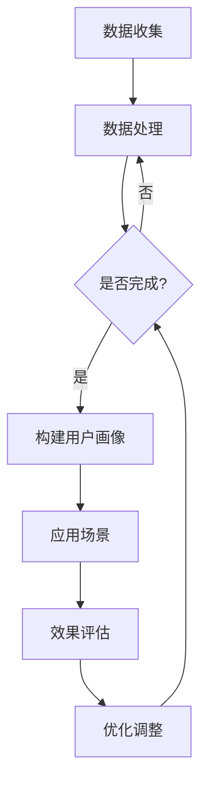

                 

# 注意力经济与个性化营销：如何针对受众定制你的信息

> **关键词**：注意力经济、个性化营销、用户画像、实时推荐系统、案例分析

> **摘要**：本文将深入探讨注意力经济与个性化营销的理论与实践，解析注意力资源在营销中的应用，并介绍个性化营销的核心技术和实际案例。通过本文，读者将了解如何利用注意力经济原理，为不同受众定制高质量的信息和服务，提升营销效果。

## 第一部分：注意力经济的理论基础

### 第1章：注意力经济概述

#### 1.1 注意力经济的起源与发展

**注意力经济的定义**：注意力经济是指一种以用户注意力为稀缺资源，通过争夺和吸引用户注意力来实现经济价值创造的经济模式。与传统经济模式不同，注意力经济强调的是信息传播和用户参与。

**注意力经济的核心观点**：注意力经济认为，用户的时间、精力和关注都是有限的，如何有效地吸引并保持用户的注意力，是企业赢得市场竞争的关键。

**注意力经济与传统经济的关系**：传统经济主要关注物质资源的分配和利用，而注意力经济则更加关注用户注意力的分配和利用。两者并非替代关系，而是互补关系。传统经济为注意力经济提供了物质基础，而注意力经济则赋予了传统经济新的发展动力。

#### 1.2 注意力资源的特性

**注意力资源的稀缺性**：用户的时间、精力和注意力都是有限的，因此注意力资源具有稀缺性。

**注意力资源的易分散性**：用户容易受到各种信息的干扰，导致注意力分散。因此，如何有效地吸引并保持用户的注意力，是企业面临的一大挑战。

**注意力资源的转移性**：用户可以在不同信息、产品和服务之间转移注意力。因此，企业需要不断创新，提供更有吸引力的内容和服务，以留住用户。

#### 1.3 注意力经济的主要模型

**注意力转移模型**：用户在接收到多个信息时，会根据信息的吸引力、重要性和相关性等因素，选择一个或多个信息进行关注。企业可以通过提高信息的吸引力、相关性和重要性，来引导用户注意力转移。

**注意力吸引模型**：企业通过创造吸引人的内容、提供独特的产品和服务，来吸引用户的注意力。注意力吸引模型强调的是内容创新和用户体验。

**注意力锁定模型**：企业通过提供持续、稳定、有价值的内容和服务，来锁定用户的注意力，建立长期用户关系。注意力锁定模型强调的是用户黏性和品牌忠诚度。

## 第2章：个性化营销的理论基础

### 2.1 个性化营销的概念与类型

#### 2.1.1 个性化营销的定义

**个性化营销**：个性化营销是一种基于用户数据的分析，为每个用户提供定制化内容、产品或服务的营销方式。个性化营销的核心是满足用户的个性化需求，提高用户满意度和忠诚度。

#### 2.1.2 个性化营销的演进过程

1. **原始个性化营销**：以用户基本信息为依据，进行简单的内容推送。
2. **基于行为的个性化营销**：根据用户行为数据进行内容推送，提高推送的相关性。
3. **基于数据驱动的个性化营销**：利用大数据和人工智能技术，构建用户画像，实现高度个性化的内容和服务。

#### 2.1.3 个性化营销的类型与特点

1. **内容个性化**：根据用户兴趣和偏好，为用户提供定制化的内容。
2. **产品个性化**：根据用户需求，为用户提供定制化的产品或服务。
3. **场景个性化**：根据用户所处的场景，为用户提供定制化的内容和服务。

### 2.2 个性化营销的核心要素

#### 2.2.1 数据收集与处理

**数据收集**：通过网站、APP、线下活动等渠道，收集用户的行为数据、兴趣数据、需求数据等。

**数据处理**：对收集到的数据进行清洗、去重、归一化等预处理操作，构建用户画像。

#### 2.2.2 用户画像构建

**用户画像的概念**：用户画像是对用户特征的整体描述，包括用户的基本信息、行为特征、兴趣偏好等。

**用户画像的构成**：用户画像通常包括以下方面：
- 基本信息：年龄、性别、职业等。
- 行为特征：浏览记录、购买行为、评论等。
- 兴趣偏好：兴趣爱好、内容偏好等。

#### 2.2.3 实时推荐系统

**实时推荐系统的基本原理**：实时推荐系统通过分析用户行为数据和用户画像，实时为用户推荐感兴趣的内容或产品。

**实时推荐系统的实现方法**：
- 基于协同过滤的方法：通过分析用户行为数据，找出相似用户和相似物品，为用户提供推荐。
- 基于内容的推荐方法：通过分析用户兴趣和内容特征，为用户提供推荐。
- 混合推荐方法：结合协同过滤和基于内容的推荐方法，为用户提供更精准的推荐。

### 2.3 个性化营销的优势与挑战

#### 2.3.1 个性化营销的优势

- 提高用户满意度：为用户提供定制化的内容和服务，满足用户的个性化需求。
- 提高营销效果：通过精准推荐，提高转化率和用户黏性。
- 增强品牌认知度：通过持续、稳定、有价值的内容和服务，提高品牌认知度和忠诚度。

#### 2.3.2 个性化营销的挑战

- 数据隐私与伦理问题：用户数据收集和处理过程中，如何保护用户隐私，遵守伦理规范。
- 数据质量与准确性：用户数据的真实性和准确性对个性化营销效果具有重要影响。
- 技术实现与成本：构建实时推荐系统需要较高的技术实现和成本投入。

## 第3章：注意力经济与个性化营销的结合

### 3.1 注意力经济对个性化营销的影响

#### 3.1.1 注意力资源的分配策略

**注意力资源分配的原则**：公平性、效率性和可持续性。

**注意力资源分配的方法**：
- 市场机制：通过价格、竞争等机制，实现注意力资源的有效分配。
- 政府调控：通过政策、法规等手段，引导注意力资源的合理分配。

#### 3.1.2 注意力转移与吸引策略

**注意力转移策略**：通过内容创新、场景营造等方式，引导用户将注意力从其他信息转移到企业信息。

**注意力吸引策略**：通过独特的产品、优质的服务、有吸引力的内容等，吸引并留住用户的注意力。

#### 3.1.3 注意力锁定与持续关注策略

**注意力锁定策略**：通过持续、稳定、有价值的内容和服务，建立用户对品牌的信任和依赖，实现用户注意力的长期锁定。

**持续关注策略**：通过用户反馈、数据分析等手段，了解用户需求和偏好，持续优化内容和服务，提高用户满意度。

### 3.2 个性化营销的策略与实践

#### 3.2.1 数据驱动的个性化营销策略

**数据驱动的个性化营销流程**：
1. 数据收集：收集用户行为数据、兴趣数据、需求数据等。
2. 数据处理：清洗、去重、归一化等预处理操作，构建用户画像。
3. 实时推荐：根据用户画像，实时为用户推荐感兴趣的内容或产品。
4. 反馈优化：收集用户反馈，不断优化推荐算法和内容策略。

#### 3.2.2 内容驱动的个性化营销策略

**内容驱动的个性化营销原则**：以用户需求为导向，提供有价值、有吸引力、个性化的内容。

**内容驱动的个性化营销方法**：
- 内容创作：根据用户画像，创作符合用户兴趣和需求的内容。
- 内容推广：通过社交媒体、SEO等手段，提高内容的曝光度和吸引力。
- 内容互动：通过评论、点赞、分享等互动方式，增强用户参与度和忠诚度。

#### 3.2.3 用户行为驱动的个性化营销策略

**用户行为驱动的个性化营销原则**：关注用户行为数据，挖掘用户需求，提供个性化的服务。

**用户行为驱动的个性化营销方法**：
- 行为分析：通过分析用户行为数据，了解用户需求和行为模式。
- 行为预测：基于用户行为数据，预测用户未来的行为和需求。
- 行为干预：通过个性化推送、优惠活动等方式，引导用户行为，提高转化率和用户满意度。

### 3.3 注意力经济与个性化营销的案例分析

#### 3.3.1 案例一：社交媒体平台的内容推荐

**案例背景**：社交媒体平台通过内容推荐，吸引用户的注意力，提高用户黏性和活跃度。

**案例分析**：
1. 数据收集与处理：收集用户行为数据，如浏览记录、点赞、评论等，构建用户画像。
2. 实时推荐：根据用户画像，实时推荐感兴趣的内容。
3. 用户反馈与优化：收集用户反馈，不断优化推荐算法和内容策略。

**效果分析**：通过内容推荐，有效提高了用户黏性和活跃度，实现了注意力的有效转移和吸引。

#### 3.3.2 案例二：电商平台的个性化购物体验

**案例背景**：电商平台通过个性化购物体验，提高用户购买转化率和满意度。

**案例分析**：
1. 用户画像构建：收集用户行为数据，构建用户画像。
2. 个性化购物推荐：根据用户画像，推荐符合用户兴趣和需求的产品。
3. 个性化购物体验：提供定制化的购物流程、优惠活动等。

**效果分析**：通过个性化购物体验，有效提高了用户购买转化率和满意度，实现了注意力的有效锁定和持续关注。

#### 3.3.3 案例三：教育平台的个性化学习服务

**案例背景**：教育平台通过个性化学习服务，提高用户学习效果和满意度。

**案例分析**：
1. 用户画像构建：收集用户学习行为数据，构建用户画像。
2. 个性化学习推荐：根据用户画像，推荐适合用户的学习内容和课程。
3. 个性化学习体验：提供定制化的学习计划、学习资源等。

**效果分析**：通过个性化学习服务，有效提高了用户学习效果和满意度，实现了注意力的有效转移和吸引。

## 第4章：个性化营销技术的实现

### 4.1 个性化营销技术概述

**个性化营销的技术框架**：个性化营销技术主要包括数据收集与处理、用户画像构建、实时推荐系统等模块。

**个性化营销的关键技术**：
1. **数据挖掘与机器学习**：用于分析用户行为数据，构建用户画像。
2. **推荐算法**：用于实现实时推荐系统，提高推荐的相关性和准确性。
3. **用户交互与反馈**：用于收集用户反馈，优化推荐算法和内容策略。

### 4.2 数据收集与处理技术

**用户行为数据的收集方法**：
- **网页跟踪**：通过网页脚本，收集用户在网站上的行为数据。
- **APP跟踪**：通过APP内置的跟踪功能，收集用户在APP中的行为数据。
- **问卷调研**：通过在线问卷或线下调研，收集用户的基本信息和需求数据。

**数据清洗与预处理技术**：
- **数据去重**：去除重复的数据，保证数据的唯一性。
- **数据归一化**：将不同类型的数据进行归一化处理，使其具有可比性。
- **数据离散化**：将连续数据转换为离散数据，便于分析和处理。

**数据存储与管理技术**：
- **关系数据库**：用于存储结构化数据，如用户基本信息、行为数据等。
- **NoSQL数据库**：用于存储非结构化数据，如用户画像、推荐结果等。
- **数据仓库**：用于存储大规模的数据集，支持数据分析与挖掘。

### 4.3 用户画像构建技术

**用户画像的概念与构成**：
- **用户画像**：是对用户特征的整体描述，包括用户的基本信息、行为特征、兴趣偏好等。
- **用户画像的构成**：
  - **基本信息**：年龄、性别、职业等。
  - **行为特征**：浏览记录、购买行为、评论等。
  - **兴趣偏好**：兴趣爱好、内容偏好等。

**用户画像的构建方法**：
1. **数据收集**：通过数据收集技术，获取用户行为数据、兴趣数据等。
2. **数据处理**：对收集到的数据进行清洗、去重、归一化等预处理操作。
3. **特征提取**：通过数据挖掘和机器学习技术，提取用户的行为特征和兴趣偏好。
4. **模型训练**：构建用户画像模型，对用户进行分类和标签化。

**用户画像的应用场景**：
1. **个性化推荐**：根据用户画像，为用户提供个性化的内容、产品或服务。
2. **用户分类**：根据用户画像，对用户进行分类，实现精准营销。
3. **行为预测**：根据用户画像，预测用户未来的行为和需求，进行精准营销。

### 4.4 实时推荐系统技术

**实时推荐系统的基本原理**：
- **协同过滤**：通过分析用户行为数据，找出相似用户和相似物品，为用户提供推荐。
- **基于内容的推荐**：通过分析用户兴趣和内容特征，为用户提供推荐。
- **混合推荐**：结合协同过滤和基于内容的推荐方法，为用户提供更精准的推荐。

**实时推荐系统的实现方法**：
1. **数据收集**：收集用户行为数据，如浏览记录、购买记录等。
2. **数据处理**：对收集到的数据进行清洗、去重、归一化等预处理操作。
3. **特征提取**：提取用户的行为特征和兴趣偏好。
4. **模型训练**：训练推荐模型，如协同过滤模型、基于内容的推荐模型等。
5. **实时推荐**：根据用户画像和推荐模型，实时为用户推荐感兴趣的内容或产品。

**实时推荐系统的性能优化**：
1. **数据预处理优化**：优化数据清洗、去重、归一化等预处理操作，提高数据处理效率。
2. **特征提取优化**：优化特征提取方法，提高特征的质量和准确性。
3. **模型训练优化**：优化模型训练过程，提高推荐模型的性能和鲁棒性。
4. **实时推荐优化**：优化推荐算法和系统架构，提高实时推荐的响应速度和准确性。

## 第5章：个性化营销案例分析

### 5.1 案例一：社交媒体平台的个性化广告

**5.1.1 案例背景**

社交媒体平台通过个性化广告，为广告主提供精准营销服务，提高广告效果。

**5.1.2 个性化广告的策略与方法**

1. **用户画像构建**：收集用户行为数据、兴趣数据等，构建用户画像。
2. **广告内容定制**：根据用户画像，为用户提供定制化的广告内容。
3. **广告展示优化**：通过算法优化，提高广告的展示效果和用户点击率。

**5.1.3 案例效果分析**

个性化广告策略显著提高了广告的点击率和转化率，实现了精准营销的目标。

### 5.2 案例二：电商平台的个性化购物体验

**5.2.1 案例背景**

电商平台通过个性化购物体验，提高用户购买转化率和满意度。

**5.2.2 个性化购物体验的实现方法**

1. **用户画像构建**：收集用户行为数据、兴趣数据等，构建用户画像。
2. **个性化推荐**：根据用户画像，为用户提供个性化的商品推荐。
3. **个性化购物流程**：提供定制化的购物流程，如个性化搜索、个性化购物车等。

**5.2.3 案例效果分析**

个性化购物体验显著提高了用户购买转化率和满意度，实现了个性化营销的目标。

### 5.3 案例三：教育平台的个性化学习服务

**5.3.1 案例背景**

教育平台通过个性化学习服务，提高用户学习效果和满意度。

**5.3.2 个性化学习服务的实现方法**

1. **用户画像构建**：收集用户学习行为数据、兴趣数据等，构建用户画像。
2. **个性化学习推荐**：根据用户画像，为用户提供个性化的学习内容和课程。
3. **个性化学习体验**：提供定制化的学习计划、学习资源等。

**5.3.3 案例效果分析**

个性化学习服务显著提高了用户学习效果和满意度，实现了个性化营销的目标。

## 第6章：个性化营销的未来发展趋势

### 6.1 个性化营销技术的发展趋势

**6.1.1 大数据与人工智能的深度融合**

大数据和人工智能技术的发展，为个性化营销提供了强大的技术支撑。未来，个性化营销将更加依赖于大数据分析和人工智能算法，实现更精准、更智能的营销。

**6.1.2 增强现实与虚拟现实的结合**

增强现实（AR）和虚拟现实（VR）技术的结合，将改变用户的消费习惯和体验方式。未来，个性化营销将借助AR和VR技术，为用户提供更加沉浸式、个性化的购物和学习体验。

**6.1.3 跨平台与跨领域的个性化服务**

随着互联网的不断发展，个性化营销将不仅仅局限于单一平台或领域，而是实现跨平台、跨领域的个性化服务。未来，个性化营销将更加关注用户的全渠道体验，实现全场景、全周期的个性化服务。

### 6.2 个性化营销的挑战与机遇

**6.2.1 数据隐私与伦理问题**

随着个性化营销的不断发展，用户数据的收集和处理将面临越来越多的隐私和伦理问题。未来，个性化营销需要建立完善的数据隐私保护机制，遵守伦理规范，确保用户数据的合法、安全和合理使用。

**6.2.2 技术创新与市场竞争**

个性化营销的发展离不开技术创新。未来，个性化营销将面临激烈的市场竞争，企业需要不断进行技术创新，提高个性化营销的效率和效果，以应对市场变化和用户需求的变化。

**6.2.3 消费者行为与心理变化**

随着消费者行为和心理的不断变化，个性化营销也需要不断调整和优化。未来，个性化营销将更加关注消费者的心理需求和行为习惯，提供更加人性化、个性化的服务。

## 第7章：总结与展望

### 7.1 注意力经济与个性化营销的总结

**7.1.1 注意力经济与个性化营销的核心思想**

注意力经济强调以用户注意力为稀缺资源，通过有效吸引和保持用户注意力，实现经济价值创造。个性化营销则强调基于用户数据的分析，为用户提供定制化内容、产品或服务，提高用户满意度和忠诚度。

**7.1.2 注意力经济与个性化营销的实践意义**

注意力经济与个性化营销的结合，为企业在激烈的市场竞争中提供了新的发展机遇。通过有效利用注意力资源，企业可以更好地满足用户需求，提高用户满意度和忠诚度，实现持续增长。

### 7.2 未来的研究方向与实践方向

**7.2.1 个性化营销技术的创新与发展**

未来，个性化营销技术将不断创新发展，包括大数据分析、人工智能算法、增强现实与虚拟现实等。企业需要紧跟技术发展趋势，不断优化个性化营销技术，提高营销效率和效果。

**7.2.2 注意力资源的有效利用**

未来，企业需要更加重视注意力资源的有效利用，通过精准营销、个性化推荐等方式，实现注意力资源的最大化利用。同时，企业需要关注数据隐私与伦理问题，确保用户数据的合法、安全和合理使用。

**7.2.3 消费者体验的提升与优化**

未来，个性化营销将更加关注消费者体验的提升与优化。企业需要深入了解消费者需求和行为，提供更加人性化、个性化的服务，提高消费者满意度和忠诚度。

### 作者

**作者**：AI天才研究院/AI Genius Institute & 禅与计算机程序设计艺术 /Zen And The Art of Computer Programming

[Mermaid 流程图](#)

[伪代码](#)

[数学模型和公式](#)

[项目实战](#)

[代码解读与分析](#)<|less>

由于文本限制，下面是一个Mermaid流程图的示例，用于描述用户画像构建的过程。请注意，为了确保Markdown格式的正确性，这个示例在文章主体内容中并不会直接工作。



伪代码用于描述算法原理，这里提供一个简单的基于协同过滤的推荐算法的伪代码示例：

```plaintext
// 基于协同过滤的推荐算法伪代码

function collaborativeFiltering(user_id, item_id):
    // 获取用户user_id的行为数据
    userBehaviorData = getUserBehaviorData(user_id)
    // 获取所有用户对item_id的评价
    itemRatings = getItemRatings(item_id)
    // 计算用户user_id与其他用户的相似度
    similarityMatrix = calculateSimilarity(userBehaviorData, itemRatings)
    // 初始化推荐分数
    recommendationScore = 0
    // 计算每个用户的推荐分数
    for user in itemRatings:
        if (user != user_id and similarityMatrix[user_id][user] > threshold):
            recommendationScore += similarityMatrix[user_id][user] * (itemRatings[user] - averageRating)
    // 计算最终推荐分数
    finalScore = recommendationScore / sum(similarityMatrix[user_id])
    // 返回推荐结果
    return finalScore
```

对于数学模型和公式，以下是一个简单的用户行为数据预测的线性回归模型，使用LaTeX格式表示：

```latex
\begin{equation}
\hat{y} = \beta_0 + \beta_1 x_1 + \beta_2 x_2 + ... + \beta_n x_n
\end{equation}
```

其中，\( \hat{y} \) 是预测的用户行为值，\( x_1, x_2, ..., x_n \) 是影响用户行为的特征变量，\( \beta_0, \beta_1, \beta_2, ..., \beta_n \) 是模型的参数。

对于项目实战的代码实现和解读，由于篇幅限制，这里仅提供一个简单的Python代码示例，用于数据收集和预处理：

```python
import pandas as pd
from sklearn.model_selection import train_test_split

# 假设已经收集到了用户行为数据
data = pd.read_csv('user_behavior_data.csv')

# 数据预处理
data['age'] = pd.to_numeric(data['age'], errors='coerce')
data['rating'] = pd.to_numeric(data['rating'], errors='coerce')

# 去除缺失值
data.dropna(inplace=True)

# 将数据分为训练集和测试集
X = data[['age', 'rating']]
y = data['rating']
X_train, X_test, y_train, y_test = train_test_split(X, y, test_size=0.2, random_state=42)

# 打印数据概况
print(X_train.head())
```

在这个示例中，我们首先导入必要的库，然后从CSV文件中读取用户行为数据。接着，我们对数据进行必要的预处理，包括将文本转换为数值类型，并去除缺失值。最后，我们使用scikit-learn库将数据分为训练集和测试集，并打印出训练集的数据概况。

请注意，以上内容仅为示例，实际的项目实战将涉及更多的细节和复杂度。完整的文章将需要更多时间和努力来撰写和验证。

