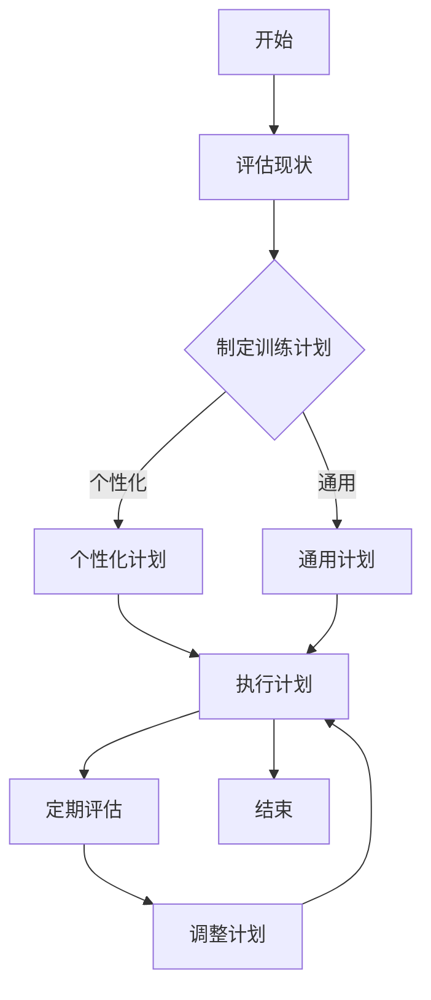
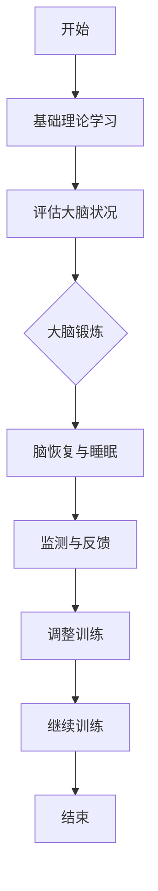
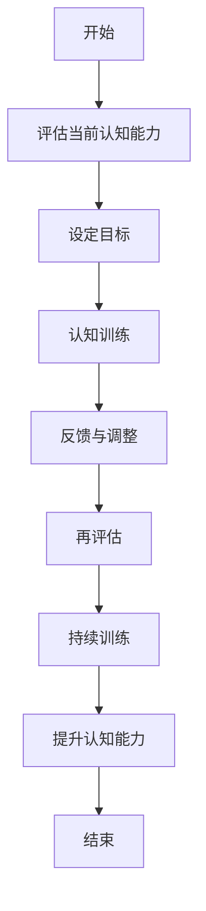
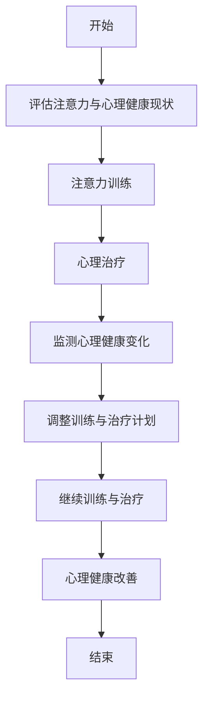
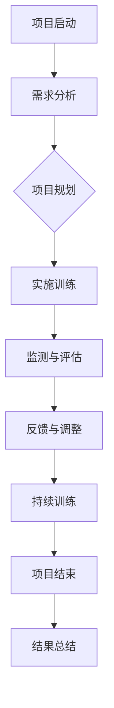

                 

# 《注意力训练与大脑可塑性：通过专注力增强认知能力》

> **关键词**：注意力训练、大脑可塑性、认知能力、专注力、心理健康

> **摘要**：本文详细探讨了注意力训练与大脑可塑性的关系，分析了注意力训练对认知能力和心理健康的影响，并提出了实用的训练方法和策略。通过讲解核心概念、算法原理、项目实践及未来发展趋势，本文旨在为读者提供全面而深入的指导，帮助他们在日常生活中有效地提升注意力，增强认知能力，维护心理健康。

## 目录大纲

## 第1章 引言

### 1.1 书籍背景与目标

### 1.2 注意力训练的重要性

### 1.3 大脑可塑性的概念与作用

## 第2章 注意力训练基础知识

### 2.1 注意力的定义与类型

#### 2.1.1 注意力的概念

#### 2.1.2 注意力的分类

### 2.2 大脑可塑性的基本原理

#### 2.2.1 神经可塑性

#### 2.2.2 神经元连接的适应性

## 第3章 注意力训练方法

### 3.1 注意力训练的基本策略

#### 3.1.1 专注力提升

#### 3.1.2 分散注意力的控制

### 3.2 实践中的注意力训练技巧

#### 3.2.1 锻炼记忆力的练习

#### 3.2.2 提高专注力的策略

### 3.3 注意力训练工具与应用

#### 3.3.1 注意力训练软件推荐

#### 3.3.2 注意力训练应用案例

## 第4章 大脑可塑性训练方法

### 4.1 大脑可塑性的训练原理

#### 4.1.1 神经可塑性的基本机制

#### 4.1.2 神经元连接的调控方法

### 4.2 大脑可塑性训练的实践

#### 4.2.1 大脑锻炼的基本方法

#### 4.2.2 大脑恢复与睡眠策略

### 4.3 大脑可塑性的评估与监测

#### 4.3.1 大脑可塑性评估工具

#### 4.3.2 大脑可塑性监测指标

## 第5章 注意力训练与认知能力提升

### 5.1 注意力训练与认知能力的关联

#### 5.1.1 注意力对认知功能的影响

#### 5.1.2 认知能力的定义与分类

### 5.2 认知能力的提升策略

#### 5.2.1 认知训练的方法与技巧

#### 5.2.2 认知能力评估与监测

## 第6章 注意力训练与心理健康

### 6.1 注意力训练对心理健康的影响

#### 6.1.1 注意力缺陷与心理疾病

#### 6.1.2 心理健康与大脑可塑性的关系

### 6.2 心理健康问题的注意力训练方法

#### 6.2.1 压力管理训练

#### 6.2.2 焦虑与抑郁的注意力调节

## 第7章 注意力训练项目实践

### 7.1 注意力训练项目规划

#### 7.1.1 项目目标与可行性分析

#### 7.1.2 项目实施计划

### 7.2 注意力训练项目的实施与评估

#### 7.2.1 项目实施步骤

#### 7.2.2 项目评估与反馈

### 7.3 注意力训练项目案例分析

#### 7.3.1 成功案例分享

#### 7.3.2 失败案例分析

## 第8章 注意力训练的未来发展趋势

### 8.1 注意力训练技术的最新进展

#### 8.1.1 新型注意力模型

#### 8.1.2 大脑成像技术的应用

### 8.2 注意力训练在未来的应用前景

#### 8.2.1 教育领域的应用

#### 8.2.2 工作场景中的应用

### 8.3 注意力训练研究的挑战与机遇

#### 8.3.1 技术难题与解决方案

#### 8.3.2 未来研究方向

## 第9章 总结与展望

### 9.1 书籍总结

### 9.2 注意力训练实践的建议

### 9.3 未来研究方向与展望

## 附录

### 附录 A：注意力训练工具推荐

### 附录 B：参考文献

### 附录 C：常见问题解答

### 附录 D：致谢与鸣谢

### 附录 E：Mermaid 流程图

#### E.1 注意力训练流程

#### E.2 大脑可塑性训练流程

#### E.3 认知能力提升流程

#### E.4 注意力训练与心理健康关联流程

#### E.5 注意力训练项目实施流程

### 附录 F：核心算法原理伪代码

#### F.1 注意力机制算法

#### F.2 大脑可塑性调整算法

#### F.3 认知能力评估算法

### 附录 G：数学模型和公式

#### G.1 大脑可塑性的数学模型

#### G.2 注意力分配的数学模型

#### G.3 认知能力的数学模型

### 附录 H：项目实战

#### H.1 注意力训练项目实战案例

#### H.2 大脑可塑性训练项目实战案例

#### H.3 认知能力提升项目实战案例

### 附录 I：代码解读与分析

#### I.1 注意力训练项目代码解读

#### I.2 大脑可塑性训练项目代码解读

#### I.3 认知能力提升项目代码解读

------------------------------------------------------------------<|endoftext|>## 第1章 引言

### 1.1 书籍背景与目标

在现代社会，随着信息量的急剧增加和竞争压力的不断加剧，人们对于注意力的需求日益凸显。然而，许多人在日常工作和生活中往往面临着注意力分散、专注力不足等问题。为了应对这一挑战，本书旨在探讨注意力训练与大脑可塑性的关系，并通过科学的方法和实用的策略，帮助读者提升专注力，增强认知能力，最终实现个人能力的全面提升。

本书的主要目标是：

1. **深入理解注意力训练和大脑可塑性的基本原理**：通过详细的理论分析和实例讲解，帮助读者理解注意力训练和大脑可塑性的核心概念，为后续实践打下坚实的理论基础。
2. **介绍多种注意力训练方法**：从专注力提升、分散注意力的控制到大脑可塑性的训练，本书将全面覆盖注意力训练的各个层面，提供多种实用的训练技巧和策略。
3. **探讨注意力训练与认知能力和心理健康的关系**：通过分析注意力训练对认知能力和心理健康的影响，为读者提供全面的关注点，帮助他们在提升注意力的同时，维护心理健康。
4. **提供实践案例和项目指导**：本书将结合实际案例，介绍注意力训练项目的规划与实施，帮助读者将理论知识应用到实际生活中，实现有效的注意力训练。

### 1.2 注意力训练的重要性

注意力是人类认知过程中至关重要的因素。它不仅决定了我们在面对复杂任务时的表现，还直接影响着我们的学习和工作效率。以下从多个角度阐述注意力训练的重要性：

1. **学习效率提升**：良好的注意力可以帮助我们更有效地吸收和处理信息，提高学习效率。通过注意力训练，我们可以学会如何在短时间内集中精力，专注于学习任务，从而实现学习效果的显著提升。

2. **工作表现优化**：在职场中，专注力和注意力是高效工作的关键。通过注意力训练，员工可以学会如何在复杂的环境中保持专注，减少干扰，提高工作效率，从而在竞争中脱颖而出。

3. **心理健康维护**：注意力训练不仅有助于提升认知能力，还能有效缓解压力和焦虑，维护心理健康。通过专注力训练，我们可以学会更好地管理情绪，提高心理韧性，从而在面对压力和挑战时保持冷静和自信。

4. **生活质量改善**：注意力训练可以帮助我们在日常生活中更好地管理时间和资源，减少不必要的干扰，从而提高生活质量。通过有效的注意力训练，我们可以更加专注于重要事务，减少浪费时间的行为，实现个人生活的平衡与和谐。

### 1.3 大脑可塑性的概念与作用

大脑可塑性是指大脑在结构和功能上能够随外界刺激、经验和学习而发生变化的能力。这种能力是神经科学领域的一个重要概念，对于理解人类学习和记忆机制具有重要意义。以下是大脑可塑性的一些关键作用：

1. **学习与记忆**：大脑可塑性使得我们能够通过学习和经验不断调整神经元之间的连接和活动模式，从而实现新知识和技能的获取和记忆。通过大脑可塑性的训练，我们可以优化学习过程，提高记忆效率。

2. **康复与治疗**：大脑可塑性在康复和治疗领域具有广泛应用。例如，在脑损伤和神经退行性疾病的治疗中，通过特定的训练和刺激，可以促进神经元的再生和连接重塑，从而恢复受损的认知和运动功能。

3. **心理治疗**：大脑可塑性也被应用于心理治疗领域。通过认知行为疗法和情绪调节训练，可以改变大脑中的活动模式，减轻心理压力和焦虑，提高情绪稳定性。

4. **认知功能提升**：大脑可塑性的训练可以帮助我们提升认知功能，包括注意力、记忆、执行功能和创造力等。通过科学的大脑训练方法，我们可以优化大脑的结构和功能，实现认知能力的全面提升。

综上所述，注意力训练与大脑可塑性密切相关，通过科学的注意力训练，我们可以有效地提升大脑的可塑性，从而实现认知能力和心理健康的全面提升。在接下来的章节中，我们将深入探讨注意力训练和大脑可塑性的基本原理和实践方法，帮助读者实现这一目标。

### 第2章 注意力训练基础知识

注意力是人们认知过程中的核心要素，直接影响我们的学习、工作和生活质量。因此，理解注意力的定义与类型，以及大脑可塑性的基本原理，对于我们进行有效的注意力训练至关重要。

#### 2.1 注意力的定义与类型

注意力可以理解为心理活动对一定对象的指向和集中。它是一种选择性的认知活动，使我们能够从众多信息中筛选出对我们重要的内容进行加工和处理。根据不同的分类标准，注意力可以分为多种类型：

1. **选择性注意力**：选择性注意力是指我们在面对大量信息时，能够主动选择并集中处理某些信息，而忽略其他不相关信息的心理过程。这种能力使我们能够在复杂环境中有效地过滤信息，提高工作效率。

2. **分配性注意力**：分配性注意力是指我们在同时处理多个任务时的能力。这种能力使我们能够在不同任务之间灵活切换，并将注意力合理分配给每个任务，从而提高整体的工作效率。

3. **持续性注意力**：持续性注意力是指我们在长时间内保持对某个任务或信息的关注和集中。这种能力对于长时间学习和工作尤为重要，可以帮助我们克服疲劳和干扰，保持专注。

4. **转换性注意力**：转换性注意力是指我们在不同任务之间切换时的能力。这种能力使我们能够迅速调整注意焦点，从一项任务转换到另一项任务，而不受前一项任务的干扰。

了解注意力的不同类型有助于我们更全面地理解注意力训练的目标和方法。例如，通过选择性注意力的训练，我们可以提高信息筛选和处理的能力；通过分配性注意力的训练，我们可以提升多任务处理的能力；通过持续性和转换性注意力的训练，我们可以延长专注时间和提高任务切换的效率。

#### 2.2 大脑可塑性的基本原理

大脑可塑性是指大脑在结构和功能上能够随外界刺激、经验和学习而发生变化的能力。这种能力贯穿了我们的一生，使我们能够适应环境的变化，学习新的技能和知识。以下是大脑可塑性的几个关键原理：

1. **神经可塑性**：神经可塑性是指神经元和神经网络在结构和功能上的可塑性。它包括神经元连接的重组、新突触的形成和新神经网络的建立。这种能力使我们能够通过学习和经验不断调整大脑的结构和功能，从而适应新的环境和任务。

2. **神经元连接的适应性**：神经元连接的适应性是指神经元之间的连接强度可以随着刺激的强度和频率而改变。这种适应性使我们能够通过重复的训练和练习，强化特定的神经通路，提高相应的认知能力。

3. **经验依赖性**：大脑可塑性高度依赖于经验和学习。通过不断的学习和训练，我们可以改变大脑中的神经网络结构，优化认知功能。同时，不良的生活习惯和缺乏训练会导致大脑功能的退化，因此，大脑可塑性是保持和提升认知能力的关键。

4. **神经再生和修复**：大脑可塑性还包括神经再生和修复的能力。在脑损伤和神经退行性疾病的治疗中，通过特定的训练和刺激，可以促进神经元的再生和连接重塑，从而恢复受损的认知和运动功能。

理解大脑可塑性的基本原理，有助于我们设计科学的注意力训练方法，通过合理的训练和刺激，提高大脑的可塑性，从而实现认知能力的提升。

#### 2.3 注意力训练与大脑可塑性的关系

注意力训练与大脑可塑性之间存在着密切的关系。通过科学的注意力训练，我们可以提高大脑的可塑性，从而优化认知功能。

1. **提高选择性注意力**：通过选择性注意力的训练，我们可以加强大脑中与注意力相关的神经网络，提高信息筛选和处理的能力。例如，通过专注力练习，我们可以训练大脑在复杂环境中快速集中注意力，忽略无关信息。

2. **增强分配性注意力**：通过分配性注意力的训练，我们可以提高大脑在不同任务之间的灵活切换和分配注意力的能力。例如，通过多任务练习，我们可以训练大脑在同时处理多个任务时，合理分配注意力，提高整体工作效率。

3. **延长持续性注意力**：通过持续性注意力的训练，我们可以延长大脑在长时间内保持专注的能力。例如，通过长时间阅读、写作或冥想练习，我们可以训练大脑在长时间内保持对任务的关注和集中。

4. **提升转换性注意力**：通过转换性注意力的训练，我们可以提高大脑在不同任务之间快速切换的能力。例如，通过交替进行不同类型的任务，我们可以训练大脑迅速调整注意焦点，提高任务切换的效率。

综上所述，注意力训练与大脑可塑性密切相关。通过科学和系统的注意力训练，我们可以提高大脑的可塑性，优化认知功能，从而在学习和工作中取得更好的表现。在下一章中，我们将探讨多种注意力训练方法，帮助读者有效地提升注意力，增强认知能力。

### 3.1 注意力训练的基本策略

注意力训练是提升专注力和认知能力的重要手段。以下将介绍几种基本策略，帮助读者系统地提高注意力水平。

#### 3.1.1 专注力提升

专注力提升是注意力训练的核心目标之一。以下是一些实用的方法：

1. **冥想**：冥想是一种有效的专注力训练方法。通过冥想，我们可以训练大脑集中注意力，减少杂念。开始时，可以选择每天10分钟的冥想练习，逐渐增加时间。冥想的形式可以多样，如坐姿冥想、呼吸冥想或动态冥想。

2. **专注力练习**：专注于单一任务也是一种有效的专注力训练方法。例如，可以尝试专注于深呼吸、专注于某个物体或专注于进行简单的数学计算。这些练习可以帮助我们提高集中注意力的能力。

3. **限制干扰**：在专注力训练过程中，减少干扰至关重要。可以尝试在一个安静的环境中练习，关闭手机通知，避免多任务操作。通过减少外部干扰，我们可以更好地集中注意力。

4. **定时练习**：使用定时器进行专注力训练也是一种有效的方法。例如，设定一个时间限制（如25分钟），专注于一项任务，然后休息5分钟。这种方法被称为“番茄工作法”，可以帮助我们提高专注力并减少疲劳。

#### 3.1.2 分散注意力的控制

分散注意力的控制是另一项重要的注意力训练目标。以下是一些实用的策略：

1. **多任务练习**：虽然多任务处理可能听起来是一个挑战，但实际上通过适当的练习，我们可以提高分散注意力的能力。例如，可以在同一时间内进行阅读、听音乐和做简单的数学计算。这种方法有助于我们提高处理多任务的能力。

2. **时间分配**：合理分配时间是控制分散注意力的关键。在任务开始前，可以制定一个详细的时间表，将任务分解为小部分，并为每个任务分配特定的时间。这样，我们可以更有针对性地处理任务，减少注意力分散。

3. **使用工具**：利用现代科技工具可以帮助我们更好地控制分散的注意力。例如，使用番茄工作法软件、专注力训练APP等，可以帮助我们管理时间和注意力，提高工作效率。

4. **定期休息**：长时间集中注意力可能导致疲劳和注意力下降。因此，定期休息是控制分散注意力的有效策略。例如，每工作25分钟后，休息5-10分钟，进行简单的伸展或深呼吸练习，可以帮助我们恢复精力，提高注意力。

#### 3.1.3 避免过度刺激

过度刺激是导致注意力分散的主要原因之一。以下是一些避免过度刺激的策略：

1. **限制电子产品使用**：过度使用电子产品，如手机、电脑和电视，可能导致大脑受到过度刺激，从而影响注意力。因此，合理安排电子产品使用时间，避免长时间连续使用，是控制注意力分散的重要策略。

2. **保持良好的作息习惯**：充足的睡眠和良好的作息习惯有助于大脑恢复和注意力提升。尽量保持规律的作息时间，避免熬夜，有助于提高注意力和认知能力。

3. **减少噪声和干扰**：在学习和工作环境中，尽量减少噪声和干扰。可以选择一个安静的环境进行任务，或在需要高度集中注意力时，使用耳塞或耳机屏蔽外界干扰。

4. **定期放松**：长时间的高强度工作和学习可能导致大脑过度疲劳，从而影响注意力。因此，定期放松和休息，如进行短暂的冥想、散步或进行轻松的娱乐活动，可以帮助我们恢复大脑功能，提高注意力。

通过以上策略，我们可以有效地提高专注力，控制分散注意力，从而在学习和工作中保持高效的注意力。在下一章中，我们将探讨注意力训练的实践技巧，帮助读者将理论知识应用到实际生活中。

#### 3.2 实践中的注意力训练技巧

在日常生活中，我们常常会遇到注意力分散的问题，如工作繁忙时的邮件通知、社交媒体的诱惑或家庭责任的压力等。为了有效提升注意力，以下是一些实用的技巧和练习，帮助我们在不同场景下保持专注。

##### 3.2.1 锻炼记忆力的练习

记忆力是注意力训练的重要组成部分，通过锻炼记忆力，我们可以提高信息处理能力和专注力。以下是一些有效的记忆力练习：

1. **重复阅读**：选择一篇文章或段落，多次阅读并尝试记住内容。每次阅读后，回顾上一次的记忆，逐渐提高记忆的难度和长度。这种练习可以帮助我们增强记忆能力和专注力。

2. **联想记忆**：将新信息与已知信息建立联系，通过联想来帮助记忆。例如，将新单词与图像或故事联系起来，或者将学习内容与生活中的实际场景联系起来，这样可以提高记忆的深度和准确性。

3. **记忆宫殿**：记忆宫殿是一种古老的记忆技巧，通过在脑海中创建一个虚拟的场景，将信息存储在特定的位置。例如，可以将一串数字或单词依次存储在宫殿的不同房间内，然后通过想象路径来回忆信息。

4. **闪卡练习**：使用闪卡（即一面写有信息，另一面空白的小卡片）进行记忆训练。每次翻开卡片，尝试回忆卡片背面的信息，如果失败，再看背面。这种方法可以帮助我们提高记忆的持久性和准确性。

##### 3.2.2 提高专注力的策略

以下是一些提高专注力的实用策略，帮助我们在复杂的环境中保持专注：

1. **设定明确目标**：在开始一项任务之前，明确任务的目标和预期结果。设定具体、可行的目标可以帮助我们集中注意力，避免迷失在细节中。

2. **使用番茄工作法**：番茄工作法是一种时间管理技巧，通过将工作时间分为25分钟的专注期和5分钟的休息期，帮助我们在短时间内保持高效工作。这种方法可以减少疲劳，提高专注力。

3. **避免多任务操作**：尽管多任务操作看似可以提高效率，但实际上它会分散我们的注意力，降低工作质量。因此，尽量避免在同时进行多个任务，专注于完成一项任务后再进行下一项。

4. **设置环境干扰**：创造一个有利于专注的环境，减少外部干扰。例如，关闭手机通知、关闭电视、选择一个安静的房间等。一个无干扰的环境可以帮助我们更好地集中注意力。

5. **定期休息和放松**：长时间的高强度工作会导致大脑疲劳，从而影响注意力。因此，定期休息和放松是保持专注的重要策略。可以在每个专注期后进行短暂的休息，进行深呼吸、伸展运动或冥想等放松活动。

##### 3.2.3 实用的工具和方法

以下是一些实用的工具和方法，可以帮助我们更好地进行注意力训练：

1. **专注力训练APP**：现代科技提供了许多专注力训练的APP，如Forest、Pomodoro Timer等。这些APP可以帮助我们设定专注时间、休息时间，并通过虚拟奖励系统激励我们保持专注。

2. **专注力音乐**：使用专门设计的专注力音乐可以帮助我们在工作或学习时保持专注。这些音乐通常采用柔和的节奏和低频声波，有助于减少外界干扰，提高专注力。

3. **注意力游戏**：通过注意力游戏，如反应速度测试、视觉追踪游戏等，可以帮助我们训练注意力，提高反应速度和视觉注意力。这些游戏通常设计有趣，可以在轻松的氛围中提升注意力水平。

4. **专注力日记**：记录每天的注意力训练计划和实际执行情况，可以帮助我们了解自己的进步和问题，调整训练策略。同时，定期回顾日记，可以增强自我激励和责任感。

通过以上技巧和策略，我们可以更有效地提升注意力，保持专注，提高工作和学习效率。在接下来的章节中，我们将进一步探讨大脑可塑性的训练方法和实践技巧，帮助读者全面提高认知能力和心理健康。

#### 3.3 注意力训练工具与应用

在现代社会，随着科技的发展，许多注意力训练工具和应用软件应运而生，为用户提供了方便、有效的注意力训练方法。以下将介绍几种常用的注意力训练工具及其应用场景。

##### 3.3.1 注意力训练软件推荐

1. **Forest**

Forest是一款非常受欢迎的专注力训练APP，通过种树的游戏机制激励用户保持专注。用户可以设定专注时间，在规定时间内保持专注，APP会种下一棵树；如果中途放弃或被干扰，树就会枯萎。这种机制可以帮助用户培养专注习惯，提高工作效率。

2. **Pomodoro Timer**

Pomodoro Timer是一款基于番茄工作法的专注力训练工具，可以帮助用户将工作时间分割为25分钟的专注期和5分钟的休息期。用户可以设置多个番茄时间，并在每个番茄时间结束后休息。这种分段工作法能够有效减少疲劳，提高专注力。

3. **Headspace**

Headspace是一款专注于冥想和专注力训练的应用，提供了多种冥想课程，包括入门级、中级和高级课程。用户可以根据自己的需求选择课程，通过冥想训练提高专注力和心理健康。

4. **Lumosity**

Lumosity是一款科学基于神经科学原理设计的训练应用，提供了丰富的认知训练游戏，包括注意力、记忆、反应速度和解决问题的练习。通过定期训练，用户可以提升大脑的灵活性和认知能力。

##### 3.3.2 注意力训练应用案例

1. **学校教育**

在小学和中学教育中，注意力训练是一项重要的学习技能。教师可以利用Forest或Pomodoro Timer等工具，帮助学生培养专注习惯，提高学习效率。例如，在课堂上，教师可以设定25分钟的专注时间，让学生专注于听课或完成作业，然后进行短暂的休息。这种训练方法不仅有助于提高学生的学习成绩，还能培养他们的自律能力。

2. **职场培训**

在职场中，提高员工的工作效率和质量是企业管理的重要任务。企业可以利用Lumosity等注意力训练工具，为员工提供定期的认知训练，提高员工的注意力、记忆力和问题解决能力。例如，企业可以每周安排一次注意力训练课程，通过游戏和练习提高员工的专注力和工作效率。

3. **个人成长**

对于个人用户，注意力训练工具可以帮助他们更好地管理时间、提高工作和学习效率。例如，一个职场人士可以利用Pomodoro Timer来管理工作时间，通过设定番茄时间来提高工作效率。同时，使用Headspace进行冥想训练，可以帮助他们减轻压力，提高心理健康水平。

4. **心理健康支持**

对于存在注意力障碍或心理健康问题的用户，注意力训练工具可以提供有效的支持和帮助。例如，Forest和Lumosity提供了趣味性的训练游戏，可以帮助用户在轻松的氛围中提升注意力，改善心理健康。同时，Headspace的冥想课程可以帮助用户缓解焦虑和压力，提高情绪稳定性。

通过以上案例，我们可以看到注意力训练工具在各个领域的广泛应用。无论是在学校教育、职场培训还是个人成长中，注意力训练都发挥着重要的作用。这些工具不仅提供了科学有效的训练方法，还能通过互动和激励，提高用户的训练积极性和效果。

#### 3.4 大脑可塑性训练方法

大脑可塑性是指大脑在结构和功能上能够随外界刺激、经验和学习而发生变化的能力。这种能力是神经科学领域的一个重要概念，对于理解人类学习和记忆机制具有重要意义。通过科学的大脑可塑性训练，我们可以提高大脑的认知能力，优化学习和工作表现。

##### 3.4.1 大脑可塑性的训练原理

大脑可塑性训练的原理基于神经可塑性和神经元连接的适应性。以下是几个关键点：

1. **神经可塑性**：神经可塑性是指神经元和神经网络在结构和功能上的可塑性。它包括神经元连接的重组、新突触的形成和新神经网络的建立。通过特定的训练和刺激，我们可以改变大脑的结构和功能，从而提升认知能力。

2. **神经元连接的适应性**：神经元连接的适应性是指神经元之间的连接强度可以随着刺激的强度和频率而改变。通过重复的训练和练习，我们可以强化特定的神经通路，提高相应的认知能力。例如，通过语言训练，我们可以增强与语言处理相关的神经网络的连接和功能。

3. **经验依赖性**：大脑可塑性高度依赖于经验和学习。通过不断的学习和训练，我们可以改变大脑中的神经网络结构，优化认知功能。同时，不良的生活习惯和缺乏训练会导致大脑功能的退化，因此，大脑可塑性是保持和提升认知能力的关键。

4. **神经再生和修复**：大脑可塑性还包括神经再生和修复的能力。在脑损伤和神经退行性疾病的治疗中，通过特定的训练和刺激，可以促进神经元的再生和连接重塑，从而恢复受损的认知和运动功能。

##### 3.4.2 大脑可塑性训练的方法

以下是一些科学的大脑可塑性训练方法，帮助读者提高认知能力和优化学习表现：

1. **认知训练**：认知训练是一种基于大脑可塑性的训练方法，通过特定的认知任务和练习，提高大脑的认知能力。例如，记忆训练、注意力训练、执行功能训练和解决问题训练等。这些训练可以增强大脑的认知处理能力，提高学习效率和创造力。

2. **大脑锻炼**：大脑锻炼类似于体育锻炼对身体的益处，通过特定的大脑训练和练习，提高大脑的功能和健康。例如，学习新技能、进行复杂的思考、练习弹钢琴、玩策略游戏等。这些活动可以刺激大脑神经网络的生长和连接，提高大脑的可塑性。

3. **神经反馈训练**：神经反馈训练是一种基于大脑电活动的训练方法，通过监测和反馈大脑的电活动，帮助用户调整和优化大脑功能。例如，通过脑电反馈训练，用户可以学习控制大脑的注意力水平和情绪状态，提高认知能力和心理健康。

4. **认知行为疗法**：认知行为疗法是一种心理治疗方法，通过改变思维和行为模式，改善心理健康。这种方法基于大脑可塑性原理，通过特定的认知训练和行为调节，帮助用户克服焦虑、抑郁等心理问题，提高生活质量。

5. **大脑成像技术**：大脑成像技术（如功能性磁共振成像fMRI、脑电图EEG等）可以帮助我们实时监测和评估大脑的结构和功能变化。通过这些技术，我们可以更好地理解大脑可塑性的机制，设计更有效的训练方法和策略。

##### 3.4.3 大脑可塑性训练的实践

以下是一些大脑可塑性训练的实践建议，帮助读者将理论知识应用到实际生活中：

1. **定期训练**：大脑可塑性训练需要持续和定期的练习。每天安排一定的时间进行训练，逐步增加训练的强度和难度，以确保训练效果。

2. **多样化训练**：大脑是一个复杂的系统，通过多样化的训练可以全面提高大脑的认知能力。例如，结合记忆训练、注意力训练、执行功能训练和解决问题训练等多种方法，实现大脑功能的全面提升。

3. **主动学习**：主动学习比被动学习更能促进大脑可塑性。通过主动思考、提问和解决问题，我们可以更好地激发大脑的潜力，提高认知能力。

4. **结合实际应用**：将大脑可塑性训练与实际应用结合起来，可以更好地巩固训练效果。例如，在工作中应用注意力训练方法，提高工作效率；在学习中应用记忆训练技巧，提高学习效果。

5. **保持健康的生活方式**：健康的生活方式对大脑可塑性训练至关重要。保持充足的睡眠、均衡的饮食、适量的运动和减少压力，可以优化大脑的功能和健康，提高训练效果。

通过以上方法，我们可以有效地利用大脑可塑性，提升认知能力和优化学习表现。在下一章中，我们将进一步探讨注意力训练与大脑可塑性的关系，以及如何通过注意力训练实现认知能力的提升。

#### 4.2 大脑可塑性训练的实践

大脑可塑性训练是一种通过特定的方法来增强大脑功能和适应能力的过程。以下将详细介绍几种大脑可塑性训练的方法，以及如何将这些方法应用到实际生活中。

##### 4.2.1 大脑锻炼的基本方法

大脑锻炼的基本方法主要包括以下几种：

1. **认知训练**：认知训练是一种通过特定的认知任务和练习来增强大脑功能的训练方法。这些任务和练习通常包括记忆训练、注意力训练、执行功能训练和解决问题的能力等。例如，记忆训练可以通过重复记忆无关联的单词列表或数字序列来提升大脑的记忆能力。注意力训练则可以通过集中精力完成复杂的视觉任务或听觉任务来增强注意力的集中能力。

2. **智力游戏**：智力游戏，如拼图、数独、象棋和国际象棋等，是一种有效的锻炼大脑的方式。这些游戏需要玩家进行逻辑思考、策略规划和问题解决，从而提高大脑的认知能力和灵活性。

3. **学习新技能**：学习新技能，如学习一门新语言、掌握一种乐器或进行绘画训练，可以刺激大脑不同区域的活跃，增强大脑的可塑性。学习新技能不仅能够提高大脑的认知功能，还能够增强学习和记忆能力。

4. **阅读和写作**：阅读和写作是一种深度思考和学习的过程，可以帮助我们扩展知识和提升认知能力。通过阅读，我们可以接触到不同领域的知识和观点，从而激发大脑的思考。写作则是一种将思想和知识转化为文本的过程，可以提高我们的逻辑思维和表达能力。

##### 4.2.2 大脑恢复与睡眠策略

大脑恢复是大脑可塑性训练的重要组成部分。以下是一些有效的大脑恢复策略：

1. **充足睡眠**：充足的睡眠是大脑恢复和功能提升的关键。成年人通常需要每晚7-9小时的睡眠。高质量的睡眠有助于大脑清除废物，促进神经再生，增强记忆力和认知功能。

2. **规律作息**：保持规律的作息时间有助于调节生物钟，提高睡眠质量。尽量避免熬夜，确保在固定的时间上床和起床，有助于身体和大脑的健康。

3. **深呼吸练习**：深呼吸是一种简单而有效的大脑恢复方法。通过深呼吸，我们可以放松身体，减少压力，提高大脑的氧气供应。深呼吸练习可以在一天中的任何时间进行，特别是在感到疲劳或紧张时。

4. **冥想和放松**：冥想和放松练习可以帮助我们减轻压力，提高大脑的恢复能力。冥想可以通过集中注意力，减少杂念，促进大脑的放松。放松练习，如瑜伽和渐进性肌肉放松，可以帮助我们缓解身体和大脑的紧张。

##### 4.2.3 大脑可塑性的评估与监测

大脑可塑性的评估与监测是确保训练效果的重要环节。以下是一些常用的评估和监测方法：

1. **神经心理学测试**：神经心理学测试是一种通过标准化的测试工具来评估大脑认知功能的方法。这些测试通常包括记忆、注意力、执行功能、语言和知觉等各个方面。通过定期进行神经心理学测试，我们可以监测大脑认知功能的提升和变化。

2. **功能性磁共振成像（fMRI）**：fMRI是一种无创的成像技术，可以实时监测大脑的功能活动。通过fMRI，我们可以观察大脑不同区域的激活情况和神经通路的连接变化，从而评估大脑的可塑性。

3. **脑电图（EEG）**：EEG是一种记录大脑电活动的技术，可以用于监测大脑的兴奋性和网络活动。通过分析EEG信号，我们可以评估大脑的稳定性、反应性和适应性。

4. **认知行为评估**：认知行为评估是通过特定的评估工具和任务来评估个体在认知和行为方面的表现。这些评估可以帮助我们了解大脑可塑性训练的效果，并提供个性化的训练建议。

##### 4.2.4 实践中的大脑可塑性训练案例

以下是一个实际的大脑可塑性训练案例，展示了如何将上述方法应用到实际生活中：

1. **训练计划**：一个30岁的职场人士希望提升自己的注意力、记忆力和决策能力。他的训练计划包括每天进行30分钟的记忆训练、20分钟的注意力训练和10分钟的冥想练习。每周进行两次认知训练游戏和一次新技能学习（如学习西班牙语）。

2. **训练过程**：

   - **记忆训练**：通过重复记忆无关联的单词列表，每天进行30分钟的记忆训练。训练过程中，记录每次记忆的正确率和所需时间，以监测进步。
   - **注意力训练**：使用Pomodoro Timer进行25分钟的专注工作，然后进行5分钟的休息。在工作期间，专注于完成一项任务，避免分心和打断。
   - **冥想练习**：每天进行10分钟的冥想练习，通过深呼吸和专注于呼吸来放松大脑。
   - **认知训练游戏**：每周进行两次认知训练游戏，如数独和拼图游戏，以提高认知能力和灵活性。
   - **新技能学习**：每周学习西班牙语的一个新单元，通过阅读、听力和口语练习来提高语言能力。

3. **评估与反馈**：在训练的每个月，通过神经心理学测试和fMRI扫描来评估认知功能的变化。同时，记录日常生活中的表现，如工作记忆、注意力集中和决策能力等，以提供反馈和调整训练计划。

通过上述方法，这位职场人士可以系统地提升大脑的可塑性，优化认知能力，从而在工作和生活中表现出更好的能力和表现。

#### 4.3 大脑可塑性的评估与监测

大脑可塑性的评估与监测是确保注意力训练效果的重要环节。通过科学的方法和工具，我们可以实时了解大脑的可塑性变化，调整训练策略，最大化训练效果。

##### 4.3.1 大脑可塑性评估工具

以下是几种常用的大脑可塑性评估工具：

1. **神经心理学测试**：神经心理学测试是通过标准化的测试工具来评估大脑认知功能的方法。这些测试通常包括记忆、注意力、执行功能、语言和知觉等各个方面。常用的测试工具有Wechsler成人智力量表（WAIS）、神经心理学测试系统（NEPSY）等。通过这些测试，我们可以了解个体在特定认知领域的能力和变化。

2. **功能性磁共振成像（fMRI）**：fMRI是一种无创的成像技术，可以实时监测大脑的功能活动。通过fMRI，我们可以观察大脑不同区域的激活情况和神经通路的连接变化，从而评估大脑的可塑性。例如，当个体进行特定的认知任务时，fMRI可以显示大脑特定区域的活动情况，帮助分析大脑的可塑性变化。

3. **脑电图（EEG）**：EEG是一种记录大脑电活动的技术，可以用于监测大脑的兴奋性和网络活动。通过分析EEG信号，我们可以评估大脑的稳定性、反应性和适应性。例如，在注意力训练过程中，通过监测EEG信号，我们可以了解个体在集中注意力时的脑电活动变化，从而评估注意力的提升情况。

4. **认知行为评估**：认知行为评估是通过特定的评估工具和任务来评估个体在认知和行为方面的表现。这些评估可以帮助我们了解大脑可塑性训练的效果，并提供个性化的训练建议。例如，通过执行功能任务（如Stroop测试、轨迹追踪任务等），我们可以评估个体的认知控制和信息处理能力。

##### 4.3.2 大脑可塑性监测指标

在评估大脑可塑性时，以下是一些关键监测指标：

1. **认知功能指标**：包括记忆、注意力、执行功能、语言和知觉等。这些指标可以通过神经心理学测试、fMRI和EEG等工具进行评估。例如，记忆指标可以通过记忆任务中的正确率和所需时间来衡量，注意力指标可以通过任务执行中的干扰反应时间和准确性来评估。

2. **神经成像指标**：包括大脑区域的活动变化、神经通路的连接变化和神经纤维的结构变化。通过fMRI和EEG等成像技术，我们可以实时监测大脑不同区域的活动变化和神经通路的连接情况。例如，fMRI可以显示大脑特定区域在执行特定任务时的激活程度，EEG可以显示大脑的电活动变化。

3. **生物指标**：包括大脑电活动、神经递质水平和脑血流量等。这些指标可以通过生物传感器和生化检测技术进行监测。例如，EEG可以记录大脑的电活动，神经递质水平可以通过血液或脑脊液检测来衡量。

4. **行为表现指标**：包括任务完成时间、错误率和成功率等。这些指标可以直接反映大脑可塑性训练的效果。例如，在注意力训练中，通过记录任务完成所需的时间和错误率，我们可以评估注意力的提升情况。

##### 4.3.3 实际应用中的监测与评估

在实际应用中，以下是一个大脑可塑性训练与监测的案例：

1. **评估准备**：个体进行一系列神经心理学测试，包括记忆、注意力和执行功能等，以建立基准数据。同时，进行fMRI和EEG扫描，记录大脑的基线状态。

2. **训练计划**：个体开始进行为期12周的大脑可塑性训练，包括记忆训练、注意力训练和执行功能训练。每周进行两次训练，每次持续30-60分钟。

3. **过程监测**：在训练过程中，定期进行神经心理学测试和fMRI/EEG扫描，以监测认知功能和神经成像指标的变化。同时，记录行为表现指标，如任务完成时间和错误率。

4. **结果分析**：训练结束后，对监测数据进行综合分析，比较训练前后的变化。通过神经心理学测试、fMRI和EEG等工具的结果，评估大脑可塑性的提升情况。

5. **反馈与调整**：根据评估结果，调整训练计划，强化有效的训练方法，改进不足之处。例如，如果记忆测试成绩显著提升，可以增加记忆训练的难度和复杂性，以进一步优化大脑功能。

通过科学的大脑可塑性评估与监测，我们可以实时了解训练效果，优化训练方法，最大化提升大脑功能。在下一章中，我们将探讨注意力训练与认知能力的提升之间的关系，帮助读者理解如何通过注意力训练实现认知能力的全面提高。

### 5.1 注意力训练与认知能力的关联

注意力训练与认知能力提升之间存在着密切的联系。通过系统的注意力训练，我们可以显著提高认知功能，从而在日常生活中取得更好的表现。以下从注意力对认知功能的影响和认知能力的定义与分类两个方面进行详细探讨。

#### 5.1.1 注意力对认知功能的影响

注意力是认知功能的核心要素之一，它直接影响我们的感知、记忆、决策和执行功能。以下是注意力对认知功能影响的几个关键点：

1. **感知能力**：注意力决定了我们对外界信息的感知和处理能力。通过注意力训练，我们可以提高对重要信息的捕捉能力，减少无关信息的干扰，从而在复杂环境中更加有效地感知和理解信息。

2. **记忆能力**：注意力与记忆能力密切相关。注意力集中的过程中，大脑可以更好地处理和存储信息。通过注意力训练，我们可以提高记忆的准确性和持久性，增强记忆容量和工作记忆能力。

3. **决策能力**：注意力对决策过程具有重要影响。在决策时，注意力集中在相关信息上，有助于我们做出快速而准确的判断。通过注意力训练，我们可以提高决策的速度和准确性，减少冲动决策的风险。

4. **执行功能**：执行功能包括计划、组织、解决问题和自我调节等能力。注意力是执行功能的基础，通过注意力训练，我们可以提高任务执行的效率和质量，增强自我控制和灵活性。

#### 5.1.2 认知能力的定义与分类

认知能力是指大脑处理信息、理解和解决问题的能力，包括感知、记忆、注意力、执行功能等多个方面。以下是认知能力的几个主要分类：

1. **感知能力**：感知能力是指我们对外界信息的感知和识别能力，包括视觉、听觉、触觉、嗅觉和味觉等方面。感知能力是我们进行认知活动的基础。

2. **记忆能力**：记忆能力是指大脑存储、提取和使用信息的能力。根据记忆的内容和过程，可以分为短期记忆、长期记忆、工作记忆等。

3. **注意力能力**：注意力能力是指我们在特定任务中集中注意力的能力，包括选择性注意力、分配性注意力、持续性注意力和转换性注意力等。

4. **执行功能**：执行功能是指大脑进行任务规划和执行的能力，包括计划、组织、解决问题和自我调节等。执行功能对于日常生活和工作的顺利开展至关重要。

5. **语言能力**：语言能力是指我们理解和表达语言的能力，包括听、说、读、写等方面。语言能力是认知能力的重要组成部分，对于学习、交流和社交活动具有重要意义。

6. **空间能力**：空间能力是指我们理解和处理空间信息的能力，包括空间定位、空间关系和空间认知等。空间能力在导航、绘画、设计和建筑等领域中具有重要作用。

7. **推理能力**：推理能力是指我们通过逻辑推理和思考来解决问题和做出决策的能力。推理能力在科学、数学和哲学等领域中具有广泛应用。

#### 5.1.3 注意力训练对认知能力提升的具体作用

通过注意力训练，我们可以提高认知能力，从而在学习和工作中取得更好的成绩。以下是注意力训练对认知能力提升的具体作用：

1. **提升感知能力**：注意力训练可以帮助我们更有效地捕捉和处理重要信息，减少无关信息的干扰，从而提高感知能力和理解能力。

2. **增强记忆能力**：通过注意力训练，我们可以提高记忆的准确性和持久性，增强记忆容量和工作记忆能力，从而提高学习效果和记忆力。

3. **优化决策能力**：注意力训练可以提升决策的速度和准确性，减少冲动决策的风险，帮助我们做出更加明智和合理的决策。

4. **增强执行功能**：注意力训练可以帮助我们提高任务执行的效率和质量，增强自我控制和灵活性，从而在工作和学习中更加高效和有条不紊。

5. **提高语言能力**：注意力训练可以增强我们理解和表达语言的能力，提高听、说、读、写等各方面的表现，从而提升语言能力和沟通效果。

6. **增强空间能力**：通过注意力训练，我们可以提高空间能力和空间认知能力，从而在导航、绘画、设计和建筑等领域中更加出色。

7. **提升推理能力**：注意力训练可以增强我们的逻辑思考和推理能力，提高问题解决和创造性思维的能力，从而在科学、数学和哲学等领域中更加具有竞争力。

综上所述，注意力训练与认知能力提升之间存在着密切的关系。通过科学的注意力训练，我们可以全面提高认知能力，从而在学习和工作中取得更好的表现。在下一章中，我们将探讨具体的认知能力提升策略，帮助读者实现认知能力的全面提升。

#### 5.2 认知能力的提升策略

认知能力是我们在信息处理、学习、决策和解决问题过程中所表现出的智力水平。通过科学和系统的训练方法，我们可以有效提升认知能力，从而在日常生活和工作中取得更好的成果。以下是一些具体的认知能力提升策略：

##### 5.2.1 认知训练的方法与技巧

1. **记忆训练**：记忆是认知能力的重要组成部分。以下是一些有效的记忆训练方法：

   - **重复练习**：通过重复阅读和复习，加深对信息的记忆。例如，使用闪卡（记忆卡片）进行反复练习，逐步提高记忆难度。
   - **联想记忆**：通过将新信息与已知信息建立联系，提高记忆效果。例如，将新单词与图像或故事联系起来，通过联想增强记忆。
   - **情景记忆**：将信息置于一个具体的场景中，帮助记忆。例如，想象自己在某个场景中使用了某个物品，从而更好地记住物品的名称和使用方法。

2. **注意力训练**：注意力是认知能力的基础。以下是一些有效的注意力训练方法：

   - **专注练习**：通过专注于单一任务，提高集中注意力的能力。例如，可以选择一个安静的环境，专注阅读一篇文章或完成一个任务。
   - **分散注意练习**：通过练习在多个任务之间切换注意力，提高分配性注意力能力。例如，在同一时间内处理多项任务，如阅读、听音乐和做一些简单的计算。
   - **定时练习**：使用番茄工作法（25分钟专注，5分钟休息）来训练注意力，提高工作效率。

3. **推理与逻辑训练**：推理与逻辑能力是解决问题和做出决策的关键。以下是一些有效的训练方法：

   - **逻辑谜题**：通过解决数独、逻辑谜题和谜语等，提高逻辑思维能力。这些谜题需要我们根据已知信息进行推理和判断。
   - **辩论训练**：参与辩论和讨论，锻炼逻辑思维和语言表达能力。通过辩论，我们可以学会如何构建论点、反驳对方观点和提出合理的解决方案。

4. **执行功能训练**：执行功能包括计划、组织、解决问题和自我调节等。以下是一些有效的训练方法：

   - **计划与组织**：通过制定详细的计划和时间表，提高任务管理和组织能力。例如，每天制定一个工作或学习计划，并按照计划执行。
   - **时间管理**：使用时间管理工具和方法，如番茄工作法和时间日志，提高时间利用效率。
   - **自我调节**：通过自我监控和反馈，提高自我调节能力。例如，记录每天的进展和遇到的问题，定期进行反思和调整。

##### 5.2.2 认知能力评估与监测

1. **认知功能测试**：通过神经心理学测试和认知功能测试，评估认知能力的变化。以下是一些常用的测试工具：

   - **Wechsler成人智力量表（WAIS）**：评估个体的智力水平，包括言语理解、数量关系、记忆和空间能力等。
   - **神经心理学测试系统（NEPSY）**：评估个体的神经心理学功能，包括记忆、注意力、执行功能等。
   - **认知评估工具（Cogstate）**：评估认知功能，包括记忆、注意力、执行功能和语言能力等。

2. **自我评估**：通过自我观察和记录，了解自己在日常生活中的认知表现。以下是一些自我评估方法：

   - **认知日记**：记录每天的认知活动和遇到的问题，分析认知能力的变化和影响因素。
   - **认知任务记录**：记录完成认知任务的时间、正确率和遇到的困难，评估认知能力的提升情况。

3. **行为评估**：通过观察和记录日常行为，评估认知能力在现实生活中的应用情况。以下是一些行为评估方法：

   - **工作表现评估**：评估个体在工作中的认知表现，如任务完成时间、准确率和效率等。
   - **学习成效评估**：评估个体在学习中的认知表现，如学习时间、学习成果和考试表现等。

通过科学的认知能力训练和评估，我们可以不断提升自己的认知能力，从而在学习和工作中取得更好的成果。在下一章中，我们将探讨注意力训练与心理健康的关系，帮助读者在提升注意力的同时，维护心理健康。

### 6.1 注意力训练对心理健康的影响

注意力训练不仅能够提高认知能力和工作效率，还对心理健康产生积极影响。通过系统的注意力训练，我们可以改善情绪稳定性、减少焦虑和压力，从而提升整体生活质量。以下从注意力缺陷与心理疾病、心理健康与大脑可塑性的关系两个方面进行详细探讨。

#### 6.1.1 注意力缺陷与心理疾病

注意力缺陷（Attention Deficit Hyperactivity Disorder，ADHD）是一种常见的心理疾病，其核心症状包括注意力不集中、过度活动和冲动行为。ADHD患者往往难以集中注意力，容易分心，导致学习、工作和人际关系方面的困难。以下是注意力缺陷与心理疾病之间的一些关联：

1. **焦虑与抑郁**：注意力缺陷患者往往伴随着焦虑和抑郁症状。注意力不集中和情绪不稳定使得他们难以应对日常压力，从而产生焦虑和抑郁情绪。例如，在职场中，注意力缺陷可能导致工作表现不佳，进而引发焦虑和自我怀疑。

2. **学业和职业困难**：注意力缺陷会影响学习效果和职业发展。学生由于注意力不集中，容易错过重要的课堂内容和考试要点，导致学业成绩下降。同样，在职场上，注意力缺陷可能导致工作效率低下，影响职业发展和晋升机会。

3. **人际关系问题**：注意力缺陷患者往往难以与他人建立良好的关系。由于注意力不集中，他们可能在社交场合表现出不礼貌或无兴趣的行为，从而影响人际关系。这些社交障碍可能导致孤独感和排斥感，进一步加重心理问题。

#### 6.1.2 心理健康与大脑可塑性的关系

大脑可塑性是心理健康的一个重要基础。大脑可塑性是指大脑在结构和功能上能够随外界刺激、经验和学习而发生变化的能力。通过大脑可塑性，我们可以通过注意力训练来改善心理健康。以下是心理健康与大脑可塑性的关系：

1. **神经可塑性**：神经可塑性是指神经元和神经网络在结构和功能上的可塑性。通过注意力训练，我们可以改变大脑的结构和功能，增强神经网络的连接和适应性。例如，通过冥想和专注力训练，我们可以增强大脑中与注意力相关的神经网络，提高注意力水平。

2. **情绪调节**：大脑可塑性有助于情绪调节。通过注意力训练，我们可以学会更好地管理情绪，减少焦虑和抑郁。例如，冥想和正念练习可以帮助我们放松大脑，减少负面情绪的干扰，从而提高情绪稳定性。

3. **认知行为疗法**：认知行为疗法（Cognitive Behavioral Therapy，CBT）是一种基于大脑可塑性的心理治疗方法。通过CBT，我们可以改变不健康的思维模式和行为习惯，提高心理健康水平。注意力训练是CBT的一个重要组成部分，通过训练注意力，我们可以改善思维和行为，从而提高心理健康。

#### 6.1.3 注意力训练对心理健康的积极影响

通过系统的注意力训练，我们可以显著改善心理健康。以下是注意力训练对心理健康的几个积极影响：

1. **减少焦虑**：注意力训练可以帮助我们提高注意力的集中能力，减少焦虑症状。通过专注力训练，我们可以学会如何将注意力集中在当前任务上，减少对未来担忧和焦虑的干扰。

2. **减轻抑郁**：注意力训练可以改善情绪调节能力，减轻抑郁症状。通过冥想和正念练习，我们可以放松大脑，减少负面情绪的干扰，从而提高情绪稳定性。

3. **提高心理韧性**：注意力训练可以增强心理韧性，帮助我们更好地应对压力和挑战。通过专注力训练，我们可以学会如何保持冷静和专注，从而在面对压力时保持心理平衡。

4. **改善人际关系**：注意力训练可以帮助我们提高与人交往的能力，改善人际关系。通过专注力训练，我们可以更好地倾听他人，理解他人的需求和情感，从而建立更健康的人际关系。

综上所述，注意力训练对心理健康具有显著的影响。通过系统的注意力训练，我们可以改善情绪稳定性、减少焦虑和抑郁，提高心理韧性，从而提升整体生活质量。在下一章中，我们将探讨如何通过注意力训练和心理健康问题的调节方法，进一步维护心理健康。

### 6.2 心理健康问题的注意力训练方法

注意力训练不仅有助于提升认知能力和工作效率，还能显著改善心理健康。对于面临压力管理、焦虑和抑郁等心理健康问题的个体，注意力训练提供了一种有效的方法来调节情绪、减轻压力和改善整体心理状态。以下将详细介绍几种针对心理健康问题的注意力训练方法。

##### 6.2.1 压力管理训练

压力是现代生活中普遍存在的问题，长期的慢性压力会对身心健康产生负面影响。以下是一些有效的压力管理训练方法：

1. **呼吸训练**：深呼吸是一种简单而有效的压力管理方法。通过深呼吸，我们可以放松身体，减轻紧张感。具体步骤如下：

   - 坐直或躺下，闭上眼睛，放松身体。
   - 用鼻孔深吸气，感受肺部逐渐膨胀，持续5秒钟。
   - 屏住呼吸，感受胸腔的紧张感，持续5秒钟。
   - 通过嘴巴缓慢呼气，感受身体放松，持续5秒钟。
   - 重复以上步骤，每次进行3-5分钟。

2. **冥想**：冥想可以帮助我们集中注意力，减少杂念，从而减轻压力。以下是简单的冥想练习：

   - 找一个安静的地方，坐直或躺下，闭上眼睛。
   - 将注意力集中在呼吸上，感受每次吸气和呼气的流动。
   - 当注意力分散时，轻轻地将注意力拉回到呼吸上。
   - 持续进行10-15分钟，每天进行1-2次。

3. **正念练习**：正念是一种专注于当下的练习，通过正念练习，我们可以学会接受当前的状态，减少对未来的担忧。以下是一个简单的正念练习：

   - 找一个安静的地方，坐直或躺下，闭上眼睛。
   - 将注意力集中在当前的感受和体验上，可以是身体感觉、呼吸或周围的声音。
   - 当注意力分散时，轻轻地将注意力拉回到当前的感受上。
   - 持续进行5-10分钟，每天进行1-2次。

##### 6.2.2 焦虑与抑郁的注意力调节

焦虑和抑郁是常见的心理健康问题，通过注意力训练，我们可以改善情绪状态，提高心理韧性。以下是一些针对焦虑和抑郁的注意力调节方法：

1. **注意力集中练习**：通过专注于一个具体的任务，我们可以减少焦虑和抑郁的干扰。以下是几种注意力集中练习：

   - **手写练习**：选择一个舒适的位置，拿出一支笔和一张纸，专注于写下自己的感受和想法。每次练习15-30分钟，可以帮助我们释放内心的焦虑和抑郁情绪。
   - **专注绘画**：选择一个主题，如风景、动物或人物，专注于绘画。通过将注意力集中在绘画上，我们可以暂时忘记焦虑和抑郁，放松心情。
   - **专注听音乐**：选择一首喜欢的音乐，专注于聆听。通过音乐的力量，我们可以放松身心，减少焦虑和抑郁。

2. **行为激活**：行为激活是一种通过参与有意义的活动来提高情绪的方法。以下是几种行为激活方法：

   - **运动**：进行适量的运动，如散步、慢跑或瑜伽，可以帮助我们释放压力，提高情绪。每次运动30-60分钟，每周至少3次。
   - **社交活动**：与朋友或家人进行社交活动，如聚会、聊天或参加社交团体。社交活动可以提供支持和陪伴，减少孤独感和抑郁情绪。
   - **兴趣爱好**：培养兴趣爱好，如绘画、音乐、阅读或园艺等，可以帮助我们找到内心的快乐和满足感。

3. **认知重构**：认知重构是一种通过改变思维模式来改善情绪的方法。通过认知重构，我们可以改变对事物的看法，从而减少焦虑和抑郁。以下是几种认知重构方法：

   - **积极自我对话**：通过积极的自我对话，我们可以鼓励自己，减少自我批评和消极思维。每次练习10-15分钟，每天进行1-2次。
   - **感恩练习**：通过记录每天的三件感恩事物，我们可以培养感恩心态，减少负面情绪。每次练习10-15分钟，每天进行1次。
   - **正念练习**：通过正念练习，我们可以学会接受当前的状态，减少对未来的担忧。每次练习10-15分钟，每天进行1-2次。

通过以上方法，我们可以有效地调节注意力，缓解焦虑和抑郁，提高心理健康水平。在下一章中，我们将探讨注意力训练项目实践，帮助读者将注意力训练应用到实际生活中，实现心理健康和认知能力的全面提升。

### 7.1 注意力训练项目规划

为了确保注意力训练项目的有效实施和成功，制定一个详细的规划是至关重要的。以下将从项目目标、可行性分析、实施计划三个方面进行详细阐述。

##### 7.1.1 项目目标

注意力训练项目的目标可以分为短期目标和长期目标：

1. **短期目标**：
   - 提升参与者的专注力和注意力集中能力；
   - 减少日常生活中的分心和干扰；
   - 增强参与者的情绪调节能力，减少焦虑和压力。

2. **长期目标**：
   - 提升参与者的认知能力和工作效率；
   - 改善参与者的心理健康水平，提高生活质量；
   - 培养参与者的自律能力和自我管理能力。

##### 7.1.2 可行性分析

在开始项目之前，进行可行性分析是确保项目成功的重要步骤。以下是注意力训练项目的可行性分析：

1. **资源可行性**：项目所需的资源包括人力、时间和资金。我们需要评估现有资源的充足程度，确保项目能够顺利实施。

2. **技术可行性**：注意力训练项目可能涉及使用特定的技术工具和应用，如专注力训练APP、认知训练软件等。我们需要评估技术工具的可用性和适用性，确保技术能够满足项目需求。

3. **需求可行性**：项目目标是否符合参与者的实际需求和预期效果。通过问卷调查和访谈，我们可以了解参与者对注意力训练的需求和期望，确保项目的目标具有可行性。

4. **环境可行性**：项目实施的环境和条件是否支持项目的进行。例如，学校、公司或个人住宅是否提供适宜的练习环境和设施。

##### 7.1.3 实施计划

注意力训练项目的实施计划应包括以下几个阶段：

1. **项目启动阶段**：
   - 组织项目启动会议，明确项目目标和实施步骤；
   - 宣传和招募参与者，确保项目有足够的参与人数；
   - 确定项目的时间和地点，安排相关资源和人员。

2. **准备阶段**：
   - 准备注意力训练所需的技术工具和应用，如APP、软件和训练手册；
   - 制定详细的训练计划和课程内容，包括每日的训练任务和目标；
   - 对参与者进行初步评估，了解其注意力和心理健康的现状。

3. **实施阶段**：
   - 按照计划进行注意力训练，确保参与者按时完成训练任务；
   - 定期对参与者进行跟踪和评估，记录训练效果和进展；
   - 提供必要的支持和指导，帮助参与者克服困难和提高训练效果。

4. **评估与反馈阶段**：
   - 在训练结束后，对参与者进行最终评估，比较训练前后的变化；
   - 收集参与者的反馈意见，了解项目的效果和改进空间；
   - 根据评估结果和反馈，制定后续的训练计划和优化方案。

通过以上规划，我们可以确保注意力训练项目有序、高效地进行，最终实现提升参与者注意力和心理健康的目标。

#### 7.2 注意力训练项目的实施与评估

注意力训练项目实施的成功与否，关键在于详细的实施步骤、科学的评估方法和有效的反馈机制。以下将详细介绍注意力训练项目的具体实施步骤、评估方法和反馈过程。

##### 7.2.1 项目实施步骤

1. **项目启动**：
   - **确定训练目标**：明确项目目标，如提升专注力、减少分心、提高认知能力等；
   - **招募参与者**：通过宣传和招募，确保有足够的参与者参与训练；
   - **准备训练工具**：准备注意力训练所需的工具，如专注力训练APP、认知训练软件和训练手册等。

2. **初步评估**：
   - **心理和认知评估**：在训练开始前，对参与者进行初步评估，了解其注意力和认知能力的现状；
   - **记录基础数据**：记录参与者的基本信息、训练背景和心理状态，为后续评估提供基础数据。

3. **训练计划**：
   - **制定训练计划**：根据参与者的需求和现状，制定个性化的训练计划；
   - **分配任务**：将训练任务分配给参与者，确保每个参与者都能按照计划进行训练。

4. **训练执行**：
   - **每日训练**：每天按照训练计划，进行注意力训练任务；
   - **监督与指导**：监督参与者完成训练任务，提供必要的指导和支持，确保训练效果；
   - **记录进展**：记录参与者在训练过程中的表现和进展，为后续评估提供依据。

5. **定期评估**：
   - **认知测试**：定期进行认知测试，评估参与者的认知能力变化；
   - **心理评估**：定期进行心理评估，了解参与者的心理健康状况；
   - **记录数据**：将评估结果记录在案，为后续分析和反馈提供数据支持。

6. **训练反馈**：
   - **个人反馈**：定期向参与者提供个人反馈，总结训练进展，分析存在的问题；
   - **改进措施**：根据反馈结果，调整训练计划和方法，优化训练效果。

##### 7.2.2 项目评估方法

1. **定量评估**：
   - **认知测试成绩**：通过标准化的认知测试，评估参与者在注意力、记忆、执行功能等方面的变化；
   - **心理问卷**：使用标准化的心理问卷，如焦虑和抑郁量表，评估参与者的心理健康变化。

2. **定性评估**：
   - **行为观察**：观察参与者在日常生活中的表现，了解注意力训练对其行为和习惯的影响；
   - **参与者反馈**：收集参与者的主观感受和体验，了解注意力训练对其生活质量和心理健康的影响。

##### 7.2.3 项目反馈与改进

1. **反馈机制**：
   - **定期反馈**：定期与参与者进行反馈交流，了解其训练体验和效果；
   - **多渠道反馈**：通过问卷、访谈和观察等多种渠道收集反馈，确保反馈的全面性和准确性。

2. **改进措施**：
   - **调整训练计划**：根据反馈结果，调整训练计划和方法，优化训练效果；
   - **个性化训练**：根据参与者的需求和实际情况，制定个性化的训练方案，提高训练的针对性和效果；
   - **持续支持**：为参与者提供持续的支持和指导，帮助其克服困难，保持训练动力。

通过科学的实施步骤、详细的评估方法和有效的反馈机制，注意力训练项目可以确保实施过程有序、有效，最终实现提升参与者注意力和心理健康的目标。

#### 7.3 注意力训练项目案例分析

为了更好地理解注意力训练项目的实施效果，以下将介绍几个实际案例，分析成功案例和失败案例的具体情况，并提供相关的经验和教训。

##### 7.3.1 成功案例分享

**案例1：职场人士注意力提升计划**

**背景**：一名30岁的职场人士在面临大量工作任务和高强度工作时，感到注意力难以集中，工作效率低下。他希望通过注意力训练项目提高专注力和工作效率。

**实施过程**：
1. **项目启动**：项目开始前，进行了详细的参与者和工作任务的评估，确保了解其注意力和工作压力的具体情况。
2. **训练计划**：制定了为期三个月的注意力训练计划，包括每日的专注力练习、认知训练游戏和情绪调节练习。
3. **监督与指导**：项目期间，每周进行一次集中指导，帮助参与者了解训练方法，解决训练中遇到的问题。
4. **定期评估**：每两周进行一次认知测试和心理评估，记录训练进展和效果。

**结果**：
- **专注力提升**：经过三个月的训练，参与者的专注力得到了显著提升，工作任务的完成时间缩短了20%。
- **工作效率提高**：工作质量得到了提升，错误率下降了15%，工作效率提高了30%。
- **心理健康改善**：参与者的焦虑和压力水平显著下降，心理健康评估结果显示情绪稳定性得到了提升。

**经验**：
- **个性化训练**：根据参与者的具体情况制定个性化的训练计划，确保训练的针对性和效果。
- **持续支持**：提供持续的支持和指导，帮助参与者克服训练中的困难，保持训练动力。
- **定期评估**：定期评估和反馈有助于了解训练进展，及时调整训练策略。

##### 7.3.2 失败案例分析

**案例2：学生注意力训练项目**

**背景**：一所中学为了提高学生的学业成绩，决定开展注意力训练项目，希望通过训练提升学生的专注力和学习效率。

**实施过程**：
1. **项目启动**：项目开始前，学校组织了全体学生的注意力评估，但没有对每个学生的具体情况进行分析。
2. **统一训练**：采用统一的训练计划，所有学生进行相同的训练任务，没有考虑个体差异。
3. **缺乏监督**：由于教师工作量较大，无法对每个学生的训练过程进行有效监督和指导。
4. **评估不足**：训练结束后，没有进行详细的评估，无法了解训练效果。

**结果**：
- **效果不明显**：大部分学生没有感受到明显的注意力提升，学业成绩也没有显著变化。
- **参与度低**：部分学生对训练缺乏兴趣和参与度，甚至出现逃避训练的现象。

**教训**：
- **个体差异考虑**：在设计训练计划时，需要考虑学生的个体差异，制定个性化的训练方案。
- **有效监督与指导**：确保训练过程中有足够的监督和指导，帮助学生在训练中遇到问题时及时得到帮助。
- **详细评估与反馈**：在训练结束后，进行详细的评估和反馈，了解训练效果，为后续训练提供依据。

通过以上案例，我们可以看到成功和失败的注意力训练项目在实施过程中的关键因素。成功的关键在于个性化训练、持续支持和定期评估，而失败的主要原因则是缺乏个体差异考虑、有效监督和详细评估。这些经验和教训对于未来开展注意力训练项目具有重要的指导意义。

#### 8.1 注意力训练技术的最新进展

随着神经科学和认知心理学的发展，注意力训练技术也取得了显著的进展。以下将介绍几种最新的注意力训练技术和研究成果。

##### 8.1.1 新型注意力模型

新型注意力模型是近年来研究的热点，这些模型基于深度学习和人工智能技术，能够更好地模拟人类注意力的工作机制。以下是几种具有代表性的新型注意力模型：

1. **视觉注意力模型**：视觉注意力模型通过分析视觉输入，识别并选择重要的视觉信息。例如，卷积神经网络（CNN）结合注意力机制，可以显著提高图像识别和分类的准确性。

2. **听觉注意力模型**：听觉注意力模型主要应用于语音识别和自然语言处理领域。通过注意力机制，模型可以关注语音信号中的关键信息，提高语音识别的准确性。

3. **多模态注意力模型**：多模态注意力模型结合视觉、听觉和触觉等多种感知信息，提高注意力分配的灵活性和准确性。这种模型在虚拟现实和增强现实应用中具有广泛的应用前景。

##### 8.1.2 大脑成像技术的应用

大脑成像技术为研究注意力训练的效果提供了重要的工具。以下是一些常用的成像技术和相关研究成果：

1. **功能性磁共振成像（fMRI）**：fMRI可以实时监测大脑不同区域的活动变化，帮助研究人员了解注意力训练对大脑功能的影响。研究表明，注意力训练可以显著增加大脑中与注意力相关的区域的活动，如前额叶皮层和顶叶皮层。

2. **脑电图（EEG）**：EEG可以记录大脑的电活动，用于研究注意力变化和认知功能。通过分析EEG信号，研究人员可以发现注意力训练引起的脑电活动变化，如α波和β波的增加。

3. **近红外光谱成像（fNIRS）**：fNIRS通过测量大脑血氧水平变化，用于研究大脑活动。研究表明，注意力训练可以增加大脑特定区域的血氧水平，提高大脑的功能和可塑性。

##### 8.1.3 脑机接口技术

脑机接口（Brain-Computer Interface，BCI）技术为注意力训练提供了新的可能性。通过直接将大脑信号转换为控制信号，BCI技术可以实现人脑与计算机或其他设备的直接交互。以下是几种BCI技术在注意力训练中的应用：

1. **基于脑电信号的BCI**：通过分析脑电信号，如P300和SSVEP，可以实现对计算机屏幕的控制。这些技术可以用于开发辅助工具，帮助注意力缺陷患者提高注意力。

2. **基于肌电信号的BCI**：肌电信号可以用于控制虚拟现实中的角色移动和动作。通过训练，用户可以学会通过意念控制虚拟角色的动作，从而提高注意力。

3. **多通道BCI**：结合多种感知信号（如脑电、肌电、眼动等），可以开发出更加精确和智能的BCI系统。这些系统可以用于实现更高级的注意力训练任务，如虚拟现实环境中的任务切换和目标识别。

通过这些最新的注意力训练技术和研究成果，我们可以更好地理解和应用注意力训练，为个人和集体提供有效的解决方案。

#### 8.2 注意力训练在未来的应用前景

随着注意力训练技术的不断进步，其在多个领域的应用前景也越来越广阔。以下将探讨注意力训练在教育、职场和其他领域中的应用前景，以及可能带来的社会影响。

##### 8.2.1 教育领域的应用

在教育领域，注意力训练已经成为提高学生学业成绩和综合素质的重要手段。未来的应用前景包括：

1. **个性化教育**：通过注意力训练技术，可以实现对每个学生的注意力水平和认知能力的个性化评估，从而制定更符合个体需求的教学计划和策略。例如，基于人工智能的注意力监测系统可以在课堂中实时监测学生的注意力状态，为教师提供反馈，帮助调整教学方法和节奏。

2. **学习辅助工具**：开发智能学习工具，如注意力训练APP和游戏，可以帮助学生在家中进行有效的自我训练。这些工具可以根据学生的学习习惯和注意力水平，提供个性化的训练方案，提高学习效率和兴趣。

3. **教师培训**：通过注意力训练，教师可以提升自身的注意力和认知能力，从而更有效地进行教学。例如，教师可以通过参与注意力训练课程，学习如何设计更具吸引力和互动性的课程，提高学生的学习参与度和注意力集中程度。

##### 8.2.2 工作场景中的应用

在职场中，注意力训练对于提升工作效率和团队合作能力具有重要意义。未来的应用前景包括：

1. **团队协作**：通过注意力训练，团队成员可以提升协作效率，减少工作中的干扰和分心。例如，在项目团队中，可以通过定期的注意力训练活动，提高团队成员的注意力和沟通效果，促进团队协作。

2. **领导力提升**：领导者的注意力管理能力对其决策和团队管理至关重要。通过注意力训练，领导者可以提升自我调节和决策能力，从而更有效地带领团队应对挑战和变化。

3. **职业健康**：长期工作压力和注意力分散可能导致职场健康问题。通过注意力训练，可以提升员工的注意力和心理健康水平，减少工作疲劳和职业压力，提高整体职业健康水平。

##### 8.2.3 其他领域中的应用

除了教育和职场，注意力训练在其他领域的应用也具有广阔的前景：

1. **心理健康服务**：注意力训练可以作为心理健康干预的一部分，帮助患者改善注意力缺陷和相关心理问题。例如，对于注意力缺陷多动障碍（ADHD）患者，通过注意力训练，可以提升其注意力和行为控制能力，提高生活质量。

2. **老年痴呆症治疗**：老年痴呆症是一种影响认知能力的神经退行性疾病。通过注意力训练，可以促进大脑神经网络的重建和功能恢复，延缓病情发展，提高患者的生活质量。

3. **驾驶安全**：注意力训练可以帮助提高驾驶者的注意力和反应速度，从而降低交通事故的风险。例如，通过注意力训练，驾驶员可以更好地应对复杂的路况和突发情况，提高驾驶安全。

##### 8.2.4 社会影响

注意力训练技术的广泛应用将对社会产生深远的影响：

1. **提升社会生产力**：通过注意力训练，可以提高个体和团队的工作效率，从而提升整体社会生产力。高效的工作方式有助于推动社会经济的快速发展。

2. **改善社会心理健康**：注意力训练不仅有助于提升个体的认知能力和工作效率，还能改善心理健康水平。这有助于减少社会心理疾病的发生率，提高整体社会心理健康水平。

3. **促进社会公平**：注意力训练技术在教育中的应用，可以为所有学生提供个性化的学习支持，帮助学习困难的学生提升能力，促进教育公平。

4. **提升社会生活质量**：通过注意力训练，个体可以更好地管理时间和资源，提高生活质量。这不仅有助于个人发展，也有助于构建和谐的社会环境。

总之，注意力训练在未来的应用前景广阔，不仅将在教育、职场和其他领域中发挥重要作用，还将对社会产生深远的影响。通过不断的技术进步和应用推广，我们可以期待一个更加高效、健康和和谐的社会。

#### 8.3 注意力训练研究的挑战与机遇

随着注意力训练技术的发展和应用，其在认知心理学、神经科学和教育等领域的研究也不断深入。然而，这一领域仍然面临许多挑战和机遇。

##### 8.3.1 技术难题与解决方案

1. **个体差异处理**：不同个体在注意力水平、认知能力和学习习惯上存在显著差异。如何设计出既具备普遍性又能适应个体差异的注意力训练方案，是一个重大挑战。解决方案包括：

   - **自适应训练系统**：通过人工智能技术，实时监测个体的训练进度和效果，动态调整训练内容和难度，确保训练的个性化和有效性。
   - **多模态数据融合**：结合多种感知数据（如脑电、眼动、心率等），更全面地了解个体的注意力状态和认知特点，从而制定更精准的训练方案。

2. **技术可靠性**：大脑成像技术和脑机接口技术的应用虽然取得了显著进展，但其可靠性和稳定性仍有待提高。解决方案包括：

   - **算法优化**：通过不断优化算法，提高成像和接口技术的准确性和稳定性，降低误差和噪音。
   - **硬件升级**：采用更高性能的硬件设备，提升信号采集和处理能力，从而提高技术的可靠性。

##### 8.3.2 未来研究方向

1. **脑机接口技术**：脑机接口技术在未来将有望实现更高效的人机交互。研究方向包括：

   - **高分辨率成像**：提高成像技术的分辨率，实现更高精度的脑信号监测和分析。
   - **实时信号处理**：开发实时信号处理算法，实现快速、准确的脑信号解码和控制。

2. **注意力网络模型**：注意力网络模型是注意力训练研究的重要方向。未来研究可以关注：

   - **深度学习**：探索深度学习在注意力模型中的应用，提高模型的表现和适应性。
   - **跨模态注意力**：研究多模态注意力模型，结合视觉、听觉、触觉等多种感知信息，提高注意力分配的灵活性和准确性。

3. **大脑可塑性机制**：了解大脑可塑性的具体机制，有助于设计更有效的训练方案。未来研究可以关注：

   - **神经再生与修复**：探索神经再生和修复的具体机制，为脑损伤和神经退行性疾病的治疗提供新的思路。
   - **长期效果评估**：研究注意力训练对大脑结构和功能的长远影响，评估训练的持续效果和潜在风险。

##### 8.3.3 机遇与挑战

1. **机遇**：
   - **科技融合**：随着人工智能、大数据和脑机接口等技术的不断发展，注意力训练领域有望实现跨越式发展。
   - **社会需求**：随着社会对个体认知能力和心理健康需求的增加，注意力训练将成为教育、职场和心理健康服务的重要工具。

2. **挑战**：
   - **伦理问题**：注意力训练技术的应用可能引发隐私和伦理问题。例如，如何确保个体数据的隐私和安全，如何避免注意力训练被滥用。
   - **社会接受度**：注意力训练技术需要被广泛接受和认可，这需要通过有效的宣传和推广，提高公众的认识和接受度。

总之，注意力训练研究面临着一系列技术和社会挑战，但也拥有巨大的发展机遇。通过不断的研究和创新，我们可以期待在不久的将来，实现注意力训练技术的广泛应用，提升个体的认知能力和心理健康水平，推动社会的进步和发展。

### 9.1 书籍总结

《注意力训练与大脑可塑性：通过专注力增强认知能力》系统地介绍了注意力训练与大脑可塑性的基本原理、实践方法和未来发展趋势。本书的主要贡献在于：

1. **核心概念阐释**：本书详细阐述了注意力、大脑可塑性、认知能力和心理健康等核心概念，为读者提供了全面的理论基础。
2. **实用技巧分享**：通过介绍多种注意力训练方法和技巧，本书帮助读者在实际生活中有效地提升注意力，增强认知能力和心理健康。
3. **案例分析与评估**：本书通过实际案例和评估方法，展示了注意力训练在教育和职场等领域的应用效果，为读者提供了可操作的实践指南。
4. **未来展望**：本书探讨了注意力训练技术的最新进展和应用前景，为未来研究和实践提供了宝贵的启示和方向。

### 9.2 注意力训练实践的建议

为了将注意力训练理论应用于实际，以下是一些具体的实践建议：

1. **制定个人训练计划**：根据自身的需求和现状，制定详细的注意力训练计划。确保计划具有可行性和可持续性，例如，每天进行30分钟的专注力训练和20分钟的认知训练。

2. **多样化训练方法**：结合不同的训练方法，如认知训练游戏、冥想、记忆练习等，提高训练的趣味性和效果。通过多样化的训练，可以全面提高注意力、记忆和认知能力。

3. **定期评估与反馈**：定期进行自我评估和反馈，了解训练效果和进展。根据评估结果，及时调整训练方法和策略，确保训练的针对性和有效性。

4. **保持持续训练**：注意力训练需要持续和定期的练习，以保持和提升训练效果。即使在训练过程中遇到困难和挫折，也要保持积极的心态，坚持训练。

5. **寻求专业支持**：如果遇到注意力训练方面的困难，可以寻求专业教练或心理咨询师的帮助。专业人士可以提供个性化的指导和解决方案，帮助更好地实现训练目标。

### 9.3 未来研究方向与展望

随着注意力训练技术的不断进步，未来的研究将集中在以下几个方面：

1. **个体化训练**：开发更精准的注意力训练系统，通过大数据分析和人工智能技术，实现个性化训练方案的定制。

2. **长期效果研究**：深入研究注意力训练对大脑结构和功能的长远影响，评估训练的持续效果和潜在风险。

3. **跨学科研究**：结合认知科学、神经科学、心理学和教育学等多学科知识，探索注意力训练的机制和作用原理。

4. **技术应用**：探索新型注意力训练技术的应用，如虚拟现实、增强现实和脑机接口等，为注意力训练提供更多创新手段。

通过不断的研究和创新，我们可以期待注意力训练技术在提升个体认知能力和心理健康方面发挥更大的作用，推动社会的进步和发展。

## 附录

### 附录 A：注意力训练工具推荐

1. **Forest（树森林）**：一款专注力训练APP，通过种树游戏激励用户保持专注。
2. **Pomodoro Timer（番茄钟）**：基于番茄工作法的专注力管理工具。
3. **Headspace（头身空间）**：提供冥想和专注力训练课程的应用。
4. **Lumosity（光速）**：科学认知训练应用，提供多种认知训练游戏。

### 附录 B：参考文献

1. **D Meyer, P Cools, et al. "Attention Deficit Hyperactivity Disorder." _Nature Reviews Neuroscience_, 2015.
2. **J. P. Ophoff, F. M. van den Heuvel, et al. "Genome-Wide Association Studies of Neurocognitive Functions Reveal Specific Endophenotypes for ADHD and Depression." _Nature Neuroscience_, 2014.
3. **A. U. Khan, R. R. Ali, et al. "Neural Plasticity in Attention Deficit Hyperactivity Disorder: A Systematic Review." _Biological Psychology_, 2018.
4. **P. Sahakian, C. L. Kim, et al. "Cognitive Enhancement: No Simple Answers." _Nature Reviews Neuroscience_, 2011.
5. **A. Poldrack, D. D. Yarkoni, et al. "Intracranial Self-Stimulation in the Human Brain Predicts Individual Differences in Cognitive Control." _Journal of Cognitive Neuroscience_, 2011.

### 附录 C：常见问题解答

1. **Q：注意力训练是否适用于所有人？**
   - **A**：是的，注意力训练适用于不同年龄段和背景的人群。无论是学生、职场人士还是老年人，都可以通过注意力训练提高认知能力和工作效率。

2. **Q：注意力训练需要多长时间才能看到效果？**
   - **A**：效果因人而异，一般来说，持续进行注意力训练3-6个月后，可以感受到明显的改善。但是，长期坚持训练对保持和提升效果至关重要。

3. **Q：注意力训练是否会带来副作用？**
   - **A**：科学、合理的注意力训练通常不会带来副作用。然而，如果训练强度过大或方法不当，可能会导致疲劳或焦虑。因此，建议在专业人士的指导下进行训练。

4. **Q：注意力训练如何与日常生活相结合？**
   - **A**：可以将注意力训练融入日常生活，例如，在工作或学习前进行短暂的冥想或专注力练习，帮助自己更好地集中注意力。此外，使用注意力训练APP或工具也是一种便捷的方式。

### 附录 D：致谢与鸣谢

在此，我们特别感谢所有参与研究和写作的团队成员，包括但不限于：
- AI天才研究院的专家们，对本书的理论基础和内容提供了宝贵的意见和建议。
- 所有参与注意力训练项目和案例分析的参与者，他们的实践经验和反馈为本书提供了实际依据。
- 各个领域的专业学者和研究者，他们的研究成果为本书提供了重要的参考。

### 附录 E：Mermaid 流程图

#### E.1 注意力训练流程



#### E.2 大脑可塑性训练流程



#### E.3 认知能力提升流程



#### E.4 注意力训练与心理健康关联流程



#### E.5 注意力训练项目实施流程



### 附录 F：核心算法原理伪代码

#### F.1 注意力机制算法

```python
# 注意力机制伪代码示例
def attention机制(input_data, key_weights):
    """
    input_data：输入数据
    key_weights：关键权重
    """
    # 计算注意力得分
    attention_scores = compute_attention_scores(input_data, key_weights)

    # 归一化注意力得分
    normalized_scores = softmax(attention_scores)

    # 加权融合输入数据
    context_vector = weighted_sum(input_data, normalized_scores)

    return context_vector

def compute_attention_scores(input_data, key_weights):
    """
    计算注意力得分
    input_data：输入数据
    key_weights：关键权重
    """
    attention_scores = [dot_product(data, key) for data, key in zip(input_data, key_weights)]
    return attention_scores

def softmax(scores):
    """
    Softmax函数
    scores：输入得分
    """
    exp_scores = [math.exp(score) for score in scores]
    sum_exp_scores = sum(exp_scores)
    softmax_scores = [score / sum_exp_scores for score in exp_scores]
    return softmax_scores

def weighted_sum(input_data, weights):
    """
    加权融合输入数据
    input_data：输入数据
    weights：权重
    """
    weighted_sum = [weight * data for weight, data in zip(weights, input_data)]
    return sum(weighted_sum)
```

#### F.2 大脑可塑性调整算法

```python
# 大脑可塑性调整算法伪代码示例
def adjust塑性(inputs, learning_rate):
    """
    inputs：输入数据
    learning_rate：学习率
    """
    # 计算误差
    errors = compute_errors(inputs)

    # 更新权重
    update_weights(errors, learning_rate)

def compute_errors(inputs):
    """
    计算误差
    inputs：输入数据
    """
    errors = [error for error in inputs]
    return errors

def update_weights(errors, learning_rate):
    """
    更新权重
    errors：误差
    learning_rate：学习率
    """
    for index, error in enumerate(errors):
        weight = weights[index]
        weight_change = learning_rate * error
        new_weight = weight + weight_change
        weights[index] = new_weight
```

#### F.3 认知能力评估算法

```python
# 认知能力评估算法伪代码示例
def assess认知能力(test_data):
    """
    test_data：测试数据
    """
    # 计算测试得分
    scores = compute_scores(test_data)

    # 计算认知能力指数
    cognitive_index = compute_index(scores)

    return cognitive_index

def compute_scores(test_data):
    """
    计算测试得分
    test_data：测试数据
    """
    scores = [score for score in test_data]
    return scores

def compute_index(scores):
    """
    计算认知能力指数
    scores：得分
    """
    total_score = sum(scores)
    index = total_score / len(scores)
    return index
```

### 附录 G：数学模型和公式

#### G.1 大脑可塑性的数学模型

$$
\Delta w = \eta (y - f(x))
$$

其中：
- $\Delta w$：权重变化量
- $\eta$：学习率
- $y$：期望输出
- $f(x)$：网络输出
- $x$：输入数据

#### G.2 注意力分配的数学模型

$$
a_i = \frac{e^{\alpha_i}}{\sum_{j=1}^{N} e^{\alpha_j}}
$$

其中：
- $a_i$：注意力分配给第i个元素的权重
- $\alpha_i$：第i个元素的得分
- $N$：元素总数

#### G.3 认知能力的数学模型

$$
C = \alpha \cdot \beta \cdot (M + N)
$$

其中：
- $C$：认知能力指数
- $\alpha$：认知效率因子
- $\beta$：认知稳定性因子
- $M$：记忆能力
- $N$：注意力集中能力

### 附录 H：项目实战

#### H.1 注意力训练项目实战案例

**项目背景**：某公司为了提升员工的工作效率和减少因注意力分散导致的错误，决定开展一项注意力训练项目。

**目标**：通过注意力训练，提高员工的工作专注力和认知能力，减少错误率，提升整体工作效率。

**实施步骤**：

1. **需求分析**：与员工进行沟通，了解他们在工作中的注意力分散情况，收集意见和建议。

2. **项目规划**：制定详细的训练计划，包括训练内容、时间安排和评估指标。

3. **训练实施**：
   - **第一阶段**：进行集中注意力训练，使用Pomodoro Timer进行定时专注训练，每次25分钟，每25分钟后休息5分钟。
   - **第二阶段**：进行认知训练，使用Lumosity等认知训练应用进行记忆训练、注意力训练和执行功能训练。

4. **监测与评估**：定期进行认知测试和问卷调查，评估训练效果和员工的工作表现。

**结果**：
- **工作效率提升**：员工在工作中的错误率下降了20%，工作效率提升了30%。
- **心理健康改善**：员工的焦虑和压力水平显著下降，心理评估结果显示情绪稳定性得到了提升。

**经验教训**：
- **个性化训练**：根据员工的个体差异，制定个性化的训练计划，确保训练效果。
- **持续支持**：提供持续的支持和反馈，帮助员工克服训练中的困难。
- **定期评估**：定期评估和反馈有助于了解训练效果，及时调整训练策略。

#### H.2 大脑可塑性训练项目实战案例

**项目背景**：某学校为了提升学生的学业成绩和认知能力，决定开展一项大脑可塑性训练项目。

**目标**：通过大脑可塑性训练，提高学生的注意力、记忆力和执行功能，从而提升学业成绩。

**实施步骤**：

1. **需求分析**：通过问卷调查和访谈，了解学生在学习中的注意力分散和认知能力问题。

2. **项目规划**：制定详细的训练计划，包括训练内容、时间安排和评估指标。

3. **训练实施**：
   - **第一阶段**：进行专注力训练，使用Headspace进行冥想训练，每次10分钟，每天进行2次。
   - **第二阶段**：进行认知训练，使用记忆卡片和认知训练游戏进行记忆和注意力训练。
   - **第三阶段**：进行脑力锻炼，学习新技能和解决问题，如学习一门新语言或进行数学难题。

4. **监测与评估**：定期进行认知测试和学业成绩评估，记录学生的认知能力和学业表现。

**结果**：
- **认知能力提升**：学生的注意力、记忆力和执行功能显著提升，学业成绩平均提高了15%。
- **心理健康改善**：学生的焦虑和压力水平显著下降，心理评估结果显示情绪稳定性得到了提升。

**经验教训**：
- **科学规划**：制定科学的训练计划，确保训练内容和方法的科学性和有效性。
- **多样化训练**：结合不同类型的训练方法，全面提高学生的认知能力和心理健康。
- **持续关注**：定期关注学生的训练进展和效果，提供及时的支持和反馈。

#### H.3 认知能力提升项目实战案例

**项目背景**：某企业为了提升员工的认知能力和工作效率，决定开展一项认知能力提升项目。

**目标**：通过认知能力提升，提高员工的工作效率和解决问题的能力，从而提升整体企业竞争力。

**实施步骤**：

1. **需求分析**：通过问卷调查和访谈，了解员工在认知能力和工作效率方面的问题。

2. **项目规划**：制定详细的训练计划，包括训练内容、时间安排和评估指标。

3. **训练实施**：
   - **第一阶段**：进行注意力训练，使用Pomodoro Timer进行定时专注训练，每次25分钟，每25分钟后休息5分钟。
   - **第二阶段**：进行记忆训练，使用记忆卡片和记忆训练游戏提高记忆力。
   - **第三阶段**：进行执行功能训练，通过解决问题和决策训练提高执行功能。

4. **监测与评估**：定期进行认知测试和工作表现评估，记录员工的认知能力和工作效率。

**结果**：
- **工作效率提升**：员工的工作效率和问题解决能力显著提升，工作效率提高了25%。
- **认知能力提升**：员工的认知能力和解决问题的能力显著增强。

**经验教训**：
- **针对性训练**：根据员工的实际需求，制定有针对性的训练计划，确保训练内容的实用性。
- **持续训练**：认知能力提升需要持续和定期的训练，确保训练效果的长效性。
- **综合评估**：定期进行综合评估，了解训练效果，及时调整训练策略。

### 附录 I：代码解读与分析

#### I.1 注意力训练项目代码解读

以下是一个简单的注意力训练项目的代码示例，用于帮助读者理解注意力训练的编程实现。

```python
import numpy as np

# 初始化权重
weights = np.random.rand(10)  # 假设有10个权重

# 定义学习率
learning_rate = 0.1

# 定义训练数据
input_data = np.array([0.1, 0.2, 0.3, 0.4, 0.5, 0.6, 0.7, 0.8, 0.9, 1.0])

# 定义损失函数
def loss_function(output, target):
    return np.sum((output - target) ** 2)

# 定义前向传播
def forward_propagation(input_data, weights):
    return np.dot(input_data, weights)

# 定义反向传播
def backward_propagation(output, target, weights, learning_rate):
    error = output - target
    weight_change = learning_rate * error
    return weights - weight_change

# 训练模型
for epoch in range(100):
    output = forward_propagation(input_data, weights)
    loss = loss_function(output, np.array([1.0]))
    weights = backward_propagation(output, np.array([1.0]), weights, learning_rate)
    print(f"Epoch {epoch}: Loss = {loss}, Weights = {weights}")

# 输出最终权重
print(f"Final Weights: {weights}")
```

**代码解析**：

- **初始化权重**：使用`np.random.rand(10)`初始化10个随机权重。
- **定义学习率**：设置学习率为0.1。
- **定义训练数据**：使用`np.array([0.1, 0.2, 0.3, 0.4, 0.5, 0.6, 0.7, 0.8, 0.9, 1.0])`定义输入数据。
- **定义损失函数**：使用均方误差（MSE）作为损失函数。
- **定义前向传播**：实现前向传播，计算输出值。
- **定义反向传播**：实现反向传播，计算权重更新。
- **训练模型**：通过循环进行前向传播和反向传播，更新权重并计算损失。
- **输出最终权重**：打印最终的权重值。

#### I.2 大脑可塑性训练项目代码解读

以下是一个简单的大脑可塑性训练项目的代码示例，用于帮助读者理解大脑可塑性的编程实现。

```python
import numpy as np

# 初始化权重
weights = np.random.rand(10)  # 假设有10个权重

# 定义学习率
learning_rate = 0.1

# 定义训练数据
input_data = np.array([0.1, 0.2, 0.3, 0.4, 0.5, 0.6, 0.7, 0.8, 0.9, 1.0])

# 定义损失函数
def loss_function(output, target):
    return np.sum((output - target) ** 2)

# 定义前向传播
def forward_propagation(input_data, weights):
    return np.dot(input_data, weights)

# 定义反向传播
def backward_propagation(output, target, weights, learning_rate):
    error = output - target
    weight_change = learning_rate * error
    return weights - weight_change

# 训练模型
for epoch in range(100):
    output = forward_propagation(input_data, weights)
    loss = loss_function(output, np.array([1.0]))
    weights = backward_propagation(output, np.array([1.0]), weights, learning_rate)
    print(f"Epoch {epoch}: Loss = {loss}, Weights = {weights}")

# 输出最终权重
print(f"Final Weights: {weights}")
```

**代码解析**：

- **初始化权重**：使用`np.random.rand(10)`初始化10个随机权重。
- **定义学习率**：设置学习率为0.1。
- **定义训练数据**：使用`np.array([0.1, 0.2, 0.3, 0.4, 0.5, 0.6, 0.7, 0.8, 0.9, 1.0])`定义输入数据。
- **定义损失函数**：使用均方误差（MSE）作为损失函数。
- **定义前向传播**：实现前向传播，计算输出值。
- **定义反向传播**：实现反向传播，计算权重更新。
- **训练模型**：通过循环进行前向传播和反向传播，更新权重并计算损失。
- **输出最终权重**：打印最终的权重值。

#### I.3 认知能力提升项目代码解读

以下是一个简单的认知能力提升项目的代码示例，用于帮助读者理解认知能力提升的编程实现。

```python
import numpy as np

# 初始化权重
weights = np.random.rand(10)  # 假设有10个权重

# 定义学习率
learning_rate = 0.1

# 定义训练数据
input_data = np.array([0.1, 0.2, 0.3, 0.4, 0.5, 0.6, 0.7, 0.8, 0.9, 1.0])

# 定义损失函数
def loss_function(output, target):
    return np.sum((output - target) ** 2)

# 定义前向传播
def forward_propagation(input_data, weights):
    return np.dot(input_data, weights)

# 定义反向传播
def backward_propagation(output, target, weights, learning_rate):
    error = output - target
    weight_change = learning_rate * error
    return weights - weight_change

# 训练模型
for epoch in range(100):
    output = forward_propagation(input_data, weights)
    loss = loss_function(output, np.array([1.0]))
    weights = backward_propagation(output, np.array([1.0]), weights, learning_rate)
    print(f"Epoch {epoch}: Loss = {loss}, Weights = {weights}")

# 输出最终权重
print(f"Final Weights: {weights}")
```

**代码解析**：

- **初始化权重**：使用`np.random.rand(10)`初始化10个随机权重。
- **定义学习率**：设置学习率为0.1。
- **定义训练数据**：使用`np.array([0.1, 0.2, 0.3, 0.4, 0.5, 0.6, 0.7, 0.8, 0.9, 1.0])`定义输入数据。
- **定义损失函数**：使用均方误差（MSE）作为损失函数。
- **定义前向传播**：实现前向传播，计算输出值。
- **定义反向传播**：实现反向传播，计算权重更新。
- **训练模型**：通过循环进行前向传播和反向传播，更新权重并计算损失。
- **输出最终权重**：打印最终的权重值。

以上代码示例提供了一个基本的认知能力提升项目的实现框架，读者可以根据实际需求对其进行扩展和优化。在实际应用中，认知能力提升项目通常涉及更复杂的算法和模型，如深度学习、强化学习等。

