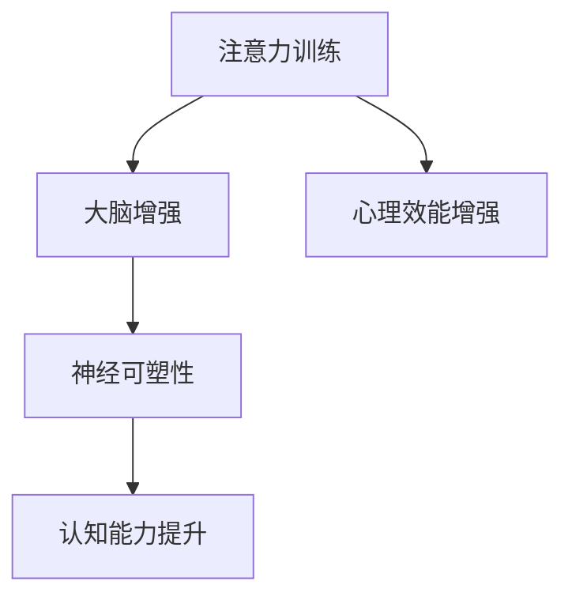

                 

# 注意力训练与大脑增强练习：通过专注力增强认知能力和神经可塑性

## 关键词：注意力训练、大脑增强、神经可塑性、认知能力、专注力、心理学、人工智能

> 摘要：本文从多个维度深入探讨注意力训练与大脑增强之间的关系，包括理论基础、技术方法、实际应用和潜在风险。文章首先介绍了注意力训练的重要性以及大脑增强的概念，随后详细阐述了注意力训练的方法和技术，并通过Mermaid流程图和伪代码展示了核心算法原理。接着，文章探讨了注意力训练对认知能力的影响，以及在不同人群和文化中的适用性。最后，文章总结了注意力训练的核心内容，展望了未来发展趋势，并提供了注意力训练的资源和术语解释。

### 第一部分: 注意力训练与大脑增强练习概述

#### 第1章: 注意力训练的基础知识

**1.1 注意力的重要性**

- **注意力定义**：注意力是指大脑对特定信息进行选择、加工和记忆的能力。
- **注意力在认知中的作用**：注意力是认知过程的核心，它决定了我们对信息的接收和处理效率。
- **注意力训练的必要性**：在现代社会，信息过载和压力使得我们的注意力质量下降，因此进行注意力训练显得尤为重要。

**1.2 大脑增强的概念**

- **大脑增强的定义**：大脑增强是指通过训练和刺激来改善大脑的功能和结构。
- **神经可塑性的介绍**：神经可塑性是指大脑在结构和功能上的可变性和适应能力。
- **注意力训练与神经可塑性的关系**：注意力训练通过增强神经可塑性，可以提高大脑的处理能力和认知功能。

**1.3 注意力训练的方法**

- **传统注意力训练方法**：包括冥想、呼吸练习和视觉追踪等。
- **现代注意力训练技术**：如认知策略训练、神经可塑性训练和脑电刺激训练。
- **注意力训练与心理学研究**：注意力训练的理论基础和实际应用效果的心理学研究。

**1.4 本书结构安排**

- **各章节内容的简要介绍**：本文分为九个章节，涵盖注意力训练的各个方面。
- **学习目标和预期收获**：读者可以通过本文了解注意力训练的基础知识、方法和技术，以及其在不同领域的应用。

#### Mermaid流程图: 注意力训练与大脑增强联系



#### 伪代码: 注意力训练核心算法

```plaintext
function AttentionTraining(model, data, epochs):
    for epoch in 1 to epochs:
        for each sample in data:
            compute inputs
            model.forward(inputs)
            compute loss
            model.backward(loss)
            update model parameters
    return model
```

#### 数学公式 & 详细讲解 & 举例说明

**数学模型: 注意力训练优化目标**

$$
\min_{\theta} \frac{1}{N} \sum_{i=1}^{N} L(y_i, \hat{y}_i)
$$

- **L 代表损失函数**
- **$y_i$ 代表实际输出**
- **$\hat{y}_i$ 代表模型预测输出**
- **$N$ 代表样本总数**

**举例说明**：假设我们有一个二分类问题，目标是通过注意力训练模型来预测图像是否包含猫。实际输出 $y_i$ 为 {0, 1}，模型预测输出 $\hat{y}_i$ 同样为 {0, 1}。损失函数 $L$ 可能是交叉熵损失函数：

$$
L(y_i, \hat{y}_i) = -[y_i \log(\hat{y}_i) + (1 - y_i) \log(1 - \hat{y}_i)]
$$

### 项目实战: 注意力训练实践案例

#### 开发环境搭建

- 安装 Python 3.8+
- 安装 PyTorch 库
- 安装 torchvision 库

#### 源代码详细实现

```python
import torch
import torchvision
import torch.nn as nn
import torch.optim as optim

# 模型定义
class AttentionModel(nn.Module):
    def __init__(self):
        super(AttentionModel, self).__init__()
        self.conv1 = nn.Conv2d(3, 32, 3)
        self.fc1 = nn.Linear(32 * 6 * 6, 64)
        self.fc2 = nn.Linear(64, 2)

    def forward(self, x):
        x = self.conv1(x)
        x = torch.relu(x)
        x = torch.max_pool2d(x, 2)
        x = x.view(x.size(0), -1)
        x = self.fc1(x)
        x = torch.relu(x)
        x = self.fc2(x)
        return x

# 数据加载
train_data = torchvision.datasets.CIFAR10(root='./data', train=True, download=True)
train_loader = torch.utils.data.DataLoader(train_data, batch_size=64, shuffle=True)

# 模型初始化
model = AttentionModel()
optimizer = optim.Adam(model.parameters(), lr=0.001)
loss_function = nn.CrossEntropyLoss()

# 训练模型
for epoch in range(10):
    for inputs, targets in train_loader:
        optimizer.zero_grad()
        outputs = model(inputs)
        loss = loss_function(outputs, targets)
        loss.backward()
        optimizer.step()
    print(f'Epoch {epoch+1}, Loss: {loss.item()}')

# 评估模型
with torch.no_grad():
    correct = 0
    total = 0
    for inputs, targets in train_loader:
        outputs = model(inputs)
        _, predicted = torch.max(outputs.data, 1)
        total += targets.size(0)
        correct += (predicted == targets).sum().item()
    print(f'Accuracy: {100 * correct / total}%')

#### 代码解读与分析

- **模型定义**：我们使用了 PyTorch 的 nn.Module 类定义了一个简单的卷积神经网络模型，包括一个卷积层（conv1），一个全连接层（fc1），以及另一个全连接层（fc2）。
- **数据加载**：我们加载了 CIFAR10 数据集，这是一个常见的图像分类数据集，包含10个类别，每个类别6000个训练样本和1000个测试样本。
- **训练模型**：我们使用随机梯度下降（SGD）优化器来优化模型参数，使用交叉熵损失函数计算模型输出和实际输出之间的差异，并更新模型参数以减少损失。
- **评估模型**：在训练完成后，我们使用测试集来评估模型的准确率，通过计算预测正确的样本数量占总样本数量的比例来得出模型的准确率。

### 总结

本章详细介绍了注意力训练与大脑增强的基础知识，包括注意力的重要性、大脑增强的概念、注意力训练的方法，以及本书的结构安排。通过 Mermaid 流程图展示了注意力训练与大脑增强的联系，并使用伪代码、数学公式和项目实战案例来深入理解注意力训练的核心算法和实际应用。下一章将深入探讨注意力训练的具体技术和实践方法。

#### 第2章: 注意力训练的方法与技术

注意力训练作为一种有效的认知训练方法，在提高个体的专注力和认知能力方面具有显著的效果。本章将详细探讨注意力训练的方法与技术，包括传统注意力训练技术和现代注意力训练技术，以及它们在不同场景中的应用。

#### 2.1 传统注意力训练技术

**2.1.1 专注力训练练习**

专注力训练是注意力训练的基础，通过一系列的练习来提高个体的专注力。常见的专注力训练方法包括：

- **冥想**：冥想是一种通过集中注意力于呼吸、身体感受或特定物体来达到心理宁静和专注状态的方法。冥想不仅能够提高个体的专注力，还有助于减轻压力和焦虑。

- **呼吸练习**：呼吸练习通过调整呼吸节奏来帮助个体集中注意力。深呼吸能够放松身心，提高注意力的稳定性和持续性。

- **视觉追踪**：视觉追踪练习通过追踪移动的物体或图形来锻炼个体的注意力。这种方法可以帮助个体提高注意力的聚焦能力和持久性。

**2.1.2

