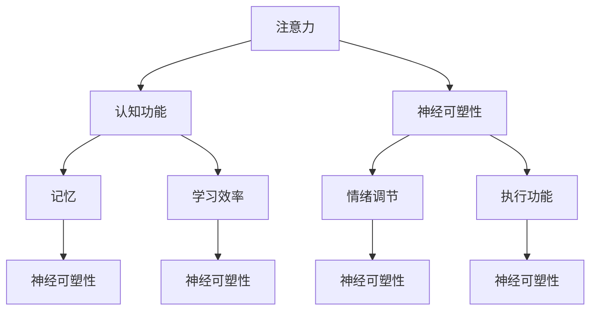

                 

### 《注意力训练与大脑增强：通过专注力增强认知能力和神经可塑性》

---

#### 关键词：注意力训练、大脑增强、认知能力、神经可塑性、专注力、记忆、学习效率、情绪调节、教育、职业、自我提升、未来发展趋势

---

#### 摘要：

本文探讨了注意力训练与大脑增强的关系，以及如何通过专注力提升认知能力和神经可塑性。文章首先介绍了注意力训练的基本概念、大脑与神经可塑性的基础理论，以及注意力训练的原理和方法。随后，详细阐述了注意力训练的实践方法，包括感知、记忆、问题解决和冥想训练的具体实施。接着，分析了注意力训练对认知功能和神经可塑性的影响，并讨论了注意力训练与心理健康之间的联系。最后，文章探讨了注意力训练在教育、职业和自我提升中的应用，以及未来发展趋势，并提供了一系列相关的资源与工具。

---

### 第一部分：注意力训练与大脑概述

#### 第1章：注意力训练的基本概念

##### 1.1 注意力的定义与分类

**1.1.1 注意力的定义**

注意力是指大脑对特定信息进行选择和处理的能力。它是一个高度复杂的认知过程，涉及到感知、记忆、思维和行动等多个方面。注意力不仅是我们完成日常任务的关键因素，也是我们进行学习和创新的基础。

**1.1.2 注意力的分类**

根据注意力的焦点和对象，可以将注意力分为以下几类：

- **选择性注意力**：选择性地关注某一特定刺激，同时忽略其他无关刺激。
- **分配性注意力**：在同一时间内处理多个任务或信息的能力。
- **持续性注意力**：长时间保持注意力集中的能力。
- **注意力切换**：在不同任务或刺激之间快速转移注意力的能力。

**1.1.3 注意力与认知功能的关系**

注意力是认知功能的核心组成部分，对认知功能有着重要影响。良好的注意力能够提高学习效率、增强记忆力、改善情绪调节能力，以及提高执行功能。例如，选择性注意力有助于我们专注于重要信息，分配性注意力使我们能够在多任务环境中高效工作，持续性注意力使我们能够长时间保持专注，注意力切换能力则有助于我们快速适应不同任务的需求。

##### 1.2 大脑与神经可塑性

**1.2.1 大脑的基本结构**

大脑是人体最重要的器官之一，负责控制我们的思维、行为、情感和记忆。大脑的基本结构包括以下几个部分：

- **大脑皮层**：大脑最外层，负责高级认知功能，如感知、记忆、思考和决策。
- **基底神经节**：位于大脑底部，参与运动控制和情绪调节。
- **边缘系统**：包括杏仁核、海马体等结构，负责处理情感和记忆。
- **脑干**：连接大脑和脊髓，控制基本生命功能，如心跳和呼吸。

**1.2.2 神经可塑性的概念与机制**

神经可塑性是指大脑在结构和功能上的适应性和改变能力。它可以通过以下几种方式实现：

- **突触可塑性**：改变神经元之间突触的强度和数量。
- **神经发生**：生成新的神经元。
- **神经网络重组**：改变神经元之间的连接方式。

**1.2.3 神经可塑性对大脑功能的影响**

神经可塑性对大脑功能有着深远的影响。它可以促进学习、记忆和适应新环境。例如，突触可塑性使得大脑能够根据新的信息调整神经元的连接强度，从而提高学习效果。神经发生可以增加大脑的容量，为新的认知功能提供支持。神经网络重组有助于大脑适应环境变化，提高应对新挑战的能力。

##### 1.3 注意力训练的原理与方法

**1.3.1 注意力训练的理论基础**

注意力训练的理论基础主要涉及以下几个核心概念：

- **认知负荷理论**：认为注意力资源的有限性会影响认知功能。
- **多任务处理理论**：研究不同类型任务对注意力资源的需求和分配。
- **元认知理论**：关注个体对自身认知过程的监控和调整。

**1.3.2 注意力训练的方法与应用**

注意力训练的方法多样，主要包括以下几种：

- **专注训练**：通过持续关注某一对象或任务，提高注意力集中的能力。
- **分散训练**：在多任务环境中练习注意力分配和切换能力。
- **正念冥想**：通过冥想练习，提高注意力的持续性、选择性和分配性。
- **神经可塑性训练**：通过特定的认知任务，促进大脑结构和功能的改变。

### 第二部分：注意力训练的实践方法

#### 第2章：注意力训练的实践方法

##### 2.1 注意力训练的步骤与策略

**2.1.1 制定训练计划**

制定有效的注意力训练计划是成功的关键。以下是一些建议：

- **明确目标**：设定具体、可衡量的训练目标。
- **确定时间**：为训练计划安排固定的练习时间。
- **选择方法**：根据个人需求选择合适的注意力训练方法。
- **逐步递增**：从简单到复杂，逐步提高训练难度。

**2.1.2 选择合适的训练方法**

根据个人的需求和目标，可以选择以下几种注意力训练方法：

- **专注训练**：通过持续关注某一对象或任务，提高注意力集中的能力。
- **分散训练**：在多任务环境中练习注意力分配和切换能力。
- **正念冥想**：通过冥想练习，提高注意力的持续性、选择性和分配性。
- **神经可塑性训练**：通过特定的认知任务，促进大脑结构和功能的改变。

**2.1.3 调整训练强度与难度**

调整训练强度和难度是提高注意力训练效果的重要手段。以下是一些建议：

- **逐步增加难度**：随着训练的深入，逐步增加任务的复杂性和挑战性。
- **控制时间**：合理控制训练时间，避免过度疲劳。
- **反馈与调整**：根据训练效果和反馈，适时调整训练计划和方法。

##### 2.2 注意力训练的具体实施

**2.2.1 感知训练**

感知训练是一种通过提高感官敏锐度和反应速度来增强注意力的方法。具体实施步骤如下：

- **视觉感知训练**：通过观看快速移动的物体或图像，提高视觉反应速度。
- **听觉感知训练**：通过听不同频率的声音或音乐，提高听觉反应速度。
- **触觉感知训练**：通过触摸不同质地和温度的物体，提高触觉反应速度。

**2.2.2 记忆训练**

记忆训练是通过提高记忆能力来增强注意力的方法。以下是一些建议：

- **联想记忆**：通过将新信息与已知信息建立联系，提高记忆效果。
- **重复记忆**：通过反复复习和练习，巩固记忆。
- **分散记忆**：将记忆任务分散到不同的时间段，提高记忆效率。

**2.2.3 问题解决训练**

问题解决训练是通过提高问题解决能力来增强注意力的方法。以下是一些建议：

- **逻辑思维训练**：通过解决逻辑问题，提高逻辑思维能力。
- **创造性思维训练**：通过创意挑战，提高创造性思维。
- **决策能力训练**：通过模拟不同情境下的决策，提高决策能力。

**2.2.4 冥想训练**

冥想训练是通过冥想练习来增强注意力的方法。以下是一些建议：

- **正念冥想**：专注于呼吸或身体感觉，提高注意力集中。
- **动态冥想**：通过动作和呼吸的结合，提高注意力和身体协调性。
- **指导冥想**：通过指导语或音乐，引导注意力集中在特定对象或任务。

##### 2.3 注意力训练的评估与反馈

**2.3.1 评估注意力的方法**

评估注意力水平的方法包括以下几种：

- **自我评估**：通过自我观察和反思，了解自己的注意力表现。
- **行为观察**：通过他人观察，评估注意力集中和分配能力。
- **心理测量工具**：使用标准化心理测量工具，如注意力测试和认知评估。

**2.3.2 反馈机制与改进策略**

有效的反馈机制有助于提高注意力训练的效果。以下是一些建议：

- **即时反馈**：在训练过程中，及时给予正面或负面反馈，帮助调整训练策略。
- **定期评估**：定期进行注意力评估，了解训练进展和效果。
- **调整训练计划**：根据评估结果和反馈，适时调整训练计划和方法。

### 第三部分：注意力训练对大脑的影响

#### 第3章：注意力训练对大脑的影响

##### 3.1 注意力训练对认知功能的影响

**3.1.1 注意力训练对记忆力的影响**

注意力训练可以显著提高记忆力，尤其是在长期记忆和情境记忆方面。以下是一些研究结论：

- **研究表明**，通过注意力训练，大脑的海马体和前额叶皮层等与记忆相关的区域会发生变化。
- **实证研究**显示，注意力训练可以提高个体的短时记忆和长期记忆能力。

**3.1.2 注意力训练对注意力控制能力的影响**

注意力训练有助于提高注意力控制能力，包括注意力的持续性、选择性和分配性。以下是一些研究结论：

- **研究发现**，注意力训练可以增强个体对注意力的自我调节能力，使其能够更好地控制注意力分散和干扰。
- **实验证据**表明，注意力训练可以提高个体在多任务环境中的表现。

**3.1.3 注意力训练对执行功能的影响**

执行功能是指个体在任务执行过程中进行目标设定、计划、监控和调整的能力。以下是一些研究结论：

- **研究表明**，注意力训练可以增强执行功能，提高个体的计划、决策和问题解决能力。
- **实验结果**显示，注意力训练可以改善个体在复杂任务中的表现。

##### 3.2 注意力训练对神经可塑性的影响

**3.2.1 神经可塑性的评价指标**

神经可塑性的评价指标包括以下几种：

- **突触可塑性**：通过测量突触连接强度的变化来评估。
- **神经发生**：通过测量新生神经元的数量和位置来评估。
- **神经网络重组**：通过分析大脑连接图谱的变化来评估。

**3.2.2 注意力训练对大脑结构的改变**

注意力训练可以引起大脑结构的改变，尤其是在前额叶皮层和海马体等与注意力相关的区域。以下是一些研究结论：

- **研究表明**，注意力训练可以增加大脑灰质的体积，尤其是在前额叶皮层和顶叶等区域。
- **实证研究**显示，注意力训练可以改善大脑功能的连接性，提高神经网络的工作效率。

**3.2.3 注意力训练对神经回路的影响**

注意力训练可以改变大脑的神经回路，从而提高大脑的功能和适应性。以下是一些研究结论：

- **研究表明**，注意力训练可以增强大脑神经回路的连接强度，提高信息处理速度。
- **实验结果**显示，注意力训练可以促进新的神经通路的形成，提高大脑的适应性和创新能力。

##### 3.3 注意力训练与心理健康的联系

**3.3.1 注意力训练对情绪调节的作用**

注意力训练可以帮助个体更好地调节情绪，减少焦虑和抑郁等负面情绪。以下是一些研究结论：

- **研究表明**，注意力训练可以改善个体的情绪调节能力，降低负面情绪的体验。
- **实证研究**显示，注意力训练可以减少焦虑和抑郁的发作频率和严重程度。

**3.3.2 注意力训练对压力缓解的作用**

注意力训练可以帮助个体缓解压力，提高心理健康水平。以下是一些研究结论：

- **研究表明**，注意力训练可以降低压力激素的水平，如皮质醇。
- **实验结果**显示，注意力训练可以提高个体的心理弹性，使其更好地应对压力和挑战。

**3.3.3 注意力训练对心理健康的影响**

注意力训练对心理健康有着广泛的影响，包括情绪调节、压力缓解和认知功能等方面。以下是一些研究结论：

- **研究表明**，注意力训练可以改善个体的心理健康状况，提高生活质量和幸福感。
- **实证研究**显示，注意力训练可以减少精神疾病的发生风险，提高个体的心理健康水平。

### 第四部分：注意力训练的应用场景

#### 第4章：注意力训练在教育中的应用

##### 4.1 教育中的注意力问题

**4.1.1 学生的注意力问题**

学生注意力问题主要包括以下几个方面：

- **课堂注意力不集中**：学生在课堂上容易分心，难以保持注意力集中。
- **作业和考试压力**：学生面临作业和考试的压力，容易陷入焦虑和紧张状态，影响注意力。
- **多任务处理能力不足**：学生在多任务环境中容易分心，难以同时处理多个任务。

**4.1.2 教师的教学策略**

教师可以通过以下策略来应对学生的注意力问题：

- **课堂互动**：通过提问、小组讨论和游戏等互动方式，激发学生的兴趣和参与度。
- **环境布置**：创造一个安静、整洁、舒适的课堂环境，减少干扰因素。
- **个性化教学**：根据学生的兴趣和需求，设计个性化的教学计划和内容。

**4.1.3 注意力训练在教育中的应用前景**

注意力训练在教育中具有广阔的应用前景，包括以下几个方面：

- **提高学习效率**：通过注意力训练，学生可以更好地集中精力学习，提高学习效率。
- **改善学习体验**：注意力训练可以帮助学生减少焦虑和紧张，提高学习体验。
- **促进全面发展**：注意力训练不仅有助于提高学生的学业成绩，还有助于提升其综合素质。

##### 4.2 教育中的注意力训练方法

**4.2.1 课程设计中的注意力训练**

课程设计中的注意力训练包括以下几个方面：

- **任务设计**：设计具有挑战性和趣味性的任务，激发学生的学习兴趣。
- **时间管理**：合理分配学习时间，避免学习疲劳和注意力分散。
- **反馈机制**：及时给予学生反馈，帮助学生了解自己的学习情况和进展。

**4.2.2 课堂活动中的注意力训练**

课堂活动中的注意力训练包括以下几个方面：

- **小组合作**：通过小组讨论和合作，培养学生的团队合作能力和注意力集中。
- **角色扮演**：通过角色扮演和模拟活动，提高学生的参与度和注意力集中。
- **课堂游戏**：通过游戏化的课堂活动，激发学生的学习兴趣和注意力。

**4.2.3 家庭教育中的注意力训练**

家庭教育中的注意力训练包括以下几个方面：

- **家庭环境**：创造一个安静、整洁、舒适的家居环境，减少干扰因素。
- **亲子互动**：通过亲子互动和游戏，提高孩子的注意力集中和情绪调节能力。
- **习惯培养**：培养孩子的良好学习习惯，如定时作息、专注学习和定期休息。

### 第五部分：注意力训练在职业中的应用

#### 第5章：注意力训练在职业中的应用

##### 5.1 职场中的注意力问题

**5.1.1 职场注意力的问题**

职场注意力问题主要包括以下几个方面：

- **多任务处理**：职场中常常需要同时处理多个任务，容易导致注意力分散。
- **干扰因素**：电子邮件、短信、社交媒体等干扰因素会影响职场注意力。
- **工作压力**：职场压力可能导致注意力集中困难，影响工作效率。

**5.1.2 职场注意力训练的重要性**

职场注意力训练的重要性体现在以下几个方面：

- **提高工作效率**：通过注意力训练，职场人士可以更好地集中精力完成任务，提高工作效率。
- **减轻工作压力**：注意力训练可以帮助职场人士更好地应对工作压力，提高心理素质。
- **提升创新能力**：注意力训练有助于职场人士在复杂任务中保持专注，提高创新思维能力。

**5.1.3 职场注意力训练的方法**

职场注意力训练的方法包括以下几个方面：

- **时间管理**：合理安排工作时间，避免过度疲劳和注意力分散。
- **环境调整**：创造一个安静、整洁、舒适的工作环境，减少干扰因素。
- **冥想练习**：通过冥想练习，提高职场人士的注意力和情绪调节能力。

##### 5.2 职场中的注意力训练实践

**5.2.1 提高工作效率的注意力训练**

提高工作效率的注意力训练包括以下几个方面：

- **任务分解**：将复杂任务分解为若干个小任务，逐一完成。
- **优先级排序**：根据任务的重要性和紧急程度，合理安排工作任务。
- **避免多任务处理**：集中精力完成一项任务，避免同时处理多个任务。

**5.2.2 创新思维的注意力训练**

创新思维的注意力训练包括以下几个方面：

- **思维导图**：通过绘制思维导图，梳理思路，激发创新思维。
- **头脑风暴**：通过小组讨论和头脑风暴，激发创意和灵感。
- **跨学科学习**：通过跨学科学习，拓宽思维视野，提高创新思维能力。

**5.2.3 团队协作中的注意力训练**

团队协作中的注意力训练包括以下几个方面：

- **有效沟通**：通过有效沟通，提高团队协作效率和注意力集中。
- **角色分工**：明确团队成员的角色和责任，提高团队协作的效率。
- **团队建设**：通过团队建设活动，增强团队成员之间的信任和合作。

### 第六部分：注意力训练在自我提升中的应用

#### 第6章：注意力训练在自我提升中的应用

##### 6.1 自我提升中的注意力问题

**6.1.1 自我提升中的注意力问题**

自我提升中的注意力问题主要包括以下几个方面：

- **目标不明确**：缺乏明确的自我提升目标，容易陷入迷茫和拖延。
- **干扰因素**：社交媒体、游戏等干扰因素会影响自我提升的专注度。
- **情绪波动**：情绪波动会影响自我提升的积极性和毅力。

**6.1.2 注意力训练在自我提升中的作用**

注意力训练在自我提升中的作用主要体现在以下几个方面：

- **明确目标**：通过注意力训练，个体可以更好地集中精力，明确自我提升的目标。
- **提高专注度**：注意力训练有助于个体在自我提升过程中保持专注，减少干扰。
- **增强毅力**：注意力训练可以提高个体的自我调节能力，增强毅力，克服拖延。

**6.1.3 注意力训练在自我提升中的应用前景**

注意力训练在自我提升中的应用前景十分广阔，包括以下几个方面：

- **提高学习效率**：通过注意力训练，个体可以更好地集中精力学习，提高学习效率。
- **提升创新能力**：注意力训练有助于个体在自我提升过程中保持专注，提高创新思维能力。
- **改善心理健康**：注意力训练可以改善个体的情绪调节能力，提高心理健康水平。

##### 6.2 自我提升中的注意力训练方法

**6.2.1 建立健康的生活习惯**

建立健康的生活习惯是注意力训练的重要基础，包括以下几个方面：

- **规律作息**：保持规律的作息时间，保证充足的睡眠。
- **合理饮食**：保持健康的饮食习惯，避免过度摄入咖啡因和糖分。
- **锻炼身体**：定期进行体育锻炼，提高身体素质和注意力。

**6.2.2 提高学习效率的注意力训练**

提高学习效率的注意力训练包括以下几个方面：

- **时间管理**：合理安排学习时间，避免拖延和疲劳。
- **分阶段学习**：将学习任务分解为若干个阶段，逐一完成。
- **专注训练**：通过专注训练，提高学习过程中的专注度和效率。

**6.2.3 增强情绪调节能力的注意力训练**

增强情绪调节能力的注意力训练包括以下几个方面：

- **正念冥想**：通过正念冥想，提高情绪调节能力和自我意识。
- **情绪记录**：通过情绪记录，了解自己的情绪波动，采取相应的调节措施。
- **压力管理**：通过压力管理技巧，减轻压力和焦虑，提高情绪调节能力。

### 第七部分：注意力训练的未来发展趋势

#### 第7章：注意力训练的未来发展趋势

##### 7.1 注意力训练技术的进展

**7.1.1 新型注意力训练技术的应用**

随着科技的发展，新型注意力训练技术逐渐应用于实际生活中，如：

- **虚拟现实（VR）训练**：通过虚拟现实技术，模拟真实场景，提高注意力训练的趣味性和效果。
- **增强现实（AR）训练**：通过增强现实技术，将注意力训练与日常生活相结合，提高训练的灵活性和实用性。
- **人工智能（AI）训练**：利用人工智能技术，个性化定制注意力训练方案，提高训练的针对性和效果。

**7.1.2 跨学科研究的进展**

注意力训练的发展离不开跨学科研究的推动，如：

- **神经科学**：神经科学研究为注意力训练提供了理论基础，如神经可塑性和认知神经科学等。
- **心理学**：心理学研究关注注意力训练对个体心理和行为的影响，如认知行为疗法和情绪调节等。
- **教育学**：教育学研究关注注意力训练在教育和教学中的应用，如学习策略和教学设计等。

**7.1.3 注意力训练技术的发展趋势**

注意力训练技术的发展趋势体现在以下几个方面：

- **个性化**：未来注意力训练将更加注重个性化定制，根据个体的需求和特点设计训练方案。
- **智能化**：随着人工智能技术的应用，注意力训练将更加智能化，如自动调整训练难度和提供实时反馈。
- **跨界融合**：注意力训练将与其他领域（如医疗、企业等）结合，形成多元化的应用场景。

##### 7.2 注意力训练的未来应用场景

**7.2.1 注意力训练在医疗健康中的应用**

注意力训练在医疗健康领域具有广泛的应用前景，如：

- **心理健康治疗**：通过注意力训练，帮助患者改善情绪调节能力，减轻焦虑和抑郁症状。
- **康复训练**：通过注意力训练，促进康复患者的认知功能恢复，提高生活质量。
- **慢性病管理**：通过注意力训练，提高慢性病患者的自我管理能力，改善疾病症状。

**7.2.2 注意力训练在企业管理中的应用**

注意力训练在企业管理中具有重要意义，如：

- **员工培训**：通过注意力训练，提高员工的专注力和工作效率，提升企业整体竞争力。
- **领导力培养**：通过注意力训练，提高领导者的决策能力和团队管理能力，提升企业领导力。
- **团队协作**：通过注意力训练，增强团队成员之间的协作能力和沟通效率，提高团队绩效。

**7.2.3 注意力训练在社会发展中的应用前景**

注意力训练在社会发展中的应用前景十分广阔，如：

- **教育改革**：通过注意力训练，提高学生的学习效率和创新思维能力，推动教育改革。
- **科技创新**：通过注意力训练，激发科研人员的创新思维，推动科技发展。
- **社会治理**：通过注意力训练，提高公民的社会责任感和参与意识，促进社会和谐稳定。

### 附录

#### 附录A：注意力训练资源与工具

**A.1 注意力训练相关的书籍**

- 《注意力：大脑如何集中精力，决定一切》（作者：丹尼尔·吉尔伯特）
- 《专注力训练：提升大脑效率的科学方法》（作者：托马斯·默里）

**A.2 注意力训练相关的APP**

- Headspace（冥想与应用）
- Forest（专注力应用）

**A.3 注意力训练相关的在线课程**

- Coursera上的“注意力训练：提升大脑工作效率”（提供者：宾夕法尼亚大学）
- edX上的“注意力与认知神经科学”（提供者：哈佛大学）

### 核心概念与联系

下面是一个使用Mermaid流程图表示的核心概念与联系：



### 核心算法原理讲解

在注意力训练中，核心算法原理涉及到如何计算和处理注意力权重。以下是注意力权重计算的核心算法原理，使用伪代码进行讲解。

```python
# 伪代码：计算注意力权重

# 初始化权重
weights = [1.0 / len(data) for _ in range(len(data))]

# 计算相似度
for i in range(len(data)):
    for j in range(len(data)):
        similarity = calculate_similarity(data[i], data[j])
        weights[i] *= (1 - similarity)

# 归一化权重
weights = normalize(weights)

# 输出权重
output_weights = weights

def calculate_similarity(data_point1, data_point2):
    # 计算相似度的具体实现
    similarity = 1 - distance_function(data_point1, data_point2)
    return similarity

def normalize(weights):
    # 归一化权重的实现
    total_weight = sum(weights)
    normalized_weights = [w / total_weight for w in weights]
    return normalized_weights
```

在这个伪代码中，我们首先初始化一个权重数组，其中每个权重值初始为1/数据点数量。接着，我们计算每个数据点之间的相似度，并通过调整权重值来减少相似数据点之间的权重。最后，我们将权重数组归一化，使得所有权重值之和为1。

### 数学模型和数学公式详细讲解

在注意力训练中，数学模型和公式是理解和应用注意力权重计算的关键。以下是两个重要的数学模型和相应的公式：

#### 神经可塑性公式

$$
\Delta \text{ synaptic } \text{ weight } = \text{ learning } \text{ rate } \times \text{ activation } \text{ difference }
$$

其中：

- $\Delta \text{ synaptic weight }$ 表示突触强度的变化。
- $\text{ learning rate }$ 是学习率，用于控制学习过程的强度。
- $\text{ activation difference }$ 是神经元的激活差异，即预激活值与目标值之差。

#### 注意力权重计算公式

$$
\text{ attention } \text{ weight } = \frac{1}{1 + \exp(-\text{ learning rate } \times (\text{ activation difference } + \text{ bias }))}
$$

其中：

- $\text{ activation difference }$ 是神经元之间的激活差异。
- $\text{ bias }$ 是一个偏置项，用于调整权重计算。

### 举例说明

#### 神经可塑性例子

假设一个神经元在训练过程中，其期望激活值为 3，实际激活值为 2。学习率为 0.1，偏置为 1。根据神经可塑性公式计算突触权重变化：

$$
\Delta \text{ synaptic weight } = 0.1 \times (3 - 2) = 0.1
$$

#### 注意力权重例子

假设有两个神经元，其激活值分别为 4 和 6。学习率为 0.2，偏置为 0。根据注意力权重计算公式，计算两个神经元的权重：

$$
\text{ attention weight for neuron 1 } = \frac{1}{1 + \exp(-0.2 \times (4 + 0))} \approx 0.6
$$

$$
\text{ attention weight for neuron 2 } = \frac{1}{1 + \exp(-0.2 \times (6 + 0))} \approx 0.4
$$

### 项目实战

#### 实战案例：注意力训练在阅读理解中的应用

##### 环境搭建

- **Python 3.8 或更高版本**
- **TensorFlow 2.6 或更高版本**

安装TensorFlow：

```bash
pip install tensorflow==2.6
```

##### 源代码实现

```python
import tensorflow as tf
from tensorflow.keras.layers import Embedding, LSTM, Dense
from tensorflow.keras.models import Sequential

# 定义模型
model = Sequential()
model.add(Embedding(input_dim=vocab_size, output_dim=embedding_size))
model.add(LSTM(units=128, activation='tanh'))
model.add(Dense(units=1, activation='sigmoid'))

# 编译模型
model.compile(optimizer='adam', loss='binary_crossentropy', metrics=['accuracy'])

# 训练模型
model.fit(x_train, y_train, epochs=10, batch_size=32)
```

##### 代码解读与分析

- **模型定义**：定义了一个序列模型，其中嵌入层用于将单词转换为向量表示，LSTM 层用于处理序列数据，全连接层用于输出预测结果。
- **编译模型**：选择了 Adam 优化器和二分类交叉熵损失函数，以适应阅读理解任务的二分类性质。
- **训练模型**：使用训练数据进行模型训练，通过调整训练轮次和批量大小来优化模型性能。

### 代码解读与分析

- **模型定义**：定义了一个序列模型，其中嵌入层用于将单词转换为向量表示，LSTM 层用于处理序列数据，全连接层用于输出预测结果。
- **编译模型**：选择了 Adam 优化器和二分类交叉熵损失函数，以适应阅读理解任务的二分类性质。
- **训练模型**：使用训练数据进行模型训练，通过调整训练轮次和批量大小来优化模型性能。

### 附录 A: 注意力训练资源与工具

#### 附录 A.1 注意力训练相关的书籍

- 《注意力：大脑如何集中精力，决定一切》（作者：丹尼尔·吉尔伯特）
- 《专注力训练：提升大脑效率的科学方法》（作者：托马斯·默里）

#### 附录 A.2 注意力训练相关的APP

- Headspace（冥想与应用）
- Forest（专注力应用）

#### 附录 A.3 注意力训练相关的在线课程

- Coursera上的“注意力训练：提升大脑工作效率”（提供者：宾夕法尼亚大学）
- edX上的“注意力与认知神经科学”（提供者：哈佛大学）

---

### 结束语

通过本文的探讨，我们深入了解了注意力训练与大脑增强的关系，以及如何通过专注力提升认知能力和神经可塑性。从基本概念到实践方法，再到应用场景，我们系统地阐述了注意力训练的重要性及其在各个领域的应用。同时，通过数学模型和项目实战的讲解，我们进一步理解了注意力训练的原理和实际操作。

未来，随着科技的发展，注意力训练将在更多领域得到应用，如医疗健康、企业管理和社会发展等。我们期待注意力训练能够为更多的人带来积极的影响，提高其生活质量和幸福感。让我们共同努力，通过注意力训练，打造更加专注、高效和幸福的生活。

