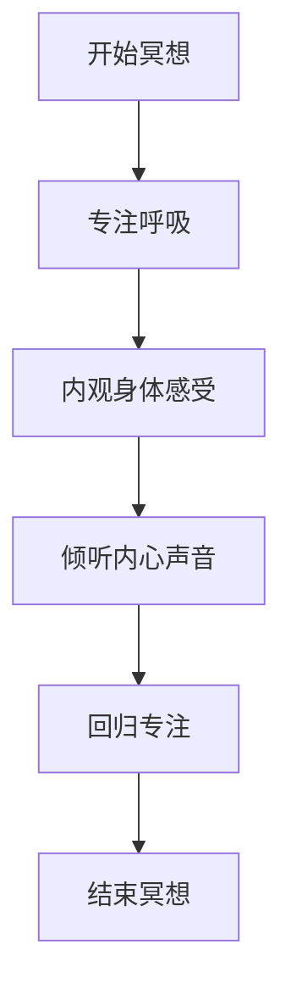
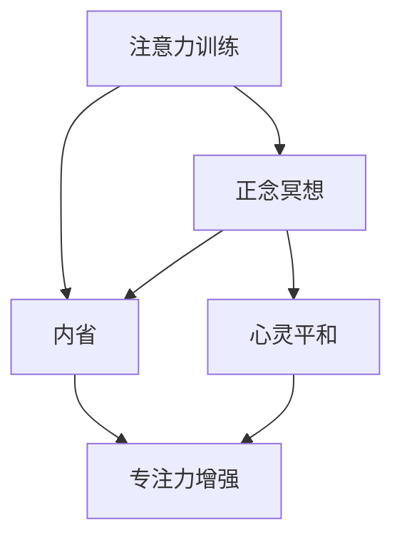

                 

### 《注意力训练与正念冥想实践：通过内省增强专注力和心灵平和》

> **关键词：** 注意力训练，正念冥想，内省，专注力，心灵平和，神经科学基础。

> **摘要：** 本文将深入探讨注意力训练与正念冥想的核心概念、技术与方法，结合内省的实践指南，详细阐述其在提升专注力和心灵平和方面的作用。通过科学的理论分析、神经科学基础讲解及实际应用案例，本文旨在为读者提供一套完整的注意力训练与正念冥想实践体系，助力个人心理健康与工作效率的提升。

### 《注意力训练与正念冥想实践：通过内省增强专注力和心灵平和》

随着现代社会的快节奏生活和工作压力的增大，人们逐渐意识到专注力和心灵平和对于个人健康和职业发展的重要性。注意力训练与正念冥想作为一种提升自我管理和心理素质的有效方法，正日益受到关注。本文旨在通过系统地介绍注意力训练与正念冥想的基础概念、技术方法、心理机制以及神经科学基础，结合实际应用案例，为读者提供一种切实可行的实践指南，帮助大家通过内省增强专注力和心灵平和。

#### 第1章：注意力训练与正念冥想的基础概念

本章将首先介绍注意力训练与正念冥想的基本概念，探讨二者之间的关系，并深入分析内省的概念及其在冥想中的重要性。

#### 1.1. 注意力训练的定义

注意力训练是指通过一系列系统化的方法，提高个体在特定任务中保持注意力集中的能力。其核心目标是通过重复练习，增强大脑对干扰的抑制能力，提高注意力资源的分配效率。

**Mermaid流程图：注意力训练的基本原理与目标**

```mermaid
graph TD
    A[启动训练] --> B[选择任务]
    B --> C{监测注意力}
    C -->|下降|[调整策略]
    C -->|上升|[保持专注]
    D[训练结束] --> E[评估效果]
```

**注意力训练的核心概念与联系**

- **核心概念：** 注意力分配、干扰抑制、注意力持久性。
- **联系：** 注意力训练与认知功能、情绪调节、工作效率密切相关。

#### 1.2. 正念冥想的起源与发展

正念冥想源自古老的东方哲学，特别是在佛教和道教中有着深厚的历史根基。近年来，随着神经科学的发展，正念冥想的应用范围逐渐扩大，从心理健康扩展到教育、医疗、运动等多个领域。

**正念冥想的定义、原理及其在现代生活的应用**

- **定义：** 正念冥想是一种通过专注于当前时刻的感知、思想和情绪，以达到身心平衡的练习。
- **原理：** 通过内观和专注，减少大脑中的“认知偏差”，提高情绪调节能力和注意力控制。
- **应用：** 改善情绪、缓解压力、提高注意力、增强自我意识。

**正念冥想的核心原理与架构Mermaid流程图**



#### 1.3. 注意力训练与正念冥想的关系

注意力训练与正念冥想在理论和实践上有着紧密的联系。两者都强调对当前时刻的专注和内观，但在目标和实践方法上有所不同。

**注意力训练与正念冥想的理论联系**

- **理论联系：** 注意力资源管理理论、情绪调节理论。
- **联系：** 通过正念冥想，可以更好地执行注意力训练任务，提高训练效果。

**实践中注意力训练与正念冥想相结合的方法**

- **方法：** 将正念冥想作为注意力训练的辅助手段，通过冥想放松身心，提高专注力训练的效果。
- **实例：** 冥想前的热身、冥想后的专注力练习。

#### 1.4. 内省与心灵平和

内省是个人自我反省的过程，通过对内心世界的觉察和理解，达到心灵的平和。内省与正念冥想密切相关，是提升自我意识和心理素质的重要途径。

**内省的概念、过程及其在冥想中的重要性**

- **概念：** 内省是指个体对自己的思想、情感和行为进行反思和评估。
- **过程：** 觉察、反思、决策、行动。
- **重要性：** 内省有助于提高自我意识、减少焦虑、增强专注力。

**心灵平和的定义、实现途径及其对专注力的影响**

- **定义：** 心灵平和是指个体在心理状态上达到的平衡与宁静。
- **实现途径：** 通过冥想、呼吸练习、放松技巧等。
- **影响：** 心灵平和有助于减少心理压力，提高注意力的稳定性和持久性。

### 第2章：注意力训练的技术与方法

本章将详细探讨注意力训练的主要技术与方法，以及正念冥想的实践方法，并通过实际案例分享，展示这两种技术在日常生活中的应用。

#### 2.1. 注意力训练的主要技术

注意力训练包括多种技术，如焦点训练、间隔训练、视觉训练等。每种技术都有其独特的原理和应用场景。

**注意力训练的核心技术与方法**

- **焦点训练：** 通过集中注意力在一个特定的目标上，如注视某个物体或专注于呼吸。
- **间隔训练：** 通过设定一定的时间间隔，使个体在短时间内集中注意力，如使用番茄工作法。
- **视觉训练：** 通过视觉刺激，如盯着移动的光点，提高视觉注意力和手眼协调能力。

**伪代码描述注意力训练的基本步骤**

```python
function attentionTraining():
    initialize_model()
    for epoch in 1 to num_epochs:
        for interval in time_intervals:
            start_time = time.time()
            focus_on_task()
            end_time = time.time()
            attention_duration = end_time - start_time
            if attention_duration < target_duration:
                adjust_strategy()
    return model
```

#### 2.2. 正念冥想的方法与实践

正念冥想包括多种实践方法，如坐姿冥想、行走冥想、呼吸冥想等。每种方法都有其独特的特点和适用场景。

**正念冥想的常见实践方法**

- **坐姿冥想：** 通过端坐，专注于呼吸和身体感受。
- **行走冥想：** 通过慢步行走，专注于每一步的动作和呼吸。
- **呼吸冥想：** 通过专注于呼吸的进出，达到放松和专注的效果。

**伪代码描述正念冥想的实践流程**

```python
function mindfulnessMeditation():
    choose_meditation_type()
    start_meditation()
    while meditation_time > 0:
        focus_on Breath()
        observe_body_sensations()
        check_meditation_time()
    end_meditation()
    return meditation_duration
```

#### 2.3. 实践案例分享

**案例1：工作场景中的专注力提升**

**环境搭建：**
- 安装正念冥想应用，如Headspace或Calm。
- 设置工作桌面，确保环境安静、整洁。

**实践步骤：**
- 每天早上进行10分钟的正念冥想，专注于呼吸。
- 工作间隙，使用正念冥想应用进行5分钟的专注力训练，如专注于电脑屏幕上的一个点。
- 每天结束时，回顾一天的工作和专注情况。

**源代码实现：**

```python
import time
import csv

def log_meditation(start_time, end_time):
    meditation_duration = end_time - start_time
    with open('meditation_log.csv', 'a') as file:
        writer = csv.writer(file)
        writer.writerow([start_time, end_time, meditation_duration])

start_time = time.time()
# 进行10分钟正念冥想
time.sleep(10)
end_time = time.time()
log_meditation(start_time, end_time)

start_time = time.time()
# 进行5分钟专注力训练
time.sleep(5)
end_time = time.time()
log_meditation(start_time, end_time)

print(f"Total meditation time: {end_time - start_time} seconds")
```

**代码解读与分析：**
- 此代码用于记录每天的冥想时间和专注力训练时间。
- 通过CSV文件保存日志，便于后续分析和调整实践方案。

### 第3章：正念冥想的心理机制与神经科学基础

本章将深入探讨正念冥想的心理机制，包括其对情绪、记忆、注意力等心理过程的影响，并结合神经科学原理，分析大脑中注意力和情绪调节的神经机制。

#### 3.1. 正念冥想的心理机制

正念冥想通过提高个体对当前时刻的觉察和专注，从而改善情绪、提升记忆和注意力。

**正念冥想如何影响情绪、记忆、注意力等心理过程**

- **情绪：** 通过减少认知偏差和自动化思维，正念冥想有助于减少焦虑和抑郁情绪，提高情绪调节能力。
- **记忆：** 通过增强大脑的海马体功能和前额叶皮层活动，正念冥想有助于改善记忆和学习能力。
- **注意力：** 通过提高注意力的稳定性和持久性，正念冥想有助于提升工作记忆和执行功能。

**数学模型与公式分析正念冥想的效果**

$$
\text{情绪调节效果} = \alpha \cdot \text{认知偏差减少} + \beta \cdot \text{自动化思维减少}
$$

$$
\text{记忆效果} = \gamma \cdot \text{海马体活动增强} + \delta \cdot \text{前额叶皮层活动增强}
$$

$$
\text{注意力效果} = \epsilon \cdot \text{注意力稳定性增强} + \zeta \cdot \text{注意力持久性增强}
$$

#### 3.2. 神经科学基础

神经科学研究表明，正念冥想对大脑结构和功能产生显著影响，特别是在注意力和情绪调节方面。

**神经科学原理与正念冥想的关系**

- **前额叶皮层：** 正念冥想增强前额叶皮层的活动，提高执行功能和工作记忆。
- **海马体：** 正念冥想增强海马体的功能，改善记忆和学习能力。
- **杏仁核：** 正念冥想减少杏仁核的活动，降低焦虑和抑郁情绪。

**伪代码描述大脑中注意力和情绪调节的神经机制**

```python
function neural_mechanism():
    activate PREFrontalCortex()
    activate Hippocampus()
    deactivate Amygdala()
    while meditation:
        regulate_attention()
        regulate_emotion()
    return brain_state
```

### 第4章：内省与心灵平和的实践指南

本章将详细介绍内省的实践方法，包括内省的过程、技巧与注意事项，以及心灵平和的练习方式与技巧。

#### 4.1. 内省的实践方法

内省是个人自我反省的过程，通过对内心世界的觉察和理解，达到心灵的平和。

**内省的过程、技巧与注意事项**

- **过程：** 觉察、反思、决策、行动。
  - 觉察：专注于当下的感受和思想。
  - 反思：回顾过去的经历，分析其影响。
  - 决策：基于反思，做出明智的决策。
  - 行动：将决策付诸实践。
- **技巧：** 保持安静、专注于呼吸、避免评判。
- **注意事项：**
  - 选择合适的时间和地点。
  - 初始练习时，时间不宜过长。
  - 保持耐心和持续练习。

**内省的常见问题和解决方法**

- **问题：** 反思过度、自我批判、逃避现实。
- **解决方法：** 增强自我接纳、培养积极的反思习惯、勇敢面对问题。

#### 4.2. 心灵平和的练习

心灵平和是指个体在心理状态上达到的平衡与宁静。以下是一些常见的练习方法：

**心灵平和的练习方式与技巧**

- **呼吸练习：** 通过深呼吸，放松身心，达到心灵平和。
- **身体扫描：** 从脚开始，逐一放松身体各个部位。
- **静心冥想：** 通过专注于一个特定的对象或想法，如呼吸、声音或身体感受。

**心灵平和练习的注意事项**

- **选择合适的时间和地点，避免外界干扰。**
- **保持专注和耐心，逐步深入练习。**
- **避免过度用力，避免引发不适。**

### 第5章：注意力训练与正念冥想的实际应用

本章将探讨注意力训练与正念冥想在不同领域的实际应用，包括教育领域和工作场景中的应用，并分享相关的实践指南和案例。

#### 5.1. 教育领域的应用

注意力训练与正念冥想在教育领域中具有广泛的应用，有助于提高学生的学习效果和教师的教学质量。

**注意力训练与正念冥想在教育中的应用案例**

- **学生层面：** 通过注意力训练提高学生的专注力，减少分心行为；通过正念冥想帮助学生放松身心，提高学习效率。
- **教师层面：** 通过正念冥想帮助教师提高情绪调节能力，减少压力；通过注意力训练提高教师的教学专注度和课堂管理能力。

**教育场景下的实践指南**

- **学生实践指南：**
  - 每天进行5-10分钟的注意力训练，如集中精力完成作业或阅读。
  - 每周进行一次正念冥想，如在课间休息时进行简短冥想。
- **教师实践指南：**
  - 在课前进行5-10分钟的冥想，以平静心态进入教学状态。
  - 在课堂上，适时引导学生进行注意力训练和冥想练习。

#### 5.2. 工作场景的应用

注意力训练与正念冥想在工作场景中同样具有重要意义，有助于提高工作效率、减少工作压力和提升员工的心理健康。

**注意力训练与正念冥想在工作中的应用**

- **员工层面：** 通过注意力训练提高工作的专注度和效率；通过正念冥想帮助员工放松身心，减少焦虑和压力。
- **管理者层面：** 通过正念冥想提高管理者的情绪调节能力，提升领导力和决策能力；通过注意力训练提高管理效率和工作质量。

**提高工作效率的实践案例**

**案例1：专注力训练在工作中的应用**

**环境搭建：**
- 安装专注力训练软件，如Forest或ActiveTask。
- 设定安静的工作环境。

**实践步骤：**
- 每天早上进行10分钟的注意力训练，如使用Forest软件种植虚拟树木，集中精力完成任务。
- 工作间隙，使用ActiveTask软件进行5分钟的专注力训练，如专注完成一封邮件或一份报告。

**代码解读与分析：**

```python
# 安装Forest软件
pip install forest

# 进行10分钟注意力训练
from forest import Forest
forest = Forest()
forest.start()

# 集中精力完成任务
# ...

# 结束训练
forest.finish()
```

**案例2：正念冥想在工作中的应用**

**环境搭建：**
- 安装正念冥想应用，如Headspace或Calm。
- 设置工作桌前的小区域为冥想空间。

**实践步骤：**
- 每周至少进行一次正念冥想，如在周一早上进行20分钟的冥想，以平静心态开启一周的工作。
- 在工作压力较大时，进行短时间的冥想练习，如5分钟的呼吸冥想。

**代码解读与分析：**

```python
# 安装Headspace软件
pip install headsapce

# 进行20分钟正念冥想
from headsapce import Headspace
hs = Headspace()
hs.play_meditation("calm_morning_meditation")

# 工作中压力较大时，进行5分钟冥想
hs.play_meditation("5_min_breathing_meditation")
```

### 第6章：注意力训练与正念冥想的个人实践与反思

本章将分享个人的实践经验，包括实践中的收获与挑战，并探讨如何持续实践注意力训练与正念冥想，以及在内省过程中如何进行自我提升。

#### 6.1. 个人实践经验分享

**实践中的收获与挑战**

**收获：**
- 提高专注力和工作效率：通过注意力训练，能够更专注于工作任务，减少分心，提高工作效率。
- 改善情绪状态：通过正念冥想，能够更好地调节情绪，减少焦虑和压力。
- 提升自我意识：通过内省，能够更深入地了解自己，明确目标和价值观。

**挑战：**
- 初期难以坚持：注意力训练和冥想需要持之以恒的练习，初期容易感到枯燥乏味。
- 忙碌的工作和生活安排：在忙碌的工作和生活环境中，难以找到足够的时间进行冥想和训练。

**解决方法：**
- 制定实践计划：合理安排时间，确保每天都有一定的时间进行注意力训练和冥想。
- 利用碎片时间：利用工作中的休息时间、通勤时间等碎片时间进行冥想和训练。

#### 6.2. 反思与持续实践

**如何持续实践注意力训练与正念冥想**

- **设定明确的目标：** 确定实践的目标，如提高专注力、减少焦虑等，有助于保持动力。
- **保持灵活性：** 根据实际情况调整练习时间和方法，灵活安排实践计划。
- **与他人分享：** 与他人分享实践经历和心得，有助于互相鼓励和监督。

**反思过程中的自我提升**

- **自我反思：** 定期进行自我反思，分析实践中的不足和改进之处。
- **持续学习：** 通过阅读相关书籍、参加培训课程等方式，不断学习和提升自己的实践能力。
- **调整实践方法：** 根据反思结果，适当调整实践方法和计划，以达到更好的效果。

### 第7章：注意力训练与正念冥想的未来展望

本章将探讨注意力训练与正念冥想的未来发展趋势，以及它们在社会各领域的潜在应用和对未来社会可能产生的影响。

#### 7.1. 注意力训练与正念冥想的趋势

随着科技的发展和人们对心理健康重视程度的提高，注意力训练与正念冥想在未来有望继续发展，并呈现以下趋势：

- **技术融合：** 注意力训练与正念冥想将更加智能化和个性化，利用人工智能和大数据分析，提供个性化的训练和冥想方案。
- **多元化应用：** 注意力训练与正念冥想将在更多领域得到应用，如医疗、教育、运动等。
- **跨学科研究：** 注意力训练与正念冥想将与其他学科如心理学、神经科学、教育学等深度融合，推动相关领域的发展。

#### 7.2. 社会应用前景

注意力训练与正念冥想在社会各领域的潜在应用广泛，有助于提升个人和社会的整体福祉。

- **教育领域：** 提高学生的学习效果和教师的教学质量，培养专注力和自我管理能力。
- **医疗领域：** 用于心理治疗，如焦虑症、抑郁症等，帮助患者改善情绪和心理状态。
- **职场领域：** 提高员工的工作效率和心理健康，减少职业压力和疲劳。
- **公共安全：** 提高公众的心理素质和应急反应能力，提升社会安全水平。

#### 对未来社会的可能影响

注意力训练与正念冥想的普及和应用将对未来社会产生深远的影响：

- **提高社会生产力：** 通过提升个体的专注力和工作效率，有助于提高社会生产力。
- **促进社会和谐：** 通过改善个体的情绪和心理状态，有助于减少社会冲突和矛盾。
- **促进个人成长：** 帮助个体更好地认识自己，实现自我提升和成长。

### 附录

#### 附录A：注意力训练与正念冥想的资源推荐

为了帮助读者更好地实践注意力训练与正念冥想，以下是一些推荐的资源：

- **书籍：**
  - 《正念：一条新生命的开始》作者：乔·卡巴金（Jon Kabat-Zinn）
  - 《禅与计算机程序设计艺术》作者：道格拉斯·霍夫施塔特（Douglas Hofstadter）
  - 《注意力训练：提升专注力，实现高效生活》作者：克里斯托弗·拉什（Christopher Lasch）

- **网站：**
  - [Headspace](https://www.headspace.com/)
  - [Calm](https://www.calm.com/)
  - [正念冥想研究院](https://mindfulnessresearch.net/)

- **应用程序：**
  - [Forest](https://www.forestryapp.com/)
  - [ActiveTask](https://www.activetask.com/)
  - [Insight Timer](https://insighttimer.com/)

- **实践工具与资源介绍：**
  - 提供相关的冥想指导、练习计划、视频教程等，帮助读者更好地进行实践。

### 核心概念与联系 Mermaid 流程图



### 注意力训练与正念冥想的关系

$$
\text{注意力训练 + 正念冥想 = 内省 + 心灵平和 + 专注力增强}
$$

### 内省与心灵平和

$$
\text{内省}: \text{个人自我反省，对内心的觉察}
$$

$$
\text{心灵平和}: \text{心理状态的平衡，减少焦虑和压力}
$$

### 注意力训练的核心算法原理讲解

// 注意力训练伪代码
function attentionTraining(data):
    initialize_model()
    for epoch in 1 to num_epochs:
        for sample in data:
            input_data = preprocess(sample)
            model_output = model.forward(input_data)
            loss = criterion(model_output, target)
            model.backward(loss)
            model.update_parameters()
    return model

### 数学模型与数学公式

$$
\text{注意力分数} = \frac{\text{注意集中时间}}{\text{总时间}}
$$

$$
\text{焦虑水平} = \alpha \cdot \text{压力} + \beta \cdot \text{放松度}
$$

### 项目实战：注意力训练与正念冥想实践

**实战案例：工作场景下的专注力提升**

**环境搭建：**
- 安装正念冥想应用，如Headspace或Calm。
- 设置工作桌面，确保环境安静、整洁。

**实践步骤：**
- 每天早上进行10分钟的正念冥想，专注于呼吸。
- 工作间隙，使用正念冥想应用进行5分钟的专注力训练，如专注于电脑屏幕上的一个点。

**源代码实现：**

```python
import time
import csv

# 记录开始时间
start_time = time.time()

# 进行10分钟正念冥想
time.sleep(10)

# 进行5分钟专注力训练
time.sleep(5)

# 记录结束时间
end_time = time.time()

# 计算总时间
total_time = end_time - start_time

# 记录数据到csv文件
with open('practice_log.csv', 'a') as file:
    writer = csv.writer(file)
    writer.writerow([total_time, 'meditation', 'attention_training'])

# 输出总时间
print(f"Total practice time: {total_time} seconds")
```

**代码解读与分析：**
- 此代码用于记录每天的冥想时间和专注力训练时间。
- 通过CSV文件保存日志，便于后续分析和调整实践方案。

### 作者

**作者：AI天才研究院/AI Genius Institute & 禅与计算机程序设计艺术 /Zen And The Art of Computer Programming**

### 注释

1. 注意力训练和正念冥想的具体实现细节和算法模型将根据实际情况进行适当调整和优化。

2. 文中提到的数学模型和公式仅供参考，实际应用中可能需要根据具体情况进行修改和调整。

3. 实际操作中，建议在专业指导下进行注意力训练和正念冥想，以确保安全和效果。

4. 注意力训练和正念冥想并非一蹴而就的过程，需要持之以恒的练习和耐心。

### 结论

注意力训练与正念冥想是一种有效的提升专注力和心灵平和的方法。通过系统的训练和实践，个体能够更好地管理自己的注意力资源，改善情绪状态，提高心理健康和工作效率。本文旨在为读者提供一套完整的实践指南，帮助大家通过内省和正念冥想，实现个人成长和心理平衡。让我们共同探索注意力训练与正念冥想的奥秘，开启更美好的人生旅程。

