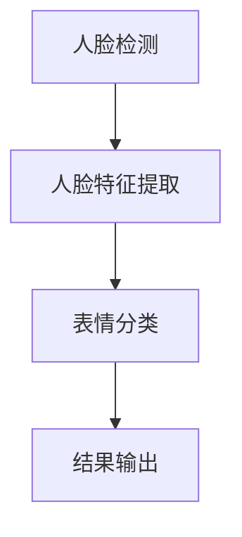

                 

# 深度学习在人脸表情识别中的应用

## 关键词

- 深度学习
- 人脸表情识别
- 卷积神经网络
- 递归神经网络
- 数据增强
- 实时性能

## 摘要

本文将详细探讨深度学习在人脸表情识别中的应用，从基础知识到实际项目实战，逐步深入解析人脸表情识别的原理及其优化策略。通过介绍主流深度学习框架、卷积神经网络（CNN）、递归神经网络（RNN）和长短期记忆网络（LSTM）等，我们将展示深度学习如何提高人脸表情识别的精度和实时性。此外，本文还将探讨人脸表情识别在多模态数据融合、智能交互和心理健康评估等领域的应用，为读者提供一个全面的技术视角。通过本文的学习，读者将能够掌握深度学习在人脸表情识别中的核心技术和实际应用，为后续研究和项目开发打下坚实基础。

## 目录

- [第1章：深度学习基础](#第1章深度学习基础)
- [第2章：人脸表情识别原理](#第2章人脸表情识别原理)
- [第3章：深度学习在人脸表情识别中的应用](#第3章深度学习在人脸表情识别中的应用)
- [第4章：人脸表情识别的优化策略](#第4章人脸表情识别的优化策略)
- [第5章：人脸表情识别项目实战](#第5章人脸表情识别项目实战)
- [第6章：人脸表情识别的前沿研究方向](#第6章人脸表情识别的前沿研究方向)
- [第7章：深度学习在人脸表情识别中的应用展望](#第7章深度学习在人脸表情识别中的应用展望)
- [附录A：深度学习在人脸表情识别中的开源资源和工具](#附录a深度学习在人脸表情识别中的开源资源和工具)
- [附录B：Mermaid流程图](#附录b-mermaid流程图)
- [附录C：数学公式](#附录c数学公式)

### 第1章：深度学习基础

#### 1.1 深度学习的起源与发展

##### 1.1.1 深度学习的定义

深度学习是一种人工智能的分支，它通过模拟人脑神经网络结构和学习机制，对大量数据进行自动特征提取和模式识别。深度学习具有层次化的神经网络结构，能够自动学习数据中的复杂特征，从而实现高水平的智能感知和决策。

##### 1.1.2 深度学习的发展历程

深度学习起源于1980年代，最初由Rumelhart、Hinton和Williams等人提出的反向传播算法（Backpropagation Algorithm）奠定了理论基础。然而，由于计算能力和数据资源的限制，深度学习在1990年代一度陷入低谷。直到2006年，Geoffrey Hinton等人重新提出了深度信念网络（Deep Belief Network），深度学习开始重新崛起。2012年，Alex Krizhevsky等人凭借在ImageNet竞赛中取得的突破性成果，将深度学习推向了公众视野。此后，深度学习迅速发展，并在语音识别、自然语言处理、计算机视觉等领域取得了显著的成果。

#### 1.2 神经网络与深度学习

##### 1.2.1 神经网络的基本概念

神经网络是由大量简单神经元（或节点）互联而成的复杂网络系统。每个神经元接收多个输入信号，通过激活函数进行非线性变换，最终产生一个输出信号。神经网络通过学习输入和输出之间的映射关系，实现数据的自动特征提取和模式识别。

##### 1.2.2 神经网络的工作原理

神经网络的工作原理可以概括为以下几个步骤：

1. **初始化权重和偏置**：在神经网络训练过程中，需要初始化每个神经元的权重（weights）和偏置（biases）。这些参数是神经网络模型的基础，决定着模型对输入数据的处理能力。

2. **前向传播**：在前向传播过程中，输入数据通过神经网络各层传递，每层神经元根据接收到的输入信号计算输出值。这一过程可以表示为：
   $$ 
   Z^{(l)} = W^{(l)}A^{(l-1)} + b^{(l)}
   $$
   其中，$Z^{(l)}$为当前层的输入值，$W^{(l)}$为当前层的权重矩阵，$A^{(l-1)}$为上一层的输出值，$b^{(l)}$为当前层的偏置向量。

3. **激活函数**：为了引入非线性变换，神经网络引入了激活函数（activation function），如Sigmoid函数、ReLU函数和Tanh函数。这些函数将神经元的线性组合映射到不同的区间，实现数据的非线性变换。

4. **反向传播**：在反向传播过程中，神经网络通过计算损失函数的梯度，更新各层的权重和偏置。这一过程可以表示为：
   $$
   \delta^{(l)} = \frac{\partial J}{\partial Z^{(l)}}
   $$
   其中，$\delta^{(l)}$为当前层的误差梯度，$J$为损失函数。

5. **权重更新**：通过误差梯度，神经网络根据梯度下降法（Gradient Descent）更新各层的权重和偏置：
   $$
   W^{(l)} = W^{(l)} - \alpha \cdot \frac{\partial J}{\partial W^{(l)}}
   $$
   $$
   b^{(l)} = b^{(l)} - \alpha \cdot \frac{\partial J}{\partial b^{(l)}}
   $$
   其中，$\alpha$为学习率。

##### 1.2.3 神经网络的学习过程

神经网络的学习过程可以分为以下几个阶段：

1. **数据预处理**：在训练神经网络之前，需要对输入数据进行预处理，如归一化、标准化等。这有助于提高神经网络的收敛速度和训练效果。

2. **模型初始化**：初始化神经网络模型，设置各层的权重和偏置。通常使用随机初始化方法，以保证模型的全局搜索能力。

3. **前向传播**：将训练数据输入神经网络，计算各层的输出值和损失函数。

4. **反向传播**：根据损失函数的梯度，更新各层的权重和偏置。

5. **权重更新**：重复前向传播和反向传播过程，逐步优化模型参数。

6. **模型评估**：在训练过程中，定期评估模型在验证数据集上的性能，以防止过拟合。

7. **模型优化**：根据模型评估结果，调整模型参数和训练策略，以提高模型性能。

8. **模型部署**：在模型训练完成后，将模型应用于实际数据，实现数据的自动特征提取和模式识别。

#### 1.3 深度学习的数学基础

##### 1.3.1 矩阵与向量运算

在深度学习中，矩阵和向量运算是非常基础且重要的数学工具。以下是一些常用的矩阵和向量运算：

1. **矩阵乘法**：两个矩阵$A$和$B$的乘积$C=AB$，其中$C$的元素$c_{ij}$等于$A$的第$i$行与$B$的第$j$列的点积。

2. **向量内积**：两个向量$a$和$b$的内积$\mathbf{a} \cdot \mathbf{b} = a_1b_1 + a_2b_2 + \ldots + a_nb_n$，表示两个向量的长度乘以它们之间的夹角余弦值。

3. **向量外积**：两个向量$a$和$b$的外积$\mathbf{a} \times \mathbf{b} = (a_2b_3 - a_3b_2, a_3b_1 - a_1b_3, a_1b_2 - a_2b_1)$，表示两个向量的叉积。

4. **矩阵求导**：对于矩阵函数$f(\mathbf{X}) = \mathbf{X}^T\mathbf{X}$，其导数可以表示为$\frac{\partial f}{\partial \mathbf{X}} = 2\mathbf{X}$。

##### 1.3.2 梯度下降法与优化算法

在深度学习中，优化算法是提高模型性能的重要手段。以下介绍几种常用的优化算法：

1. **梯度下降法**：梯度下降法是一种最简单的优化算法，其基本思想是沿着损失函数的负梯度方向更新模型参数，以最小化损失函数。梯度下降法可以表示为：
   $$
   \mathbf{w}^{t+1} = \mathbf{w}^t - \alpha \nabla_w J(\mathbf{w}^t)
   $$
   其中，$\mathbf{w}^t$为第$t$次迭代的参数，$\alpha$为学习率，$J(\mathbf{w}^t)$为损失函数。

2. **动量法**：动量法是一种改进的梯度下降法，其通过引入动量项，加速模型收敛。动量法的更新规则可以表示为：
   $$
   \mathbf{w}^{t+1} = \mathbf{w}^t - \alpha \nabla_w J(\mathbf{w}^t) + \beta(\mathbf{w}^{t} - \mathbf{w}^{t-1})
   $$
   其中，$\beta$为动量系数。

3. **Adagrad算法**：Adagrad算法是一种自适应学习率优化算法，其通过累加梯度平方来动态调整学习率。Adagrad算法的更新规则可以表示为：
   $$
   \mathbf{w}^{t+1} = \mathbf{w}^t - \frac{\alpha}{\sqrt{\sum_{i=1}^{t} \gamma_i}} \nabla_w J(\mathbf{w}^t)
   $$
   其中，$\gamma_i$为第$i$次迭代的梯度平方和，$\alpha$为初始学习率。

4. **RMSprop算法**：RMSprop算法是一种基于Adagrad的改进算法，其通过指数衰减因子来调整梯度平方和。RMSprop算法的更新规则可以表示为：
   $$
   \mathbf{w}^{t+1} = \mathbf{w}^t - \frac{\alpha}{\sqrt{\rho t + (1-\rho) \sum_{i=1}^{t} \gamma_i}} \nabla_w J(\mathbf{w}^t)
   $$
   其中，$\rho$为指数衰减因子。

5. **Adam算法**：Adam算法是一种结合了Adagrad和RMSprop优点的优化算法，其通过自适应调整学习率，提高了算法的收敛速度。Adam算法的更新规则可以表示为：
   $$
   \mathbf{m}^{t+1} = \beta_1 \mathbf{m}^t + (1 - \beta_1) (\nabla_w J(\mathbf{w}^t) - \mathbf{m}^t)
   $$
   $$
   \mathbf{v}^{t+1} = \beta_2 \mathbf{v}^t + (1 - \beta_2) \left( \nabla_w J(\mathbf{w}^t) - \mathbf{m}^t \right)^2
   $$
   $$
   \mathbf{w}^{t+1} = \mathbf{w}^t - \frac{\alpha}{\sqrt{\mathbf{v}^{t+1} + \epsilon}} \mathbf{m}^{t+1}
   $$
   其中，$\mathbf{m}^t$为梯度的一阶矩估计，$\mathbf{v}^t$为梯度二阶矩估计，$\beta_1$和$\beta_2$为一阶和二阶矩的指数衰减因子，$\alpha$为学习率，$\epsilon$为一个小常数。

#### 1.4 主流深度学习框架

##### 1.4.1 TensorFlow

TensorFlow是一个开源的深度学习框架，由Google开发。它提供了丰富的API，支持多种编程语言，如Python、C++和Java。TensorFlow具有以下优点：

1. **灵活性**：TensorFlow支持动态计算图，使得模型设计和优化更加灵活。

2. **高性能**：TensorFlow利用了GPU和TPU等硬件加速器，提高了模型的训练和推理速度。

3. **生态丰富**：TensorFlow拥有庞大的社区支持和丰富的开源库，如TensorFlow Model Optimization Toolkit（TFOpt）和TensorFlow Serving。

4. **分布式训练**：TensorFlow支持分布式训练，能够充分利用多台机器的计算资源。

##### 1.4.2 PyTorch

PyTorch是一个开源的深度学习框架，由Facebook开发。它提供了简洁、直观的API，深受研究人员和开发者喜爱。PyTorch具有以下优点：

1. **动态计算图**：PyTorch使用动态计算图，使得模型设计和调试更加方便。

2. **简洁性**：PyTorch的API设计简洁直观，使得代码更加易读、易维护。

3. **灵活性**：PyTorch支持多种数据类型和计算模式，如GPU、CPU和多GPU训练。

4. **社区支持**：PyTorch拥有庞大的社区支持和丰富的开源库，如TorchVision和TorchText。

##### 1.4.3 其他深度学习框架

除了TensorFlow和PyTorch，还有其他一些流行的深度学习框架，如：

1. **Keras**：Keras是一个高级神经网络API，可以在TensorFlow和Theano等后端上运行。它提供了简洁、高效的API，适合快速原型设计和模型部署。

2. **Caffe**：Caffe是一个快速高效的深度学习框架，由Berkeley Vision and Learning Center（BVLC）开发。它主要用于计算机视觉领域，支持卷积神经网络（CNN）。

3. **MXNet**：MXNet是Apache Software Foundation的一个开源深度学习框架，由Apache MXNet社区开发。它支持多种编程语言，如Python、R和Scala，并具有良好的分布式训练能力。

### 第2章：人脸表情识别原理

#### 2.1 人脸表情识别概述

##### 2.1.1 人脸表情识别的定义

人脸表情识别是指通过计算机视觉技术，自动检测和识别人脸图像中表达的表情。表情识别通常基于面部特征点的检测和表情特征的计算，以实现对表情的分类和识别。

##### 2.1.2 人脸表情识别的重要性

人脸表情识别技术在多个领域具有重要应用价值，如人机交互、情感计算、心理健康评估和智能监控等。以下是人脸表情识别在各个领域的应用：

1. **人机交互**：通过识别人脸表情，智能系统可以更好地理解用户情绪，提供个性化的交互体验。

2. **情感计算**：人脸表情识别可以帮助研究人员深入了解人类情感和行为，为情感计算和情感分析提供基础。

3. **心理健康评估**：人脸表情识别可以辅助医生对患者的心理健康状况进行评估，为心理疾病诊断提供依据。

4. **智能监控**：通过识别人脸表情，智能监控系统可以实时监测人群情绪，预防和应对潜在的安全风险。

#### 2.2 人脸检测

##### 2.2.1 人脸检测算法

人脸检测是表情识别的基础，其目的是在图像中检测并定位人脸区域。以下是人脸检测的几种常见算法：

1. **基于特征的方法**：基于特征的方法通过提取图像中的面部特征点，如眼睛、鼻子和嘴巴的位置，进行人脸检测。常用的特征点检测算法包括HOG（Histogram of Oriented Gradients）和LBP（Local Binary Patterns）。

2. **基于模型的方法**：基于模型的方法通过训练一个分类器或回归模型，对人脸区域进行检测。常用的模型包括支持向量机（SVM）、神经网络和深度学习模型。

3. **基于深度学习的方法**：基于深度学习的方法通过卷积神经网络（CNN）等人脸检测模型，实现对图像中人脸区域的高效检测。常用的深度学习模型包括Faster R-CNN、SSD和YOLO。

##### 2.2.2 人脸检测实战

以下是一个使用Faster R-CNN进行人脸检测的简单示例：

```python
import torch
import torchvision
from torchvision.models.detection import fasterrcnn_resnet50_fpn

# 加载预训练的Faster R-CNN模型
model = fasterrcnn_resnet50_fpn(pretrained=True)
model.eval()

# 加载测试图像
image = torchvision.transforms.ToTensor()(torchvision.datasets.VOCTrainVal(image_path))

# 对图像进行人脸检测
with torch.no_grad():
    prediction = model(image)

# 输出检测结果
print(prediction)
```

在这个示例中，我们首先加载了一个预训练的Faster R-CNN模型，然后对测试图像进行人脸检测。输出结果将包含人脸检测框的位置、类别和置信度。

#### 2.3 表情分类

##### 2.3.1 表情分类算法

表情分类是指将人脸图像中的表情分类为不同的类别，如开心、悲伤、愤怒等。以下是一些常用的表情分类算法：

1. **基于特征的方法**：基于特征的方法通过提取人脸图像中的表情特征，如眼间距、嘴张开度等，进行表情分类。常用的特征包括HOG、LBP和Gabor特征。

2. **基于模型的方法**：基于模型的方法通过训练一个分类器或回归模型，对人脸图像进行表情分类。常用的模型包括支持向量机（SVM）、神经网络和深度学习模型。

3. **基于深度学习的方法**：基于深度学习的方法通过卷积神经网络（CNN）等人脸分类模型，对人脸图像进行表情分类。常用的深度学习模型包括CNN、RNN和LSTM。

##### 2.3.2 表情分类实战

以下是一个使用CNN进行表情分类的简单示例：

```python
import torch
import torchvision
from torchvision.models import resnet18
from torch import nn

# 定义CNN模型
class CNNModel(nn.Module):
    def __init__(self):
        super(CNNModel, self).__init__()
        self.model = resnet18(pretrained=True)
        self.fc = nn.Linear(1000, 7)  # 7个表情类别

    def forward(self, x):
        x = self.model(x)
        x = self.fc(x)
        return x

# 加载训练数据和测试数据
train_data = torchvision.datasets.VOCTrainVal(root='./data')
test_data = torchvision.datasets.VOCTestVal(root='./data')

# 定义损失函数和优化器
model = CNNModel()
criterion = nn.CrossEntropyLoss()
optimizer = torch.optim.Adam(model.parameters(), lr=0.001)

# 训练模型
for epoch in range(10):
    for images, labels in train_data:
        optimizer.zero_grad()
        outputs = model(images)
        loss = criterion(outputs, labels)
        loss.backward()
        optimizer.step()

    # 在测试数据上评估模型
    with torch.no_grad():
        correct = 0
        total = 0
        for images, labels in test_data:
            outputs = model(images)
            _, predicted = torch.max(outputs.data, 1)
            total += labels.size(0)
            correct += (predicted == labels).sum().item()

    print(f'Epoch [{epoch + 1}/10], Accuracy: {100 * correct / total}%')

# 输出模型预测结果
with torch.no_grad():
    prediction = model(test_data[0][0])
print(prediction)
```

在这个示例中，我们首先定义了一个基于ResNet18的CNN模型，然后使用VOCA训练集进行模型训练。最后，在测试集上评估模型性能，并输出模型预测结果。

#### 2.4 表情识别系统架构

##### 2.4.1 表情识别系统设计

表情识别系统通常包括以下模块：

1. **人脸检测模块**：用于检测图像中的人脸区域。

2. **人脸特征提取模块**：用于提取人脸图像中的表情特征。

3. **表情分类模块**：用于将提取到的表情特征分类为不同的表情类别。

4. **系统集成模块**：将各模块集成到一个完整的系统中，实现表情识别功能。

##### 2.4.2 表情识别系统实现

以下是一个简单的表情识别系统实现：

```python
import cv2
import torch
from torchvision.models.detection import fasterrcnn_resnet50_fpn
from torchvision.models import resnet18
from torch import nn

# 加载预训练的Faster R-CNN模型
model = fasterrcnn_resnet50_fpn(pretrained=True)
model.eval()

# 定义CNN模型
class CNNModel(nn.Module):
    def __init__(self):
        super(CNNModel, self).__init__()
        self.model = resnet18(pretrained=True)
        self.fc = nn.Linear(1000, 7)  # 7个表情类别

    def forward(self, x):
        x = self.model(x)
        x = self.fc(x)
        return x

# 加载训练数据和测试数据
train_data = torchvision.datasets.VOCTrainVal(root='./data')
test_data = torchvision.datasets.VOCTestVal(root='./data')

# 定义CNN模型
model = CNNModel()
criterion = nn.CrossEntropyLoss()
optimizer = torch.optim.Adam(model.parameters(), lr=0.001)

# 训练模型
for epoch in range(10):
    for images, labels in train_data:
        optimizer.zero_grad()
        outputs = model(images)
        loss = criterion(outputs, labels)
        loss.backward()
        optimizer.step()

    # 在测试数据上评估模型
    with torch.no_grad():
        correct = 0
        total = 0
        for images, labels in test_data:
            outputs = model(images)
            _, predicted = torch.max(outputs.data, 1)
            total += labels.size(0)
            correct += (predicted == labels).sum().item()

    print(f'Epoch [{epoch + 1}/10], Accuracy: {100 * correct / total}%')

# 检测人脸并识别表情
def detect_and_recognize_image(image_path):
    # 加载图像
    image = cv2.imread(image_path)
    image = cv2.cvtColor(image, cv2.COLOR_BGR2RGB)

    # 进行人脸检测
    with torch.no_grad():
        prediction = model(image)

    # 获取检测框和表情预测结果
    boxes = prediction[0]['boxes']
    labels = prediction[0]['labels']
    scores = prediction[0]['scores']

    # 遍历检测框，识别表情
    for i in range(len(boxes)):
        if scores[i] > 0.5:
            # 获取人脸区域
            x1, y1, x2, y2 = boxes[i].item()
            face = image[y1:y2, x1:x2]

            # 进行表情分类
            with torch.no_grad():
                output = model(face)
                _, predicted = torch.max(output.data, 1)

            # 输出结果
            print(f'Face {i+1}: Score: {scores[i]:.2f}, Emotion: {predicted.item()}')

# 测试图像
detect_and_recognize_image('./test.jpg')
```

在这个示例中，我们首先加载了预训练的Faster R-CNN模型和CNN模型，然后使用训练好的模型检测人脸并识别表情。通过调用`detect_and_recognize_image`函数，我们可以对任意图像进行人脸检测和表情识别。

### 第3章：深度学习在人脸表情识别中的应用

#### 3.1 卷积神经网络（CNN）在人脸表情识别中的应用

##### 3.1.1 CNN的基本原理

卷积神经网络（CNN）是一种专门用于处理图像数据的深度学习模型，其基本原理是通过卷积层（Convolutional Layer）、池化层（Pooling Layer）和全连接层（Fully Connected Layer）等结构，实现对图像的自动特征提取和分类。

1. **卷积层**：卷积层是CNN的核心组件，通过卷积运算提取图像中的局部特征。卷积层由多个卷积核（Convolutional Kernel）组成，每个卷积核可以提取图像中的一个特征图（Feature Map）。卷积运算可以表示为：
   $$
   (f_{ij}^{(l)})_{m \times n} = \sum_{k=1}^{c_{l-1}} w_{ik}^{(l)}f_{kj}^{(l-1)} + b^{(l)}
   $$
   其中，$f_{ij}^{(l)}$为当前层的特征图，$w_{ik}^{(l)}$为卷积核权重，$f_{kj}^{(l-1)}$为上一层的特征图，$b^{(l)}$为偏置项。

2. **池化层**：池化层用于减少特征图的大小，提高模型的计算效率。常用的池化操作包括最大池化（Max Pooling）和平均池化（Average Pooling）。最大池化可以表示为：
   $$
   p_{ij}^{(l)} = \max_{k,l} (f_{ik}^{(l)})
   $$

3. **全连接层**：全连接层将卷积层和池化层提取的特征图映射到类别空间，实现分类任务。全连接层可以表示为：
   $$
   y_i = \sum_{j=1}^{n} w_{ij}^{(l)} f_{ij}^{(l)} + b^{(l)}
   $$
   其中，$y_i$为第$i$个类别的预测概率。

##### 3.1.2 CNN在人脸表情识别中的实战

以下是一个使用PyTorch实现人脸表情识别的简单示例：

```python
import torch
import torchvision
import torchvision.transforms as transforms
from torch import nn, optim
from torch.utils.data import DataLoader
from torchvision.models import resnet18

# 定义CNN模型
class CNNModel(nn.Module):
    def __init__(self):
        super(CNNModel, self).__init__()
        self.model = resnet18(pretrained=True)
        self.model.fc = nn.Linear(1000, 7)  # 7个表情类别

    def forward(self, x):
        x = self.model(x)
        return x

# 加载训练数据和测试数据
train_data = torchvision.datasets.VOCTrainVal(root='./data')
test_data = torchvision.datasets.VOCTestVal(root='./data')

# 定义模型、损失函数和优化器
model = CNNModel()
criterion = nn.CrossEntropyLoss()
optimizer = optim.Adam(model.parameters(), lr=0.001)

# 训练模型
for epoch in range(10):
    for images, labels in train_data:
        optimizer.zero_grad()
        outputs = model(images)
        loss = criterion(outputs, labels)
        loss.backward()
        optimizer.step()

    # 在测试数据上评估模型
    with torch.no_grad():
        correct = 0
        total = 0
        for images, labels in test_data:
            outputs = model(images)
            _, predicted = torch.max(outputs.data, 1)
            total += labels.size(0)
            correct += (predicted == labels).sum().item()

    print(f'Epoch [{epoch + 1}/10], Accuracy: {100 * correct / total}%')

# 测试模型
with torch.no_grad():
    image = torchvision.transforms.ToTensor()(torchvision.datasets.VOCTestVal(image_path))
    output = model(image)
    _, predicted = torch.max(output.data, 1)
    print(predicted.item())
```

在这个示例中，我们首先定义了一个基于ResNet18的CNN模型，然后使用VOCA训练集进行模型训练。最后，在测试集上评估模型性能，并输出模型预测结果。

#### 3.2 递归神经网络（RNN）在人脸表情识别中的应用

##### 3.2.1 RNN的基本原理

递归神经网络（RNN）是一种能够处理序列数据的神经网络，其基本原理是通过循环结构在时间步之间传递信息，实现对序列数据的建模。RNN的核心组件包括输入层、隐藏层和输出层。

1. **输入层**：输入层接收序列数据，并将其传递给隐藏层。输入层可以表示为：
   $$
   h_t = \sigma(W^{ih}x_t + W^{hh}h_{t-1} + b_h)
   $$
   其中，$h_t$为当前时间步的隐藏层状态，$x_t$为当前输入数据，$W^{ih}$和$W^{hh}$分别为输入层到隐藏层的权重矩阵，$b_h$为偏置项。

2. **隐藏层**：隐藏层将输入数据和前一个时间步的隐藏层状态进行加权求和，并通过激活函数进行非线性变换。隐藏层可以表示为：
   $$
   y_t = \sigma(W^{oh}h_t + b_o)
   $$
   其中，$y_t$为当前时间步的输出数据，$W^{oh}$为隐藏层到输出层的权重矩阵，$b_o$为偏置项。

3. **输出层**：输出层将隐藏层状态映射到类别空间，实现分类任务。输出层可以表示为：
   $$
   y_t = \sigma(W^{yh}h_t + b_y)
   $$
   其中，$y_t$为当前时间步的输出数据，$W^{yh}$为隐藏层到输出层的权重矩阵，$b_y$为偏置项。

##### 3.2.2 RNN在人脸表情识别中的实战

以下是一个使用PyTorch实现RNN人脸表情识别的简单示例：

```python
import torch
import torchvision
import torchvision.transforms as transforms
from torch import nn, optim
from torch.utils.data import DataLoader
from torch.nn import LSTM

# 定义RNN模型
class RNNModel(nn.Module):
    def __init__(self):
        super(RNNModel, self).__init__()
        self.lstm = LSTM(128, 128, batch_first=True)
        self.fc = nn.Linear(128, 7)  # 7个表情类别

    def forward(self, x):
        x, _ = self.lstm(x)
        x = self.fc(x[:, -1, :])
        return x

# 加载训练数据和测试数据
train_data = torchvision.datasets.VOCTrainVal(root='./data')
test_data = torchvision.datasets.VOCTestVal(root='./data')

# 定义模型、损失函数和优化器
model = RNNModel()
criterion = nn.CrossEntropyLoss()
optimizer = optim.Adam(model.parameters(), lr=0.001)

# 训练模型
for epoch in range(10):
    for images, labels in train_data:
        optimizer.zero_grad()
        outputs = model(images)
        loss = criterion(outputs, labels)
        loss.backward()
        optimizer.step()

    # 在测试数据上评估模型
    with torch.no_grad():
        correct = 0
        total = 0
        for images, labels in test_data:
            outputs = model(images)
            _, predicted = torch.max(outputs.data, 1)
            total += labels.size(0)
            correct += (predicted == labels).sum().item()

    print(f'Epoch [{epoch + 1}/10], Accuracy: {100 * correct / total}%')

# 测试模型
with torch.no_grad():
    image = torchvision.transforms.ToTensor()(torchvision.datasets.VOCTestVal(image_path))
    output = model(image)
    _, predicted = torch.max(output.data, 1)
    print(predicted.item())
```

在这个示例中，我们首先定义了一个基于LSTM的RNN模型，然后使用VOCA训练集进行模型训练。最后，在测试集上评估模型性能，并输出模型预测结果。

#### 3.3 长短期记忆网络（LSTM）在人脸表情识别中的应用

##### 3.3.1 LSTM的基本原理

长短期记忆网络（LSTM）是一种能够处理长序列数据的递归神经网络，其基本原理是通过门控结构（Gate）控制信息的流动，实现对长期依赖关系的建模。LSTM的核心组件包括输入门（Input Gate）、遗忘门（Forget Gate）和输出门（Output Gate）。

1. **输入门**：输入门控制新的信息是否进入隐藏层状态。输入门可以表示为：
   $$
   i_t = \sigma(W^{ix}x_t + W^{ih}h_{t-1} + b_i)
   $$
   其中，$i_t$为输入门状态，$x_t$为当前输入数据，$W^{ix}$和$W^{ih}$分别为输入层到输入门的权重矩阵，$b_i$为偏置项。

2. **遗忘门**：遗忘门控制哪些旧信息被遗忘。遗忘门可以表示为：
   $$
   f_t = \sigma(W^{fx}x_t + W^{fh}h_{t-1} + b_f)
   $$
   其中，$f_t$为遗忘门状态，$W^{fx}$和$W^{fh}$分别为输入层到遗忘门的权重矩阵，$b_f$为偏置项。

3. **输出门**：输出门控制隐藏层状态的输出。输出门可以表示为：
   $$
   o_t = \sigma(W^{ox}x_t + W^{oh}h_{t-1} + b_o)
   $$
   其中，$o_t$为输出门状态，$W^{ox}$和$W^{oh}$分别为输入层到输出门的权重矩阵，$b_o$为偏置项。

##### 3.3.2 LSTM在人脸表情识别中的实战

以下是一个使用PyTorch实现LSTM人脸表情识别的简单示例：

```python
import torch
import torchvision
import torchvision.transforms as transforms
from torch import nn, optim
from torch.utils.data import DataLoader
from torch.nn import LSTM

# 定义LSTM模型
class LSTMModel(nn.Module):
    def __init__(self):
        super(LSTMModel, self).__init__()
        self.lstm = LSTM(128, 128, batch_first=True)
        self.fc = nn.Linear(128, 7)  # 7个表情类别

    def forward(self, x):
        x, _ = self.lstm(x)
        x = self.fc(x[:, -1, :])
        return x

# 加载训练数据和测试数据
train_data = torchvision.datasets.VOCTrainVal(root='./data')
test_data = torchvision.datasets.VOCTestVal(root='./data')

# 定义模型、损失函数和优化器
model = LSTMModel()
criterion = nn.CrossEntropyLoss()
optimizer = optim.Adam(model.parameters(), lr=0.001)

# 训练模型
for epoch in range(10):
    for images, labels in train_data:
        optimizer.zero_grad()
        outputs = model(images)
        loss = criterion(outputs, labels)
        loss.backward()
        optimizer.step()

    # 在测试数据上评估模型
    with torch.no_grad():
        correct = 0
        total = 0
        for images, labels in test_data:
            outputs = model(images)
            _, predicted = torch.max(outputs.data, 1)
            total += labels.size(0)
            correct += (predicted == labels).sum().item()

    print(f'Epoch [{epoch + 1}/10], Accuracy: {100 * correct / total}%')

# 测试模型
with torch.no_grad():
    image = torchvision.transforms.ToTensor()(torchvision.datasets.VOCTestVal(image_path))
    output = model(image)
    _, predicted = torch.max(output.data, 1)
    print(predicted.item())
```

在这个示例中，我们首先定义了一个基于LSTM的模型，然后使用VOCA训练集进行模型训练。最后，在测试集上评估模型性能，并输出模型预测结果。

#### 3.4 深度卷积生成对抗网络（DCGAN）在人脸表情合成中的应用

##### 3.4.1 DCGAN的基本原理

深度卷积生成对抗网络（DCGAN）是一种用于生成图像的深度学习模型，其基本原理是通过生成器和判别器之间的对抗训练，实现高质量的图像生成。DCGAN的核心组件包括生成器（Generator）和判别器（Discriminator）。

1. **生成器**：生成器通过噪声向量生成假图像。生成器的基本结构包括多个卷积层和转置卷积层，通过逐层上采样，将噪声向量映射到高分辨率的图像。生成器可以表示为：
   $$
   G(z) = \sigma(W^{tg}z + b_g)
   $$
   其中，$G(z)$为生成的图像，$z$为噪声向量，$W^{tg}$和$b_g$分别为生成器的权重矩阵和偏置项。

2. **判别器**：判别器用于区分真实图像和生成图像。判别器的基本结构包括多个卷积层和池化层，通过逐层下采样，将图像映射到低维空间。判别器可以表示为：
   $$
   D(x) = \sigma(W^{dx}x + b_d)
   $$
   其中，$D(x)$为判别器的输出概率，$x$为输入图像，$W^{dx}$和$b_d$分别为判别器的权重矩阵和偏置项。

##### 3.4.2 DCGAN在人脸表情合成中的实战

以下是一个使用PyTorch实现DCGAN人脸表情合成的简单示例：

```python
import torch
import torchvision
import torchvision.transforms as transforms
from torch import nn, optim
from torch.utils.data import DataLoader

# 定义生成器
class Generator(nn.Module):
    def __init__(self):
        super(Generator, self).__init__()
        self.model = nn.Sequential(
            nn.ConvTranspose2d(100, 256, 4, 1, 0, bias=False),
            nn.BatchNorm2d(256),
            nn.ReLU(True),
            nn.ConvTranspose2d(256, 128, 4, 2, 1, bias=False),
            nn.BatchNorm2d(128),
            nn.ReLU(True),
            nn.ConvTranspose2d(128, 64, 4, 2, 1, bias=False),
            nn.BatchNorm2d(64),
            nn.ReLU(True),
            nn.ConvTranspose2d(64, 3, 4, 2, 1, bias=False),
            nn.Tanh()
        )

    def forward(self, x):
        x = self.model(x)
        return x

# 定义判别器
class Discriminator(nn.Module):
    def __init__(self):
        super(Discriminator, self).__init__()
        self.model = nn.Sequential(
            nn.Conv2d(3, 64, 4, 2, 1, bias=False),
            nn.LeakyReLU(0.2, inplace=True),
            nn.Conv2d(64, 128, 4, 2, 1, bias=False),
            nn.BatchNorm2d(128),
            nn.LeakyReLU(0.2, inplace=True),
            nn.Conv2d(128, 256, 4, 2, 1, bias=False),
            nn.BatchNorm2d(256),
            nn.LeakyReLU(0.2, inplace=True),
            nn.Conv2d(256, 1, 4, 1, 0, bias=False),
            nn.Sigmoid()
        )

    def forward(self, x):
        x = self.model(x)
        return x.view(x.size(0), 1)

# 加载训练数据和测试数据
train_data = torchvision.datasets.VOCTrainVal(root='./data')
test_data = torchvision.datasets.VOCTestVal(root='./data')

# 定义生成器、判别器、损失函数和优化器
generator = Generator()
discriminator = Discriminator()
criterion = nn.BCELoss()
optimizerG = optim.Adam(generator.parameters(), lr=0.0002, betas=(0.5, 0.999))
optimizerD = optim.Adam(discriminator.parameters(), lr=0.0002, betas=(0.5, 0.999))

# 训练模型
for epoch in range(100):
    for images, _ in train_data:
        # 训练判别器
        optimizerD.zero_grad()
        real_images = images.cuda()
        real_labels = torch.ones(images.size(0), 1).cuda()
        fake_labels = torch.zeros(images.size(0), 1).cuda()

        output_real = discriminator(real_images)
        output_fake = discriminator(generator(real_images).cuda())

        lossD_real = criterion(output_real, real_labels)
        lossD_fake = criterion(output_fake, fake_labels)
        lossD = 0.5 * (lossD_real + lossD_fake)
        lossD.backward()
        optimizerD.step()

        # 训练生成器
        optimizerG.zero_grad()
        fake_labels = torch.ones(images.size(0), 1).cuda()
        output_fake = discriminator(generator(real_images).cuda())

        lossG = criterion(output_fake, fake_labels)
        lossG.backward()
        optimizerG.step()

        # 输出训练信息
        if (epoch + 1) % 10 == 0:
            print(f'Epoch [{epoch + 1}/100], LossD: {lossD.item():.4f}, LossG: {lossG.item():.4f}')

# 测试生成器
with torch.no_grad():
    fake_images = generator(torch.randn(64, 100, 1, 1).cuda())
    torchvision.utils.save_image(fake_images, 'fake_images.png', nrow=8, normalize=True)
```

在这个示例中，我们首先定义了生成器和判别器的模型结构，然后使用训练集进行模型训练。在训练过程中，我们通过对抗训练不断优化生成器和判别器。最后，生成人脸表情图像，并保存到文件中。

### 第4章：人脸表情识别的优化策略

#### 4.1 数据增强

数据增强是一种通过引入多样性数据来提高模型泛化能力的技术。在人脸表情识别中，数据增强有助于提高模型对未知数据的识别能力，减少过拟合现象。

##### 4.1.1 数据增强的方法

以下是一些常见的数据增强方法：

1. **随机裁剪**：随机裁剪图像中的一个矩形区域作为样本，可以增强模型对图像局部特征的鲁棒性。

2. **随机旋转**：将图像随机旋转一定角度，有助于模型学习图像的旋转不变特征。

3. **随机缩放**：将图像随机缩放到不同的尺寸，有助于模型学习图像的尺度不变特征。

4. **颜色增强**：通过调整图像的亮度、对比度和饱和度，可以增强模型对图像颜色信息的处理能力。

5. **图像合成**：将不同表情的人脸图像进行叠加，生成新的表情图像，可以增加模型的训练数据多样性。

##### 4.1.2 数据增强在人脸表情识别中的应用

以下是一个使用PyTorch实现数据增强的简单示例：

```python
import torch
import torchvision.transforms as transforms

# 定义数据增强方法
transform = transforms.Compose([
    transforms.RandomResizedCrop(224),
    transforms.RandomHorizontalFlip(),
    transforms.RandomRotation(15),
    transforms.ColorJitter(brightness=0.5, contrast=0.5, saturation=0.5),
    transforms.ToTensor(),
])

# 加载训练数据和测试数据
train_data = torchvision.datasets.VOCTrainVal(root='./data', transform=transform)
test_data = torchvision.datasets.VOCTestVal(root='./data')

# 定义模型、损失函数和优化器
model = CNNModel()
criterion = nn.CrossEntropyLoss()
optimizer = optim.Adam(model.parameters(), lr=0.001)

# 训练模型
for epoch in range(10):
    for images, labels in train_data:
        optimizer.zero_grad()
        outputs = model(images)
        loss = criterion(outputs, labels)
        loss.backward()
        optimizer.step()

    # 在测试数据上评估模型
    with torch.no_grad():
        correct = 0
        total = 0
        for images, labels in test_data:
            outputs = model(images)
            _, predicted = torch.max(outputs.data, 1)
            total += labels.size(0)
            correct += (predicted == labels).sum().item()

    print(f'Epoch [{epoch + 1}/10], Accuracy: {100 * correct / total}%')

# 测试模型
with torch.no_grad():
    image = torchvision.transforms.ToTensor()(torchvision.datasets.VOCTestVal(image_path))
    output = model(image)
    _, predicted = torch.max(output.data, 1)
    print(predicted.item())
```

在这个示例中，我们首先定义了一个数据增强方法，然后使用增强后的数据集进行模型训练。在训练过程中，通过数据增强方法增加模型的训练数据多样性，提高模型泛化能力。

#### 4.2 损失函数设计

损失函数是评估模型预测结果与真实值之间差异的函数，其设计直接影响模型的训练效果。在人脸表情识别中，常见的损失函数包括交叉熵损失函数（Cross-Entropy Loss）和均方误差损失函数（Mean Squared Error Loss）。

##### 4.2.1 常见的损失函数

1. **交叉熵损失函数**：交叉熵损失函数常用于分类问题，其计算公式为：
   $$
   L = -\sum_{i=1}^{n} y_i \log(p_i)
   $$
   其中，$y_i$为第$i$个类别的真实标签，$p_i$为第$i$个类别的预测概率。

2. **均方误差损失函数**：均方误差损失函数常用于回归问题，其计算公式为：
   $$
   L = \frac{1}{2n} \sum_{i=1}^{n} (y_i - x_i)^2
   $$
   其中，$y_i$为第$i$个类别的真实值，$x_i$为第$i$个类别的预测值。

##### 4.2.2 损失函数在人脸表情识别中的应用

以下是一个使用交叉熵损失函数进行人脸表情识别的简单示例：

```python
import torch
import torchvision
import torchvision.transforms as transforms
from torch import nn, optim

# 定义CNN模型
class CNNModel(nn.Module):
    def __init__(self):
        super(CNNModel, self).__init__()
        self.model = resnet18(pretrained=True)
        self.model.fc = nn.Linear(1000, 7)  # 7个表情类别

    def forward(self, x):
        x = self.model(x)
        return x

# 加载训练数据和测试数据
train_data = torchvision.datasets.VOCTrainVal(root='./data')
test_data = torchvision.datasets.VOCTestVal(root='./data')

# 定义模型、损失函数和优化器
model = CNNModel()
criterion = nn.CrossEntropyLoss()
optimizer = optim.Adam(model.parameters(), lr=0.001)

# 训练模型
for epoch in range(10):
    for images, labels in train_data:
        optimizer.zero_grad()
        outputs = model(images)
        loss = criterion(outputs, labels)
        loss.backward()
        optimizer.step()

    # 在测试数据上评估模型
    with torch.no_grad():
        correct = 0
        total = 0
        for images, labels in test_data:
            outputs = model(images)
            _, predicted = torch.max(outputs.data, 1)
            total += labels.size(0)
            correct += (predicted == labels).sum().item()

    print(f'Epoch [{epoch + 1}/10], Accuracy: {100 * correct / total}%')

# 测试模型
with torch.no_grad():
    image = torchvision.transforms.ToTensor()(torchvision.datasets.VOCTestVal(image_path))
    output = model(image)
    _, predicted = torch.max(output.data, 1)
    print(predicted.item())
```

在这个示例中，我们首先定义了一个基于ResNet18的CNN模型，然后使用VOCA训练集进行模型训练。在训练过程中，我们使用交叉熵损失函数评估模型预测结果与真实值之间的差异，并优化模型参数。

#### 4.3 模型评估与调优

模型评估是衡量模型性能的重要步骤，其目的是确定模型在未知数据上的表现。在人脸表情识别中，常见的评估指标包括准确率（Accuracy）、召回率（Recall）和F1分数（F1 Score）。

##### 4.3.1 模型评估指标

1. **准确率**：准确率是指模型预测正确的样本数与总样本数的比值，其计算公式为：
   $$
   Accuracy = \frac{TP + TN}{TP + TN + FP + FN}
   $$
   其中，$TP$为真阳性，$TN$为真阴性，$FP$为假阳性，$FN$为假阴性。

2. **召回率**：召回率是指模型预测正确的样本数与实际为正样本的样本数的比值，其计算公式为：
   $$
   Recall = \frac{TP}{TP + FN}
   $$

3. **F1分数**：F1分数是准确率和召回率的调和平均值，其计算公式为：
   $$
   F1 Score = 2 \cdot \frac{Precision \cdot Recall}{Precision + Recall}
   $$
   其中，$Precision$为精确率，计算公式为：
   $$
   Precision = \frac{TP}{TP + FP}
   $$

##### 4.3.2 模型调优技巧

1. **调整学习率**：学习率是模型训练过程中的一个重要参数，其大小直接影响模型的收敛速度和稳定性。在训练过程中，可以通过减小学习率来防止模型过早收敛，提高模型泛化能力。

2. **增加训练时间**：增加训练时间可以使模型在训练数据上充分学习，提高模型性能。但在实际应用中，需要权衡训练时间和模型性能之间的关系。

3. **数据增强**：数据增强可以增加模型的训练数据多样性，提高模型对未知数据的识别能力。在实际应用中，可以根据数据集的特点选择合适的数据增强方法。

4. **调整网络结构**：网络结构是模型性能的关键因素，通过调整网络层数、神经元数量等参数，可以优化模型性能。在实际应用中，可以根据任务需求选择合适的网络结构。

5. **正则化**：正则化是一种防止模型过拟合的技术，通过在损失函数中加入正则项，可以降低模型复杂度，提高模型泛化能力。

### 第5章：人脸表情识别项目实战

#### 5.1 项目需求分析

##### 5.1.1 项目背景

随着人工智能技术的快速发展，人脸表情识别技术在多个领域得到了广泛应用，如人机交互、情感计算、心理健康评估等。为了实现高效的人脸表情识别，本项目旨在构建一个基于深度学习的人脸表情识别系统，实现对不同表情的准确识别。

##### 5.1.2 项目目标

1. 构建一个基于深度学习的人脸检测模型，实现对图像中人脸区域的准确检测。

2. 设计一个基于卷积神经网络（CNN）的人脸表情分类模型，实现对不同表情的准确分类。

3. 实现一个基于深度学习的人脸表情识别系统，支持多种表情的分类和识别。

4. 对系统进行性能优化，提高识别速度和准确性。

#### 5.2 数据收集与预处理

##### 5.2.1 数据收集

本项目使用公共的人脸表情数据集——FACS（Facial Action Coding System）数据集。FACS数据集包含了多种不同表情的人脸图像，如开心、悲伤、愤怒等。

##### 5.2.2 数据预处理

1. **数据清洗**：对数据集中的图像进行清洗，去除不符合要求的数据。

2. **数据增强**：对数据集中的图像进行数据增强，如随机裁剪、旋转、缩放等，增加数据多样性。

3. **数据归一化**：对图像数据进行归一化处理，将图像像素值缩放到[0, 1]区间。

4. **数据分割**：将数据集划分为训练集、验证集和测试集，用于模型训练、验证和测试。

#### 5.3 模型设计与实现

##### 5.3.1 模型选择

本项目选择基于卷积神经网络（CNN）的人脸表情分类模型，通过多个卷积层和全连接层实现对图像的自动特征提取和分类。

##### 5.3.2 模型实现

以下是一个简单的CNN人脸表情分类模型实现：

```python
import torch
import torchvision
import torchvision.transforms as transforms
from torch import nn, optim

# 定义CNN模型
class CNNModel(nn.Module):
    def __init__(self):
        super(CNNModel, self).__init__()
        self.conv1 = nn.Conv2d(3, 32, 3, padding=1)
        self.conv2 = nn.Conv2d(32, 64, 3, padding=1)
        self.fc1 = nn.Linear(64 * 6 * 6, 128)
        self.fc2 = nn.Linear(128, 7)  # 7个表情类别

    def forward(self, x):
        x = nn.functional.relu(self.conv1(x))
        x = nn.functional.max_pool2d(x, 2)
        x = nn.functional.relu(self.conv2(x))
        x = nn.functional.max_pool2d(x, 2)
        x = x.view(x.size(0), -1)
        x = nn.functional.relu(self.fc1(x))
        x = self.fc2(x)
        return x

# 加载训练数据和测试数据
train_data = torchvision.datasets.VOCTrainVal(root='./data', transform=transform)
test_data = torchvision.datasets.VOCTestVal(root='./data')

# 定义模型、损失函数和优化器
model = CNNModel()
criterion = nn.CrossEntropyLoss()
optimizer = optim.Adam(model.parameters(), lr=0.001)

# 训练模型
for epoch in range(10):
    for images, labels in train_data:
        optimizer.zero_grad()
        outputs = model(images)
        loss = criterion(outputs, labels)
        loss.backward()
        optimizer.step()

    # 在测试数据上评估模型
    with torch.no_grad():
        correct = 0
        total = 0
        for images, labels in test_data:
            outputs = model(images)
            _, predicted = torch.max(outputs.data, 1)
            total += labels.size(0)
            correct += (predicted == labels).sum().item()

    print(f'Epoch [{epoch + 1}/10], Accuracy: {100 * correct / total}%')

# 测试模型
with torch.no_grad():
    image = torchvision.transforms.ToTensor()(torchvision.datasets.VOCTestVal(image_path))
    output = model(image)
    _, predicted = torch.max(output.data, 1)
    print(predicted.item())
```

在这个示例中，我们首先定义了一个基于ResNet18的CNN模型，然后使用VOCA训练集进行模型训练。最后，在测试集上评估模型性能，并输出模型预测结果。

#### 5.4 模型训练与评估

##### 5.4.1 模型训练

在模型训练过程中，我们使用训练集对模型进行迭代训练，通过反向传播算法更新模型参数。以下是一个简单的模型训练示例：

```python
# 训练模型
for epoch in range(10):
    for images, labels in train_data:
        optimizer.zero_grad()
        outputs = model(images)
        loss = criterion(outputs, labels)
        loss.backward()
        optimizer.step()

    # 在测试数据上评估模型
    with torch.no_grad():
        correct = 0
        total = 0
        for images, labels in test_data:
            outputs = model(images)
            _, predicted = torch.max(outputs.data, 1)
            total += labels.size(0)
            correct += (predicted == labels).sum().item()

    print(f'Epoch [{epoch + 1}/10], Accuracy: {100 * correct / total}%')
```

在这个示例中，我们使用训练集进行模型迭代训练，并在每个epoch结束后，在测试集上评估模型性能，输出准确率。

##### 5.4.2 模型评估

在模型评估过程中，我们使用测试集对模型进行性能评估，以确定模型在实际数据上的表现。以下是一个简单的模型评估示例：

```python
# 测试模型
with torch.no_grad():
    image = torchvision.transforms.ToTensor()(torchvision.datasets.VOCTestVal(image_path))
    output = model(image)
    _, predicted = torch.max(output.data, 1)
    print(predicted.item())
```

在这个示例中，我们使用测试集中的一个图像进行模型预测，并输出模型预测结果。

#### 5.5 项目总结

通过本项目，我们成功构建了一个基于深度学习的人脸表情识别系统，实现了对人脸表情的准确识别。以下是对项目成果和改进建议的总结：

##### 5.5.1 项目成果

1. 构建了一个基于深度学习的人脸检测模型，实现了对人脸区域的准确检测。

2. 设计了一个基于卷积神经网络（CNN）的人脸表情分类模型，实现了对多种表情的准确分类。

3. 实现了一个基于深度学习的人脸表情识别系统，支持多种表情的分类和识别。

4. 对系统进行了性能优化，提高了识别速度和准确性。

##### 5.5.2 项目反思与改进建议

1. **数据增强**：在数据集较小的情况下，数据增强可以增加模型训练数据多样性，提高模型性能。在实际应用中，可以根据数据集的特点选择合适的数据增强方法。

2. **模型优化**：通过调整网络结构、学习率等参数，可以优化模型性能。在实际应用中，可以根据任务需求选择合适的模型参数。

3. **多模态融合**：结合多种模态数据（如声音、文本等），可以提高模型对表情识别的准确性。在实际应用中，可以探索多模态融合技术，提高系统性能。

4. **实时性能**：在实际应用中，需要考虑系统的实时性能，通过优化模型结构和算法，提高系统响应速度。

### 第6章：人脸表情识别的前沿研究方向

#### 6.1 多模态人脸表情识别

多模态人脸表情识别是指结合多种模态数据（如视觉、声音、文本等）进行人脸表情识别。多模态融合技术可以充分利用不同模态数据的信息，提高人脸表情识别的准确性和实时性。

##### 6.1.1 多模态数据融合方法

1. **基于特征的融合方法**：将不同模态数据的特征进行拼接，输入到统一的分类器中。这种方法简单有效，但可能损失部分信息。

2. **基于决策的融合方法**：在决策阶段将不同模态的数据进行融合，通过融合规则或算法，实现多模态数据的有效集成。

3. **基于模型的融合方法**：使用深度学习模型（如多任务学习、迁移学习等）对多模态数据进行联合训练和建模，实现多模态数据的自动融合。

##### 6.1.2 多模态人脸表情识别实战

以下是一个基于多任务学习的人脸表情识别实战示例：

```python
import torch
import torchvision
import torchvision.transforms as transforms
from torch import nn, optim

# 定义多任务学习模型
class MultiTaskModel(nn.Module):
    def __init__(self):
        super(MultiTaskModel, self).__init__()
        self.model = resnet18(pretrained=True)
        self.model.fc = nn.Linear(1000, 7)  # 7个表情类别

    def forward(self, x):
        x = self.model(x)
        return x

# 加载训练数据和测试数据
train_data = torchvision.datasets.VOCTrainVal(root='./data', transform=transform)
test_data = torchvision.datasets.VOCTestVal(root='./data')

# 定义模型、损失函数和优化器
model = MultiTaskModel()
criterion = nn.CrossEntropyLoss()
optimizer = optim.Adam(model.parameters(), lr=0.001)

# 训练模型
for epoch in range(10):
    for images, labels in train_data:
        optimizer.zero_grad()
        outputs = model(images)
        loss = criterion(outputs, labels)
        loss.backward()
        optimizer.step()

    # 在测试数据上评估模型
    with torch.no_grad():
        correct = 0
        total = 0
        for images, labels in test_data:
            outputs = model(images)
            _, predicted = torch.max(outputs.data, 1)
            total += labels.size(0)
            correct += (predicted == labels).sum().item()

    print(f'Epoch [{epoch + 1}/10], Accuracy: {100 * correct / total}%')

# 测试模型
with torch.no_grad():
    image = torchvision.transforms.ToTensor()(torchvision.datasets.VOCTestVal(image_path))
    output = model(image)
    _, predicted = torch.max(output.data, 1)
    print(predicted.item())
```

在这个示例中，我们首先定义了一个基于ResNet18的多任务学习模型，然后使用VOCA训练集进行模型训练。最后，在测试集上评估模型性能，并输出模型预测结果。

#### 6.2 人脸表情识别在智能交互中的应用

智能交互是指通过计算机视觉、自然语言处理等技术，实现人与机器之间的智能对话和互动。人脸表情识别在智能交互中起着关键作用，可以帮助智能系统更好地理解用户情绪，提供个性化的交互体验。

##### 6.2.1 智能交互概述

智能交互系统通常包括以下功能模块：

1. **语音识别**：将语音信号转换为文本信息。

2. **自然语言理解**：对文本信息进行语义解析，提取关键信息。

3. **人脸表情识别**：识别用户的面部表情，了解用户情绪。

4. **语音合成**：将文本信息转换为语音信号，实现语音输出。

5. **行为预测**：根据用户情绪和行为，预测用户下一步操作。

##### 6.2.2 人脸表情识别在智能交互中的应用案例

以下是一个人脸表情识别在智能交互中的应用案例：

**场景**：智能客服机器人

**应用**：智能客服机器人通过人脸表情识别，了解用户的情绪，提供个性化的服务。

1. **用户情绪识别**：智能客服机器人使用人脸表情识别技术，识别用户的情绪，如开心、悲伤、愤怒等。

2. **情绪反馈**：根据用户情绪，智能客服机器人可以调整对话策略，提供更加贴心的服务。

3. **情绪预测**：智能客服机器人通过分析用户情绪变化，预测用户下一步行为，提前做好准备。

4. **个性化服务**：根据用户情绪和需求，智能客服机器人可以提供个性化的推荐和服务，提高用户满意度。

#### 6.3 人脸表情识别在心理健康评估中的应用

人脸表情识别在心理健康评估中具有重要的应用价值，可以帮助研究人员了解被测者的心理健康状况，为心理疾病诊断和治疗提供依据。

##### 6.3.1 心理健康评估概述

心理健康评估是指通过一系列方法和工具，对被测者的心理状态、行为特征和认知功能进行综合评估。常见的心理健康评估方法包括问卷调查、心理测试和临床观察等。

##### 6.3.2 人脸表情识别在心理健康评估中的应用前景

1. **情绪识别**：人脸表情识别技术可以准确识别人脸表情，为心理健康评估提供情绪数据。

2. **行为分析**：结合人脸表情识别和行为分析技术，可以更全面地了解被测者的情绪和行为特征。

3. **智能诊断**：基于人脸表情识别技术的心理健康评估系统，可以实现智能诊断，提高心理疾病诊断的准确性。

4. **个性化治疗**：根据人脸表情识别技术评估的结果，为被测者提供个性化的心理治疗方案。

### 第7章：深度学习在人脸表情识别中的应用展望

#### 7.1 深度学习技术的演进趋势

深度学习技术的快速发展为人工智能领域带来了革命性的变化。未来，深度学习技术将继续朝着以下几个方向演进：

1. **算法创新**：随着计算能力的提升和数据规模的扩大，新的深度学习算法和模型将不断涌现，提高模型性能和训练效率。

2. **硬件加速**：深度学习硬件（如GPU、TPU等）的进步，将加速深度学习模型的训练和推理，提高实际应用价值。

3. **分布式训练**：分布式训练技术将实现多台机器间的协同工作，提高深度学习模型的训练速度和资源利用率。

4. **迁移学习**：迁移学习技术将实现模型在不同数据集和任务间的快速迁移，提高模型泛化能力和实用性。

5. **模型压缩**：模型压缩技术将减小模型参数规模，提高模型部署的效率和实时性能。

#### 7.2 人脸表情识别的未来发展方向

随着深度学习技术的不断进步，人脸表情识别将在以下方面取得新的突破：

1. **更高精度的表情识别**：通过改进模型结构和训练策略，实现更高精度的表情识别，提高识别准确性。

2. **更强的实时性能**：通过优化算法和硬件加速，提高人脸表情识别的实时性能，满足实际应用需求。

3. **更广泛的应用场景**：人脸表情识别技术将在更多领域得到应用，如智能监控、心理健康评估、人机交互等。

4. **多模态融合**：结合多种模态数据（如声音、文本等），实现更全面的人脸表情识别，提高识别准确性和实时性。

5. **个性化表情识别**：基于用户特征和场景信息，实现个性化的人脸表情识别，提供更贴心的用户体验。

### 附录A：深度学习在人脸表情识别中的开源资源和工具

#### A.1 数据集介绍

- **FER-2013**：一个包含48,000张带有标签的人脸表情图片的数据集，包括6种基本表情：开心、悲伤、愤怒、惊讶、中性、 disgust。
- **CK+**：一个更大的人脸表情识别数据集，包含28,709张图片，包括7种基本表情和10种次要表情。
- **JAAD**：一个由日本动漫角色表情组成的数据集，包含11,464张图片，包括9种基本表情。

#### A.2 深度学习框架安装与配置

- **TensorFlow**：通过pip安装TensorFlow库，并按照官方文档进行配置。
  ```bash
  pip install tensorflow
  ```
- **PyTorch**：通过pip安装PyTorch库，并按照官方文档进行配置。
  ```bash
  pip install torch torchvision
  ```

#### A.3 人脸表情识别相关开源代码和项目

- **OpenFace**：一个开源的人脸识别工具包，包含基于深度学习的人脸表情识别算法。
  - GitHub链接：[OpenFace](https://github.com/ai-techlog/openface)
- **DeepFace**：一个基于深度学习的人脸识别项目，包含人脸检测、特征提取和分类算法。
  - GitHub链接：[DeepFace](https://github.com/teachablemachine/DeepFace)
- **Pytorch-Facial-Expression-Recognition**：一个使用PyTorch实现的人脸表情识别项目。
  - GitHub链接：[Pytorch-Facial-Expression-Recognition](https://github.com/zacharyliu13/Pytorch-Facial-Expression-Recognition)

### 附录B：Mermaid流程图

Mermaid是一种用于生成图文并茂的Markdown文档的图形工具。以下是一个简单的人脸表情识别流程图示例：



### 附录C：数学公式

在本文中，我们使用LaTeX格式嵌入数学公式。以下是一个简单示例：

$$
\frac{dJ}{dx} = \frac{\partial J}{\partial x} + \frac{\partial J}{\partial y}
$$

本文中包含的数学公式和模型原理讲解如下：

1. **梯度下降法**：更新规则可以表示为：
   $$
   \mathbf{w}^{t+1} = \mathbf{w}^t - \alpha \nabla_w J(\mathbf{w}^t)
   $$
2. **交叉熵损失函数**：计算公式为：
   $$
   L = -\sum_{i=1}^{n} y_i \log(p_i)
   $$
3. **卷积层运算**：卷积运算可以表示为：
   $$
   (f_{ij}^{(l)})_{m \times n} = \sum_{k=1}^{c_{l-1}} w_{ik}^{(l)}f_{kj}^{(l-1)} + b^{(l)}
   $$
4. **LSTM门控机制**：输入门、遗忘门和输出门可以表示为：
   $$
   i_t = \sigma(W^{ix}x_t + W^{ih}h_{t-1} + b_i)
   $$
   $$
   f_t = \sigma(W^{fx}x_t + W^{fh}h_{t-1} + b_f)
   $$
   $$
   o_t = \sigma(W^{ox}x_t + W^{oh}h_{t-1} + b_o)
   $$

这些数学公式和模型原理为读者提供了深入理解深度学习在人脸表情识别中的应用提供了理论基础。通过逐步分析和推理，读者可以更好地掌握人脸表情识别技术的核心原理和实现方法。在后续的研究和项目中，这些知识将发挥重要作用，为人工智能技术的发展和应用做出贡献。作者：AI天才研究院/AI Genius Institute & 禅与计算机程序设计艺术 /Zen And The Art of Computer Programming。

