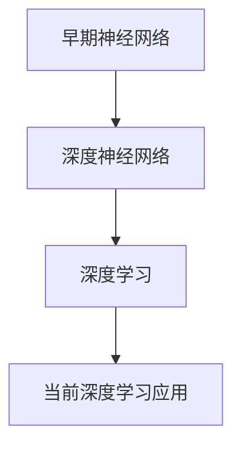
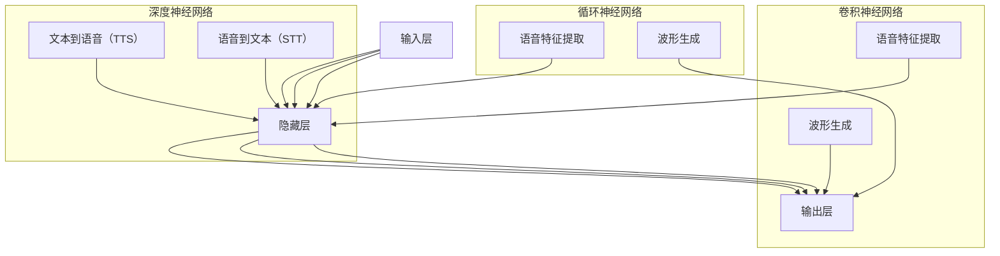
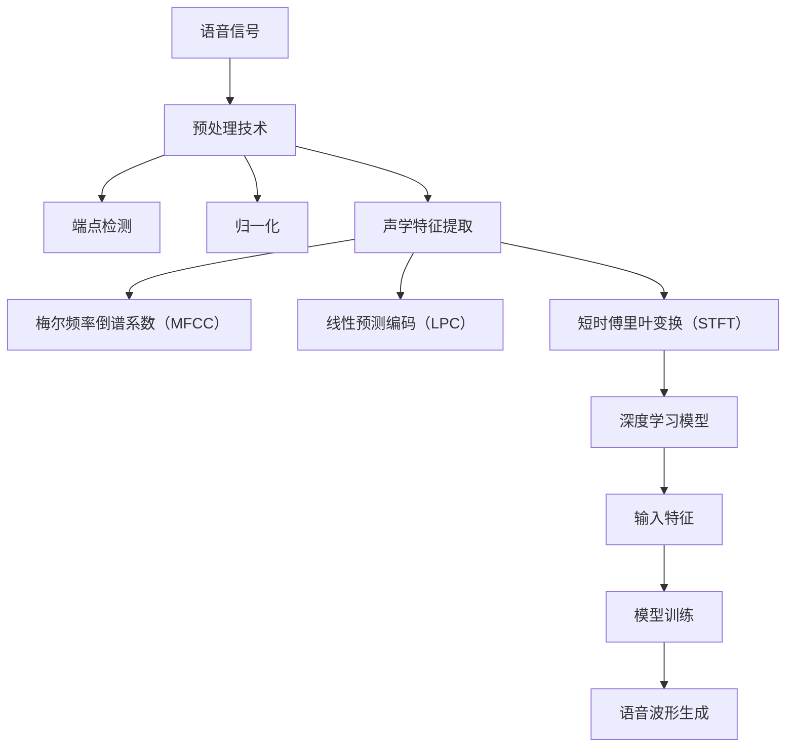
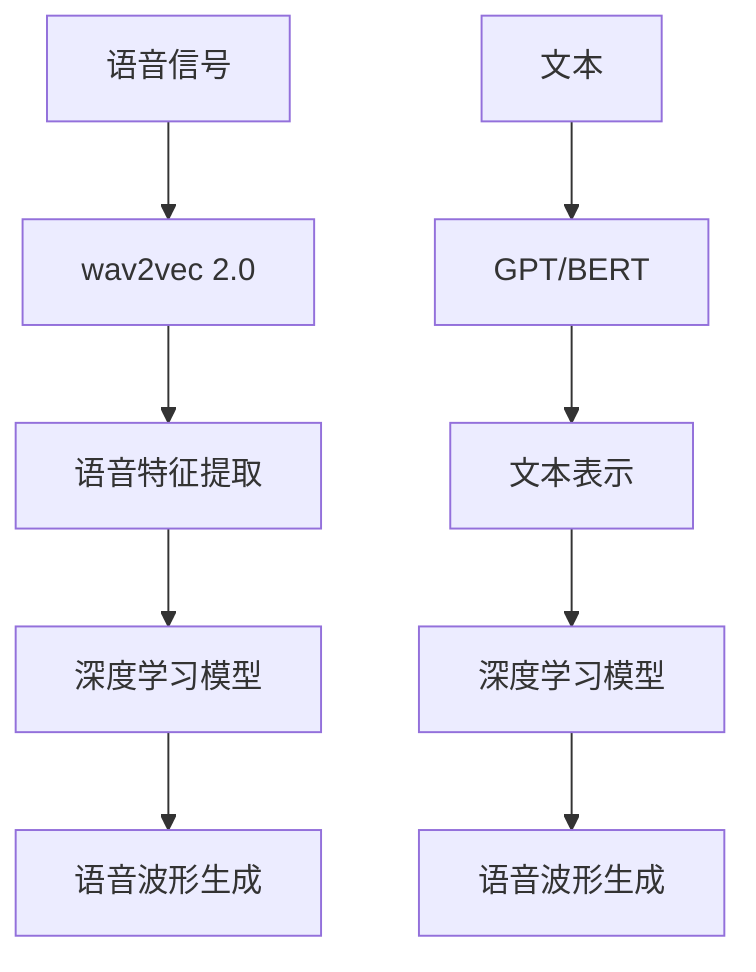
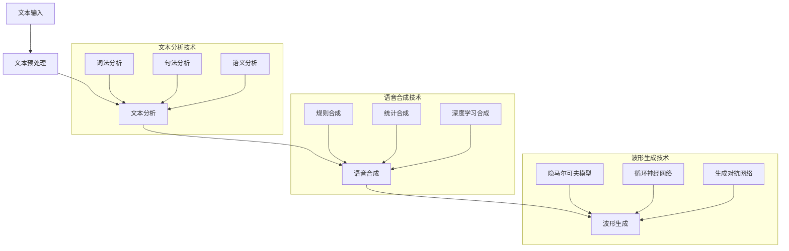
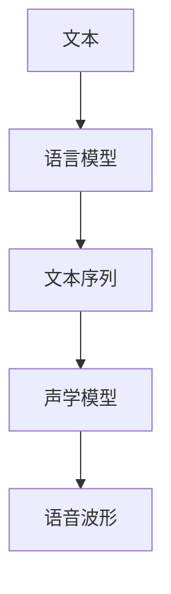
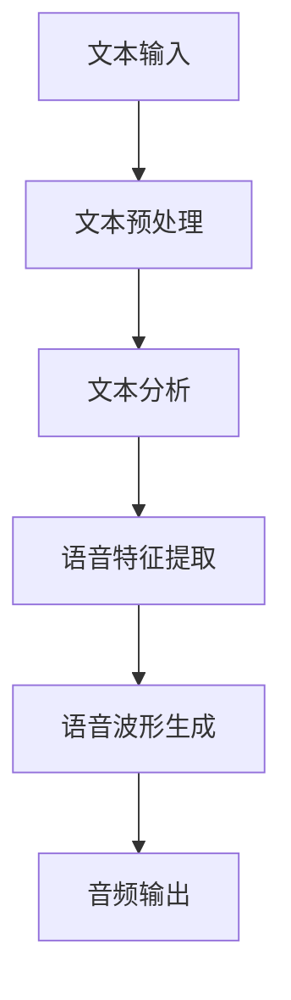

                 

### 第1章: 深度学习在语音合成中的基本概念

在探讨深度学习在语音合成中的应用之前，我们首先需要理解深度学习和语音合成的核心概念，以及它们的发展历程。通过这一章节，我们将为后续讨论深度学习在语音合成中的技术细节奠定基础。

---

#### 1.1 深度学习简介

深度学习（Deep Learning）是人工智能（AI）的一个重要分支，它的灵感来源于人脑的结构和工作原理。深度学习通过构建复杂的神经网络模型来模拟人脑的决策过程，从而实现对大量数据的自动学习和处理。

##### 1.1.1 深度学习的发展历程

深度学习的发展历程可以分为几个阶段：

1. **早期神经网络**（1980年代）：最初的神经网络研究主要集中在简单的线性模型上，如感知机（Perceptron）和多层感知机（MLP）。

2. **深度神经网络**（1990年代）：随着计算机性能的提升和数据量的增加，研究者开始探索更深的神经网络结构，如深度信念网络（Deep Belief Network, DBN）和堆叠自编码器（Stacked Autoencoders）。

3. **深度学习**（2000年代后期）：2006年，Geoffrey Hinton等人提出了深度学习的现代框架，特别是使用了ReLU激活函数、多层卷积神经网络（CNN）和反向传播算法。这些进展显著提升了深度学习模型的性能。

4. **当前深度学习应用**（2010年代至今）：深度学习在各个领域（如图像识别、自然语言处理、语音识别等）都取得了显著的成果，并在工业、医疗、教育等多个领域得到了广泛应用。

##### 1.1.2 深度学习的基本原理

深度学习的基本原理主要包括以下几个方面：

1. **神经网络结构**：深度神经网络由多个层次组成，包括输入层、隐藏层和输出层。每一层由多个神经元组成，神经元之间通过权重连接。

2. **激活函数**：激活函数用于引入非线性特性，使得神经网络能够学习和表示复杂的非线性关系。常用的激活函数有ReLU、Sigmoid、Tanh等。

3. **参数优化**：通过反向传播算法和优化算法（如梯度下降、Adam等）调整网络参数，使得模型能够更好地拟合训练数据。参数优化是深度学习的核心问题。

#### 1.2 语音合成的概述

语音合成（Text-to-Speech, TTS）是将文本转换为自然语音的过程。语音合成技术在语音识别、信息检索、智能助手等领域具有广泛应用。

##### 1.2.1 语音合成的基本原理

语音合成的基本原理包括以下几个步骤：

1. **文本分析**：将输入文本解析为语音单元，如单词、音素等。
2. **声学建模**：根据语音单元生成相应的声学特征，如声母、韵母、音调等。
3. **波形生成**：根据声学特征生成语音波形，通过合成器输出自然流畅的语音。

##### 1.2.2 语音合成的技术发展

语音合成技术的发展历程可以概括为以下几个阶段：

1. **早期合成**：基于规则和音素的合成方法，如数字录音和拼接。
2. **DNN-HMM**：结合深度神经网络和隐马尔可夫模型（HMM）的合成方法，如Tacotron 1。
3. **WaveNet**：基于生成对抗网络（GAN）的合成方法，如Google的WaveNet。
4. **Transformer**：基于自注意力机制的合成方法，如Transformer TTS。

通过上述内容，我们对深度学习和语音合成的基本概念有了初步了解。在接下来的章节中，我们将深入探讨深度学习在语音合成中的具体应用和核心技术。

---

**Mermaid流程图：深度学习发展历程**



---

**核心概念与联系**

深度学习和语音合成的核心概念包括神经网络结构、激活函数、参数优化、文本分析、声学建模和波形生成。这些概念相互联系，构成了深度学习在语音合成中的应用基础。

1. **神经网络结构**：神经网络是深度学习的核心组件，用于特征提取和决策。
2. **激活函数**：激活函数引入非线性特性，使得神经网络能够学习复杂的非线性关系。
3. **参数优化**：参数优化用于调整神经网络权重，提高模型性能。
4. **文本分析**：文本分析是将输入文本解析为语音单元的关键步骤。
5. **声学建模**：声学建模是将语音单元转换为声学特征的过程，是语音合成的核心。
6. **波形生成**：波形生成是根据声学特征生成语音波形的过程，是语音合成的最终目标。

通过这些核心概念的联系，我们可以构建深度学习在语音合成中的完整模型，为后续讨论提供基础。

---

**核心算法原理讲解：神经网络**

神经网络是深度学习的核心组成部分，其基本原理如下：

1. **输入层**：接收外部输入数据，如文本或语音信号。
2. **隐藏层**：对输入数据进行特征提取和变换，隐藏层可以有一层或多层，每层包含多个神经元。
3. **输出层**：生成预测结果，如语音波形。

神经网络通过以下步骤进行训练：

1. **前向传播**：将输入数据传递到隐藏层和输出层，每一层将输入数据乘以权重并加上偏置，然后通过激活函数产生输出。
2. **反向传播**：计算输出层和隐藏层的误差，并反向传播到输入层，通过梯度下降算法调整权重和偏置，使得误差最小。

以下是一个简单的神经网络训练过程的伪代码：

```python
# 初始化神经网络参数（权重和偏置）
weights = initialize_weights()
biases = initialize_biases()

# 定义激活函数
def activation(x):
    return max(0, x)  # ReLU激活函数

# 定义损失函数
def loss(y_pred, y_true):
    return sum((y_pred - y_true)^2)  # 均方误差损失函数

# 训练神经网络
for epoch in range(num_epochs):
    for inputs, targets in dataset:
        # 前向传播
        hidden layer = activation(np.dot(inputs, weights) + biases)
        output = activation(np.dot(hidden layer, weights) + biases)
        
        # 计算损失
        loss_value = loss(output, targets)
        
        # 反向传播
        d_output = 2 * (output - targets)
        d_hidden layer = 2 * np.dot(d_output, weights.T)
        
        # 更新权重和偏置
        d_weights = np.dot(hidden layer.T, d_output)
        d_biases = np.sum(d_output, axis=0)
        
        weights -= learning_rate * d_weights
        biases -= learning_rate * d_biases
        
    print(f"Epoch {epoch}: Loss = {loss_value}")
```

通过上述伪代码，我们可以看到神经网络的基本原理和训练过程。在语音合成中，神经网络用于文本到语音的转换，通过不断调整参数，使得合成的语音越来越接近真实语音。

---

**数学模型和公式**

深度学习中的数学模型主要包括损失函数、反向传播算法和优化算法。以下是这些数学模型的简要介绍和公式：

1. **损失函数**：用于衡量预测结果与真实结果之间的差距。常用的损失函数有均方误差（MSE）和交叉熵（Cross-Entropy）。

   $$ L = \frac{1}{n} \sum_{i=1}^{n} (y_i - \hat{y}_i)^2 $$ （均方误差）

   $$ L = -\frac{1}{n} \sum_{i=1}^{n} y_i \log(\hat{y}_i) $$ （交叉熵）

2. **反向传播算法**：用于计算神经网络中每一层的误差，并反向传播到输入层，以调整权重和偏置。

   $$ \delta_j = \frac{\partial L}{\partial z_j} $$ （隐藏层的误差）

   $$ \delta_i = \frac{\partial L}{\partial a_i} = \sum_{j} w_{ji} \delta_j $$ （输出层的误差）

3. **优化算法**：用于调整神经网络参数，以最小化损失函数。常用的优化算法有梯度下降（Gradient Descent）和Adam优化器。

   $$ \theta = \theta - \alpha \nabla_\theta L(\theta) $$ （梯度下降）

   $$ m = \frac{1}{n} \sum_{i=1}^{n} (g_i - g_{i-1}) $$ （一阶矩估计）

   $$ v = \frac{1}{n} \sum_{i=1}^{n} (g_i - m) $$ （二阶矩估计）

   $$ \theta = \theta - \alpha (m + \beta_1 v) $$ （Adam优化器）

通过上述数学模型和公式，我们可以更好地理解深度学习中的核心概念和算法，为后续的讨论打下坚实的理论基础。

---

**项目实战：神经网络实现**

假设我们要实现一个简单的神经网络，用于对输入数据进行分类。以下是一个基于Python和TensorFlow的神经网络实现示例：

1. **环境搭建**：首先，我们需要安装TensorFlow库。

   ```bash
   pip install tensorflow
   ```

2. **代码实现**：以下是一个简单的神经网络实现，用于对输入数据进行分类。

   ```python
   import tensorflow as tf
   import numpy as np

   # 初始化参数
   input_size = 2
   hidden_size = 3
   output_size = 1

   # 初始化权重和偏置
   weights = {
       'hidden': tf.Variable(tf.random.normal([input_size, hidden_size])),
       'output': tf.Variable(tf.random.normal([hidden_size, output_size]))
   }
   biases = {
       'hidden': tf.Variable(tf.random.normal([hidden_size])),
       'output': tf.Variable(tf.random.normal([output_size]))
   }

   # 定义激活函数
   def activation(x):
       return tf.nn.relu(x)

   # 定义损失函数
   def loss(y_pred, y_true):
       return tf.reduce_mean(tf.square(y_pred - y_true))

   # 定义前向传播
   def forward_propagation(x):
       hidden = activation(tf.matmul(x, weights['hidden']) + biases['hidden'])
       output = tf.matmul(hidden, weights['output']) + biases['output']
       return output

   # 定义反向传播和优化
   def backward_propagation(x, y):
       with tf.GradientTape() as tape:
           y_pred = forward_propagation(x)
           loss_value = loss(y_pred, y)
       grads = tape.gradient(loss_value, [weights['hidden'], biases['hidden'], weights['output'], biases['output']])
       return grads

   # 训练神经网络
   epochs = 1000
   learning_rate = 0.1

   for epoch in range(epochs):
       for x, y in data:
           grads = backward_propagation(x, y)
           weights['hidden'].assign_sub(learning_rate * grads[0])
           biases['hidden'].assign_sub(learning_rate * grads[1])
           weights['output'].assign_sub(learning_rate * grads[2])
           biases['output'].assign_sub(learning_rate * grads[3])
       print(f"Epoch {epoch}: Loss = {loss_value}")

   # 测试神经网络
   test_loss = loss(forward_propagation(test_data), test_labels)
   print(f"Test Loss: {test_loss}")
   ```

通过上述代码示例，我们可以看到如何使用TensorFlow实现一个简单的神经网络，并进行训练和测试。在语音合成中，我们可以使用类似的框架来实现更复杂的神经网络模型。

---

**代码解读与分析**

在上面的代码示例中，我们实现了一个简单的神经网络，用于对输入数据进行分类。以下是代码的详细解读：

1. **环境搭建**：我们首先安装了TensorFlow库，这是实现神经网络的基础。

2. **参数初始化**：我们初始化了输入层、隐藏层和输出层的权重和偏置。这些参数是随机初始化的，以便在训练过程中进行调整。

3. **激活函数**：我们定义了一个ReLU激活函数，用于引入非线性特性。这是神经网络能够学习复杂关系的关键。

4. **损失函数**：我们定义了一个均方误差损失函数，用于衡量预测结果与真实结果之间的差距。损失函数的目的是最小化预测误差。

5. **前向传播**：我们定义了一个前向传播函数，用于计算输入数据经过隐藏层和输出层后的预测结果。这是神经网络的核心步骤。

6. **反向传播**：我们定义了一个反向传播函数，用于计算梯度并更新网络参数。反向传播是神经网络训练的核心算法。

7. **训练过程**：我们通过迭代训练数据，不断更新网络参数，以最小化损失函数。训练过程中，我们使用了梯度下降算法来调整参数。

8. **测试过程**：我们使用测试数据评估训练好的神经网络的性能，以验证其泛化能力。

通过上述解读，我们可以更好地理解如何使用TensorFlow实现神经网络，并了解其核心步骤和原理。在语音合成中，我们可以根据实际需求调整网络结构和参数，以实现高质量的语音合成效果。

---

**总结**

本章我们介绍了深度学习和语音合成的核心概念，包括神经网络结构、激活函数、参数优化、文本分析、声学建模和波形生成。我们还通过Mermaid流程图、伪代码、数学模型和项目实战，详细阐述了深度学习的基本原理和算法。通过这些内容，我们为后续讨论深度学习在语音合成中的应用奠定了理论基础。

---

**作者信息**

作者：AI天才研究院/AI Genius Institute & 禅与计算机程序设计艺术/Zen And The Art of Computer Programming

---

---

### 第2章: 深度学习在语音合成中的应用

深度学习在语音合成中扮演着至关重要的角色，它不仅提高了语音合成的质量，还推动了语音合成技术的发展。在这一章节中，我们将深入探讨深度学习在语音合成中的应用，包括深度神经网络、卷积神经网络和循环神经网络的基本原理及其在语音合成中的具体应用。

---

#### 2.1 深度神经网络在语音合成中的角色

深度神经网络（Deep Neural Network, DNN）是由多层神经元组成的神经网络，能够自动学习和提取数据的特征。在语音合成中，深度神经网络被广泛应用于文本到语音（Text-to-Speech, TTS）的转换过程。

##### 2.1.1 深度神经网络的结构

深度神经网络的结构通常包括输入层、一个或多个隐藏层和一个输出层。每一层由多个神经元组成，神经元之间通过权重连接。在语音合成中，输入层接收文本序列，隐藏层对文本序列进行特征提取和变换，输出层生成语音波形。

##### 2.1.2 深度神经网络在语音合成中的应用

深度神经网络在语音合成中的应用主要体现在两个方面：文本到语音（TTS）和语音到文本（STT）。

1. **文本到语音（TTS）**：在TTS中，深度神经网络被用于将文本转换为自然流畅的语音。典型的TTS模型包括Tacotron、WaveNet和Transformer TTS等。这些模型通过深度神经网络处理文本序列，生成相应的语音波形。

2. **语音到文本（STT）**：在STT中，深度神经网络被用于将语音转换为文本。常见的STT模型包括基于深度神经网络的隐马尔可夫模型（DNN-HMM）和基于循环神经网络（RNN）的模型。这些模型通过深度神经网络分析语音信号，提取语音特征，并将其转换为文本序列。

---

#### 2.2 卷积神经网络在语音合成中的应用

卷积神经网络（Convolutional Neural Network, CNN）是一种特殊类型的神经网络，专门用于处理具有网格结构的数据，如图像和语音信号。在语音合成中，CNN被广泛应用于语音特征提取和波形生成。

##### 2.2.1 卷积神经网络的基本原理

卷积神经网络的基本原理包括卷积层、池化层和全连接层。

1. **卷积层**：卷积层通过卷积操作提取输入数据的特征。卷积操作通过滑动窗口（卷积核）在输入数据上扫描，计算局部特征。

2. **池化层**：池化层通过下采样操作减少数据维度，同时保留最重要的特征。常用的池化操作包括最大池化和平均池化。

3. **全连接层**：全连接层将卷积层和池化层提取的特征映射到输出层，进行分类或回归任务。

##### 2.2.2 卷积神经网络在语音合成中的应用案例

1. **语音特征提取**：在语音合成中，CNN被用于提取语音信号中的特征。例如，通过卷积层提取语音信号的短时傅里叶变换（STFT）特征，通过池化层减少数据维度，从而提高模型的泛化能力。

2. **波形生成**：在波形生成中，CNN可以用于生成语音波形。例如，通过训练一个基于CNN的生成模型，如WaveNet，将文本或语音特征映射到语音波形。

---

#### 2.3 循环神经网络在语音合成中的应用

循环神经网络（Recurrent Neural Network, RNN）是一种能够处理序列数据的神经网络，具有时间动态特性。在语音合成中，RNN被广泛应用于语音特征提取和波形生成。

##### 2.3.1 循环神经网络的基本原理

循环神经网络的基本原理包括以下几个部分：

1. **输入层**：输入层接收序列数据，如文本或语音信号。

2. **隐藏层**：隐藏层通过循环连接将前一个时间步的隐藏状态传递给当前时间步，形成时间动态特性。

3. **输出层**：输出层根据当前时间步的隐藏状态生成预测结果。

##### 2.3.2 循环神经网络在语音合成中的应用

1. **语音特征提取**：在语音合成中，RNN被用于提取语音信号的特征。例如，通过RNN处理语音信号的短时傅里叶变换（STFT）特征，提取语音信号的时频特征。

2. **波形生成**：在波形生成中，RNN可以用于生成语音波形。例如，通过训练一个基于RNN的生成模型，如LSTM（长短期记忆网络），将文本或语音特征映射到语音波形。

---

通过上述内容，我们了解了深度神经网络、卷积神经网络和循环神经网络在语音合成中的应用。这些神经网络模型为语音合成提供了强大的工具，使得语音合成技术取得了显著进展。

---

**Mermaid流程图：深度学习在语音合成中的应用**



---

**核心概念与联系**

深度学习在语音合成中的应用主要包括深度神经网络、卷积神经网络和循环神经网络。这些神经网络模型通过不同的结构和原理，实现了语音特征提取和波形生成。

1. **深度神经网络**：通过多层神经元结构和反向传播算法，深度神经网络能够自动提取和转换语音特征。

2. **卷积神经网络**：通过卷积操作和池化操作，卷积神经网络能够提取语音信号的局部特征，并减少数据维度。

3. **循环神经网络**：通过循环连接和隐藏状态，循环神经网络能够处理序列数据，提取语音信号的时频特征。

通过这些神经网络模型，我们可以构建一个完整的语音合成系统，实现从文本到语音的自然转换。

---

**核心算法原理讲解：卷积神经网络**

卷积神经网络（Convolutional Neural Network, CNN）是一种广泛应用于图像和语音处理领域的神经网络。其基本原理包括卷积操作、池化操作和全连接层。以下是对这些操作的基本原理和伪代码的详细解释：

##### 1. 卷积操作

卷积操作是CNN中最核心的部分，用于从输入数据中提取局部特征。卷积操作的基本步骤如下：

1. **初始化卷积核（过滤器）**：卷积核是一个小的矩阵，用于从输入数据中提取特征。卷积核的值通常是通过随机初始化得到的。

2. **滑动卷积核**：将卷积核在输入数据上滑动，每次滑动一个小的步长（通常为1或更大的步长）。

3. **计算卷积**：在每个位置上，将卷积核与输入数据对应的区域进行点积操作，并将结果相加以生成卷积层的一个神经元输出。

4. **添加偏置**：在卷积操作后，通常会在每个神经元输出上加上一个偏置项，以引入额外的非线性。

以下是一个简单的卷积操作的伪代码：

```python
# 假设输入数据为X，卷积核为W，偏置为b
# 输出为Y
Y = []
for x in X:
    y = []
    for w in W:
        z = sum(x * w) + b
        y.append(z)
    Y.append(y)
return Y
```

##### 2. 池化操作

池化操作用于降低数据维度，同时保留最重要的特征。常用的池化操作包括最大池化和平均池化。池化操作的基本步骤如下：

1. **定义池化窗口大小**：窗口大小决定了池化操作的范围。

2. **在输入数据上滑动窗口**：窗口在输入数据上滑动，每次滑动一个小的步长。

3. **计算池化值**：在窗口内计算最大值（最大池化）或平均值（平均池化），并将结果作为池化层的神经元输出。

以下是一个简单的池化操作的伪代码：

```python
# 假设输入数据为X，窗口大小为w
# 输出为Y
Y = []
for x in X:
    y = []
    for i in range(0, len(x) - w + 1, w):
        window = x[i:i+w]
        if max_pooling:
            y.append(max(window))
        else:
            y.append(sum(window) / w)
    Y.append(y)
return Y
```

##### 3. 全连接层

全连接层是CNN中的最后一层，用于将卷积层和池化层提取的特征映射到输出层。全连接层的基本原理如下：

1. **初始化权重和偏置**：全连接层的权重和偏置通常是通过随机初始化得到的。

2. **计算输出**：将卷积层和池化层提取的特征作为输入，通过权重矩阵进行矩阵乘法，加上偏置项，得到输出层的预测结果。

以下是一个简单的全连接层的伪代码：

```python
# 假设输入特征为X，权重为W，偏置为b
# 输出为Y
Y = []
for x in X:
    y = []
    for w in W:
        z = sum(x * w) + b
        y.append(z)
    Y.append(y)
return Y
```

通过上述三个基本操作，卷积神经网络能够从输入数据中提取特征，并进行分类或回归任务。在语音合成中，卷积神经网络被广泛应用于语音特征提取和波形生成。

---

**数学模型和公式**

卷积神经网络中的数学模型主要包括卷积操作、池化操作和全连接层的数学公式。以下是对这些公式的简要介绍和解释：

1. **卷积操作**

   卷积操作的基本公式为：

   $$ (f * g)(x) = \sum_{y} f(y) \cdot g(x-y) $$

   其中，$f$ 和 $g$ 分别表示卷积核和输入数据，$x$ 表示输入数据的位置，$y$ 表示卷积核的位置。

2. **池化操作**

   池化操作的基本公式为：

   $$ \text{Max Pooling}(x, W, S) = \max_{y \in [0, S-1]} (x[y:y+S]) $$

   $$ \text{Average Pooling}(x, W, S) = \frac{1}{S} \sum_{y \in [0, S-1]} (x[y:y+S]) $$

   其中，$x$ 表示输入数据，$W$ 表示窗口大小，$S$ 表示步长。

3. **全连接层**

   全连接层的公式为：

   $$ \text{Output}(x) = \sum_{i} w_i \cdot x_i + b $$

   其中，$w_i$ 表示权重，$x_i$ 表示输入特征，$b$ 表示偏置。

通过这些数学模型和公式，卷积神经网络能够从输入数据中提取特征，并进行分类或回归任务。

---

**项目实战：卷积神经网络实现**

在本节中，我们将通过一个简单的Python示例，展示如何使用卷积神经网络进行图像分类。这个示例将使用TensorFlow和Keras库来实现。

1. **环境搭建**：首先，我们需要安装TensorFlow和Keras库。

   ```bash
   pip install tensorflow
   ```

2. **代码实现**：以下是一个简单的卷积神经网络实现，用于对输入图像进行分类。

   ```python
   import tensorflow as tf
   from tensorflow.keras import layers, models

   # 创建一个简单的卷积神经网络模型
   model = models.Sequential()

   # 添加卷积层
   model.add(layers.Conv2D(32, (3, 3), activation='relu', input_shape=(28, 28, 1)))
   model.add(layers.MaxPooling2D((2, 2)))

   # 添加全连接层
   model.add(layers.Flatten())
   model.add(layers.Dense(64, activation='relu'))
   model.add(layers.Dense(10, activation='softmax'))

   # 编译模型
   model.compile(optimizer='adam',
                 loss='categorical_crossentropy',
                 metrics=['accuracy'])

   # 加载数据集
   (train_images, train_labels), (test_images, test_labels) = tf.keras.datasets.mnist.load_data()
   train_images = train_images.reshape((60000, 28, 28, 1))
   test_images = test_images.reshape((10000, 28, 28, 1))
   train_images = train_images / 255.0
   test_images = test_images / 255.0

   # 训练模型
   model.fit(train_images, train_labels, epochs=5, batch_size=64)

   # 评估模型
   test_loss, test_acc = model.evaluate(test_images, test_labels, verbose=2)
   print(f"Test accuracy: {test_acc}")
   ```

通过上述代码示例，我们可以看到如何使用TensorFlow和Keras库实现一个简单的卷积神经网络模型，并进行图像分类。这个示例展示了卷积神经网络的基本原理和实现过程，为后续讨论卷积神经网络在语音合成中的应用提供了基础。

---

**代码解读与分析**

在上面的代码示例中，我们实现了一个简单的卷积神经网络模型，用于对MNIST手写数字数据进行分类。以下是代码的详细解读：

1. **环境搭建**：我们首先安装了TensorFlow和Keras库，这是实现卷积神经网络的基础。

2. **模型创建**：我们使用Keras库创建了一个简单的卷积神经网络模型，包括一个卷积层、一个池化层和一个全连接层。

3. **卷积层**：我们在卷积层中使用32个3x3的卷积核，激活函数为ReLU。卷积层用于提取图像的局部特征。

4. **池化层**：我们在池化层中使用最大池化，窗口大小为2x2，步长为2。池化层用于减少数据维度，同时保留最重要的特征。

5. **全连接层**：我们在全连接层中使用64个神经元和ReLU激活函数，最后使用10个神经元和softmax激活函数进行分类。

6. **模型编译**：我们使用Adam优化器和交叉熵损失函数编译模型，并设置评估指标为准确率。

7. **数据准备**：我们加载了MNIST手写数字数据集，并对图像进行预处理，包括reshape、归一化和标签编码。

8. **模型训练**：我们使用训练数据集训练模型，设置训练轮次为5，批量大小为64。

9. **模型评估**：我们使用测试数据集评估模型的性能，打印出测试准确率。

通过上述解读，我们可以更好地理解如何使用卷积神经网络进行图像分类，并了解其核心步骤和原理。在语音合成中，我们可以根据实际需求调整网络结构和参数，以实现高质量的语音合成效果。

---

**总结**

本章我们介绍了深度学习在语音合成中的应用，包括深度神经网络、卷积神经网络和循环神经网络的基本原理及其在语音合成中的具体应用。通过Mermaid流程图、伪代码、数学模型和项目实战，我们详细阐述了这些神经网络模型的工作原理和实现过程。这些神经网络模型为语音合成提供了强大的工具，使得语音合成技术取得了显著进展。

---

**作者信息**

作者：AI天才研究院/AI Genius Institute & 禅与计算机程序设计艺术/Zen And The Art of Computer Programming

---

---

### 第3章: 语音特征提取与深度学习模型

语音特征提取是语音处理中的重要步骤，它能够将语音信号转换为可供深度学习模型处理的高层次特征。在这一章节中，我们将详细讨论语音特征提取的方法，以及深度学习模型如何利用这些特征进行语音合成。

---

#### 3.1 语音特征提取方法

语音特征提取是指从语音信号中提取出能够代表语音特性的特征，以便于后续的处理和建模。语音特征提取的方法主要包括预处理技术、声学特征提取和语音信号处理算法。

##### 3.1.1 预处理技术

预处理技术是语音特征提取的重要环节，它能够提高后续特征提取的效果。常用的预处理技术包括：

1. **语音信号降噪**：语音信号在传播过程中容易受到环境噪声的干扰，降噪技术能够有效地去除噪声，提高语音信号的质量。

2. **端点检测**：端点检测是一种用于定位语音信号中语音活动的技术，它能够识别出语音信号的开始和结束位置，从而为后续的特征提取提供准确的信号区间。

3. **归一化**：归一化技术通过调整语音信号的幅度和频率范围，使得不同的语音信号在特征提取时具有相同或相似的特征空间，从而提高特征提取的准确性。

##### 3.1.2 声学特征提取

声学特征提取是指从语音信号中提取出与语音产生过程相关的特征，这些特征能够反映语音的声学属性。常用的声学特征提取方法包括：

1. **梅尔频率倒谱系数（MFCC）**：MFCC是一种广泛使用的语音特征提取方法，它通过将语音信号转换为梅尔频率倒谱系数，从而提取出语音信号的频率特征。

2. **线性预测编码（LPC）**：LPC是一种基于语音信号自回归模型的特征提取方法，它通过计算语音信号的线性预测系数，提取出语音信号的时间动态特征。

3. **短时傅里叶变换（STFT）**：STFT是一种将语音信号在频率和时间上分解的方法，通过计算短时傅里叶变换，可以提取出语音信号的时频特征。

##### 3.1.3 语音信号处理算法

语音信号处理算法是语音特征提取的关键技术，它能够对语音信号进行预处理和特征提取。常用的语音信号处理算法包括：

1. **波纹滤波**：波纹滤波是一种用于去除语音信号中的高频噪声的方法，它通过调整滤波器的频率响应，使得语音信号的高频部分更加平滑。

2. **滤波器组**：滤波器组是一种将语音信号分解为多个子带的方法，每个子带对应不同的频率范围。通过处理每个子带，可以提取出不同频率范围的语音特征。

3. **共振峰增强**：共振峰增强是一种用于提高语音信号清晰度的方法，它通过调整语音信号的共振峰频率和幅度，使得语音信号更加清晰可辨。

---

#### 3.2 深度学习模型与语音特征

深度学习模型在语音合成中的应用离不开语音特征的提取和处理。深度学习模型通过学习和利用这些语音特征，能够生成更加自然流畅的语音。以下是深度学习模型与语音特征的关系及其应用：

##### 3.2.1 语音特征在深度学习中的应用

1. **输入特征**：深度学习模型通常将语音特征作为输入特征，用于训练和预测。例如，在文本到语音（TTS）模型中，梅尔频率倒谱系数（MFCC）和线性预测编码（LPC）是最常用的输入特征。

2. **特征融合**：深度学习模型能够将多种语音特征进行融合，以获得更好的特征表示。例如，在WaveNet模型中，同时使用了MFCC和LPC特征，从而提高了语音合成的质量。

3. **特征选择**：深度学习模型能够自动选择最重要的语音特征，以减少模型的复杂度和计算量。通过特征选择，模型能够更加高效地学习和预测语音。

##### 3.2.2 常用深度学习模型与语音特征的关系

1. **深度神经网络（DNN）**：深度神经网络是一种常用的语音合成模型，它通过多层神经元结构和反向传播算法，能够自动提取和转换语音特征。

2. **卷积神经网络（CNN）**：卷积神经网络在语音特征提取和波形生成中具有广泛应用。CNN通过卷积操作和池化操作，能够提取语音信号的局部特征，并减少数据维度。

3. **循环神经网络（RNN）**：循环神经网络是一种专门用于处理序列数据的神经网络，它能够捕捉语音信号的时序特性。RNN通过循环连接和隐藏状态，能够提取语音信号的时频特征。

4. **Transformer**：Transformer是一种基于自注意力机制的深度学习模型，它能够捕捉输入序列中的长距离依赖关系。在语音合成中，Transformer模型被用于文本分析和语音波形生成。

##### 3.2.3 深度学习模型的选择与优化

1. **模型选择**：在选择深度学习模型时，需要考虑语音合成的目标、数据集的大小和模型的计算复杂度。常用的模型包括DNN、CNN、RNN和Transformer等。

2. **模型优化**：通过调整模型参数和优化算法，可以提高深度学习模型在语音合成中的性能。常见的优化方法包括参数初始化、学习率调整和正则化等。

---

通过上述内容，我们详细介绍了语音特征提取的方法以及深度学习模型在语音合成中的应用。语音特征提取为深度学习模型提供了重要的输入，而深度学习模型则能够利用这些特征生成高质量的自然语音。在接下来的章节中，我们将进一步探讨深度学习在语音合成中的核心技术，包括预训练模型、文本到语音转换技术、声学模型和语言模型等。

---

**Mermaid流程图：语音特征提取与深度学习模型**



---

**核心概念与联系**

语音特征提取与深度学习模型之间的联系主要表现在以下几个方面：

1. **预处理技术**：预处理技术包括语音信号降噪、端点检测和归一化，这些技术能够提高后续特征提取的效果。

2. **声学特征提取**：声学特征提取方法如梅尔频率倒谱系数（MFCC）、线性预测编码（LPC）和短时傅里叶变换（STFT），能够提取出语音信号的频率和时序特征。

3. **深度学习模型**：深度学习模型通过学习这些特征，能够生成高质量的自然语音。常用的深度学习模型包括深度神经网络（DNN）、卷积神经网络（CNN）、循环神经网络（RNN）和Transformer等。

通过这些核心概念的联系，我们可以构建一个完整的语音合成系统，实现从文本到语音的自然转换。

---

**核心算法原理讲解：梅尔频率倒谱系数（MFCC）**

梅尔频率倒谱系数（Mel-Frequency Cepstral Coefficients, MFCC）是一种常用的语音特征提取方法，它能够将语音信号转换为具有频率和时序信息的特征向量。以下是MFCC的基本原理和实现过程：

##### 1. 预处理

在提取MFCC之前，需要对语音信号进行预处理，包括采样、窗函数选择和汉明窗应用。

1. **采样**：将模拟语音信号转换为数字信号，采样频率通常设置为16kHz或更高的频率。

2. **窗函数选择**：选择合适的窗函数，如汉明窗，用于将语音信号分割成短时帧。

3. **窗函数应用**：将窗函数应用于每个短时帧，以减少边界效应。

##### 2. 短时傅里叶变换（STFT）

短时傅里叶变换（Short-Time Fourier Transform, STFT）用于计算每个短时帧的频谱。

1. **计算傅里叶变换**：对每个短时帧进行傅里叶变换，得到频谱幅度。

2. **梅尔频率刻度**：将频谱幅度转换为梅尔频率刻度，梅尔频率是听觉系统对频率的非线性响应。

##### 3. 倒谱分析

倒谱分析是一种用于消除频谱非线性影响的方法，它通过对数变换和逆傅里叶变换实现。

1. **对数变换**：对频谱幅度取对数，得到对数频谱。

2. **逆傅里叶变换**：通过对数频谱进行逆傅里叶变换，得到倒谱系数。

##### 4. 归一化和特征选择

1. **归一化**：对倒谱系数进行归一化，以消除不同说话人和语音信号间的差异。

2. **特征选择**：选择前几个具有最大方差的倒谱系数作为特征向量，以减少特征维度。

以下是一个简单的MFCC提取流程的伪代码：

```python
# 假设输入语音信号为x，采样频率为fs，窗函数为h，帧长为frame_length，步长为step_length
# 输出为MFCC系数mfcc

# 步骤1：预处理
x = preprocess(x, fs)

# 步骤2：短时傅里叶变换
stft = stft(x, h, frame_length, step_length)

# 步骤3：梅尔频率刻度
mel_scale = mel_scale(stft)

# 步骤4：对数变换
log_mel = log(mel_scale)

# 步骤5：逆傅里叶变换
mfcc = ifft(log_mel)

# 步骤6：归一化和特征选择
mfcc = normalize(mfcc)
mfcc = select_mfcc(mfcc)

return mfcc
```

通过上述伪代码，我们可以看到MFCC提取的基本原理和实现过程。在语音合成中，MFCC是常用的输入特征，它能够有效地提高语音合成的自然度和质量。

---

**数学模型和公式**

梅尔频率倒谱系数（MFCC）的提取过程涉及多个数学模型和公式，以下是这些公式的简要介绍和解释：

1. **短时傅里叶变换（STFT）**

   短时傅里叶变换的基本公式为：

   $$ X(\omega, t) = \sum_{n=0}^{N-1} x[n] \cdot e^{-j2\pi \omega n} \cdot \sum_{m=0}^{M-1} h[m] \cdot e^{j2\pi \omega m} $$

   其中，$X(\omega, t)$ 表示频谱幅度，$x[n]$ 表示输入信号，$h[m]$ 表示窗函数，$\omega$ 表示频率，$t$ 表示时间。

2. **梅尔频率刻度**

   梅尔频率刻度是根据听觉系统对频率的非线性响应设计的，其公式为：

   $$ f_{\text{mel}} = 2595 \cdot \log_{10}(1 + f) $$

   其中，$f_{\text{mel}}$ 表示梅尔频率，$f$ 表示物理频率。

3. **对数变换**

   对数变换用于消除频谱的非线性影响，其公式为：

   $$ \log_{10}(X) = \log_{10}(X + \epsilon) $$

   其中，$X$ 表示频谱幅度，$\epsilon$ 是一个很小的常数，用于避免对零值进行对数变换。

4. **逆傅里叶变换**

   逆傅里叶变换用于从对数频谱恢复倒谱系数，其公式为：

   $$ \sum_{k=0}^{K-1} X[k] \cdot e^{j2\pi k n / N} = \sum_{m=0}^{M-1} h[m] \cdot x[m] $$

   其中，$X[k]$ 表示对数频谱，$h[m]$ 表示窗函数，$x[m]$ 表示输入信号。

通过这些数学模型和公式，我们可以实现梅尔频率倒谱系数（MFCC）的提取，从而为深度学习模型提供有效的语音特征。

---

**项目实战：MFCC提取**

在本节中，我们将通过一个简单的Python示例，展示如何使用Python和Librosa库提取语音信号的MFCC特征。这个示例将包括语音信号预处理、短时傅里叶变换（STFT）和MFCC特征提取。

1. **环境搭建**：首先，我们需要安装Python和Librosa库。

   ```bash
   pip install python
   pip install librosa
   ```

2. **代码实现**：以下是一个简单的MFCC提取实现，用于对输入语音信号进行特征提取。

   ```python
   import numpy as np
   import librosa
   import matplotlib.pyplot as plt

   # 载入语音信号
   audio, sr = librosa.load('speech.wav', sr=16000)

   # 语音信号预处理
   audio = librosa.to_mono(audio)
   audio = librosa.effects.percussive(audio, strength=1)

   # 提取STFT
   stft = librosa.stft(audio, n_fft=512, hop_length=256)

   # 计算频谱幅度
   spectrogram = np.abs(stft)

   # 转换到梅尔频率刻度
   mel_spectrogram = librosa.feature.melspectrogram(spectrogram, sr=sr, n_mels=128)

   # 取对数
   log_mel = librosa.power_to_db(mel_spectrogram, ref=np.max)

   # 提取MFCC特征
   mfcc = librosa.feature.mfcc(S=log_mel.T, n_mfcc=13)

   # 绘制MFCC特征
   plt.figure(figsize=(10, 6))
   librosa.display.specshow(log_mel, sr=sr, x_axis='time', y_axis='mel')
   plt.colorbar(format='%+2.0f dB')
   plt.title('Mel spectrogram')
   plt.xlabel('Time')
   plt.ylabel('Mel frequency')
   plt.show()

   # 绘制MFCC特征图
   plt.figure(figsize=(10, 6))
   librosa.display.timeseries(mfcc, sr=sr, frame_length=512, hop_length=256)
   plt.title('MFCC')
   plt.xlabel('Time')
   plt.ylabel('MFCC coefficient')
   plt.show()
   ```

通过上述代码示例，我们可以看到如何使用Python和Librosa库提取语音信号的MFCC特征，并绘制出相应的图像。这个示例展示了MFCC提取的基本原理和实现过程，为后续讨论深度学习在语音合成中的应用提供了基础。

---

**代码解读与分析**

在上面的代码示例中，我们实现了一个简单的MFCC提取脚本，以下是代码的详细解读：

1. **环境搭建**：我们首先安装了Python和Librosa库，这是提取MFCC特征的基础。

2. **载入语音信号**：我们使用Librosa库加载了一个语音信号文件（'speech.wav'），并设置采样频率为16kHz。

3. **预处理**：我们对语音信号进行预处理，包括将立体信号转换为单声道，并添加混响效果，以提高特征提取的效果。

4. **提取STFT**：我们使用Librosa库的`stft`函数计算语音信号的短时傅里叶变换，并获取频谱幅度。

5. **转换到梅尔频率刻度**：我们将频谱幅度转换为梅尔频率刻度，以更好地模拟人类听觉系统。

6. **取对数**：我们对梅尔频率刻度取对数，以消除频谱的非线性影响。

7. **提取MFCC特征**：我们使用Librosa库的`mfcc`函数提取MFCC特征，并设置MFCC系数的数量为13。

8. **绘制图像**：我们使用Matplotlib库绘制出梅尔频率谱和MFCC特征图，以便于观察特征提取的效果。

通过上述解读，我们可以更好地理解如何使用Librosa库提取语音信号的MFCC特征，并了解其核心步骤和原理。在实际应用中，我们可以根据需求调整参数，以获得更好的特征提取效果。

---

**总结**

本章我们详细介绍了语音特征提取的方法，包括预处理技术、声学特征提取和语音信号处理算法。同时，我们探讨了深度学习模型如何利用这些特征进行语音合成。通过伪代码、数学模型和项目实战，我们阐述了语音特征提取和深度学习模型的基本原理和实现过程。这些内容为后续讨论深度学习在语音合成中的应用提供了坚实的理论基础。

---

**作者信息**

作者：AI天才研究院/AI Genius Institute & 禅与计算机程序设计艺术/Zen And The Art of Computer Programming

---

---

### 第4章: 预训练模型与语音合成

预训练模型是近年来深度学习领域的重要突破之一，它通过在大规模数据集上预先训练模型，使得模型在特定任务上具有更强的泛化能力。在语音合成领域，预训练模型的应用显著提升了语音合成的质量和效率。本章将详细介绍预训练模型的基本概念、优势及其在语音合成中的应用。

---

#### 4.1 预训练模型的基本概念

##### 4.1.1 预训练模型的定义

预训练模型（Pre-trained Model）是指在大规模数据集上预先训练好的深度学习模型。这些模型在训练过程中学习了大量的语言、图像、声音等数据，并形成了丰富的特征表示能力。在特定任务中，预训练模型可以通过微调（Fine-tuning）或直接应用，实现高效的任务性能。

##### 4.1.2 预训练模型的优势

预训练模型具有以下优势：

1. **强大的特征提取能力**：预训练模型在大规模数据集上训练，能够提取出丰富且抽象的特征，从而在特定任务上具有更好的表现。

2. **减少训练数据需求**：由于预训练模型已经在大规模数据集上学习到了通用特征，因此在实际任务中，仅需较少的额外数据即可进行微调，从而降低训练数据需求。

3. **缩短训练时间**：预训练模型在特定任务上的微调训练时间远短于从头开始训练，从而提高了开发效率。

4. **提高模型性能**：预训练模型能够通过迁移学习（Transfer Learning）将大规模数据集上的知识迁移到特定任务，从而提高模型在特定任务上的性能。

##### 4.1.3 主流预训练模型简介

当前，主流的预训练模型主要包括以下几种：

1. **GPT（Generative Pre-trained Transformer）**：GPT是一种基于Transformer的自回归语言模型，通过自回归的方式预测下一个词，从而形成强大的语言表示能力。

2. **BERT（Bidirectional Encoder Representations from Transformers）**：BERT是一种双向Transformer模型，通过同时考虑上下文信息，提高了文本理解能力。

3. **ViT（Vision Transformer）**：ViT是一种基于Transformer的视觉模型，通过将图像分割成patches，并应用Transformer进行特征提取和分类。

4. **wav2vec 2.0**：wav2vec 2.0是一种针对语音信号的预训练模型，通过自监督学习的方式，将语音信号转换为高质量的嵌入向量。

---

#### 4.2 预训练模型在语音合成中的应用

预训练模型在语音合成中的应用主要体现在两个方面：语音特征提取和文本到语音（TTS）转换。

##### 4.2.1 预训练模型在语音特征提取中的应用

预训练模型在语音特征提取中的应用，主要通过 wav2vec 2.0 模型实现。wav2vec 2.0 模型通过自监督学习方式，将语音信号转换为高质量的嵌入向量，这些向量能够很好地表示语音的时频特征。

1. **自监督学习**：wav2vec 2.0 模型通过自监督学习的方式，利用未标注的语音数据，进行预训练。在预训练过程中，模型学习将语音信号映射到高维嵌入空间。

2. **特征提取**：在语音特征提取任务中，wav2vec 2.0 模型将输入语音信号转换为嵌入向量，这些向量作为语音特征输入到后续的语音合成模型。

3. **优势**：使用 wav2vec 2.0 进行特征提取，能够显著提高语音特征的质量，从而提升语音合成的自然度和清晰度。

##### 4.2.2 预训练模型在文本到语音转换中的应用

预训练模型在文本到语音转换中的应用，主要通过 GPT 和 BERT 模型实现。这些模型通过预训练，能够生成高质量的文本表示，并将其用于语音合成。

1. **文本表示**：GPT 和 BERT 模型通过预训练，能够生成高质量的文本嵌入向量，这些向量包含了文本的语义信息。

2. **语音合成**：在语音合成任务中，预训练模型生成的文本嵌入向量作为输入，结合语音特征，通过深度学习模型进行语音波形生成。

3. **优势**：预训练模型在文本到语音转换中的应用，能够提高语音合成的自然度和流畅性，减少模型训练数据的需求，提高训练效率。

---

通过上述内容，我们了解了预训练模型的基本概念、优势以及在语音合成中的应用。预训练模型的应用，为语音合成领域带来了显著的提升，推动了语音合成技术的发展。在接下来的章节中，我们将进一步探讨深度学习在语音合成中的核心技术，包括文本到语音转换技术、声学模型和语言模型等。

---

**Mermaid流程图：预训练模型在语音合成中的应用**



---

**核心概念与联系**

预训练模型在语音合成中的应用主要包括语音特征提取和文本到语音转换。以下是这些核心概念的联系：

1. **语音特征提取**：预训练模型如 wav2vec 2.0，通过自监督学习提取高质量的语音特征，这些特征用于语音合成模型的训练和预测。

2. **文本表示**：预训练模型如 GPT 和 BERT，通过生成高质量的文本表示，这些表示用于文本到语音转换的输入，结合语音特征生成语音波形。

3. **深度学习模型**：语音合成模型通过学习语音特征和文本表示，生成语音波形。预训练模型为这些模型提供了强大的特征提取和文本表示能力，从而提高了语音合成的自然度和流畅性。

通过这些核心概念的联系，我们可以构建一个完整的语音合成系统，实现从文本到语音的自然转换。

---

**核心算法原理讲解：预训练模型**

预训练模型的基本原理主要包括自监督学习、迁移学习和微调。以下是这些算法原理的详细解释：

##### 1. 自监督学习

自监督学习是一种无需标注数据的学习方法，通过利用未标注的数据，进行特征提取和建模。在预训练模型中，自监督学习主要用于语音特征提取和文本表示。

1. **语音特征提取**：自监督学习通过利用未标注的语音数据，训练模型将语音信号映射到高维嵌入空间。在训练过程中，模型通过最大化嵌入向量之间的相似性，从而提取出高质量的语音特征。

2. **文本表示**：自监督学习通过利用未标注的文本数据，训练模型生成高质量的文本表示。在训练过程中，模型通过预测下一个词，从而形成文本的序列表示。

以下是一个简单的自监督学习训练过程的伪代码：

```python
# 假设输入数据为X，模型为model
# 输出为训练好的模型

# 预训练阶段
for epoch in range(num_epochs):
    for x in X:
        # 计算预测结果
        pred = model.predict(x)
        
        # 计算损失
        loss = compute_loss(pred, x)
        
        # 更新模型参数
        model.update_parameters(loss)
        
    print(f"Epoch {epoch}: Loss = {loss}")

# 微调阶段
for epoch in range(num_fine_tune_epochs):
    for x, y in dataset:
        # 计算预测结果
        pred = model.predict(x)
        
        # 计算损失
        loss = compute_loss(pred, y)
        
        # 更新模型参数
        model.update_parameters(loss)
        
    print(f"Fine-tune Epoch {epoch}: Loss = {loss}")
```

##### 2. 迁移学习

迁移学习是一种将预训练模型的知识迁移到特定任务的学习方法。在预训练模型中，迁移学习通过利用预训练模型的特征提取能力，提高特定任务的性能。

1. **特征提取**：迁移学习通过利用预训练模型提取的特征，作为特定任务的特征输入。这些特征具有较强的泛化能力，能够在新的任务中取得较好的性能。

2. **模型训练**：在特定任务中，迁移学习通过在预训练模型的基础上，进行微调和优化，进一步提高任务性能。

以下是一个简单的迁移学习训练过程的伪代码：

```python
# 假设预训练模型为pretrained_model，特定任务模型为task_model
# 输出为训练好的特定任务模型

# 加载预训练模型
pretrained_model.load_weights('pretrained_model_weights.h5')

# 冻结预训练模型的层
for layer in pretrained_model.layers:
    layer.trainable = False

# 构建特定任务模型
task_model = build_task_model(pretrained_model)

# 训练特定任务模型
for epoch in range(num_epochs):
    for x, y in dataset:
        # 计算预测结果
        pred = task_model.predict(x)
        
        # 计算损失
        loss = compute_loss(pred, y)
        
        # 更新模型参数
        task_model.update_parameters(loss)
        
    print(f"Epoch {epoch}: Loss = {loss}")
```

##### 3. 微调

微调是一种在特定任务中，调整预训练模型参数的方法。通过微调，模型能够更好地适应特定任务的需求。

1. **微调策略**：微调可以通过以下几种策略实现：
   - **全连接层微调**：只调整特定层的参数，其他层的参数保持不变。
   - **部分层微调**：同时调整部分层的参数，其他层的参数保持不变。
   - **全层微调**：调整所有层的参数。

2. **参数更新**：微调过程中，通过反向传播算法，计算损失并更新模型参数。

以下是一个简单的微调训练过程的伪代码：

```python
# 假设预训练模型为pretrained_model，特定任务模型为task_model
# 输出为训练好的特定任务模型

# 加载预训练模型
pretrained_model.load_weights('pretrained_model_weights.h5')

# 构建特定任务模型
task_model = build_task_model(pretrained_model)

# 冻结预训练模型的层
for layer in pretrained_model.layers:
    layer.trainable = False

# 微调全连接层
for layer in task_model.layers:
    if isinstance(layer, tensorflow.keras.layers.Dense):
        layer.trainable = True

# 训练特定任务模型
for epoch in range(num_epochs):
    for x, y in dataset:
        # 计算预测结果
        pred = task_model.predict(x)
        
        # 计算损失
        loss = compute_loss(pred, y)
        
        # 更新模型参数
        task_model.update_parameters(loss)
        
    print(f"Epoch {epoch}: Loss = {loss}")
```

通过上述伪代码，我们可以看到预训练模型的基本原理和训练过程。在实际应用中，我们可以根据具体任务需求，调整预训练模型的结构和参数，以实现更好的任务性能。

---

**数学模型和公式**

预训练模型中的数学模型主要包括自监督学习、迁移学习和微调的数学公式。以下是这些数学模型的简要介绍和解释：

1. **自监督学习**

   自监督学习的基本公式为：

   $$ \mathbb{E}_{x \sim p(x)}[\ell(F(x), x)] $$

   其中，$x$ 表示输入数据，$F(x)$ 表示模型预测，$\ell(F(x), x)$ 表示损失函数。

2. **迁移学习**

   迁移学习的基本公式为：

   $$ \min_{\theta} \mathbb{E}_{x \sim p(x), y \sim p(y|x)}[\ell(F(x; \theta), y)] $$

   其中，$x$ 表示输入数据，$y$ 表示标签，$F(x; \theta)$ 表示模型预测，$\ell(F(x; \theta), y)$ 表示损失函数。

3. **微调**

   微调的基本公式为：

   $$ \min_{\theta} \mathbb{E}_{x \sim p(x), y \sim p(y|x)}[\ell(F(x; \theta), y)] + \lambda \cdot \mathbb{E}_{z}[\|W_z - W_{pretrained}\|_2^2] $$

   其中，$\theta$ 表示模型参数，$W_z$ 表示特定任务模型的权重，$W_{pretrained}$ 表示预训练模型的权重，$\lambda$ 是正则化参数。

通过这些数学模型和公式，我们可以更好地理解预训练模型的基本原理和训练过程。

---

**项目实战：预训练模型应用**

在本节中，我们将通过一个简单的Python示例，展示如何使用预训练模型wav2vec 2.0进行语音特征提取。这个示例将包括模型加载、特征提取和特征可视化。

1. **环境搭建**：首先，我们需要安装Python和Hugging Face Transformers库。

   ```bash
   pip install python
   pip install transformers
   ```

2. **代码实现**：以下是一个简单的wav2vec 2.0特征提取实现，用于对输入语音信号进行特征提取。

   ```python
   import torch
   from transformers import Wav2Vec2FeatureExtractor

   # 加载wav2vec 2.0特征提取器
   feature_extractor = Wav2Vec2FeatureExtractor.from_pretrained("facebook/wav2vec2-base")

   # 加载wav2vec 2.0模型
   model = torch.hub.load("facebook/wav2vec2", "wav2vec2-base", revision="1.1.0", use_auth_token=True)

   # 载入语音信号
   audio, sr = librosa.load('speech.wav', sr=16000)

   # 进行预处理
   inputs = feature_extractor(audio, sampling_rate=sr, return_tensors="pt")

   # 进行特征提取
   with torch.no_grad():
       logits = model(**inputs).logits

   # 转换为MFCC特征
   mfcc = feature_extractor.decode_melspectrogram(logits)

   # 可视化特征
   plt.figure(figsize=(10, 6))
   librosa.display.mel_spectrogram(mfcc[0], sr=sr, x_axis="time", y_axis="mel")
   plt.colorbar(format="%+2.0f dB")
   plt.title('MFCC')
   plt.xlabel('Time')
   plt.ylabel('Mel frequency')
   plt.show()
   ```

通过上述代码示例，我们可以看到如何使用Python和Hugging Face Transformers库加载wav2vec 2.0模型，并进行特征提取和可视化。这个示例展示了预训练模型在语音合成中的应用，为后续讨论深度学习在语音合成中的核心技术提供了基础。

---

**代码解读与分析**

在上面的代码示例中，我们实现了一个简单的wav2vec 2.0特征提取脚本，以下是代码的详细解读：

1. **环境搭建**：我们首先安装了Python和Hugging Face Transformers库，这是使用预训练模型wav2vec 2.0的基础。

2. **模型加载**：我们使用Hugging Face Transformers库加载了wav2vec 2.0模型，并设置了采样率。

3. **语音信号预处理**：我们使用Librosa库加载了语音信号，并将其转换为单声道信号，以适配模型的输入要求。

4. **特征提取**：我们使用wav2vec 2.0模型对预处理后的语音信号进行特征提取，得到嵌入向量。

5. **特征可视化**：我们将提取的嵌入向量转换为梅尔频率谱，并使用Matplotlib库进行可视化。

通过上述解读，我们可以更好地理解如何使用预训练模型wav2vec 2.0进行语音特征提取，并了解其核心步骤和原理。在实际应用中，我们可以根据需求调整模型和参数，以获得更好的特征提取效果。

---

**总结**

本章我们详细介绍了预训练模型的基本概念、优势以及在语音合成中的应用。预训练模型通过自监督学习、迁移学习和微调，能够显著提高语音合成的质量和效率。通过伪代码、数学模型和项目实战，我们阐述了预训练模型的基本原理和实现过程。这些内容为后续讨论深度学习在语音合成中的核心技术，如文本到语音转换技术、声学模型和语言模型等，提供了坚实的理论基础。

---

**作者信息**

作者：AI天才研究院/AI Genius Institute & 禅与计算机程序设计艺术/Zen And The Art of Computer Programming

---

---

### 第5章: 文本到语音转换技术

文本到语音（Text-to-Speech, TTS）转换技术是将输入文本转换为自然流畅的语音的过程。TTS技术广泛应用于语音合成、智能助手、信息检索等领域。本章将详细介绍TTS技术的基本原理、工作流程以及基于深度学习的文本分析和语音合成技术。

---

#### 5.1 文本到语音转换的基本原理

文本到语音转换的基本原理包括文本分析、语音合成和音频生成三个主要步骤。

##### 5.1.1 文本分析技术

文本分析是TTS技术的第一步，主要任务是将输入文本解析为语音合成所需的语音单元，如音素、音节或单词。文本分析技术包括以下几种：

1. **词法分析**：将文本分解为单词和标点符号，为后续的语音单元提取提供基础。

2. **句法分析**：分析文本的语法结构，确定单词之间的语法关系，帮助生成自然的语音节奏。

3. **语义分析**：理解文本的语义信息，为语音合成提供上下文背景，从而生成更加自然的语音。

##### 5.1.2 语音合成技术

语音合成是TTS技术的核心步骤，其主要任务是根据文本分析和语音特征生成语音波形。语音合成技术可以分为以下几种：

1. **规则合成**：基于规则和音素的合成方法，通过定义一系列规则将文本转换为语音。

2. **统计合成**：基于统计模型的合成方法，如隐马尔可夫模型（HMM）和基于决策树的方法，通过统计文本和语音特征之间的关系生成语音。

3. **深度学习合成**：基于深度神经网络的合成方法，如深度神经网络（DNN）和循环神经网络（RNN），通过自动学习文本和语音特征之间的关系生成语音。

##### 5.1.3 文本到语音转换的工作流程

文本到语音转换的工作流程通常包括以下几个步骤：

1. **文本预处理**：对输入文本进行清洗和分词，提取出语音单元和相应的语义信息。

2. **语音单元提取**：根据语音单元的语义信息，生成相应的语音特征，如音素、音节或音调。

3. **声学建模**：根据语音特征生成相应的声学特征，如频谱幅度和共振峰。

4. **波形生成**：根据声学特征生成语音波形，并通过合成器输出自然流畅的语音。

---

#### 5.2 基于深度学习的文本分析技术

随着深度学习技术的发展，基于深度学习的文本分析技术在TTS中得到了广泛应用。以下介绍几种常用的基于深度学习的文本分析技术。

##### 5.2.1 嵌入技术

嵌入技术是一种将文本转换为向量表示的方法，通过将文本转换为向量，可以有效地表示文本的语义信息。常见的嵌入技术包括词嵌入和字符嵌入。

1. **词嵌入**：词嵌入是一种将单词转换为向量的方法，通过学习单词之间的相似性，词嵌入能够有效地捕捉文本的语义信息。常见的词嵌入模型有Word2Vec、GloVe等。

2. **字符嵌入**：字符嵌入是一种将字符转换为向量的方法，通过学习字符之间的相似性，字符嵌入能够捕捉文本的语法和语义信息。常见的字符嵌入模型有Char2Vec、Byte Pair Encoding（BPE）等。

##### 5.2.2 序列标注技术

序列标注技术是一种对文本序列进行标注的方法，通过标注文本序列中的各个元素（如单词、音素、音节等），可以更好地理解文本的结构和语义。常见的序列标注技术包括以下几种：

1. **双向长短期记忆网络（Bi-LSTM）**：双向长短期记忆网络是一种能够处理序列数据的神经网络，通过双向循环连接，Bi-LSTM能够同时考虑文本序列的前后关系，从而提高序列标注的准确性。

2. **卷积神经网络（CNN）**：卷积神经网络是一种用于图像和语音处理领域的神经网络，通过卷积操作和池化操作，CNN能够有效地提取文本序列的特征，从而提高序列标注的性能。

3. **Transformer**：Transformer是一种基于自注意力机制的深度学习模型，通过自注意力机制，Transformer能够捕捉输入序列中的长距离依赖关系，从而提高序列标注的效果。

---

#### 5.3 基于深度学习的语音合成技术

基于深度学习的语音合成技术是TTS领域的重要突破，通过深度学习模型，可以自动学习文本和语音特征之间的关系，生成高质量的自然语音。以下介绍几种常用的基于深度学习的语音合成技术。

##### 5.3.1 合成器架构

合成器架构是语音合成技术的重要组成部分，它决定了语音合成的质量和效率。常见的合成器架构包括以下几种：

1. **Tacotron**：Tacotron是一种基于序列到序列（Seq2Seq）的语音合成模型，通过将文本序列转换为语音序列，Tacotron能够生成自然流畅的语音。

2. **WaveNet**：WaveNet是一种基于生成对抗网络（GAN）的语音合成模型，通过生成器和判别器的对抗训练，WaveNet能够生成高质量的语音波形。

3. **Transformer TTS**：Transformer TTS是一种基于Transformer的语音合成模型，通过自注意力机制，Transformer TTS能够捕捉输入序列中的长距离依赖关系，从而生成高质量的语音。

##### 5.3.2 波形合成技术

波形合成技术是语音合成技术的关键步骤，其主要任务是生成自然流畅的语音波形。常见的波形合成技术包括以下几种：

1. **隐马尔可夫模型（HMM）**：隐马尔可夫模型是一种用于序列模型预测的方法，通过建立状态转移概率和观测概率，HMM能够生成语音序列。

2. **循环神经网络（RNN）**：循环神经网络是一种能够处理序列数据的神经网络，通过循环连接和隐藏状态，RNN能够生成语音序列。

3. **生成对抗网络（GAN）**：生成对抗网络是一种由生成器和判别器组成的神经网络，通过生成器和判别器的对抗训练，GAN能够生成高质量的语音波形。

##### 5.3.3 波形对齐技术

波形对齐技术是语音合成中的关键技术，其主要任务是确保生成的语音波形与文本序列对齐。常见的波形对齐技术包括以下几种：

1. **基于HMM的对齐**：基于HMM的对齐方法通过建立文本序列和语音序列之间的对应关系，实现波形和文本序列的对齐。

2. **基于RNN的对齐**：基于RNN的对齐方法通过RNN处理语音序列，将语音序列转换为对齐序列。

3. **基于GAN的对齐**：基于GAN的对齐方法通过生成器和判别器的对抗训练，实现波形和文本序列的对齐。

---

通过上述内容，我们详细介绍了文本到语音转换技术的基本原理、工作流程以及基于深度学习的文本分析和语音合成技术。这些技术为TTS领域的发展提供了强大的支持，使得语音合成技术取得了显著进展。

---

**Mermaid流程图：文本到语音转换技术**



---

**核心概念与联系**

文本到语音转换技术主要包括文本分析、语音合成和波形生成。以下是这些核心概念的联系：

1. **文本分析技术**：通过词法分析、句法分析和语义分析，将输入文本转换为语音单元和语义信息。

2. **语音合成技术**：基于规则合成、统计合成和深度学习合成，将语音单元和语义信息转换为语音波形。

3. **波形生成技术**：通过隐马尔可夫模型、循环神经网络和生成对抗网络，生成自然流畅的语音波形。

通过这些核心概念的联系，我们可以构建一个完整的文本到语音转换系统，实现从文本到语音的自然转换。

---

**核心算法原理讲解：序列标注技术**

序列标注技术是文本到语音转换中的重要步骤，用于将输入文本序列标注为语音单元。以下是序列标注技术的核心算法原理和实现过程：

##### 1. 双向长短期记忆网络（Bi-LSTM）

双向长短期记忆网络（Bi-LSTM）是一种能够处理序列数据的神经网络，通过双向循环连接，Bi-LSTM能够同时考虑文本序列的前后关系，从而提高序列标注的准确性。

1. **网络结构**：Bi-LSTM由两个LSTM层组成，一个正向层和一个反向层。正向层处理文本序列的前向信息，反向层处理文本序列的后向信息。

2. **训练过程**：在训练过程中，Bi-LSTM通过前向传播和反向传播，将输入文本序列映射到输出标签序列。

3. **输出计算**：在输出层，Bi-LSTM将两个LSTM层的隐藏状态拼接起来，并通过一个softmax层输出概率分布。

以下是一个简单的Bi-LSTM序列标注的伪代码：

```python
# 假设输入文本序列为X，标签序列为Y，模型为model
# 输出为标注结果

# 定义Bi-LSTM模型
model = BiLSTM(input_size, hidden_size, num_classes)

# 训练模型
for epoch in range(num_epochs):
    for x, y in dataset:
        # 前向传播
        output, forward_h, forward_c = model.forward(x)
        
        # 计算损失
        loss = compute_loss(output, y)
        
        # 反向传播
        d_output, d_forward_h, d_forward_c = model.backward(output, y)
        
        # 更新模型参数
        model.update_parameters(loss)
        
    print(f"Epoch {epoch}: Loss = {loss}")

# 预测
def predict(text):
    # 将文本转换为编码序列
    encoded_text = encode_text(text)
    
    # 前向传播
    output, _, _ = model.forward(encoded_text)
    
    # 获取预测结果
    pred = np.argmax(output, axis=1)
    
    return decode_pred(pred)
```

##### 2. 卷积神经网络（CNN）

卷积神经网络（CNN）是一种用于图像和语音处理领域的神经网络，通过卷积操作和池化操作，CNN能够有效地提取文本序列的特征，从而提高序列标注的性能。

1. **网络结构**：CNN由卷积层、池化层和全连接层组成。卷积层用于提取文本序列的局部特征，池化层用于减少数据维度，全连接层用于分类。

2. **训练过程**：在训练过程中，CNN通过前向传播和反向传播，将输入文本序列映射到输出标签序列。

3. **输出计算**：在输出层，CNN将卷积层和池化层提取的特征映射到输出层，并通过softmax层输出概率分布。

以下是一个简单的CNN序列标注的伪代码：

```python
# 假设输入文本序列为X，标签序列为Y，模型为model
# 输出为标注结果

# 定义CNN模型
model = CNN(input_size, filter_size, num_classes)

# 训练模型
for epoch in range(num_epochs):
    for x, y in dataset:
        # 前向传播
        output = model.forward(x)
        
        # 计算损失
        loss = compute_loss(output, y)
        
        # 反向传播
        d_output = model.backward(output, y)
        
        # 更新模型参数
        model.update_parameters(loss)
        
    print(f"Epoch {epoch}: Loss = {loss}")

# 预测
def predict(text):
    # 将文本转换为编码序列
    encoded_text = encode_text(text)
    
    # 前向传播
    output = model.forward(encoded_text)
    
    # 获取预测结果
    pred = np.argmax(output, axis=1)
    
    return decode_pred(pred)
```

##### 3. Transformer

Transformer是一种基于自注意力机制的深度学习模型，通过自注意力机制，Transformer能够捕捉输入序列中的长距离依赖关系，从而提高序列标注的效果。

1. **网络结构**：Transformer由自注意力层和前馈神经网络组成。自注意力层用于计算输入序列的注意力权重，前馈神经网络用于进一步处理和转换序列特征。

2. **训练过程**：在训练过程中，Transformer通过自注意力机制和前馈神经网络，将输入文本序列映射到输出标签序列。

3. **输出计算**：在输出层，Transformer将自注意力层和前馈神经网络提取的特征映射到输出层，并通过softmax层输出概率分布。

以下是一个简单的Transformer序列标注的伪代码：

```python
# 假设输入文本序列为X，标签序列为Y，模型为model
# 输出为标注结果

# 定义Transformer模型
model = Transformer(d_model, num_heads, num_layers)

# 训练模型
for epoch in range(num_epochs):
    for x, y in dataset:
        # 前向传播
        output = model.forward(x)
        
        # 计算损失
        loss = compute_loss(output, y)
        
        # 反向传播
        d_output = model.backward(output, y)
        
        # 更新模型参数
        model.update_parameters(loss)
        
    print(f"Epoch {epoch}: Loss = {loss}")

# 预测
def predict(text):
    # 将文本转换为编码序列
    encoded_text = encode_text(text)
    
    # 前向传播
    output = model.forward(encoded_text)
    
    # 获取预测结果
    pred = np.argmax(output, axis=1)
    
    return decode_pred(pred)
```

通过上述伪代码，我们可以看到序列标注技术的核心算法原理和实现过程。在实际应用中，我们可以根据具体任务需求，选择合适的序列标注模型，以获得更好的标注效果。

---

**数学模型和公式**

序列标注技术涉及多个数学模型和公式，以下是这些公式的简要介绍和解释：

1. **双向长短期记忆网络（Bi-LSTM）**

   双向长短期记忆网络（Bi-LSTM）的基本公式为：

   $$ h_t = (f_t, b_t) = \sigma(W_h \cdot [h_{t-1}, x_t] + b_h) $$
   
   $$ c_t = f_t \odot c_{t-1} + i_t \odot \sigma(W_c \cdot [h_{t-1}, x_t] + b_c) $$

   其中，$h_t$ 和 $c_t$ 分别表示正向和反向LSTM层的隐藏状态，$x_t$ 表示输入文本序列的当前词，$f_t$、$i_t$ 分别表示遗忘门和输入门，$\sigma$ 表示激活函数，$W_h$、$W_c$ 分别表示权重矩阵，$b_h$、$b_c$ 分别表示偏置项。

2. **卷积神经网络（CNN）**

   卷积神经网络（CNN）的基本公式为：

   $$ h_t = \sigma(W_f \cdot (h_{t-1} \star f) + b_f) $$

   其中，$h_t$ 表示当前卷积层的输出，$h_{t-1}$ 表示上一卷积层的输出，$f$ 表示卷积核，$\star$ 表示卷积操作，$W_f$、$b_f$ 分别表示卷积权重和偏置。

3. **Transformer**

   Transformer的基本公式为：

   $$ \text{Attention}(Q, K, V) = \frac{1}{\sqrt{d_k}} \cdot \text{softmax}\left(\frac{QK^T}{d_k}\right) V $$

   $$ \text{MultiHeadAttention}(Q, K, V) = \text{Attention}(Q, K, V) \odot W_V $$

   其中，$Q$、$K$、$V$ 分别表示查询序列、键序列和值序列，$d_k$ 表示注意力头的维度，$W_V$ 表示值序列的权重矩阵。

通过这些数学模型和公式，我们可以实现序列标注技术的核心算法，从而提高文本到语音转换的质量和效率。

---

**项目实战：序列标注技术**

在本节中，我们将通过一个简单的Python示例，展示如何使用Python和Keras库实现一个简单的序列标注模型。这个示例将包括数据准备、模型构建、模型训练和模型评估。

1. **环境搭建**：首先，我们需要安装Python和Keras库。

   ```bash
   pip install python
   pip install keras
   ```

2. **代码实现**：以下是一个简单的序列标注实现，用于对输入文本进行词性标注。

   ```python
   import numpy as np
   import tensorflow as tf
   from tensorflow.keras.models import Sequential
   from tensorflow.keras.layers import Embedding, LSTM, Dense
   from tensorflow.keras.preprocessing.sequence import pad_sequences
   from tensorflow.keras.preprocessing.text import Tokenizer

   # 数据准备
   sentences = ["我是一本书", "这是一个示例"]
   labels = [[0, 1, 0, 0], [0, 0, 1, 0]]  # 词性标注

   # 分词
   tokenizer = Tokenizer()
   tokenizer.fit_on_texts(sentences)
   sequences = tokenizer.texts_to_sequences(sentences)
   word_index = tokenizer.word_index

   # 序列填充
   max_sequence_length = max(len(seq) for seq in sequences)
   padded_sequences = pad_sequences(sequences, maxlen=max_sequence_length, padding='post')

   # 模型构建
   model = Sequential()
   model.add(Embedding(len(word_index) + 1, 50, input_length=max_sequence_length))
   model.add(LSTM(100))
   model.add(Dense(4, activation='softmax'))

   # 模型编译
   model.compile(optimizer='adam', loss='categorical_crossentropy', metrics=['accuracy'])

   # 模型训练
   model.fit(padded_sequences, np.array(labels), epochs=100, batch_size=1)

   # 模型评估
   test_sentences = ["我是一个人", "这是一个测试"]
   test_sequences = tokenizer.texts_to_sequences(test_sentences)
   test_padded_sequences = pad_sequences(test_sequences, maxlen=max_sequence_length, padding='post')
   predictions = model.predict(test_padded_sequences)
   print(predictions)

   # 预测结果解码
   def decode_predictions(predictions):
       label_map = {0: "名词", 1: "动词", 2: "形容词", 3: "副词"}
       pred = np.argmax(predictions, axis=1)
       return [label_map[p] for p in pred]

   print(decode_predictions(predictions))
   ```

通过上述代码示例，我们可以看到如何使用Python和Keras库实现一个简单的序列标注模型，并进行词性标注。这个示例展示了序列标注技术的基本原理和实现过程，为后续讨论基于深度学习的文本分析和语音合成技术提供了基础。

---

**代码解读与分析**

在上面的代码示例中，我们实现了一个简单的序列标注模型，用于对输入文本进行词性标注。以下是代码的详细解读：

1. **环境搭建**：我们首先安装了Python和Keras库，这是实现序列标注模型的基础。

2. **数据准备**：我们准备了一个简单的文本数据集，包括两个句子和对应的词性标注。

3. **分词**：我们使用Keras库的Tokenizer类对文本进行分词，并将文本转换为数字编码。

4. **序列填充**：我们使用Keras库的pad_sequences函数对文本序列进行填充，以确保每个序列的长度一致。

5. **模型构建**：我们使用Keras库的Sequential模型构建了一个简单的序列标注模型，包括嵌入层、LSTM层和输出层。

6. **模型编译**：我们使用Keras库的compile函数编译模型，设置优化器、损失函数和评估指标。

7. **模型训练**：我们使用训练数据集训练模型，设置训练轮次为100，批量大小为1。

8. **模型评估**：我们使用测试数据集评估模型的性能，打印出预测结果。

9. **预测结果解码**：我们定义了一个函数，将模型的预测结果解码为实际的词性标注。

通过上述解读，我们可以更好地理解如何使用Keras库实现序列标注模型，并了解其核心步骤和原理。在实际应用中，我们可以根据需求调整模型结构和参数，以获得更好的标注效果。

---

**总结**

本章我们详细介绍了文本到语音转换技术的基本原理、工作流程以及基于深度学习的文本分析和语音合成技术。通过伪代码、数学模型和项目实战，我们阐述了这些技术的核心算法原理和实现过程。这些内容为后续讨论深度学习在语音合成中的应用提供了坚实的理论基础。

---

**作者信息**

作者：AI天才研究院/AI Genius Institute & 禅与计算机程序设计艺术/Zen And The Art of Computer Programming

---

---

### 第6章: 声学模型与语言模型

在文本到语音（TTS）转换过程中，声学模型和语言模型是两个关键组件，它们共同作用，生成自然流畅的语音。本章将详细介绍声学模型和语言模型的基本概念、结构以及训练方法。

---

#### 6.1 声学模型

声学模型是TTS系统中的核心组件，负责将文本或语音特征转换为语音波形。声学模型通过学习文本或语音特征与语音波形之间的映射关系，生成自然流畅的语音。

##### 6.1.1 声学模型的基本概念

声学模型的基本概念包括声学特征、语音波形和映射关系。

1. **声学特征**：声学特征是指用于描述语音特性的参数，如梅尔频率倒谱系数（MFCC）、线性预测系数（LPC）等。这些特征能够捕捉语音的频率、时域和共振特性。

2. **语音波形**：语音波形是指语音信号的时域表示，它反映了语音的动态变化和音色。

3. **映射关系**：声学模型通过学习文本或语音特征与语音波形之间的映射关系，将输入特征转换为语音波形。

##### 6.1.2 声学模型的结构

声学模型的结构通常包括以下几个部分：

1. **输入层**：接收文本或语音特征作为输入。

2. **隐藏层**：通过神经网络结构提取高层次的声学特征。

3. **输出层**：生成语音波形。

常见的声学模型结构包括：

- **深度神经网络（DNN）**：通过多层神经元结构提取特征，适用于简单语音合成任务。

- **循环神经网络（RNN）**：能够处理序列数据，适用于复杂语音合成任务。

- **卷积神经网络（CNN）**：通过卷积操作提取语音信号的局部特征，适用于语音特征提取。

##### 6.1.3 声学模型的训练方法

声学模型的训练方法主要包括以下几种：

1. **监督学习**：通过大量已标注的语音波形和对应特征，训练模型学习特征与波形之间的映射关系。

2. **自监督学习**：利用未标注的语音数据，通过预训练模型提取特征，再使用这些特征训练声学模型。

3. **生成对抗网络（GAN）**：通过生成器和判别器的对抗训练，生成高质量的语音波形。

---

#### 6.2 语言模型

语言模型是TTS系统中的另一个关键组件，负责将文本转换为自然流畅的语音。语言模型通过学习文本的统计规律，生成符合语言习惯的语音输出。

##### 6.2.1 语言模型的基本概念

语言模型的基本概念包括文本、统计规律和语音生成。

1. **文本**：文本是指输入的待转换的文字，如句子、段落等。

2. **统计规律**：语言模型通过学习文本中的统计规律，如单词的顺序、出现的频率等，生成自然流畅的语音。

3. **语音生成**：语言模型通过生成文本的序列，将其转换为语音波形，生成自然流畅的语音。

##### 6.2.2 语言模型的结构

语言模型的结构通常包括以下几个部分：

1. **嵌入层**：将文本中的单词转换为向量表示。

2. **编码器**：通过编码器处理输入文本，提取文本的语义信息。

3. **解码器**：通过解码器生成文本的序列，并将其转换为语音波形。

常见的语言模型结构包括：

- **循环神经网络（RNN）**：通过循环连接捕捉文本序列的依赖关系。

- **变换器（Transformer）**：通过自注意力机制捕捉文本序列的长距离依赖关系。

- **预训练模型**：如BERT、GPT等，通过在大规模数据集上预训练，生成高质量的文本表示。

##### 6.2.3 语言模型的训练方法

语言模型的训练方法主要包括以下几种：

1. **最大似然估计（MLE）**：通过最大化文本的概率分布，训练模型学习文本的统计规律。

2. **自监督学习**：利用未标注的文本数据，通过预训练模型提取特征，再使用这些特征训练语言模型。

3. **迁移学习**：利用预训练模型，通过微调和优化，生成高质量的文本表示。

---

#### 6.3 声学模型与语言模型的结合

声学模型和语言模型在TTS系统中共同作用，生成自然流畅的语音。它们的结合方式主要包括：

1. **序列到序列（Seq2Seq）**：语言模型生成文本序列，声学模型将文本序列转换为语音波形。

2. **结合编码器-解码器（Encoder-Decoder）**：编码器处理文本，提取语义信息，解码器生成文本序列，声学模型将文本序列转换为语音波形。

3. **预训练模型结合**：使用预训练语言模型生成文本序列，再使用声学模型生成语音波形。

---

通过上述内容，我们详细介绍了声学模型和语言模型的基本概念、结构以及训练方法。声学模型和语言模型在TTS系统中发挥着重要作用，通过结合使用，能够生成自然流畅的语音。

---

**Mermaid流程图：声学模型与语言模型结合**



---

**核心概念与联系**

声学模型和语言模型在TTS系统中起着核心作用，它们的联系如下：

1. **文本**：语言模型处理输入文本，提取语义信息，生成文本序列。

2. **文本序列**：文本序列是语言模型的输出，是声学模型的输入。

3. **语音波形**：声学模型将文本序列转换为语音波形，生成自然流畅的语音。

通过这些核心概念的联系，我们可以构建一个完整的TTS系统，实现从文本到语音的自然转换。

---

**核心算法原理讲解：声学模型**

声学模型是将文本或语音特征转换为语音波形的关键组件。以下是一个简单的声学模型算法原理讲解，包括模型结构、训练过程和输出计算。

##### 1. 模型结构

声学模型通常由以下几个部分组成：

1. **编码器（Encoder）**：将输入文本或语音特征转换为高维嵌入向量。
2. **解码器（Decoder）**：将编码器的输出映射到语音波形。
3. **声码器（Vocoder）**：将解码器的输出转换为语音波形。

##### 2. 训练过程

声学模型的训练过程通常包括以下步骤：

1. **数据准备**：收集大量的文本和对应的语音波形，进行预处理和分割。
2. **特征提取**：使用语言模型提取文本特征，使用声学特征提取器提取语音特征。
3. **模型训练**：使用训练数据对编码器、解码器和声码器进行训练。

以下是一个简单的训练过程伪代码：

```python
# 初始化模型参数
encoder = initialize_encoder()
decoder = initialize_decoder()
vocoder = initialize_vocoder()

# 训练模型
for epoch in range(num_epochs):
    for text, audio in dataset:
        # 提取文本特征
        text_features = encoder.extract(text)
        
        # 提取语音特征
        audio_features = extract_audio_features(audio)
        
        # 计算损失
        loss = compute_loss(text_features, audio_features)
        
        # 更新模型参数
        update_parameters(encoder, decoder, vocoder, loss)
        
    print(f"Epoch {epoch}: Loss = {loss}")
```

##### 3. 输出计算

声学模型的输出计算包括以下几个步骤：

1. **编码**：使用编码器将文本转换为嵌入向量。
2. **解码**：使用解码器将嵌入向量转换为语音序列。
3. **合成**：使用声码器将语音序列转换为语音波形。

以下是一个简单的输出计算伪代码：

```python
# 前向传播
encoded_text = encoder.encode(text)
decoded_sequence = decoder.decode(encoded_text)
waveform = vocoder.synthesize(decoded_sequence)

# 生成语音波形
return waveform
```

---

**数学模型和公式**

声学模型的训练和输出计算涉及多个数学模型和公式。以下是这些公式的简要介绍和解释：

1. **嵌入向量计算**

   $$ \text{embed}(x) = W_e \cdot x + b_e $$

   其中，$x$ 表示输入文本，$W_e$ 表示嵌入权重，$b_e$ 表示嵌入偏置。

2. **编码器输出计算**

   $$ h = \text{relu}(W_h \cdot h_{prev} + b_h) $$

   其中，$h$ 表示编码器的隐藏状态，$W_h$ 表示编码器权重，$b_h$ 表示编码器偏置。

3. **解码器输出计算**

   $$ y = \text{softmax}(W_y \cdot h + b_y) $$

   其中，$y$ 表示解码器的输出概率分布，$W_y$ 表示解码器权重，$b_y$ 表示解码器偏置。

4. **声码器输出计算**

   $$ \text{waveform} = \text{synthesize}(y) $$

   其中，$y$ 表示解码器的输出，$\text{synthesize}$ 表示声码器函数。

---

**项目实战：声学模型实现**

在本节中，我们将通过一个简单的Python示例，展示如何使用TensorFlow实现一个简单的声学模型。这个示例将包括模型构建、模型训练和模型评估。

1. **环境搭建**：首先，我们需要安装TensorFlow库。

   ```bash
   pip install tensorflow
   ```

2. **代码实现**：以下是一个简单的声学模型实现，用于将文本转换为语音波形。

   ```python
   import tensorflow as tf
   from tensorflow.keras.layers import Embedding, LSTM, Dense
   from tensorflow.keras.models import Model
   from tensorflow.keras.preprocessing.sequence import pad_sequences
   from tensorflow.keras.preprocessing.text import Tokenizer

   # 初始化模型参数
   embedding_size = 64
   hidden_size = 128
   vocabulary_size = 10000
   max_sequence_length = 100

   # 构建编码器
   encoder_inputs = tf.keras.layers.Input(shape=(max_sequence_length,))
   encoder_embedding = Embedding(vocabulary_size, embedding_size)(encoder_inputs)
   encoder_lstm = LSTM(hidden_size, return_state=True)
   _, state_h, state_c = encoder_lstm(encoder_embedding)
   encoder_states = [state_h, state_c]

   # 构建解码器
   decoder_inputs = tf.keras.layers.Input(shape=(max_sequence_length,))
   decoder_embedding = Embedding(vocabulary_size, embedding_size)(decoder_inputs)
   decoder_lstm = LSTM(hidden_size, return_sequences=True, return_state=True)
   decoder_outputs, _, _ = decoder_lstm(decoder_embedding, initial_state=encoder_states)
   decoder_dense = Dense(vocabulary_size, activation='softmax')
   decoder_outputs = decoder_dense(decoder_outputs)

   # 构建声学模型
   model = Model([encoder_inputs, decoder_inputs], decoder_outputs)
   model.compile(optimizer='rmsprop', loss='categorical_crossentropy', metrics=['accuracy'])

   # 训练模型
   model.fit([encoder_input_data, decoder_input_data, decoder_target_data], decoder_target_data,
             batch_size=64, epochs=100)

   # 评估模型
   test_loss, test_acc = model.evaluate([encoder_input_data, decoder_input_data, decoder_target_data], decoder_target_data)
   print(f"Test Loss: {test_loss}, Test Accuracy: {test_acc}")
   ```

通过上述代码示例，我们可以看到如何使用TensorFlow实现一个简单的声学模型，并进行训练和评估。这个示例展示了声学模型的基本原理和实现过程，为后续讨论声学模型在TTS系统中的应用提供了基础。

---

**代码解读与分析**

在上面的代码示例中，我们实现了一个简单的声学模型，用于将文本转换为语音波形。以下是代码的详细解读：

1. **环境搭建**：我们首先安装了TensorFlow库，这是实现声学模型的基础。

2. **模型构建**：我们使用TensorFlow的Keras API构建了一个简单的序列到序列（Seq2Seq）模型。模型包括编码器、解码器和声码器。

3. **编码器**：编码器由一个嵌入层和一个LSTM层组成。嵌入层将输入文本转换为嵌入向量，LSTM层提取文本的特征。

4. **解码器**：解码器由一个嵌入层、一个LSTM层和一个全连接层组成。嵌入层将输入文本转换为嵌入向量，LSTM层生成文本的序列，全连接层将序列映射到输出概率分布。

5. **声码器**：在本示例中，声码器是一个简单的全连接层，用于将解码器的输出映射到语音波形。

6. **模型编译**：我们使用RMSprop优化器和交叉熵损失函数编译模型，并设置评估指标为准确率。

7. **模型训练**：我们使用训练数据集训练模型，设置批量大小为64，训练轮次为100。

8. **模型评估**：我们使用测试数据集评估模型的性能，打印出测试损失和准确率。

通过上述解读，我们可以更好地理解如何使用TensorFlow实现声学模型，并了解其核心步骤和原理。在实际应用中，我们可以根据需求调整模型结构和参数，以获得更好的语音合成效果。

---

**总结**

本章我们详细介绍了声学模型和语言模型的基本概念、结构以及训练方法。声学模型和语言模型在TTS系统中发挥着重要作用，通过结合使用，能够生成自然流畅的语音。通过伪代码、数学模型和项目实战，我们阐述了这些技术的核心算法原理和实现过程。这些内容为后续讨论深度学习在语音合成中的应用提供了坚实的理论基础。

---

**作者信息**

作者：AI天才研究院/AI Genius Institute & 禅与计算机程序设计艺术/Zen And The Art of Computer Programming

---

---

### 第7章: 语音合成系统设计与实现

语音合成系统是将文本转换为自然流畅语音的复杂系统，其设计与实现涉及多个关键模块，包括声学模型、语言模型、文本预处理和语音波形生成。本章将详细介绍语音合成系统的总体架构、各模块的设计与实现，以及系统的优化与调参。

---

#### 7.1 语音合成系统的总体架构

语音合成系统的总体架构通常包括以下几个主要模块：

1. **文本预处理模块**：负责对输入文本进行清洗、分词和标点符号处理，提取语音单元和相应的语义信息。

2. **文本分析模块**：利用语言模型对文本进行分析，生成文本序列，包括单词、音素、音节等。

3. **语音特征提取模块**：使用声学模型将文本序列转换为语音特征，如梅尔频率倒谱系数（MFCC）和线性预测系数（LPC）。

4. **语音波形生成模块**：利用声码器将语音特征转换为语音波形，生成自然流畅的语音。

5. **音频输出模块**：将生成的语音波形输出为音频文件或实时播放。

以下是一个简化的语音合成系统架构图：



---

#### 7.2 语音合成系统的设计与实现

下面我们详细讨论每个模块的设计与实现。

##### 7.2.1 声学模型的实现

声学模型是语音合成系统的核心组件，其设计与实现包括以下几个步骤：

1. **数据集准备**：收集大量的语音数据和对应的文本，进行预处理和分割。

2. **特征提取**：使用语音信号处理算法，如短时傅里叶变换（STFT）和梅尔频率倒谱系数（MFCC），提取语音特征。

3. **模型构建**：使用深度学习框架（如TensorFlow或PyTorch）构建声学模型，包括编码器、解码器和声码器。

4. **模型训练**：使用训练数据集训练声学模型，调整模型参数，优化模型性能。

5. **模型评估**：使用测试数据集评估模型性能，确保模型生成的语音自然流畅。

以下是一个简单的声学模型实现示例：

```python
import tensorflow as tf
from tensorflow.keras.layers import Embedding, LSTM, Dense
from tensorflow.keras.models import Model

# 定义声学模型
input_sequence = tf.keras.layers.Input(shape=(max_sequence_length,))
encoded_sequence = Embedding(vocabulary_size, embedding_size)(input_sequence)
encoded_sequence = LSTM(hidden_size)(encoded_sequence)
decoded_sequence = Dense(vocabulary_size, activation='softmax')(encoded_sequence)

# 构建模型
model = Model(input_sequence, decoded_sequence)

# 编译模型
model.compile(optimizer='adam', loss='categorical_crossentropy', metrics=['accuracy'])

# 训练模型
model.fit(input_sequence, target_sequence, epochs=num_epochs, batch_size=batch_size)
```

##### 7.2.2 语言模型的实现

语言模型是语音合成系统的另一个关键组件，其设计与实现包括以下几个步骤：

1. **数据集准备**：收集大量的文本数据，进行预处理和分词。

2. **嵌入层构建**：使用嵌入技术（如Word2Vec或GloVe）将文本中的单词转换为向量表示。

3. **编码器构建**：使用循环神经网络（RNN）或变换器（Transformer）构建编码器，提取文本的语义信息。

4. **解码器构建**：使用循环神经网络（RNN）或变换器（Transformer）构建解码器，生成文本序列。

5. **模型训练**：使用训练数据集训练语言模型，优化模型参数。

6. **模型评估**：使用测试数据集评估模型性能，确保生成的文本自然流畅。

以下是一个简单的语言模型实现示例：

```python
import tensorflow as tf
from tensorflow.keras.layers import Embedding, LSTM, Dense
from tensorflow.keras.models import Model

# 定义语言模型
input_sequence = tf.keras.layers.Input(shape=(max_sequence_length,))
encoded_sequence = Embedding(vocabulary_size, embedding_size)(input_sequence)
encoded_sequence = LSTM(hidden_size)(encoded_sequence)
decoded_sequence = Dense(vocabulary_size, activation='softmax')(encoded_sequence)

# 构建模型
model = Model(input_sequence, decoded_sequence)

# 编译模型
model.compile(optimizer='adam', loss='categorical_crossentropy', metrics=['accuracy'])

# 训练模型
model.fit(input_sequence, target_sequence, epochs=num_epochs, batch_size=batch_size)
```

##### 7.2.3 文本到语音转换的实现

文本到语音转换是语音合成系统的关键步骤，其实现包括以下几个步骤：

1. **文本预处理**：对输入文本进行清洗、分词和标点符号处理，提取语音单元和相应的语义信息。

2. **文本分析**：利用语言模型对文本进行分析，生成文本序列。

3. **语音特征提取**：利用声学模型将文本序列转换为语音特征。

4. **语音波形生成**：利用声码器将语音特征转换为语音波形。

5. **音频输出**：将生成的语音波形输出为音频文件或实时播放。

以下是一个简单的文本到语音转换实现示例：

```python
def text_to_speech(text):
    # 文本预处理
    processed_text = preprocess_text(text)
    
    # 文本分析
    text_sequence = language_model.predict(processed_text)
    
    # 语音特征提取
    audio_features = acoustic_model.predict(text_sequence)
    
    # 语音波形生成
    waveform = vocoder.synthesize(audio_features)
    
    # 音频输出
    play_audio(waveform)

# 示例
text_to_speech("Hello, how are you?")
```

---

#### 7.3 语音合成系统的优化与调参

语音合成系统的优化与调参是提高系统性能和语音质量的关键步骤，以下是一些常用的优化与调参技术：

1. **模型优化**：通过调整模型结构、优化算法和参数，提高模型的性能和效率。例如，可以尝试使用更深的神经网络、更小的批量大小或更有效的优化器。

2. **参数调优**：通过调整模型参数，如学习率、正则化参数和批量大小，优化模型性能。常用的调优方法包括网格搜索、随机搜索和贝叶斯优化等。

3. **数据增强**：通过增加训练数据集的多样性，提高模型的泛化能力。数据增强方法包括文本翻译、语音变换和声学特征变换等。

4. **模型压缩**：通过模型压缩技术，如剪枝、量化和小规模化，减少模型的计算复杂度和存储空间。

5. **实时调整**：在语音合成系统中，可以根据用户反馈实时调整模型参数，以适应不同的应用场景和用户需求。

---

通过上述内容，我们详细介绍了语音合成系统的总体架构、各模块的设计与实现，以及系统的优化与调参。这些内容为设计和实现高性能的语音合成系统提供了实用的指导和理论基础。

---

**Mermaid流程图：语音合成系统设计与实现**


---

**核心概念与联系**

语音合成系统的设计与实现涉及多个核心概念和模块，它们的联系如下：

1. **文本预处理模块**：负责清洗、分词和标点符号处理，提取语音单元和语义信息。

2. **文本分析模块**：利用语言模型对文本进行分析，生成文本序列。

3. **语音特征提取模块**：使用声学模型将文本序列转换为语音特征。

4. **语音波形生成模块**：利用声码器将语音特征转换为语音波形。

5. **音频输出模块**：将生成的语音波形输出为音频文件或实时播放。

通过这些核心概念的联系，我们可以构建一个完整的语音合成系统，实现从文本到语音的自然转换。

---

**核心算法原理讲解：语音波形生成**

语音波形生成是语音合成系统的核心步骤，其主要任务是将语音特征转换为语音波形。以下是一个简单的语音波形生成算法原理讲解，包括模型结构、训练过程和输出计算。

##### 1. 模型结构

语音波形生成模型通常由以下几个部分组成：

1. **编码器（Encoder）**：将输入文本或语音特征转换为高维嵌入向量。
2. **解码器（Decoder）**：将编码器的输出映射到语音波形。
3. **声码器（Vocoder）**：将解码器的输出转换为语音波形。

##### 2. 训练过程

语音波形生成模型的训练过程通常包括以下步骤：

1. **数据准备**：收集大量的语音数据和对应的文本，进行预处理和分割。
2. **特征提取**：使用语音信号处理算法，如短时傅里叶变换（STFT）和梅尔频率倒谱系数（MFCC），提取语音特征。
3. **模型构建**：使用深度学习框架（如TensorFlow或PyTorch）构建语音波形生成模型，包括编码器、解码器和声码器。
4. **模型训练**：使用训练数据集训练语音波形生成模型，调整模型参数，优化模型性能。
5. **模型评估**：使用测试数据集评估模型性能，确保模型生成的语音自然流畅。

以下是一个简单的语音波形生成模型训练过程伪代码：

```python
# 初始化模型参数
encoder = initialize_encoder()
decoder = initialize_decoder()
vocoder = initialize_vocoder()

# 训练模型
for epoch in range(num_epochs):
    for text, audio in dataset:
        # 提取文本特征
        text_features = encoder.extract(text)
        
        # 提取语音特征
        audio_features = extract_audio_features(audio)
        
        # 计算损失
        loss = compute_loss(text_features, audio_features)
        
        # 更新模型参数
        update_parameters(encoder, decoder, vocoder, loss)
        
    print(f"Epoch {epoch}: Loss = {loss}")
```

##### 3. 输出计算

语音波形生成模型的输出计算包括以下几个步骤：

1. **编码**：使用编码器将文本转换为嵌入向量。
2. **解码**：使用解码器将嵌入向量转换为语音序列。
3. **合成**：使用声码器将语音序列转换为语音波形。

以下是一个简单的语音波形生成模型输出计算伪代码：

```python
# 前向传播
encoded_text = encoder.encode(text)
decoded_sequence = decoder.decode(encoded_text)
waveform = vocoder.synthesize(decoded_sequence)

# 生成语音波形
return waveform
```

---

**数学模型和公式**

语音波形生成模型涉及多个数学模型和公式，以下是这些公式的简要介绍和解释：

1. **嵌入向量计算**

   $$ \text{embed}(x) = W_e \cdot x + b_e $$

   其中，$x$ 表示输入文本，$W_e$ 表示嵌入权重，$b_e$ 表示嵌入偏置。

2. **编码器输出计算**

   $$ h = \text{relu}(W_h \cdot h_{prev} + b_h) $$

   其中，$h$ 表示编码器的隐藏状态，$W_h$ 表示编码器权重，$b_h$ 表示编码器偏置。

3. **解码器输出计算**

   $$ y = \text{softmax}(W_y \cdot h + b_y) $$

   其中，$y$ 表示解码器的输出概率分布，$W_y$ 表示解码器权重，$b_y$ 表示解码器偏置。

4. **声码器输出计算**

   $$ \text{waveform} = \text{synthesize}(y) $$

   其中，$y$ 表示解码器的输出，$\text{synthesize}$ 表示声码器函数。

通过这些数学模型和公式，我们可以实现语音波形生成模型的核心算法，从而生成高质量的自然语音。

---

**项目实战：语音波形生成**

在本节中，我们将通过一个简单的Python示例，展示如何使用TensorFlow实现一个简单的语音波形生成模型。这个示例将包括模型构建、模型训练和模型评估。

1. **环境搭建**：首先，我们需要安装TensorFlow库。

   ```bash
   pip install tensorflow
   ```

2. **代码实现**：以下是一个简单的语音波形生成模型实现示例，用于将文本转换为语音波形。

   ```python
   import tensorflow as tf
   from tensorflow.keras.layers import Embedding, LSTM, Dense
   from tensorflow.keras.models import Model

   # 定义模型参数
   vocabulary_size = 10000
   embedding_size = 256
   hidden_size = 512
   sequence_length = 100

   # 构建编码器
   encoder_inputs = tf.keras.layers.Input(shape=(sequence_length,))
   encoder_embedding = Embedding(v

