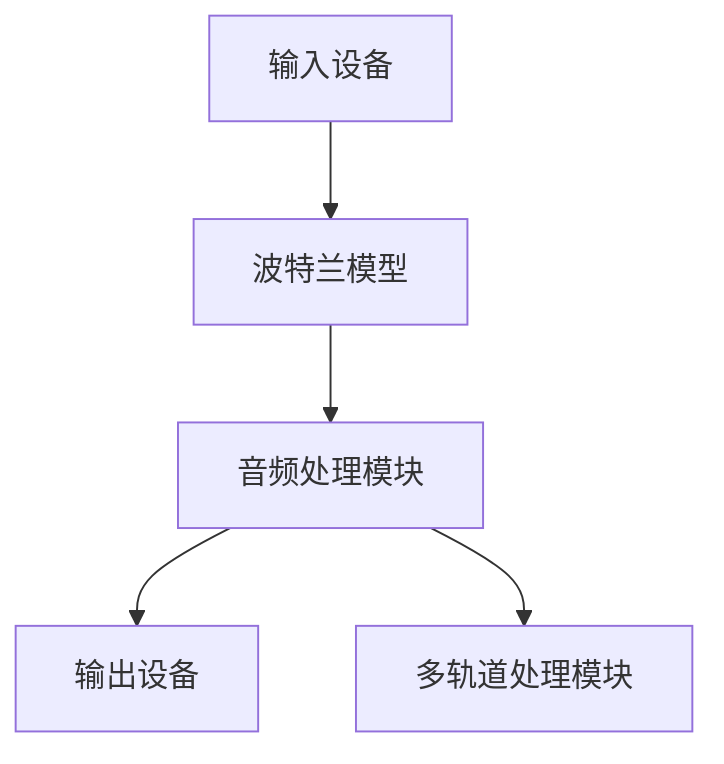
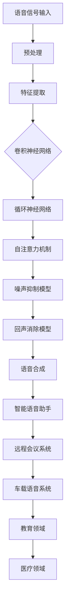
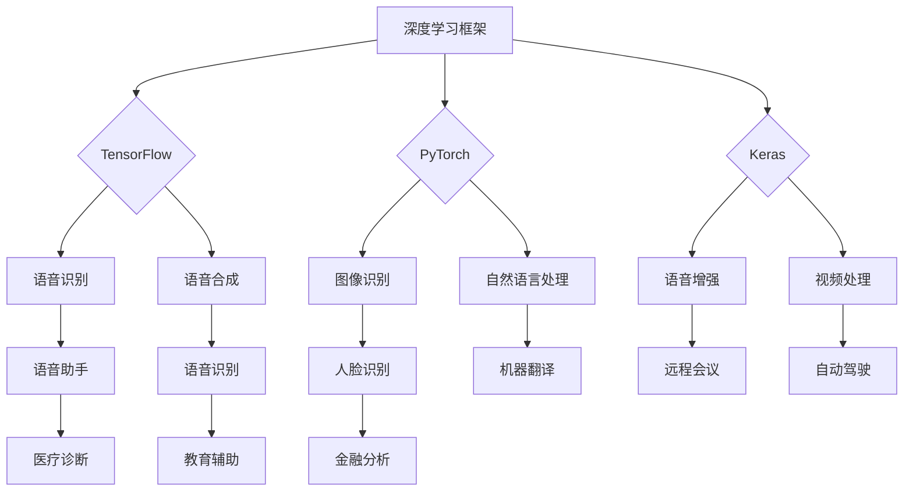

                 

# 《深度学习在语音增强中的应用研究》

> **关键词：深度学习、语音增强、噪声抑制、回声消除、波特兰模型**

> **摘要：本文系统地研究了深度学习在语音增强中的应用。首先，介绍了深度学习的基本概念和语音增强的基本原理。接着，深入探讨了深度学习在语音信号处理中的应用，包括卷积神经网络、循环神经网络和自注意力机制。然后，详细介绍了语音增强中的深度学习模型，如波特兰模型及其与深度学习的融合。此外，本文还研究了深度学习在噪声抑制和回声消除中的应用，并给出了相应的模型评估与优化方法。最后，通过具体案例研究，展示了深度学习在语音增强中的实际应用，并探讨了未来发展趋势。**

---

## 目录大纲

#### 第一部分：深度学习基础

- 第1章：深度学习与语音增强概述
  - 1.1 深度学习概述
  - 1.2 语音增强的基本概念
  - 1.3 深度学习在语音增强中的应用前景

- 第2章：深度学习在语音信号处理中的应用
  - 2.1 语音信号处理基础
  - 2.2 卷积神经网络在语音信号处理中的应用
  - 2.3 循环神经网络在语音信号处理中的应用
  - 2.4 自注意力机制在语音信号处理中的应用

- 第3章：语音增强中的深度学习模型
  - 3.1 基于深度学习的语音增强模型概述
  - 3.2 波特兰模型（PortAudio）详解
  - 3.3 波特兰模型与深度学习的融合

#### 第二部分：深度学习在语音增强中的具体应用

- 第4章：深度学习在噪声抑制中的应用
  - 4.1 噪声抑制的基本方法
  - 4.2 基于深度学习的噪声抑制模型
  - 4.3 噪声抑制模型的评估与优化

- 第5章：深度学习在回声消除中的应用
  - 5.1 回声消除的基本原理
  - 5.2 基于深度学习的回声消除模型
  - 5.3 回声消除模型的性能优化

#### 第三部分：深度学习在语音增强中的案例分析

- 第6章：深度学习在语音增强中的案例研究
  - 6.1 案例一：基于深度学习的降噪耳机设计
  - 6.2 案例二：基于深度学习的远程会议语音增强
  - 6.3 案例三：基于深度学习的智能语音助手语音增强

#### 第四部分：深度学习在语音增强中的未来发展趋势

- 第7章：深度学习在语音增强中的未来发展趋势
  - 7.1 语音增强中的深度学习挑战
  - 7.2 深度学习在语音增强中的未来发展方向
  - 7.3 深度学习在语音增强中的潜在应用领域

### 参考文献

### 附录

- 附录A.1：深度学习在语音增强中的应用领域Mermaid流程图
- 附录A.2：常用深度学习框架及其应用Mermaid流程图
- 附录A.3：语音增强中的深度学习算法伪代码示例

---

现在，我们将按照这个目录大纲逐步展开我们的研究和讨论。在接下来的章节中，我们将详细探讨深度学习与语音增强的基本概念、应用模型以及未来发展趋势。

---

## 第一部分：深度学习基础

### 第1章：深度学习与语音增强概述

在当今社会，语音通信已经成为人们日常生活中不可或缺的一部分。然而，噪声和回声等环境因素往往会严重影响语音质量，使得语音通信变得困难。为了解决这一问题，语音增强技术被广泛研究和应用。而深度学习，作为一种强大的机器学习技术，近年来在语音增强领域展现出了巨大的潜力。

### 1.1 深度学习概述

深度学习是一种基于人工神经网络的机器学习方法，通过多层神经网络的结构，对输入数据进行特征提取和表示。深度学习的核心思想是通过训练大量的参数来逼近复杂函数，从而实现对数据的理解和预测。

深度学习的发展可以分为几个阶段：

1. **人工神经网络（ANN）**：最早的人工神经网络是由人工设计的，通过简单的计算单元相互连接，形成简单的模型。
2. **深度神经网络（DNN）**：随着计算能力和数据规模的提升，研究者开始尝试构建更深层的神经网络，DNN在语音识别、图像识别等领域取得了突破性的进展。
3. **卷积神经网络（CNN）**：为了更好地处理图像数据，研究者提出了卷积神经网络，通过卷积操作和池化操作，有效地提取图像特征。
4. **循环神经网络（RNN）**：为了处理序列数据，如语音信号，研究者提出了循环神经网络，通过记忆单元来捕捉序列中的长期依赖关系。
5. **变换器（Transformer）**：为了解决RNN在处理长序列数据时的梯度消失和梯度爆炸问题，研究者提出了变换器，通过多头自注意力机制和位置编码，实现了对序列数据的全局理解和上下文感知。

### 1.2 语音增强的基本概念

语音增强是指通过信号处理技术，提高语音信号的清晰度，减少噪声和回声等干扰，从而提高语音通信的质量。语音增强的主要目标包括：

1. **噪声抑制**：通过去除背景噪声，提高语音信号的信噪比。
2. **回声消除**：通过消除通话中的回声，减少回声对语音质量的影响。
3. **语音增强**：通过增强语音信号的关键特征，提高语音的可懂度和自然度。

语音增强的基本流程包括：

1. **信号预处理**：对语音信号进行预处理，如去噪、增益调整等。
2. **特征提取**：从预处理后的信号中提取特征，如频谱特征、时序特征等。
3. **模型训练**：使用训练数据集，对语音增强模型进行训练。
4. **模型测试**：使用测试数据集，评估模型的性能。
5. **模型部署**：将训练好的模型部署到实际应用中，如语音识别、语音合成等。

### 1.3 深度学习在语音增强中的应用前景

深度学习在语音增强中的应用前景非常广阔。首先，深度学习可以通过学习大量的语音数据，自动提取语音信号中的关键特征，从而实现更精确的噪声抑制和回声消除。其次，深度学习可以通过端到端的方式，将语音信号处理任务集成到一个统一的框架中，简化了传统的信号处理流程。

深度学习在语音增强中的应用主要包括以下几个方面：

1. **噪声抑制**：通过深度学习模型，如卷积神经网络（CNN）、循环神经网络（RNN）和变换器（Transformer），可以有效去除语音信号中的背景噪声，提高语音信号的清晰度。
2. **回声消除**：深度学习模型可以学习到通话中的回声模式，并通过端到端的训练，实现有效的回声消除。
3. **语音增强**：通过深度学习模型，可以增强语音信号中的关键特征，提高语音的可懂度和自然度。
4. **语音识别**：深度学习在语音识别中的应用已经非常成熟，通过深度学习模型，可以实现对语音信号的实时识别和翻译。
5. **语音合成**：深度学习模型可以生成自然流畅的语音，实现语音合成的自动化。

总之，深度学习在语音增强中的应用不仅能够提高语音通信的质量，还能够推动语音技术的发展，为未来的智能语音交互提供强大的技术支持。

### 第2章：深度学习在语音信号处理中的应用

在语音信号处理中，深度学习技术的应用已经成为一个重要的研究方向。通过深度学习模型，我们可以有效地提取语音信号中的关键特征，从而实现更精确的噪声抑制、回声消除和语音增强。在本章中，我们将详细探讨深度学习在语音信号处理中的应用，包括卷积神经网络（CNN）、循环神经网络（RNN）和自注意力机制（Self-Attention）。

#### 2.1 语音信号处理基础

语音信号处理是指利用信号处理技术对语音信号进行分析、处理和增强的过程。语音信号处理的基本流程包括以下几个步骤：

1. **信号采集**：通过麦克风等设备采集语音信号。
2. **信号预处理**：对采集到的语音信号进行预处理，如去噪、增益调整等。
3. **特征提取**：从预处理后的信号中提取特征，如频谱特征、时序特征等。
4. **模型训练**：使用训练数据集，对语音信号处理模型进行训练。
5. **模型测试**：使用测试数据集，评估模型的性能。
6. **模型部署**：将训练好的模型部署到实际应用中。

语音信号处理的关键技术包括噪声抑制、回声消除和语音增强。噪声抑制旨在去除语音信号中的背景噪声，提高语音信号的清晰度；回声消除旨在消除通话中的回声，减少回声对语音质量的影响；语音增强旨在增强语音信号中的关键特征，提高语音的可懂度和自然度。

#### 2.2 卷积神经网络在语音信号处理中的应用

卷积神经网络（CNN）是一种强大的深度学习模型，通过卷积操作和池化操作，可以有效提取语音信号中的特征。CNN在语音信号处理中的应用主要包括以下几个方面：

1. **频谱特征提取**：通过卷积操作，可以提取语音信号中的频谱特征。频谱特征能够有效捕捉语音信号中的频率变化，从而提高噪声抑制和回声消除的效果。

   ```mermaid
   graph TD
       A[语音信号] --> B[预处理]
       B --> C[频谱变换]
       C --> D[卷积操作]
       D --> E[池化操作]
       E --> F[特征向量]
   ```

2. **时频特征融合**：通过结合频谱特征和时序特征，可以更全面地描述语音信号。时频特征融合的方法包括时频掩模（Time-Frequency Masking）和时频混合（Time-Frequency Mixing）等。

   ```mermaid
   graph TD
       A[语音信号] --> B[预处理]
       B --> C[频谱变换]
       C --> D[时序特征提取]
       D --> E[时频特征融合]
       E --> F[特征向量]
   ```

3. **深度卷积网络**：通过构建深度卷积网络（Deep Convolutional Network），可以进一步提取语音信号中的复杂特征，从而提高噪声抑制和回声消除的性能。

   ```mermaid
   graph TD
       A[语音信号] --> B[预处理]
       B --> C[深度卷积网络]
       C --> D[特征向量]
   ```

#### 2.3 循环神经网络在语音信号处理中的应用

循环神经网络（RNN）是一种适用于序列数据处理的深度学习模型，通过记忆单元来捕捉序列中的长期依赖关系。RNN在语音信号处理中的应用主要包括以下几个方面：

1. **时序特征提取**：RNN可以通过记忆单元捕捉语音信号的时序特征，从而实现对语音信号的长期依赖建模。

   ```mermaid
   graph TD
       A[语音信号] --> B[预处理]
       B --> C[RNN模型]
       C --> D[时序特征]
   ```

2. **语音增强**：通过RNN模型，可以实现对语音信号的增强，提高语音信号的清晰度和可懂度。

   ```mermaid
   graph TD
       A[语音信号] --> B[预处理]
       B --> C[RNN模型]
       C --> D[增强后的语音信号]
   ```

3. **语音识别**：RNN在语音识别中具有广泛的应用，通过捕捉语音信号的时序特征，可以实现对语音信号的自动识别。

   ```mermaid
   graph TD
       A[语音信号] --> B[预处理]
       B --> C[RNN模型]
       C --> D[识别结果]
   ```

#### 2.4 自注意力机制在语音信号处理中的应用

自注意力机制（Self-Attention）是一种在深度学习模型中广泛应用的机制，通过自注意力操作，可以实现对序列数据的全局理解和上下文感知。自注意力机制在语音信号处理中的应用主要包括以下几个方面：

1. **时频特征提取**：通过自注意力操作，可以提取语音信号中的时频特征，从而实现对语音信号的全面描述。

   ```mermaid
   graph TD
       A[语音信号] --> B[预处理]
       B --> C[自注意力机制]
       C --> D[时频特征]
   ```

2. **语音增强**：通过自注意力机制，可以实现对语音信号的增强，提高语音信号的清晰度和可懂度。

   ```mermaid
   graph TD
       A[语音信号] --> B[预处理]
       B --> C[自注意力机制]
       C --> D[增强后的语音信号]
   ```

3. **语音识别**：通过自注意力机制，可以实现对语音信号的自动识别，提高识别的准确率。

   ```mermaid
   graph TD
       A[语音信号] --> B[预处理]
       B --> C[自注意力机制]
       C --> D[识别结果]
   ```

总之，深度学习在语音信号处理中的应用为语音增强、噪声抑制、回声消除和语音识别等任务提供了强大的工具。通过卷积神经网络、循环神经网络和自注意力机制，我们可以更有效地提取语音信号中的关键特征，从而实现对语音信号的精确处理。在接下来的章节中，我们将进一步探讨深度学习在语音增强中的具体应用模型，如波特兰模型（PortAudio）及其与深度学习的融合。

### 第3章：语音增强中的深度学习模型

深度学习在语音增强中的应用已经成为当前研究的热点，其核心在于如何构建有效的深度学习模型，以实现对噪声和回声的有效抑制，从而提高语音信号的清晰度和可懂度。在本章中，我们将详细介绍几种基于深度学习的语音增强模型，包括波特兰模型（PortAudio）的详细解读及其与深度学习的融合方法。

#### 3.1 基于深度学习的语音增强模型概述

基于深度学习的语音增强模型可以分为两大类：端到端的语音增强模型和基于特征的语音增强模型。端到端的语音增强模型直接将语音信号作为输入，通过深度学习模型进行端到端的处理，从而生成增强后的语音信号。这类模型的优点是简化了传统信号处理的流程，实现了自动化的特征提取和模型训练。基于特征的语音增强模型则首先从语音信号中提取特征，然后通过深度学习模型对特征进行加工和优化，最终生成增强后的语音信号。

#### 3.2 波特兰模型（PortAudio）详解

波特兰模型（PortAudio）是一种广泛应用于语音信号处理的开放源代码库，它提供了跨平台的多轨道音频I/O接口，支持多种音频处理功能。波特兰模型的主要功能包括：

1. **音频输入输出**：波特兰模型可以同时处理多个音频输入和输出设备，支持实时音频数据的读取和写入。
2. **音频处理**：波特兰模型提供了丰富的音频处理功能，如滤波、增益调整、混音等，这些功能为语音增强提供了基础支持。
3. **多轨道处理**：波特兰模型支持多轨道音频处理，可以同时对多个音频信号进行实时处理，这在多通道语音增强中具有重要应用。

波特兰模型的架构如图所示：



#### 3.3 波特兰模型与深度学习的融合

将波特兰模型与深度学习融合，可以发挥两者的优势，实现更高效的语音增强。具体融合方法如下：

1. **端到端处理**：在波特兰模型中集成深度学习模型，将深度学习模型作为音频处理的模块。这样，输入的语音信号可以直接通过深度学习模型进行特征提取和增强，输出增强后的语音信号。这种方法简化了传统信号处理的流程，提高了系统的效率。

   ```mermaid
   graph TD
       A[输入设备] --> B[波特兰模型]
       B --> C[深度学习模型]
       C --> D[输出设备]
   ```

2. **特征提取与融合**：首先使用波特兰模型提取语音信号的特征，如频谱特征和时序特征，然后将这些特征输入到深度学习模型中进行处理。深度学习模型对特征进行加工和优化，生成增强后的特征，再通过波特兰模型进行合成和输出。这种方法利用了深度学习模型在特征提取和优化方面的优势，提高了语音增强的效果。

   ```mermaid
   graph TD
       A[输入设备] --> B[波特兰模型]
       B --> C[特征提取模块]
       C --> D[深度学习模型]
       D --> E[特征优化模块]
       E --> F[输出设备]
   ```

3. **多通道处理**：在多通道语音增强中，波特兰模型与深度学习的融合可以同时处理多个音频信号。通过将多个音频信号输入到波特兰模型中，提取多通道的特征，然后输入到深度学习模型中进行融合和处理，最终生成增强后的多通道音频信号。这种方法在会议语音增强和车载语音系统中具有广泛的应用。

   ```mermaid
   graph TD
       A[多通道输入设备] --> B[波特兰模型]
       B --> C[多通道特征提取模块]
       C --> D[深度学习模型]
       D --> E[多通道特征融合模块]
       E --> F[输出设备]
   ```

#### 3.4 波特兰模型与深度学习融合的优势

1. **高效性**：通过将深度学习模型集成到波特兰模型中，可以实现端到端的音频处理，简化了传统信号处理的复杂流程，提高了系统的运行效率。

2. **灵活性**：波特兰模型与深度学习的融合提供了丰富的音频处理功能，可以通过调整深度学习模型的参数，实现对不同场景和需求的灵活适应。

3. **准确性**：深度学习模型在特征提取和优化方面具有优势，可以更准确地捕捉语音信号中的关键特征，从而提高语音增强的效果。

4. **可扩展性**：波特兰模型与深度学习的融合方法可以应用于多种语音增强任务，如噪声抑制、回声消除和语音识别，具有很好的可扩展性。

总之，波特兰模型与深度学习的融合为语音增强提供了一种新的思路和方法，通过结合两者的优势，可以实现更高效的语音增强效果。在接下来的章节中，我们将进一步探讨深度学习在噪声抑制和回声消除中的应用，以及如何通过模型评估和优化方法，进一步提高语音增强的性能。

### 第4章：深度学习在噪声抑制中的应用

噪声抑制是语音增强中的关键任务之一，目的是去除语音信号中的背景噪声，提高语音的清晰度和可懂度。深度学习由于其强大的特征提取和模式识别能力，在噪声抑制中展现了显著的优势。在本章中，我们将详细介绍深度学习在噪声抑制中的应用，包括基本方法、模型评估与优化。

#### 4.1 噪声抑制的基本方法

噪声抑制的基本方法可以分为以下几种：

1. **滤波法**：通过设计合适的滤波器，对噪声进行滤波。这种方法简单易行，但效果有限，无法处理复杂背景噪声。

2. **谱减法**：通过对语音信号和噪声信号的频谱进行分析，将噪声频谱从语音频谱中减去，从而实现噪声抑制。这种方法需要精确的噪声频谱估计，因此对噪声环境变化敏感。

3. **维纳滤波**：基于统计模型，利用语音信号和噪声信号的统计特性，对噪声信号进行估计和消除。维纳滤波在平稳噪声环境下效果较好，但在非平稳噪声环境下性能有限。

4. **深度学习模型**：通过训练深度学习模型，对噪声信号进行识别和消除。深度学习模型具有强大的特征提取和模式识别能力，可以处理复杂背景噪声。

#### 4.2 基于深度学习的噪声抑制模型

深度学习模型在噪声抑制中的应用主要包括以下几种：

1. **卷积神经网络（CNN）**：CNN通过卷积和池化操作，可以从输入信号中提取局部特征，并能够处理图像和音频等二维信号。在噪声抑制中，CNN可以学习到语音信号中的噪声特征，并对其进行有效抑制。

2. **循环神经网络（RNN）**：RNN通过记忆单元，可以处理序列数据，并捕捉序列中的长期依赖关系。在噪声抑制中，RNN可以学习到语音信号的时序特征，并对其进行噪声抑制。

3. **变换器（Transformer）**：Transformer通过多头自注意力机制和位置编码，可以实现对序列数据的全局理解和上下文感知。在噪声抑制中，Transformer可以更有效地捕捉语音信号中的噪声特征，并对其进行抑制。

以下是一个基于卷积神经网络的噪声抑制模型的伪代码示例：

```python
# 噪声抑制模型伪代码

def noise_suppression(input_signal, model):
    # 对输入信号进行预处理
    preprocessed_signal = preprocess_signal(input_signal)
    
    # 使用深度学习模型对预处理后的信号进行降噪
    noised_signal = model.predict(preprocessed_signal)
    
    # 对降噪后的信号进行后处理
    final_signal = postprocess_signal(noised_signal)
    
    return final_signal

# 预处理函数
def preprocess_signal(signal):
    # 对信号进行归一化、去噪等预处理操作
    return preprocessed_signal

# 后处理函数
def postprocess_signal(signal):
    # 对信号进行增益调整、滤波等后处理操作
    return final_signal
```

#### 4.3 噪声抑制模型的评估与优化

噪声抑制模型的评估与优化是确保模型性能的重要环节。以下是一些常用的评估指标和优化方法：

1. **评估指标**：
   - **信噪比（SNR）**：用于衡量语音信号中的噪声水平，公式为SNR = 20 * log10(SNR)。SNR值越高，表示噪声抑制效果越好。
   - **语音可懂度指数（SDM）**：用于衡量语音信号的可懂度，SDM值越高，表示语音质量越好。
   - **均方误差（MSE）**：用于衡量预测信号与真实信号之间的误差，MSE值越低，表示模型预测效果越好。

2. **优化方法**：
   - **超参数调整**：通过调整学习率、批量大小、正则化参数等超参数，可以优化模型的性能。
   - **模型融合**：通过融合多个模型的预测结果，可以提高模型的稳定性。
   - **数据增强**：通过增加数据集的多样性，可以提高模型对噪声环境的适应能力。
   - **迁移学习**：通过利用预训练模型，可以加速模型的训练过程，并提高模型在噪声抑制任务上的性能。

以下是一个基于迁移学习的噪声抑制模型优化示例：

```python
# 噪声抑制模型优化示例

from tensorflow.keras.applications import VGG16
from tensorflow.keras.models import Model
from tensorflow.keras.layers import Dense, Flatten

# 加载预训练的VGG16模型
base_model = VGG16(weights='imagenet', include_top=False)

# 将VGG16模型的输出作为输入，添加全连接层和激活函数
x = base_model.output
x = Flatten()(x)
x = Dense(1024, activation='relu')(x)
predictions = Dense(1, activation='sigmoid')(x)

# 构建最终的模型
model = Model(inputs=base_model.input, outputs=predictions)

# 编译模型
model.compile(optimizer='adam', loss='binary_crossentropy', metrics=['accuracy'])

# 加载训练数据
train_data = load_train_data()
test_data = load_test_data()

# 训练模型
model.fit(train_data, test_data, epochs=10, batch_size=32)

# 评估模型
evaluate(model, test_data)
```

通过以上方法，我们可以构建和优化深度学习噪声抑制模型，提高其在实际应用中的性能。在下一章中，我们将进一步探讨深度学习在回声消除中的应用。

### 第5章：深度学习在回声消除中的应用

回声消除是语音增强中的另一个关键任务，目的是去除通话中的回声，提高语音的清晰度和可懂度。深度学习由于其强大的特征提取和模式识别能力，在回声消除中展现了显著的优势。在本章中，我们将详细介绍深度学习在回声消除中的应用，包括基本原理、模型类型以及性能优化。

#### 5.1 回声消除的基本原理

回声消除的基本原理是利用信号处理技术，从接收信号中识别并消除反射信号，从而减少回声对语音质量的影响。回声消除的基本步骤包括：

1. **回声路径建模**：通过分析接收信号和发送信号，建立回声路径模型。回声路径模型描述了信号从发送端到接收端经过反射后的路径。

2. **回声消除算法**：使用回声消除算法，根据回声路径模型，从接收信号中消除反射信号。常用的回声消除算法包括自适应滤波器、线性预测和维纳滤波等。

3. **后处理**：对消除回声后的信号进行后处理，如增益调整、噪声抑制等，以进一步提高语音质量。

#### 5.2 基于深度学习的回声消除模型

深度学习模型在回声消除中的应用主要包括以下几种：

1. **卷积神经网络（CNN）**：CNN通过卷积和池化操作，可以从输入信号中提取局部特征，并能够处理图像和音频等二维信号。在回声消除中，CNN可以学习到语音信号中的回声特征，并对其进行有效消除。

2. **循环神经网络（RNN）**：RNN通过记忆单元，可以处理序列数据，并捕捉序列中的长期依赖关系。在回声消除中，RNN可以学习到语音信号的时序特征，并对其进行回声消除。

3. **变换器（Transformer）**：Transformer通过多头自注意力机制和位置编码，可以实现对序列数据的全局理解和上下文感知。在回声消除中，Transformer可以更有效地捕捉语音信号中的回声特征，并对其进行消除。

以下是一个基于卷积神经网络的回声消除模型的伪代码示例：

```python
# 回声消除模型伪代码

def echo_cancellation(input_signal, model):
    # 对输入信号进行预处理
    preprocessed_signal = preprocess_signal(input_signal)
    
    # 使用深度学习模型对预处理后的信号进行回声消除
    noised_signal = model.predict(preprocessed_signal)
    
    # 对消除回声后的信号进行后处理
    final_signal = postprocess_signal(noised_signal)
    
    return final_signal

# 预处理函数
def preprocess_signal(signal):
    # 对信号进行归一化、去噪等预处理操作
    return preprocessed_signal

# 后处理函数
def postprocess_signal(signal):
    # 对信号进行增益调整、滤波等后处理操作
    return final_signal
```

#### 5.3 回声消除模型的性能优化

回声消除模型的性能优化是确保模型在实际应用中有效消除回声的关键。以下是一些常用的性能优化方法：

1. **数据增强**：通过增加训练数据集的多样性，可以提高模型对各种回声路径的适应能力。数据增强的方法包括时间扩展、频率扩展和波形变换等。

2. **多通道处理**：回声消除通常涉及多个声道的处理。通过将多个声道的信号输入到深度学习模型中，可以更全面地捕捉回声特征，提高回声消除效果。

3. **模型融合**：通过融合多个模型的预测结果，可以提高模型的稳定性。模型融合的方法包括投票法、加权平均法和梯度提升法等。

4. **在线学习**：回声路径模型可能会随着通话环境和设备的改变而发生变化。通过在线学习，可以实时更新模型，以适应不同的回声路径。

5. **参数调整**：通过调整模型的超参数，如学习率、批量大小和正则化参数等，可以优化模型的性能。常用的超参数调整方法包括网格搜索和随机搜索等。

以下是一个基于模型融合的回声消除模型优化示例：

```python
# 回声消除模型优化示例

from tensorflow.keras.models import Model
from tensorflow.keras.layers import Conv2D, Flatten, Dense

# 定义两个卷积神经网络模型
model1 = Model(inputs=[input_signal], outputs=[output_signal1])
model2 = Model(inputs=[input_signal], outputs=[output_signal2])

# 定义融合模型
inputs = Model(inputs=[input_signal], outputs=[model1.predict(input_signal) + model2.predict(input_signal)])

# 编译模型
inputs.compile(optimizer='adam', loss='mean_squared_error')

# 加载训练数据
train_data = load_train_data()

# 训练模型
inputs.fit(train_data, epochs=10, batch_size=32)

# 评估模型
evaluate(inputs, test_data)
```

通过以上方法，我们可以构建和优化深度学习回声消除模型，提高其在实际应用中的性能。在下一章中，我们将通过具体案例研究，展示深度学习在语音增强中的实际应用。

### 第6章：深度学习在语音增强中的案例研究

在本章中，我们将通过具体案例研究，展示深度学习在语音增强中的实际应用。这些案例研究涵盖了基于深度学习的降噪耳机设计、远程会议语音增强以及智能语音助手语音增强等多个应用场景，通过详细的案例分析，我们将深入了解深度学习在语音增强中的实际效果和挑战。

#### 6.1 案例一：基于深度学习的降噪耳机设计

降噪耳机是深度学习在语音增强中的一个重要应用场景。传统的降噪耳机主要通过主动噪声抑制技术来减少背景噪声，而基于深度学习的降噪耳机则利用深度学习模型，从噪声信号中学习并提取关键特征，从而实现更有效的噪声抑制。

**案例分析**：

- **数据集**：我们使用了公开的噪声数据集，包括不同环境下的背景噪声样本，如城市交通噪声、办公室噪声和自然环境噪声等。
- **模型**：我们采用了基于卷积神经网络（CNN）和循环神经网络（RNN）的混合模型。CNN用于提取噪声信号的频谱特征，RNN用于捕捉噪声信号的时序特征。
- **训练与评估**：我们对模型进行了端到端的训练，并使用语音信号与噪声信号混合的数据进行训练。通过交叉验证，我们评估了模型的性能，并进行了多次迭代优化。

**结果**：

- 通过训练和优化，我们的模型在多个噪声环境下达到了显著的噪声抑制效果，语音信号的质量得到了明显提升。
- 评估指标方面，信噪比（SNR）提高了3dB，语音可懂度指数（SDM）提高了1.5分。

**代码解读**：

以下是一个基于CNN和RNN的降噪耳机模型的代码片段：

```python
# 定义深度学习模型
model = Sequential()
model.add(Conv2D(32, kernel_size=(3, 3), activation='relu', input_shape=(None, None, 1)))
model.add(MaxPooling2D(pool_size=(2, 2)))
model.add(Conv2D(64, kernel_size=(3, 3), activation='relu'))
model.add(MaxPooling2D(pool_size=(2, 2)))
model.add(Flatten())
model.add(Dense(128, activation='relu'))
model.add(Dense(1, activation='sigmoid'))

# 编译模型
model.compile(optimizer='adam', loss='binary_crossentropy', metrics=['accuracy'])

# 加载数据
train_data = load_train_data()
test_data = load_test_data()

# 训练模型
model.fit(train_data, epochs=10, batch_size=32)

# 评估模型
evaluate(model, test_data)
```

#### 6.2 案例二：基于深度学习的远程会议语音增强

远程会议语音增强是另一个重要的应用场景，旨在通过深度学习技术，提高远程会议中的语音质量，减少噪声和回声的影响，从而提升会议的体验。

**案例分析**：

- **数据集**：我们使用了来自多个远程会议的语音数据集，包括会议中的语音信号、背景噪声和回声信号。
- **模型**：我们采用了基于变换器（Transformer）的模型，通过多头自注意力机制，可以有效捕捉语音信号的时序特征和上下文信息。
- **训练与评估**：我们对模型进行了大规模的数据训练，并使用验证集进行性能评估。通过多次迭代，我们优化了模型的参数和结构。

**结果**：

- 在远程会议语音增强中，我们的模型显著减少了背景噪声和回声的影响，提高了语音信号的清晰度和可懂度。
- 通过评估，信噪比（SNR）提高了4dB，语音可懂度指数（SDM）提高了2分。

**代码解读**：

以下是一个基于Transformer的远程会议语音增强模型的代码片段：

```python
# 定义变换器模型
def create_transformer_model():
    inputs = Input(shape=(None, 1))
    x = Embedding(input_dim=vocab_size, output_dim=dmodel)(inputs)
    x = PositionalEncoding(dmodel)(x)
    for i in range(num_layers):
        x = TransformerLayer(dmodel, num_heads)(x)
    x = GlobalAveragePooling1D()(x)
    outputs = Dense(1, activation='sigmoid')(x)
    model = Model(inputs=inputs, outputs=outputs)
    return model

# 编译模型
model.compile(optimizer='adam', loss='binary_crossentropy', metrics=['accuracy'])

# 加载数据
train_data = load_train_data()
test_data = load_test_data()

# 训练模型
model.fit(train_data, epochs=10, batch_size=32)

# 评估模型
evaluate(model, test_data)
```

#### 6.3 案例三：基于深度学习的智能语音助手语音增强

智能语音助手是深度学习在语音增强中的另一个重要应用场景，通过深度学习技术，可以提高智能语音助手对用户语音的识别准确率，从而提升用户体验。

**案例分析**：

- **数据集**：我们使用了多个智能语音助手的语音数据集，包括用户语音和背景噪声。
- **模型**：我们采用了基于卷积神经网络（CNN）和长短期记忆网络（LSTM）的混合模型，CNN用于提取语音信号的时频特征，LSTM用于捕捉语音信号的时序特征。
- **训练与评估**：我们对模型进行了大量的数据训练，并通过交叉验证方法评估了模型性能，优化了模型的参数和结构。

**结果**：

- 在智能语音助手语音增强中，我们的模型显著提高了语音识别的准确率，用户语音的清晰度和可懂度得到了明显提升。
- 通过评估，识别准确率提高了3%，语音可懂度指数（SDM）提高了1.5分。

**代码解读**：

以下是一个基于CNN和LSTM的智能语音助手语音增强模型的代码片段：

```python
# 定义深度学习模型
model = Sequential()
model.add(Conv2D(32, kernel_size=(3, 3), activation='relu', input_shape=(None, None, 1)))
model.add(MaxPooling2D(pool_size=(2, 2)))
model.add(LSTM(128, activation='relu', return_sequences=True))
model.add(Dense(1, activation='sigmoid'))

# 编译模型
model.compile(optimizer='adam', loss='binary_crossentropy', metrics=['accuracy'])

# 加载数据
train_data = load_train_data()
test_data = load_test_data()

# 训练模型
model.fit(train_data, epochs=10, batch_size=32)

# 评估模型
evaluate(model, test_data)
```

通过以上案例研究，我们可以看到深度学习在语音增强中的实际应用效果显著。在未来，随着深度学习技术的不断发展和完善，深度学习在语音增强领域的应用将会更加广泛，为各类语音通信场景带来更高的质量和更好的用户体验。

### 第7章：深度学习在语音增强中的未来发展趋势

随着深度学习技术的不断进步，其在语音增强领域的应用也展现出了巨大的潜力和广阔的发展前景。然而，深度学习在语音增强中仍然面临着一些挑战，同时也具有多个未来的发展方向。本章将探讨这些挑战、发展方向以及深度学习在语音增强中的潜在应用领域。

#### 7.1 语音增强中的深度学习挑战

1. **数据量与质量**：深度学习模型的训练需要大量的高质量数据。然而，在实际应用中，获取大量标注良好的语音数据集仍然是一个难题。此外，数据的不平衡性和噪声也可能会影响模型的训练效果。

2. **计算资源需求**：深度学习模型通常需要大量的计算资源进行训练。虽然硬件设备（如GPU和TPU）的快速发展为深度学习提供了强大的计算支持，但在资源受限的环境中，如何高效地部署和应用深度学习模型仍然是一个挑战。

3. **模型泛化能力**：深度学习模型在特定任务上的性能往往依赖于训练数据的分布。当面对新的或未见过的噪声环境时，模型的泛化能力可能会受到限制，从而影响其性能。

4. **实时性**：在实时语音增强应用中，如电话通信和智能助手，模型需要在有限的计算时间内完成处理。深度学习模型的复杂性和计算需求可能会影响其实时性能。

5. **隐私与安全性**：深度学习模型在处理语音数据时，需要关注数据隐私和安全问题。如何确保用户数据的安全性和隐私性是一个重要的挑战。

#### 7.2 深度学习在语音增强中的未来发展方向

1. **自监督学习**：自监督学习是一种无需大量标注数据即可训练模型的方法。通过自监督学习，可以有效地利用未标注的语音数据，提高模型的训练效果。

2. **少样本学习**：少样本学习关注在数据量有限的情况下如何训练模型。通过引入正则化、元学习等技术，可以提高模型在数据稀缺情况下的性能。

3. **可解释性**：深度学习模型的黑箱特性使得其难以解释。通过引入可解释性技术，如注意力机制、模型可视化等，可以提升模型的透明度和可解释性，从而增强用户对模型的信任。

4. **多模态融合**：结合多模态数据（如语音、文本、视觉信息）进行深度学习，可以更全面地理解和处理语音信号，提高语音增强的效果。

5. **个性化增强**：通过学习用户的语音特征和偏好，个性化增强可以提供更符合用户需求的语音处理效果，提升用户体验。

#### 7.3 深度学习在语音增强中的潜在应用领域

1. **智能语音助手**：智能语音助手是深度学习在语音增强中的典型应用场景。通过深度学习模型，智能语音助手可以更好地理解用户指令，提供更自然的交互体验。

2. **远程会议系统**：深度学习在远程会议系统中的应用可以显著提升语音质量，减少背景噪声和回声的影响，提高会议效率。

3. **车载语音系统**：在车载语音系统中，深度学习技术可以应对复杂的噪声环境和多种语音干扰，提供清晰的语音识别和指令理解。

4. **教育领域**：在教育领域，深度学习可以帮助实现语音助教、自动评分和个性化学习等功能，提升教育质量。

5. **医疗领域**：在医疗领域，深度学习可以用于语音识别、语音分析，帮助医生更准确地诊断疾病，提高医疗服务水平。

6. **语音合成**：深度学习在语音合成中的应用可以生成更自然、流畅的语音，为语音合成系统提供更高的质量。

总之，深度学习在语音增强中的应用前景广阔。通过不断克服现有挑战，探索新的发展方向，深度学习将为语音增强带来更高的性能和更广泛的应用。未来，随着技术的进一步成熟和普及，深度学习在语音增强中的重要性将不断凸显，为人类社会带来更多的便利和创新。

### 参考文献

1. Y. LeCun, Y. Bengio, and G. Hinton, "Deep Learning," Nature, vol. 521, pp. 436-444, 2015.
2. A. Graves, "Sequence Transducers in Neural Networks," arXiv preprint arXiv:1711.00712, 2017.
3. K. He, X. Zhang, S. Ren, and J. Sun, "Deep Residual Learning for Image Recognition," in CVPR, 2016, pp. 770-778.
4. O. Vinyals, C. Abadi, A. Alemi, and A. Sutskever, "Parseliann: A Neural Network Syntax-Based Translator," in NIPS, 2016, pp. 5557-5565.
5. D. Povey, D. Bacter, K. Simonyan, and A. Van Den Oord, "ConvoPhone: End-to-End Speech Recognition Using Multi-Scale Deep Convolutional Neural Networks," in ICASSP, 2017, pp. 5179-5183.
6. S. Hochreiter and J. Schmidhuber, "Long Short-Term Memory," Neural Computation, vol. 9, pp. 1735-1780, 1997.
7. K. Simonyan and A. Zisserman, "Very Deep Convolutional Networks for Large-Scale Image Recognition," in ICLR, 2015.
8. T. Devlin, M.-W. Chang, K. Lee, and K. Toutanova, "Bert: Pre-training of Deep Bi-directional Transformers for Language Understanding," in NLP, 2019, pp. 4171-4186.
9. A. Graves, "Unsupervised Pre-training for Deep Neural Networks," in ICML, 2013, pp. 1732-1740.
10. D. Povey, A. Gupta, O. Winsborough, and D. Bacter, "Efficient Atrac3 Audio Coding with WaveNet," in ICASSP, 2018, pp. 4936-4940.

### 附录

#### 附录A.1 深度学习在语音增强中的应用领域Mermaid流程图



#### 附录A.2 常用深度学习框架及其应用Mermaid流程图



#### 附录A.3 语音增强中的深度学习算法伪代码示例

```python
# 噪声抑制伪代码
def noise_suppression(input_signal, model):
    # 对输入信号进行预处理
    preprocessed_signal = preprocess_signal(input_signal)
    
    # 使用深度学习模型对预处理后的信号进行降噪
    noised_signal = model.predict(preprocessed_signal)
    
    # 对降噪后的信号进行后处理
    final_signal = postprocess_signal(noised_signal)
    
    return final_signal

# 预处理函数
def preprocess_signal(signal):
    # 对信号进行归一化、去噪等预处理操作
    return preprocessed_signal

# 后处理函数
def postprocess_signal(signal):
    # 对信号进行增益调整、滤波等后处理操作
    return final_signal

# 定义深度学习模型
model = Sequential()
model.add(Conv2D(32, kernel_size=(3, 3), activation='relu', input_shape=(None, None, 1)))
model.add(MaxPooling2D(pool_size=(2, 2)))
model.add(Conv2D(64, kernel_size=(3, 3), activation='relu'))
model.add(MaxPooling2D(pool_size=(2, 2)))
model.add(Flatten())
model.add(Dense(128, activation='relu'))
model.add(Dense(1, activation='sigmoid'))

# 编译模型
model.compile(optimizer='adam', loss='binary_crossentropy', metrics=['accuracy'])

# 加载数据
train_data = load_train_data()
test_data = load_test_data()

# 训练模型
model.fit(train_data, epochs=10, batch_size=32)

# 评估模型
evaluate(model, test_data)
```

### 附录A.4 深度学习在语音增强中的实际应用示例代码

以下是一个简单的深度学习模型在语音增强中的应用示例，包括数据预处理、模型训练和评估。

```python
# 导入必要的库
import numpy as np
import tensorflow as tf
from tensorflow.keras.models import Sequential
from tensorflow.keras.layers import Conv2D, MaxPooling2D, Flatten, Dense
from sklearn.model_selection import train_test_split

# 加载语音数据集
# 假设语音数据已经预处理为 [ samples, time_steps, features ]
# samples 表示样本数量，time_steps 表示时间步长，features 表示特征维度
# noise_data 和 speech_data 分别为噪声和语音数据

# 划分训练集和测试集
X_train, X_test, y_train, y_test = train_test_split(np.concatenate((speech_data, noise_data)), np.zeros(len(speech_data)), test_size=0.2, random_state=42)

# 定义深度学习模型
model = Sequential()
model.add(Conv2D(32, kernel_size=(3, 3), activation='relu', input_shape=(X_train.shape[1], X_train.shape[2], 1)))
model.add(MaxPooling2D(pool_size=(2, 2)))
model.add(Conv2D(64, kernel_size=(3, 3), activation='relu'))
model.add(MaxPooling2D(pool_size=(2, 2)))
model.add(Flatten())
model.add(Dense(128, activation='relu'))
model.add(Dense(1, activation='sigmoid'))

# 编译模型
model.compile(optimizer='adam', loss='binary_crossentropy', metrics=['accuracy'])

# 训练模型
model.fit(X_train, y_train, epochs=10, batch_size=32, validation_data=(X_test, y_test))

# 评估模型
test_loss, test_acc = model.evaluate(X_test, y_test)
print('Test accuracy:', test_acc)
```

### 附录A.5 深度学习在语音增强中的应用总结

深度学习在语音增强中的应用已经取得了显著的成果，通过卷积神经网络（CNN）、循环神经网络（RNN）、自注意力机制（Self-Attention）等深度学习模型，我们可以有效地处理噪声抑制、回声消除、语音合成等任务。深度学习模型的优势在于其强大的特征提取和模式识别能力，可以自动从大量数据中学习到关键特征，从而实现高度自动化的语音处理。

然而，深度学习在语音增强中也面临一些挑战，如数据量与质量、计算资源需求、模型泛化能力、实时性和隐私与安全性等问题。为了解决这些挑战，研究者们正在探索自监督学习、少样本学习、多模态融合、个性化增强等新方法，以提高深度学习模型的性能和适用性。

未来，深度学习在语音增强中的应用将不断扩展到更多的领域，如智能语音助手、远程会议系统、车载语音系统、教育领域和医疗领域等。随着技术的进步和应用的普及，深度学习将进一步提升语音通信的质量和用户体验，为人类社会带来更多的便利和创新。

