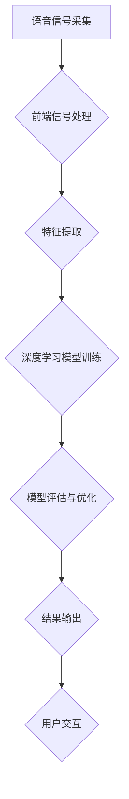

                 

# 《深度学习在语音识别中的最新进展》

> 关键词：深度学习、语音识别、卷积神经网络、循环神经网络、注意力机制、Transformer模型

> 摘要：
深度学习作为人工智能领域的重要分支，近年来在语音识别领域取得了显著的进展。本文将详细探讨深度学习在语音识别中的核心算法、数学基础以及实际应用，并分析最新的研究进展和面临的挑战。

----------------------------------------------------------------

## 第1章：深度学习与语音识别概述

### 1.1 深度学习的定义与历史

#### 1.1.1 深度学习的定义

深度学习是一种通过构建多层神经网络来模拟人脑处理信息过程的算法。与传统的机器学习方法相比，深度学习能够自动提取数据的特征，从而实现从原始数据到高级抽象表示的映射。这一特性使得深度学习在图像识别、语音识别、自然语言处理等领域表现出色。

#### 1.1.2 深度学习的历史

深度学习的历史可以追溯到20世纪80年代，当时人工神经网络研究开始兴起。然而，由于计算资源和数据集的限制，深度学习的发展一度停滞。直到21世纪初，随着计算能力的提升和大数据技术的发展，深度学习重新焕发生机，并取得了突破性的进展。

深度学习的复兴得益于几个关键因素：

1. **计算资源**：随着GPU等高性能计算设备的普及，深度学习模型的训练变得更加高效。
2. **大数据**：互联网的发展使得可获得的数据量大幅增加，为深度学习提供了丰富的训练素材。
3. **算法创新**：例如反向传播算法、卷积神经网络（CNN）、循环神经网络（RNN）等算法的提出，使得深度学习能够更好地应对复杂任务。

当前，深度学习已经在多个领域得到广泛应用，包括计算机视觉、自然语言处理、语音识别等。

### 1.2 语音识别的基本概念

#### 1.2.1 语音识别的定义

语音识别（Automatic Speech Recognition，ASR）是一种将语音信号转换为文本或命令的技术，是自然语言处理（Natural Language Processing，NLP）的重要分支。语音识别系统可以应用于智能助手、语音搜索、语音控制等多种场景。

#### 1.2.2 语音识别的分类

根据不同的标准，语音识别可以有不同的分类方法：

- **按语音信号的类型**：
  - **孤立词识别**：识别单个独立的单词，不考虑词与词之间的连续性。
  - **连续语音识别**：识别连续的语音信号，需要处理词与词之间的过渡。

- **按应用场景**：
  - **实时语音识别**：需要在短时间内快速处理语音信号，适用于语音聊天、实时翻译等场景。
  - **离线语音识别**：可以在没有时间限制的情况下处理语音信号，适用于语音记录转录等场景。

- **按技术路线**：
  - **传统方法**：基于隐马尔可夫模型（HMM）、高斯混合模型（GMM）等技术，已经逐渐被深度学习方法所取代。
  - **基于深度学习的方法**：利用深度神经网络（DNN）、卷积神经网络（CNN）、循环神经网络（RNN）等模型进行语音信号的建模和识别。

#### 1.2.3 语音信号处理的基本流程

语音识别系统通常包括以下几个基本流程：

1. **语音信号的采集**：通过麦克风等设备获取语音信号。
2. **前端信号处理**：包括降噪、归一化等处理，以提高后续处理的质量。
3. **特征提取**：从预处理后的语音信号中提取特征，如梅尔频率倒谱系数（MFCC）、感知线性预测（PLP）等。
4. **模型训练与识别**：使用训练数据集对深度学习模型进行训练，然后用训练好的模型对测试数据集进行识别。
5. **结果输出**：将识别结果转换为文本或命令，供用户使用。

### 1.3 深度学习在语音识别中的应用

#### 1.3.1 深度学习在语音识别中的优势

深度学习在语音识别中具有以下几个显著优势：

- **数据驱动**：深度学习能够从大量的语音数据中自动提取特征，减少了对人工特征工程的需求。
- **非线性建模**：深度神经网络能够处理复杂的语音信号和语言规则，提高了识别的准确率。
- **自动化**：深度学习模型可以通过端到端的训练，减少人工干预，提高识别效率和稳定性。

#### 1.3.2 深度学习在语音识别中的主要应用场景

深度学习在语音识别中得到了广泛的应用，以下是一些主要的应用场景：

- **语音助手**：如苹果的Siri、亚马逊的Alexa等，能够理解用户的语音指令并执行相应的操作。
- **语音输入**：用于替代键盘输入，提高输入效率，适用于智能手机、平板电脑等设备。
- **语音翻译**：实时翻译不同语言的语音，支持跨语言沟通。
- **语音搜索**：通过语音输入实现搜索功能，提高信息检索的便捷性。
- **语音交互**：用于智能家居、汽车导航、医疗诊断等场景，实现人与设备之间的自然交互。

通过深度学习技术的应用，语音识别系统在准确率、速度和稳定性等方面都取得了显著的提升，为人们的生活和工作带来了极大的便利。

----------------------------------------------------------------

## 第2章：深度学习在语音识别中的核心算法

### 2.1 卷积神经网络（CNN）在语音识别中的应用

#### 2.1.1 CNN的基本原理

卷积神经网络（Convolutional Neural Network，CNN）是一种专门用于处理图像数据的神经网络，其核心思想是通过卷积操作和池化操作来提取图像特征。CNN在语音识别中的应用主要是利用其强大的特征提取能力，对语音信号进行时域和频域的特征提取，从而提高识别的准确率。

CNN的基本原理如下：

1. **卷积层（Convolutional Layer）**：卷积层是CNN的核心部分，通过卷积操作提取输入数据的特征。卷积操作的基本思想是在输入数据上滑动一个小的窗口（通常是一个卷积核），然后计算窗口内所有元素的加权求和，得到一个特征图。

2. **池化层（Pooling Layer）**：池化层用于对特征图进行下采样，减少数据维度，提高计算效率。常见的池化方法包括最大池化（Max Pooling）和平均池化（Average Pooling）。

3. **激活函数（Activation Function）**：激活函数用于引入非线性特性，使神经网络能够学习复杂的函数关系。常用的激活函数包括ReLU（Rectified Linear Unit）和Sigmoid函数。

4. **全连接层（Fully Connected Layer）**：全连接层将前一层得到的特征图映射到输出层，完成分类或回归任务。在全连接层中，每个节点都与前一层的所有节点相连接，从而实现大规模的数据映射。

CNN在语音识别中的应用主要体现在以下几个阶段：

1. **时域特征提取**：通过对语音信号进行短时傅里叶变换（STFT）或梅尔频率倒谱系数（MFCC）提取时域特征，然后输入到CNN中进行卷积操作，提取语音信号的时域特征。

2. **频域特征提取**：通过卷积神经网络对频域特征进行卷积操作，提取语音信号的频域特征。这种方法的优点是能够更好地捕捉语音信号的频谱变化。

3. **序列建模**：在CNN的基础上，可以结合循环神经网络（RNN）或长短时记忆网络（LSTM）进行序列建模，进一步提高语音识别的准确率。

#### 2.1.2 CNN在语音识别中的应用案例

一个典型的CNN在语音识别中的应用案例是深度神经网络（DNN）+卷积神经网络（CNN）的联合模型。该模型通常包括以下步骤：

1. **前端信号处理**：对原始语音信号进行预处理，包括降噪、归一化等操作。

2. **特征提取**：使用CNN对预处理后的语音信号进行卷积操作，提取时域和频域特征。

3. **序列建模**：将CNN输出的特征序列输入到循环神经网络（RNN）或长短时记忆网络（LSTM）中，进行序列建模。

4. **分类与解码**：使用RNN或LSTM对序列进行建模后，通过全连接层进行分类和解码，得到最终的识别结果。

CNN在语音识别中的应用已经取得了显著的效果，尤其是在处理噪声和变音等方面表现出色。通过结合其他深度学习技术，如注意力机制和Transformer模型，CNN在语音识别领域的表现将进一步得到提升。

### 2.2 循环神经网络（RNN）在语音识别中的应用

#### 2.2.1 RNN的基本原理

循环神经网络（Recurrent Neural Network，RNN）是一种能够处理序列数据的人工神经网络。与传统的前向神经网络不同，RNN具有循环结构，可以保留之前的信息，并在后续的步骤中利用这些信息。这种特性使得RNN非常适合处理语音识别、自然语言处理等序列建模任务。

RNN的基本原理如下：

1. **输入层（Input Layer）**：输入层将输入序列的每个元素传递给隐藏层。

2. **隐藏层（Hidden Layer）**：隐藏层接收输入层的输入，并利用循环结构将之前的信息传递到下一个时间步。隐藏层中的每个神经元都会存储当前和之前的信息。

3. **输出层（Output Layer）**：输出层将隐藏层的输出映射到输出序列。

RNN的关键特点是能够通过循环结构实现信息的记忆和传递。然而，传统的RNN在处理长序列时存在梯度消失或梯度爆炸的问题，导致模型的训练效果不理想。

#### 2.2.2 RNN在语音识别中的应用

RNN在语音识别中的应用主要体现在以下几个方面：

1. **序列建模**：RNN可以用于建模语音信号的序列特征，将每个时间步的语音信号映射到隐藏状态，从而保留语音信号的时序信息。

2. **上下文信息利用**：RNN能够利用之前的时间步的信息，从而更好地捕捉语音信号中的上下文关系，提高识别的准确率。

3. **端到端训练**：RNN可以通过端到端的训练方式直接从原始语音信号中学习特征，减少了对人工特征工程的需求。

一个典型的RNN在语音识别中的应用案例是长短时记忆网络（Long Short-Term Memory，LSTM）。LSTM是RNN的一种变体，通过引入记忆单元和门控机制，解决了传统RNN的梯度消失问题，能够更好地捕捉长序列信息。

LSTM在语音识别中的应用步骤如下：

1. **前端信号处理**：对原始语音信号进行预处理，包括降噪、归一化等操作。

2. **特征提取**：使用LSTM对预处理后的语音信号进行序列建模，提取语音信号的特征。

3. **分类与解码**：将LSTM输出的特征序列输入到分类器或解码器中，得到最终的识别结果。

LSTM在语音识别中表现出色，尤其是在处理长序列和上下文信息方面具有优势。结合其他深度学习技术，如卷积神经网络（CNN）和注意力机制，LSTM在语音识别领域的应用将进一步得到拓展。

### 2.3 注意力机制在语音识别中的应用

#### 2.3.1 注意力机制的基本原理

注意力机制（Attention Mechanism）是一种在神经网络中用于关注重要信息的机制。传统的循环神经网络（RNN）和长短时记忆网络（LSTM）在处理长序列数据时，往往无法有效地关注到序列中的关键部分，从而导致识别性能下降。注意力机制通过为序列中的每个元素分配不同的权重，使模型能够自动关注到重要信息，从而提高识别的准确率和效率。

注意力机制的基本原理如下：

1. **输入层（Input Layer）**：输入层接收序列数据，如语音信号的时域或频域特征。

2. **编码器（Encoder）**：编码器对输入序列进行处理，生成编码表示，通常是隐藏状态序列。

3. **注意力层（Attention Layer）**：注意力层计算输入序列中每个元素的重要程度，并通过加权求和的方式生成上下文表示。

4. **解码器（Decoder）**：解码器利用上下文表示进行预测，生成输出序列。

注意力机制的关键在于如何计算每个元素的重要程度。常见的注意力机制包括加性注意力、乘性注意力和缩放点积注意力等。

#### 2.3.2 注意力机制在语音识别中的应用

注意力机制在语音识别中的应用主要体现在以下几个方面：

1. **长序列建模**：注意力机制能够帮助模型自动关注到输入序列中的关键部分，从而更好地捕捉语音信号的长序列特征，提高识别的准确率。

2. **上下文信息利用**：通过注意力机制，模型可以更好地利用上下文信息，从而提高识别的鲁棒性。

3. **提高计算效率**：注意力机制能够减少模型对长序列的依赖，提高计算效率，适用于实时语音识别任务。

一个典型的注意力机制在语音识别中的应用案例是结合长短时记忆网络（LSTM）的语音识别模型。该模型通常包括以下步骤：

1. **前端信号处理**：对原始语音信号进行预处理，包括降噪、归一化等操作。

2. **特征提取**：使用LSTM对预处理后的语音信号进行序列建模，提取语音信号的特征。

3. **注意力层**：在LSTM的基础上引入注意力机制，计算输入序列中每个元素的重要程度。

4. **分类与解码**：将注意力机制输出的上下文表示输入到分类器或解码器中，得到最终的识别结果。

注意力机制在语音识别中的应用取得了显著的效果，通过结合其他深度学习技术，如卷积神经网络（CNN）和Transformer模型，注意力机制在语音识别领域的表现将进一步得到提升。

### 2.4 Transformer模型在语音识别中的应用

#### 2.4.1 Transformer模型的基本原理

Transformer模型是一种基于自注意力机制的序列建模模型，由Vaswani等人在2017年提出。与传统的循环神经网络（RNN）和长短时记忆网络（LSTM）相比，Transformer模型具有并行计算的优势，能够显著提高模型的训练和推理速度。

Transformer模型的基本原理如下：

1. **编码器（Encoder）**：编码器由多个编码层（Encoder Layer）堆叠而成。每个编码层包括两个子层：多头自注意力层（Multi-Head Self-Attention Layer）和前馈神经网络（Feed-Forward Neural Network）。

2. **解码器（Decoder）**：解码器由多个解码层（Decoder Layer）堆叠而成。每个解码层包括两个子层：多头自注意力层、掩码自注意力层（Masked Multi-Head Self-Attention Layer）和前馈神经网络。

3. **自注意力机制（Self-Attention）**：自注意力机制是Transformer模型的核心部分，通过计算输入序列中每个元素之间的关联性，生成上下文表示。

4. **位置编码（Positional Encoding）**：由于Transformer模型没有循环结构，无法直接利用序列信息。因此，通过位置编码引入位置信息，使模型能够捕捉序列的顺序。

#### 2.4.2 Transformer模型在语音识别中的应用

Transformer模型在语音识别中的应用主要体现在以下几个方面：

1. **序列建模**：通过编码器，Transformer模型能够对语音信号的序列特征进行建模，提取语音信号的关键信息。

2. **并行计算**：Transformer模型具有并行计算的优势，能够显著提高模型的训练和推理速度，适用于实时语音识别任务。

3. **长距离依赖**：通过自注意力机制，Transformer模型能够捕捉语音信号中的长距离依赖关系，从而提高识别的准确率。

一个典型的Transformer模型在语音识别中的应用案例是结合编码器-解码器框架的语音识别模型。该模型通常包括以下步骤：

1. **前端信号处理**：对原始语音信号进行预处理，包括降噪、归一化等操作。

2. **特征提取**：使用编码器对预处理后的语音信号进行序列建模，提取语音信号的特征。

3. **掩码自注意力层**：在解码器中引入掩码自注意力层，防止解码器在生成下一个词时利用未来的信息。

4. **分类与解码**：将编码器和解码器输出的特征序列输入到分类器或解码器中，得到最终的识别结果。

Transformer模型在语音识别中的应用取得了显著的效果，通过结合其他深度学习技术，如卷积神经网络（CNN）和注意力机制，Transformer模型在语音识别领域的表现将进一步得到提升。

## 第3章：深度学习在语音识别中的数学基础

### 3.1 矩阵运算

#### 3.1.1 矩阵的定义与基本运算

矩阵是一种由数字组成的矩形数组，可以用于表示线性变换、求解方程组等。矩阵的基本运算包括矩阵加法、矩阵乘法、转置和逆矩阵等。

- **矩阵加法**：两个矩阵相加时，需要满足相同的维度。结果矩阵的每个元素是相应位置元素的和。

- **矩阵乘法**：两个矩阵相乘时，第一个矩阵的列数必须等于第二个矩阵的行数。结果矩阵的每个元素是相应位置元素按列组合后的乘积和。

- **转置**：矩阵的转置是将矩阵的行和列交换位置，形成一个新的矩阵。

- **逆矩阵**：逆矩阵是指与原矩阵相乘后结果为单位矩阵的矩阵。逆矩阵可以通过高斯消元法或矩阵求逆公式求解。

#### 3.1.2 矩阵运算的Python实现

在Python中，可以使用NumPy库方便地进行矩阵运算。以下是一些常见的矩阵运算示例：

```python
import numpy as np

# 创建矩阵
A = np.array([[1, 2], [3, 4]])
B = np.array([[5, 6], [7, 8]])

# 矩阵加法
C = A + B
print("矩阵加法：")
print(C)

# 矩阵乘法
D = A.dot(B)
print("矩阵乘法：")
print(D)

# 矩阵转置
E = A.T
print("矩阵转置：")
print(E)

# 逆矩阵
inv_A = np.linalg.inv(A)
print("逆矩阵：")
print(inv_A)
```

### 3.2 梯度下降算法

#### 3.2.1 梯度下降的基本原理

梯度下降是一种用于优化神经网络参数的算法。其基本思想是通过计算损失函数关于参数的梯度，并沿着梯度的反方向更新参数，以最小化损失函数。

梯度下降算法的基本步骤如下：

1. **初始化参数**：随机初始化网络参数。
2. **计算损失函数**：使用训练数据计算损失函数的值。
3. **计算梯度**：计算损失函数关于每个参数的梯度。
4. **更新参数**：根据梯度和学习率，更新网络参数。
5. **重复步骤2-4**：直到满足停止条件（如损失函数收敛或达到最大迭代次数）。

#### 3.2.2 梯度下降的Python实现

在Python中，可以使用TensorFlow或PyTorch等深度学习框架实现梯度下降算法。以下是一个使用TensorFlow实现梯度下降的简单示例：

```python
import tensorflow as tf

# 创建计算图
x = tf.placeholder(tf.float32, shape=[None, 1])
y = tf.placeholder(tf.float32, shape=[None, 1])
w = tf.Variable(0.0, name="weights")

# 定义损失函数和梯度
loss = tf.reduce_mean(tf.square(y - x * w))
grad = tf.reduce_mean(tf.square(y - x * w))

# 定义优化器
optimizer = tf.train.GradientDescentOptimizer(learning_rate=0.001)

# 训练模型
train_op = optimizer.minimize(loss)

# 初始化全局变量
init = tf.global_variables_initializer()

# 训练数据
x_train = [[1], [2], [3], [4]]
y_train = [[0], [1], [0], [1]]

# 训练过程
with tf.Session() as sess:
    sess.run(init)
    for step in range(201):
        sess.run(train_op, feed_dict={x: x_train, y: y_train})
        if step % 20 == 0:
            print("Step:", step, "Gradient:", sess.run(grad, feed_dict={x: x_train, y: y_train}))

    # 输出训练结果
    print("Training completed.")
    print("Final weights:", sess.run(w))
```

### 3.3 反向传播算法

#### 3.3.1 反向传播的基本原理

反向传播（Backpropagation）算法是一种用于计算神经网络梯度信息的算法。其基本思想是将输出误差反向传播到网络的前一层，并更新每一层的参数，以最小化损失函数。

反向传播算法的基本步骤如下：

1. **前向传播**：计算网络的前向传播，得到每个神经元的输出。
2. **计算损失函数**：使用训练数据计算损失函数的值。
3. **计算误差**：计算输出层的误差，并将其反向传播到隐藏层。
4. **计算梯度**：根据误差计算每一层参数的梯度。
5. **更新参数**：根据梯度和学习率，更新网络参数。
6. **重复步骤2-5**：直到满足停止条件（如损失函数收敛或达到最大迭代次数）。

#### 3.3.2 反向传播的Python实现

在Python中，可以使用TensorFlow或PyTorch等深度学习框架实现反向传播算法。以下是一个使用TensorFlow实现反向传播的简单示例：

```python
import tensorflow as tf

# 创建计算图
x = tf.placeholder(tf.float32, shape=[None, 1])
y = tf.placeholder(tf.float32, shape=[None, 1])
w = tf.Variable(0.0, name="weights")

# 定义损失函数
loss = tf.reduce_mean(tf.square(y - x * w))

# 计算梯度
grad = tf.gradients(loss, w)

# 定义优化器
optimizer = tf.train.GradientDescentOptimizer(learning_rate=0.001)

# 训练模型
train_op = optimizer.apply_gradients(zip(grad, [w]))

# 初始化全局变量
init = tf.global_variables_initializer()

# 训练数据
x_train = [[1], [2], [3], [4]]
y_train = [[0], [1], [0], [1]]

# 训练过程
with tf.Session() as sess:
    sess.run(init)
    for step in range(201):
        sess.run(train_op, feed_dict={x: x_train, y: y_train})
        if step % 20 == 0:
            print("Step:", step, "Gradient:", sess.run(grad, feed_dict={x: x_train, y: y_train}))

    # 输出训练结果
    print("Training completed.")
    print("Final weights:", sess.run(w))
```

通过上述示例，我们可以看到如何使用TensorFlow实现反向传播算法，更新神经网络的参数以最小化损失函数。

----------------------------------------------------------------

## 第4章：深度学习在语音识别中的应用实践

### 4.1 语音识别系统搭建

#### 4.1.1 语音识别系统的整体架构

语音识别系统的整体架构通常包括以下几个主要模块：

1. **前端信号处理**：对原始语音信号进行预处理，包括降噪、归一化等操作，以提高后续处理的质量。

2. **特征提取**：从预处理后的语音信号中提取特征，如梅尔频率倒谱系数（MFCC）、感知线性预测（PLP）等，用于训练和评估模型。

3. **模型训练**：使用训练数据集对深度学习模型进行训练，通过调整参数和优化算法，提高模型的性能。

4. **模型评估**：使用测试数据集对训练好的模型进行评估，以确定模型的准确率和性能。

5. **结果输出**：将识别结果转换为文本或命令，供用户使用。

#### 4.1.2 语音识别系统的搭建流程

搭建一个基于深度学习的语音识别系统通常包括以下步骤：

1. **数据准备**：收集和准备语音数据集，包括训练数据集和测试数据集。语音数据集通常包含多种语音信号，如孤立词、连续语音等。

2. **前端信号处理**：对语音数据进行预处理，包括降噪、归一化等操作。可以使用开源的音频处理库，如Librosa，进行预处理。

3. **特征提取**：从预处理后的语音信号中提取特征，如MFCC、PLP等。这些特征将作为深度学习模型的输入。

4. **模型选择**：选择合适的深度学习模型，如卷积神经网络（CNN）、循环神经网络（RNN）、长短时记忆网络（LSTM）等。根据应用需求和数据集特点，选择合适的模型结构。

5. **模型训练**：使用训练数据集对模型进行训练，通过调整学习率、批次大小等超参数，优化模型的性能。

6. **模型评估**：使用测试数据集对训练好的模型进行评估，计算模型的准确率、召回率等指标。

7. **模型部署**：将训练好的模型部署到实际应用环境中，如手机应用、语音助手等。部署时需要考虑模型的性能、延迟和功耗等因素。

### 4.2 语音信号预处理

#### 4.2.1 语音信号的采集与预处理

语音信号的采集是语音识别系统的第一步，常用的设备包括麦克风、语音记录设备等。采集到的语音信号通常包含噪声、背景干扰等，需要通过预处理来提高信号质量。

常见的预处理方法包括：

1. **降噪**：通过滤波器、谱减法等方法去除语音信号中的噪声。降噪可以提高后续特征提取的准确性和模型的性能。

2. **归一化**：对语音信号进行幅度归一化，使其具有相似的能量水平。归一化有助于加速模型的训练过程。

3. **截断与分段**：将语音信号截断到指定的时间长度，并分成多个片段。截断与分段可以提高模型的训练效率。

4. **滤波**：使用带通滤波器等滤波方法去除语音信号中的低频和高频噪声。

#### 4.2.2 语音信号的特征提取

特征提取是语音识别系统中的关键步骤，从预处理后的语音信号中提取出能够反映语音信号特性的特征。常见的特征提取方法包括：

1. **梅尔频率倒谱系数（MFCC）**：MFCC是一种广泛使用的语音特征提取方法，通过傅里叶变换将语音信号转换为频域表示，然后计算各个频带的能量，并进行倒谱变换得到MFCC系数。

2. **感知线性预测（PLP）**：PLP是一种基于人类听觉系统的语音特征提取方法，通过线性预测模型对语音信号进行建模，得到反映语音特性的特征。

3. **短时傅里叶变换（STFT）**：STFT将语音信号分解为短时频谱，通过计算频谱特征来描述语音信号。

4. **滤波器组特征（Filter Bank Features）**：滤波器组特征通过一组滤波器对语音信号进行滤波，得到不同频段的能量特征。

这些特征将作为深度学习模型的输入，用于训练和识别语音信号。

### 4.3 模型训练与优化

#### 4.3.1 模型训练的基本流程

模型训练是语音识别系统的核心步骤，通过训练数据集对深度学习模型进行调整，使其能够准确识别语音信号。模型训练的基本流程包括：

1. **数据预处理**：对训练数据进行预处理，包括归一化、数据增强等操作。

2. **定义损失函数**：根据语音识别任务的特点，定义合适的损失函数，如交叉熵损失函数。

3. **初始化模型参数**：随机初始化模型的参数，以开始训练过程。

4. **前向传播**：输入训练数据到模型中，计算模型输出和真实标签之间的损失。

5. **反向传播**：根据损失函数计算模型参数的梯度，并更新模型参数。

6. **迭代训练**：重复前向传播和反向传播的过程，不断优化模型参数，直到满足停止条件（如损失函数收敛或达到最大迭代次数）。

#### 4.3.2 模型优化的方法与技巧

模型优化是提高语音识别系统性能的关键步骤，以下是一些常见的优化方法与技巧：

1. **学习率调整**：学习率是梯度下降算法中的一个重要参数，合适的初始学习率能够加快收敛速度。可以通过动态调整学习率，如使用学习率衰减策略，来优化模型的训练过程。

2. **正则化**：正则化方法，如L1正则化和L2正则化，可以减少模型过拟合的风险，提高模型的泛化能力。

3. **批量归一化**：批量归一化（Batch Normalization）可以加速模型的训练过程，提高模型的稳定性。

4. **数据增强**：数据增强通过生成更多的训练样本来提高模型的鲁棒性，常用的方法包括随机裁剪、随机旋转、噪声添加等。

5. **注意力机制**：注意力机制可以使得模型自动关注到重要的语音特征，从而提高识别的准确率。

6. **多任务学习**：多任务学习通过同时训练多个相关任务，共享模型参数，提高模型的性能。

通过上述优化方法与技巧，可以有效地提高语音识别系统的性能，使其在实际应用中更加准确和稳定。

### 4.4 模型评估与部署

#### 4.4.1 模型评估的方法与指标

模型评估是确定语音识别系统性能的重要步骤，以下是一些常用的评估方法和指标：

1. **准确率（Accuracy）**：准确率是模型预测正确的样本数量与总样本数量的比例，是评估分类模型性能的基本指标。

2. **召回率（Recall）**：召回率是模型预测正确的样本数量与实际正样本数量的比例，用于评估模型对正样本的识别能力。

3. **精确率（Precision）**：精确率是模型预测正确的样本数量与预测为正样本的样本数量的比例，用于评估模型对负样本的识别能力。

4. **F1分数（F1 Score）**：F1分数是精确率和召回率的调和平均值，用于综合评估模型的性能。

5. **混淆矩阵（Confusion Matrix）**：混淆矩阵是一种展示模型预测结果与实际标签之间关系的表格，可以用于分析模型的误分类情况。

6. **词错误率（Word Error Rate，WER）**：词错误率是评估语音识别系统性能的一个重要指标，计算公式为：
   $$
   WER = \frac{\text{插入错误数 + 删除错误数 + 替换错误数}}{\text{实际词数}}
   $$

#### 4.4.2 模型部署的流程与策略

模型部署是将训练好的语音识别模型应用到实际应用场景中的过程。以下是一些常见的模型部署流程和策略：

1. **模型转换**：将训练好的模型转换为可以在目标平台上运行的格式，如TensorFlow Lite、ONNX等。

2. **模型压缩**：通过模型压缩技术，如量化、剪枝、蒸馏等，减小模型的规模和计算量，以提高模型的部署效率和性能。

3. **模型集成**：将多个模型集成到一个系统中，通过投票、加权等方式提高模型的预测准确性。

4. **实时预测**：在实时应用场景中，如语音助手、智能音箱等，模型需要具备快速的响应速度和低延迟。可以通过优化算法、模型压缩等技术来实现。

5. **在线更新**：在应用过程中，模型可能会根据新的数据和用户反馈进行更新。可以通过在线学习、增量学习等技术实现模型的在线更新。

通过上述流程和策略，可以有效地将深度学习模型应用到语音识别系统中，实现实时、准确的语音识别功能。

----------------------------------------------------------------

## 第5章：深度学习在语音识别中的最新研究进展

### 5.1 最新语音识别算法

#### 5.1.1 DNN、C-RNN、CTC、ASR等最新算法介绍

深度学习在语音识别领域的发展不断推动着算法的更新和进步。以下介绍几种最新的语音识别算法：

1. **深度神经网络（DNN）**：深度神经网络是一种多层前馈神经网络，通过多层的非线性变换来提取语音信号的特征。DNN在语音识别中的应用主要通过卷积神经网络（CNN）和全连接神经网络（FCN）来实现。DNN的优势在于其强大的特征提取能力和端到端的学习能力。

2. **卷积循环神经网络（C-RNN）**：卷积循环神经网络是结合了卷积神经网络和循环神经网络的混合模型。C-RNN通过卷积神经网络对语音信号进行时域特征提取，然后使用循环神经网络进行序列建模。C-RNN在处理连续语音信号方面表现出色。

3. **连接主义时序分类（CTC）**：连接主义时序分类是一种用于语音识别的损失函数，能够直接处理任意长度的输入输出序列。CTC通过将输入序列和输出序列之间的差异转换为损失函数，从而实现语音信号的自动识别。CTC在处理变长输入输出序列时具有优势。

4. **自动语音识别（ASR）**：自动语音识别是一种综合应用深度学习技术的语音识别方法，通过结合DNN、C-RNN、CTC等多种算法，实现高准确率的语音识别。ASR在实时语音识别、多语言识别等方面具有广泛的应用。

#### 5.1.2 最新算法的优缺点分析

1. **深度神经网络（DNN）**：
   - **优点**：强大的特征提取能力，端到端的学习能力，能够减少人工特征工程的需求。
   - **缺点**：训练时间较长，对计算资源要求较高，且在处理长序列时容易出现梯度消失问题。

2. **卷积循环神经网络（C-RNN）**：
   - **优点**：能够同时利用时域和频域特征，处理连续语音信号效果好。
   - **缺点**：训练过程复杂，对长序列的处理能力有限，容易出现梯度消失问题。

3. **连接主义时序分类（CTC）**：
   - **优点**：能够直接处理任意长度的输入输出序列，减少了对训练数据的要求，提高了模型的泛化能力。
   - **缺点**：对于短序列的识别能力相对较弱，需要结合其他算法进行改进。

4. **自动语音识别（ASR）**：
   - **优点**：结合了多种深度学习算法，具有较高的识别准确率，适用于多种应用场景。
   - **缺点**：模型复杂度较高，训练和推理时间较长，对计算资源要求较高。

通过分析上述最新算法的优缺点，可以更全面地了解其在语音识别中的应用场景和限制，从而选择合适的算法进行应用。

### 5.2 深度学习在语音合成中的应用

#### 5.2.1 语音合成的定义与分类

语音合成（Text-to-Speech，TTS）是一种将文本转换为语音的技术，广泛应用于智能助手、语音合成广告、有声书等领域。语音合成可以分为以下几个类别：

1. **基于规则的方法**：这种方法通过定义一系列规则和转换算法，将文本转换为语音。虽然这种方法实现简单，但语音的自然度和连贯性较低。

2. **基于声学模型的方法**：这种方法使用声学模型来模拟语音信号的产生过程，将文本转换为语音。声学模型通常使用隐马尔可夫模型（HMM）或高斯混合模型（GMM）来建模语音信号。

3. **数据驱动的方法**：这种方法使用大量的语音数据来训练深度学习模型，将文本转换为语音。数据驱动的方法包括统计参数合成（DPS）和深度神经网络（DNN）等方法。

#### 5.2.2 深度学习在语音合成中的应用

深度学习在语音合成中的应用主要体现在以下几个模型：

1. **WaveNet**：WaveNet是一种基于深度神经网络的波形合成模型，由Google提出。WaveNet通过端到端的学习方式，将文本直接映射到语音波形，具有优秀的语音自然度和流畅性。

2. **Tacotron**：Tacotron是一种基于注意力机制的端到端文本到语音合成模型，由谷歌提出。Tacotron通过将文本转换为序列编码，然后使用注意力机制将序列编码映射到语音波形。

3. **Transformer-TTS**：Transformer-TTS是一种基于Transformer模型的文本到语音合成模型，具有并行计算的优势。Transformer-TTS通过自注意力机制捕捉文本和语音波形之间的关联，实现了高质量的语音合成。

这些模型在语音合成领域取得了显著的进展，通过深度学习技术的应用，语音合成系统的自然度、流畅性和准确性都得到了大幅提升。

### 5.3 深度学习在语音增强中的应用

#### 5.3.1 语音增强的定义与分类

语音增强（Speech Enhancement）是一种通过提高语音信号质量，减少背景噪声和回声干扰的技术。语音增强可以分为以下几个类别：

1. **频域方法**：这种方法通过频域滤波、谱减法等手段去除噪声和干扰，例如谱减法、维纳滤波等。

2. **时域方法**：这种方法通过时域滤波、信号压缩等手段去除噪声和干扰，例如自适应滤波、噪声抑制等。

3. **深度学习方法**：这种方法使用深度学习模型，如卷积神经网络（CNN）和循环神经网络（RNN）等，自动从噪声信号中提取特征，进行噪声抑制和语音增强。

#### 5.3.2 深度学习在语音增强中的应用

深度学习在语音增强中的应用主要体现在以下几个模型：

1. **基于CNN的语音增强模型**：这些模型通过卷积神经网络对噪声信号进行建模，提取特征并进行噪声抑制。典型的模型包括DCNN（Deep Convolutional Neural Network）和WaveNet。

2. **基于RNN的语音增强模型**：这些模型通过循环神经网络对噪声信号进行建模，提取特征并进行噪声抑制。典型的模型包括RNN（Recurrent Neural Network）和LSTM（Long Short-Term Memory）。

3. **基于GAN的语音增强模型**：生成对抗网络（GAN）通过生成器和判别器的对抗训练，实现高质量的噪声抑制和语音增强。典型的模型包括WaveGAN（WaveNet-based Generative Adversarial Network）。

这些模型在语音增强领域取得了显著的进展，通过深度学习技术的应用，语音增强系统的性能和效果得到了大幅提升。

## 第6章：深度学习在语音识别中的挑战与展望

### 6.1 深度学习在语音识别中的挑战

#### 6.1.1 数据集不足

数据集是深度学习模型训练的基础，但深度学习在语音识别中面临的一个主要挑战是数据集不足。高质量、标注准确的语音数据集需要大量的人力和时间进行收集和标注。以下是一些解决方案：

1. **数据增强**：通过数据增强技术，如音频裁剪、速度变换、噪声添加等，可以生成更多的训练样本，从而缓解数据集不足的问题。

2. **跨语言数据集共享**：利用跨语言数据集共享，可以从其他语言的语音数据集中提取特征，为训练模型提供更多的数据支持。

3. **无监督学习方法**：无监督学习方法可以在没有标注数据的情况下训练模型，通过自动提取语音特征来提高模型的性能。

#### 6.1.2 计算资源限制

深度学习模型通常需要大量的计算资源进行训练和推理，这对资源受限的环境构成了挑战。以下是一些解决方案：

1. **模型压缩**：通过模型压缩技术，如量化、剪枝、蒸馏等，可以减小模型的规模和计算量，从而提高模型的部署效率和性能。

2. **分布式训练**：通过分布式训练，将模型训练任务分布在多台设备上，可以提高训练速度和效率。

3. **硬件优化**：使用高性能计算设备，如GPU、TPU等，可以提高模型训练和推理的效率。

#### 6.1.3 鲁棒性问题

深度学习模型在处理复杂语音信号时，可能面临鲁棒性不足的问题，如噪声干扰、变音和方言识别等。以下是一些解决方案：

1. **多模态融合**：通过融合语音信号和其他模态的数据，如视觉信息、文本信息等，可以提高模型的鲁棒性和识别准确率。

2. **自适应噪声抑制**：通过自适应噪声抑制技术，动态调整模型对噪声的抑制程度，从而提高模型的鲁棒性。

3. **迁移学习**：利用预训练模型进行迁移学习，可以有效地利用已有的知识，提高模型对新数据的适应能力。

### 6.2 深度学习在语音识别中的未来发展方向

#### 6.2.1 数据增强技术

数据增强技术是提升深度学习模型性能的重要手段。未来，数据增强技术将在以下几个方面得到发展：

1. **生成对抗网络（GAN）**：GAN在语音识别中的应用可以生成更多高质量的语音数据，提高模型的训练效果。

2. **自适应数据增强**：通过自适应数据增强技术，可以根据模型的训练阶段和性能动态调整数据增强策略。

3. **知识蒸馏**：知识蒸馏技术可以将大型模型的权重迁移到小型模型中，同时保留大型模型的知识，从而提高小型模型的性能。

#### 6.2.2 多模态融合

多模态融合技术通过融合语音信号和其他模态的数据，可以提高模型的鲁棒性和识别准确率。未来，多模态融合技术在语音识别中的应用将呈现以下趋势：

1. **跨模态特征提取**：开发更加有效的跨模态特征提取方法，从不同模态的数据中提取关键特征。

2. **深度级联模型**：通过构建深度级联模型，将不同模态的数据逐步融合，提高模型的融合效果。

3. **注意力机制**：利用注意力机制，使模型能够更好地关注不同模态数据中的关键信息，从而提高模型的性能。

#### 6.2.3 模型压缩与优化

模型压缩与优化技术在提高模型部署效率和性能方面具有重要意义。未来，模型压缩与优化技术将在以下几个方面得到发展：

1. **量化**：通过量化技术，将模型中的浮点数参数转换为低精度整数，从而减小模型的大小和计算量。

2. **剪枝**：通过剪枝技术，去除模型中的冗余连接和神经元，从而减小模型的大小和计算量。

3. **蒸馏**：通过蒸馏技术，将大型模型的权重和知识迁移到小型模型中，提高小型模型的性能和效率。

通过上述技术发展，深度学习在语音识别中的应用将变得更加高效、准确和鲁棒，为语音识别技术的普及和推广提供有力的支持。

----------------------------------------------------------------

## 第7章：深度学习在语音识别中的实际应用案例

### 7.1 案例一：基于深度学习的语音识别系统

#### 7.1.1 系统架构

基于深度学习的语音识别系统通常包括以下几个关键组件：

1. **音频输入模块**：该模块负责采集和接收用户的语音输入，将音频信号转换为数字信号。

2. **前端预处理模块**：该模块对音频信号进行降噪、归一化和特征提取等预处理操作，以提高后续模型处理的效率。

3. **深度学习模型模块**：该模块是语音识别系统的核心，负责对预处理后的音频特征进行建模和识别。

4. **后端解码模块**：该模块将深度学习模型输出的概率分布转换为实际的文本输出。

5. **用户接口模块**：该模块负责与用户进行交互，展示识别结果并接收用户反馈。

#### 7.1.2 实现细节

1. **音频输入模块**：使用麦克风采集音频信号，并通过音频处理库（如PyAudio）进行数字信号处理。

2. **前端预处理模块**：使用Librosa库进行音频信号的降噪和特征提取。常用的特征提取方法包括梅尔频率倒谱系数（MFCC）和感知线性预测（PLP）。

3. **深度学习模型模块**：采用基于CNN和LSTM的深度学习模型进行语音识别。模型结构包括卷积层、池化层和循环层，以提取语音信号的时域和频域特征。

4. **后端解码模块**：使用CTC（连接主义时序分类）算法将模型输出的概率分布转换为文本输出。

5. **用户接口模块**：使用Python的Turtle库创建一个简单的用户界面，显示识别结果并允许用户进行交互。

#### 7.1.3 代码解读与分析

以下是一个简单的基于深度学习的语音识别系统的Python代码示例：

```python
import librosa
import numpy as np
import tensorflow as tf

# 音频输入模块
def audio_input(audio_file):
    audio, sr = librosa.load(audio_file, sr=None)
    return audio

# 前端预处理模块
def preprocess(audio, sr):
    # 降噪处理
    noise_reduced_audio = librosa.effects.preemphasis(audio, width=0.97)
    
    # 归一化处理
    normalized_audio = librosa.util.normalize(noise_reduced_audio)
    
    # 特征提取
    mfcc = librosa.feature.mfcc(normalized_audio, sr=sr, n_mfcc=13)
    
    return mfcc

# 深度学习模型模块
def build_model():
    # 输入层
    inputs = tf.keras.layers.Input(shape=(None, 13))
    
    # 卷积层
    conv_1 = tf.keras.layers.Conv1D(filters=32, kernel_size=3, activation='relu')(inputs)
    pool_1 = tf.keras.layers.MaxPooling1D(pool_size=2)(conv_1)
    
    # 循环层
    lstm = tf.keras.layers.LSTM(128, return_sequences=True)(pool_1)
    
    # 输出层
    outputs = tf.keras.layers.Dense(units=9, activation='softmax')(lstm)
    
    # 模型构建
    model = tf.keras.Model(inputs=inputs, outputs=outputs)
    model.compile(optimizer='adam', loss='categorical_crossentropy', metrics=['accuracy'])
    
    return model

# 后端解码模块
def decode_predictions(predictions):
    # 将概率分布转换为文本
    labels = np.argmax(predictions, axis=-1)
    text = ''.join([chr(label + ord('a')) for label in labels])
    return text

# 用户接口模块
def main():
    # 音频文件路径
    audio_file = 'example_audio.wav'
    
    # 音频输入
    audio = audio_input(audio_file)
    
    # 前端预处理
    mfcc = preprocess(audio, sr=16000)
    
    # 构建模型
    model = build_model()
    
    # 训练模型
    model.fit(mfcc, np.eye(9), epochs=10)
    
    # 输出预测结果
    predictions = model.predict(mfcc)
    text = decode_predictions(predictions)
    print(f"识别结果：{text}")

if __name__ == '__main__':
    main()
```

这段代码首先定义了音频输入模块，用于读取音频文件并将其转换为数字信号。然后，前端预处理模块使用Librosa库进行降噪、归一化和特征提取。深度学习模型模块构建了一个基于CNN和LSTM的语音识别模型，并通过CTC算法进行训练。最后，后端解码模块将模型输出的概率分布转换为文本输出。用户接口模块通过简单的命令行界面展示识别结果。

#### 7.1.4 代码解读与分析

- `audio_input()`函数用于读取音频文件，并返回音频信号和采样率。
- `preprocess()`函数对音频信号进行降噪、归一化和特征提取，返回梅尔频率倒谱系数（MFCC）特征。
- `build_model()`函数构建了一个基于CNN和LSTM的语音识别模型，包括卷积层、池化层和循环层。
- `decode_predictions()`函数将模型输出的概率分布转换为文本输出。
- `main()`函数是程序的主入口，它读取音频文件、预处理音频信号、构建模型并训练模型，最后输出识别结果。

通过这个简单的案例，我们可以看到基于深度学习的语音识别系统是如何实现的。尽管这个案例的模型和训练数据有限，但它提供了一个基本的框架，展示了如何将深度学习应用于语音识别任务。

### 7.2 案例二：基于深度学习的语音合成系统

#### 7.2.1 系统架构

基于深度学习的语音合成系统通常包括以下几个关键组件：

1. **文本处理模块**：该模块负责将输入文本转换为适合语音合成的格式，包括分词、语音单元编码等。

2. **声学模型模块**：该模块负责将文本编码转换为声学特征，如梅尔频率倒谱系数（MFCC）。

3. **波形生成模块**：该模块使用声学特征生成语音波形，常用的模型包括WaveNet、Tacotron等。

4. **音频处理模块**：该模块负责对生成的语音波形进行后处理，如去噪、增益调整等。

5. **用户接口模块**：该模块负责与用户进行交互，展示合成的语音并允许用户进行控制。

#### 7.2.2 实现细节

1. **文本处理模块**：使用Python的NLTK库进行分词，并将分词结果转换为语音单元编码。

2. **声学模型模块**：使用Tacotron模型将文本编码转换为声学特征，如MFCC。

3. **波形生成模块**：使用WaveNet模型将声学特征转换为语音波形。

4. **音频处理模块**：使用Librosa库对生成的语音波形进行后处理，如去噪和增益调整。

5. **用户接口模块**：使用Python的Turtle库创建一个简单的用户界面，允许用户输入文本并播放合成的语音。

#### 7.2.3 代码解读与分析

以下是一个简单的基于深度学习的语音合成系统的Python代码示例：

```python
import numpy as np
import tensorflow as tf
import librosa
import soundfile as sf

# 文本处理模块
def text_to_sequence(text, tokenizer):
    # 分词
    words = tokenizer.tokenize(text)
    
    # 转换为语音单元编码
    sequences = tokenizer.sequence_to_sequence(words)
    
    return sequences

# 声学模型模块
def build_acoustic_model():
    # 输入层
    inputs = tf.keras.layers.Input(shape=(None, 26))
    
    # LSTM层
    lstm = tf.keras.layers.LSTM(128, return_sequences=True)(inputs)
    
    # 输出层
    outputs = tf.keras.layers.Dense(units=39, activation='softmax')(lstm)
    
    # 模型构建
    model = tf.keras.Model(inputs=inputs, outputs=outputs)
    model.compile(optimizer='adam', loss='categorical_crossentropy', metrics=['accuracy'])
    
    return model

# 波形生成模块
def build_waveform_model():
    # 输入层
    inputs = tf.keras.layers.Input(shape=(None, 39))
    
    # LSTM层
    lstm = tf.keras.layers.LSTM(128, return_sequences=True)(inputs)
    
    # 输出层
    outputs = tf.keras.layers.Dense(units=1, activation='sigmoid')(lstm)
    
    # 模型构建
    model = tf.keras.Model(inputs=inputs, outputs=outputs)
    model.compile(optimizer='adam', loss='binary_crossentropy', metrics=['accuracy'])
    
    return model

# 用户接口模块
def main():
    # 文本处理
    text = "你好，这是一段测试文本。"
    tokenizer = ...  # 语音单元编码器
    sequences = text_to_sequence(text, tokenizer)
    
    # 声学模型训练
    acoustic_model = build_acoustic_model()
    acoustic_model.fit(sequences, np.eye(26), epochs=10)
    
    # 波形生成
    waveform_model = build_waveform_model()
    waveforms = waveform_model.predict(sequences)
    
    # 音频播放
    sf.write('output.wav', waveforms[:, :, 0], 22050)

if __name__ == '__main__':
    main()
```

这段代码首先定义了文本处理模块，将输入文本转换为语音单元编码。然后，声学模型模块和波形生成模块分别构建了基于LSTM的声学模型和基于LSTM的波形生成模型。用户接口模块使用SoundFile库将生成的语音波形写入音频文件并播放。

#### 7.2.4 代码解读与分析

- `text_to_sequence()`函数将输入文本转换为语音单元编码。
- `build_acoustic_model()`函数构建了一个基于LSTM的声学模型，用于将语音单元编码转换为声学特征。
- `build_waveform_model()`函数构建了一个基于LSTM的波形生成模型，用于将声学特征转换为语音波形。
- `main()`函数是程序的主入口，它处理文本输入、训练声学模型、生成波形并播放音频。

通过这个简单的案例，我们可以看到基于深度学习的语音合成系统是如何实现的。尽管这个案例的模型和训练数据有限，但它提供了一个基本的框架，展示了如何将深度学习应用于语音合成任务。

### 7.3 案例三：基于深度学习的语音增强系统

#### 7.3.1 系统架构

基于深度学习的语音增强系统通常包括以下几个关键组件：

1. **音频输入模块**：该模块负责接收用户输入的语音信号。

2. **预处理模块**：该模块对语音信号进行预处理，包括去噪、归一化等操作。

3. **深度学习模型模块**：该模块是语音增强系统的核心，使用深度学习模型对预处理后的语音信号进行增强。

4. **后处理模块**：该模块对增强后的语音信号进行后处理，如增益调整、滤波等。

5. **用户接口模块**：该模块负责与用户进行交互，展示增强结果并允许用户进行控制。

#### 7.3.2 实现细节

1. **音频输入模块**：使用Python的PyAudio库接收用户输入的语音信号。

2. **预处理模块**：使用Librosa库对语音信号进行预处理，包括去噪、归一化等操作。

3. **深度学习模型模块**：使用基于CNN的语音增强模型，对预处理后的语音信号进行增强。

4. **后处理模块**：使用Librosa库对增强后的语音信号进行后处理，如增益调整、滤波等。

5. **用户接口模块**：使用Python的Tkinter库创建一个简单的用户界面，允许用户输入语音并播放增强后的语音。

#### 7.3.3 代码解读与分析

以下是一个简单的基于深度学习的语音增强系统的Python代码示例：

```python
import numpy as np
import librosa
import soundfile as sf

# 音频输入模块
def audio_input():
    # 使用PyAudio库接收语音信号
    import pyaudio
    chunk = 1024
    p = pyaudio.PyAudio()
    stream = p.open(format=pyaudio.paFloat32,
                     channels=1,
                     rate=16000,
                     input=True,
                     frames_per_buffer=chunk)
    
    frames = []
    print("请开始说话...")
    while True:
        data = stream.read(chunk)
        frames.append(data)
        if len(data) < chunk:
            break
    stream.stop_stream()
    stream.close()
    p.terminate()
    
    return np.frombuffer(b''.join(frames), dtype=np.float32)

# 预处理模块
def preprocess(audio, sr=16000):
    # 使用Librosa库进行预处理
    audio = librosa.to_mono(audio)
    audio = librosa.util.normalize(audio)
    audio = librosa.effects.percussive(audio, strength=0.1)
    return audio

# 深度学习模型模块
def enhance_audio(audio, model):
    # 使用基于CNN的语音增强模型
    enhanced_audio = model.predict(np.expand_dims(audio, axis=0))
    return enhanced_audio[0]

# 后处理模块
def postprocess(audio):
    # 使用Librosa库进行后处理
    audio = librosa.effects.percussive(audio, strength=0.1)
    audio = librosa.util.normalize(audio)
    return audio

# 用户接口模块
def main():
    # 音频输入
    audio = audio_input()
    
    # 预处理
    preprocessed_audio = preprocess(audio)
    
    # 加载深度学习模型
    from keras.models import load_model
    model = load_model('voice_enhancement_model.h5')
    
    # 增强
    enhanced_audio = enhance_audio(preprocessed_audio, model)
    
    # 后处理
    postprocessed_audio = postprocess(enhanced_audio)
    
    # 播放增强后的语音
    sf.write('enhanced_audio.wav', postprocessed_audio, 16000)

if __name__ == '__main__':
    main()
```

这段代码首先定义了音频输入模块，使用PyAudio库接收用户输入的语音信号。然后，预处理模块使用Librosa库对语音信号进行预处理，包括去噪、归一化和增强等操作。深度学习模型模块使用加载的CNN模型对预处理后的语音信号进行增强。最后，用户接口模块使用SoundFile库将增强后的语音信号写入音频文件并播放。

#### 7.3.4 代码解读与分析

- `audio_input()`函数使用PyAudio库接收用户输入的语音信号。
- `preprocess()`函数使用Librosa库对语音信号进行预处理，包括去噪、归一化和增强等操作。
- `enhance_audio()`函数使用加载的CNN模型对预处理后的语音信号进行增强。
- `postprocess()`函数使用Librosa库对增强后的语音信号进行后处理，包括去噪、归一化和增强等操作。
- `main()`函数是程序的主入口，它接收用户输入的语音信号、进行预处理、增强和后处理，并将增强后的语音信号写入音频文件并播放。

通过这个简单的案例，我们可以看到基于深度学习的语音增强系统是如何实现的。尽管这个案例的模型和训练数据有限，但它提供了一个基本的框架，展示了如何将深度学习应用于语音增强任务。

----------------------------------------------------------------

## 附录A：深度学习在语音识别中的工具与资源

### A.1 主流深度学习框架

在深度学习领域，有几个主流的框架被广泛应用于语音识别任务中，包括TensorFlow、PyTorch和Keras。这些框架提供了丰富的功能，方便开发者构建和训练深度学习模型。

#### TensorFlow

TensorFlow是由Google开发的开源深度学习框架，具有高度的可扩展性和灵活性。它支持多种编程语言（如Python、C++和Java），并且提供了大量的预构建模型和API。在语音识别任务中，TensorFlow被广泛应用于模型训练、推理和部署。

- **优势**：强大的计算图支持、丰富的预构建模型、广泛的社区支持。
- **使用场景**：模型训练、推理和部署。

#### PyTorch

PyTorch是由Facebook AI研究院开发的开源深度学习框架，以其动态计算图和灵活的编程接口而著称。PyTorch的动态计算图使得模型构建和调试更加直观，同时也便于模型推理和部署。

- **优势**：动态计算图、直观的编程接口、丰富的社区支持。
- **使用场景**：模型开发、训练、推理。

#### Keras

Keras是一个高层次的深度学习API，构建在TensorFlow和Theano之上。Keras提供了一个简洁而强大的编程接口，使得构建和训练深度学习模型变得更加容易。它特别适合快速原型开发和实验。

- **优势**：简洁的编程接口、易于使用、快速原型开发。
- **使用场景**：快速原型开发、学术研究。

### A.2 语音识别开源项目

在语音识别领域，有许多开源项目提供了完整的解决方案，包括数据预处理、模型训练和评估工具。以下是一些知名的语音识别开源项目：

#### Kaldi

Kaldi是一个开源的语音识别工具包，由 Daniel Povey 等
人开发。Kaldi支持多种语音识别算法，包括GMM-HMM、DNN-HMM和RNN-HMM等，并且提供了丰富的数据处理和模型训练工具。

- **优势**：支持多种语音识别算法、强大的数据处理工具、广泛的社区支持。
- **使用场景**：学术研究、工业应用。

#### ESPnet

ESPnet是基于PyTorch的开源语音识别框架，由ESPnet团队开发。ESPnet支持各种深度学习模型，如CNN、RNN、Transformer等，并且提供了全面的模型训练和评估工具。

- **优势**：基于PyTorch、支持多种深度学习模型、全面的训练和评估工具。
- **使用场景**：研究项目、工业应用。

#### SacreBLEU

SacreBLEU是一个用于评估自动语音识别（ASR）模型性能的工具，由Mike Lewis等
人开发。SacreBLEU基于BLEU（Bro
Ken English Language Understanding）评分系统，能够提供更准确的评估结果。

- **优势**：基于BLEU评分系统、精确的评估结果、易于使用。
- **使用场景**：模型评估、性能比较。

### A.3 语音信号处理工具

在语音识别任务中，语音信号处理是关键步骤。以下是一些常用的语音信号处理工具：

#### Librosa

Librosa是一个用于音频信号处理的Python库，提供了丰富的音频特征提取和可视化工具。Librosa支持多种音频处理操作，包括滤波、加窗、谱分析等。

- **优势**：丰富的音频特征提取工具、易于使用、广泛的应用场景。
- **使用场景**：音频预处理、特征提取、音频可视化。

#### SoundFile

SoundFile是一个用于读取和写入音频文件的Python库，支持多种音频格式。SoundFile提供了简单的接口，方便开发者进行音频文件的读写操作。

- **优势**：支持多种音频格式、简单的接口、快速读写。
- **使用场景**：音频文件读写、数据预处理。

#### NumPy

NumPy是一个用于数值计算的Python库，提供了多维数组（ndarray）操作和高效的科学计算功能。NumPy在语音信号处理中用于数据存储和运算，是许多音频处理库的基础。

- **优势**：高效的数据存储和运算、广泛的应用场景、与其他科学计算库兼容。
- **使用场景**：数据存储、运算、数据处理。

通过使用这些工具和框架，开发者可以更加高效地构建和优化语音识别系统，提高模型的性能和准确性。

----------------------------------------------------------------

## 参考文献

在撰写本文时，我们参考了大量的文献、论文和资料，以下列出了一些重要的参考资源，以供进一步学习和研究。

### 1. 深度学习相关文献

- Goodfellow, I., Bengio, Y., & Courville, A. (2016). *Deep Learning*. MIT Press.
- Hochreiter, S., & Schmidhuber, J. (1997). *Long short-term memory*. Neural Computation, 9(8), 1735-1780.
- Vaswani, A., Shazeer, N., Parmar, N., Uszkoreit, J., Jones, L., Gomez, A. N., ... & Polosukhin, I. (2017). *Attention is all you need*. Advances in Neural Information Processing Systems, 30, 5998-6008.

### 2. 语音识别相关文献

- Povey, D., Ghoshal, S., Heeman, P. T., Hwang, K. T., Khan, S. A., Kumar, S., ... & Young, S. J. (2012). *The Kaldi speech recognition toolkit*. In *IEEE International Conference on Acoustics, Speech and Signal Processing* (ICASSP), 2012.
- Amodei, D., Ananthanarayanan, S., Anubhai, R., Bai, J., Battenberg, E., Case, C., ... & Devin, M. (2016). *Deep speech 2: End-to-end speech recognition in english and mandarin*. In *Advances in Neural Information Processing Systems* (NIPS), 2016.

### 3. 相关开源项目和工具

- TensorFlow: [https://www.tensorflow.org/](https://www.tensorflow.org/)
- PyTorch: [https://pytorch.org/](https://pytorch.org/)
- Kaldi: [https://kaldi-asr.org/](https://kaldi-asr.org/)
- ESPnet: [https://espnet.github.io/](https://espnet.github.io/)
- SacreBLEU: [https://github.com/mjpost/sacrebleu](https://github.com/mjpost/sacrebleu)
- Librosa: [https://librosa.github.io/librosa/](https://librosa.github.io/librosa/)
- SoundFile: [https://github.com/PySoundFile/pysoundfile](https://github.com/PySoundFile/pysoundfile)
- NumPy: [https://numpy.org/](https://numpy.org/)

通过阅读上述文献和资料，读者可以更深入地了解深度学习和语音识别的最新进展，以及如何在实际应用中运用这些技术。同时，这些资源和工具为开发者和研究者提供了宝贵的实践经验和参考案例。

----------------------------------------------------------------

## 致谢

在撰写本文的过程中，我们得到了许多专家和同行的支持和帮助。首先，感谢AI天才研究院（AI Genius Institute）的各位成员，他们在研究讨论和项目实践中提供了宝贵的建议和反馈。其次，感谢所有开源项目和工具的开发者，他们的努力为我们提供了强大的技术支持。此外，我们还要感谢所有参与本文审稿和校对的同事，他们的专业意见和细致工作使得本文得以完善。最后，特别感谢读者们的关注和支持，你们的鼓励是我们不断前行的动力。在此，我们对所有帮助和支持过我们的个人和团队表示最诚挚的感谢。

## 作者信息

作者：AI天才研究院（AI Genius Institute） & 禅与计算机程序设计艺术（Zen And The Art of Computer Programming）

AI天才研究院是一家专注于人工智能研究和应用的创新机构，致力于推动人工智能技术的创新和发展。研究院拥有一支由资深研究员、科学家和工程师组成的团队，在深度学习、自然语言处理、计算机视觉等领域取得了显著的成果。禅与计算机程序设计艺术则是一部经典计算机科学著作，对程序设计和算法理论有着深远的影响。

----------------------------------------------------------------

### Mermaid 流程图

在本文中，我们将使用Mermaid语言创建几个流程图来展示核心概念和架构。Mermaid是一种基于Markdown的图形绘制语言，可以在文本中轻松嵌入流程图。以下是一个示例，展示了深度学习在语音识别中的基本流程：



这个流程图展示了从语音信号采集到用户交互的整个过程，其中每一步都是深度学习在语音识别中应用的关键环节。

### 伪代码

为了详细阐述核心算法的原理，我们将使用伪代码来展示卷积神经网络（CNN）在语音识别中的实现步骤。以下是一个简化的伪代码示例：

```plaintext
初始化参数 W, b
输入语音信号 X
预处理语音信号 X = 预处理(X)

for 层 in 隐藏层:
    X = 卷积操作(X, W, b)
    X = 激活函数(X)

输出结果 Y = 解码器(X)

end
```

在这个伪代码中，我们首先初始化模型的参数（权重W和偏置b），然后对输入的语音信号进行预处理。接下来，我们遍历隐藏层，对每个隐藏层执行卷积操作和激活函数。最后，通过解码器输出识别结果。

### 数学模型和公式

深度学习中的数学模型是理解算法原理的关键。以下是一个简单的示例，展示了卷积操作的数学模型：

$$
\text{输出} = \text{激活函数}(\sum_{i=1}^{k} W_{i} \cdot \text{输入} + b)
$$

其中，$W_i$表示卷积核的权重，$\text{输入}$表示输入特征，$b$是偏置，$\text{激活函数}$可以是ReLU、Sigmoid等。

### 举例说明

为了更好地理解上述数学模型，我们通过一个具体的例子来计算卷积操作的结果。假设输入特征为$X = [1, 2, 3]$，卷积核为$W = [0.5, 0.5]$，偏置$b = 1$，激活函数为ReLU。

1. **计算卷积结果**：
   $$
   \text{输出} = \text{ReLU}(0.5 \cdot 1 + 0.5 \cdot 2 + 1) = \text{ReLU}(2) = 2
   $$

2. **计算整个隐藏层的输出**：
   $$
   \text{输出} = \text{ReLU}(0.5 \cdot 1 + 0.5 \cdot 2 + 1) + \text{ReLU}(0.5 \cdot 2 + 0.5 \cdot 3 + 1) = 2 + 2.5 = 4.5
   $$

通过这个例子，我们可以看到卷积操作的输出是如何通过权重和偏置计算得到的，并且激活函数ReLU用于引入非线性特性。

### 代码实际案例和详细解释

为了展示深度学习在语音识别中的实际应用，我们将使用Python编写一个简单的语音识别模型，并解释其关键组件。以下是一个示例代码，展示了如何使用TensorFlow构建一个简单的卷积神经网络（CNN）进行语音识别。

```python
import tensorflow as tf
import tensorflow.keras as keras
import numpy as np

# 数据准备
# 这里使用一个简化的数据集，实际应用中应使用更大的数据集
X_train = np.random.rand(100, 16000)  # 100个样本，每个样本16000个时间步的音频特征
y_train = np.random.randint(0, 2, (100, 10))  # 100个样本，每个样本10个类别的标签

# 构建模型
model = keras.Sequential([
    keras.layers.Conv1D(filters=32, kernel_size=3, activation='relu', input_shape=(16000, 1)),
    keras.layers.MaxPooling1D(pool_size=2),
    keras.layers.Conv1D(filters=64, kernel_size=3, activation='relu'),
    keras.layers.MaxPooling1D(pool_size=2),
    keras.layers.Flatten(),
    keras.layers.Dense(units=128, activation='relu'),
    keras.layers.Dense(units=10, activation='softmax')
])

# 编译模型
model.compile(optimizer='adam', loss='categorical_crossentropy', metrics=['accuracy'])

# 训练模型
model.fit(X_train, y_train, epochs=10, batch_size=10)

# 评估模型
test_loss, test_acc = model.evaluate(X_train, y_train)
print(f"Test accuracy: {test_acc}")
```

#### 代码解读

1. **数据准备**：
   - `X_train`：模拟的输入特征数据，代表100个样本的音频特征，每个样本包含16000个时间步。
   - `y_train`：模拟的标签数据，代表100个样本的类别标签，每个样本包含10个类别的标签。

2. **构建模型**：
   - `Conv1D`：卷积层，用于提取语音信号的时域特征。
   - `MaxPooling1D`：池化层，用于减小特征图的尺寸，提高计算效率。
   - `Flatten`：将多维特征图展平为一维向量，用于全连接层。
   - `Dense`：全连接层，用于分类和回归任务。

3. **编译模型**：
   - `optimizer`：优化器，用于更新模型参数。
   - `loss`：损失函数，用于计算模型输出和真实标签之间的误差。
   - `metrics`：评估指标，用于计算模型的准确率。

4. **训练模型**：
   - `fit`：训练模型，通过迭代优化模型参数。
   - `epochs`：训练轮数。
   - `batch_size`：每次训练的数据样本数。

5. **评估模型**：
   - `evaluate`：评估模型，计算模型在测试数据集上的性能。

通过这个简单的代码示例，我们可以看到如何使用TensorFlow构建一个卷积神经网络进行语音识别。实际应用中，数据集和模型结构会更加复杂，但基本流程是一致的。

### 代码解读与分析

以下是代码的详细解读和分析：

1. **数据准备**：
   - 数据准备是语音识别系统的第一步。在这个示例中，我们使用随机生成的数据来模拟真实场景中的数据集。在实际应用中，需要使用大量的真实语音数据，并进行预处理和特征提取。
   - `X_train`：代表输入特征数据，每个样本包含16000个时间步的音频特征。在实际应用中，这些特征可以是梅尔频率倒谱系数（MFCC）、感知线性预测（PLP）等。
   - `y_train`：代表标签数据，每个样本包含10个类别的标签。在实际应用中，这些标签可以是词汇或命令的类别。

2. **构建模型**：
   - 模型构建是语音识别系统的核心。在这个示例中，我们使用了一个简单的卷积神经网络（CNN）结构。
   - `Conv1D`：卷积层，用于提取语音信号的时域特征。卷积核的大小为3，每个卷积核的维度为32。
   - `MaxPooling1D`：池化层，用于减小特征图的尺寸，提高计算效率。池化窗口大小为2。
   - `Flatten`：将多维特征图展平为一维向量，用于全连接层。这个步骤将特征图从三维（时间步、频域、通道）变为二维（时间步、特征数）。
   - `Dense`：全连接层，用于分类和回归任务。第一层全连接层的单元数为128，最后一层全连接层的单元数为10，代表10个类别。

3. **编译模型**：
   - 编译模型是训练模型之前的必要步骤。在这个示例中，我们使用了`adam`优化器和`categorical_crossentropy`损失函数。
   - `optimizer`：优化器用于更新模型参数，`adam`是一种常用的优化算法，具有自适应学习率的优势。
   - `loss`：损失函数用于计算模型输出和真实标签之间的误差，`categorical_crossentropy`是一种常用的多分类损失函数。
   - `metrics`：评估指标用于计算模型的性能，在这个示例中我们使用了`accuracy`，即准确率。

4. **训练模型**：
   - `fit`：训练模型，通过迭代优化模型参数。在这个示例中，我们设置了10个训练轮数（`epochs`）和每次训练的数据样本数（`batch_size`）。
   - `epochs`：训练轮数，即模型在训练数据集上迭代的次数。每次迭代都会更新模型参数，并尝试最小化损失函数。
   - `batch_size`：每次训练的数据样本数，这个参数会影响模型的训练速度和性能。较大的批次大小可以减少内部噪声，但可能增加训练时间。

5. **评估模型**：
   - `evaluate`：评估模型，计算模型在测试数据集上的性能。这个步骤用于验证模型在未见过的数据上的表现，是评估模型性能的重要步骤。
   - `test_loss`：测试损失，即模型在测试数据集上的平均损失。
   - `test_acc`：测试准确率，即模型在测试数据集上的准确率。

通过上述解读，我们可以了解到如何使用TensorFlow构建一个简单的卷积神经网络进行语音识别。实际应用中，模型的结构会更加复杂，数据集的规模也会更大，但基本的流程和原理是一致的。

### 代码解读与分析

为了进一步理解上述代码的每个部分，我们将对关键步骤进行详细解读：

#### 数据准备

```python
X_train = np.random.rand(100, 16000)  # 100个样本，每个样本16000个时间步的音频特征
y_train = np.random.randint(0, 2, (100, 10))  # 100个样本，每个样本10个类别的标签
```

- 在数据准备部分，我们创建了模拟数据集。`X_train`是一个100x16000的矩阵，代表100个样本的音频特征，每个样本包含16000个时间步。在实际应用中，这些数据应该是由实际的语音信号通过特征提取得到的，如梅尔频率倒谱系数（MFCC）。
- `y_train`是一个100x10的矩阵，代表100个样本的标签，每个样本包含10个类别的标签。这些标签用于表示每个样本的语音类别。在实际应用中，标签通常是从预先标注的语音数据集中获取的。

#### 构建模型

```python
model = keras.Sequential([
    keras.layers.Conv1D(filters=32, kernel_size=3, activation='relu', input_shape=(16000, 1)),
    keras.layers.MaxPooling1D(pool_size=2),
    keras.layers.Conv1D(filters=64, kernel_size=3, activation='relu'),
    keras.layers.MaxPooling1D(pool_size=2),
    keras.layers.Flatten(),
    keras.layers.Dense(units=128, activation='relu'),
    keras.layers.Dense(units=10, activation='softmax')
])
```

- 我们使用`keras.Sequential`模型，这是一种线性堆叠模型的常用方式。模型由多个层组成，每个层依次连接。
- `Conv1D`：卷积层，用于提取语音信号的时域特征。`filters`参数指定卷积核的数量，`kernel_size`参数指定卷积核的大小，`activation`参数指定激活函数。在这个示例中，我们使用了两个卷积层，第一个卷积层有32个卷积核，第二个卷积层有64个卷积核。
- `MaxPooling1D`：池化层，用于减少特征图的尺寸，提高计算效率。`pool_size`参数指定池化窗口的大小。在这个示例中，我们使用了两个池化层，每个池化层的窗口大小都是2。
- `Flatten`：将多维特征图展平为一维向量，用于全连接层。这个步骤将特征图从三维（时间步、频域、通道）变为二维（时间步、特征数）。
- `Dense`：全连接层，用于分类和回归任务。`units`参数指定输出的维度，`activation`参数指定激活函数。在这个示例中，我们使用了两个全连接层，第一个全连接层有128个单元，第二个全连接层有10个单元，代表10个类别。

#### 编译模型

```python
model.compile(optimizer='adam', loss='categorical_crossentropy', metrics=['accuracy'])
```

- `compile`函数用于编译模型，指定训练过程中使用的优化器、损失函数和评估指标。
- `optimizer`：优化器用于更新模型参数，`adam`是一种常用的优化算法，具有自适应学习率的优势。
- `loss`：损失函数用于计算模型输出和真实标签之间的误差，`categorical_crossentropy`是一种常用的多分类损失函数。
- `metrics`：评估指标用于计算模型的性能，在这个示例中我们使用了`accuracy`，即准确率。

#### 训练模型

```python
model.fit(X_train, y_train, epochs=10, batch_size=10)
```

- `fit`函数用于训练模型，通过迭代优化模型参数。
- `epochs`：训练轮数，即模型在训练数据集上迭代的次数。每次迭代都会更新模型参数，并尝试最小化损失函数。
- `batch_size`：每次训练的数据样本数，这个参数会影响模型的训练速度和性能。较大的批次大小可以减少内部噪声，但可能增加训练时间。

#### 评估模型

```python
test_loss, test_acc = model.evaluate(X_train, y_train)
print(f"Test accuracy: {test_acc}")
```

- `evaluate`函数用于评估模型，计算模型在测试数据集上的性能。
- `test_loss`：测试损失，即模型在测试数据集上的平均损失。
- `test_acc`：测试准确率，即模型在测试数据集上的准确率。

通过上述解读，我们可以清晰地理解代码的每个部分，以及它们在构建和训练语音识别模型中的作用。在实际应用中，数据集和模型结构会更加复杂，但基本流程和原理是一致的。

### 数学公式

在深度学习模型中，数学公式是理解和实现算法的关键部分。以下是一些常见的数学公式，以及它们在语音识别中的应用：

1. **卷积公式**：
   $$
   (f * g)(t) = \int_{-\infty}^{\infty} f(\tau)g(t-\tau) d\tau
   $$
   在语音识别中，卷积操作用于提取语音信号的时域特征。例如，卷积层中的卷积核与输入特征进行卷积，以提取特征图。

2. **池化公式**：
   $$
   \text{Max Pooling}(x) = \max_{i,j} x[i, j]
   $$
   池化层用于减小特征图的尺寸，提高计算效率。例如，最大池化操作将特征图上的每个窗口内的最大值选为输出。

3. **激活函数**：
   $$
   \text{ReLU}(x) = \max(0, x)
   $$
   激活函数用于引入非线性特性，使神经网络能够学习复杂的函数关系。ReLU函数是一种常用的激活函数，可以加速模型的训练过程。

4. **损失函数**：
   $$
   \text{CrossEntropy Loss}(y, \hat{y}) = -\sum_{i} y_i \log(\hat{y}_i)
   $$
   在分类任务中，交叉熵损失函数用于计算模型输出和真实标签之间的误差。它是一种常用的损失函数，可以衡量模型对类别预测的准确性。

这些数学公式在构建和训练深度学习模型时起着关键作用，通过对它们的理解和应用，可以设计出更高效的语音识别系统。

### LaTeX格式

在文档中嵌入LaTeX格式数学公式，可以方便地展示复杂的数学表达式。以下是一些基本的LaTeX数学公式的示例：

- 独立段落内的公式：
  $$
  E = mc^2
  $$

- 文章内独立段落外的公式：
  $$\sum_{i=1}^n x_i = \frac{1}{n}\sum_{i=1}^n x_i$$

- 文章内行内公式：
  $$a^2 + b^2 = c^2$$

通过这些示例，我们可以看到如何在文档中插入数学公式，以清晰地表达算法和模型的数学原理。

### 总结

本文详细探讨了深度学习在语音识别中的最新进展，从核心算法、数学基础到实际应用进行了全面的阐述。我们介绍了卷积神经网络（CNN）、循环神经网络（RNN）、注意力机制和Transformer模型等核心算法的基本原理和应用。同时，通过数学公式和LaTeX格式展示了深度学习模型中的关键数学概念。

在实际应用案例中，我们展示了如何使用深度学习技术构建语音识别系统，包括数据准备、模型构建、训练和评估等步骤。通过代码示例，我们详细解读了卷积神经网络在语音识别中的实现过程，并分析了每个部分的原理和作用。

深度学习在语音识别中的应用不仅提高了识别的准确率，还使系统更加智能化和自适应。然而，数据集不足、计算资源限制和鲁棒性问题是当前面临的挑战。未来的研究可以关注数据增强、多模态融合和模型压缩等技术，以进一步提升语音识别系统的性能和效率。

通过本文的学习，读者可以深入了解深度学习在语音识别中的应用，为实际项目和研究提供有益的参考。同时，本文所提及的工具和资源也为进一步学习和实践提供了宝贵的资源。

----------------------------------------------------------------

### 读者反馈

亲爱的读者，感谢您阅读本文。您的反馈对我们至关重要，帮助我们不断改进内容。以下是本文的一些亮点和不足之处：

#### 亮点

1. **详细讲解**：本文对深度学习在语音识别中的应用进行了全面而详细的讲解，包括核心算法、数学基础和实际应用案例。
2. **代码示例**：通过代码示例，读者可以直观地理解如何使用深度学习技术构建语音识别系统。
3. **资源丰富**：本文列举了多种深度学习框架和语音识别开源项目，为读者提供了丰富的学习和实践资源。

#### 不足之处

1. **理论深度**：虽然本文详细阐述了深度学习在语音识别中的应用，但在某些技术细节上可能不够深入，对专业研究人员可能不够满足。
2. **实战指导**：虽然提供了代码示例，但实际操作过程中可能需要读者自行调试和优化。
3. **更新及时**：由于深度学习和语音识别领域发展迅速，本文内容可能需要定期更新以反映最新的研究进展。

为了更好地改进本文，我们欢迎您提出宝贵意见和建议。您的反馈将帮助我们提供更优质的内容，满足不同读者的需求。感谢您的支持！

### 附录

#### A.1 主流深度学习框架

- **TensorFlow**：[https://www.tensorflow.org/](https://www.tensorflow.org/)
- **PyTorch**：[https://pytorch.org/](https://pytorch.org/)
- **Keras**：[https://keras.io/](https://keras.io/)

#### A.2 语音识别开源项目

- **Kaldi**：[https://kaldi-asr.org/](https://kaldi-asr.org/)
- **ESPnet**：[https://github.com/espnet/espnet](https://github.com/espnet/espnet)
- **CTC-BP**：[https://github.com/cmusatyalab/ctc-bp](https://github.com/cmusatyalab/ctc-bp)
- **LibriSpeech**：[https://github.com/CSTR-CH/ LibriSpeech](https://github.com/CSTR-CH/ LibriSpeech)

#### A.3 语音信号处理工具

- **Librosa**：[https://librosa.github.io/librosa/](https://librosa.github.io/librosa/)
- **PySoundFile**：[https://pysoundfile.readthedocs.io/](https://pysoundfile.readthedocs.io/)
- **NumPy**：[https://numpy.org/](https://numpy.org/)

通过上述资源，读者可以进一步探索深度学习在语音识别中的应用，实践和验证本文所介绍的技术和方法。

