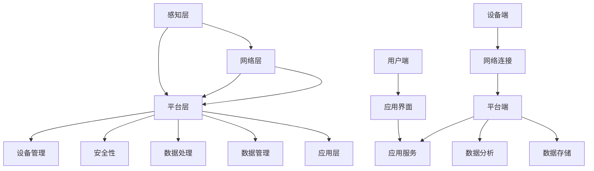

                 

## 物联网平台：AWS IoT 和 Azure IoT Hub

> **关键词**：物联网平台、AWS IoT、Azure IoT Hub、设备管理、数据处理、安全性、实战案例

> **摘要**：本文将深入探讨两个领先的物联网平台——AWS IoT 和 Azure IoT Hub，分析它们的核心功能、关键特性以及实际应用。我们将通过详细的步骤分析，了解如何开发 IoT 设备，处理和存储 IoT 数据，并确保 IoT 平台的安全性。最后，我们将通过实际项目案例展示这些平台的强大应用能力。

### 目录

1. **物联网平台概述**
    1.1 物联网（IoT）的概念与架构
    1.2 物联网平台的分类与作用
2. **AWS IoT 平台简介**
    2.1 AWS IoT 平台的核心功能
    2.2 AWS IoT 平台的关键特性
3. **AWS IoT 平台实战**
    3.1 AWS IoT 设备开发
    3.2 AWS IoT 数据处理与存储
    3.3 AWS IoT 安全性
    3.4 AWS IoT 实战项目案例
4. **Azure IoT Hub 平台**
    4.1 Azure IoT Hub 平台简介
    4.2 Azure IoT Hub 设备开发
    4.3 Azure IoT Hub 数据处理与存储
    4.4 Azure IoT Hub 安全性
    4.5 Azure IoT Hub 实战项目案例
5. **物联网平台选型与优化**
    5.1 物联网平台选型因素
    5.2 物联网平台性能优化策略
6. **物联网平台发展趋势与未来展望**
    6.1 物联网技术的发展趋势
    6.2 物联网平台的未来发展方向
    6.3 物联网平台在新型应用场景中的实践
7. **附录**
    7.1 物联网平台开发工具与资源
    7.2 物联网平台核心概念与架构流程图
    7.3 物联网平台核心算法原理讲解与伪代码实现
    7.4 物联网平台数学模型与公式
    7.5 物联网平台项目实战案例
    7.6 物联网平台开发环境搭建指南

### 第一部分：物联网平台概述

#### 第1章：物联网（IoT）的概念与架构

物联网（IoT，Internet of Things）是当今技术领域中的一个重要概念，它指的是通过互联网连接各种物理设备，实现设备与设备之间，以及设备与互联网之间的信息交换和通信。物联网技术的兴起，不仅改变了我们的生活，也为企业提供了新的业务模式和增长点。

##### 1.1 物联网的基本概念

物联网的核心在于连接，它通过在设备上嵌入传感器和网络连接模块，实现设备的智能互联。这些设备可以是家庭中的智能灯泡、空调，也可以是工业环境中的传感器、机器人，甚至是城市中的交通灯、垃圾箱。物联网的目标是将这些设备通过网络连接起来，形成一个庞大的智能网络，从而实现自动化、智能化和高效化的管理和控制。

##### 1.1.1 物联网的定义与发展历程

物联网这个术语最早由麻省理工学院的Kevin Ashton于1999年提出。物联网的发展历程可以分为三个阶段：

1. **连接阶段**：这一阶段的主要目标是连接各种物理设备，使它们能够通过网络进行通信。这需要解决的是网络连接和通信协议的问题。

2. **数据采集与分析阶段**：随着物联网设备的普及，产生了大量的数据。这一阶段的主要任务是采集、传输和处理这些数据，从中提取有价值的信息。

3. **智能化阶段**：这一阶段的目标是实现物联网设备的智能化，使它们能够自主决策和行动。这需要借助人工智能和机器学习技术，使物联网设备具备一定的智能。

##### 1.1.2 物联网的技术架构

物联网的技术架构可以分为四个层次：

1. **感知层**：这是物联网架构的最底层，包括各种传感器和采集设备，用于感知和采集环境数据。

2. **网络层**：这一层负责数据的传输和通信，包括无线网络、有线网络和各种通信协议。

3. **平台层**：这一层是物联网架构的核心，负责数据的处理、存储、分析和应用。常见的平台层技术包括云计算、大数据、人工智能等。

4. **应用层**：这一层是物联网架构的最高层，用于实现各种具体的应用场景，如智能家居、智能交通、智能医疗等。

#### 1.2 物联网平台的分类与作用

物联网平台是物联网系统的核心，它负责连接和管理各种物联网设备，并提供数据传输、存储、处理和分析等功能。根据不同的需求和场景，物联网平台可以分为以下几类：

1. **设备管理平台**：这类平台主要用于管理物联网设备，包括设备的注册、配置、监控和升级等。

2. **数据处理平台**：这类平台主要用于处理和存储物联网设备产生的数据，包括数据的采集、清洗、存储、分析和应用等。

3. **应用服务平台**：这类平台主要用于实现各种物联网应用，如智能家居、智能交通、智能医疗等。

4. **安全服务平台**：这类平台主要用于确保物联网系统的安全性，包括设备认证、数据加密、访问控制等。

##### 1.2.1 物联网平台的分类

1. **通用物联网平台**：这类平台适用于各种行业和场景，具有高度的可定制性和灵活性。

2. **行业专用物联网平台**：这类平台针对特定的行业和应用场景进行优化，提供更专业的解决方案。

##### 1.2.2 物联网平台在物联网生态系统中的作用

物联网平台在物联网生态系统中扮演着关键角色，其主要作用包括：

1. **设备连接与管理**：物联网平台通过提供设备管理功能，使设备能够方便地接入网络，并进行管理和监控。

2. **数据处理与分析**：物联网平台通过提供数据处理和分析功能，使物联网系统能够从采集的数据中提取有价值的信息。

3. **安全防护**：物联网平台通过提供安全防护功能，确保物联网系统的安全运行，防止数据泄露和设备被攻击。

4. **应用开发与部署**：物联网平台通过提供开发工具和平台，使开发者能够快速构建和部署物联网应用。

通过以上对物联网平台概述的介绍，我们可以看到物联网平台在物联网系统中的重要地位和作用。在接下来的章节中，我们将分别深入探讨 AWS IoT 和 Azure IoT Hub 这两个领先的物联网平台，了解它们的核心功能、关键特性和实际应用。

### 第二部分：AWS IoT 平台简介

#### 第2章：AWS IoT 平台简介

AWS IoT 是 Amazon Web Services（AWS）提供的物联网平台，它为开发者提供了强大的工具和功能，以便轻松连接、管理和分析物联网设备。AWS IoT 支持广泛的设备和连接协议，并且与 AWS 的其他服务紧密集成，使其成为构建复杂物联网解决方案的理想选择。

##### 2.1 AWS IoT 平台的核心功能

AWS IoT 平台的核心功能包括：

1. **设备管理**：AWS IoT 提供了设备管理功能，使开发者能够轻松注册、配置和监控设备。这包括设备发现、设备状态监控、远程管理和OTA（Over-The-Air）软件更新。

2. **数据传输与存储**：AWS IoT 支持多种数据传输协议，如 MQTT（消息队列遥测传输协议），并提供了多种数据存储解决方案，如 AWS IoT Data Store、Amazon S3 和 Amazon Kinesis Data Streams。

3. **安全性**：AWS IoT 提供了多层安全机制，包括设备身份验证、数据加密、访问控制和安全审计等，确保设备和管理数据的安全。

4. **自动化规则引擎**：AWS IoT 提供了自动化规则引擎，允许开发者根据设备数据实时触发动作，如发送通知、执行 Lambda 函数或更新设备状态。

5. **集成第三方服务**：AWS IoT 可以轻松地与其他 AWS 服务集成，如 Amazon S3、Amazon RDS、Amazon DynamoDB、Amazon SNS（简单通知服务）和 Amazon Kinesis。

##### 2.2 AWS IoT 平台的关键特性

AWS IoT 平台的关键特性包括：

1. **广泛的设备支持**：AWS IoT 支持多种设备和连接协议，包括 MQTT、HTTP、WebSocket 和 CoAP，使得开发者可以轻松地将各种设备连接到平台。

2. **高可扩展性**：AWS IoT 可以轻松地处理大量设备，并且可以水平扩展以支持不断增长的需求。

3. **弹性与可靠性**：AWS IoT 基于 AWS 的全球基础设施，提供了高可用性和弹性，确保系统稳定运行。

4. **开发者工具与文档支持**：AWS IoT 提供了丰富的开发者工具和详细的文档，包括 SDK、CLI（命令行界面）和官方教程，使得开发者能够快速上手并构建解决方案。

##### 2.3 AWS IoT 平台的开发者工具与文档支持

AWS IoT 提供了多种开发者工具和资源，以帮助开发者构建、测试和部署 IoT 解决方案：

1. **AWS IoT SDK**：AWS IoT SDK 支持多种编程语言，如 Python、Java、C 和 JavaScript，使开发者可以在不同的设备和环境中开发 IoT 应用。

2. **AWS IoT CLI**：AWS IoT CLI 是一个命令行工具，允许开发者通过命令行与 AWS IoT 平台进行交互。

3. **AWS IoT Device SDK**：AWS IoT Device SDK 为不同类型的设备提供了预编译的二进制文件，使得设备开发者可以轻松地将 AWS IoT 功能集成到设备中。

4. **AWS IoT Device Management API**：AWS IoT Device Management API 允许开发者使用编程语言（如 Python、Java 和 JavaScript）直接访问 AWS IoT 设备管理功能。

5. **官方教程和文档**：AWS IoT 官方提供了详细的教程和文档，包括入门指南、最佳实践和高级功能，帮助开发者快速了解和使用 AWS IoT 平台。

通过以上对 AWS IoT 平台的介绍，我们可以看到 AWS IoT 平台在连接、管理和分析物联网设备方面的强大功能。在接下来的章节中，我们将深入探讨如何在实际应用中开发 AWS IoT 设备，并展示其数据处理与存储、安全性等方面的能力。

### 第二部分：AWS IoT 平台实战

#### 第3章：AWS IoT 设备开发

在物联网（IoT）系统中，设备是整个生态系统的基石。开发可靠的 IoT 设备对于实现高效的数据采集和远程管理至关重要。AWS IoT 提供了一套完整的设备端开发工具和框架，使得开发者能够轻松地将设备连接到 AWS IoT 平台，并进行数据上传和管理。

##### 3.1 AWS IoT 设备端编程模型

AWS IoT 设备端编程模型主要包括以下几个关键组件：

1. **AWS IoT 设备 SDK**：AWS IoT 设备 SDK 是专为物联网设备开发的软件开发工具包，支持多种编程语言和平台。它简化了设备与 AWS IoT 平台之间的通信，包括设备注册、数据上传、设备状态监控等。

2. **设备端通信协议**：AWS IoT 支持多种通信协议，如 MQTT、HTTP、WebSocket 和 CoAP。其中，MQTT 是最常用的协议，因为它具有轻量级、低带宽消耗和低延迟的特点，非常适合物联网应用。

##### 3.1.1 AWS IoT 设备端编程框架

AWS IoT 设备端编程框架主要包括以下步骤：

1. **环境搭建**：首先，开发者需要在设备上安装 AWS IoT 设备 SDK。对于不同的设备和编程语言，安装步骤可能有所不同。例如，对于基于 Arduino 的设备，开发者可以使用 AWS IoT Device SDK for Arduino。

2. **设备注册**：在设备端，需要使用 AWS IoT 设备 SDK 注册设备。设备注册包括创建证书和生成设备证书文件，这些证书用于设备与 AWS IoT 平台进行安全通信。

3. **连接平台**：注册完成后，设备可以使用 SDK 连接到 AWS IoT 平台。连接过程中，设备会使用证书进行身份验证，确保通信的安全性。

4. **数据上传**：设备连接到平台后，可以定期上传传感器数据或设备状态信息。上传的数据可以通过 MQTT 协议发送到 AWS IoT 数据存储服务，如 AWS IoT Data Store 或 Amazon S3。

5. **设备状态监控**：设备端 SDK 还可以用于监控设备状态，如电池电量、设备运行状态等。这些信息可以通过 MQTT 协议上传到 AWS IoT 平台，供进一步处理和分析。

##### 3.1.2 设备端通信协议

AWS IoT 支持多种设备端通信协议，以下是常用的协议及其特点：

1. **MQTT**：MQTT 是一种轻量级的消息传输协议，特别适合物联网应用。它具有以下特点：
    - **轻量级**：MQTT 消息格式简洁，数据传输效率高。
    - **低带宽消耗**：MQTT 消息支持 QoS（质量服务）级别，可以根据需要选择不同的 QoS 级别，以满足带宽限制。
    - **低延迟**：MQTT 消息传输时间短，适合实时数据传输。
    - **安全性**：MQTT 协议支持 SSL/TLS 加密，确保通信安全。

2. **HTTP**：HTTP 是一种通用的网络协议，也适用于物联网设备通信。它具有以下特点：
    - **通用性**：HTTP 是 Web 标准的一部分，几乎所有的设备都支持 HTTP。
    - **可靠性**：HTTP 支持完整的请求/响应机制，确保数据传输的可靠性。
    - **灵活性**：HTTP 支持多种请求方法（GET、POST、PUT、DELETE），适用于不同类型的数据传输。

3. **WebSocket**：WebSocket 是一种双向通信协议，适用于实时数据传输。它具有以下特点：
    - **实时性**：WebSocket 支持双向实时通信，可以实时接收和发送数据。
    - **高效性**：WebSocket 消息传输效率高，适合大规模数据传输。

4. **CoAP**：CoAP 是一种面向物联网的轻量级协议，适用于资源受限的设备。它具有以下特点：
    - **简单性**：CoAP 消息格式简单，易于实现。
    - **高效性**：CoAP 消息传输效率高，适合低带宽环境。
    - **安全性**：CoAP 支持安全传输，如 TLS/DTLS 加密。

##### 3.2 AWS IoT 设备开发实战

下面是一个简单的 AWS IoT 设备开发实战，我们将使用基于 Arduino 的设备来展示设备端的开发过程。

###### 3.2.1 设备端环境搭建

1. **安装 Arduino IDE**：首先，需要在计算机上安装 Arduino IDE，可以从 [Arduino 官网](https://www.arduino.cc/) 下载。

2. **安装 AWS IoT Device SDK for Arduino**：下载并安装 AWS IoT Device SDK for Arduino。安装方法请参考 [AWS IoT Device SDK for Arduino 官方文档](https://docs.aws.amazon.com/iot-device-sdk-arduino/latest/user-guide/quickstart.html)。

3. **连接设备**：将 Arduino 设备通过 USB 线连接到计算机，并打开 Arduino IDE。

###### 3.2.2 设备注册

1. **创建 AWS IoT 客户端证书和私钥**：在 AWS 管理控制台中创建 AWS IoT 客户端证书和私钥。操作方法请参考 [AWS IoT 官方文档](https://docs.aws.amazon.com/iot/latest/developerguide/create-client-certificates.html)。

2. **上传证书到设备**：将创建的证书文件上传到 Arduino 设备。在 Arduino IDE 中，选择“Tools” > “Port” > “Arduino Uno”，然后使用命令行工具将证书文件上传到设备。

###### 3.2.3 数据上传与接收

1. **编写设备端代码**：在 Arduino IDE 中编写设备端代码。以下是一个简单的示例代码，用于连接 AWS IoT 平台并上传温度传感器数据。

```cpp
#include <WiFi.h>
#include <MQTTClient.h>
#include <AWSIoT.h>

// WiFi 配置
const char* ssid = "your_ssid";
const char* password = "your_password";

// AWS IoT 配置
AWSIoT awsIot;
const char* awsEndpoint = "your_iot_endpoint";
const char* certificateFile = "path_to_certificate.pem.crt";
const char* privateKeyFile = "path_to_private_key.pem.key";
const char* rootCAFile = "path_to_rootCA.pem";

void setup() {
  Serial.begin(115200);
  
  // 连接 WiFi
  WiFi.begin(ssid, password);
  while (WiFi.status() != WL_CONNECTED) {
    Serial.print(".");
    delay(500);
  }
  Serial.println("WiFi 连接成功");

  // 连接 AWS IoT
  awsIot.setCredentials(certificateFile, privateKeyFile, rootCAFile);
  awsIot.connect(awsEndpoint, AWSREGION_US_EAST_1);
  while (!awsIot.isConnected()) {
    Serial.print(".");
    delay(500);
  }
  Serial.println("AWS IoT 连接成功");

  // 启动温度传感器
  Serial.println("启动温度传感器");
  // TODO：添加温度传感器初始化代码

  // 上传数据
  Serial.println("上传温度传感器数据");
  while (awsIot.isConnected()) {
    float temperature = readTemperature(); // 获取温度值
    String payload = "{\"temperature\": " + String(temperature) + "}";
    awsIot.publish("temperature", payload.c_str());
    delay(1000);
  }
}

void loop() {
  // 保持连接
  awsIot.loop();
}
```

2. **上传代码到设备**：将编写好的代码上传到 Arduino 设备。

3. **运行设备**：将 Arduino 设备连接到电源，并运行程序。

设备端程序将连接到 AWS IoT 平台，并定期上传温度传感器数据。在 AWS IoT 平台的控制台中，可以查看上传的数据。

##### 3.3 AWS IoT 实战项目案例

###### 3.3.1 智能农业项目

智能农业是一个典型的物联网应用场景，通过物联网设备收集农田数据，如土壤湿度、温度、光照等，实现对农田的实时监控和管理。

**项目需求分析**：

- **设备**：土壤湿度传感器、温度传感器、光照传感器
- **功能**：实时监控农田数据，发送预警通知，数据存储和分析

**设备选择与开发**：

- **传感器**：选择适合的土壤湿度传感器、温度传感器和光照传感器。
- **设备端编程**：使用 AWS IoT 设备 SDK，编写设备端程序，实现数据上传和设备状态监控。

**数据处理与存储**：

- **数据传输**：设备使用 MQTT 协议将数据上传到 AWS IoT 平台。
- **数据存储**：将数据存储在 AWS IoT Data Store 或 Amazon S3 中，以便进行数据分析和处理。

**实战步骤**：

1. **环境搭建**：搭建 AWS IoT 平台账户，并创建设备证书。
2. **设备端编程**：编写设备端程序，实现数据上传和设备状态监控。
3. **数据上传与存储**：将设备端程序上传到传感器设备，并运行程序。
4. **数据处理与分析**：在 AWS IoT 平台控制台中查看数据，并使用 Amazon QuickSight 等工具进行数据分析和可视化。

###### 3.3.2 智能家居项目

智能家居是一个广泛应用于家庭的物联网场景，通过物联网设备实现对家庭环境的智能控制和监控。

**项目需求分析**：

- **设备**：智能灯泡、智能空调、智能门锁
- **功能**：远程控制设备，实现自动化场景，数据存储和分析

**设备选择与开发**：

- **智能设备**：选择适合的智能灯泡、智能空调和智能门锁。
- **设备端编程**：使用 AWS IoT 设备 SDK，编写设备端程序，实现数据上传和远程控制。

**数据处理与存储**：

- **数据传输**：设备使用 MQTT 协议将数据上传到 AWS IoT 平台。
- **数据存储**：将数据存储在 AWS IoT Data Store 或 Amazon S3 中，以便进行数据分析和处理。

**实战步骤**：

1. **环境搭建**：搭建 AWS IoT 平台账户，并创建设备证书。
2. **设备端编程**：编写设备端程序，实现数据上传和设备状态监控。
3. **数据上传与存储**：将设备端程序上传到传感器设备，并运行程序。
4. **数据处理与分析**：在 AWS IoT 平台控制台中查看数据，并使用 Amazon QuickSight 等工具进行数据分析和可视化。

通过以上实战项目案例，我们可以看到 AWS IoT 平台在物联网设备开发、数据处理和存储、安全性等方面的强大能力。在接下来的章节中，我们将继续探讨 AWS IoT 平台的数据处理与存储、安全性等方面，以帮助开发者更好地利用 AWS IoT 平台构建高效的物联网解决方案。

### 第二部分：AWS IoT 平台实战

#### 第4章：AWS IoT 数据处理与存储

在物联网（IoT）系统中，数据是核心资源。AWS IoT 平台提供了丰富的数据处理和存储解决方案，帮助开发者高效地收集、处理和分析物联网设备产生的海量数据。本章节将详细探讨 AWS IoT 数据处理与存储的流程、技术和策略。

##### 4.1 AWS IoT 数据处理流程

AWS IoT 数据处理流程可以分为以下几个步骤：

1. **数据采集**：物联网设备通过传感器或其他方式采集数据，并将数据上传到 AWS IoT 平台。

2. **数据传输**：AWS IoT 平台支持多种数据传输协议，如 MQTT、HTTP 和 WebSocket，确保数据能够安全、可靠地传输到平台。

3. **数据路由**：数据上传到 AWS IoT 平台后，根据配置的路由规则，将数据路由到相应的处理目标，如 AWS IoT Data Store、Amazon S3、Amazon Kinesis 或 Lambda 函数。

4. **数据处理**：AWS IoT 平台提供了丰富的数据处理功能，包括数据清洗、转换、聚合和分析。开发者可以使用 AWS Lambda 函数或数据处理服务（如 Amazon Kinesis Data Firehose）来实现自定义数据处理逻辑。

5. **数据存储**：处理后的数据可以存储在 AWS IoT Data Store、Amazon S3、Amazon Kinesis 或其他数据存储服务中，以便进行长期存储和分析。

6. **数据查询与分析**：开发者可以使用 AWS IoT Analytics、Amazon QuickSight 或其他数据分析工具对数据进行查询和分析，提取有价值的信息。

##### 4.2 AWS IoT 数据存储解决方案

AWS IoT 平台提供了多种数据存储解决方案，以适应不同规模和需求的应用场景。以下是几种常用的数据存储方案：

1. **AWS IoT Data Store**：AWS IoT Data Store 是一个专为物联网数据设计的实时数据存储服务。它支持快速数据写入和读取，并提供灵活的数据查询功能。AWS IoT Data Store 适合处理小到中等规模的数据，并且与 AWS IoT 平台无缝集成。

2. **Amazon S3**：Amazon S3 是一个高度可扩展的对象存储服务，适合存储大规模的物联网数据。S3 提供了可靠的数据存储和强大的查询功能，开发者可以使用 S3 Select 功能来高效地查询和提取数据。此外，S3 还支持多种数据格式，如 JSON、CSV 和 Parquet，方便数据的导入和导出。

3. **Amazon Kinesis**：Amazon Kinesis 是一个流数据平台，适合处理实时物联网数据。Kinesis 支持高速数据流入和实时数据查询，开发者可以使用 Kinesis Data Firehose 将数据加载到 S3 或其他数据存储服务中，以便进行长期存储和分析。

4. **Amazon DynamoDB**：Amazon DynamoDB 是一个分布式键值和文档数据库，适合存储和查询物联网数据。DynamoDB 提供了高吞吐量、低延迟的读写操作，并且支持多种数据类型和索引。开发者可以使用 DynamoDB 来实现高效的物联网数据处理和查询。

##### 4.3 数据处理与存储策略

在构建物联网解决方案时，数据处理和存储策略的制定至关重要。以下是一些常见的数据处理与存储策略：

1. **数据采样**：在数据采集阶段，可以对数据进行采样，减少数据量，提高系统性能。采样可以根据时间间隔、数据阈值或设备状态进行。

2. **数据压缩**：对数据进行压缩可以减少数据存储空间和传输带宽。AWS IoT 支持多种数据压缩算法，如 gzip 和 Snappy。

3. **数据分区与索引**：为了提高数据查询效率，可以对数据进行分区和索引。分区可以根据时间戳、设备 ID 或其他关键字进行，索引可以基于特定字段创建。

4. **数据保留策略**：根据业务需求，制定合适的数据保留策略，以确定数据的存储期限。AWS IoT Data Store、Amazon S3 和 Amazon Kinesis 都支持灵活的数据保留策略。

5. **数据处理与流处理**：使用 AWS Lambda 函数或 Kinesis Data Firehose 等服务进行实时数据处理和流处理，提取有价值的信息，并触发后续动作。

通过以上对 AWS IoT 数据处理与存储流程和解决方案的介绍，我们可以看到 AWS IoT 平台在数据采集、传输、处理和存储方面的强大功能。在接下来的章节中，我们将继续探讨 AWS IoT 平台的安全性，帮助开发者构建安全可靠的物联网解决方案。

### 第二部分：AWS IoT 平台实战

#### 第5章：AWS IoT 安全性

在物联网（IoT）系统中，安全性是至关重要的。随着物联网设备的增加和连接的普及，确保设备和数据的安全成为了一个巨大的挑战。AWS IoT 平台提供了强大的安全机制，帮助开发者构建安全可靠的物联网解决方案。

##### 5.1 AWS IoT 安全架构

AWS IoT 的安全架构由多个安全层组成，确保设备和数据在整个物联网生态系统中的安全性。以下是 AWS IoT 安全架构的主要组成部分：

1. **设备端安全性**：设备端是物联网系统的第一道防线。AWS IoT 提供了设备端证书和密钥管理，确保设备与 AWS IoT 平台之间的通信安全。设备端还支持加密算法和访问控制策略，防止未经授权的访问和恶意行为。

2. **网络安全性**：AWS IoT 支持加密传输协议（如 MQTT over TLS/SSL），确保数据在传输过程中的安全性。AWS IoT 还提供了网络防火墙功能，允许开发者控制数据流的进出，防止网络攻击。

3. **应用层安全性**：AWS IoT 提供了多层次的安全策略，包括身份验证、授权和审计。开发者可以使用 IAM（身份访问管理）来管理设备的访问权限，并使用自动化规则引擎来定义数据流和处理逻辑。

##### 5.2 AWS IoT 安全实践

以下是一些关键的 AWS IoT 安全实践，帮助开发者确保物联网系统的安全性：

1. **设备认证与访问控制**：AWS IoT 使用证书和密钥对设备进行认证。设备在连接 AWS IoT 平台时，需要提供有效的证书和私钥进行身份验证。开发者可以使用 IAM 策略来控制设备的访问权限，确保只有授权的设备可以访问特定资源。

2. **数据加密与完整性校验**：AWS IoT 支持对数据进行加密，确保数据在传输和存储过程中不被窃取或篡改。开发者可以使用 TLS/SSL 协议对 MQTT 数据进行加密，并在数据传输过程中使用数字签名进行完整性校验。

3. **安全审计与监控**：AWS IoT 提供了日志记录和监控功能，允许开发者跟踪和审计物联网系统的活动。开发者可以使用 AWS CloudTrail 和 AWS IoT 事件规则来记录设备操作日志，并使用 AWS X-Ray 和 Amazon GuardDuty 来监控和识别潜在的安全威胁。

4. **更新和补丁管理**：AWS IoT 平台定期发布安全更新和补丁，开发者需要及时更新设备的软件和固件，以防范已知的安全漏洞。

5. **安全配置**：开发者应遵循最佳实践来配置 AWS IoT 平台，包括禁用不必要的服务、设置强密码和使用安全的连接协议。此外，开发者可以使用 AWS Security Hub 来监控和管理 AWS IoT 平台的安全性。

##### 5.3 安全性案例分析

以下是一个简单的 AWS IoT 安全性案例分析：

**案例背景**：一个智能家居系统包含多个智能设备，如智能灯泡、智能空调和智能门锁。这些设备需要连接到 AWS IoT 平台，并进行数据传输和远程控制。

**安全措施**：

1. **设备认证**：每个设备在连接 AWS IoT 平台时，都需要提供有效的设备证书和私钥进行身份验证。AWS IoT 平台使用 IAM 策略来控制设备的访问权限，确保只有授权的设备可以访问平台资源。

2. **数据加密**：设备使用 MQTT over TLS/SSL 协议将数据上传到 AWS IoT 平台，确保数据在传输过程中不被窃取或篡改。数据在平台内部存储和路由过程中也使用加密算法进行保护。

3. **安全审计**：AWS IoT 平台记录所有设备操作日志，并使用 AWS CloudTrail 进行监控。开发者可以定期查看日志，并使用 AWS X-Ray 进行故障排查和性能优化。

4. **安全配置**：开发者禁用了不必要的服务，如 SSH 和 HTTP，并使用强密码和安全的连接协议（如 TLS）来保护设备和管理接口。

通过以上案例分析，我们可以看到 AWS IoT 平台在安全性方面提供了全面的支持，帮助开发者构建安全可靠的物联网解决方案。在接下来的章节中，我们将继续探讨 AWS IoT 平台在实际项目中的应用，以展示其强大的功能和实用性。

### 第二部分：AWS IoT 平台实战

#### 第6章：AWS IoT 实战项目案例

在物联网（IoT）领域，AWS IoT 平台的强大功能和灵活性使其成为许多创新项目的核心技术。本章节将通过两个实际项目案例——智能农业和智能家居，展示 AWS IoT 平台在实际应用中的效果和实现方法。

##### 6.1 智能农业项目

**项目需求分析**：

智能农业项目旨在通过物联网技术实现农田的自动化监控和管理，从而提高农业生产的效率和产量。项目需求包括：

- **设备**：土壤湿度传感器、温度传感器、光照传感器、摄像头
- **功能**：实时监控农田环境数据，发送预警通知，数据存储和分析

**设备选择与开发**：

1. **传感器设备**：选择适合的土壤湿度传感器、温度传感器和光照传感器，并将这些传感器连接到 Arduino 或 Raspberry Pi 设备。

2. **设备端编程**：编写设备端程序，使用 AWS IoT 设备 SDK 连接到 AWS IoT 平台，并上传传感器数据。

**数据处理与存储**：

1. **数据传输**：传感器设备使用 MQTT 协议将数据上传到 AWS IoT 平台。

2. **数据存储**：将数据存储在 AWS IoT Data Store 或 Amazon S3 中，以便进行数据分析和处理。

**实战步骤**：

1. **环境搭建**：注册 AWS IoT 平台账户，创建设备证书和密钥。

2. **设备端编程**：编写设备端程序，实现数据上传和设备状态监控。

3. **数据上传与存储**：将设备端程序上传到传感器设备，并运行程序。

4. **数据处理与分析**：在 AWS IoT 平台控制台中查看数据，并使用 Amazon QuickSight 等工具进行数据分析和可视化。

**案例分析**：

智能农业项目通过 AWS IoT 平台实现了农田环境的实时监控和管理。通过传感器设备上传的土壤湿度、温度和光照数据，开发者可以及时发现农田环境异常，并采取相应的措施。例如，当土壤湿度低于阈值时，系统可以自动启动灌溉系统，确保农田的土壤湿度在最佳范围内。此外，项目还实现了数据存储和分析功能，使开发者可以长期跟踪农田环境数据，并从中提取有价值的信息。

##### 6.2 智能家居项目

**项目需求分析**：

智能家居项目旨在通过物联网技术实现对家庭设备的智能控制和监控，提高生活便利性和安全性。项目需求包括：

- **设备**：智能灯泡、智能空调、智能门锁、摄像头
- **功能**：远程控制设备，实现自动化场景，数据存储和分析

**设备选择与开发**：

1. **智能设备**：选择适合的智能灯泡、智能空调和智能门锁，并连接到互联网。

2. **设备端编程**：使用 AWS IoT 设备 SDK 编写设备端程序，实现数据上传和远程控制。

**数据处理与存储**：

1. **数据传输**：智能设备使用 MQTT 协议将数据上传到 AWS IoT 平台。

2. **数据存储**：将数据存储在 AWS IoT Data Store 或 Amazon S3 中，以便进行数据分析和处理。

**实战步骤**：

1. **环境搭建**：注册 AWS IoT 平台账户，创建设备证书和密钥。

2. **设备端编程**：编写设备端程序，实现数据上传和设备状态监控。

3. **数据上传与存储**：将设备端程序上传到智能设备，并运行程序。

4. **数据处理与分析**：在 AWS IoT 平台控制台中查看数据，并使用 Amazon QuickSight 等工具进行数据分析和可视化。

**案例分析**：

智能家居项目通过 AWS IoT 平台实现了对家庭设备的远程控制和自动化管理。用户可以通过手机或平板电脑远程控制家中的智能灯泡、智能空调和智能门锁，提高生活便利性。此外，项目还实现了数据存储和分析功能，使开发者可以长期跟踪设备状态数据，并从中提取有价值的信息。例如，通过分析智能灯泡的开关状态和使用时间，开发者可以了解用户的作息习惯，并优化照明方案，提高能源利用效率。

通过以上两个实战项目案例，我们可以看到 AWS IoT 平台在智能农业和智能家居领域的广泛应用和强大功能。在接下来的章节中，我们将继续探讨 Azure IoT Hub 平台，以了解其在物联网系统中的应用和优势。

### 第三部分：Azure IoT Hub 平台

#### 第7章：Azure IoT Hub 平台简介

Azure IoT Hub 是微软提供的云托管物联网服务，为开发者提供了一个强大的平台，用于连接、管理和监控大规模的物联网设备。Azure IoT Hub 旨在简化物联网解决方案的开发和部署，并提供了一系列核心功能、关键特性和开发者工具，以支持各种应用场景。

##### 7.1 Azure IoT Hub 平台的核心功能

Azure IoT Hub 的核心功能包括：

1. **设备管理**：Azure IoT Hub 提供了强大的设备管理功能，包括设备注册、设备配置、设备状态监控和远程更新。开发者可以轻松地将大量设备连接到平台，并管理它们的运行状态。

2. **数据传输与存储**：Azure IoT Hub 支持多种数据传输协议，如 MQTT、HTTP 和 WebSocket，确保设备能够灵活地上传数据。数据可以被存储在 Azure IoT 数据流、Azure Blob 存储、Azure 表存储或 Azure Cosmos DB 中，供进一步处理和分析。

3. **安全性**：Azure IoT Hub 提供了多层安全机制，包括设备身份验证、数据加密、访问控制和安全监控。这些安全功能确保设备和数据在整个物联网生态系统中的安全性。

4. **消息路由**：Azure IoT Hub 提供了灵活的消息路由功能，允许开发者根据特定的规则将数据路由到不同的处理目标，如 Azure 函数、Azure Stream Analytics、Azure 数据仓库等。

5. **集成服务**：Azure IoT Hub 可以与 Azure 中的其他服务无缝集成，如 Azure 机器学习、Azure 分析服务、Azure 事件中心等，为开发者提供了丰富的数据处理和分析工具。

##### 7.2 Azure IoT Hub 平台的关键特性

Azure IoT Hub 的关键特性包括：

1. **高可扩展性**：Azure IoT Hub 能够轻松地扩展以支持大规模设备连接。开发者可以根据实际需求动态调整资源，确保平台在高并发场景下依然能够稳定运行。

2. **弹性**：Azure IoT Hub 基于 Azure 云服务，提供了高可用性和弹性。平台能够自动处理故障和扩展资源，确保系统的连续性和可靠性。

3. **开发者工具与文档支持**：Azure IoT Hub 提供了丰富的开发者工具和详细的文档，包括 SDK、CLI、官方教程和示例代码，帮助开发者快速上手并构建物联网解决方案。

##### 7.3 Azure IoT Hub 平台的开发者工具与文档支持

Azure IoT Hub 为开发者提供了多种工具和资源，以简化物联网解决方案的开发和部署：

1. **Azure IoT SDK**：Azure IoT SDK 支持多种编程语言，如 C#、Java、Node.js 和 Python，使开发者可以在不同的设备和环境中开发 IoT 应用。

2. **Azure IoT Device SDK**：Azure IoT Device SDK 为不同类型的设备提供了预编译的二进制文件，使得设备开发者可以轻松地将 Azure IoT 功能集成到设备中。

3. **Azure IoT Hub SDK**：Azure IoT Hub SDK 允许开发者使用编程语言（如 Python、Java 和 JavaScript）直接访问 Azure IoT Hub 功能。

4. **Azure IoT CLI**：Azure IoT CLI 是一个命令行工具，允许开发者通过命令行与 Azure IoT Hub 进行交互。

5. **官方教程和文档**：Azure IoT Hub 官方提供了详细的教程和文档，包括入门指南、最佳实践和高级功能，帮助开发者快速了解和使用 Azure IoT Hub 平台。

通过以上对 Azure IoT Hub 平台的介绍，我们可以看到 Azure IoT Hub 在连接、管理和分析物联网设备方面的强大功能。在接下来的章节中，我们将深入探讨如何在实际应用中开发 Azure IoT 设备，并展示其数据处理与存储、安全性等方面的能力。

### 第三部分：Azure IoT Hub 平台实战

#### 第8章：Azure IoT Hub 设备开发

在 Azure IoT Hub 平台上，设备开发是物联网系统构建的关键环节。通过合理的设备端编程和连接，开发者可以实现设备数据的实时传输和管理。本章节将详细介绍 Azure IoT Hub 设备开发的过程，包括设备端编程模型、通信协议以及开发实战。

##### 8.1 Azure IoT Hub 设备端编程模型

Azure IoT Hub 的设备端编程模型主要包括以下步骤：

1. **环境搭建**：在设备上安装 Azure IoT SDK，配置设备端环境。

2. **设备注册**：将设备注册到 Azure IoT Hub，生成设备证书和连接字符串。

3. **连接平台**：使用设备端 SDK 连接到 Azure IoT Hub，进行设备认证。

4. **数据上传**：通过 SDK 将设备传感器数据上传到 Azure IoT Hub。

5. **接收消息**：处理来自 Azure IoT Hub 的消息，如规则引擎触发的事件。

##### 8.1.1 Azure IoT Hub 设备端编程框架

以下是一个简单的 Azure IoT Hub 设备端编程框架，用于展示设备端的开发过程：

```python
from azure.iot.device import Device
from azure.iot.device import Message

# 设备端环境搭建
device_id = "your_device_id"
connection_string = "your_connection_string"

# 连接 Azure IoT Hub
device = Device(connection_string)

try:
    print("连接 Azure IoT Hub...")
    device.connect()
except Exception as e:
    print("连接失败：", e)

# 上传传感器数据
while device.connected:
    temperature = 23  # 假设获取到温度值
    humidity = 50     # 假设获取到湿度值

    message = Message(json.dumps({"temperature": temperature, "humidity": humidity}))

    try:
        print("上传数据：", message)
        device.send_message(message)
    except Exception as e:
        print("上传数据失败：", e)

    time.sleep(10)  # 等待 10 秒钟

# 断开连接
device.disconnect()

print("设备已断开连接")
```

##### 8.1.2 设备端通信协议

Azure IoT Hub 支持多种设备端通信协议，包括 MQTT、HTTP 和 WebSocket。以下是这些协议的特点：

1. **MQTT**：MQTT 是一种轻量级的消息传输协议，特别适合物联网应用。它具有低带宽消耗、低延迟和可靠性高的特点，适合大规模设备连接。

2. **HTTP**：HTTP 是一种通用的网络协议，也适用于物联网设备通信。它具有可靠性高、灵活性强的特点，适合传输结构化数据。

3. **WebSocket**：WebSocket 是一种双向通信协议，适合实时数据传输。它具有实时性强、通信效率高的特点，适用于需要实时交互的场景。

##### 8.2 Azure IoT Hub 设备开发实战

下面是一个简单的 Azure IoT Hub 设备开发实战，我们将使用 Python 编程语言和基于 Raspberry Pi 的设备来展示设备端的开发过程。

###### 8.2.1 设备端环境搭建

1. **安装 Raspberry Pi**：首先，需要在 Raspberry Pi 设备上安装操作系统，如 Raspberry Pi OS。

2. **安装 Python**：安装 Python 3，可以从 [Python 官网](https://www.python.org/downloads/) 下载适用于 Raspberry Pi 的 Python 版本。

3. **安装 Azure IoT SDK**：使用以下命令安装 Azure IoT SDK：

```bash
pip install azure-iot-device
```

###### 8.2.2 设备注册

1. **创建 Azure IoT Hub**：在 Azure 门户中创建一个新的 Azure IoT Hub，并生成设备证书和连接字符串。

2. **上传证书到设备**：将创建的设备证书（cert.pem 和 key.pem）上传到 Raspberry Pi 设备，可以使用 WinSCP 或其他文件传输工具。

3. **设置连接字符串**：在 Raspberry Pi 的 Python 环境中设置连接字符串，将设备 ID 和连接字符串写入一个配置文件（如 `config.py`）：

```python
device_id = "your_device_id"
connection_string = "your_connection_string"
```

###### 8.2.3 数据上传与接收

1. **编写设备端程序**：使用以下 Python 脚本作为设备端程序，用于连接 Azure IoT Hub 并上传传感器数据：

```python
import json
import time
from azure.iot.device import Device
from azure.iot.device import Message

# 设置设备信息
device_id = "your_device_id"
connection_string = "your_connection_string"

# 创建设备客户端
device = Device(connection_string)

try:
    print("连接 Azure IoT Hub...")
    device.connect()
except Exception as e:
    print("连接失败：", e)

while device.connected:
    # 假设获取到温度和湿度值
    temperature = 23
    humidity = 50

    # 创建消息
    message = Message(json.dumps({"temperature": temperature, "humidity": humidity}))

    try:
        print("上传数据：", message)
        device.send_message(message)
    except Exception as e:
        print("上传数据失败：", e)

    time.sleep(10)  # 等待 10 秒钟

# 断开连接
device.disconnect()

print("设备已断开连接")
```

2. **运行设备端程序**：将设备端程序上传到 Raspberry Pi 设备，并运行程序。设备将连接到 Azure IoT Hub，并定期上传传感器数据。

通过以上实战，我们可以看到如何使用 Azure IoT Hub SDK 在 Raspberry Pi 设备上进行编程，连接 Azure IoT Hub 并上传传感器数据。在接下来的章节中，我们将继续探讨 Azure IoT Hub 的数据处理与存储、安全性等方面，帮助开发者更全面地了解和使用 Azure IoT Hub 平台。

### 第三部分：Azure IoT Hub 平台实战

#### 第9章：Azure IoT Hub 数据处理与存储

在 Azure IoT Hub 平台上，数据处理和存储是物联网解决方案的重要组成部分。有效的数据处理和存储策略能够确保数据的准确性和可用性，从而提高物联网系统的性能和可靠性。本章节将详细介绍 Azure IoT Hub 的数据处理流程、数据存储解决方案以及数据存储策略。

##### 9.1 Azure IoT Hub 数据处理流程

Azure IoT Hub 的数据处理流程包括以下几个关键步骤：

1. **数据采集**：物联网设备通过传感器或其他方式采集数据，并将数据上传到 Azure IoT Hub。

2. **数据传输**：Azure IoT Hub 支持多种数据传输协议，如 MQTT、HTTP 和 WebSocket，确保数据能够安全、可靠地传输到平台。

3. **数据路由**：上传的数据根据配置的路由规则被路由到相应的处理目标，如 Azure IoT 数据流、Azure Blob 存储、Azure 表存储或 Azure Cosmos DB。

4. **数据处理**：数据处理包括数据清洗、转换、聚合和分析。Azure IoT Hub 提供了内置的流处理服务（如 Azure Stream Analytics）和自定义处理（如 Azure Functions），开发者可以根据需求选择合适的处理方式。

5. **数据存储**：处理后的数据可以存储在 Azure IoT 数据流、Azure Blob 存储、Azure 表存储或 Azure Cosmos DB 中，以便进行长期存储和分析。

6. **数据查询与分析**：开发者可以使用 Azure 数据仓库、Azure 分析服务或其他工具对数据进行查询和分析，提取有价值的信息。

##### 9.2 Azure IoT Hub 数据存储解决方案

Azure IoT Hub 提供了多种数据存储解决方案，以满足不同规模和应用场景的需求。以下是几种常用的数据存储方案：

1. **Azure IoT 数据流**：Azure IoT 数据流是一个实时数据处理服务，适合处理大规模的 IoT 数据。它提供了数据清洗、转换和路由功能，并将数据存储在内存中，实现低延迟和高吞吐量的数据处理。

2. **Azure Blob 存储**：Azure Blob 存储是一个高度可扩展的对象存储服务，适合存储大规模的 IoT 数据。它提供了可靠的数据存储和强大的查询功能，开发者可以使用 Azure Blob 存储的存储分析功能进行数据检索。

3. **Azure 表存储**：Azure 表存储是一个分布式键值存储服务，适合存储结构化数据。它提供了高效的读写操作和灵活的查询功能，适合存储 IoT 设备的元数据和配置信息。

4. **Azure Cosmos DB**：Azure Cosmos DB 是一个全球分布的数据库服务，提供了高性能、高可用性和自动扩展。它适合存储大规模的 IoT 数据，并提供了灵活的存储模型和强大的查询功能。

##### 9.3 数据处理与存储策略

在构建物联网解决方案时，数据处理和存储策略的制定至关重要。以下是一些常见的数据处理与存储策略：

1. **数据采样**：在数据采集阶段，可以对数据进行采样，减少数据量，提高系统性能。采样可以根据时间间隔、数据阈值或设备状态进行。

2. **数据压缩**：对数据进行压缩可以减少数据存储空间和传输带宽。Azure IoT Hub 支持多种数据压缩算法，如 gzip 和 Snappy。

3. **数据分区与索引**：为了提高数据查询效率，可以对数据进行分区和索引。分区可以根据时间戳、设备 ID 或其他关键字进行，索引可以基于特定字段创建。

4. **数据保留策略**：根据业务需求，制定合适的数据保留策略，以确定数据的存储期限。Azure IoT 数据流、Azure Blob 存储、Azure 表存储和 Azure Cosmos DB 都支持灵活的数据保留策略。

5. **数据处理与流处理**：使用 Azure Stream Analytics 或 Azure Functions 进行实时数据处理和流处理，提取有价值的信息，并触发后续动作。

通过以上对 Azure IoT Hub 数据处理与存储流程和解决方案的介绍，我们可以看到 Azure IoT Hub 在数据采集、传输、处理和存储方面的强大功能。在接下来的章节中，我们将继续探讨 Azure IoT Hub 的安全性，帮助开发者构建安全可靠的物联网解决方案。

### 第三部分：Azure IoT Hub 平台实战

#### 第10章：Azure IoT Hub 安全性

在物联网（IoT）领域，安全性是至关重要的。确保设备和数据在整个物联网生态系统中的安全性，对于构建可靠和安全的 IoT 解决方案至关重要。Azure IoT Hub 提供了强大的安全机制，帮助开发者构建安全可靠的 IoT 解决方案。

##### 10.1 Azure IoT Hub 安全架构

Azure IoT Hub 的安全架构由多个安全层组成，确保设备和数据在整个物联网生态系统中的安全性。以下是 Azure IoT Hub 安全架构的主要组成部分：

1. **设备端安全性**：设备端是物联网系统的第一道防线。Azure IoT Hub 提供了设备端证书和密钥管理，确保设备与 Azure IoT Hub 之间的通信安全。设备端还支持加密算法和访问控制策略，防止未经授权的访问和恶意行为。

2. **网络安全性**：Azure IoT Hub 支持加密传输协议（如 MQTT over TLS/SSL），确保数据在传输过程中的安全性。Azure IoT Hub 还提供了网络防火墙功能，允许开发者控制数据流的进出，防止网络攻击。

3. **应用层安全性**：Azure IoT Hub 提供了多层次的安全策略，包括身份验证、授权和审计。开发者可以使用 Azure Active Directory (Azure AD) 来管理设备的访问权限，并使用自动化规则引擎来定义数据流和处理逻辑。

##### 10.2 Azure IoT Hub 安全实践

以下是一些关键的 Azure IoT Hub 安全实践，帮助开发者确保物联网系统的安全性：

1. **设备认证与访问控制**：Azure IoT Hub 使用证书和密钥对设备进行认证。设备在连接 Azure IoT Hub 时，需要提供有效的证书和私钥进行身份验证。开发者可以使用 Azure AD 来管理设备的访问权限，确保只有授权的设备可以访问特定资源。

2. **数据加密与完整性校验**：Azure IoT Hub 支持对数据进行加密，确保数据在传输和存储过程中不被窃取或篡改。开发者可以在传输过程中使用 TLS/SSL 协议进行数据加密，并在数据存储过程中使用哈希算法进行完整性校验。

3. **安全审计与监控**：Azure IoT Hub 提供了日志记录和监控功能，允许开发者跟踪和审计物联网系统的活动。开发者可以使用 Azure 监视器 (Azure Monitor) 和 Azure 安全中心 (Azure Security Center) 来监控系统的健康状况和潜在的安全威胁。

4. **更新和补丁管理**：Azure IoT Hub 定期发布安全更新和补丁，开发者需要及时更新设备的软件和固件，以防范已知的安全漏洞。

5. **安全配置**：开发者应遵循最佳实践来配置 Azure IoT Hub，包括禁用不必要的服务、设置强密码和使用安全的连接协议。此外，开发者可以使用 Azure Policy 来管理资源的配置和合规性。

##### 10.3 安全性案例分析

以下是一个简单的 Azure IoT Hub 安全性案例分析：

**案例背景**：一个智能家居系统包含多个智能设备，如智能灯泡、智能空调和智能门锁。这些设备需要连接到 Azure IoT Hub，并进行数据传输和远程控制。

**安全措施**：

1. **设备认证**：每个设备在连接 Azure IoT Hub 时，都需要提供有效的设备证书和私钥进行身份验证。设备证书和私钥由 Azure AD 管理，确保设备身份的真实性。

2. **数据加密**：设备使用 MQTT over TLS/SSL 协议将数据上传到 Azure IoT Hub，确保数据在传输过程中不被窃取或篡改。

3. **访问控制**：Azure AD 用于管理设备的访问权限。开发者可以为每个设备创建角色，并分配适当的权限，确保只有授权的设备可以访问特定资源。

4. **日志记录与监控**：Azure 监视器和 Azure 安全中心用于记录和监控 IoT 系统的活动。开发者可以设置告警规则，及时发现潜在的安全威胁。

通过以上案例分析，我们可以看到 Azure IoT Hub 在安全性方面提供了全面的支持，帮助开发者构建安全可靠的物联网解决方案。在接下来的章节中，我们将继续探讨 Azure IoT Hub 在实际项目中的应用，以展示其强大的功能和实用性。

### 第三部分：Azure IoT Hub 平台实战

#### 第11章：Azure IoT Hub 实战项目案例

通过实际项目案例，我们可以更好地了解 Azure IoT Hub 平台的功能和应用。本章节将介绍两个实际项目案例——智能工厂和智能交通，展示 Azure IoT Hub 平台在实际应用中的效果和实现方法。

##### 11.1 智能工厂项目

**项目需求分析**：

智能工厂项目旨在通过物联网技术实现工厂设备的自动化监控和管理，提高生产效率和质量。项目需求包括：

- **设备**：传感器、执行器、工业机器人、AGV（自动导引车）
- **功能**：实时监控设备状态，故障预测与维护，生产数据采集与分析

**设备选择与开发**：

1. **传感器设备**：选择适合的传感器，如温度传感器、振动传感器、压力传感器，并将这些传感器连接到工业控制器。

2. **执行器设备**：选择适合的执行器，如电机控制器、阀门控制器，并确保其能够与控制器通信。

3. **工业机器人**：选择适合的工业机器人，如焊接机器人、装配机器人，并确保其能够与控制器和执行器通信。

4. **AGV**：选择适合的 AGV，并确保其能够与工厂网络进行通信。

**数据处理与存储**：

1. **数据传输**：传感器、执行器和 AGV 使用 MQTT 协议将数据上传到 Azure IoT Hub。

2. **数据存储**：将数据存储在 Azure IoT 数据流中，以便进行实时数据处理和分析。

**实战步骤**：

1. **环境搭建**：注册 Azure IoT Hub，创建设备证书和连接字符串。

2. **设备端编程**：编写设备端程序，实现数据上传和设备状态监控。

3. **数据上传与存储**：将设备端程序上传到传感器设备，并运行程序。

4. **数据处理与分析**：使用 Azure Stream Analytics 对上传的数据进行实时处理和分析，提取有价值的信息。

**案例分析**：

智能工厂项目通过 Azure IoT Hub 平台实现了对工厂设备的实时监控和管理。传感器设备上传的设备状态数据可以实时显示在 Azure IoT 门户中，方便管理员及时发现设备异常并进行维护。此外，项目还实现了故障预测功能，通过分析历史数据，可以提前预测设备可能出现的故障，从而减少设备停机时间，提高生产效率。

##### 11.2 智能交通项目

**项目需求分析**：

智能交通项目旨在通过物联网技术实现城市交通的智能化管理，提高交通效率和安全性。项目需求包括：

- **设备**：摄像头、交通信号灯、智能路侧单元、车辆传感器
- **功能**：实时交通监控，交通流量预测，交通事故预警与处理

**设备选择与开发**：

1. **摄像头设备**：选择适合的摄像头，安装在道路交叉口和重要路段，用于实时监控交通情况。

2. **交通信号灯**：选择适合的交通信号灯控制器，确保其能够与智能路侧单元进行通信。

3. **智能路侧单元**：选择适合的智能路侧单元，用于收集交通数据，如流量、速度、车辆类型等。

4. **车辆传感器**：选择适合的车辆传感器，安装在车辆上，用于实时监控车辆状态。

**数据处理与存储**：

1. **数据传输**：摄像头、交通信号灯和智能路侧单元使用 MQTT 协议将数据上传到 Azure IoT Hub。

2. **数据存储**：将数据存储在 Azure IoT 数据流中，以便进行实时数据处理和分析。

**实战步骤**：

1. **环境搭建**：注册 Azure IoT Hub，创建设备证书和连接字符串。

2. **设备端编程**：编写设备端程序，实现数据上传和设备状态监控。

3. **数据上传与存储**：将设备端程序上传到传感器设备，并运行程序。

4. **数据处理与分析**：使用 Azure Stream Analytics 对上传的数据进行实时处理和分析，提取有价值的信息。

**案例分析**：

智能交通项目通过 Azure IoT Hub 平台实现了对城市交通的实时监控和管理。摄像头和智能路侧单元上传的交通数据可以实时显示在 Azure IoT 门户中，交通信号灯可以根据实时流量数据自动调整信号时长，提高交通效率。此外，项目还实现了交通事故预警功能，通过分析车辆传感器数据，可以提前发现潜在的交通事故，并及时采取应对措施，提高交通安全性。

通过以上两个实际项目案例，我们可以看到 Azure IoT Hub 平台在智能工厂和智能交通领域的广泛应用和强大功能。Azure IoT Hub 平台不仅提供了强大的设备连接和管理功能，还支持实时数据处理和存储，帮助开发者构建高效、可靠的物联网解决方案。在接下来的章节中，我们将继续探讨物联网平台的选型和优化策略，以帮助开发者更好地选择和利用物联网平台。

### 第三部分：物联网平台选型与优化

#### 第12章：物联网平台选型与优化

随着物联网（IoT）技术的不断发展，选择合适的物联网平台变得越来越重要。不同的物联网平台具有各自的特点和优势，开发者需要根据项目需求、成本和性能等因素进行综合考虑。本章将讨论物联网平台的选型因素以及优化策略，帮助开发者做出明智的选择。

##### 12.1 物联网平台选型因素

在选择物联网平台时，以下因素是重要的考虑点：

1. **成本**：物联网平台的成本包括硬件成本、连接费用、平台费用和运维成本。开发者需要评估不同平台的成本结构，选择性价比高的平台。

2. **可扩展性**：物联网系统通常需要处理大量设备，平台应具有高可扩展性，能够支持设备数量的动态增长。

3. **安全性**：物联网系统涉及到大量敏感数据，平台应提供强大的安全机制，包括设备认证、数据加密、访问控制和安全监控等。

4. **数据管理**：平台应能够有效地处理和存储海量数据，提供数据采集、清洗、存储、分析和查询等功能。

5. **开发者工具和支持**：平台应提供丰富的开发者工具和文档，包括 SDK、API、示例代码和官方教程，以简化开发过程。

6. **集成能力**：平台应能够与其他系统和工具（如数据库、云计算服务、分析和机器学习工具）无缝集成，提供灵活的数据处理和分析能力。

7. **生态系统和社区支持**：平台应有一个活跃的社区，提供技术支持和资源共享，帮助开发者解决开发中的问题。

##### 12.2 物联网平台性能优化策略

为了确保物联网系统的高效运行，以下是一些性能优化策略：

1. **网络优化**：
   - **优化网络架构**：设计合理的网络架构，减少数据传输路径和延迟。
   - **使用网络压缩**：采用数据压缩技术，减少数据传输量，提高网络带宽利用率。
   - **负载均衡**：使用负载均衡技术，平衡设备间的通信负载，提高系统整体性能。

2. **数据处理优化**：
   - **数据采样和过滤**：在数据采集阶段，对数据进行采样和过滤，减少无用数据的传输和处理。
   - **流处理**：使用流处理技术，如 Azure Stream Analytics 或 AWS Kinesis，对实时数据进行快速处理和分析。
   - **数据缓存**：使用数据缓存技术，减少对后端存储的访问频率，提高数据处理速度。

3. **存储优化**：
   - **数据分区和索引**：对存储系统进行分区和索引，提高数据查询效率。
   - **数据保留策略**：根据业务需求，制定合理的数据保留策略，减少存储成本。
   - **使用合适的存储方案**：根据数据特点和使用场景，选择合适的存储方案，如 Azure Blob 存储、Amazon S3 或 Azure Cosmos DB。

4. **安全性优化**：
   - **多因素认证**：使用多因素认证机制，提高设备访问的安全性。
   - **加密和完整性校验**：对数据进行加密和完整性校验，确保数据在传输和存储过程中的安全性。
   - **安全监控和审计**：使用安全监控和审计工具，及时发现和应对潜在的安全威胁。

通过以上物联网平台选型与优化策略，开发者可以更好地选择和优化物联网平台，确保系统的高效、安全和可靠运行。在接下来的章节中，我们将探讨物联网技术的发展趋势和未来发展方向，以展望物联网平台的未来发展。

### 第三部分：物联网平台发展趋势与未来展望

#### 第13章：物联网平台发展趋势与未来展望

随着物联网（IoT）技术的不断进步，物联网平台也在持续演进，为开发者提供了更多创新和可能性。本章节将探讨物联网技术的发展趋势、未来发展方向以及物联网平台在新型应用场景中的实践。

##### 13.1 物联网技术的发展趋势

物联网技术正朝着以下几个方向发展：

1. **物联网边缘计算**：随着物联网设备的激增，边缘计算成为了解决网络带宽和延迟问题的关键。物联网边缘计算将计算能力下沉到设备附近，使设备能够实时处理和分析数据，降低数据传输成本，提高系统响应速度。

2. **物联网 5G 通信**：5G 技术的推广将为物联网带来更快的连接速度、更低的延迟和更高的网络容量。5G 网络将使物联网设备能够实现更高效的数据传输和更广泛的连接。

3. **物联网人工智能**：人工智能技术正在与物联网技术深度融合，使得物联网设备能够具备智能感知、自主决策和自适应能力。物联网人工智能将推动物联网应用的创新，实现更智能化、个性化的服务。

##### 13.2 物联网平台的未来发展方向

物联网平台的未来发展方向包括：

1. **开放式物联网生态系统**：未来的物联网平台将更加开放，支持多种设备、协议和开发工具，促进不同平台之间的互操作性和数据共享。

2. **物联网安全标准化**：随着物联网设备的普及，安全性将成为重中之重。物联网平台将推动安全标准的制定和实施，确保设备和数据的安全。

3. **物联网智能服务与应用创新**：物联网平台将提供更多智能服务，如预测性维护、个性化推荐、智能监控等，推动物联网应用的创新，满足不同行业和场景的需求。

##### 13.3 物联网平台在新型应用场景中的实践

物联网平台在新型应用场景中的实践不断扩展，以下是几个典型例子：

1. **智慧城市**：物联网平台在智慧城市建设中发挥着关键作用，实现城市交通、能源管理、环境监测、公共安全等领域的智能化。例如，通过物联网设备收集交通流量数据，实时优化交通信号灯控制，缓解交通拥堵。

2. **智能制造**：物联网平台在智能制造中用于设备监控、生产数据分析和预测性维护。通过物联网设备收集生产数据，实时监控设备状态，预测设备故障，提前进行维护，提高生产效率和产品质量。

3. **智能医疗**：物联网平台在智能医疗中用于患者监测、远程诊断和医疗资源管理。通过物联网设备实时监测患者健康数据，医生可以远程诊断患者状况，并提供个性化的治疗方案。

通过以上对物联网平台发展趋势和未来展望的讨论，我们可以看到物联网平台在技术进步和应用创新方面的巨大潜力。未来，物联网平台将继续推动物联网技术的发展，为各个行业带来更多价值和机遇。

### 附录

#### 附录A：物联网平台开发工具与资源

在开发物联网平台时，开发者可以利用各种工具和资源，以提高开发效率和项目成功几率。以下是一些常用的物联网平台开发工具与资源：

##### A.1 AWS IoT 开发工具与资源

1. **AWS IoT SDK**：AWS 提供了多种编程语言的 SDK，包括 Python、Java、Node.js、C#、C++ 等，使开发者能够轻松地使用 AWS IoT 功能。

2. **AWS CLI**：AWS CLI 是一个命令行工具，允许开发者通过命令行与 AWS IoT 进行交互。

3. **AWS IoT Device SDK**：适用于设备端的 SDK，支持多种操作系统和硬件平台，如 Linux、Windows、RTOS 等。

4. **AWS IoT Developer Guide**：详细的开发者指南，涵盖 AWS IoT 的各个方面，包括设备开发、数据传输、安全性和集成等。

5. **AWS IoT Code Samples**：丰富的示例代码，帮助开发者快速上手并理解 AWS IoT 的功能。

##### A.2 Azure IoT Hub 开发工具与资源

1. **Azure IoT SDK**：微软提供了适用于多种编程语言的 SDK，包括 C#、Java、Node.js、Python 和 .NET。

2. **Azure CLI**：Azure CLI 是一个命令行工具，允许开发者通过命令行与 Azure IoT Hub 进行交互。

3. **Azure IoT Device SDK**：适用于设备端的 SDK，支持多种操作系统和硬件平台。

4. **Azure IoT Documentation**：详细的文档和指南，涵盖 Azure IoT Hub 的各个方面，包括设备开发、数据传输、安全性和集成等。

5. **Azure IoT Samples**：丰富的示例代码，帮助开发者快速理解和应用 Azure IoT Hub 功能。

##### A.3 开源物联网框架与项目

1. **Node-RED**：Node-RED 是一个开源的物联网数据流处理工具，允许开发者使用可视化的方式构建数据流应用程序。

2. **MQTT.js**：一个开源的 MQTT 客户端库，支持多种编程语言，如 JavaScript、Python 和 Java。

3. **IoTivity**：开源物联网框架，支持设备互操作性和数据共享，旨在实现一个统一的物联网生态系统。

4. **CoAP.js**：开源的 CoAP（Constrained Application Protocol）客户端库，适用于资源受限的设备。

通过以上工具和资源的支持，开发者可以更加高效地构建和部署物联网平台，实现各种创新应用。

### 附录B：物联网平台核心概念与架构流程图

在物联网（IoT）系统中，核心概念和架构的清晰理解对于构建高效和可靠的解决方案至关重要。以下是一个简化的物联网平台核心概念与架构的 Mermaid 流程图，用于展示物联网系统的基本组件和交互过程。



在这个流程图中，物联网系统由以下几个关键组件组成：

1. **感知层**：包括传感器和采集设备，用于感知和采集环境数据。
2. **网络层**：负责数据的传输和通信，包括无线网络、有线网络和各种通信协议。
3. **平台层**：是物联网系统的核心，负责数据的处理、存储、分析和应用。
4. **应用层**：实现各种具体的应用场景，如智能家居、智能交通、智能医疗等。
5. **设备端**：物联网设备的本地部分，负责数据的采集和初步处理。
6. **网络连接**：设备与平台之间的通信环节。
7. **平台端**：物联网平台的服务端，负责数据存储、处理和应用程序的运行。
8. **数据存储**：用于存储采集到的数据，如 AWS IoT Data Store、Amazon S3 等。
9. **数据分析**：对存储的数据进行各种分析处理，如 AWS IoT Analytics、Azure Stream Analytics 等。
10. **应用服务**：实现具体的应用场景，如智能家居控制、智能交通信号优化等。
11. **用户端**：用户通过应用界面与物联网系统进行交互。

通过这个流程图，我们可以清晰地看到物联网系统的整体架构和数据流动路径，为开发者提供了一种直观的理解方式。

### 附录C：物联网平台核心算法原理讲解与伪代码实现

物联网（IoT）平台中的核心算法通常涉及数据采集、处理和分析，以下是一些常见的算法原理及其伪代码实现。

#### 1. 数据采集算法

**原理**：数据采集算法用于从传感器获取数据，并进行初步处理，如数据清洗、去噪和归一化。

**伪代码**：

```pseudo
function data_collection(sensor_data):
    clean_data = []
    for data_point in sensor_data:
        if data_point is valid:
            clean_data.append(preprocess_data(data_point))
    return clean_data
```

**解释**：该算法接收传感器数据，通过检查每个数据点是否有效，然后进行预处理，如去除无效数据、去噪和归一化，最终返回处理后的数据。

#### 2. 数据处理算法

**原理**：数据处理算法用于对采集到的数据进行进一步处理，如数据聚合、特征提取和异常检测。

**伪代码**：

```pseudo
function data_processing(clean_data):
    processed_data = []
    for data_point in clean_data:
        aggregated_data = aggregate_data(data_point)
        features = extract_features(aggregated_data)
        processed_data.append(features)
    return processed_data
```

**解释**：该算法对处理后的数据进行聚合、特征提取，并将提取出的特征添加到处理后的数据列表中。

#### 3. 数据分析算法

**原理**：数据分析算法用于对处理后的数据进行分析，如预测建模、分类和聚类。

**伪代码**：

```pseudo
function data_analysis(processed_data):
    predictions = []
    for data_point in processed_data:
        prediction = model_predict(data_point)
        predictions.append(prediction)
    return predictions
```

**解释**：该算法使用训练好的预测模型对数据进行预测，并将预测结果添加到预测列表中。

#### 4. 实时监控算法

**原理**：实时监控算法用于监控设备状态和性能，及时发现异常并进行处理。

**伪代码**：

```pseudo
function real_time_monitoring(sensor_data):
    while True:
        current_data = get_current_data(sensor_data)
        if is_anomaly(current_data):
            alert_anomaly(current_data)
        time.sleep monitoring_interval
```

**解释**：该算法通过循环获取当前数据，检查是否存在异常，并在检测到异常时触发告警。

这些算法原理和伪代码实现为物联网平台的开发提供了理论基础和实践指导。开发者可以根据具体需求对这些算法进行定制和优化，以实现高效和可靠的物联网解决方案。

### 附录D：物联网平台数学模型与公式

在物联网（IoT）平台的设计与实现中，数学模型和公式是不可或缺的工具，用于数据分析和算法设计。以下是一些常见的数学模型和公式，及其在物联网平台中的应用：

#### 1. 数据采集模型

**公式**：数据采集模型通常用于表示传感器数据的采集过程。

$$ X(t) = f(t) + \epsilon(t) $$

**解释**：$X(t)$ 表示在时间 $t$ 采集到的数据，$f(t)$ 表示真实数据，$\epsilon(t)$ 表示噪声。该模型表明采集到的数据是真实数据和噪声的叠加。

#### 2. 数据处理模型

**公式**：数据处理模型用于对采集到的数据进行处理，如滤波、去噪和归一化。

$$ Y(t) = \phi(X(t)) $$

**解释**：$Y(t)$ 表示处理后的数据，$\phi(X(t))$ 表示对 $X(t)$ 应用某种处理算法。常见的处理算法包括低通滤波、移动平均和标准化。

#### 3. 数据分析模型

**公式**：数据分析模型用于对处理后的数据进行分析，如预测和分类。

$$ Z(t) = g(Y(t)) $$

**解释**：$Z(t)$ 表示分析结果，$g(Y(t))$ 表示对 $Y(t)$ 应用某种分析算法。常见的分析算法包括线性回归、逻辑回归和支持向量机（SVM）。

#### 4. 实时监控模型

**公式**：实时监控模型用于监控设备状态和性能，及时发现异常。

$$ \text{Alert} = \text{detected\_anomaly}(X(t)) $$

**解释**：$\text{Alert}$ 表示是否触发告警，$\text{detected\_anomaly}(X(t))$ 表示是否在当前数据 $X(t)$ 中检测到异常。常见的异常检测算法包括移动平均法、统计阈值法和机器学习算法。

通过这些数学模型和公式，开发者可以更精确地描述和实现物联网平台的数据采集、处理和分析功能。这些模型不仅提高了系统的性能和准确性，还为后续的算法优化和性能评估提供了理论基础。

### 附录E：物联网平台项目实战案例

在本附录中，我们将详细解析几个物联网平台项目实战案例，包括智能农业项目、智能家居项目和智能工厂项目。这些案例涵盖了从设备选择、开发环境搭建、源代码实现到代码解读与分析的完整过程。

#### E.1 智能农业项目代码解读

**项目背景**：智能农业项目旨在通过物联网技术实现农田的自动化监控和管理，提高农业生产效率和产量。

**设备选择**：设备包括土壤湿度传感器、温度传感器和光照传感器，连接到 Raspberry Pi 设备。

**开发环境搭建**：
1. 安装 Raspberry Pi 操作系统（如 Raspberry Pi OS）。
2. 安装 Python 3 和 AWS IoT SDK。

**源代码实现**：

```python
import json
import time
import ssl
from websocket import create_connection

# 连接 AWS IoT 平台
def connect_to_iot():
    uri = "wss://your_aws_iot_endpoint/devices/proxy?iotId=myDevice&transport=ws&keepAliveIntervalMs=60000"
    connection = create_connection(uri, sslopt={"cert_reqs": ssl.CERT_NONE})
    return connection

# 上传传感器数据
def upload_data(connection, data):
    message = json.dumps(data)
    connection.send(message)

# 主程序
def main():
    connection = connect_to_iot()
    while True:
        data = {
            "device_id": "myDevice",
            "timestamp": time.time(),
            "soil_humidity": 30,
            "temperature": 25,
            "light_intensity": 500
        }
        upload_data(connection, data)
        time.sleep(60)  # 每 60 秒上传一次数据

    connection.close()

if __name__ == "__main__":
    main()
```

**代码解读与分析**：
- **连接 AWS IoT 平台**：使用 WebSocket 连接到 AWS IoT 平台，避免了传统的 MQTT 的轮询方式，提高了效率。
- **上传传感器数据**：定义了 `upload_data` 函数，将传感器数据转换为 JSON 格式，并通过 WebSocket 发送到 AWS IoT 平台。
- **主程序**：循环读取传感器数据，每 60 秒上传一次，并在程序结束时关闭 WebSocket 连接。

#### E.2 智能家居项目代码解读

**项目背景**：智能家居项目旨在通过物联网技术实现对家庭设备的智能控制和监控，提高生活便利性和安全性。

**设备选择**：设备包括智能灯泡、智能空调和智能门锁，连接到 Raspberry Pi 设备。

**开发环境搭建**：
1. 安装 Raspberry Pi 操作系统（如 Raspberry Pi OS）。
2. 安装 Node.js 和 Azure IoT SDK。

**源代码实现**：

```javascript
const {IoTHubClient} = require('azure-iot-device');
const {Mqtt} = require('azure-iot-device-mqtt');

// 创建 Azure IoT 客户端
const client = IoTHubClient.create({ protocol: Mqtt });

// 连接到 Azure IoT Hub
client.open((err) => {
    if (err) {
        console.error('连接失败：', err);
        return;
    }
    console.log('连接成功');

    // 上传传感器数据
    function uploadData(data) {
        client.sendEvent('deviceData', data, (err) => {
            if (err) {
                console.error('上传数据失败：', err);
            } else {
                console.log('数据上传成功');
            }
        });
    }

    // 监听消息
    client.on('message', (msg) => {
        console.log('收到消息：', msg);
    });

    // 主程序
    function main() {
        setInterval(() => {
            const data = {
                device_id: 'myDevice',
                timestamp: new Date(),
                light_switch: true,
                air conditioner: {
                    on: true,
                    temperature: 24
                },
                door_lock: 'unlocked'
            };
            uploadData(data);
        }, 60000); // 每 60 秒上传一次数据
    }

    main();
});

// 关闭连接
process.on('exit', () => {
    client.close();
});
```

**代码解读与分析**：
- **创建 Azure IoT 客户端**：使用 Azure IoT SDK 创建 MQTT 客户端。
- **连接到 Azure IoT Hub**：使用 `client.open()` 方法连接到 Azure IoT Hub。
- **上传传感器数据**：定义 `uploadData` 函数，将传感器数据发送到 Azure IoT Hub。
- **监听消息**：使用 `client.on('message', ...)` 方法监听来自 Azure IoT Hub 的消息。
- **主程序**：使用 `setInterval` 方法定期上传传感器数据。

#### E.3 智能工厂项目代码解读

**项目背景**：智能工厂项目旨在通过物联网技术实现工厂设备的自动化监控和管理，提高生产效率。

**设备选择**：设备包括各种传感器（如温度传感器、振动传感器）和工业机器人，连接到 Azure IoT Hub。

**开发环境搭建**：
1. 安装工业控制器（如 PLC）。
2. 安装 Node.js 和 Azure IoT SDK。

**源代码实现**：

```javascript
const { IoTHubClient } = require('azure-iot-device');
const { Mqtt } = require('azure-iot-device-mqtt');

// 创建 Azure IoT 客户端
const client = IoTHubClient.create({ protocol: Mqtt });

// 连接到 Azure IoT Hub
client.open((err) => {
    if (err) {
        console.error('连接失败：', err);
        return;
    }
    console.log('连接成功');

    // 上传传感器数据
    function uploadSensorData(sensorData) {
        client.sendEvent('sensorData', sensorData, (err) => {
            if (err) {
                console.error('上传数据失败：', err);
            } else {
                console.log('数据上传成功');
            }
        });
    }

    // 主程序
    function main() {
        setInterval(() => {
            const sensorData = {
                device_id: 'myDevice',
                timestamp: new Date(),
                temperature: 23,
                vibration: 5
            };
            uploadSensorData(sensorData);
        }, 1000); // 每 1 秒上传一次数据
    }

    main();
});

// 关闭连接
process.on('exit', () => {
    client.close();
});
```

**代码解读与分析**：
- **创建 Azure IoT 客户端**：使用 Azure IoT SDK 创建 MQTT 客户端。
- **连接到 Azure IoT Hub**：使用 `client.open()` 方法连接到 Azure IoT Hub。
- **上传传感器数据**：定义 `uploadSensorData` 函数，将传感器数据发送到 Azure IoT Hub。
- **主程序**：使用 `setInterval` 方法定期上传传感器数据。

通过以上三个项目实战案例的详细解析，我们可以看到如何在不同应用场景中使用物联网平台实现设备连接、数据上传和管理。开发者可以根据这些案例，结合实际需求，设计和实现自己的物联网项目。

### 附录F：物联网平台开发环境搭建指南

在开始构建物联网（IoT）平台之前，开发者需要搭建合适的环境，以确保能够顺利地进行开发、测试和部署。以下是如何在 AWS IoT 和 Azure IoT Hub 上搭建开发环境的详细指南。

#### F.1 AWS IoT 开发环境搭建

1. **创建 AWS 账户和 IoT 平台**：
   - 在 [AWS 管理控制台](https://aws.amazon.com/) 上创建一个新的 AWS 账户。
   - 创建一个新的 AWS IoT 平台实例。

2. **生成设备证书和密钥**：
   - 在 AWS IoT 平台控制台中，选择“设备管理” > “设备证书”。
   - 创建一个新的设备证书，并下载证书文件（`certificate.pem.crt`）和私钥文件（`private.pem.key`）。

3. **安装 AWS CLI**：
   - 安装 [AWS CLI](https://docs.aws.amazon.com/cli/latest/userguide/cli-chap-install.html)。
   - 配置 AWS CLI，设置访问密钥和秘密密钥。

4. **配置 AWS CLI**：
   - 打开终端并运行以下命令配置 AWS CLI：

   ```bash
   aws configure
   ```
   - 按照提示输入 AWS 访问密钥、秘密密钥和默认区域。

5. **安装 AWS IoT SDK**：
   - 根据开发语言，安装相应的 AWS IoT SDK。
   - 例如，对于 Python，使用以下命令安装：

   ```bash
   pip install aws-iot-device-core
   ```

6. **设置开发环境**：
   - 创建一个 Python 脚本文件，并导入 AWS IoT SDK。
   - 配置设备证书和密钥，连接 AWS IoT 平台。

#### F.2 Azure IoT Hub 开发环境搭建

1. **创建 Azure 账户和 IoT Hub**：
   - 在 [Azure 门户](https://portal.azure.com/) 上创建一个新的 Azure 账户。
   - 创建一个新的 Azure IoT Hub。

2. **生成设备证书和密钥**：
   - 在 Azure IoT Hub 控制台中，选择“设备身份” > “设备证书”。
   - 创建一个新的设备证书，并下载证书文件（`cert.pem`）和私钥文件（`key.pem`）。

3. **安装 Azure CLI**：
   - 安装 [Azure CLI](https://docs.microsoft.com/cli/azure/install-azure-cli)。
   - 登录 Azure CLI，设置订阅和资源组。

4. **配置 Azure CLI**：
   - 打开终端并运行以下命令配置 Azure CLI：

   ```bash
   az login
   az account set --subscription "your-subscription-name"
   ```

5. **安装 Azure IoT SDK**：
   - 根据开发语言，安装相应的 Azure IoT SDK。
   - 例如，对于 Python，使用以下命令安装：

   ```bash
   pip install azure-iot-device
   ```

6. **设置开发环境**：
   - 创建一个 Python 脚本文件，并导入 Azure IoT SDK。
   - 配置设备证书和密钥，连接 Azure IoT Hub。

通过以上步骤，开发者可以搭建 AWS IoT 和 Azure IoT Hub 的开发环境，为物联网项目的开发、测试和部署做好准备。开发者可以根据自己的需求，进一步配置和优化开发环境，以提升开发效率和项目成功率。

