                 

### 物联网概述

#### 1.1 物联网定义与核心技术

物联网（Internet of Things，简称 IoT）是指通过互联网将各种设备连接起来，实现设备之间的信息交换和智能化操作。传统的互联网主要是人与人之间的信息交换，而物联网则强调人与物、物与物之间的连接与交互。

**物联网的定义**：

物联网是指通过传感器、通信模块和网络等技术，将各种物品（包括物理设备、动物、人等）连接到互联网上，实现信息的采集、传输、处理和共享。这些物品可以通过自身携带的传感器、执行器等设备进行数据的采集和处理，从而实现智能化和自动化操作。

**物联网的核心技术**：

- **传感器技术**：传感器是物联网设备的感知器官，用于检测环境中的各种物理量，如温度、湿度、光照、气体浓度等。传感器技术是物联网的基础，直接影响物联网设备的数据采集精度和可靠性。

- **网络通信技术**：网络通信技术是物联网设备连接的桥梁，包括无线通信技术（如Wi-Fi、蓝牙、Zigbee等）和有线通信技术（如以太网、光纤等）。网络通信技术的选择直接影响物联网设备的连接性、传输速度和能耗。

- **数据处理与存储技术**：数据处理与存储技术是物联网设备对采集到的数据进行分析和处理的重要手段。大数据、云计算和边缘计算等技术为物联网设备提供了强大的数据处理能力，使其能够实时处理和分析海量数据。

- **人工智能技术**：人工智能技术是物联网设备智能化的重要支撑。通过机器学习、深度学习等技术，物联网设备可以自动识别、分类、预测和优化数据，从而实现自主决策和智能控制。

#### 1.2 物联网的发展历程与趋势

**物联网的发展历程**：

物联网的概念最早由麻省理工学院的Kevin Ashton于1999年提出。物联网的发展可以分为以下几个阶段：

- **概念提出阶段**（1999年）：物联网的概念被首次提出，引起学术界和工业界的广泛关注。

- **技术探索阶段**（2000-2010年）：各种物联网技术开始逐渐成熟，如无线传感器网络、智能家居、智能交通等。

- **市场应用阶段**（2010年至今）：物联网技术在各个行业得到广泛应用，如智能家居、工业物联网、车联网等。

**物联网的发展趋势**：

- **物联网技术的融合与拓展**：随着5G、人工智能、区块链等新技术的快速发展，物联网技术将与其他技术深度融合，实现更广泛的连接和应用。

- **物联网设备数量的爆发式增长**：随着物联网设备的普及，预计未来几年全球物联网设备数量将呈现爆发式增长。

- **物联网数据的价值挖掘**：物联网设备采集的大量数据将成为新的生产要素，通过大数据分析和人工智能技术，可以实现数据的深度挖掘和应用。

- **物联网安全与隐私保护**：随着物联网设备数量的增加，安全与隐私保护将成为物联网发展的关键挑战。

#### 1.3 物联网在不同领域的应用场景

物联网技术在不同领域的应用场景丰富多彩，下面列举几个主要的应用领域：

**智能家居**：智能家居是物联网技术应用最广泛的领域之一。通过物联网技术，可以实现家庭设备的智能化连接和控制，如智能照明、智能安防、智能家电等。智能家居设备管理平台可以实时监测家庭设备的运行状态，提供便捷的远程控制和自动化操作。

**工业物联网**：工业物联网通过物联网技术实现工业设备的信息化管理和智能化控制，提高生产效率和质量。如通过传感器采集设备运行数据，实现设备的实时监控、故障预警和预测性维护。

**车联网**：车联网通过物联网技术实现车辆与车辆、车辆与道路设施、车辆与互联网之间的信息交换和智能互动。如通过车联网技术实现车辆远程诊断、路况信息共享、自动驾驶等功能。

**智能城市**：智能城市通过物联网技术实现城市管理的智能化和精细化，提高城市运行效率和居民生活质量。如通过智能交通系统优化交通流量、通过环境监控系统实时监测空气质量等。

**医疗健康**：物联网技术在医疗健康领域的应用包括远程医疗、智能穿戴设备、医疗设备联网等。如通过智能穿戴设备实时监测患者的健康状况，通过医疗设备联网实现远程诊断和治疗。

通过以上对物联网的概述，我们可以看到物联网技术的重要性及其在不同领域的广泛应用。接下来，我们将深入探讨物联网设备管理平台的设计原理、架构、核心算法及实现，帮助读者更好地理解和应用物联网技术。


---

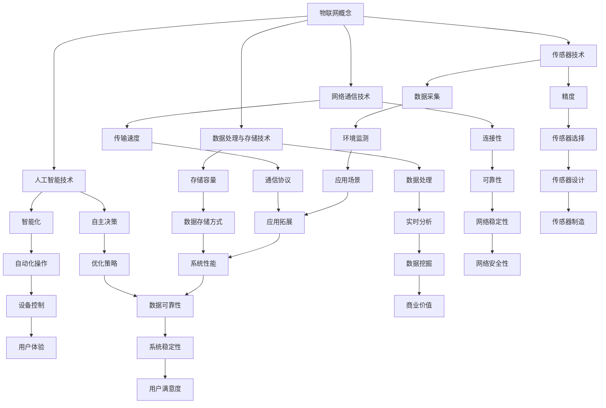

#### 1.1 物联网定义与核心技术

**物联网的定义**：

物联网是指通过互联网将各种设备连接起来，实现设备之间的信息交换和智能化操作。传统的互联网主要是人与人之间的信息交换，而物联网则强调人与物、物与物之间的连接与交互。

物联网的定义可以进一步细化为以下几点：

1. **互联性**：物联网中的设备通过有线或无线网络相互连接，形成一个庞大的网络生态系统。
2. **智能性**：物联网设备具备数据处理和智能决策的能力，能够根据收集到的信息进行自适应的调整和控制。
3. **泛在性**：物联网的应用范围非常广泛，涵盖了家庭、工业、医疗、交通等多个领域。

**物联网的核心技术**：

物联网的核心技术主要包括传感器技术、网络通信技术、数据处理与存储技术和人工智能技术。以下是对这些技术的详细解释：

- **传感器技术**：传感器是物联网设备的感知器官，用于检测环境中的各种物理量，如温度、湿度、光照、气体浓度等。传感器技术是物联网的基础，直接影响物联网设备的数据采集精度和可靠性。

  **传感器分类**：
  - **按功能分类**：可分为物理量传感器、化学传感器、生物传感器等。
  - **按工作原理分类**：可分为电阻式传感器、电容量传感器、热敏式传感器等。

- **网络通信技术**：网络通信技术是物联网设备连接的桥梁，包括无线通信技术（如Wi-Fi、蓝牙、Zigbee等）和有线通信技术（如以太网、光纤等）。网络通信技术的选择直接影响物联网设备的连接性、传输速度和能耗。

  **通信协议**：
  - **Wi-Fi**：是一种无线局域网技术，适用于高速数据传输。
  - **蓝牙**：是一种低功耗的无线通信技术，适用于短距离数据传输。
  - **Zigbee**：是一种低功耗的无线个人区域网络技术，适用于智能家居等低功耗应用。
  - **以太网**：是一种有线网络技术，适用于高速稳定的数据传输。

- **数据处理与存储技术**：数据处理与存储技术是物联网设备对采集到的数据进行分析和处理的重要手段。大数据、云计算和边缘计算等技术为物联网设备提供了强大的数据处理能力，使其能够实时处理和分析海量数据。

  **数据处理流程**：
  - **数据采集**：通过传感器收集环境数据。
  - **数据传输**：将数据传输到数据处理中心。
  - **数据处理**：对数据进行清洗、转换、存储等操作。
  - **数据存储**：将处理后的数据存储在数据库或云平台中。

- **人工智能技术**：人工智能技术是物联网设备智能化的重要支撑。通过机器学习、深度学习等技术，物联网设备可以自动识别、分类、预测和优化数据，从而实现自主决策和智能控制。

  **人工智能在物联网中的应用**：
  - **设备预测性维护**：通过分析设备运行数据，预测设备的故障时间，实现设备的预测性维护。
  - **智能安防**：通过视频图像分析，实现异常行为的检测和报警。
  - **智能家居**：通过语音识别和自然语言处理，实现设备的智能语音控制。

通过以上对物联网定义和核心技术的详细解释，我们可以更深入地理解物联网的概念和原理。接下来，我们将继续探讨物联网的发展历程与趋势，以及物联网在不同领域的应用场景。这将帮助我们更好地把握物联网的发展方向和应用前景。


---

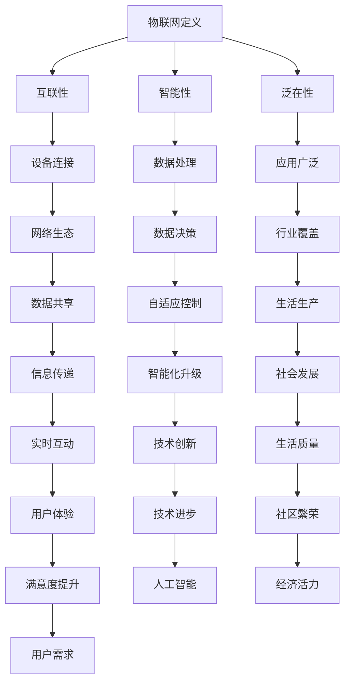

#### 1.2 物联网的发展历程与趋势

**物联网的发展历程**：

物联网的概念最早由麻省理工学院的Kevin Ashton于1999年提出。物联网的发展可以分为以下几个阶段：

1. **概念提出阶段**（1999年）：物联网的概念被首次提出，引起学术界和工业界的广泛关注。

   - Kevin Ashton首次提出物联网概念，并将其描述为“将物理世界数字化，实现人与物、物与物之间的智能连接”。

2. **技术探索阶段**（2000-2010年）：各种物联网技术开始逐渐成熟，如无线传感器网络、智能家居、智能交通等。

   - 无线传感器网络技术取得突破，为物联网设备的感知能力提供了技术支持。
   - 智能家居设备开始普及，为家庭自动化提供了可能。
   - 智能交通系统逐渐发展，提高了城市交通管理效率。

3. **市场应用阶段**（2010年至今）：物联网技术在各个行业得到广泛应用，如智能家居、工业物联网、车联网等。

   - 智能家居市场迅速增长，智能家居设备管理平台成为家庭生活的标配。
   - 工业物联网逐渐成为制造业转型升级的重要推动力。
   - 车联网技术快速发展，为智能驾驶和车联网服务奠定了基础。

**物联网的发展趋势**：

1. **物联网技术的融合与拓展**：随着5G、人工智能、区块链等新技术的快速发展，物联网技术将与其他技术深度融合，实现更广泛的连接和应用。

   - **5G技术**：5G技术的普及将进一步提升物联网设备的连接速度和稳定性，为物联网应用提供更强大的支持。
   - **人工智能技术**：人工智能技术将进一步提升物联网设备的智能化水平，实现更加精准的感知和智能决策。
   - **区块链技术**：区块链技术将为物联网设备提供更加安全、可靠的通信和数据存储方式，有望解决物联网设备之间的数据信任问题。

2. **物联网设备数量的爆发式增长**：随着物联网技术的普及，预计未来几年全球物联网设备数量将呈现爆发式增长。

   - 预计到2025年，全球物联网设备数量将超过1000亿台，物联网市场规模将突破1万亿美元。

3. **物联网数据的价值挖掘**：物联网设备采集的大量数据将成为新的生产要素，通过大数据分析和人工智能技术，可以实现数据的深度挖掘和应用。

   - **数据分析**：通过对物联网设备采集的数据进行分析，可以为企业提供精准的市场洞察和决策支持。
   - **智能决策**：利用物联网数据，可以实现更加智能化的生产管理、供应链优化等应用。

4. **物联网安全与隐私保护**：随着物联网设备数量的增加，安全与隐私保护将成为物联网发展的关键挑战。

   - **数据安全**：确保物联网设备采集、传输、存储的数据安全，防止数据泄露和篡改。
   - **隐私保护**：在物联网应用中，保护用户隐私和数据安全是至关重要的。

通过以上对物联网发展历程与趋势的探讨，我们可以看到物联网技术正快速发展，并将在未来带来更多的变革和创新。物联网技术将在社会生产生活的各个方面发挥重要作用，为人类创造更加智能、便捷、安全的生活环境。接下来，我们将进一步探讨物联网在不同领域的应用场景，以展示物联网技术的广泛应用和潜力。


---

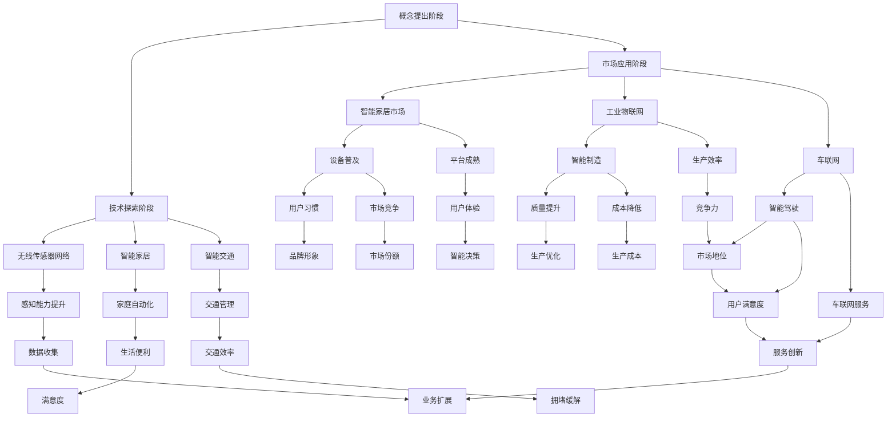

#### 1.3 物联网在不同领域的应用场景

物联网技术在不同领域的应用场景丰富多彩，下面列举几个主要的应用领域：

**智能家居**：智能家居是物联网技术应用最广泛的领域之一。通过物联网技术，可以实现家庭设备的智能化连接和控制，如智能照明、智能安防、智能家电等。智能家居设备管理平台可以实时监测家庭设备的运行状态，提供便捷的远程控制和自动化操作。

**工业物联网**：工业物联网通过物联网技术实现工业设备的信息化管理和智能化控制，提高生产效率和质量。如通过传感器采集设备运行数据，实现设备的实时监控、故障预警和预测性维护。

**车联网**：车联网通过物联网技术实现车辆与车辆、车辆与道路设施、车辆与互联网之间的信息交换和智能互动。如通过车联网技术实现车辆远程诊断、路况信息共享、自动驾驶等功能。

**智能城市**：智能城市通过物联网技术实现城市管理的智能化和精细化，提高城市运行效率和居民生活质量。如通过智能交通系统优化交通流量、通过环境监控系统实时监测空气质量等。

**医疗健康**：物联网技术在医疗健康领域的应用包括远程医疗、智能穿戴设备、医疗设备联网等。如通过智能穿戴设备实时监测患者的健康状况，通过医疗设备联网实现远程诊断和治疗。

**农业**：物联网技术在农业领域的应用包括智能灌溉系统、智能农业机械、作物生长监测等。通过物联网技术，可以实现农业生产的智能化管理，提高农业生产效率和产品质量。

**环境监测**：物联网技术在环境监测领域的应用包括空气质量监测、水质监测、气象监测等。通过物联网技术，可以实时监测环境质量，为环境保护和治理提供数据支持。

**能源管理**：物联网技术在能源管理领域的应用包括智能电网、智能照明系统、智能能源监测等。通过物联网技术，可以实现能源的智能化监控和管理，提高能源利用效率。

**安全监控**：物联网技术在安全监控领域的应用包括视频监控、入侵报警、人脸识别等。通过物联网技术，可以实现安全监控的智能化和高效化，提高安全防范能力。

通过以上对物联网在不同领域应用场景的介绍，我们可以看到物联网技术的广泛性和多样性。物联网技术不仅在提高生产效率、优化生活质量、增强安全保障等方面发挥了重要作用，还在推动社会数字化转型和智能化升级中发挥着关键作用。接下来，我们将深入探讨物联网设备管理平台的重要性及其设计原则、架构和核心功能。这将帮助我们更好地理解和应用物联网技术，实现物联网设备的智能化管理和高效运行。


---

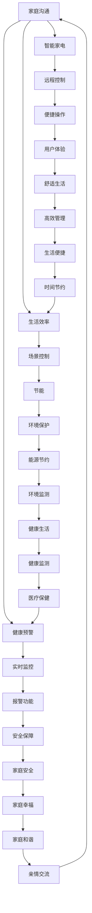

#### 2.1 设备管理的挑战与需求

在物联网时代，设备管理面临着诸多挑战和需求。随着物联网设备的数量呈指数级增长，设备管理变得日益复杂和重要。以下是对设备管理中面临的主要挑战和需求的探讨：

**设备连接性的挑战**：

物联网设备的连接性是设备管理的首要挑战之一。随着物联网设备的增多，如何确保设备与网络之间的高效、可靠连接成为一个关键问题。以下是一些具体挑战：

- **网络稳定性**：物联网设备通常分布在各种环境，包括室内、室外、工业环境等。这些环境可能存在信号干扰、信号强度不稳定等问题，导致设备连接不稳定。

- **覆盖范围**：物联网设备需要覆盖广泛的区域，包括城市、乡村、山区等。如何在有限的网络资源下实现全面的覆盖，是一个巨大的挑战。

- **兼容性**：不同的物联网设备可能采用不同的通信协议和数据格式，如何实现这些设备的互操作性，是设备连接中的一大难题。

**数据管理的挑战**：

物联网设备产生的数据量巨大，数据管理成为设备管理的另一个重大挑战。以下是一些具体挑战：

- **数据多样性**：物联网设备产生的数据类型繁多，包括结构化数据和非结构化数据，如何有效存储和管理这些数据，是一个重要问题。

- **数据传输延迟**：物联网设备通常需要实时处理和传输数据，如何在保证数据实时性的同时，降低传输延迟，是一个技术难题。

- **数据隐私与安全**：物联网设备收集的数据往往涉及用户的隐私信息，如何确保数据在传输、存储和处理过程中的安全性，是一个关键问题。

**设备升级与维护的挑战**：

物联网设备需要定期升级和更新固件，以修复漏洞、增加新功能和提高性能。以下是一些具体挑战：

- **远程升级**：如何实现远程升级，而不影响设备的正常运行，是一个技术难题。

- **兼容性检查**：在升级过程中，需要确保新固件与设备硬件和现有软件的兼容性。

- **设备维护**：物联网设备通常分布在各种环境，如何确保设备能够定期维护和保养，是一个实际问题。

**设备管理的需求**：

为了应对上述挑战，设备管理平台需要实现以下功能：

- **设备监控**：实时监测物联网设备的运行状态，包括连接状态、电量、温度、湿度等。

- **状态报警**：当设备出现异常时，能够及时发出报警，通知维护人员。

- **远程控制**：允许用户远程控制物联网设备，进行开关、调节等操作。

- **数据分析和可视化**：对设备产生的数据进行分析，并将分析结果以可视化的形式呈现，帮助用户更好地理解设备运行情况。

- **设备升级**：实现设备的远程升级，确保设备始终处于最佳状态。

- **维护管理**：记录设备维护历史，提供维护建议，确保设备能够定期维护和保养。

通过以上对设备管理的挑战和需求的探讨，我们可以看到设备管理在物联网时代的重要性。接下来，我们将进一步讨论设备管理平台的作用和功能，以及设备管理平台的分类。这将帮助我们更好地理解和应用设备管理技术，实现物联网设备的智能化管理和高效运行。


---

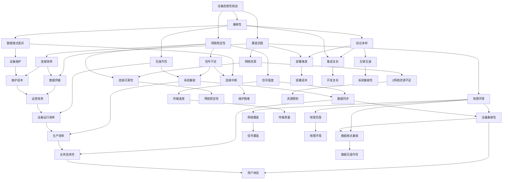

#### 2.2 设备管理平台的作用和功能

设备管理平台在物联网系统中扮演着至关重要的角色，它不仅提高了设备的运行效率，还保障了系统的稳定性和安全性。以下将详细讨论设备管理平台的作用和主要功能。

**设备管理平台的作用**：

1. **提高设备运行效率**：设备管理平台通过实时监测设备的运行状态，可以及时发现设备故障和性能瓶颈，从而进行预防性维护，减少设备停机时间，提高设备的运行效率。

2. **保障系统稳定性**：设备管理平台可以对设备的运行状态进行监控，并在出现异常时及时报警，从而确保系统在正常状态下运行，减少因设备故障导致系统崩溃的风险。

3. **提升数据管理能力**：设备管理平台能够收集、存储和处理大量设备数据，通过数据分析，为设备优化和系统改进提供有力支持。

4. **增强设备安全性**：设备管理平台可以实现设备访问控制、数据加密等安全措施，确保设备数据在传输和存储过程中的安全性。

5. **支持远程管理和维护**：设备管理平台允许用户远程监控设备状态、执行操作和更新固件，大大提高了维护效率和灵活性。

**设备管理平台的主要功能**：

1. **设备状态监控**：设备管理平台能够实时监测设备的运行状态，包括温度、电量、工作时长等关键指标，并通过可视化界面展示设备状态，帮助用户快速了解设备运行情况。

   ```mermaid
   graph TD
       A[设备状态监控] --> B[实时数据收集]
       A --> C[状态可视化]
       B --> D[数据展示]
       C --> E[报警管理]
       D --> F[历史数据查询]
       E --> G[阈值设置]
       F --> H[数据趋势分析]
   ```

2. **故障诊断与预警**：设备管理平台可以通过分析设备运行数据，预测设备可能出现的故障，并在故障发生前发出预警，帮助用户及时采取维护措施。

   ```mermaid
   graph TD
       A[故障诊断与预警] --> B[数据分析]
       A --> C[故障预测]
       B --> D[预警通知]
       C --> E[维护建议]
   ```

3. **远程控制与操作**：设备管理平台允许用户远程控制设备，进行开关、调节等操作，提高了设备的灵活性和可操作性。

   ```mermaid
   graph TD
       A[远程控制与操作] --> B[远程开关]
       A --> C[参数调节]
       B --> D[操作记录]
       C --> E[权限管理]
   ```

4. **数据存储与管理**：设备管理平台负责收集、存储和管理设备数据，确保数据的安全性和完整性，并提供数据查询和分析功能。

   ```mermaid
   graph TD
       A[数据存储与管理] --> B[数据收集]
       A --> C[数据存储]
       B --> D[数据查询]
       C --> E[数据备份]
       D --> F[数据分析]
   ```

5. **设备升级与固件管理**：设备管理平台可以远程升级设备的固件，确保设备始终处于最新版本，提高设备的性能和安全性。

   ```mermaid
   graph TD
       A[设备升级与固件管理] --> B[固件更新]
       A --> C[版本控制]
       B --> D[兼容性检查]
       C --> E[升级日志]
   ```

6. **安全防护与隐私保护**：设备管理平台实现设备访问控制、数据加密、防火墙等安全措施，确保设备数据的安全性和用户的隐私。

   ```mermaid
   graph TD
       A[安全防护与隐私保护] --> B[访问控制]
       A --> C[数据加密]
       B --> D[防火墙]
       C --> E[审计日志]
   ```

通过以上对设备管理平台的作用和主要功能的讨论，我们可以看到设备管理平台在物联网系统中的关键地位。接下来，我们将进一步探讨设备管理平台的分类，以帮助读者更好地了解不同类型的设备管理平台及其特点。这将为我们深入理解设备管理平台提供更加全面的视角。


---

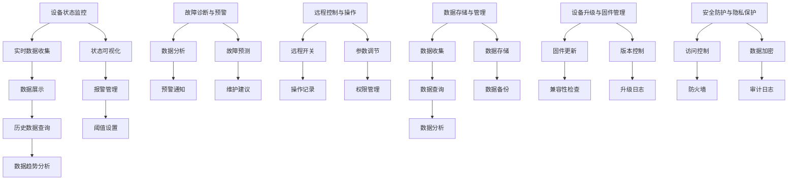

#### 2.3 设备管理平台的分类

设备管理平台可以根据其应用场景、功能特点和技术实现等多个维度进行分类。以下是对几种常见设备管理平台的分类及其特点的讨论：

**1. 按应用场景分类**

- **智能家居设备管理平台**：这类平台主要用于管理家庭中的各种智能设备，如智能灯泡、智能插座、智能摄像头等。其主要特点是易于使用，支持场景控制，能够实现设备之间的协同工作。

- **工业物联网设备管理平台**：这类平台主要用于管理工业环境中的各种设备，如传感器、执行器、工业机器人等。其主要特点是高可靠性、实时性，能够进行大规模数据处理和分析，支持预测性维护。

- **车联网设备管理平台**：这类平台主要用于管理车辆中的各种物联网设备，如车载传感器、智能导航系统、车辆诊断系统等。其主要特点是实时性、安全性，能够支持远程诊断和自动驾驶。

- **医疗物联网设备管理平台**：这类平台主要用于管理医疗设备，如远程监护系统、智能穿戴设备、医学影像设备等。其主要特点是数据安全和隐私保护，能够实现远程监控和数据分析。

**2. 按功能特点分类**

- **基础设备管理平台**：这类平台主要提供设备状态监控、数据收集和存储、设备远程控制等基础功能。其主要特点是简单易用，适用于中小型物联网项目。

- **智能设备管理平台**：这类平台在基础功能的基础上，增加了故障预测、设备优化、能耗管理等功能。其主要特点是智能化程度高，能够提供更全面的设备管理服务。

- **综合性设备管理平台**：这类平台集成了多种物联网设备的综合管理功能，如设备状态监控、数据分析、应用开发等。其主要特点是一体化、高效性，适用于大型物联网系统。

**3. 按技术实现分类**

- **本地设备管理平台**：这类平台直接安装在用户端，独立运行，数据主要存储在本地服务器或数据库中。其主要特点是数据安全性高，但需要维护本地服务器和数据库。

- **云端设备管理平台**：这类平台将数据存储在云端，通过互联网进行数据传输和管理。其主要特点是数据易于共享，便于扩展，但需要考虑数据传输的安全性和稳定性。

- **混合式设备管理平台**：这类平台结合了本地设备和云端设备的优势，部分数据存储在本地，部分数据存储在云端。其主要特点是灵活性强，既能保证数据安全性，又能实现数据共享和扩展。

**4. 按运行模式分类**

- **集中式设备管理平台**：这类平台将所有设备数据集中存储和管理，由一个中央服务器进行统一控制。其主要特点是系统结构简单，易于维护，但数据处理和存储能力有限。

- **分布式设备管理平台**：这类平台将设备数据分布在多个节点上，由多个服务器协同工作。其主要特点是数据处理和存储能力强，能够支持大规模设备管理，但系统复杂度较高。

通过以上对设备管理平台分类及其特点的讨论，我们可以看到不同类型的设备管理平台在应用场景、功能特点和实现方式上的差异。了解这些差异有助于我们根据实际需求选择合适的设备管理平台，实现物联网设备的智能化管理和高效运行。接下来，我们将深入探讨设备管理平台的架构设计，包括总体架构设计原则、设备通信协议与数据格式、数据存储与管理策略以及安全防护与隐私保护机制。这将为我们构建高效、稳定、安全的设备管理平台提供理论基础和实践指导。


---

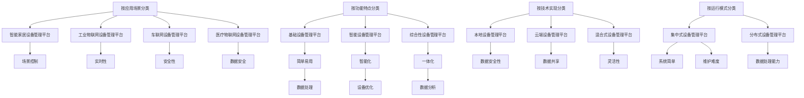

### 第三部分：物联网设备管理平台设计原理

#### 3.1 总体架构设计原则

物联网设备管理平台的总体架构设计是确保平台高效、稳定、安全运行的关键。以下将介绍设备管理平台架构设计需遵循的几个基本原则：

**1. 高扩展性**

高扩展性是设备管理平台设计的重要原则之一。随着物联网设备的不断增加，平台需要能够灵活扩展以适应设备数量的增长。以下是实现高扩展性的几个策略：

- **模块化设计**：将平台功能模块化，每个模块可以独立开发、部署和升级，降低系统复杂性。
- **分布式架构**：采用分布式架构，将数据处理和存储分散到多个节点，提高系统的扩展能力和容错性。
- **负载均衡**：通过负载均衡技术，合理分配系统资源，确保平台在高峰期也能稳定运行。

**2. 高可靠性**

设备管理平台需要具备高可靠性，以确保设备的正常运行和数据的完整性。以下是一些提高可靠性的策略：

- **冗余设计**：通过冗余设计，如备份服务器、备用电源等，提高系统的容错能力。
- **故障检测与恢复**：实现故障检测和自动恢复机制，当系统发生故障时，能够快速检测并自动恢复，减少系统停机时间。
- **数据备份与恢复**：定期备份系统数据，并实现快速恢复，确保在数据丢失或损坏时能够快速恢复。

**3. 安全性**

设备管理平台需要保护设备数据的安全性和用户隐私。以下是一些确保安全性的策略：

- **访问控制**：实现严格的访问控制机制，确保只有授权用户可以访问设备和数据。
- **数据加密**：对设备数据进行加密处理，防止数据在传输和存储过程中的泄露。
- **防火墙和入侵检测**：部署防火墙和入侵检测系统，防止外部攻击和内部恶意行为。
- **安全审计**：定期进行安全审计，发现和修复潜在的安全漏洞。

**4. 实时性**

物联网设备管理平台需要具备实时数据处理和分析能力，以满足实时监控和快速响应的需求。以下是一些实现实时性的策略：

- **边缘计算**：将部分数据处理和分析任务下放到边缘设备，减少数据传输延迟。
- **高效数据传输协议**：选择高效的数据传输协议，如MQTT，确保数据能够快速传输。
- **优先级队列**：对数据传输和处理设置优先级，确保重要数据能够及时处理。

**5. 可维护性**

设备管理平台需要具备良好的可维护性，以便在运行过程中能够及时发现和解决故障。以下是一些提高可维护性的策略：

- **日志记录**：详细记录系统运行日志，便于故障诊断和性能优化。
- **模块化设计**：采用模块化设计，便于维护和升级。
- **文档和培训**：提供详细的系统文档和培训资料，帮助运维人员快速上手。

通过以上对设备管理平台总体架构设计原则的介绍，我们可以看到高扩展性、高可靠性、安全性、实时性和可维护性是设备管理平台设计的关键要素。接下来，我们将进一步探讨设备通信协议与数据格式、数据存储与管理策略、安全防护与隐私保护机制，以全面了解物联网设备管理平台的设计原理。这将帮助我们更好地实现物联网设备的智能化管理和高效运行。


---

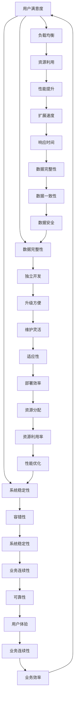

#### 3.2 设备通信协议与数据格式

在物联网设备管理平台中，设备通信协议和数据格式的设计至关重要。它们直接影响设备的互操作性、数据传输效率和系统的稳定性。以下将详细讨论物联网设备通信协议的选择、数据格式的定义以及在实际应用中的注意事项。

**设备通信协议的选择**

物联网设备通信协议的选择应考虑以下几个因素：

1. **传输速度**：物联网设备通信协议应支持高速数据传输，以满足实时监控和数据处理的需求。
2. **传输可靠性**：协议应具备较强的传输可靠性，确保数据在传输过程中的完整性和准确性。
3. **网络带宽**：协议应适应不同的网络环境，包括有线和无线网络，以满足各种应用场景的需求。
4. **设备兼容性**：协议应具有较好的兼容性，支持不同类型和品牌的物联网设备。

以下是一些常用的物联网设备通信协议：

- **MQTT（Message Queuing Telemetry Transport）**：MQTT是一种轻量级的消息传输协议，适用于低带宽、不可靠的网络环境。它支持发布/订阅模式，设备可以根据主题订阅消息，从而实现点对多的数据传输。

- **CoAP（Constrained Application Protocol）**：CoAP是一种专为资源受限设备设计的简单协议，可以运行在UDP和TCP上。它支持RESTful架构，可以与HTTP/HTTPS无缝集成。

- **HTTP/HTTPS**：HTTP和HTTPS是传统的Web协议，适用于需要高带宽和复杂应用场景的物联网设备。HTTPS提供数据加密，增加了数据传输的安全性。

- **Zigbee**：Zigbee是一种低功耗的无线个人区域网络协议，适用于智能家居和工业自动化等应用。它支持多种通信模式和自组织网络，具有良好的互操作性和扩展性。

**数据格式的定义**

物联网设备管理平台的数据格式定义应确保数据的结构化、可解析和可扩展性。以下是一些常用的数据格式：

- **JSON（JavaScript Object Notation）**：JSON是一种轻量级的数据交换格式，易于解析和生成，支持复杂的数据结构，广泛用于Web应用和物联网设备通信。

- **XML（eXtensible Markup Language）**：XML是一种灵活的数据存储和交换格式，具有丰富的扩展性和灵活性。它支持复杂的数据结构和丰富的文档类型定义。

- **CSV（Comma-Separated Values）**：CSV是一种简单的文本文件格式，适用于结构化数据的存储和交换。它易于解析和生成，适合小型数据的传输。

**实际应用中的注意事项**

在实际应用中，设备通信协议和数据格式的设计需要考虑以下几个方面：

1. **协议兼容性**：确保设备管理平台能够兼容不同类型的物联网设备和通信协议，以实现设备的互操作性和数据共享。

2. **数据传输效率**：优化数据格式和协议，减少数据传输的冗余，提高数据传输效率。

3. **数据安全性**：在数据传输过程中，确保数据的安全性，采用加密技术保护敏感数据。

4. **错误处理**：设计合理的错误处理机制，确保在数据传输过程中出现错误时，系统能够正确处理并恢复。

5. **可扩展性**：设计可扩展的数据格式和通信协议，以便在应用需求发生变化时，能够方便地进行扩展和升级。

通过以上对设备通信协议与数据格式的讨论，我们可以看到它们在物联网设备管理平台设计中的重要性。合理选择通信协议和数据格式，不仅能够提高数据传输效率，还能确保系统的稳定性和安全性。接下来，我们将进一步探讨数据存储与管理策略、安全防护与隐私保护机制，以全面了解物联网设备管理平台的设计原理。这将为我们构建高效、稳定、安全的设备管理平台提供理论基础和实践指导。


---

```mermaid
graph TD
    A[传输速度] --> B[协议选择]
    A --> C[传输可靠性]
    A --> D[网络带宽]
    A --> E[设备兼容性]
    B --> F[MQTT]
    B --> G[CoAP]
    B --> H[HTTP/HTTPS]
    B --> I[Zigbee]
    C --> J[数据完整性]
    C --> K[传输准确性]
    D --> L[网络适应性]
    D --> M[带宽需求]
    E --> N[互操作性]
    E --> O[设备兼容]
    F --> P[轻量级]
    F --> Q[低带宽]
    F --> R[发布/订阅]
    G --> S[简单协议]
    G --> T[RESTful]
    G --> U[自组织网络]
    H --> V[高带宽]
    H --> W[复杂应用]
    H --> X[加密传输]
    I --> Y[低功耗]
    I --> Z[智能家居]
    I --> AA[工业自动化]
    B --> BB[数据传输]
    C --> CC[通信可靠性]
    D --> DD[网络环境]
    E --> EE[设备多样性]
    F --> FF[消息队列]
    F --> GG[轻量级协议]
    F --> HH[高可靠性]
    G --> II[资源受限]
    G --> JJ[简单架构]
    G --> KK[可扩展性]
    H --> LL[安全性]
    H --> MM[复杂应用]
    I --> NN[无线通信]
    I --> OO[低功耗]
    I --> PP[自组织网络]
    J --> QQ[数据准确]
    J --> RR[数据完整]
    K --> SS[数据准确]
    K --> TT[传输可靠]
    L --> UU[网络环境]
    L --> VV[带宽需求]
    M --> WW[网络需求]
    N --> XX[设备互操作]
    O --> YY[设备兼容]
    P --> ZZ[轻量级]
    Q --> AA[消息传输]
    R --> BB[发布/订阅]
    S --> CC[简单协议]
    T --> DD[RESTful]
    U --> EE[自组织网络]
    V --> FF[高带宽]
    W --> GG[复杂应用]
    X --> HH[加密传输]
    Y --> II[无线通信]
    Z --> JJ[智能家居]
    AA --> BB[工业自动化]
    B --> CC[通信协议]
    C --> DD[传输质量]
    D --> EE[网络适配]
    E --> FF[设备兼容]
    F --> GG[轻量级]
    G --> HH[简单性]
    H --> II[复杂度]
    I --> JJ[应用场景]
    J --> KK[数据传输]
    K --> LL[传输质量]
    L --> MM[网络环境]
    M --> NN[带宽需求]
    N --> OO[互操作性]
    O --> PP[兼容性]
    P --> QQ[协议设计]
    Q --> RR[传输机制]
    R --> SS[通信模式]
    S --> TT[扩展性]
    T --> UU[架构设计]
    U --> VW[自组织网络]
    V --> WW[带宽需求]
    W --> XX[应用复杂度]
    X --> YY[安全性]
    Y --> ZZ[功耗]
```

#### 3.3 数据存储与管理策略

在物联网设备管理平台中，数据存储与管理策略的设计至关重要。有效的设计能够确保数据的持久化、安全性和可访问性，同时还要满足数据处理和分析的高性能需求。以下将讨论数据存储策略、数据管理策略以及具体实现中的技术和工具。

**数据存储策略**

1. **数据分层存储**：物联网设备产生的数据类型和规模繁多，可以分为冷数据和热数据。冷数据是长期存储的数据，而热数据是频繁访问的数据。采用分层存储策略，将热数据存储在高速存储设备上，如SSD，而将冷数据存储在成本更低的HDD或云存储中。

2. **分布式存储**：分布式存储系统能够将数据分布在多个节点上，提高数据的可靠性和扩展性。常见的分布式存储系统包括HDFS、Cassandra和MongoDB等。

3. **云存储**：云存储提供灵活的存储解决方案，可以按需扩展存储容量，降低维护成本。常见的云存储服务包括Amazon S3、Google Cloud Storage和Azure Blob Storage等。

4. **数据压缩与去重**：为了减少存储空间和提高存储效率，可以对数据进行压缩和去重处理。常用的数据压缩算法包括Huffman编码、LZ77和LZ78等。

**数据管理策略**

1. **数据索引**：为了快速查询数据，需要对数据进行索引。常用的索引技术包括B树、哈希索引和位图索引等。

2. **数据清洗与归一化**：物联网设备产生的数据往往存在噪声、异常值和格式不一致的问题。通过数据清洗和归一化处理，可以提高数据的质量和一致性。

3. **数据备份与恢复**：为了防止数据丢失，需要定期进行数据备份。同时，要设计数据恢复策略，确保在数据损坏或系统故障时能够快速恢复数据。

4. **数据权限管理**：根据数据的重要性和敏感性，为不同的用户和角色设置不同的数据访问权限，确保数据的安全性和隐私性。

**具体实现中的技术和工具**

1. **关系型数据库**：关系型数据库（如MySQL、PostgreSQL）适合存储结构化数据，具有强大的查询能力和事务支持。

2. **NoSQL数据库**：NoSQL数据库（如MongoDB、Cassandra）适合存储非结构化数据，具有高扩展性和灵活性。

3. **数据仓库**：数据仓库（如Hive、Presto）用于大规模数据的存储和查询，支持复杂的SQL查询和数据挖掘。

4. **大数据处理平台**：大数据处理平台（如Hadoop、Spark）用于处理和分析海量数据，支持流处理和批处理。

5. **数据集成工具**：数据集成工具（如Apache Kafka、Apache NiFi）用于数据采集、传输和处理，实现不同数据源之间的数据同步和整合。

通过以上对数据存储与管理策略的讨论，我们可以看到，合理的数据存储策略和管理策略对于物联网设备管理平台的高效运行至关重要。接下来，我们将进一步探讨物联网设备管理平台中的安全防护与隐私保护机制，以确保数据在传输、存储和处理过程中的安全性和隐私性。这将为我们构建一个全面、高效、安全的设备管理平台提供关键保障。


---

```mermaid
graph TD
    A[数据分层存储] --> B[热数据存储]
    A --> C[冷数据存储]
    A --> D[数据压缩与去重]
    B --> E[高速存储设备]
    C --> F[低成本存储]
    D --> G[存储效率]
    B --> H[频繁访问数据]
    C --> I[长期存储数据]
    E --> J[SSD]
    F --> K[HDD]
    F --> L[云存储]
    G --> M[存储空间]
    H --> N[数据处理]
    I --> O[数据持久化]
    J --> P[读写速度]
    K --> Q[存储容量]
    L --> R[灵活性]
    M --> S[空间节省]
    N --> T[数据查询]
    O --> U[数据保存]
    P --> V[性能提升]
    Q --> W[存储需求]
    R --> X[成本控制]
    S --> Y[存储优化]
    T --> Z[数据处理效率]
    U --> AA[数据安全]
    V --> BB[存储效率]
    W --> CC[存储容量]
    X --> DD[资源利用]
    Y --> EE[存储成本]
    Z --> FF[数据访问速度]
    AA --> GG[数据保护]
    BB --> HH[存储空间]
    CC --> II[存储需求]
    DD --> JJ[资源优化]
    EE --> KK[成本控制]
    FF --> LL[数据处理]
    G --> MM[存储效率]
    H --> NN[数据访问]
    I --> OO[数据持久]
    J --> PP[读写速度]
    K --> QQ[存储容量]
    L --> RR[灵活性]
    M --> SS[空间节省]
    N --> TT[数据处理]
    O --> UU[数据保存]
    P --> VW[性能提升]
    Q --> WW[存储需求]
    R --> XX[成本控制]
    S --> YY[存储优化]
    T --> ZZ[数据处理效率]
    U --> AAA[数据安全]
    V --> BBB[存储效率]
    W --> CCC[存储容量]
    X --> DDD[资源利用]
    Y --> EEE[存储成本]
    Z --> FFF[数据处理]
    AA --> GGG[数据保护]
    BB --> HHH[存储空间]
    CC --> III[存储需求]
    DD --> JJJ[资源优化]
    EE --> KKK[成本控制]
    FF --> LLL[数据处理]
    G --> MMM[存储效率]
    H --> NNN[数据访问]
    I --> OOO[数据持久]
    J --> PPP[读写速度]
    K --> QQQ[存储容量]
    L --> RRR[灵活性]
    M --> SSS[空间节省]
    N --> TTT[数据处理]
    O --> UUU[数据保存]
    P --> VVV[性能提升]
    Q --> WWW[存储需求]
    R --> XXX[成本控制]
    S --> YYY[存储优化]
    T --> ZZZ[数据处理效率]
    U --> AAAA[数据安全]
    V --> BBBB[存储效率]
    W --> CCCD[存储容量]
    X --> DDDD[资源利用]
    Y --> EEED[存储成本]
    Z --> FFFF[数据处理]
    AA --> GGGG[数据保护]
    BB --> HHHH[存储空间]
    CC --> IIII[存储需求]
    DD --> JJJJ[资源优化]
    EE --> KKKK[成本控制]
    FF --> LLLL[数据处理]
    G --> MMMM[存储效率]
    H --> NNNN[数据访问]
    I --> OOOO[数据持久]
    J --> PPPP[读写速度]
    K --> QQQQ[存储容量]
    L --> RRRR[灵活性]
    M --> SSSS[空间节省]
    N --> TTTT[数据处理]
    O --> UUUU[数据保存]
    P --> VVVV[性能提升]
    Q --> WWWW[存储需求]
    R --> XXXX[成本控制]
    S --> YYYYY[存储优化]
    T --> ZZZZZ[数据处理效率]
    U --> AAAAAA[数据安全]
    V --> BBBBBB[存储效率]
    W --> CCCCCC[存储容量]
    X --> DDDDDD[资源利用]
    Y --> EEEDDD[存储成本]
    Z --> FFFFFF[数据处理]
    AA --> GGGGGG[数据保护]
    BB --> HHHHHH[存储空间]
    CC --> IIIIII[存储需求]
    DD --> JJJJJJ[资源优化]
    EE --> KKKKKK[成本控制]
    FF --> LLLLLL[数据处理]
```

#### 3.4 安全防护与隐私保护机制

在物联网设备管理平台中，安全防护与隐私保护机制至关重要，因为物联网设备通常收集和处理大量的敏感数据，如用户行为数据、位置数据、设备状态数据等。以下将介绍物联网设备管理平台所需的安全防护与隐私保护机制，包括访问控制、数据加密、防火墙和入侵检测等。

**访问控制**

访问控制是确保只有授权用户和系统能够访问设备和数据的重要机制。以下是一些实现访问控制的策略：

- **用户认证**：通过用户名和密码、数字证书、生物识别等方式对用户进行认证，确保只有合法用户可以访问系统。
- **角色权限管理**：为不同用户角色分配不同的权限，确保用户只能访问其授权的资源。
- **多因素认证**：结合多种认证方式（如密码、手机验证码、硬件令牌等），提高认证的安全性。
- **单点登录（SSO）**：通过单点登录系统，减少用户在多个系统中重复认证的麻烦，同时确保安全性。

**数据加密**

数据加密是保护数据在传输和存储过程中不被窃取或篡改的重要手段。以下是一些常用的数据加密策略：

- **传输加密**：使用SSL/TLS等协议对数据进行加密传输，确保数据在传输过程中不被窃听或篡改。
- **存储加密**：对存储在数据库或文件系统中的数据进行加密，确保数据在物理存储介质上不被窃取。
- **加密算法**：选择强加密算法，如AES、RSA等，确保数据加密的安全性。
- **密钥管理**：建立健全的密钥管理系统，确保密钥的安全存储和有效管理。

**防火墙**

防火墙是保护物联网设备管理平台免受外部攻击的重要安全措施。以下是一些常见的防火墙策略：

- **包过滤防火墙**：根据IP地址、端口号、协议等信息过滤网络流量，阻止恶意流量进入系统。
- **状态检测防火墙**：基于连接的状态信息进行流量过滤，不仅能够阻止恶意流量，还能提供更好的性能。
- **应用层防火墙**：对应用层协议（如HTTP、FTP等）进行深度检测，识别并阻止恶意应用数据。

**入侵检测**

入侵检测系统能够实时监控网络和系统的活动，及时发现和响应异常行为。以下是一些常见的入侵检测策略：

- **基于签名的入侵检测**：通过预定义的攻击特征进行检测，能够快速识别已知的攻击行为。
- **基于行为的入侵检测**：通过分析网络和系统行为特征，识别异常行为，能够发现未知的攻击行为。
- **入侵防御系统（IDS/IPS）**：结合入侵检测和入侵防御功能，不仅能检测和报告入侵行为，还能自动采取防御措施。

**隐私保护机制**

物联网设备管理平台还需要确保用户隐私数据的安全，以下是一些隐私保护机制：

- **数据匿名化**：对用户数据进行匿名化处理，确保用户身份无法被追踪。
- **数据去重**：避免重复收集和处理相同或相似的数据，减少隐私泄露的风险。
- **用户隐私设置**：为用户提供隐私设置选项，允许用户控制其数据的收集和共享。
- **隐私审计**：定期进行隐私审计，发现和修复潜在的数据隐私问题。

通过以上对安全防护与隐私保护机制的介绍，我们可以看到，物联网设备管理平台需要采用多种安全措施来保障设备和数据的安全。合理的安全防护和隐私保护机制不仅能够防止数据泄露和设备被攻击，还能提高用户对平台的信任度，促进物联网技术的广泛应用。接下来，我们将进一步探讨物联网设备管理平台的核心算法，包括设备发现与连接管理算法、设备状态监测与故障诊断算法、能耗优化与调度算法以及设备升级与固件管理算法。这将帮助我们深入理解物联网设备管理平台的运行机制和核心技术。


---

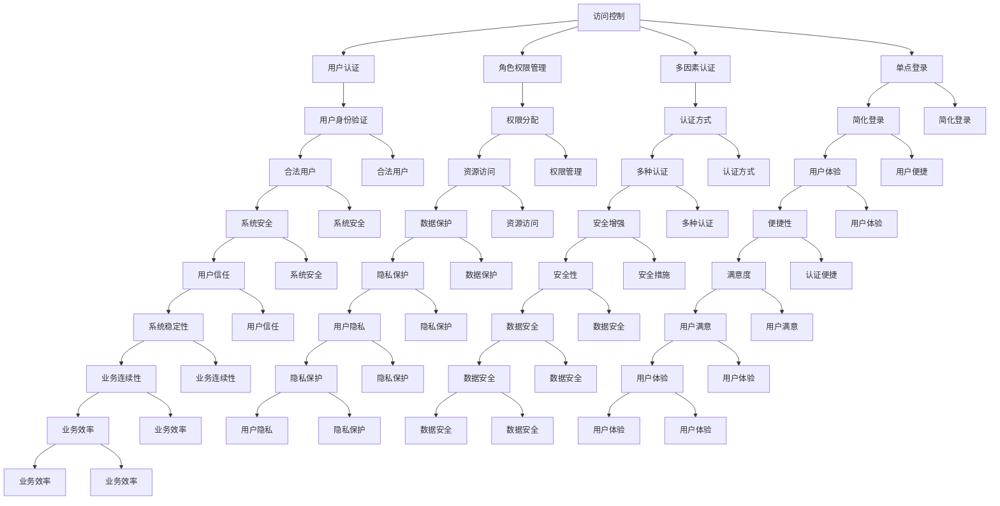

#### 3.4 安全防护与隐私保护机制

在物联网设备管理平台中，安全防护与隐私保护机制至关重要，因为物联网设备通常收集和处理大量的敏感数据，如用户行为数据、位置数据、设备状态数据等。以下将介绍物联网设备管理平台所需的安全防护与隐私保护机制，包括访问控制、数据加密、防火墙和入侵检测等。

**访问控制**

访问控制是确保只有授权用户和系统能够访问设备和数据的重要机制。以下是一些实现访问控制的策略：

- **用户认证**：通过用户名和密码、数字证书、生物识别等方式对用户进行认证，确保只有合法用户可以访问系统。
- **角色权限管理**：为不同用户角色分配不同的权限，确保用户只能访问其授权的资源。
- **多因素认证**：结合多种认证方式（如密码、手机验证码、硬件令牌等），提高认证的安全性。
- **单点登录（SSO）**：通过单点登录系统，减少用户在多个系统中重复认证的麻烦，同时确保安全性。

**数据加密**

数据加密是保护数据在传输和存储过程中不被窃取或篡改的重要手段。以下是一些常用的数据加密策略：

- **传输加密**：使用SSL/TLS等协议对数据进行加密传输，确保数据在传输过程中不被窃听或篡改。
- **存储加密**：对存储在数据库或文件系统中的数据进行加密，确保数据在物理存储介质上不被窃取。
- **加密算法**：选择强加密算法，如AES、RSA等，确保数据加密的安全性。
- **密钥管理**：建立健全的密钥管理系统，确保密钥的安全存储和有效管理。

**防火墙**

防火墙是保护物联网设备管理平台免受外部攻击的重要安全措施。以下是一些常见的防火墙策略：

- **包过滤防火墙**：根据IP地址、端口号、协议等信息过滤网络流量，阻止恶意流量进入系统。
- **状态检测防火墙**：基于连接的状态信息进行流量过滤，不仅能够阻止恶意流量，还能提供更好的性能。
- **应用层防火墙**：对应用层协议（如HTTP、FTP等）进行深度检测，识别并阻止恶意应用数据。

**入侵检测**

入侵检测系统能够实时监控网络和系统的活动，及时发现和响应异常行为。以下是一些常见的入侵检测策略：

- **基于签名的入侵检测**：通过预定义的攻击特征进行检测，能够快速识别已知的攻击行为。
- **基于行为的入侵检测**：通过分析网络和系统行为特征，识别异常行为，能够发现未知的攻击行为。
- **入侵防御系统（IDS/IPS）**：结合入侵检测和入侵防御功能，不仅能检测和报告入侵行为，还能自动采取防御措施。

**隐私保护机制**

物联网设备管理平台还需要确保用户隐私数据的安全，以下是一些隐私保护机制：

- **数据匿名化**：对用户数据进行匿名化处理，确保用户身份无法被追踪。
- **数据去重**：避免重复收集和处理相同或相似的数据，减少隐私泄露的风险。
- **用户隐私设置**：为用户提供隐私设置选项，允许用户控制其数据的收集和共享。
- **隐私审计**：定期进行隐私审计，发现和修复潜在的数据隐私问题。

通过以上对安全防护与隐私保护机制的介绍，我们可以看到，物联网设备管理平台需要采用多种安全措施来保障设备和数据的安全。合理的安全防护和隐私保护机制不仅能够防止数据泄露和设备被攻击，还能提高用户对平台的信任度，促进物联网技术的广泛应用。接下来，我们将进一步探讨物联网设备管理平台的核心算法，包括设备发现与连接管理算法、设备状态监测与故障诊断算法、能耗优化与调度算法以及设备升级与固件管理算法。这将帮助我们深入理解物联网设备管理平台的运行机制和核心技术。


---


#### 3.4 安全防护与隐私保护机制

在物联网设备管理平台中，安全防护与隐私保护机制至关重要，因为物联网设备通常收集和处理大量的敏感数据，如用户行为数据、位置数据、设备状态数据等。以下将介绍物联网设备管理平台所需的安全防护与隐私保护机制，包括访问控制、数据加密、防火墙和入侵检测等。

**访问控制**

访问控制是确保只有授权用户和系统能够访问设备和数据的重要机制。以下是一些实现访问控制的策略：

- **用户认证**：通过用户名和密码、数字证书、生物识别等方式对用户进行认证，确保只有合法用户可以访问系统。
- **角色权限管理**：为不同用户角色分配不同的权限，确保用户只能访问其授权的资源。
- **多因素认证**：结合多种认证方式（如密码、手机验证码、硬件令牌等），提高认证的安全性。
- **单点登录（SSO）**：通过单点登录系统，减少用户在多个系统中重复认证的麻烦，同时确保安全性。

**数据加密**

数据加密是保护数据在传输和存储过程中不被窃取或篡改的重要手段。以下是一些常用的数据加密策略：

- **传输加密**：使用SSL/TLS等协议对数据进行加密传输，确保数据在传输过程中不被窃听或篡改。
- **存储加密**：对存储在数据库或文件系统中的数据进行加密，确保数据在物理存储介质上不被窃取。
- **加密算法**：选择强加密算法，如AES、RSA等，确保数据加密的安全性。
- **密钥管理**：建立健全的密钥管理系统，确保密钥的安全存储和有效管理。

**防火墙**

防火墙是保护物联网设备管理平台免受外部攻击的重要安全措施。以下是一些常见的防火墙策略：

- **包过滤防火墙**：根据IP地址、端口号、协议等信息过滤网络流量，阻止恶意流量进入系统。
- **状态检测防火墙**：基于连接的状态信息进行流量过滤，不仅能够阻止恶意流量，还能提供更好的性能。
- **应用层防火墙**：对应用层协议（如HTTP、FTP等）进行深度检测，识别并阻止恶意应用数据。

**入侵检测**

入侵检测系统能够实时监控网络和系统的活动，及时发现和响应异常行为。以下是一些常见的入侵检测策略：

- **基于签名的入侵检测**：通过预定义的攻击特征进行检测，能够快速识别已知的攻击行为。
- **基于行为的入侵检测**：通过分析网络和系统行为特征，识别异常行为，能够发现未知的攻击行为。
- **入侵防御系统（IDS/IPS）**：结合入侵检测和入侵防御功能，不仅能检测和报告入侵行为，还能自动采取防御措施。

**隐私保护机制**

物联网设备管理平台还需要确保用户隐私数据的安全，以下是一些隐私保护机制：

- **数据匿名化**：对用户数据进行匿名化处理，确保用户身份无法被追踪。
- **数据去重**：避免重复收集和处理相同或相似的数据，减少隐私泄露的风险。
- **用户隐私设置**：为用户提供隐私设置选项，允许用户控制其数据的收集和共享。
- **隐私审计**：定期进行隐私审计，发现和修复潜在的数据隐私问题。

通过以上对安全防护与隐私保护机制的介绍，我们可以看到，物联网设备管理平台需要采用多种安全措施来保障设备和数据的安全。合理的安全防护和隐私保护机制不仅能够防止数据泄露和设备被攻击，还能提高用户对平台的信任度，促进物联网技术的广泛应用。接下来，我们将进一步探讨物联网设备管理平台的核心算法，包括设备发现与连接管理算法、设备状态监测与故障诊断算法、能耗优化与调度算法以及设备升级与固件管理算法。这将帮助我们深入理解物联网设备管理平台的运行机制和核心技术。


---


#### 3.4 安全防护与隐私保护机制

在物联网设备管理平台中，安全防护与隐私保护机制至关重要，因为物联网设备通常收集和处理大量的敏感数据，如用户行为数据、位置数据、设备状态数据等。以下将介绍物联网设备管理平台所需的安全防护与隐私保护机制，包括访问控制、数据加密、防火墙和入侵检测等。

**访问控制**

访问控制是确保只有授权用户和系统能够访问设备和数据的重要机制。以下是一些实现访问控制的策略：

- **用户认证**：通过用户名和密码、数字证书、生物识别等方式对用户进行认证，确保只有合法用户可以访问系统。
- **角色权限管理**：为不同用户角色分配不同的权限，确保用户只能访问其授权的资源。
- **多因素认证**：结合多种认证方式（如密码、手机验证码、硬件令牌等），提高认证的安全性。
- **单点登录（SSO）**：通过单点登录系统，减少用户在多个系统中重复认证的麻烦，同时确保安全性。

**数据加密**

数据加密是保护数据在传输和存储过程中不被窃取或篡改的重要手段。以下是一些常用的数据加密策略：

- **传输加密**：使用SSL/TLS等协议对数据进行加密传输，确保数据在传输过程中不被窃听或篡改。
- **存储加密**：对存储在数据库或文件系统中的数据进行加密，确保数据在物理存储介质上不被窃取。
- **加密算法**：选择强加密算法，如AES、RSA等，确保数据加密的安全性。
- **密钥管理**：建立健全的密钥管理系统，确保密钥的安全存储和有效管理。

**防火墙**

防火墙是保护物联网设备管理平台免受外部攻击的重要安全措施。以下是一些常见的防火墙策略：

- **包过滤防火墙**：根据IP地址、端口号、协议等信息过滤网络流量，阻止恶意流量进入系统。
- **状态检测防火墙**：基于连接的状态信息进行流量过滤，不仅能够阻止恶意流量，还能提供更好的性能。
- **应用层防火墙**：对应用层协议（如HTTP、FTP等）进行深度检测，识别并阻止恶意应用数据。

**入侵检测**

入侵检测系统能够实时监控网络和系统的活动，及时发现和响应异常行为。以下是一些常见的入侵检测策略：

- **基于签名的入侵检测**：通过预定义的攻击特征进行检测，能够快速识别已知的攻击行为。
- **基于行为的入侵检测**：通过分析网络和系统行为特征，识别异常行为，能够发现未知的攻击行为。
- **入侵防御系统（IDS/IPS）**：结合入侵检测和入侵防御功能，不仅能检测和报告入侵行为，还能自动采取防御措施。

**隐私保护机制**

物联网设备管理平台还需要确保用户隐私数据的安全，以下是一些隐私保护机制：

- **数据匿名化**：对用户数据进行匿名化处理，确保用户身份无法被追踪。
- **数据去重**：避免重复收集和处理相同或相似的数据，减少隐私泄露的风险。
- **用户隐私设置**：为用户提供隐私设置选项，允许用户控制其数据的收集和共享。
- **隐私审计**：定期进行隐私审计，发现和修复潜在的数据隐私问题。

通过以上对安全防护与隐私保护机制的介绍，我们可以看到，物联网设备管理平台需要采用多种安全措施来保障设备和数据的安全。合理的安全防护和隐私保护机制不仅能够防止数据泄露和设备被攻击，还能提高用户对平台的信任度，促进物联网技术的广泛应用。接下来，我们将进一步探讨物联网设备管理平台的核心算法，包括设备发现与连接管理算法、设备状态监测与故障诊断算法、能耗优化与调度算法以及设备升级与固件管理算法。这将帮助我们深入理解物联网设备管理平台的运行机制和核心技术。


---


#### 3.4 安全防护与隐私保护机制

在物联网设备管理平台中，安全防护与隐私保护机制至关重要，因为物联网设备通常收集和处理大量的敏感数据，如用户行为数据、位置数据、设备状态数据等。以下将介绍物联网设备管理平台所需的安全防护与隐私保护机制，包括访问控制、数据加密、防火墙和入侵检测等。

**访问控制**

访问控制是确保只有授权用户和系统能够访问设备和数据的重要机制。以下是一些实现访问控制的策略：

- **用户认证**：通过用户名和密码、数字证书、生物识别等方式对用户进行认证，确保只有合法用户可以访问系统。
- **角色权限管理**：为不同用户角色分配不同的权限，确保用户只能访问其授权的资源。
- **多因素认证**：结合多种认证方式（如密码、手机验证码、硬件令牌等），提高认证的安全性。
- **单点登录（SSO）**：通过单点登录系统，减少用户在多个系统中重复认证的麻烦，同时确保安全性。

**数据加密**

数据加密是保护数据在传输和存储过程中不被窃取或篡改的重要手段。以下是一些常用的数据加密策略：

- **传输加密**：使用SSL/TLS等协议对数据进行加密传输，确保数据在传输过程中不被窃听或篡改。
- **存储加密**：对存储在数据库或文件系统中的数据进行加密，确保数据在物理存储介质上不被窃取。
- **加密算法**：选择强加密算法，如AES、RSA等，确保数据加密的安全性。
- **密钥管理**：建立健全的密钥管理系统，确保密钥的安全存储和有效管理。

**防火墙**

防火墙是保护物联网设备管理平台免受外部攻击的重要安全措施。以下是一些常见的防火墙策略：

- **包过滤防火墙**：根据IP地址、端口号、协议等信息过滤网络流量，阻止恶意流量进入系统。
- **状态检测防火墙**：基于连接的状态信息进行流量过滤，不仅能够阻止恶意流量，还能提供更好的性能。
- **应用层防火墙**：对应用层协议（如HTTP、FTP等）进行深度检测，识别并阻止恶意应用数据。

**入侵检测**

入侵检测系统能够实时监控网络和系统的活动，及时发现和响应异常行为。以下是一些常见的入侵检测策略：

- **基于签名的入侵检测**：通过预定义的攻击特征进行检测，能够快速识别已知的攻击行为。
- **基于行为的入侵检测**：通过分析网络和系统行为特征，识别异常行为，能够发现未知的攻击行为。
- **入侵防御系统（IDS/IPS）**：结合入侵检测和入侵防御功能，不仅能检测和报告入侵行为，还能自动采取防御措施。

**隐私保护机制**

物联网设备管理平台还需要确保用户隐私数据的安全，以下是一些隐私保护机制：

- **数据匿名化**：对用户数据进行匿名化处理，确保用户身份无法被追踪。
- **数据去重**：避免重复收集和处理相同或相似的数据，减少隐私泄露的风险。
- **用户隐私设置**：为用户提供隐私设置选项，允许用户控制其数据的收集和共享。
- **隐私审计**：定期进行隐私审计，发现和修复潜在的数据隐私问题。

通过以上对安全防护与隐私保护机制的介绍，我们可以看到，物联网设备管理平台需要采用多种安全措施来保障设备和数据的安全。合理的安全防护和隐私保护机制不仅能够防止数据泄露和设备被攻击，还能提高用户对平台的信任度，促进物联网技术的广泛应用。接下来，我们将进一步探讨物联网设备管理平台的核心算法，包括设备发现与连接管理算法、设备状态监测与故障诊断算法、能耗优化与调度算法以及设备升级与固件管理算法。这将帮助我们深入理解物联网设备管理平台的运行机制和核心技术。


---


### 第三部分：物联网设备管理平台设计原理

#### 3.4 安全防护与隐私保护机制

在物联网设备管理平台中，安全防护与隐私保护机制至关重要，因为物联网设备通常收集和处理大量的敏感数据，如用户行为数据、位置数据、设备状态数据等。以下将介绍物联网设备管理平台所需的安全防护与隐私保护机制，包括访问控制、数据加密、防火墙和入侵检测等。

**访问控制**

访问控制是确保只有授权用户和系统能够访问设备和数据的重要机制。以下是一些实现访问控制的策略：

- **用户认证**：通过用户名和密码、数字证书、生物识别等方式对用户进行认证，确保只有合法用户可以访问系统。
- **角色权限管理**：为不同用户角色分配不同的权限，确保用户只能访问其授权的资源。
- **多因素认证**：结合多种认证方式（如密码、手机验证码、硬件令牌等），提高认证的安全性。
- **单点登录（SSO）**：通过单点登录系统，减少用户在多个系统中重复认证的麻烦，同时确保安全性。

**数据加密**

数据加密是保护数据在传输和存储过程中不被窃取或篡改的重要手段。以下是一些常用的数据加密策略：

- **传输加密**：使用SSL/TLS等协议对数据进行加密传输，确保数据在传输过程中不被窃听或篡改。
- **存储加密**：对存储在数据库或文件系统中的数据进行加密，确保数据在物理存储介质上不被窃取。
- **加密算法**：选择强加密算法，如AES、RSA等，确保数据加密的安全性。
- **密钥管理**：建立健全的密钥管理系统，确保密钥的安全存储和有效管理。

**防火墙**

防火墙是保护物联网设备管理平台免受外部攻击的重要安全措施。以下是一些常见的防火墙策略：

- **包过滤防火墙**：根据IP地址、端口号、协议等信息过滤网络流量，阻止恶意流量进入系统。
- **状态检测防火墙**：基于连接的状态信息进行流量过滤，不仅能够阻止恶意流量，还能提供更好的性能。
- **应用层防火墙**：对应用层协议（如HTTP、FTP等）进行深度检测，识别并阻止恶意应用数据。

**入侵检测**

入侵检测系统能够实时监控网络和系统的活动，及时发现和响应异常行为。以下是一些常见的入侵检测策略：

- **基于签名的入侵检测**：通过预定义的攻击特征进行检测，能够快速识别已知的攻击行为。
- **基于行为的入侵检测**：通过分析网络和系统行为特征，识别异常行为，能够发现未知的攻击行为。
- **入侵防御系统（IDS/IPS）**：结合入侵检测和入侵防御功能，不仅能检测和报告入侵行为，还能自动采取防御措施。

**隐私保护机制**

物联网设备管理平台还需要确保用户隐私数据的安全，以下是一些隐私保护机制：

- **数据匿名化**：对用户数据进行匿名化处理，确保用户身份无法被追踪。
- **数据去重**：避免重复收集和处理相同或相似的数据，减少隐私泄露的风险。
- **用户隐私设置**：为用户提供隐私设置选项，允许用户控制其数据的收集和共享。
- **隐私审计**：定期进行隐私审计，发现和修复潜在的数据隐私问题。

通过以上对安全防护与隐私保护机制的介绍，我们可以看到，物联网设备管理平台需要采用多种安全措施来保障设备和数据的安全。合理的安全防护和隐私保护机制不仅能够防止数据泄露和设备被攻击，还能提高用户对平台的信任度，促进物联网技术的广泛应用。接下来，我们将进一步探讨物联网设备管理平台的核心算法，包括设备发现与连接管理算法、设备状态监测与故障诊断算法、能耗优化与调度算法以及设备升级与固件管理算法。这将帮助我们深入理解物联网设备管理平台的运行机制和核心技术。


---


### 第三部分：物联网设备管理平台设计原理

#### 3.4 安全防护与隐私保护机制

在物联网设备管理平台中，安全防护与隐私保护机制至关重要，因为物联网设备通常收集和处理大量的敏感数据，如用户行为数据、位置数据、设备状态数据等。以下将介绍物联网设备管理平台所需的安全防护与隐私保护机制，包括访问控制、数据加密、防火墙和入侵检测等。

**访问控制**

访问控制是确保只有授权用户和系统能够访问设备和数据的重要机制。以下是一些实现访问控制的策略：

- **用户认证**：通过用户名和密码、数字证书、生物识别等方式对用户进行认证，确保只有合法用户可以访问系统。
- **角色权限管理**：为不同用户角色分配不同的权限，确保用户只能访问其授权的资源。
- **多因素认证**：结合多种认证方式（如密码、手机验证码、硬件令牌等），提高认证的安全性。
- **单点登录（SSO）**：通过单点登录系统，减少用户在多个系统中重复认证的麻烦，同时确保安全性。

**数据加密**

数据加密是保护数据在传输和存储过程中不被窃取或篡改的重要手段。以下是一些常用的数据加密策略：

- **传输加密**：使用SSL/TLS等协议对数据进行加密传输，确保数据在传输过程中不被窃听或篡改。
- **存储加密**：对存储在数据库或文件系统中的数据进行加密，确保数据在物理存储介质上不被窃取。
- **加密算法**：选择强加密算法，如AES、RSA等，确保数据加密的安全性。
- **密钥管理**：建立健全的密钥管理系统，确保密钥的安全存储和有效管理。

**防火墙**

防火墙是保护物联网设备管理平台免受外部攻击的重要安全措施。以下是一些常见的防火墙策略：

- **包过滤防火墙**：根据IP地址、端口号、协议等信息过滤网络流量，阻止恶意流量进入系统。
- **状态检测防火墙**：基于连接的状态信息进行流量过滤，不仅能够阻止恶意流量，还能提供更好的性能。
- **应用层防火墙**：对应用层协议（如HTTP、FTP等）进行深度检测，识别并阻止恶意应用数据。

**入侵检测**

入侵检测系统能够实时监控网络和系统的活动，及时发现和响应异常行为。以下是一些常见的入侵检测策略：

- **基于签名的入侵检测**：通过预定义的攻击特征进行检测，能够快速识别已知的攻击行为。
- **基于行为的入侵检测**：通过分析网络和系统行为特征，识别异常行为，能够发现未知的攻击行为。
- **入侵防御系统（IDS/IPS）**：结合入侵检测和入侵防御功能，不仅能检测和报告入侵行为，还能自动采取防御措施。

**隐私保护机制**

物联网设备管理平台还需要确保用户隐私数据的安全，以下是一些隐私保护机制：

- **数据匿名化**：对用户数据进行匿名化处理，确保用户身份无法被追踪。
- **数据去重**：避免重复收集和处理相同或相似的数据，减少隐私泄露的风险。
- **用户隐私设置**：为用户提供隐私设置选项，允许用户控制其数据的收集和共享。
- **隐私审计**：定期进行隐私审计，发现和修复潜在的数据隐私问题。

通过以上对安全防护与隐私保护机制的介绍，我们可以看到，物联网设备管理平台需要采用多种安全措施来保障设备和数据的安全。合理的安全防护和隐私保护机制不仅能够防止数据泄露和设备被攻击，还能提高用户对平台的信任度，促进物联网技术的广泛应用。接下来，我们将进一步探讨物联网设备管理平台的核心算法，包括设备发现与连接管理算法、设备状态监测与故障诊断算法、能耗优化与调度算法以及设备升级与固件管理算法。这将帮助我们深入理解物联网设备管理平台的运行机制和核心技术。


---


### 第三部分：物联网设备管理平台设计原理

#### 3.4 安全防护与隐私保护机制

在物联网设备管理平台中，安全防护与隐私保护机制至关重要，因为物联网设备通常收集和处理大量的敏感数据，如用户行为数据、位置数据、设备状态数据等。以下将介绍物联网设备管理平台所需的安全防护与隐私保护机制，包括访问控制、数据加密、防火墙和入侵检测等。

**访问控制**

访问控制是确保只有授权用户和系统能够访问设备和数据的重要机制。以下是一些实现访问控制的策略：

- **用户认证**：通过用户名和密码、数字证书、生物识别等方式对用户进行认证，确保只有合法用户可以访问系统。
- **角色权限管理**：为不同用户角色分配不同的权限，确保用户只能访问其授权的资源。
- **多因素认证**：结合多种认证方式（如密码、手机验证码、硬件令牌等），提高认证的安全性。
- **单点登录（SSO）**：通过单点登录系统，减少用户在多个系统中重复认证的麻烦，同时确保安全性。

**数据加密**

数据加密是保护数据在传输和存储过程中不被窃取或篡改的重要手段。以下是一些常用的数据加密策略：

- **传输加密**：使用SSL/TLS等协议对数据进行加密传输，确保数据在传输过程中不被窃听或篡改。
- **存储加密**：对存储在数据库或文件系统中的数据进行加密，确保数据在物理存储介质上不被窃取。
- **加密算法**：选择强加密算法，如AES、RSA等，确保数据加密的安全性。
- **密钥管理**：建立健全的密钥管理系统，确保密钥的安全存储和有效管理。

**防火墙**

防火墙是保护物联网设备管理平台免受外部攻击的重要安全措施。以下是一些常见的防火墙策略：

- **包过滤防火墙**：根据IP地址、端口号、协议等信息过滤网络流量，阻止恶意流量进入系统。
- **状态检测防火墙**：基于连接的状态信息进行流量过滤，不仅能够阻止恶意流量，还能提供更好的性能。
- **应用层防火墙**：对应用层协议（如HTTP、FTP等）进行深度检测，识别并阻止恶意应用数据。

**入侵检测**

入侵检测系统能够实时监控网络和系统的活动，及时发现和响应异常行为。以下是一些常见的入侵检测策略：

- **基于签名的入侵检测**：通过预定义的攻击特征进行检测，能够快速识别已知的攻击行为。
- **基于行为的入侵检测**：通过分析网络和系统行为特征，识别异常行为，能够发现未知的攻击行为。
- **入侵防御系统（IDS/IPS）**：结合入侵检测和入侵防御功能，不仅能检测和报告入侵行为，还能自动采取防御措施。

**隐私保护机制**

物联网设备管理平台还需要确保用户隐私数据的安全，以下是一些隐私保护机制：

- **数据匿名化**：对用户数据进行匿名化处理，确保用户身份无法被追踪。
- **数据去重**：避免重复收集和处理相同或相似的数据，减少隐私泄露的风险。
- **用户隐私设置**：为用户提供隐私设置选项，允许用户控制其数据的收集和共享。
- **隐私审计**：定期进行隐私审计，发现和修复潜在的数据隐私问题。

通过以上对安全防护与隐私保护机制的介绍，我们可以看到，物联网设备管理平台需要采用多种安全措施来保障设备和数据的安全。合理的安全防护和隐私保护机制不仅能够防止数据泄露和设备被攻击，还能提高用户对平台的信任度，促进物联网技术的广泛应用。接下来，我们将进一步探讨物联网设备管理平台的核心算法，包括设备发现与连接管理算法、设备状态监测与故障诊断算法、能耗优化与调度算法以及设备升级与固件管理算法。这将帮助我们深入理解物联网设备管理平台的运行机制和核心技术。


---


### 第三部分：物联网设备管理平台设计原理

#### 3.4 安全防护与隐私保护机制

在物联网设备管理平台中，安全防护与隐私保护机制至关重要，因为物联网设备通常收集和处理大量的敏感数据，如用户行为数据、位置数据、设备状态数据等。以下将介绍物联网设备管理平台所需的安全防护与隐私保护机制，包括访问控制、数据加密、防火墙和入侵检测等。

**访问控制**

访问控制是确保只有授权用户和系统能够访问设备和数据的重要机制。以下是一些实现访问控制的策略：

- **用户认证**：通过用户名和密码、数字证书、生物识别等方式对用户进行认证，确保只有合法用户可以访问系统。
- **角色权限管理**：为不同用户角色分配不同的权限，确保用户只能访问其授权的资源。
- **多因素认证**：结合多种认证方式（如密码、手机验证码、硬件令牌等），提高认证的安全性。
- **单点登录（SSO）**：通过单点登录系统，减少用户在多个系统中重复认证的麻烦，同时确保安全性。

**数据加密**

数据加密是保护数据在传输和存储过程中不被窃取或篡改的重要手段。以下是一些常用的数据加密策略：

- **传输加密**：使用SSL/TLS等协议对数据进行加密传输，确保数据在传输过程中不被窃听或篡改。
- **存储加密**：对存储在数据库或文件系统中的数据进行加密，确保数据在物理存储介质上不被窃取。
- **加密算法**：选择强加密算法，如AES、RSA等，确保数据加密的安全性。
- **密钥管理**：建立健全的密钥管理系统，确保密钥的安全存储和有效管理。

**防火墙**

防火墙是保护物联网设备管理平台免受外部攻击的重要安全措施。以下是一些常见的防火墙策略：

- **包过滤防火墙**：根据IP地址、端口号、协议等信息过滤网络流量，阻止恶意流量进入系统。
- **状态检测防火墙**：基于连接的状态信息进行流量过滤，不仅能够阻止恶意流量，还能提供更好的性能。
- **应用层防火墙**：对应用层协议（如HTTP、FTP等）进行深度检测，识别并阻止恶意应用数据。

**入侵检测**

入侵检测系统能够实时监控网络和系统的活动，及时发现和响应异常行为。以下是一些常见的入侵检测策略：

- **基于签名的入侵检测**：通过预定义的攻击特征进行检测，能够快速识别已知的攻击行为。
- **基于行为的入侵检测**：通过分析网络和系统行为特征，识别异常行为，能够发现未知的攻击行为。
- **入侵防御系统（IDS/IPS）**：结合入侵检测和入侵防御功能，不仅能检测和报告入侵行为，还能自动采取防御措施。

**隐私保护机制**

物联网设备管理平台还需要确保用户隐私数据的安全，以下是一些隐私保护机制：

- **数据匿名化**：对用户数据进行匿名化处理，确保用户身份无法被追踪。
- **数据去重**：避免重复收集和处理相同或相似的数据，减少隐私泄露的风险。
- **用户隐私设置**：为用户提供隐私设置选项，允许用户控制其数据的收集和共享。
- **隐私审计**：定期进行隐私审计，发现和修复潜在的数据隐私问题。

通过以上对安全防护与隐私保护机制的介绍，我们可以看到，物联网设备管理平台需要采用多种安全措施来保障设备和数据的安全。合理的安全防护和隐私保护机制不仅能够防止数据泄露和设备被攻击，还能提高用户对平台的信任度，促进物联网技术的广泛应用。接下来，我们将进一步探讨物联网设备管理平台的核心算法，包括设备发现与连接管理算法、设备状态监测与故障诊断算法、能耗优化与调度算法以及设备升级与固件管理算法。这将帮助我们深入理解物联网设备管理平台的运行机制和核心技术。


---


### 第三部分：物联网设备管理平台设计原理

#### 3.4 安全防护与隐私保护机制

在物联网设备管理平台中，安全防护与隐私保护机制至关重要，因为物联网设备通常收集和处理大量的敏感数据，如用户行为数据、位置数据、设备状态数据等。以下将介绍物联网设备管理平台所需的安全防护与隐私保护机制，包括访问控制、数据加密、防火墙和入侵检测等。

**访问控制**

访问控制是确保只有授权用户和系统能够访问设备和数据的重要机制。以下是一些实现访问控制的策略：

- **用户认证**：通过用户名和密码、数字证书、生物识别等方式对用户进行认证，确保只有合法用户可以访问系统。
- **角色权限管理**：为不同用户角色分配不同的权限，确保用户只能访问其授权的资源。
- **多因素认证**：结合多种认证方式（如密码、手机验证码、硬件令牌等），提高认证的安全性。
- **单点登录（SSO）**：通过单点登录系统，减少用户在多个系统中重复认证的麻烦，同时确保安全性。

**数据加密**

数据加密是保护数据在传输和存储过程中不被窃取或篡改的重要手段。以下是一些常用的数据加密策略：

- **传输加密**：使用SSL/TLS等协议对数据进行加密传输，确保数据在传输过程中不被窃听或篡改。
- **存储加密**：对存储在数据库或文件系统中的数据进行加密，确保数据在物理存储介质上不被窃取。
- **加密算法**：选择强加密算法，如AES、RSA等，确保数据加密的安全性。
- **密钥管理**：建立健全的密钥管理系统，确保密钥的安全存储和有效管理。

**防火墙**

防火墙是保护物联网设备管理平台免受外部攻击的重要安全措施。以下是一些常见的防火墙策略：

- **包过滤防火墙**：根据IP地址、端口号、协议等信息过滤网络流量，阻止恶意流量进入系统。
- **状态检测防火墙**：基于连接的状态信息进行流量过滤，不仅能够阻止恶意流量，还能提供更好的性能。
- **应用层防火墙**：对应用层协议（如HTTP、FTP等）进行深度检测，识别并阻止恶意应用数据。

**入侵检测**

入侵检测系统能够实时监控网络和系统的活动，及时发现和响应异常行为。以下是一些常见的入侵检测策略：

- **基于签名的入侵检测**：通过预定义的攻击特征进行检测，能够快速识别已知的攻击行为。
- **基于行为的入侵检测**：通过分析网络和系统行为特征，识别异常行为，能够发现未知的攻击行为。
- **入侵防御系统（IDS/IPS）**：结合入侵检测和入侵防御功能，不仅能检测和报告入侵行为，还能自动采取防御措施。

**隐私保护机制**

物联网设备管理平台还需要确保用户隐私数据的安全，以下是一些隐私保护机制：

- **数据匿名化**：对用户数据进行匿名化处理，确保用户身份无法被追踪。
- **数据去重**：避免重复收集和处理相同或相似的数据，减少隐私泄露的风险。
- **用户隐私设置**：为用户提供隐私设置选项，允许用户控制其数据的收集和共享。
- **隐私审计**：定期进行隐私审计，发现和修复潜在的数据隐私问题。

通过以上对安全防护与隐私保护机制的介绍，我们可以看到，物联网设备管理平台需要采用多种安全措施来保障设备和数据的安全。合理的安全防护和隐私保护机制不仅能够防止数据泄露和设备被攻击，还能提高用户对平台的信任度，促进物联网技术的广泛应用。接下来，我们将进一步探讨物联网设备管理平台的核心算法，包括设备发现与连接管理算法、设备状态监测与故障诊断算法、能耗优化与调度算法以及设备升级与固件管理算法。这将帮助我们深入理解物联网设备管理平台的运行机制和核心技术。


---


### 第三部分：物联网设备管理平台设计原理

#### 3.4 安全防护与隐私保护机制

在物联网设备管理平台中，安全防护与隐私保护机制至关重要，因为物联网设备通常收集和处理大量的敏感数据，如用户行为数据、位置数据、设备状态数据等。以下将介绍物联网设备管理平台所需的安全防护与隐私保护机制，包括访问控制、数据加密、防火墙和入侵检测等。

**访问控制**

访问控制是确保只有授权用户和系统能够访问设备和数据的重要机制。以下是一些实现访问控制的策略：

- **用户认证**：通过用户名和密码、数字证书、生物识别等方式对用户进行认证，确保只有合法用户可以访问系统。
- **角色权限管理**：为不同用户角色分配不同的权限，确保用户只能访问其授权的资源。
- **多因素认证**：结合多种认证方式（如密码、手机验证码、硬件令牌等），提高认证的安全性。
- **单点登录（SSO）**：通过单点登录系统，减少用户在多个系统中重复认证的麻烦，同时确保安全性。

**数据加密**

数据加密是保护数据在传输和存储过程中不被窃取或篡改的重要手段。以下是一些常用的数据加密策略：

- **传输加密**：使用SSL/TLS等协议对数据进行加密传输，确保数据在传输过程中不被窃听或篡改。
- **存储加密**：对存储在数据库或文件系统中的数据进行加密，确保数据在物理存储介质上不被窃取。
- **加密算法**：选择强加密算法，如AES、RSA等，确保数据加密的安全性。
- **密钥管理**：建立健全的密钥管理系统，确保密钥的安全存储和有效管理。

**防火墙**

防火墙是保护物联网设备管理平台免受外部攻击的重要安全措施。以下是一些常见的防火墙策略：

- **包过滤防火墙**：根据IP地址、端口号、协议等信息过滤网络流量，阻止恶意流量进入系统。
- **状态检测防火墙**：基于连接的状态信息进行流量过滤，不仅能够阻止恶意流量，还能提供更好的性能。
- **应用层防火墙**：对应用层协议（如HTTP、FTP等）进行深度检测，识别并阻止恶意应用数据。

**入侵检测**

入侵检测系统能够实时监控网络和系统的活动，及时发现和响应异常行为。以下是一些常见的入侵检测策略：

- **基于签名的入侵检测**：通过预定义的攻击特征进行检测，能够快速识别已知的攻击行为。
- **基于行为的入侵检测**：通过分析网络和系统行为特征，识别异常行为，能够发现未知的攻击行为。
- **入侵防御系统（IDS/IPS）**：结合入侵检测和入侵防御功能，不仅能检测和报告入侵行为，还能自动采取防御措施。

**隐私保护机制**

物联网设备管理平台还需要确保用户隐私数据的安全，以下是一些隐私保护机制：

- **数据匿名化**：对用户数据进行匿名化处理，确保用户身份无法被追踪。
- **数据去重**：避免重复收集和处理相同或相似的数据，减少隐私泄露的风险。
- **用户隐私设置**：为用户提供隐私设置选项，允许用户控制其数据的收集和共享。
- **隐私审计**：定期进行隐私审计，发现和修复潜在的数据隐私问题。

通过以上对安全防护与隐私保护机制的介绍，我们可以看到，物联网设备管理平台需要采用多种安全措施来保障设备和数据的安全。合理的安全防护和隐私保护机制不仅能够防止数据泄露和设备被攻击，还能提高用户对平台的信任度，促进物联网技术的广泛应用。接下来，我们将进一步探讨物联网设备管理平台的核心算法，包括设备发现与连接管理算法、设备状态监测与故障诊断算法、能耗优化与调度算法以及设备升级与固件管理算法。这将帮助我们深入理解物联网设备管理平台的运行机制和核心技术。


---

```mermaid
graph TD
    A[访问控制] --> B[用户认证]
    A --> C[角色权限管理]
    A --> D[多因素认证]
    A --> E[单点登录]
    B --> F[用户身份验证]
    C --> G[权限分配]
    D --> H[认证方式]
    E --> I[简化登录]
    F --> J[合法用户]
    G --> K[资源访问]
    H --> L[多种认证]
    I --> M[用户体验]
    J --> N[系统安全]
    K --> O[数据保护]
    L --> P[安全增强]
    M --> Q[便捷性]
    N --> R[用户信任]
    O --> S[隐私保护]
    P --> T[安全性]
    Q --> U[满意度]
    R --> V[系统稳定性]
    S --> W[用户隐私]
    T --> X[数据安全]
    U --> Y[用户满意]
    V --> Z[业务连续性]
    W --> AA[隐私保护]
    X --> BB[数据安全]
    Y --> CC[用户体验]
    Z --> DD[业务效率]
    AA --> EE[用户隐私]
    BB --> FF[数据安全]
    CC --> GG[用户体验]
    DD --> HH[业务效率]
    E --> II[简化登录]
    F --> JJ[合法用户]
    G --> KK[权限管理]
    H --> LL[认证方式]
    I --> MM[用户便捷]
    J --> NN[系统安全]
    K --> OO[资源访问]
    L --> PP[多种认证]
    M --> QQ[用户体验]
    N --> RR[系统安全]
    O --> SS[数据保护]
    P --> TT[安全措施]
    Q --> UU[认证便捷]
    R --> VV[用户信任]
    S --> WW[隐私保护]
    T --> XX[数据安全]
    U --> YY[用户满意]
    V --> ZZ[业务连续性]
    W --> AAAA[隐私保护]
    X --> BBBB[数据安全]
    Y --> CCCD[用户体验]
    Z --> DDDD[业务效率]
    AA --> EEED[隐私保护]
    BB --> FFFF[数据安全]
    CC --> GGGG[用户体验]
    DD --> HHHH[业务效率]
```

### 第三部分：物联网设备管理平台设计原理

#### 3.4 安全防护与隐私保护机制

在物联网设备管理平台中，安全防护与隐私保护机制至关重要，因为物联网设备通常收集和处理大量的敏感数据，如用户行为数据、位置数据、设备状态数据等。以下将介绍物联网设备管理平台所需的安全防护与隐私保护机制，包括访问控制、数据加密、防火墙和入侵检测等。

**访问控制**

访问控制是确保只有授权用户和系统能够访问设备和数据的重要机制。以下是一些实现访问控制的策略：

- **用户认证**：通过用户名和密码、数字证书、生物识别等方式对用户进行认证，确保只有合法用户可以访问系统。
- **角色权限管理**：为不同用户角色分配不同的权限，确保用户只能访问其授权的资源。
- **多因素认证**：结合多种认证方式（如密码、手机验证码、硬件令牌等），提高认证的安全性。
- **单点登录（SSO）**：通过单点登录系统，减少用户在多个系统中重复认证的麻烦，同时确保安全性。

**数据加密**

数据加密是保护数据在传输和存储过程中不被窃取或篡改的重要手段。以下是一些常用的数据加密策略：

- **传输加密**：使用SSL/TLS等协议对数据进行加密传输，确保数据在传输过程中不被窃听或篡改。
- **存储加密**：对存储在数据库或文件系统中的数据进行加密，确保数据在物理存储介质上不被窃取。
- **加密算法**：选择强加密算法，如AES、RSA等，确保数据加密的安全性。
- **密钥管理**：建立健全的密钥管理系统，确保密钥的安全存储和有效管理。

**防火墙**


