                 

# 《生物制药领域的AI创新体系》

## 关键词

生物制药、人工智能、机器学习、深度学习、药物发现、药物研发、个性化医疗、供应链管理、创新体系

## 摘要

本文将探讨生物制药领域与人工智能（AI）的深度融合，分析AI在生物制药中的应用潜力、核心技术、具体应用案例、应用实践、平台建设、创新体系构建以及可持续发展策略。通过系统地梳理AI在生物制药领域的应用场景，本文旨在为业内人士提供有价值的参考，推动生物制药行业的智能化转型。

## 目录大纲

#### 第一部分：生物制药与AI概述

##### 第1章：生物制药与AI的融合
- **1.1 生物制药行业现状与发展趋势**
- **1.2 AI在生物制药中的应用潜力**

##### 第2章：AI核心技术在生物制药中的应用
- **2.1 机器学习在生物制药中的应用**
- **2.2 深度学习在生物制药中的应用**

##### 第3章：AI在生物制药领域的具体应用案例分析
- **3.1 AI在药物发现中的应用**
- **3.2 AI在药物研发中的应用**

#### 第二部分：生物制药AI技术应用实践

##### 第4章：生物制药AI技术应用实践
- **4.1 生物制药AI项目规划与实施**
- **4.2 生物制药AI平台建设**

##### 第5章：生物制药AI技术应用案例解析
- **5.1 AI在个性化医疗中的应用**
- **5.2 AI在生物制药供应链管理中的应用**

#### 第三部分：生物制药AI创新体系构建

##### 第6章：生物制药AI创新体系构建
- **6.1 生物制药AI创新体系建设策略**
- **6.2 生物制药AI创新体系可持续发展**

##### 第7章：生物制药AI创新体系评估与优化
- **7.1 生物制药AI创新体系评估与优化**
- **7.2 生物制药AI创新体系持续改进机制**

##### 第8章：生物制药AI创新体系国际合作与竞争策略
- **8.1 生物制药AI国际市场现状**
- **8.2 生物制药AI国际合作模式**

#### 附录

- **附录A：生物制药AI相关工具与资源**

  - **A.1 主流生物制药AI工具介绍**
  - **A.2 生物制药AI数据集与数据库**
  - **A.3 生物制药AI相关文献与资源**

---

### 第一部分：生物制药与AI概述

#### 第1章：生物制药与AI的融合

##### 1.1 生物制药行业现状与发展趋势

生物制药是一种基于生物技术原理，利用生物体（如细菌、酵母、植物和动物细胞）或其组成部分（如蛋白质、核酸等）进行药物生产和研发的方法。与传统的化学合成药物相比，生物制药具有高效、低毒、靶向性强的特点，在治疗癌症、自身免疫疾病、遗传病等领域具有显著优势。

近年来，生物制药行业取得了飞速发展。根据国际权威市场调研机构的数据显示，全球生物制药市场规模从2010年的不到800亿美元增长到2020年的约3500亿美元，年复合增长率达到14%以上。预计到2025年，全球生物制药市场规模将达到6000亿美元。

在我国，生物制药行业同样表现出强劲的发展势头。随着国家政策的大力支持、科研水平的不断提升以及市场需求的日益增长，我国生物制药产业规模不断扩大，创新能力显著提升。根据中国生物技术协会的统计数据，2019年我国生物制药市场规模已超过2000亿元，占全球市场份额的10%以上。

然而，随着生物制药行业的快速发展，也面临着诸多挑战。首先，生物制药研发成本高昂，周期长，使得企业面临巨大的资金压力。其次，生物制药的技术壁垒较高，需要大量的专业人才和先进的研发设备。此外，生物制药产品的生产和质量控制要求严格，需要高度专业的技术人员和完善的监管体系。

面对这些挑战，人工智能（AI）的引入为生物制药行业带来了新的机遇。AI技术具有自动化、智能化、高效化的特点，可以大幅提高生物制药的研发效率、降低研发成本、优化生产流程。通过AI技术的应用，生物制药企业可以更加精准地筛选药物靶点、优化药物分子结构、预测药物副作用，从而提高药物研发的成功率。

##### 1.2 AI在生物制药中的应用潜力

AI技术在生物制药领域的应用潜力主要体现在以下几个方面：

1. **药物发现**

   AI技术可以用于药物发现的全过程，包括药物靶点识别、化合物筛选、药物分子设计等。通过机器学习算法，AI可以快速分析大量的生物数据，筛选出具有潜在药物活性的化合物。此外，AI还可以预测化合物的生物活性、毒性、代谢途径等，为药物研发提供重要参考。

2. **药物研发**

   AI技术在药物研发中的应用主要包括临床试验管理、新药审批流程、药物安全性监测等。通过AI技术，可以优化临床试验设计，提高临床试验效率。在药物审批过程中，AI可以帮助监管机构快速评估药物的安全性和有效性，加速新药上市进程。此外，AI还可以实时监测药物在市场中的安全性，为药物监管提供有力支持。

3. **个性化医疗**

   个性化医疗是生物制药领域的重要发展方向。通过AI技术，可以根据患者的基因信息、病情特点等，制定个性化的治疗方案。AI可以帮助医生快速分析患者的病例数据，提供精准的诊疗建议，从而提高治疗效果，降低医疗成本。

4. **供应链管理**

   AI技术可以用于生物制药供应链的管理，包括库存管理、物流管理、质量管理等。通过AI算法，可以实时监控库存状态，优化库存管理策略，降低库存成本。在物流管理方面，AI可以帮助优化运输路线，提高物流效率。此外，AI还可以用于质量检测，确保生物制药产品的质量符合要求。

5. **生物信息学**

   生物信息学是生物制药领域的重要分支。通过AI技术，可以大规模处理和分析生物数据，如基因组数据、蛋白质数据等。AI可以帮助研究人员挖掘生物数据中的潜在规律，揭示生物机制，为药物研发提供理论支持。

##### 1.3 AI技术对生物制药行业的影响

AI技术的引入对生物制药行业产生了深远的影响。首先，AI可以提高生物制药的研发效率，降低研发成本。通过AI技术，可以快速筛选药物靶点、优化药物分子结构、预测药物副作用等，从而提高药物研发的成功率。

其次，AI可以优化生物制药的生产流程，提高生产效率。通过AI技术，可以实时监控生产过程，优化生产参数，提高生产质量。此外，AI还可以用于生产设备的预测维护，减少设备故障，提高生产设备的利用率。

最后，AI可以帮助生物制药企业实现个性化医疗，提高医疗服务质量。通过AI技术，可以根据患者的基因信息、病情特点等，制定个性化的治疗方案，从而提高治疗效果，降低医疗成本。

总之，AI技术在生物制药领域的应用潜力巨大，将有助于推动生物制药行业的智能化转型，为人类健康事业做出更大贡献。

### 第二部分：AI核心技术在生物制药中的应用

#### 第2章：AI核心技术在生物制药中的应用

##### 2.1 机器学习在生物制药中的应用

机器学习（Machine Learning，ML）是AI的一个重要分支，它通过构建和分析模型，从数据中自动发现规律和模式。在生物制药领域，机器学习技术被广泛应用于药物发现、药物研发、个性化医疗等多个方面。

###### 2.1.1 机器学习基本原理

机器学习的基本原理是通过训练数据集，使得模型能够对未知数据进行预测或分类。机器学习主要包括以下几个步骤：

1. **数据收集**：收集大量的生物数据，如基因组数据、蛋白质结构数据、药物分子数据等。

2. **数据预处理**：对收集到的数据进行分析，去除噪声、异常值和重复数据，确保数据的质量。

3. **特征选择**：从预处理后的数据中选择与目标任务相关的特征，以提高模型的性能。

4. **模型训练**：使用训练数据集训练模型，通过调整模型的参数，使得模型能够在训练数据上达到较高的准确率。

5. **模型评估**：使用测试数据集对训练好的模型进行评估，以确定模型的泛化能力。

6. **模型应用**：将训练好的模型应用到实际场景中，对未知数据进行预测或分类。

###### 2.1.2 机器学习在药物发现中的应用

机器学习在药物发现中的应用主要包括以下几个方面：

1. **药物靶点预测**：通过分析基因表达数据、蛋白质结构数据等，利用机器学习算法预测潜在的药物靶点。

2. **化合物筛选**：通过分析化合物数据库，利用机器学习算法筛选具有潜在药物活性的化合物。

3. **药物分子设计**：通过优化药物分子的结构，利用机器学习算法提高药物的疗效和安全性。

4. **药物副作用预测**：通过分析药物分子结构、药物反应数据等，利用机器学习算法预测药物可能产生的副作用。

###### 2.1.3 机器学习在药物研发中的应用

机器学习在药物研发中的应用同样重要，具体包括：

1. **临床试验设计**：通过分析历史临床试验数据，利用机器学习算法优化临床试验的设计，提高临床试验的成功率。

2. **药物疗效预测**：通过分析药物作用机制、患者病情等数据，利用机器学习算法预测药物的疗效。

3. **药物安全性评估**：通过分析药物分子结构、药物反应数据等，利用机器学习算法评估药物的安全性。

4. **药物合成优化**：通过分析合成工艺参数、原料属性等数据，利用机器学习算法优化药物合成过程，提高生产效率和降低成本。

##### 2.2 深度学习在生物制药中的应用

深度学习（Deep Learning，DL）是机器学习的一个分支，它通过多层神经网络模型，对大量数据进行自动学习和特征提取。深度学习在生物制药领域具有广泛的应用前景，特别是在药物发现、药物研发和生物信息学等方面。

###### 2.2.1 深度学习基本原理

深度学习的基本原理是通过多层神经网络模型，对输入数据进行特征提取和转化。深度学习主要包括以下几个步骤：

1. **数据收集**：收集大量的生物数据，如基因组数据、蛋白质结构数据、药物分子数据等。

2. **数据预处理**：对收集到的数据进行标准化、归一化等预处理操作，确保数据的质量。

3. **网络架构设计**：设计适合生物制药领域的深度学习网络架构，如卷积神经网络（CNN）、循环神经网络（RNN）等。

4. **模型训练**：使用训练数据集对深度学习模型进行训练，通过反向传播算法调整模型的参数。

5. **模型评估**：使用测试数据集对训练好的模型进行评估，以确定模型的泛化能力。

6. **模型应用**：将训练好的模型应用到实际场景中，对未知数据进行预测或分类。

###### 2.2.2 深度学习在药物分子结构分析中的应用

深度学习在药物分子结构分析中的应用主要包括以下几个方面：

1. **药物-靶点相互作用预测**：通过训练深度学习模型，预测药物与靶点之间的相互作用，为药物设计提供理论依据。

2. **药物分子对接**：利用深度学习模型，模拟药物分子与靶点蛋白的对接过程，优化药物分子结构，提高药物的疗效和安全性。

3. **药物活性预测**：通过分析药物分子的结构特征，利用深度学习模型预测药物的活性，为新药研发提供指导。

4. **药物副作用预测**：通过分析药物分子的结构特征和药物反应数据，利用深度学习模型预测药物可能产生的副作用。

###### 2.2.3 深度学习在生物信息学中的应用

深度学习在生物信息学中的应用主要包括：

1. **基因组数据分析**：利用深度学习模型，对基因组数据进行处理和分析，识别基因表达模式、突变等。

2. **蛋白质结构预测**：通过训练深度学习模型，预测蛋白质的三维结构，为蛋白质功能研究提供支持。

3. **疾病预测与诊断**：利用深度学习模型，分析患者的生物数据，预测疾病的发生风险，为疾病预防提供依据。

4. **生物图像分析**：利用深度学习模型，对生物图像进行自动分析和分类，提高疾病诊断的准确率。

##### 2.3 机器学习与深度学习在生物制药中的结合

机器学习与深度学习在生物制药领域具有互补性，两者可以结合使用，发挥更大的作用。例如：

1. **多模态数据融合**：将机器学习和深度学习应用于多模态生物数据，如基因组数据、蛋白质结构数据、药物分子数据等，实现数据的深度融合和分析。

2. **模型集成与优化**：利用机器学习和深度学习模型，对生物数据进行预测和分类，通过模型集成和优化，提高预测的准确性和可靠性。

3. **知识图谱构建**：利用深度学习模型，构建生物药物的知识图谱，实现对生物药物全面、深入的理解和分析。

4. **自动化药物研发**：结合机器学习和深度学习，实现药物研发的自动化，提高药物研发的效率和质量。

通过机器学习和深度学习的结合，生物制药领域将迎来新的发展机遇，为人类健康事业做出更大贡献。

### 第三部分：AI在生物制药领域的具体应用案例分析

#### 第3章：AI在生物制药领域的具体应用案例分析

##### 3.1 AI在药物发现中的应用

药物发现是生物制药领域的重要环节，AI技术的引入大大提高了药物发现的速度和效率。以下是几个AI在药物发现中应用的典型案例。

###### 3.1.1 AI在药物设计中的应用

药物设计是药物发现的关键步骤，通过AI技术，可以大大提高药物设计的效率。例如，美国生物制药公司Exscientia使用AI技术开发了一种药物设计平台，名为“ADAPT”，该平台结合了深度学习算法和分子动力学模拟，实现了药物分子结构的快速优化。通过ADAPT平台，Exscientia成功发现了一种治疗癌症的候选药物，其开发周期比传统方法缩短了数倍。

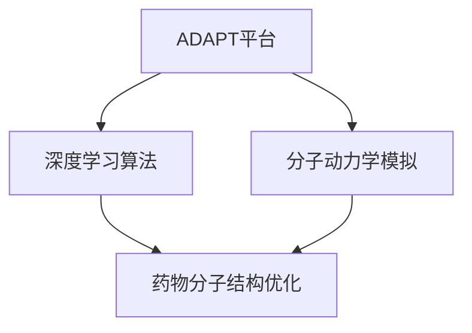

AI技术还可以用于药物分子设计中的虚拟筛选，通过分析大量化合物数据库，筛选出具有潜在药物活性的化合物。例如，美国公司Pharmacodomics开发了一种基于AI的药物筛选平台，名为“Pharmacodator”，该平台利用深度学习算法，结合生物信息学和化学信息学技术，实现了药物筛选的高效化和精准化。

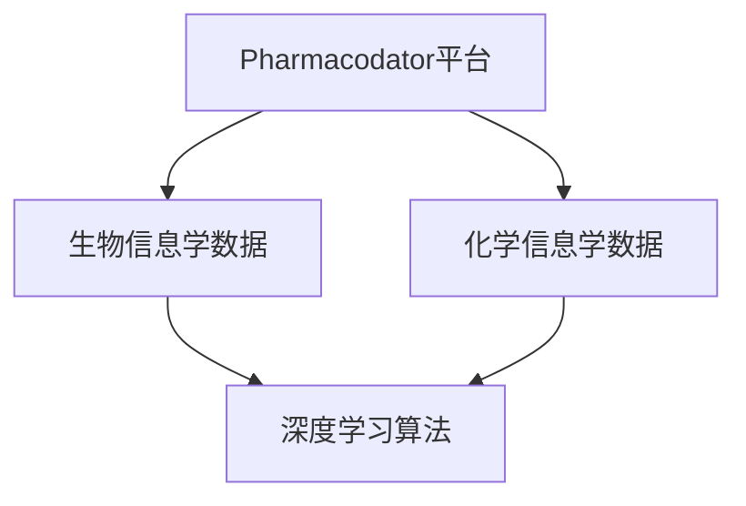

###### 3.1.2 AI在药物筛选中的应用

药物筛选是药物发现的重要环节，AI技术的引入大大提高了药物筛选的效率。例如，美国公司Atomwise开发了一种基于AI的药物筛选平台，名为“AtomNet”，该平台利用深度学习算法，实现了对药物分子与靶点蛋白相互作用的预测。通过AtomNet平台，Atomwise成功发现了一种治疗埃博拉病毒的抗病毒药物，其开发周期比传统方法缩短了数倍。

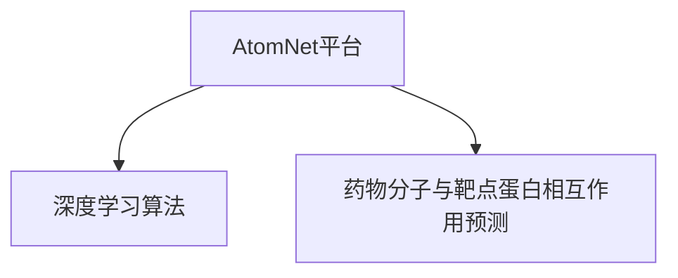

AI技术还可以用于高通量筛选（HTS），通过自动化实验平台，对大量化合物进行筛选，快速发现具有潜在药物活性的化合物。例如，英国公司Genomics PLC开发了一种基于AI的高通量筛选平台，名为“G-Scout”，该平台利用深度学习算法，实现了对药物分子的快速筛选和优化。

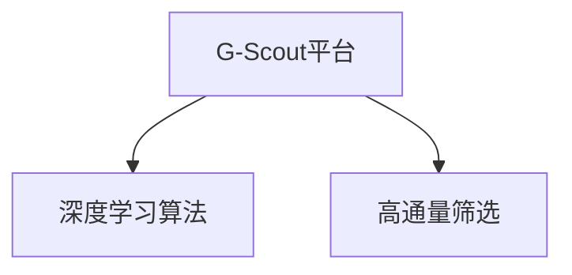

###### 3.1.3 AI在药物合成中的应用

药物合成是药物发现的重要环节，AI技术的引入可以大大提高药物合成的效率和准确性。例如，美国公司Cerebellan consortium开发了一种基于AI的药物合成平台，名为“ExaCS”，该平台利用深度学习算法，实现了对药物合成路径的预测和优化。通过ExaCS平台，Cerebellan consortium成功优化了一种治疗癌症的药物合成路径，大大提高了合成效率。

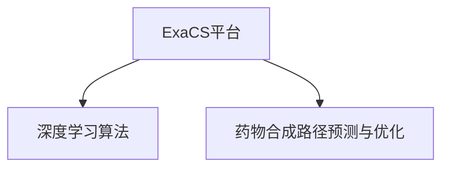

AI技术还可以用于自动化药物合成，通过机器人技术和AI算法，实现药物合成的自动化和规模化。例如，美国公司AI-powered Synthesis公司开发了一种基于AI的自动化药物合成平台，该平台利用深度学习算法，实现了对药物合成的全程控制，大大提高了药物合成的效率和准确性。

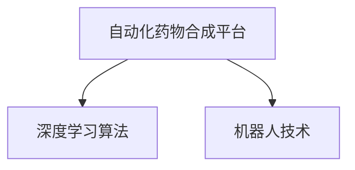

##### 3.2 AI在药物研发中的应用

药物研发是生物制药领域的核心环节，AI技术的引入大大提高了药物研发的效率和质量。以下是几个AI在药物研发中应用的典型案例。

###### 3.2.1 AI在临床试验管理中的应用

临床试验是药物研发的重要环节，AI技术的引入可以大大提高临床试验的管理效率。例如，美国公司PatientSafe Solutions开发了一种基于AI的临床试验管理平台，名为“TrialSentry”，该平台利用机器学习算法，实现了对临床试验数据的实时监控和分析，及时发现并处理潜在的安全风险。通过TrialSentry平台，患者安全得到了有效保障，临床试验的效率和质量得到了显著提升。


AI技术还可以用于临床试验的自动化管理，通过机器人技术和AI算法，实现临床试验的全过程自动化。例如，美国公司Clinicai开发了一种基于AI的临床试验自动化管理平台，名为“Clinicai Automation Platform”，该平台利用机器学习算法，实现了对临床试验数据的自动化采集、分析和报告，大大提高了临床试验的效率。

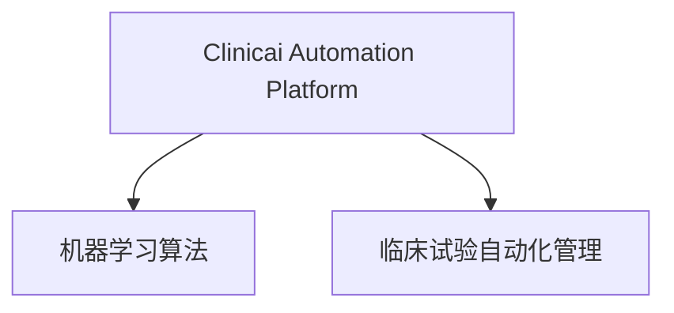

###### 3.2.2 AI在新药审批流程中的应用

新药审批流程是药物研发的重要环节，AI技术的引入可以大大提高新药审批的效率和准确性。例如，美国公司Adkind开发了一种基于AI的新药审批平台，名为“Adkind Platform”，该平台利用深度学习算法，实现了对新药安全性和有效性的快速评估。通过Adkind Platform平台，新药审批周期得到了显著缩短，新药上市的速度得到了大幅提高。

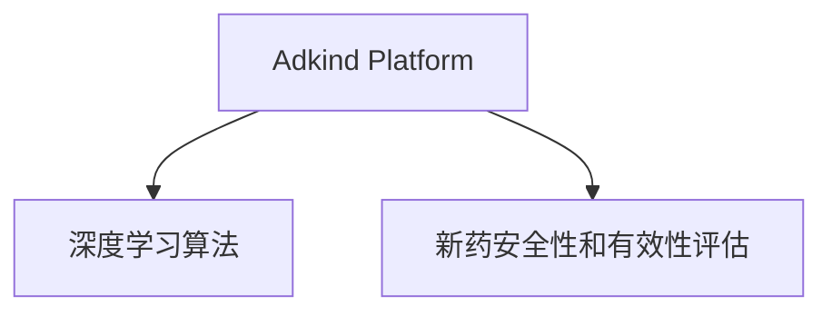

AI技术还可以用于新药审批流程的自动化，通过机器人技术和AI算法，实现新药审批流程的全程自动化。例如，美国公司Revolution Medicines开发了一种基于AI的新药审批自动化平台，名为“Revolution Automation Platform”，该平台利用深度学习算法，实现了对新药审批数据的自动化采集、分析和报告，大大提高了新药审批的效率和准确性。

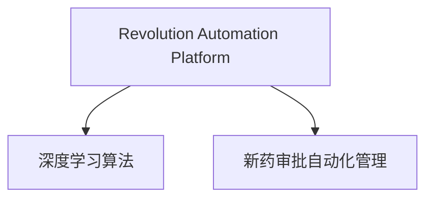

###### 3.2.3 AI在药物安全性监测中的应用

药物安全性监测是药物研发的重要环节，AI技术的引入可以大大提高药物安全性监测的效率和准确性。例如，美国公司PRA Health Sciences开发了一种基于AI的药物安全性监测平台，名为“SafetySentry”，该平台利用机器学习算法，实现了对药物不良反应数据的实时监控和分析。通过SafetySentry平台，药物安全性得到了有效保障，药物安全性监测的效率和质量得到了显著提升。

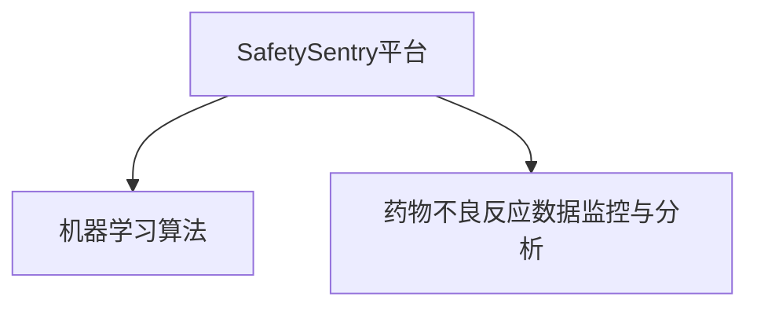

AI技术还可以用于药物安全性监测的自动化，通过机器人技术和AI算法，实现药物安全性监测的全过程自动化。例如，美国公司PharmaSentry开发了一种基于AI的药物安全性监测自动化平台，名为“PharmaSentry Automation Platform”，该平台利用机器学习算法，实现了对药物不良反应数据的自动化采集、分析和报告，大大提高了药物安全性监测的效率和准确性。

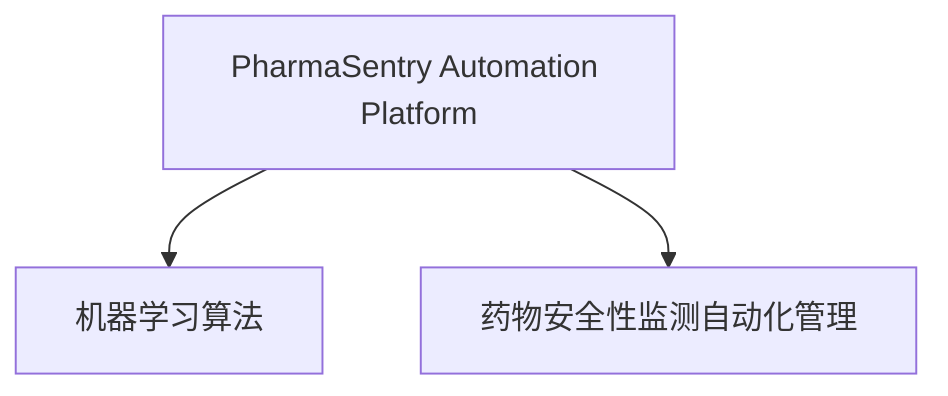

通过上述案例可以看出，AI技术在药物发现、药物研发、临床试验管理、新药审批流程、药物安全性监测等方面具有广泛的应用前景。AI技术的引入，不仅提高了药物研发的效率和质量，还大大降低了药物研发的成本，为生物制药行业的发展带来了新的机遇。

### 第四部分：生物制药AI技术应用实践

#### 第4章：生物制药AI技术应用实践

##### 4.1 生物制药AI项目规划与实施

生物制药AI项目的成功离不开科学的规划和有效的实施。以下是生物制药AI项目规划与实施的关键步骤：

###### 4.1.1 项目需求分析

项目需求分析是生物制药AI项目规划的第一步。在这一阶段，需要明确项目目标、功能需求、技术要求、资源需求等。具体包括：

1. **项目目标**：确定项目要解决的问题和要达到的目标，如提高药物研发效率、降低研发成本、优化生产流程等。

2. **功能需求**：列出项目需要实现的主要功能，如药物靶点预测、化合物筛选、药物分子设计、临床试验管理、新药审批等。

3. **技术要求**：确定项目所需的技术支持，如机器学习算法、深度学习模型、数据库技术、云计算平台等。

4. **资源需求**：列出项目所需的硬件、软件、人力、资金等资源，并评估现有资源的充足程度。

###### 4.1.2 项目计划制定

项目计划制定是项目规划的关键环节。在这一阶段，需要制定详细的项目计划，包括项目进度安排、资源分配、风险评估等。具体包括：

1. **进度安排**：根据项目目标和功能需求，制定项目的时间表，明确各阶段的开始和结束时间。

2. **资源分配**：根据项目进度和功能需求，合理分配人力、硬件、软件等资源，确保项目顺利推进。

3. **风险评估**：识别项目潜在的风险，制定风险应对措施，降低风险对项目的影响。

4. **项目预算**：根据项目需求和资源分配，制定项目预算，确保项目在预算范围内完成。

###### 4.1.3 项目实施

项目实施是项目规划与实施的核心环节。在这一阶段，需要按照项目计划，逐步完成各项任务。具体包括：

1. **需求分析**：对项目需求进行详细分析，确保项目目标明确、功能完善。

2. **系统设计**：根据需求分析结果，设计系统的架构和功能模块，确保系统的可扩展性和可维护性。

3. **开发与测试**：按照系统设计，进行软件开发和测试，确保系统的功能符合需求、性能稳定可靠。

4. **部署与上线**：完成系统开发后，进行系统部署和上线，确保系统可以正常运行。

5. **用户培训与支持**：对项目用户进行培训，确保用户能够熟练使用系统。同时，提供技术支持，解决用户在使用过程中遇到的问题。

###### 4.1.4 项目评估与优化

项目评估与优化是项目实施后的重要环节。在这一阶段，需要对项目进行评估，总结项目实施的经验和教训，为后续项目提供参考。具体包括：

1. **项目评估**：根据项目目标和功能需求，对项目进行评估，包括系统功能、性能、稳定性、安全性等方面。

2. **问题与改进**：识别项目实施过程中的问题和不足，制定改进措施，提高项目质量和效果。

3. **持续优化**：根据项目评估结果和用户反馈，对项目进行持续优化，不断提升系统功能和用户体验。

##### 4.2 生物制药AI平台建设

生物制药AI平台是生物制药AI项目的重要基础，其建设需要充分考虑技术需求、资源需求和用户需求。以下是生物制药AI平台建设的关键步骤：

###### 4.2.1 平台需求分析

平台需求分析是生物制药AI平台建设的第一步。在这一阶段，需要明确平台的目标、功能需求、技术要求、资源需求等。具体包括：

1. **平台目标**：确定平台要解决的主要问题和要达到的目标，如药物研发效率提升、生产流程优化、供应链管理优化等。

2. **功能需求**：列出平台需要实现的主要功能，如药物靶点预测、化合物筛选、药物分子设计、临床试验管理、新药审批等。

3. **技术要求**：确定平台所需的技术支持，如机器学习算法、深度学习模型、数据库技术、云计算平台等。

4. **资源需求**：列出平台所需的硬件、软件、人力、资金等资源，并评估现有资源的充足程度。

###### 4.2.2 平台架构设计

平台架构设计是生物制药AI平台建设的关键环节。在这一阶段，需要设计平台的整体架构，确保平台的可扩展性、可维护性和可靠性。具体包括：

1. **技术架构设计**：根据平台需求，设计平台的技术架构，包括硬件架构、软件架构、数据架构等。

2. **功能模块划分**：将平台功能划分为若干模块，确保各模块之间的高内聚、低耦合。

3. **接口设计**：设计各模块之间的接口，确保模块之间的通信和数据交换。

4. **安全设计**：设计平台的安全策略，包括数据安全、网络安全、用户权限管理等。

###### 4.2.3 平台开发与测试

平台开发与测试是生物制药AI平台建设的重要环节。在这一阶段，需要按照平台架构设计，进行平台开发和测试，确保平台的功能、性能、稳定性等符合要求。具体包括：

1. **软件开发**：按照平台架构设计，进行软件编码，实现平台的功能。

2. **单元测试**：对各个模块进行单元测试，确保模块的功能和性能符合要求。

3. **集成测试**：将各个模块集成在一起，进行集成测试，确保模块之间的接口和数据交换符合要求。

4. **性能测试**：对平台进行性能测试，确保平台在高负载下的稳定性和性能。

5. **安全测试**：对平台进行安全测试，确保平台的数据安全、网络安全和用户权限管理。

###### 4.2.4 平台部署与上线

平台部署与上线是生物制药AI平台建设的关键环节。在这一阶段，需要将平台部署到生产环境，确保平台可以正常运行。具体包括：

1. **环境搭建**：搭建平台的生产环境，包括硬件设备、软件环境、网络环境等。

2. **数据迁移**：将平台数据从开发环境迁移到生产环境，确保数据的完整性和一致性。

3. **系统配置**：配置平台的各项参数，确保系统在运行过程中各项配置正确。

4. **上线部署**：将平台部署到生产环境，确保平台可以正常运行。

5. **用户培训**：对项目用户进行培训，确保用户能够熟练使用平台。

##### 4.3 生物制药AI项目风险管理

生物制药AI项目风险管理是项目成功的关键。以下是生物制药AI项目风险管理的关键步骤：

###### 4.3.1 风险识别

风险识别是风险管理的第一步。在这一阶段，需要识别项目可能面临的风险，包括技术风险、市场风险、财务风险、法律风险等。具体包括：

1. **技术风险**：识别项目在技术方面可能面临的风险，如技术不可行、技术变更等。

2. **市场风险**：识别项目在市场方面可能面临的风险，如市场需求变化、竞争对手等。

3. **财务风险**：识别项目在财务方面可能面临的风险，如预算超支、资金短缺等。

4. **法律风险**：识别项目在法律方面可能面临的风险，如合规性、知识产权等。

###### 4.3.2 风险评估

风险评估是风险管理的第二步。在这一阶段，需要对识别出的风险进行评估，确定风险的影响程度和发生的可能性。具体包括：

1. **风险影响评估**：评估风险对项目的影响程度，包括对项目进度、质量、成本等方面的影响。

2. **风险可能性评估**：评估风险发生的可能性，包括风险的概率分布和影响程度。

3. **风险优先级评估**：根据风险的影响程度和发生的可能性，确定风险的优先级，重点关注高优先级风险。

###### 4.3.3 风险应对

风险应对是风险管理的第三步。在这一阶段，需要根据风险评估结果，制定相应的风险应对措施，降低风险的影响。具体包括：

1. **风险规避**：通过调整项目计划、技术方案等，避免风险的发生。

2. **风险减轻**：通过改进技术、优化方案等，降低风险的影响程度。

3. **风险接受**：对于无法规避和减轻的风险，采取接受策略，确保项目能够继续推进。

4. **风险转移**：通过购买保险、签订合同等，将部分风险转移给其他相关方。

通过以上步骤，可以有效地管理生物制药AI项目风险，确保项目的顺利推进。

### 第五部分：生物制药AI技术应用案例解析

#### 第5章：生物制药AI技术应用案例解析

##### 5.1 AI在个性化医疗中的应用

个性化医疗是生物制药领域的重要发展方向，AI技术的引入为个性化医疗提供了强有力的支持。以下是一个AI在个性化医疗中的具体应用案例。

###### 5.1.1 案例背景

某生物制药公司专注于癌症个性化治疗的研究。该公司收集了大量的癌症患者数据，包括基因序列、蛋白质组数据、临床指标等。为了提高癌症治疗的个性化程度，公司决定利用AI技术，对患者的数据进行深度分析，为医生提供个性化的治疗方案。

###### 5.1.2 案例解决方案

1. **数据收集与预处理**：首先，公司收集了大量的癌症患者数据，包括基因序列、蛋白质组数据、临床指标等。然后，对数据进行清洗和预处理，去除噪声和异常值，确保数据的质量。

2. **特征提取与建模**：接着，公司利用深度学习算法，对预处理后的数据进行分析，提取出与癌症治疗相关的特征。然后，构建深度学习模型，对特征进行建模，以预测患者的治疗效果。

3. **模型训练与评估**：公司使用历史数据集对深度学习模型进行训练，并通过交叉验证方法评估模型的性能。为了确保模型的泛化能力，公司使用独立的测试数据集对模型进行评估。

4. **个性化治疗方案生成**：基于训练好的模型，公司为每位患者生成个性化的治疗方案。具体步骤如下：
   - **数据输入**：将患者的基因序列、蛋白质组数据、临床指标等输入到模型中。
   - **预测分析**：模型对患者的数据进行处理，生成预测结果，包括治疗效果、药物敏感性等。
   - **方案生成**：医生根据模型预测结果，为患者制定个性化的治疗方案。

5. **患者随访与反馈**：在治疗过程中，公司对患者的治疗效果进行实时监测和评估，收集患者的反馈信息。然后，将反馈信息用于模型优化和治疗方案调整，以提高治疗的效果和个性化程度。

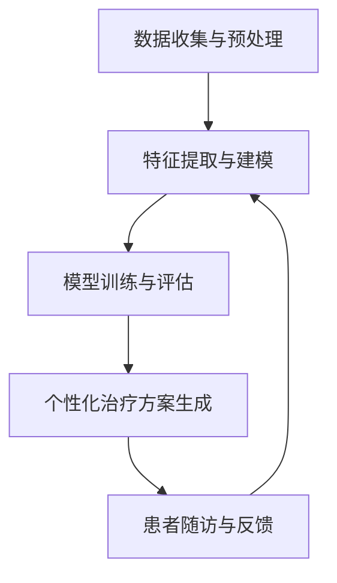

###### 5.1.3 案例效果

通过AI技术在个性化医疗中的应用，公司取得了显著的效果。首先，个性化治疗方案显著提高了患者的治疗效果，有些患者的病情得到了明显缓解。其次，通过实时监测和反馈，公司不断优化模型和治疗方案，提高了治疗的个性化程度和效果。最后，公司实现了对患者数据的全面分析和利用，为未来个性化医疗的发展提供了有力的支持。

##### 5.2 AI在生物制药供应链管理中的应用

生物制药供应链管理是生物制药行业的重要组成部分，AI技术的引入可以显著提高供应链管理的效率和质量。以下是一个AI在生物制药供应链管理中的具体应用案例。

###### 5.2.1 案例背景

某生物制药公司面临着生物制药供应链管理的一系列挑战，包括库存管理困难、物流效率低下、质量控制不严格等。为了解决这些问题，公司决定利用AI技术，对供应链管理进行优化。

###### 5.2.2 案例解决方案

1. **库存管理**：公司使用机器学习算法，对库存数据进行实时分析，预测库存需求，优化库存管理策略。具体步骤如下：
   - **数据收集**：收集库存数据，包括药品库存量、入库量、出库量等。
   - **数据预处理**：对库存数据进行分析，去除噪声和异常值，确保数据质量。
   - **需求预测**：利用机器学习算法，预测未来的库存需求，为库存管理提供依据。
   - **库存调整**：根据需求预测结果，对库存进行调整，确保库存量的合理性和稳定性。

2. **物流管理**：公司使用深度学习算法，对物流数据进行分析，优化物流路线和运输方案，提高物流效率。具体步骤如下：
   - **数据收集**：收集物流数据，包括运输时间、运输距离、运输成本等。
   - **数据预处理**：对物流数据进行分析，去除噪声和异常值，确保数据质量。
   - **路线优化**：利用深度学习算法，优化物流路线，减少运输时间和成本。
   - **运输方案制定**：根据路线优化结果，制定最优的运输方案，提高物流效率。

3. **质量管理**：公司使用机器学习算法，对生物制药产品进行实时监测和质量评估，确保产品质量。具体步骤如下：
   - **数据收集**：收集产品质量数据，包括成分含量、纯度、稳定性等。
   - **数据预处理**：对产品质量数据进行分析，去除噪声和异常值，确保数据质量。
   - **质量评估**：利用机器学习算法，对产品质量进行实时评估，确保产品质量符合要求。

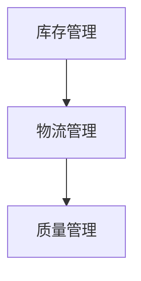

###### 5.2.3 案例效果

通过AI技术在生物制药供应链管理中的应用，公司取得了显著的效果。首先，库存管理变得更加精确和高效，库存成本显著降低。其次，物流效率显著提高，运输时间和成本得到优化。最后，产品质量得到实时监测和评估，确保了产品质量的稳定性和安全性。通过这些措施，公司显著提高了供应链管理的效率和效益，为生物制药行业的发展做出了积极贡献。

### 第六部分：生物制药AI创新体系构建

#### 第6章：生物制药AI创新体系构建

##### 6.1 生物制药AI创新体系建设策略

生物制药AI创新体系的构建是一个复杂而系统的过程，需要从多个维度进行规划和实施。以下是一些关键的建设策略：

###### 6.1.1 明确建设目标

构建生物制药AI创新体系的首要任务是明确建设目标。这些目标应该包括提高药物研发效率、降低研发成本、优化生产流程、提升个性化医疗水平等。通过明确建设目标，可以为创新体系的建设提供方向和指导。

###### 6.1.2 整合资源与优势

生物制药AI创新体系的构建需要整合各类资源与优势。这包括人才资源、技术资源、资金资源等。例如，可以与高校、科研机构、医疗机构等建立合作关系，共享资源和成果。同时，也可以引进国内外顶尖的AI技术和人才，提升创新体系的整体水平。

###### 6.1.3 建立协同机制

构建生物制药AI创新体系需要建立有效的协同机制。这包括内部协同和外部协同。内部协同是指创新体系内部各成员之间的紧密合作，例如研发团队、生产团队、销售团队等。外部协同是指创新体系与外部合作伙伴之间的协作，例如其他企业、政府机构、投资者等。通过建立协同机制，可以充分发挥各方的优势，实现资源共享和成果共享。

###### 6.1.4 强化技术积累

技术积累是生物制药AI创新体系构建的重要基础。需要持续投入资金和人力资源，进行前沿技术的研发和积累。例如，可以专注于机器学习、深度学习、生物信息学等领域的创新，不断推出具有自主知识产权的核心技术和产品。

###### 6.1.5 打造创新平台

构建生物制药AI创新平台是创新体系的重要组成部分。创新平台应具备开放性、协同性和灵活性，为各类创新活动提供支持。例如，可以建立开放的数据平台，为研究人员提供丰富的数据资源。同时，也可以建立共享的技术平台，为研发团队提供高效的技术支持。

###### 6.1.6 建立完善的法规体系

在生物制药AI创新体系的构建过程中，需要关注法规体系的建设。这包括制定相关政策和法规，规范AI技术在生物制药领域的应用。例如，可以制定数据安全、隐私保护、伦理审查等方面的规定，确保AI技术在生物制药领域的合法合规使用。

##### 6.2 生物制药AI创新体系可持续发展

生物制药AI创新体系的可持续发展是确保长期效益的关键。以下是一些实现可持续发展的策略：

###### 6.2.1 持续投入

创新体系的可持续发展需要持续的投入。这包括资金投入、人力资源投入和技术投入。需要确保资金和资源的充足性，为创新活动提供有力支持。

###### 6.2.2 人才培养

人才是创新体系的核心资源。需要持续投入人才培养，引进和培养具有创新能力和实践经验的专业人才。可以通过设立奖学金、举办培训班、建立实习基地等方式，吸引和培养优秀人才。

###### 6.2.3 技术更新

技术更新是创新体系可持续发展的重要保障。需要持续关注AI技术的最新发展，不断引进和消化前沿技术，提升创新体系的整体水平。

###### 6.2.4 知识产权保护

知识产权保护是创新体系可持续发展的重要环节。需要建立完善的知识产权保护机制，保护创新成果的知识产权，鼓励创新活动的持续进行。

###### 6.2.5 市场导向

创新体系的可持续发展需要紧密关注市场需求，以市场为导向。需要持续进行市场调研，了解市场需求和趋势，调整创新方向和策略，确保创新成果能够满足市场需求。

通过以上策略，可以构建一个可持续发展的生物制药AI创新体系，为生物制药行业的发展提供有力支持。

### 第七部分：生物制药AI创新体系评估与优化

#### 第7章：生物制药AI创新体系评估与优化

##### 7.1 生物制药AI创新体系评估与优化

生物制药AI创新体系的评估与优化是确保其有效性和可持续性的关键。以下是一些关键的评估指标、优化策略和持续改进机制：

###### 7.1.1 评估指标

为了全面评估生物制药AI创新体系的性能，可以设置以下关键指标：

1. **研发效率**：包括药物研发的时间、成本和成功率等。通过对比历史数据和行业标准，评估创新体系在提高研发效率方面的表现。

2. **技术突破**：衡量创新体系在AI技术方面的突破和创新，如新算法、新工具、新技术等。

3. **市场表现**：评估创新体系的产品在市场中的接受度和市场份额，包括销售额、用户满意度等。

4. **人才培养**：评估创新体系在人才培养方面的成效，如人才培养数量、人才培养质量等。

5. **资源利用率**：包括资金、人力、技术等资源的利用效率，评估创新体系在资源管理方面的表现。

6. **风险管理**：评估创新体系在风险管理方面的能力，如风险识别、风险应对等。

###### 7.1.2 优化策略

基于评估结果，可以制定以下优化策略：

1. **技术升级**：持续关注AI技术的最新发展，引进和消化前沿技术，提升创新体系的整体技术水平。

2. **流程优化**：对药物研发、生产、销售等流程进行优化，消除瓶颈，提高效率。

3. **人才培养**：加强人才培养和引进，建立完善的培训体系，提升团队的整体素质。

4. **合作拓展**：与国内外高校、科研机构、企业等建立更紧密的合作关系，共享资源和成果。

5. **市场拓展**：加强市场调研，了解市场需求和趋势，调整创新方向和产品策略，提升市场竞争力。

6. **风险管理**：完善风险管理体系，加强风险识别、评估和应对，降低风险对创新体系的影响。

###### 7.1.3 持续改进机制

为了确保生物制药AI创新体系的持续改进，可以建立以下机制：

1. **定期评估**：定期对创新体系进行评估，包括技术、流程、市场等方面，及时发现问题和不足。

2. **反馈机制**：建立有效的反馈机制，收集用户、合作伙伴、员工等各方面的意见和建议，为优化提供依据。

3. **持续培训**：定期组织培训，提升员工的技术能力和管理能力，确保创新体系的持续改进。

4. **创新激励**：建立创新激励机制，鼓励员工和团队进行技术创新和管理创新。

5. **创新文化**：营造良好的创新文化氛围，鼓励员工敢于尝试、勇于创新，激发创新潜力。

通过以上评估与优化机制，可以确保生物制药AI创新体系的持续改进和高效运行，为生物制药行业的发展提供有力支持。

### 第八部分：生物制药AI创新体系国际合作与竞争策略

#### 第8章：生物制药AI创新体系国际合作与竞争策略

##### 8.1 生物制药AI国际市场现状

生物制药AI领域的国际市场现状呈现出以下几个显著特点：

1. **市场规模迅速扩大**：随着AI技术的不断进步和生物制药行业的快速发展，生物制药AI市场的规模也在迅速扩大。根据市场调研机构的数据显示，全球生物制药AI市场的规模预计将在未来几年内实现显著增长。

2. **技术创新活跃**：国际生物制药AI领域的创新活动非常活跃，多家领先企业和研究机构不断推出新的AI技术和解决方案。例如，美国的AI制药公司如Exscientia、Atomwise等，以及欧洲的一些顶级科研机构和生物制药企业都在积极研发和应用AI技术。

3. **竞争格局多元**：生物制药AI领域的竞争格局多元，既有大型制药公司、生物技术公司，也有初创企业和科研机构。这些竞争者分布在不同的国家和地区，各自拥有不同的技术优势和业务模式。

4. **政策支持力度加大**：国际社会对生物制药AI领域的政策支持力度不断加大。例如，美国、欧洲和亚洲的一些国家和地区都出台了一系列政策，鼓励AI技术在生物制药领域的应用，并提供资金支持、税收优惠等激励措施。

##### 8.2 生物制药AI国际合作模式

在生物制药AI领域，国际合作模式多种多样，以下是一些常见的合作模式：

1. **联合研发**：生物制药公司和AI技术公司之间可以通过联合研发的方式，共同开展药物发现、药物设计等研究项目。这种方式可以充分利用双方的技术优势和资源，提高研发效率。

2. **战略联盟**：生物制药企业可以与其他企业、科研机构建立战略联盟，共同推动AI技术在生物制药领域的应用。战略联盟可以包括资源共享、技术合作、市场推广等方面。

3. **技术转让**：生物制药企业可以将自主研发的AI技术通过技术转让的方式，授权给其他企业使用。这种方式可以快速推广AI技术的应用，提高技术转化率。

4. **人才培养与交流**：国际生物制药企业和科研机构可以通过举办研讨会、培训课程、人才交流项目等方式，加强人才合作与交流，提高整个行业的人才素质。

##### 8.3 生物制药AI国际竞争策略

为了在国际竞争中保持优势，生物制药企业可以采取以下竞争策略：

1. **技术创新**：持续投入研发，不断推动AI技术的创新，开发出具有核心竞争力的新技术和新产品。

2. **市场拓展**：积极开拓国际市场，通过设立海外分支机构、与当地企业合作等方式，扩大市场影响力。

3. **合作共赢**：与其他企业和科研机构建立紧密的合作关系，实现资源共享、优势互补，提高整体竞争力。

4. **人才培养**：加强人才培养和引进，提高员工的技能水平和创新能力，为企业的持续发展提供人才支持。

5. **合规经营**：遵守国际法规和行业标准，确保企业的运营合法合规，降低法律风险。

通过以上策略，生物制药企业可以在国际竞争中保持领先地位，推动生物制药AI领域的持续发展。

### 附录

#### 附录A：生物制药AI相关工具与资源

##### A.1 主流生物制药AI工具介绍

生物制药AI领域存在一系列主流的工具，以下是一些主要的工具及其简要介绍：

1. **TensorFlow for BioPharma**

   TensorFlow for BioPharma是一个基于TensorFlow框架的开放式工具，旨在简化生物医学数据分析和深度学习模型构建。它提供了丰富的API和预训练模型，支持多种生物数据类型，如基因序列、蛋白质结构、临床数据等。

   **使用示例：**
   ```python
   import tensorflow as tf
   model = tf.keras.Sequential([
       tf.keras.layers.Dense(128, activation='relu', input_shape=(784,)),
       tf.keras.layers.Dropout(0.2),
       tf.keras.layers.Dense(10)
   ])
   model.compile(optimizer='adam',
                 loss=tf.keras.losses.SparseCategoricalCrossentropy(from_logits=True),
                 metrics=['accuracy'])
   ```

2. **PyTorch for BioPharma**

   PyTorch for BioPharma是基于PyTorch框架的一个扩展，它提供了专门为生物医学数据处理和深度学习模型开发设计的API。PyTorch的动态图机制使得构建和调试神经网络更加灵活和直观。

   **使用示例：**
   ```python
   import torch
   import torch.nn as nn
   import torch.optim as optim

   model = nn.Sequential(nn.Linear(784, 128), nn.ReLU(), nn.Linear(128, 10))
   optimizer = optim.Adam(model.parameters(), lr=0.001)
   loss_function = nn.CrossEntropyLoss()

   # 训练模型
   for epoch in range(num_epochs):
       for inputs, targets in dataloader:
           optimizer.zero_grad()
           outputs = model(inputs)
           loss = loss_function(outputs, targets)
           loss.backward()
           optimizer.step()
   ```

3. **其他生物制药AI工具**

   除了TensorFlow和PyTorch，还有一些其他工具也在生物制药AI领域得到广泛应用，如：

   - **Keras for BioPharma**：一个基于Theano和TensorFlow的高层神经网络API，简化了深度学习模型的构建和训练。
   - **SciKit-Learn**：一个强大的机器学习库，提供了多种机器学习算法和工具，可以用于生物数据的分析和建模。
   - **Bioconda**：一个提供生物信息学软件包的conda通道，包含大量适用于生物制药AI的工具和库。

##### A.2 生物制药AI数据集与数据库

生物制药AI研究离不开高质量的数据集和数据库，以下是一些主要的生物制药AI数据集和数据库：

1. **Genome Reference Consortium (GRC)**

   GRC是一个提供人类基因组参考序列的数据库，包括完整的基因组序列、变异信息等，是生物制药研究的重要数据源。

2. **Protein Data Bank (PDB)**

   PDB是一个收集和发布蛋白质结构的数据库，包含了大量的蛋白质晶体结构，对于药物分子设计和药物发现至关重要。

3. **Target Database (TD)**

   TD是一个涵盖广泛生物分子的靶点数据库，提供了大量的药物靶点信息，有助于药物设计和新药研发。

4. **ChEMBL** 

   ChEMBL是一个开源的药物化学数据库，包含了药物分子、靶点、药效等信息，为药物研发提供了丰富的数据资源。

5. **TCGA (The Cancer Genome Atlas)**

   TCGA是一个大规模的癌症基因组项目，提供了大量的癌症相关基因组和临床数据，对个性化医疗和癌症研究具有重要意义。

##### A.3 生物制药AI相关文献与资源

生物制药AI领域的研究成果广泛分布在各类学术期刊、会议和报告中，以下是一些重要的资源：

1. **学术期刊**

   - **Journal of Computational Biology**
   - **Nature Biotechnology**
   - **Nature Methods**
   - **Science Translational Medicine**

2. **会议与论坛**

   - **AAAS (American Association for the Advancement of Science) Annual Meeting**
   - **ISMB (International Society for Computational Biology) Conference**
   - **BIO (Biotechnology Industry Organization) International Convention**

3. **研究报告与白皮书**

   - **BIOTech's AI in Pharma Report**
   - **PwC's Artificial Intelligence in Healthcare Report**
   - **Deloitte's Global Life Sciences Outlook**

通过利用这些工具、数据集和文献资源，研究人员和开发者可以更好地开展生物制药AI的研究和应用工作。

