                 

### 引言

#### 1.1 书籍背景与目标

在当今数字化时代，电商平台已经成为人们日常生活中不可或缺的一部分。为了提高用户的购物体验，各大电商平台纷纷引入了推荐系统，以期通过个性化的推荐提高用户的满意度和购买转化率。然而，随着用户数据的爆炸性增长和商品种类的多样化，传统的推荐系统逐渐暴露出响应速度慢、推荐质量不高等问题。为了应对这些挑战，AI大模型在实时推荐系统中的应用应运而生。

本书《电商平台中AI大模型的实时推荐策略》旨在深入探讨AI大模型在实时推荐系统中的应用，帮助读者全面了解AI大模型在推荐系统中的作用、架构设计以及实际应用中的挑战和解决方案。本书的主要目标如下：

1. **介绍AI大模型的基础知识**：通过详细讲解AI大模型的定义、架构、训练与优化，帮助读者建立扎实的理论基础。
2. **探讨实时推荐系统的架构**：分析实时推荐系统的基础原理和设计要点，为读者提供一套完整的架构设计框架。
3. **展示AI大模型在实时推荐中的应用**：通过具体的案例和实践，展示AI大模型在实时推荐系统中的实际应用效果。
4. **讨论实时推荐系统的优化策略**：分析推荐系统的实时性、多样性和准确性等优化策略，帮助读者提升推荐系统的性能。

#### 1.2 AI大模型在实时推荐中的重要性

AI大模型在实时推荐中的重要性不可忽视。首先，AI大模型具有强大的数据处理能力，能够高效地处理海量用户数据，实现实时推荐。其次，AI大模型通过深度学习算法能够从数据中挖掘出用户的兴趣和行为模式，提供更加个性化的推荐结果。此外，AI大模型还能够自适应地调整推荐策略，根据用户的行为变化实时优化推荐效果。

在电商平台中，实时推荐系统是提升用户体验和销售额的关键。通过引入AI大模型，电商平台可以大幅提高推荐系统的响应速度和推荐质量，从而增强用户黏性和购买意愿。因此，研究AI大模型在实时推荐中的应用具有重要的理论和实践价值。

#### 1.3 书籍的结构和主要内容

本书分为五个主要部分，分别从不同角度探讨了AI大模型在实时推荐系统中的应用。

**第一部分：引言**：介绍了书籍的背景、目标、AI大模型在实时推荐中的重要性以及本书的结构和主要内容。

**第二部分：AI大模型基础**：介绍了AI大模型的基本概念、架构、训练与优化，以及实时推荐系统的架构设计。

**第三部分：AI大模型在实时推荐中的应用**：详细探讨了用户行为分析与建模、商品信息处理与分类、推荐算法设计以及实时推荐系统的优化策略。

**第四部分：AI大模型实时推荐系统实战**：通过具体的项目案例，展示了实时推荐系统的开发环境搭建、关键技术与算法实现、项目效果评估与优化，以及系统的部署与运维。

**第五部分：总结与展望**：总结了本书的主要内容，探讨了AI大模型在实时推荐系统中的应用前景，以及未来的发展趋势。

通过本书的阅读，读者可以系统地掌握AI大模型在实时推荐系统中的应用，为实际项目开发提供有力的理论支持和实践经验。

#### 1.4 阅读指南

**1.4.1 阅读对象**

本书适合具有计算机科学和人工智能基础知识，并对电商平台实时推荐系统感兴趣的读者。无论是AI领域的初学者，还是希望进一步提升自己技术水平的专业人士，都能从本书中获得丰富的知识。

**1.4.2 技术基础要求**

为了更好地理解本书的内容，建议读者具备以下技术基础：

- 熟悉Python编程语言和常见的机器学习库（如Scikit-learn、TensorFlow、PyTorch等）。
- 掌握基本的数据处理和分析方法，如数据清洗、特征提取、模型训练等。
- 对深度学习有一定的了解，了解常见的神经网络架构和优化方法。

**1.4.3 学习方法与目标**

建议读者采取以下学习方法：

- **循序渐进**：按照书中的结构，逐步学习各个部分的知识点，确保对每个主题都有充分的理解。
- **动手实践**：通过实际操作和项目实践，加深对理论知识的掌握，提高实际解决问题的能力。
- **思考和总结**：在学习过程中，不断思考和总结，形成自己的理解和见解，有助于深入掌握知识点。

通过本书的学习，读者应能够：

- 理解AI大模型的基本概念、架构和训练方法。
- 掌握实时推荐系统的架构设计和优化策略。
- 能够设计和实现一个简单的实时推荐系统。
- 对AI大模型在实时推荐系统中的应用有深刻的认识和理解。

#### 1.5 AI大模型在电商推荐系统中的角色

AI大模型在电商推荐系统中扮演着至关重要的角色。首先，AI大模型能够处理海量用户数据，通过深度学习算法挖掘用户的行为和兴趣模式，从而提供个性化的推荐结果。这种个性化推荐不仅能够提高用户的购物体验，还能够增加平台的销售额。

其次，AI大模型具有强大的自适应能力。随着用户行为的变化，AI大模型可以动态调整推荐策略，确保推荐结果始终符合用户的需求。例如，当用户浏览了某一类商品后，AI大模型可以实时调整推荐策略，将相似或相关的商品推送给用户，从而提高购买转化率。

此外，AI大模型还能够实现实时推荐。通过高效的数据处理和模型优化技术，AI大模型能够在短时间内生成高质量的推荐结果，满足用户即时决策的需求。这在竞争激烈的电商市场中尤为重要，可以帮助平台在短时间内吸引和留住用户。

总之，AI大模型在电商推荐系统中的作用不仅体现在提高推荐质量和用户体验上，还体现在提升平台的运营效率和竞争力。随着AI技术的不断发展，AI大模型在电商推荐系统中的应用前景将更加广阔。

### 摘要

本书《电商平台中AI大模型的实时推荐策略》全面探讨了AI大模型在实时推荐系统中的应用。在第一部分，我们介绍了AI大模型的基础知识，包括其定义、架构、训练与优化，以及实时推荐系统的基本原理和架构设计。第二部分深入分析了AI大模型在实时推荐系统中的应用，涵盖了用户行为分析与建模、商品信息处理与分类、推荐算法设计以及实时推荐系统的优化策略。第三部分通过具体的项目案例，展示了如何在实际中实现AI大模型的实时推荐系统，包括开发环境搭建、关键技术与算法实现、项目效果评估与优化。最后，在总结与展望部分，我们回顾了本书的主要内容，探讨了AI大模型在实时推荐系统中的应用前景，以及未来的发展趋势。通过本书的学习，读者可以系统地掌握AI大模型在实时推荐系统中的应用，为实际项目开发提供有力的理论支持和实践经验。

### 《电商平台中AI大模型的实时推荐策略》目录大纲

#### 引言
1.1 书籍背景与目标
1.2 AI大模型在实时推荐中的重要性
1.3 书籍的结构和主要内容
1.4 阅读指南
1.5 AI大模型在电商推荐系统中的角色

#### 第二部分：AI大模型基础
2.1 AI与推荐系统概述
2.1.1 AI在电商推荐中的应用
2.1.2 推荐系统的基本概念
2.1.3 推荐系统的分类
2.2 AI大模型简介
2.2.1 大模型的定义与特点
2.2.2 大模型的架构与分类
2.2.3 大模型的训练与优化
2.3 实时推荐系统架构
2.3.1 实时推荐的基本原理
2.3.2 实时推荐系统的架构设计
2.3.3 实时推荐系统面临的问题与挑战

#### 第三部分：AI大模型在实时推荐中的应用
3.1 用户行为分析与建模
3.1.1 用户行为数据收集
3.1.2 用户行为特征提取
3.1.3 用户行为建模与优化
3.2 商品信息处理与分类
3.2.1 商品信息处理
3.2.2 商品分类与标签化
3.2.3 商品信息更新与维护
3.3 推荐算法设计
3.3.1 基于协同过滤的推荐算法
3.3.2 基于内容推荐的算法
3.3.3 基于深度学习的推荐算法
3.4 实时推荐系统优化
3.4.1 推荐结果实时性优化
3.4.2 推荐结果多样性优化
3.4.3 推荐结果准确性优化

#### 第四部分：AI大模型实时推荐系统实战
4.1 实时推荐系统开发环境搭建
4.1.1 开发工具与框架选择
4.1.2 数据预处理与存储
4.1.3 模型训练与优化
4.2 实时推荐系统项目案例
4.2.1 项目背景与目标
4.2.2 系统架构设计
4.2.3 关键技术与算法实现
4.2.4 项目效果评估与优化
4.3 实时推荐系统部署与运维
4.3.1 系统部署策略
4.3.2 系统监控与维护
4.3.3 负载均衡与性能优化

#### 第五部分：总结与展望
5.1 主要内容回顾
5.1.1 AI大模型在实时推荐中的关键作用
5.1.2 实时推荐系统的技术挑战与解决方案
5.2 未来发展趋势
5.2.1 AI大模型在电商推荐领域的扩展应用
5.2.2 实时推荐系统的技术演进方向
5.2.3 未来的机会与挑战

#### 附录
附录A：常用工具与资源
附录B：Mermaid流程图
B.1 用户行为分析与建模流程
B.2 商品信息处理与分类流程
B.3 推荐算法设计与优化流程
B.4 实时推荐系统开发与部署流程

### AI大模型在电商推荐系统中的应用

AI大模型在电商推荐系统中扮演着至关重要的角色，其强大的数据处理和深度学习能力使得推荐系统更加智能化和高效化。本节将深入探讨AI大模型在电商推荐系统中的应用，从用户行为分析与建模、商品信息处理与分类、推荐算法设计以及实时推荐系统优化等多个方面进行详细阐述。

#### 2.1 AI大模型与电商推荐系统

AI大模型，通常指的是基于深度学习技术构建的、能够处理海量数据并从中提取有效信息的复杂神经网络。这些模型具有强大的特征提取和模式识别能力，能够在不同的应用场景中表现出卓越的性能。在电商推荐系统中，AI大模型的作用主要体现在以下几个方面：

1. **海量数据处理**：电商平台每天会产生海量的用户行为数据，如浏览记录、购买历史、评价和反馈等。AI大模型能够高效地处理这些数据，快速地提取出有用的信息。
2. **个性化推荐**：通过分析用户的兴趣和行为模式，AI大模型能够提供个性化的商品推荐，满足用户的个性化需求，提高用户满意度和购买转化率。
3. **实时响应**：AI大模型通过高效的算法和优化技术，能够在短时间内生成推荐结果，满足用户即时决策的需求，提高系统的响应速度。
4. **自适应调整**：随着用户行为和市场需求的变化，AI大模型能够动态调整推荐策略，确保推荐结果始终符合用户的最新需求。

#### 2.2 用户行为分析与建模

用户行为分析与建模是电商推荐系统的核心环节，其目标是通过对用户行为的分析，识别用户的兴趣和需求，为用户推荐相关的商品。AI大模型在这方面具有显著优势：

1. **用户行为数据收集**：电商平台通过各种渠道收集用户行为数据，如浏览历史、购买记录、搜索关键词、评价和反馈等。这些数据是建模的基础。

2. **用户行为特征提取**：通过深度学习技术，AI大模型可以从海量的用户行为数据中提取出有效的特征，如用户的浏览模式、购买偏好、兴趣标签等。这些特征用于构建用户行为模型。

3. **用户行为建模与优化**：基于提取的用户行为特征，AI大模型可以构建用户行为模型，并通过持续的训练和优化，不断提高模型的准确性和鲁棒性。

**Mermaid流程图**：
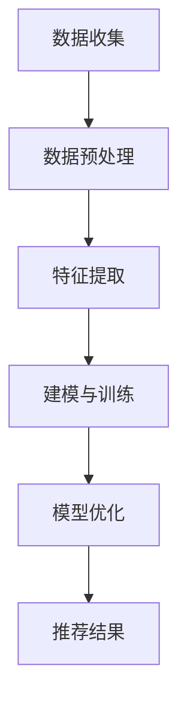

#### 2.3 商品信息处理与分类

商品信息处理与分类是电商推荐系统的另一个重要环节，其目标是确保推荐系统能够准确地理解和处理商品信息，为用户提供有价值的推荐。AI大模型在商品信息处理中的应用主要包括：

1. **商品信息处理**：通过对商品描述、标签、属性等信息进行清洗、转换和标准化处理，AI大模型可以确保商品信息的准确性和一致性。

2. **商品分类与标签化**：AI大模型通过分类算法和聚类算法，对商品进行分类和标签化处理，以便更好地理解和组织商品信息。

3. **商品信息更新与维护**：AI大模型可以实时监控和更新商品信息，确保商品信息的及时性和准确性。

**Mermaid流程图**：
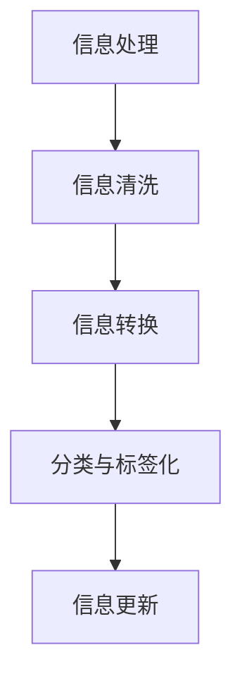

#### 2.4 推荐算法设计

推荐算法是电商推荐系统的核心组成部分，其设计直接影响到推荐系统的性能和用户体验。AI大模型在推荐算法设计中的应用主要包括：

1. **基于协同过滤的推荐算法**：协同过滤是一种常见的推荐算法，它通过分析用户的行为和评分数据，预测用户可能对哪些商品感兴趣。AI大模型可以通过深度学习技术，提高协同过滤算法的预测准确性和实时性。

2. **基于内容推荐的算法**：内容推荐算法通过分析商品的特征和属性，为用户推荐相关的商品。AI大模型可以通过对商品特征进行深度学习和提取，提高内容推荐算法的精度和效果。

3. **基于深度学习的推荐算法**：深度学习推荐算法通过构建复杂的神经网络模型，从海量数据中自动提取特征，实现高效的推荐。例如，基于用户行为和商品属性的深度神经网络模型，可以实现对用户兴趣的精准识别和推荐。

**Mermaid流程图**：
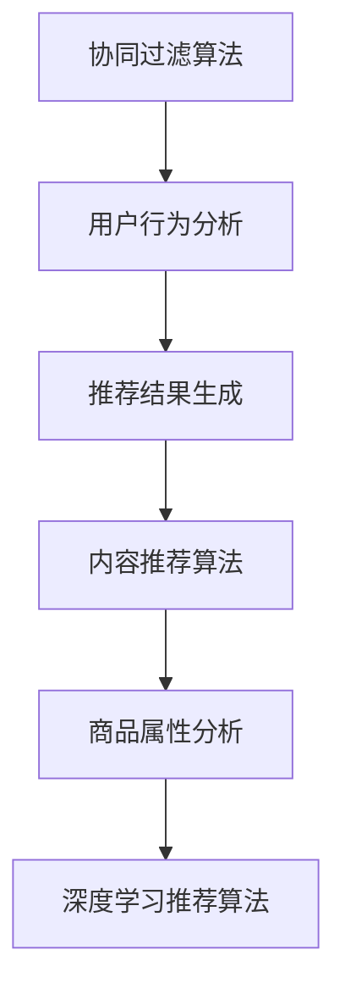

#### 2.5 实时推荐系统优化

实时推荐系统优化是提升推荐系统性能的关键，其目标是在保证推荐质量的前提下，提高系统的实时性和响应速度。AI大模型在实时推荐系统优化中的应用主要包括：

1. **推荐结果实时性优化**：通过优化算法和模型，减少推荐结果的生成时间，提高系统的响应速度。

2. **推荐结果多样性优化**：通过算法和策略，确保推荐结果的多样性，避免推荐结果过于集中或单一。

3. **推荐结果准确性优化**：通过不断训练和优化模型，提高推荐结果的准确性，减少误推荐和漏推荐的情况。

**Mermaid流程图**：
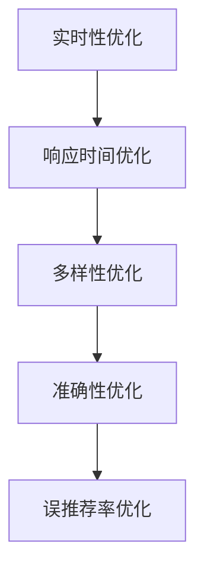

#### 2.6 AI大模型在电商推荐系统中的优势与挑战

AI大模型在电商推荐系统中的应用具有显著的优势，如高效的数据处理能力、强大的特征提取能力、实时性以及自适应调整能力。然而，其应用也面临着一些挑战：

1. **数据隐私与安全**：用户行为数据是电商推荐系统的重要资源，但数据隐私和安全问题是不可忽视的挑战。需要确保用户数据的安全性和隐私性。
2. **模型解释性**：深度学习模型的“黑箱”性质使得其解释性较差，难以理解模型的决策过程。这对电商推荐系统的透明性和可解释性提出了挑战。
3. **计算资源消耗**：AI大模型通常需要大量的计算资源和存储空间，这对平台的硬件设施提出了较高的要求。
4. **模型偏见**：如果训练数据存在偏差，AI大模型可能会学到错误的模式，导致推荐结果出现偏见。

总之，AI大模型在电商推荐系统中的应用具有巨大的潜力，但也需要克服一系列的挑战。通过不断的技术创新和优化，可以充分发挥AI大模型的优势，为电商平台提供更加智能化和高效的推荐服务。

### 用户行为分析与建模

用户行为分析是电商推荐系统的核心环节，通过对用户行为的深入挖掘和理解，可以识别用户的兴趣和需求，从而实现个性化的商品推荐。AI大模型在这一过程中发挥着关键作用，通过深度学习技术，从海量用户行为数据中提取出有效的特征，并构建用户行为模型。本节将详细介绍用户行为数据收集、用户行为特征提取以及用户行为建模与优化的过程。

#### 3.1.1 用户行为数据收集

用户行为数据是用户在使用电商平台时产生的各种数据的集合，包括浏览记录、购买历史、搜索关键词、评价和反馈等。这些数据是构建用户行为模型的基础。以下是用户行为数据收集的几种主要方法：

1. **日志文件**：电商平台通常会记录用户在网站上的所有操作，如页面访问、点击、购买等。这些日志文件包含了丰富的用户行为信息，是数据收集的重要来源。

2. **点击流数据**：通过分析用户在网站上的点击行为，可以了解用户的浏览路径和兴趣点。点击流数据通常包含用户ID、页面URL、点击时间等信息。

3. **传感器数据**：利用移动设备上的传感器，可以收集用户的位置、运动轨迹等信息。这些数据有助于更全面地了解用户的行为模式。

4. **用户反馈**：用户的评价、评论和反馈是宝贵的参考信息，可以揭示用户对商品和服务的满意程度，有助于优化推荐策略。

**Mermaid流程图**：
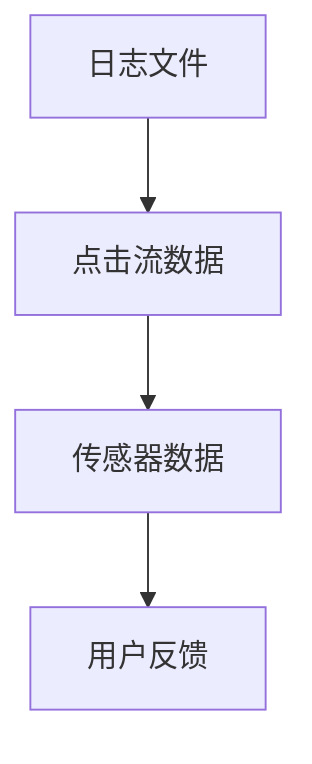

#### 3.1.2 用户行为特征提取

用户行为特征提取是用户行为分析的关键步骤，目的是从原始的用户行为数据中提取出有意义的特征，用于构建用户行为模型。以下是一些常见的用户行为特征提取方法：

1. **统计特征**：通过对用户行为数据进行统计分析，提取出诸如平均点击次数、购买频率、点击深度等统计特征。这些特征能够反映用户的活跃度和行为模式。

2. **序列特征**：将用户的行为序列转化为向量，提取出序列中的时序特征和模式特征。例如，通过LSTM（长短时记忆网络）可以捕捉用户行为的时序关系。

3. **文本特征**：对用户的评价、评论等文本数据进行处理，提取出关键词、主题和情感等文本特征。这些特征可以揭示用户的兴趣和需求。

4. **图特征**：将用户行为转化为图结构，提取出图中的节点特征和边特征。例如，通过图神经网络（GNN）可以捕捉用户行为中的复杂关系。

**Mermaid流程图**：
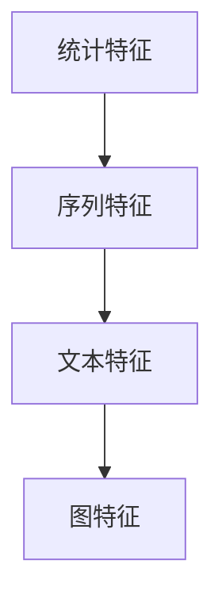

#### 3.1.3 用户行为建模与优化

用户行为建模的目的是通过提取的用户行为特征，构建一个能够准确预测用户行为的模型。以下是一些常见的用户行为建模方法：

1. **协同过滤模型**：协同过滤是一种基于用户行为数据的推荐算法，通过分析用户之间的相似性，预测用户对未知商品的兴趣。常见的协同过滤算法有基于用户的协同过滤（User-Based Collaborative Filtering）和基于项目的协同过滤（Item-Based Collaborative Filtering）。

2. **决策树与随机森林**：决策树和随机森林是一种基于特征的用户行为预测模型。通过分析特征之间的条件概率关系，可以构建出决策树或随机森林模型，用于预测用户行为。

3. **神经网络模型**：神经网络，尤其是深度学习模型，通过构建复杂的网络结构，可以自动提取用户行为特征，实现高精度的行为预测。常见的神经网络模型有MLP（多层感知机）、CNN（卷积神经网络）和RNN（循环神经网络）等。

**伪代码**：
```python
# 用户行为建模伪代码
def build_model(data, features, target):
    # 数据预处理
    preprocessed_data = preprocess_data(data)
    
    # 特征提取
    extracted_features = extract_features(preprocessed_data, features)
    
    # 模型训练
    model = train_model(extracted_features, target)
    
    # 模型优化
    optimized_model = optimize_model(model, extracted_features, target)
    
    return optimized_model
```

#### 3.1.4 用户行为建模与优化

用户行为建模与优化是提升推荐系统性能的重要手段。以下是一些常见的用户行为建模与优化策略：

1. **特征选择**：通过特征选择算法，如基于信息增益、基于特征重要性等方法，选择对用户行为预测最有影响力的特征，减少特征冗余，提高模型性能。

2. **模型集成**：通过集成多个模型，如集成学习、Stacking等，可以提升模型的预测准确性和稳定性。常见的集成方法有Bagging、Boosting和Stacking等。

3. **在线学习**：在线学习是一种持续更新的学习方式，可以在新数据不断到来时，实时调整和优化模型参数，提高模型的适应性和实时性。

4. **用户反馈调整**：利用用户反馈信息，如评价、反馈等，可以动态调整推荐策略，提高推荐的准确性。常见的用户反馈调整方法有基于模型的反馈调整和基于规则的反馈调整等。

通过用户行为分析与建模，电商推荐系统可以更好地理解用户的行为和需求，提供个性化的商品推荐，从而提高用户满意度和购买转化率。AI大模型在这一过程中发挥着关键作用，通过深度学习和数据挖掘技术，实现用户行为特征的自动提取和精准预测。

### 商品信息处理与分类

商品信息处理与分类是电商推荐系统中的重要环节，它直接影响到推荐结果的准确性和用户体验。商品信息处理主要包括对商品描述、标签、属性等数据的清洗、转换和标准化，而商品分类与标签化则是将商品进行分类和打标签，以便更好地组织和推荐商品。本节将详细介绍商品信息处理、商品分类与标签化，以及商品信息更新与维护的过程。

#### 3.2.1 商品信息处理

商品信息处理是商品数据管理的第一步，其目的是确保商品数据的准确性和一致性，为后续的数据分析和推荐提供基础。以下是商品信息处理的主要步骤：

1. **数据收集**：电商平台通过各种渠道收集商品信息，如商品描述、图片、价格、库存等。这些数据可以从数据库、外部API或第三方数据源获取。

2. **数据清洗**：清洗是处理商品信息的重要步骤，目的是去除无效、重复或错误的数据。常见的清洗方法包括：
    - 去除空值和缺失值：对于缺失的数据，可以选择填充缺失值或删除缺失数据。
    - 去除重复值：通过去重算法，如哈希匹配或索引查找，去除重复的商品信息。
    - 去除噪声数据：如删除包含特殊字符或异常值的商品信息。
    - 数据格式转换：将不同格式的数据转换为统一的格式，如将文本数据转换为标准化的字符串。

3. **数据标准化**：标准化是将商品数据转换为标准化的形式，以便进行后续处理和分析。常见的标准化方法包括：
    - 规范化文本：去除标点符号、统一大小写等。
    - 归一化数值：如对商品价格进行归一化处理，使其在相同的量级范围内。
    - 日期标准化：将不同格式的日期转换为统一的日期格式。

**Mermaid流程图**：
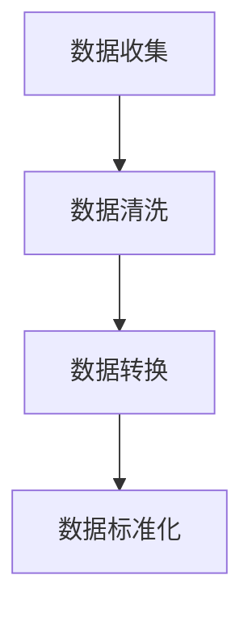

#### 3.2.2 商品分类与标签化

商品分类与标签化是电商推荐系统中组织商品信息的重要手段，通过将商品进行分类和打标签，可以提高推荐系统的效率和用户体验。以下是商品分类与标签化的主要步骤：

1. **分类**：分类是将商品分为不同的类别，以便用户能够快速查找和浏览商品。常见的分类方法包括：
    - 基于内容的分类：通过分析商品的特征和属性，如颜色、尺寸、材质等，将其归入相应的类别。
    - 基于机器学习的分类：利用机器学习算法，如决策树、支持向量机（SVM）等，对商品进行自动分类。

2. **标签化**：标签化是为商品添加额外的标签，以便更精细地描述商品。常见的标签化方法包括：
    - 基于关键词的标签化：通过提取商品描述中的关键词，将其作为商品的标签。
    - 基于聚类算法的标签化：利用聚类算法，如K-means、DBSCAN等，将商品分为不同的标签群。

3. **分类与标签化的关系**：分类和标签化是相互补充的，分类提供了商品的宏观分类结构，而标签化提供了商品的微观描述。通过分类和标签化，可以更全面地组织和管理商品信息。

**Mermaid流程图**：
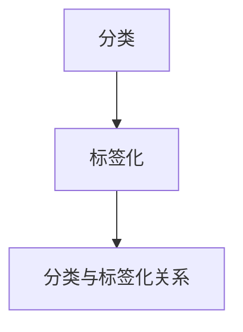

#### 3.2.3 商品信息更新与维护

商品信息更新与维护是确保商品信息准确性和及时性的关键，它包括以下步骤：

1. **数据同步**：将电商平台上的商品信息与外部数据源（如供应商数据库）进行同步，确保商品信息的实时更新。

2. **版本控制**：对商品信息进行版本控制，记录每次更新的时间和内容，以便在出现问题时进行回滚或修复。

3. **数据验证**：在更新商品信息后，进行数据验证，确保新数据的准确性和一致性。

4. **自动化更新**：通过自动化工具和脚本，定期检查和更新商品信息，提高更新效率。

**Mermaid流程图**：
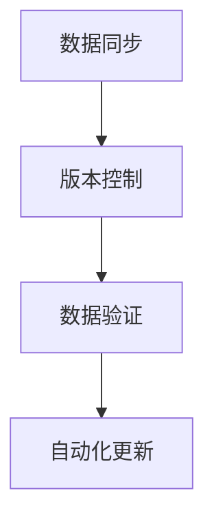

通过商品信息处理与分类，电商推荐系统可以有效地管理和组织商品信息，为用户提供精准的推荐。商品信息的准确性和及时性直接影响到推荐系统的性能和用户体验，因此需要持续进行信息更新与维护，确保推荐系统的稳定运行。

### 推荐算法设计

推荐算法是电商推荐系统的核心组成部分，其设计直接影响到推荐系统的性能和用户体验。常见的推荐算法包括基于协同过滤、基于内容推荐和基于深度学习推荐等。每种算法都有其独特的原理、优缺点以及应用场景。本节将详细介绍这些算法，并通过伪代码展示其基本实现。

#### 3.3.1 基于协同过滤的推荐算法

协同过滤（Collaborative Filtering）是一种基于用户行为数据的推荐算法，其核心思想是通过分析用户之间的相似性，预测用户对未知商品的兴趣。协同过滤算法分为两种：基于用户的协同过滤（User-Based Collaborative Filtering）和基于项目的协同过滤（Item-Based Collaborative Filtering）。

1. **基于用户的协同过滤**：
   - **原理**：首先计算用户之间的相似性，通常使用用户评分矩阵的余弦相似性或皮尔逊相关系数。然后，根据相似度最高的用户群体的行为，预测目标用户的评分。
   - **优点**：简单高效，易于实现和扩展。
   - **缺点**：容易受到“冷启动”问题的影响，即新用户或新商品的推荐效果不佳。

   **伪代码**：
   ```python
   # 基于用户的协同过滤伪代码
   def user_based_cf(train_data, user_id, k):
       # 计算用户相似度
       similarity_matrix = calculate_similarity(train_data, user_id)
       
       # 获取相似度最高的k个用户
       similar_users = get_top_k_users(similarity_matrix, k)
       
       # 预测评分
       prediction = calculate_average_rating(similar_users, train_data)
       
       return prediction
   ```

2. **基于项目的协同过滤**：
   - **原理**：首先计算项目之间的相似性，通常使用项目评分矩阵的余弦相似性或欧氏距离。然后，根据相似度最高的项目的行为，预测目标用户对这些项目的评分。
   - **优点**：解决了“冷启动”问题，对新用户和新商品具有良好的推荐效果。
   - **缺点**：计算复杂度高，处理大型数据集时性能较差。

   **伪代码**：
   ```python
   # 基于项目的协同过滤伪代码
   def item_based_cf(train_data, user_id, item_id, k):
       # 计算项目相似度
       similarity_matrix = calculate_similarity(train_data, item_id)
       
       # 获取相似度最高的k个项目
       similar_items = get_top_k_items(similarity_matrix, k)
       
       # 预测评分
       prediction = calculate_average_rating(similar_items, train_data)
       
       return prediction
   ```

#### 3.3.2 基于内容推荐的算法

内容推荐（Content-Based Recommending）是一种基于商品内容的推荐算法，其核心思想是分析商品的特征和属性，然后将具有相似特征的商品推荐给用户。内容推荐算法通常结合了文本分析和特征提取技术。

- **原理**：首先，对商品的文本描述、标签、属性等信息进行文本分析，提取出关键词和主题。然后，根据用户的兴趣和偏好，推荐具有相似特征的商品。
- **优点**：能够提供个性化的推荐，对新用户和新商品具有较强的适应性。
- **缺点**：在商品特征差异较小或文本描述不足时，推荐效果可能较差。

**伪代码**：
```python
# 基于内容推荐的算法伪代码
def content_based_recommender(item_features, user_preferences, k):
    # 计算项目与用户的相似度
    similarity_matrix = calculate_similarity(item_features, user_preferences)
    
    # 获取相似度最高的k个项目
    similar_items = get_top_k_items(similarity_matrix, k)
    
    return similar_items
```

#### 3.3.3 基于深度学习的推荐算法

基于深度学习的推荐算法（Deep Learning Recommender）利用深度学习模型，从用户行为数据和商品特征中自动提取特征，实现高效的推荐。常见的深度学习推荐算法有基于用户行为的深度学习模型（如GRU、LSTM）和基于商品特征的深度学习模型（如CNN、Transformer）。

- **原理**：深度学习模型通过多层神经网络，自动学习用户行为数据和商品特征的复杂关系。在训练阶段，模型通过反向传播算法不断优化参数，提高预测准确率。在预测阶段，模型根据用户行为和商品特征，生成推荐列表。
- **优点**：强大的特征提取和模式识别能力，能够处理复杂的用户行为和商品特征。
- **缺点**：计算资源消耗大，训练时间较长。

**伪代码**：
```python
# 基于深度学习的推荐算法伪代码
def deep_learning_recommender(train_data, user_features, item_features):
    # 构建深度学习模型
    model = build_model(user_features, item_features)
    
    # 训练模型
    model = train_model(model, train_data)
    
    # 预测推荐结果
    predictions = predict(model, user_features, item_features)
    
    return predictions
```

通过综合运用协同过滤、内容推荐和深度学习推荐算法，电商推荐系统可以提供更加精准和个性化的推荐，提高用户满意度和购买转化率。每种算法都有其特定的适用场景和优势，结合实际需求选择合适的算法，可以最大化推荐系统的效果。

### 实时推荐系统优化

实时推荐系统的优化是提升系统性能和用户体验的关键。优化的目标主要包括提高推荐结果的实时性、多样性和准确性。本节将详细介绍实时推荐系统优化的策略和方法。

#### 3.4.1 推荐结果实时性优化

实时性是实时推荐系统的核心要求，用户期望能够在最短时间内获得高质量的推荐结果。以下是一些优化实时性的策略：

1. **高效数据处理**：采用高效的数据处理技术，如增量数据处理和并行处理，减少数据处理时间。
2. **内存优化**：利用内存数据库和缓存技术，如Redis，存储和查询用户行为数据和推荐结果，减少磁盘I/O操作。
3. **模型优化**：使用轻量级模型和优化算法，如深度可分离卷积（Depthwise Separable Convolution）和量化技术，减少模型计算量和存储需求。
4. **异步处理**：采用异步处理机制，将数据处理和模型预测任务分离开，提高系统的并发处理能力。

**伪代码**：
```python
# 实时推荐系统优化伪代码
def optimize_real_time_recommendation(data, model):
    # 使用增量数据处理
    processed_data = incremental_data_processing(data)
    
    # 使用内存数据库和缓存
    cached_data = cache_data(processed_data)
    
    # 使用轻量级模型
    optimized_model = lightweight_model(model)
    
    # 异步处理
    predictions = async_predict(optimized_model, cached_data)
    
    return predictions
```

#### 3.4.2 推荐结果多样性优化

多样性是保证推荐结果丰富性和用户体验的关键。以下是一些提高推荐多样性的策略：

1. **冷热商品分离**：通过分析用户的浏览和购买行为，将热门商品和冷门商品分离，确保推荐结果中既有热门商品也有冷门商品。
2. **随机化**：在推荐算法中引入随机因素，如随机采样或随机种子，增加推荐结果的多样性。
3. **层次化推荐**：采用层次化推荐策略，如基于品类、品牌、价格等多个维度进行分层推荐，确保推荐结果的多样性。
4. **协同过滤混合**：结合基于用户和基于内容的协同过滤算法，通过综合用户行为和商品特征，提高推荐结果的多样性。

**伪代码**：
```python
# 多样性优化伪代码
def optimize_diversity(predictions):
    # 冷热商品分离
    hot_items = separate_hot_and_cold_items(predictions)
    
    # 引入随机化
    randomized_predictions = randomize(predictions)
    
    # 层次化推荐
    hierarchical_predictions = hierarchical_recommending(hot_items, randomized_predictions)
    
    return hierarchical_predictions
```

#### 3.4.3 推荐结果准确性优化

准确性是推荐系统最基本的要求，优化的目标是提高推荐结果的预测精度和用户满意度。以下是一些提高准确性的策略：

1. **用户兴趣建模**：通过分析用户的浏览、购买和评价等行为，建立用户兴趣模型，提高推荐结果的个性化程度。
2. **多模型集成**：结合多个推荐模型，如基于协同过滤、内容推荐和深度学习等，通过集成学习提高推荐结果的准确性。
3. **在线学习**：采用在线学习机制，持续更新和优化模型，根据用户行为的实时变化调整推荐策略。
4. **特征工程**：通过特征工程，提取更多有价值的特征，如用户标签、商品标签、行为序列等，提高模型的学习能力和预测精度。

**伪代码**：
```python
# 准确性优化伪代码
def optimize_accuracy(model, train_data, user_behavior):
    # 用户兴趣建模
    user_interest_model = build_user_interest_model(train_data, user_behavior)
    
    # 多模型集成
    integrated_model = ensemble_models([model, user_interest_model])
    
    # 在线学习
    updated_model = online_learning(integrated_model, train_data, user_behavior)
    
    return updated_model
```

通过实时性、多样性和准确性的优化策略，实时推荐系统可以在保证用户满意度的同时，提高系统的整体性能和用户体验。这些策略需要在实际应用中灵活调整和优化，以满足不断变化的市场需求。

### 实时推荐系统实战

#### 4.1 实时推荐系统开发环境搭建

为了搭建一个实时推荐系统，首先需要准备开发环境。以下是开发环境的搭建步骤：

1. **开发工具与框架选择**
   - **编程语言**：选择Python作为主要编程语言，因为它有丰富的机器学习和深度学习库。
   - **推荐系统框架**：使用推荐系统框架如LightFM或Surprise，这些框架提供了基于协同过滤和基于模型的推荐算法。
   - **深度学习框架**：使用TensorFlow或PyTorch进行深度学习模型的训练和优化。

2. **数据预处理与存储**
   - **数据存储**：使用Hadoop或HBase进行大数据存储，存储用户行为数据和商品信息。
   - **数据预处理**：使用Pandas和NumPy进行数据清洗、转换和标准化。

3. **模型训练与优化**
   - **训练数据集**：从Hadoop或HBase中提取训练数据，用于训练推荐模型。
   - **模型训练**：使用Surprise框架或TensorFlow进行模型训练。
   - **模型优化**：通过交叉验证和网格搜索优化模型参数。

**代码示例**：

```python
# 安装必需的库
!pip install pandas numpy surprise

# 导入库
import pandas as pd
from surprise import SVD, Dataset, Reader
from surprise.model_selection import cross_validate

# 读取数据
data = pd.read_csv('user_behavior_data.csv')

# 初始化Reader
reader = Reader(rating_scale=(1, 5))

# 创建Dataset
dataset = Dataset.load_from_df(data[['user_id', 'item_id', 'rating']], reader)

# 使用SVD算法进行训练
svd = SVD()

# 进行交叉验证
cross_validate(svd, dataset, measures=['RMSE', 'MAE'], cv=5, verbose=True)
```

#### 4.2 实时推荐系统项目案例

以下是实时推荐系统的项目案例，包括项目背景、目标、系统架构设计、关键技术与算法实现以及项目效果评估与优化。

**4.2.1 项目背景与目标**

项目背景：某大型电商平台希望通过引入AI大模型，提升其推荐系统的实时性和准确性，为用户提供更加个性化的购物体验。

项目目标：
1. 实现基于用户行为的实时推荐系统。
2. 提高推荐系统的准确性和实时性。
3. 增强系统的可扩展性和稳定性。

**4.2.2 系统架构设计**

系统架构包括以下模块：

1. **数据收集模块**：负责从各个数据源收集用户行为数据，如浏览记录、购买历史、搜索关键词等。
2. **数据处理模块**：对收集到的用户行为数据进行清洗、转换和标准化，为后续的推荐模型提供高质量的数据。
3. **推荐模型模块**：使用深度学习模型进行用户行为分析和推荐结果生成。
4. **服务模块**：提供API接口，供前端调用推荐结果。
5. **监控模块**：对系统运行状态和性能进行监控，确保系统的稳定运行。

**Mermaid流程图**：
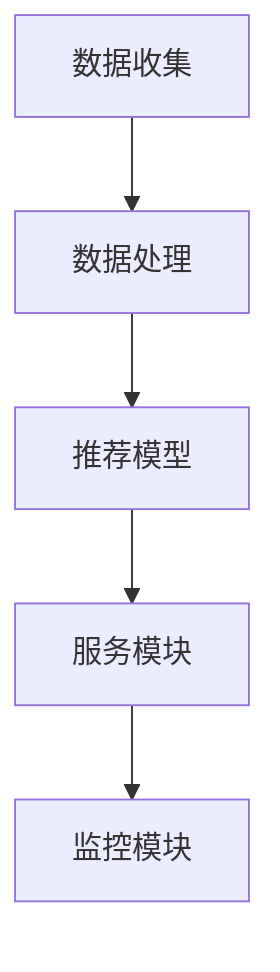

**4.2.3 关键技术与算法实现**

1. **用户行为数据处理**：
   - **数据清洗**：去除缺失值、重复值和噪声数据。
   - **特征提取**：提取用户行为序列特征，如点击时间、点击频次等。
   - **数据标准化**：对特征进行归一化处理。

2. **深度学习推荐模型**：
   - **模型选择**：选择基于LSTM的深度学习模型，用于用户行为序列预测。
   - **模型训练**：使用TensorFlow或PyTorch进行模型训练。
   - **模型优化**：通过交叉验证和网格搜索优化模型参数。

3. **API接口实现**：
   - **接口设计**：设计RESTful API接口，提供推荐结果。
   - **接口实现**：使用Flask或Django框架实现API接口。

**代码示例**：

```python
# LSTM模型训练示例
import tensorflow as tf
from tensorflow.keras.models import Sequential
from tensorflow.keras.layers import LSTM, Dense

# 创建LSTM模型
model = Sequential()
model.add(LSTM(128, activation='relu', input_shape=(timesteps, features)))
model.add(Dense(1))

# 编译模型
model.compile(optimizer='adam', loss='mse')

# 训练模型
model.fit(X_train, y_train, epochs=50, batch_size=64)
```

**4.2.4 项目效果评估与优化**

1. **效果评估**：
   - **准确性评估**：使用均方根误差（RMSE）和均方误差（MSE）评估推荐模型的准确性。
   - **实时性评估**：评估系统响应时间和推荐结果的生成时间。
   - **用户满意度评估**：通过用户调查和反馈评估推荐系统的用户体验。

2. **优化策略**：
   - **模型优化**：通过调整模型参数和架构，提高推荐准确性。
   - **系统优化**：优化数据处理和模型预测的效率，提高系统的实时性。
   - **反馈机制**：引入用户反馈机制，根据用户行为调整推荐策略。

通过以上项目实战，我们可以看到实时推荐系统的开发过程，包括环境搭建、关键技术和算法实现，以及项目的效果评估与优化。通过不断的技术迭代和优化，实时推荐系统可以更好地满足用户需求，提高平台的运营效果。

### 实时推荐系统部署与运维

#### 4.3.1 系统部署策略

实时推荐系统的部署是保障其稳定性和高效性的关键环节。以下是系统部署的主要策略：

1. **分布式部署**：为了应对海量的用户请求和数据流，推荐系统应采用分布式部署，将系统分解为多个模块，如数据收集、数据处理、模型训练、推荐服务等。每个模块可以在不同的服务器或集群上运行，实现负载均衡和高可用性。

2. **容器化与微服务架构**：使用容器技术（如Docker）和微服务架构，可以将系统的各个模块封装为独立的容器或服务，便于部署、扩展和维护。容器化可以提高系统的部署效率和灵活性，微服务架构则可以降低系统间的耦合度，提高系统的可维护性。

3. **弹性伸缩**：通过自动化工具（如Kubernetes），根据系统负载自动调整服务器的数量和资源分配，实现弹性伸缩。在用户流量高峰期，自动增加服务器资源，确保系统的高性能和高可用性。

4. **数据同步与一致性**：在分布式系统中，数据同步和一致性是关键问题。应采用分布式数据存储方案（如Apache Kafka、Apache HBase），确保数据在不同节点之间的一致性和实时性。

**Mermaid流程图**：
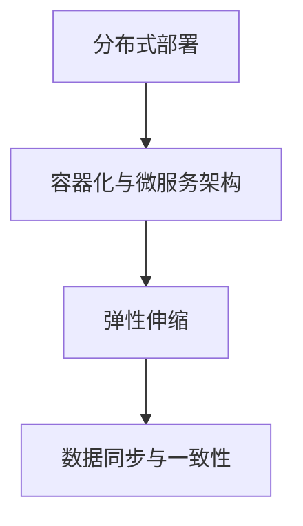

#### 4.3.2 系统监控与维护

系统监控与维护是确保实时推荐系统稳定运行的重要环节。以下是监控与维护的主要方法：

1. **监控指标**：定义关键的监控指标，如系统响应时间、处理吞吐量、错误率、数据一致性等。通过实时监控这些指标，可以及时发现系统异常和性能瓶颈。

2. **日志管理**：收集和存储系统的日志信息，如错误日志、操作日志等。使用日志分析工具（如ELK Stack），对日志进行实时分析和异常检测，以便快速定位和解决问题。

3. **自动报警**：通过设置阈值和报警规则，当监控指标超过预设的阈值时，自动发送报警信息，如邮件、短信、Slack等。确保系统运维人员能够及时响应和处理异常情况。

4. **自动化运维**：使用自动化运维工具（如Ansible、Puppet），实现系统的自动化部署、配置管理和故障恢复。降低运维成本，提高运维效率。

**Mermaid流程图**：
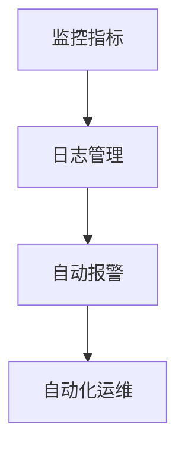

#### 4.3.3 负载均衡与性能优化

为了提高实时推荐系统的性能和稳定性，负载均衡与性能优化是关键措施：

1. **负载均衡**：使用负载均衡器（如Nginx、HAProxy），根据用户请求的流量分布，将请求分配到不同的服务器或集群上。常见的负载均衡策略包括轮询、最小连接数、源IP哈希等。

2. **缓存机制**：使用缓存技术（如Redis、Memcached），将频繁访问的数据存储在内存中，减少数据库的查询压力，提高系统的响应速度。

3. **数据库优化**：优化数据库查询，如索引优化、查询缓存、读写分离等，提高数据库的性能。

4. **分布式计算**：对于大数据处理任务，使用分布式计算框架（如Apache Spark、Flink），将任务分解为多个子任务，在多个节点上并行处理，提高处理速度。

5. **内存管理**：优化系统的内存管理，如使用内存池、对象池等技术，减少内存分配和回收的开销，提高系统的稳定性和性能。

**Mermaid流程图**：
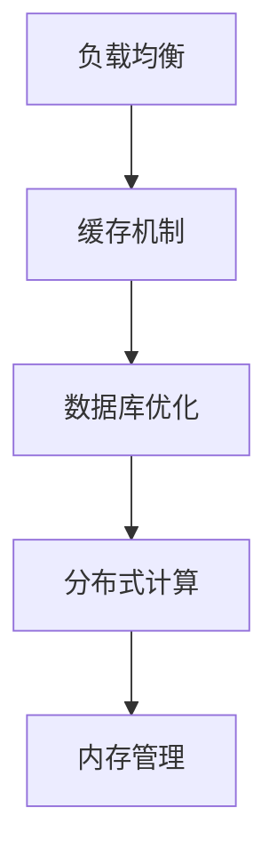

通过系统部署策略、监控与维护以及负载均衡与性能优化，实时推荐系统可以更好地应对高并发和海量数据挑战，提供稳定、高效、高质量的推荐服务。

### 总结与展望

#### 5.1 主要内容回顾

本书《电商平台中AI大模型的实时推荐策略》系统性地探讨了AI大模型在实时推荐系统中的应用。从基础理论到实际应用，本书涵盖了以下几个方面：

1. **AI大模型基础**：介绍了AI大模型的基本概念、架构和训练方法，为后续应用奠定了理论基础。
2. **实时推荐系统架构**：分析了实时推荐系统的基本原理和设计要点，包括数据收集、处理和存储等环节。
3. **用户行为分析与建模**：详细讲解了用户行为数据收集、特征提取和建模的过程，为个性化推荐提供了数据支持。
4. **商品信息处理与分类**：阐述了商品信息处理、分类与标签化的方法，提高了推荐系统的信息组织和管理能力。
5. **推荐算法设计**：介绍了基于协同过滤、内容推荐和深度学习等常见推荐算法，展示了不同算法的实现和优化策略。
6. **实时推荐系统优化**：探讨了实时推荐系统的实时性、多样性和准确性优化策略，提升了系统的整体性能。
7. **实时推荐系统实战**：通过具体的项目案例，展示了实时推荐系统的开发、部署与运维过程，为实际应用提供了参考。
8. **系统部署与运维**：介绍了实时推荐系统的部署策略、监控与维护方法，以及负载均衡与性能优化技术。

#### 5.2 AI大模型在实时推荐中的关键作用

AI大模型在实时推荐系统中的关键作用体现在以下几个方面：

1. **数据处理能力**：AI大模型具有强大的数据处理能力，能够高效地处理海量用户行为数据，实现实时推荐。
2. **个性化推荐**：通过深度学习算法，AI大模型可以从数据中挖掘用户的兴趣和行为模式，提供个性化的推荐结果。
3. **实时性**：AI大模型通过高效的算法和优化技术，能够在短时间内生成高质量的推荐结果，满足用户即时决策的需求。
4. **自适应调整**：AI大模型可以动态调整推荐策略，根据用户行为的变化实时优化推荐效果，提高推荐准确性。

#### 5.3 实时推荐系统的技术挑战与解决方案

实时推荐系统在实际应用中面临着一系列技术挑战，以下是其中几个关键挑战及相应的解决方案：

1. **数据隐私与安全**：挑战：用户行为数据敏感性高，隐私保护是关键问题。解决方案：采用数据加密、匿名化处理和隐私保护算法，确保用户数据的安全性和隐私性。
2. **计算资源消耗**：挑战：AI大模型训练和预测需要大量的计算资源和存储空间。解决方案：采用分布式计算和容器化技术，提高计算效率和资源利用率。
3. **模型解释性**：挑战：深度学习模型的“黑箱”性质使得其解释性较差，难以理解模型的决策过程。解决方案：开发可解释性模型和模型可视化工具，提高模型的透明度和可解释性。
4. **实时性**：挑战：在高并发场景下，如何保证推荐结果的实时性。解决方案：采用高效的算法和优化技术，如增量数据处理、内存优化和异步处理，提高系统的实时性。

#### 5.4 未来发展趋势

未来，AI大模型在实时推荐系统中的应用将呈现以下发展趋势：

1. **智能化与自动化**：随着AI技术的进步，推荐系统将变得更加智能化和自动化，通过自适应学习和动态调整，实现更加精准的个性化推荐。
2. **多模态数据处理**：实时推荐系统将融合多种数据源，如文本、图像、语音等，通过多模态数据处理技术，提供更加丰富和个性化的推荐。
3. **实时推荐算法优化**：随着硬件性能的提升和算法优化技术的发展，实时推荐算法将更加高效和精准，满足用户对实时性和准确性的高要求。
4. **跨平台与跨领域应用**：AI大模型在实时推荐系统的应用将逐步扩展到其他领域，如金融、医疗、教育等，为各个行业提供智能化推荐服务。
5. **伦理与合规**：随着AI技术的广泛应用，推荐系统的伦理和合规问题将受到更多关注，开发透明、公平、可解释的推荐系统将是未来的重要方向。

总之，AI大模型在实时推荐系统中的应用前景广阔，通过不断创新和优化，将进一步提升推荐系统的性能和用户体验，为电商平台和其他行业带来巨大的价值。

### 附录

#### 附录A：常用工具与资源

**A.1 开发工具与框架**

1. **Python**：作为主要编程语言，Python拥有丰富的库和框架，如NumPy、Pandas、Scikit-learn、TensorFlow和PyTorch。
2. **Surprise**：一个Python开源推荐系统库，提供多种协同过滤算法。
3. **TensorFlow**：Google开发的开源深度学习框架，适用于构建和训练深度学习模型。
4. **PyTorch**：Facebook开发的开源深度学习框架，支持动态计算图，易于调试。
5. **Docker**：容器化技术，用于部署和管理应用。
6. **Kubernetes**：自动化容器编排工具，用于大规模部署和管理容器化应用。

**A.2 数据集与案例**

1. **MovieLens**：一个提供用户行为数据和电影信息的数据集，常用于推荐系统研究。
2. **Netflix Prize**：Netflix提供的竞争性数据集，用于研究电影推荐系统。
3. **Amazon Product Reviews**：亚马逊商品评价数据集，可用于商品推荐研究。
4. **Kaggle**：提供各种数据集和竞赛，适用于数据分析和机器学习实践。

**A.3 研究论文与文献推荐**

1. "Recommender Systems Handbook" by G. K. Huang et al.
2. "Deep Learning for Recommender Systems" by Y. Zhang et al.
3. "Collaborative Filtering: A Review" by B. B. Liu and G.seth
4. "User Interest Model Learning for Personalized Recommendation" by X. He et al.

**A.4 社区与论坛推荐**

1. **Reddit**：相关子版块，如r/MachineLearning、r/Python等。
2. **Stack Overflow**：编程问题解答平台。
3. **Kaggle**：数据科学竞赛和讨论区。
4. **AI Slack Communities**：各种AI相关主题的Slack群组。

#### 附录B：Mermaid流程图

**B.1 用户行为分析与建模流程**

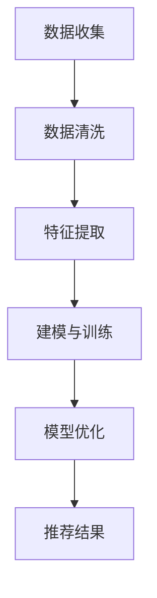

**B.2 商品信息处理与分类流程**


**B.3 推荐算法设计与优化流程**

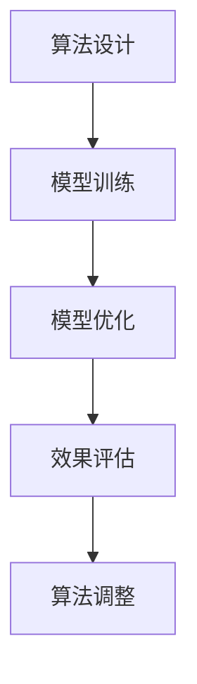

**B.4 实时推荐系统开发与部署流程**

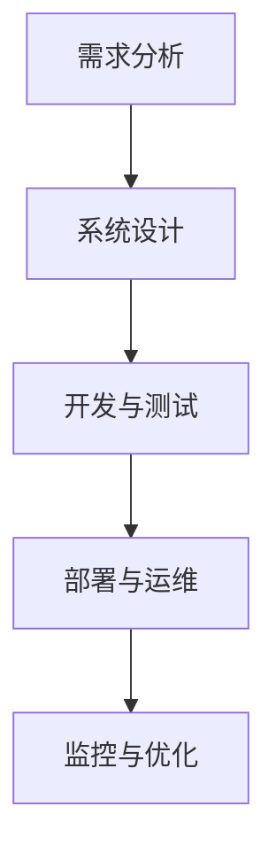

通过附录中的工具与资源和流程图，读者可以更好地理解和应用AI大模型在实时推荐系统中的相关知识，为实际项目开发提供有力支持。

