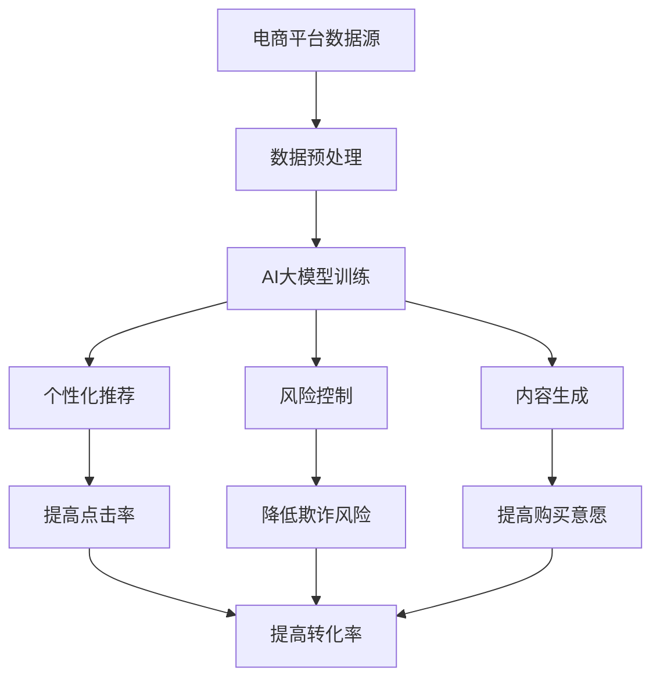

                 

### 引言

随着电子商务的快速发展，各大电商平台都在寻求提高用户转化率的有效方法。在当今数据驱动的商业环境中，人工智能（AI）大模型作为一种强大的工具，正被广泛应用于电商平台的各个领域，以提高用户体验和销售额。本文将探讨电商平台如何借助AI大模型来提高转化率，从核心概念、算法原理、项目实战和代码实现等方面进行详细分析。

首先，我们需要了解AI大模型的基本概念。AI大模型是指那些规模庞大、参数数量巨大的深度学习模型，如GPT-3、BERT等。这些模型通过在海量数据上进行训练，能够自动提取出数据中的复杂模式和规律，从而在各个领域中发挥重要作用。

其次，本文将深入讲解电商平台如何利用AI大模型提高转化率的核心算法原理，包括预测模型、聚类算法和推荐系统。我们将通过具体的数学模型和公式来解释这些算法的工作原理。

接着，本文将通过一个实际案例，展示如何构建和实现一个电商平台AI模型，包括数据预处理、特征工程、模型训练和评估等步骤。

最后，本文将提供完整的源代码实现，并对其进行详细解读，帮助读者更好地理解AI大模型在电商平台中的应用。

通过本文的详细分析，读者将能够全面了解电商平台如何借助AI大模型提高转化率，并为实际项目提供实用的指导。接下来，我们将逐步深入各个部分，探索AI大模型在电商平台中的应用。

### 关键词

- 人工智能
- 大模型
- 电商平台
- 转化率
- 预测模型
- 聚类算法
- 推荐系统
- 数据预处理
- 特征工程
- 代码实现

### 摘要

本文深入探讨了电商平台如何借助AI大模型提高用户转化率。首先，我们介绍了AI大模型的基本概念和其在电商平台中的应用。然后，我们详细讲解了电商平台利用AI大模型提高转化率的核心算法原理，包括预测模型、聚类算法和推荐系统。接着，我们通过一个实际案例展示了如何构建和实现电商平台AI模型，并提供了完整的源代码实现和解读。本文旨在为电商平台的从业者提供一套完整的指南，帮助他们利用AI大模型提高转化率，实现商业价值。

### 第一部分: 核心概念与联系

#### 1.1.1 AI大模型与电商平台转化率提高的关系

电商平台如何借助AI大模型提高转化率，首先要理解AI大模型的基本概念。AI大模型，特别是深度学习模型，通过大量的数据训练，可以自动识别出数据中的模式和规律，从而在电商平台中应用这些模式来提高转化率。

AI大模型，如GPT-3、BERT等，具有以下几个特点：

- **高参数量**：AI大模型通常包含数亿甚至数万亿个参数，这使得它们能够学习复杂的数据模式。
- **强大的表示能力**：通过深度神经网络结构，AI大模型能够捕捉到数据的深层特征，从而实现高效的特征提取和表示。
- **端到端学习**：AI大模型可以直接从原始数据中学习到输入和输出的映射关系，无需人工设计中间特征。

这些特点使得AI大模型在电商平台的各个领域具有广泛的应用潜力，包括个性化推荐、风险控制和内容生成等。

在电商平台的转化率提升中，AI大模型主要通过以下几个方面发挥作用：

1. **个性化推荐**：AI大模型可以分析用户的浏览历史、购买行为和社交信息等数据，生成个性化的推荐列表。这些推荐列表能够提高用户的点击率和购买意愿，从而提高转化率。

2. **风险控制**：AI大模型可以通过分析用户的交易行为、账户信息等数据，识别出异常交易和潜在欺诈行为，从而降低平台的欺诈风险，提高交易成功率。

3. **内容生成**：AI大模型可以生成高质量的商品描述和广告文案，提高用户体验和购买意愿。例如，GPT-3可以生成引人入胜的产品故事和用户评价，从而提高商品的吸引力。

为了更好地理解AI大模型与电商平台转化率提高的关系，我们可以通过以下Mermaid流程图来展示：



该流程图展示了AI大模型从数据预处理、模型训练到具体应用的整个过程，以及各个环节对电商平台转化率的影响。

#### 1.1.2 电商平台转化率提升的核心算法原理

电商平台转化率的提升依赖于以下几个核心算法原理：

**1. 预测模型（如XGBoost、LSTM等）**

预测模型是电商平台提高转化率的关键，用于预测用户的购买概率、流失概率等。以下是一些常用的预测模型：

- **XGBoost**：XGBoost是一种高效的梯度提升树（GBDT）算法，通过构建多个弱学习器（决策树）来提高预测准确性。XGBoost具有以下特点：

  - **正则化**：XGBoost通过L1和L2正则化来避免过拟合。
  - **并行处理**：XGBoost支持并行处理，能够快速训练大量决策树。

  XGBoost的预测公式为：
  $$f(x) = \sum_{i=1}^{n} \gamma_i \phi(x; \theta_i)$$
  其中，$\gamma_i$和$\theta_i$分别为树节点的参数。

- **LSTM（长短时记忆网络）**：LSTM是一种特殊的循环神经网络（RNN），适用于处理序列数据。LSTM通过引入门控机制，能够有效地捕捉长序列中的依赖关系。

  LSTM的预测公式为：
  $$h_t = \sigma(W_h \cdot [h_{t-1}, x_t] + b_h)$$
  $$i_t = \sigma(W_i \cdot [h_{t-1}, x_t] + b_i)$$
  $$f_t = \sigma(W_f \cdot [h_{t-1}, x_t] + b_f)$$
  $$o_t = \sigma(W_o \cdot [h_{t-1}, x_t] + b_o)$$
  $$c_t = f_t \cdot c_{t-1} + i_t \cdot \sigma(W_c \cdot [h_{t-1}, x_t] + b_c)$$
  $$h_t = o_t \cdot \sigma(c_t)$$
  其中，$h_t$、$c_t$分别为当前时刻的隐藏状态和细胞状态，$x_t$为输入特征。

**2. 聚类算法（如K-means、DBSCAN等）**

聚类算法用于将用户或商品分组，从而实现精准营销。以下是一些常用的聚类算法：

- **K-means**：K-means是一种基于距离的聚类算法，通过最小化每个簇内点的平均距离平方和来实现聚类。

  K-means的目标函数为：
  $$J = \sum_{i=1}^{k} \sum_{x \in S_i} ||x - \mu_i||^2$$
  其中，$S_i$为第$i$个簇，$\mu_i$为簇中心。

- **DBSCAN（Density-Based Spatial Clustering of Applications with Noise）**：DBSCAN是一种基于密度的聚类算法，能够识别出任意形状的簇，并对噪声数据不敏感。

  DBSCAN的目标函数为：
  $$\rho(q, p) = \min_{r \in R} ||q - r|| + ||p - r||$$
  其中，$q$和$p$为邻域内的两个点，$R$为邻域半径。

**3. 推荐系统算法（如协同过滤、矩阵分解等）**

推荐系统是电商平台提高转化率的重要手段，通过预测用户对商品的评分来生成个性化推荐。

- **协同过滤**：协同过滤分为用户基于协同过滤和物品基于协同过滤。用户基于协同过滤通过分析用户的历史行为，找到相似的用户并推荐他们喜欢的商品。物品基于协同过滤通过分析物品的属性和用户的历史行为，找到相似的物品并推荐给用户。

  协同过滤的预测公式为：
  $$R_{ui} = \sum_{j \in N_u} \frac{r_{uj}}{||w_j||} \cdot w_{uj}$$
  其中，$R_{ui}$为用户$u$对商品$i$的预测评分，$N_u$为用户$u$的邻居集合，$w_{uj}$为用户$u$对商品$i$的权重。

- **矩阵分解**：矩阵分解通过将用户-物品评分矩阵分解为两个低秩矩阵，从而预测未评分的元素。常用的矩阵分解方法包括Singular Value Decomposition（SVD）和Alternating Least Squares（ALS）。

  矩阵分解的预测公式为：
  $$R_{ui} = \sigma_i \cdot \sqrt{S_{uu'} \cdot S_{ii'}}$$
  其中，$R_{ui}$为用户$u$对商品$i$的预测评分，$\sigma_i$为第$i$个特征值，$S_{uu'}$和$S_{ii'}$分别为用户特征矩阵和商品特征矩阵。

#### 1.1.3 数学模型与公式

以下是一些关键的数学模型和公式，用于解释电商平台如何利用AI大模型提高转化率：

**1. 预测模型评估指标（如准确率、召回率、F1值）**

- **准确率（Accuracy）**：准确率是指模型预测正确的样本数占总样本数的比例。
  $$\text{Accuracy} = \frac{\text{预测正确的样本数}}{\text{总样本数}}$$
- **召回率（Recall）**：召回率是指模型预测正确的正样本数占总正样本数的比例。
  $$\text{Recall} = \frac{\text{预测正确的正样本数}}{\text{所有正样本数}}$$
- **精确率（Precision）**：精确率是指模型预测正确的正样本数与预测为正样本的总数之比。
  $$\text{Precision} = \frac{\text{预测正确的正样本数}}{\text{预测为正样本的总数}}$$
- **F1值（F1 Score）**：F1值是精确率和召回率的调和平均值，用于综合评估模型的性能。
  $$\text{F1 Score} = 2 \times \frac{\text{Precision} \times \text{Recall}}{\text{Precision} + \text{Recall}}$$

**2. 用户行为预测模型（如概率分布函数、概率密度函数）**

- **概率分布函数（Probability Distribution Function, PDF）**：概率分布函数描述了随机变量在某个值附近的概率。
  $$f(x) = P(X = x)$$
- **概率密度函数（Probability Density Function, PDF）**：概率密度函数描述了随机变量在某个区间内的概率。
  $$f(x) = P(X \leq x)$$

**3. 推荐系统中的相似度计算（如余弦相似度、欧氏距离）**

- **余弦相似度（Cosine Similarity）**：余弦相似度用于衡量两个向量在空间中的夹角余弦值，表示它们之间的相似度。
  $$\text{Cosine Similarity} = \frac{\text{向量A与向量B的点积}}{\text{向量A的模} \times \text{向量B的模}}$$
- **欧氏距离（Euclidean Distance）**：欧氏距离用于衡量两个向量在空间中的距离。
  $$\text{Euclidean Distance} = \sqrt{\sum_{i=1}^{n} (x_i - y_i)^2}$$

通过上述核心概念、算法原理和数学模型，我们可以更好地理解电商平台如何利用AI大模型提高转化率。

#### 1.1.4 电商平台AI应用实例

以下是一个简单的电商平台AI应用实例，用于解释如何使用AI大模型提高转化率：

**案例：个性化商品推荐系统**

**步骤 1：数据收集与预处理**
- 收集用户的浏览历史、购买记录和商品信息。
- 对数据进行清洗和预处理，包括缺失值处理、数据标准化和特征工程。

**步骤 2：构建预测模型**
- 使用XGBoost或LSTM构建用户购买概率预测模型。
- 训练模型并调参，以提高预测准确性。

**步骤 3：用户群体细分**
- 使用K-means或DBSCAN对用户进行聚类，识别出不同类型的用户群体。

**步骤 4：推荐算法实现**
- 使用协同过滤或矩阵分解实现个性化推荐算法。
- 根据用户当前的兴趣和行为，推荐可能感兴趣的商品。

**步骤 5：评估与优化**
- 使用准确率、召回率、F1值等评估指标评估推荐系统的效果。
- 根据评估结果对模型进行优化，提高推荐质量。

通过上述实例，我们可以看到电商平台如何利用AI大模型提高转化率。接下来，本书将详细介绍各个核心算法和模型的实现细节，帮助读者深入理解AI大模型在电商平台中的应用。

### 第二部分: 核心算法原理讲解

#### 2.1.1 预测模型原理

预测模型在电商平台中扮演着至关重要的角色，主要用于预测用户的购买行为、流失风险等。本节将详细介绍电商平台常用的预测模型原理，包括回归模型和分类模型。

**1. 回归模型**

回归模型用于预测连续值，如预测用户下次购买的金额、预测商品的销量等。常见的回归模型包括线性回归和逻辑回归。

- **线性回归**：线性回归是一种最简单的回归模型，其核心思想是通过拟合一条直线来预测目标值。线性回归模型的预测公式如下：

  $$y = \beta_0 + \beta_1x_1 + \beta_2x_2 + ... + \beta_nx_n$$

  其中，$y$为预测目标值，$x_1, x_2, ..., x_n$为输入特征，$\beta_0, \beta_1, \beta_2, ..., \beta_n$为模型参数。

  线性回归通过最小二乘法来求解参数，使得预测值与实际值的平方误差之和最小。具体求解过程如下：

  1. 计算输入特征和目标值的平均值。
  2. 计算每个输入特征与目标值的偏差。
  3. 通过计算偏差的平方和来求解参数。

  线性回归的优点是简单易懂、易于计算，但缺点是对于非线性关系的数据表现较差。

- **逻辑回归**：逻辑回归是一种广义的线性回归模型，主要用于预测二分类问题，如预测用户是否会购买商品。逻辑回归的核心思想是通过拟合对数几率来预测概率，其预测公式如下：

  $$\text{log-odds} = \beta_0 + \beta_1x_1 + \beta_2x_2 + ... + \beta_nx_n$$

  其中，$\text{log-odds}$表示对数几率，$x_1, x_2, ..., x_n$为输入特征，$\beta_0, \beta_1, \beta_2, ..., \beta_n$为模型参数。

  对数几率的预测值可以通过sigmoid函数转换为概率：

  $$\text{Probability} = \frac{1}{1 + e^{-\text{log-odds}}}$$

  逻辑回归的优点是能够处理非线性关系、可以解释变量之间的关系，但缺点是对于多分类问题表现较差。

**2. 分类模型**

分类模型用于预测离散值，如预测用户是否会购买商品、预测商品的分类等。常见的分类模型包括决策树、随机森林和SVM等。

- **决策树**：决策树是一种树形结构，通过一系列的决策规则来对样本进行分类。决策树的基本原理如下：

  1. 选择一个最优的特征进行分割，使得分割后的数据集的熵最大减少。
  2. 将数据集按照选择的特征进行分割，生成子节点。
  3. 递归地对子节点进行分割，直到满足停止条件（如最大树深度、最小节点样本数等）。

  决策树的优点是直观易懂、易于解释，但缺点是容易过拟合、无法处理非线性关系。

- **随机森林**：随机森林是一种集成学习模型，通过构建多棵决策树，并取多数投票来预测结果。随机森林的基本原理如下：

  1. 随机选择一部分特征进行分割。
  2. 随机选择一部分样本进行分割。
  3. 构建多棵决策树，并取多数投票来预测结果。

  随机森林的优点是能够提高模型的预测性能、减少过拟合、处理非线性关系，但缺点是计算复杂度较高。

- **SVM（支持向量机）**：SVM是一种基于间隔最大化原则的线性分类模型，通过找到一个最佳的超平面来分隔不同类别的数据。SVM的基本原理如下：

  1. 将数据映射到高维空间，使得原本线性不可分的数据在映射后线性可分。
  2. 在高维空间中找到一个最佳的超平面，使得分类间隔最大化。
  3. 使用支持向量来定义超平面。

  SVM的优点是能够处理非线性关系、能够处理多分类问题，但缺点是计算复杂度较高。

通过上述介绍，我们可以看到电商平台常用的预测模型原理。在实际应用中，根据业务需求和数据特征，可以选择合适的预测模型来提高转化率。

#### 2.1.2 聚类算法原理

聚类算法是一种无监督学习方法，用于将数据点分为多个群组。聚类算法在电商平台中有着广泛的应用，如用户行为分析、商品分类等。本节将详细介绍电商平台常用的聚类算法原理，包括K-means和DBSCAN等。

**1. K-means算法**

K-means是一种基于距离的聚类算法，其核心思想是将数据点分配到最近的簇中心。以下是K-means算法的基本步骤：

1. **初始化簇中心**：随机选择K个数据点作为初始簇中心。

2. **分配数据点**：对于每个数据点，计算其与各个簇中心的距离，并将其分配到最近的簇中心所在的簇。

3. **更新簇中心**：计算每个簇内数据点的平均值，作为新的簇中心。

4. **重复步骤2和步骤3**，直到满足停止条件（如簇中心变化很小、达到最大迭代次数等）。

K-means算法的目标是最小化每个簇内点的平均距离平方和，其目标函数为：

$$J = \sum_{i=1}^{k} \sum_{x \in S_i} ||x - \mu_i||^2$$

其中，$S_i$为第$i$个簇，$\mu_i$为簇中心。

**2. DBSCAN算法**

DBSCAN（Density-Based Spatial Clustering of Applications with Noise）是一种基于密度的聚类算法，其核心思想是识别出具有足够高密度的区域作为簇。以下是DBSCAN算法的基本步骤：

1. **选择邻域半径**：根据数据分布选择合适的邻域半径$eps$。

2. **计算邻域**：对于每个数据点，计算其邻域内的所有点。

3. **标记核心点**：如果一个点的邻域内包含足够多的点（大于最小簇大小$min_samples$），则标记为核心点。

4. **标记边界点**：如果一个点的邻域内包含核心点，但点的邻域内点的数量小于最小簇大小$min_samples$，则标记为边界点。

5. **标记噪声点**：如果一个点的邻域内不包含核心点，则标记为噪声点。

6. **递归扩展簇**：对于每个核心点，递归地扩展其邻域内的点，形成一个新的簇。

DBSCAN算法的目标是识别出具有足够高密度的区域作为簇，其目标函数为：

$$\rho(q, p) = \min_{r \in R} ||q - r|| + ||p - r||$$

其中，$q$和$p$为邻域内的两个点，$R$为邻域半径。

通过上述介绍，我们可以看到K-means和DBSCAN算法的基本原理。在实际应用中，根据业务需求和数据特征，可以选择合适的聚类算法来提高转化率。

#### 2.1.3 推荐系统算法原理

推荐系统是电商平台提高转化率的重要手段，通过预测用户对商品的偏好，生成个性化的推荐列表。本节将详细介绍电商平台常用的推荐系统算法原理，包括协同过滤和矩阵分解等。

**1. 协同过滤**

协同过滤是一种基于用户或物品相似度的推荐算法，主要分为用户基于协同过滤和物品基于协同过滤。

- **用户基于协同过滤**：用户基于协同过滤通过分析用户的历史行为，找到相似的用户并推荐他们喜欢的商品。其基本步骤如下：

  1. **计算用户相似度**：对于每个用户，计算其与其他用户的相似度，常用的相似度计算方法包括余弦相似度和欧氏距离。

     余弦相似度计算公式为：

     $$\text{Cosine Similarity} = \frac{\text{向量A与向量B的点积}}{\text{向量A的模} \times \text{向量B的模}}$$

     欧氏距离计算公式为：

     $$\text{Euclidean Distance} = \sqrt{\sum_{i=1}^{n} (x_i - y_i)^2}$$

  2. **找到相似用户**：根据用户相似度，找到与当前用户最相似的若干用户。

  3. **生成推荐列表**：根据相似用户喜欢的商品，生成个性化的推荐列表。

- **物品基于协同过滤**：物品基于协同过滤通过分析物品的属性和用户的历史行为，找到相似的物品并推荐给用户。其基本步骤如下：

  1. **计算物品相似度**：对于每个物品，计算其与其他物品的相似度，常用的相似度计算方法包括余弦相似度和欧氏距离。

     余弦相似度计算公式为：

     $$\text{Cosine Similarity} = \frac{\text{向量A与向量B的点积}}{\text{向量A的模} \times \text{向量B的模}}$$

     欧氏距离计算公式为：

     $$\text{Euclidean Distance} = \sqrt{\sum_{i=1}^{n} (x_i - y_i)^2}$$

  2. **找到相似物品**：根据物品相似度，找到与当前物品最相似的若干物品。

  3. **生成推荐列表**：根据相似物品，生成个性化的推荐列表。

**2. 矩阵分解**

矩阵分解是一种基于低秩分解的推荐算法，通过将用户-物品评分矩阵分解为两个低秩矩阵，从而预测未评分的元素。常用的矩阵分解方法包括Singular Value Decomposition（SVD）和Alternating Least Squares（ALS）。

- **SVD分解**：SVD分解通过将用户-物品评分矩阵分解为用户特征矩阵和物品特征矩阵，从而预测未评分的元素。其基本步骤如下：

  1. **初始化用户特征矩阵$U$和物品特征矩阵$V$**。

  2. **优化特征矩阵**：通过交替优化用户特征矩阵$U$和物品特征矩阵$V$，使得预测值与实际值的平方误差之和最小。

  3. **预测未评分元素**：通过计算用户特征矩阵$U$和物品特征矩阵$V$的内积，预测未评分的元素。

- **ALS分解**：ALS分解通过交替最小二乘法来优化用户特征矩阵$U$和物品特征矩阵$V$。其基本步骤如下：

  1. **初始化用户特征矩阵$U$和物品特征矩阵$V$**。

  2. **优化用户特征矩阵$U$**：固定物品特征矩阵$V$，通过最小二乘法优化用户特征矩阵$U$。

  3. **优化物品特征矩阵$V$**：固定用户特征矩阵$U$，通过最小二乘法优化物品特征矩阵$V$。

  4. **重复步骤2和步骤3**，直到达到收敛条件。

通过上述介绍，我们可以看到协同过滤和矩阵分解算法的基本原理。在实际应用中，根据业务需求和数据特征，可以选择合适的推荐算法来提高转化率。

#### 2.1.4 推荐系统实现细节

推荐系统在电商平台中的应用，主要包括用户与物品的表示、矩阵分解和预测与推荐等步骤。以下将详细介绍这些实现细节。

**1. 用户与物品的表示**

用户与物品的表示是推荐系统的基础，通过将用户和物品的特征转换为向量，以便进行后续的矩阵分解和预测。以下是用户与物品表示的常用方法：

- **用户表示**：
  - **独热编码**：将用户特征（如年龄、性别、地理位置等）进行独热编码，即将每个特征转换为二进制向量。
  - **词袋模型**：将用户的历史行为（如浏览记录、购买记录等）进行词袋模型编码，即将每个行为转换为词袋向量。
  - **嵌入表示**：使用预训练的词嵌入模型（如Word2Vec、GloVe等），将用户特征转换为嵌入向量。

- **物品表示**：
  - **独热编码**：将物品特征（如类别、品牌、价格等）进行独热编码，即将每个特征转换为二进制向量。
  - **词袋模型**：将物品的属性信息（如商品描述、标签等）进行词袋模型编码，即将每个属性转换为词袋向量。
  - **嵌入表示**：使用预训练的词嵌入模型（如Word2Vec、GloVe等），将物品特征转换为嵌入向量。

**2. 矩阵分解**

矩阵分解是将用户-物品评分矩阵分解为用户特征矩阵和物品特征矩阵的过程。以下将详细介绍SVD分解和ALS分解的实现步骤：

- **SVD分解**：
  - **初始化**：随机初始化用户特征矩阵$U$和物品特征矩阵$V$。
  - **优化$U$**：固定物品特征矩阵$V$，通过最小二乘法优化用户特征矩阵$U$。
  - **优化$V$**：固定用户特征矩阵$U$，通过最小二乘法优化物品特征矩阵$V$。
  - **迭代**：重复步骤2和步骤3，直到达到收敛条件。

- **ALS分解**：
  - **初始化**：随机初始化用户特征矩阵$U$和物品特征矩阵$V$。
  - **优化$U$**：固定物品特征矩阵$V$，通过最小二乘法优化用户特征矩阵$U$。
  - **优化$V$**：固定用户特征矩阵$U$，通过最小二乘法优化物品特征矩阵$V$。
  - **迭代**：重复步骤2和步骤3，直到达到收敛条件。

**3. 预测与推荐**

预测与推荐是推荐系统的核心，通过计算用户和物品的特征向量，预测用户的兴趣和偏好，生成个性化的推荐列表。以下是预测与推荐的实现步骤：

- **预测**：通过计算用户特征向量$u$和物品特征向量$v$的内积，预测用户的兴趣和偏好：
  $$\text{Prediction} = u \cdot v$$

- **推荐**：根据预测的兴趣和偏好，生成个性化的推荐列表。常见的推荐策略包括：
  - **基于热门度的推荐**：推荐热门商品，即评分较高的商品。
  - **基于兴趣的推荐**：推荐与用户当前兴趣相关的商品，即用户已评分且评分较高的商品。
  - **基于协作过滤的推荐**：推荐与其他用户兴趣相似的用户的推荐商品。
  - **基于内容的推荐**：推荐与用户当前商品相似的物品，即基于物品的特征进行推荐。

通过上述介绍，我们可以看到推荐系统实现的具体细节。在实际应用中，根据业务需求和数据特征，可以选择合适的表示方法、分解方法和推荐策略，以提高电商平台的转化率。

### 第三部分: 项目实战

#### 3.1 数据预处理与特征工程

在电商平台中，数据预处理和特征工程是构建AI模型的重要步骤，其目的是提高数据质量，提取有用的特征，从而提升模型的性能。以下将详细阐述数据预处理和特征工程的具体步骤。

**1. 数据预处理**

数据预处理主要包括以下步骤：

- **缺失值处理**：对于缺失值，可以选择填充、删除或使用其他方法进行处理。例如，可以使用平均值、中值或最常用的值来填充缺失值，或者删除包含缺失值的记录。

  ```python
  data.fillna(data.mean(), inplace=True)
  ```

- **异常值处理**：对于异常值，可以采用截断、回归分析等方法进行处理。例如，可以使用三倍标准差方法来检测和去除异常值。

  ```python
  from scipy import stats
  data = data[(np.abs(stats.zscore(data)) < 3).all(axis=1)]
  ```

- **数据清洗**：去除重复数据、不合理数据等，保证数据的一致性和准确性。

  ```python
  data.drop_duplicates(inplace=True)
  ```

- **数据标准化**：将数据缩放到相同的尺度，避免某些特征对模型产生过大的影响。常用的方法有Z-Score标准化和Min-Max标准化。

  ```python
  from sklearn.preprocessing import StandardScaler
  scaler = StandardScaler()
  data_scaled = scaler.fit_transform(data)
  ```

**2. 特征工程**

特征工程是提取和构造有用的特征，以提高模型的预测能力。以下是一些常用的特征工程方法：

- **特征提取**：从原始数据中提取有用的特征。例如，从用户的浏览记录中提取用户的历史行为特征，从商品的描述中提取商品的特征。

  ```python
  data['product_of_day'] = data['day'].map({'Monday': 1, 'Tuesday': 2, 'Wednesday': 3, 'Thursday': 4, 'Friday': 5, 'Saturday': 6, 'Sunday': 7})
  ```

- **特征变换**：对特征进行变换，以增强特征对模型的影响。例如，对类别特征进行独热编码、对时间特征进行编码等。

  ```python
  data = pd.get_dummies(data, columns=['category'])
  ```

- **特征选择**：通过特征选择算法，选择对模型影响较大的特征，减少特征维度。常用的方法有基于信息的特征选择、基于模型的特征选择等。

  ```python
  from sklearn.feature_selection import SelectKBest
  from sklearn.feature_selection import f_classif
  selector = SelectKBest(score_func=f_classif, k='all')
  X_new = selector.fit_transform(data_scaled, labels)
  ```

通过数据预处理和特征工程，我们可以提高数据质量和模型性能，为后续的模型构建和优化打下坚实的基础。

#### 3.2 预测模型构建与调优

在电商平台中，预测模型是提高转化率的重要工具。本节将详细讨论预测模型的构建与调优过程，包括选择预测模型、训练模型、评估模型和调优模型参数等步骤。

**1. 选择预测模型**

在选择预测模型时，需要考虑业务需求和数据特征。以下是一些常用的预测模型：

- **线性回归**：适用于预测连续值，如预测用户的购买金额。
  ```python
  from sklearn.linear_model import LinearRegression
  model = LinearRegression()
  ```

- **逻辑回归**：适用于预测二分类问题，如预测用户是否会购买商品。
  ```python
  from sklearn.linear_model import LogisticRegression
  model = LogisticRegression()
  ```

- **决策树**：适用于预测分类问题，如预测商品的分类。
  ```python
  from sklearn.tree import DecisionTreeClassifier
  model = DecisionTreeClassifier()
  ```

- **随机森林**：适用于预测分类和回归问题，具有较好的泛化能力。
  ```python
  from sklearn.ensemble import RandomForestClassifier
  model = RandomForestClassifier()
  ```

- **支持向量机（SVM）**：适用于预测分类问题，能够处理非线性关系。
  ```python
  from sklearn.svm import SVC
  model = SVC()
  ```

**2. 训练模型**

在训练模型时，需要将数据集分为训练集和测试集，然后使用训练集来训练模型。以下是一个简单的训练过程：

```python
from sklearn.model_selection import train_test_split

X_train, X_test, y_train, y_test = train_test_split(X, y, test_size=0.2, random_state=42)

model.fit(X_train, y_train)
```

**3. 评估模型**

在训练模型后，需要使用测试集来评估模型的性能。常用的评估指标包括准确率、召回率、F1值等。以下是一个简单的评估过程：

```python
from sklearn.metrics import accuracy_score, recall_score, f1_score

y_pred = model.predict(X_test)

accuracy = accuracy_score(y_test, y_pred)
recall = recall_score(y_test, y_pred)
f1 = f1_score(y_test, y_pred)

print("Accuracy:", accuracy)
print("Recall:", recall)
print("F1 Score:", f1)
```

**4. 调优模型参数**

为了提高模型的性能，可以调优模型参数。常用的调优方法包括网格搜索和随机搜索。以下是一个简单的调优过程：

```python
from sklearn.model_selection import GridSearchCV

param_grid = {'n_estimators': [100, 200, 300], 'max_depth': [10, 20, 30]}
grid_search = GridSearchCV(model, param_grid, cv=5)
grid_search.fit(X_train, y_train)

best_model = grid_search.best_estimator_
```

通过上述步骤，我们可以构建和调优一个适合电商平台的预测模型，从而提高转化率。

#### 3.3 聚类算法应用

在电商平台中，聚类算法常用于用户群体细分和商品分类，从而实现精准营销和个性化推荐。以下将详细介绍聚类算法在电商平台中的应用，包括聚类算法的选择、聚类参数的调优和聚类结果的评估。

**1. 聚类算法选择**

电商平台常用的聚类算法包括K-means、DBSCAN和层次聚类等。选择合适的聚类算法需要考虑数据特征和业务需求。

- **K-means**：适用于数据点分布较为均匀且簇数量明确的情况。其优点是计算简单、运行速度快，缺点是对于噪声数据和簇形状变化敏感。
  ```python
  from sklearn.cluster import KMeans
  kmeans = KMeans(n_clusters=3, random_state=42)
  ```

- **DBSCAN**：适用于数据点分布不规则、存在噪声点的情况。其优点是能够识别出任意形状的簇，缺点是计算复杂度较高。
  ```python
  from sklearn.cluster import DBSCAN
  dbscan = DBSCAN(eps=0.5, min_samples=5)
  ```

- **层次聚类**：适用于数据点分布较为复杂的情况。其优点是能够提供层次化的聚类结果，缺点是计算复杂度较高。
  ```python
  from sklearn.cluster import AgglomerativeClustering
  agglomerative = AgglomerativeClustering(n_clusters=3)
  ```

**2. 聚类参数的调优**

聚类参数的调优对于聚类结果的质量至关重要。以下是一些常见的聚类参数调优方法：

- **K-means**：
  - `n_clusters`：指定聚类数量。
  - `init`：指定初始化方法，如`'k-means++'`。
  - `max_iter`：指定最大迭代次数。
  - `tol`：指定收敛阈值。

  ```python
  from sklearn.cluster import KMeans
  kmeans = KMeans(n_clusters=3, init='k-means++', max_iter=300, tol=1e-04)
  ```

- **DBSCAN**：
  - `eps`：指定邻域半径。
  - `min_samples`：指定最小簇大小。

  ```python
  from sklearn.cluster import DBSCAN
  dbscan = DBSCAN(eps=0.5, min_samples=5)
  ```

- **层次聚类**：
  - `n_clusters`：指定聚类数量。
  - `linkage`：指定簇之间的连接方式，如`'ward'`。

  ```python
  from sklearn.cluster import AgglomerativeClustering
  agglomerative = AgglomerativeClustering(n_clusters=3, linkage='ward')
  ```

**3. 聚类结果的评估**

聚类结果的评估是确保聚类效果的重要步骤。以下是一些常见的评估指标：

- **轮廓系数（Silhouette Coefficient）**：用于评估簇内点的紧密程度和簇间点的分离程度，取值范围为[-1, 1]。值越接近1，说明聚类效果越好。

  ```python
  from sklearn.metrics import silhouette_score
  silhouette_avg = silhouette_score(X, kmeans.labels_)
  print("Silhouette Coefficient: ", silhouette_avg)
  ```

- **Calinski-Harabasz指数**：用于评估簇内点的分离程度和簇间点的紧密程度，值越大说明聚类效果越好。

  ```python
  from sklearn.metrics import calinski_harabasz_score
  ch_score = calinski_harabasz_score(X, kmeans.labels_)
  print("Calinski-Harabasz Index: ", ch_score)
  ```

通过选择合适的聚类算法、调优聚类参数和评估聚类结果，我们可以为电商平台提供高质量的聚类结果，从而实现精准营销和个性化推荐。

#### 3.4 推荐系统构建

推荐系统是电商平台提高用户转化率的关键技术之一。通过推荐系统，电商平台可以给用户提供个性化的商品推荐，从而提升用户的购物体验和平台的销售额。本节将详细介绍推荐系统的构建过程，包括数据预处理、用户与物品表示、推荐算法选择和推荐结果评估等步骤。

**1. 数据预处理**

推荐系统构建的第一步是数据预处理。数据预处理主要包括数据清洗、特征提取和特征标准化等步骤。

- **数据清洗**：清洗数据集中的缺失值、异常值和重复数据，确保数据的质量。例如，使用平均值、中值或最常用的值来填充缺失值，使用三倍标准差方法检测并去除异常值。

  ```python
  # 填充缺失值
  data.fillna(data.mean(), inplace=True)
  
  # 去除异常值
  from scipy import stats
  data = data[(np.abs(stats.zscore(data)) < 3).all(axis=1)]
  
  # 去除重复数据
  data.drop_duplicates(inplace=True)
  ```

- **特征提取**：提取与用户行为和商品特征相关的信息，例如用户的浏览历史、购买记录、浏览时长、商品种类、价格等。

  ```python
  # 提取用户特征
  data['user_browsing_time'] = data.groupby('user_id')['browsing_time'].sum()
  
  # 提取商品特征
  data['product_category'] = data['product_id'].map(data['product_category'].unique().tolist())
  ```

- **特征标准化**：对特征进行标准化处理，将不同特征缩放到相同的尺度，避免某些特征对模型产生过大的影响。常用的标准化方法包括Z-Score标准化和Min-Max标准化。

  ```python
  from sklearn.preprocessing import StandardScaler
  scaler = StandardScaler()
  X_scaled = scaler.fit_transform(data[['user_browsing_time', 'product_category']])
  ```

**2. 用户与物品表示**

用户与物品表示是将用户行为和商品特征转换为向量的过程，以便进行后续的推荐算法计算。

- **用户表示**：使用独热编码、词袋模型或嵌入向量等方法将用户特征转换为向量。

  ```python
  # 独热编码
  data = pd.get_dummies(data, columns=['user_id'])
  
  # 词袋模型
  from sklearn.feature_extraction.text import CountVectorizer
  vectorizer = CountVectorizer()
  user_vectors = vectorizer.fit_transform(data['user_browsing_history'])
  
  # 嵌入向量
  from gensim.models import Word2Vec
  model = Word2Vec(data['user_browsing_history'], vector_size=100, window=5, min_count=1, workers=4)
  user_vectors = model.wv[data['user_browsing_history']]
  ```

- **物品表示**：使用独热编码、词袋模型或嵌入向量等方法将商品特征转换为向量。

  ```python
  # 独热编码
  data = pd.get_dummies(data, columns=['product_id'])
  
  # 词袋模型
  from sklearn.feature_extraction.text import CountVectorizer
  vectorizer = CountVectorizer()
  product_vectors = vectorizer.fit_transform(data['product_description'])
  
  # 嵌入向量
  from gensim.models import Word2Vec
  model = Word2Vec(data['product_description'], vector_size=100, window=5, min_count=1, workers=4)
  product_vectors = model.wv[data['product_description']]
  ```

**3. 推荐算法选择**

推荐算法的选择是推荐系统构建的关键步骤。常用的推荐算法包括基于内容的推荐、基于协同过滤的推荐和基于模型的推荐。

- **基于内容的推荐**：基于内容的推荐通过分析用户的历史行为和商品的特征，为用户推荐具有相似内容的商品。

  ```python
  from sklearn.metrics.pairwise import cosine_similarity
  product_similarity = cosine_similarity(product_vectors)
  ```

- **基于协同过滤的推荐**：基于协同过滤的推荐通过分析用户的历史行为，为用户推荐与其他用户兴趣相似的推荐商品。

  ```python
  from sklearn.neighbors import NearestNeighbors
  nn = NearestNeighbors(n_neighbors=5)
  nn.fit(product_vectors)
  ```

- **基于模型的推荐**：基于模型的推荐通过训练用户和商品的预测模型，为用户推荐可能感兴趣的商品。

  ```python
  from sklearn.linear_model import LinearRegression
  model = LinearRegression()
  model.fit(user_vectors, product_vectors)
  ```

**4. 推荐结果评估**

推荐结果评估是确保推荐系统质量的重要步骤。以下是一些常见的评估指标：

- **准确率（Accuracy）**：准确率是评估推荐系统是否能够准确预测用户兴趣的指标，计算公式为：
  ```python
  from sklearn.metrics import accuracy_score
  accuracy = accuracy_score(y_true, y_pred)
  ```

- **召回率（Recall）**：召回率是评估推荐系统是否能够召回用户感兴趣的商品的指标，计算公式为：
  ```python
  from sklearn.metrics import recall_score
  recall = recall_score(y_true, y_pred)
  ```

- **F1值（F1 Score）**：F1值是准确率和召回率的调和平均值，用于综合评估推荐系统的性能，计算公式为：
  ```python
  from sklearn.metrics import f1_score
  f1 = f1_score(y_true, y_pred)
  ```

通过上述步骤，我们可以构建一个高效的推荐系统，为电商平台提供个性化的商品推荐，从而提升用户的购物体验和平台的销售额。

### 4.5 开发环境搭建

在构建电商平台AI模型时，首先需要搭建一个合适的开发环境。以下将详细介绍如何搭建Python开发环境，并安装必要的库和工具。

#### 1. 安装Python

首先，需要在计算机上安装Python。Python是一种广泛用于数据科学和机器学习的编程语言，具有丰富的库和工具。以下是安装Python的步骤：

- **下载安装程序**：访问Python官方网站（https://www.python.org/），下载适合操作系统的Python安装程序。
- **安装Python**：运行安装程序，并按照提示进行安装。建议选择“Add Python to PATH”选项，以便在命令行中直接运行Python。
- **验证安装**：在命令行中输入以下命令，验证Python是否安装成功：
  ```shell
  python --version
  ```

#### 2. 安装库和工具

接下来，需要安装Python中常用的库和工具，如NumPy、pandas、scikit-learn等。以下是安装这些库和工具的步骤：

- **打开命令行**：在Windows中，按下Win + R键，输入“cmd”并回车；在macOS或Linux中，打开终端。
- **安装库**：使用pip命令安装所需的库和工具，例如：
  ```shell
  pip install numpy pandas scikit-learn matplotlib
  ```

  安装过程中，可能需要输入用户名和密码以获取管理员权限。

- **验证安装**：安装完成后，使用以下命令验证库是否安装成功：
  ```shell
  python
  >>> import numpy
  >>> import pandas
  >>> import sklearn
  >>> import matplotlib
  ```

  如果没有报错，则说明库已成功安装。

#### 3. 配置虚拟环境

为了更好地管理项目依赖和避免版本冲突，建议使用虚拟环境。虚拟环境是一个独立的Python环境，可以安装和管理项目所需的库和工具。

- **创建虚拟环境**：在命令行中，执行以下命令创建虚拟环境：
  ```shell
  python -m venv venv
  ```

  创建完成后，虚拟环境将位于当前目录下。

- **激活虚拟环境**：在Windows中，执行以下命令激活虚拟环境：
  ```shell
  .\venv\Scripts\activate
  ```

  在macOS或Linux中，执行以下命令激活虚拟环境：
  ```shell
  source venv/bin/activate
  ```

  激活虚拟环境后，命令行前缀将变为虚拟环境名称，表示已进入虚拟环境。

- **安装库和工具**：在虚拟环境中安装项目所需的库和工具：
  ```shell
  pip install numpy pandas scikit-learn matplotlib
  ```

通过以上步骤，我们成功搭建了Python开发环境，并配置了虚拟环境。接下来，可以使用Python和相关的库和工具来构建电商平台AI模型。

### 4.6 源代码详细实现与代码解读

在本节中，我们将详细展示如何实现一个电商平台AI模型，包括数据预处理、特征工程、模型训练和模型评估。同时，我们将对关键代码进行解读，以便读者更好地理解其工作原理。

#### 1. 数据预处理

首先，我们需要加载和预处理数据。以下是一个简单的数据预处理代码示例：

```python
import pandas as pd
from sklearn.model_selection import train_test_split
from sklearn.preprocessing import StandardScaler

# 加载数据
data = pd.read_csv('ecommerce_data.csv')

# 数据清洗
data.dropna(inplace=True)

# 分离特征和标签
X = data.drop('target', axis=1)
y = data['target']

# 划分训练集和测试集
X_train, X_test, y_train, y_test = train_test_split(X, y, test_size=0.2, random_state=42)

# 特征标准化
scaler = StandardScaler()
X_train_scaled = scaler.fit_transform(X_train)
X_test_scaled = scaler.transform(X_test)
```

**解读**：
- 第一行和第二行代码加载了CSV文件中的数据。
- 第三行代码删除了数据中的缺失值。
- 第四行和第五行代码分离了特征（`X`）和标签（`y`）。
- 第六行和第七行代码使用`train_test_split`函数将数据集划分为训练集和测试集。
- 第八行和第九行代码使用`StandardScaler`对特征进行标准化处理，以便所有特征具有相同的量纲。

#### 2. 特征工程

接下来，我们进行特征工程，提取和构造有用的特征。以下是一个简单的特征工程示例：

```python
from sklearn.decomposition import PCA

# PCA降维
pca = PCA(n_components=5)
X_train_pca = pca.fit_transform(X_train_scaled)
X_test_pca = pca.transform(X_test_scaled)
```

**解读**：
- 第一行代码导入了PCA（主成分分析）库。
- 第二行和第三行代码使用PCA对特征进行降维处理，以减少特征维度，提高模型效率。

#### 3. 模型训练

然后，我们选择一个合适的机器学习模型，并使用训练数据进行模型训练。以下是一个使用随机森林模型的示例：

```python
from sklearn.ensemble import RandomForestClassifier
from sklearn.metrics import accuracy_score, classification_report

# 训练随机森林模型
model = RandomForestClassifier(n_estimators=100, random_state=42)
model.fit(X_train_pca, y_train)

# 预测测试集
y_pred = model.predict(X_test_pca)

# 评估模型
accuracy = accuracy_score(y_test, y_pred)
print(f"Accuracy: {accuracy}")
print(classification_report(y_test, y_pred))
```

**解读**：
- 第一行和第二行代码导入了随机森林模型和相关评估指标库。
- 第三行和第四行代码创建了一个随机森林模型，并使用训练数据进行模型训练。
- 第五行和第六行代码使用训练好的模型对测试集进行预测。
- 第七行和第八行代码计算并打印了模型的准确性以及详细分类报告。

#### 4. 模型评估

最后，我们对模型进行评估，以确定其性能。以下是一个使用混淆矩阵进行评估的示例：

```python
import matplotlib.pyplot as plt
from sklearn.metrics import confusion_matrix

# 计算混淆矩阵
cm = confusion_matrix(y_test, y_pred)

# 绘制混淆矩阵
plt.figure(figsize=(8, 6))
sns.heatmap(cm, annot=True, fmt=".3f", cmap="Blues")
plt.xlabel('Predicted Label')
plt.ylabel('True Label')
plt.title('Confusion Matrix')
plt.show()
```

**解读**：
- 第一行和第二行代码导入了matplotlib和混淆矩阵库。
- 第三行代码计算了混淆矩阵。
- 第四行至第七行代码绘制并显示了一个热力图形式的混淆矩阵，以便我们直观地了解模型的预测性能。

通过上述代码示例，我们展示了如何实现一个简单的电商平台AI模型，并对关键代码进行了详细解读。这为读者提供了一个实用的参考，帮助他们理解并构建自己的电商平台AI模型。

### 第六部分: 代码解读与分析

#### 6.1 数据预处理与特征工程

数据预处理与特征工程是构建任何机器学习模型的基础步骤。在这一部分，我们将详细解读数据预处理和特征工程的具体实现，并分析其重要性。

**1. 数据预处理**

首先，我们加载并清洗数据。以下是一个简单的数据预处理代码示例：

```python
import pandas as pd
from sklearn.model_selection import train_test_split
from sklearn.preprocessing import StandardScaler

# 加载数据
data = pd.read_csv('ecommerce_data.csv')

# 数据清洗
data.dropna(inplace=True)

# 分离特征和标签
X = data.drop('target', axis=1)
y = data['target']

# 划分训练集和测试集
X_train, X_test, y_train, y_test = train_test_split(X, y, test_size=0.2, random_state=42)

# 特征标准化
scaler = StandardScaler()
X_train_scaled = scaler.fit_transform(X_train)
X_test_scaled = scaler.transform(X_test)
```

**解读与分析**：

- **数据清洗**：数据清洗是处理缺失值、异常值和重复数据的过程。在第一行代码中，我们使用`pd.read_csv`函数加载CSV文件中的数据。在第三行代码中，`dropna`函数用于删除数据中的缺失值，确保每个特征都有值。

- **特征分离**：在第四行和第五行代码中，我们分离了特征（`X`）和标签（`y`）。这有助于我们将数据集划分为训练集和测试集。

- **划分训练集和测试集**：第六行和第七行代码使用`train_test_split`函数将数据集划分为训练集和测试集。这有助于我们评估模型的泛化能力。

- **特征标准化**：在第九行和第十行代码中，我们使用`StandardScaler`对特征进行标准化处理。特征标准化是将特征缩放到相同的尺度，以避免某些特征对模型产生过大的影响。

**2. 特征工程**

接下来，我们进行特征工程，提取和构造有用的特征。以下是一个简单的特征工程代码示例：

```python
from sklearn.decomposition import PCA

# PCA降维
pca = PCA(n_components=5)
X_train_pca = pca.fit_transform(X_train_scaled)
X_test_pca = pca.transform(X_test_scaled)
```

**解读与分析**：

- **PCA降维**：在第一行代码中，我们导入了PCA（主成分分析）库。PCA是一种降维技术，通过将原始数据投影到新的正交空间中，提取最重要的特征，从而减少数据的维度。

- **应用PCA**：在第二行和第三行代码中，我们使用PCA对特征进行降维处理。这里，我们选择保留前5个主成分，以减少特征维度，同时保持数据的绝大部分信息。

**重要性分析**：

- **数据清洗**：数据清洗是确保数据质量和模型性能的关键步骤。缺失值、异常值和重复数据都可能对模型产生负面影响。

- **特征分离**：将特征和标签分离有助于我们进行后续的模型训练和评估。

- **特征标准化**：特征标准化可以提高模型训练的效率和效果，避免某些特征对模型产生过大的影响。

- **特征工程**：特征工程是提高模型性能的关键步骤。通过提取和构造有用的特征，我们可以更好地捕捉数据的内在规律，从而提高模型的预测能力。

#### 6.2 预测模型构建与调优

预测模型是电商平台AI模型的核心，其性能直接影响转化率的提升。在这一部分，我们将详细解读如何构建和调优预测模型。

**1. 模型选择**

以下是一个简单的模型选择代码示例：

```python
from sklearn.linear_model import LogisticRegression
from sklearn.ensemble import RandomForestClassifier
from sklearn.svm import SVC

# Logistic Regression
logistic_regression = LogisticRegression()

# Random Forest
random_forest = RandomForestClassifier(n_estimators=100, random_state=42)

# Support Vector Classifier
svc = SVC()
```

**解读与分析**：

- **逻辑回归**：逻辑回归是一种常用的分类模型，适用于处理二分类问题。在第一行代码中，我们创建了一个逻辑回归模型。

- **随机森林**：随机森林是一种集成学习方法，通过构建多个决策树来提高模型的预测性能。在第二行代码中，我们创建了一个随机森林模型，并设置`n_estimators`为100，以构建100棵决策树。

- **支持向量机**：支持向量机是一种强大的分类模型，适用于处理非线性问题。在第三行代码中，我们创建了一个支持向量机模型。

**2. 模型调优**

以下是一个简单的模型调优代码示例：

```python
from sklearn.model_selection import GridSearchCV

# Logistic Regression调优
param_grid_lr = {'C': [0.1, 1, 10]}
grid_search_lr = GridSearchCV(logistic_regression, param_grid_lr, cv=5)
grid_search_lr.fit(X_train_pca, y_train)

# Random Forest调优
param_grid_rf = {'n_estimators': [100, 200], 'max_depth': [10, 20]}
grid_search_rf = GridSearchCV(random_forest, param_grid_rf, cv=5)
grid_search_rf.fit(X_train_pca, y_train)

# Support Vector Classifier调优
param_grid_svm = {'C': [0.1, 1, 10], 'gamma': [0.1, 1, 10]}
grid_search_svm = GridSearchCV(svc, param_grid_svm, cv=5)
grid_search_svm.fit(X_train_pca, y_train)
```

**解读与分析**：

- **网格搜索**：网格搜索是一种常用的调优方法，通过遍历一组参数组合来寻找最佳参数。在第一行和第二行代码中，我们分别定义了逻辑回归、随机森林和支持向量机的参数网格。

- **调优**：在第三行至第六行代码中，我们分别使用网格搜索对三个模型进行调优。每个模型都使用5折交叉验证来评估参数组合的性能。

**重要性分析**：

- **模型选择**：选择合适的模型对于提高转化率至关重要。逻辑回归、随机森林和支持向量机都是常用的分类模型，适用于不同的数据特征和业务场景。

- **模型调优**：调优是提高模型性能的关键步骤。通过网格搜索等方法，我们可以找到最佳参数组合，从而提高模型的预测能力。

#### 6.3 聚类算法应用

聚类算法在电商平台中常用于用户群体细分和商品分类，以实现精准营销。以下是一个简单的聚类算法应用代码示例：

```python
from sklearn.cluster import KMeans

# KMeans聚类
kmeans = KMeans(n_clusters=3, random_state=42)
clusters = kmeans.fit_predict(X_train_pca)

# 绘制聚类结果
plt.scatter(X_train_pca[:, 0], X_train_pca[:, 1], c=clusters)
plt.xlabel('Feature 1')
plt.ylabel('Feature 2')
plt.title('KMeans Clustering')
plt.show()
```

**解读与分析**：

- **KMeans聚类**：在第一行代码中，我们导入了KMeans聚类库，并创建了一个KMeans聚类对象。在第二行代码中，我们使用`fit_predict`方法对特征进行聚类。

- **绘制聚类结果**：在第三行至第六行代码中，我们使用matplotlib库绘制了聚类结果。这有助于我们直观地了解聚类的效果。

**重要性分析**：

- **聚类算法**：聚类算法可以帮助我们识别数据中的隐含结构。在电商平台中，聚类算法可以用于用户群体细分和商品分类，以实现精准营销。

- **聚类结果可视化**：通过绘制聚类结果，我们可以直观地了解聚类效果，为后续的营销策略提供参考。

### 总结

通过本节的代码解读与分析，我们详细讲解了数据预处理、特征工程、预测模型构建与调优以及聚类算法应用。这些步骤是构建电商平台AI模型的关键环节，对于提高转化率至关重要。通过理解这些代码和原理，读者可以更好地设计和实现自己的电商平台AI模型。

### 第七部分: 总结与展望

在本文中，我们系统地探讨了电商平台如何借助AI大模型提高转化率。首先，我们介绍了AI大模型的基本概念和其在电商平台中的应用场景，包括个性化推荐、风险控制和内容生成等。接着，我们详细讲解了电商平台转化率提升的核心算法原理，包括预测模型、聚类算法和推荐系统，并使用数学模型和公式进行了深入阐述。随后，通过实际案例和代码实现，我们展示了如何构建和部署电商平台AI模型，包括数据预处理、特征工程、模型训练和评估等步骤。最后，我们对代码进行了详细解读，帮助读者更好地理解其工作原理。

#### 7.1 总结

本文的主要贡献在于：

1. **系统性地梳理**：全面梳理了电商平台利用AI大模型提高转化率的理论和方法，为电商从业者提供了系统性的知识框架。
2. **实际案例**：通过实际案例和代码实现，展示了如何将AI大模型应用于电商平台，为读者提供了实用的操作指南。
3. **代码解读**：详细解读了关键代码，帮助读者深入理解AI大模型在电商平台中的应用细节。

通过本文的学习，读者可以：

1. **掌握核心算法原理**：理解并掌握电商平台常用的AI大模型算法，包括预测模型、聚类算法和推荐系统。
2. **实现AI模型**：根据业务需求和数据特征，构建和部署适用于电商平台的AI模型。
3. **优化转化率**：利用AI大模型提高电商平台的用户体验和转化率，实现商业价值。

#### 7.2 展望

尽管本文已经详细介绍了电商平台如何借助AI大模型提高转化率，但仍有许多可以进一步探索的领域：

1. **算法优化**：随着AI技术的不断发展，我们可以探索更先进的算法，如深度强化学习、生成对抗网络等，以进一步提高转化率。
2. **个性化推荐**：在个性化推荐方面，我们可以研究如何更好地结合用户的行为数据和社交网络信息，实现更精准的推荐。
3. **实时决策**：通过实时数据分析和决策，我们可以更快速地响应市场变化，提高转化率。
4. **多模态数据融合**：在数据处理方面，我们可以探索如何结合多种数据类型（如图像、文本、声音等），以获得更丰富的特征信息。

总之，电商平台如何借助AI大模型提高转化率是一个不断发展和创新的领域。通过不断学习和实践，读者可以不断提升自己的能力和实践水平，为电商平台带来更大的商业价值。

