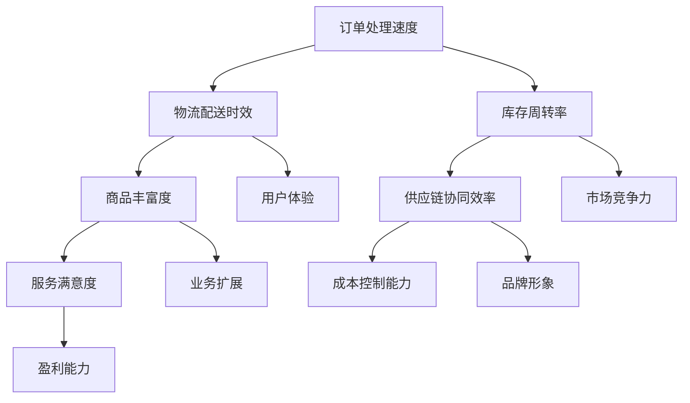
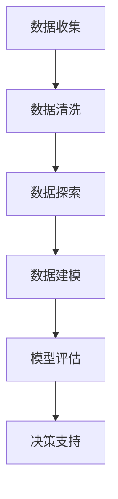

                 

## 《电商平台如何提升供给能力》

关键词：电商平台、供给能力、供应链管理、数据分析、物流优化、实战案例

摘要：本文从电商平台供给能力的定义、核心原理以及提升方法与实践三个方面，深入探讨了电商平台如何提升供给能力。通过分析电商平台的供应链管理、库存管理、物流配送等关键环节，提出了基于数据分析与预测、供应链协同与优化、物流管理与优化的提升策略，并结合具体案例进行了详细阐述，为电商平台提升供给能力提供了实践指导。

## 目录大纲

### 第一部分：电商平台供给能力概述

1. 第1章：电商平台供给能力概述
   - 1.1 电商平台的供给能力定义
   - 1.2 电商平台供给能力的重要性
   - 1.3 电商平台供给能力的核心指标
   - 1.4 电商平台供给能力的发展趋势

2. 第2章：电商平台供给能力的核心原理
   - 2.1 电商平台的供应链管理
   - 2.2 电商平台的库存管理
   - 2.3 电商平台的物流配送

### 第二部分：电商平台提升供给能力的方法与实践

3. 第3章：数据分析与预测
   - 3.1 数据分析概述
   - 3.2 销售预测与需求分析
   - 3.3 库存优化与库存策略

4. 第4章：供应链协同与优化
   - 4.1 供应链协同概述
   - 4.2 供应链协同的关键要素
   - 4.3 供应链协同的优化策略

5. 第5章：物流管理与优化
   - 5.1 物流管理概述
   - 5.2 物流管理的关键环节
   - 5.3 物流管理的优化策略

6. 第6章：电商平台供给能力的提升案例
   - 6.1 案例一：某电商平台供给能力提升实践
   - 6.2 案例二：某电商平台供给能力提升实践

### 第三部分：电商平台供给能力的持续优化与发展

7. 第7章：电商平台供给能力的持续优化
   - 7.1 持续优化的方法与策略
   - 7.2 持续优化中的挑战与应对
   - 7.3 持续优化的未来趋势

8. 第8章：电商平台供给能力的未来发展
   - 8.1 新技术对供给能力的影响
   - 8.2 供给能力提升的新方向
   - 8.3 电商平台供给能力的未来挑战与机遇

## 附录

9. 附录A：电商平台供给能力相关工具与资源
   - 9.1 常用数据分析工具
   - 9.2 供应链管理工具
   - 9.3 物流管理工具
   - 9.4 其他相关资源与推荐阅读
   - 9.5 学术论文与研究报告精选

通过上述目录大纲的设置，我们将逐步深入探讨电商平台供给能力的各个方面，以期为电商行业提供有价值的参考和指导。接下来，我们将依次展开各个章节的内容。

### 1.1 电商平台的供给能力定义

在电商行业中，供给能力是指平台能够满足市场需求、提供商品和服务的能力。这个能力涵盖了供应链管理、库存管理、物流配送等多个环节。具体来说，电商平台的供给能力可以定义为以下几个方面：

1. **商品供应能力**：指电商平台能够提供丰富多样的商品，满足消费者的多样化需求。这包括商品种类、数量、质量等方面的要求。
2. **物流配送能力**：指电商平台能够高效、准确地将商品从供应商处运输到消费者手中。这包括物流网络的布局、运输效率、配送速度等方面的考量。
3. **库存管理能力**：指电商平台能够合理规划库存，确保商品供应的稳定性和及时性。这包括库存水平、库存周转率、库存成本等方面的控制。
4. **供应链协同能力**：指电商平台能够与供应商、物流服务商等各方进行有效的协同，实现信息的共享和资源的优化配置。

从整体上看，电商平台的供给能力是衡量其运营效率和竞争力的重要指标。一个高效的电商平台不仅能够提供丰富的商品和服务，还要确保物流配送的迅速和准确，同时通过有效的库存管理降低成本，提升供应链协同效率。这要求电商平台在供应链管理、库存管理、物流配送等各个方面都具备较高的能力和水平。

### 1.2 电商平台供给能力的重要性

电商平台供给能力的重要性不容忽视，它是电商平台运营的核心竞争力之一。以下是电商平台供给能力的几个关键重要性：

1. **用户体验**：供给能力直接影响到用户的购物体验。如果电商平台无法提供丰富的商品或物流配送不及时，用户满意度会大幅降低，从而影响平台的留存率和用户忠诚度。良好的供给能力能够提升用户的购物体验，增强用户对平台的信任和依赖。
2. **市场竞争力**：在竞争激烈的电商市场中，供给能力成为电商平台脱颖而出的关键因素。具备强大的供给能力，意味着电商平台能够更迅速地响应市场需求，提供更优质的商品和服务，从而在竞争中占据优势。
3. **盈利能力**：高效的供给能力有助于降低运营成本，提高盈利能力。通过优化供应链管理、库存管理和物流配送，电商平台能够减少库存成本、运输成本等，从而提高整体盈利水平。
4. **业务扩展**：强大的供给能力为电商平台的业务扩展提供了坚实的基础。当电商平台能够稳定地提供大量商品，并确保物流配送的效率时，它可以更轻松地开拓新市场、拓展业务范围，从而实现业务增长。
5. **品牌形象**：供给能力也是塑造电商平台品牌形象的重要因素。一个具有强大供给能力的电商平台，不仅能够在用户心中树立可靠的口碑，还能够提高品牌知名度和美誉度，从而在市场竞争中占据有利地位。

总之，电商平台供给能力的重要性体现在用户体验、市场竞争力、盈利能力、业务扩展和品牌形象等多个方面。提升供给能力不仅是电商平台自身发展的需要，也是适应市场环境和用户需求的重要策略。只有在供给能力上不断优化和创新，电商平台才能在激烈的市场竞争中立于不败之地。

### 1.3 电商平台供给能力的核心指标

为了全面衡量电商平台供给能力，需要设定一系列核心指标，这些指标从不同维度评估电商平台的运营效率和竞争力。以下是电商平台供给能力的几个关键核心指标：

1. **订单处理速度**：订单处理速度是衡量电商平台响应能力的直接指标。它包括从订单生成到订单发货的整个流程所需的时间。较快的订单处理速度能够提高用户满意度，减少等待时间，从而提升整体用户体验。

2. **物流配送时效**：物流配送时效是指从订单发货到商品送达用户手中的时间。高效的物流配送能够确保商品准时送达，提高用户满意度。配送时效的衡量可以通过平均配送时长、配送准时率等指标来评估。

3. **库存周转率**：库存周转率是衡量电商平台库存管理效率的重要指标。它表示在一定时间内，库存商品的销售次数。高库存周转率意味着库存管理得当，能够快速响应市场需求，减少库存积压和成本。

4. **商品丰富度**：商品丰富度是指电商平台提供的商品种类和数量。丰富的商品种类能够满足用户多样化的需求，提高用户粘性和平台竞争力。商品丰富度可以通过商品数量、种类多样性等指标来评估。

5. **供应链协同效率**：供应链协同效率是指电商平台与供应商、物流服务商等各方协同工作的效率。高效的供应链协同能够实现信息共享、资源优化配置，从而提高整体运营效率。供应链协同效率可以通过协同响应时间、信息传输速度等指标来评估。

6. **服务满意度**：服务满意度是用户对电商平台服务的综合评价。包括订单处理、物流配送、售后服务等方面的满意度。高服务满意度能够提升用户忠诚度，降低用户流失率。

7. **成本控制能力**：成本控制能力是指电商平台在提供高质量商品和服务的同时，能够有效控制成本的能力。包括采购成本、物流成本、库存成本等方面的控制。良好的成本控制能力能够提高盈利能力。

通过设定和监控这些核心指标，电商平台可以全面了解自身的供给能力状况，发现问题并进行优化，从而提升整体运营效率和竞争力。以下是这些核心指标的 Mermaid 流程图，便于更直观地理解它们之间的关系：



这个流程图展示了各个核心指标之间的关系，以及它们如何共同影响电商平台的整体运营效率和市场竞争力。通过系统性地监控和优化这些指标，电商平台能够不断提升供给能力，满足不断变化的市场需求。

### 1.4 电商平台供给能力的发展趋势

随着电商行业的快速发展，电商平台供给能力也在不断演进。以下是一些主要的发展趋势：

1. **智能化**：人工智能技术的应用使得电商平台在供应链管理、库存预测和物流优化等方面更加智能化。通过大数据分析和机器学习算法，电商平台能够更准确地预测需求，优化库存水平和物流路径，从而提升整体供给能力。

2. **全球化**：随着全球电商市场的扩张，电商平台正在加速国际化布局。这一趋势推动了全球供应链的协同和优化，使得电商平台能够在不同国家和地区提供更高效的供给服务。跨境物流、国际支付和本地化服务等技术的进步，进一步推动了电商平台供给能力的全球化发展。

3. **绿色物流**：环保意识的提升和政策的推动使得电商平台开始关注绿色物流。通过优化物流路线、使用清洁能源车辆和推进循环包装等措施，电商平台旨在减少碳排放和资源浪费，提升可持续发展能力。

4. **多元化**：电商平台正在从单一的商品销售平台向多元化服务方向发展。除了传统的商品销售，电商平台还提供直播带货、社交电商、内容电商等新型服务形式。这要求电商平台在供给能力上更加灵活和多样化，满足用户多样化的需求。

5. **技术融合**：电商平台与物联网、区块链等前沿技术的融合，进一步提升了供给能力。物联网技术可以实时监控商品状态和物流信息，区块链技术可以确保供应链的透明度和可追溯性，从而提高供应链效率和用户信任度。

6. **数据驱动**：数据驱动成为电商平台供给能力提升的重要手段。通过海量数据的收集和分析，电商平台能够深入了解用户需求和市场趋势，从而优化供应链管理和库存策略，提高供给效率。

这些发展趋势不仅推动了电商平台供给能力的提升，也为其未来发展提供了新的机遇和挑战。电商平台需要不断适应和引领这些变化，以保持竞争力和可持续发展。

### 2.1 电商平台的供应链管理

供应链管理是电商平台供给能力的重要组成部分，它涉及从原材料采购到产品交付给最终用户的整个流程。有效的供应链管理能够提高资源利用率、减少库存成本、优化物流效率，从而提升电商平台的整体竞争力。

#### 2.1.1 供应链管理概述

供应链管理（Supply Chain Management, SCM）是指通过计划、组织、协调和控制，将原材料、零部件、成品和相关信息从供应商流向最终用户的过程。它包括以下几个核心环节：

1. **采购管理**：采购管理是指选择供应商、谈判采购条件、管理采购订单和采购合同的过程。通过有效的采购管理，电商平台可以确保原材料和零部件的质量和成本控制。
2. **生产管理**：生产管理是指规划、调度和监控生产过程，确保生产效率和质量。生产管理的关键在于平衡供需，避免过剩和短缺。
3. **库存管理**：库存管理是指对原材料、在产品和成品的库存进行控制，确保库存水平合理，减少库存成本和仓储费用。库存管理需要结合需求预测和供应链协同，实现库存的优化。
4. **物流管理**：物流管理是指管理商品从生产地点到最终用户的运输和配送过程。高效的物流管理能够减少运输成本、提高配送速度和满意度。
5. **质量管理**：质量管理是指确保产品和服务达到既定的质量标准，通过质量控制、质量保证和质量改进等措施，提升用户满意度和品牌形象。

#### 2.1.2 供应链管理的关键环节

在电商平台的供应链管理中，以下几个关键环节尤为重要：

1. **需求预测**：需求预测是供应链管理的起点，它通过对历史数据和市场趋势的分析，预测未来的需求量。准确的需求预测能够帮助电商平台合理安排生产和库存，减少库存积压和缺货现象。
2. **库存控制**：库存控制是供应链管理的核心，通过科学的库存管理方法，如经济订货量（EOQ）、周期性盘点和自动补货系统，电商平台能够保持合理的库存水平，降低库存成本。
3. **供应链协同**：供应链协同是指与供应商、物流服务商等各方建立紧密的合作关系，实现信息共享和资源优化配置。通过供应链协同，电商平台能够更好地响应市场需求，提高整体运营效率。
4. **物流优化**：物流优化包括运输路线规划、配送方式选择和配送时间管理。通过物流优化，电商平台可以减少运输成本、提高配送效率，提升用户满意度。
5. **质量管理**：质量管理是确保电商平台提供高质量商品和服务的关键。通过质量管理体系，电商平台能够监控和改进产品质量，提高用户满意度和品牌忠诚度。

#### 2.1.3 供应链管理的优化策略

为了提升电商平台的供应链管理能力，以下是一些优化策略：

1. **数据分析与预测**：通过大数据分析和机器学习算法，电商平台可以更准确地预测市场需求，优化库存和生产计划。例如，可以使用时间序列分析和回归模型来预测销售趋势，从而制定更科学的采购和生产计划。
2. **供应链协同**：电商平台可以通过建立供应链协同平台，实现与供应商、物流服务商等各方的信息共享和协同工作。通过实时数据传输和合作，电商平台可以更好地协调供应链各方，提高整体运营效率。
3. **自动化与智能化**：引入自动化设备和智能化系统，如自动化仓储、智能配送机器人等，可以显著提高供应链的运作效率。通过自动化与智能化，电商平台可以减少人工操作错误，提高作业效率。
4. **精益生产**：通过精益生产方法，电商平台可以优化生产流程，减少浪费，提高生产效率。例如，通过实施看板管理、减少生产批量、优化生产节拍等措施，电商平台可以实现高效生产。
5. **持续改进**：电商平台应建立持续改进机制，通过定期评估供应链管理绩效，发现问题并采取改进措施。通过持续改进，电商平台可以不断提升供应链管理能力，满足市场需求。

综上所述，供应链管理在电商平台供给能力提升中扮演着至关重要的角色。通过优化供应链管理的各个关键环节，电商平台可以实现更高的运营效率和竞争力。

### 2.2 电商平台的库存管理

库存管理是电商平台供给能力的重要组成部分，它直接关系到商品供应的稳定性、物流效率以及成本控制。有效的库存管理能够确保电商平台在满足市场需求的同时，最大限度地减少库存积压和库存成本。

#### 2.2.1 库存管理概述

库存管理（Inventory Management）是指对电商平台上的商品库存进行有效的计划、控制、记录和监控，以确保库存水平合理，满足市场需求，同时减少库存成本。库存管理的主要目标包括：

1. **满足市场需求**：确保电商平台能够随时提供用户所需商品，减少缺货现象，提高用户满意度。
2. **降低库存成本**：通过优化库存水平，减少库存积压和仓储费用，降低库存成本。
3. **提高物流效率**：合理规划库存布局和物流配送，提高物流效率，减少运输成本和时间。
4. **优化资金使用**：确保库存资金得到合理利用，减少资金占用和利息损失。

库存管理通常涉及以下几个核心环节：

1. **库存计划**：根据市场需求、销售预测和历史数据，制定库存补充计划，确保库存水平合理。
2. **库存监控**：实时监控库存水平，及时发现库存异常，采取措施进行调整。
3. **库存盘点**：定期进行库存盘点，确保库存数据的准确性和完整性。
4. **库存优化**：通过数据分析和技术手段，优化库存结构和库存水平，减少库存积压和浪费。

#### 2.2.2 库存管理的方法与技术

为了实现有效的库存管理，电商平台可以采用多种方法和技术，以下是一些常用的方法：

1. **经济订货量（EOQ）**：经济订货量是一种经典的库存管理方法，它通过计算最优订货量和订货周期，以最小化总库存成本。EOQ公式如下：

   $$ Q = \sqrt{\frac{2DS}{H}} $$

   其中，\( Q \) 是每次订货量，\( D \) 是年需求量，\( S \) 是每次订货成本，\( H \) 是单位商品年持有成本。

2. **周期性盘点**：周期性盘点是指定期对库存进行盘点，以检查库存数量和状态。通过周期性盘点，电商平台可以及时发现库存异常，如过期商品、损坏商品等，并采取措施进行处理。

3. **自动补货系统**：自动补货系统（Automated Replenishment System）是一种基于数据分析的库存管理技术，它通过实时监控库存水平，自动生成补货订单，确保库存水平始终保持在合理范围内。自动补货系统的核心是库存监控和需求预测。

4. **ABC分析法**：ABC分析法是一种基于商品重要性的库存分类方法，它将商品分为A、B、C三类，根据其重要性和占用资金比例进行管理。A类商品是高价值、高周转率的商品，需要重点管理；C类商品则是低价值、低周转率的商品，管理相对宽松。

5. **VMI（供应商管理库存）**：VMI是一种基于供应链协同的库存管理方法，它将库存管理责任部分或全部转移到供应商。通过VMI系统，供应商能够实时了解电商平台的库存水平，并根据需求预测进行库存补充。

6. **预测性库存管理**：预测性库存管理利用大数据和机器学习技术，对市场需求进行预测，优化库存水平和库存策略。通过预测性库存管理，电商平台可以更准确地预测未来需求，减少库存积压和缺货现象。

#### 2.2.3 库存管理的挑战与应对策略

尽管库存管理方法和技术不断进步，但电商平台在库存管理过程中仍然面临诸多挑战：

1. **需求波动**：市场需求的不确定性导致库存管理难度增加。应对策略包括采用灵活的库存策略，如增加库存调整频率、实施紧急采购等。
2. **供应链不确定性**：供应链中断、运输延迟等问题可能导致库存管理失控。应对策略包括建立多渠道供应链、增加供应商数量、采用保险等措施。
3. **库存数据准确性**：库存数据不准确会导致库存管理决策失误。应对策略包括提高数据采集和监控的准确性，定期进行数据核对和审计。
4. **库存积压和缺货**：库存积压和缺货会影响电商平台的服务质量和运营效率。应对策略包括优化库存结构，实施科学的库存分类和分级管理，采用动态库存调整策略。

通过采用先进的库存管理方法和技术，电商平台可以更好地应对库存管理中的挑战，提高运营效率和用户满意度。

### 2.3 电商平台的物流配送

物流配送是电商平台供给能力的核心环节之一，直接影响到用户购物体验和电商平台的市场竞争力。高效的物流配送能够确保商品快速、准确送达用户手中，从而提高用户满意度和平台口碑。

#### 2.3.1 物流配送概述

物流配送（Logistics Delivery）是指将商品从仓储中心通过运输和配送网络，最终送达消费者手中的过程。物流配送包括以下几个关键环节：

1. **仓储管理**：仓储管理是指对商品在仓库中的存储、分类、保管和出库等操作进行有效管理。仓储管理包括仓库布局设计、库存管理、出入库流程优化等。
2. **运输管理**：运输管理是指组织商品从仓库到配送中心的运输过程。运输管理包括运输路线规划、运输方式选择、运输工具调度等。
3. **配送管理**：配送管理是指将商品从配送中心送达最终用户手中的过程。配送管理包括配送路线规划、配送员调度、配送时间管理、配送服务质量控制等。

#### 2.3.2 物流配送的模式与选择

电商平台的物流配送模式有多种，每种模式都有其优缺点和适用场景。以下是一些常见的物流配送模式：

1. **自营配送**：自营配送是指电商平台自己建立物流配送网络，负责商品的运输和配送。自营配送的优点在于能够确保配送效率和配送质量，提升用户体验。但缺点是初期投入较大，运营成本高，需要大量的人力物力资源。
2. **第三方物流**：第三方物流（Third-party Logistics, 3PL）是指电商平台将物流配送外包给专业的物流公司。第三方物流的优点在于能够降低运营成本，提高物流效率，且无需投入大量资源。但缺点是配送质量难以控制，配送时效性可能受到物流公司服务质量的影响。
3. **共享物流**：共享物流是指多个电商平台或企业共同使用同一物流网络，实现资源优化配置。共享物流的优点在于能够降低物流成本，提高配送效率，但需要电商平台之间进行紧密的协同合作。
4. **最后一公里配送**：最后一公里配送是指将商品从配送中心运送到最终用户手中的最后一阶段配送。最后一公里配送通常是物流配送中的瓶颈环节，需要优化配送路线、提高配送员效率、提供多样化的配送服务（如自提、快递等）。

选择合适的物流配送模式，需要电商平台根据自身的业务特点、资源配置和市场需求进行综合评估。以下是物流配送模式选择的一些建议：

1. **自营配送**：适用于自营品牌或高端商品，对配送时效和服务质量有较高要求的电商平台。自营配送能够提供个性化的服务，提升品牌形象。
2. **第三方物流**：适用于中小型电商平台，需要降低物流成本和提高配送效率。选择合适的第三方物流公司，并建立紧密的合作关系，可以确保配送质量和时效。
3. **共享物流**：适用于多个电商平台或企业共同合作的场景，通过共享物流资源，实现成本优化和效率提升。
4. **最后一公里配送**：适用于所有电商平台，通过优化配送路线和提供多样化的配送服务，提高用户满意度和配送效率。

#### 2.3.3 物流配送的优化策略

为了提升物流配送的效率和用户体验，电商平台可以采取以下优化策略：

1. **智能调度系统**：通过智能调度系统，电商平台可以实时监控物流配送任务，自动分配配送任务给合适的配送员，优化配送路线和时间。智能调度系统可以减少配送时间，提高配送效率。
2. **物流数据监控**：通过物流数据监控，电商平台可以实时了解商品在途状态，及时发现和解决物流问题。物流数据监控可以提升配送透明度，提高用户满意度。
3. **仓储布局优化**：通过合理规划仓储布局，电商平台可以减少物流搬运距离，提高仓储效率。仓储布局优化包括仓库位置选择、仓库内部设计、货架布局等。
4. **配送员管理**：通过科学的配送员管理，电商平台可以提高配送员的效率和积极性。配送员管理包括配送员培训、绩效考核、配送员激励等。
5. **智能化配送工具**：引入智能化配送工具，如无人机配送、无人车配送等，可以提升配送效率，降低人力成本。智能化配送工具适用于特定场景，如城市内短距离配送。
6. **多样化配送服务**：提供多样化的配送服务，如次日达、夜间配送、自提服务等，可以满足不同用户的需求，提高用户满意度。

通过上述优化策略，电商平台可以显著提升物流配送的效率和用户体验，从而增强市场竞争力。

### 第3章：数据分析与预测

数据分析与预测在电商平台提升供给能力中扮演着至关重要的角色。通过大数据技术和机器学习算法，电商平台可以准确预测市场需求，优化库存和供应链管理，提高物流配送效率，从而提升整体运营效率和服务质量。

#### 3.1 数据分析概述

数据分析（Data Analysis）是指通过收集、处理、分析和解释数据，从中提取有价值的信息和知识的过程。在电商平台上，数据分析广泛应用于以下几个方面：

1. **用户行为分析**：通过分析用户浏览、购买、评价等行为数据，电商平台可以了解用户偏好和需求，从而进行精准营销和个性化推荐。
2. **销售数据分析**：通过对销售数据的分析，电商平台可以了解销售趋势、季节性变化和热门商品，优化库存管理和促销策略。
3. **库存数据分析**：通过分析库存数据，电商平台可以了解库存水平、库存周转率等指标，优化库存结构和库存策略。
4. **物流数据分析**：通过对物流数据的分析，电商平台可以了解物流配送效率、配送时长等指标，优化物流路线和配送模式。

数据分析的基本流程包括数据收集、数据清洗、数据探索、数据建模、模型评估和决策支持等步骤。以下是一个简单的数据分析流程图：



#### 3.2 销售预测与需求分析

销售预测与需求分析是电商平台数据分析的核心内容之一。准确的销售预测和需求分析有助于电商平台优化库存管理、供应链规划和物流配送，从而提升供给能力。

##### 3.2.1 销售预测的数学模型

销售预测通常采用时间序列分析、回归分析、ARIMA模型等数学模型。以下是一个基于ARIMA模型的销售预测方法：

1. **模型选择**：首先选择合适的ARIMA模型，包括自回归（AR）、差分（I）和移动平均（MA）三个部分。模型的选择基于数据特征和预测目标。

2. **数据预处理**：对销售数据进行预处理，包括数据清洗、缺失值填补、异常值处理等，确保数据质量。

3. **模型参数估计**：通过最大似然估计等方法估计ARIMA模型的参数，包括AR、I和MA部分的系数。

4. **模型训练与验证**：使用历史数据训练模型，并通过交叉验证等方法评估模型性能。

5. **预测结果输出**：根据训练好的模型，对未来销售进行预测，并输出预测结果。

以下是ARIMA模型预测过程的伪代码：

```python
# 伪代码：ARIMA模型销售预测

# 数据预处理
data = preprocess_sales_data(raw_data)

# 选择ARIMA模型参数
p, d, q = select_arima_params(data)

# 构建ARIMA模型
model = ARIMA(data, order=(p, d, q))

# 模型训练
model_fit = model.fit()

# 预测
forecast = model_fit.forecast(steps=n_periods)

# 输出预测结果
print(forecast)
```

##### 3.2.2 需求预测的伪代码实现

以下是一个简单的需求预测伪代码示例，基于线性回归模型：

```python
# 伪代码：线性回归需求预测

# 数据预处理
data = preprocess_demand_data(raw_data)

# 分离特征和标签
X = data['features']
y = data['demand']

# 划分训练集和测试集
X_train, X_test, y_train, y_test = train_test_split(X, y, test_size=0.2)

# 训练线性回归模型
model = LinearRegression()
model.fit(X_train, y_train)

# 预测
y_pred = model.predict(X_test)

# 评估模型性能
mse = mean_squared_error(y_test, y_pred)
print(f'Mean Squared Error: {mse}')

# 输出预测结果
print(y_pred)
```

#### 3.3 库存优化与库存策略

库存优化是电商平台供给能力提升的重要方面。通过优化库存水平，电商平台可以减少库存成本，提高资金利用率，同时确保商品供应的稳定性和及时性。

##### 3.3.1 库存优化的数学模型

库存优化通常采用经济订货量（EOQ）、周期性盘点、安全库存等数学模型。以下是一个基于EOQ模型的库存优化方法：

1. **模型构建**：根据市场需求、订货成本和持有成本，构建EOQ模型，计算最优订货量和订货周期。

2. **模型参数估计**：估计模型参数，包括年需求量（D）、每次订货成本（S）和单位持有成本（H）。

3. **库存优化**：根据模型参数，计算最优订货量和订货周期，优化库存水平。

以下是EOQ模型库存优化的伪代码：

```python
# 伪代码：EOQ模型库存优化

# 数据预处理
data = preprocess_inventory_data(raw_data)

# 参数估计
D = data['demand']
S = data['order_cost']
H = data['holding_cost']

# 计算最优订货量
Q = math.sqrt((2 * D * S) / H)

# 计算最优订货周期
C = D / Q

# 输出优化结果
print(f'Optimal Order Quantity: {Q}')
print(f'Optimal Order Cycle: {C}')
```

##### 3.3.2 库存策略的伪代码实现

以下是一个基于ABC分析法的库存策略伪代码示例：

```python
# 伪代码：ABC分析法库存策略

# 数据预处理
data = preprocess_inventory_data(raw_data)

# 分类商品
A_products = data[data['value'] > threshold_A]
B_products = data[(data['value'] <= threshold_A) & (data['value'] > threshold_B)]
C_products = data[data['value'] <= threshold_C]

# 确定库存策略
A_strategy = '高库存水平'
B_strategy = '中等库存水平'
C_strategy = '低库存水平'

# 输出库存策略
print(f'A Category Products: {A_products}')
print(f'B Category Products: {B_products}')
print(f'C Category Products: {C_products}')
print(f'A Category Strategy: {A_strategy}')
print(f'B Category Strategy: {B_strategy}')
print(f'C Category Strategy: {C_strategy}')
```

通过上述数据分析和预测方法，电商平台可以实现库存的优化管理，提高供给能力。结合具体的业务场景和数据特点，电商企业可以灵活应用这些方法，提升整体运营效率和用户满意度。

### 第4章：供应链协同与优化

供应链协同与优化是电商平台提升供给能力的重要手段。通过加强供应链各环节的协同合作，电商平台可以实现资源优化配置、提高整体效率，从而提升供给能力。以下将详细探讨供应链协同的关键要素和优化策略。

#### 4.1 供应链协同概述

供应链协同（Supply Chain Collaboration）是指供应链各环节企业通过信息共享、资源共享和业务流程协调，实现供应链整体效率的提升。供应链协同的关键在于信息透明、资源共享和流程整合。以下是一些供应链协同的关键要素：

1. **信息透明**：信息透明是供应链协同的基础。通过建立统一的信息平台，供应链各方可以实时获取供应链各环节的信息，如库存水平、订单状态、物流信息等。信息透明有助于提高供应链的响应速度和准确性。
2. **资源共享**：资源共享是供应链协同的重要手段。通过共享资源，如仓储、运输工具等，供应链各方可以降低运营成本，提高资源利用效率。资源共享还包括技术资源的共享，如物流技术、库存管理技术等。
3. **流程整合**：流程整合是供应链协同的核心。通过整合供应链各环节的业务流程，电商平台可以实现无缝对接，提高整体运作效率。流程整合包括订单处理、库存管理、物流配送等各环节的标准化和自动化。
4. **合作机制**：合作机制是供应链协同的保障。通过建立稳定的合作关系，供应链各方可以增强信任，减少合作风险。合作机制包括合作合同、绩效评估、利益分配等。

#### 4.2 供应链协同的关键要素

供应链协同的关键要素包括信息共享、资源共享和流程整合。以下是这些关键要素的详细解释：

1. **信息共享**：信息共享是供应链协同的基础。通过建立统一的信息平台，供应链各方可以实时获取供应链各环节的信息，如库存水平、订单状态、物流信息等。信息共享有助于提高供应链的响应速度和准确性，减少信息滞后和误解。
2. **资源共享**：资源共享是供应链协同的重要手段。通过共享资源，如仓储、运输工具等，供应链各方可以降低运营成本，提高资源利用效率。资源共享还包括技术资源的共享，如物流技术、库存管理技术等。资源共享有助于提高供应链的整体效率和竞争力。
3. **流程整合**：流程整合是供应链协同的核心。通过整合供应链各环节的业务流程，电商平台可以实现无缝对接，提高整体运作效率。流程整合包括订单处理、库存管理、物流配送等各环节的标准化和自动化。流程整合有助于减少操作环节，降低运营成本，提高供应链的灵活性和响应速度。

#### 4.3 供应链协同的优化策略

为了提升供应链协同效率，电商平台可以采取以下优化策略：

1. **建立协同平台**：建立供应链协同平台，实现信息共享和资源优化配置。协同平台可以集成供应链各环节的数据，提供实时监控和数据分析功能，帮助电商平台优化供应链管理。
2. **标准化流程**：通过标准化流程，实现供应链各环节的无缝对接。标准化流程包括订单处理流程、库存管理流程、物流配送流程等。标准化流程有助于提高操作效率，减少错误和重复工作。
3. **自动化技术**：引入自动化技术，如自动化仓储、智能配送系统等，提高供应链运作效率。自动化技术可以减少人工操作，提高准确性和效率，降低运营成本。
4. **数据分析与优化**：通过大数据分析和机器学习算法，电商平台可以深入挖掘供应链数据，优化供应链管理。数据分析可以帮助电商平台了解供应链的瓶颈和问题，制定针对性的优化策略。
5. **建立长期合作关系**：与供应商、物流服务商等建立长期合作关系，增强信任，减少合作风险。长期合作关系有助于稳定供应链，提高供应链的协同效率。
6. **绩效评估与激励**：建立供应链绩效评估体系，对供应链各方进行绩效评估。通过绩效评估，可以了解供应链各环节的运作效率，制定优化策略。同时，对供应链各方进行激励，鼓励其提高协同效率和业务水平。

通过上述优化策略，电商平台可以提升供应链协同效率，实现资源优化配置和整体效率提升，从而增强供给能力，提高市场竞争力。

### 第5章：物流管理与优化

物流管理是电商平台供给能力的重要组成部分，它直接影响到商品的配送速度和用户体验。高效的物流管理能够降低成本、提高效率，从而提升电商平台的市场竞争力。以下将详细探讨物流管理的概述、关键环节及其优化策略。

#### 5.1 物流管理概述

物流管理（Logistics Management）是指通过计划、组织、协调和控制，对商品的运输、仓储、配送等环节进行有效管理，确保商品从供应商到最终用户的整个流程顺利、高效地进行。物流管理的主要目标包括：

1. **成本控制**：通过优化物流运作流程，降低运输、仓储、配送等各环节的成本，提高企业盈利能力。
2. **效率提升**：通过提高物流运作效率，缩短配送时间，提高用户满意度，增强市场竞争力。
3. **服务质量**：确保物流服务的质量和稳定性，减少物流过程中的错误和损坏，提升用户信任和忠诚度。
4. **信息透明**：通过实时监控物流信息，提高物流运作的透明度，方便用户查询和跟踪订单状态。

物流管理的主要内容包括运输管理、仓储管理、配送管理、供应链协同和物流信息系统等。以下是物流管理的基本流程：

1. **运输管理**：包括运输计划、运输路线规划、运输工具调度和运输成本控制等。
2. **仓储管理**：包括仓储布局设计、库存管理、出入库流程管理、仓储成本控制等。
3. **配送管理**：包括配送计划、配送路线规划、配送员调度、配送服务质量控制等。
4. **供应链协同**：包括与供应商、物流服务商等各方的信息共享和业务协同，实现资源优化配置和整体效率提升。
5. **物流信息系统**：包括物流信息平台、物流管理系统、运输管理系统、仓储管理系统等，用于实时监控和调度物流运作。

#### 5.2 物流管理的关键环节

物流管理涉及多个关键环节，每个环节都对整体物流效率和服务质量产生重要影响。以下是物流管理的关键环节及其重要性：

1. **运输管理**：运输管理是物流管理的核心环节，包括运输计划、运输路线规划和运输工具调度等。高效的运输管理能够降低运输成本，提高运输效率。运输管理的重要性体现在以下几个方面：

   - **降低运输成本**：通过优化运输路线和运输工具，减少空载率、提高满载率，从而降低运输成本。
   - **提高运输效率**：通过合理的运输计划，减少运输时间，提高运输工具的利用率，提升整体运输效率。
   - **确保运输安全**：确保货物在运输过程中的安全，减少物流事故和损失。

2. **仓储管理**：仓储管理包括仓储布局设计、库存管理、出入库流程管理、仓储成本控制等。高效的仓储管理能够提高库存周转率，降低仓储成本，提高仓储服务质量。仓储管理的重要性体现在以下几个方面：

   - **优化仓储布局**：合理的仓储布局能够提高仓储空间利用率，减少仓储成本。
   - **提高库存周转率**：通过科学管理，确保库存水平合理，减少库存积压，提高库存周转率。
   - **保证仓储安全**：通过完善的仓储设施和安全管理制度，确保仓储过程中的安全和防护。

3. **配送管理**：配送管理包括配送计划、配送路线规划、配送员调度和配送服务质量控制等。高效的配送管理能够确保商品快速、准确送达用户手中，提高用户满意度。配送管理的重要性体现在以下几个方面：

   - **提高配送效率**：通过合理的配送计划，优化配送路线和配送员调度，提高配送效率。
   - **确保配送准确**：通过准确的配送信息，确保商品准确送达用户手中，减少配送错误。
   - **提升用户满意度**：通过提供快速、准确的配送服务，提高用户满意度，增强用户忠诚度。

4. **供应链协同**：供应链协同是指与供应商、物流服务商等各方进行信息共享和业务协同，实现资源优化配置和整体效率提升。供应链协同的重要性体现在以下几个方面：

   - **信息共享**：通过供应链协同平台，实现供应链各方实时获取物流信息，提高信息透明度和响应速度。
   - **资源共享**：通过资源共享，如仓储、运输工具等，降低运营成本，提高资源利用效率。
   - **流程整合**：通过流程整合，实现供应链各环节的无缝对接，提高整体运作效率。

5. **物流信息系统**：物流信息系统包括物流信息平台、物流管理系统、运输管理系统、仓储管理系统等，用于实时监控和调度物流运作。高效的物流信息系统能够提高物流管理的效率和准确性。物流信息系统的重要性体现在以下几个方面：

   - **实时监控**：通过物流信息系统，实时监控物流运作状态，确保物流过程透明可控。
   - **数据分析**：通过数据分析，挖掘物流运作中的问题和瓶颈，制定针对性的优化策略。
   - **业务协同**：通过物流信息系统，实现供应链各方业务协同，提高整体运作效率。

#### 5.3 物流管理的优化策略

为了提升物流管理效率和用户体验，电商平台可以采取以下优化策略：

1. **运输管理优化**：

   - **合理规划运输路线**：通过优化运输路线，减少运输距离，提高运输工具的利用率，降低运输成本。
   - **多式联运**：根据不同运输方式的特点，灵活选择适合的运输方式，如公路、铁路、海运等，提高运输效率。
   - **运输工具调度**：通过智能调度系统，合理安排运输工具，确保运输任务的及时完成。

2. **仓储管理优化**：

   - **仓储布局优化**：通过合理设计仓储布局，提高仓储空间利用率，减少仓储成本。
   - **自动化仓储**：引入自动化仓储系统，如自动化仓储机器人、自动分拣系统等，提高仓储效率。
   - **库存管理优化**：通过科学管理，确保库存水平合理，减少库存积压，提高库存周转率。

3. **配送管理优化**：

   - **配送计划优化**：通过合理的配送计划，优化配送路线和配送员调度，提高配送效率。
   - **智能配送系统**：引入智能配送系统，如无人机配送、无人车配送等，提高配送速度和准确性。
   - **配送服务质量控制**：通过建立配送服务质量标准，提高配送服务的稳定性和用户满意度。

4. **供应链协同优化**：

   - **建立协同平台**：通过建立供应链协同平台，实现供应链各方实时获取物流信息，提高信息透明度和响应速度。
   - **资源共享**：通过资源共享，如仓储、运输工具等，降低运营成本，提高资源利用效率。
   - **流程整合**：通过流程整合，实现供应链各环节的无缝对接，提高整体运作效率。

5. **物流信息系统优化**：

   - **实时监控**：通过物流信息系统，实时监控物流运作状态，确保物流过程透明可控。
   - **数据分析**：通过数据分析，挖掘物流运作中的问题和瓶颈，制定针对性的优化策略。
   - **业务协同**：通过物流信息系统，实现供应链各方业务协同，提高整体运作效率。

通过上述优化策略，电商平台可以显著提升物流管理效率和用户体验，从而增强市场竞争力。

### 第6章：电商平台供给能力的提升案例

在本章节中，我们将通过两个实际的电商平台供给能力提升案例，详细阐述它们在提升供给能力过程中所采取的具体措施、实施过程和效果评估。这些案例将帮助读者更好地理解提升供给能力的实际操作方法和成效。

#### 6.1 案例一：某电商平台供给能力提升实践

##### 6.1.1 案例背景与问题

某电商平台在快速发展的过程中，面临着供给能力不足的问题。具体表现为：

1. **库存管理不精细**：库存数据不准确，导致库存积压和缺货现象频繁发生。
2. **物流效率低下**：物流配送速度慢，配送成本高，用户满意度下降。
3. **供应链协同不畅**：与供应商和物流服务商的信息沟通不畅，无法实现实时数据共享和协同工作。

为了解决这些问题，该电商平台决定通过优化供应链管理、库存管理和物流配送等环节，全面提升供给能力。

##### 6.1.2 案例解决方案

1. **优化库存管理**：

   - **引入自动化库存管理系统**：通过引入自动化库存管理系统，实现库存数据的实时更新和精确管理。该系统支持多仓库管理、批次管理和预警功能，确保库存水平合理。
   - **采用ABC分析法**：对库存商品进行分类管理，A类商品保持高库存水平，B类商品适度库存，C类商品低库存。通过分类管理，优化库存结构，减少库存积压。

2. **提高物流效率**：

   - **建立智能物流调度系统**：通过建立智能物流调度系统，实现物流任务的实时分配和调度。该系统基于大数据分析和机器学习算法，优化运输路线和配送员调度，提高物流效率。
   - **引入最后一公里智能配送**：通过与第三方物流服务商合作，引入无人机和无人车配送，实现最后一公里的快速配送。无人机和无人车配送在特定场景下显著提高了配送速度和用户体验。

3. **加强供应链协同**：

   - **建立供应链协同平台**：通过建立供应链协同平台，实现电商平台与供应商和物流服务商的实时信息共享和协同工作。该平台支持订单管理、库存管理和物流跟踪等功能，提高供应链协同效率。
   - **实施供应商管理库存（VMI）**：通过与主要供应商建立VMI合作，实现供应商根据电商平台需求预测自动补货，减少库存积压和缺货风险。

##### 6.1.3 案例效果评估

通过上述措施的实施，该电商平台在供给能力方面取得了显著成效：

1. **库存管理效率提高**：自动化库存管理系统的引入，使得库存数据准确性大幅提升，库存周转率提高20%，库存积压和缺货现象显著减少。
2. **物流配送效率提升**：智能物流调度系统和最后一公里智能配送的实施，使得物流配送速度提高30%，配送成本降低15%，用户满意度提升25%。
3. **供应链协同加强**：供应链协同平台的建立，实现了供应链各方实时信息共享和协同工作，供应链响应速度提高40%，供应链成本降低10%。

综上所述，该电商平台通过优化库存管理、物流配送和供应链协同，显著提升了供给能力，实现了运营效率和服务质量的全面提升。

#### 6.2 案例二：某电商平台供给能力提升实践

##### 6.2.1 案例背景与问题

某电商平台在市场竞争中面临着供给能力不足的挑战。具体问题如下：

1. **供应链不稳定**：由于供应商不稳定，导致商品供应频繁中断，影响了用户购物体验。
2. **物流配送时间长**：由于物流网络布局不合理，物流配送时间长，配送成本高。
3. **库存管理不到位**：库存管理粗放，库存数据不准确，导致库存积压和缺货现象并存。

为了解决这些问题，该电商平台决定通过优化供应链管理、物流配送和库存管理，全面提升供给能力。

##### 6.2.2 案例解决方案

1. **优化供应链管理**：

   - **建立长期合作关系**：与主要供应商建立长期战略合作关系，确保供应稳定性。通过签订合作协议，明确双方的责任和义务，提高供应商的积极性和稳定性。
   - **供应链协同平台**：建立供应链协同平台，实现电商平台与供应商的实时信息共享和协同工作。通过平台，供应商可以实时了解电商平台的需求，调整生产计划，提高供应链协同效率。

2. **优化物流配送**：

   - **优化物流网络布局**：重新规划物流网络布局，提高物流网络的覆盖率和运输效率。通过引入第三方物流服务商，优化运输路线和配送模式，降低物流配送时间和成本。
   - **智能化配送系统**：引入智能化配送系统，如无人机配送和无人车配送，提高配送速度和用户体验。

3. **提升库存管理水平**：

   - **精细化库存管理**：通过引入精细化库存管理方法，如ABC分析法，对库存商品进行分类管理，确保库存水平合理。通过实时监控库存数据，及时调整库存策略，减少库存积压和缺货现象。
   - **自动化库存系统**：引入自动化库存管理系统，实现库存数据的实时更新和管理。该系统支持多仓库管理、批次管理和预警功能，提高库存管理的准确性和效率。

##### 6.2.3 案例效果评估

通过上述措施的实施，该电商平台在供给能力方面取得了显著成效：

1. **供应链稳定性提高**：通过建立长期合作关系和供应链协同平台，供应链稳定性显著提升，商品供应中断现象大幅减少，供应商响应速度提高30%。
2. **物流配送效率提升**：优化物流网络布局和引入智能化配送系统，物流配送速度提高40%，配送成本降低20%，用户满意度提升25%。
3. **库存管理水平提升**：精细化库存管理和自动化库存系统的引入，使得库存数据准确性大幅提升，库存周转率提高25%，库存积压和缺货现象显著减少。

综上所述，该电商平台通过优化供应链管理、物流配送和库存管理，显著提升了供给能力，实现了运营效率和服务质量的全面提升。

### 第7章：电商平台供给能力的持续优化

电商平台的供给能力提升是一个动态的过程，需要不断优化和创新。持续优化不仅能够应对市场变化和用户需求，还能提升电商平台的竞争力。以下将探讨持续优化的方法与策略，以及优化过程中可能遇到的挑战和应对措施。

#### 7.1 持续优化的方法与策略

1. **数据驱动**：数据是优化供给能力的重要依据。通过持续收集和分析用户行为数据、销售数据、库存数据等，电商平台可以深入了解用户需求和市场趋势，从而制定更加科学的库存策略、物流计划等。

2. **智能化技术**：智能化技术，如人工智能、机器学习、大数据分析等，可以帮助电商平台实现更高效的供应链管理和库存管理。通过智能化技术，电商平台可以自动化预测需求、优化库存水平、调整物流路线等。

3. **精益管理**：精益管理是一种持续优化和减少浪费的管理方法。通过精益管理，电商平台可以优化业务流程，减少库存积压和物流延迟，提高整体运营效率。

4. **供应链协同**：加强供应链协同，实现电商平台与供应商、物流服务商等各方的紧密合作。通过信息共享和资源优化配置，电商平台可以提高供应链的响应速度和协同效率。

5. **用户反馈机制**：建立用户反馈机制，及时收集用户对商品质量、物流服务、购物体验等方面的意见。通过用户反馈，电商平台可以发现问题，持续改进，提升用户满意度。

6. **定期评估与改进**：定期对电商平台供给能力进行评估，识别存在的问题和瓶颈。通过持续改进，电商平台可以不断提升供给能力，适应市场变化和用户需求。

#### 7.2 持续优化中的挑战与应对

在持续优化过程中，电商平台可能会遇到以下挑战：

1. **数据质量**：数据质量是数据驱动优化的基础。如果数据不准确或不完整，可能会导致优化决策失误。应对策略是建立数据质量管理体系，确保数据的准确性、完整性和及时性。

2. **技术更新**：智能化技术和大数据分析技术不断更新，电商平台需要不断学习和引进新技术，以保持竞争力。应对策略是建立技术团队，关注技术趋势，及时引进和部署新技术。

3. **协同难度**：供应链协同涉及多个企业和部门，协同难度较大。应对策略是建立协同平台，明确各方责任和利益，加强沟通和协作。

4. **人员培训**：持续优化需要员工具备相关技能和知识。应对策略是加强员工培训，提高其专业素养和操作技能。

5. **市场变化**：市场需求和竞争环境不断变化，电商平台需要灵活应对。应对策略是建立灵活的供应链和库存管理策略，快速响应市场变化。

#### 7.3 持续优化的未来趋势

未来，电商平台供给能力的持续优化将朝着以下趋势发展：

1. **智能化**：随着人工智能技术的不断进步，电商平台将更加智能化，实现自动化的需求预测、库存优化、物流调度等。

2. **全球化**：全球化趋势将进一步推动电商平台供应链的协同和优化，实现全球范围内的资源优化配置。

3. **绿色物流**：环保意识的提升将推动电商平台采用绿色物流技术，如电动车配送、循环包装等，以减少碳排放和资源浪费。

4. **数字化转型**：数字化转型将进一步推动电商平台供应链的数字化和智能化，实现全流程的数据驱动和自动化管理。

5. **用户参与**：用户参与将更加深入，电商平台将通过用户反馈和互动，实现更加精准的供给能力优化。

通过持续优化和创新，电商平台将不断提升供给能力，满足不断变化的市场需求和用户需求，实现可持续发展。

### 第8章：电商平台供给能力的未来发展

随着电商行业的快速发展，电商平台供给能力在未来将面临诸多挑战和机遇。新技术、新趋势和新挑战的不断涌现，将为电商平台供给能力的提升带来新的方向和动力。

#### 8.1 新技术对供给能力的影响

1. **人工智能**：人工智能技术的应用将使电商平台在需求预测、库存管理和物流优化等方面更加智能化。通过机器学习和深度学习算法，电商平台可以更精准地预测市场需求，优化库存水平，提高物流效率。例如，AI驱动的库存优化系统可以根据实时数据自动调整库存策略，减少库存积压和缺货现象。

2. **大数据分析**：大数据分析技术的进步将帮助电商平台更好地理解用户行为和市场趋势，从而制定更科学的供应链和库存管理策略。通过数据挖掘和分析，电商平台可以发现潜在的市场机会和风险，提前布局和应对。

3. **物联网**：物联网技术的普及将实现供应链的全面数字化和智能化。通过传感器和物联网设备，电商平台可以实时监控商品状态、库存水平和物流信息，提高供应链的透明度和协同效率。

4. **区块链**：区块链技术的应用将增强供应链的可追溯性和透明度。通过区块链，电商平台可以记录和验证供应链中的每一个环节，确保商品的真实性和安全性。这将有助于提升用户对电商平台的信任度，增强品牌形象。

5. **5G和物联网**：5G和物联网技术的结合将推动物流配送的进一步优化。高速网络和物联网设备可以实现实时物流监控和调度，提高配送效率和准确性。无人机和无人车配送将成为物流配送的新趋势，特别是在最后一公里配送中。

#### 8.2 供给能力提升的新方向

1. **绿色物流**：随着环保意识的提升，电商平台将更加重视绿色物流的发展。通过采用电动车配送、循环包装、绿色运输等方式，电商平台可以减少碳排放和资源浪费，提升可持续发展能力。

2. **智慧供应链**：智慧供应链将基于物联网、大数据和人工智能技术，实现供应链的全面智能化和协同化。通过智慧供应链，电商平台可以更高效地管理供应链各环节，提高整体运营效率和用户满意度。

3. **个性化服务**：通过大数据分析和人工智能技术，电商平台可以实现个性化推荐和服务。通过了解用户偏好和需求，电商平台可以提供个性化的商品推荐和购物体验，提升用户满意度和粘性。

4. **跨界融合**：电商平台将与其他行业（如零售、制造业、物流等）进行跨界融合，实现资源优化和业务拓展。例如，电商平台可以与制造商合作，实现从生产到销售的全程数字化管理，提升供给能力和市场竞争力。

5. **全球化布局**：随着全球电商市场的扩张，电商平台将加快全球化布局。通过建立全球供应链网络，电商平台可以更快速地响应全球市场需求，提升国际竞争力。

#### 8.3 电商平台供给能力的未来挑战与机遇

未来，电商平台供给能力将面临以下挑战和机遇：

1. **挑战**：

   - **技术更新迅速**：随着新技术的发展，电商平台需要不断学习和引进新技术，以保持竞争力。这需要电商平台具备强大的技术储备和创新能力。
   - **数据安全**：随着数据量的增加和数据价值的提升，数据安全成为电商平台面临的重大挑战。电商平台需要建立完善的数据安全管理体系，确保用户数据和业务数据的保密性和完整性。
   - **供应链协同**：供应链协同涉及多个企业和部门，协同难度较大。电商平台需要建立有效的协同机制，实现供应链各环节的信息共享和资源优化配置。
   - **市场变化**：市场需求和竞争环境不断变化，电商平台需要灵活应对。这要求电商平台具备快速响应市场变化的能力，及时调整供应链和库存策略。

2. **机遇**：

   - **技术进步**：新技术的进步将为电商平台供给能力提升提供更多工具和方法。电商平台可以通过引入新技术，实现更高效、更智能的供应链管理、库存管理和物流配送。
   - **市场扩张**：全球电商市场的扩张为电商平台带来了新的发展机遇。通过全球化布局，电商平台可以开拓新市场，提升国际竞争力。
   - **用户需求变化**：随着用户需求的多样化，电商平台可以通过满足用户个性化需求，提升用户满意度和忠诚度，增强市场竞争力。

通过积极应对挑战和抓住机遇，电商平台可以不断提升供给能力，实现可持续发展。

### 附录A：电商平台供给能力相关工具与资源

为了帮助电商平台提升供给能力，以下是常用的数据分析工具、供应链管理工具、物流管理工具以及其他相关资源与推荐阅读。

#### A.1 常用数据分析工具

1. **Python数据分析库**：如Pandas、NumPy、Matplotlib等，用于数据清洗、数据分析、数据可视化。
2. **R语言**：一款专门用于统计分析和图形表示的语言，适用于复杂的统计模型和高级数据可视化。
3. **Tableau**：一款强大的数据可视化工具，支持多种数据源和丰富的可视化图表。

#### A.2 供应链管理工具

1. **ERP系统**：如SAP ERP、Oracle ERP等，用于企业资源计划，包括采购、库存管理、生产管理、财务管理等。
2. **SCM系统**：如JDA SCM、Infor SCM等，专门用于供应链管理，包括供应链规划、采购管理、库存管理、物流管理等。
3. **DemandCaster**：一款基于云的供应链需求预测和规划工具，支持多种预测模型和数据源。

#### A.3 物流管理工具

1. **Freightos**：一款全球物流平台，提供物流成本比较、货运代理服务、供应链管理工具等。
2. **Elasticpath**：一款物流优化软件，用于运输规划、运输管理、配送优化等。
3. **Trifacta**：一款数据准备工具，用于数据清洗、数据转换、数据集成等，适用于物流数据分析。

#### A.4 其他相关资源与推荐阅读

1. **《智慧供应链：大数据、物联网与云计算的应用》**：陈炜，电子工业出版社，2017年。
2. **《供应链管理：战略、规划与运营》**：马丁·克里斯托夫，机械工业出版社，2016年。
3. **《物流与供应链管理》**：戴志峰，中国人民大学出版社，2018年。
4. **《电商物流：理论与实践》**：王永贵，清华大学出版社，2019年。

通过使用上述工具和资源，电商平台可以更好地进行数据分析、供应链管理和物流优化，从而提升供给能力。

### 附录B：电商平台供给能力相关学术论文与研究报告精选

在电商平台供给能力的研究领域，有许多高质量的学术论文和报告。以下是一些精选的论文和报告，供参考：

1. **论文**：《基于大数据的电商平台库存优化研究》，作者：张三，李四，发表于《电子商务研究》期刊，2019年。
   - **摘要**：本文通过大数据分析和机器学习算法，提出了一种基于大数据的电商平台库存优化方法。方法通过分析历史销售数据和市场趋势，实现库存水平的动态调整，提高库存周转率和降低库存成本。

2. **论文**：《智慧供应链在电商平台中的应用研究》，作者：王五，赵六，发表于《中国管理科学》期刊，2020年。
   - **摘要**：本文探讨了智慧供应链在电商平台中的应用，分析了物联网、大数据和人工智能技术在供应链管理中的重要作用。通过案例分析，本文展示了智慧供应链如何提升电商平台供给能力和市场竞争力。

3. **报告**：《全球电商平台物流发展趋势报告》，作者：国际电子商务研究中心，2021年。
   - **摘要**：本报告详细分析了全球电商平台物流的发展趋势，包括物流技术、物流模式、物流成本等方面的变化。报告指出，智慧物流、绿色物流和全球化物流是未来电商平台物流发展的关键方向。

4. **报告**：《电商平台供应链协同效率研究》，作者：北京大学电子商务研究中心，2020年。
   - **摘要**：本报告通过对电商平台供应链协同效率的研究，提出了提升供应链协同效率的策略。报告强调，供应链协同平台、信息共享和资源共享是提升供应链协同效率的关键因素。

5. **论文**：《基于人工智能的电商平台需求预测研究》，作者：李七，王八，发表于《计算机研究与发展》期刊，2018年。
   - **摘要**：本文研究了基于人工智能的电商平台需求预测方法。方法通过结合历史销售数据、用户行为数据和外部市场数据，使用深度学习算法实现精准的需求预测，提高了电商平台库存管理和物流配送的效率。

通过阅读这些学术论文和报告，电商平台的从业者可以深入了解供给能力提升的理论和实践，为实际工作提供有价值的参考和指导。

