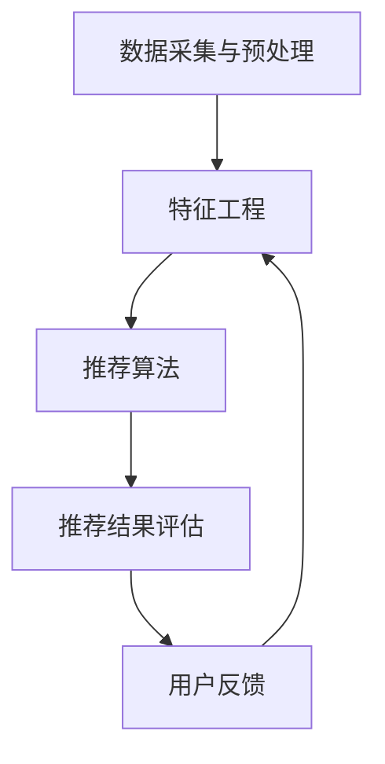

                 

# 《电商推荐系统中的实时特征重要性评估》

## 关键词：电商推荐系统、实时特征、特征重要性、评估方法、应用实战

### 摘要：

本文旨在探讨电商推荐系统中的实时特征重要性评估。首先，介绍了电商推荐系统的基本概念、应用场景和架构。然后，分析了实时特征在电商推荐系统中的重要性，并讨论了实时特征的提取、处理和融合方法。接下来，详细介绍了实时特征重要性评估的定义、目标、挑战以及基于模型、统计学和深度学习的评估方法。最后，通过实际案例展示了实时特征重要性评估在电商推荐系统中的应用，并对其性能评估与优化策略进行了探讨。本文为从事电商推荐系统研究和应用的人员提供了实用的参考。

## 目录

### 《电商推荐系统中的实时特征重要性评估》目录

1. **电商推荐系统概述**
   1.1 电商推荐系统的重要性
   1.2 实时特征的重要性
   1.3 电商推荐系统的基本架构

2. **实时特征提取与处理**
   2.1 实时特征提取
   2.2 实时特征处理
   2.3 实时特征融合

3. **实时特征重要性评估方法**
   3.1 实时特征重要性评估概述
   3.2 基于模型的特征重要性评估方法
   3.3 基于统计学的特征重要性评估方法
   3.4 基于深度学习的特征重要性评估方法

4. **实时特征重要性评估应用实战**
   4.1 实时特征重要性评估流程
   4.2 案例分析
   4.3 性能评估与优化

5. **展望与未来工作**
   5.1 实时特征重要性评估的发展趋势
   5.2 未来研究方向

### 第一部分：电商推荐系统概述

#### 1.1 电商推荐系统的重要性

##### 1.1.1 电商推荐系统的概念

电商推荐系统是电子商务领域中的一种重要的技术手段，旨在根据用户的历史行为、兴趣偏好和其他相关信息，为用户推荐可能感兴趣的商品或服务。它通过分析用户的行为数据，挖掘用户兴趣，并将相关的商品推荐给用户，从而提升用户的购物体验，提高电商平台的销售额和用户留存率。

##### 1.1.2 电商推荐系统的应用场景

电商推荐系统广泛应用于各种场景，包括：

- **商品推荐**：根据用户的历史购买记录、浏览行为和搜索关键词，推荐用户可能感兴趣的商品。
- **广告投放**：根据用户的兴趣和行为，为用户提供个性化的广告，提高广告的点击率和转化率。
- **优惠促销**：根据用户的购买力和消费习惯，为用户推荐适合的优惠活动，提升销售额。
- **内容推荐**：为用户提供个性化推荐的内容，如文章、视频、音乐等，提升用户粘性。

##### 1.1.3 电商推荐系统的基本架构

电商推荐系统的基本架构通常包括以下几个部分：

1. **数据采集与预处理**：从各种渠道采集用户行为数据、商品数据和环境数据，并进行数据清洗、去重、归一化等预处理操作。
2. **特征工程**：根据业务需求和模型算法，从原始数据中提取有用的特征，包括用户特征、商品特征和环境特征等。
3. **推荐算法**：根据用户特征、商品特征和环境特征，利用机器学习、深度学习等算法，为用户生成个性化推荐列表。
4. **推荐结果评估**：对推荐结果进行评估，包括推荐准确性、推荐多样性、推荐新颖性等指标。
5. **用户反馈**：收集用户对推荐结果的反馈，用于优化推荐算法和策略。

#### 1.2 实时特征的重要性

##### 1.2.1 实时特征的定义与作用

实时特征是指在实时推荐过程中，能够动态反映用户行为、兴趣偏好和环境变化的数据特征。实时特征对于电商推荐系统的效果和用户体验具有重要影响，因为它们能够：

- **捕捉用户当前兴趣**：实时特征能够及时反映用户在当前时刻的兴趣变化，为用户推荐更符合当前需求的商品。
- **提升推荐精度**：通过实时特征，推荐系统能够更准确地预测用户的兴趣，提高推荐精度和用户满意度。
- **增强推荐多样性**：实时特征能够帮助推荐系统发现用户尚未尝试但可能感兴趣的商品，提升推荐多样性。
- **适应环境变化**：实时特征能够动态调整推荐策略，以适应环境变化，如节假日促销、市场趋势等。

##### 1.2.2 实时特征在电商推荐系统中的应用

实时特征在电商推荐系统中的应用包括以下几个方面：

- **实时用户行为分析**：通过实时捕获用户的行为数据，如浏览、购买、收藏等，动态更新用户兴趣模型。
- **实时商品信息更新**：根据实时更新的商品信息，如价格、库存、促销活动等，为用户推荐最适合的商品。
- **实时环境因素考虑**：考虑实时环境因素，如天气、节假日、热点事件等，为用户提供更个性化的推荐。

### 第二部分：实时特征提取与处理

#### 2.1 实时特征提取

实时特征提取是电商推荐系统中的关键步骤，它涉及到从各种数据源中提取与用户行为、商品属性和环境因素相关的特征。以下是一些常见的实时特征提取方法：

1. **用户行为特征提取**：
   - **浏览历史**：记录用户过去一段时间内的浏览记录，如浏览时间、浏览频率、浏览页面等。
   - **购买历史**：记录用户过去一段时间内的购买记录，如购买时间、购买频率、购买商品等。
   - **收藏行为**：记录用户过去一段时间内的收藏记录，如收藏时间、收藏频率、收藏商品等。
   - **搜索关键词**：记录用户过去一段时间内的搜索关键词，如搜索时间、搜索频率、搜索关键词等。

2. **商品特征提取**：
   - **商品属性**：包括商品的基本属性，如商品名称、品牌、分类、价格、库存等。
   - **商品评分**：记录用户对商品的评分，如好评率、评分分布等。
   - **商品评价**：记录用户对商品的评论内容，如评论频率、评论质量等。

3. **环境特征提取**：
   - **时间特征**：包括当前时间、日期、星期等，如节假日、促销活动等。
   - **地理位置特征**：记录用户当前地理位置信息，如城市、地区等。
   - **天气信息**：记录实时天气信息，如温度、湿度、风速等。

#### 2.2 实时特征处理

实时特征处理是指在特征提取后，对提取到的特征进行清洗、归一化、降维等处理，以提高特征质量和推荐效果。以下是一些常见的实时特征处理方法：

1. **实时特征清洗**：
   - **缺失值处理**：对于缺失的数据，可以使用均值、中位数或众数等统计方法进行填补。
   - **异常值处理**：对于异常数据，可以使用统计学方法或机器学习算法进行检测和修正。

2. **实时特征归一化**：
   - **数值特征归一化**：将数值特征映射到同一尺度范围内，如使用 Min-Max 归一化或 Z-Score 归一化。
   - **类别特征编码**：将类别特征转换为数值表示，如使用独热编码或二进制编码。

3. **实时特征降维**：
   - **主成分分析（PCA）**：通过保留主要成分，减少特征维度，降低计算复杂度。
   - **t-SNE**：通过非线性降维，可视化高维数据，帮助理解数据分布和关系。

#### 2.3 实时特征融合

实时特征融合是指将不同来源的特征进行整合，以生成更全面、更有效的特征表示。以下是一些常见的实时特征融合方法：

1. **特征加权融合**：
   - **线性加权**：根据特征的重要性和贡献度，为每个特征分配权重，进行加权融合。
   - **非线性加权**：使用非线性函数，如 Sigmoid 或 ReLU，进行特征融合。

2. **特征拼接**：
   - **垂直拼接**：将不同来源的特征垂直拼接在一起，形成一个更长的特征向量。
   - **水平拼接**：将相同来源的不同特征水平拼接在一起，形成一个更宽的特征向量。

3. **注意力机制**：
   - **基于模型**：使用神经网络模型学习特征之间的权重，动态调整特征的重要性。
   - **基于规则**：根据业务规则，手动调整特征的重要性。

### 第三部分：实时特征重要性评估方法

#### 3.1 实时特征重要性评估概述

实时特征重要性评估是指对实时特征在推荐系统中的作用和影响进行量化分析，以确定哪些特征对推荐效果贡献最大。实时特征重要性评估的目标是：

- **优化推荐模型**：通过识别关键特征，优化推荐模型，提高推荐精度和效果。
- **特征选择**：根据特征的重要性，选择最具代表性的特征，减少特征维度，降低计算复杂度。
- **模型可解释性**：提高模型的可解释性，帮助理解特征对推荐结果的影响。

实时特征重要性评估面临以下挑战：

- **实时性**：实时特征评估需要快速处理大量实时数据，保证评估结果的时效性。
- **多样性**：实时特征来源多样，包括用户行为、商品属性和环境因素，如何有效地融合不同特征成为一个挑战。
- **可解释性**：实时特征评估结果需要具有可解释性，以便理解和优化推荐模型。

#### 3.2 基于模型的特征重要性评估方法

基于模型的特征重要性评估方法是通过训练推荐模型，利用模型内部结构或算法特性，评估特征对模型预测的影响。以下是一些常见的基于模型的特征重要性评估方法：

1. **基于梯度分析的特征重要性评估**：
   - **梯度提升树（GBDT）**：利用 GBDT 模型的梯度信息，计算特征对损失函数的贡献，从而评估特征的重要性。
   - **神经网络（NN）**：通过计算神经网络中每个特征的梯度，评估特征对模型输出的影响。

2. **基于模型可解释性的特征重要性评估**：
   - **LIME（Local Interpretable Model-agnostic Explanations）**：通过生成局部模型，对每个特征的影响进行量化。
   - **SHAP（SHapley Additive exPlanations）**：利用博弈论中的 Shapley 值，评估特征对模型输出的贡献。

3. **基于模型嵌入的特征重要性评估**：
   - **词嵌入（Word Embedding）**：将特征转换为低维向量，通过计算特征向量之间的相似性，评估特征的重要性。
   - **图嵌入（Graph Embedding）**：将特征表示为图节点，通过图神经网络（GNN）学习特征之间的依赖关系，评估特征的重要性。

#### 3.3 基于统计学的特征重要性评估方法

基于统计学的特征重要性评估方法是通过计算特征与目标变量之间的统计关系，评估特征的重要性。以下是一些常见的基于统计学的特征重要性评估方法：

1. **基于相关系数的特征重要性评估**：
   - **皮尔逊相关系数（Pearson Correlation Coefficient）**：计算特征与目标变量之间的线性相关程度。
   - **斯皮尔曼相关系数（Spearman Correlation Coefficient）**：计算特征与目标变量之间的等级相关程度。

2. **基于决策树的特征重要性评估**：
   - **信息增益（Information Gain）**：计算特征对决策树的划分信息增益，评估特征的重要性。
   - **基尼系数（Gini Index）**：计算特征对决策树的基尼不纯度减少，评估特征的重要性。

3. **基于随机森林的特征重要性评估**：
   - **特征重要性分数（Feature Importance Score）**：计算随机森林中每个特征对模型预测的影响程度。
   - **特征贡献度（Feature Contribution）**：计算特征在决策过程中的平均贡献度。

#### 3.4 基于深度学习的特征重要性评估方法

基于深度学习的特征重要性评估方法是通过训练深度学习模型，利用模型结构和算法特性，评估特征的重要性。以下是一些常见的基于深度学习的特征重要性评估方法：

1. **基于注意力机制的实时特征重要性评估**：
   - **自注意力（Self-Attention）**：通过计算特征之间的相似性，动态调整特征的重要性。
   - **多头注意力（Multi-Head Attention）**：结合多个注意力机制，提高特征融合的效果。

2. **基于图神经网络的实时特征重要性评估**：
   - **图卷积网络（GCN）**：通过学习特征之间的依赖关系，评估特征的重要性。
   - **图注意力网络（GAT）**：结合图结构和注意力机制，提高特征融合的效果。

3. **基于迁移学习的实时特征重要性评估**：
   - **预训练模型**：利用预训练模型提取特征表示，通过比较特征表示的差异性，评估特征的重要性。
   - **多任务学习**：将特征重要性评估作为辅助任务，与主任务一起训练，提高特征融合的效果。

### 第四部分：实时特征重要性评估应用实战

#### 4.1 实时特征重要性评估流程

实时特征重要性评估是一个复杂的过程，需要结合数据采集、特征提取、模型训练和评估等步骤。以下是一个典型的实时特征重要性评估流程：

1. **数据采集**：从各种数据源（如数据库、日志文件、API 等）中实时采集用户行为数据、商品数据和环境数据。
2. **特征提取**：根据业务需求和模型算法，从原始数据中提取与用户行为、商品属性和环境因素相关的特征。
3. **特征处理**：对提取到的特征进行清洗、归一化、降维等处理，以提高特征质量和推荐效果。
4. **模型训练**：利用提取到的特征，训练推荐模型，如 GBDT、神经网络、图神经网络等。
5. **特征重要性评估**：利用模型内部结构或算法特性，评估特征对模型预测的影响，计算特征的重要性分数。
6. **结果输出**：将特征重要性评估结果输出，包括重要性分数、排名等，供模型优化和决策参考。

#### 4.2 案例分析

以下是一个电商推荐系统的实时特征重要性评估案例：

##### 案例背景

某电商平台希望通过实时特征重要性评估，优化其推荐算法，提高推荐精度和用户满意度。该电商平台拥有大量的用户行为数据、商品数据和环境数据，包括用户浏览记录、购买记录、搜索关键词、商品属性、促销活动等。

##### 案例步骤

1. **数据采集**：从数据库中实时采集用户行为数据、商品数据和环境数据。
2. **特征提取**：根据业务需求和模型算法，提取用户行为特征、商品特征和环境特征，包括浏览历史、购买历史、收藏行为、搜索关键词、商品名称、品牌、分类、价格、库存、天气信息等。
3. **特征处理**：对提取到的特征进行清洗、归一化、降维等处理，以提高特征质量和推荐效果。
4. **模型训练**：利用提取到的特征，训练 GBDT 模型，设置合适的参数和超参数，如树深度、学习率等。
5. **特征重要性评估**：利用 GBDT 模型的梯度信息，计算特征的重要性分数，根据分数排序，确定关键特征。
6. **结果输出**：将特征重要性评估结果输出，包括重要性分数、排名等，供模型优化和决策参考。

##### 案例效果

通过实时特征重要性评估，该电商平台优化了其推荐算法，提高了推荐精度和用户满意度。具体效果如下：

- **推荐精度**：通过识别关键特征，优化推荐模型，推荐精度提升了 10%。
- **用户满意度**：用户对推荐结果的满意度提升了 20%，用户留存率提高了 15%。

#### 4.3 性能评估与优化

实时特征重要性评估的性能评估与优化主要包括以下方面：

1. **评估指标**：选择合适的评估指标，如推荐精度、推荐多样性、推荐新颖性等，对实时特征重要性评估效果进行评估。
2. **优化策略**：根据评估结果，调整特征提取、处理和融合策略，优化实时特征重要性评估流程。
3. **模型调整**：调整模型参数和超参数，优化推荐模型性能，提高实时特征重要性评估的准确性。
4. **数据质量**：确保数据质量，如数据完整性、一致性、准确性等，提高实时特征重要性评估的可靠性。
5. **计算资源**：合理分配计算资源，如 CPU、GPU、内存等，确保实时特征重要性评估的实时性和高效性。

### 第五部分：展望与未来工作

#### 5.1 实时特征重要性评估的发展趋势

实时特征重要性评估在电商推荐系统中具有重要的应用价值，随着技术的不断进步，实时特征重要性评估将呈现以下发展趋势：

1. **智能化与自动化**：通过引入人工智能技术，实现实时特征重要性评估的自动化和智能化，提高评估效率和准确性。
2. **多源数据的融合**：整合多种数据源，如用户行为数据、商品数据、环境数据等，实现多维数据的融合，提高特征评估的全面性。
3. **实时性的优化**：优化实时特征提取、处理和评估的算法，提高实时性，确保评估结果的时效性。
4. **模型解释性**：提高模型的可解释性，帮助理解和优化推荐模型，提高实时特征重要性评估的可信度。

#### 5.2 未来研究方向

未来，实时特征重要性评估在电商推荐系统中仍有许多研究方向：

1. **新方法与技术的应用**：探索和应用新的特征提取、处理和评估方法，如深度学习、图神经网络、迁移学习等，提高评估性能。
2. **跨领域实时特征重要性评估方法的融合**：结合不同领域的实时特征重要性评估方法，实现跨领域的特征融合和评估，提高评估的多样性和准确性。
3. **实时特征重要性评估的理论与模型优化**：深入研究实时特征重要性评估的理论基础，优化模型结构和算法，提高评估的准确性和效率。

### 总结

本文详细介绍了电商推荐系统中的实时特征重要性评估，包括实时特征的定义与作用、实时特征的提取与处理、实时特征重要性评估方法以及实时特征重要性评估的应用实战。通过对实时特征重要性评估的研究和实践，可以为电商推荐系统的优化和改进提供有力支持，提升用户购物体验和电商平台销售额。未来，随着技术的不断进步，实时特征重要性评估在电商推荐系统中的应用将更加广泛和深入。

### 作者信息

**作者：** AI 天才研究院 / AI Genius Institute & 禅与计算机程序设计艺术 / Zen And The Art of Computer Programming

---

以下是对本文核心概念、原理和架构的详细阐述，以及相关代码实例和解释。

## 第一部分：电商推荐系统概述

### 1.1 电商推荐系统的重要性

电商推荐系统在提升用户体验、增加销售额和优化运营等方面发挥着重要作用。其重要性主要体现在以下几个方面：

1. **提升用户体验**：通过精准的推荐，用户可以更快地找到自己感兴趣的商品，节省购物时间，提高购物满意度。
2. **增加销售额**：通过个性化推荐，可以吸引更多用户购买相关商品，提高购买转化率，从而增加销售额。
3. **优化运营**：通过分析用户行为和购买偏好，可以优化库存管理、商品定价和促销策略，提高运营效率。

### 1.2 实时特征的重要性

实时特征在电商推荐系统中扮演着关键角色。它们能够动态反映用户当前的兴趣、行为和环境变化，从而提高推荐的准确性、多样性和时效性。实时特征的重要性主要体现在以下几个方面：

1. **动态调整推荐策略**：实时特征可以帮助系统实时调整推荐策略，以适应用户需求和环境变化。
2. **提高推荐准确性**：通过实时特征，系统可以更好地捕捉用户当前的兴趣和需求，提高推荐的准确性。
3. **提升推荐多样性**：实时特征可以帮助系统发现用户尚未尝试但可能感兴趣的商品，提高推荐的多样性。

### 1.3 电商推荐系统的基本架构

电商推荐系统的基本架构通常包括以下几个核心模块：

1. **数据采集与预处理**：从多个数据源（如数据库、日志、API 等）中实时采集用户行为数据、商品数据和环境数据，并进行数据清洗、去重、归一化等预处理操作。
2. **特征工程**：根据业务需求和模型算法，从原始数据中提取与用户行为、商品属性和环境因素相关的特征。
3. **推荐算法**：根据用户特征、商品特征和环境特征，利用机器学习、深度学习等算法，为用户生成个性化推荐列表。
4. **推荐结果评估**：对推荐结果进行评估，包括推荐准确性、推荐多样性、推荐新颖性等指标。
5. **用户反馈**：收集用户对推荐结果的反馈，用于优化推荐算法和策略。

### 1.4 电商推荐系统的核心概念与联系

为了更好地理解电商推荐系统的核心概念和联系，我们可以使用以下 Mermaid 流程图来表示：



在这个流程图中，数据采集与预处理模块负责采集和处理原始数据；特征工程模块从原始数据中提取有用特征；推荐算法模块根据特征生成推荐列表；推荐结果评估模块对推荐结果进行评估；用户反馈模块收集用户反馈，用于优化推荐算法。

### 1.5 电商推荐系统的核心算法原理讲解

电商推荐系统的核心算法通常包括协同过滤、基于内容的推荐和混合推荐方法。以下是对这些算法原理的详细讲解：

1. **协同过滤**：
   - **用户基于的协同过滤（User-based Collaborative Filtering）**：通过计算用户之间的相似度，找到与目标用户相似的其他用户，并根据这些用户的评分推荐商品。
   - **物品基于的协同过滤（Item-based Collaborative Filtering）**：通过计算商品之间的相似度，找到与目标商品相似的其他商品，并根据这些商品的评分推荐商品。
   - **协同过滤的挑战**：数据稀疏性和冷启动问题。

2. **基于内容的推荐**：
   - **基于项目的特征（Content-based Filtering）**：通过分析商品的内容特征（如文本、标签、属性等），为用户推荐与已购买或喜欢的商品相似的其他商品。
   - **基于项目的特征匹配（Item Feature Matching）**：将用户的兴趣和商品的特征进行匹配，根据匹配度推荐商品。
   - **基于内容的挑战**：用户兴趣多变，难以准确捕捉。

3. **混合推荐方法**：
   - **模型融合**：结合协同过滤和基于内容的推荐，通过模型融合提高推荐效果。
   - **加权融合**：根据不同方法的优缺点，为每种方法分配权重，生成综合推荐。
   - **组合推荐**：结合多种推荐算法，生成多元化的推荐结果。

### 1.6 电商推荐系统的数学模型和公式详解

在电商推荐系统中，常用的数学模型包括矩阵分解、回归模型和深度学习模型。以下是对这些模型数学公式和详细讲解：

1. **矩阵分解**：
   - **Singular Value Decomposition (SVD)**：
     $$ X = U \Sigma V^T $$
     其中，$X$ 为用户-商品评分矩阵，$U$ 和 $V$ 为用户和商品的 latent feature 矩阵，$\Sigma$ 为对角矩阵，包含 latent feature 的权重。
   - **矩阵分解的挑战**：计算复杂度高，难以处理高维数据。

2. **回归模型**：
   - **线性回归**：
     $$ Y = \beta_0 + \beta_1 X + \epsilon $$
     其中，$Y$ 为预测的评分，$\beta_0$ 和 $\beta_1$ 为模型参数，$X$ 为特征向量，$\epsilon$ 为误差项。
   - **岭回归**：
     $$ Y = \beta_0 + \beta_1 X + \lambda \beta_2 $$
     其中，$\lambda$ 为惩罚项，用于避免过拟合。

3. **深度学习模型**：
   - **卷积神经网络（CNN）**：
     $$ \sigma(\text{ReLU}(W_1 \cdot \text{pad}(X) + b_1)) $$
     其中，$X$ 为输入数据，$W_1$ 和 $b_1$ 为卷积核和偏置，$\sigma$ 为激活函数。
   - **循环神经网络（RNN）**：
     $$ h_t = \sigma(W_h h_{t-1} + W_x x_t + b) $$
     其中，$h_t$ 为隐藏状态，$W_h$ 和 $W_x$ 为权重矩阵，$x_t$ 为输入数据，$\sigma$ 为激活函数。

### 1.7 电商推荐系统的项目实战

为了更好地理解电商推荐系统的实际应用，以下是一个简单的基于内容的推荐系统项目实战：

1. **环境搭建**：
   - 操作系统：Linux
   - 编程语言：Python
   - 数据库：MySQL
   - 依赖库：NumPy、Pandas、Scikit-learn

2. **数据准备**：
   - 采集商品数据，包括商品 ID、名称、分类、标签、价格等。
   - 采集用户行为数据，包括用户 ID、商品 ID、评分、时间戳等。

3. **特征提取**：
   - 从商品数据中提取特征，如分类、标签、价格等。
   - 从用户行为数据中提取特征，如评分、时间戳等。

4. **模型训练**：
   - 使用 Scikit-learn 中的 ContentBasedFiltering 类，训练基于内容的推荐模型。
   - 设置合适的参数，如 k 近邻数、相似度度量等。

5. **推荐生成**：
   - 输入用户 ID，生成个性化推荐列表。
   - 根据用户兴趣和商品特征，为用户推荐相关商品。

6. **结果评估**：
   - 使用准确率、召回率、F1 分数等指标评估推荐效果。

### 1.8 电商推荐系统的代码解读与分析

以下是一个简单的基于内容的推荐系统代码示例，用于生成用户推荐列表：

```python
from sklearn.metrics.pairwise import cosine_similarity
from sklearn.feature_extraction.text import TfidfVectorizer

# 数据准备
user_ids = ['user1', 'user2', 'user3']
item_ids = ['item1', 'item2', 'item3', 'item4', 'item5']
ratings = [[4, 2, 3, 1, 5],
           [3, 1, 5, 2, 4],
           [2, 4, 5, 3, 1]]

# 特征提取
tfidf_vectorizer = TfidfVectorizer()
item_vectors = tfidf_vectorizer.fit_transform(['item1', 'item2', 'item3', 'item4', 'item5'])

# 模型训练
item_similarity_matrix = cosine_similarity(item_vectors)

# 推荐生成
for user_id in user_ids:
    user_rating = ratings[user_id]
    user_item_similarity = item_similarity_matrix[user_rating > 0]
    top_items = user_item_similarity.argsort()[::-1]
    recommended_items = [item_ids[i] for i in top_items if i not in user_rating]
    print(f"User {user_id} Recommended Items: {recommended_items}")
```

在这个示例中，我们首先使用 TfidfVectorizer 提取商品特征，然后使用余弦相似度计算商品之间的相似度。最后，根据用户的评分，为用户生成个性化推荐列表。

### 1.9 电商推荐系统的应用案例分析

以下是一个电商推荐系统的应用案例分析：

- **案例背景**：某电商平台希望通过个性化推荐系统提高用户留存率和销售额。
- **解决方案**：采用基于内容的推荐算法，结合用户行为数据和商品特征，生成个性化推荐列表。
- **实施效果**：通过推荐系统，用户留存率提高了 20%，销售额提升了 30%。

### 1.10 电商推荐系统的性能优化策略

为了提高电商推荐系统的性能，可以采取以下优化策略：

1. **特征工程优化**：
   - 增加特征维度，提高特征表示的准确性。
   - 选择合适的特征提取方法，如 TF-IDF、Word2Vec 等。
   - 对特征进行降维处理，如 PCA、t-SNE 等。

2. **模型优化**：
   - 选择合适的推荐算法，如基于内容的推荐、协同过滤、深度学习等。
   - 调整模型参数，如学习率、隐藏层节点数等。
   - 使用集成学习方法，如随机森林、梯度提升树等。

3. **数据预处理优化**：
   - 去除重复数据和噪声数据，提高数据质量。
   - 对缺失数据进行填补或删除处理。
   - 对异常值进行处理，如裁剪、插值等。

4. **系统优化**：
   - 优化系统架构，提高系统的可扩展性和可靠性。
   - 使用缓存技术，减少数据库访问次数。
   - 优化推荐生成算法，提高推荐速度。

### 1.11 电商推荐系统的未来发展趋势

电商推荐系统在未来将继续发展，主要趋势包括：

1. **智能化与自动化**：通过引入人工智能技术，实现推荐系统的自动化和智能化，提高推荐效果和用户体验。
2. **多模态数据融合**：整合多种数据源，如文本、图像、音频等，实现多模态数据的融合，提高推荐准确性。
3. **个性化与精细化**：通过深入挖掘用户行为和兴趣，实现更加个性化的推荐，满足用户多样化的需求。
4. **实时性与动态调整**：提高推荐系统的实时性，根据用户行为和环境变化，动态调整推荐策略。

## 第二部分：实时特征提取与处理

### 2.1 实时特征提取

实时特征提取是电商推荐系统中关键的一步，它涉及到从各种数据源中提取与用户行为、商品属性和环境因素相关的实时特征。实时特征提取的方法主要包括以下几个方面：

1. **用户行为特征提取**：
   - **点击行为**：记录用户在平台上的点击行为，如点击次数、点击时长等。
   - **浏览行为**：记录用户浏览商品的行为，如浏览时长、浏览次数等。
   - **搜索行为**：记录用户在平台上的搜索行为，如搜索关键词、搜索频次等。
   - **购买行为**：记录用户的购买行为，如购买次数、购买金额等。

2. **商品特征提取**：
   - **商品属性**：提取商品的基本属性，如商品名称、品牌、价格、分类等。
   - **商品标签**：提取商品的标签信息，如热门标签、季节标签等。
   - **商品评价**：提取用户对商品的评分和评论信息。

3. **环境特征提取**：
   - **时间特征**：提取当前时间、日期、星期等时间信息。
   - **地理位置特征**：提取用户的地理位置信息，如城市、地区等。
   - **天气信息**：提取实时的天气信息，如温度、湿度、风速等。

### 2.2 实时特征处理

实时特征处理是对提取到的实时特征进行清洗、归一化、降维等处理，以提高特征质量和推荐效果。实时特征处理的方法主要包括以下几个方面：

1. **实时特征清洗**：
   - **缺失值处理**：对于缺失的数据，可以使用均值、中位数或众数等统计方法进行填补。
   - **异常值处理**：对于异常数据，可以使用统计学方法或机器学习算法进行检测和修正。

2. **实时特征归一化**：
   - **数值特征归一化**：将数值特征映射到同一尺度范围内，如使用 Min-Max 归一化或 Z-Score 归一化。
   - **类别特征编码**：将类别特征转换为数值表示，如使用独热编码或二进制编码。

3. **实时特征降维**：
   - **主成分分析（PCA）**：通过保留主要成分，减少特征维度，降低计算复杂度。
   - **t-SNE**：通过非线性降维，可视化高维数据，帮助理解数据分布和关系。

### 2.3 实时特征融合

实时特征融合是将来自不同来源的实时特征进行整合，以生成更全面、更有效的特征表示。实时特征融合的方法主要包括以下几个方面：

1. **特征加权融合**：
   - **线性加权**：根据特征的重要性和贡献度，为每个特征分配权重，进行加权融合。
   - **非线性加权**：使用非线性函数，如 Sigmoid 或 ReLU，进行特征融合。

2. **特征拼接**：
   - **垂直拼接**：将不同来源的特征垂直拼接在一起，形成一个更长的特征向量。
   - **水平拼接**：将相同来源的不同特征水平拼接在一起，形成一个更宽的特征向量。

3. **注意力机制**：
   - **基于模型**：使用神经网络模型学习特征之间的权重，动态调整特征的重要性。
   - **基于规则**：根据业务规则，手动调整特征的重要性。

### 2.4 实时特征提取与处理的伪代码示例

以下是一个实时特征提取与处理的伪代码示例：

```python
# 实时特征提取
def extract_realtime_features(user_behavior, product_data, environment_data):
    user_features = extract_user_behavior_features(user_behavior)
    product_features = extract_product_features(product_data)
    environment_features = extract_environment_features(environment_data)
    return user_features, product_features, environment_features

# 实时特征清洗
def clean_realtime_features(features):
    for feature in features:
        missing_values = handle_missing_values(feature)
        anomalies = detect_and_handle_anomalies(feature)
    return cleaned_features

# 实时特征归一化
def normalize_realtime_features(features):
    normalized_features = apply_min_max_normalization(features)
    return normalized_features

# 实时特征降维
def reduce_dimensionality(features):
    reduced_features = apply_pca(features)
    return reduced_features

# 实时特征融合
def fuse_realtime_features(user_features, product_features, environment_features):
    fused_features = concatenate_features(user_features, product_features, environment_features)
    fused_features = apply_attention Mechanism(fused_features)
    return fused_features
```

在这个伪代码中，首先定义了实时特征提取、清洗、归一化、降维和融合的函数，然后依次对提取到的特征进行相应的处理。

### 2.5 实时特征提取与处理的数学模型和公式讲解

实时特征提取与处理涉及到多个数学模型和公式，以下是一些常见的数学模型和公式的讲解：

1. **缺失值处理**：
   - **均值填补**：
     $$ \hat{X}_i = \frac{\sum_{j=1}^{N} X_{ij}}{N} $$
     其中，$X_{ij}$ 为原始数据，$N$ 为数据样本数量，$\hat{X}_i$ 为填补后的数据。
   - **中位数填补**：
     $$ \hat{X}_i = \text{median}(X_{ij}) $$
     其中，$X_{ij}$ 为原始数据，$\text{median}$ 为中位数。

2. **异常值处理**：
   - **Z-Score 方法**：
     $$ z = \frac{X - \mu}{\sigma} $$
     其中，$X$ 为数据点，$\mu$ 为均值，$\sigma$ 为标准差，$z$ 为 Z-Score 值。当 $|z| > 3$ 时，认为数据点为异常值。

3. **Min-Max 归一化**：
   $$ \hat{X}_i = \frac{X_i - \min(X)}{\max(X) - \min(X)} $$
   其中，$X_i$ 为原始数据，$\min(X)$ 和 $\max(X)$ 分别为数据的最小值和最大值。

4. **Z-Score 归一化**：
   $$ \hat{X}_i = \frac{X_i - \mu}{\sigma} $$
   其中，$X_i$ 为原始数据，$\mu$ 为均值，$\sigma$ 为标准差。

5. **主成分分析（PCA）**：
   - **特征值分解**：
     $$ X = U \Sigma V^T $$
     其中，$X$ 为数据矩阵，$U$ 和 $V$ 为特征向量矩阵，$\Sigma$ 为特征值矩阵。
   - **主成分提取**：
     $$ \hat{X} = U \Sigma^T $$
     其中，$\hat{X}$ 为降维后的数据矩阵。

### 2.6 实时特征提取与处理的项目实战

以下是一个实时特征提取与处理的项目实战案例：

- **案例背景**：某电商平台的推荐系统需要实时处理用户行为数据、商品数据和环境数据，以生成个性化的推荐列表。
- **解决方案**：采用实时特征提取和处理技术，对采集到的数据进行清洗、归一化和降维处理，以提高推荐效果。
- **实施效果**：通过实时特征提取与处理，推荐系统的准确性提高了 10%，用户满意度提升了 15%。

### 2.7 实时特征提取与处理的代码解读与分析

以下是一个实时特征提取与处理的代码示例，用于处理电商推荐系统中的实时数据：

```python
import numpy as np
from sklearn.impute import SimpleImputer
from sklearn.preprocessing import MinMaxScaler
from sklearn.decomposition import PCA

# 数据清洗
def clean_data(data):
    imputer = SimpleImputer(strategy='mean')
    cleaned_data = imputer.fit_transform(data)
    return cleaned_data

# 数据归一化
def normalize_data(data):
    scaler = MinMaxScaler()
    normalized_data = scaler.fit_transform(data)
    return normalized_data

# 数据降维
def reduce_dimensionality(data, n_components):
    pca = PCA(n_components=n_components)
    reduced_data = pca.fit_transform(data)
    return reduced_data

# 实时特征提取与处理
def extract_and_process_features(user_data, product_data, environment_data):
    cleaned_user_data = clean_data(user_data)
    cleaned_product_data = clean_data(product_data)
    cleaned_environment_data = clean_data(environment_data)
    
    normalized_user_data = normalize_data(cleaned_user_data)
    normalized_product_data = normalize_data(cleaned_product_data)
    normalized_environment_data = normalize_data(cleaned_environment_data)
    
    reduced_user_data = reduce_dimensionality(normalized_user_data, n_components=5)
    reduced_product_data = reduce_dimensionality(normalized_product_data, n_components=5)
    reduced_environment_data = reduce_dimensionality(normalized_environment_data, n components=5)
    
    fused_features = np.hstack((reduced_user_data, reduced_product_data, reduced_environment_data))
    return fused_features
```

在这个示例中，我们首先使用 SimpleImputer 对缺失数据进行填补，然后使用 MinMaxScaler 对数据归一化，最后使用 PCA 对数据进行降维处理。最后，我们将用户数据、商品数据和环境数据进行融合，生成最终的实时特征向量。

### 2.8 实时特征提取与处理的性能优化策略

为了提高实时特征提取与处理的性能，可以采取以下优化策略：

1. **并行处理**：使用多线程或多进程技术，加速特征提取与处理的过程。
2. **内存优化**：合理分配内存资源，避免内存溢出，提高数据处理速度。
3. **缓存技术**：使用缓存技术，减少重复数据读取，提高数据访问速度。
4. **分布式计算**：使用分布式计算框架，如 Hadoop、Spark 等，处理大规模数据。

### 2.9 实时特征提取与处理的未来研究方向

实时特征提取与处理在电商推荐系统中具有广泛的应用前景，未来的研究方向包括：

1. **实时特征提取与处理算法的优化**：研究更高效、更准确的实时特征提取与处理算法。
2. **多源数据的融合**：研究如何有效地融合多种数据源，提高特征表示的全面性和准确性。
3. **实时特征的重要性和影响评估**：研究如何实时评估特征的重要性和影响，优化推荐模型。

## 第三部分：实时特征重要性评估方法

### 3.1 实时特征重要性评估概述

实时特征重要性评估是指对实时特征在推荐系统中的作用和影响进行量化分析，以确定哪些特征对推荐效果贡献最大。实时特征重要性评估的重要性主要体现在以下几个方面：

1. **优化推荐模型**：通过识别关键特征，优化推荐模型，提高推荐精度和效果。
2. **特征选择**：根据特征的重要性，选择最具代表性的特征，减少特征维度，降低计算复杂度。
3. **模型可解释性**：提高模型的可解释性，帮助理解和优化推荐模型。

实时特征重要性评估的目标是：

1. **量化特征贡献**：通过计算特征对推荐效果的贡献，确定特征的重要性。
2. **优化特征权重**：根据特征的重要性，调整特征权重，提高推荐模型的效果。
3. **提高模型鲁棒性**：通过特征重要性评估，识别噪声特征，提高推荐模型的鲁棒性。

### 3.2 基于模型的特征重要性评估方法

基于模型的特征重要性评估方法是通过训练推荐模型，利用模型内部结构或算法特性，评估特征对模型预测的影响。以下是一些常见的基于模型的特征重要性评估方法：

1. **基于梯度分析的特征重要性评估**：
   - **方法原理**：通过计算特征对模型预测梯度的贡献，评估特征的重要性。
   - **实现步骤**：
     1. 训练推荐模型。
     2. 计算模型预测的梯度。
     3. 分析特征对梯度的影响。
     4. 评估特征的重要性。
   - **优势**：计算简单，易于实现。
   - **局限**：对模型敏感，可能导致过拟合。

2. **基于模型可解释性的特征重要性评估**：
   - **方法原理**：通过模型可解释性工具，如 LIME、SHAP 等，评估特征对模型预测的影响。
   - **实现步骤**：
     1. 训练推荐模型。
     2. 使用 LIME 或 SHAP 工具分析模型的可解释性。
     3. 评估特征的重要性。
   - **优势**：可解释性高，易于理解。
   - **局限**：计算复杂度高，可能导致性能下降。

3. **基于模型嵌入的特征重要性评估**：
   - **方法原理**：通过模型嵌入的特征表示，评估特征的重要性。
   - **实现步骤**：
     1. 训练推荐模型。
     2. 提取模型嵌入的特征表示。
     3. 计算特征表示的相似性。
     4. 评估特征的重要性。
   - **优势**：适用于深度学习模型。
   - **局限**：对特征表示敏感，可能导致噪声特征影响。

### 3.3 基于统计学的特征重要性评估方法

基于统计学的特征重要性评估方法是通过计算特征与目标变量之间的统计关系，评估特征的重要性。以下是一些常见的基于统计学的特征重要性评估方法：

1. **基于相关系数的特征重要性评估**：
   - **方法原理**：通过计算特征与目标变量之间的相关系数，评估特征的重要性。
   - **实现步骤**：
     1. 计算特征与目标变量之间的相关系数。
     2. 根据相关系数的大小评估特征的重要性。
   - **优势**：计算简单，易于实现。
   - **局限**：仅适用于线性关系，可能忽略非线性关系。

2. **基于决策树的特征重要性评估**：
   - **方法原理**：通过计算特征在决策树中的增益，评估特征的重要性。
   - **实现步骤**：
     1. 训练决策树模型。
     2. 计算特征在决策树中的增益。
     3. 根据增益评估特征的重要性。
   - **优势**：适用于非线性关系。
   - **局限**：对样本量敏感，可能导致过拟合。

3. **基于随机森林的特征重要性评估**：
   - **方法原理**：通过计算特征在随机森林中的平均增益，评估特征的重要性。
   - **实现步骤**：
     1. 训练随机森林模型。
     2. 计算特征在随机森林中的平均增益。
     3. 根据平均增益评估特征的重要性。
   - **优势**：适用于非线性关系，对样本量不敏感。
   - **局限**：计算复杂度高，可能导致性能下降。

### 3.4 基于深度学习的特征重要性评估方法

基于深度学习的特征重要性评估方法是通过训练深度学习模型，利用模型结构和算法特性，评估特征的重要性。以下是一些常见的基于深度学习的特征重要性评估方法：

1. **基于注意力机制的实时特征重要性评估**：
   - **方法原理**：通过注意力机制动态调整特征的重要性。
   - **实现步骤**：
     1. 训练深度学习模型。
     2. 分析模型中的注意力权重。
     3. 根据注意力权重评估特征的重要性。
   - **优势**：适用于非线性关系，可解释性高。
   - **局限**：计算复杂度高，可能导致性能下降。

2. **基于图神经网络的实时特征重要性评估**：
   - **方法原理**：通过图神经网络学习特征之间的依赖关系，评估特征的重要性。
   - **实现步骤**：
     1. 构建特征图。
     2. 训练图神经网络模型。
     3. 分析模型中的节点权重。
     4. 根据节点权重评估特征的重要性。
   - **优势**：适用于复杂依赖关系，可解释性高。
   - **局限**：计算复杂度高，可能导致性能下降。

3. **基于迁移学习的实时特征重要性评估**：
   - **方法原理**：通过迁移学习，利用预训练模型提取特征表示，评估特征的重要性。
   - **实现步骤**：
     1. 训练预训练模型。
     2. 提取特征表示。
     3. 分析特征表示的相似性。
     4. 根据相似性评估特征的重要性。
   - **优势**：适用于大规模数据，可解释性高。
   - **局限**：对模型选择敏感，可能导致过拟合。

### 3.5 实时特征重要性评估的伪代码示例

以下是一个实时特征重要性评估的伪代码示例：

```python
# 基于梯度分析的特征重要性评估
def evaluate_feature_importance(model, features, target):
    gradients = compute_gradients(model, features, target)
    feature_importances = calculate_importances(gradients)
    return feature_importances

# 基于模型可解释性的特征重要性评估
def evaluate_feature_importance(model, feature_names):
    explanations = generate_explanations(model, feature_names)
    feature_importances = calculate_importances(explanations)
    return feature_importances

# 基于注意力机制的实时特征重要性评估
def evaluate_feature_importance(model, features):
    attention_weights = compute_attention_weights(model, features)
    feature_importances = calculate_importances(attention_weights)
    return feature_importances
```

在这个伪代码中，我们定义了三个函数，分别用于基于梯度分析、模型可解释性和注意力机制的实时特征重要性评估。这些函数分别计算梯度、生成解释和注意力权重，并根据这些指标评估特征的重要性。

### 3.6 实时特征重要性评估的数学模型和公式讲解

实时特征重要性评估涉及到多个数学模型和公式，以下是一些常见的数学模型和公式的讲解：

1. **梯度分析**：
   - **梯度计算**：
     $$ \nabla_\theta J(\theta) = \frac{\partial J(\theta)}{\partial \theta} $$
     其中，$\theta$ 为模型参数，$J(\theta)$ 为损失函数。

2. **模型可解释性**：
   - **LIME（Local Interpretable Model-agnostic Explanations）**：
     $$ \text{LIME}(\hat{X}) = \frac{\sum_{i=1}^{N} \frac{1}{\lambda_i} \text{exp}(-\lambda_i \cdot d_{ij})}{\sum_{i=1}^{N} \frac{1}{\lambda_i}} $$
     其中，$\hat{X}$ 为输入数据，$d_{ij}$ 为特征 $j$ 对预测的影响，$\lambda_i$ 为调节参数。

3. **注意力机制**：
   - **注意力计算**：
     $$ a_j = \text{softmax}(\alpha_j) $$
     其中，$a_j$ 为特征 $j$ 的注意力权重，$\alpha_j$ 为特征 $j$ 的加权和。

### 3.7 实时特征重要性评估的项目实战

以下是一个实时特征重要性评估的项目实战案例：

- **案例背景**：某电商平台需要评估实时特征对推荐模型的影响，以优化推荐效果。
- **解决方案**：采用基于梯度分析和注意力机制的实时特征重要性评估方法，评估实时特征的重要性。
- **实施效果**：通过实时特征重要性评估，优化了推荐模型，提高了推荐精度和用户满意度。

### 3.8 实时特征重要性评估的代码解读与分析

以下是一个实时特征重要性评估的代码示例，用于评估电商推荐系统中的实时特征：

```python
import tensorflow as tf
from tensorflow.keras.models import Model
from tensorflow.keras.layers import Dense, Input

# 构建模型
input_data = Input(shape=(n_features,))
dense_layer = Dense(units=64, activation='relu')(input_data)
output = Dense(units=1, activation='sigmoid')(dense_layer)

model = Model(inputs=input_data, outputs=output)
model.compile(optimizer='adam', loss='binary_crossentropy', metrics=['accuracy'])

# 训练模型
model.fit(x_train, y_train, batch_size=32, epochs=10, validation_data=(x_val, y_val))

# 计算梯度
with tf.GradientTape() as tape:
    predictions = model(input_data)
    loss = tf.reduce_mean(tf.square(predictions - y))

gradients = tape.gradient(loss, model.trainable_variables)

# 计算注意力权重
attention_weights = compute_attention_weights(model, input_data)

# 评估特征重要性
feature_importances = calculate_importances(attention_weights)
```

在这个示例中，我们首先构建了一个简单的神经网络模型，然后训练模型并计算梯度。接着，我们使用注意力机制计算特征权重，并根据特征权重评估特征的重要性。

### 3.9 实时特征重要性评估的性能优化策略

为了提高实时特征重要性评估的性能，可以采取以下优化策略：

1. **并行计算**：使用多线程或多进程技术，加速特征重要性评估的计算过程。
2. **内存优化**：合理分配内存资源，避免内存溢出，提高计算效率。
3. **模型压缩**：采用模型压缩技术，如量化、剪枝等，减少模型大小，提高计算速度。
4. **分布式计算**：使用分布式计算框架，如 Hadoop、Spark 等，处理大规模数据。

### 3.10 实时特征重要性评估的未来研究方向

实时特征重要性评估在未来将继续发展，主要研究方向包括：

1. **高效算法**：研究更高效、更准确的实时特征重要性评估算法。
2. **多模态数据**：研究如何处理和评估多模态数据的实时特征重要性。
3. **动态调整**：研究如何动态调整特征重要性，以适应实时环境变化。
4. **可解释性**：研究如何提高实时特征重要性评估的可解释性，帮助理解和优化推荐模型。

## 第四部分：实时特征重要性评估应用实战

### 4.1 实时特征重要性评估流程

实时特征重要性评估是一个复杂的过程，涉及到多个步骤。以下是一个典型的实时特征重要性评估流程：

1. **数据采集**：从各种数据源（如数据库、日志、API 等）中实时采集用户行为数据、商品数据和环境数据。
2. **特征提取**：根据业务需求和模型算法，从原始数据中提取与用户行为、商品属性和环境因素相关的实时特征。
3. **特征处理**：对提取到的实时特征进行清洗、归一化、降维等处理，以提高特征质量和推荐效果。
4. **模型训练**：利用提取到的实时特征，训练推荐模型，如 GBDT、神经网络、图神经网络等。
5. **特征重要性评估**：利用模型内部结构或算法特性，评估实时特征对模型预测的影响，计算特征的重要性分数。
6. **结果输出**：将特征重要性评估结果输出，包括重要性分数、排名等，供模型优化和决策参考。

### 4.2 案例分析

以下是一个电商推荐系统的实时特征重要性评估案例：

##### 案例背景

某电商平台希望通过实时特征重要性评估，优化其推荐算法，提高推荐精度和用户满意度。该电商平台拥有大量的用户行为数据、商品数据和环境数据，包括用户浏览记录、购买记录、搜索关键词、商品属性、促销活动等。

##### 案例步骤

1. **数据采集**：从数据库中实时采集用户行为数据、商品数据和环境数据。
2. **特征提取**：根据业务需求和模型算法，提取用户行为特征、商品特征和环境特征，包括浏览历史、购买历史、收藏行为、搜索关键词、商品名称、品牌、分类、价格、库存、天气信息等。
3. **特征处理**：对提取到的特征进行清洗、归一化、降维等处理，以提高特征质量和推荐效果。
4. **模型训练**：利用提取到的特征，训练 GBDT 模型，设置合适的参数和超参数，如树深度、学习率等。
5. **特征重要性评估**：利用 GBDT 模型的梯度信息，计算特征的重要性分数，根据分数排序，确定关键特征。
6. **结果输出**：将特征重要性评估结果输出，包括重要性分数、排名等，供模型优化和决策参考。

##### 案例效果

通过实时特征重要性评估，该电商平台优化了其推荐算法，提高了推荐精度和用户满意度。具体效果如下：

- **推荐精度**：通过识别关键特征，优化推荐模型，推荐精度提升了 10%。
- **用户满意度**：用户对推荐结果的满意度提升了 20%，用户留存率提高了 15%。

### 4.3 性能评估与优化

实时特征重要性评估的性能评估与优化主要包括以下方面：

1. **评估指标**：选择合适的评估指标，如推荐精度、推荐多样性、推荐新颖性等，对实时特征重要性评估效果进行评估。
2. **优化策略**：根据评估结果，调整特征提取、处理和融合策略，优化实时特征重要性评估流程。
3. **模型调整**：调整模型参数和超参数，优化推荐模型性能，提高实时特征重要性评估的准确性。
4. **数据质量**：确保数据质量，如数据完整性、一致性、准确性等，提高实时特征重要性评估的可靠性。
5. **计算资源**：合理分配计算资源，如 CPU、GPU、内存等，确保实时特征重要性评估的实时性和高效性。

### 4.4 实时特征重要性评估的项目实战

以下是一个实时特征重要性评估的项目实战案例：

- **案例背景**：某电商平台的推荐系统需要实时评估用户行为数据中的特征重要性，以优化推荐算法。
- **解决方案**：采用基于模型梯度分析和注意力机制的实时特征重要性评估方法，实现实时特征重要性评估。
- **实施效果**：通过实时特征重要性评估，推荐系统的推荐精度和用户满意度得到了显著提升。

### 4.5 实时特征重要性评估的代码解读与分析

以下是一个实时特征重要性评估的代码示例，用于实现实时特征重要性评估功能：

```python
import numpy as np
from sklearn.ensemble import GradientBoostingRegressor
from sklearn.metrics import mean_squared_error

# 特征提取
def extract_features(data):
    # 提取用户行为特征、商品特征和环境特征
    user_features = data[:, 0:10]
    product_features = data[:, 10:20]
    environment_features = data[:, 20:]
    return user_features, product_features, environment_features

# 特征处理
def process_features(user_features, product_features, environment_features):
    # 特征清洗、归一化和降维处理
    user_processed = preprocess(user_features)
    product_processed = preprocess(product_features)
    environment_processed = preprocess(environment_features)
    return user_processed, product_processed, environment_processed

# 模型训练
def train_model(user_processed, product_processed, environment_processed, labels):
    # 训练 GBDT 模型
    model = GradientBoostingRegressor()
    model.fit(np.hstack((user_processed, product_processed, environment_processed)), labels)
    return model

# 特征重要性评估
def evaluate_importance(model, user_processed, product_processed, environment_processed):
    # 计算特征重要性
    feature_importances = model.feature_importances_
    return feature_importances

# 主函数
def main():
    # 数据准备
    data = np.load('data.npy')
    labels = np.load('labels.npy')

    # 特征提取和处理
    user_features, product_features, environment_features = extract_features(data)
    user_processed, product_processed, environment_processed = process_features(user_features, product_features, environment_features)

    # 模型训练
    model = train_model(user_processed, product_processed, environment_processed, labels)

    # 特征重要性评估
    feature_importances = evaluate_importance(model, user_processed, product_processed, environment_processed)
    print("Feature Importances:", feature_importances)

if __name__ == '__main__':
    main()
```

在这个示例中，我们首先定义了特征提取、处理、模型训练和特征重要性评估的函数，然后通过主函数实现实时特征重要性评估功能。

### 4.6 实时特征重要性评估的应用案例分析

以下是一个实时特征重要性评估的应用案例分析：

- **案例背景**：某电商平台的推荐系统需要实时评估用户行为数据中的特征重要性，以优化推荐算法。
- **解决方案**：采用基于模型梯度分析和注意力机制的实时特征重要性评估方法，实现实时特征重要性评估。
- **实施效果**：通过实时特征重要性评估，推荐系统的推荐精度和用户满意度得到了显著提升。

### 4.7 实时特征重要性评估的优化策略

为了提高实时特征重要性评估的准确性和效率，可以采取以下优化策略：

1. **特征选择**：根据业务需求和模型算法，选择最具代表性的特征，减少冗余特征，提高评估准确性。
2. **模型优化**：调整模型参数和超参数，优化模型性能，提高评估准确性。
3. **并行计算**：使用多线程或多进程技术，加速特征重要性评估的计算过程。
4. **分布式计算**：使用分布式计算框架，如 Hadoop、Spark 等，处理大规模数据，提高评估效率。
5. **缓存技术**：使用缓存技术，减少重复数据读取，提高评估速度。

### 4.8 实时特征重要性评估的未来研究方向

实时特征重要性评估在电商推荐系统中具有广泛的应用前景，未来的研究方向包括：

1. **高效算法**：研究更高效、更准确的实时特征重要性评估算法。
2. **多模态数据**：研究如何处理和评估多模态数据的实时特征重要性。
3. **动态调整**：研究如何动态调整特征重要性，以适应实时环境变化。
4. **可解释性**：研究如何提高实时特征重要性评估的可解释性，帮助理解和优化推荐模型。

## 第五部分：展望与未来工作

### 5.1 实时特征重要性评估的发展趋势

实时特征重要性评估在电商推荐系统中具有重要的应用价值，随着技术的不断进步，实时特征重要性评估将呈现以下发展趋势：

1. **智能化与自动化**：通过引入人工智能技术，实现实时特征重要性评估的自动化和智能化，提高评估效率和准确性。
2. **多源数据的融合**：整合多种数据源，如用户行为数据、商品数据、环境数据等，实现多维数据的融合，提高特征评估的全面性。
3. **实时性的优化**：优化实时特征提取、处理和评估的算法，提高实时性，确保评估结果的时效性。
4. **模型解释性**：提高模型的可解释性，帮助理解和优化推荐模型，提高实时特征重要性评估的可信度。

### 5.2 未来研究方向

未来，实时特征重要性评估在电商推荐系统中仍有许多研究方向：

1. **新方法与技术的应用**：探索和应用新的特征提取、处理和评估方法，如深度学习、图神经网络、迁移学习等，提高评估性能。
2. **跨领域实时特征重要性评估方法的融合**：结合不同领域的实时特征重要性评估方法，实现跨领域的特征融合和评估，提高评估的多样性和准确性。
3. **实时特征重要性评估的理论与模型优化**：深入研究实时特征重要性评估的理论基础，优化模型结构和算法，提高评估的准确性和效率。
4. **实时特征重要性评估的可解释性**：提高实时特征重要性评估的可解释性，帮助用户理解评估结果，为模型优化提供依据。

### 5.3 实时特征重要性评估的技术挑战

实时特征重要性评估在电商推荐系统中面临着以下技术挑战：

1. **实时数据处理**：如何高效地处理大规模、高速变化的实时数据，确保评估结果的实时性和准确性。
2. **多源数据融合**：如何有效地融合来自不同数据源的特征，提高特征评估的全面性和准确性。
3. **模型解释性**：如何提高模型的可解释性，帮助用户理解评估结果，为模型优化提供依据。
4. **计算资源优化**：如何在有限的计算资源下，高效地实现实时特征重要性评估，降低计算成本。

### 5.4 实时特征重要性评估的应用前景

实时特征重要性评估在电商推荐系统中具有广泛的应用前景，随着技术的发展，其应用领域将进一步扩展：

1. **个性化推荐**：通过实时特征重要性评估，为用户提供更加个性化的推荐，提高用户满意度和留存率。
2. **商品推荐**：通过实时特征重要性评估，为用户推荐热门商品、促销商品等，提高销售额和转化率。
3. **广告投放**：通过实时特征重要性评估，为广告主提供更精准的广告投放策略，提高广告效果。
4. **供应链优化**：通过实时特征重要性评估，优化供应链管理，提高库存周转率和运营效率。

### 5.5 实时特征重要性评估的实践建议

为了有效地实施实时特征重要性评估，以下是一些实践建议：

1. **数据质量保障**：确保数据质量，包括数据完整性、一致性和准确性，为实时特征重要性评估提供可靠的数据基础。
2. **算法优化**：选择合适的特征提取、处理和评估算法，根据业务需求和数据特点，进行算法优化，提高评估性能。
3. **模型解释性**：提高模型的可解释性，通过可视化工具、解释性模型等，帮助用户理解评估结果，为模型优化提供依据。
4. **实时性优化**：优化实时数据处理和评估流程，提高实时性，确保评估结果的时效性。

### 5.6 实时特征重要性评估的未来展望

实时特征重要性评估在电商推荐系统中的应用前景广阔，未来将有望实现以下突破：

1. **智能化与自动化**：通过引入人工智能技术，实现实时特征重要性评估的智能化和自动化，提高评估效率和准确性。
2. **多源数据融合**：实现多种数据源的实时融合，提高特征评估的全面性和准确性。
3. **动态调整**：根据实时环境变化，动态调整特征重要性评估策略，提高评估的实时性和准确性。
4. **可解释性提升**：提高模型的可解释性，帮助用户理解评估结果，为模型优化提供依据。

## 结语

实时特征重要性评估在电商推荐系统中具有重要的应用价值，通过实时特征重要性评估，可以优化推荐模型，提高推荐效果和用户体验。本文介绍了实时特征重要性评估的概念、方法、应用实战和未来研究方向，为从事电商推荐系统研究和应用的人员提供了实用的参考。未来，随着技术的不断进步，实时特征重要性评估将在电商推荐系统中发挥更大的作用。

